# 应用开发者退款分析与预警助手 - 产品需求规格说明书（PRD）

# 变更历史

| 版本号 | 变更日期 | 变更内容 | 变更人 | 审核人 |
| --- | --- | --- | --- | --- |
| V1.0 | 2026-06-29 | 初始版本创建 | 产品文档结对写作专家 | 阶段一产品落地页文档总编辑 |

---

# 1 概述

## 1.1 需求背景

独立开发者和小团队在 App Store、Google Play、Steam 等应用商店发布应用后，普遍面临退款率偏高但无法快速定位退款原因的困境。各平台后台仅提供基础退款列表数据，缺少深度原因分析和版本关联能力，开发者只能逐条人工查看退款备注，耗时且容易遗漏关键信息。

**业务痛点：**
1. 退款原因分析依赖人工，效率低、覆盖率不足
2. 无法及时发现某个版本上线后退款率异常飙升
3. 退款数据和产品迭代之间缺少可操作的关联桥梁
4. 现有应用分析平台（如 Sensor Tower）功能过于通用，退款分析能力弱且价格昂贵

**业务价值：**
- 通过 AI 自动分类退款原因，节省开发者 80% 以上的分析时间
- 通过版本退款率监控与自动告警，第一时间发现并定位问题版本
- 通过退款洞察报告，将退款数据转化为可执行的产品改进建议
- 以低价（¥29/月）切入独立开发者市场，填补「退款分析+版本关联」的工具空白

**预期达成目标：**
- MVP 版本 7 天上线，核心覆盖 CSV 导入 + AI 分类 + 版本监控 + 告警 + 报告导出
- 首年获取 500+ 付费独立开发者用户
- AI 退款原因分类准确率 > 85%

## 1.2 名词解释

| **名词** | **说明** |
| --- | --- |
| CSV | 逗号分隔值文件（Comma-Separated Values），各应用商店后台可导出的退款数据文件格式 |
| 退款率 | 退款订单数占同期下载数（或活跃用户数）的百分比 |
| Bundle ID | 应用在应用商店中的唯一标识符，如 com.example.app |
| LLM | 大语言模型（Large Language Model），用于退款原因自动分类的 AI 服务 |
| 置信度 | AI 分类结果的可信程度评分（0~100%），低置信度结果需人工复核 |
| 语义化版本号 | 形如 X.Y.Z 的版本编号规范，如 1.2.3 |
| 告警阈值 | 用户设定的退款率上限，超过时系统自动触发告警通知 |
| 订阅制 | 按月/年付费使用产品的计费模式 |

## 1.3 产品介绍

应用开发者退款分析与预警助手是一款面向独立开发者和小团队的 AI 驱动型 SaaS 工具。用户从各应用商店后台导出退款 CSV 数据后上传到本系统，系统通过 AI 自动分析退款原因、按应用版本关联退款率变化趋势、在异常时自动告警，并生成退款洞察报告与产品改进建议。

### 1.3.1 范围说明

| 项 | 内容 |
| --- | --- |
| 包含功能 | 数据导入（CSV上传与解析）、AI退款原因分析、版本退款率监控与告警、退款洞察报告、数据看板、应用管理、用户与权限管理、套餐与计费 |
| 不包含功能 | 应用商店 API 自动同步（MVP 仅支持 CSV 导入）、移动端 APP（仅 WEB 端）、多语言界面（MVP 仅中文）、应用商店内退款处理操作 |

---

# 2 产品设计

## 2.1 系统架构图

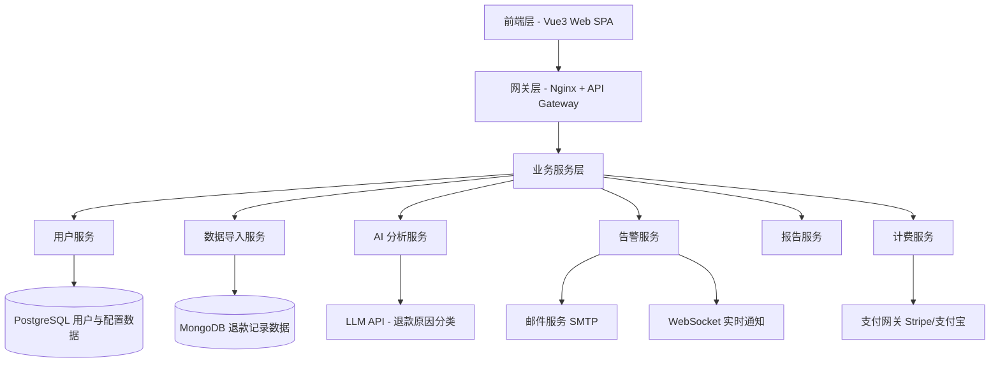

## 2.2 业务模块图

```mermaid
flowchart TD
    Core[退款分析与预警助手] --> M1[数据导入模块]
    Core --> M2[AI 退款原因分析模块]
    Core --> M3[版本退款率监控模块]
    Core --> M4[退款洞察报告模块]
    Core --> M5[数据看板模块]
    Core --> M6[应用管理模块]
    Core --> M7[用户与权限管理模块]
    Core --> M8[套餐与计费模块]

    M1 --> M1a[CSV 上传]
    M1 --> M1b[数据解析与校验]
    M1 --> M1c[平台格式适配]
    M1 --> M1d[导入历史管理]

    M2 --> M2a[退款原因自动分类]
    M2 --> M2b[批量/增量分析]
    M2 --> M2c[分类结果管理]

    M3 --> M3a[版本关联]
    M3 --> M3b[退款率计算]
    M3 --> M3c[告警配置与触发]
    M3 --> M3d[告警处理]

    M4 --> M4a[报告生成]
    M4 --> M4b[报告导出]
    M4 --> M4c[报告管理]

    M5 --> M5a[概览面板]
    M5 --> M5b[退款原因分析图表]
    M5 --> M5c[版本分析图表]
    M5 --> M5d[筛选查询]

    M6 --> M6a[应用配置]
    M6 --> M6b[应用列表与切换]

    M7 --> M7a[注册与登录]
    M7 --> M7b[个人信息]
    M7 --> M7c[团队协作]

    M8 --> M8a[套餐展示与对比]
    M8 --> M8b[订阅管理]
    M8 --> M8c[支付记录]
    M8 --> M8d[套餐限制]
```

## 2.3 主业务流程

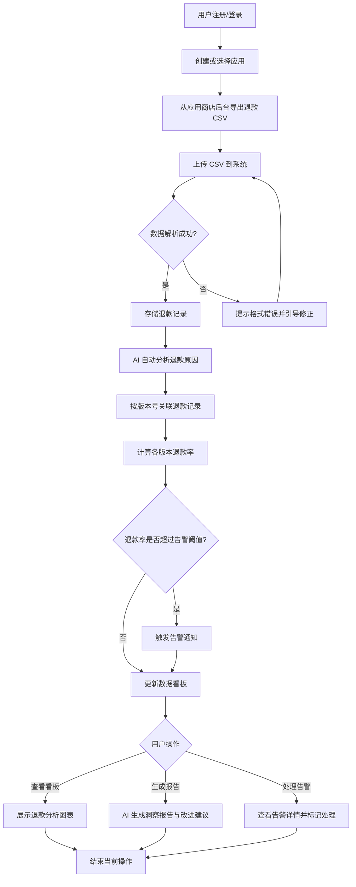

## 2.4 功能图/列表

| 功能模块 | 功能名称 | 优先级 | 功能描述 |
| --- | --- | --- | --- |
| 数据导入 | CSV 文件上传（单文件/批量） | P0 | 支持拖拽上传，最多 10 个文件同时上传 |
| 数据导入 | 数据解析与校验 | P0 | 自动识别编码与分隔符，字段映射，校验数据完整性 |
| 数据导入 | 平台格式适配 | P0 | 支持 App Store / Google Play / Steam 三种 CSV 格式 |
| 数据导入 | 导入历史管理 | P1 | 展示历史记录，支持查看详情和删除 |
| AI 分析 | 退款原因自动分类 | P0 | AI 将退款原因分为 6 大类，置信度评分 |
| AI 分析 | 批量/增量分析 | P0 | 支持全量分析和仅新数据增量分析 |
| AI 分析 | 分类结果管理 | P1 | 人工修正分类、添加自定义分类 |
| AI 分析 | 分类统计与趋势 | P1 | 饼图/柱状图展示分布，按周/月查看趋势 |
| 版本监控 | 版本自动/手动关联 | P0 | 根据版本号自动关联退款记录 |
| 版本监控 | 退款率计算与历史对比 | P0 | 计算版本退款率并与历史均值对比 |
| 版本监控 | 告警配置 | P0 | 设置阈值、通知方式、接收人 |
| 版本监控 | 告警触发与处理 | P0 | 自动检测、记录告警、标记处理状态 |
| 洞察报告 | 自动生成/手动生成 | P1 | 定期自动生成或手动指定时间段生成 |
| 洞察报告 | 报告导出 | P1 | PDF / Markdown 导出，邮件发送 |
| 洞察报告 | 报告管理 | P2 | 历史报告列表与删除 |
| 数据看板 | 概览面板 | P0 | 关键指标卡片 + 趋势图表 |
| 数据看板 | 退款原因/版本分析图表 | P0 | 饼图、柱状图、表格多维度展示 |
| 数据看板 | 筛选查询 | P0 | 时间/版本/原因多维度筛选 |
| 应用管理 | 应用增删改 | P0 | 配置应用基本信息，免费版限 1 个 |
| 应用管理 | 应用列表与切换 | P0 | 多应用快速切换 |
| 用户管理 | 注册与登录 | P0 | 邮箱注册、GitHub/Google 第三方登录 |
| 用户管理 | 个人信息管理 | P1 | 查看信息、修改密码 |
| 用户管理 | 团队协作 | P1 | 邀请成员、角色管理、权限控制（专业版） |
| 套餐计费 | 套餐展示与对比 | P0 | 免费版 vs 专业版功能对比 |
| 套餐计费 | 订阅升级/降级/续费 | P0 | 在线支付，自动续费 |
| 套餐计费 | 支付记录与发票 | P2 | 历史支付记录，电子发票申请 |
| 套餐计费 | 套餐限制 | P0 | 免费版 100 条/月、1 个应用等限制 |

## 2.5 你的产品有哪些端

| 序号 | 端名称 | 端类型 | 目标用户 | 说明 |
| --- | --- | --- | --- | --- |
| 1 | 退款分析助手 Web 应用 | WEB端 | 独立开发者、小团队负责人、应用运营者 | 主交互界面，包含数据导入、分析看板、报表导出、告警管理、应用管理、套餐管理等全部功能 |

---

# 3 产品功能

## 3.1 WEB 端功能

### 3.1.1 CSV 文件上传

**功能描述：** 用户在数据导入页面通过拖拽或点击方式上传 CSV 文件。系统支持单文件上传和批量上传（最多 10 个文件同时上传）。上传后系统自动开始解析流程。

| 项 | 内容 |
| --- | --- |
| 优先级 | P0 |
| 依赖需求 | 无 |
| 前置条件 | 用户已登录并选择目标应用 |

**详细流程：**

```mermaid
flowchart TD
    A[用户进入数据导入页面] --> B[点击上传区域或拖拽文件]
    B --> C{文件数量 ≤ 10?}
    C -->|否| D[提示"最多同时上传10个文件"]
    C -->|是| E{文件格式为 .csv?}
    E -->|否| F[提示"仅支持CSV格式文件"]
    E -->|是| G[显示上传进度条]
    G --> H[文件上传完成]
    H --> I[自动进入数据解析流程]
    I --> J[展示解析结果：成功条数/失败条数]
```

**业务规则：**
1. 单个 CSV 文件大小不超过 50MB
2. 同时上传文件数量上限为 10 个
3. 仅接受 .csv 扩展名的文件，其他格式拒绝上传
4. 上传进度以进度条形式展示，支持取消上传
5. 重复上传同一文件（文件名+内容哈希相同）时提示"该文件已导入过"

**验收标准：**
- [ ] 正常流程：拖拽 1 个 CSV 文件到上传区域，文件成功上传并自动进入解析
- [ ] 批量上传：拖拽 5 个 CSV 文件，全部显示上传进度并依次解析
- [ ] 异常流程：上传 .xlsx 文件，提示"仅支持CSV格式文件"
- [ ] 超限流程：拖拽 12 个文件，提示"最多同时上传10个文件"
- [ ] 重复检测：上传已导入过的文件，提示"该文件已导入过，是否继续？"

---

### 3.1.2 数据解析与校验

**功能描述：** 系统对上传的 CSV 文件进行编码识别、分隔符检测、字段映射和数据完整性校验，将数据转换为系统标准格式后存储。

| 项 | 内容 |
| --- | --- |
| 优先级 | P0 |
| 依赖需求 | CSV 文件上传 |
| 前置条件 | CSV 文件已成功上传 |

**详细流程：**

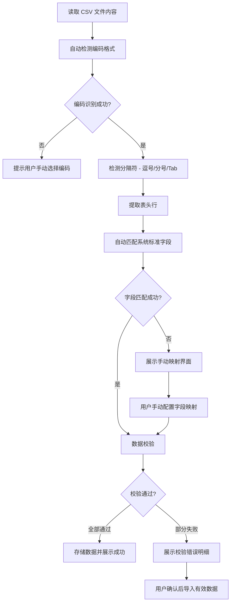

**业务规则：**
1. 支持 UTF-8、GBK、GB2312、Latin-1 四种编码格式自动识别
2. 系统标准字段包括：退款时间、退款金额、退款原因/备注、订单号、应用版本号、用户邮箱（可选）
3. 必填字段缺失时该行标记为错误，不影响其他行导入
4. 字段映射支持手动调整，调整后的映射关系保存为该平台的默认映射模板
5. 1000 条记录解析时间 < 10 秒

**验收标准：**
- [ ] 正常流程：上传标准 App Store 格式 CSV，自动识别编码和字段，10 秒内完成解析
- [ ] 编码异常：上传 GBK 编码文件，系统自动识别为 GBK 并正确解析中文
- [ ] 字段映射：上传自定义格式 CSV，自动匹配部分字段，未匹配字段展示手动映射界面
- [ ] 数据校验：部分行缺少必填字段，该行标红并提示缺失字段，有效行正常导入

---

### 3.1.3 平台格式适配

**功能描述：** 系统内置 App Store、Google Play、Steam 三大平台的退款 CSV 标准模板，上传时自动识别平台类型并使用对应的字段映射规则。

| 项 | 内容 |
| --- | --- |
| 优先级 | P0 |
| 依赖需求 | 数据解析与校验 |
| 前置条件 | 无 |

**详细流程：**

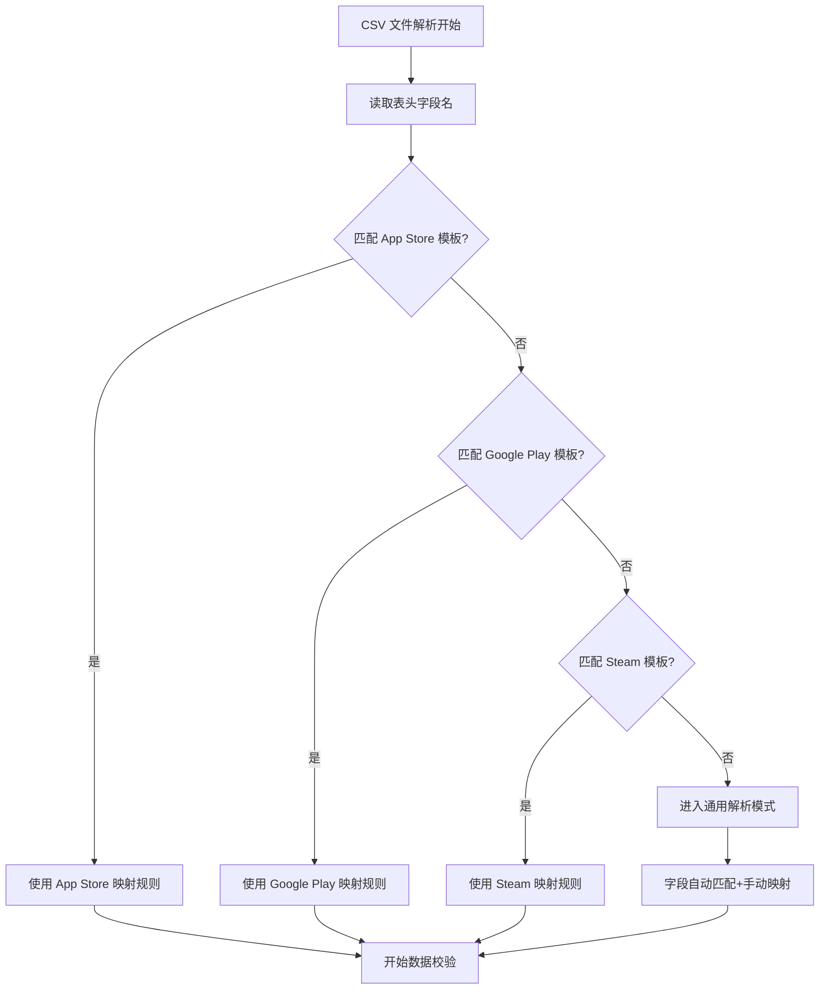

**业务规则：**
1. App Store 模板关键字段：Date、Quantity、Product ID、Order Number、Apple Identifier
2. Google Play 模板关键字段：Transaction Date、Merchant Order Number、Product Title、Type
3. Steam 模板关键字段：Transaction ID、Item Description、Transaction Type、Steam Purchase Date
4. 平台识别优先级：精确匹配表头 > 模糊匹配 > 通用模式
5. 用户可在导入时手动指定平台类型，覆盖自动识别结果

**验收标准：**
- [ ] 正常流程：上传 App Store 标准格式 CSV，自动识别为 App Store 平台并正确映射
- [ ] 模糊匹配：上传 Google Play 格式但表头有细微差异，仍能正确识别
- [ ] 通用模式：上传非三大平台格式的 CSV，进入通用解析并允许手动映射
- [ ] 手动覆盖：自动识别为 App Store，但用户手动改为 Google Play，系统使用 Google Play 映射

---

### 3.1.4 导入历史管理

**功能描述：** 展示用户所有历史导入记录，包含导入时间、文件名称、记录数量、来源平台、处理状态，支持查看详情和删除操作。

| 项 | 内容 |
| --- | --- |
| 优先级 | P1 |
| 依赖需求 | CSV 文件上传、数据解析 |
| 前置条件 | 至少有一条导入记录 |

**详细流程：**

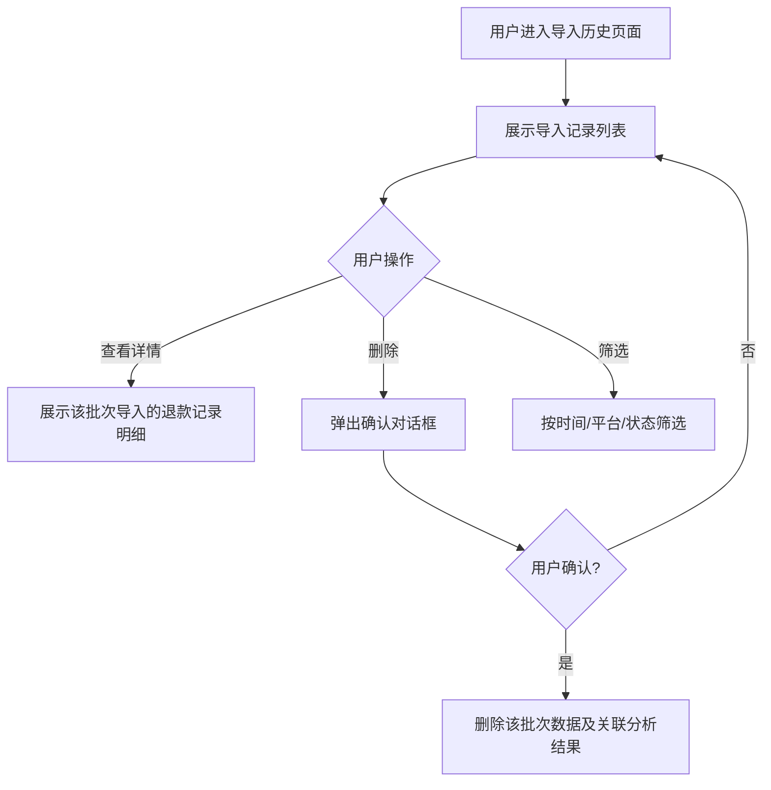

**业务规则：**
1. 列表按导入时间倒序排列，每页显示 20 条
2. 删除操作需二次确认，删除后数据不可恢复
3. 删除已关联分析结果的数据时，同步删除对应的 AI 分类结果和版本关联数据
4. 支持按导入时间、平台来源、处理状态筛选

**验收标准：**
- [ ] 正常流程：进入导入历史页，展示所有导入记录，包含时间、文件名、记录数
- [ ] 查看详情：点击某条记录，展开该批次的退款记录明细列表
- [ ] 删除操作：点击删除，弹出确认框，确认后数据被删除且列表刷新
- [ ] 筛选：按时间范围筛选，列表仅显示范围内的记录

---

### 3.1.5 AI 退款原因自动分类

**功能描述：** 系统调用 LLM API 对每条退款记录的备注/原因文本进行智能分析，自动归类为「功能缺失、体验差、误购、价格异议、技术故障、其他」六大类别，并给出置信度评分。

| 项 | 内容 |
| --- | --- |
| 优先级 | P0 |
| 依赖需求 | 数据解析与校验 |
| 前置条件 | 退款数据已成功导入 |

**详细流程：**

```mermaid
flowchart TD
    A[触发分析任务] --> B[提取退款记录文本]
    B --> C[构造 Prompt 发送给 LLM]
    C --> D[LLM 返回分类结果+置信度]
    D --> E{置信度 ≥ 70%?}
    E -->|是| F[标记为"已分析"]
    E -->|否| G[标记为"待人工审核"]
    F --> H[更新记录分类字段]
    G --> H
    H --> I[更新分类统计图表]
```

**业务规则：**
1. 六大分类：功能缺失、体验差、误购、价格异议、技术故障、其他
2. 置信度 ≥ 70% 自动确认，< 70% 标记为待人工审核
3. 100 条记录分析时间 < 30 秒
4. 支持断点续传，分析中断后可从上次位置继续
5. 分类结果可被用户手动修正，修正后的结果纳入后续模型优化参考

**验收标准：**
- [ ] 正常流程：导入 50 条退款数据，触发 AI 分析，30 秒内全部完成分类
- [ ] 置信度：每条记录显示分类结果和置信度评分
- [ ] 低置信度：置信度 < 70% 的记录标记为"待人工审核"状态
- [ ] 断点续传：分析过程中网络中断，恢复后从断点继续

---

### 3.1.6 批量与增量分析

**功能描述：** 用户可选择对所有已导入数据执行全量分析，或仅对新导入且未分析的数据执行增量分析。

| 项 | 内容 |
| --- | --- |
| 优先级 | P0 |
| 依赖需求 | AI 退款原因自动分类 |
| 前置条件 | 有已导入的退款数据 |

**详细流程：**

```mermaid
flowchart TD
    A[用户选择分析模式] --> B{分析模式}
    B -->|全量分析| C[选取所有已导入数据]
    B -->|增量分析| D[仅选取状态为"已导入-未分析"的记录]
    C --> E[批量调用 AI 分类]
    D --> E
    E --> F[展示分析进度]
    F --> G{全部完成?}
    G -->|是| H[更新所有记录状态]
    G -->|否 - 中断| I[记录断点位置]
    I --> J[下次从断点继续]
```

**业务规则：**
1. 全量分析覆盖所有记录，已分析的记录也会重新分析
2. 增量分析仅处理状态为"已导入-未分析"的记录
3. 分析过程中展示进度条（已分析/总数）
4. 支持暂停和恢复

**验收标准：**
- [ ] 全量分析：选择全量分析，所有记录重新分析并更新分类结果
- [ ] 增量分析：新导入 20 条数据，增量分析仅处理这 20 条
- [ ] 暂停恢复：分析到 50% 时暂停，恢复后从 50% 继续

---

### 3.1.7 分类结果管理

**功能描述：** 用户可查看 AI 分类结果，手动修正不准确的分类，添加自定义退款原因分类。

| 项 | 内容 |
| --- | --- |
| 优先级 | P1 |
| 依赖需求 | AI 退款原因自动分类 |
| 前置条件 | 已有 AI 分类结果 |

**详细流程：**

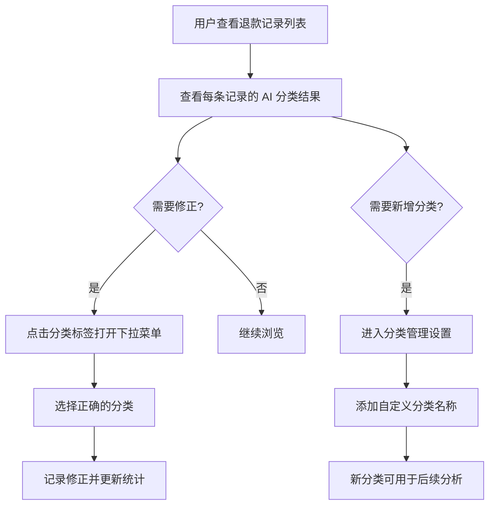

**业务规则：**
1. 默认六大分类（功能缺失、体验差、误购、价格异议、技术故障、其他）不可删除
2. 用户可添加自定义分类，自定义分类最多 20 个
3. 修正后的分类立即更新到统计图表中
4. 分类标签支持颜色区分，不同分类使用不同颜色标识

**验收标准：**
- [ ] 查看分类：每条退款记录旁显示 AI 分类标签和置信度
- [ ] 手动修正：点击分类标签切换为其他分类，统计图表同步更新
- [ ] 自定义分类：在设置中添加"内容质量差"分类，后续分析中可选该分类

---

### 3.1.8 分类统计与趋势

**功能描述：** 以可视化图表展示各退款原因的分布情况和变化趋势，支持饼图、柱状图以及按周/月的时间维度切换。

| 项 | 内容 |
| --- | --- |
| 优先级 | P1 |
| 依赖需求 | AI 退款原因自动分类 |
| 前置条件 | 已有 AI 分类结果 |

**详细流程：**

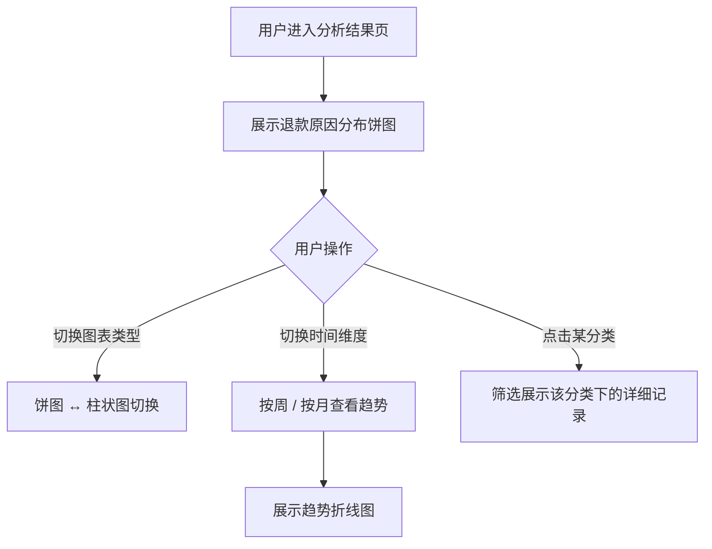

**业务规则：**
1. 饼图展示各退款原因的占比分布
2. 柱状图展示各退款原因的数量对比
3. 趋势图以折线图展示，横轴为时间（周/月），纵轴为数量
4. 点击饼图/柱状图某分类可筛选出该分类下的退款记录列表

**验收标准：**
- [ ] 分布展示：饼图正确显示六大分类的数量和占比
- [ ] 图表切换：切换为柱状图，数据一致，展示形式不同
- [ ] 趋势分析：切换到按周查看，折线图展示每周各分类的变化
- [ ] 下钻查看：点击"技术故障"分类，列表仅显示技术故障类的退款记录

---

### 3.1.9 版本关联

**功能描述：** 系统根据退款记录中的应用版本号字段，自动将退款记录关联到对应的应用版本。无法自动关联的记录支持手动指定版本。

| 项 | 内容 |
| --- | --- |
| 优先级 | P0 |
| 依赖需求 | 数据解析与校验 |
| 前置条件 | 退款数据已导入且包含版本号字段 |

**详细流程：**

```mermaid
flowchart TD
    A[退款数据导入完成] --> B[提取版本号字段]
    B --> C[按语义化版本号规则匹配]
    C --> D{匹配成功?}
    D -->|是| E[自动关联到对应版本]
    D -->|否| F[标记为"未关联版本"]
    F --> G[用户手动指定版本]
    E --> H[更新版本退款统计]
    G --> H
```

**业务规则：**
1. 支持语义化版本号格式（如 1.0.0、2.1.3-beta）
2. 版本号字段为空或格式不匹配的记录标记为"未关联"
3. 手动关联时展示应用已有版本列表供选择
4. 关联结果实时反映到版本退款率计算中

**验收标准：**
- [ ] 自动关联：导入含版本号字段的 CSV，记录自动关联到对应版本
- [ ] 未关联处理：版本号为空的记录显示"未关联"标签，支持手动指定
- [ ] 实时更新：手动关联后，版本退款率立即重新计算

---

### 3.1.10 退款率计算与历史对比

**功能描述：** 系统计算每个应用版本的退款率（退款数/下载数或活跃用户数），并与历史版本均值进行对比，展示差异。

| 项 | 内容 |
| --- | --- |
| 优先级 | P0 |
| 依赖需求 | 版本关联 |
| 前置条件 | 退款记录已关联版本，用户已配置下载数/活跃用户数据来源 |

**详细流程：**

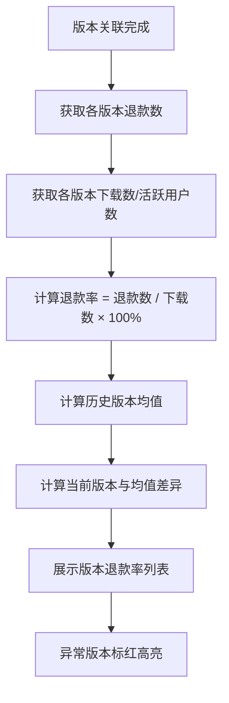

**业务规则：**
1. 退款率 = 退款数 / 下载数 × 100%（也可选择 活跃用户数 作为分母）
2. 下载数/活跃用户数来源：用户手动输入 CSV，或配置应用商店 API 自动获取
3. 历史均值 = 最近 5 个版本的退款率平均值
4. 当前版本退款率超过历史均值 50% 以上时，标红高亮

**验收标准：**
- [ ] 正常计算：3 个版本分别有 10/20/5 笔退款，下载数均为 1000，退款率分别为 1%/2%/0.5%
- [ ] 历史对比：新版本退款率 5%，历史均值 2%，差异显示 +150% 并标红
- [ ] 分母切换：从"下载数"切换到"活跃用户数"，退款率重新计算

---

### 3.1.11 告警配置

**功能描述：** 用户可设置退款率告警阈值、通知方式（邮件/站内通知）和接收人列表。

| 项 | 内容 |
| --- | --- |
| 优先级 | P0 |
| 依赖需求 | 退款率计算 |
| 前置条件 | 至少有一个应用已配置版本数据 |

**详细流程：**

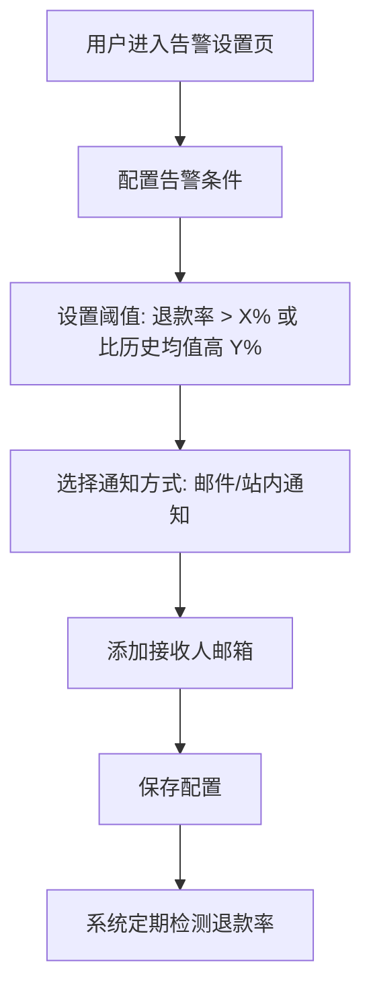

**业务规则：**
1. 支持两种告警条件：绝对值阈值（退款率 > X%）和相对值阈值（比历史均值高 Y%）
2. 两种条件可组合使用（AND / OR 关系）
3. 通知方式支持邮件和站内通知，可多选
4. 接收人支持团队成员邮箱，专业版可添加多人
5. 检测频率可配置：每小时 / 每天

**验收标准：**
- [ ] 条件设置：设置"退款率 > 5% OR 比历史均值高 50%"，配置成功保存
- [ ] 通知方式：同时选择邮件和站内通知，两种方式都能收到告警
- [ ] 检测频率：设置为每小时检测，系统在每小时整点执行检测

---

### 3.1.12 告警触发与处理

**功能描述：** 系统定期检测版本退款率，触发告警时自动发送通知并创建告警记录。用户可标记告警处理状态并填写处理说明。

| 项 | 内容 |
| --- | --- |
| 优先级 | P0 |
| 依赖需求 | 告警配置 |
| 前置条件 | 已配置告警规则 |

**详细流程：**

```mermaid
flowchart TD
    A[定时任务触发检测] --> B[查询各版本退款率]
    B --> C{满足告警条件?}
    C -->|否| D[不处理]
    C -->|是| E[创建告警记录]
    E --> F[发送通知邮件/站内消息]
    F --> G[用户在告警列表查看]
    G --> H{用户处理}
    H -->|标记已处理| I[填写处理说明]
    H -->|标记已忽略| J[填写忽略原因]
    I --> K[告警状态更新为"已处理"]
    J --> L[告警状态更新为"已忽略"]
```

**业务规则：**
1. 告警状态流转：待处理 → 处理中 → 已处理 / 已忽略
2. 同一版本同一告警条件 24 小时内不重复触发
3. 告警记录包含：告警时间、应用名称、版本号、当前退款率、阈值、处理状态
4. 系统基于退款原因分析结果自动生成处理建议（如"该版本主要退款原因为技术故障，建议检查崩溃日志"）

**验收标准：**
- [ ] 正常触发：版本退款率超过阈值，告警记录被创建，邮件通知发送成功
- [ ] 去重：同一版本同条件 24 小时内仅触发一次告警
- [ ] 处理标记：将告警标记为"已处理"并填写说明，状态更新成功
- [ ] 处理建议：告警详情中显示基于退款原因的处理建议

---

### 3.1.13 退款洞察报告生成

**功能描述：** 系统支持自动定期（每周/每月）生成退款洞察报告，也支持用户手动选择时间段生成。报告包含概览数据、版本分析、退款原因分析和 AI 改进建议。

| 项 | 内容 |
| --- | --- |
| 优先级 | P1 |
| 依赖需求 | AI 分析、版本监控 |
| 前置条件 | 已有退款数据和分析结果 |

**详细流程：**

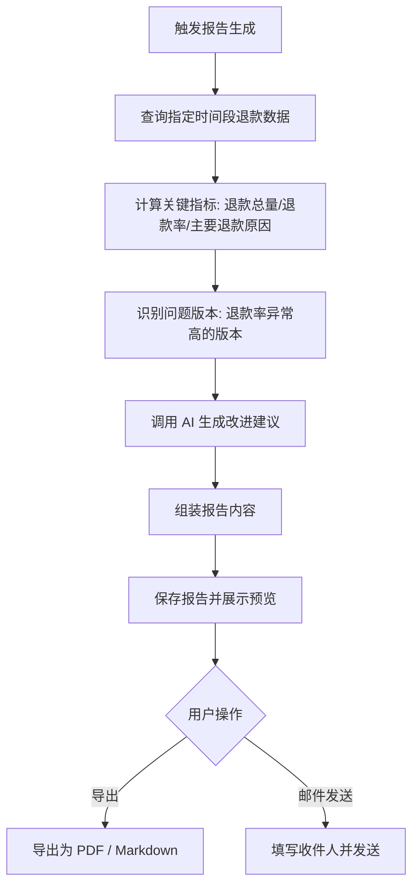

**业务规则：**
1. 报告包含四个部分：概览数据（同比/环比）、版本分析（异常版本高亮）、退款原因分布、AI 改进建议（按优先级排序）
2. 自动生成频率可选：每周（周一凌晨）/ 每月（1 号凌晨）
3. 手动生成支持自定义时间范围
4. 报告生成时间 < 5 秒
5. 改进建议最多 10 条，按影响面排序

**验收标准：**
- [ ] 手动生成：选择"近 30 天"生成报告，5 秒内展示报告预览
- [ ] 自动生成：设置为每周一自动生成，周一上午可看到新生成的报告
- [ ] 内容完整：报告包含概览、版本分析、原因分布、改进建议四个部分
- [ ] 改进建议：AI 生成的建议按优先级排序，可操作且具体

---

### 3.1.14 报告导出与发送

**功能描述：** 用户可将生成的报告导出为 PDF 或 Markdown 格式，也可通过邮件发送给指定接收人。

| 项 | 内容 |
| --- | --- |
| 优先级 | P1 |
| 依赖需求 | 退款洞察报告生成 |
| 前置条件 | 已有生成的报告 |

**详细流程：**

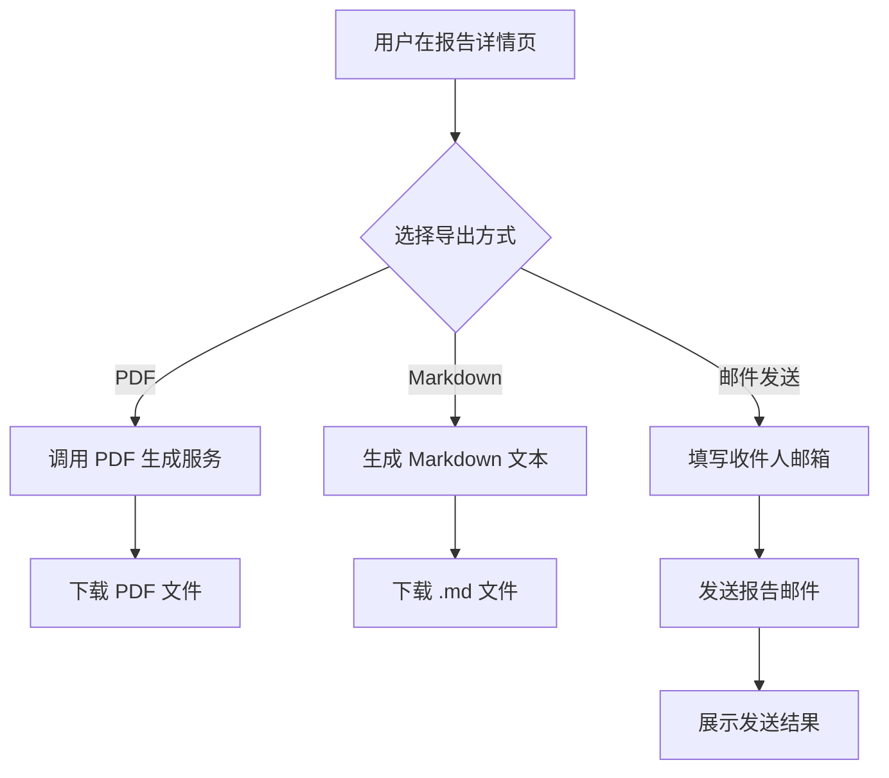

**业务规则：**
1. PDF 导出支持自定义页眉页脚（应用名称、报告时间范围）
2. Markdown 格式包含完整图表描述和表格
3. 邮件发送支持添加多个收件人
4. 免费版用户不支持导出和邮件发送功能（仅专业版可用）

**验收标准：**
- [ ] PDF 导出：点击导出 PDF，成功下载包含图表的 PDF 文件
- [ ] Markdown 导出：点击导出 Markdown，下载的 .md 文件在编辑器中正常渲染
- [ ] 邮件发送：填写收件人邮箱后发送，收件人成功收到报告邮件
- [ ] 免费版限制：免费版用户点击导出按钮时，提示"请升级到专业版"

---

### 3.1.15 报告管理

**功能描述：** 展示历史生成的报告列表，支持按时间筛选和删除操作。

| 项 | 内容 |
| --- | --- |
| 优先级 | P2 |
| 依赖需求 | 退款洞察报告生成 |
| 前置条件 | 至少有一份报告 |

**业务规则：**
1. 列表按生成时间倒序，每页 20 条
2. 支持按时间范围筛选
3. 删除前需二次确认

**验收标准：**
- [ ] 列表展示：显示所有历史报告，包含生成时间、时间范围、应用名称
- [ ] 筛选：按时间筛选后仅展示范围内的报告
- [ ] 删除：删除报告后从列表中移除

---

### 3.1.16 数据看板 - 概览面板

**功能描述：** 系统首页展示退款分析的核心指标卡片和趋势图表，帮助用户快速掌握整体退款情况。

| 项 | 内容 |
| --- | --- |
| 优先级 | P0 |
| 依赖需求 | AI 分析、版本监控 |
| 前置条件 | 有已导入和分析的退款数据 |

**详细流程：**

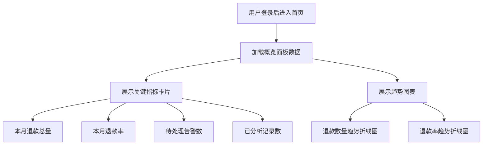

**业务规则：**
1. 关键指标卡片展示 4 个数据：本月退款总量、本月退款率、待处理告警数、已分析记录数
2. 指标支持同比/环比显示（如"较上月 +12%"）
3. 趋势图表默认展示近 30 天数据，支持切换为 7 天 / 90 天
4. 趋势图表支持按日 / 周 / 月粒度切换
5. 无数据时展示空状态引导图

**验收标准：**
- [ ] 指标展示：首页展示 4 个关键指标卡片，数据正确
- [ ] 同比环比：本月退款率 3.2%，上月 2.8%，卡片显示"较上月 +14.3%"
- [ ] 趋势图：近 30 天退款趋势折线图正确展示
- [ ] 空状态：新用户无数据时展示引导页面

---

### 3.1.17 数据看板 - 退款原因分析图表

**功能描述：** 以可视化图表展示退款原因的分布和趋势，支持点击下钻查看详细记录。

| 项 | 内容 |
| --- | --- |
| 优先级 | P0 |
| 依赖需求 | AI 退款原因自动分类 |
| 前置条件 | 已有 AI 分类结果 |

**业务规则：**
1. 饼图展示各退款原因占比
2. 柱状图展示各退款原因数量对比
3. 趋势折线图展示各原因随时间变化，支持多原因叠加对比
4. 点击图表中的分类色块可筛选对应退款记录

**验收标准：**
- [ ] 分布展示：饼图正确展示六大分类占比
- [ ] 趋势对比：选择"功能缺失"和"技术故障"两个分类叠加对比
- [ ] 下钻：点击"误购"分类，跳转到退款记录列表并自动筛选为误购类

---

### 3.1.18 数据看板 - 版本分析图表

**功能描述：** 以表格和图表展示各应用版本的退款率对比，支持查看版本详情。

| 项 | 内容 |
| --- | --- |
| 优先级 | P0 |
| 依赖需求 | 版本关联、退款率计算 |
| 前置条件 | 退款记录已关联版本 |

**业务规则：**
1. 表格展示：版本号、退款数、退款率、与历史均值差异、状态
2. 支持按退款率升序/降序排列
3. 异常版本（退款率超过阈值）标红高亮
4. 点击版本号跳转到该版本的退款详情页面

**验收标准：**
- [ ] 表格展示：显示所有版本的退款率数据，按退款率排序
- [ ] 异常高亮：退款率超过阈值的版本行标红
- [ ] 版本详情：点击版本号，展示该版本的退款记录列表和退款原因分布

---

### 3.1.19 数据看板 - 筛选查询

**功能描述：** 支持按时间范围、应用版本、退款原因多维度筛选数据看板和退款记录。

| 项 | 内容 |
| --- | --- |
| 优先级 | P0 |
| 依赖需求 | 数据看板 |
| 前置条件 | 有退款数据 |

**业务规则：**
1. 时间筛选：快捷选项（近 7 天 / 30 天 / 90 天）+ 自定义时间范围
2. 版本筛选：下拉多选，支持"全部版本"
3. 原因筛选：下拉多选，支持"全部原因"
4. 筛选条件组合后实时刷新看板数据和图表

**验收标准：**
- [ ] 时间筛选：选择"近 7 天"，看板和图表数据刷新为近 7 天
- [ ] 版本筛选：选择 v1.0 和 v2.0，仅展示这两个版本的退款数据
- [ ] 组合筛选：时间 + 版本 + 原因同时筛选，结果正确

---

### 3.1.20 应用管理

**功能描述：** 用户可添加、编辑、删除应用，配置应用基本信息（名称、平台、Bundle ID 等），并在多应用之间快速切换。

| 项 | 内容 |
| --- | --- |
| 优先级 | P0 |
| 依赖需求 | 用户登录 |
| 前置条件 | 用户已登录 |

**详细流程：**

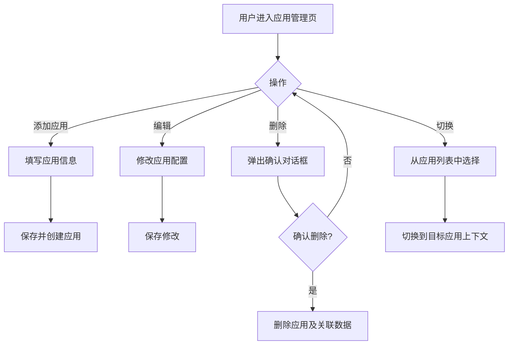

**业务规则：**
1. 应用基本信息：应用名称（必填）、平台（App Store/Google Play/Steam，必填）、Bundle ID（必填）、图标（可选）
2. 免费版仅支持 1 个应用，添加第二个时提示升级
3. 删除应用时同步删除关联的退款数据、分析结果、告警记录
4. 顶部导航栏显示当前应用名称，点击可快速切换

**验收标准：**
- [ ] 添加应用：填写应用信息后保存成功，出现在应用列表中
- [ ] 免费版限制：免费版添加第 2 个应用时提示"请升级到专业版"
- [ ] 删除应用：删除应用后，关联的退款数据和分析结果一并删除
- [ ] 快速切换：顶部导航栏点击应用名，下拉展示应用列表，切换后看板数据刷新

---

### 3.1.21 用户注册与登录

**功能描述：** 支持邮箱注册、邮箱+密码登录、GitHub/Google 第三方登录。

| 项 | 内容 |
| --- | --- |
| 优先级 | P0 |
| 依赖需求 | 无 |
| 前置条件 | 无 |

**详细流程：**

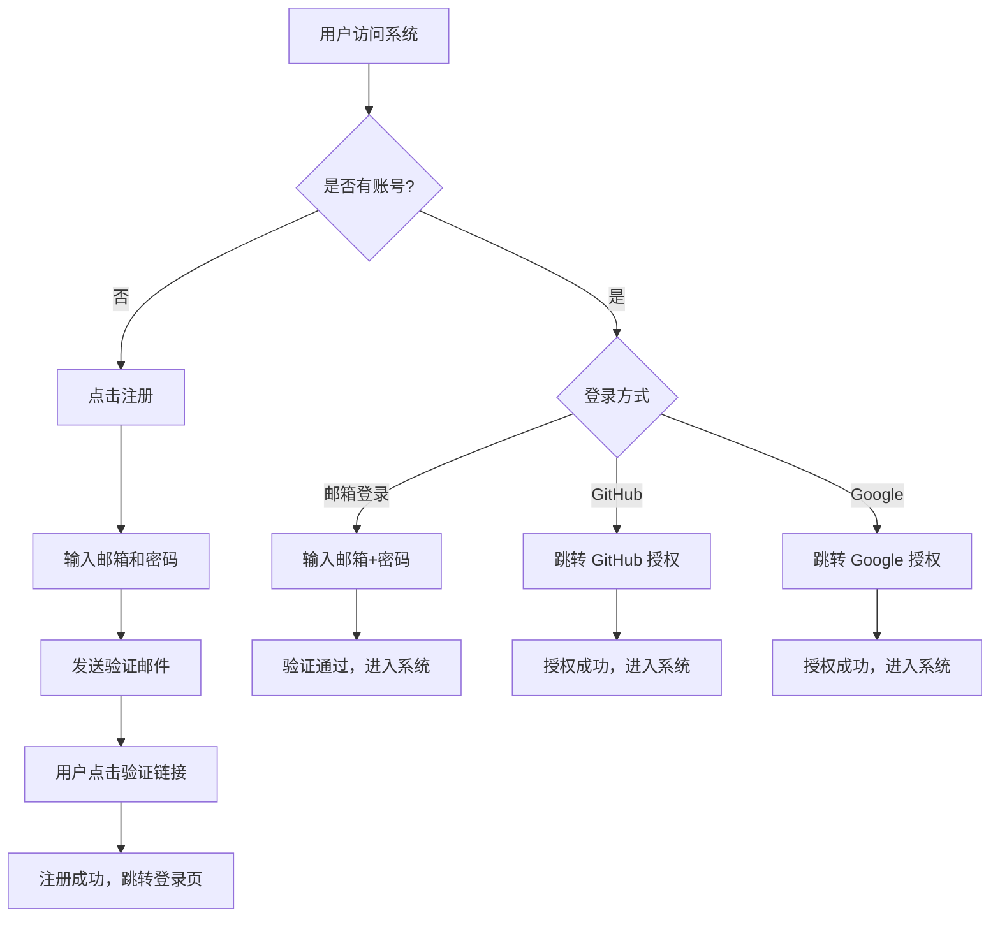

**业务规则：**
1. 邮箱注册需通过验证邮件确认
2. 密码要求：8 位以上，包含字母和数字
3. 第三方登录首次使用时自动创建账号并绑定
4. 支持"记住登录状态"选项，有效期 30 天
5. 连续 5 次密码错误锁定账号 15 分钟

**验收标准：**
- [ ] 邮箱注册：输入邮箱和密码，收到验证邮件，点击链接完成注册
- [ ] 邮箱登录：输入正确的邮箱和密码，成功进入系统
- [ ] 第三方登录：点击 GitHub 登录，授权后自动创建账号并进入系统
- [ ] 安全锁定：连续 5 次密码错误，账号锁定 15 分钟

---

### 3.1.22 个人信息管理

**功能描述：** 用户可查看和修改个人信息，包括邮箱、套餐类型、修改密码。

| 项 | 内容 |
| --- | --- |
| 优先级 | P1 |
| 依赖需求 | 用户注册与登录 |
| 前置条件 | 用户已登录 |

**业务规则：**
1. 展示信息：邮箱、注册时间、当前套餐类型、套餐到期时间
2. 修改密码需验证原密码
3. 邮箱暂不支持修改（后续版本支持）

**验收标准：**
- [ ] 信息展示：个人中心页面正确展示邮箱、注册时间、套餐信息
- [ ] 修改密码：输入原密码和新密码，修改成功后需重新登录

---

### 3.1.23 团队协作

**功能描述：** 专业版用户可邀请团队成员、管理成员角色和权限。

| 项 | 内容 |
| --- | --- |
| 优先级 | P1 |
| 依赖需求 | 用户注册与登录 |
| 前置条件 | 用户为专业版且为团队管理员角色 |

**详细流程：**

```mermaid
flowchart TD
    A[管理员进入团队管理页] --> B{操作}
    B -->|邀请成员| C[输入成员邮箱]
    C --> D[发送邀请邮件]
    D --> E[被邀请人点击链接注册/登录]
    E --> F[成员加入团队]
    B -->|修改角色| G[选择成员并修改角色]
    B -->|移除成员| H[确认移除]
    H --> I[成员从团队中移除]
```

**业务规则：**
1. 角色分为：管理员（可管理应用和成员）、普通成员（仅查看和操作数据）
2. 免费版不支持团队协作功能
3. 专业版最多邀请 5 名团队成员
4. 邀请邮件包含注册/登录链接

**验收标准：**
- [ ] 邀请成员：输入邮箱发送邀请，被邀请人点击链接后成功加入团队
- [ ] 角色管理：将成员从"普通成员"改为"管理员"，权限立即生效
- [ ] 移除成员：移除成员后，该成员无法再访问团队数据
- [ ] 免费版限制：免费版用户点击"邀请成员"时提示升级

---

### 3.1.24 套餐展示与对比

**功能描述：** 展示免费版和专业版的功能对比，以及当前使用量信息。

| 项 | 内容 |
| --- | --- |
| 优先级 | P0 |
| 依赖需求 | 用户登录 |
| 前置条件 | 用户已登录 |

**业务规则：**
1. 套餐对比表展示以下维度：退款分析条数（免费 100 条/月 vs 专业版无限）、应用数量（免费 1 个 vs 专业版无限）、版本关联分析（免费不支持 vs 专业版支持）、团队协作（免费不支持 vs 专业版 5 人）、报告导出（免费不支持 vs 专业版支持）、告警通知（免费站内 vs 专业版邮件+站内）
2. 免费版显示本月剩余可分析条数
3. 价格展示：专业版 ¥29/月 或 ¥288/年（8折）

**验收标准：**
- [ ] 对比展示：正确展示免费版和专业版的功能对比表格
- [ ] 使用量：免费版用户看到"本月剩余 67/100 条"
- [ ] 价格展示：显示月付和年付两种价格选项

---

### 3.1.25 订阅管理

**功能描述：** 用户可升级、降级、续费套餐，支持在线支付和自动续费。

| 项 | 内容 |
| --- | --- |
| 优先级 | P0 |
| 依赖需求 | 套餐展示 |
| 前置条件 | 用户已登录 |

**详细流程：**

```mermaid
flowchart TD
    A[用户进入套餐页面] --> B{操作}
    B -->|升级| C[选择专业版方案]
    C --> D[选择支付方式]
    D --> E[跳转支付网关]
    E --> F{支付成功?}
    F -->|是| G[套餐立即升级]
    F -->|否| H[提示支付失败]
    B -->|降级| I[确认降级操作]
    I --> J[次月生效为免费版]
    B -->|续费| K[选择续费方案]
    K --> L[跳转支付网关]
```

**业务规则：**
1. 升级立即生效，按剩余天数补差价
2. 降级次月生效，当月仍享受专业版功能
3. 支持自动续费开关，开启后每月自动扣款
4. 支付方式支持支付宝、微信支付（国内）、Stripe（海外）

**验收标准：**
- [ ] 升级：从免费版升级到专业版，支付成功后立即生效
- [ ] 降级：从专业版降级到免费版，确认次月生效
- [ ] 续费：手动续费成功，套餐有效期延长一个月
- [ ] 自动续费：开启自动续费后，到期日自动扣款成功

---

### 3.1.26 支付记录与发票

**功能描述：** 展示用户的历史支付记录，支持申请电子发票。

| 项 | 内容 |
| --- | --- |
| 优先级 | P2 |
| 依赖需求 | 订阅管理 |
| 前置条件 | 有支付记录 |

**业务规则：**
1. 支付记录包含：时间、金额、套餐类型、支付方式、状态
2. 支持申请电子发票（增值税普通发票）
3. 发票申请后 3 个工作日内发送到邮箱

**验收标准：**
- [ ] 记录展示：正确展示历史支付记录列表
- [ ] 发票申请：填写发票信息后提交，3 天内收到电子发票邮件

---

### 3.1.27 套餐限制执行

**功能描述：** 系统根据用户套餐类型执行功能限制，免费版超出限制时提示升级。

| 项 | 内容 |
| --- | --- |
| 优先级 | P0 |
| 依赖需求 | 套餐展示、各功能模块 |
| 前置条件 | 用户已登录 |

**业务规则：**
1. 免费版每月限 100 条退款记录分析，超出后 AI 分析功能锁定
2. 免费版仅支持 1 个应用
3. 免费版不支持：版本关联分析、团队协作、报告导出
4. 超出限制时展示友好提示页面，引导升级到专业版
5. 每月 1 号重置免费版的分析条数配额

**验收标准：**
- [ ] 条数限制：免费版分析到第 101 条时，提示"本月分析条数已用完，请升级"
- [ ] 应用限制：免费版添加第 2 个应用时提示升级
- [ ] 功能锁定：免费版点击"版本分析"时提示"该功能仅专业版可用"
- [ ] 配额重置：每月 1 号，免费版的分析条数配额恢复为 100 条

---

# 4 产品原型

## 4.1 页面跳转逻辑图

```mermaid
flowchart LR
    Login[登录/注册页] --> Dashboard[数据看板-首页]
    Dashboard --> Import[数据导入页]
    Dashboard --> Analysis[AI 分析结果页]
    Dashboard --> Version[版本监控页]
    Dashboard --> Report[洞察报告页]
    Dashboard --> AlertList[告警列表页]
    Import --> ImportHistory[导入历史页]
    Analysis --> RecordDetail[退款记录详情页]
    Version --> VersionDetail[版本详情页]
    Version --> AlertConfig[告警配置页]
    AlertList --> AlertDetail[告警详情页]
    Report --> ReportPreview[报告预览页]
    ReportPreview --> ReportExport[报告导出]
    Dashboard --> AppManage[应用管理页]
    Dashboard --> TeamManage[团队管理页]
    Dashboard --> Subscription[套餐与计费页]
    Dashboard --> Profile[个人中心页]
```

## 4.2 全站点原型设计

### 4.2.1 退款分析助手 Web 应用

**页面清单：**

| 序号 | 页面名称 | 所属模块 | 页面描述 | 关键元素 |
| --- | --- | --- | --- | --- |
| 1 | 登录/注册页 | 用户管理 | 邮箱登录、注册、第三方登录入口 | 登录表单、注册表单、GitHub/Google 登录按钮 |
| 2 | 数据看板-首页 | 数据看板 | 退款分析概览，关键指标卡片和趋势图 | 指标卡片、趋势折线图、饼图、柱状图、筛选器 |
| 3 | 数据导入页 | 数据导入 | CSV 文件上传和解析 | 拖拽上传区域、文件列表、进度条、解析结果 |
| 4 | 导入历史页 | 数据导入 | 历史导入记录列表 | 表格、筛选器、操作按钮 |
| 5 | AI 分析结果页 | AI 分析 | 退款原因分类统计和详细记录 | 饼图、柱状图、退款记录列表、分类标签 |
| 6 | 版本监控页 | 版本监控 | 各版本退款率对比和告警 | 版本列表表格、退款率图表、告警标识 |
| 7 | 告警列表页 | 版本监控 | 所有告警记录和处理 | 告警列表、状态标签、处理按钮 |
| 8 | 告警配置页 | 版本监控 | 告警规则设置 | 阈值输入、通知方式选择、接收人管理 |
| 9 | 洞察报告页 | 洞察报告 | 报告列表和生成入口 | 报告列表、生成按钮、时间选择器 |
| 10 | 报告预览页 | 洞察报告 | 报告内容预览和导出 | 报告内容、导出按钮、邮件发送 |
| 11 | 应用管理页 | 应用管理 | 应用增删改和切换 | 应用列表、添加表单、编辑表单 |
| 12 | 团队管理页 | 用户管理 | 团队成员管理 | 成员列表、邀请表单、角色选择 |
| 13 | 个人中心页 | 用户管理 | 个人信息和密码修改 | 信息展示、修改密码表单 |
| 14 | 套餐与计费页 | 套餐计费 | 套餐对比、订阅管理、支付记录 | 套餐对比表、订阅按钮、支付历史 |

**交互说明：**
- 页面跳转关系：
```mermaid
flowchart LR
    A[登录/注册] --> B[数据看板]
    B --> C[数据导入]
    B --> D[AI 分析]
    B --> E[版本监控]
    B --> F[洞察报告]
    B --> G[告警列表]
    B --> H[应用管理]
    B --> I[团队管理]
    B --> J[套餐计费]
    B --> K[个人中心]
    C --> L[导入历史]
    E --> M[告警配置]
    F --> N[报告预览]
```
- 特殊交互：
  1. 左侧固定侧边栏导航，顶部显示当前应用名称和切换下拉
  2. 数据导入支持拖拽上传，上传区域有虚线边框和拖入高亮效果
  3. 图表支持 hover 显示详细数值 tooltip
  4. 告警状态使用颜色标签：待处理（红色）、处理中（黄色）、已处理（绿色）、已忽略（灰色）
  5. 空数据状态展示引导插图和操作引导文案
  6. 操作成功/失败使用 Toast 轻提示

**产品原型：**

[🖥️ 打开退款分析助手 WEB 全站点原型](assets/prototypes/web-app-prototype.html)

---

# 5 数据需求

## 5.1 数据使用规格

**退款记录表（MongoDB）：**

| **字段** | **是否必填** | **描述** | **数据类型** |
| --- | --- | --- | --- |
| id | 是 | 退款记录唯一标识 | ObjectId |
| user_id | 是 | 所属用户 ID | ObjectId |
| app_id | 是 | 所属应用 ID | ObjectId |
| order_number | 是 | 平台订单号 | String |
| refund_time | 是 | 退款时间 | DateTime |
| refund_amount | 是 | 退款金额 | Number |
| currency | 是 | 货币类型 | String |
| refund_reason_text | 否 | 退款原因/备注原始文本 | String |
| ai_category | 否 | AI 分类结果 | String |
| ai_confidence | 否 | AI 分类置信度 | Number |
| app_version | 否 | 应用版本号 | String |
| status | 是 | 记录状态（已导入/分析中/已分析/待审核/已关联） | String |
| import_batch_id | 是 | 导入批次 ID | ObjectId |
| created_at | 是 | 创建时间 | DateTime |

**应用表（PostgreSQL）：**

| **字段** | **是否必填** | **描述** | **数据类型** |
| --- | --- | --- | --- |
| id | 是 | 应用唯一标识 | UUID |
| user_id | 是 | 所属用户 ID | UUID |
| name | 是 | 应用名称 | String |
| platform | 是 | 平台类型（app_store/google_play/steam） | String |
| bundle_id | 是 | Bundle ID / Package Name | String |
| icon_url | 否 | 应用图标 URL | String |
| created_at | 是 | 创建时间 | DateTime |

**告警记录表（PostgreSQL）：**

| **字段** | **是否必填** | **描述** | **数据类型** |
| --- | --- | --- | --- |
| id | 是 | 告警唯一标识 | UUID |
| app_id | 是 | 关联应用 ID | UUID |
| app_version | 是 | 触发告警的版本号 | String |
| refund_rate | 是 | 当前版本退款率 | Number |
| threshold | 是 | 告警阈值 | Number |
| status | 是 | 告警状态（待处理/处理中/已处理/已忽略） | String |
| suggestion | 否 | AI 生成的处理建议 | Text |
| trigger_time | 是 | 告警触发时间 | DateTime |

## 5.2 统计数据

1. 按日/周/月统计退款数量和退款率趋势（P0）
2. 按退款原因分类统计数量和占比分布（P0）
3. 按应用版本统计退款率和与历史均值差异（P0）
4. 按平台统计退款数据量（P1）
5. 按用户统计月度分析使用量（P0）

## 5.3 埋点需求

| 页面 | 事件 | 采集字段 | 说明 |
| --- | --- | --- | --- |
| 数据导入页 | csv_upload | file_count, total_size, platform | 记录 CSV 上传行为 |
| 数据导入页 | parse_result | success_count, fail_count, duration | 记录解析结果 |
| AI 分析页 | ai_analysis | record_count, duration, avg_confidence | 记录 AI 分析行为 |
| 版本监控页 | alert_trigger | app_id, version, refund_rate | 记录告警触发 |
| 报告页 | report_generate | time_range, has_suggestions | 记录报告生成 |
| 套餐页 | upgrade_click | current_plan, target_plan | 记录升级点击 |

---

# 6 非功能需求

## 6.1 性能需求

**6.1.1 延迟**

| 编号 | 项目 | 最大延迟 | 平均延迟 | 优先级 | 备注 |
| --- | --- | --- | --- | --- | --- |
| 0001 | 页面首屏加载 | < 3 秒 | < 2 秒 | 高 | 4G 网络环境 |
| 0002 | CSV 解析（1000 条） | < 10 秒 | < 5 秒 | 高 |  |
| 0003 | AI 分析（100 条） | < 30 秒 | < 20 秒 | 高 |  |
| 0004 | 报告生成 | < 5 秒 | < 3 秒 | 中 |  |
| 0005 | 看板数据加载 | < 2 秒 | < 1 秒 | 高 |  |

**6.1.2 吞吐量**

| 编号 | 项 | 吞吐量 | 备注 |
| --- | --- | --- | --- |
| 0001 | CSV 文件上传 | 每分钟 50 个文件 |  |
| 0002 | AI 分析请求 | 每分钟 10 次 | LLM API 限制 |
| 0003 | 看板数据查询 | 每分钟 500 次 |  |

**6.1.3 容量**

| 编号 | 项 | 容量 | 备注 |
| --- | --- | --- | --- |
| 0001 | 系统注册用户数 | <= 100,000 |  |
| 0002 | 并发用户数 | >= 100 |  |
| 0003 | 单用户退款记录数 | <= 1,000,000 |  |

## 6.2 安全需求

| 编号 | 项 |
| --- | --- |
| 0001 | 所有客户端与服务端通讯使用 HTTPS 加密传输 |
| 0002 | 用户密码使用 bcrypt 加盐哈希存储，不可逆 |
| 0003 | 用户退款数据按 user_id 隔离，严格防止越权访问 |
| 0004 | API 接口使用 JWT Token 认证，Token 有效期 24 小时 |
| 0005 | 用户上传的 CSV 文件进行病毒扫描和格式校验 |
| 0006 | 敏感操作（删除应用、导出数据）需二次身份验证 |

## 6.3 可靠性

| 编号 | 项 | 值 |
| --- | --- | --- |
| 0001 | 系统可用性 | 99.9% |
| 0002 | 平均正常运行时间 | 365 天 |
| 0003 | 平均故障恢复时间 | < 30 分钟 |

## 6.4 可连续性

| 编号 | 项 |
| --- | --- |
| 0001 | 系统需要 7 × 24 式的全天候运行 |
| 0002 | LLM API 不可用时，其他功能正常使用，AI 分析排队等待恢复 |
| 0003 | 支付网关不可用时，用户仍可访问分析功能 |

## 6.5 可恢复性

| 编号 | 项 |
| --- | --- |
| 0001 | 数据库每日全量备份，保留 30 天 |
| 0002 | 数据库每小时增量备份 |
| 0003 | 重大故障在 1~3 小时内恢复服务 |
| 0004 | AI 分析中断后可从断点恢复 |

## 6.6 兼容性

| 编号 | 要求 | 备注 |
| --- | --- | --- |
| 0001 | 兼容主流浏览器：Chrome >=90，Firefox >=88，Safari >=14，Edge >=90 |  |
| 0002 | 适配 PC 端（1280px 及以上）和平板端（768px 及以上） | 响应式设计 |
| 0003 | MVP 版本仅支持中文界面 | 后续版本考虑英文 |

## 6.7 易用性

| 编号 | 要求 | 备注 |
| --- | --- | --- |
| 0001 | 核心操作路径不超过 3 步（上传→分析→查看结果） |  |
| 0002 | 普通用户无需培训即可使用核心功能 |  |
| 0003 | 关键操作支持键盘导航 | 无障碍 |
| 0004 | 提供深色/浅色两种主题 | 默认跟随系统 |

---

# 7 总结

## 7.1 上线计划

| 阶段 | 时间 | 内容 | 负责人 |
| --- | --- | --- | --- |
| 开发阶段 | 2026-07-01 ~ 2026-07-05 | 核心功能开发（CSV 导入+AI 分析+看板+告警） | 开发团队 |
| 测试阶段 | 2026-07-06 ~ 2026-07-07 | 功能测试、AI 分类准确率验证 | 测试团队 |
| 灰度阶段 | 2026-07-08 ~ 2026-07-10 | 邀请 50 名独立开发者内测 | 运营团队 |
| 全量上线 | 2026-07-11 | 全量开放注册 | 全团队 |

## 7.2 后续迭代规划

- V1.1：支持应用商店 API 自动同步退款数据，免去手动 CSV 导出
- V1.2：支持英文界面，拓展海外独立开发者市场
- V1.3：增加退款预测功能，基于历史数据预测未来退款趋势
- V2.0：移动端 APP 支持，随时随地查看退款分析

## 7.3 参考文档

- [需求文档](需求文档.md) - 用户需求说明书
- [WEB 全站点原型](assets/prototypes/web-app-prototype.html) - 退款分析助手 Web 应用原型
