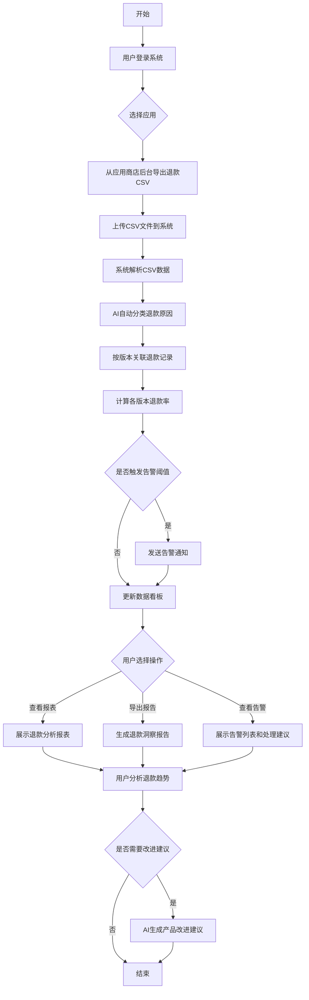
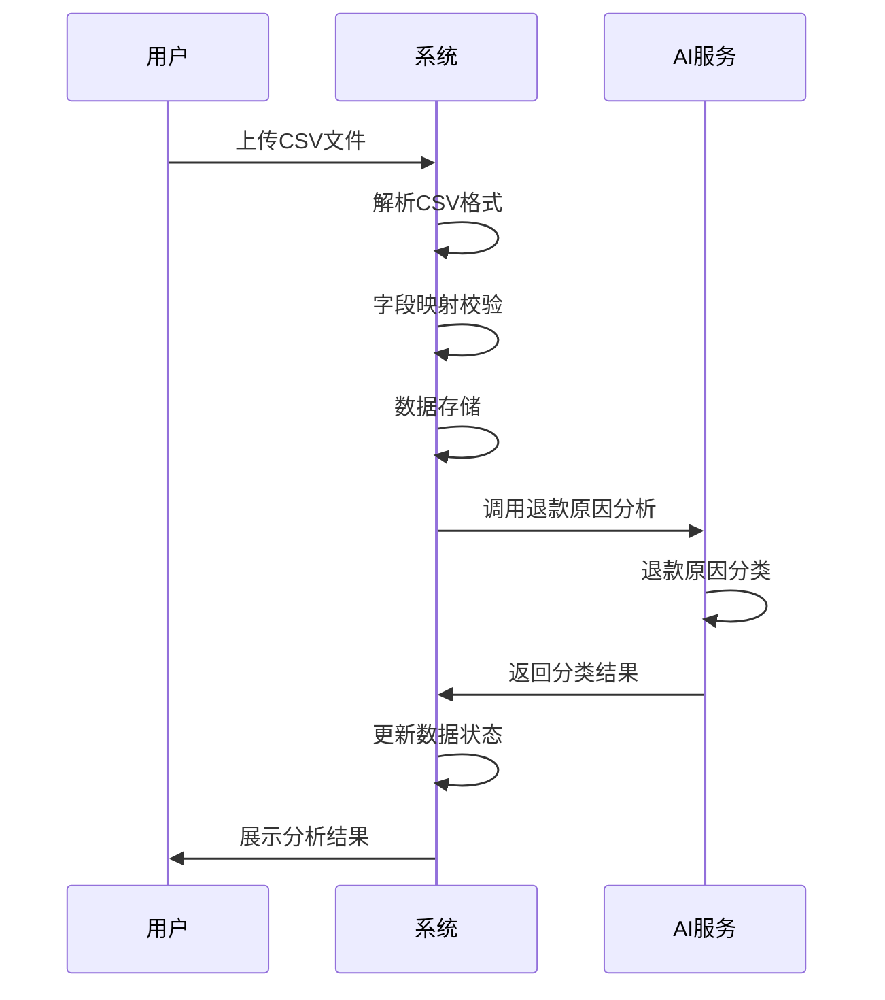
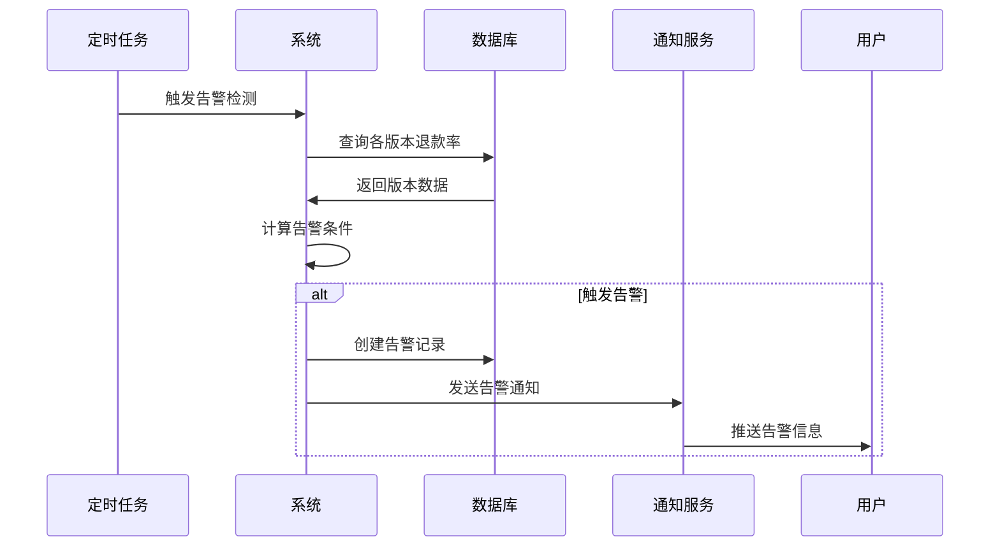
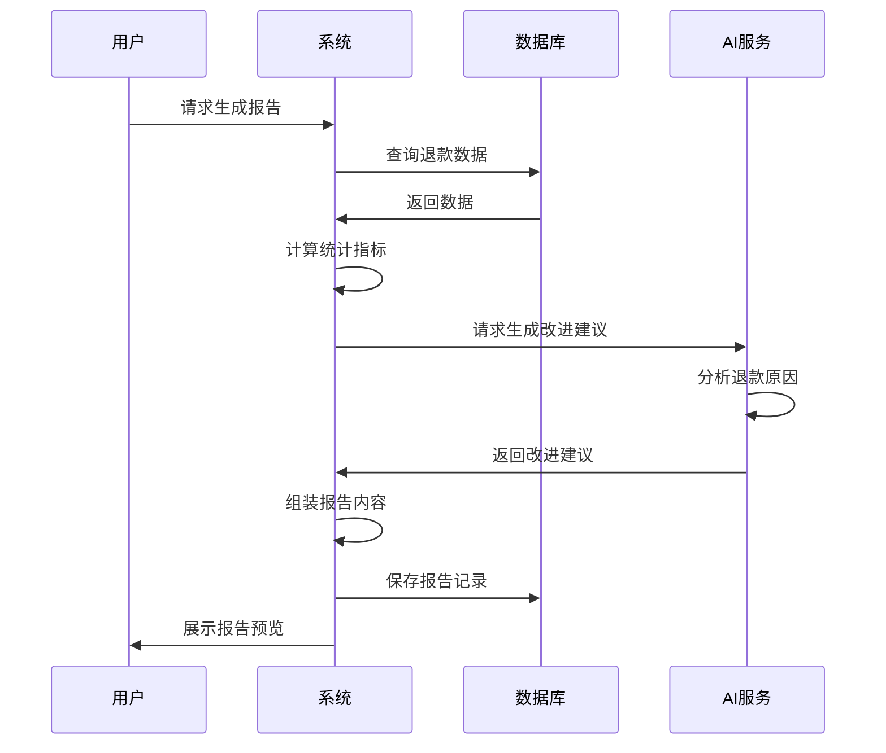
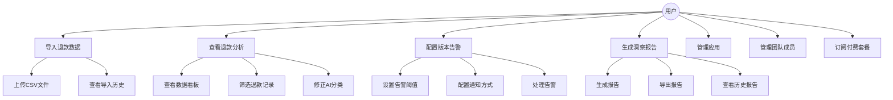
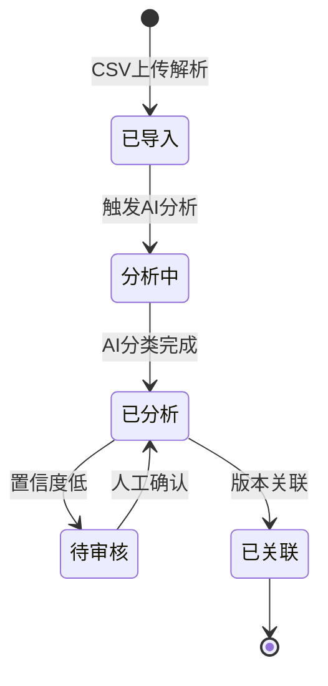
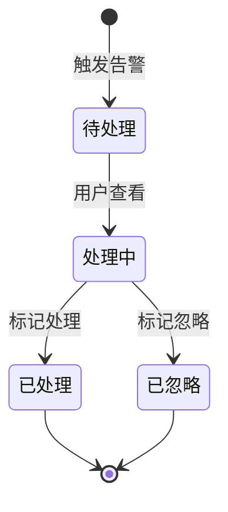

# 应用开发者退款分析与预警助手 - 用户需求说明书

# 1.需求概述

## 1.1 需求介绍

应用开发者退款分析与预警助手是一款面向独立开发者和小团队的AI驱动型退款分析工具。该工具帮助应用开发者从各应用商店平台（App Store、Google Play、Steam等）导出的退款数据中，自动分析退款原因、追踪版本退款率变化趋势、提取产品改进建议，从而帮助开发者优化产品迭代方向、降低退款率、提升收入。

### 1.1.1 所属领域

- 移动应用开发工具
- 应用运营分析
- 独立开发者服务

## 1.2 需求目标

1. **降低退款分析成本**：将原本需要人工逐条查看的退款记录通过AI自动分类，节省开发者80%以上的分析时间
2. **及时发现问题版本**：通过版本退款率监控和自动告警，让开发者在问题版本上线后第一时间发现并定位问题
3. **挖掘产品改进方向**：从退款原因和评论中提取可操作的产品改进建议，将退款数据转化为产品优化动力
4. **支持数据驱动决策**：提供可视化报表和趋势分析，帮助开发者基于数据而非直觉做出产品决策

## 1.3 系统使用角色

| 角色 | 描述 | 典型场景 |
| --- | --- | --- |
| 独立开发者 | 在应用商店发布应用的个人开发者 | 每周导入退款数据，查看退款原因分布，定位问题版本 |
| 小团队负责人 | 3-10人开发团队的产品负责人 | 管理团队多个应用的退款情况，查看团队协作报告 |
| 应用运营者 | 负责应用运营和数据分析的专员 | 定期生成退款洞察报告，向产品团队汇报改进建议 |

## 1.4 业务流程图

# 2.功能原型

| 原型名称 | 原型链接 | 对应端 | 备注 |
| --- | --- | --- | --- |
| 退款分析助手Web应用 | 待设计 | WEB端 | 主要交互界面，包含数据导入、分析看板、报表导出等功能 |
| 退款洞察报告 | 待设计 | WEB端 | 可导出的PDF/Markdown格式报告 |
| 告警通知 | 待设计 | WEB端 | 邮件/站内通知形式 |

# 3.需求清单

## 3.1 数据导入模块-WEB端

| 模块 | 一级功能 | 二级功能 | 功能描述 | 备注 |
| --- | --- | --- | --- | --- |
| 数据导入 | CSV文件上传 | 单文件上传 | 支持用户上传单个CSV文件，系统自动解析文件内容 | 支持拖拽上传 |
| 数据导入 | CSV文件上传 | 批量上传 | 支持一次上传多个CSV文件，系统按顺序解析 | 最多支持10个文件同时上传 |
| 数据导入 | 数据解析 | 格式识别 | 自动识别CSV文件的编码格式（UTF-8、GBK等）和分隔符 | 支持主流应用商店导出格式 |
| 数据导入 | 数据解析 | 字段映射 | 将CSV列映射到系统标准字段（退款时间、金额、原因、订单号等） | 支持手动调整映射关系 |
| 数据导入 | 数据解析 | 数据校验 | 校验数据完整性，标记缺失或异常数据 | 提供校验错误提示 |
| 数据导入 | 平台适配 | App Store格式 | 支持苹果App Store退款报告CSV格式解析 | 符合苹果官方导出规范 |
| 数据导入 | 平台适配 | Google Play格式 | 支持Google Play退款数据CSV格式解析 | 符合Google Play导出规范 |
| 数据导入 | 平台适配 | Steam格式 | 支持Steam退款数据CSV格式解析 | 符合Steam导出规范 |
| 数据导入 | 数据管理 | 导入历史 | 展示历史导入记录，包含导入时间、文件名称、记录数量 | 支持查看导入详情 |
| 数据导入 | 数据管理 | 数据删除 | 支持删除已导入的退款数据 | 删除前需二次确认 |

## 3.2 AI退款原因分析模块-WEB端

| 模块 | 一级功能 | 二级功能 | 功能描述 | 备注 |
| --- | --- | --- | --- | --- |
| AI分析 | 退款原因分类 | 自动分类 | AI自动分析退款记录，将退款原因分类为：功能缺失、体验差、误购、价格异议、技术故障、其他 | 分类准确率目标>85% |
| AI分析 | 退款原因分类 | 分类置信度 | 显示每条分类结果的置信度评分 | 低置信度结果标记为待人工审核 |
| AI分析 | 退款原因分类 | 人工修正 | 支持用户手动修改AI分类结果 | 修正结果用于优化AI模型 |
| AI分析 | 退款原因分类 | 自定义分类 | 支持用户添加自定义退款原因分类 | 自定义分类可应用于后续分析 |
| AI分析 | 批量分析 | 全量分析 | 对所有已导入数据进行退款原因分析 | 支持断点续传 |
| AI分析 | 批量分析 | 增量分析 | 仅对新导入的数据进行退款原因分析 | 提高分析效率 |
| AI分析 | 分析结果 | 分类统计 | 展示各退款原因的分布情况（数量、占比） | 支持饼图、柱状图展示 |
| AI分析 | 分析结果 | 趋势分析 | 展示各退款原因随时间的变化趋势 | 支持按周/月查看 |

## 3.3 版本退款率监控模块-WEB端

| 模块 | 一级功能 | 二级功能 | 功能描述 | 备注 |
| --- | --- | --- | --- | --- |
| 版本监控 | 版本关联 | 自动关联 | 根据退款记录中的应用版本号自动关联到对应版本 | 支持语义化版本号 |
| 版本监控 | 版本关联 | 手动关联 | 支持用户手动将退款记录关联到指定版本 | 处理无法自动关联的情况 |
| 版本监控 | 退款率计算 | 版本退款率 | 计算每个应用版本的退款率（退款数/下载数或活跃用户数） | 需用户配置下载数/活跃用户数据来源 |
| 版本监控 | 退款率计算 | 历史对比 | 计算当前版本退款率与历史版本均值的差异 | 支持百分比和绝对值展示 |
| 版本监控 | 告警配置 | 阈值设置 | 设置退款率告警阈值（如退款率>X%或比历史均值高Y%） | 支持多条件组合 |
| 版本监控 | 告警配置 | 通知方式 | 配置告警通知方式（邮件、站内通知） | 支持多通知渠道 |
| 版本监控 | 告警配置 | 接收人管理 | 配置告警接收人列表 | 支持团队成员接收 |
| 版本监控 | 告警触发 | 自动检测 | 系统定期检测版本退款率，触发告警时自动发送通知 | 检测频率可配置（每小时/每天） |
| 版本监控 | 告警触发 | 告警记录 | 记录所有触发的告警，包含告警时间、版本、退款率、处理状态 | 支持查看告警详情 |
| 版本监控 | 告警处理 | 标记处理 | 支持用户标记告警为已处理/已忽略 | 可填写处理说明 |
| 版本监控 | 告警处理 | 处理建议 | 基于退款原因分析，为告警提供初步处理建议 | 如"该版本主要退款原因为技术故障，建议检查崩溃日志" |

## 3.4 退款洞察报告模块-WEB端

| 模块 | 一级功能 | 二级功能 | 功能描述 | 备注 |
| --- | --- | --- | --- | --- |
| 洞察报告 | 报告生成 | 自动生成 | 系统定期（每周/每月）自动生成退款洞察报告 | 报告包含关键指标和改进建议 |
| 洞察报告 | 报告生成 | 手动生成 | 支持用户手动生成指定时间段的退款洞察报告 | 可自定义报告时间范围 |
| 洞察报告 | 报告内容 | 概览数据 | 包含退款总量、退款率、主要退款原因分布等关键指标 | 支持同比/环比对比 |
| 洞察报告 | 报告内容 | 版本分析 | 包含各版本退款率对比、问题版本识别 | 高亮显示异常版本 |
| 洞察报告 | 报告内容 | 改进建议 | 基于退款原因分析，AI生成产品改进建议 | 建议按优先级排序 |
| 洞察报告 | 报告导出 | PDF导出 | 将报告导出为PDF格式 | 支持自定义页眉页脚 |
| 洞察报告 | 报告导出 | Markdown导出 | 将报告导出为Markdown格式 | 便于在文档系统中使用 |
| 洞察报告 | 报告导出 | 邮件发送 | 支持将报告通过邮件发送给指定接收人 | 支持定时发送 |
| 洞察报告 | 报告管理 | 历史报告 | 展示历史生成的报告列表 | 支持按时间筛选 |
| 洞察报告 | 报告管理 | 报告删除 | 支持删除不需要的报告 | 删除前需确认 |

## 3.5 数据看板模块-WEB端

| 模块 | 一级功能 | 二级功能 | 功能描述 | 备注 |
| --- | --- | --- | --- | --- |
| 数据看板 | 概览面板 | 关键指标 | 展示退款总量、退款率、待处理告警数等关键指标 | 支持自定义时间范围 |
| 数据看板 | 概览面板 | 趋势图表 | 展示退款数量和退款率的趋势变化 | 支持按日/周/月切换 |
| 数据看板 | 退款原因分析 | 原因分布 | 以饼图/柱状图展示各退款原因的分布 | 支持点击查看详细记录 |
| 数据看板 | 退款原因分析 | 原因趋势 | 展示各退款原因随时间的变化趋势 | 支持多原因叠加对比 |
| 数据看板 | 版本分析 | 版本对比 | 以表格/图表展示各版本退款率对比 | 支持按退款率排序 |
| 数据看板 | 版本分析 | 版本详情 | 点击版本查看该版本的详细退款记录和分析 | 包含退款原因分布 |
| 数据看板 | 筛选查询 | 时间筛选 | 支持按时间范围筛选数据 | 支持快捷选项（近7天/30天/90天） |
| 数据看板 | 筛选查询 | 版本筛选 | 支持按应用版本筛选数据 | 支持多版本组合筛选 |
| 数据看板 | 筛选查询 | 原因筛选 | 支持按退款原因筛选数据 | 支持多原因组合筛选 |

## 3.6 应用管理模块-WEB端

| 模块 | 一级功能 | 二级功能 | 功能描述 | 备注 |
| --- | --- | --- | --- | --- |
| 应用管理 | 应用配置 | 添加应用 | 支持添加新的应用，配置应用基本信息（名称、平台、Bundle ID等） | 专业版支持多应用管理 |
| 应用管理 | 应用配置 | 编辑应用 | 支持修改应用配置信息 |  |
| 应用管理 | 应用配置 | 删除应用 | 支持删除应用及其关联数据 | 删除前需确认 |
| 应用管理 | 应用列表 | 应用切换 | 支持在多个应用之间快速切换 | 免费版仅支持1个应用 |
| 应用管理 | 应用列表 | 应用状态 | 展示各应用的退款数据量和最近导入时间 |  |

## 3.7 用户与权限管理模块-WEB端

| 模块 | 一级功能 | 二级功能 | 功能描述 | 备注 |
| --- | --- | --- | --- | --- |
| 用户管理 | 账号注册 | 邮箱注册 | 支持通过邮箱注册账号 | 需邮箱验证 |
| 用户管理 | 账号注册 | 第三方登录 | 支持通过GitHub、Google账号登录 |  |
| 用户管理 | 登录登出 | 账号登录 | 支持邮箱+密码登录 |  |
| 用户管理 | 登录登出 | 记住登录 | 支持记住登录状态 | 有效期30天 |
| 用户管理 | 个人信息 | 查看信息 | 展示用户基本信息（邮箱、注册时间、套餐类型） |  |
| 用户管理 | 个人信息 | 修改密码 | 支持修改登录密码 | 需验证原密码 |
| 用户管理 | 团队协作 | 邀请成员 | 支持邀请团队成员加入（专业版功能） | 通过邮件邀请 |
| 用户管理 | 团队协作 | 成员管理 | 支持查看团队成员列表、修改角色、移除成员 | 角色包括管理员、普通成员 |
| 用户管理 | 团队协作 | 权限控制 | 基于角色控制功能访问权限 | 管理员可管理应用和成员 |

## 3.8 套餐与计费模块-WEB端

| 模块 | 一级功能 | 二级功能 | 功能描述 | 备注 |
| --- | --- | --- | --- | --- |
| 套餐管理 | 套餐展示 | 套餐对比 | 展示免费版和专业版的功能对比 |  |
| 套餐管理 | 套餐展示 | 使用量查询 | 展示当前月份已使用的退款分析条数 | 免费版显示剩余条数 |
| 套餐管理 | 订阅升级 | 升级套餐 | 支持从免费版升级到专业版 | 支持在线支付 |
| 套餐管理 | 订阅升级 | 续费管理 | 支持专业版续费 | 支持自动续费 |
| 套餐管理 | 订阅升级 | 降级套餐 | 支持从专业版降级到免费版 | 次月生效 |
| 套餐管理 | 支付记录 | 支付历史 | 展示历史支付记录 | 包含金额、时间、套餐类型 |
| 套餐管理 | 支付记录 | 发票申请 | 支持申请电子发票 |  |
| 套餐限制 | 功能限制 | 记录数限制 | 免费版每月限100条退款记录分析 | 超出后提示升级 |
| 套餐限制 | 功能限制 | 应用数限制 | 免费版仅支持管理1个应用 | 专业版无限制 |
| 套餐限制 | 功能限制 | 功能限制 | 免费版不支持版本关联分析、团队协作、报告导出 |  |

# 4.非功能需求

## 4.1 使用界面需求

| 需求项 | 需求描述 |
| --- | --- |
| 响应式设计 | 界面需适配PC端（1280px及以上）和平板端（768px及以上） |
| 主题风格 | 提供深色/浅色两种主题，默认跟随系统设置 |
| 国际化 | MVP版本仅支持中文界面，后续版本考虑支持英文 |
| 无障碍 | 关键操作支持键盘导航，图表支持屏幕阅读器 |

## 4.2 软硬件环境需求

| 需求项 | 需求描述 |
| --- | --- |
| 客户端 | 支持主流浏览器：Chrome 90+、Firefox 88+、Safari 14+、Edge 90+ |
| 服务端 | 云服务器部署，支持水平扩展 |
| 数据库 | 使用关系型数据库存储用户数据，NoSQL存储退款记录 |
| AI服务 | 接入LLM API进行退款原因分析 |

## 4.3 性能需求

| 需求项 | 需求描述 |
| --- | --- |
| 页面加载 | 首屏加载时间 < 3秒（4G网络环境下） |
| 数据导入 | 1000条退款记录解析时间 < 10秒 |
| AI分析 | 100条退款原因分析时间 < 30秒 |
| 报表生成 | 报告生成时间 < 5秒 |
| 并发支持 | 支持100个并发用户同时操作 |
| 告警响应 | 告警检测延迟 < 1小时 |

## 4.4 约束性需求

1. **数据安全**：用户退款数据需加密存储，传输使用HTTPS协议
2. **隐私保护**：不对外共享用户退款数据，遵守相关隐私法规
3. **AI分析限制**：AI分析结果仅供参考，最终决策由用户自行判断
4. **平台依赖**：系统依赖各应用商店的CSV导出格式，格式变更时需及时适配
5. **付费集成**：需集成第三方支付服务（如Stripe、支付宝）支持订阅付费
6. **后台服务**：需要后台服务支撑AI分析、定时任务、告警检测等功能

# 5.接口需求

## 5.1 硬件接口需求

不涉及硬件接口。

## 5.2 软件接口需求

| 模块 | 接口名称 | 输入 | 输出 | 功能描述 |
| --- | --- | --- | --- | --- |
| 数据导入 | CSV文件解析接口 | CSV文件内容 | 结构化退款数据 | 解析CSV文件，提取退款记录字段 |
| AI分析 | LLM API接口 | 退款记录文本 | 退款原因分类结果 | 调用大语言模型进行退款原因分析 |
| 告警通知 | 邮件发送接口 | 告警信息、接收人邮箱 | 发送结果 | 发送告警邮件通知 |
| 报告导出 | PDF生成接口 | 报告数据 | PDF文件 | 将报告数据转换为PDF格式 |
| 支付集成 | 支付网关接口 | 订单信息、支付金额 | 支付结果 | 处理订阅支付 |
| 第三方登录 | OAuth接口 | 授权码 | 用户信息 | 支持GitHub/Google账号登录 |
| 应用商店 | 应用商店API（可选） | API密钥 | 应用下载数等数据 | 用于计算版本退款率（如需自动获取） |

## 5.4 通讯接口需求

| 通讯类型 | 需求描述 |
| --- | --- |
| HTTPS | 所有客户端与服务端通讯使用HTTPS加密传输 |
| WebSocket（可选） | 用于实时推送告警通知（如用户在线时） |

# 6.附录

## 流程图

### 退款数据导入流程

### 版本告警触发流程

## 时序图

### 退款洞察报告生成时序

## （用户与系统交互）用例图

## （系统）状态图

### 退款记录状态流转

### 告警状态流转

