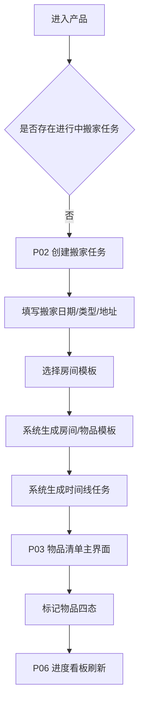
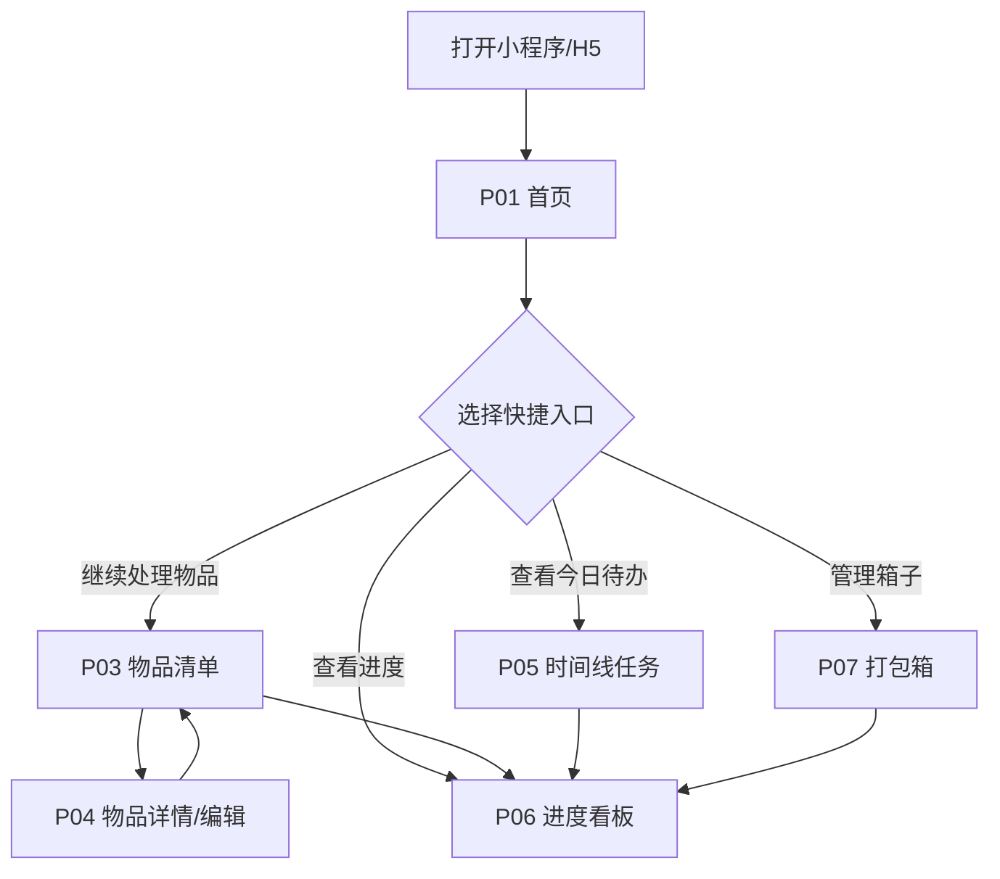
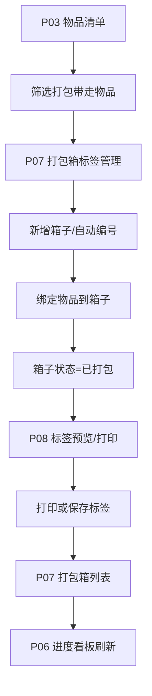
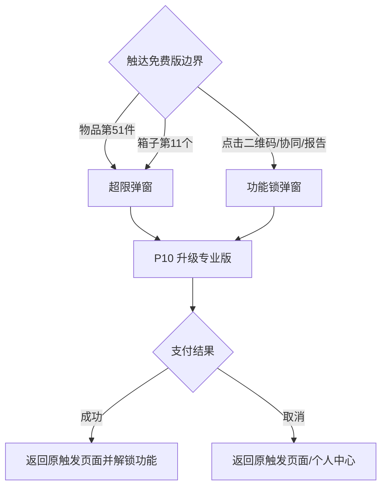

# 搬家物品清单与进度跟踪器 - 产品需求文档（PRD）

## 文档信息

| 项目 | 内容 |
|------|------|
| 产品名称 | 搬家物品清单与进度跟踪器 |
| 文档版本 | V1.1（补充页面跳转/信息架构流转分析与全站 all-in-one 原型） |
| 产品形态 | 微信小程序 / H5（MVP） |
| 目标平台 | iOS / Android（微信内置浏览器）/ 移动端浏览器 |
| MVP开发周期 | 5-7天 |

---

## 1. 产品概述

### 1.1 产品定位

搬家物品清单与进度跟踪器是一款面向搬家场景的**轻量级个人工具产品**，以"帮用户理清物品、管好进度、贴好箱标签"为核心价值主张。

**差异化定位**：不做搬家服务平台，不接入搬家服务商，只解决"搬家前的物品整理、打包规划和进度追踪"——与58同城、货拉拉等搬家平台形成互补而非竞争。

### 1.2 目标用户

| 用户角色 | 典型画像 | 核心痛点 | 使用场景 |
|----------|---------|----------|---------|
| 个人租客 | 25-35岁，城市租房，频繁搬家 | 物品零散，常遗漏关键物品；不知道何时开始准备 | 搬家前1-4周，碎片化时间整理清单 |
| 家庭用户 | 30-45岁，家庭搬迁，物品量大 | 物品多且分散在各房间，全家协调困难 | 搬家前2-4周，全家分工整理 |
| 办公室行政 | 行政/助理角色，负责公司搬迁 | 办公资产清点繁琐，进度难以追踪 | 搬迁前1-2月，统筹规划 |

### 1.3 核心价值主张

1. **清单化**：将杂乱的搬家准备转化为结构化的房间-物品清单
2. **时间线化**：将模糊的"该开始准备了"转化为明确的任务节点
3. **可视化**：将焦虑的"不知道进展如何"转化为直观的进度百分比

### 1.4 商业模式

| 版本 | 价格 | 核心权益 |
|------|------|---------|
| 免费版 | ¥0 | 单次搬家、50件物品、10个打包箱、基础时间线任务 |
| 专业版 | ¥9/次（单次搬家） | 不限物品、不限打包箱、多箱标签二维码、协同成员（最多5人）、进度报告导出 |

---

## 2. 产品架构

### 2.1 功能架构图

```
┌─────────────────────────────────────────────────────────┐
│                    搬家物品清单与进度跟踪器                   │
├─────────┬─────────┬─────────┬─────────┬────────┬────────┤
│ 搬家任务 │ 房间与物品│ 时间线  │ 打包箱  │ 进度   │ 个人   │
│  管理   │ 清单管理 │ 任务    │ 标签    │ 看板   │ 中心   │
├─────────┼─────────┼─────────┼─────────┼────────┼────────┤
│创建任务  │房间模板  │自动生成  │新增箱子  │整体进度│账户管理│
│编辑任务  │自定义房间│自定义任务│自动编号  │房间维度│会员购买│
│历史任务  │物品管理  │任务提醒  │标签编辑  │状态统计│协同成员│
│删除任务  │状态标记  │日历视图  │标签打印  │时间线  │数据导出│
│         │筛选搜索  │列表视图  │二维码   │进度报告│提醒设置│
└─────────┴─────────┴─────────┴─────────┴────────┴────────┘
```

### 2.2 页面架构（信息架构）

```
底部Tab导航
├── 首页（搬家任务入口）
│   ├── 创建搬家任务页
│   ├── 搬家任务详情（默认进入物品清单）
│   │   ├── 物品清单Tab
│   │   │   ├── 房间物品列表
│   │   │   ├── 添加物品弹窗
│   │   │   └── 物品详情/编辑页
│   │   ├── 时间线Tab
│   │   │   ├── 任务列表视图
│   │   │   └── 日历视图
│   │   ├── 打包箱Tab
│   │   │   ├── 箱子列表
│   │   │   ├── 箱子详情/物品绑定
│   │   │   └── 标签预览/打印页
│   │   └── 进度看板Tab
│   └── 历史搬家记录页
├── 进度（快捷看板入口）
├── 我的
│   ├── 个人信息页
│   ├── 升级专业版页
│   ├── 协同成员管理页
│   ├── 提醒设置页
│   └── 意见反馈页
```

---

## 3. 页面间跳转 / 信息架构流转分析

本章节用于补充说明小程序/H5端全站信息架构、页面间跳转关系、用户主路径与异常/付费分支，确保UI原型不仅是静态页面集合，而是可被开发、测试和评审共同理解的端到端交互网络。

### 3.1 页面清单与原型映射

| 页面编号 | 页面名称 | 原型文件 | 所属模块 | 页面定位 | 主要入口 | 主要出口 |
|---------|---------|----------|----------|----------|----------|----------|
| P01 | 首页 / 任务概览 | 01-home.html | 搬家任务管理、进度看板 | 已有搬家任务时的默认首页，承载任务概览与快捷入口 | 小程序/H5启动、底部Tab“首页” | 创建任务、物品清单、时间线、打包箱、进度看板、我的 |
| P02 | 创建搬家任务 | 02-create-task.html | 搬家任务管理 | 新用户或无进行中任务用户的起始表单 | 首页“创建新搬家任务”、空状态引导 | 物品清单主界面 |
| P03 | 物品清单主界面 | 03-checklist.html | 房间与物品清单管理 | 搬家任务的核心工作台，承载房间、物品与四态标记 | 首页快捷入口、创建任务成功、进度看板房间点击 | 物品详情、时间线、打包箱、进度看板 |
| P04 | 物品详情 / 编辑 | 04-item-edit.html | 房间与物品清单管理 | 单个物品的编辑、状态切换与属性补充 | 物品清单点击物品或操作菜单 | 返回物品清单，触发进度刷新 |
| P05 | 时间线任务 | 05-timeline.html | 时间线任务与提醒 | 展示按搬家日期倒推的任务节点与完成状态 | 首页今日待办、任务详情Tab、进度看板时间线点击 | 物品清单、打包箱、进度看板 |
| P06 | 进度看板 | 06-dashboard.html | 进度看板 | 汇总整体进度、房间进度、状态分布和时间线完成率 | 首页快捷入口、底部Tab“进度”、各模块保存后刷新 | 物品清单、时间线、打包箱、导出报告升级提示 |
| P07 | 打包箱标签管理 | 07-boxes.html | 打包箱标签管理 | 展示箱子列表、编号、绑定与打印入口 | 首页快捷入口、物品清单Tab、打包状态流转 | 标签预览/打印、物品清单、进度看板 |
| P08 | 标签预览 / 打印 | 08-label-preview.html | 打包箱标签管理 | 单标签预览、A4排版预览、保存与打印 | 打包箱卡片“打印”、批量打印 | 返回打包箱列表，打印完成后更新箱子状态 |
| P09 | 个人中心 | 09-profile.html | 个人中心与账户、权益控制 | 账户信息、权益用量、设置与专业版入口 | 底部Tab“我的”、权益触达提示 | 升级专业版、提醒设置、导出清单 |
| P10 | 升级专业版 | 10-upgrade.html | 权益与版本控制 | 展示¥9/次专业版权益与支付入口 | 个人中心、超限弹窗、专业版功能锁 | 支付成功返回原触发页面，支付取消返回个人中心/原页面 |
| P00 | 全站 all-in-one 原型 | 00-all-in-one.html | 全站原型 | 单文件总览宫格 + 页面视图，便于评审全链路 | PRD附件、评审入口 | 任意页面视图、返回总览 |

### 3.2 全站导航分层

产品采用“底部三Tab + 任务内四Tab + 功能详情页”的三层信息架构。

1. **一级导航：底部三Tab**
   - 首页：承载当前搬家任务概览、快捷操作、今日待办和房间进度。
   - 进度：作为进度看板的快捷入口，满足用户随时查看整体进展的高频需求。
   - 我的：承载账户、权益、设置、导出和升级入口。

2. **二级导航：任务内四Tab**
   - 物品清单：默认进入的核心工作台，处理房间、物品、状态标记。
   - 时间线：围绕搬家日期的准备任务管理。
   - 打包箱：箱子创建、编号、绑定、打印管理。
   - 进度：当前任务的看板视图，可与底部“进度”互通。

3. **三级页面：详情与操作页**
   - 创建搬家任务、物品详情/编辑、标签预览/打印、升级专业版属于明确任务驱动页面。
   - 三级页面均需提供明确返回入口，返回后保留上级页面筛选、滚动和Tab状态。

### 3.3 用户主路径流转

#### 3.3.1 新用户首次创建路径



**设计要求**：创建任务成功后的默认落点必须是物品清单，而不是首页；原因是用户刚完成任务创建，下一步最自然的动作是开始整理物品。

#### 3.3.2 老用户继续整理路径



**设计要求**：首页展示任务概览，但不承载深层编辑；所有编辑动作下沉到对应模块页面，避免首页复杂化。

#### 3.3.3 打包与标签路径



**设计要求**：标签预览页不独立成为底部Tab，只能从打包箱场景进入；打印完成后返回打包箱列表，避免用户迷失在打印工具页。

#### 3.3.4 付费升级路径



**设计要求**：升级页必须记住来源页面与触发功能，支付成功后回到原上下文继续操作，不能统一跳回首页。

### 3.4 页面跳转矩阵

| 当前页面 | 可跳转目标 | 触发动作 | 跳转类型 | 返回策略 |
|---------|-----------|----------|----------|----------|
| P01 首页 | P02 创建任务 | 无任务/创建按钮 | push | 返回首页 |
| P01 首页 | P03 物品清单 | 快捷操作“物品清单” | push/tab | 返回首页或底部Tab |
| P01 首页 | P05 时间线 | 今日待办/快捷操作 | push/tab | 返回首页 |
| P01 首页 | P06 进度看板 | 快捷操作/底部Tab | tab | 底部Tab切换 |
| P01 首页 | P07 打包箱 | 快捷操作 | push/tab | 返回首页 |
| P01 首页 | P09 我的 | 底部Tab | tab | 底部Tab切换 |
| P02 创建任务 | P03 物品清单 | 创建成功 | replace | 不返回空创建页，返回首页需从任务页操作 |
| P03 物品清单 | P04 物品详情 | 点击物品/编辑 | push | 保存或取消后回到清单并保留筛选条件 |
| P03 物品清单 | P05/P06/P07 | 任务内Tab切换 | tab-in-task | 保留当前任务上下文 |
| P04 物品详情 | P03 物品清单 | 保存/取消/返回 | pop | 刷新列表与进度数据 |
| P05 时间线 | P06 进度看板 | 任务完成后查看进度 | push/tab | 返回时间线 |
| P06 进度看板 | P03 物品清单 | 点击房间进度 | deep link | 带房间筛选条件进入清单 |
| P06 进度看板 | P05 时间线 | 点击时间线统计 | deep link | 定位到逾期/待办节点 |
| P06 进度看板 | P07 打包箱 | 点击打包箱统计 | deep link | 进入箱子列表并带状态筛选 |
| P07 打包箱 | P08 标签预览 | 打印/批量打印 | push | 打印完成后返回箱子列表 |
| P07 打包箱 | P03 物品清单 | 绑定物品/查看箱内物品 | deep link | 进入打包带走物品筛选 |
| P08 标签预览 | P07 打包箱 | 返回/打印完成 | pop | 保留箱子分组位置 |
| P09 我的 | P10 升级专业版 | 升级按钮/专业版功能 | push | 支付成功后返回来源；取消回个人中心 |
| P10 升级专业版 | 来源页面 | 支付成功/取消 | replace/pop | 支付成功解锁权益并刷新来源页 |
| P00 all-in-one | 任意P01-P10 | 点击总览宫格 | in-page view switch | 返回总览 |

### 3.5 信息架构流转原则

1. **先任务、后工具**：用户必须先有搬家任务，再进入物品清单、时间线、打包箱和进度看板；无任务时只展示创建任务入口。
2. **清单为中心**：物品清单是数据源中心，时间线、打包箱和进度看板均围绕清单数据变化刷新。
3. **进度为反馈**：任何状态变更、任务完成、箱子打包后，均应刷新进度看板对应统计，形成即时反馈闭环。
4. **付费不中断上下文**：触发专业版功能时，引导升级但保留用户原操作上下文，支付成功后继续原任务。
5. **详情页轻量化**：物品详情、标签预览等页面只承载单一目标，不在详情页叠加复杂导航。
6. **返回可预期**：从哪里进入就返回哪里；Tab切换不改变页面栈，详情页使用push/pop，创建成功使用replace防止回退到已提交表单。

### 3.6 全站 all-in-one 单页原型说明

为便于产品评审、开发联调和落地页案例展示，补充单文件全站原型：[00-all-in-one.html](00-all-in-one.html)。该原型采用“总览宫格 + 单页视图切换”结构：

- 总览态展示10个核心页面卡片，按用户主路径排序。
- 点击任意卡片进入对应页面视图，页面顶部提供返回总览、上一页、下一页入口。
- 页面视图在单个HTML内完成切换，不依赖多文件跳转，适合用于评审演示和案例展览。
- 原型覆盖首页、创建任务、物品清单、物品详情、时间线、进度看板、打包箱、标签打印、个人中心、升级专业版全部页面。

---

## 4. 物品四态状态机

物品四态是本产品的核心状态机，贯穿物品从创建到最终处理的全生命周期。

### 3.1 状态定义

| 状态 | 标识色 | 含义 | 后续流转 |
|------|--------|------|---------|
| **待处理** | 灰色 #9CA3AF | 新创建的物品，尚未决定处理方式 | → 丢弃 / 捐赠 / 打包带走 / 单独搬运 |
| **丢弃** | 红色 #EF4444 | 不再需要，准备丢弃 | → 待处理（可撤销） |
| **捐赠** | 蓝色 #3B82F6 | 准备捐赠给他人或机构 | → 待处理（可撤销） |
| **打包带走** | 绿色 #10B981 | 需要打包进箱子带走 | → 已打包（放入箱子后） |
| **单独搬运** | 橙色 #F59E0B | 大件/特殊物品，需单独安排搬运 | → 已搬运 |
| **已打包** | 深绿 #059669 | 已放入打包箱 | → 已搬运 |
| **已搬运** | 完成色 #6366F1 | 搬运完成 | 终态 |

### 3.2 状态流转规则

```
创建物品 ──→ 待处理（默认状态）
              │
              ├──→ 丢弃 ←──→ 待处理（可撤销）
              ├──→ 捐赠 ←──→ 待处理（可撤销）
              ├──→ 打包带走 ──→ 已打包（绑定到箱子）──→ 已搬运
              └──→ 单独搬运 ──→ 已搬运
```

### 3.3 状态流转业务规则

| 规则编号 | 规则描述 |
|---------|---------|
| SR-01 | 新创建的物品默认状态为"待处理" |
| SR-02 | 用户可以随时将"丢弃/捐赠"状态撤销回"待处理" |
| SR-03 | 标记为"打包带走"的物品需绑定到具体打包箱后才变为"已打包" |
| SR-04 | "已打包"的物品在对应箱子标记为"已搬运"后自动变为"已搬运" |
| SR-05 | "单独搬运"的物品不进入打包箱，直接标记为"已搬运"完成 |
| SR-06 | 状态变更需实时反映在进度看板统计数据中 |

---

## 5. 功能模块详细设计

### 4.1 模块一：搬家任务管理

#### 4.1.1 功能清单

| 功能点 | 优先级 | MVP范围 | 描述 |
|--------|--------|---------|------|
| 创建搬家任务 | P0 | ✓ | 填写搬家日期（必填）、旧地址、新地址、房屋面积/户型、搬家类型 |
| 编辑搬家任务 | P0 | ✓ | 修改基础信息，修改日期后自动重算时间线任务 |
| 删除搬家任务 | P1 | ✓ | 二次确认，删除所有关联数据；免费版保留最近1次记录 |
| 查看历史任务 | P2 | ✓ | 查看过往搬家任务数据，免费版仅保留最近1次 |
| 复用历史清单 | P2 | ✗ | 基于历史清单快速创建新任务（专业版功能） |

#### 4.1.2 页面设计：创建搬家任务

**页面入口**：首页 → 点击"创建新搬家任务"按钮

**页面元素**：

| 区域 | 元素 | 类型 | 必填 | 规则 |
|------|------|------|------|------|
| 基础信息区 | 搬家日期 | 日期选择器 | 是 | 不可选过去日期；默认明天 |
| 基础信息区 | 搬家类型 | 单选按钮组 | 是 | 个人住宅（默认）/ 办公室 / 合租 |
| 基础信息区 | 旧地址 | 文本输入 + 定位 | 否 | 支持地图定位辅助 |
| 基础信息区 | 新地址 | 文本输入 + 定位 | 否 | 支持地图定位辅助 |
| 基础信息区 | 房屋户型 | 下拉选择 | 否 | 一室/二室/三室/四室+/其他 |
| 房间选择区 | 房间模板 | 多选标签 | 否 | 根据搬家类型展示不同模板集 |
| 房间选择区 | 自定义房间 | 输入框 + 添加按钮 | 否 | 支持添加模板外房间 |
| 底部操作区 | 创建按钮 | 主按钮 | - | 至少填写搬家日期 |

**交互规则**：
- 创建成功后自动跳转到物品清单页
- 选择房间模板后，系统自动填充该房间的预设物品
- 创建成功同时自动生成时间线任务

#### 4.1.3 数据模型

```
MovingTask {
  id: string              // 任务唯一ID
  userId: string          // 所属用户
  moveDate: date          // 搬家日期（必填）
  moveType: enum          // 个人住宅/办公室/合租
  oldAddress: string      // 旧地址
  newAddress: string      // 新地址
  houseLayout: string     // 户型
  status: enum            // 规划中/打包中/搬运中/已完成/已归档/已取消
  isPro: boolean          // 是否使用专业版权益
  createdAt: datetime
  updatedAt: datetime
}
```

---

### 4.2 模块二：房间与物品清单管理

#### 4.2.1 功能清单

| 功能点 | 优先级 | MVP范围 | 描述 |
|--------|--------|---------|------|
| 选择房间模板 | P0 | ✓ | 预设模板：卧室/厨房/客厅/书房/卫生间/阳台/储物间 |
| 自定义添加房间 | P1 | ✓ | 添加模板外房间 |
| 编辑/删除房间 | P1 | ✓ | 修改名称或删除，删除时处理关联物品 |
| 使用模板预设物品 | P0 | ✓ | 每个房间预置常见物品，可勾选是否纳入 |
| 手动添加物品 | P0 | ✓ | 输入名称、数量、备注；支持拍照添加 |
| 批量添加物品 | P1 | ✓ | 文本换行分隔，每行一个物品 |
| 编辑物品信息 | P0 | ✓ | 修改名称、数量、所属房间、备注 |
| 删除物品 | P0 | ✓ | 二次确认 |
| 物品状态标记 | P0 | ✓ | 四态标记：丢弃/捐赠/打包带走/单独搬运 |
| 物品筛选与搜索 | P1 | ✓ | 按房间、状态、关键词筛选 |
| 特殊物品标记 | P2 | ✗ | 标记易碎/贵重/需防潮（专业版打包建议用） |

#### 4.2.2 页面设计：物品清单主界面

**页面结构**：

```
┌─────────────────────────────────┐
│ 顶部导航栏                        │
│ [任务名称] ▼    [进度xx%]  [···] │
├─────────────────────────────────┤
│ 筛选栏                            │
│ [全部房间▼] [全部状态▼] [🔍搜索]  │
├─────────────────────────────────┤
│ 物品列表（按房间分组折叠）           │
│                                  │
│ ▼ 🛏 卧室 (12件, 已处理8件)       │
│   ☐ 床          [打包带走] [···] │
│   ☐ 衣柜        [打包带走] [···] │
│   ☐ 冬季衣物     [打包带走] [···] │
│   ☐ 旧书籍       [丢弃]    [···] │
│   ...                             │
│                                   │
│ ▶ 🍳 厨房 (8件, 已处理3件)        │
│ ▶ 🛋 客厅 (6件, 已处理0件)        │
│                                   │
├─────────────────────────────────┤
│ [+ 添加物品]    [+ 添加房间]       │
└─────────────────────────────────┘
```

**物品列表项设计**：

| 元素 | 类型 | 描述 |
|------|------|------|
| 房间名称 | 分组标题 | 点击折叠/展开 |
| 房间统计 | 标签 | (N件, 已处理M件) |
| 物品名称 | 文本 | 主要信息 |
| 状态标签 | 彩色标签 | 四态之一，点击切换 |
| 操作菜单 | 更多按钮 | 编辑/删除/标记特殊物品 |

**物品添加弹窗**：

| 元素 | 类型 | 必填 | 规则 |
|------|------|------|------|
| 所属房间 | 下拉选择 | 是 | 当前选中的房间 |
| 物品名称 | 文本输入 | 是 | - |
| 数量 | 数字输入 | 否 | 默认1 |
| 备注 | 文本输入 | 否 | - |
| 拍照添加 | 图片上传 | 否 | 支持拍照/相册 |
| 批量模式开关 | 开关 | - | 开启后切换为多行文本输入 |

#### 4.2.3 房间模板预设数据

| 房间 | 预设物品 |
|------|---------|
| 卧室 | 床、衣柜、床头柜、衣物（当季）、衣物（换季）、被褥、枕头、床单、窗帘、台灯、化妆台 |
| 厨房 | 锅具、餐具（碗碟）、刀具、炊具、调料、冰箱、微波炉、电饭煲、食材（需处理） |
| 客厅 | 沙发、茶几、电视、电视柜、书架、装饰品、地毯、落地灯 |
| 书房 | 书桌、办公椅、电脑、显示器、打印机、书籍、文件、文具 |
| 卫生间 | 洗漱用品、毛巾、吹风机、清洁工具、储物架 |
| 阳台 | 洗衣机、晾衣架、花盆、户外家具、清洁工具 |
| 储物间 | 储物箱、工具、备用物品、季节性物品 |

#### 4.2.4 数据模型

```
Room {
  id: string
  taskId: string           // 所属搬家任务
  name: string             // 房间名称
  icon: string             // 房间图标
  sortOrder: int           // 排序
  isTemplate: boolean      // 是否为模板房间
  createdAt: datetime
}

Item {
  id: string
  taskId: string
  roomId: string           // 所属房间
  name: string             // 物品名称
  quantity: int            // 数量（默认1）
  status: enum             // 待处理/丢弃/捐赠/打包带走/单独搬运/已打包/已搬运
  remark: string           // 备注
  imageUrl: string         // 物品照片URL
  boxId: string            // 绑定的打包箱ID（可空）
  isFragile: boolean       // 是否易碎
  isValuable: boolean      // 是否贵重
  needsMoistureProof: boolean // 是否需防潮
  createdAt: datetime
  updatedAt: datetime
}
```

---

### 4.3 模块三：时间线任务与提醒

#### 4.3.1 功能清单

| 功能点 | 优先级 | MVP范围 | 描述 |
|--------|--------|---------|------|
| 自动生成任务节点 | P0 | ✓ | 基于搬家日期倒推生成8个标准节点 |
| 预设任务内容 | P0 | ✓ | 每个节点有标准任务内容 |
| 自定义添加任务 | P1 | ✓ | 用户自行添加额外任务 |
| 编辑/删除任务 | P1 | ✓ | 修改或删除任务节点 |
| 标记任务完成 | P0 | ✓ | 手动标记已完成/未完成；支持批量 |
| 节点到期推送 | P1 | ✓ | 到期前推送提醒（默认提前1天） |
| 自定义提醒时间 | P2 | ✗ | 调整单个任务提醒时间 |
| 日历视图 | P2 | ✗ | 日历形式展示任务（第二期） |
| 列表视图 | P0 | ✓ | 列表形式按时间排序展示 |

#### 4.3.2 标准时间线节点

| 节点 | 触发时间 | 预设任务内容 |
|------|---------|-------------|
| 节点1 | 提前30天 | 开始整理不常用物品，盘点各房间物品 |
| 节点2 | 提前21天 | 完成所有房间物品盘点，确认物品清单 |
| 节点3 | 提前14天 | 确认丢弃/捐赠清单，处理不需要的物品 |
| 节点4 | 提前7天 | 联系搬家公司/租车，确认搬家日期 |
| 节点5 | 提前3天 | 准备打包材料（纸箱、胶带、气泡膜等） |
| 节点6 | 提前1天 | 确认新旧地址、路线规划，准备搬家当天物品 |
| 节点7 | 搬家当天 | 按箱清单逐一核对，确认所有物品装车 |
| 节点8 | 搬家后3天 | 拆包整理，核对物品是否完好到位 |

#### 4.3.3 页面设计：时间线任务

**页面结构**：

```
┌─────────────────────────────────┐
│ 时间线任务         [列表/日历]   │
├─────────────────────────────────┤
│                                  │
│  ── 提前30天 ── 6月1日 ─────────│
│  ○ 开始整理不常用物品     [完成]  │
│  ○ 盘点各房间物品         [完成]  │
│                                  │
│  ── 提前21天 ── 6月10日 ────────│
│  ● 完成所有房间物品盘点   [完成]  │
│  ○ 确认物品清单           [完成]  │
│                                  │
│  ── 提前14天 ── 6月17日 ────────│
│  ◉ 确认丢弃/捐赠清单     ← 今天  │
│  ○ 处理不需要的物品              │
│                                  │
│  ── 提前7天 ── 6月24日 ─────────│
│  ○ 联系搬家公司/租车             │
│  ○ 确认搬家日期                  │
│                                  │
│  ── 提前3天 ── 6月28日 ─────────│
│  ○ 准备打包材料                  │
│                                  │
│  ── 提前1天 ── 6月30日 ─────────│
│  ○ 确认新旧地址与路线            │
│                                  │
│  ── 搬家当天 ── 7月1日 ─────────│
│  ○ 按箱清单逐一核对              │
│                                  │
│  ── 搬家后3天 ── 7月4日 ────────│
│  ○ 拆包整理核对                  │
│                                  │
├─────────────────────────────────┤
│ [+ 添加自定义任务]               │
└─────────────────────────────────┘
```

**交互规则**：
- 已过期节点显示红色标记
- 当前日期节点高亮显示
- 已完成任务打勾 + 删除线效果
- 点击任务可编辑内容或修改时间

#### 4.3.4 数据模型

```
TimelineTask {
  id: string
  taskId: string            // 所属搬家任务
  nodeIndex: int            // 节点序号
  title: string             // 任务标题
  description: string       // 任务描述
  dueDate: date             // 到期日期
  isCompleted: boolean      // 是否完成
  isAutoGenerated: boolean  // 是否系统自动生成
  remindBefore: int         // 提前提醒分钟数
  reminderSent: boolean     // 是否已发送提醒
  createdAt: datetime
  updatedAt: datetime
}
```

---

### 4.4 模块四：打包箱标签管理

#### 4.4.1 功能清单

| 功能点 | 优先级 | MVP范围 | 描述 |
|--------|--------|---------|------|
| 新增打包箱 | P0 | ✓ | 关联到某个房间，可一次新增多个 |
| 自动编号 | P0 | ✓ | 字母代表房间 + 数字序号（如A01、A02） |
| 自动填充摘要 | P1 | ✓ | 根据箱内物品自动生成内容摘要 |
| 自动推断优先级 | P2 | ✗ | 根据物品属性推断优先级（高/中/低） |
| 手动编辑标签 | P0 | ✓ | 修改房间名、摘要、优先级、备注 |
| 绑定物品到箱子 | P0 | ✓ | 勾选物品到具体箱子 |
| 打印标签 | P0 | ✓ | A4排版多标签打印页 |
| 保存电子版 | P1 | ✓ | 保存为图片/PDF |
| 生成二维码 | P2 | ✗ | 扫码查看箱内物品（专业版） |
| 查看箱子列表 | P0 | ✓ | 所有箱子及状态 |

#### 4.4.2 编号规则

编号格式：`{房间字母}{两位序号}`

| 房间 | 字母代号 | 示例编号 |
|------|---------|---------|
| 卧室 | A | A01, A02, A03 |
| 厨房 | B | B01, B02 |
| 客厅 | C | C01 |
| 书房 | D | D01, D02 |
| 卫生间 | E | E01 |
| 阳台 | F | F01 |
| 储物间 | G | G01 |
| 自定义 | 按添加顺序取H、I、J... | H01 |

#### 4.4.3 页面设计：打包箱列表

**页面结构**：

```
┌─────────────────────────────────┐
│ 打包箱标签                       │
├─────────────────────────────────┤
│ 统计: 8个箱子 | 已打包5 | 已搬运2│
├─────────────────────────────────┤
│                                  │
│ ▼ 🛏 卧室 (3箱)                  │
│ ┌─────────┐ ┌─────────┐        │
│ │ A01     │ │ A02     │        │
│ │ 冬季衣物 │ │ 被褥床品│        │
│ │ ● 已打包 │ │ ● 已打包│        │
│ │ [打印]  │ │ [打印]  │        │
│ └─────────┘ └─────────┘        │
│ ┌─────────┐                     │
│ │ A03     │                     │
│ │ 书籍文件 │                     │
│ │ ○ 未打包 │                     │
│ │ [绑定]  │                     │
│ └─────────┘                     │
│                                  │
│ ▼ 🍳 厨房 (2箱)                  │
│ ...                              │
│                                  │
├─────────────────────────────────┤
│ [+ 新增打包箱]   [批量打印]       │
└─────────────────────────────────┘
```

#### 4.4.4 标签样式设计

**单个标签内容**：

```
┌──────────────────────────┐
│  搬家箱标签               │
│  ┌─────┐                 │
│  │QR码 │  编号: A01       │
│  │(专业)│  房间: 卧室      │
│  └─────┘                 │
│  内容: 冬季衣物、外套5件   │
│       围巾3条、帽子2顶     │
│  优先级: ● 中             │
│  打包日期: 2026-06-28     │
│  件数: 共10件             │
│                           │
│  □ 易碎  □ 贵重  □ 防潮   │
└──────────────────────────┘
```

#### 4.4.5 数据模型

```
Box {
  id: string
  taskId: string
  roomId: string            // 关联房间
  code: string              // 箱编号（如A01）
  contentSummary: string    // 内容摘要（可自动生成或手动编辑）
  priority: enum            // 高/中/低
  packDate: date            // 打包日期
  status: enum              // 未打包/已打包/已搬运
  itemCount: int            // 箱内物品数
  isFragile: boolean        // 是否含易碎品
  isValuable: boolean       // 是否含贵重品
  needsMoistureProof: boolean // 是否需防潮
  remark: string            // 备注
  createdAt: datetime
  updatedAt: datetime
}
```

---

### 4.5 模块五：进度看板

#### 4.5.1 功能清单

| 功能点 | 优先级 | MVP范围 | 描述 |
|--------|--------|---------|------|
| 总进度百分比 | P0 | ✓ | 基于物品处理状态和任务完成情况计算 |
| 关键指标汇总 | P0 | ✓ | 物品总数、已处理数、打包箱数、任务完成率 |
| 按房间查看进度 | P0 | ✓ | 每个房间独立进度百分比 |
| 按处理状态统计 | P0 | ✓ | 饼图展示四态分布 |
| 时间线任务完成率 | P1 | ✓ | 已完成/待完成/已过期 |
| 生成进度报告 | P2 | ✗ | PDF报告（专业版） |

#### 4.5.2 进度计算公式

```
总进度 = (物品处理进度 × 0.6) + (时间线任务进度 × 0.4)

物品处理进度 = 已处理物品数 / 总物品数 × 100%
  其中: 已处理 = 丢弃 + 捐赠 + 已打包 + 已搬运

时间线任务进度 = 已完成任务数 / 总任务数 × 100%

房间进度 = 该房间已处理物品数 / 该房间总物品数 × 100%
```

#### 4.5.3 页面设计：进度看板

**页面结构**：

```
┌─────────────────────────────────┐
│ 搬家进度          [导出报告]     │
├─────────────────────────────────┤
│                                  │
│         ┌─────────────┐         │
│         │             │         │
│         │    68%      │         │
│         │   总进度     │         │
│         │             │         │
│         └─────────────┘         │
│                                  │
│  物品 48/72     任务 5/8        │
│  ████▓░░░░░    ████▓░░░░       │
│                                  │
├─────────────────────────────────┤
│ 按房间进度                       │
│ ┌──────────────────────────┐    │
│ │ 🛏 卧室   82%  ████▓░ 11/12│   │
│ │ 🍳 厨房   60%  ███░░░  5/8 │   │
│ │ 🛋 客厅   50%  ██░░░░  3/6 │   │
│ │ 📚 书房   40%  ██░░░░  2/5 │   │
│ │ 🚿 卫生间 100% ██████  4/4 │   │
│ └──────────────────────────┘    │
├─────────────────────────────────┤
│ 物品状态分布                     │
│ ┌──────────────────────────┐    │
│ │    ╭───╮                 │    │
│ │   ╱ 打包 ╲  28件         │    │
│ │  │  39%  │  12件丢弃     │    │
│ │   ╲     ╱   8件捐赠      │    │
│ │    ╰───╯    5件待处理     │    │
│ │  ●打包 ●丢弃 ●捐赠 ●待处理│    │
│ └──────────────────────────┘    │
├─────────────────────────────────┤
│ 打包箱统计                       │
│ 总箱数: 8  已打包: 5  已搬运: 2  │
├─────────────────────────────────┤
│ 时间线任务                       │
│ 已完成 5 · 待完成 2 · 已过期 1   │
└─────────────────────────────────┘
```

---

### 4.6 模块六：个人中心与账户

#### 4.6.1 功能清单

| 功能点 | 优先级 | MVP范围 | 描述 |
|--------|--------|---------|------|
| 微信授权登录 | P0 | ✓ | 小程序端快捷登录 |
| 手机号登录 | P0 | ✓ | H5端手机号+验证码登录 |
| 查看账户等级 | P0 | ✓ | 显示免费版/专业版及剩余权益 |
| 升级专业版 | P0 | ✓ | 单次购买¥9/次，微信支付 |
| 查看专业版权益 | P0 | ✓ | 展示权益列表 |
| 邀请协同成员 | P2 | ✗ | 专业版功能 |
| 管理协同成员 | P2 | ✗ | 专业版功能 |
| 导出清单为Excel | P1 | ✓ | 导出物品清单 |
| 提醒设置 | P1 | ✓ | 统一设置提醒提前时间 |
| 意见反馈 | P2 | ✓ | 提交反馈 |

#### 4.6.2 页面设计：个人中心

```
┌─────────────────────────────────┐
│          我的                    │
├─────────────────────────────────┤
│  ┌────────────────────────┐     │
│  │ [头像]  用户昵称        │     │
│  │        免费版           │     │
│  │        [升级专业版 →]   │     │
│  └────────────────────────┘     │
│                                  │
│  我的权益                        │
│  ┌────────────────────────┐     │
│  │ 物品 12/50             │     │
│  │ ██████▓░░░░░░░ 24%    │     │
│  │ 打包箱 3/10            │     │
│  │ ███░░░░░░░ 30%        │     │
│  └────────────────────────┘     │
│                                  │
│  ┌────────────────────────┐     │
│  │ 📋 导出清单          →  │     │
│  │ 🔔 提醒设置          →  │     │
│  │ 👥 协同成员 (专业版) →  │     │
│  │ 💬 意见反馈          →  │     │
│  │ ℹ️  关于             →  │     │
│  └────────────────────────┘     │
└─────────────────────────────────┘
```

---

### 4.7 模块七：权益与版本控制

#### 4.7.1 版本对比

| 功能 | 免费版 | 专业版 (¥9/次) |
|------|--------|----------------|
| 单次搬家次数 | 1次 | 1次 |
| 物品数量上限 | 50件 | 不限 |
| 打包箱数量上限 | 10个 | 不限 |
| 历史搬家记录 | 最近1次 | 不限 |
| 时间线任务 | ✓ | ✓ |
| 进度看板 | ✓ | ✓ |
| 标签打印 | ✓ | ✓ |
| 二维码标签 | ✗ | ✓ |
| 协同成员 | ✗ | 最多5人 |
| 进度报告导出 | ✗ | ✓ |
| 清单导出Excel | ✓ | ✓ |

#### 4.7.2 升级引导策略

| 触发场景 | 引导方式 |
|---------|---------|
| 物品数达到45件（90%） | 顶部提示条："物品即将达到免费版上限，升级专业版不限数量" |
| 尝试添加第51件物品 | 弹窗提示："免费版最多50件物品，升级专业版不限数量" |
| 打包箱达到8个（80%） | 列表底部提示："升级专业版，不限打包箱数量" |
| 点击二维码标签功能 | 功能锁定弹窗："二维码标签为专业版功能" |
| 点击协同成员功能 | 功能锁定弹窗："协同成员为专业版功能" |
| 点击进度报告导出 | 功能锁定弹窗："进度报告导出为专业版功能" |

#### 4.7.3 数据模型

```
User {
  id: string
  openId: string            // 微信openId
  phone: string             // 手机号
  nickname: string          // 昵称
  avatarUrl: string         // 头像URL
  level: enum               // free/pro
  createdAt: datetime
  updatedAt: datetime
}

Order {
  id: string
  userId: string
  taskId: string            // 关联的搬家任务
  amount: decimal           // 金额（9.00）
  status: enum              // 待支付/已支付/已退款
  paymentId: string         // 微信支付交易号
  createdAt: datetime
  paidAt: datetime
}
```

---

## 6. 全局交互规范

### 5.1 色彩规范

| 色彩用途 | 色值 | 说明 |
|---------|------|------|
| 主色 | #4A90D9（浅蓝） | 品牌主色，清新放松 |
| 辅色 | #7EC8B7（浅绿） | 成功、完成状态 |
| 强调色 | #F5A623（暖橙） | 提醒、注意事项 |
| 危险色 | #E74C3C（柔红） | 删除、过期、丢弃 |
| 背景色 | #F8F9FA（浅灰白） | 页面背景 |
| 卡片色 | #FFFFFF（白色） | 卡片/列表项背景 |
| 文字主色 | #2C3E50（深灰） | 主要文字 |
| 文字辅色 | #95A5A6（灰色） | 次要文字、说明 |

### 5.2 物品状态色彩映射

| 状态 | 色值 | 图标 |
|------|------|------|
| 待处理 | #9CA3AF（灰色） | ○ |
| 丢弃 | #EF4444（红色） | ✕ |
| 捐赠 | #3B82F6（蓝色） | ♡ |
| 打包带走 | #10B981（绿色） | ▣ |
| 单独搬运 | #F59E0B（橙色） | ⚡ |
| 已打包 | #059669（深绿） | ✓ |
| 已搬运 | #6366F1（靛蓝） | ★ |

### 5.3 通用交互规则

| 规则 | 描述 |
|------|------|
| 操作确认 | 删除操作需二次确认弹窗 |
| 空状态 | 无数据时展示友好引导插图 + 操作入口 |
| 加载状态 | 数据加载时展示骨架屏 |
| 操作反馈 | 操作成功后轻提示（Toast），失败后明确错误信息 |
| 单手操作 | 关键操作按钮位于屏幕下半部，支持单手拇指操作 |
| 路径简洁 | 核心操作路径不超过3步 |
| 数据保存 | 物品状态变更自动保存，无需手动"保存"按钮 |

---

## 7. 非功能需求

### 6.1 性能要求

| 指标 | 要求 |
|------|------|
| 首屏加载 | ≤ 2秒（4G网络） |
| 物品录入响应 | ≤ 500ms |
| 进度看板刷新 | ≤ 1秒 |
| 标签生成 | 单个 ≤ 1秒，A4排版 ≤ 3秒 |
| 并发支持 | ≥ 1000用户同时在线 |

### 6.2 兼容性要求

| 平台 | 要求 |
|------|------|
| 微信小程序 | 微信版本 ≥ 7.0，基础库 ≥ 2.20.0 |
| H5 | Chrome/Safari/Edge最新两个大版本 + 微信内置浏览器 |
| 屏幕适配 | 320px - 428px宽度自适应 |

### 6.3 安全要求

| 要求 | 描述 |
|------|------|
| 数据传输 | HTTPS加密 |
| 用户认证 | Token鉴权，过期自动刷新 |
| 数据隔离 | 用户数据严格隔离，不可越权访问 |
| 支付安全 | 微信支付官方SDK，服务端验证 |

---

## 8. MVP范围与排期建议

### 7.1 MVP功能清单

| 模块 | MVP包含 | MVP排除 |
|------|---------|---------|
| 搬家任务管理 | 创建/编辑/删除/查看历史 | 复用历史清单 |
| 房间与物品清单 | 模板选择/自定义房间/物品管理/状态标记/筛选搜索 | 特殊物品标记 |
| 时间线任务 | 自动生成/手动标记/列表视图/自定义任务 | 日历视图/自定义提醒时间 |
| 打包箱标签 | 新增/自动编号/编辑/绑定物品/打印/保存电子版 | 二维码/自动推断优先级 |
| 进度看板 | 总进度/房间维度/状态统计/时间线完成率 | 进度报告导出 |
| 个人中心 | 登录/账户等级/升级/导出Excel/提醒设置/反馈 | 协同成员管理 |
| 权益控制 | 免费版限制/升级引导 | 完整权益管理后台 |

### 7.2 开发排期建议（5-7天）

| 天数 | 任务 |
|------|------|
| Day 1 | 基础架构搭建、用户登录、搬家任务CRUD |
| Day 2 | 房间管理、物品清单CRUD、物品状态标记 |
| Day 3 | 时间线任务自动生成、任务管理 |
| Day 4 | 打包箱管理、标签生成与打印 |
| Day 5 | 进度看板、权益控制、个人中心 |
| Day 6 | 微信支付对接、联调测试 |
| Day 7 | Bug修复、性能优化、上线准备 |

---

## 9. 风险与对策

| 风险 | 影响 | 对策 |
|------|------|------|
| 用户录入物品意愿低 | 清单不完整，影响后续功能 | 提供丰富模板预设，降低录入成本；支持批量添加和拍照添加 |
| 免费版限制导致用户流失 | 影响用户留存和转化 | 50件对大多数单次搬家已够用；升级引导温和不强制 |
| 标签打印兼容性 | 不同打印机效果不一致 | 提供标准A4排版，打印前预览，适配主流机型 |
| 搬家低频场景 | 用户使用一次后不再回来 | 通过专业版性价比吸引付费；口碑传播带来新用户 |

---

## 附录

### A. 术语表

| 术语 | 定义 |
|------|------|
| 物品四态 | 丢弃、捐赠、打包带走、单独搬运四种处理状态 |
| 时间线节点 | 系统根据搬家日期自动倒推生成的任务提醒时间点 |
| 打包箱编号 | 由房间字母+数字序号组成的唯一标识 |
| 房间模板 | 系统预设的房间类型及对应常见物品列表 |

### B. 关联文档

- 需求文档（URS）：需求文档_URS.md
- UI原型：见同目录下HTML原型文件
- 全站 all-in-one 单页原型：00-all-in-one.html
