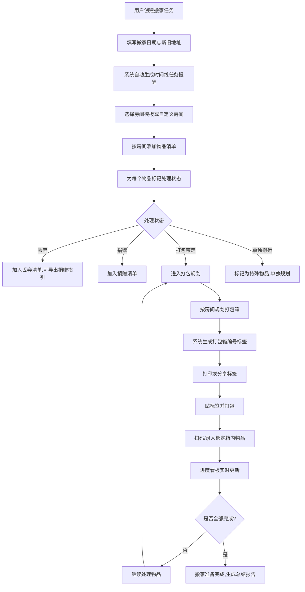
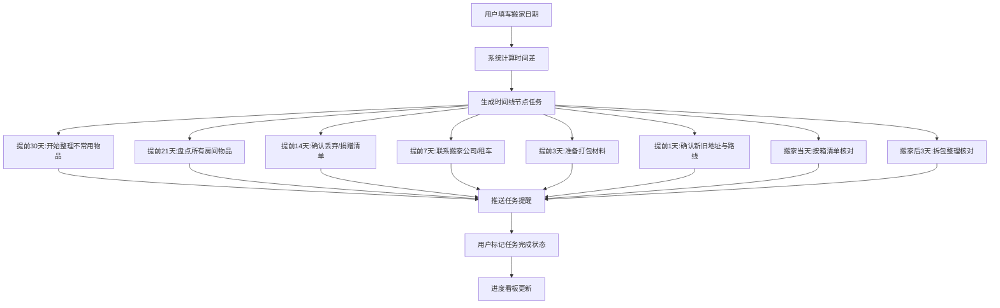
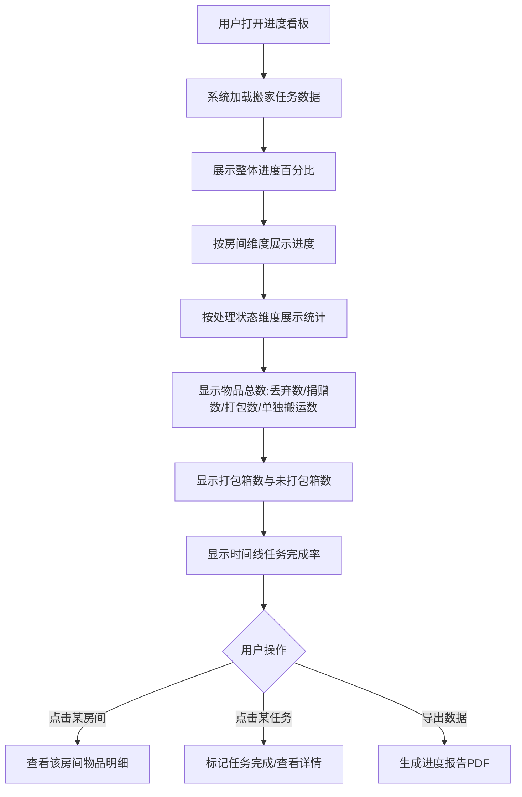
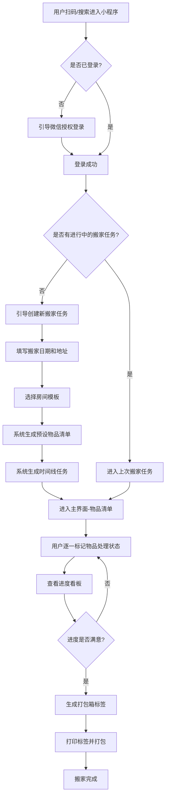
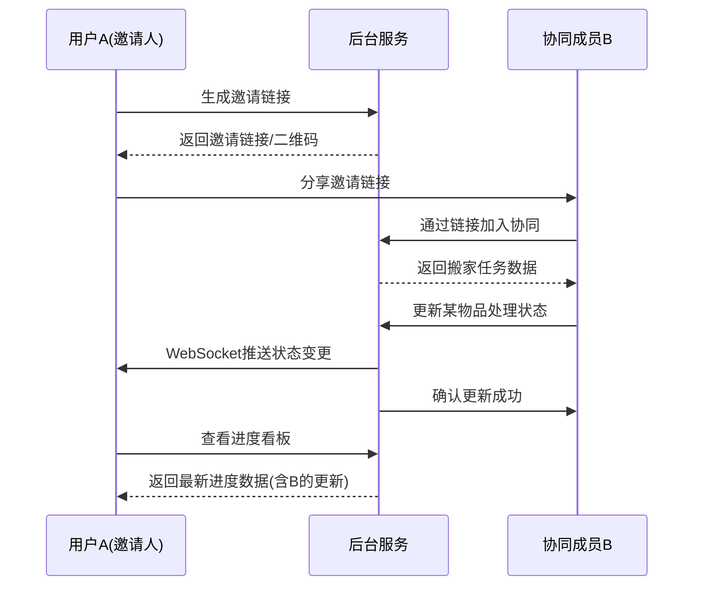
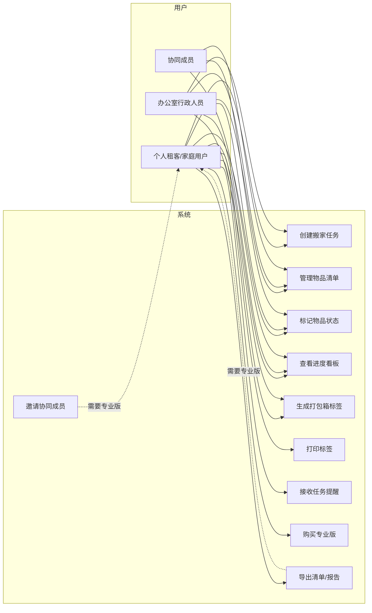
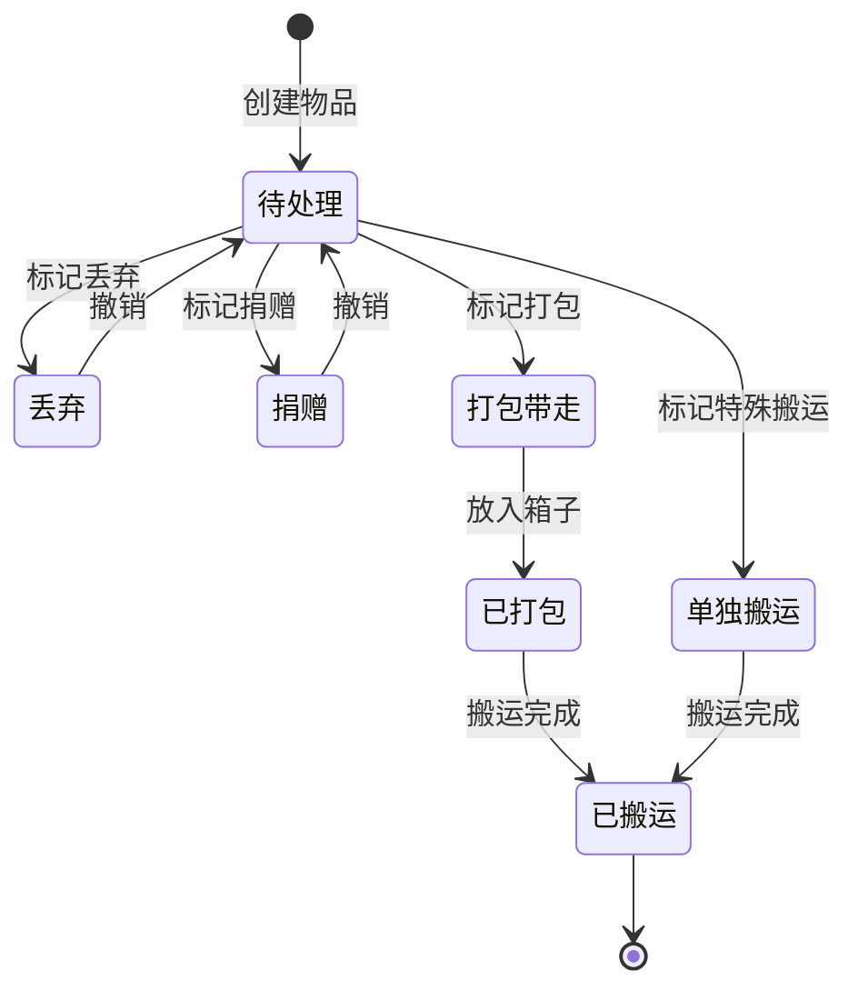
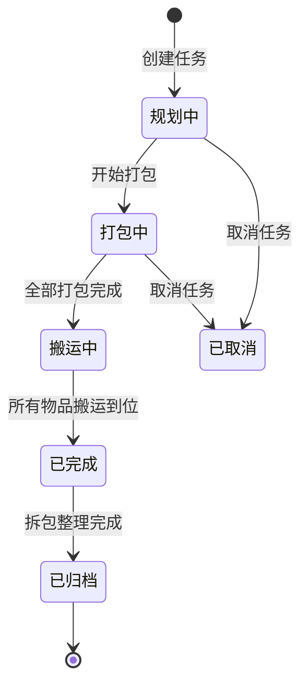

# 搬家物品清单与进度跟踪器 - 用户需求说明书

# 1.需求概述

搬家物品清单与进度跟踪器是面向搬家场景的轻量级个人工具产品，以"帮用户理清物品、管好进度、贴好箱标签"为核心价值，聚焦搬家前最易被忽视却最易出问题的"物品整理、打包规划与进度追踪"环节，帮助即将搬家的个人租客、家庭用户、以及负责办公室搬迁的行政人员，将原本依赖大脑记忆或零散便签的搬家准备工作，转变为清单化、时间线化、可视化的标准化流程，从而降低物品遗漏、打包混乱、进度失控带来的焦虑和时间浪费。

## 1.1 需求介绍

搬家物品清单与进度跟踪器旨在解决搬家准备阶段的三大痛点：
1. 搬家物品零散繁多，用户依赖记忆或零散便签整理，常常临近搬家才发现遗漏关键物品或漏处理特殊物品（如易碎品、贵重品、需单独搬运的大家电）
2. 搬家准备缺乏时间线规划，用户不清楚何时该开始整理、何时该联系搬家公司、何时该通知地址变更，容易在搬家前夕手忙脚乱
3. 打包箱缺乏统一标识，搬到新家后难以快速定位某件物品在哪个箱子里，拆包整理效率低下

### 1.1.1 所属领域

生活服务、个人工具、搬家管理

### 1.1.2 核心价值

- 对个人租客/家庭用户：将杂乱的搬家准备工作结构化，减少物品遗漏风险，降低搬家焦虑
- 对行政人员（办公室搬迁）：统一规划搬迁物品与进度，避免公司资产遗漏或损坏
- 对搬家公司/整理收纳师：为客户提供增值服务工具，提升服务专业度
- 对平台：通过"免费基础版 + 付费专业版"的商业模式获取单次付费收入

## 1.2 需求目标

### 1.2.1 第一期目标（MVP，5-7天）

完成核心清单、任务时间线与箱标签功能：

- 搬家物品清单与进度跟踪器小程序/H5（C端用户）
- 按房间分类的物品清单模板与自定义添加
- 物品状态标记（丢弃/捐赠/打包带走/单独搬运）
- 基于搬家时间线的自动任务提醒
- 进度百分比可视化看板
- 打包箱编号标签生成（含房间+内容摘要+优先级）
- 标签打印功能

### 1.2.2 第二期目标

扩展协同与专业版功能：

- 多箱标签协同管理（专业版）
- 协同成员邀请（家人/室友/同事共同维护清单）
- 扫码查看箱内物品
- 搬家进度报告导出
- 消息通知（任务提醒、进度节点）

### 1.2.3 第三期目标

智能化与生态扩展：

- 基于户型和历史数据的智能推荐清单
- AI 打包建议（根据物品种类推荐打包方式）
- 搬家服务商对接（搬家公司推荐入口）
- 搬家经验沉淀与分享社区

## 1.3 系统使用角色

1. **个人租客/家庭用户（C端用户）**: 即将搬家的个人用户，核心使用场景为创建搬家清单、标记物品状态、跟踪打包进度、生成箱标签
2. **办公室搬迁行政人员**: 负责办公室/公司搬迁的行政人员，核心使用场景为梳理办公资产、规划搬迁进度、生成物品清单与标签
3. **协同成员（专业版）**: 被邀请参与清单维护的家人/室友/同事，核心使用场景为查看并更新自己负责区域的物品清单
4. **整理收纳师/搬家公司（潜在合作方）**: 使用本工具为客户提供增值服务的专业人士（第三期）
5. **平台运营方**: 负责产品运营、用户支持、数据统计的后台管理人员

## 1.4 业务流程图

### 1.4.1 核心业务流程：创建搬家清单到完成打包



### 1.4.2 时间线任务自动生成流程



### 1.4.3 打包箱标签生成与管理流程

```mermaid
flowchart TD
    A[用户完成某房间物品打包] --> B[选择需要生成标签的箱子]
    B --> C[系统生成唯一箱编号]
    C --> D[自动填充标签信息]
    D --> E[房间名称]
    D --> F[内容摘要(系统根据物品自动生成)]
    D --> G[优先级(按物品重要性/易碎性自动推断)]
    D --> H[打包日期]
    E --> I[用户可修改标签内容]
    F --> I
    G --> I
    H --> I
    I --> J[生成标签样式]
    J --> K{用户选择}
    K -->|打印| L[输出打印版式,A4多标签排版]
    K -->|保存电子版| M[保存为图片/PDF]
    K -->|扫码绑定| N[生成二维码,扫码查看箱内物品]
    L --> O[贴上标签]
    M --> O
    N --> O
```

### 1.4.4 进度看板查看流程



# 2.功能原型

| 原型名称 | 原型链接 | 对应端 | 备注 |
| --- | --- | --- | --- |
| 搬家清单主界面 | 由UI原型提供 | 小程序端 | 包含房间列表、物品清单、状态筛选 |
| 进度看板 | 由UI原型提供 | 小程序端 | 包含整体进度、房间维度、时间线维度 |
| 打包箱标签生成 | 由UI原型提供 | 小程序端 | 包含标签编辑、预览、打印排版 |
| 后台运营看板 | 由UI原型提供 | WEB端 | MVP阶段暂不含后台,MVP后扩展 |

# 3.需求清单

## 3.1 用户端-小程序端/H5

### 3.1.1 搬家任务管理

| 模块 | 一级功能 | 二级功能 | 功能描述 | 备注 |
| --- | --- | --- | --- | --- |
| 搬家任务管理 | 创建搬家任务 | 填写基础信息 | 用户填写搬家日期、旧地址、新地址、房屋面积/户型等基础信息 | 必填:搬家日期 |
| 搬家任务管理 | 创建搬家任务 | 选择搬家类型 | 选择搬家类型(个人住宅/办公室/合租),不同类型影响推荐清单模板 | 默认为个人住宅 |
| 搬家任务管理 | 编辑搬家任务 | 修改基础信息 | 修改搬家日期、地址等信息,时间线任务自动重算 | 修改日期后需重新计算任务节点 |
| 搬家任务管理 | 编辑搬家任务 | 删除搬家任务 | 删除当前搬家任务及所有关联数据(需二次确认) | 免费版保留最近1次搬家记录 |
| 搬家任务管理 | 历史任务 | 查看历史搬家记录 | 查看过往搬家任务的清单、进度、标签等数据 | 免费版仅保留最近1次 |
| 搬家任务管理 | 历史任务 | 复用历史清单 | 基于历史搬家清单快速创建新任务 | 专业版功能 |

### 3.1.2 房间与物品清单管理

| 模块 | 一级功能 | 二级功能 | 功能描述 | 备注 |
| --- | --- | --- | --- | --- |
| 房间与物品清单 | 房间管理 | 选择房间模板 | 系统提供预设房间模板(卧室/厨房/客厅/书房/卫生间/阳台/储物间等),用户勾选即可生成 | 不同搬家类型对应不同模板集 |
| 房间与物品清单 | 房间管理 | 自定义添加房间 | 用户可添加模板外的房间(如"琴房""健身房") | 支持自定义房间名称 |
| 房间与物品清单 | 房间管理 | 编辑/删除房间 | 修改房间名称或删除房间(需确认,关联物品一并处理) | 删除房间时提示物品处理方式 |
| 房间与物品清单 | 物品管理 | 使用模板预设物品 | 每个房间模板预置常见物品(如卧室:床、衣柜、床头柜、衣物、被褥等) | 预设物品可勾选是否纳入清单 |
| 房间与物品清单 | 物品管理 | 手动添加物品 | 用户手动输入物品名称、数量、备注 | 支持拍照快速添加 |
| 房间与物品清单 | 物品管理 | 批量添加物品 | 支持一次性添加多个物品(文本换行分隔,每行一个物品) | 提升录入效率 |
| 房间与物品清单 | 物品管理 | 编辑物品信息 | 修改物品名称、数量、所属房间、备注 | - |
| 房间与物品清单 | 物品管理 | 删除物品 | 删除单个物品(需确认) | - |
| 房间与物品清单 | 物品管理 | 物品状态标记 | 为每个物品标记处理状态:丢弃/捐赠/打包带走/单独搬运 | 默认为"打包带走" |
| 房间与物品清单 | 物品管理 | 物品筛选与搜索 | 按房间、处理状态、关键词筛选和搜索物品 | - |
| 房间与物品清单 | 物品管理 | 特殊物品标记 | 标记易碎品、贵重品、需防潮物品等特殊属性 | 用于打包建议和优先级推断 |

### 3.1.3 时间线任务与提醒

| 模块 | 一级功能 | 二级功能 | 功能描述 | 备注 |
| --- | --- | --- | --- | --- |
| 时间线任务 | 自动生成任务 | 基于搬家日期生成节点 | 系统根据搬家日期自动倒推生成任务节点(提前30/21/14/7/3/1天,搬家当天,搬家后3天) | 节点内容可配置 |
| 时间线任务 | 自动生成任务 | 预设任务内容 | 每个节点预设标准任务内容(如提前7天:联系搬家公司) | 用户可修改任务内容 |
| 时间线任务 | 任务管理 | 自定义添加任务 | 用户自行添加时间线外的额外任务 | - |
| 时间线任务 | 任务管理 | 编辑/删除任务 | 修改或删除已生成的任务节点 | - |
| 时间线任务 | 任务管理 | 标记任务完成 | 用户手动标记任务已完成/未完成 | 支持批量标记 |
| 时间线任务 | 任务提醒 | 节点到期推送 | 任务节点到期前通过消息推送提醒用户 | 默认提前1天提醒 |
| 时间线任务 | 任务提醒 | 自定义提醒时间 | 用户可调整单个任务的提醒时间 | - |
| 时间线任务 | 时间线视图 | 日历视图查看 | 以日历形式展示所有任务节点 | - |
| 时间线任务 | 时间线视图 | 列表视图查看 | 以列表形式展示所有任务,按时间排序 | 默认视图 |

### 3.1.4 打包箱标签管理

| 模块 | 一级功能 | 二级功能 | 功能描述 | 备注 |
| --- | --- | --- | --- | --- |
| 打包箱标签 | 创建箱子 | 新增打包箱 | 用户新增打包箱,关联到某个房间 | 可一次新增多个 |
| 打包箱标签 | 创建箱子 | 自动编号 | 系统为每个箱子生成唯一编号(如A01、A02,字母代表房间) | 编号规则可自定义 |
| 打包箱标签 | 标签内容 | 自动填充摘要 | 系统根据箱内物品自动生成内容摘要(如"衣物-冬季外套5件") | 用户可修改 |
| 打包箱标签 | 标签内容 | 自动推断优先级 | 根据物品属性(易碎/贵重/常用)自动推断箱子优先级(高/中/低) | 优先级用于拆包顺序建议 |
| 打包箱标签 | 标签内容 | 手动编辑标签 | 用户手动修改标签的房间名、摘要、优先级、备注 | - |
| 打包箱标签 | 标签内容 | 绑定物品到箱子 | 将清单中的物品拖拽/勾选到具体箱子 | 一个物品只属于一个箱子 |
| 打包箱标签 | 标签输出 | 打印标签 | 生成A4排版的多标签打印页,每页可打印多个标签 | 支持常见打印尺寸 |
| 打包箱标签 | 标签输出 | 保存电子版 | 将标签保存为图片或PDF | - |
| 打包箱标签 | 标签输出 | 生成二维码 | 为每个箱子生成二维码,扫码可查看箱内物品清单 | 专业版功能 |
| 打包箱标签 | 标签管理 | 查看箱子列表 | 查看所有打包箱及其状态(已打包/未打包/已搬运) | - |
| 打包箱标签 | 标签管理 | 扫码查看 | 扫描二维码查看箱内物品详情 | 专业版功能 |

### 3.1.5 进度看板

| 模块 | 一级功能 | 二级功能 | 功能描述 | 备注 |
| --- | --- | --- | --- | --- |
| 进度看板 | 整体进度 | 总进度百分比 | 基于物品处理状态和任务完成情况计算总进度百分比 | 进度公式可配置 |
| 进度看板 | 整体进度 | 关键指标汇总 | 显示物品总数、已处理数、打包箱数、任务完成率 | - |
| 进度看板 | 房间维度进度 | 按房间查看进度 | 每个房间独立显示进度百分比和物品处理情况 | - |
| 进度看板 | 状态维度统计 | 按处理状态统计 | 按丢弃/捐赠/打包/单独搬运分类统计物品数量 | 以饼图或柱状图展示 |
| 进度看板 | 时间线进度 | 任务完成率 | 显示时间线任务的完成情况(已完成/待完成/已过期) | - |
| 进度看板 | 导出报告 | 生成进度报告 | 生成包含进度数据的PDF报告 | 专业版功能 |

### 3.1.6 个人中心与账户

| 模块 | 一级功能 | 二级功能 | 功能描述 | 备注 |
| --- | --- | --- | --- | --- |
| 个人中心 | 账户管理 | 微信授权登录 | 通过微信授权快速登录(小程序场景) | - |
| 个人中心 | 账户管理 | 手机号登录 | 通过手机号+验证码登录(H5场景) | - |
| 个人中心 | 账户管理 | 查看账户等级 | 显示当前账户等级(免费版/专业版)及剩余权益 | - |
| 个人中心 | 会员购买 | 升级专业版 | 单次购买专业版(¥9/次搬家),解锁全部功能 | 微信支付 |
| 个人中心 | 会员购买 | 查看专业版权益 | 展示专业版权益列表(不限物品、多箱标签、协同成员、进度报告) | - |
| 个人中心 | 协同成员 | 邀请协同成员 | 生成邀请链接或二维码,邀请家人/室友/同事共同维护清单 | 专业版功能 |
| 个人中心 | 协同成员 | 管理协同成员 | 查看、移除协同成员,分配负责房间 | 专业版功能 |
| 个人中心 | 数据导出 | 导出清单为Excel | 将物品清单导出为Excel文件 | - |
| 个人中心 | 设置 | 提醒设置 | 统一设置任务提醒的提前时间 | - |
| 个人中心 | 设置 | 意见反馈 | 提交产品使用反馈 | - |

### 3.1.7 权益与版本控制

| 模块 | 一级功能 | 二级功能 | 功能描述 | 备注 |
| --- | --- | --- | --- | --- |
| 权益控制 | 免费版限制 | 物品数量限制 | 免费版限制单次搬家最多50件物品 | 超出后提示升级 |
| 权益控制 | 免费版限制 | 打包箱数量限制 | 免费版限制最多10个打包箱 | - |
| 权益控制 | 免费版限制 | 历史任务限制 | 免费版仅保留最近1次搬家记录 | - |
| 权益控制 | 专业版权益 | 不限物品数量 | 专业版不限单次搬家物品数量 | - |
| 权益控制 | 专业版权益 | 不限打包箱数量 | 专业版不限打包箱数量 | - |
| 权益控制 | 专业版权益 | 多箱标签与二维码 | 专业版支持生成二维码标签 | - |
| 权益控制 | 专业版权益 | 协同成员 | 专业版支持邀请协同成员(最多5人) | - |
| 权益控制 | 专业版权益 | 进度报告导出 | 专业版支持导出PDF进度报告 | - |
| 权益控制 | 升级引导 | 功能触达升级提示 | 用户触及免费版边界时提示升级专业版 | - |

## 3.2 管理端-WEB端

### 3.2.1 平台运营管理(MVP后扩展)

| 模块 | 一级功能 | 二级功能 | 功能描述 | 备注 |
| --- | --- | --- | --- | --- |
| 运营管理 | 用户管理 | 查看用户列表 | 查看注册用户信息、账户等级、搬家次数 | MVP后扩展 |
| 运营管理 | 用户管理 | 查看用户详情 | 查看单个用户的搬家任务、物品清单(脱敏) | MVP后扩展 |
| 运营管理 | 订单管理 | 查看付费订单 | 查看专业版购买记录与支付流水 | MVP后扩展 |
| 运营管理 | 数据统计 | 核心数据看板 | 展示注册用户数、付费转化率、搬家任务数等关键指标 | MVP后扩展 |
| 运营管理 | 内容管理 | 房间模板管理 | 编辑、新增、下架房间物品模板 | MVP后扩展 |
| 运营管理 | 内容管理 | 时间线任务模板管理 | 编辑时间线任务节点的默认内容 | MVP后扩展 |
| 运营管理 | 反馈管理 | 查看用户反馈 | 查看并处理用户提交的意见反馈 | MVP后扩展 |

# 4.非功能需求

## 4.1 使用界面需求

| 编号 | 界面要求 | 说明 |
| --- | --- | --- |
| UI-01 | 主色调建议采用清新、让人放松的色彩 | 搬家是高压场景,界面应减少视觉压力,推荐浅蓝/浅绿/米色系 |
| UI-02 | 物品录入支持单手操作 | 用户常在整理现场使用,需支持单手快速录入 |
| UI-03 | 关键操作路径不超过3步 | 创建任务→添加物品→标记状态,核心路径应极简 |
| UI-04 | 进度数据以可视化图表展示 | 进度百分比、房间维度、状态维度建议用进度条/饼图/柱状图 |
| UI-05 | 标签打印预览真实还原 | 打印前的预览效果必须与实际打印结果一致 |
| UI-06 | 空状态友好引导 | 新用户首次进入时提供清晰的引导(选择房间模板→开始添加) |

## 4.2 软硬件环境需求

| 编号 | 环境 | 要求 |
| --- | --- | --- |
| ENV-01 | 小程序端 | 微信版本 ≥ 7.0,基础库 ≥ 2.20.0 |
| ENV-02 | H5端 | 主流浏览器(Chrome/Safari/Edge 最新两个大版本)及微信内置浏览器 |
| ENV-03 | 后台服务 | 云端部署,支持弹性扩缩容 |
| ENV-04 | 打印适配 | 标签打印适配主流A4纸张及家用喷墨/激光打印机 |

## 4.3 性能需求

| 编号 | 性能指标 | 要求 |
| --- | --- | --- |
| PERF-01 | 页面加载时间 | 首屏加载 ≤ 2秒(4G网络环境) |
| PERF-02 | 物品录入响应 | 添加/修改物品操作响应时间 ≤ 500ms |
| PERF-03 | 进度看板刷新 | 进度数据刷新响应时间 ≤ 1秒 |
| PERF-04 | 标签生成时间 | 单个标签生成 ≤ 1秒,A4多标签排版 ≤ 3秒 |
| PERF-05 | 并发支持 | 支持至少 1000 用户同时在线操作 |
| PERF-06 | 数据持久化 | 用户数据实时保存,避免意外丢失 |

## 4.4 约束性需求

1. **MVP范围约束**:本期(第一期)仅实现C端用户小程序/H5,不实现后台管理功能,后台管理推迟到MVP后扩展
2. **不做搬家服务平台**:本产品定位为纯工具,不接入搬家服务商、不承接搬家订单、不做服务商撮合,与58同城、货拉拉等平台形成差异化
3. **单次付费模式**:专业版采用¥9/次的单次购买模式(按搬家次数),不提供订阅制(第一期)
4. **不处理支付分账**:本期不处理与搬家服务商的分账,仅处理专业版购买的直接收款
5. **系统需要后台服务支撑**:是,需要后端服务提供用户管理、数据存储、标签生成、推送通知等能力

# 5.接口需求

## 5.1 硬件接口需求

| 编号 | 接口名称 | 说明 |
| --- | --- | --- |
| HW-01 | 打印机 | 通过浏览器/小程序的打印能力对接家用/办公打印机,无特殊硬件接口要求 |

## 5.2 软件接口需求

| 模块 | 接口名称 | 输入 | 输出 | 功能描述 |
| --- | --- | --- | --- | --- |
| 用户登录 | 微信授权登录接口 | 微信授权码 | 用户openId、头像、昵称 | 对接微信开放平台,实现小程序端快捷登录 |
| 用户登录 | 手机号验证码接口 | 手机号、验证码 | 登录态token | 对接短信服务商,实现H5端手机号登录 |
| 支付 | 微信支付接口 | 订单信息、金额 | 支付结果、交易流水号 | 对接微信支付,实现专业版单次购买 |
| 消息推送 | 微信订阅消息接口 | 用户openId、消息模板、数据 | 推送结果 | 对接微信订阅消息,实现时间线任务提醒 |
| 消息推送 | 短信发送接口 | 手机号、短信内容 | 发送结果 | 对接短信服务商,作为消息推送的补充渠道 |
| 文件存储 | 对象存储接口 | 图片、PDF文件 | 文件访问URL | 用于用户上传的物品照片、生成的标签PDF、进度报告等文件存储 |
| 打印 | 浏览器/小程序打印接口 | 标签排版数据 | 打印任务 | 调用系统原生打印能力,输出A4多标签排版 |

## 5.4 通讯接口需求

| 编号 | 接口类型 | 说明 |
| --- | --- | --- |
| COMM-01 | HTTPS | 客户端与后台服务之间使用HTTPS加密通讯 |
| COMM-02 | WebSocket(可选) | 协同成员场景下,用于多人实时同步清单变更(第二期) |

# 6. 附录

## 流程图

### 6.1 用户首次使用完整流程



## 时序图

### 6.2 协同成员实时更新时序(第二期)



## （用户与系统交互）用例图

### 6.3 核心用例



## （系统）状态图

### 6.4 物品处理状态流转



### 6.5 搬家任务状态流转


