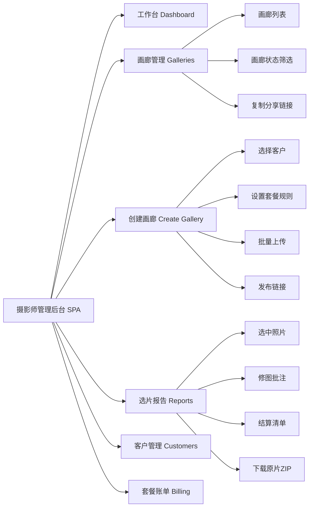
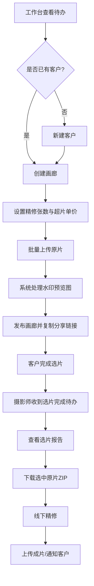
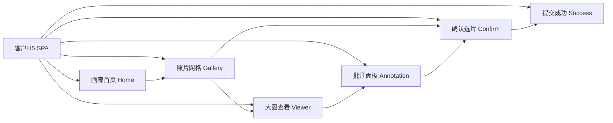
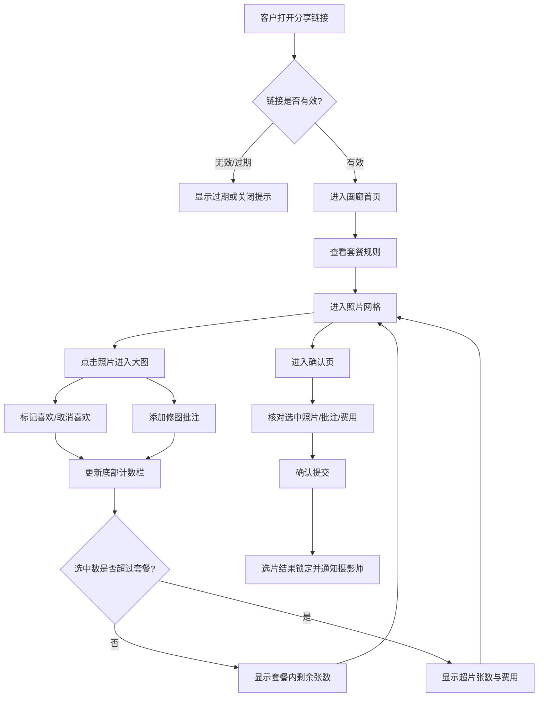
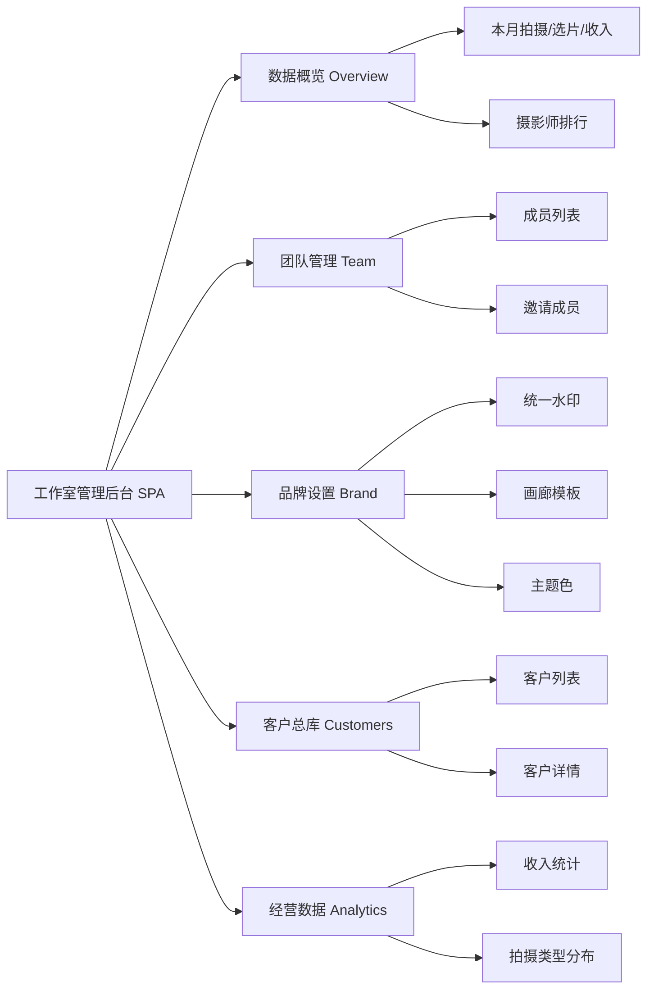
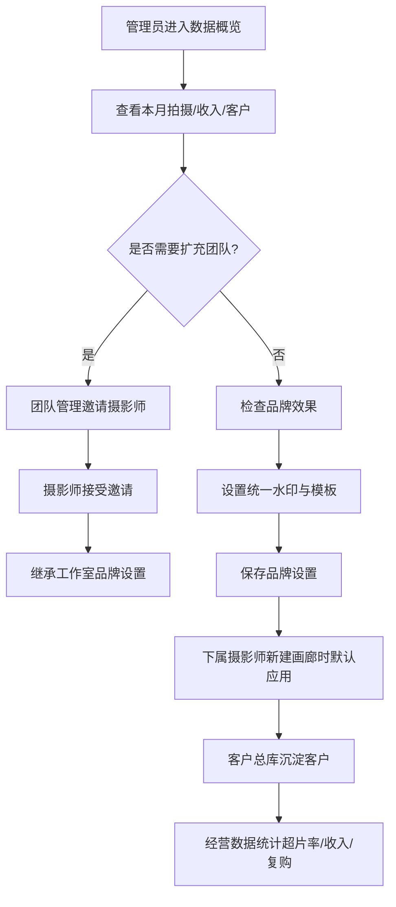

# 摄影师客户选片与交付助手 — 产品需求文档（PRD）

> **文档版本**：v1.1  
> **创建日期**：2026-06-29  
> **文档状态**：返修版（补齐全站 SPA 原型与端级设计）  
> **产品名称**：选片助手（ShootPick）  
> **所属领域**：垂直行业 SaaS — 摄影行业选片交付工具  
> **需求来源**：用户需求说明书（URS）v1.0  

---

## 目录

1. [产品概述](#1-产品概述)
2. [用户画像与使用场景](#2-用户画像与使用场景)
3. [核心功能清单与优先级](#3-核心功能清单与优先级)
4. [商业模式与套餐权益设计](#4-商业模式与套餐权益设计)
5. [详细功能设计 — 摄影师管理后台（WEB）](#5-详细功能设计--摄影师管理后台web)
6. [详细功能设计 — 客户选片画廊（H5）](#6-详细功能设计--客户选片画廊h5)
7. [详细功能设计 — 工作室管理后台（WEB）](#7-详细功能设计--工作室管理后台web)
8. [详细功能设计 — 后台服务](#8-详细功能设计--后台服务)
9. [数据结构设计](#9-数据结构设计)
10. [权限矩阵](#10-权限矩阵)
11. [非功能需求承接](#11-非功能需求承接)
12. [MVP 范围与迭代规划](#12-mvp-范围与迭代规划)
13. [附录：原型索引](#13-附录原型索引)

---

## 1. 产品概述

### 1.1 产品定位

**选片助手（ShootPick）** 是一款面向独立摄影师和小型摄影工作室的轻量级选片交付 SaaS 工具。产品聚焦 **"上传原片 → 带水印在线画廊 → 客户选片标注 → 修图需求收集 → 选片报告 → 超片计费 → 高清原片交付"** 这一完整业务链条，以一条分享链接替代微信来回沟通5小时。

### 1.2 产品价值主张

| 维度 | 传统方式 | 选片助手 |
|------|---------|---------|
| 选片沟通 | 微信逐张发图，反复确认 | 一条链接，客户自助浏览选片 |
| 修图需求 | 微信文字描述，容易遗漏 | 照片上直接标注，所见即所得 |
| 选片统计 | 人工数数，容易出错 | 系统自动汇总，一键生成报告 |
| 超片计费 | 口头约定，结算纠纷多 | 规则透明，系统自动计算 |
| 客户体验 | 需要下载App或登录网盘 | 无需注册，打开链接即用 |

### 1.3 产品目标（量化）

| 目标 | 指标 | 目标值 | 时间窗口 |
|------|------|--------|---------|
| 降低沟通成本 | 每次拍摄后选片沟通时间 | 减少 70%（从3h降至<1h） | MVP 上线3个月 |
| 用户获取 | 注册用户数 | 500+ 摄影师 | 上线6个月 |
| 商业转化 | 免费版→专业版转化率 | 5%-10% | 上线6个月 |
| 客户体验 | 客户选片完成率 | ≥ 85%（48h内完成选片） | 稳态运营 |
| 系统稳定 | 画廊可用性 | ≥ 99.5% | 稳态运营 |

---

## 2. 用户画像与使用场景

### 2.1 摄影师（Photographer）— 核心用户

| 属性 | 描述 |
|------|------|
| **典型画像** | 25-40岁独立摄影师或工作室签约摄影师，擅长婚纱/亲子/人像/宠物/商业摄影 |
| **技术能力** | 熟练使用 Lightroom/PS 精修，但对技术工具接受度中等，偏好"开箱即用" |
| **核心痛点** | ① 微信发图效率低（每次发100-300张耗时1-2h）② 客户选片后修图需求沟通混乱 ③ 超片不好意思收费 ④ 选片结果人工统计易出错 |
| **使用频率** | 每周2-5次拍摄后需要选片交付，每次使用系统15-30分钟 |
| **核心诉求** | 快速完成选片交付流程，减少沟通成本，规范计费 |

### 2.2 客户（Client）— 体验用户

| 属性 | 描述 |
|------|------|
| **典型画像** | 20-45岁女性为主（婚纱/亲子/宠物摄影客户），有一定审美要求 |
| **技术能力** | 日常使用微信/小红书，习惯手机操作，不安装新App |
| **核心痛点** | ① 网盘找图不方便 ② 描述修图需求时说不清楚 ③ 多选片后不知道要加钱 |
| **使用频率** | 每次拍摄后使用1次，每次10-30分钟 |
| **核心诉求** | 方便地浏览照片、直观地表达修图需求、清楚了解费用 |

### 2.3 工作室管理员（Studio Admin）— 管理用户

| 属性 | 描述 |
|------|------|
| **典型画像** | 2-5人合伙摄影工作室的负责人，兼营业务管理 |
| **核心痛点** | ① 团队成员选片数据分散 ② 品牌调性不统一 ③ 客户资源掌握在个人手中 |
| **使用频率** | 每周1-2次，查看团队数据和设置品牌 |
| **核心诉求** | 统一管理团队、统一品牌形象、沉淀客户资源 |

### 2.4 核心使用场景

**场景1：婚纱摄影师小张的选片日常**
> 小张周六为一对新人拍了外景婚纱，周日晚上传200张原片到选片助手，设置精修30张、超片80元/张。把链接发到微信群，新娘当晚花了20分钟选了35张，在5张照片上标注了"瘦脸""去眼袋"。系统自动生成选片报告，小张看到5张超片费用400元，下载选中照片原片精修，3天后上传成片，客户通过链接领取。整个过程比之前省了3小时微信沟通。

**场景2：宠物摄影工作室的品牌统一**
> "萌宠时光"工作室有3位摄影师，管理员在后台设置了统一的品牌水印和画廊模板，所有摄影师创建的画廊自动使用工作室品牌标识。管理员每周查看各摄影师的选片数据和超片收入，发现客户复购率提升了15%。

---

## 3. 核心功能清单与优先级

### 3.1 MVP（P0）— 10天交付

| 序号 | 功能模块 | 功能描述 | 所属端 |
|------|---------|---------|--------|
| F01 | 账号注册 | 手机号+验证码注册登录 | 摄影师端 |
| F02 | 客户档案 | 新建/查看客户（姓名、手机、拍摄类型） | 摄影师端 |
| F03 | 创建画廊 | 关联客户、设定套餐规则（精修张数+超片单价） | 摄影师端 |
| F04 | 批量上传 | 拖拽批量上传原片（JPG/RAW/HEIC），含进度展示 | 摄影师端 |
| F05 | 水印预览图 | 上传后自动生成带水印预览图+缩略图 | 后台服务 |
| F06 | 生成分享链接 | 一键生成H5选片链接，支持复制/二维码 | 摄影师端 |
| F07 | 画廊浏览 | 客户打开链接浏览带水印照片，网格+大图 | 客户端H5 |
| F08 | 标记喜欢 | 单击标记选中/取消，实时计数器 | 客户端H5 |
| F09 | 修图批注 | 大图模式下添加文字批注 | 客户端H5 |
| F10 | 选片计数 | 实时显示已选/套餐含/超片数+费用 | 客户端H5 |
| F11 | 确认选片 | 选片总览+最终确认提交 | 客户端H5 |
| F12 | 选片报告 | 自动生成选中照片+批注+结算清单 | 摄影师端 |
| F13 | 下载原片 | 一键打包下载选中照片高清原片（ZIP） | 摄影师端 |
| F14 | 套餐计费 | 超片自动计算+结算清单生成 | 后台服务 |
| F15 | 选片完成通知 | 客户确认后推送通知给摄影师 | 后台服务 |

### 3.2 增强版（P1）— MVP后2周

| 序号 | 功能模块 | 功能描述 | 所属端 |
|------|---------|---------|--------|
| F16 | 微信登录 | 微信扫码快捷登录 | 摄影师端 |
| F17 | 升级专业版 | 在线支付升级到专业版 | 摄影师端 |
| F18 | 自定义水印 | 设置水印文字/Logo/位置/透明度 | 摄影师端 |
| F19 | 画廊模板 | 选择网格/时间线/故事线模板 | 摄影师端 |
| F20 | 选片截止时间 | 设置到期自动锁定 | 摄影师端 |
| F21 | 链接有效期 | 自定义分享链接过期时间 | 摄影师端 |
| F22 | 导出报告PDF | 选片报告导出为PDF文件 | 摄影师端 |
| F23 | 上传成片 | 精修完成后上传成片，生成领取链接 | 摄影师端 |
| F24 | 领取成片 | 客户查看/下载最终精修成片 | 客户端H5 |
| F25 | 标记不喜欢 | 客户标记排除的照片 | 客户端H5 |
| F26 | 选片到期提醒 | 截止前24h提醒客户 | 后台服务 |
| F27 | 成片领取通知 | 通知客户领取精修成片 | 后台服务 |
| F28 | 团队管理 | 管理员添加/管理摄影师 | 工作室端 |
| F29 | 品牌设置 | 统一品牌水印+画廊模板 | 工作室端 |
| F30 | 数据统计 | 工作室经营数据概览 | 工作室端 |

### 3.3 远期（P2）— 后续迭代

| 序号 | 功能模块 | 功能描述 |
|------|---------|---------|
| F31 | 断点续传 | 大文件上传中断后续传 |
| F32 | 批量标记 | 长按拖动连续多选 |
| F33 | AI选片推荐 | 基于构图/表情自动推荐精修候选 |
| F34 | 视频选片 | 支持视频片段的选片交付 |
| F35 | 在线支付 | 超片费在线结算 |

---

## 4. 商业模式与套餐权益设计

### 4.1 套餐对比

| 功能权益 | 免费版 | 专业版（¥29/月） |
|---------|--------|----------------|
| 每次画廊照片上限 | **50张** | **不限** |
| 客户选片画廊 | ✅ | ✅ |
| 基础水印（系统默认文字） | ✅ | ✅ |
| 自定义水印（Logo+文字+位置+透明度） | ❌ | ✅ |
| 画廊模板 | 默认网格 | 网格/时间线/故事线/自定义 |
| 选片报告（在线查看） | ✅（基础版） | ✅（完整版） |
| 选片报告PDF导出 | ❌ | ✅ |
| 超片计费功能 | ❌ | ✅ |
| 客户管理（档案+历史） | ❌（仅基础新建） | ✅ |
| 品牌画廊定制 | ❌ | ✅ |
| 成片上传与领取 | ❌ | ✅ |
| 选片截止时间设置 | ❌ | ✅ |
| 工作室团队管理 | ❌ | ✅（2-5人） |
| 经营数据统计 | ❌ | ✅ |
| 链接有效期自定义 | 默认7天 | 自定义 |
| 断点续传 | ❌ | ✅ |

### 4.2 超片计费规则

```
结算金额 = 基础套餐价 + 超片费

其中：
- 基础套餐价 = 套餐内含精修张数对应的价格（由摄影师自行设定，如"精修20张 ¥1999"）
- 超片费 = max(0, 客户选中张数 - 套餐内含精修张数) × 超片单价

示例：
- 套餐：精修20张，超片单价 50元/张
- 客户选中 25 张
- 超片费 = (25 - 20) × 50 = 250元
- 结算总额 = 1999 + 250 = 2249元
```

### 4.3 计费规则配置层级

| 层级 | 说明 | 优先级 |
|------|------|--------|
| 画廊级 | 摄影师在创建画廊时可单独设定本次的精修张数和超片单价 | 最高 |
| 账户级 | 摄影师在账户设置中设定的默认值，新建画廊时自动带入 | 次之 |
| 工作室级 | 工作室管理员设定的全局默认值 | 最低 |

### 4.4 付费模式

- **按月订阅**：¥29/月，到期自动降级为免费版（画廊数据保留，专业功能不可用）
- **按年订阅**（v2.0考虑）：¥290/年（相当于8.3折）
- **支付方式**：微信支付/支付宝（MVP阶段暂不实现，超片费线下结算）

---

## 5. 详细功能设计 — 摄影师管理后台（WEB）

### 5.1 端级定位与全站 SPA 设计目标

摄影师管理后台是摄影师完成日常选片交付工作的 **PC Web 单页应用（SPA）**。它不是若干孤立页面的简单集合，而是围绕“创建画廊—分享给客户—接收选片报告—下载原片精修—交付成片”的连续业务闭环提供统一工作台。

| 设计维度 | 设计说明 |
|---------|---------|
| 应用形态 | PC Web SPA，左侧主导航 + 顶部全局操作区 + 中央动态工作区，路由切换不刷新整页。 |
| 主要用户 | 独立摄影师、工作室摄影师。 |
| 核心任务 | 新建客户、创建画廊、批量上传、发布链接、查看选片报告、下载选中原片、管理客户、升级套餐。 |
| 设计目标 | 将摄影师从“微信沟通 + 网盘发图 + 手工统计”转为“一个后台完成全部选片交付动作”。 |
| 原型文件 | [摄影师管理后台全站 SPA 原型](assets/prototypes/photographer-web-spa.html) |

### 5.2 全站信息架构与路由视图



| 路由/视图 | 导航入口 | 主要内容 | 关键操作 |
|----------|---------|---------|---------|
| `/dashboard` 工作台 | 默认首页 | 本周拍摄、待选片、待交付、本月超片收入、最近画廊、待办提醒 | 进入画廊、进入报告、新建画廊 |
| `/galleries` 画廊管理 | 左侧导航“画廊管理” | 画廊卡片列表、状态筛选、选片进度、到期时间 | 查看详情、复制链接、进入报告、删除草稿 |
| `/galleries/new` 创建画廊 | 全局主按钮“新建画廊” | 5步创建向导：客户 → 规则 → 上传 → 设置 → 发布 | 保存草稿、继续下一步、生成分享链接 |
| `/reports` 选片报告 | 左侧导航“选片报告”或画廊卡片进入 | 选中照片、客户批注、超片结算、报告摘要 | 下载原片ZIP、导出PDF、上传成片 |
| `/customers` 客户管理 | 左侧导航“客户管理” | 客户列表、拍摄类型、历史画廊、累计消费 | 新建客户、为客户新建画廊、查看详情 |
| `/billing` 套餐账单 | 左侧导航“套餐账单” | 当前套餐、免费/专业版权益对比、账单记录 | 升级专业版、续费、查看权益 |

### 5.3 全局布局与导航规则

1. **左侧主导航固定**：工作台、画廊管理、创建画廊、选片报告、客户管理、套餐账单始终可见，保证摄影师在任意工作状态都能快速跳转。
2. **顶部全局操作区固定在内容区上方**：包含当前面包屑、页面标题、全局搜索、分享画廊快捷入口和“新建画廊”主按钮。
3. **内容区为动态视图容器**：点击左侧导航或业务按钮时，仅切换内容区视图，不刷新整体应用；上传进度、已填写的画廊草稿、筛选条件保存在前端状态中。
4. **重要业务弹窗全局复用**：分享链接弹窗、新建客户弹窗、升级套餐弹窗作为全局组件，在多个视图内可被调用。
5. **状态反馈统一**：上传中、处理中、选片中、已确认、已交付、已过期使用统一标签颜色和进度条，避免摄影师跨页面理解成本。

### 5.4 端级业务闭环流程



### 5.5 关键状态与数据联动

| 状态/数据 | 触发来源 | 影响范围 | 前端呈现 |
|----------|---------|---------|---------|
| 画廊状态 | 创建、上传完成、客户打开、客户确认、到期、交付完成 | 工作台、画廊列表、报告入口 | 状态标签 + 进度条 + 待办提醒 |
| 选片数量 | 客户端选中/取消选中 | 工作台、画廊卡片、报告页、结算清单 | “已选/套餐含/超片数”实时刷新 |
| 批注数量 | 客户端添加/删除批注 | 报告页、照片缩略图、待办提醒 | 批注图标 + 批注汇总列表 |
| 超片费用 | 选片数量超过套餐上限 | 报告页、账单数据、经营统计 | 超片金额高亮展示 |
| 套餐权益 | 用户升级/到期/降级 | 创建画廊、客户管理、报告导出、上传上限 | 权益限制提示 + 升级引导 |

### 5.6 主要视图设计说明

#### 5.6.1 工作台 Dashboard

- 展示摄影师最常看的四类指标：本周拍摄、待选片、待交付、本月超片收入。
- “最近画廊”卡片直接展示客户名、照片数、选片进度和状态，支持一键进入报告。
- “待办提醒”按紧急程度排序：选片已确认待处理 > 即将到期 > 专业版权益推荐。

#### 5.6.2 画廊管理 Galleries

- 支持按状态筛选：全部、待选片、选片中、已确认、已交付、已过期。
- 每个画廊卡片必须显示：封面、标题、客户、总照片数、选片进度、截止时间、状态。
- 卡片操作包含：查看、复制链接、进入报告；草稿状态额外支持继续编辑/删除。

#### 5.6.3 创建画廊 Create Gallery

- 使用5步向导降低复杂度：选择客户、套餐规则、上传照片、画廊设置、预览发布。
- 上传区域支持拖拽上传、批量进度展示、失败重试、暂停/继续。
- 免费版在上传超过50张时触发权益限制提示；专业版展示“不限照片数”。
- 发布完成后弹出分享链接弹窗，支持复制链接、生成二维码、发送邀请短信。

#### 5.6.4 选片报告 Reports

- 左侧展示选中照片缩略图，右侧展示当前照片、批注、结算清单。
- 报告顶部展示汇总指标：总照片、选中、批注、超片数、超片费。
- 核心操作固定在报告头部：下载原片ZIP、导出PDF、上传成片。

#### 5.6.5 客户管理 Customers

- 免费版仅支持创建基础客户；专业版支持历史画廊、累计消费、客户详情和筛选。
- 客户列表中的“新建画廊”按钮会把客户信息带入创建画廊向导。

#### 5.6.6 套餐账单 Billing

- 用权益对比方式清晰说明免费版与专业版差异。
- 专业版价值重点突出“不限照片数、自定义水印、超片计费、客户管理、报告导出”。

### 5.7 验收标准

| 验收项 | 标准 |
|-------|------|
| SPA导航 | 点击任一导航项时内容区切换，左侧导航高亮正确，顶部标题与面包屑同步更新。 |
| 创建闭环 | 可从工作台进入新建画廊，完成规则设置、上传展示、发布链接弹窗，再返回画廊列表。 |
| 报告闭环 | 可从画廊卡片进入选片报告，查看照片、批注、结算，并触发下载/导出入口。 |
| 数据联动 | 画廊状态、选片数、超片费在工作台、画廊列表、报告中保持一致。 |
| 权益提示 | 免费版上传上限、报告导出、客户管理等限制必须有明确升级引导。 |

---

## 6. 详细功能设计 — 客户选片画廊（H5）

### 6.1 端级定位与全站 SPA 设计目标

客户选片画廊是客户通过摄影师分享链接访问的 **移动优先 H5 单页应用（SPA）**。客户无需注册、无需下载 App，进入链接后在一个连续的移动端应用内完成“查看拍摄信息—浏览照片—选中照片—添加修图批注—确认超片费用—提交选片”的完整流程。

| 设计维度 | 设计说明 |
|---------|---------|
| 应用形态 | H5 SPA，手机优先，适配微信内置浏览器、iOS Safari、Android Chrome，兼容平板和PC浏览。 |
| 主要用户 | 摄影客户，通常没有学习成本容忍度，强调打开即用。 |
| 核心任务 | 浏览带水印照片、标记喜欢、添加修图批注、查看超片费用、提交最终选片结果。 |
| 设计目标 | 用沉浸式画廊体验替代网盘/微信群发图，让客户在10-30分钟内完成选片并清晰确认费用。 |
| 原型文件 | [客户选片画廊 H5 全站 SPA 原型](assets/prototypes/client-h5-spa.html) |

### 6.2 全站信息架构与路由视图



| 视图 | 进入方式 | 主要内容 | 关键操作 |
|------|---------|---------|---------|
| `home` 画廊首页 | 打开分享链接后默认进入 | 摄影师信息、拍摄主题、照片总数、套餐规则、截止时间 | 开始选片、查看已选 |
| `gallery` 照片网格 | 点击“开始选片” | 照片缩略图、选中标记、批注标记、底部计数栏 | 点击照片进入大图、快速进入确认页 |
| `viewer` 大图查看 | 点击任意照片 | 大图预览、水印、当前序号、选中/批注/下一张工具 | 选中/取消、添加批注、切换照片 |
| `annotation` 批注面板 | 大图内展开 | 快捷批注标签、手动输入框、已有批注 | 添加/删除批注 |
| `confirm` 确认提交 | 底部“确认”或首页“查看已选” | 选中统计、选中缩略图、批注汇总、费用确认 | 继续修改、确认提交 |
| `success` 提交成功 | 点击确认提交后 | 提交结果说明、后续等待摄影师精修 | 返回首页 |

### 6.3 全局交互与状态管理

1. **链接态访问**：客户通过带 token 的分享链接进入，不需要登录；系统基于 token 识别画廊、套餐规则和客户上下文。
2. **底部计数栏常驻**：在照片网格视图底部显示已选张数、套餐剩余/超片数、超片费用和确认按钮。
3. **选片状态即时保存**：客户每次选中、取消、添加批注后，前端立即乐观更新，后台异步保存；网络失败时提示重试。
4. **大图和网格共享状态**：在大图中选中或添加批注后，返回网格时对应照片立即显示选中勾选和批注标记。
5. **确认提交二次确认**：客户提交前必须看到选中数量、批注汇总、超片费用；确认后选片结果锁定。
6. **防下载基础保护**：全站禁用右键、禁用长按保存提示，展示的仅为带水印预览图，不暴露高清原片地址。

### 6.4 端级业务闭环流程



### 6.5 关键页面与组件设计说明

#### 6.5.1 画廊首页 Home

- 使用深色沉浸背景，突出摄影作品和摄影师品牌。
- 展示摄影师头像、摄影师/工作室名称、拍摄主题、照片总数、套餐内含张数、超片单价、截止时间。
- 主按钮为“开始选片”，次按钮为“查看已选”，方便客户中途返回。

#### 6.5.2 照片网格 Gallery

- 手机端采用3列宫格，平板/PC可自适应增加列数。
- 每张照片显示：水印预览图、选中标记、批注标记、基础水印文字。
- 点击照片进入大图，不在网格中承载复杂批注操作，保证浏览效率。

#### 6.5.3 大图查看 Viewer

- 大图区域占据主要视野，工具栏包含选中、批注、下一张。
- 选中按钮与当前照片状态同步；点击后状态立即反馈。
- 大图底部展开批注面板，包含常用快捷标签：去黑眼圈、调亮、瘦脸、背景偏暖等。

#### 6.5.4 确认选片 Confirm

- 顶部统计：已选、套餐含、超片、批注数量。
- 中部显示选中照片缩略图，帮助客户核对是否漏选/多选。
- 批注汇总按照片编号分组，费用确认显示套餐价、超片费、结算总额。
- 点击“确认提交选片”后弹出提交成功状态，后台生成报告并通知摄影师。

### 6.6 异常与边界处理

| 场景 | 处理方式 |
|------|---------|
| 分享链接过期 | 显示“画廊已过期，请联系摄影师延长选片时间”。 |
| 画廊被摄影师关闭 | 显示“该画廊已关闭”，不展示照片内容。 |
| 网络中断 | 保留本地已选状态，提示“网络恢复后自动保存”，提交时必须再次校验。 |
| 客户超过套餐张数 | 不阻止继续选择，但实时展示超片数量与费用。 |
| 客户未选任何照片 | 确认按钮禁用，并提示“请至少选择1张照片”。 |
| 客户提交后返回修改 | 显示只读状态，提示“选片已提交，如需修改请联系摄影师”。 |

### 6.7 验收标准

| 验收项 | 标准 |
|-------|------|
| 无登录访问 | 客户打开链接后直接进入画廊首页，不出现注册/登录阻断。 |
| SPA流转 | 首页、网格、大图、批注、确认、成功状态在同一 H5 内完成切换。 |
| 选片反馈 | 选中/取消后，网格、大图工具栏、底部计数栏和确认页统计全部同步。 |
| 超片计费 | 当已选数超过套餐内含张数时，实时显示超片张数与费用。 |
| 批注汇总 | 大图添加的批注能在确认页按照片编号汇总展示。 |
| 移动适配 | 375px 宽度下无横向滚动，底部操作栏不遮挡主要内容。 |

---

## 7. 详细功能设计 — 工作室管理后台（WEB）

### 7.1 端级定位与全站 SPA 设计目标

工作室管理后台是专业版工作室管理员使用的 **PC Web 单页应用（SPA）**。它面向2-5人的小型摄影工作室，重点解决“团队成员分散、品牌不统一、客户资源不沉淀、经营数据不可见”的管理问题。

| 设计维度 | 设计说明 |
|---------|---------|
| 应用形态 | PC Web SPA，左侧工作室级导航 + 顶部管理操作 + 中央管理视图。 |
| 主要用户 | 工作室管理员、主理人、具备管理权限的高级摄影师。 |
| 核心任务 | 查看经营数据、管理摄影师成员、设置统一品牌水印/模板、查看客户总库、分析收入与超片率。 |
| 设计目标 | 将工作室从“个人摄影师各自为战”转为“统一品牌、统一客户资源、统一经营数据”的轻量团队管理。 |
| 原型文件 | [工作室管理后台全站 SPA 原型](assets/prototypes/studio-web-spa.html) |

### 7.2 全站信息架构与路由视图



| 路由/视图 | 导航入口 | 主要内容 | 关键操作 |
|----------|---------|---------|---------|
| `/overview` 数据概览 | 默认首页 | 本月拍摄、选片完成、超片收入、客户总数、摄影师排行、收入走势 | 进入团队管理、进入品牌设置 |
| `/team` 团队管理 | 左侧导航“团队管理” | 摄影师成员卡片、在线状态、画廊数、超片收入、权限角色 | 邀请成员、编辑权限、查看成员数据 |
| `/brand` 品牌设置 | 左侧导航“品牌设置” | Logo、水印文字、透明度、模板布局、主题色、客户画廊预览 | 保存品牌设置、预览画廊效果 |
| `/customers` 客户总库 | 左侧导航“客户总库” | 工作室下所有客户、归属摄影师、拍摄类型、累计消费 | 查看详情、导出客户 |
| `/analytics` 经营数据 | 左侧导航“经营数据” | 按摄影师收入、超片率、拍摄类型分布、复购分析 | 筛选时间、导出报表 |

### 7.3 全局布局与管理规则

1. **工作室身份固定展示**：左侧导航顶部固定展示工作室名称、套餐状态、团队人数，避免管理员混淆个人后台与工作室后台。
2. **数据视图优先**：默认进入数据概览页，将本月拍摄、选片完成、超片收入和客户总数作为一级指标。
3. **成员与品牌互通**：团队成员创建画廊时默认继承工作室品牌设置；管理员修改品牌设置后，仅影响新建画廊，历史画廊保留原配置。
4. **客户资源归集**：所有摄影师创建的客户档案进入客户总库，管理员可按摄影师、拍摄类型、消费金额筛选。
5. **权限可控**：管理员可邀请成员、编辑成员角色、禁用成员账号；普通摄影师不能访问工作室经营数据和品牌全局设置。

### 7.4 端级业务闭环流程



### 7.5 关键页面与组件设计说明

#### 7.5.1 数据概览 Overview

- 以工作室经营看板形式展示核心指标：本月拍摄、选片完成、超片收入、客户总数。
- 摄影师工作量排行展示每个成员的画廊数、超片收入和在线状态。
- 收入走势使用简易柱状图表达，帮助管理员快速判断本月业绩变化。

#### 7.5.2 团队管理 Team

- 成员以卡片呈现：头像、姓名、角色、在线状态、本月画廊数、超片收入。
- 邀请成员支持手机号邀请和邀请链接；邀请成功后成员默认角色为“摄影师”。
- 编辑权限支持三类角色：摄影师、高级摄影师、管理员。

#### 7.5.3 品牌设置 Brand

- 品牌设置包含：工作室名称、Logo、水印文字、水印透明度、画廊模板、主题色。
- 右侧提供客户画廊实时预览，展示水印叠加效果和品牌视觉风格。
- 模板布局包含网格、时间线、故事线；MVP默认支持网格，其他模板作为专业版增强能力展示。

#### 7.5.4 客户总库 Customers

- 汇总工作室全部客户，显示客户姓名、拍摄类型、归属摄影师、拍摄次数、累计消费。
- 支持按拍摄类型、归属摄影师、最近拍摄时间筛选。
- 管理员可导出客户名单，但客户手机号默认脱敏显示。

#### 7.5.5 经营数据 Analytics

- 按摄影师展示拍摄次数、超片率、收入，帮助管理员识别高绩效成员。
- 按拍摄类型展示客户需求分布，为工作室后续营销提供依据。

### 7.6 权限与数据边界

| 操作 | 管理员 | 高级摄影师 | 普通摄影师 |
|------|:-----:|:---------:|:---------:|
| 查看工作室数据概览 | ✅ | ✅（仅汇总） | ❌ |
| 邀请/移除成员 | ✅ | ❌ | ❌ |
| 修改成员角色 | ✅ | ❌ | ❌ |
| 修改统一品牌设置 | ✅ | ❌ | ❌ |
| 查看客户总库 | ✅ | ✅（脱敏） | 仅自己的客户 |
| 导出经营报表 | ✅ | ❌ | ❌ |
| 创建个人画廊 | ✅ | ✅ | ✅ |

### 7.7 验收标准

| 验收项 | 标准 |
|-------|------|
| SPA导航 | 数据概览、团队管理、品牌设置、客户总库、经营数据在同一后台内切换且导航高亮正确。 |
| 品牌预览 | 修改水印文字、模板、主题色时，品牌设置页有明确预览区域。 |
| 团队闭环 | 可从团队管理触发邀请成员弹窗，填写手机号和角色后完成邀请动作。 |
| 数据归集 | 数据概览、团队排行、客户总库、经营数据使用同一套工作室维度数据口径。 |
| 权限边界 | 仅管理员能看到邀请成员、品牌设置、导出经营报表等管理操作。 |

---

## 8. 详细功能设计 — 后台服务

### 8.1 图像处理服务

| 功能 | 输入 | 输出 | 规则 |
|------|------|------|------|
| 水印预览图生成 | 原片 + 水印配置 | 带水印预览图 | 长边1920px，JPEG质量85%，水印叠加 |
| 缩略图生成 | 原片 | 缩略图 | 长边400px，JPEG质量75% |
| 原片存储 | 原片文件 | 存储URL | 原始格式存储到OSS，加密保存 |
| 批量处理 | 多张原片 | 异步任务 | 上传后异步入队处理，完成后可查看 |

**处理流程**：
```
原片上传 → OSS存储原片 → 异步入队 → 生成水印预览图 → 生成缩略图 → 更新画廊状态为"待选片"
```

**性能指标**：
- 单张水印预览图生成 ≤ 2秒
- 100张照片批量处理完成 ≤ 60秒

### 8.2 套餐计费服务

**规则引擎**：
```
输入：画廊ID、客户选片操作
处理：
  1. 读取画廊的套餐规则（精修上限N、超片单价P）
  2. 统计当前选中照片数C
  3. 如果 C ≤ N：超片数=0，超片费=0
  4. 如果 C > N：超片数=C-N，超片费=(C-N)×P
输出：当前选中数、超片数、超片费用
```

**结算清单生成**：
```json
{
  "gallery_id": "xxx",
  "package": {
    "name": "精修20张套餐",
    "included_count": 20,
    "base_price": 1999
  },
  "selection": {
    "total_selected": 25,
    "over_count": 5,
    "over_price_per_photo": 50,
    "over_fee": 250
  },
  "total_amount": 2249,
  "annotations_count": 8,
  "created_at": "2026-06-29T10:00:00Z"
}
```

### 8.3 通知服务

| 通知类型 | 触发条件 | 接收方 | 通知方式 | 内容模板 |
|---------|---------|--------|---------|---------|
| 选片邀请 | 摄影师发布画廊 | 客户 | 短信/微信 | "【{摄影师名}】为您创建了选片画廊《{主题}》，共{N}张照片，请点击链接选片：{url}" |
| 选片完成 | 客户确认选片 | 摄影师 | 站内+微信 | "客户{姓名}已完成选片，选中{N}张，超片{M}张，请查看选片报告" |
| 选片到期提醒 | 截止前24h | 客户 | 短信/微信 | "您有{N}张照片待选片，截止时间{time}，请尽快完成：{url}" |
| 成片可领取 | 摄影师上传成片 | 客户 | 短信/微信 | "您的精修成片已准备好，共{N}张，请点击链接查看/下载：{url}" |

### 8.4 报告服务

**选片报告数据结构**：
```json
{
  "report_id": "rpt_20260629001",
  "gallery_id": "gal_20260628001",
  "client": {
    "name": "张小红",
    "phone": "138****8888"
  },
  "photographer": {
    "name": "李明摄影"
  },
  "summary": {
    "total_photos": 120,
    "selected_count": 25,
    "package_included": 20,
    "over_count": 5,
    "annotations_count": 8,
    "over_fee": 250,
    "base_price": 1999,
    "total_amount": 2249
  },
  "selected_photos": [
    {
      "photo_id": "ph_001",
      "thumbnail_url": "https://cdn.example.com/thumb/ph_001.jpg",
      "original_url": "https://oss.example.com/original/ph_001.raw",
      "annotations": [
        {
          "content": "去黑眼圈",
          "created_at": "2026-06-29T09:15:00Z"
        },
        {
          "content": "调亮一点",
          "created_at": "2026-06-29T09:16:00Z"
        }
      ]
    }
  ],
  "status": "confirmed",
  "confirmed_at": "2026-06-29T09:30:00Z"
}
```

---

## 9. 数据结构设计

### 9.1 核心实体关系

```
Photographer (摄影师)
  ├── Customer[] (客户)
  ├── Gallery[] (画廊)
  └── Package (套餐)

Gallery (画廊)
  ├── Customer (关联客户)
  ├── Photo[] (照片)
  ├── SelectionRule (选片规则)
  ├── Report (选片报告)
  └── ShareLink (分享链接)

Photo (照片)
  ├── Original (原片)
  ├── Preview (水印预览图)
  ├── Thumbnail (缩略图)
  └── Annotation[] (批注)

Report (选片报告)
  ├── SelectedPhoto[] (选中照片)
  ├── BillingSummary (结算清单)
  └── AnnotationSummary (批注汇总)
```

### 9.2 关键数据表设计（逻辑层）

**Gallery（画廊表）**：
| 字段 | 类型 | 说明 |
|------|------|------|
| id | UUID | 画廊唯一标识 |
| photographer_id | UUID | 所属摄影师 |
| customer_id | UUID | 关联客户 |
| title | String | 画廊标题/拍摄主题 |
| status | Enum | 状态：draft/uploading/processing/ready/selecting/confirmed/delivering/completed/expired |
| total_photos | Int | 照片总数 |
| included_count | Int | 套餐内含精修张数 |
| over_price | Decimal | 超片单价（元） |
| template | String | 画廊模板标识 |
| watermark_config | JSON | 水印配置 |
| expires_at | DateTime | 选片截止时间 |
| share_token | String | 分享链接唯一标识 |
| created_at | DateTime | 创建时间 |
| updated_at | DateTime | 更新时间 |

**Photo（照片表）**：
| 字段 | 类型 | 说明 |
|------|------|------|
| id | UUID | 照片唯一标识 |
| gallery_id | UUID | 所属画廊 |
| original_url | String | 原片存储URL |
| preview_url | String | 水印预览图URL |
| thumbnail_url | String | 缩略图URL |
| group_name | String | 分组名称（场景/服装） |
| sort_order | Int | 排序序号 |
| processing_status | Enum | 处理状态：pending/processing/done/failed |
| created_at | DateTime | 上传时间 |

**Annotation（批注表）**：
| 字段 | 类型 | 说明 |
|------|------|------|
| id | UUID | 批注唯一标识 |
| photo_id | UUID | 所属照片 |
| gallery_id | UUID | 所属画廊 |
| content | String | 批注内容 |
| created_at | DateTime | 创建时间 |

**Selection（选片记录表）**：
| 字段 | 类型 | 说明 |
|------|------|------|
| id | UUID | 记录唯一标识 |
| gallery_id | UUID | 所属画廊 |
| photo_id | UUID | 照片ID |
| status | Enum | liked / disliked / unmarked |
| confirmed | Boolean | 是否已确认 |
| created_at | DateTime | 标记时间 |

---

## 10. 权限矩阵

### 10.1 功能权限

| 功能 | 免费版摄影师 | 专业版摄影师 | 工作室管理员 | 客户 |
|------|:----------:|:----------:|:----------:|:----------:|
| 注册/登录 | ✅ | ✅ | ✅ | — |
| 创建客户档案（基础） | ✅ | ✅ | ✅ | — |
| 客户管理（编辑/历史） | ❌ | ✅ | ✅ | — |
| 创建画廊 | ✅ | ✅ | ✅ | — |
| 每次上传≤50张 | ✅ | — | — | — |
| 每次上传不限张数 | ❌ | ✅ | ✅ | — |
| 基础水印 | ✅ | ✅ | ✅ | — |
| 自定义水印 | ❌ | ✅ | ✅ | — |
| 画廊模板选择 | 默认 | ✅ | ✅ | — |
| 生成分享链接 | ✅ | ✅ | ✅ | — |
| 浏览画廊 | — | — | — | ✅ |
| 标记喜欢/选片 | — | — | — | ✅ |
| 添加修图批注 | — | — | — | ✅ |
| 确认选片 | — | — | — | ✅ |
| 查看选片报告（在线） | ✅ | ✅ | ✅ | — |
| 导出报告PDF | ❌ | ✅ | ✅ | — |
| 下载选中照片原片 | ✅ | ✅ | ✅ | — |
| 上传成片/通知客户 | ❌ | ✅ | ✅ | — |
| 领取成片 | — | — | — | ✅ |
| 设置选片截止时间 | ❌ | ✅ | ✅ | — |
| 超片计费 | ❌ | ✅ | ✅ | — |
| 添加摄影师 | — | — | ✅ | — |
| 品牌设置 | — | — | ✅ | — |
| 查看经营数据 | — | — | ✅ | — |
| 查看工作室客户总库 | — | — | ✅ | — |

### 10.2 数据权限

| 数据 | 可见范围 |
|------|---------|
| 摄影师自己的画廊/客户/报告 | 摄影师本人 |
| 工作室下所有摄影师的画廊/客户/报告 | 工作室管理员 + 对应摄影师 |
| 客户的选片数据 | 对应摄影师 + 工作室管理员 |
| 高清原片 | 仅摄影师 + 工作室管理员（客户只能看水印预览图） |
| 客户手机号 | 对应摄影师 + 工作室管理员（脱敏展示） |

---

## 11. 非功能需求承接

### 11.1 性能指标

| 指标 | 目标值 | 实现方案 |
|------|--------|---------|
| 画廊首屏加载（100张） | ≤ 3秒 | 缩略图CDN分发 + 懒加载 + 分页请求 |
| 大图切换响应 | ≤ 500ms | 预加载相邻2张 + 浏览器缓存 |
| 选片标记响应 | ≤ 200ms | 乐观更新 + 异步提交 |
| 批量上传（500张） | 不阻塞浏览器 | Web Worker + 分片上传 + 并发控制（3路） |
| 水印预览图生成 | ≤ 2秒/张 | 异步队列 + 图片处理服务弹性扩缩 |
| 并发客户在线选片 | ≥ 100 | 无状态服务 + 水平扩展 + 数据库读写分离 |

### 11.2 安全需求

| 需求 | 方案 |
|------|------|
| 原片防下载 | 禁用右键菜单、禁用长按保存、CSS pointer-events控制、预览图仅展示水印版 |
| 分享链接安全 | 唯一Token + 有效期 + 可手动关闭 |
| 数据传输 | 全链路HTTPS |
| 原片存储 | OSS服务端加密 + 访问鉴权 |
| 用户认证 | JWT Token + 刷新机制 |

### 11.3 可用性

| 需求 | 方案 |
|------|------|
| 系统可用性 | ≥ 99.5%（月度） |
| 数据备份 | 原片跨Region冗余存储 |
| 故障恢复 | RTO ≤ 4小时，RPO ≤ 1小时 |

---

## 12. MVP 范围与迭代规划

### 12.1 MVP（v1.0）— 10天

**目标**：验证核心选片交付流程是否解决摄影师痛点

**范围**：所有P0功能（F01-F15）

**不包含**：
- 在线支付（超片费线下结算）
- AI智能推荐
- 视频选片
- 工作室团队管理
- 成片上传与领取

### 12.2 v1.1 — MVP后2周

**目标**：完善专业版功能，提升品牌价值和客户体验

**范围**：所有P1功能（F16-F30）

### 12.3 v2.0 — 上线3个月后

**目标**：差异化竞争，提升效率和用户体验

**范围**：P2功能（F31-F35）+ AI选片推荐 + 在线支付

---

## 13. 附录：原型索引

### 13.1 端级全站 SPA 原型（主索引）

> 本节为本产品交付验收的主原型索引，3个原型均为端级全站点单页应用（SPA）原型，覆盖全站导航、路由视图切换、核心业务闭环与关键交互状态。

| 原型名称 | 文件路径 | 对应端 | 原型级别 | 覆盖范围 |
|---------|---------|--------|---------|---------|
| 摄影师管理后台全站 SPA | [assets/prototypes/photographer-web-spa.html](assets/prototypes/photographer-web-spa.html) | 摄影师端 WEB | 端级全站 SPA | 工作台、画廊管理、创建画廊、选片报告、客户管理、套餐账单；覆盖创建画廊→分享→报告→下载原片闭环 |
| 客户选片画廊 H5 全站 SPA | [assets/prototypes/client-h5-spa.html](assets/prototypes/client-h5-spa.html) | 客户端 H5 | 端级全站 SPA | 画廊首页、照片网格、大图查看、修图批注、确认选片、提交成功；覆盖浏览→选片→批注→费用确认→提交闭环 |
| 工作室管理后台全站 SPA | [assets/prototypes/studio-web-spa.html](assets/prototypes/studio-web-spa.html) | 工作室端 WEB | 端级全站 SPA | 数据概览、团队管理、品牌设置、客户总库、经营数据；覆盖团队管理→品牌统一→客户沉淀→经营分析闭环 |

### 13.2 页面 / Widget 级原型（二级索引，保留参考）

> 以下原型为早期页面级或功能片段级原型，用于查看局部交互细节；最终验收以 13.1 的端级全站 SPA 原型为准。

| 原型名称 | 文件路径 | 对应端 | 说明 |
|---------|---------|--------|------|
| 画廊列表页 | `assets/photographer-gallery-list.html` | 摄影师端 | 画廊管理主页面局部原型 |
| 画廊创建/上传页 | `assets/photographer-gallery-upload.html` | 摄影师端 | 步骤式创建画廊局部原型 |
| 选片报告页 | `assets/photographer-report.html` | 摄影师端 | 查看选中照片、批注、结算的局部原型 |
| 套餐与账单页 | `assets/photographer-billing.html` | 摄影师端 | 当前套餐与升级引导局部原型 |
| 客户管理页 | `assets/photographer-customers.html` | 摄影师端 | 客户列表与新建客户局部原型 |
| 客户H5-画廊浏览 | `assets/client-gallery.html` | 客户端H5 | 网格浏览与选片计数局部原型 |
| 客户H5-单图标注 | `assets/client-photo-annotate.html` | 客户端H5 | 大图批注局部原型 |
| 客户H5-确认提交 | `assets/client-confirm.html` | 客户端H5 | 选片总览与费用确认局部原型 |
| 工作室-团队成员 | `assets/studio-team.html` | 工作室端 | 团队成员管理局部原型 |
| 工作室-品牌设置 | `assets/studio-brand.html` | 工作室端 | 品牌水印和模板设置局部原型 |

---

> **文档结束**
> 本文档基于《用户需求说明书（URS）v1.0》编写，v1.1 已根据用户反馈补齐第5~7章端级全站 SPA 设计说明，并将第13章原型索引调整为以全站 SPA 原型为主索引。
