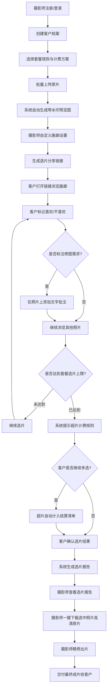
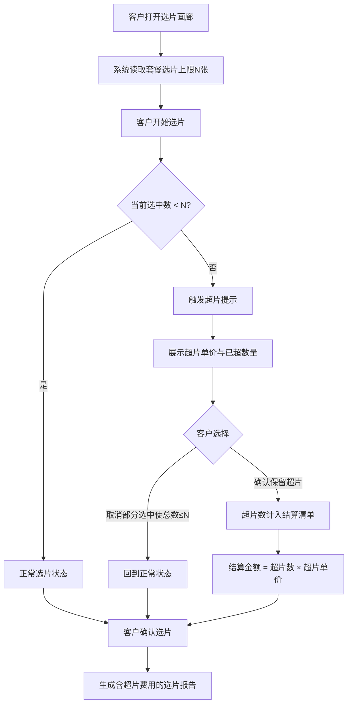
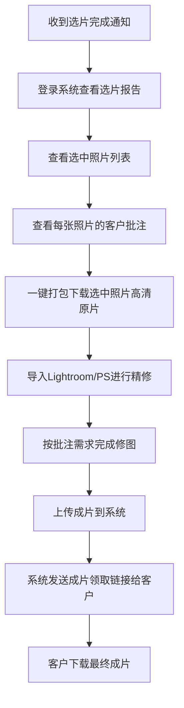
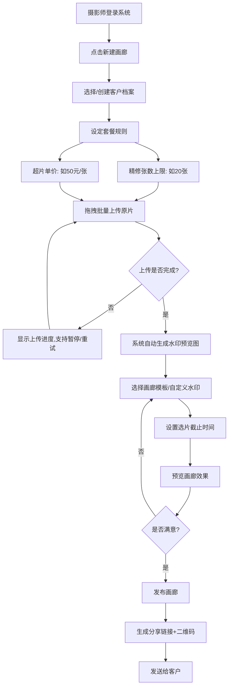
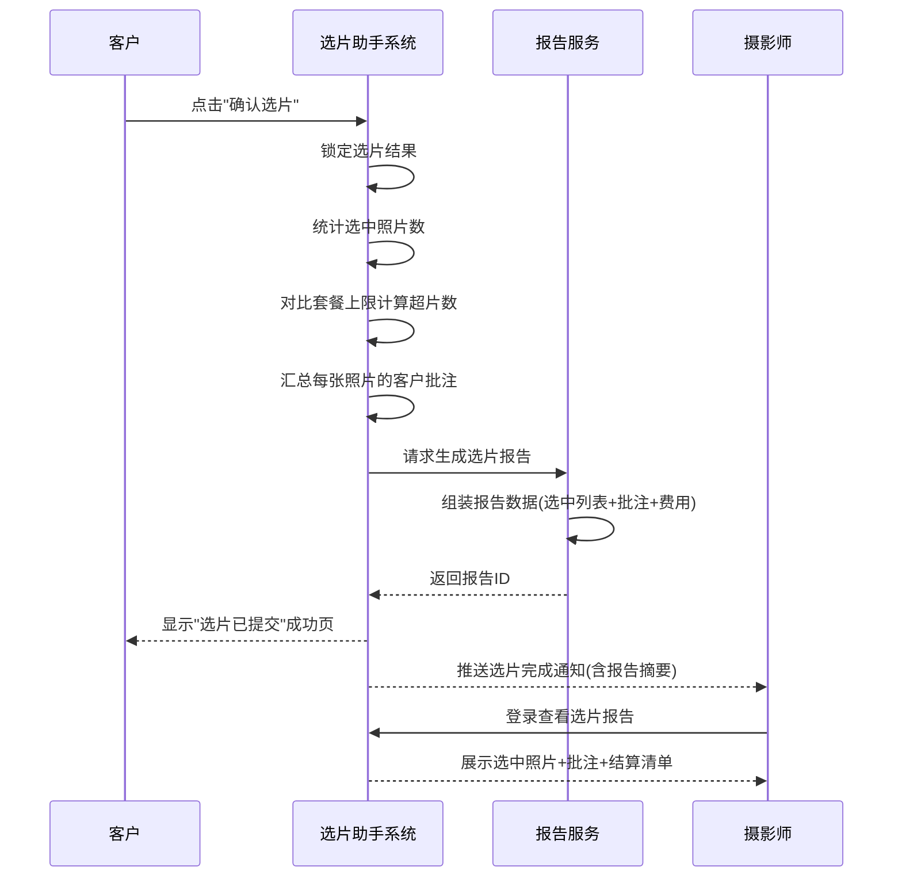
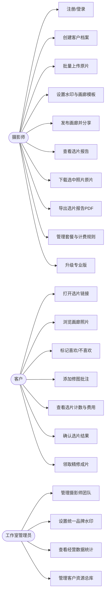
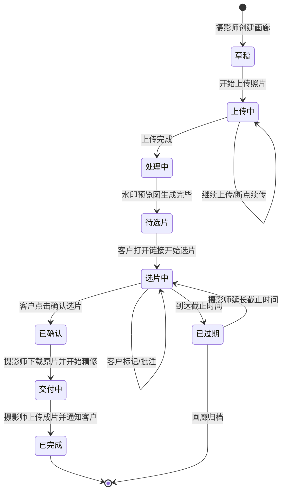

# 1. 需求概述

## 1.1 需求介绍

"摄影师客户选片与交付助手"（以下简称"选片助手"）是一款面向独立摄影师和小型摄影工作室的轻量级选片交付工具。产品聚焦"批量上传原片→带水印在线画廊→客户选片标注→修图需求收集→选片报告汇总→套餐限制与超片计费→高清原片交付"这一完整业务链条，帮助摄影师从微信发图+人工统计的低效模式中解放出来，以一条分享链接的方式完成整个选片与交付流程。

当前摄影师在每次拍摄后通常需要客户从数百张照片中选出精修照片，主要依赖微信逐张发图或网盘分享链接，客户选片后还需微信反复沟通修图需求（"去黑眼圈""调亮""瘦一点"等），整个流程沟通成本高、信息容易遗漏、选片数量难以管控、超片计费全靠人工计算。本产品通过结构化的在线选片画廊，将选片、标注、报告、计费四个环节打通，让摄影师从"微信来回沟通5小时"缩短为"一条链接+一份报告"。

### 1.1.1 所属领域

垂直行业SaaS — 摄影行业选片交付工具

## 1.2 需求目标

1. **降低沟通成本**：将选片、修图需求收集、超片确认三个环节从微信沟通迁移到线上画廊一站式完成，减少摄影师每次拍摄后2-4小时的重复沟通时间。
2. **提升客户体验**：客户通过手机或电脑打开分享链接即可浏览带水印的精选画廊，无需下载App、无需注册账号，在照片上直接标注修图需求，所见即所得。
3. **规范选片流程**：通过套餐选片数量限制和超片自动计费功能，将"客户多选片、摄影师不好意思收费"的灰色地带变为透明的规则化流程，减少结算纠纷。
4. **轻量化与聚焦**：不做通用网盘或相册工具，只聚焦"摄影师选片交付"这一条业务线，确保MVP 10天可交付。
5. **商业化可持续**：通过免费版（≤50张/次）引流，专业版（¥29/月）实现营收，目标转化率5%-10%。

## 1.3 系统使用角色

| 角色 | 说明 |
|------|------|
| 摄影师（Photographer） | 系统的主要使用者和管理者。独立摄影师或工作室摄影师，负责批量上传原片、创建选片画廊、设定套餐规则、查看选片报告、导出选中照片高清原片用于精修、管理客户信息。 |
| 客户（Client） | 摄影师的拍摄客户。通过摄影师分享的链接访问选片画廊，在线浏览照片、标记"喜欢/不喜欢"、在照片上标注修图需求（文字批注）、查看选片数量与超片费用。无需注册账号。 |
| 工作室管理员（Studio Admin） | 专业版角色，适用于2-5人合伙的小型摄影工作室。可管理多位摄影师账号、查看工作室整体选片数据、统一设定品牌水印和画廊模板、管理客户资源。 |

## 1.4 业务流程图

### 1.4.1 核心业务流程总览



### 1.4.2 客户在线选片流程

```mermaid
sequenceDiagram
    participant C as 客户
    participant Link as 选片分享链接(H5)
    participant Sys as 选片助手系统
    participant P as 摄影师

    P->>Sys: 批量上传原片并创建画廊
    Sys->>Sys: 自动生成带水印预览图
    Sys-->>P: 返回分享链接
    P->>C: 通过微信/短信发送链接
    C->>Link: 打开选片链接(无需注册)
    Link->>Sys: 请求画廊数据
    Sys-->>Link: 返回照片列表+套餐规则
    Link-->>C: 展示带水印画廊+当前选片计数
    C->>Link: 点击照片标记"喜欢"
    Link->>Sys: 记录选片状态
    Sys->>Sys: 更新选片计数 & 检查套餐上限
    Sys-->>Link: 返回更新后的计数与费用
    C->>Link: 在照片上添加修图批注
    Link->>Sys: 保存批注内容与坐标
    C->>Link: 点击"确认选片"
    Link->>Sys: 提交最终选片结果
    Sys->>Sys: 生成选片报告+结算清单
    Sys-->>P: 推送选片完成通知
```

### 1.4.3 超片计费流程



### 1.4.4 摄影师交付流程



# 2. 功能原型

| 原型名称 | 原型链接 | 对应端 | 备注 |
| --- | --- | --- | --- |
| 摄影师管理后台 | 待产品设计输出 | WEB端 | 摄影师上传、管理画廊、查看报告的主工作台 |
| 客户选片画廊 | 待产品设计输出 | WEB端（H5响应式） | 客户通过分享链接访问的选片页面，手机端优先 |
| 工作室管理后台 | 待产品设计输出 | WEB端 | 专业版工作室管理员角色使用 |

# 3. 需求清单

## 3.1 摄影师管理端-WEB端

| 模块 | 一级功能 | 二级功能 | 功能描述 | 备注 |
| --- | --- | --- | --- | --- |
| 账号与套餐 | 注册/登录 | 手机号注册 | 摄影师通过手机号+验证码完成注册 | P0 |
| 账号与套餐 | 注册/登录 | 微信授权登录 | 摄影师通过微信扫码快捷登录 | P1 |
| 账号与套餐 | 套餐管理 | 查看当前套餐 | 展示当前使用的套餐类型（免费版/专业版）、剩余配额、到期时间 | P0 |
| 账号与套餐 | 套餐管理 | 升级专业版 | 引导摄影师升级到专业版（¥29/月），支持在线支付 | P1 |
| 客户管理 | 客户档案 | 新建客户 | 录入客户姓名、手机号、拍摄类型（婚纱/亲子/宠物等）、拍摄日期 | P0 |
| 客户管理 | 客户档案 | 客户列表 | 按时间/拍摄类型筛选查看所有客户 | P0 |
| 客户管理 | 客户档案 | 编辑/删除客户 | 修改客户信息或删除客户档案（专业版功能） | P1 |
| 画廊管理 | 创建画廊 | 关联客户 | 选择本次拍摄对应的客户档案 | P0 |
| 画廊管理 | 创建画廊 | 设定套餐规则 | 设置本套照片的精修张数上限、超片单价（默认取账户级设置，可单次覆盖） | P0 |
| 画廊管理 | 上传照片 | 批量拖拽上传 | 支持拖拽或点击批量上传原片（JPG/RAW/HEIC），单次最多500张 | P0 |
| 画廊管理 | 上传照片 | 上传进度展示 | 显示上传进度条、已上传/总数、失败重试 | P0 |
| 画廊管理 | 上传照片 | 断点续传 | 网络中断后支持从断点继续上传（专业版功能） | P2 |
| 画廊管理 | 水印设置 | 自动添加水印 | 上传完成后系统自动生成带水印的预览图用于客户浏览 | P0 |
| 画廊管理 | 水印设置 | 自定义水印内容 | 设置水印文字（摄影师姓名/工作室名/联系方式/Logo），支持位置和透明度调整（专业版功能） | P1 |
| 画廊管理 | 画廊设置 | 画廊模板选择 | 选择画廊展示模板（网格/时间线/故事线），专业版支持自定义模板 | P1 |
| 画廊管理 | 画廊设置 | 选片截止时间 | 设置客户选片的截止时间，到期后画廊自动锁定 | P1 |
| 画廊管理 | 分享画廊 | 生成分享链接 | 一键生成带唯一标识的H5选片链接 | P0 |
| 画廊管理 | 分享画廊 | 链接有效期 | 设置分享链接的有效期（默认7天，可自定义） | P1 |
| 画廊管理 | 分享画廊 | 分享方式 | 支持复制链接、生成二维码、直接发送到微信 | P0 |
| 选片报告 | 报告总览 | 选片统计 | 查看选中照片数/未选数/超片数、客户批注总数、预估超片费用 | P0 |
| 选片报告 | 报告总览 | 选中照片列表 | 以缩略图方式展示客户选中的所有照片，支持按批注筛选 | P0 |
| 选片报告 | 报告总览 | 修图需求列表 | 汇总所有照片上的客户批注，按照片分组展示 | P0 |
| 选片报告 | 交付操作 | 一键下载原片 | 将客户选中的照片（高清原片，非水印版）打包为ZIP下载 | P0 |
| 选片报告 | 交付操作 | 导出选片报告 | 将选片报告导出为PDF，包含选中照片缩略图、批注内容、结算金额 | P1 |
| 选片报告 | 交付操作 | 发送成片链接 | 精修完成后上传成片，系统生成领取链接发送给客户 | P1 |

## 3.2 客户选片端-WEB端（H5响应式）

| 模块 | 一级功能 | 二级功能 | 功能描述 | 备注 |
| --- | --- | --- | --- | --- |
| 画廊浏览 | 打开画廊 | 链接校验 | 校验分享链接有效性（是否过期、是否已被 photographer 关闭） | P0 |
| 画廊浏览 | 打开画廊 | 画廊首页 | 展示摄影师信息（头像/名字）、拍摄主题、总照片数、套餐规则说明 | P0 |
| 画廊浏览 | 照片浏览 | 网格视图 | 以网格方式展示所有带水印预览图，支持缩放 | P0 |
| 画廊浏览 | 照片浏览 | 大图查看 | 点击照片进入大图模式，支持左右滑动切换 | P0 |
| 画廊浏览 | 照片浏览 | 照片分组 | 按拍摄场景/服装/时间段自动分组（摄影师上传时可标记） | P1 |
| 选片操作 | 标记喜欢 | 单击标记 | 客户单击照片即可标记为"喜欢/选中"，照片显示选中标记 | P0 |
| 选片操作 | 标记喜欢 | 取消选中 | 再次单击已选中照片可取消选中 | P0 |
| 选片操作 | 标记喜欢 | 批量标记 | 支持长按拖动连续多选（提升大量照片时的选片效率） | P2 |
| 选片操作 | 实时计数 | 选片计数器 | 页面顶部实时显示"已选X张/套餐含Y张/超片Z张" | P0 |
| 选片操作 | 实时计数 | 超片费用提示 | 当选中数超出套餐上限时，实时显示超片费用和结算金额 | P0 |
| 选片操作 | 修图批注 | 添加批注 | 在大图模式下点击"标注"按钮，输入修图需求文字（如"去黑眼圈""调亮""瘦脸"） | P0 |
| 选片操作 | 修图批注 | 批注列表 | 查看当前照片已有的所有批注，支持删除已添加的批注 | P0 |
| 选片操作 | 修图批注 | 批注标记 | 已添加批注的照片在网格视图显示批注图标，便于快速识别 | P0 |
| 选片操作 | 标记不喜欢 | 标记排除 | 客户可标记"不喜欢"的照片，帮助摄影师了解客户偏好 | P1 |
| 确认提交 | 确认选片 | 选片总览 | 提交前展示选中照片缩略图总览、修图批注汇总、超片费用确认 | P0 |
| 确认提交 | 确认选片 | 最终确认 | 客户点击"确认选片"后锁定选片结果，通知摄影师 | P0 |
| 确认提交 | 确认选片 | 修改选片 | 确认前可自由修改选中状态和批注内容 | P0 |
| 确认提交 | 确认选片 | 超时处理 | 到达截止时间未确认时，系统自动提醒客户；过期后画廊锁定为只读 | P1 |
| 成片领取 | 领取成片 | 查看成片 | 摄影师上传精修成片后，客户通过原链接或新链接查看/下载最终成片 | P1 |

## 3.3 工作室管理端-WEB端（专业版）

| 模块 | 一级功能 | 二级功能 | 功能描述 | 备注 |
| --- | --- | --- | --- | --- |
| 团队管理 | 摄影师管理 | 添加摄影师 | 工作室管理员添加摄影师账号，分配登录权限 | P1 |
| 团队管理 | 摄影师管理 | 摄影师列表 | 查看工作室下所有摄影师及其画廊/客户数据 | P1 |
| 团队管理 | 品牌设置 | 统一水印 | 设置工作室统一品牌水印（Logo+文字），下属摄影师默认使用 | P1 |
| 团队管理 | 品牌设置 | 画廊模板 | 设置工作室品牌画廊模板（配色/字体/布局） | P1 |
| 数据统计 | 经营数据 | 选片统计 | 查看工作室整体的选片数据（总拍摄次数、总选片数、平均超片率） | P1 |
| 数据统计 | 经营数据 | 收入统计 | 查看超片费收入汇总（按月/按摄影师/按拍摄类型） | P1 |
| 数据统计 | 客户资源 | 客户总库 | 查看工作室所有客户档案，支持按拍摄类型/消费金额筛选 | P1 |

## 3.4 后台服务

| 模块 | 一级功能 | 二级功能 | 功能描述 | 备注 |
| --- | --- | --- | --- | --- |
| 图像处理 | 预览图生成 | 水印预览图 | 上传原片后自动生成带水印的压缩预览图（长边1920px） | P0 |
| 图像处理 | 预览图生成 | 缩略图 | 自动生成缩略图用于网格视图（长边400px） | P0 |
| 图像处理 | 原片存储 | 高清原片存储 | 安全存储摄影师上传的原片，仅摄影师可下载 | P0 |
| 套餐计费 | 规则引擎 | 套餐规则配置 | 支持摄影师配置精修张数上限、超片单价 | P0 |
| 套餐计费 | 规则引擎 | 超片自动计算 | 实时计算选中照片数与套餐上限的差值，超出部分自动计入费用 | P0 |
| 套餐计费 | 结算清单 | 生成结算单 | 生成含基础套餐价+超片费的结算清单 | P0 |
| 通知服务 | 消息推送 | 选片完成通知 | 客户确认选片后通知摄影师（站内消息+微信服务号/短信） | P0 |
| 通知服务 | 消息推送 | 选片到期提醒 | 选片截止前24小时提醒客户尽快完成选片 | P1 |
| 通知服务 | 消息推送 | 成片领取通知 | 摄影师上传成片后通知客户领取 | P1 |
| 报告服务 | 选片报告 | 自动生成 | 客户确认选片后自动汇总选中照片、批注内容、结算金额生成结构化报告 | P0 |
| 报告服务 | 选片报告 | 报告导出 | 支持将选片报告导出为PDF文件 | P1 |

# 4. 非功能需求

## 4.1 使用界面需求

| 需求项 | 描述 |
|--------|------|
| 摄影师管理端 | PC端WEB应用，适配Chrome/Edge/Safari/Firefox最新两个主版本，最小宽度1280px |
| 客户选片端 | H5响应式页面，手机优先设计，适配iOS Safari/Android Chrome/微信内置浏览器，支持横屏和竖屏 |
| 工作室管理端 | PC端WEB应用，与摄影师管理端保持UI风格一致 |
| 交互风格 | 简洁专业，摄影师端偏工具效率，客户端偏沉浸浏览（照片为主角，UI元素尽量弱化） |
| 品牌定制 | 专业版支持自定义画廊页面的品牌元素（Logo、主色调、背景） |

## 4.2 软硬件环境需求

| 需求项 | 描述 |
|--------|------|
| 部署环境 | 云端SaaS部署（阿里云/腾讯云），摄影师和客户均通过浏览器访问，无需安装客户端 |
| 存储 | 需支持大容量图片存储（单用户原片可达数十GB级别），对象存储（OSS/COS）方案 |
| CDN | 预览图和缩略图需通过CDN分发，确保全国各地客户都能流畅浏览画廊 |
| 图片处理 | 需要图片处理服务用于水印合成、缩略图生成、原片压缩预览 |

## 4.3 性能需求

| 需求项 | 指标 |
|--------|------|
| 画廊加载速度 | 100张照片的画廊首屏加载时间 ≤ 3秒（含缩略图） |
| 照片浏览体验 | 大图模式切换照片响应时间 ≤ 500ms |
| 批量上传 | 支持单次上传500张原片，上传过程不阻塞浏览器其他操作 |
| 选片标记响应 | 客户标记"喜欢"操作响应时间 ≤ 200ms |
| 并发支持 | 支持至少100个客户同时在线选片（MVP阶段） |
| 预览图生成 | 单张照片水印预览图生成时间 ≤ 2秒 |

## 4.4 约束性需求

1. **MVP范围约束**：首期MVP仅实现核心选片交付流程，不包含在线支付（超片费线下结算）、不包含AI智能选片推荐、不包含视频选片。
2. **客户端无账号**：客户通过分享链接访问，不强制注册登录，降低客户使用门槛。
3. **原片安全**：客户只能浏览带水印的预览图，无法通过任何方式获取高清原片（防右键另存、禁用长按保存等基础防护）。
4. **免费版约束**：免费版每次画廊最多上传50张原片，不支持自定义水印、画廊模板、选片报告导出、客户管理功能。
5. **不支持离线**：客户端选片需在线完成，不支持离线选片后同步。
6. **需要后台服务**：需要云端后台服务支撑图片处理、存储、通知推送、计费规则引擎等功能。

# 5. 接口需求

## 5.2 软件接口需求

| 模块 | 接口名称 | 输入 | 输出 | 功能描述 |
| --- | --- | --- | --- | --- |
| 账号与套餐 | 短信验证码接口 | 手机号 | 验证码/发送结果 | 摄影师注册时发送短信验证码（对接第三方短信服务） |
| 账号与套餐 | 支付接口 | 套餐信息、金额 | 支付结果 | 专业版升级在线支付（对接微信支付/支付宝） |
| 通知服务 | 微信服务号推送接口 | 用户OpenID、消息模板、参数 | 推送结果 | 向摄影师/客户推送选片完成、成片可领取等通知 |
| 通知服务 | 短信通知接口 | 手机号、短信模板、参数 | 发送结果 | 向客户发送选片邀请短信（含链接） |
| 图像处理 | 图片处理服务 | 原片、水印配置 | 带水印预览图/缩略图 | 自动生成带水印的预览图和缩略图 |
| 后台服务 | 对象存储服务 | 图片文件 | 访问URL | 原片、预览图、缩略图的存储与访问（对接OSS/COS） |
| 后台服务 | CDN分发服务 | 图片URL | 加速后的访问URL | 预览图和缩略图CDN加速分发 |

## 5.4 通讯接口需求

| 需求项 | 描述 |
|--------|------|
| 画廊页面 | 标准HTTPS通讯，浏览器通过REST API与后台服务通讯 |
| 实时选片同步 | 客户选片操作（标记喜欢、添加批注）通过HTTPS实时提交到服务端，无需WebSocket（MVP阶段） |
| 上传通道 | 原片上传使用HTTPS分片上传，支持大文件传输 |

# 6. 附录

## 流程图

### 6.1 摄影师创建画廊完整流程



## 时序图

### 6.2 选片报告生成时序



## （用户与系统交互）用例图

### 6.3 摄影师核心用例



## （系统）状态图

### 6.4 选片画廊生命周期状态


