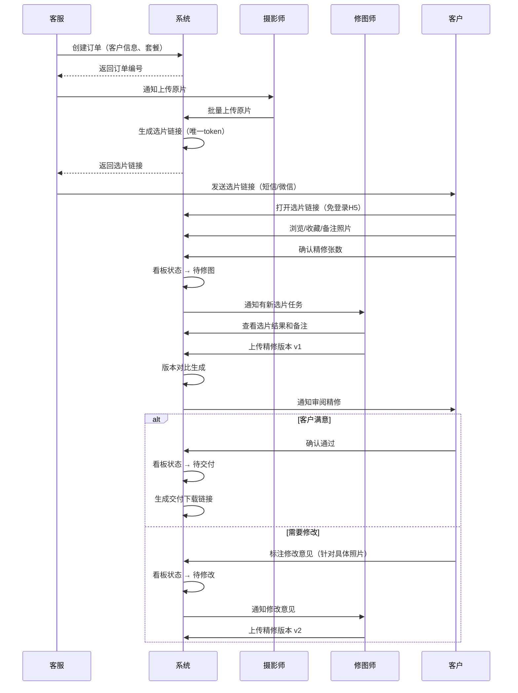
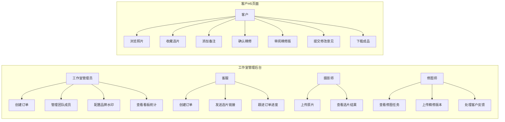
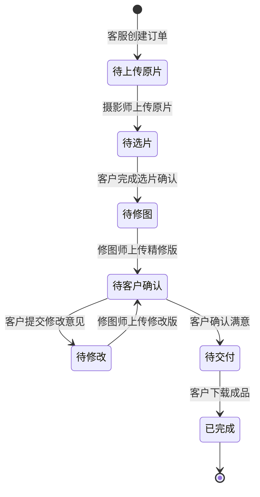

# 摄影选片修图反馈台 — 用户需求说明书（URS）

| 文档属性 | 内容 |
| --- | --- |
| 产品名称 | 摄影选片修图反馈台 |
| 文档版本 | v1.0.0 |
| 编写日期 | 2026-06-26 |
| 文档状态 | 初稿 |

---

# 1. 需求概述

## 1.1 需求介绍

摄影选片修图反馈台是一款面向中小摄影工作室的垂直行业协作工具，聚焦"选片 → 修图反馈 → 交付"的订单闭环。产品为每个拍摄订单生成专属客户选片链接，客户可在移动端完成选片收藏、备注标记和精修确认；工作室内部通过修图版本对比和反馈收敛机制替代微信反复传图；系统自动生成待修图、待客户确认、待交付三态看板，让订单进度一目了然。

### 1.1.1 所属领域

- 摄影行业 / 影楼管理 SaaS
- 垂直行业协作工具

## 1.2 需求目标

1. **消除信息碎片化**：将散落在微信、网盘、本地文件夹中的选片意见、修图反馈、交付确认收归到统一平台，减少返工和遗漏。
2. **缩短交付周期**：通过结构化反馈流程和可视化看板，将"选片到交付"的平均周期从 7-14 天压缩至 3-7 天。
3. **降低协作成本**：客户无需安装 APP，通过 H5 链接即可完成选片和反馈；工作室无需购买大型影楼系统，按月订阅即可使用。
4. **提升客户体验**：专业品牌化的选片界面，替代微信文件夹式的混乱交付，增强客户信任感。

## 1.3 系统使用角色

| 角色 | 描述 | 典型用户 |
| --- | --- | --- |
| 工作室管理员 | 创建订单、管理团队成员、设置品牌水印、查看看板统计 | 工作室老板、店长 |
| 摄影师 | 上传原片到订单、查看客户选片结果 | 签约摄影师、独立摄影师 |
| 修图师 | 查看客户选片备注、上传修图版本、处理反馈修改 | 专职修图师、兼职修图师 |
| 门店客服 | 创建订单、发送选片链接给客户、跟进交付进度 | 前台接待、在线客服 |
| 客户（C端） | 通过 H5 链接浏览照片、收藏选片、提交备注、确认精修 | 婚纱客户、亲子客户、商业客户 |

## 1.4 业务流程图

### 核心业务流程：选片 → 修图反馈 → 交付

```mermaid
flowchart TD
    A[客服创建订单] --> B[摄影师上传原片]
    B --> C[系统生成客户选片链接]
    C --> D[客服发送链接给客户]
    D --> E{客户选片}
    E --> E1[浏览全部照片]
    E1 --> E2[收藏选中照片]
    E2 --> E3[对选中照片添加备注]
    E3 --> E4[确认精修张数]
    E4 --> F[系统通知工作室：选片完成]
    F --> G[看板状态变更为"待修图"]
    G --> H[修图师领取任务]
    H --> I[修图师上传精修版本]
    I --> J[系统生成版本对比]
    J --> K{客户审阅}
    K -->|满意| L[客户确认通过]
    K -->|需修改| M[客户标注修改意见]
    M --> N[看板状态变更为"待修改"]
    N --> H
    L --> O[看板状态变更为"待交付"]
    O --> P[系统生成交付链接]
    P --> Q[客户下载精修成品]
    Q --> R[订单完成归档]
```

### 角色参与流程



---

# 2. 功能原型

| 原型名称 | 原型链接 | 对应端 | 备注 |
| --- | --- | --- | --- |
| 工作室管理后台 | 待设计 | WEB端 | 工作室管理员/摄影师/修图师/客服使用 |
| 客户选片页面 | 待设计 | WEB端 | 客户通过H5链接访问，移动端优先 |
| 订单看板 | 待设计 | WEB端 | 工作室内部使用，订单进度总览 |

---

# 3. 需求清单

## 3.1 工作室管理后台 — WEB端

### 3.1.1 账户与团队管理

| 模块 | 一级功能 | 二级功能 | 功能描述 | 优先级 |
| --- | --- | --- | --- | --- |
| 账户管理 | 注册/登录 | 手机号注册 | 工作室管理员通过手机号+验证码完成注册 | P0 |
| 账户管理 | 注册/登录 | 微信快捷登录 | 支持微信扫码或公众号授权登录 | P1 |
| 账户管理 | 套餐管理 | 查看当前套餐 | 显示免费版/工作室版状态、当月已用订单数、剩余配额 | P0 |
| 账户管理 | 套餐管理 | 升级/续费 | 从免费版升级到工作室版（¥69/月），支持微信支付 | P1 |
| 团队管理 | 成员邀请 | 添加成员 | 管理员通过手机号邀请摄影师、修图师、客服加入团队 | P0 |
| 团队管理 | 成员邀请 | 角色分配 | 为成员指定角色（摄影师/修图师/客服），不同角色可见不同功能 | P0 |
| 团队管理 | 成员管理 | 移除成员 | 管理员可移除团队成员 | P0 |
| 团队管理 | 协作设置 | 多修图师分配 | 支持将不同订单的修图任务分配给不同修图师 | P0 |

### 3.1.2 订单管理

| 模块 | 一级功能 | 二级功能 | 功能描述 | 优先级 |
| --- | --- | --- | --- | --- |
| 订单管理 | 创建订单 | 基本信息录入 | 填写客户姓名、手机号、拍摄类型（婚纱/亲子/证件照/商业）、套餐信息 | P0 |
| 订单管理 | 创建订单 | 自动编号 | 系统自动生成唯一订单编号 | P0 |
| 订单管理 | 订单列表 | 全量查看 | 按时间倒序展示所有订单，显示客户名、拍摄类型、状态、创建时间 | P0 |
| 订单管理 | 订单列表 | 状态筛选 | 按"待上传原片/待选片/待修图/待客户确认/待修改/待交付/已完成"筛选 | P0 |
| 订单管理 | 订单详情 | 查看照片 | 查看该订单下所有原片和精修版本 | P0 |
| 订单管理 | 订单详情 | 查看客户选片结果 | 查看客户收藏了哪些照片、备注内容、确认的精修张数 | P0 |
| 订单管理 | 订单详情 | 版本历史 | 查看每张精修照片的全部版本（v1, v2, v3...） | P0 |
| 订单管理 | 订单状态 | 状态自动流转 | 根据各环节完成情况自动推进订单状态 | P0 |

### 3.1.3 原片管理

| 模块 | 一级功能 | 二级功能 | 功能描述 | 优先级 |
| --- | --- | --- | --- | --- |
| 原片管理 | 上传原片 | 批量上传 | 摄影师通过拖拽或文件选择器批量上传原片（支持 JPG/TIFF/RAW） | P0 |
| 原片管理 | 上传原片 | 上传进度 | 显示上传进度条，支持断点续传 | P1 |
| 原片管理 | 原片整理 | 分组/排序 | 支持按场景、服装对原片进行分组标记 | P1 |
| 原片管理 | 原片整理 | 水印预览 | 免费版预览图带平台水印，工作室版可设置品牌水印 | P1 |

### 3.1.4 修图协作

| 模块 | 一级功能 | 二级功能 | 功能描述 | 优先级 |
| --- | --- | --- | --- | --- |
| 修图协作 | 任务分配 | 自动分配 | 选片完成后，系统自动将选片结果推送给指定修图师 | P0 |
| 修图协作 | 任务分配 | 手动调整 | 管理员可将修图任务在修图师之间重新分配 | P0 |
| 修图协作 | 修图工作台 | 查看原片+备注 | 修图师查看客户选中的照片及每张的备注内容 | P0 |
| 修图协作 | 修图工作台 | 上传精修版 | 修图师逐张或批量上传精修后的照片 | P0 |
| 修图协作 | 版本管理 | 版本对比 | 精修版与原片并排对比展示（滑块对比模式） | P0 |
| 修图协作 | 版本管理 | 历史版本 | 保留每张照片的所有修图版本，支持任意两版对比 | P0 |
| 修图协作 | 反馈处理 | 查看客户反馈 | 查看客户对精修版的修改意见（标注在具体照片上） | P0 |
| 修图协作 | 反馈处理 | 标记已修改 | 修图师完成修改后标记该反馈为"已处理" | P0 |

### 3.1.5 订单看板

| 模块 | 一级功能 | 二级功能 | 功能描述 | 优先级 |
| --- | --- | --- | --- | --- |
| 看板 | 三态看板 | 待修图列 | 展示所有已选片、等待修图的订单卡片 | P0 |
| 看板 | 三态看板 | 待客户确认列 | 展示已上传精修版、等待客户审阅的订单卡片 | P0 |
| 看板 | 三态看板 | 待交付列 | 展示客户已确认、等待最终交付的订单卡片 | P0 |
| 看板 | 看板操作 | 卡片详情 | 点击看板卡片跳转至订单详情页 | P0 |
| 看板 | 统计概览 | 数量统计 | 各列显示订单数量 | P0 |
| 看板 | 统计概览 | 超时提醒 | 超过约定时间未推进的订单高亮提醒 | P1 |

### 3.1.6 交付管理

| 模块 | 一级功能 | 二级功能 | 功能描述 | 优先级 |
| --- | --- | --- | --- | --- |
| 交付管理 | 交付链接 | 生成链接 | 客户确认后，系统自动生成交付下载链接 | P0 |
| 交付管理 | 交付链接 | 链接有效期 | 设置交付链接有效期（默认30天，可配置） | P1 |
| 交付管理 | 交付链接 | 下载权限 | 工作室版支持设置下载次数限制 | P2 |
| 交付管理 | 品牌设置 | 水印配置 | 工作室版支持上传品牌LOGO作为预览图水印 | P1 |
| 交付管理 | 品牌设置 | 品牌色彩 | 工作室版支持设置选片页面主题色 | P2 |

### 3.1.7 通知管理

| 模块 | 一级功能 | 二级功能 | 功能描述 | 优先级 |
| --- | --- | --- | --- | --- |
| 通知 | 站内通知 | 任务通知 | 修图师收到新任务、客户提交反馈时推送站内消息 | P0 |
| 通知 | 站内通知 | 状态通知 | 订单状态变更时通知相关角色 | P0 |
| 通知 | 短信通知 | 选片邀请 | 向客户发送选片链接的短信通知 | P1 |
| 通知 | 短信通知 | 精修完成 | 通知客户精修版已上传，请审阅 | P1 |

## 3.2 客户选片页面 — WEB端（H5）

| 模块 | 一级功能 | 二级功能 | 功能描述 | 优先级 |
| --- | --- | --- | --- | --- |
| 选片页面 | 页面入口 | 链接打开 | 客户通过唯一URL打开选片页面，无需注册/登录 | P0 |
| 选片页面 | 页面入口 | 密码保护 | 可选设置访问密码（短信验证码或自定义密码） | P1 |
| 选片页面 | 照片浏览 | 瀑布流展示 | 照片以瀑布流/网格布局展示，支持双指缩放 | P0 |
| 选片页面 | 照片浏览 | 全屏查看 | 点击照片进入全屏浏览模式，支持左右滑动切换 | P0 |
| 选片页面 | 照片浏览 | 加载优化 | 缩略图懒加载，全屏查看时加载原图 | P0 |
| 选片页面 | 选片操作 | 收藏选择 | 点击照片上的心形图标收藏/取消收藏 | P0 |
| 选片页面 | 选片操作 | 批量选择 | 支持"全选当前页"和批量取消 | P1 |
| 选片页面 | 选片操作 | 添加备注 | 对已收藏的照片添加文字备注（如"这张调色偏暖"） | P0 |
| 选片页面 | 选片操作 | 区域标注 | 在照片上画圈/框标注需要修改的区域 | P2 |
| 选片页面 | 选片确认 | 精修张数确认 | 显示套餐约定精修张数，客户确认最终精修列表 | P0 |
| 选片页面 | 选片确认 | 提交选片 | 确认后提交，系统通知工作室 | P0 |
| 选片页面 | 精修审阅 | 查看精修版 | 审阅修图师上传的精修照片 | P0 |
| 选片页面 | 精修审阅 | 版本对比 | 原片与精修版对比查看（滑块对比） | P0 |
| 选片页面 | 精修审阅 | 反馈提交 | 对不满意的照片提交修改意见（文字描述） | P0 |
| 选片页面 | 精修审阅 | 确认通过 | 对所有精修照片确认满意，触发交付流程 | P0 |
| 选片页面 | 成品下载 | 交付下载 | 通过交付链接下载精修成品（高清原图） | P0 |
| 选片页面 | 品牌展示 | 工作室信息 | 页面顶部展示工作室名称和LOGO（工作室版自定义） | P1 |

## 3.3 后台服务

| 模块 | 一级功能 | 二级功能 | 功能描述 | 优先级 |
| --- | --- | --- | --- | --- |
| 存储服务 | 图片存储 | 云端存储 | 原片、精修版本统一存储在云端（对象存储） | P0 |
| 存储服务 | 图片存储 | 缩略图生成 | 上传后自动生成多尺寸缩略图供前端展示 | P0 |
| 存储服务 | 容量管理 | 免费版限额 | 免费版存储空间限制（如5GB） | P1 |
| 存储服务 | 容量管理 | 工作室版无限 | 工作室版不限制存储容量 | P1 |
| 订单引擎 | 状态机 | 状态流转 | 管理订单状态的自动流转逻辑 | P0 |
| 订单引擎 | 配额管理 | 订单计数 | 免费版每月10个订单上限，月末重置 | P0 |
| 订单引擎 | 配额管理 | 升级处理 | 升级后保留历史订单，新订单不受限制 | P0 |
| 链接服务 | 链接生成 | 选片链接 | 为每个订单生成唯一的、不可猜测的选片URL | P0 |
| 链接服务 | 链接生成 | 交付链接 | 为客户生成交付下载链接（带有效期） | P0 |
| 链接服务 | 链接安全 | 防盗链 | 交付链接增加防盗链校验（Referer/签名） | P1 |
| 通知服务 | 消息推送 | 站内消息 | 实时推送站内通知 | P0 |
| 通知服务 | 消息推送 | 短信网关 | 对接短信服务商发送通知 | P1 |

---

# 4. 非功能需求

## 4.1 使用界面需求

| 需求项 | 描述 |
| --- | --- |
| 工作室后台响应式布局 | 支持 1280px 及以上宽屏显示器，不要求适配移动端浏览器 |
| 客户选片页面移动端优先 | 选片页面和交付页面优先适配手机浏览器（375px-428px），兼顾平板和PC |
| 图片加载体验 | 使用渐进式加载（先模糊缩略图后清晰原图），减少白屏等待 |
| 操作反馈 | 所有操作提供即时视觉反馈（收藏动画、上传进度、提交成功提示） |
| 暗色模式 | MVP 阶段不要求，后续版本考虑 |

## 4.2 软硬件环境需求

| 需求项 | 描述 |
| --- | --- |
| 服务端部署 | 云端部署（建议阿里云/腾讯云），使用对象存储（OSS/COS）存放图片 |
| 客户端要求-工作室端 | Chrome 90+、Edge 90+、Safari 15+ 浏览器，屏幕宽度 ≥1280px |
| 客户端要求-客户端 | 微信内置浏览器、Safari（iOS 14+）、Chrome（Android 10+） |
| 网络要求 | 客户端需能访问 HTTPS 服务，图片加载需要稳定的网络环境 |
| 数据库 | 关系型数据库（MySQL/PostgreSQL），存储订单、用户、选片记录等结构化数据 |

## 4.3 性能需求

| 需求项 | 指标 |
| --- | --- |
| 图片上传速度 | 单张 20MB 原片上传时间 ≤ 10 秒（4G网络） |
| 选片页面加载 | 首屏加载时间 ≤ 3 秒（含缩略图懒加载） |
| 选片操作响应 | 收藏/备注操作响应时间 ≤ 500ms |
| 版本对比加载 | 双图对比模式加载时间 ≤ 2 秒 |
| 并发支持 | 支持 50 个工作室同时操作，500 个客户同时选片 |
| 图片处理 | 缩略图生成延迟 ≤ 5 秒/张 |

## 4.4 约束性需求

1. **MVP 不包含的功能**：预约排期系统、在线支付（仅套餐管理）、相册模板设计、社交分享功能、视频编辑和选片。
2. **不做图库平台**：本产品定位为工作室自有工具，不提供公共图库展示和交易平台功能。
3. **不替代微信沟通**：产品聚焦选片修图流程的结构化管理，不做即时通讯工具。
4. **数据安全**：客户照片属于隐私数据，需确保传输加密（HTTPS）和存储隔离（不同工作室数据不可互访）。
5. **本系统需要后台服务**：是，需要云端后台服务支撑图片存储、链接生成、通知推送等功能。

---

# 5. 接口需求

## 5.1 硬件接口需求

本系统为纯软件 SaaS 产品，无硬件接口需求。

## 5.2 软件接口需求

| 模块 | 接口名称 | 输入 | 输出 | 功能描述 |
| --- | --- | --- | --- | --- |
| 通知模块 | 短信服务接口 | 手机号、短信模板、变量参数 | 发送状态（成功/失败） | 发送选片邀请短信、精修完成通知短信 |
| 通知模块 | 微信服务号接口 | 用户OpenID、模板消息内容 | 发送状态 | 通过微信公众号推送模板消息通知 |
| 存储模块 | 对象存储服务接口 | 图片文件、存储路径 | 文件URL、ETag | 上传图片到云存储，获取访问URL |
| 账户模块 | 微信开放平台接口 | 授权码（code） | 用户信息（openid、昵称、头像） | 微信扫码/公众号授权登录 |
| 账户模块 | 微信支付接口（工作室版） | 订单信息、支付金额 | 支付结果回调 | 工作室版订阅付费 |

## 5.4 通讯接口需求

| 需求项 | 描述 |
| --- | --- |
| 协议 | 全部使用 HTTPS（TLS 1.2+） |
| 前端通讯 | RESTful API，JSON 格式 |
| 实时通知 | WebSocket 用于站内消息实时推送（工作室后台） |
| 文件上传 | 支持分片上传（大文件），断点续传 |

---

# 6. 附录

## 用户画像

### 画像一：小王 — 婚纱工作室老板

- **年龄**：32岁
- **工作室规模**：3人（1摄影师+1修图师+1客服）
- **月均订单**：20-30单
- **痛点**：客户选片反馈散落在微信聊天记录里，修图师经常漏看修改意见，导致返工；交付延期被客户投诉
- **期望**：一个地方能看到所有订单的进度，客户反馈不会遗漏

### 画像二：李老师 — 独立亲子摄影师

- **年龄**：28岁
- **工作方式**：独立接单，兼职修图
- **月均订单**：8-15单
- **痛点**：每次拍完要把几十张照片打包发网盘让客户选，客户反馈"第3张脸修瘦一点"这种意见很难对应到具体照片
- **期望**：客户能直接在照片上标记意见，不用来回微信沟通

### 画像三：小张 — 门店客服

- **年龄**：24岁
- **工作内容**：接待客户、跟进订单进度
- **痛点**：要同时跟进十几个订单，记不清哪个订单在等客户选片、哪个订单在修图，经常要翻微信确认
- **期望**：有一个看板能看到所有订单当前状态，到哪个环节了

### 画像四：陈师傅 — 资深修图师

- **年龄**：35岁
- **工作方式**：同时服务2-3个工作室
- **痛点**：不同工作室通过不同方式（微信、邮件、网盘）发修图要求和反馈，版本混乱，经常改错版本
- **期望**：统一入口查看修图任务，每个修改意见对应到具体照片和具体版本

## 用例图



## 订单状态图



## 数据模型（核心实体）

| 实体 | 主要属性 | 说明 |
| --- | --- | --- |
| Studio（工作室） | id, name, plan_type, brand_logo, created_at | 工作室账户信息 |
| Member（成员） | id, studio_id, name, phone, role, joined_at | 团队成员 |
| Order（订单） | id, studio_id, customer_name, customer_phone, shoot_type, status, package_info, created_at | 拍摄订单 |
| Photo（照片） | id, order_id, filename, type（原片/精修）, version, upload_url, thumbnail_url, uploaded_at | 照片文件 |
| Selection（选片记录） | id, order_id, photo_id, is_favorited, remark, created_at | 客户选片结果 |
| Feedback（反馈） | id, order_id, photo_id, version_id, content, status（待处理/已处理）, created_at | 客户修图反馈 |
| DeliveryLink（交付链接） | id, order_id, token, expire_at, download_count | 交付下载链接 |

---

*文档版本：v1.0.0 | 编写日期：2026-06-26 | 状态：初稿*
