# 播客Shownotes自动生成器 - 产品需求文档（PRD）

| 版本号 | 变更日期 | 变更内容 | 变更人 | 审核人 |
| --- | --- | --- | --- | --- |
| V1.0 | 2026-06-29 | 初始版本创建（MVP） | 产品文档结对写作专家 | 阶段一产品落地页文档总编辑 |
| V1.1 | 2026-06-29 | 基于新版 URS 完成一致性修订：收窄 MVP P0、移出微信支付/平台专属导出/波形/完整富文本、补充合规与风险控制 | 产品文档结对写作专家 | 阶段一产品落地页文档总编辑 |

---

# 1 概述

## 1.1 需求背景

播客Shownotes自动生成器是一款面向播客内容创作者的垂直效率工具。播客主播在完成录音后，通常需要反复听回放、记录时间点、提炼节目要点、整理嘉宾资料、补充资源链接、撰写宣传文案，一期 60 分钟节目手工整理 Shownotes 往往需要 1-2 小时。

国内现有转录类产品多面向会议纪要、课堂记录或通用语音转文字，核心能力停留在“转录文本”和“通用摘要”。播客创作者真正需要的是可直接进入发布环节的结构化输出：节目简介、时间戳章节、主播/嘉宾信息、关键观点、金句摘录、赞助商口播位、社交媒体短文案、Markdown/纯文本导出等。因此，本产品的差异化重点放在 **播客输出层**，而不是单纯 ASR 转录。

本产品第一期 MVP 聚焦“上传 → ASR转录 → 2人发言人识别 → 人工校对 → 播客模板生成 → Markdown/纯文本导出”的最小闭环，目标是将主播每期节目后期整理时间从 1-2 小时压缩到 5-10 分钟，并用免费版+专业版订阅验证商业价值。

## 1.2 名词解释

| 名词 | 说明 |
| --- | --- |
| Shownotes | 播客节目附带的文字说明，通常包含节目简介、时间戳章节、关键观点、嘉宾介绍、资源链接等内容 |
| ASR | Automatic Speech Recognition，自动语音识别，将音频转为文字的技术 |
| Speaker Diarization | 说话人分离/发言人识别，用于区分音频中不同说话人 |
| 低置信片段 | ASR 或发言人识别结果中系统判断可信度不足、需要用户重点校对的片段 |
| 标准播客模板 | MVP 默认提供的官方 Shownotes 模板，包含简介、章节、观点、金句、资源、社交媒体短文案等字段 |
| Markdown 导出 | 以 `.md` 文件或 Markdown 文本形式输出，便于二次编辑和跨平台粘贴 |
| 纯文本导出 | 去除 Markdown 标记后的纯文本内容，适合粘贴到小宇宙、喜马拉雅、Apple Podcasts 等平台后台 |
| 线下开通 | MVP 阶段不接入在线支付，用户付款后由运营人工开通专业版 |
| 公平使用上限 | 专业版为防止滥用设置的月度处理上限，MVP 为每月 200 期 |

## 1.3 产品介绍

**目标用户**：独立播客主播、播客工作室/小型厂牌、内容团队成员。节目嘉宾和平台运营方作为后续协作、审核与运营角色预留。

**核心使用场景**：
1. 主播完成录音后上传音频，系统校验文件格式、大小、音频时长和账户额度。
2. 系统调用 ASR 服务生成带时间戳的中文转录文本，并在 2 人场景下识别主播和嘉宾。
3. 系统标记低置信片段，用户在线修正发言人归属、文本错字、章节时间点。
4. 用户选择标准播客模板，系统生成 Shownotes 草稿、关键观点、金句摘录和社交媒体短文案。
5. 用户完成编辑后导出 Markdown 或纯文本，手动粘贴到播客平台后台。

**核心价值**：
- 对独立主播：减少整理时间，降低发布前编辑负担。
- 对工作室/厂牌：统一 Shownotes 结构，稳定内容质量。
- 对内容团队：将音频内容沉淀为可复用、可搜索、可发布的结构化素材。
- 对产品方：通过每月 3 期免费额度引流，通过 ¥29/月专业版验证付费意愿。

### 1.3.1 范围说明

| 项 | 内容 |
| --- | --- |
| MVP 包含功能 | WEB 主应用、手机号验证码登录、音频上传、格式/大小/时长/额度校验、ASR 转录、2 人发言人识别、低置信片段标记、人工校对、标准播客模板生成、Markdown/纯文本编辑、Markdown/纯文本导出、复制到剪贴板、节目管理、订阅额度展示、线下开通专业版引导、用户协议/隐私政策/账号注销/版权声明/免责声明/举报入口 |
| MVP 不包含功能 | 微信登录、微信支付、支付宝支付、断点续传、批量上传、波形显示、完整富文本编辑器、小宇宙/喜马拉雅/Apple Podcasts 专属格式导出、3-4 人发言人识别、自动链接提取、团队协作、嘉宾分享确认、内容审核后台、移动端 H5、运营管理后台、RSS 导入、平台 API 直连发布 |
| 第二期重点 | 微信登录与在线支付、断点续传、平台专属导出、3-4 人发言人识别、自定义模板、自动资源链接识别、嘉宾分享与确认、内容审核后台、团队空间 |

---

# 2 产品设计

## 2.1 系统架构图

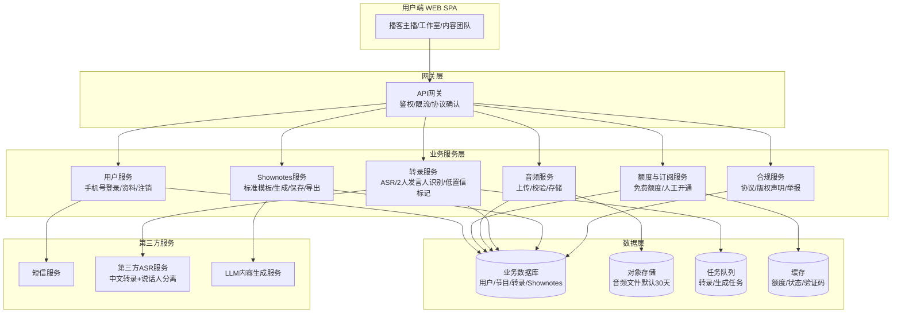

## 2.2 业务模块图

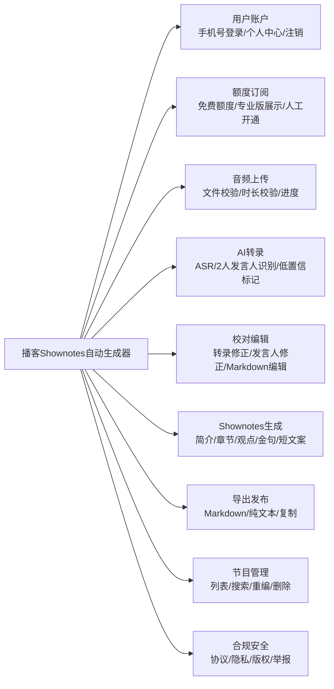

## 2.3 主业务流程

### 2.3.1 Shownotes 生成主流程

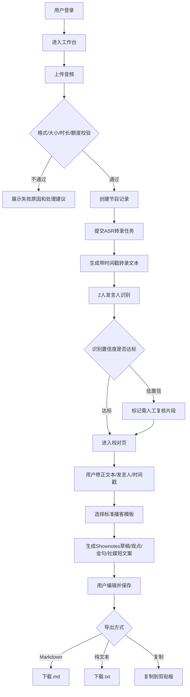

### 2.3.2 订阅与额度流程（MVP）

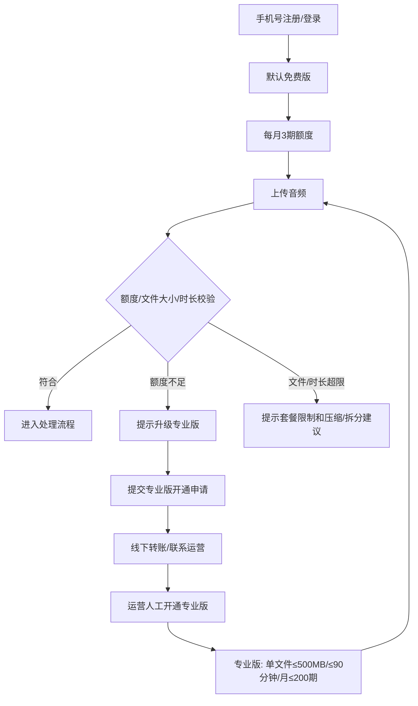

### 2.3.3 节目状态流转

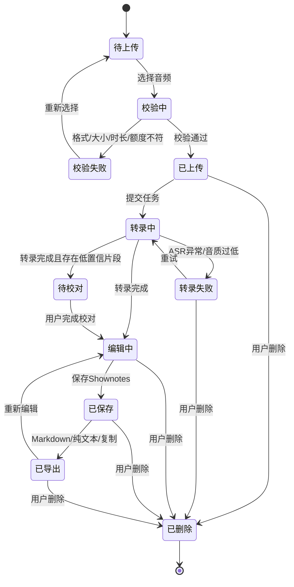

## 2.4 功能图/列表

| 功能模块 | 功能名称 | 优先级 | 功能描述 |
| --- | --- | --- | --- |
| 用户账户 | 手机号注册/登录 | P0 | 手机号+验证码注册、登录，默认开通免费版 |
| 用户账户 | 个人中心 | P0 | 查看/修改昵称、手机号、订阅状态、剩余额度、注销入口 |
| 用户账户 | 账号注销 | P0 | 提供二次确认、注销影响说明、冷静期与数据删除规则 |
| 用户账户 | 微信登录 | P1 | 第二期接入微信扫码登录 |
| 额度订阅 | 免费额度 | P0 | 每月 3 期，单文件≤200MB，每期≤60分钟 |
| 额度订阅 | 专业版展示 | P0 | 展示 ¥29/月、¥268/年、单文件≤500MB、每期≤90分钟、月公平使用≤200期 |
| 额度订阅 | 人工开通 | P0 | MVP 通过线下转账+运营人工开通验证付费意愿 |
| 额度订阅 | 在线支付 | P1 | 第二期接入微信支付/支付宝 |
| 音频上传 | 拖拽/点击上传 | P0 | 支持单文件上传，显示文件信息和进度 |
| 音频上传 | 格式/大小/时长校验 | P0 | 校验 mp3/wav/m4a/flac/ogg、套餐大小、音频时长和额度 |
| 音频上传 | 上传失败处理 | P0 | 网络失败、文件异常时提示原因并允许重新上传 |
| 音频上传 | 断点续传/批量上传 | P1 | 第二期支持 |
| AI转录 | 中文普通话转录 | P0 | 生成带句级时间戳的转录文本 |
| AI转录 | 2人发言人识别 | P0 | MVP 支持主播+1嘉宾，目标准确率≥85% |
| AI转录 | 低置信片段标记 | P0 | 对转录或发言人识别不稳定片段提示用户复核 |
| AI转录 | 3-4人识别 | P1 | 第二期支持，目标准确率≥75% |
| 校对编辑 | 转录文本校对 | P0 | 修改错字、断句、标点和段落 |
| 校对编辑 | 发言人修正 | P0 | 重命名发言人、修改片段归属 |
| 校对编辑 | Markdown/纯文本编辑 | P0 | 支持标题、列表、链接、引用、时间戳编辑 |
| 校对编辑 | 完整富文本编辑器 | P1 | 第二期支持更完整的所见即所得编辑 |
| Shownotes生成 | 标准播客模板 | P0 | 生成简介、章节、关键观点、金句、资源链接位、赞助商位、下期预告位 |
| Shownotes生成 | 社交媒体短文案 | P0 | 生成 100-200 字微博/朋友圈/小红书风格宣传文案 |
| Shownotes生成 | 自动资源链接提取 | P1 | 第二期自动识别书籍、产品、人物、URL |
| 导出发布 | Markdown导出 | P0 | 导出 `.md` 文件 |
| 导出发布 | 纯文本导出 | P0 | 导出 `.txt` 或复制纯文本 |
| 导出发布 | 复制到剪贴板 | P0 | 一键复制当前格式内容 |
| 导出发布 | 平台专属格式导出 | P1 | 小宇宙/喜马拉雅/Apple Podcasts 专属导出放第二期 |
| 节目管理 | 节目列表 | P0 | 查看节目标题、时长、状态、创建时间 |
| 节目管理 | 搜索/筛选 | P0 | 按标题、状态、日期检索节目 |
| 节目管理 | 重新编辑/删除 | P0 | 重新进入编辑页或删除节目及关联数据 |
| 合规安全 | 用户协议/隐私政策 | P0 | 登录和上传前展示并记录协议版本 |
| 合规安全 | 上传免责声明 | P0 | 提醒用户确认拥有音频处理权利，不得上传违法内容 |
| 合规安全 | 版权与归属声明 | P0 | 明确音频版权归用户，AI生成内容由用户审核并发布 |
| 合规安全 | 举报入口 | P0 | 提供基础举报入口，第二期接入审核后台 |

## 2.5 你的产品有哪些端

| 序号 | 端名称 | 端类型 | 目标用户 | 说明 |
| --- | --- | --- | --- | --- |
| 1 | 播客Shownotes生成器-WEB端 | WEB端 | 独立主播、播客工作室、内容团队 | MVP 唯一端，承载上传、转录、校对、生成、导出、节目管理、订阅额度展示 |

> 移动端 H5/小程序、运营管理后台均为第二期及后续版本，不纳入 MVP 原型范围。

---

# 3 产品功能

## 3.1 用户账户

### 3.1.1 手机号注册与登录

**功能描述**
用户通过手机号和短信验证码完成注册或登录。新手机号首次验证通过后自动创建免费版账号，用户需勾选同意《用户协议》和《隐私政策》。微信登录不属于 MVP P0。

| 项 | 内容 |
| --- | --- |
| 优先级 | P0 |
| 依赖需求 | 新版 URS 3.1 用户账户 |
| 前置条件 | 用户访问 WEB 端登录页 |

**详细流程**

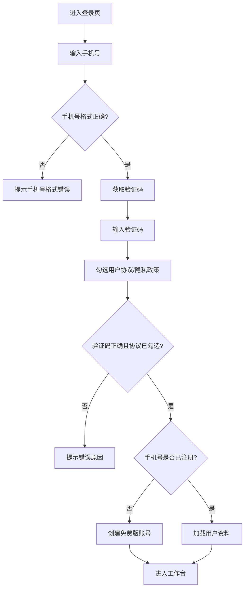

**业务规则**
1. 手机号必须为 11 位大陆手机号。
2. 验证码为 6 位数字，有效期 5 分钟，同一手机号 60 秒内只能发送一次。
3. 每个手机号每日最多发送 10 次验证码。
4. 首次注册必须勾选用户协议和隐私政策，并记录协议版本、确认时间。
5. 登录态默认有效期 7 天，支持记住登录延长至 30 天。

**主要原型**

[登录注册表单原型](assets/prototypes/web/login-widget.html)

**验收标准**
- [ ] 新手机号输入正确验证码并勾选协议后自动创建免费版账号。
- [ ] 已注册手机号输入正确验证码后登录成功。
- [ ] 未勾选协议时登录按钮不可提交或提交后明确提示。
- [ ] 手机号格式错误、验证码错误、验证码过期均有明确提示。

### 3.1.2 个人中心与账号注销

**功能描述**
用户在个人中心查看和编辑资料、查看订阅方案和剩余额度，并可发起账号注销。账号注销属于合规必需项。

| 项 | 内容 |
| --- | --- |
| 优先级 | P0 |
| 依赖需求 | 新版 URS 账号注销与数据删除流程 |
| 前置条件 | 用户已登录 |

**详细流程**

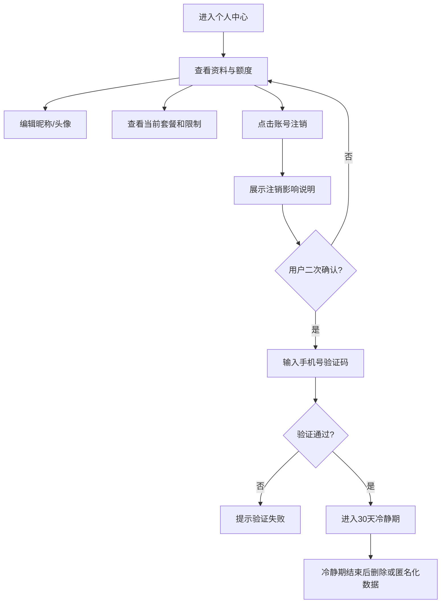

**业务规则**
1. 昵称最长 20 字符，头像支持 jpg/png，大小≤2MB。
2. 订阅卡片展示：当前方案、剩余期数、当月已用期数、单文件大小限制、单期时长限制。
3. 注销需二次确认并输入短信验证码。
4. 注销进入 30 天冷静期，冷静期内再次登录可撤销注销。
5. 冷静期结束后删除或匿名化个人资料、音频文件、转录文本、Shownotes；法定必要留存记录按合规要求保存。
6. 注销前提示未完成处理任务、剩余权益、数据删除影响。

**主要原型**

[个人中心原型](assets/prototypes/web/profile-widget.html)

**验收标准**
- [ ] 用户可查看当前方案和额度限制。
- [ ] 用户可修改昵称/头像并保存。
- [ ] 注销入口清晰可见，注销前展示影响说明。
- [ ] 注销需验证码二次确认，未验证不可提交。

## 3.2 音频上传与处理

### 3.2.1 音频上传与校验

**功能描述**
用户上传单个播客音频文件，系统在处理前完成格式、大小、音频时长和额度校验。MVP 不支持断点续传和批量上传。

| 项 | 内容 |
| --- | --- |
| 优先级 | P0 |
| 依赖需求 | 新版 URS 音频上传、额度限制 |
| 前置条件 | 用户已登录且有可用额度 |

**详细流程**

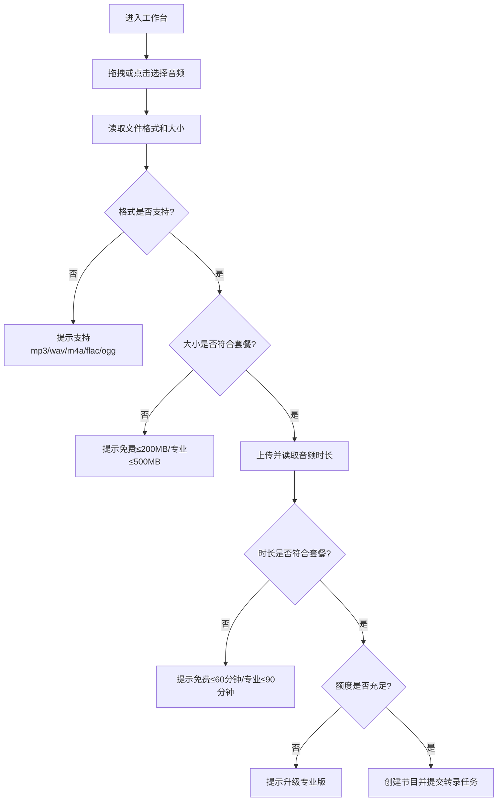

**业务规则**
1. 支持格式：mp3、wav、m4a、flac、ogg。
2. 免费版：每月 3 期，单文件≤200MB，单期音频≤60分钟。
3. 专业版：单文件≤500MB，单期音频≤90分钟，公平使用上限每月 200 期。
4. 系统必须同时校验文件格式、文件大小、音频时长和剩余额度。
5. 上传失败时提示失败原因并允许重新上传；MVP 不保证断点续传。
6. 上传前展示免责声明：用户确认拥有音频处理权利，且不得上传违法违规内容。

**主要原型**

[音频上传组件原型](assets/prototypes/web/upload-widget.html)

**验收标准**
- [ ] 支持拖拽和点击选择文件。
- [ ] 不支持格式、超大小、超时长、额度不足均有明确提示。
- [ ] 上传前展示合规免责声明。
- [ ] 100MB 文件在常规宽带网络下上传目标时间 < 2 分钟，并持续展示进度。

### 3.2.2 ASR 转录与 2 人发言人识别

**功能描述**
上传和校验通过后，系统调用第三方 ASR 服务生成中文普通话转录文本，并在主播+1 位嘉宾场景下进行发言人识别。系统对低置信片段进行标记，提示用户重点校对。

| 项 | 内容 |
| --- | --- |
| 优先级 | P0 |
| 依赖需求 | 新版 URS 发言人识别风险量化 |
| 前置条件 | 音频上传成功且校验通过 |

**详细流程**

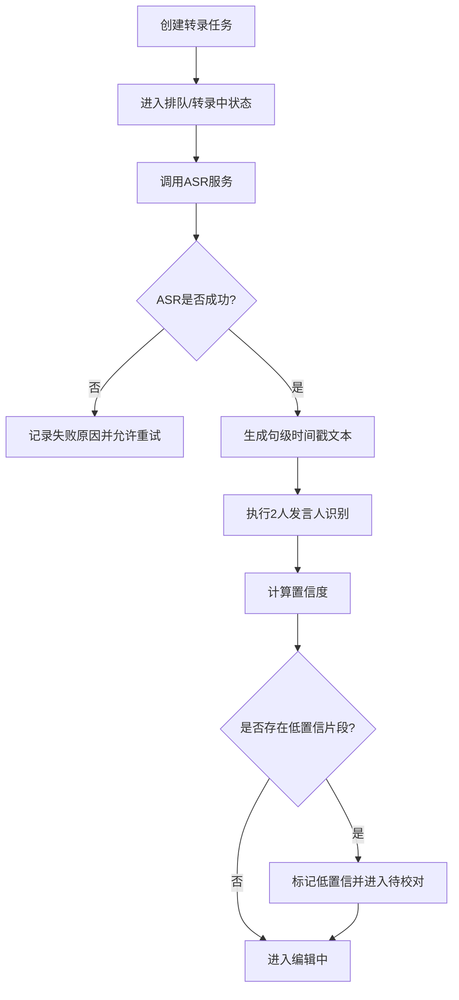

**业务规则**
1. MVP 支持中文普通话。
2. MVP 支持 2 人场景（主播+1嘉宾），目标准确率≥85%。
3. 3-4 人发言人识别为 P1，目标准确率≥75%；超过 4 人暂不承诺自动区分效果。
4. 重叠发言、背景噪声、远场录音、多人抢话会降低识别效果，系统需在转录页提示用户校对。
5. 转录结果至少包含句级时间戳；字/词级时间戳作为第二期增强。
6. 60 分钟音频转录处理目标 < 10 分钟，超时需显示排队或失败原因。

**主要原型**

[转录处理状态原型](assets/prototypes/web/transcript-widget.html)

**验收标准**
- [ ] 转录完成后展示句级时间戳、文本内容、发言人标签。
- [ ] 低置信片段有明确视觉标记。
- [ ] ASR 失败时展示失败原因和重试入口。
- [ ] 2 人测试音频的发言人识别准确率目标≥85%。

### 3.2.3 转录结果在线校对

**功能描述**
用户对转录文本和发言人归属进行人工校对，修正错字、断句、标点、时间戳和发言人标签。MVP 重点保证低成本人工修正闭环。

| 项 | 内容 |
| --- | --- |
| 优先级 | P0 |
| 依赖需求 | 3.2.2 ASR 转录 |
| 前置条件 | 转录完成 |

**业务规则**
1. 每段转录文本展示发言人标签、时间戳和文本内容。
2. 用户可直接编辑文本。
3. 用户可将单段转录改派给其他发言人。
4. 用户可重命名“发言人1/发言人2”为“主播/嘉宾名”。
5. 低置信片段默认高亮，用户处理后可标记为已确认。
6. 所有修改自动保存，保存失败时保留本地未保存提示。

**验收标准**
- [ ] 用户可修改文本内容并保存。
- [ ] 用户可修改发言人名称和片段归属。
- [ ] 低置信片段可被定位、确认和保存。
- [ ] 网络异常时提示未保存风险。

## 3.3 Shownotes 生成与编辑

### 3.3.1 标准播客模板生成

**功能描述**
用户完成转录校对后，选择标准播客模板，系统生成 Shownotes 草稿。MVP 只提供一个官方标准播客模板，不提供平台专属模板和自定义模板。

| 项 | 内容 |
| --- | --- |
| 优先级 | P0 |
| 依赖需求 | 新版 URS 播客Shownotes模板字段结构 |
| 前置条件 | 转录文本已生成，用户已完成必要校对 |

**标准播客模板字段**

| 字段 | 内容规则 | MVP方式 |
| --- | --- | --- |
| 节目标题 | 使用用户填写标题，可编辑 | 手动填写/文件名带入 |
| 节目简介 | 100字以内说明本期主题与价值 | AI生成+人工编辑 |
| 主播/嘉宾信息 | 主播名、嘉宾名、嘉宾简介 | 手动填写+模板占位 |
| 时间戳章节 | `00:00 章节标题 - 简述` | AI初稿+人工编辑 |
| 关键观点 | 3-8条核心观点 | AI生成+人工编辑 |
| 金句摘录 | 1-5条适合传播的短句 | AI生成+人工编辑 |
| 资源链接位 | 书籍、产品、人物、网站链接 | MVP支持手动补充，自动识别P1 |
| 赞助商口播位 | 赞助商说明区 | 模板预留 |
| 社交媒体短文案 | 100-200字宣传文案 | AI生成+人工编辑 |
| 下期预告 | 下期内容说明 | 模板预留，用户手动填写 |

**主要原型**

[模板选择与生成原型](assets/prototypes/web/template-widget.html)

**验收标准**
- [ ] 选择标准模板后生成 Shownotes 草稿。
- [ ] 草稿包含简介、章节、观点、金句、资源链接位、社交媒体短文案。
- [ ] 转录内容为空或未完成时禁止生成并提示原因。
- [ ] 生成响应目标 < 10 秒。

### 3.3.2 Markdown/纯文本编辑

**功能描述**
用户在 Shownotes 草稿基础上进行轻量编辑。MVP 采用 Markdown/纯文本编辑与预览，不建设完整富文本编辑器。

| 项 | 内容 |
| --- | --- |
| 优先级 | P0 |
| 依赖需求 | 3.3.1 标准播客模板生成 |
| 前置条件 | Shownotes 草稿已生成 |

**详细流程**

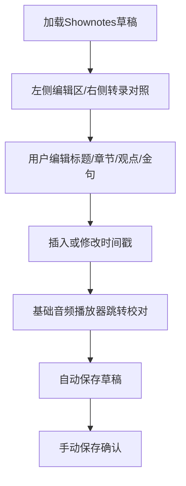

**业务规则**
1. 支持 Markdown 标题、列表、引用、链接、加粗等基础语法。
2. 支持纯文本模式预览，便于粘贴到平台后台。
3. 支持插入和修改时间戳。
4. 音频播放器支持播放、暂停、进度跳转、倍速；MVP 不提供波形显示。
5. 内容变更后 5 秒内自动保存草稿，用户也可手动保存。

**主要原型**

[Shownotes编辑器原型](assets/prototypes/web/editor-widget.html)

**验收标准**
- [ ] 用户可编辑 Shownotes 正文并保存。
- [ ] Markdown 基础语法可输入和预览。
- [ ] 时间戳可手动修改或插入。
- [ ] 音频播放、暂停、跳转响应目标 < 200ms。
- [ ] 不出现“完整富文本编辑器”为 MVP 必交付的描述。

## 3.4 导出发布

### 3.4.1 Markdown/纯文本导出

**功能描述**
用户将编辑完成的 Shownotes 导出为 Markdown 文件、纯文本文件，或复制到剪贴板。小宇宙、喜马拉雅、Apple Podcasts 平台专属格式导出属于 P1，不纳入 MVP。

| 项 | 内容 |
| --- | --- |
| 优先级 | P0 |
| 依赖需求 | 新版 URS 导出范围 |
| 前置条件 | Shownotes 已保存 |

**详细流程**

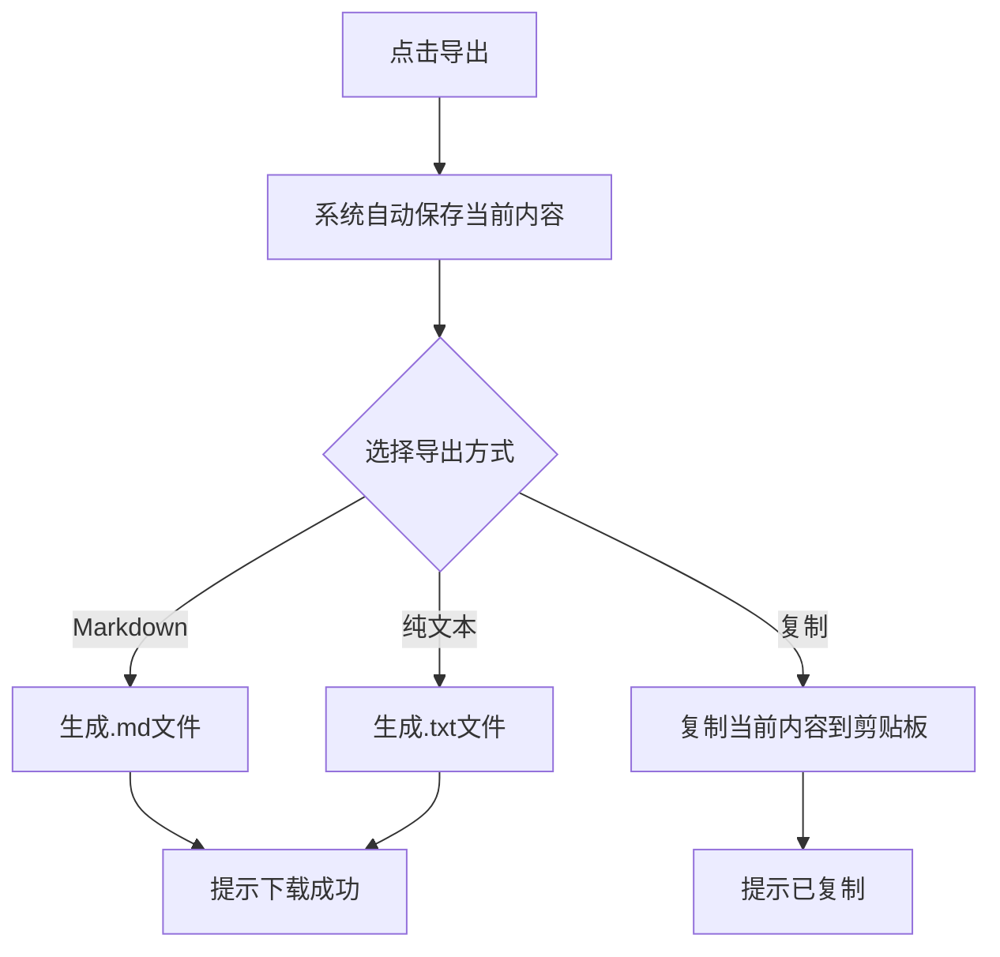

**业务规则**
1. 导出前自动保存当前内容。
2. Markdown 导出保留标题、列表、链接、引用、时间戳。
3. 纯文本导出去除 Markdown 标记，保留段落、章节、时间戳。
4. 文件名规范：`节目标题_日期_markdown.md` 或 `节目标题_日期_text.txt`。
5. 小宇宙、喜马拉雅、Apple Podcasts 专属导出仅在 UI 中作为“第二期能力”提示，不可作为 MVP 可点击交付入口。

**主要原型**

[导出格式选择原型](assets/prototypes/web/export-widget.html)

**验收标准**
- [ ] Markdown 和纯文本均可导出。
- [ ] 复制到剪贴板成功后有 Toast 提示。
- [ ] Shownotes 为空时禁用导出并提示。
- [ ] 导出面板不将平台专属格式标为 MVP 可用。

## 3.5 节目管理

### 3.5.1 节目列表与管理

**功能描述**
用户查看所有历史节目，按状态、标题、日期筛选，重新进入编辑或删除节目。

| 项 | 内容 |
| --- | --- |
| 优先级 | P0 |
| 依赖需求 | 音频上传、转录、Shownotes 保存 |
| 前置条件 | 用户已登录 |

**业务规则**
1. 列表默认按创建时间倒序展示。
2. 状态包括：校验失败、已上传、转录中、转录失败、待校对、编辑中、已保存、已导出。
3. 删除节目需二次确认，并明确提示将删除音频、转录文本和 Shownotes。
4. 音频文件默认保留 30 天，到期后无法下载原始音频；转录文本和 Shownotes 随节目记录保留，直到用户删除节目或注销账号。

**主要原型**

[节目列表原型](assets/prototypes/web/program-list-widget.html)

**验收标准**
- [ ] 节目列表正确展示状态、时长、创建时间。
- [ ] 搜索和状态筛选可用。
- [ ] 删除需二次确认并提示数据影响。
- [ ] 空列表展示上传引导。

## 3.6 订阅额度与专业版开通

### 3.6.1 订阅方案展示与人工开通

**功能描述**
用户查看免费版和专业版能力差异。MVP 不接入微信支付，专业版采用线下转账+运营人工开通。

| 项 | 内容 |
| --- | --- |
| 优先级 | P0 |
| 依赖需求 | 新版 URS 用户订阅与额度流程 |
| 前置条件 | 用户已登录 |

**业务规则**
1. 免费版：每月 3 期，每期≤200MB且≤60分钟，每月自然月重置。
2. 专业版：¥29/月或¥268/年，每期≤500MB且≤90分钟，公平使用每月≤200期。
3. 专业版开通路径：用户点击“申请开通”→展示线下转账/联系运营说明→运营确认付款→后台人工开通。
4. 在线微信支付、支付宝支付均为 P1。
5. 额度不足、文件超限、时长超限时引导用户查看专业版方案或压缩/拆分音频。

**验收标准**
- [ ] 订阅页清晰展示免费版与专业版差异。
- [ ] “立即升级”不展示微信支付二维码，而是展示线下开通说明。
- [ ] 用户可查看当前方案、剩余额度、当月已处理期数。
- [ ] 超出公平使用上限时提示联系开通企业方案。

## 3.7 合规与安全

### 3.7.1 协议、隐私、版权与举报

**功能描述**
MVP 必须提供基础合规能力，覆盖用户协议、隐私政策、上传免责声明、版权归属、AI生成内容归属、账号注销和举报入口。

| 项 | 内容 |
| --- | --- |
| 优先级 | P0 |
| 依赖需求 | 新版 URS 合规项 |
| 前置条件 | 用户注册、上传、删除、注销等关键动作 |

**业务规则**
1. 用户协议明确服务范围、禁止上传内容、额度限制、免责声明、账号处理规则。
2. 隐私政策明确手机号、音频、转录文本、Shownotes、使用记录的收集、使用、存储、删除方式。
3. 上传前提示用户确认拥有音频处理权利，且不得上传违法违规、侵权或未授权音频。
4. 用户上传音频版权归用户所有，平台仅在提供转录和生成服务所必需范围内处理。
5. AI 生成 Shownotes、金句、短文案由用户审核后发布，平台不保证事实完全准确。
6. 举报入口至少支持提交内容链接、举报原因、联系方式；第二期接入内容审核后台。

**验收标准**
- [ ] 登录页、上传页、个人中心可访问协议和隐私政策。
- [ ] 上传前有免责声明确认。
- [ ] 个人中心有账号注销入口。
- [ ] 原型和 PRD 不遗漏举报入口、版权和生成内容归属说明。

---

# 4 产品原型

## 4.1 页面跳转逻辑图

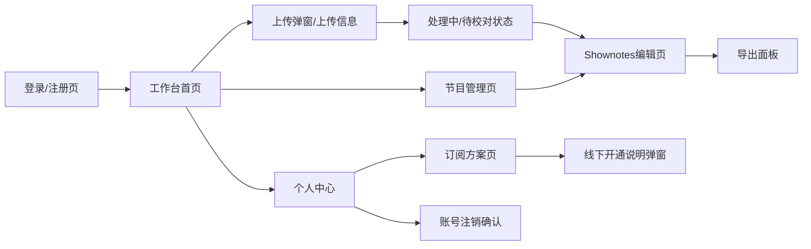

## 4.2 全站点原型设计

### 4.2.1 播客Shownotes生成器-WEB端

**页面清单**

| 序号 | 页面名称 | 所属模块 | 页面描述 | 关键元素 |
| --- | --- | --- | --- | --- |
| 1 | 登录/注册页 | 用户账户 | 手机号验证码登录与协议确认 | 手机号、验证码、获取验证码、协议/隐私政策链接 |
| 2 | 工作台首页 | 节目管理/上传 | 展示上传入口、额度、最近节目状态 | 上传区、额度卡片、节目卡片、失败/处理中状态 |
| 3 | 上传弹窗 | 音频上传 | 填写节目标题、主播/嘉宾并提交上传 | 文件选择、格式说明、套餐限制、免责声明 |
| 4 | 转录状态 | AI转录 | 展示排队/转录/低置信校对提示 | 进度条、低置信提示、失败原因、重试入口 |
| 5 | Shownotes编辑页 | 编辑校对 | 左侧 Markdown/纯文本编辑，右侧基础播放器和转录对照 | 编辑器、时间戳、发言人标签、低置信标记、基础播放器 |
| 6 | 导出面板 | 导出发布 | Markdown、纯文本、复制三种 MVP 导出方式 | 格式选择、复制、下载、P1平台格式提示 |
| 7 | 节目管理页 | 节目管理 | 查看历史节目并进入编辑或删除 | 搜索、筛选、节目状态、删除确认 |
| 8 | 个人中心 | 用户账户/合规 | 管理资料、查看额度、注销账号 | 资料表单、订阅状态、协议链接、注销入口 |
| 9 | 订阅方案页 | 订阅额度 | 展示免费版/专业版差异，提供线下开通说明 | 价格卡片、套餐限制、申请开通按钮、联系运营说明 |

**交互说明**
1. 工作台点击上传后弹出上传信息弹窗，弹窗内展示支持格式、免费/专业版大小与时长限制、免责声明。
2. 节目卡片根据状态跳转：转录中进入状态页，待校对/已保存/已导出进入编辑页，失败展示失败原因和重试入口。
3. 编辑页采用左右分栏：左侧 Markdown/纯文本编辑区，右侧基础音频播放器和转录对照；不展示波形为 MVP 必备能力。
4. 导出面板仅提供 Markdown、纯文本、复制到剪贴板三个可用选项；平台专属格式以“第二期”标识展示。
5. 订阅页点击“申请开通专业版”展示线下转账/联系运营说明，不展示微信支付二维码。
6. 删除节目、账号注销等破坏性操作必须二次确认。
7. 所有关键状态通过 Toast 提示，包括上传开始、保存成功、复制成功、导出成功、开通申请提示。

**产品原型**

[打开播客Shownotes生成器-WEB端全站点原型](原型.html)

---

# 5 数据需求

## 5.1 数据使用规格

### 用户表 users

| 字段 | 是否必填 | 描述 | 数据类型 |
| --- | --- | --- | --- |
| id | 是 | 用户唯一标识 | UUID |
| phone | 是 | 手机号，加密或脱敏存储 | 字符串 |
| nickname | 否 | 昵称 | 字符串 |
| avatar_url | 否 | 头像地址 | 字符串 |
| subscription_plan | 是 | free / pro_monthly / pro_yearly | 枚举 |
| monthly_quota_used | 是 | 本月已处理期数 | 整数 |
| manual_open_status | 否 | 专业版人工开通状态：none/pending/opened/rejected | 枚举 |
| subscription_expire_at | 否 | 专业版到期时间 | 时间戳 |
| agreement_version | 是 | 用户确认的协议版本 | 字符串 |
| privacy_version | 是 | 用户确认的隐私政策版本 | 字符串 |
| deleted_at | 否 | 注销申请时间/删除时间 | 时间戳 |
| created_at | 是 | 注册时间 | 时间戳 |

### 节目表 episodes

| 字段 | 是否必填 | 描述 | 数据类型 |
| --- | --- | --- | --- |
| id | 是 | 节目唯一标识 | UUID |
| user_id | 是 | 所属用户 | UUID |
| title | 是 | 节目标题 | 字符串 |
| host_name | 否 | 主播名 | 字符串 |
| guest_names | 否 | 嘉宾名列表，MVP通常1位嘉宾 | JSON数组 |
| audio_url | 是 | 音频文件存储地址 | 字符串 |
| audio_duration | 是 | 音频时长（秒） | 整数 |
| audio_size | 是 | 文件大小（字节） | 整数 |
| audio_format | 是 | 音频格式 | 字符串 |
| status | 是 | validating/uploaded/transcribing/failed/reviewing/editing/saved/exported/deleted | 枚举 |
| fail_reason | 否 | 校验、上传或转录失败原因 | 字符串 |
| low_confidence_count | 否 | 低置信片段数量 | 整数 |
| transcript_data | 否 | 转录文本、时间戳、发言人、置信度 | JSON |
| shownotes_markdown | 否 | 当前 Markdown 草稿 | 文本 |
| shownotes_text | 否 | 当前纯文本草稿 | 文本 |
| social_copy | 否 | 社交媒体短文案 | 文本 |
| audio_expire_at | 是 | 音频文件过期时间，默认上传后30天 | 时间戳 |
| created_at | 是 | 创建时间 | 时间戳 |
| updated_at | 是 | 更新时间 | 时间戳 |

### 模板表 templates

| 字段 | 是否必填 | 描述 | 数据类型 |
| --- | --- | --- | --- |
| id | 是 | 模板唯一标识 | UUID |
| name | 是 | 模板名称，MVP为“标准播客模板” | 字符串 |
| structure | 是 | Markdown 模板骨架 | 文本 |
| fields | 是 | 模板字段定义 | JSON |
| is_official | 是 | 是否官方模板 | 布尔 |
| phase | 是 | P0/P1 标识 | 枚举 |

### 合规记录表 compliance_records

| 字段 | 是否必填 | 描述 | 数据类型 |
| --- | --- | --- | --- |
| id | 是 | 记录ID | UUID |
| user_id | 是 | 用户ID | UUID |
| episode_id | 否 | 关联节目ID | UUID |
| record_type | 是 | agreement/privacy/upload_disclaimer/copyright/delete/report | 枚举 |
| version | 否 | 协议或政策版本 | 字符串 |
| content | 否 | 记录内容或举报原因 | 文本 |
| created_at | 是 | 记录时间 | 时间戳 |

## 5.2 统计数据

1. 每用户每月已处理期数、剩余额度、超限次数（P0）。
2. 每日上传成功数、校验失败数、转录成功率、转录平均耗时（P0）。
3. 低置信片段数量、用户校对耗时、导出次数（P0）。
4. 专业版申请数、人工开通数、付费转化率（P0，用于商业验证）。
5. 平台专属导出点击意向（P1，用于后续平台格式优先级判断）。

## 5.3 埋点需求

| 页面 | 事件 | 采集字段 | 说明 |
| --- | --- | --- | --- |
| 登录页 | login_success | user_id, is_new_user | 统计注册与登录成功 |
| 工作台 | click_upload | user_id, source | 统计上传入口点击 |
| 上传弹窗 | upload_validate_failed | user_id, reason, file_size, duration | 分析格式/大小/时长/额度失败原因 |
| 上传弹窗 | upload_complete | user_id, episode_id, file_size, duration | 上传成功统计 |
| 处理页 | transcribe_complete | user_id, episode_id, cost_time, low_confidence_count | 转录成功和质量统计 |
| 处理页 | transcribe_failed | user_id, episode_id, reason | 转录失败分析 |
| 编辑页 | save_shownotes | user_id, episode_id, edit_duration | 编辑耗时统计 |
| 编辑页 | confirm_low_confidence | user_id, episode_id, count | 低置信片段校对统计 |
| 导出面板 | export | user_id, episode_id, format | Markdown/纯文本/复制占比 |
| 订阅页 | apply_pro | user_id, plan_type | 专业版申请转化 |
| 合规入口 | submit_report | user_id, target_id, reason_type | 举报入口使用情况 |
| 个人中心 | request_account_delete | user_id | 注销申请统计 |

---

# 6 非功能需求

## 6.1 性能需求

### 6.1.1 延迟

| 编号 | 项目 | 最大延迟 | 平均延迟 | 优先级 | 备注 |
| --- | --- | --- | --- | --- | --- |
| PERF-001 | 页面首屏加载 | < 2 秒 | < 1 秒 | 高 | WEB端主应用 |
| PERF-002 | 验证码发送接口 | < 500ms | < 300ms | 高 | 不含短信通道延迟 |
| PERF-003 | 文件格式/大小校验 | < 500ms | < 200ms | 高 | 本地可先行判断 |
| PERF-004 | 音频时长校验 | < 5 秒 | < 2 秒 | 高 | 上传后读取元数据 |
| PERF-005 | 60分钟音频转录 | < 10 分钟 | < 6 分钟 | 高 | 依赖第三方ASR服务 |
| PERF-006 | Shownotes生成 | < 10 秒 | < 6 秒 | 高 | 生成简介、章节、观点、金句、短文案 |
| PERF-007 | 编辑器输入响应 | < 80ms | < 40ms | 中 | Markdown/纯文本编辑 |
| PERF-008 | 音频播放/跳转 | < 200ms | < 100ms | 中 | 基础播放器 |
| PERF-009 | Markdown/纯文本导出 | < 1 秒 | < 500ms | 中 | 单期节目 |

### 6.1.2 吞吐量

| 编号 | 项 | 吞吐量 | 备注 |
| --- | --- | --- | --- |
| THR-001 | 同时转录任务 | ≥ 50 个 | 超出进入排队状态 |
| THR-002 | 同时上传任务 | ≥ 200 个 | 对象存储上传并发 |
| THR-003 | 验证码请求 | 每分钟≥1000次 | 需配合风控限制 |
| THR-004 | Shownotes生成任务 | 同时≥50个 | 超出进入排队状态 |

### 6.1.3 容量

| 编号 | 项 | 容量 | 备注 |
| --- | --- | --- | --- |
| CAP-001 | MVP注册用户数 | ≤10,000 | 第一阶段目标 |
| CAP-002 | 日处理节目数 | ≤1,000期 | MVP容量规划 |
| CAP-003 | 免费版单文件 | ≤200MB且≤60分钟 | 必须同时满足 |
| CAP-004 | 专业版单文件 | ≤500MB且≤90分钟 | 必须同时满足 |
| CAP-005 | 专业版公平使用 | 每月≤200期 | 超出联系企业方案 |

## 6.2 安全需求

| 编号 | 要求 |
| --- | --- |
| SEC-001 | 所有 API 强制 HTTPS。 |
| SEC-002 | 手机号、访问凭证、验证码等敏感信息加密或脱敏处理，不在日志中明文打印。 |
| SEC-003 | 音频文件、转录文本和 Shownotes 默认不公开，访问必须鉴权。 |
| SEC-004 | 音频内容和转录文本不用于训练公共 AI 模型，除非用户单独授权。 |
| SEC-005 | 文件上传必须进行扩展名、MIME、内容嗅探校验，拒绝非音频文件。 |
| SEC-006 | 防 XSS、CSRF、SQL 注入，编辑器内容导出时进行必要转义和清洗。 |
| SEC-007 | 举报、注销、删除节目等高影响操作记录审计日志。 |

## 6.3 可靠性

| 编号 | 项 | 值 |
| --- | --- | --- |
| REL-001 | MVP服务可用性 | ≥99.5% |
| REL-002 | 平均故障恢复时间 | ≤30分钟 |
| REL-003 | 转录任务失败重试 | 支持至少1次用户主动重试 |
| REL-004 | 草稿保存可靠性 | 内容变更后5秒内自动保存；失败时提示未保存 |

## 6.4 可连续性

| 编号 | 项 |
| --- | --- |
| CON-001 | 系统 7×24 小时运行。 |
| CON-002 | ASR 服务不可用时，任务进入排队或失败可重试状态，不丢失用户上传记录。 |
| CON-003 | LLM 生成服务不可用时，保留转录文本，提示用户稍后重新生成 Shownotes。 |
| CON-004 | 短信服务不可用时，提示用户稍后重试，不允许绕过身份校验。 |

## 6.5 可恢复性

| 编号 | 项 |
| --- | --- |
| REC-001 | 业务数据库每日全量备份、每小时增量备份。 |
| REC-002 | 对象存储音频文件按存储策略保留，删除操作进入异步清理队列并记录审计。 |
| REC-003 | 重大故障 1-3 小时内恢复服务可用性，24 小时内恢复可用数据。 |
| REC-004 | 用户误删节目不提供默认恢复能力，删除前必须二次确认并说明影响。 |

## 6.6 兼容性

| 编号 | 要求 | 备注 |
| --- | --- | --- |
| COM-001 | Chrome ≥90、Edge ≥90、Safari ≥14、Firefox ≥88 | MVP浏览器支持 |
| COM-002 | 最低支持 1280×720，推荐 1920×1080 | 编辑区和转录区并排展示 |
| COM-003 | 支持音频格式 mp3、wav、m4a、flac、ogg | 上传校验白名单 |
| COM-004 | 移动端浏览器可打开但不承诺完整编辑体验 | H5轻量版为P1 |

## 6.7 易用性

| 编号 | 要求 | 备注 |
| --- | --- | --- |
| USE-001 | 核心操作路径“上传→转录→校对→生成→导出”不超过5步。 | MVP核心闭环 |
| USE-002 | 新用户无需培训即可完成首次上传和导出。 | 通过引导文案和空状态实现 |
| USE-003 | 额度不足、文件超限、转录失败均给出明确原因和下一步建议。 | 减少用户困惑 |
| USE-004 | 删除节目、账号注销、上传免责声明等关键操作需二次确认。 | 合规与安全 |
| USE-005 | 低置信片段必须高亮，用户可一键定位。 | 降低校对成本 |

## 6.8 合规性需求

| 编号 | 要求 | 备注 |
| --- | --- | --- |
| LAW-001 | 提供用户协议和隐私政策，并在注册/登录时记录用户确认。 | P0 |
| LAW-002 | 提供账号注销功能，满足用户停止服务和删除个人信息的诉求。 | P0 |
| LAW-003 | 上传前提供免责声明，要求用户确认拥有音频处理权利，不上传违法违规内容。 | P0 |
| LAW-004 | 明确音频版权归用户，平台仅在服务所需范围处理音频。 | P0 |
| LAW-005 | 明确 AI 生成的 Shownotes、金句、短文案由用户审核后发布，平台不保证事实完全准确。 | P0 |
| LAW-006 | 提供基础举报入口，第二期接入内容审核后台和人工复核流程。 | P0/P1 |
| LAW-007 | 音频文件默认保留30天；用户删除节目或注销账号时按规则删除或匿名化数据。 | P0 |

---

# 7 总结

## 7.1 上线计划

| 阶段 | 时间 | 内容 | 负责人 |
| --- | --- | --- | --- |
| 设计评审 | 2026-Q3 W1 | PRD、原型、合规文案、MVP范围确认 | 产品/设计/研发 |
| 开发阶段 | 2026-Q3 W1-W2 | WEB端、上传校验、ASR任务、Shownotes生成、导出、人工开通工具 | 研发团队 |
| 测试阶段 | 2026-Q3 W3 | 功能测试、异常流程、性能测试、安全与合规检查 | QA/产品 |
| 灰度阶段 | 2026-Q3 W4 | 邀请10-20位播客主播试用，验证转录质量与导出效率 | 产品/运营 |
| MVP上线 | 2026-Q3 W5 | 开放免费版注册与专业版线下开通 | 全员 |

## 7.2 后续迭代规划

- **V1.1（第二期）**：微信登录、微信支付/支付宝、断点续传、3-4人发言人识别、小宇宙/喜马拉雅/Apple Podcasts专属导出、自定义模板、自动资源链接提取、嘉宾分享确认、内容审核后台。
- **V1.2（第三期）**：团队协作、播客数据分析、平台 API 直连发布、多语言转录、RSS 导入、模板市场、移动端轻量预览。
- **V2.0（长期）**：播客创作者社区、模板共享生态、AI 播客助手、自动剪辑建议与发布效果优化。

## 7.3 自审查结论

| 检查项 | 结论 |
| --- | --- |
| 完整性 | 已覆盖新版 URS 的 MVP 核心闭环、合规项、异常流程、数据需求和非功能需求 |
| 一致性 | 已将微信支付、微信登录、平台专属导出、波形显示、完整富文本、断点续传等从 MVP P0 移至 P1 |
| 明确性 | 已明确免费/专业版大小、时长、额度、公平使用上限和发言人识别准确率目标 |
| 可测试性 | 各核心功能均给出验收标准或量化指标 |
| 原型完整性 | PRD 引用 WEB 端全站点原型 `原型.html`，第3章功能原型链接保留至现有 widget 文件 |

## 7.4 参考文档

- 《播客Shownotes自动生成器 - 用户需求说明书》（新版 URS，2026-06-29）
- 领域专家评审意见（2026-06-29）
- PRD 质量检查清单（jxh-tools-prd-assistant）
