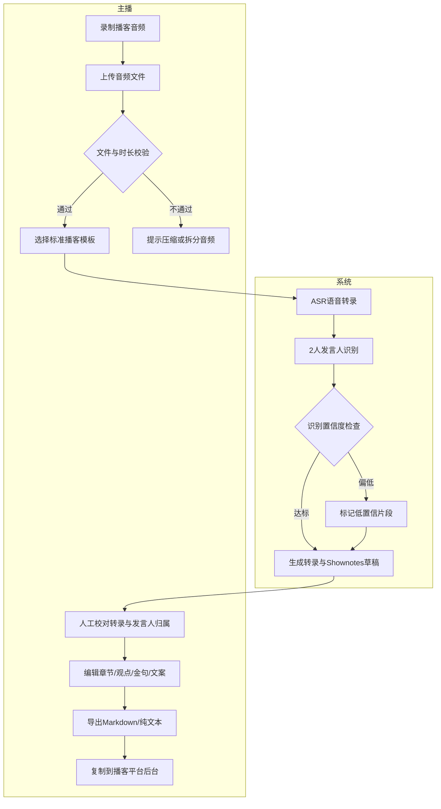
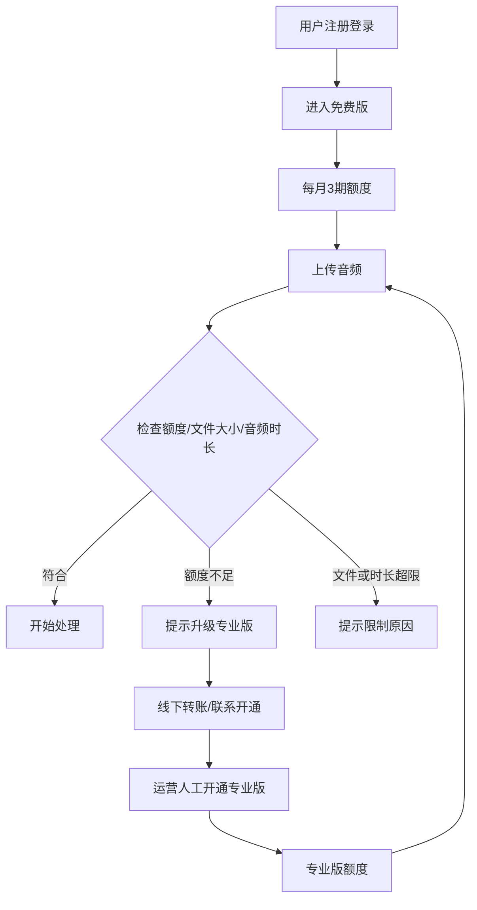
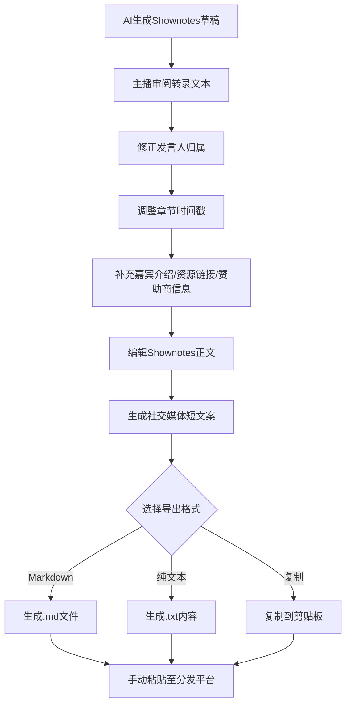
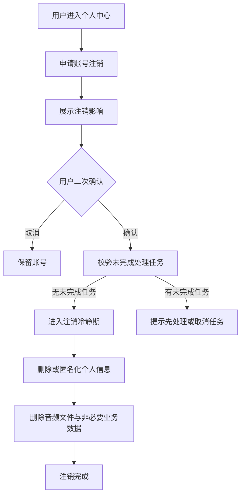
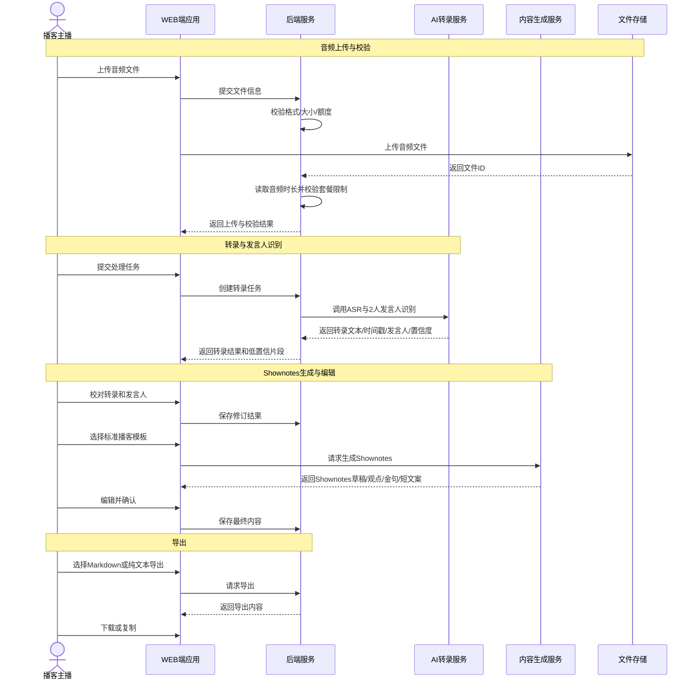
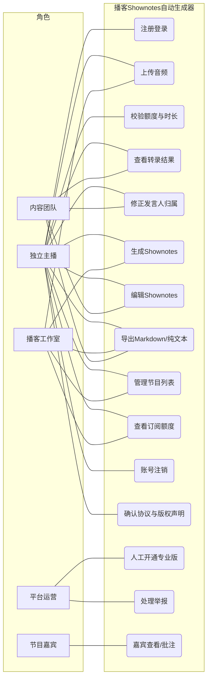
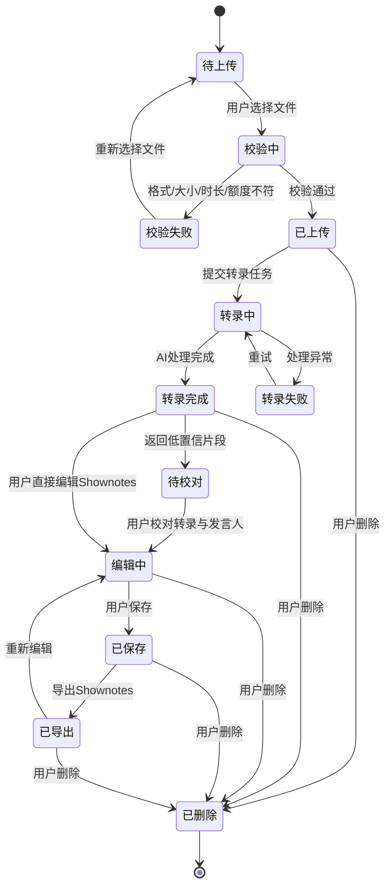
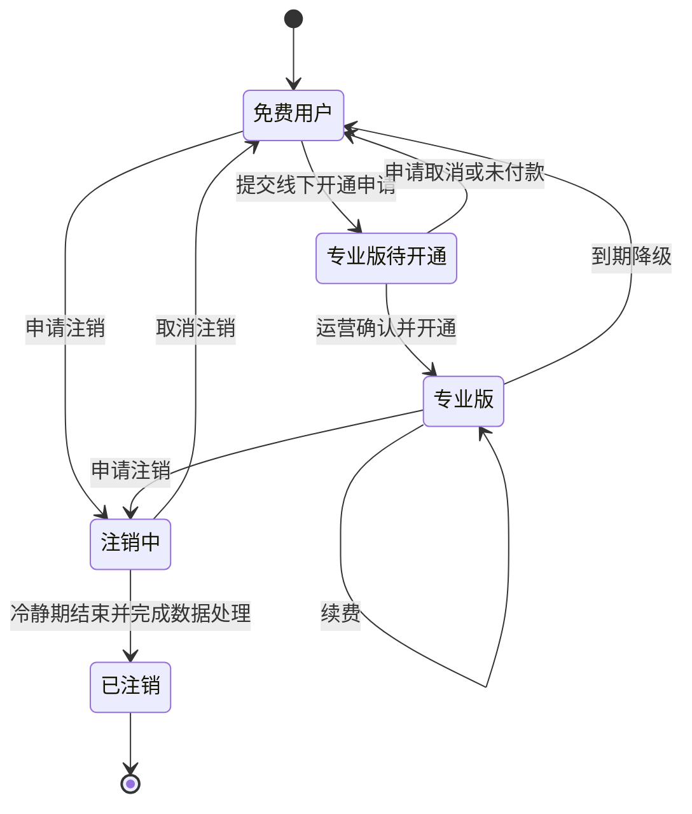

# 播客Shownotes自动生成器 - 用户需求说明书

# 1.需求概述

播客Shownotes自动生成器是一款面向播客内容创作者的垂直效率工具，基于AI语音识别与内容理解能力，将播客音频自动转录、识别发言人、提炼要点，并按照专业Shownotes模板生成可直接发布的节目笔记，帮助主播将每期节目后期整理时间从1-2小时压缩至5-10分钟。

本版根据领域专家评审意见完成修订：第一期MVP收窄为“上传 → ASR转录 → 2人发言人识别 → 人工校对 → 播客模板生成 → Markdown/纯文本导出”的核心闭环；补充合规、内容审核、账号注销与版权约束；量化发言人识别风险；统一文件大小、音频时长与套餐额度限制。

## 1.1 需求介绍

播客Shownotes自动生成器旨在解决播客创作者在节目后期整理环节的核心痛点：

1. **Shownotes撰写耗时过长**：一期60分钟的节目，主播手工撰写Shownotes通常需要1-2小时，包含反复听回放、记录时间点、提炼要点、整理嘉宾信息等环节。
2. **国内缺乏专业播客Shownotes工具**：现有通用转录工具面向会议纪要或课堂记录场景，输出结果多停留在转录文本或通用摘要；播客创作者更需要节目简介、时间戳章节、嘉宾介绍、赞助商口播位、资源链接、社交媒体文案等面向发布的内容结构。
3. **输出层差异化不足**：播客Shownotes与通用转录的核心差异不在“是否能转录”，而在“是否能生成播客发布所需的结构化内容”。本系统以播客专属模板、多内容输出和平台排版提示形成差异化。
4. **多平台发布格式调整繁琐**：不同分发平台对链接、时间戳、段落长度、emoji、HTML标签支持程度不同，主播需要反复调整格式。
5. **AI识别结果需要人工校对**：播客场景中存在重叠发言、远场录音、背景音乐、多人访谈等问题，发言人识别与转录结果必须支持低成本人工修正。

### 1.1.1 所属领域

数字内容创作工具、播客服务、AI语音识别与内容结构化工具。

### 1.1.2 核心价值

- **对独立主播**：减少Shownotes撰写与格式整理时间，快速获得可编辑草稿。
- **对播客工作室/小型厂牌**：统一不同节目的Shownotes结构和输出质量，降低后期整理人力成本。
- **对内容团队**：将音频内容沉淀为可检索、可复用、可发布的结构化文本素材。
- **对产品方**：通过免费版引流与专业版订阅，验证播客垂直工具的付费意愿。

### 1.1.3 播客Shownotes模板字段结构

MVP默认提供“标准播客Shownotes模板”，字段如下：

| 字段 | 字段说明 | 是否MVP P0 |
| --- | --- | --- |
| 节目标题 | 用户手动填写或从文件名带入 | 是 |
| 节目简介 | 基于转录文本生成100字以内简介，用户可编辑 | 是 |
| 主播/嘉宾信息 | 主播名、嘉宾名、嘉宾简介，MVP支持手动填写 | 是 |
| 时间戳章节 | 以“00:00 章节标题 - 简述”形式展示，MVP可由AI初稿+人工编辑完成 | 是 |
| 关键观点 | 提炼3-8条核心观点 | 是 |
| 金句摘录 | 提取适合传播的1-5条短句 | 是 |
| 资源链接 | 书籍、产品、人物、网站链接；MVP支持手动补充，自动识别放入P1 | 是/部分手动 |
| 赞助商口播位 | 模板预留赞助商说明区 | 是 |
| 社交媒体短文案 | 生成适合微博/朋友圈/小红书的100-200字宣传文案 | 是 |
| 下期预告 | 模板预留，可手动填写 | 是 |

### 1.1.4 目标平台格式摘要

| 平台 | Shownotes格式关注点 | MVP处理方式 |
| --- | --- | --- |
| 小宇宙 | 支持纯文本、段落、时间戳样式；链接展示受平台规则影响 | 输出“适合复制到小宇宙”的纯文本排版提示，P1再做平台专属导出 |
| 喜马拉雅 | 更偏节目简介与分段说明，外链展示可能受限 | 输出通用纯文本简介+章节结构，P1再补平台适配规则 |
| Apple Podcasts | 支持节目描述文本，HTML标签支持有限且需避免复杂样式 | MVP提供Markdown/纯文本，P1提供Apple Podcasts专用清洗规则 |
| 通用发布渠道 | Markdown、纯文本、复制到剪贴板 | MVP P0支持 |

## 1.2 需求目标

### 1.2.1 第一期目标（MVP，7天）

第一期仅完成可验证商业价值的最小闭环：

- WEB端主应用核心流程：手机号验证码登录、音频上传、处理进度、转录查看、Shownotes编辑、导出。
- 音频上传限制：免费版单文件≤200MB且音频时长≤60分钟；专业版单文件≤500MB且音频时长≤90分钟。
- ASR转录：支持中文普通话，生成带时间戳的转录文本。
- 发言人识别：MVP仅支持2人场景（主播+1位嘉宾），目标准确率≥85%；3-4人场景降级为P1。
- 人工修正：支持发言人重命名、片段归属调整、转录文本校对。
- 播客专属模板生成：生成Shownotes正文、关键观点、金句摘录、社交媒体短文案。
- 基础编辑：支持Markdown/纯文本编辑、时间戳修改、章节增删改。
- 导出：支持Markdown、纯文本、复制到剪贴板。
- 合规基础：隐私政策、用户协议、账号注销入口、音频版权声明、内容免责声明与举报入口。
- 商业验证：专业版先支持线下转账+人工开通，在线微信支付放入第二期。

以下能力不列入MVP P0：微信登录、微信支付、断点续传、波形显示、富文本编辑器、4种平台专属格式导出、多人团队协作、批量处理、自动链接提取。

### 1.2.2 第二期目标

扩展功能与体验优化：

- 微信登录与在线支付（微信支付/支付宝）
- 断点续传与批量上传
- 3-4人发言人识别与更完整的人工合并/拆分流程
- 平台专属格式导出（小宇宙、喜马拉雅、Apple Podcasts）
- 自定义模板编辑器
- 自动识别书籍、产品、人物、URL并生成资源链接
- 嘉宾分享与确认链接
- 内容审核后台与人工复核流程
- 团队空间、多节目管理与协作权限预留

### 1.2.3 第三期目标

生态与商业化：

- 播客数据分析与发布效果追踪
- 与主流播客平台API直连发布
- 多语言转录与多语言Shownotes生成
- 模板市场与社区模板
- RSS导入与节目元数据自动补全

## 1.3 系统使用角色

1. **独立播客主播**：个人创作播客内容，需要快速生成可发布的Shownotes，对成本和操作门槛敏感。
2. **播客工作室/小型厂牌负责人**：管理多档播客节目，需要统一内容结构与输出质量，第二期关注批量处理和成员协作。
3. **内容团队成员**：企业或媒体机构的内容制作人员，协助主播完成音频转文字、要点整理、发布文案生产。
4. **节目嘉宾**：参与录制，第二期可通过分享链接查看或批注自己的发言片段。
5. **平台运营方（产品方）**：管理用户、订阅开通、内容风险、额度规则、模板配置与用户反馈。

## 1.4 业务流程图

### 1.4.1 核心Shownotes生成流程（MVP）

### 1.4.2 用户订阅与额度流程（MVP）

### 1.4.3 Shownotes编辑与发布流程

### 1.4.4 账号注销与数据删除流程

# 2.功能原型

| 原型名称 | 原型链接 | 对应端 | 备注 |
| --- | --- | --- | --- |
| 播客Shownotes生成器主应用 | 需求方提供 | WEB端 | MVP版本，覆盖上传、处理、编辑、导出、个人中心 |
| 运营管理后台 | 需求方提供 | WEB端 | 第二期，覆盖用户、额度、模板、内容审核 |
| 移动端轻量预览页 | 需求方提供 | 小程序端 | 第二期或第三期，用于嘉宾查看/批注与移动端预览 |

# 3.需求清单

## 3.1 播客Shownotes生成器-WEB端

| 模块 | 一级功能 | 二级功能 | 功能描述 | 优先级 | 备注 |
| --- | --- | --- | --- | --- | --- |
| 用户账户 | 注册登录 | 手机号注册登录 | 支持手机号+验证码注册、登录、找回访问权限 | P0 | MVP替代微信登录 |
| | | 微信登录 | 支持微信扫码一键登录 | P1 | 第二期，需开放平台资质 |
| | 个人中心 | 账户信息管理 | 查看和修改昵称、头像、绑定手机 | P0 | |
| | | 订阅状态查看 | 查看当前套餐、剩余额度、到期时间、当月已处理期数 | P0 | |
| | | 账号注销 | 提供账号注销入口、注销说明、二次确认与注销结果通知 | P0 | 合规必需 |
| | | 用户协议与隐私政策确认 | 注册、上传前展示并记录用户对协议的确认 | P0 | 合规必需 |
| 音频上传 | 文件上传 | 拖拽上传 | 支持拖拽单个音频文件至上传区域 | P0 | MVP仅单文件 |
| | | 点击上传 | 支持点击选择本地音频文件上传 | P0 | |
| | | 格式校验 | 自动识别并校验mp3、wav、m4a、flac、ogg格式 | P0 | |
| | | 文件大小校验 | 免费版单文件≤200MB，专业版单文件≤500MB，超出则拒绝并提示原因 | P0 | 与时长同时校验 |
| | | 音频时长校验 | 上传后读取音频时长；免费版≤60分钟/期，专业版≤90分钟/期 | P0 | 以音频时长为核心限制 |
| | 上传管理 | 上传进度显示 | 实时显示上传进度百分比与剩余时间 | P0 | |
| | | 上传失败处理 | 上传失败时提示原因，允许重新上传 | P0 | 不含断点续传 |
| | | 断点续传 | 网络中断后支持从断点继续上传 | P1 | 第二期 |
| | | 批量上传 | 支持同时上传多个音频文件 | P1 | 第二期 |
| 音频处理 | ASR转录 | 语音转文字 | 将中文普通话音频转录为带句级时间戳的文本 | P0 | 字/词级时间戳作为P1增强 |
| | | 转录进度显示 | 展示排队中、转录中、生成中、完成、失败等状态 | P0 | |
| | | 转录失败处理 | 音频质量差、格式异常、服务失败时给出失败原因与重试入口 | P0 | |
| | 发言人识别 | 2人发言人区分 | MVP支持主播+1位嘉宾场景，目标准确率≥85% | P0 | 真实效果需提示用户校对 |
| | | 3-4人发言人区分 | 支持3-4位说话人，目标准确率≥75% | P1 | 第二期 |
| | | 低置信片段标记 | 对发言人归属不确定的片段进行标记，提示用户复核 | P0 | 风险控制 |
| | | 发言人命名 | 用户可为发言人命名，如“主播”“嘉宾A” | P0 | |
| | | 发言人归属修正 | 支持将单个片段改派给其他发言人 | P0 | 人工修正闭环 |
| | | 发言人合并/拆分 | 支持合并误拆分发言人、拆分误合并片段 | P1 | 第二期增强 |
| Shownotes生成 | 模板选择 | 标准播客模板 | 生成节目简介、时间戳章节、关键观点、金句、资源链接位、赞助商位 | P0 | MVP唯一官方模板 |
| | | 平台模板 | 小宇宙、喜马拉雅、Apple Podcasts专属模板 | P1 | 第二期 |
| | | 自定义模板 | 用户自定义Shownotes模板结构 | P1 | 第二期 |
| | 内容生成 | Shownotes草稿 | 根据转录文本生成可编辑的Shownotes草稿 | P0 | |
| | | 节目简介 | 生成100字以内节目简介 | P0 | |
| | | 关键观点 | 提炼3-8条核心观点 | P0 | |
| | | 金句摘录 | 提取1-5条适合传播的短句 | P0 | |
| | | 社交媒体短文案 | 生成100-200字社交媒体宣传文案 | P0 | 输出层差异化 |
| | | 自动链接提取 | 自动识别书籍、产品、人物、URL并生成链接建议 | P1 | 第二期 |
| 编辑校对 | 转录编辑 | 文本校对 | 支持用户修改转录文本中的错字、断句与标点 | P0 | |
| | | 时间戳编辑 | 支持手动修改章节时间戳与段落时间戳 | P0 | |
| | | 发言人编辑 | 支持修改发言人名称和片段归属 | P0 | |
| | Shownotes编辑 | Markdown/纯文本编辑 | 支持标题、列表、链接、引用等基础Markdown编辑 | P0 | MVP不做重型富文本 |
| | | 音频播放校对 | 使用基础音频播放器播放、暂停、跳转时间点 | P0 | MVP不做波形显示 |
| | | 自动保存 | 编辑内容定时保存，网络异常时提示保存状态 | P0 | |
| 导出发布 | 格式导出 | Markdown导出 | 导出为.md文件 | P0 | |
| | | 纯文本导出 | 导出为.txt或复制纯文本 | P0 | |
| | | 复制粘贴 | 一键复制格式化内容到剪贴板 | P0 | |
| | | 小宇宙格式导出 | 自动适配小宇宙平台排版 | P1 | 第二期 |
| | | 喜马拉雅格式导出 | 自动适配喜马拉雅平台排版 | P1 | 第二期 |
| | | Apple Podcasts导出 | 适配Apple Podcasts描述规范 | P1 | 第二期 |
| 节目管理 | 节目列表 | 全部节目 | 查看历史处理过的节目列表 | P0 | |
| | | 搜索节目 | 按节目标题、日期搜索 | P0 | |
| | | 筛选排序 | 按状态、日期、时长筛选排序 | P1 | |
| | 节目操作 | 重新编辑 | 对已生成Shownotes的节目重新编辑 | P0 | |
| | | 重新生成 | 更换模板或参数重新生成Shownotes | P1 | |
| | | 删除节目 | 删除不需要的节目记录并提示数据影响 | P0 | |
| 合规与安全 | 内容合规 | 免责声明确认 | 上传前提示用户确认拥有音频处理权利且不得上传违法内容 | P0 | |
| | | 举报入口 | 公开预览或分享内容提供举报入口 | P0 | MVP基础合规 |
| | | 内容风险标记 | 对疑似敏感内容进行标记，提示用户自查 | P1 | 第二期 |
| | 数据权益 | 音频版权声明 | 明确用户保留音频原始版权，平台仅获得处理所需授权 | P0 | |
| | | AI生成内容归属声明 | 明确用户对其输入音频生成的Shownotes享有使用与发布权 | P0 | |

## 3.2 运营管理后台-WEB端

| 模块 | 一级功能 | 二级功能 | 功能描述 | 优先级 | 备注 |
| --- | --- | --- | --- | --- | --- |
| 用户管理 | 用户列表 | 用户查询 | 查看注册用户、套餐、额度、状态 | P1 | 第二期 |
| | 用户操作 | 手动调整额度 | 为用户手动增加/减少使用额度 | P0 | MVP可用简化后台或运营工具支持线下开通 |
| | | 专业版人工开通 | 根据线下付款记录为用户开通专业版 | P0 | MVP商业验证 |
| | | 封禁/解封 | 对违规用户进行封禁或解封 | P1 | 第二期 |
| 订阅管理 | 订阅统计 | 订阅概览 | 查看免费/付费用户数量、转化率 | P1 | 第二期 |
| | | 收入统计 | 查看月度收入、续费率 | P1 | 第二期 |
| 内容审核 | 敏感内容 | 风险记录 | 查看用户举报或系统标记的风险内容 | P1 | 第二期 |
| | | 人工复核 | 运营人员对标记内容进行人工审核 | P1 | 第二期 |
| 系统配置 | 模板管理 | 官方模板 | 管理平台提供的官方Shownotes模板 | P1 | 第二期 |
| | | 计费规则 | 配置免费版额度、专业版价格、公平使用阈值 | P1 | 第二期 |

# 4.非功能需求

## 4.1 使用界面需求

| 需求项 | 详细描述 | 备注 |
| --- | --- | --- |
| 设计风格 | 简洁专业的创作者工具风格，减少视觉干扰，聚焦内容编辑体验 | P0 |
| 主色调 | 采用深色模式为主，搭配播客行业常用的紫色/蓝色作为点缀色 | P0 |
| 响应式设计 | WEB端适配1280px及以上宽屏，保证编辑器与转录区并排展示 | P0 |
| 编辑体验 | MVP采用Markdown/纯文本编辑与实时预览，不要求完整富文本编辑器 | P0 |
| 音频播放器 | MVP使用基础音频播放器，支持播放、暂停、进度跳转、倍速；波形显示为P1 | P0 |
| 加载体验 | 转录处理过程展示进度状态、预计等待时间与失败提示 | P0 |
| 合规提示 | 上传、注销、删除节目等高影响操作必须展示清晰提示与二次确认 | P0 |

## 4.2 软硬件环境需求

| 需求项 | 详细描述 | 备注 |
| --- | --- | --- |
| 浏览器支持 | Chrome 90+、Edge 90+、Safari 14+、Firefox 88+ | P0 |
| 屏幕分辨率 | 最低支持1280×720，推荐1920×1080 | P0 |
| 后端环境 | 需要云端后台服务支撑音频存储、转录任务、用户额度、内容生成和导出 | P0 |
| 音频格式 | 支持mp3、wav、m4a、flac、ogg主流音频格式 | P0 |
| 移动端适配 | MVP暂不要求，第二期提供H5或小程序轻量预览 | P1 |

## 4.3 性能需求

| 需求项 | 详细描述 | 备注 |
| --- | --- | --- |
| 音频上传 | 100MB文件上传完成时间目标<2分钟（常规宽带网络），弱网环境需展示进度与失败原因 | P0 |
| 文件校验 | 上传开始前完成格式校验，上传完成后完成音频时长校验 | P0 |
| 转录速度 | 60分钟音频转录处理时间目标<10分钟；超时需提示排队或失败原因 | P0 |
| Shownotes生成 | 模板生成响应时间目标<10秒 | P0 |
| 页面加载 | 首屏加载时间目标<2秒 | P0 |
| 播放器响应 | 音频播放、暂停、跳转响应目标<200ms | P0 |
| 并发处理 | MVP阶段支持同时处理50个音频转录任务；超出时进入排队状态 | P0 |
| 系统容量 | MVP阶段目标支持1万注册用户、日处理1000期节目 | P0 |

## 4.4 约束性需求

| 需求项 | 详细描述 | 备注 |
| --- | --- | --- |
| MVP范围约束 | MVP不实现微信登录、微信支付、断点续传、波形显示、完整富文本编辑器、平台专属导出和批量处理 | P0 |
| 免费版额度 | 免费版每月3期；每期单文件≤200MB且音频时长≤60分钟；额度每月自然月重置 | P0 |
| 专业版额度 | 专业版¥29/月或¥268/年；每期单文件≤500MB且音频时长≤90分钟；公平使用上限为每月200期，超出需联系开通企业方案 | P0 |
| 校验逻辑 | 系统必须同时校验文件大小、文件格式、音频时长与用户剩余额度；以音频时长作为是否可处理的核心依据 | P0 |
| 付费方式 | MVP阶段采用线下转账+运营人工开通专业版；微信支付与支付宝为P1 | P0 |
| 发言人识别风险 | MVP仅承诺2人场景目标准确率≥85%；重叠发言、背景噪声、远场录音会降低准确率，系统必须提示用户校对 | P0 |
| 多人场景约束 | 3-4人发言人识别为P1，目标准确率≥75%；超过4人暂不承诺自动区分效果 | P1 |
| 数据存储 | 音频原文件默认保留30天；转录文本与Shownotes随节目记录保留，用户删除节目或注销账号时按规则删除或匿名化 | P0 |
| 隐私保护 | 用户音频和转录内容默认不公开，不用于训练公共AI模型；如用于质量改进必须取得单独授权 | P0 |
| 用户协议 | 必须提供用户协议，明确服务范围、禁止上传内容、额度限制、免责声明、账号处理规则 | P0 |
| 隐私政策 | 必须提供隐私政策，明确音频、转录文本、手机号、使用记录等个人信息的收集、使用、存储、删除方式 | P0 |
| 账号注销 | 必须提供账号注销能力，满足用户删除个人信息与停止服务的需求 | P0 |
| 内容合规 | MVP至少提供上传前免责声明、禁止内容提示与举报入口；第二期补充系统标记和人工审核后台 | P0 |
| 音频版权 | 用户应保证拥有上传音频的处理与发布权利；平台仅在提供转录和生成服务所必需范围内处理音频 | P0 |
| 生成内容归属 | 基于用户上传音频生成的Shownotes、短文案、金句等内容由用户负责审核并享有发布使用权，平台不保证事实完全准确 | P0 |
| 竞品差异化 | 系统差异化重点放在播客输出层：播客专属字段、多内容输出、时间戳章节、社交媒体文案、平台排版提示，而非单纯ASR转录 | P0 |

## 4.5 异常处理需求

| 异常场景 | 系统行为 | 优先级 |
| --- | --- | --- |
| 文件格式不支持 | 上传前或上传后提示支持格式，并拒绝进入处理 | P0 |
| 文件大小或时长超限 | 明确提示当前套餐限制、实际文件大小/时长和可选处理方式 | P0 |
| 用户额度不足 | 阻止提交新处理任务，提示剩余额度和升级路径 | P0 |
| ASR转录失败 | 显示失败原因、允许重试或重新上传 | P0 |
| 转录质量较低 | 对低置信片段进行标记，提示用户重点校对 | P0 |
| 发言人识别不稳定 | 标记低置信发言人片段并提供人工改派入口 | P0 |
| 上传中关闭浏览器 | MVP不保证断点续传，用户重新进入后提示重新上传；P1支持断点续传 | P0/P1 |
| 编辑时网络断开 | 本地保留未保存提示，网络恢复后提示用户保存 | P0 |
| 导出失败 | 提示失败原因并允许重新导出或复制纯文本内容 | P0 |

# 5.接口需求

## 5.1 硬件接口需求

本项目不涉及硬件接口需求。

## 5.2 软件接口需求

| 模块 | 接口名称 | 输入 | 输出 | 功能描述 |
| --- | --- | --- | --- | --- |
| 用户认证 | 用户注册/登录 | 手机号、验证码 | 登录结果、用户ID、访问凭证 | 支撑手机号验证码注册登录 |
| | 用户信息更新 | 昵称、头像等 | 更新结果 | 更新用户资料 |
| | 账号注销申请 | 用户ID、确认信息 | 注销申请结果 | 支撑用户注销与数据删除流程 |
| | 协议确认记录 | 用户ID、协议版本、确认时间 | 记录结果 | 记录用户对用户协议、隐私政策的确认 |
| 额度与订阅 | 额度查询 | 用户ID | 套餐、剩余额度、当月已处理期数、限制信息 | 上传前展示和校验额度 |
| | 专业版人工开通 | 用户ID、开通时长、操作人 | 开通结果 | MVP线下付款后人工开通专业版 |
| 音频服务 | 音频上传 | 音频文件、用户ID | 上传结果、文件ID | 上传音频文件至云端 |
| | 文件校验 | 文件ID、文件大小、格式、音频时长 | 校验结果 | 判断是否符合套餐限制 |
| | 音频删除 | 文件ID | 删除结果 | 删除音频文件 |
| AI转录服务 | 提交转录任务 | 文件ID、语言参数、期望说话人数 | 任务ID | 提交音频转录任务，MVP期望说话人数为2 |
| | 转录状态查询 | 任务ID | 处理进度、状态、失败原因 | 查询转录处理进度 |
| | 获取转录结果 | 任务ID | 带时间戳文本、发言人信息、低置信片段 | 获取转录和发言人识别结果 |
| Shownotes服务 | 模板列表 | 用户ID | 可用模板列表 | MVP返回标准播客模板 |
| | 生成Shownotes | 任务ID、模板ID、节目元数据 | Shownotes草稿、关键观点、金句、社交媒体短文案 | 基于转录结果生成播客输出内容 |
| | 保存Shownotes | 节目ID、Shownotes内容、转录修订内容 | 保存结果 | 保存编辑后的Shownotes与转录修订 |
| | 导出Shownotes | 节目ID、导出格式 | Markdown文件/纯文本/剪贴板内容 | 按指定格式导出Shownotes |
| 节目管理 | 节目列表 | 用户ID、筛选条件 | 节目列表 | 获取用户的节目列表 |
| | 节目详情 | 节目ID | 节目完整信息 | 获取单个节目详情 |
| | 节目删除 | 节目ID、确认信息 | 删除结果 | 删除节目及关联数据 |
| 合规服务 | 举报提交 | 内容ID、举报原因、联系方式 | 举报结果 | 支撑基础内容举报入口 |
| | 风险提示记录 | 用户ID、节目ID、提示类型 | 记录结果 | 记录上传免责声明、低质量提示等关键确认 |

## 5.3 通讯接口需求

| 模块 | 接口名称 | 输入 | 输出 | 功能描述 |
| --- | --- | --- | --- | --- |
| 短信服务 | 验证码发送 | 手机号、业务场景 | 发送结果 | 用于手机号注册登录 |
| 消息通知 | 处理完成通知 | 任务完成信息 | 通知结果 | 通过站内消息/邮件/短信提醒用户转录完成 |
| | 额度预警通知 | 额度使用信息 | 通知结果 | 免费额度即将用完时提醒用户 |
| AI服务通讯 | ASR API调用 | 音频文件URL、语言、说话人数 | 转录文本、时间戳、发言人信息、置信度 | 调用第三方语音识别能力进行转录和说话人分离 |
| | LLM API调用 | 转录文本、模板字段、生成要求 | Shownotes草稿、观点、金句、短文案 | 调用大语言模型生成播客输出内容 |
| 支付通讯 | 微信支付/支付宝 | 订单信息 | 支付结果 | P1在线支付，不属于MVP P0 |
| 第三方登录 | 微信OAuth | 微信授权Code | 用户OpenID、UnionID | P1微信登录，不属于MVP P0 |

# 6. 附录

## 流程图

详见1.4章节业务流程图。

## 时序图

## （用户与系统交互）用例图

## （系统）状态图

### 节目处理生命周期状态图

### 用户订阅状态图

## 平台格式规范摘要

| 输出类型 | MVP支持情况 | 说明 |
| --- | --- | --- |
| Markdown | P0 | 保留标题、列表、链接、引用、时间戳，便于二次编辑 |
| 纯文本 | P0 | 适合复制到小宇宙、喜马拉雅、Apple Podcasts等平台后台 |
| 小宇宙专属格式 | P1 | 第二期根据平台实际编辑器能力补充排版规则 |
| 喜马拉雅专属格式 | P1 | 第二期补充分段简介、链接限制、标签建议等规则 |
| Apple Podcasts专属格式 | P1 | 第二期补充HTML清洗和描述长度规则 |

---

**文档说明**：本需求说明书基于“优特云-用户语言”五层架构规范编写，覆盖用户层（使用角色、业务流程）、业务层（功能需求清单）、应用层（编辑与导出能力）、数据层（接口需求）和基础层（性能、合规、约束）等维度。修订后MVP聚焦7天内可交付的核心闭环，并将高资质、高复杂度或高风险能力降级到第二期。