# 播客精彩片段剪辑助手 — 产品需求规格说明书（PRD）

> 文档版本：V1.0
> 编写日期：2026-06-28
> 适用产品：播客精彩片段剪辑助手（内容创作工具 MVP）
> 关联需求文档：需求文档.md（URS v1.0）

| 版本号 | 变更日期 | 变更内容 | 变更人 | 审核人 |
| --- | --- | --- | --- | --- |
| V1.0 | 2026-06-28 | 初始版本创建 | 产品文档结对写作专家 | 阶段一产品落地页文档总编辑 |

---

# 1 概述

## 1.1 需求背景

**需求来源：** 中文播客市场快速增长，播客创作者面临"内容优质但分发效率低"的核心痛点。一档播客节目时长通常 30-90 分钟，其中蕴含大量金句、有趣时刻和争议观点，但将这些精彩片段提取出来并适配不同平台（小红书、抖音、视频号、朋友圈）进行二次分发，需要耗费大量人力和时间。

**业务痛点：**
1. **找片段难**：创作者需要反复听完整播客，手动记录精彩片段的时间戳，效率极低
2. **改写文案累**：不同平台的内容风格差异大（小红书偏图文种草、抖音偏短视频脚本、朋友圈偏简短分享），手动逐平台改写耗时耗力
3. **多平台运营重**：一人运营多平台，封面图设计、标签选择、发布时间选择都需要经验积累
4. **成本高昂**：聘请专业剪辑团队或运营团队成本过高，个人播客主难以承受

**业务价值：**
- 将"播客→精彩片段→多平台文案"的端到端处理时间从 3-5 小时缩短至 15-30 分钟
- 降低创作者的多平台运营门槛，让个人播客主也能高效做内容分发
- 通过 AI 智能识别和文案生成，提升内容分发的质量和一致性

**预期达成目标：**
- MVP 阶段（7-10 天）：完成音频上传→ASR转写→LLM片段识别→文案生成→导出核心链路
- 免费版用户月活：首月 500+ 注册用户
- 专业版转化率：5-10% 免费用户转化为付费用户
- 用户满意度：NPS ≥ 40

## 1.2 名词解释

| **名词** | **说明** |
| --- | --- |
| ASR | Automatic Speech Recognition，自动语音识别，将音频转为文字的技术 |
| LLM | Large Language Model，大语言模型，用于片段识别和文案生成 |
| 精彩片段 | 播客音频中的金句、有趣时刻、争议观点、故事高光等值得二次传播的内容片段 |
| 时间戳 | 片段在完整音频中的起止时间标记，精确到秒 |
| 文案模板 | 预设的文案生成规则和风格参数，决定 AI 生成文案的格式和调性 |
| 片段库 | 存储用户历史处理过的所有精彩片段的数据库，支持搜索、筛选和复用 |
| 多平台分发 | 将同一内容适配不同平台（小红书/抖音/视频号/朋友圈）的格式和风格要求后发布 |
| MVP | Minimum Viable Product，最小可行产品，首期交付的核心功能版本 |

## 1.3 产品介绍

**播客精彩片段剪辑助手**是一款面向中文播客主、播客制作团队及 MCN 运营人员的轻量级内容二次加工 SaaS 工具。产品聚焦于"播客音频 → AI 精彩片段识别 → 多平台分发文案生成"这一垂直场景，通过 AI 技术帮助创作者以最低成本将优质播客内容高效分发到多个平台。

**目标用户：**
- 独立播客主：个人运营一档播客节目，负责内容制作和全平台分发
- 播客制作团队成员：2-5 人小型播客工作室，分工负责内容编辑和运营
- MCN 运营人员：同时管理 5+ 档播客节目的多平台分发运营
- 跨平台内容创作者：已有播客内容，需向小红书/抖音/视频号拓展的创作者

**使用场景：**
- 播客节目发布后，需要快速提取精彩片段进行多平台二次分发
- 播客主希望将长音频内容转化为短视频脚本、图文笔记等短内容形态
- MCN 运营人员需要批量处理多档播客的分发任务

**产品核心价值：**
- **省时**：AI 自动识别精彩片段并生成多平台文案，将 3-5 小时的手工工作缩短至 15-30 分钟
- **省力**：无需专业剪辑和文案能力，AI 一键生成适配各平台的内容
- **专业**：基于平台特性的文案模板，确保生成内容符合各平台的内容风格和传播规律

### 1.3.1 范围说明

| 项 | 内容 |
| --- | --- |
| 包含功能 | 音频上传与管理、AI 精彩片段识别与审阅、多平台文案生成（小红书/抖音/朋友圈/视频号）、封面图建议/标签推荐/发布时间建议、单平台文案导出、片段库管理、基础数据看板、账户与订阅管理 |
| 不包含功能 | 通用音频剪辑功能、播客托管功能、原生移动端 APP、后台管理系统、直接对接各平台发布 API（首期仅做文案导出）、视频文件处理、自定义 AI 模型训练 |

---

# 2 产品设计

## 2.1 系统架构图

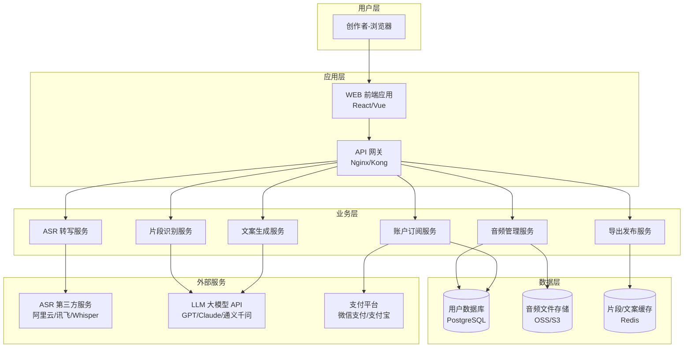

## 2.2 业务模块图

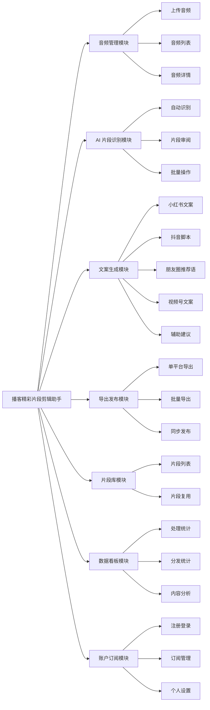

## 2.3 主业务流程

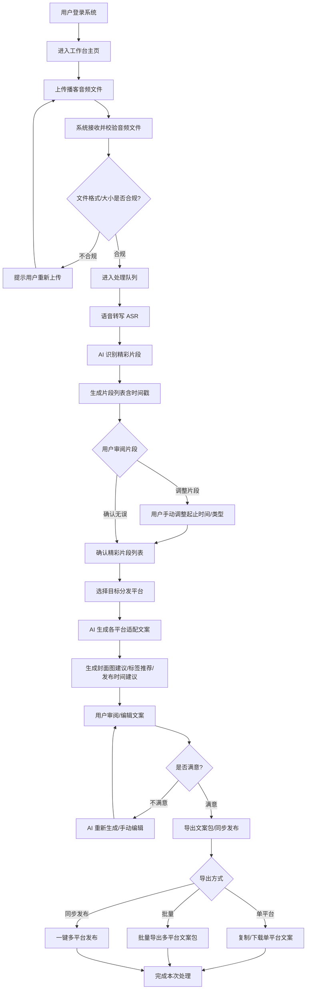

## 2.4 功能图/列表

| 功能模块 | 功能名称 | 优先级 | 功能描述 |
| --- | --- | --- | --- |
| 音频管理 | 单文件上传 | P0 | 支持 MP3/WAV/M4A/AAC 格式，单文件最大 2GB |
| 音频管理 | 拖拽上传 | P0 | 支持拖拽音频文件到上传区域 |
| 音频管理 | 批量上传 | P1 | 专业版功能，支持一次上传多期播客音频 |
| 音频管理 | 音频列表 | P0 | 展示已上传音频，含文件名、时长、上传时间、处理状态 |
| 音频管理 | 搜索/筛选 | P0 | 按文件名、日期、状态筛选音频 |
| 音频管理 | 删除音频 | P0 | 删除不再需要的音频文件及关联片段 |
| 音频管理 | 播放音频 | P0 | 在线播放播客音频，支持进度条拖拽 |
| 音频管理 | 查看转写文本 | P0 | 查看 AI 转写的完整文本，支持按时间戳定位 |
| AI 片段识别 | 自动识别 | P0 | AI 自动识别金句、有趣时刻、争议观点，按类型分类 |
| AI 片段识别 | 时间戳标记 | P0 | 为每个片段标记精确的起止时间戳（精确到秒） |
| AI 片段识别 | 片段摘要 | P0 | 为每个片段生成一句话摘要 |
| AI 片段识别 | 片段类型分类 | P0 | 按金句/有趣时刻/争议观点/故事高光等类型分类 |
| 片段审阅 | 播放片段 | P0 | 点击片段直接播放对应音频片段 |
| 片段审阅 | 编辑片段 | P0 | 手动调整片段起止时间、修改摘要、调整类型 |
| 片段审阅 | 删除片段 | P0 | 删除不满意的片段 |
| 片段审阅 | 新增片段 | P0 | 手动添加 AI 未识别到的精彩片段 |
| 片段审阅 | 全选/多选 | P0 | 批量选中多个片段进行后续操作 |
| 片段审阅 | 批量生成文案 | P0 | 对选中的多个片段一键生成各平台文案 |
| 文案生成 | 小红书文案 | P0 | 生成小红书风格文案（标题+正文+标签+emoji） |
| 文案生成 | 抖音短视频脚本 | P0 | 生成抖音短视频脚本（开场hook+正文+结尾CTA+字幕建议） |
| 文案生成 | 朋友圈推荐语 | P0 | 生成适合朋友圈分享的简短推荐语 |
| 文案生成 | 视频号文案 | P0 | 生成视频号适配的文案（标题+描述+话题标签） |
| 文案生成 | 文案模板 | P0 | 使用系统内置文案模板 |
| 文案生成 | 自定义模板 | P1 | 专业版功能，创建/使用自定义文案模板 |
| 辅助建议 | 封面图建议 | P0 | 基于片段内容生成封面图文字/构图建议 |
| 辅助建议 | 标签推荐 | P0 | 基于内容推荐各平台热门标签 |
| 辅助建议 | 发布时间建议 | P0 | 基于平台特性和内容类型推荐最佳发布时间 |
| 导出发布 | 一键复制 | P0 | 一键复制单平台文案到剪贴板 |
| 导出发布 | 下载文案 | P0 | 下载单平台文案为 TXT/MD 文件 |
| 导出发布 | 多平台文案包 | P1 | 专业版功能，一键打包下载所有平台文案为 ZIP |
| 导出发布 | 导出为 Excel | P1 | 专业版功能，导出所有文案为 Excel 表格 |
| 导出发布 | 授权账号 | P2 | 专业版功能，绑定小红书/抖音/视频号账号 |
| 导出发布 | 一键发布 | P2 | 专业版功能，将文案一键发布到已绑定的各平台 |
| 导出发布 | 定时发布 | P2 | 专业版功能，设置各平台定时发布时间 |
| 片段库 | 查看所有片段 | P0 | 展示所有历史处理过的精彩片段 |
| 片段库 | 搜索片段 | P0 | 按关键词、类型、来源、日期搜索片段 |
| 片段库 | 按来源筛选 | P0 | 按播客节目/单期音频筛选片段 |
| 片段库 | 重新生成文案 | P0 | 对已有片段重新选择平台生成新文案 |
| 片段库 | 收藏片段 | P1 | 标记特别优质的片段为收藏 |
| 片段库 | 分享片段 | P2 | 生成片段分享链接（含音频片段+文案） |
| 数据看板 | 本月处理量 | P1 | 展示本月已处理播客期数/片段数/文案数 |
| 数据看板 | 剩余额度 | P0 | 免费版展示本月剩余额度 |
| 数据看板 | 各平台发布数据 | P1 | 展示各平台发布次数/内容类型分布 |
| 数据看板 | 高频金句 | P2 | 统计出现频率最高的金句/话题 |
| 账户管理 | 手机号注册 | P0 | 通过手机号+验证码注册 |
| 账户管理 | 微信登录 | P0 | 通过微信扫码登录 |
| 账户管理 | 查看方案 | P0 | 查看免费版/专业版功能对比 |
| 账户管理 | 升级/续费 | P0 | 在线支付升级为专业版 |
| 账户管理 | 查看用量 | P0 | 查看本月已用/剩余额度 |
| 账户管理 | 修改信息 | P0 | 修改昵称、头像、密码 |
| 账户管理 | 偏好设置 | P1 | 设置默认平台、默认模板等偏好 |

## 2.5 你的产品有哪些端

| 序号 | 端名称 | 端类型 | 目标用户 | 说明 |
| --- | --- | --- | --- | --- |
| 1 | 创作者端 WEB | WEB端 | 播客主/制作团队/MCN运营 | 创作者在电脑上使用浏览器访问，完成音频上传、片段审阅、文案生成、导出发布等核心操作 |

---

# 3 产品功能

## 3.1 创作者端 WEB 功能

### 3.1.1 音频上传与管理

**功能描述：** 用户可以上传播客音频文件到系统，系统对音频进行格式和大小校验后进入处理队列。用户可以查看已上传的音频列表，搜索筛选音频，播放音频，查看转写文本，删除音频。

**优先级与依赖说明：**

| 项 | 内容 |
| --- | --- |
| 优先级 | P0 |
| 依赖需求 | 无 |
| 前置条件 | 用户已登录系统 |

### 3.1.2 音频上传与管理—详细流程

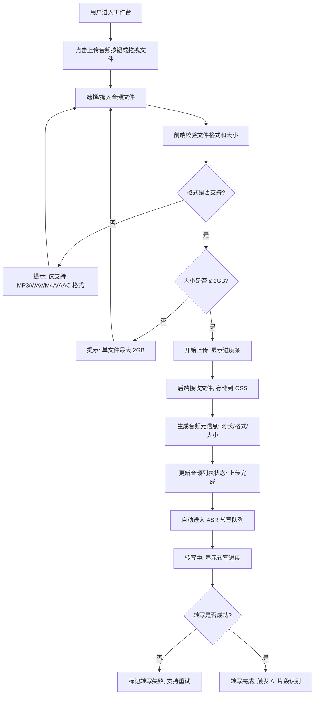

**业务规则说明：**
1. 支持的音频格式：MP3、WAV、M4A、AAC，不支持其他格式
2. 单文件大小限制：最大 2GB，超过限制提示用户
3. 免费版每月最多上传 3 期播客，专业版不限期数
4. 音频上传后自动进入 ASR 转写队列，转写完成后自动触发 AI 片段识别
5. 音频文件保留 90 天，超期自动清理，用户可重新上传
6. 上传支持断点续传，网络中断后可继续上传
7. 批量上传仅专业版可用，免费版仅支持单文件上传

### 3.1.3 音频上传与管理—主要原型

[音频上传组件原型](assets/prototypes/web/audio-upload-widget.html)

**验收标准说明：**
- [ ] 正常流程：用户可以成功上传 MP3/WAV/M4A/AAC 格式的音频文件，上传过程中显示进度条，上传完成后音频出现在列表中
- [ ] 异常流程：上传不支持的格式时提示"仅支持 MP3/WAV/M4A/AAC 格式"；上传超过 2GB 的文件时提示"单文件最大 2GB"
- [ ] 性能要求：100MB 文件上传时间 ≤ 30 秒（取决于用户网络），上传过程不阻塞其他操作

### 3.1.4 AI 片段识别与审阅

**功能描述：** AI 自动识别音频中的精彩片段（金句、有趣时刻、争议观点、故事高光），为每个片段标记精确的时间戳和一句话摘要。用户可以审阅片段列表，播放片段音频，手动调整片段起止时间、修改摘要、调整类型，删除不满意的片段，手动添加 AI 未识别到的片段。支持批量选中多个片段进行后续操作。

**优先级与依赖说明：**

| 项 | 内容 |
| --- | --- |
| 优先级 | P0 |
| 依赖需求 | 音频上传与管理 |
| 前置条件 | 音频已完成 ASR 转写 |

### 3.1.5 AI 片段识别与审阅—详细流程

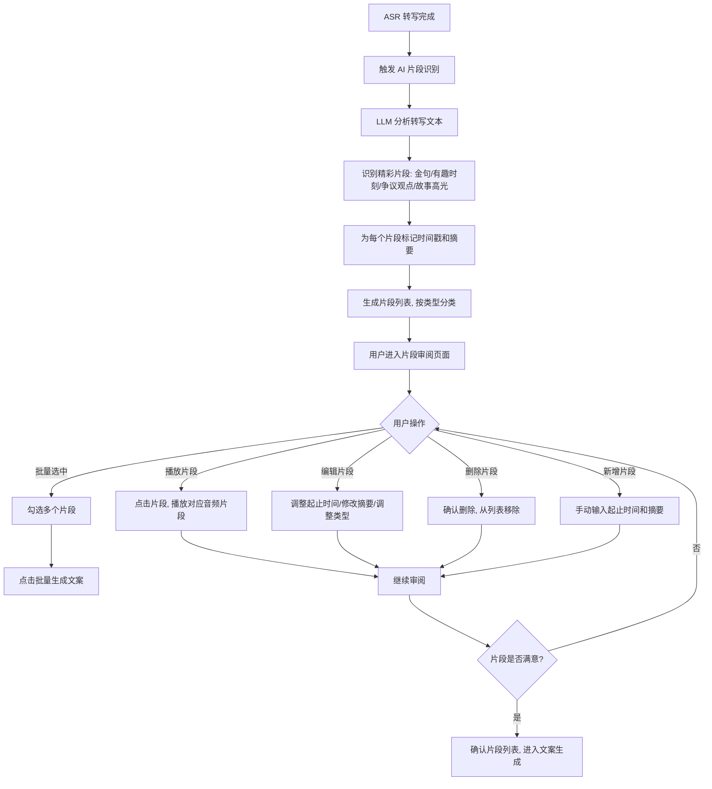

**业务规则说明：**
1. AI 识别的片段类型分为：金句、有趣时刻、争议观点、故事高光
2. 每个片段的时间戳精确到秒，格式为 HH:MM:SS
3. 每个片段自动生成一句话摘要（≤50 字）
4. 1 小时音频的片段识别时间 ≤ 3 分钟
5. 用户可以手动调整片段的起止时间、修改摘要、调整类型
6. 用户可以删除不满意的片段，也可以手动添加 AI 未识别到的片段
7. 批量选中片段后，可以一键生成各平台文案
8. 片段识别失败时支持重试，重试不消耗用户额度

### 3.1.6 AI 片段识别与审阅—主要原型

[片段识别与审阅原型](assets/prototypes/web/fragment-review-widget.html)

**验收标准说明：**
- [ ] 正常流程：AI 识别完成后展示片段列表，每个片段显示类型标签、时间戳、摘要，点击可播放对应音频片段
- [ ] 异常流程：识别失败时显示"识别失败，点击重试"按钮；识别结果为空时显示"未识别到精彩片段，请尝试其他音频"
- [ ] 性能要求：1 小时音频的片段识别时间 ≤ 3 分钟，片段列表加载时间 ≤ 2 秒

### 3.1.7 多平台文案生成

**功能描述：** 基于确认的精彩片段，AI 自动生成各平台适配的文案。小红书文案（标题+正文+标签+emoji）、抖音短视频脚本（开场hook+正文+结尾CTA+字幕建议）、朋友圈推荐语（简短分享语+链接占位）、视频号文案（标题+描述+话题标签）。同时生成封面图建议、标签推荐和发布时间建议。用户可以编辑修改文案，不满意时可重新生成。支持使用系统内置模板或自定义模板（专业版）。

**优先级与依赖说明：**

| 项 | 内容 |
| --- | --- |
| 优先级 | P0 |
| 依赖需求 | AI 片段识别与审阅 |
| 前置条件 | 用户已确认精彩片段列表 |

### 3.1.8 多平台文案生成—详细流程

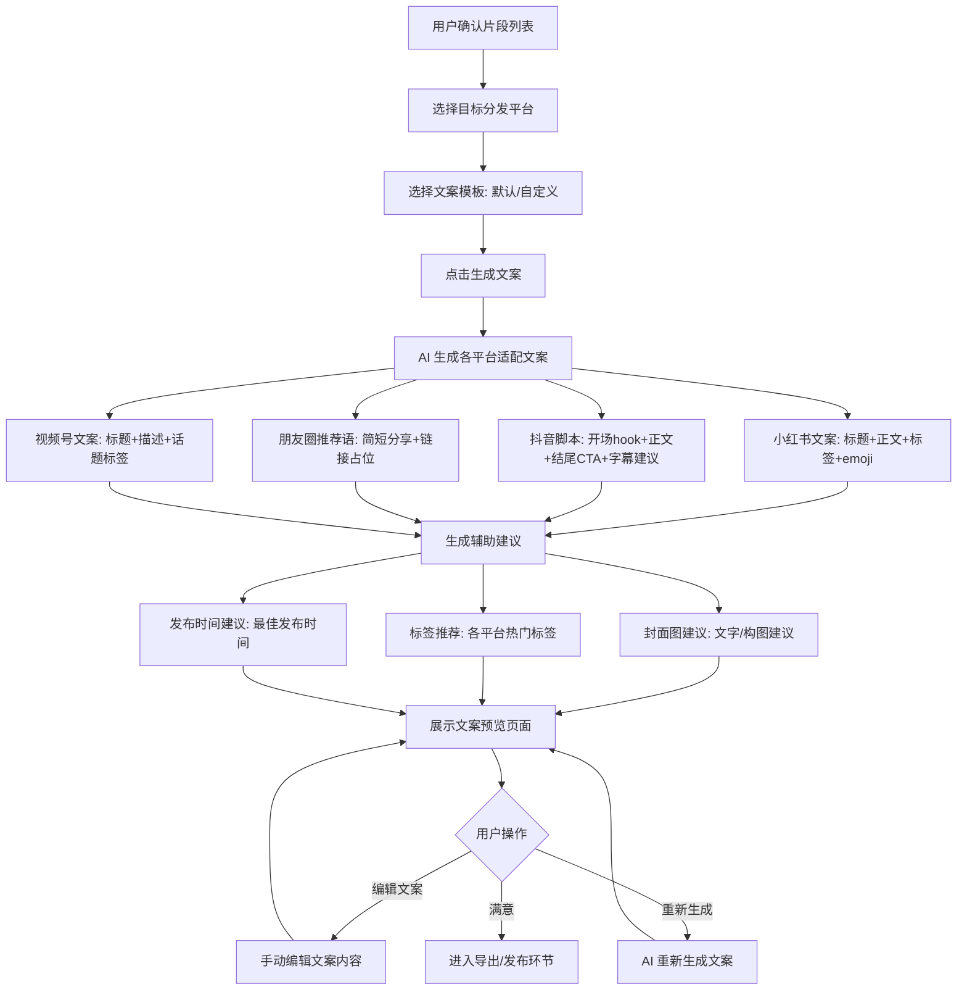

**业务规则说明：**
1. 单个片段的全平台文案生成时间 ≤ 30 秒
2. 小红书文案格式：标题（≤20 字）+ 正文（200-500 字）+ 标签（5-10 个）+ emoji
3. 抖音脚本格式：开场 hook（≤15 秒）+ 正文（30-60 秒）+ 结尾 CTA + 字幕建议
4. 朋友圈推荐语：≤100 字，含链接占位符
5. 视频号文案：标题（≤30 字）+ 描述（100-200 字）+ 话题标签（3-5 个）
6. 用户可以手动编辑 AI 生成的文案，也可以点击"重新生成"让 AI 重新生成
7. 自定义模板仅专业版可用，免费版使用系统内置模板
8. 封面图建议包含：推荐文字内容、构图建议、配色建议
9. 标签推荐基于平台特性和内容类型，每个平台推荐 5-10 个标签
10. 发布时间建议基于平台特性和内容类型，给出 2-3 个推荐时间段

### 3.1.9 多平台文案生成—主要原型

[文案生成原型](assets/prototypes/web/copywriting-widget.html)

**验收标准说明：**
- [ ] 正常流程：选择平台后点击生成，30 秒内展示各平台文案预览，用户可编辑或重新生成
- [ ] 异常流程：生成失败时显示"生成失败，点击重试"；生成结果为空时显示"暂无内容，请尝试其他片段"
- [ ] 性能要求：单个片段全平台文案生成时间 ≤ 30 秒

### 3.1.10 导出与发布

**功能描述：** 用户可以将生成的文案导出或发布。单平台导出支持一键复制和下载 TXT/MD 文件。批量导出（专业版）支持打包下载所有平台文案为 ZIP 或导出为 Excel 表格。多平台同步发布（专业版）支持绑定各平台账号后一键发布或定时发布。

**优先级与依赖说明：**

| 项 | 内容 |
| --- | --- |
| 优先级 | P0（单平台导出）/ P1（批量导出）/ P2（同步发布） |
| 依赖需求 | 多平台文案生成 |
| 前置条件 | 文案已生成并审阅完成 |

### 3.1.11 导出与发布—详细流程

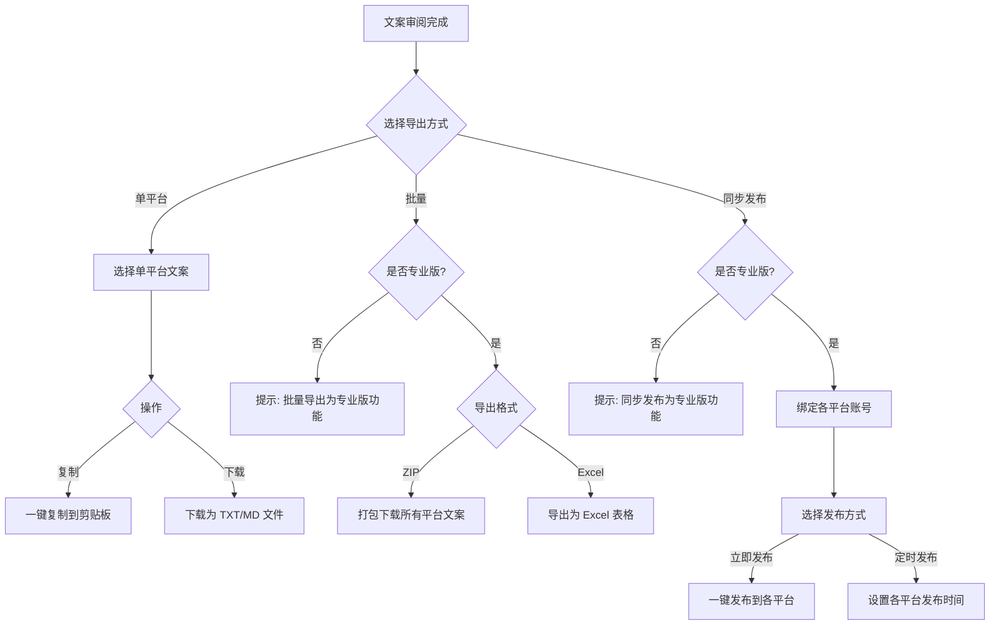

**业务规则说明：**
1. 单平台导出（复制/下载）免费可用
2. 批量导出（ZIP/Excel）仅专业版可用
3. 多平台同步发布仅专业版可用，需先绑定各平台账号
4. 定时发布支持设置各平台的独立发布时间
5. 导出文件格式：TXT（纯文本）、MD（Markdown）、ZIP（多文件打包）、Excel（表格）
6. 免费版导出的文案含水印提示"由播客精彩片段剪辑助手生成"

### 3.1.12 导出与发布—主要原型

[导出与发布原型](assets/prototypes/web/export-widget.html)

**验收标准说明：**
- [ ] 正常流程：单平台文案可一键复制或下载；专业版用户可批量导出 ZIP/Excel
- [ ] 异常流程：免费版用户点击批量导出时提示升级专业版；导出失败时显示"导出失败，请重试"
- [ ] 性能要求：单文件下载响应时间 ≤ 2 秒，批量打包（10 个片段）时间 ≤ 10 秒

### 3.1.13 片段库与历史管理

**功能描述：** 用户可以查看所有历史处理过的精彩片段，按关键词、类型、来源、日期搜索和筛选片段。支持对已有片段重新生成文案、收藏优质片段、生成分享链接。

**优先级与依赖说明：**

| 项 | 内容 |
| --- | --- |
| 优先级 | P0 |
| 依赖需求 | AI 片段识别与审阅 |
| 前置条件 | 用户已处理过至少一期播客 |

### 3.1.14 片段库与历史管理—详细流程

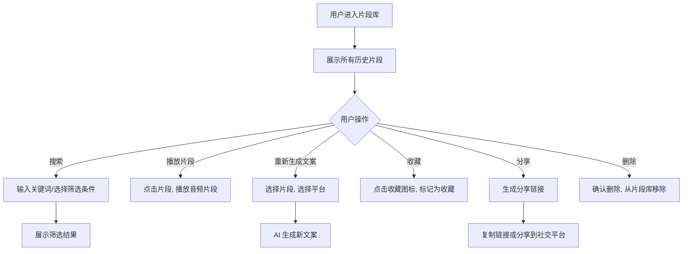

**业务规则说明：**
1. 片段库展示所有历史处理过的精彩片段，含来源音频、时间戳、类型、摘要
2. 支持按关键词、类型、来源、日期搜索和筛选
3. 重新生成文案时，可以选择不同的平台和模板
4. 收藏的片段可以在"我的收藏"中快速查看
5. 分享链接包含音频片段和文案，有效期 7 天
6. 删除片段后不可恢复，需二次确认

### 3.1.15 片段库与历史管理—主要原型

[片段库原型](assets/prototypes/web/fragment-library-widget.html)

**验收标准说明：**
- [ ] 正常流程：片段库展示所有历史片段，支持搜索筛选，可重新生成文案、收藏、分享
- [ ] 异常流程：无片段时显示空状态"暂无片段，去处理一期播客吧"
- [ ] 性能要求：片段库加载时间 ≤ 2 秒（1000 条片段以内）

### 3.1.16 数据看板（专业版）

**功能描述：** 展示用户的处理统计（本月处理量、剩余额度）、分发统计（各平台发布次数、内容类型分布）、内容分析（高频金句/话题）。

**优先级与依赖说明：**

| 项 | 内容 |
| --- | --- |
| 优先级 | P0（剩余额度）/ P1（处理统计/分发统计）/ P2（内容分析） |
| 依赖需求 | 无 |
| 前置条件 | 用户已登录 |

### 3.1.17 数据看板—详细流程

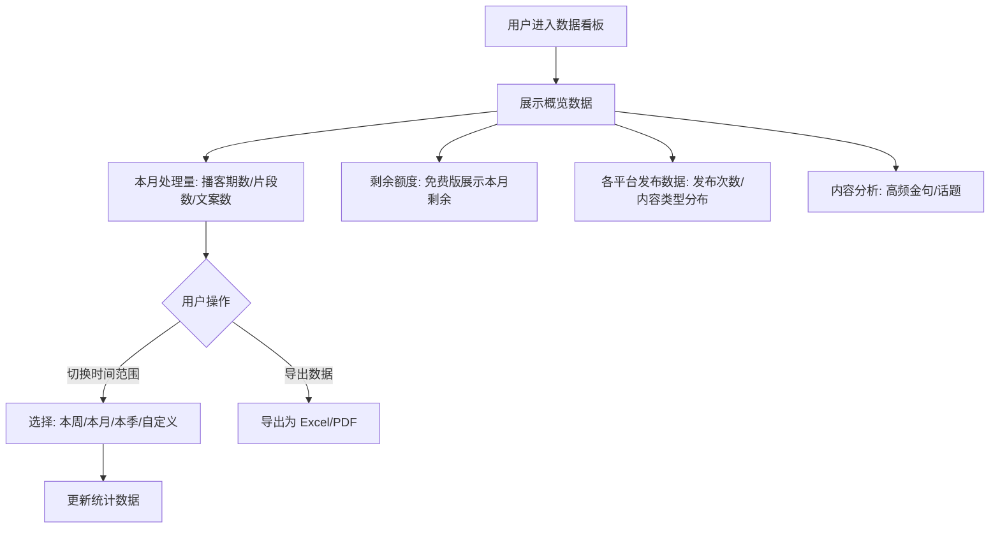

**业务规则说明：**
1. 剩余额度展示所有用户可见，处理统计/分发统计/内容分析仅专业版可见
2. 统计数据实时更新，处理完成后立即更新
3. 支持切换时间范围：本周、本月、本季、自定义
4. 导出数据支持 Excel 和 PDF 格式
5. 高频金句统计基于片段类型和出现频率，展示 Top 10

### 3.1.18 数据看板—主要原型

[数据看板原型](assets/prototypes/web/dashboard-widget.html)

**验收标准说明：**
- [ ] 正常流程：数据看板展示处理统计、分发统计、内容分析，支持切换时间范围
- [ ] 异常流程：无数据时显示空状态"暂无数据，去处理一期播客吧"
- [ ] 性能要求：数据看板加载时间 ≤ 3 秒

### 3.1.19 账户与订阅管理

**功能描述：** 支持手机号注册和微信登录。用户可以查看免费版/专业版功能对比，在线支付升级为专业版，查看本月用量，修改个人信息和偏好设置。

**优先级与依赖说明：**

| 项 | 内容 |
| --- | --- |
| 优先级 | P0 |
| 依赖需求 | 无 |
| 前置条件 | 无 |

### 3.1.20 账户与订阅管理—详细流程

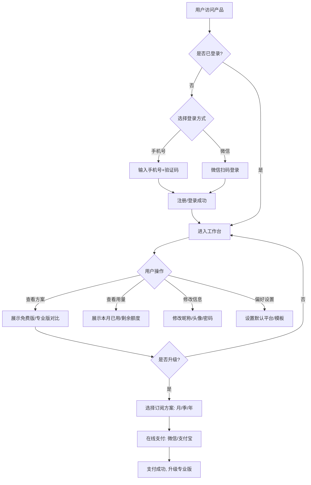

**业务规则说明：**
1. 手机号注册需验证短信验证码，验证码 5 分钟有效
2. 微信登录需扫码确认，首次登录自动注册
3. 免费版每月 3 期播客处理，专业版不限期数
4. 专业版定价：¥39/月、¥99/季（8.5折）、¥349/年（7.5折）
5. 支付方式：微信支付、支付宝
6. 订阅到期后自动降级为免费版，已处理的数据保留 90 天
7. 偏好设置包括：默认分发平台、默认文案模板、默认导出格式

### 3.1.21 账户与订阅管理—主要原型

[账户管理原型](assets/prototypes/web/account-widget.html)

**验收标准说明：**
- [ ] 正常流程：用户可以通过手机号或微信登录，查看方案对比，升级专业版，修改个人信息
- [ ] 异常流程：验证码错误时提示"验证码错误，请重新输入"；支付失败时提示"支付失败，请重试"
- [ ] 性能要求：登录响应时间 ≤ 2 秒，支付回调时间 ≤ 5 秒

---

# 4 产品原型

## 4.1 页面跳转逻辑图

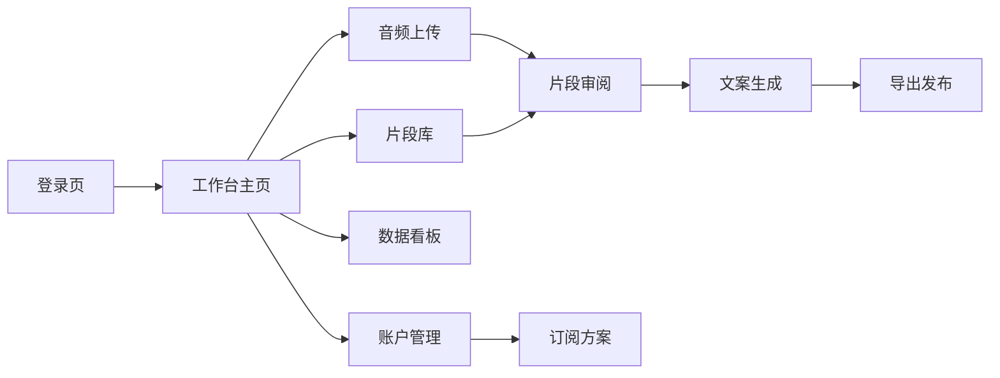

## 4.2 全站点原型设计

### 4.2.1 创作者端 WEB

**页面清单：**

| 序号 | 页面名称 | 所属模块 | 页面描述 | 关键元素 |
| --- | --- | --- | --- | --- |
| 1 | 登录页 | 账户管理 | 用户登录/注册页面 | 手机号输入框、验证码输入框、微信登录按钮 |
| 2 | 工作台主页 | 音频管理 | 核心工作台，展示音频列表和处理入口 | 上传区域、音频列表、搜索筛选、处理状态 |
| 3 | 音频详情页 | 音频管理 | 展示音频详情、转写文本、片段列表 | 音频播放器、波形图、转写文本、片段列表 |
| 4 | 片段审阅页 | AI 片段识别 | 审阅 AI 识别的精彩片段 | 片段卡片、播放按钮、编辑按钮、批量操作 |
| 5 | 文案生成页 | 文案生成 | 展示各平台文案预览和编辑 | 平台 Tab、文案预览、编辑区、辅助建议 |
| 6 | 导出发布页 | 导出发布 | 导出文案或发布到各平台 | 导出按钮、发布按钮、平台选择 |
| 7 | 片段库页 | 片段库 | 展示所有历史片段 | 片段列表、搜索筛选、收藏、分享 |
| 8 | 数据看板页 | 数据看板 | 展示处理统计和分发数据 | 数据卡片、图表、时间范围选择 |
| 9 | 账户管理页 | 账户管理 | 个人信息和订阅管理 | 个人信息、订阅方案、用量展示、偏好设置 |

**交互说明：**
- 页面跳转关系：
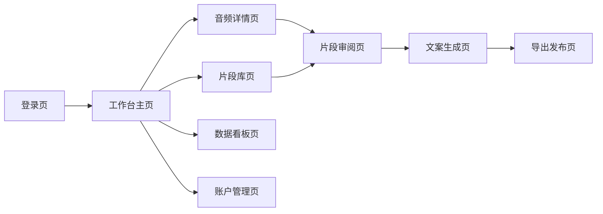
- 特殊交互：
  1. 音频上传支持拖拽上传，拖入时上传区域高亮
  2. 音频处理过程显示实时进度条，支持取消操作
  3. 片段卡片支持悬停显示操作按钮（播放/编辑/删除）
  4. 文案编辑区支持实时预览，修改后立即生效
  5. 数据看板图表支持悬停显示详细数据
  6. 空数据状态显示友好的空状态插画和引导文案
  7. 加载状态显示骨架屏，提升用户体验

**产品原型：**

[🖥️ 打开创作者端 WEB 全站点原型](assets/prototypes/web-prototype.html)

---

# 5 数据需求

## 5.1 数据使用规格

| **字段** | **是否必填** | **描述** | **数据类型** |
| --- | --- | --- | --- |
| user_id | 是 | 用户唯一标识 | UUID |
| audio_id | 是 | 音频文件唯一标识 | UUID |
| audio_name | 是 | 音频文件名 | 字符串 |
| audio_format | 是 | 音频格式（MP3/WAV/M4A/AAC） | 字符串 |
| audio_size | 是 | 音频文件大小（字节） | 数字 |
| audio_duration | 是 | 音频时长（秒） | 数字 |
| upload_time | 是 | 上传时间 | 时间戳 |
| process_status | 是 | 处理状态（上传中/转写中/识别中/已完成/失败） | 字符串 |
| fragment_id | 是 | 片段唯一标识 | UUID |
| fragment_type | 是 | 片段类型（金句/有趣时刻/争议观点/故事高光） | 字符串 |
| start_time | 是 | 片段起始时间戳（秒） | 数字 |
| end_time | 是 | 片段结束时间戳（秒） | 数字 |
| summary | 是 | 片段摘要 | 字符串 |
| copywriting_id | 是 | 文案唯一标识 | UUID |
| platform | 是 | 目标平台（小红书/抖音/朋友圈/视频号） | 字符串 |
| copywriting_content | 是 | 文案内容 | 文本 |
| generate_time | 是 | 文案生成时间 | 时间戳 |

## 5.2 统计数据

1. 统计本月处理的播客期数、片段数、文案数（P0）
2. 统计各平台发布次数和内容类型分布（P1）
3. 统计高频金句和话题 Top 10（P2）
4. 统计用户剩余额度和使用情况（P0）

## 5.3 埋点需求

| 页面 | 事件 | 采集字段 | 说明 |
| --- | --- | --- | --- |
| 工作台 | 上传音频 | user_id, audio_format, audio_size, upload_time | 统计上传行为 |
| 工作台 | 处理完成 | audio_id, process_duration, fragment_count | 统计处理效率 |
| 片段审阅 | 编辑片段 | fragment_id, edit_type, edit_time | 统计编辑行为 |
| 文案生成 | 生成文案 | fragment_id, platform, template_id, generate_time | 统计文案生成行为 |
| 文案生成 | 重新生成 | fragment_id, platform, regenerate_count | 统计重新生成率 |
| 导出发布 | 导出文案 | fragment_id, platform, export_format, export_time | 统计导出行为 |
| 导出发布 | 发布文案 | fragment_id, platform, publish_time | 统计发布行为 |
| 账户管理 | 升级专业版 | user_id, plan_type, payment_method, upgrade_time | 统计付费转化 |

---

# 6 非功能需求

## 6.1 性能需求

**6.1.1 延迟**

| 编号 | 项目 | 最大延迟 | 平均延迟 | 优先级 | 备注 |
| --- | --- | --- | --- | --- | --- |
| 0001 | 页面加载（首屏） | ≤3 秒 | ≤2 秒 | 高 |  |
| 0002 | 音频上传（100MB） | ≤30 秒 | ≤20 秒 | 高 | 取决于用户网络 |
| 0003 | ASR 转写（1 小时音频） | ≤5 分钟 | ≤3 分钟 | 高 |  |
| 0004 | AI 片段识别（1 小时音频） | ≤3 分钟 | ≤2 分钟 | 高 |  |
| 0005 | 文案生成（单片段全平台） | ≤30 秒 | ≤20 秒 | 高 |  |
| 0006 | 片段列表加载 | ≤2 秒 | ≤1 秒 | 中 |  |
| 0007 | 文案导出 | ≤2 秒 | ≤1 秒 | 中 |  |

**6.1.2 吞吐量**

| 编号 | 项 | 吞吐量 | 备注 |
| --- | --- | --- | --- |
| 0001 | 并发音频处理 | ≥50 个音频同时排队 |  |
| 0002 | 文案生成并发 | ≥100 个片段同时生成 |  |
| 0003 | 页面访问并发 | ≥1000 QPS |  |

**6.1.3 容量**

| 编号 | 项 | 容量 | 备注 |
| --- | --- | --- | --- |
| 0001 | 系统用户数 | ≤1,000,000 |  |
| 0002 | 月活用户数 | ≥10,000 |  |
| 0003 | 音频文件存储 | ≤100TB | OSS 存储 |
| 0004 | 单用户音频保留 | 90 天 | 超期自动清理 |

## 6.2 安全需求

| 编号 | 项（系统数据 / 处理过程） |
| --- | --- |
| 0001 | 用户密码必须加密存储（bcrypt），不可明文存储 |
| 0002 | 用户上传的音频文件需进行内容安全检测，禁止上传违法违规内容 |
| 0003 | AI 生成内容需经过内容安全过滤，避免生成违规内容 |
| 0004 | 用户数据隔离，不同用户的数据不可互相访问 |
| 0005 | API 接口需进行身份认证和权限校验，防止未授权访问 |
| 0006 | 支付信息需加密传输（HTTPS），支付回调需验证签名 |

## 6.3 可靠性

| 编号 | 项 | 值 |
| --- | --- | --- |
| 0001 | 服务可用性 | ≥99.5% |
| 0002 | 平均正常运行时间 | 180 天 |
| 0003 | 平均故障恢复时间 | ≤30 分钟 |

## 6.4 可连续性

| 编号 | 项 |
| --- | --- |
| Modi.1 | 系统需要 7 × 24 式的全天候运行 |
| Modi.2 | 音频处理任务支持断点续传，网络中断后可继续 |
| Modi.3 | AI 服务异常时支持自动重试，重试失败后标记为失败状态 |

## 6.5 可恢复性

| 编号 | 项 |
| --- | --- |
| Modi.1 | 数据库每日全量备份，保留 30 天 |
| Modi.2 | 业务数据每小时增量备份 |
| Modi.3 | 重大故障需在 1-3 小时内恢复服务可用性 |
| Modi.4 | 24-72 小时内恢复历史数据 |

## 6.6 兼容性

| 编号 | 要求 | 备注 |
| --- | --- | --- |
| 0001 | 兼容主流浏览器：Chrome ≥90，Firefox ≥90，Safari ≥15，Edge ≥90 |  |
| 0002 | 主要适配 PC 端（≥1280px 宽度），暂不支持移动端 |  |

## 6.7 易用性

| 编号 | 要求 | 备注 |
| --- | --- | --- |
| 0001 | 核心操作路径不超过 3 步 |  |
| 0002 | 普通用户无需培训即可使用核心功能 |  |
| 0003 | 提供新手引导，帮助用户快速上手 |  |
| 0004 | 操作反馈及时，上传/处理/生成等操作有明确的进度提示 |  |

---

# 7 总结

## 7.1 上线计划

| 阶段 | 时间 | 内容 | 负责人 |
| --- | --- | --- | --- |
| 开发阶段 | 2026-07-01 ~ 2026-07-07 | 核心功能开发（音频上传+ASR转写+片段识别+文案生成+导出） | 开发团队 |
| 测试阶段 | 2026-07-08 ~ 2026-07-10 | 功能测试、性能测试、安全测试 | 测试团队 |
| 灰度阶段 | 2026-07-11 ~ 2026-07-14 | 灰度 10% 用户，验证稳定性 | 产品团队 |
| 全量上线 | 2026-07-15 | 全量开放给所有用户 | 产品团队 |

## 7.2 后续迭代规划

- **V1.1（MVP+）**：
  - 批量上传音频（专业版）
  - 自定义文案模板（专业版）
  - 批量导出文案包（专业版）
  - 片段收藏和分享功能

- **V1.2（专业版增强）**：
  - 多平台同步发布（对接各平台 API）
  - 定时发布功能
  - 数据看板增强（分发统计、内容分析）
  - 导出为 Excel 表格

- **V2.0（高级版）**：
  - 团队协作功能（多用户共享播客和片段）
  - 自定义 AI 模型训练（基于用户历史数据优化）
  - 移动端 APP（iOS/Android）
  - 播客托管功能集成

## 7.3 参考文档

- 需求文档.md（URS v1.0）
- [阿里云 ASR 服务文档](https://help.aliyun.com/product/30413.html)
- [OpenAI Whisper API 文档](https://platform.openai.com/docs/guides/speech-to-text)
- [小红书内容运营指南](https://business.xiaohongshu.com)
- [抖音创作者服务中心](https://creator.douyin.com)
