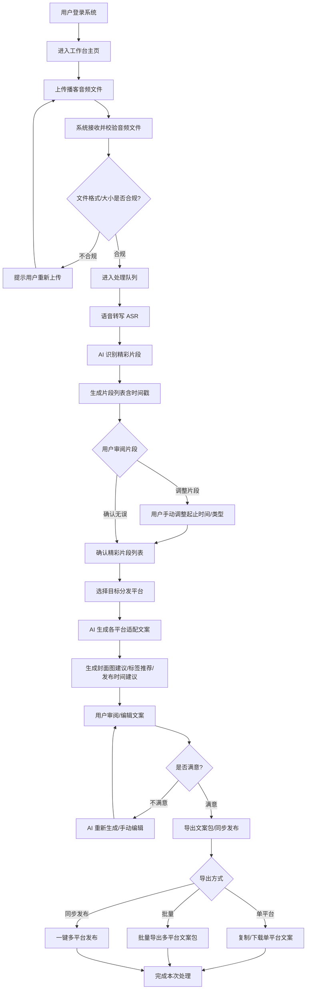
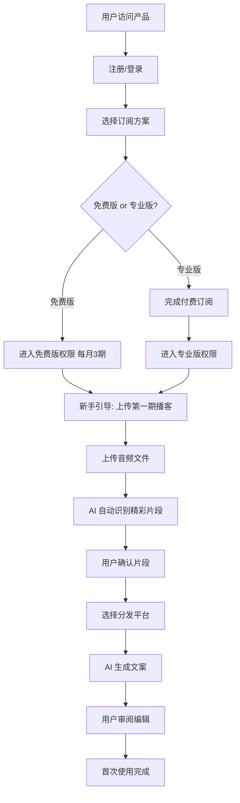
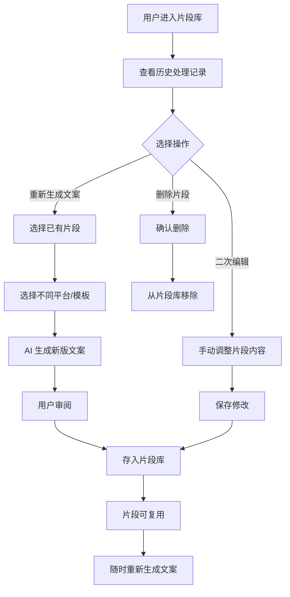
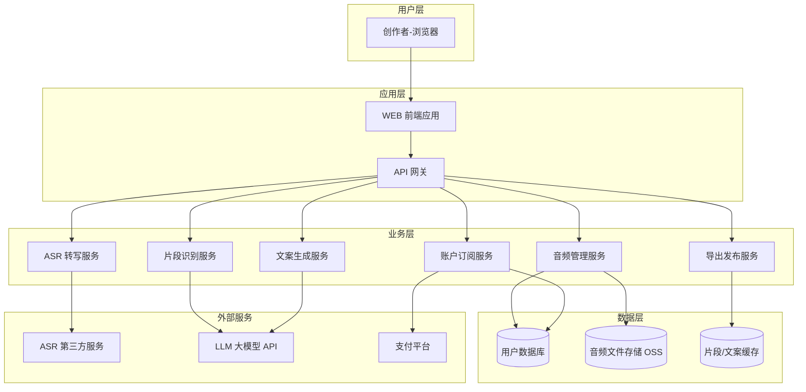
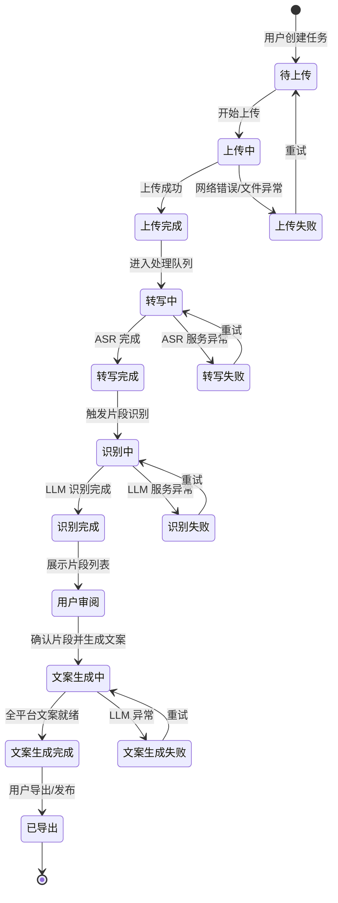
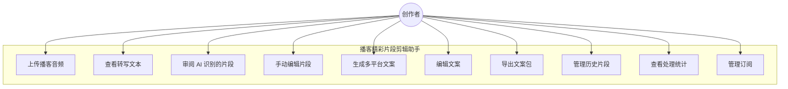

# 播客精彩片段剪辑助手 — 用户需求说明书（URS）

> 文档版本：v1.0
> 编写日期：2026-06-28
> 适用产品：播客精彩片段剪辑助手（内容创作工具 MVP）

---

# 1. 需求概述

## 1.1 需求介绍

**播客精彩片段剪辑助手**是一款面向中文播客主、播客制作团队及 MCN 运营人员的轻量级内容二次加工工具。产品聚焦于"播客音频 → AI 精彩片段识别 → 多平台分发文案生成"这一高频痛点场景，通过上传完整播客音频，由 AI 自动识别精彩片段（金句、有趣时刻、争议观点）并标记时间戳，为每个片段自动生成小红书文案、抖音短视频脚本、朋友圈推荐语等多平台适配内容，并按平台特性生成封面图建议、标签推荐和发布时间建议，帮助播客创作者以最低成本将优质内容高效分发到多个平台。

产品定位为通用音频剪辑工具和播客托管平台的"互补工具"，不做通用音频剪辑，也不替代播客托管，专注于"播客内容 → 精彩片段 → 多平台文案"的跨形态复用这一垂直场景。

### 1.1.1 所属领域

- **内容创作** / 创意工具
- **播客运营** / 音频内容服务
- **跨平台内容分发** / 社交媒体运营
- **轻量级 SaaS（订阅制）**

## 1.2 需求目标

1. **解决痛点**：播客内容优质但分发效率低，手动找精彩片段并改写文案耗时耗力，一人运营多平台负担重。
2. **核心价值**：通过 AI 音频分析 + 智能文案生成，将用户从"反复听音频 → 手记时间戳 → 逐平台改写"的重复劳动中解放出来。
3. **MVP 范围**：7–10 天可交付（音频上传 + 语音转写 + LLM 片段识别 + 文案生成 + 导出）。
4. **商业化目标**：
   - 免费版：每月 3 期播客处理，基础文案生成，含水印导出。
   - 专业版（¥39/月）：不限期数 + 自定义文案模板 + 批量导出 + 多平台同步发布 + 数据分析看板。
5. **差异化定位**：避开通用音频剪辑工具（如 Adobe Audition）和播客托管平台（如小宇宙），切入"内容二次加工"的高频轻量场景。

## 1.3 系统使用角色

| 角色 | 说明 | 典型画像 |
| --- | --- | --- |
| 独立播客主 | 个人运营一档播客节目，负责内容制作和全平台分发 | 个人知识博主、兴趣类播客创作者 |
| 播客制作团队成员 | 多人协作的播客团队，分工负责内容编辑和运营 | 2-5 人的小型播客工作室 |
| MCN 运营人员 | 负责多档播客节目的多平台分发运营 | MCN 机构运营专员，同时管理 5+ 档播客 |
| 跨平台内容创作者 | 已有播客内容，需向小红书/抖音/视频号拓展的创作者 | 从长音频向短内容转型的创作者 |

## 1.4 业务流程图

### 1.4.1 核心业务流程（音频上传 → AI 识别 → 文案生成 → 多平台导出）

### 1.4.2 用户首次使用流程

### 1.4.3 片段管理与复用流程

# 2. 功能原型

| 原型名称 | 原型链接 | 对应端 | 备注 |
| --- | --- | --- | --- |
| 播客精彩片段剪辑助手-工作台 | 待 UI 原型设计师提供 | WEB端 | 核心工作台：音频上传、片段审阅、文案生成、导出发布 |
| 播客精彩片段剪辑助手-片段库 | 待 UI 原型设计师提供 | WEB端 | 历史片段管理、复用、二次编辑 |
| 播客精彩片段剪辑助手-数据看板 | 待 UI 原型设计师提供 | WEB端 | 专业版功能：处理统计、分发效果追踪 |
| 播客精彩片段剪辑助手-账户管理 | 待 UI 原型设计师提供 | WEB端 | 订阅管理、用量查询、发票管理 |

# 3. 需求清单

## 3.1 创作者端-WEB端

### 3.1.1 音频上传与管理模块

| 模块 | 一级功能 | 二级功能 | 功能描述 | 备注 |
| --- | --- | --- | --- | --- |
| 音频管理 | 上传音频 | 单文件上传 | 支持上传 MP3/WAV/M4A/AAC 格式播客音频，单文件最大 2GB | MVP 核心 |
| 音频管理 | 上传音频 | 批量上传 | 专业版功能：支持一次上传多期播客音频，排队处理 | 专业版 |
| 音频管理 | 上传音频 | 拖拽上传 | 支持拖拽音频文件到上传区域 | MVP 核心 |
| 音频管理 | 音频列表 | 查看历史音频 | 展示已上传音频列表，含文件名、时长、上传时间、处理状态 | MVP 核心 |
| 音频管理 | 音频列表 | 搜索/筛选 | 按文件名、日期、状态筛选音频 | MVP 核心 |
| 音频管理 | 音频列表 | 删除音频 | 删除不再需要的音频文件及关联片段 | MVP 核心 |
| 音频管理 | 音频详情 | 播放音频 | 在线播放播客音频，支持进度条拖拽 | MVP 核心 |
| 音频管理 | 音频详情 | 查看转写文本 | 查看 AI 转写的完整文本，支持按时间戳定位 | MVP 核心 |

### 3.1.2 AI 片段识别与审阅模块

| 模块 | 一级功能 | 二级功能 | 功能描述 | 备注 |
| --- | --- | --- | --- | --- |
| 片段识别 | 精彩片段识别 | 自动识别 | AI 自动识别音频中的金句、有趣时刻、争议观点，按类型分类标记 | MVP 核心 |
| 片段识别 | 精彩片段识别 | 时间戳标记 | 为每个精彩片段标记精确的起止时间戳（精确到秒） | MVP 核心 |
| 片段识别 | 精彩片段识别 | 片段摘要 | 为每个片段生成一句话摘要 | MVP 核心 |
| 片段识别 | 精彩片段识别 | 片段类型分类 | 按金句/有趣时刻/争议观点/故事高光等类型分类 | MVP 核心 |
| 片段审阅 | 片段列表 | 播放片段 | 点击片段直接播放对应音频片段 | MVP 核心 |
| 片段审阅 | 片段列表 | 编辑片段 | 手动调整片段起止时间、修改摘要、调整类型 | MVP 核心 |
| 片段审阅 | 片段列表 | 删除片段 | 删除不满意的片段 | MVP 核心 |
| 片段审阅 | 片段列表 | 新增片段 | 手动添加 AI 未识别到的精彩片段 | MVP 核心 |
| 片段审阅 | 批量操作 | 全选/多选 | 批量选中多个片段进行后续操作 | MVP 核心 |
| 片段审阅 | 批量操作 | 批量生成文案 | 对选中的多个片段一键生成各平台文案 | MVP 核心 |

### 3.1.3 多平台文案生成模块

| 模块 | 一级功能 | 二级功能 | 功能描述 | 备注 |
| --- | --- | --- | --- | --- |
| 文案生成 | 小红书文案 | 自动生成 | 基于片段内容生成小红书风格文案（标题+正文+标签+emoji） | MVP 核心 |
| 文案生成 | 小红书文案 | 编辑修改 | 用户可手动编辑生成的文案 | MVP 核心 |
| 文案生成 | 小红书文案 | 重新生成 | 不满意时可重新生成 | MVP 核心 |
| 文案生成 | 抖音短视频脚本 | 自动生成 | 基于片段生成抖音短视频脚本（开场hook+正文+结尾CTA+字幕建议） | MVP 核心 |
| 文案生成 | 抖音短视频脚本 | 编辑修改 | 用户可手动编辑生成的脚本 | MVP 核心 |
| 文案生成 | 抖音短视频脚本 | 重新生成 | 不满意时可重新生成 | MVP 核心 |
| 文案生成 | 朋友圈推荐语 | 自动生成 | 生成适合朋友圈分享的简短推荐语（含链接占位） | MVP 核心 |
| 文案生成 | 朋友圈推荐语 | 编辑修改 | 用户可手动编辑推荐语 | MVP 核心 |
| 文案生成 | 视频号文案 | 自动生成 | 生成视频号适配的文案（标题+描述+话题标签） | MVP 核心 |
| 文案生成 | 文案模板 | 使用默认模板 | 使用系统内置的文案模板 | MVP 核心 |
| 文案生成 | 文案模板 | 自定义模板 | 专业版功能：创建/使用自定义文案模板 | 专业版 |
| 辅助建议 | 封面图建议 | 自动生成 | 基于片段内容生成封面图文字/构图建议 | MVP 核心 |
| 辅助建议 | 标签推荐 | 自动生成 | 基于内容推荐各平台热门标签 | MVP 核心 |
| 辅助建议 | 发布时间建议 | 智能推荐 | 基于平台特性和内容类型推荐最佳发布时间 | MVP 核心 |

### 3.1.4 导出与发布模块

| 模块 | 一级功能 | 二级功能 | 功能描述 | 备注 |
| --- | --- | --- | --- | --- |
| 导出 | 单平台导出 | 一键复制 | 一键复制单平台文案到剪贴板 | MVP 核心 |
| 导出 | 单平台导出 | 下载文案 | 下载单平台文案为 TXT/MD 文件 | MVP 核心 |
| 导出 | 批量导出 | 多平台文案包 | 专业版功能：一键打包下载所有平台文案为 ZIP | 专业版 |
| 导出 | 批量导出 | 导出为 Excel | 专业版功能：导出所有文案为 Excel 表格 | 专业版 |
| 发布 | 多平台同步发布 | 授权账号 | 专业版功能：绑定小红书/抖音/视频号账号 | 专业版 |
| 发布 | 多平台同步发布 | 一键发布 | 专业版功能：将文案一键发布到已绑定的各平台 | 专业版 |
| 发布 | 多平台同步发布 | 定时发布 | 专业版功能：设置各平台定时发布时间 | 专业版 |

### 3.1.5 片段库与历史管理模块

| 模块 | 一级功能 | 二级功能 | 功能描述 | 备注 |
| --- | --- | --- | --- | --- |
| 片段库 | 片段列表 | 查看所有片段 | 展示所有历史处理过的精彩片段，含来源音频、时间戳、类型 | MVP 核心 |
| 片段库 | 片段列表 | 搜索片段 | 按关键词、类型、来源、日期搜索片段 | MVP 核心 |
| 片段库 | 片段列表 | 按来源筛选 | 按播客节目/单期音频筛选片段 | MVP 核心 |
| 片段库 | 片段复用 | 重新生成文案 | 对已有片段重新选择平台生成新文案 | MVP 核心 |
| 片段库 | 片段复用 | 收藏片段 | 标记特别优质的片段为收藏 | MVP 核心 |
| 片段库 | 片段复用 | 分享片段 | 生成片段分享链接（含音频片段+文案） | MVP 核心 |

### 3.1.6 数据看板模块（专业版）

| 模块 | 一级功能 | 二级功能 | 功能描述 | 备注 |
| --- | --- | --- | --- | --- |
| 数据看板 | 处理统计 | 本月处理量 | 展示本月已处理播客期数/片段数/文案数 | 专业版 |
| 数据看板 | 处理统计 | 剩余额度 | 免费版展示本月剩余额度 | MVP 核心 |
| 数据看板 | 分发统计 | 各平台发布数据 | 展示各平台发布次数/内容类型分布 | 专业版 |
| 数据看板 | 内容分析 | 高频金句 | 统计出现频率最高的金句/话题 | 专业版 |

### 3.1.7 账户与订阅管理模块

| 模块 | 一级功能 | 二级功能 | 功能描述 | 备注 |
| --- | --- | --- | --- | --- |
| 账户管理 | 注册/登录 | 手机号注册 | 通过手机号+验证码注册 | MVP 核心 |
| 账户管理 | 注册/登录 | 微信登录 | 通过微信扫码登录 | MVP 核心 |
| 账户管理 | 订阅管理 | 查看方案 | 查看免费版/专业版功能对比 | MVP 核心 |
| 账户管理 | 订阅管理 | 升级/续费 | 在线支付升级为专业版 | MVP 核心 |
| 账户管理 | 订阅管理 | 查看用量 | 查看本月已用/剩余额度 | MVP 核心 |
| 账户管理 | 个人设置 | 修改信息 | 修改昵称、头像、密码 | MVP 核心 |
| 账户管理 | 个人设置 | 偏好设置 | 设置默认平台、默认模板等偏好 | MVP 核心 |

# 4. 非功能需求

## 4.1 使用界面需求

| 需求项 | 需求描述 |
| --- | --- |
| 整体风格 | 简洁现代的 SaaS 工具风格，以浅色为主色调，突出内容焦点 |
| 音频播放区 | 波形可视化展示，支持时间戳标记高亮 |
| 片段列表区 | 卡片式布局，每个片段展示类型标签、摘要、时长，支持快速播放 |
| 文案编辑区 | 左右分栏：左侧音频波形+片段，右侧文案预览+编辑 |
| 响应式设计 | 主要适配 PC 端（≥1280px 宽度），暂不支持移动端 |
| 操作反馈 | 上传/处理/生成等操作需有明确的进度提示和完成反馈 |

## 4.2 软硬件环境需求

| 需求项 | 需求描述 |
| --- | --- |
| 用户端浏览器 | 支持 Chrome 90+、Edge 90+、Safari 15+、Firefox 90+ |
| 用户端网络 | 需要稳定的互联网连接（上传大音频文件建议 ≥10Mbps） |
| 服务端 | 云端部署，支持弹性扩容 |
| 音频处理 | 需集成 ASR 语音转写服务（如阿里云/讯飞/OpenAI Whisper） |
| AI 模型 | 需接入 LLM 大语言模型（用于片段识别+文案生成） |

## 4.3 性能需求

| 需求项 | 需求描述 |
| --- | --- |
| 音频上传 | 支持单文件最大 2GB，上传速度取决于用户网络 |
| 语音转写 | 1 小时音频转写时间 ≤ 5 分钟 |
| 片段识别 | 1 小时音频的片段识别时间 ≤ 3 分钟 |
| 文案生成 | 单个片段的全平台文案生成时间 ≤ 30 秒 |
| 并发处理 | 支持至少 50 个音频同时排队处理 |
| 页面加载 | 首屏加载时间 ≤ 3 秒 |
| 可用性 | 服务可用性 ≥ 99.5% |

## 4.4 约束性需求

1. **MVP 范围约束**：首期不做原生移动端 APP，仅提供 WEB 端。
2. **音频格式约束**：首期仅支持主流音频格式（MP3/WAV/M4A/AAC），不支持视频文件。
3. **平台对接约束**：首期多平台同步发布功能仅做"文案导出"，不直接对接各平台发布 API（降低首期复杂度）。
4. **AI 模型约束**：不自行训练模型，使用第三方 LLM API 实现片段识别和文案生成。
5. **内容安全约束**：需对 AI 生成内容进行基本的内容安全过滤，避免生成违规内容。
6. **存储约束**：用户音频文件保留 90 天，超期自动清理（用户可重新上传）。
7. **本系统不需要后台管理系统**（首期），账户和订阅管理通过 WEB 端用户界面完成。

# 5. 接口需求

## 5.2 软件接口需求

| 模块 | 接口名称 | 输入 | 输出 | 功能描述 |
| --- | --- | --- | --- | --- |
| 音频上传 | ASR 语音转写接口 | 音频文件（MP3/WAV/M4A） | 带时间戳的转写文本 | 调用第三方 ASR 服务将音频转为文字 |
| AI 片段识别 | LLM 片段识别接口 | 转写文本+音频元信息 | 精彩片段列表（含时间戳/类型/摘要） | 调用 LLM 从转写文本中识别精彩片段 |
| 文案生成 | 小红书文案生成接口 | 片段内容+模板参数 | 小红书风格文案 | 调用 LLM 生成小红书适配文案 |
| 文案生成 | 抖音脚本生成接口 | 片段内容+模板参数 | 抖音短视频脚本 | 调用 LLM 生成抖音适配脚本 |
| 文案生成 | 朋友圈推荐语生成接口 | 片段内容+模板参数 | 朋友圈推荐语 | 调用 LLM 生成朋友圈推荐语 |
| 文案生成 | 视频号文案生成接口 | 片段内容+模板参数 | 视频号文案 | 调用 LLM 生成视频号适配文案 |
| 辅助建议 | 标签推荐接口 | 片段内容+平台类型 | 推荐标签列表 | 调用 LLM 推荐各平台热门标签 |
| 辅助建议 | 发布时间推荐接口 | 内容类型+平台类型 | 推荐发布时间 | 基于规则+LLM 推荐最佳发布时间 |
| 账户管理 | 支付接口 | 订单信息 | 支付结果 | 对接微信支付/支付宝实现订阅付费 |
| 账户管理 | 短信验证码接口 | 手机号 | 验证码发送结果 | 对接短信服务实现注册/登录验证码 |

# 6. 附录

## 流程图

### 6.1 系统架构示意

## 状态图

### 6.2 音频处理状态

## 用例图

### 6.3 系统用例概览

