# 民宿清洁排班小助手 — 产品需求规格说明书（PRD）

| 版本号 | 变更日期 | 变更内容 | 变更人 | 审核人 |
| --- | --- | --- | --- | --- |
| V1.0 | 2026-06-26 | 初始版本创建 | 产品文档结对写作专家 | 阶段一产品落地页文档总编辑 |

---

# 1 概述

## 1.1 需求背景

随着民宿行业的快速发展，拥有 1～20 套房源的小型民宿房东和管家团队日益增多。这类小团队在房源周转过程中，最核心的环节是"退房→清洁→入住"之间的时间窗口——清洁是否准时完成直接决定了下一位住客能否顺利入住、是否会引发差评或退单。

当前多数小团队的清洁排班仍依赖微信群手工协调：房东在群里喊单、保洁员回复接单、完成后再在群里反馈。这种方式存在以下痛点：

1. **漏单风险高**：旺季订单多，群消息一多就容易漏看，导致漏派单或漏打扫。
2. **沟通成本高**：房东需要逐一询问保洁员进度，耗时费力。
3. **异常处理不及时**：保洁员发现设施损坏或物品遗留时，在群里反馈容易被淹没，无法保证房东及时看到并处理。
4. **记录缺失**：清洁完成质量、保洁员响应时间、异常发生频率等信息没有留存，无法复盘优化。
5. **工具过重**：市面上完整的 PMS（物业管理系统）功能繁多、价格昂贵，对小团队来说"杀鸡用牛刀"。

**业务价值**：通过一款轻量级的清洁排班小程序，将原本微信群手工协调的流程，转变为系统自动派单、保洁员在线接单、清洁状态实时可视的标准化流程，从而降低漏单、重单和沟通延误带来的运营损失。

**预期达成目标**：

| 编号 | 目标 | 衡量标准 |
| --- | --- | --- |
| G-01 | 消除清洁漏单 | 系统生成的清洁任务 100% 关联订单 |
| G-02 | 缩短周转沟通时间 | 从退房到保洁员确认接单的响应时间由平均 30 分钟缩短至 5 分钟以内 |
| G-03 | 清洁进度透明可见 | 房东/管家可随时查看每套房源的清洁状态 |
| G-04 | 降低操作门槛 | 保洁员通过微信小程序即可完成全流程 |
| G-05 | 异常可追溯 | 保洁员上报的异常有记录、可回溯、可通知房东 |

## 1.2 名词解释

| **名词** | **说明** |
| --- | --- |
| PMS | Property Management System，物业管理系统，涵盖房源全生命周期的重系统；本产品不做完整 PMS |
| 清洁任务 | 由系统根据订单退房与入住时间自动生成的一项保洁工作单元，包含房源、最晚完成时间、指派的保洁员等信息 |
| 最晚完成时间 | 下一订单入住时间减去房源设定的缓冲时间，即保洁员必须在此时间之前完成清洁 |
| 缓冲时间 | 房东为每套房源设定的"清洁完成 → 下一位住客入住"之间的预留时间，默认 60 分钟 |
| 清洁标准时长 | 房东为每套房源设定的完成清洁所需的预估时间，默认 30 分钟 |
| 异常反馈 | 保洁员在清洁过程中发现的设施损坏、物品遗留、安全隐患等问题，通过拍照+文字上报给房东 |
| 签到打卡 | 保洁员到达房源后通过 GPS 定位确认到达的操作 |
| 验收 | 房东查看保洁员上传的清洁完成照片后，确认清洁结果合格或标注返工 |
| 房东/管理员 | 拥有房源管理权限的角色，负责房源维护、订单录入、派单、验收 |
| 保洁员 | 执行清洁任务的角色，通过小程序接单、打卡、上报异常 |

## 1.3 产品介绍

### 1.3.1 范围说明

| 项 | 内容 |
| --- | --- |
| 包含功能 | 房源管理、订单管理、清洁任务自动生成、派单管理（手动指派为主）、保洁员接单/拒单、签到打卡、清洁完成拍照上传、异常反馈、清洁状态看板、验收清洁、消息通知（微信订阅消息+短信兜底） |
| 不包含功能 | 订单支付、渠道对接（OTA 平台）、房价管理、完整的 PMS 功能、保洁员之间的任务转让、多渠道订单聚合 |

民宿清洁排班小助手是一款面向小型民宿运营团队的轻量级清洁任务调度工具。它聚焦于民宿场景中"退房→清洁→入住"这一核心周转环节，帮助拥有 1～20 套房源的民宿房东和小型管家团队，将原本依赖微信群手工协调的清洁排班工作，转变为系统自动派单、保洁员在线接单、清洁状态实时可视的标准化流程。

**目标用户**：

1. **房东/管理员**：拥有 1～20 套民宿房源的个人房东或小型管家团队负责人。典型画像：30-50 岁，同时管理多套分散房源，日常使用微信为主要沟通工具。
2. **保洁员**：与房东合作的兼职或全职保洁人员。典型画像：40-60 岁，本地阿姨或清洁服务团队成员，对复杂 APP 接受度较低，依赖微信。

**使用场景**：

- 房东在早上收到平台退房通知后，打开小程序录入退房订单，系统自动生成清洁任务并推送给保洁员
- 保洁员收到微信服务通知，打开小程序查看任务详情、接单、前往房源、签到、清洁、完成打卡
- 房东通过清洁状态看板实时查看每套房源的清洁进度，验收清洁结果
- 保洁员在清洁过程中发现水龙头漏水，拍照上报异常，房东收到通知后回复处理意见

**产品核心价值**：

1. **不漏单**：订单录入即生成任务，任务必须被接单和执行，全程闭环追踪
2. **省沟通**：系统自动派单、自动通知，房东无需逐一电话询问
3. **看得见**：清洁状态看板一屏展示所有房源状态，进度透明
4. **用得起**：按房源订阅 ¥5/房源/月，小团队版 ¥99/月，远低于完整 PMS
5. **用得会**：微信小程序免安装，保洁端大字体、少步骤，中老年也能快速上手

---

# 2 产品设计

## 2.1 系统架构图

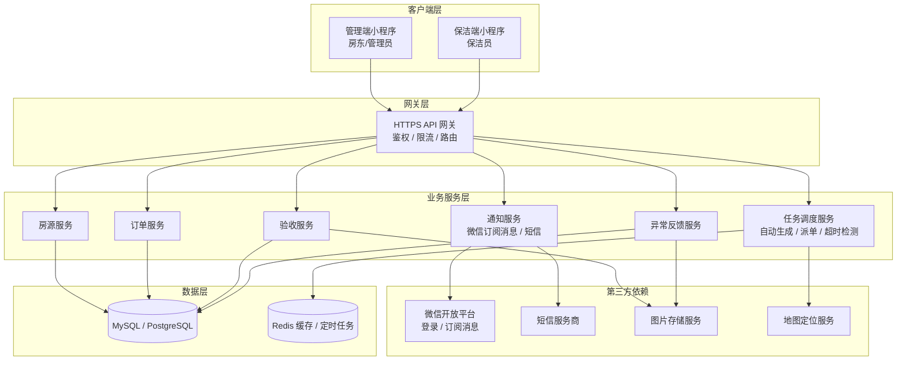

## 2.2 业务模块图

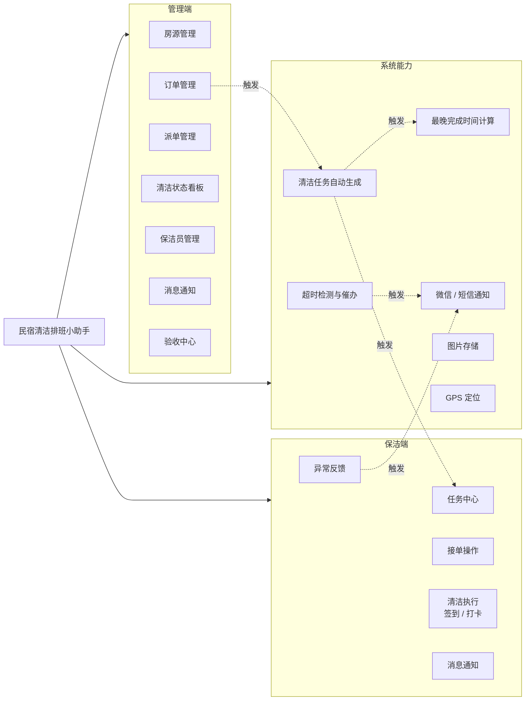

## 2.3 主业务流程

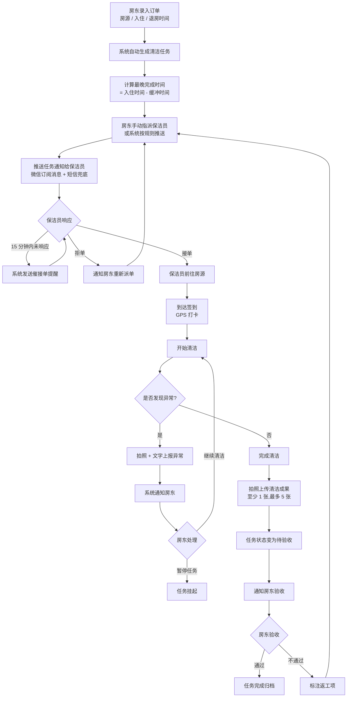

## 2.4 功能图/列表

### 管理端（小程序）

| 功能模块 | 功能名称 | 优先级 | 功能描述 |
| --- | --- | --- | --- |
| 房源管理 | 新增房源 | P0 | 录入房源名称、地址、房型、清洁标准时长、缓冲时间 |
| 房源管理 | 查看房源列表 | P0 | 列表展示所有房源及当日清洁状态摘要 |
| 房源管理 | 编辑/删除房源 | P1 | 修改房源信息或删除不再管理的房源 |
| 订单管理 | 手动录入订单 | P0 | 选择房源、填写住客姓名、入住时间、退房时间 |
| 订单管理 | 自动生成清洁任务 | P0 | 系统识别连续订单间退房→入住间隔并生成任务 |
| 订单管理 | 编辑/取消订单 | P0/P1 | 修改订单时间或取消订单并联动任务 |
| 订单管理 | 查看订单列表 | P0 | 按日期查看订单及关联任务状态 |
| 派单管理 | 手动指派保洁员 | P0 | 从保洁员列表选择一名指派任务（MVP 主方式） |
| 派单管理 | 重新派单 | P0 | 保洁员拒单/超时后将任务转派 |
| 派单管理 | 查看派单状态 | P0 | 追踪每个任务的状态：待接单/已接单/进行中/已完成/异常/已取消 |
| 清洁状态看板 | 看板总览 | P0 | 卡片形式展示每套房源当日状态：待清洁/清洁中/已清洁/异常 |
| 清洁状态看板 | 查看房源任务时间线 | P0 | 点击卡片查看订单信息和清洁执行时间线 |
| 清洁状态看板 | 按日期切换 | P1 | 切换查看不同日期的清洁状态 |
| 清洁状态看板 | 验收清洁 | P0 | 查看清洁前后照片，确认通过或标注返工 |
| 清洁状态看板 | 手动更新状态 | P1 | 应急场景下手动标记状态并填写原因 |
| 保洁员管理 | 添加/编辑/移除保洁员 | P0/P1 | 通过手机号关联保洁员的小程序账号 |
| 消息通知 | 接收各类通知 | P0 | 接单通知、完成通知、异常通知、超时预警 |
| 消息通知 | 查看通知列表 | P1 | 浏览历史通知记录 |

### 保洁端（小程序）

| 功能模块 | 功能名称 | 优先级 | 功能描述 |
| --- | --- | --- | --- |
| 任务管理 | 查看待接任务 | P0 | 显示房源名称、地址、最晚完成时间、紧急程度 |
| 任务管理 | 查看进行中任务 | P0 | 显示已接单未完成任务及剩余时间 |
| 任务管理 | 查看历史任务 | P1 | 按日期查看已完成任务记录 |
| 任务管理 | 查看任务详情 | P0 | 房源信息、清洁标准、历史备注、最晚完成时间 |
| 接单操作 | 接受任务 | P0 | 确认接单，状态变更并通知房东 |
| 接单操作 | 拒绝任务 | P0 | 选择拒单原因，通知房东重新派单 |
| 接单操作 | 超时未响应处理 | P0 | 15 分钟未响应催接单，30 分钟未响应通知房东 |
| 清洁执行 | 到达签到 | P0 | GPS 定位打卡签到 |
| 清洁执行 | 开始清洁 | P1 | 确认开始，状态变更并通知房东 |
| 清洁执行 | 完成清洁拍照打卡 | P0 | 拍摄清洁成果照片 1-5 张，可填写备注 |
| 异常反馈 | 上报异常 | P0 | 拍照+文字描述，选择异常类型 |
| 异常反馈 | 查看处理结果 | P1 | 查看房东对异常的处理意见 |
| 消息通知 | 接收通知 | P0 | 新任务、催办、催接单、异常处理结果 |
| 消息通知 | 查看通知列表 | P2 | 浏览历史通知记录 |

## 2.5 你的产品有哪些端

| 序号 | 端名称 | 端类型 | 目标用户 | 说明 |
| --- | --- | --- | --- | --- |
| 1 | 管理端小程序 | 小程序端 | 房东 / 管理员 | 微信内使用，管理房源、订单、派单、查看看板、验收清洁 |
| 2 | 保洁端小程序 | 小程序端 | 保洁员 | 微信内使用，接收任务、接单、签到打卡、完成清洁、上报异常 |

两端独立部署，通过同一后端服务共享数据；用户首次进入小程序时选择角色（房东/保洁员），系统根据角色进入对应界面。

---

# 3 产品功能

## 3.1 管理端小程序功能

### 3.1.1 房源管理

**功能描述**：房东可新增、查看、编辑、删除房源信息。每套房源需填写名称、地址、房型，并配置清洁标准时长（默认 30 分钟）和缓冲时间（默认 60 分钟），用于计算清洁任务的最晚完成时间。

| 项 | 内容 |
| --- | --- |
| 优先级 | P0（核心） |
| 依赖需求 | 无 |
| 前置条件 | 房东已完成微信授权登录 |

**业务规则**：

1. 房源名称建议格式："房型 + 编号"，如"海景大床房#01"
2. 清洁标准时长用于在看板和任务详情中展示预估耗时
3. 缓冲时间参与最晚完成时间计算：`最晚完成时间 = 下一订单入住时间 − 缓冲时间`
4. 删除房源前需确认，已关联未完成任务的房源不允许删除

**详细流程**：

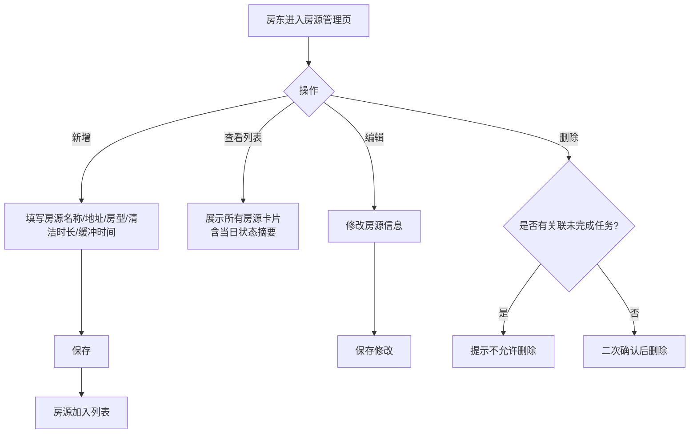

**主要原型**：详见 [📱 管理端小程序全站点原型](assets/prototypes/admin-prototype.html)（房源管理模块）

**验收标准**：

- [ ] 正常流程：可成功新增房源并出现在列表中，编辑后信息更新，删除后列表不再展示
- [ ] 异常流程：删除有关联未完成任务的房源时，系统给出明确提示并拒绝删除
- [ ] 性能要求：房源列表加载不超过 1 秒（20 套房源内）

### 3.1.2 订单管理

**功能描述**：房东手动录入订单（选择房源、填写住客姓名、入住时间、退房时间），系统根据订单自动识别连续订单间的退房→入住间隔并生成清洁任务，计算最晚完成时间。

| 项 | 内容 |
| --- | --- |
| 优先级 | P0（核心） |
| 依赖需求 | 房源管理（需先有房源） |
| 前置条件 | 已录入至少一套房源 |

**业务规则**：

1. 订单必须关联一套已有房源
2. 退房时间必须早于入住时间（同一房源连续订单间）
3. 录入订单后 3 秒内完成清洁任务生成和推送
4. 修改订单时间后，关联的清洁任务最晚完成时间自动重算
5. 取消订单时提示是否同步取消关联的清洁任务

**详细流程**：

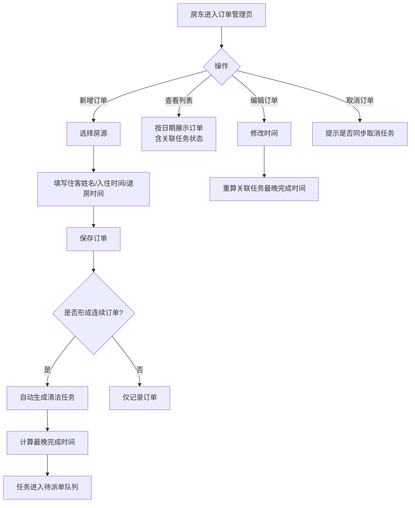

**主要原型**：详见 [📱 管理端小程序全站点原型](assets/prototypes/admin-prototype.html)（订单管理模块）

**验收标准**：

- [ ] 正常流程：录入订单后 3 秒内生成清洁任务；修改时间后任务最晚完成时间同步更新
- [ ] 异常流程：选择已删除房源时提示不可用；取消订单时可选择是否同步取消任务
- [ ] 性能要求：订单录入到任务生成并推送 ≤ 3 秒

### 3.1.3 派单管理

**功能描述**：房东从保洁员列表中手动选择一名保洁员指派清洁任务；保洁员拒单或超时未接单时，房东可重新派单。

| 项 | 内容 |
| --- | --- |
| 优先级 | P0 |
| 依赖需求 | 订单管理、保洁员管理 |
| 前置条件 | 已添加至少一名保洁员 |

**业务规则**：

1. MVP 阶段以手动指派为主要派单方式
2. 保洁员拒单后任务回到待派单状态
3. 推送后 15 分钟未响应发催接单提醒，30 分钟未响应通知房东
4. 房东可在派单页看到每个任务的当前状态和指派历史

**详细流程**：

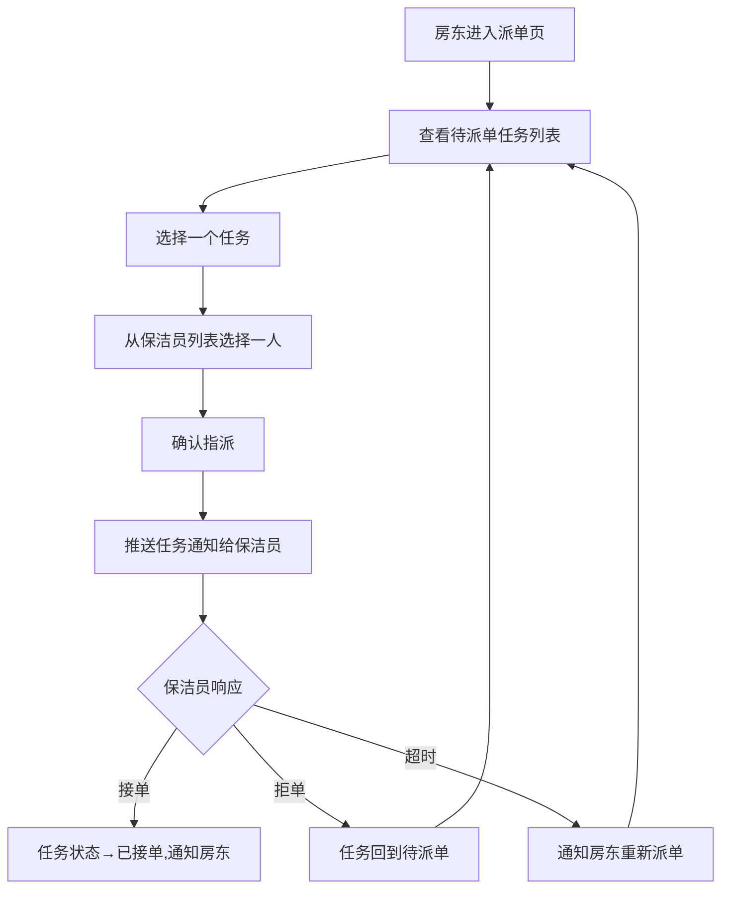

**主要原型**：详见 [📱 管理端小程序全站点原型](assets/prototypes/admin-prototype.html)（派单管理模块）

**验收标准**：

- [ ] 正常流程：成功指派后保洁员端在 30 秒内收到通知
- [ ] 异常流程：拒单后任务自动回到待派单列表，可立即再次指派
- [ ] 性能要求：派单响应 ≤ 2 秒

### 3.1.4 清洁状态看板

**功能描述**：以卡片形式一屏展示所有房源当日清洁状态。状态用颜色+文字标签双编码：待清洁（灰色）、清洁中（蓝色）、已清洁（绿色）、异常（红色）。点击卡片可查看该房源当日订单信息和清洁任务执行时间线。

| 项 | 内容 |
| --- | --- |
| 优先级 | P0（核心看板） |
| 依赖需求 | 房源管理、订单管理、派单管理 |
| 前置条件 | 已有房源和订单数据 |

**业务规则**：

1. 默认展示当日看板，支持切换日期
2. 卡片排序建议：异常 → 待清洁 → 清洁中 → 已清洁（按紧急程度）
3. 房东可在卡片详情中验收清洁：查看照片，确认通过或标注返工项
4. 紧急场景下可手动更新房源清洁状态，需填写操作原因
5. 看板支持下拉刷新

**详细流程**：

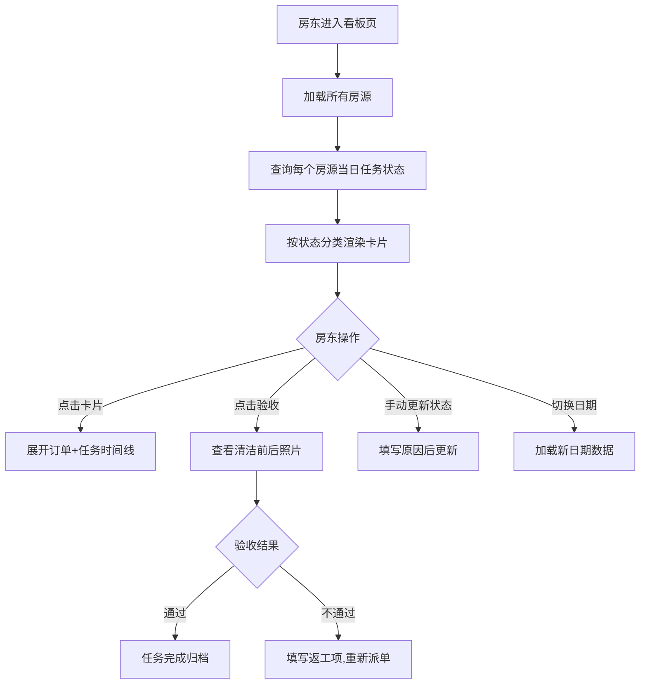

**主要原型**：详见 [📱 管理端小程序全站点原型](assets/prototypes/admin-prototype.html)（清洁状态看板模块）

**验收标准**：

- [ ] 正常流程：看板准确反映每个房源的实时状态；验收通过后任务归档
- [ ] 异常流程：手动更新状态时未填写原因则阻止提交
- [ ] 性能要求：看板加载（20 套房源）≤ 1.5 秒

### 3.1.5 保洁员管理

**功能描述**：房东通过手机号添加保洁员，系统通过手机号关联保洁员的小程序账号。可编辑、移除保洁员。

| 项 | 内容 |
| --- | --- |
| 优先级 | P0 |
| 依赖需求 | 无 |
| 前置条件 | 房东已登录 |

**业务规则**：

1. 通过手机号关联保洁员的小程序账号（保洁员授权登录后系统自动匹配）
2. 移除保洁员前需二次确认
3. 列表中显示每个保洁员当前进行中的任务数量

**详细流程**：

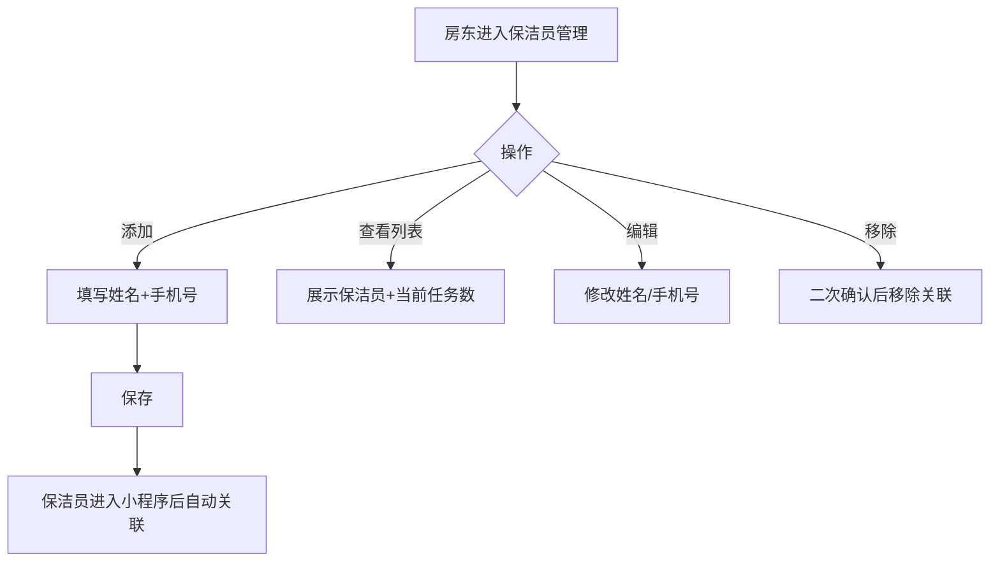

**主要原型**：详见 [📱 管理端小程序全站点原型](assets/prototypes/admin-prototype.html)（保洁员管理模块）

**验收标准**：

- [ ] 正常流程：添加的保洁员在登录小程序后可看到分配给自己的任务
- [ ] 异常流程：同一手机号重复添加时提示已存在

### 3.1.6 消息通知

**功能描述**：房东接收以下通知：保洁员接单通知、清洁完成通知、异常反馈通知、任务超时预警。可在通知中心查看历史通知。

| 项 | 内容 |
| --- | --- |
| 优先级 | P0 |
| 依赖需求 | 各业务模块触发 |
| 前置条件 | 用户已订阅微信订阅消息 |

**业务规则**：

1. 通知通过微信订阅消息下发，重要通知（异常、超时）同步短信兜底
2. 通知到达时效 ≤ 30 秒
3. 异常反馈通知为最高优先级，立即推送

**主要原型**：详见 [📱 管理端小程序全站点原型](assets/prototypes/admin-prototype.html)（消息通知模块）

**验收标准**：

- [ ] 正常流程：触发事件后 30 秒内收到通知
- [ ] 异常流程：未订阅微信通知时通过短信兜底

## 3.2 保洁端小程序功能

### 3.2.1 任务中心

**功能描述**：保洁员查看分配给自己的任务，分为"待接单"、"进行中"、"已完成"三个 Tab。每个任务卡片显示房源名称、地址、最晚完成时间、紧急程度。

| 项 | 内容 |
| --- | --- |
| 优先级 | P0 |
| 依赖需求 | 管理端派单 |
| 前置条件 | 保洁员已完成微信授权登录并已被房东添加 |

**业务规则**：

1. 待接单 Tab：按最晚完成时间升序排列，临近截止的任务高亮为"紧急"
2. 进行中 Tab：显示已接单但尚未完成的任务，含剩余时间倒计时
3. 已完成 Tab：按完成日期倒序展示历史任务
4. 列表支持下拉刷新和上拉加载更多

**详细流程**：

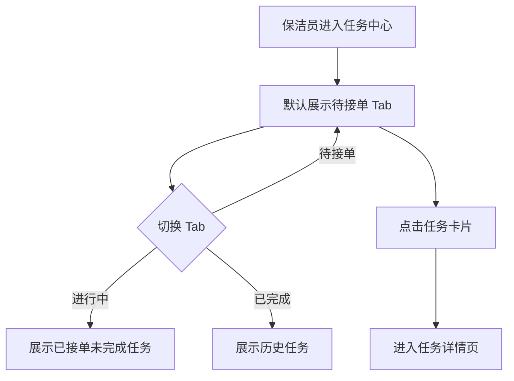

**主要原型**：详见 [📱 保洁端小程序全站点原型](assets/prototypes/cleaner-prototype.html)（任务中心模块）

**验收标准**：

- [ ] 正常流程：切换 Tab 正确展示对应任务列表；点击卡片进入详情
- [ ] 异常流程：空数据时展示空态提示（"暂无任务"）
- [ ] 性能要求：列表加载 ≤ 1 秒

### 3.2.2 接单操作

**功能描述**：保洁员查看任务详情后可选择接受或拒绝任务。拒单需选择原因（时间冲突/距离太远/身体不适/其他）。

| 项 | 内容 |
| --- | --- |
| 优先级 | P0 |
| 依赖需求 | 任务中心 |
| 前置条件 | 任务已分配给该保洁员 |

**业务规则**：

1. 接单后任务状态变更为"已接单"，系统通知房东
2. 拒单后任务回到待派单状态，系统通知房东重新派单
3. 推送后 15 分钟未响应发催接单提醒
4. 推送后 30 分钟未响应通知房东

**详细流程**：

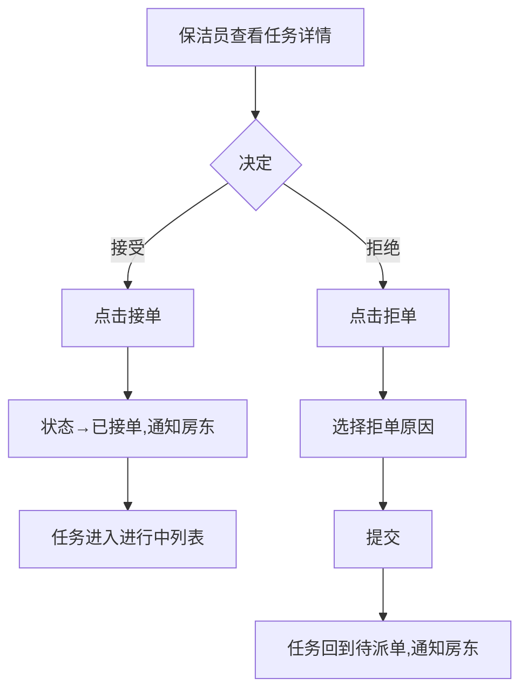

**主要原型**：详见 [📱 保洁端小程序全站点原型](assets/prototypes/cleaner-prototype.html)（接单操作模块）

**验收标准**：

- [ ] 正常流程：接单/拒单成功后状态正确变更并通知房东
- [ ] 异常流程：拒单未选择原因时阻止提交

### 3.2.3 清洁执行

**功能描述**：保洁员接单后前往房源，通过 GPS 签到打卡；开始清洁；完成后拍照上传成果照片（1-5 张），可填写清洁备注。

| 项 | 内容 |
| --- | --- |
| 优先级 | P0 |
| 依赖需求 | 接单操作 |
| 前置条件 | 任务已接单 |

**业务规则**：

1. 签到需 GPS 定位，定位失败时提示重试
2. 照片必须通过相机实时拍摄，不支持从相册选择（确保真实性）
3. 至少上传 1 张清洁成果照片才能提交完成
4. 签到后点击"开始清洁"，状态变更为"清洁中"并通知房东
5. 完成后状态变为"待验收"，通知房东验收

**详细流程**：

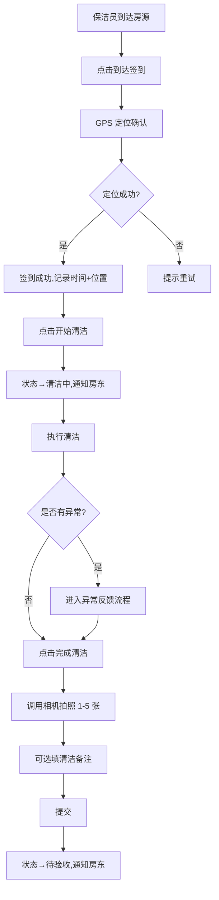

**主要原型**：详见 [📱 保洁端小程序全站点原型](assets/prototypes/cleaner-prototype.html)（清洁执行模块）

**验收标准**：

- [ ] 正常流程：签到→开始→完成全流程状态正确流转
- [ ] 异常流程：GPS 定位失败提示重试；未上传照片时阻止提交完成
- [ ] 性能要求：照片上传（单张）≤ 5 秒

### 3.2.4 异常反馈

**功能描述**：保洁员在清洁过程中发现异常（设施损坏/物品遗留/安全隐患/其他），拍照+文字描述，选择异常类型后提交，系统立即通知房东。

| 项 | 内容 |
| --- | --- |
| 优先级 | P0 |
| 依赖需求 | 清洁执行 |
| 前置条件 | 任务处于"清洁中"状态 |

**业务规则**：

1. 异常反馈需至少 1 张照片和 1 条异常描述
2. 必须选择异常类型（设施损坏/物品遗留/安全隐患/其他）
3. 提交后立即推送通知给房东
4. 房东处理后会反馈处理意见，保洁员可在任务详情中查看
5. 异常反馈关联当前清洁任务，可在看板时间线中查看

**详细流程**：

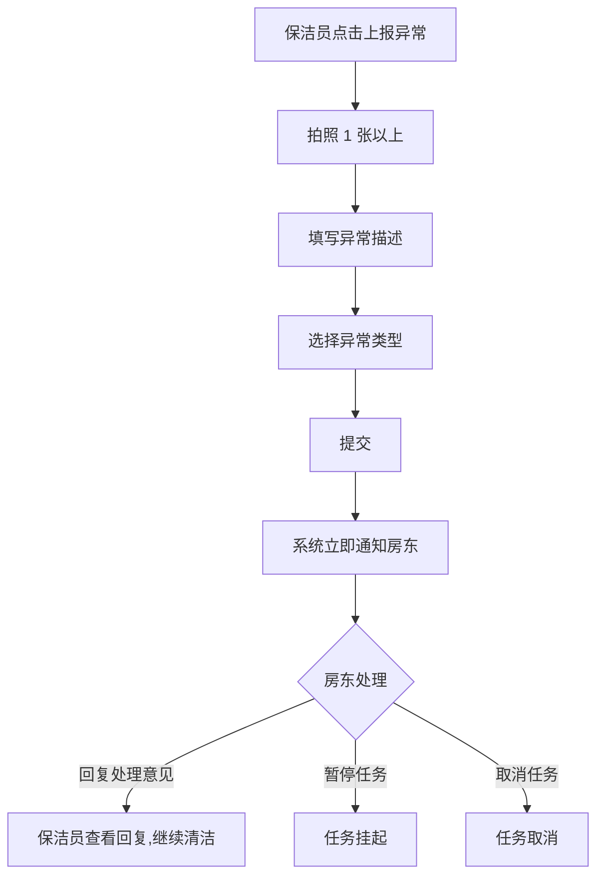

**主要原型**：详见 [📱 保洁端小程序全站点原型](assets/prototypes/cleaner-prototype.html)（异常反馈模块）

**验收标准**：

- [ ] 正常流程：提交后房东 30 秒内收到通知；房东回复后保洁员可查看
- [ ] 异常流程：未填描述或未选类型时阻止提交
- [ ] 性能要求：照片上传+提交 ≤ 5 秒

### 3.2.5 消息通知

**功能描述**：保洁员接收以下通知：新任务推送、催办提醒（任务截止前 30 分钟未完成）、催接单提醒（15 分钟未响应）、异常处理结果通知。

| 项 | 内容 |
| --- | --- |
| 优先级 | P0 |
| 依赖需求 | 各业务模块触发 |
| 前置条件 | 已关注小程序 |

**业务规则**：

1. 通过微信订阅消息下发
2. 未关注小程序时通过短信兜底
3. 通知到达时效 ≤ 30 秒

**主要原型**：详见 [📱 保洁端小程序全站点原型](assets/prototypes/cleaner-prototype.html)（消息通知模块）

**验收标准**：

- [ ] 正常流程：触发事件后 30 秒内收到通知
- [ ] 异常流程：未订阅微信通知时通过短信兜底

---

# 4 产品原型

## 4.1 功能原型总览

| 原型名称 | 原型链接 | 对应端 | 备注 |
| --- | --- | --- | --- |
| 管理端-小程序端 | [📱 管理端小程序全站点原型](assets/prototypes/admin-prototype.html) | 小程序端 | 房东/管理员使用，包含房源管理、订单录入、清洁看板、派单管理、保洁员管理、消息通知 |
| 保洁端-小程序端 | [📱 保洁端小程序全站点原型](assets/prototypes/cleaner-prototype.html) | 小程序端 | 保洁员使用，包含任务列表、接单操作、打卡拍照、清洁执行、异常反馈、消息通知 |

**原型设计说明**：
- 管理端和保洁端均采用微信小程序界面风格，符合用户日常使用习惯
- 管理端以"清洁状态看板"为首页核心，一屏掌握所有房源状态
- 保洁端采用大字体（≥16sp）、大按钮（≥44×44pt）设计，适配中老年保洁员
- 所有照片上传均调用相机实时拍摄，不支持相册选择，确保照片真实性
- 状态颜色编码：待清洁（灰 #9CA3AF）、清洁中（蓝 #3B82F6）、已清洁（绿 #10B981）、异常（红 #EF4444），同时显示文字标签兼顾色弱用户

## 4.2 页面跳转逻辑图

### 管理端小程序

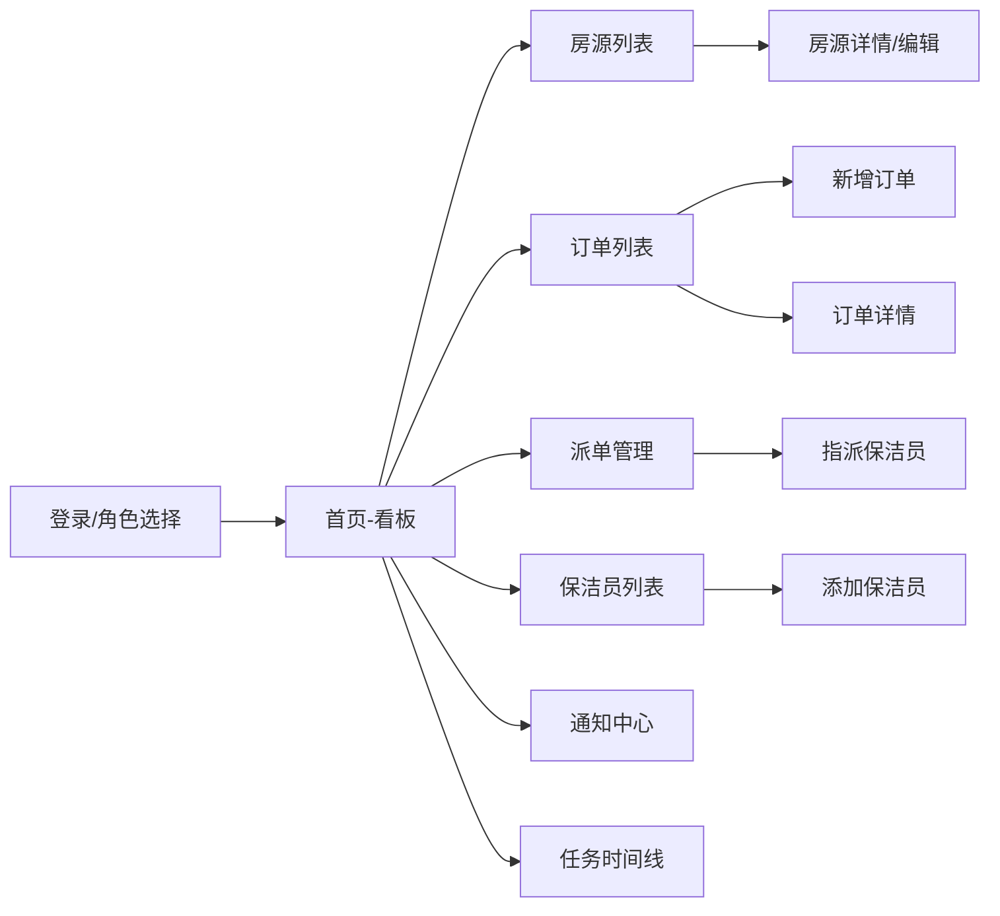

### 保洁端小程序

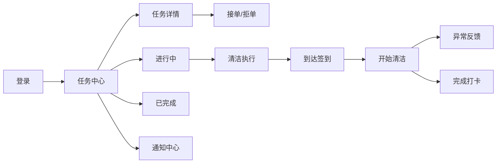

## 4.3 全站点原型设计

### 4.3.1 管理端小程序

**页面清单：**

| 序号 | 页面名称 | 所属模块 | 页面描述 | 关键元素 |
| --- | --- | --- | --- | --- |
| 1 | 登录/角色选择页 | 用户 | 微信授权登录后选择角色 | 微信登录按钮、角色选择卡片 |
| 2 | 首页-清洁看板 | 看板 | 卡片式展示当日所有房源清洁状态 | 状态卡片（灰/蓝/绿/红）、日期切换器、统计摘要 |
| 3 | 房源列表页 | 房源管理 | 展示所有房源及状态摘要 | 房源卡片、新增按钮、搜索框 |
| 4 | 房源详情/编辑页 | 房源管理 | 查看或编辑房源信息 | 表单（名称/地址/房型/清洁时长/缓冲时间）、保存按钮 |
| 5 | 订单列表页 | 订单管理 | 按日期展示订单及关联任务状态 | 订单卡片、筛选栏、新增按钮 |
| 6 | 新增订单页 | 订单管理 | 录入新订单 | 房源选择器、住客姓名输入、入住/退房时间选择 |
| 7 | 派单管理页 | 派单管理 | 待派单任务列表和指派操作 | 任务列表、指派按钮、保洁员选择弹窗 |
| 8 | 任务时间线页 | 看板 | 查看某房源当日订单+任务执行时间线 | 时间轴组件、订单信息、状态流转节点 |
| 9 | 验收弹窗 | 看板 | 查看清洁前后照片并验收 | 照片预览、通过/返工按钮、返工说明输入 |
| 10 | 保洁员列表页 | 保洁员管理 | 展示保洁员及当前任务数 | 保洁员卡片、添加按钮 |
| 11 | 添加保洁员页 | 保洁员管理 | 录入保洁员信息 | 姓名输入、手机号输入、保存按钮 |
| 12 | 通知中心页 | 消息通知 | 历史通知列表 | 通知卡片、类型标签、时间戳 |

**交互说明：**

- 页面跳转关系：见 4.1 管理端跳转图
- 特殊交互：
  1. 首页看板支持下拉刷新、日期横滑切换
  2. 点击房源卡片弹出半屏详情面板（含时间线）
  3. 验收操作使用底部弹窗（ActionSheet 风格）
  4. 指派保洁员使用 picker 弹窗
  5. 状态颜色：待清洁 #9CA3AF（灰）、清洁中 #3B82F6（蓝）、已清洁 #10B981（绿）、异常 #EF4444（红），同时显示文字标签
  6. 空数据态展示友好提示 + 引导操作按钮

**产品原型：**

[📱 打开管理端小程序全站点原型](assets/prototypes/admin-prototype.html)

### 4.3.2 保洁端小程序

**页面清单：**

| 序号 | 页面名称 | 所属模块 | 页面描述 | 关键元素 |
| --- | --- | --- | --- | --- |
| 1 | 登录页 | 用户 | 微信授权登录 | 微信登录按钮、角色选择（默认保洁员） |
| 2 | 任务中心页 | 任务管理 | 三个 Tab：待接单/进行中/已完成 | Tab 切换、任务卡片列表、下拉刷新 |
| 3 | 任务详情页 | 任务管理 | 单个任务完整信息 | 房源信息、清洁标准、最晚完成时间、接单/拒单按钮 |
| 4 | 接单/拒单弹窗 | 接单操作 | 确认接单或选择拒单原因 | 接单按钮、拒单原因选择器、确认按钮 |
| 5 | 清洁执行页 | 清洁执行 | 签到→开始→完成的操作流 | 签到按钮（含定位状态）、开始清洁按钮、完成打卡按钮 |
| 6 | 拍照打卡弹窗 | 清洁执行 | 拍摄并上传清洁成果照片 | 相机调用、照片预览、备注输入、提交按钮 |
| 7 | 异常反馈页 | 异常反馈 | 上报房源异常 | 拍照上传、异常描述输入、异常类型选择、提交按钮 |
| 8 | 异常处理结果页 | 异常反馈 | 查看房东对异常的处理意见 | 异常信息展示、房东回复、状态标识 |
| 9 | 历史任务页 | 任务管理 | 已完成任务列表 | 任务卡片、日期筛选 |
| 10 | 通知中心页 | 消息通知 | 收到的通知列表 | 通知卡片、类型标签、时间戳 |

**交互说明：**

- 页面跳转关系：见 4.1 保洁端跳转图
- 特殊交互：
  1. **大字体设计**：保洁端所有文字不小于 16sp，按钮点击区域不小于 44×44pt
  2. 任务卡片按最晚完成时间排序，临近截止的标红
  3. 签到按钮大且醒目，点击后显示定位中状态
  4. 拍照打卡强制调用相机，不开放相册选择
  5. 异常类型使用大图标+文字的卡片选择
  6. 空数据态展示友好提示（"暂无新任务，休息一下吧"）
  7. 进行中任务显示剩余时间倒计时

**产品原型：**

[📱 打开保洁端小程序全站点原型](assets/prototypes/cleaner-prototype.html)

---

# 5 数据需求

## 5.1 数据使用规格

### 房源（Property）

| 字段 | 是否必填 | 描述 | 数据类型 |
| --- | --- | --- | --- |
| id | 是 | 房源唯一标识 | UUID |
| name | 是 | 房源名称 | 字符串 |
| address | 是 | 房源地址 | 字符串 |
| room_type | 是 | 房型（如大床房/双床房/套房） | 字符串 |
| clean_duration_minutes | 是 | 清洁标准时长（分钟），默认 30 | 整数 |
| buffer_minutes | 是 | 缓冲时间（分钟），默认 60 | 整数 |
| status | 是 | 状态（active/archived） | 字符串 |
| landlord_id | 是 | 所属房东 ID | UUID |
| created_at | 是 | 创建时间 | 时间戳 |

### 订单（Order）

| 字段 | 是否必填 | 描述 | 数据类型 |
| --- | --- | --- | --- |
| id | 是 | 订单唯一标识 | UUID |
| property_id | 是 | 关联房源 ID | UUID |
| guest_name | 是 | 住客姓名 | 字符串 |
| checkin_time | 是 | 入住时间 | 时间戳 |
| checkout_time | 是 | 退房时间 | 时间戳 |
| status | 是 | 状态（active/cancelled） | 字符串 |
| landlord_id | 是 | 所属房东 ID | UUID |
| created_at | 是 | 创建时间 | 时间戳 |

### 清洁任务（CleaningTask）

| 字段 | 是否必填 | 描述 | 数据类型 |
| --- | --- | --- | --- |
| id | 是 | 任务唯一标识 | UUID |
| order_id | 是 | 关联订单 ID | UUID |
| property_id | 是 | 关联房源 ID | UUID |
| cleaner_id | 否 | 指派保洁员 ID | UUID |
| deadline_time | 是 | 最晚完成时间 | 时间戳 |
| status | 是 | 状态（pending/accepted/in_cleaning/pending_review/completed/abnormal/cancelled） | 字符串 |
| assigned_at | 否 | 指派时间 | 时间戳 |
| accepted_at | 否 | 接单时间 | 时间戳 |
| checkin_at | 否 | 签到时间 | 时间戳 |
| checkin_location | 否 | 签到经纬度 | JSON |
| start_clean_at | 否 | 开始清洁时间 | 时间戳 |
| finished_at | 否 | 完成时间 | 时间戳 |
| review_result | 否 | 验收结果（pass/rework） | 字符串 |
| review_comment | 否 | 验收备注 | 字符串 |
| remark | 否 | 保洁员清洁备注 | 字符串 |
| landlord_id | 是 | 所属房东 ID | UUID |

### 任务照片（TaskPhoto）

| 字段 | 是否必填 | 描述 | 数据类型 |
| --- | --- | --- | --- |
| id | 是 | 照片唯一标识 | UUID |
| task_id | 是 | 关联任务 ID | UUID |
| type | 是 | 类型（clean_result/issue） | 字符串 |
| url | 是 | 图片访问 URL | 字符串 |
| uploaded_at | 是 | 上传时间 | 时间戳 |

### 异常反馈（IssueReport）

| 字段 | 是否必填 | 描述 | 数据类型 |
| --- | --- | --- | --- |
| id | 是 | 反馈唯一标识 | UUID |
| task_id | 是 | 关联任务 ID | UUID |
| issue_type | 是 | 异常类型（damage/lost_item/safety/other） | 字符串 |
| description | 是 | 异常描述 | 字符串 |
| handler_reply | 否 | 房东处理意见 | 字符串 |
| handle_status | 是 | 处理状态（pending/replied/cancelled） | 字符串 |
| reported_at | 是 | 上报时间 | 时间戳 |

### 保洁员（Cleaner）

| 字段 | 是否必填 | 描述 | 数据类型 |
| --- | --- | --- | --- |
| id | 是 | 保洁员唯一标识 | UUID |
| name | 是 | 姓名 | 字符串 |
| phone | 是 | 手机号 | 字符串 |
| wx_openid | 否 | 微信 openId | 字符串 |
| landlord_id | 是 | 关联房东 ID | UUID |
| status | 是 | 状态（active/removed） | 字符串 |

### 通知（Notification）

| 字段 | 是否必填 | 描述 | 数据类型 |
| --- | --- | --- | --- |
| id | 是 | 通知唯一标识 | UUID |
| receiver_id | 是 | 接收人 ID | UUID |
| type | 是 | 通知类型 | 字符串 |
| title | 是 | 通知标题 | 字符串 |
| content | 是 | 通知内容 | 字符串 |
| related_id | 否 | 关联业务 ID | UUID |
| channel | 是 | 推送通道（wx/sms） | 字符串 |
| is_read | 是 | 是否已读 | 布尔 |
| created_at | 是 | 创建时间 | 时间戳 |

## 5.2 统计数据

1. 每套房源的月度清洁任务完成数、平均响应时间、按时完成率（P1，V1.1）
2. 每位保洁员的月度接单数、拒单数、按时完成率（P1，V1.1）
3. 异常反馈类型分布统计（P2，V1.2）

## 5.3 埋点需求

| 页面 | 事件 | 采集字段 | 说明 |
| --- | --- | --- | --- |
| 登录页 | login_click | user_role, login_method | 统计登录转化 |
| 看板页 | board_view | date, property_count, status_distribution | 看板使用频次 |
| 订单录入页 | order_create | property_id, time_to_next_checkin | 订单录入频次 |
| 派单页 | dispatch_assign | task_id, cleaner_id, dispatch_method | 派单方式统计 |
| 任务详情页（保洁） | task_view | task_id, view_duration | 任务查看频次 |
| 接单操作 | task_accept | task_id, action, response_time | 接单响应时间分析 |
| 清洁执行 | checkin_complete | task_id, location_accuracy | 签到成功率 |
| 清洁完成 | clean_finish | task_id, photo_count, duration | 清洁时长统计 |
| 异常反馈 | issue_report | task_id, issue_type | 异常类型分布 |

---

# 6 非功能需求

## 6.1 性能需求

**6.1.1 延迟**

| 编号 | 项目 | 最大延迟 | 平均延迟 | 优先级 | 备注 |
| --- | --- | --- | --- | --- | --- |
| PERF-01 | 页面首屏加载（4G） | < 2 秒 | < 1.5 秒 | 高 | 管理端和保洁端 |
| PERF-02 | 订单录入到任务生成+推送 | < 3 秒 | < 2 秒 | 高 | 含通知发送 |
| PERF-03 | 消息通知到达（微信/短信） | < 30 秒 | < 10 秒 | 高 | 含异常通知 |
| PERF-04 | 看板数据加载（20 套房源） | < 1.5 秒 | < 1 秒 | 中 | |
| PERF-05 | 照片上传（单张） | < 5 秒 | < 3 秒 | 中 | 4G 网络 |

**6.1.2 吞吐量**

| 编号 | 项 | 吞吐量 | 备注 |
| --- | --- | --- | --- |
| T-01 | 订单录入 | 每分钟 50 次 | 含任务生成 |
| T-02 | 任务指派 | 每分钟 100 次 | |
| T-03 | 通知推送 | 每分钟 500 条 | |

**6.1.3 容量**

| 编号 | 项 | 容量 | 备注 |
| --- | --- | --- | --- |
| C-01 | 单房东房源数 | ≤ 20 套 | MVP 定位 |
| C-02 | 系统房东数 | ≤ 1000 家 | V1.0 容量目标 |
| C-03 | 同时在线并发任务生成 | 500 个房源同时触发 | 不出现明显卡顿 |

## 6.2 安全需求

| 编号 | 项 |
| --- | --- |
| SEC-01 | 所有数据传输使用 HTTPS 加密 |
| SEC-02 | 用户登录必须通过微信授权获取 openId，配合手机号绑定 |
| SEC-03 | 保洁员仅能看到分配给自己的任务，不能看到其他保洁员的任务和信息 |
| SEC-04 | 房东仅能看到自己名下的房源、订单、保洁员数据 |
| SEC-05 | 图片上传需做类型和大小校验（仅允许 jpg/png，单张 ≤ 10MB） |
| SEC-06 | 接口调用需做频率限制，防止恶意调用 |

## 6.3 可靠性

| 编号 | 项 | 值 |
| --- | --- | --- |
| REL-01 | 月度可用率 | ≥ 99.5% |
| REL-02 | 平均故障恢复时间（MTTR） | ≤ 30 分钟 |
| REL-03 | 数据持久化 | 订单、任务数据每日全量备份，保留 30 天 |

## 6.4 可连续性

| 编号 | 项 |
| --- | --- |
| CONT-01 | 系统需 7 × 24 小时运行，保证房东随时可录入订单、保洁员随时可查看任务 |
| CONT-02 | 通知推送服务需有高可用保障，避免漏推 |

## 6.5 可恢复性

| 编号 | 项 |
| --- | --- |
| REC-01 | 数据库每日全量备份 + 每小时增量备份，保留 30 天 |
| REC-02 | 重大故障 1-3 小时恢复服务可用性，24-72 小时恢复历史数据 |

## 6.6 兼容性

| 编号 | 要求 | 备注 |
| --- | --- | --- |
| COMP-01 | 微信 7.0 及以上版本 | iOS / Android |
| COMP-02 | iOS 12+ / Android 6.0+ | |
| COMP-03 | 适配主流手机分辨率：375×667, 390×844, 414×896 等 | |

## 6.7 易用性

| 编号 | 要求 | 备注 |
| --- | --- | --- |
| UX-01 | 核心操作路径不超过 3 步 | 录入订单、接单、完成打卡 |
| UX-02 | 保洁端字体不小于 16sp，按钮点击区域 ≥ 44×44pt | 适配中老年用户 |
| UX-03 | 颜色+文字双编码区分状态 | 兼顾色弱用户 |
| UX-04 | 时间统一使用 24 小时制，格式 YYYY-MM-DD HH:mm | |
| UX-05 | 支持下拉刷新和上拉加载更多 | |
| UX-06 | 普通用户无需培训即可使用核心功能 | |

---

# 7 总结

## 7.1 上线计划

| 阶段 | 时间 | 内容 | 负责人 |
| --- | --- | --- | --- |
| 开发阶段 | T+0 ~ T+7 | 前端小程序（管理端+保洁端）、后端服务、数据库、第三方接口对接 | 开发团队 |
| 测试阶段 | T+7 ~ T+9 | 功能测试、性能测试、兼容性测试 | 测试团队 |
| 灰度阶段 | T+9 ~ T+12 | 邀请 5-10 家种子房东试用，收集反馈 | 产品 + 运营 |
| 全量上线 | T+12 | 全量开放 + 产品落地页发布 | 全团队 |

## 7.2 后续迭代规划

- **V1.1**：
  - 自动派单规则（按保洁员当前任务量或距离分配）
  - 保洁员批量添加
  - 统计数据看板（月度清洁完成率、响应时间分析）
- **V1.2**：
  - 地图展示房源位置（保洁员导航）
  - 多房东协作（管家团队角色）
  - 异常反馈类型扩展 + 统计
- **V1.3**：
  - OTA 平台订单自动同步（对接主流民宿平台 API）
  - 清洁标准自定义 checklist
  - 多语言支持（针对外籍房东/保洁员）

## 7.3 参考文档

- 《民宿清洁排班小助手_需求文档_URS.md》
- 微信小程序订阅消息接入文档
- 微信小程序登录接入文档
