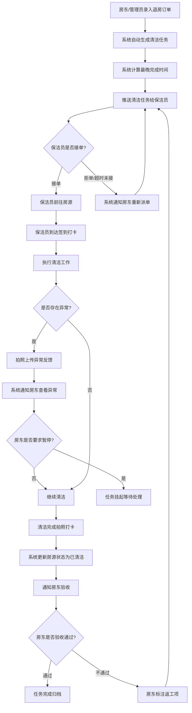
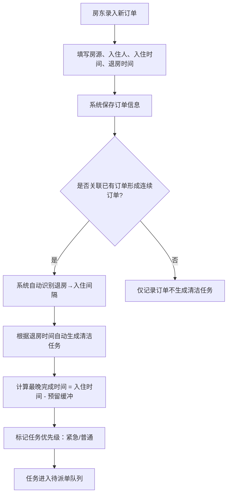
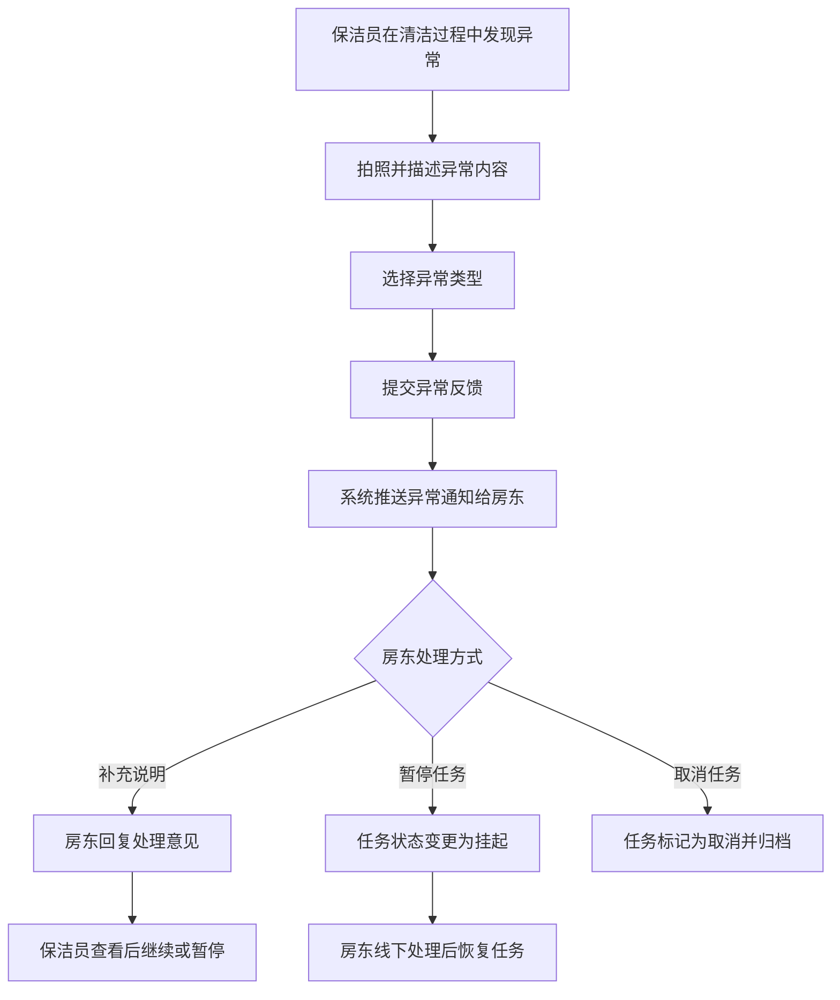
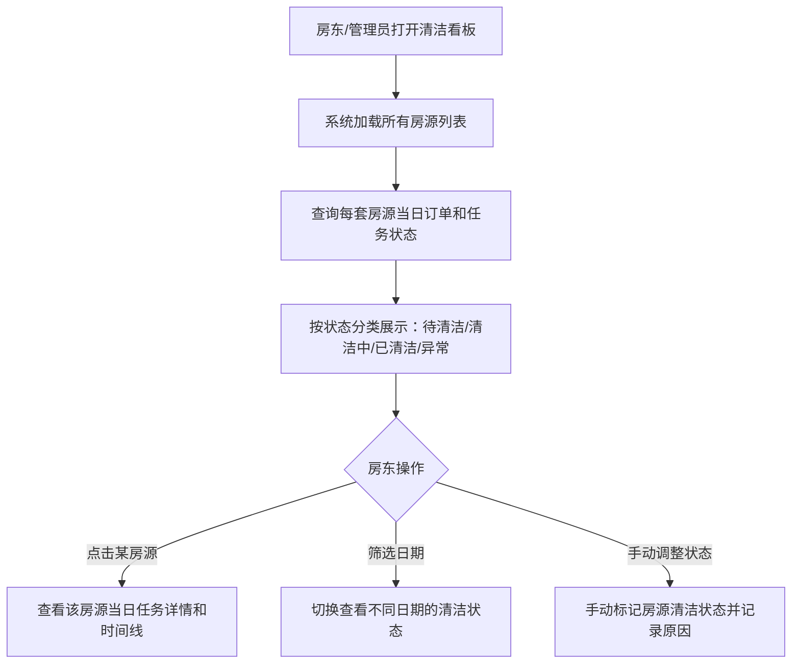
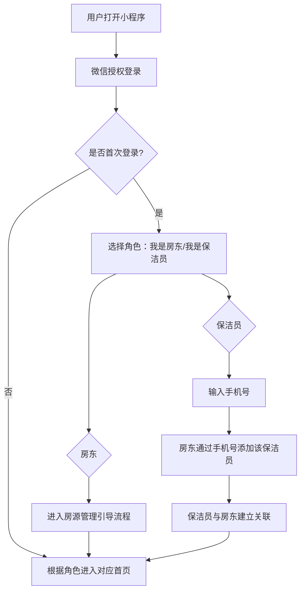
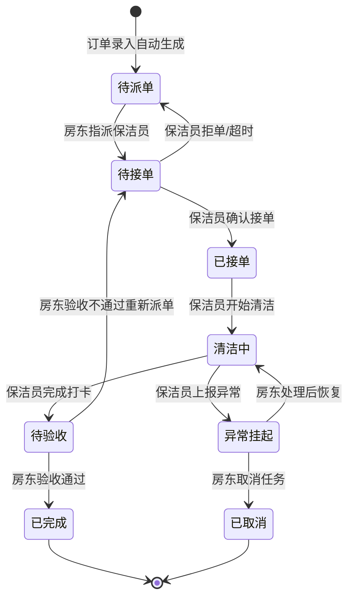
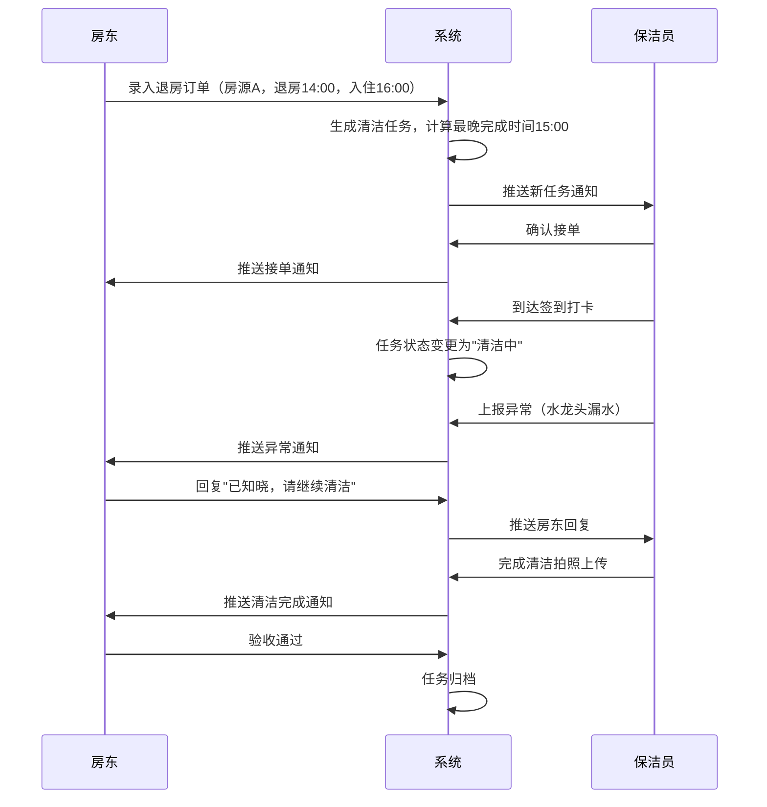
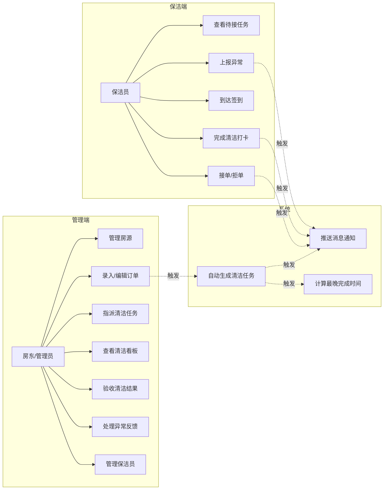

# 1.需求概述

## 1.1 需求介绍

民宿清洁排班小助手是一款面向小型民宿运营团队的轻量级清洁任务调度工具。它聚焦于民宿场景中"退房→清洁→入住"这一核心周转环节，帮助拥有 1～20 套房源的民宿房东和小型管家团队，将原本依赖微信群手工协调的清洁排班工作，转变为系统自动派单、保洁员在线接单、清洁状态实时可视的标准化流程，从而降低漏单、重单和沟通延误带来的运营损失。

### 1.1.1 所属领域

垂直行业 / 民宿运营 / 生活服务

## 1.2 需求目标

| 编号 | 目标 | 衡量标准 |
| --- | --- | --- |
| G-01 | 消除清洁漏单 | 系统生成的清洁任务 100% 关联订单，杜绝人工派单遗漏 |
| G-02 | 缩短周转沟通时间 | 从退房到保洁员确认接单的响应时间由平均 30 分钟缩短至 5 分钟以内 |
| G-03 | 清洁进度透明可见 | 房东/管家可随时查看每套房源的清洁状态，无需逐一询问保洁员 |
| G-04 | 降低操作门槛 | 保洁员无需安装独立 APP，通过微信小程序即可完成接单、打卡、反馈全流程 |
| G-05 | 异常可追溯 | 保洁员发现的房源异常（设施损坏、物品遗留等）有记录、可回溯、可通知房东 |

## 1.3 系统使用角色

| 角色 | 说明 | 典型用户 |
| --- | --- | --- |
| 房东/管理员 | 房源和订单的管理者，负责录入订单、查看清洁看板、验收清洁结果 | 拥有 1～20 套民宿房源的个人房东或小型管家团队负责人 |
| 保洁员 | 清洁任务的执行者，负责接单、完成清洁、拍照打卡、反馈异常 | 与房东合作的兼职或全职保洁人员，通常为本地阿姨或清洁服务团队 |

## 1.4 业务流程图

### 1.4.1 核心业务流程：退房→清洁→入住

### 1.4.2 订单与任务生成流程

### 1.4.3 异常处理流程

### 1.4.4 清洁状态看板流程

# 2.功能原型

| 原型名称 | 原型链接 | 对应端 | 备注 |
| --- | --- | --- | --- |
| 管理端-小程序端 | 待产品文档结对写作专家输出 | 小程序端 | 房东/管理员使用，包含房源管理、订单录入、清洁看板、派单管理 |
| 保洁端-小程序端 | 待产品文档结对写作专家输出 | 小程序端 | 保洁员使用，包含任务列表、接单操作、打卡拍照、异常反馈 |

# 3.需求清单

## 3.1 管理端-小程序端

### 3.1.1 房源管理模块

| 模块 | 一级功能 | 二级功能 | 功能描述 | 优先级 | 备注 |
| --- | --- | --- | --- | --- | --- |
| 房源管理 | 新增房源 | 填写房源基本信息 | 房东可录入房源名称（如"海景大床房#01"）、地址、房型、清洁标准时长（默认30分钟） | P0 | |
| 房源管理 | 新增房源 | 设置清洁缓冲时间 | 房东可设置每套房源退房后到入住前的默认缓冲时间（默认60分钟），用于计算清洁任务的最晚完成时间 | P0 | |
| 房源管理 | 编辑房源 | 修改房源信息 | 房东可修改房源名称、地址、房型、清洁标准时长、缓冲时间等 | P1 | |
| 房源管理 | 删除房源 | 删除不再管理的房源 | 房东可删除已不再管理的房源，删除前系统提示确认，已关联未完成任务的房源不允许删除 | P1 | |
| 房源管理 | 查看房源列表 | 浏览所有房源 | 以列表形式展示当前账号下所有房源，显示房源名称、地址、当日清洁状态摘要 | P0 | |

### 3.1.2 订单管理模块

| 模块 | 一级功能 | 二级功能 | 功能描述 | 优先级 | 备注 |
| --- | --- | --- | --- | --- | --- |
| 订单管理 | 手动录入订单 | 填写订单信息 | 房东手动录入订单：选择房源、填写住客姓名、入住时间、退房时间 | P0 | MVP核心入口 |
| 订单管理 | 手动录入订单 | 系统自动生成清洁任务 | 录入订单后，系统自动识别连续订单间的退房→入住间隔，生成对应的清洁任务并计算最晚完成时间 | P0 | |
| 订单管理 | 编辑订单 | 修改订单时间 | 房东可修改订单的入住时间和退房时间，修改后系统自动更新关联的清洁任务和最晚完成时间 | P0 | |
| 订单管理 | 取消订单 | 取消订单并关联任务 | 房东可取消订单，系统提示是否同时取消关联的清洁任务 | P1 | |
| 订单管理 | 查看订单列表 | 按日期筛选订单 | 房东可按日期查看订单列表，显示房源名称、住客姓名、入住/退房时间、关联清洁任务状态 | P0 | |

### 3.1.3 派单管理模块

| 模块 | 一级功能 | 二级功能 | 功能描述 | 优先级 | 备注 |
| --- | --- | --- | --- | --- | --- |
| 派单管理 | 自动派单 | 按规则推送任务 | 清洁任务生成后，系统按保洁员当前任务量或排班规则自动推送任务通知 | P0 | MVP使用简单轮询或手动指派 |
| 派单管理 | 手动派单 | 指定保洁员 | 房东可从保洁员列表中手动选择一名保洁员指派清洁任务 | P0 | MVP主要方式 |
| 派单管理 | 重新派单 | 转派任务 | 当保洁员拒单或超时未接单时，房东可将任务重新指派给其他保洁员 | P0 | |
| 派单管理 | 查看派单状态 | 追踪任务进度 | 房东可查看每个清洁任务的当前状态：待接单/已接单/进行中/已完成/异常/已取消 | P0 | |

### 3.1.4 清洁状态看板模块

| 模块 | 一级功能 | 二级功能 | 功能描述 | 优先级 | 备注 |
| --- | --- | --- | --- | --- | --- |
| 清洁状态看板 | 看板总览 | 房源状态卡片展示 | 以卡片形式展示每套房源当日清洁状态，状态分为：待清洁（灰色）、清洁中（蓝色）、已清洁（绿色）、异常（红色） | P0 | 核心看板 |
| 清洁状态看板 | 看板总览 | 按日期切换 | 房东可切换查看不同日期的清洁状态看板 | P1 | |
| 清洁状态看板 | 查看详情 | 查看房源任务时间线 | 点击某房源卡片可展开查看当日该房源的订单信息和清洁任务执行时间线 | P0 | |
| 清洁状态看板 | 手动操作 | 手动更新清洁状态 | 房东可手动将房源状态标记为"已清洁"或"待清洁"，需填写操作原因 | P1 | 应急操作 |
| 清洁状态看板 | 验收清洁 | 确认或打回清洁结果 | 房东可查看保洁员上传的清洁完成照片，确认验收通过或标注返工项 | P0 | |

### 3.1.5 保洁员管理模块

| 模块 | 一级功能 | 二级功能 | 功能描述 | 优先级 | 备注 |
| --- | --- | --- | --- | --- | --- |
| 保洁员管理 | 添加保洁员 | 录入保洁员信息 | 房东可添加保洁员：姓名、手机号，系统通过手机号关联保洁员的小程序账号 | P0 | |
| 保洁员管理 | 添加保洁员 | 批量添加 | 房东可一次性添加多名保洁员信息 | P2 | |
| 保洁员管理 | 编辑保洁员 | 修改保洁员信息 | 房东可修改保洁员的姓名、手机号等信息 | P1 | |
| 保洁员管理 | 移除保洁员 | 解除合作关系 | 房东可移除不再合作的保洁员，移除前系统提示确认 | P1 | |
| 保洁员管理 | 查看保洁员列表 | 浏览保洁员及工作状态 | 展示所有保洁员列表，显示姓名、手机号、当前进行中任务数量 | P0 | |

### 3.1.6 消息通知模块

| 模块 | 一级功能 | 二级功能 | 功能描述 | 优先级 | 备注 |
| --- | --- | --- | --- | --- | --- |
| 消息通知 | 接收通知 | 保洁员接单通知 | 保洁员接单后，系统向房东推送接单通知，包含房源名称和保洁员姓名 | P0 | |
| 消息通知 | 接收通知 | 清洁完成通知 | 保洁员完成清洁后，系统向房东推送完成通知，包含清洁前后照片 | P0 | |
| 消息通知 | 接收通知 | 异常反馈通知 | 保洁员提交异常反馈后，系统立即向房东推送异常通知，包含异常描述和照片 | P0 | |
| 消息通知 | 接收通知 | 任务超时预警 | 清洁任务超过最晚完成时间仍未完成时，系统向房东推送超时预警 | P0 | |
| 消息通知 | 查看通知列表 | 浏览历史通知 | 房东可在通知中心查看所有历史通知记录 | P1 | |

## 3.2 保洁端-小程序端

### 3.2.1 任务管理模块

| 模块 | 一级功能 | 二级功能 | 功能描述 | 优先级 | 备注 |
| --- | --- | --- | --- | --- | --- |
| 任务管理 | 查看待接任务 | 浏览今日待接任务列表 | 保洁员可查看分配给自己的待接单任务列表，显示房源名称、地址、最晚完成时间、紧急程度 | P0 | |
| 任务管理 | 查看进行中任务 | 浏览已接单未完成任务 | 保洁员可查看已接单但尚未完成的清洁任务列表，显示房源名称、接单时间、剩余时间 | P0 | |
| 任务管理 | 查看历史任务 | 浏览已完成任务记录 | 保洁员可查看自己已完成的历史清洁任务列表，按日期排列 | P1 | |
| 任务管理 | 查看任务详情 | 查看单个任务完整信息 | 保洁员可查看任务详情：房源名称、地址、房型、清洁标准、历史清洁备注、最晚完成时间 | P0 | |

### 3.2.2 接单操作模块

| 模块 | 一级功能 | 二级功能 | 功能描述 | 优先级 | 备注 |
| --- | --- | --- | --- | --- | --- |
| 接单操作 | 接受任务 | 确认接单 | 保洁员可确认接受清洁任务，接单后任务状态变更为"已接单"，系统通知房东 | P0 | |
| 接单操作 | 拒绝任务 | 说明拒单原因 | 保洁员可拒绝任务并选择拒单原因（时间冲突/距离太远/身体不适/其他），系统通知房东重新派单 | P0 | |
| 接单操作 | 超时未响应 | 系统自动提醒 | 任务推送后若保洁员在15分钟内未接单也未拒单，系统发送提醒通知；超过30分钟未响应则通知房东 | P0 | |

### 3.2.3 清洁执行模块

| 模块 | 一级功能 | 二级功能 | 功能描述 | 优先级 | 备注 |
| --- | --- | --- | --- | --- | --- |
| 清洁执行 | 到达签到 | 定位打卡签到 | 保洁员到达房源后，点击"到达签到"按钮，系统记录签到时间和位置信息（GPS定位） | P0 | |
| 清洁执行 | 开始清洁 | 确认开始清洁 | 签到后保洁员点击"开始清洁"，任务状态变更为"清洁中"，系统通知房东 | P1 | |
| 清洁执行 | 完成清洁 | 拍照上传打卡 | 清洁完成后，保洁员拍摄清洁成果照片（至少1张，最多5张），点击"完成清洁"，任务状态变更为"待验收" | P0 | |
| 清洁执行 | 完成清洁 | 填写清洁备注 | 保洁员可在完成时填写本次清洁的备注信息（如"厨房油污较重已重点清理"） | P1 | |

### 3.2.4 异常反馈模块

| 模块 | 一级功能 | 二级功能 | 功能描述 | 优先级 | 备注 |
| --- | --- | --- | --- | --- | --- |
| 异常反馈 | 上报异常 | 拍照描述异常 | 保洁员发现房源异常（设施损坏、物品遗留、安全隐患等）时，可拍照并文字描述异常内容 | P0 | |
| 异常反馈 | 上报异常 | 选择异常类型 | 保洁员可选择异常类型：设施损坏/物品遗留/安全隐患/其他 | P0 | |
| 异常反馈 | 上报异常 | 提交异常反馈 | 提交后系统立即通知房东，异常信息关联到当前清洁任务 | P0 | |
| 异常反馈 | 查看处理结果 | 查看房东回复 | 保洁员可查看房东对异常反馈的处理意见 | P1 | |

### 3.2.5 消息通知模块

| 模块 | 一级功能 | 二级功能 | 功能描述 | 优先级 | 备注 |
| --- | --- | --- | --- | --- | --- |
| 消息通知 | 接收通知 | 新任务推送 | 有新的清洁任务分配时，系统向保洁员推送任务通知，包含房源名称和最晚完成时间 | P0 | 微信服务通知/短信 |
| 消息通知 | 接收通知 | 任务催办提醒 | 任务即将到达最晚完成时间前30分钟仍未完成时，系统推送催办提醒 | P0 | |
| 消息通知 | 接收通知 | 超时未接单提醒 | 推送后15分钟未接单时，系统推送催接单提醒 | P0 | |
| 消息通知 | 接收通知 | 异常处理结果通知 | 房东处理完异常反馈后，系统通知保洁员查看处理结果 | P1 | |
| 消息通知 | 查看通知列表 | 浏览历史通知 | 保洁员可查看所有收到的历史通知记录 | P2 | |

# 4.非功能需求

## 4.1 使用界面需求

| 编号 | 需求描述 |
| --- | --- |
| UI-01 | 管理端和保洁端均以微信小程序为载体，界面风格简洁明了，操作步骤不超过3步即可完成核心操作 |
| UI-02 | 保洁端界面字体不小于16sp，按钮点击区域不小于44×44pt，适配中老年保洁员的使用习惯 |
| UI-03 | 清洁状态看板使用颜色编码区分状态（灰/蓝/绿/红），同时在颜色之外辅以文字标签，兼顾色弱用户 |
| UI-04 | 所有时间信息统一使用24小时制，格式为"YYYY-MM-DD HH:mm" |
| UI-05 | 支持微信小程序下拉刷新和上拉加载更多 |

## 4.2 软硬件环境需求

| 编号 | 需求描述 |
| --- | --- |
| ENV-01 | 客户端运行环境：微信 7.0 及以上版本的 iOS / Android 系统 |
| ENV-02 | 服务端部署于云服务器（推荐腾讯云/阿里云），支持 HTTPS 访问 |
| ENV-03 | 系统需对接微信开放平台，使用微信小程序登录能力和微信服务通知（订阅消息）能力 |
| ENV-04 | 系统需对接短信服务商接口，作为微信通知的兜底通道（用于保洁员未关注小程序时的短信通知） |

## 4.3 性能需求

| 编号 | 需求描述 |
| --- | --- |
| PERF-01 | 页面加载时间：首屏加载不超过 2 秒（4G网络环境下） |
| PERF-02 | 清洁任务生成响应时间：从订单录入到清洁任务生成并推送，不超过 3 秒 |
| PERF-03 | 消息通知到达时效：微信服务通知/短信推送延迟不超过 30 秒 |
| PERF-04 | 系统并发能力：支持 500 个房源同时产生清洁任务，不出现明显卡顿或延迟 |
| PERF-05 | 系统可用性：月度可用率不低于 99.5% |

## 4.4 约束性需求

1. 本系统不实现完整的 PMS（物业管理系统）功能，不处理订单支付、渠道对接、房价管理等业务，仅聚焦于清洁排班调度。
2. 系统不支持保洁员之间的任务转让，任务转派必须由房东/管理员操作。
3. 保洁员端不显示其他保洁员的个人信息和任务信息，仅显示自己的任务。
4. 清洁照片需通过小程序相机拍摄实时上传，不支持从相册选择（确保照片真实性）。
5. 本系统需要后台服务支撑全部功能。

# 5.接口需求

## 5.1 硬件接口需求

本系统为纯软件小程序产品，无硬件接口需求。

## 5.2 软件接口需求

| 模块 | 接口名称 | 输入 | 输出 | 功能描述 |
| --- | --- | --- | --- | --- |
| 用户认证 | 微信登录接口 | 小程序登录授权 code | 用户 openId、unionId | 管理端和保洁端用户通过微信小程序授权登录，获取用户唯一标识 |
| 消息通知 | 微信订阅消息接口 | 消息模板ID、接收者openId、消息内容 | 发送结果状态 | 向房东和保洁员发送微信服务通知（新任务、接单确认、清洁完成、异常反馈、超时预警等） |
| 消息通知 | 短信发送接口 | 手机号、短信模板、变量参数 | 发送结果状态 | 作为微信通知的兜底通道，当保洁员未关注小程序时通过短信通知任务信息 |
| 定位服务 | 微信小程序定位接口 | 定位权限授权 | 经纬度坐标 | 保洁员到达签到时获取当前位置信息，用于确认到达房源 |
| 文件存储 | 图片上传与存储接口 | 图片文件 | 图片访问URL | 保洁员清洁打卡照片和异常反馈照片的上传与存储 |
| 地图服务 | 地图展示接口 | 房源地址经纬度 | 地图渲染 | 在任务详情中展示房源位置地图（可选，P2） |

## 5.4 通讯接口需求

本系统基于微信小程序标准通讯机制（HTTPS + WebSocket），无特殊通讯接口需求。

# 6. 附录

## 流程图

### 6.1 用户注册与角色绑定流程

### 6.2 清洁任务状态流转图

## 时序图

### 6.3 清洁任务全链路时序

## （用户与系统交互）用例图

