# 牙科复诊与术后随访助手 - 用户需求说明书（URS）

> 文档版本：v1.0.0  
> 创建日期：2026-06-26  
> 产品名称：牙科复诊与术后随访助手  
> 所属项目：产品落地页-案例展览  

---

# 1. 需求概述

## 1.1 需求介绍

牙科复诊与术后随访助手是一款面向小型口腔诊所（1-5家门店）的垂直行业 SaaS 工具，专注于解决口腔治疗后"复诊提醒"和"术后随访"两个关键环节的自动化管理问题。

口腔治疗（种植、正畸、补牙、拔牙、根管治疗等）具有复诊链条长、术后恢复需持续跟踪的特点。当前小型口腔诊所普遍依赖前台人工电话/微信提醒患者复诊，存在以下痛点：

- 人工提醒容易遗漏，导致患者错过最佳复诊时间，影响疗效
- 术后恢复情况缺乏系统性跟踪，高风险患者无法被及时识别
- 前台人员工作量大，随访质量参差不齐
- 诊所缺乏随访数据统计，无法评估服务质量和患者满意度

本产品不做 HIS（医院信息系统）或诊所管理系统，仅聚焦于"复诊提醒"和"术后随访闭环"这一垂直场景，降低集成复杂度和合规风险。

### 1.1.1 所属领域

垂直行业 - 口腔医疗 / 口腔诊所管理

## 1.2 需求目标

通过构建"牙科复诊与术后随访助手"系统，实现以下目标：

1. **随访自动化**：根据治疗类型自动生成复诊计划和随访任务，减少人工遗漏
2. **提醒多渠道化**：通过短信、微信等渠道自动向患者发送复诊提醒和术后注意事项
3. **反馈结构化**：通过 H5 表单收集患者术后恢复情况、拍照反馈和满意度评价
4. **风险可识别**：自动分析患者反馈，标记高风险患者并提示人工回访
5. **数据可度量**：生成随访完成率、患者满意度等统计报表，支撑诊所运营决策

**MVP 开发周期目标**：7-10 天（诊所后台 + 患者 H5 表单 + 提醒任务引擎）

**商业模式**：
- 基础订阅：¥99/月/门店
- 增值服务包：短信额度包、品牌化随访模板、患者满意度统计报表

## 1.3 系统使用角色

| 角色 | 描述 | 典型用户 | 核心诉求 |
|------|------|----------|----------|
| 诊所管理员 | 管理诊所基础信息、订阅服务、增值服务 | 诊所老板/运营负责人 | 控制成本、提升诊所服务品质、了解运营数据 |
| 医生 | 设置治疗类型的随访方案、查看高风险患者、审核随访记录 | 种植/正畸/全科牙医 | 确保术后疗效、减少复诊遗漏、及时发现并发症 |
| 前台/客服 | 执行日常随访任务、处理高风险回访、维护患者档案 | 诊所前台、客户运营人员 | 减少工作量、避免遗漏、提高工作效率 |
| 患者 | 接收复诊提醒、填写术后恢复问卷、上传照片反馈、预约复诊 | 接受种植/正畸/补牙等治疗的患者 | 获得及时提醒、方便反馈恢复情况、感受到诊所关怀 |

## 1.4 业务流程图

### 1.4.1 核心业务流程：从治疗登记到随访闭环

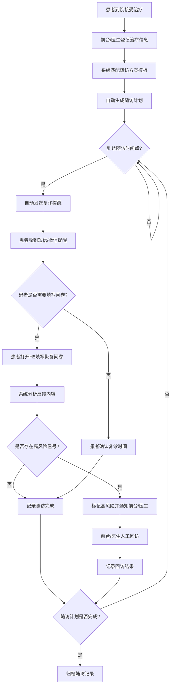

### 1.4.2 患者反馈与风险分级流程

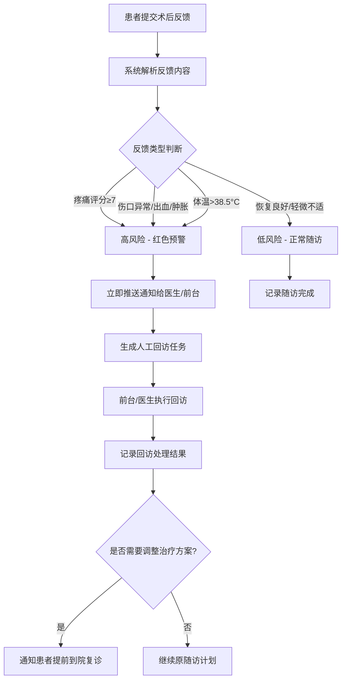

### 1.4.3 随访方案配置流程

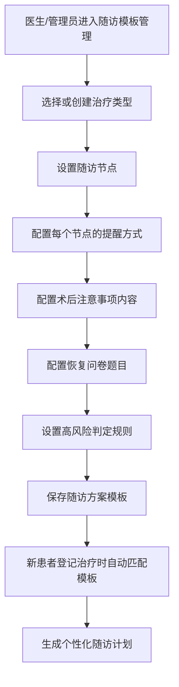

---

# 2. 功能原型

| 原型名称 | 原型链接 | 对应端 | 备注 |
| --- | --- | --- | --- |
| 诊所管理后台 | 待产品设计阶段输出 | WEB端 | 诊所管理员、医生、前台使用，PC浏览器访问 |
| 患者随访H5 | 待产品设计阶段输出 | 小程序端 | 患者通过微信/短信链接访问，移动端H5页面 |
| 随访任务引擎 | 待产品设计阶段输出 | 后台服务 | 定时任务调度、消息发送、风险评估等后台逻辑 |

---

# 3. 需求清单

## 3.1 诊所管理后台 - WEB端

### 3.1.1 机构与账号管理

| 模块 | 一级功能 | 二级功能 | 功能描述 | 备注 |
| --- | --- | --- | --- | --- |
| 机构管理 | 门店信息管理 | 门店基本信息维护 | 支持填写/编辑门店名称、地址、联系电话、营业时间等基础信息 | 每家门店独立管理 |
| 机构管理 | 门店信息管理 | 门店Logo与品牌信息 | 支持上传门店Logo，配置品牌色，用于患者端页面展示 | 增值功能：品牌化模板 |
| 账号管理 | 用户管理 | 添加/邀请用户 | 管理员可邀请医生、前台人员加入系统，通过手机号邀请 | |
| 账号管理 | 用户管理 | 角色权限分配 | 支持管理员、医生、前台三种角色，不同角色可见功能不同 | |
| 账号管理 | 用户管理 | 用户信息编辑 | 支持编辑用户姓名、手机号、角色、所属门店等信息 | |
| 订阅管理 | 订阅服务 | 订阅状态查看 | 展示当前门店订阅状态、到期时间、续费入口 | |
| 订阅管理 | 增值服务 | 短信额度购买 | 支持购买短信发送额度包，展示剩余额度和使用明细 | 增值服务 |
| 订阅管理 | 增值服务 | 品牌化模板开通 | 支持开通品牌化随访模板服务，自定义模板样式 | 增值服务 |
| 订阅管理 | 增值服务 | 满意度报表开通 | 支持开通患者满意度统计分析报表服务 | 增值服务 |

### 3.1.2 随访方案模板管理

| 模块 | 一级功能 | 二级功能 | 功能描述 | 备注 |
| --- | --- | --- | --- | --- |
| 治疗类型管理 | 治疗类型维护 | 治疗类型列表 | 展示已配置的治疗类型（种植、正畸、补牙、拔牙、根管治疗等） | |
| 治疗类型管理 | 治疗类型维护 | 新增/编辑治疗类型 | 支持自定义治疗类型名称和基础描述 | |
| 随访方案管理 | 随访节点配置 | 随访时间轴设置 | 按治疗类型设置多个随访节点，如术后1天、3天、7天、30天等 | 支持自定义天数 |
| 随访方案管理 | 随访节点配置 | 节点提醒方式配置 | 每个节点可配置提醒渠道（短信/微信/两者皆有） | |
| 随访方案管理 | 随访节点配置 | 术后注意事项配置 | 为每个随访节点配置术后注意事项内容，随提醒一并发送 | |
| 随访方案管理 | 问卷管理 | 恢复问卷配置 | 为每个随访节点配置术后恢复问卷题目（单选/多选/评分/文本） | |
| 随访方案管理 | 问卷管理 | 照片上传要求配置 | 设置是否需要患者上传术后照片，以及拍照指引说明 | |
| 随访方案管理 | 风险规则管理 | 高风险判定规则配置 | 设置哪些反馈信号触发高风险预警（如疼痛评分≥7、伤口异常等） | |
| 随访方案管理 | 风险规则管理 | 预警通知人员配置 | 设置高风险预警时通知哪些医生/前台人员 | |
| 随访方案管理 | 模板管理 | 系统预置模板 | 系统提供常见治疗类型的标准随访方案模板，可一键启用 | |
| 随访方案管理 | 模板管理 | 自定义模板保存 | 诊所可将自定义的随访方案保存为模板，供后续复用 | |

### 3.1.3 患者管理

| 模块 | 一级功能 | 二级功能 | 功能描述 | 备注 |
| --- | --- | --- | --- | --- |
| 患者档案管理 | 患者信息维护 | 患者基本信息录入 | 录入患者姓名、手机号、性别、年龄等基础信息 | |
| 患者档案管理 | 患者信息维护 | 患者列表与搜索 | 支持按姓名、手机号搜索患者，查看患者列表 | |
| 患者档案管理 | 患者信息维护 | 患者详情查看 | 查看患者基本信息、治疗记录、随访记录汇总 | |
| 治疗登记 | 治疗记录登记 | 新建治疗记录 | 为患者登记一次治疗，选择治疗类型、治疗日期、主治医生 | |
| 治疗登记 | 治疗记录登记 | 自动匹配随访方案 | 登记治疗时自动匹配对应的随访方案模板，生成随访计划 | |
| 治疗登记 | 治疗记录登记 | 随访计划预览与调整 | 生成后可预览随访计划时间轴，支持手动调整节点时间 | |
| 治疗登记 | 治疗记录管理 | 治疗记录列表 | 按时间倒序展示所有治疗记录，支持按治疗类型、医生筛选 | |
| 随访记录管理 | 随访记录查看 | 随访时间轴查看 | 以时间轴形式展示每位患者的随访执行记录 | |
| 随访记录管理 | 随访记录查看 | 反馈详情查看 | 查看患者每次随访提交的问卷回答和照片 | |
| 随访记录管理 | 随访记录查看 | 回访记录填写 | 前台/医生执行高风险回访后，记录回访处理结果 | |

### 3.1.4 随访任务管理

| 模块 | 一级功能 | 二级功能 | 功能描述 | 备注 |
| --- | --- | --- | --- | --- |
| 待跟进任务 | 任务列表 | 今日待跟进列表 | 展示当天需要跟进的患者列表，包含患者姓名、治疗类型、随访节点 | |
| 待跟进任务 | 任务列表 | 待跟进任务筛选 | 支持按治疗类型、风险等级、随访状态筛选待跟进任务 | |
| 待跟进任务 | 任务执行 | 手动发送提醒 | 对特定患者手动触发一次随访提醒（补充自动提醒） | |
| 待跟进任务 | 任务执行 | 发起人工回访 | 对高风险患者发起人工回访，记录回访内容 | |
| 待跟进任务 | 任务执行 | 任务完成标记 | 前台完成跟进后标记任务完成，系统记录完成时间 | |
| 风险预警 | 高风险提醒 | 高风险患者列表 | 单独展示被系统标记为高风险的患者列表 | |
| 风险预警 | 高风险提醒 | 实时预警通知 | 患者反馈触发高风险规则时，实时通知相关医生/前台 | 支持系统内通知 |
| 风险预警 | 高风险提醒 | 预警处理跟踪 | 记录每个高风险预警的处理状态（待处理/处理中/已处理） | |

### 3.1.5 消息渠道管理

| 模块 | 一级功能 | 二级功能 | 功能描述 | 备注 |
| --- | --- | --- | --- | --- |
| 短信渠道 | 短信配置 | 短信签名配置 | 配置短信发送签名（诊所名称） | |
| 短信渠道 | 短信配置 | 短信模板管理 | 配置短信提醒内容模板，支持变量替换（患者姓名、复诊时间等） | |
| 短信渠道 | 发送记录 | 短信发送记录 | 查看短信发送记录，包含发送时间、状态、接收号码 | |
| 微信渠道 | 微信配置 | 微信公众号授权 | 授权绑定诊所微信公众号，用于推送微信消息 | |
| 微信渠道 | 微信配置 | 微信消息模板配置 | 配置微信推送消息模板内容 | |
| 微信渠道 | 发送记录 | 微信发送记录 | 查看微信消息推送记录，包含发送时间和送达状态 | |

### 3.1.6 数据统计

| 模块 | 一级功能 | 二级功能 | 功能描述 | 备注 |
| --- | --- | --- | --- | --- |
| 随访统计 | 核心指标 | 随访完成率统计 | 统计各治疗类型的随访计划完成率 | |
| 随访统计 | 核心指标 | 随访及时率统计 | 统计随访任务在规定时间内完成的比例 | |
| 随访统计 | 核心指标 | 高风险预警统计 | 统计高风险预警数量、处理及时率 | |
| 满意度统计 | 满意度分析 | 患者满意度评分 | 汇总患者满意度评价分数（增值服务） | |
| 满意度统计 | 满意度分析 | 满意度趋势图 | 按月/季度展示满意度变化趋势（增值服务） | |
| 满意度统计 | 满意度分析 | 满意度报表导出 | 支持导出满意度统计报表为PDF/Excel（增值服务） | |
| 工作量统计 | 人员工作量 | 前台工作量统计 | 统计前台人员完成的随访任务数量和回访数量 | |
| 工作量统计 | 人员工作量 | 医生工作量统计 | 统计医生处理的高风险回访数量 | |

## 3.2 患者端 - H5端

### 3.2.1 身份验证与入口

| 模块 | 一级功能 | 二级功能 | 功能描述 | 备注 |
| --- | --- | --- | --- | --- |
| 身份验证 | 短信链接入口 | 令牌链接访问 | 患者通过短信/微信中的带令牌链接直接访问，无需注册登录 | 链接含一次性令牌 |
| 身份验证 | 手机号验证 | 手机号验证入口 | 通过输入手机号+验证码方式验证身份 | 备用入口 |
| 身份验证 | 就诊码验证 | 就诊码访问 | 通过诊所提供的就诊码访问个人随访页面 | |

### 3.2.2 随访任务查看与执行

| 模块 | 一级功能 | 二级功能 | 功能描述 | 备注 |
| --- | --- | --- | --- | --- |
| 随访首页 | 待办任务展示 | 今日待完成随访 | 展示当前需要完成的随访任务（问卷填写、照片上传等） | |
| 随访首页 | 待办任务展示 | 随访时间轴 | 以时间轴形式展示随访计划进度，已完成/待完成/已过期 | |
| 随访首页 | 消息提醒 | 复诊提醒查看 | 查看收到的复诊提醒详情，包含术后注意事项 | |
| 问卷填写 | 恢复问卷 | 术后恢复问卷填写 | 回答系统推送的术后恢复情况问卷（疼痛评分、恢复情况等） | |
| 问卷填写 | 恢复问卷 | 问卷暂存与提交 | 支持问卷中途暂存，稍后继续填写，最终提交 | |
| 照片反馈 | 术后拍照 | 拍照/相册上传 | 按拍照指引要求，拍摄或从相册选择术后恢复照片上传 | |
| 照片反馈 | 术后拍照 | 照片预览与重拍 | 上传前可预览照片，不满意可重拍 | |
| 照片反馈 | 照片历史 | 历史照片查看 | 查看历次随访上传的照片记录 | |
| 复诊预约 | 在线预约 | 选择复诊时间 | 根据提醒选择方便的复诊时间 | |
| 复诊预约 | 在线预约 | 预约确认与提醒 | 确认预约后系统生成预约记录，并在复诊前再次提醒 | |
| 满意度评价 | 服务评价 | 满意度评分 | 对本次随访服务进行满意度评分（1-5星） | |
| 满意度评价 | 服务评价 | 意见与建议 | 填写文字意见与建议 | |
| 历史记录 | 随访历史 | 历史随访记录 | 查看历次随访的问卷回答和照片记录 | |

## 3.3 后台服务

### 3.3.1 随访计划引擎

| 模块 | 一级功能 | 二级功能 | 功能描述 | 备注 |
| --- | --- | --- | --- | --- |
| 计划生成 | 自动计划生成 | 方案模板匹配 | 根据治疗类型自动匹配随访方案模板 | |
| 计划生成 | 自动计划生成 | 随访节点计算 | 根据治疗日期和随访方案自动计算各随访节点的具体日期 | |
| 计划生成 | 计划调整 | 手动计划调整 | 支持前台/医生手动调整随访计划节点时间 | |
| 任务调度 | 定时任务 | 随访任务触发 | 定时检查到达随访时间点的计划，触发提醒任务 | |
| 任务调度 | 定时任务 | 超时任务检测 | 检测超时未完成的随访任务，进行二次提醒或升级 | |

### 3.3.2 消息通知引擎

| 模块 | 一级功能 | 二级功能 | 功能描述 | 备注 |
| --- | --- | --- | --- | --- |
| 消息渲染 | 模板渲染 | 消息内容生成 | 根据消息模板和患者信息渲染最终发送内容 | |
| 消息渲染 | 模板渲染 | 多渠道内容适配 | 同一随访节点生成适配短信和微信的不同格式内容 | |
| 消息发送 | 短信发送 | 短信网关对接 | 对接短信服务商API发送短信 | |
| 消息发送 | 短信发送 | 发送状态跟踪 | 记录短信发送状态（发送中/已送达/失败） | |
| 消息发送 | 微信推送 | 微信消息推送 | 通过微信公众号推送模板消息 | |
| 消息发送 | 微信推送 | 推送状态跟踪 | 记录微信消息推送状态 | |
| 消息发送 | 发送策略 | 免打扰时段控制 | 设置消息发送的免打扰时段（如21:00-08:00不发送） | |
| 消息发送 | 发送策略 | 发送失败重试 | 消息发送失败后自动重试，超过重试次数标记失败 | |

### 3.3.3 风险评估引擎

| 模块 | 一级功能 | 二级功能 | 功能描述 | 备注 |
| --- | --- | --- | --- | --- |
| 反馈分析 | 自动分析 | 问卷答案解析 | 解析患者提交的问卷答案，提取关键指标 | |
| 反馈分析 | 自动分析 | 风险规则匹配 | 将患者反馈与高风险判定规则进行匹配 | |
| 反馈分析 | 自动分析 | 风险等级判定 | 根据匹配结果判定风险等级（高/中/低） | |
| 预警触发 | 预警通知 | 实时预警推送 | 高风险信号触发后实时推送通知给配置的接收人 | |
| 预警触发 | 预警通知 | 预警记录归档 | 记录每次预警的触发时间、原因、处理结果 | |

### 3.3.4 数据统计服务

| 模块 | 一级功能 | 二级功能 | 功能描述 | 备注 |
| --- | --- | --- | --- | --- |
| 数据采集 | 数据汇总 | 随访数据汇总 | 定时汇总随访完成率、及时率等核心指标 | |
| 数据采集 | 数据汇总 | 满意度数据汇总 | 汇总患者满意度评分数据 | |
| 报表服务 | 报表生成 | 随访统计报表 | 生成随访完成率、及时率等统计报表 | |
| 报表服务 | 报表生成 | 满意度统计报表 | 生成满意度分析报表（增值服务） | |
| 报表服务 | 报表导出 | 报表文件导出 | 支持将报表导出为PDF/Excel文件 | |

---

# 4. 非功能需求

## 4.1 使用界面需求

| 需求项 | 需求描述 |
|--------|----------|
| 诊所后台界面 | 简洁清晰的B端管理界面，适合非技术人员（前台）使用；主色调建议采用医疗行业常见的蓝色/绿色系 |
| 患者H5界面 | 移动端友好，大字体、大按钮，考虑中老年患者使用场景；页面加载速度快，减少等待 |
| 响应式布局 | 诊所后台适配1280px及以上分辨率的PC浏览器；患者H5适配主流手机屏幕尺寸（320px-428px） |
| 操作反馈 | 所有操作需有明确的成功/失败反馈；批量操作需显示进度 |
| 引导提示 | 首次使用提供简要操作引导；关键操作（如删除、发送）提供二次确认 |

## 4.2 软硬件环境需求

| 需求项 | 需求描述 |
|--------|----------|
| 诊所后台访问端 | 支持主流PC浏览器：Chrome 90+、Edge 90+、Firefox 90+、Safari 14+ |
| 患者H5访问端 | 支持iOS 12+ Safari、Android 8+ 默认浏览器、微信内置浏览器（iOS/Android） |
| 服务端部署 | 云端部署（推荐阿里云/腾讯云），支持容器化部署 |
| 数据库 | 关系型数据库（MySQL 8.0+ 或 PostgreSQL 13+） |
| 短信服务 | 对接主流短信服务商API（如阿里云短信、腾讯云短信） |
| 微信接入 | 对接微信公众号模板消息API |

## 4.3 性能需求

| 需求项 | 需求描述 |
|--------|----------|
| 页面加载时间 | 诊所后台首页加载时间 ≤ 3秒；患者H5页面加载时间 ≤ 2秒 |
| 接口响应时间 | 常规查询接口响应时间 ≤ 500ms；列表类接口响应时间 ≤ 1秒 |
| 消息发送延迟 | 随访提醒从触发到发送 ≤ 1分钟 |
| 并发支持 | 支持单诊所同时在线用户数 ≥ 20人；系统整体支持 ≥ 500家诊所同时使用 |
| 定时任务处理 | 支持每分钟处理 ≥ 1000条随访任务调度 |
| 数据存储 | 单诊所患者数据支持 ≥ 10000条；随访记录支持 ≥ 50000条 |

## 4.4 约束性需求

1. **不做HIS系统**：本系统不对接医院HIS系统，不处理医保结算等医疗核心业务
2. **不做电子病历**：不存储完整的电子病历，仅存储与随访相关的治疗摘要信息
3. **不做在线问诊**：不提供在线问诊功能，人工回访仅限电话/微信沟通
4. **患者隐私保护**：患者个人信息和医疗信息需加密存储，传输使用HTTPS
5. **短信发送合规**：短信内容需符合电信管理规定，不包含违规医疗宣传内容
6. **微信接入合规**：微信消息推送需符合微信平台规范，不滥用模板消息
7. **需要后台服务**：本系统需要后台服务支撑随访计划调度、消息发送、风险评估等功能

---

# 5. 接口需求

## 5.1 硬件接口需求

本系统为纯软件SaaS产品，不涉及硬件接口需求。

## 5.2 软件接口需求

| 模块 | 接口名称 | 输入 | 输出 | 功能描述 |
| --- | --- | --- | --- | --- |
| 消息通知 | 短信服务商API | 接收号码、短信内容、签名 | 发送状态（成功/失败）、消息ID | 对接短信服务商发送随访提醒短信 |
| 消息通知 | 微信公众号API | 用户OpenID、模板消息内容 | 推送结果（成功/失败） | 通过微信公众号推送随访提醒模板消息 |
| 消息通知 | 微信公众号授权API | 授权Code | AccessToken、用户信息 | 实现公众号授权绑定 |
| 患者端 | H5短链接服务 | 随访任务ID、患者ID | 带令牌的一次性访问链接 | 生成患者访问H5页面的短链接 |
| 外部系统 | 诊所现有系统（可选） | 患者基本信息、治疗记录 | 同步结果 | 预留接口，支持从诊所现有系统导入患者和治疗数据 |

## 5.4 通讯接口需求

| 需求项 | 需求描述 |
|--------|----------|
| HTTPS | 所有客户端与服务端通讯均使用HTTPS加密传输 |
| WebSocket（可选） | 诊所后台高风险预警实时推送使用WebSocket或长轮询 |

---

# 6. 附录

## 流程图

### 6.1 系统整体架构流程

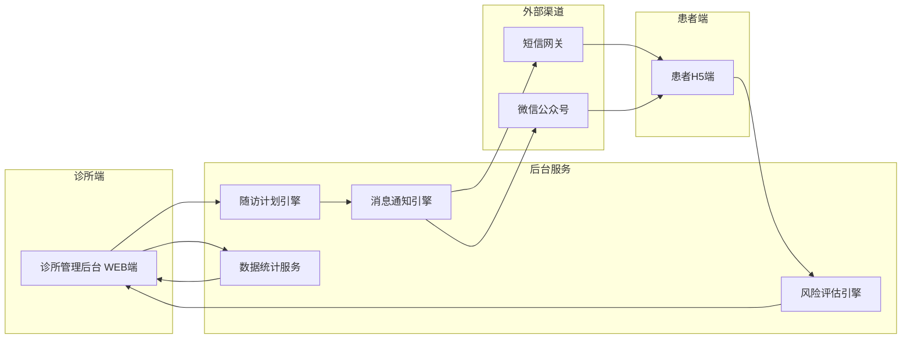

## 时序图

### 6.2 自动随访提醒时序

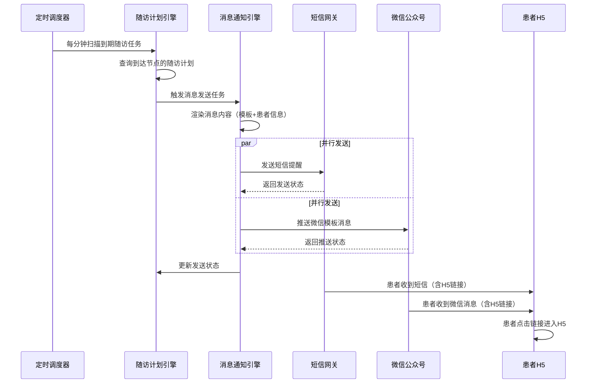

### 6.3 患者反馈与风险预警时序

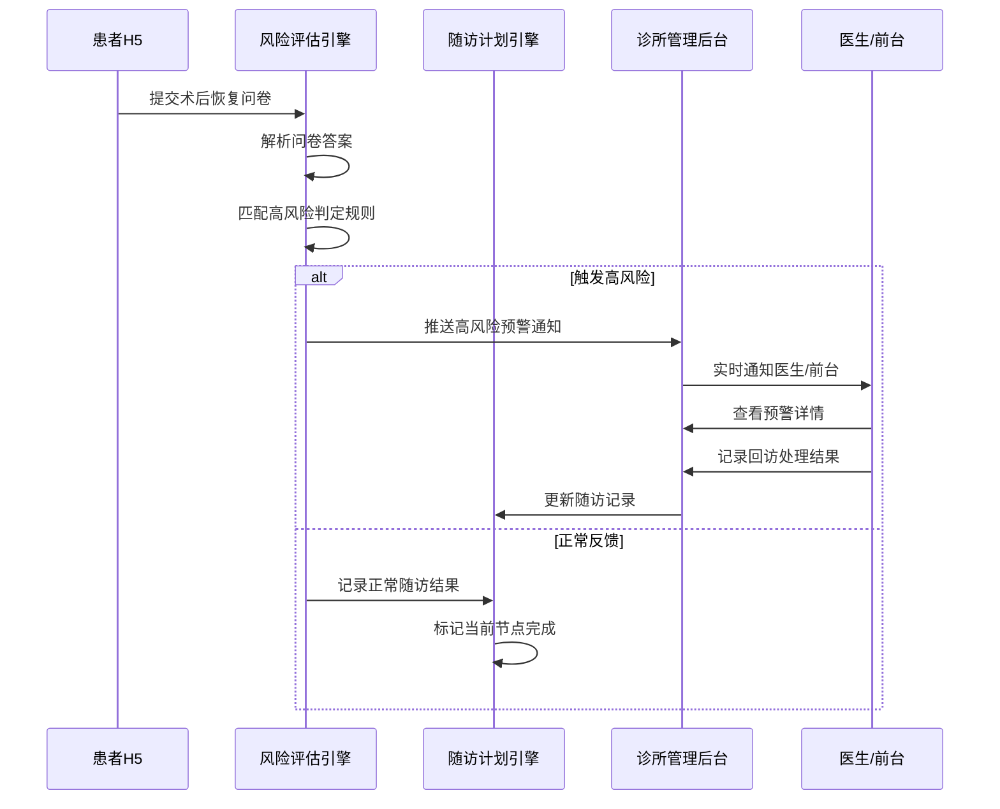

## （用户与系统交互）用例图

### 6.4 诊所管理员用例

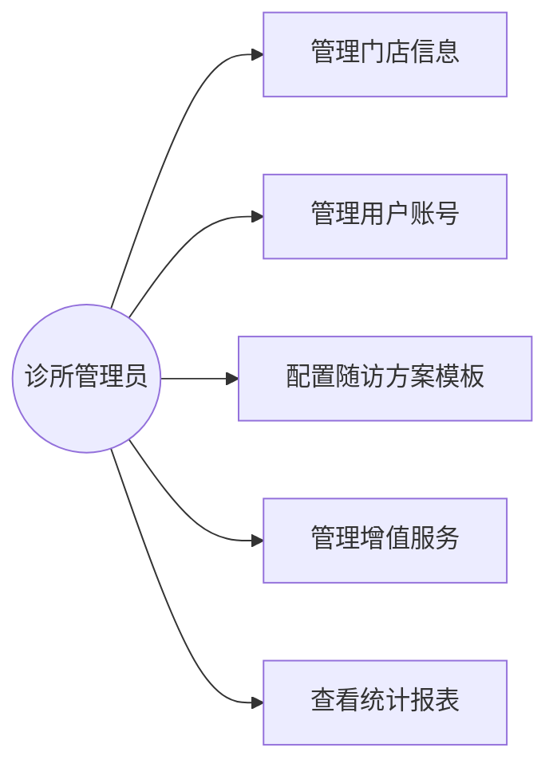

### 6.5 医生用例

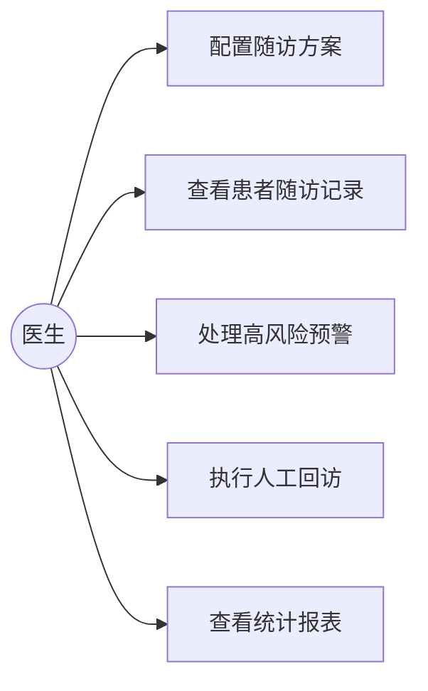

### 6.6 前台/客服用例

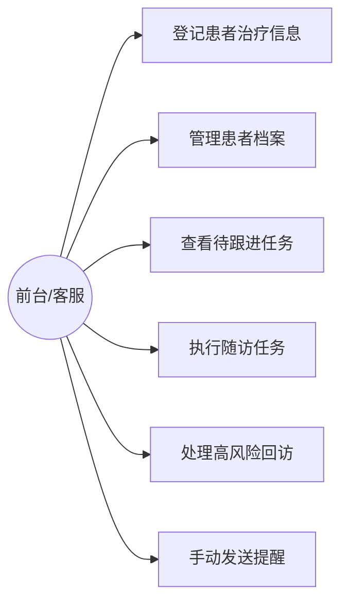

### 6.7 患者用例

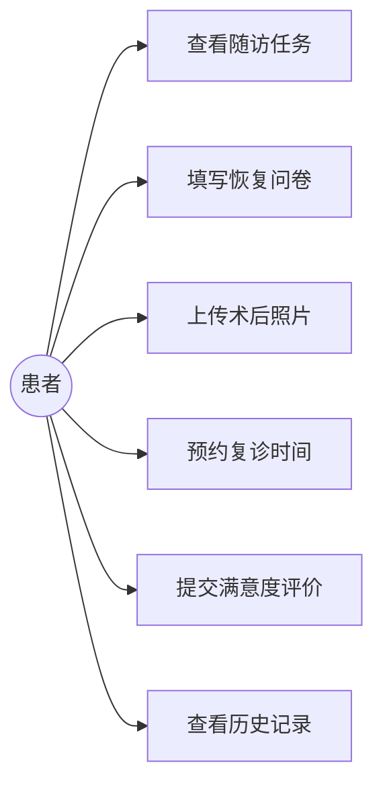

## （系统）状态图

### 6.8 随访任务状态流转

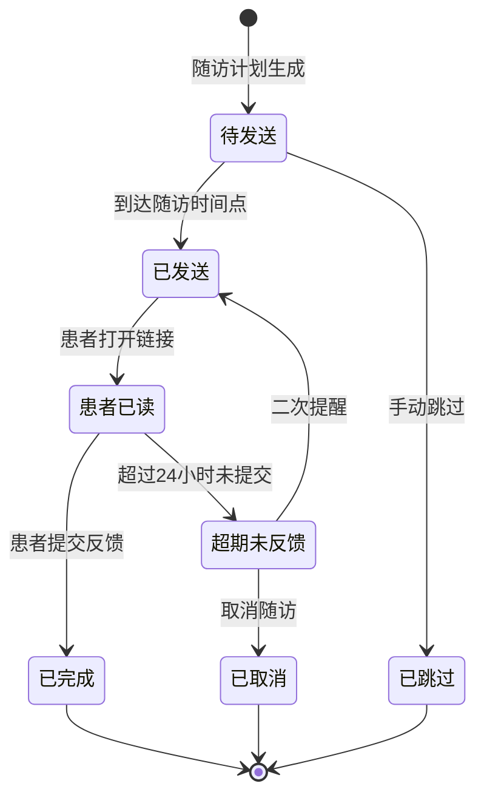

### 6.9 高风险预警状态流转

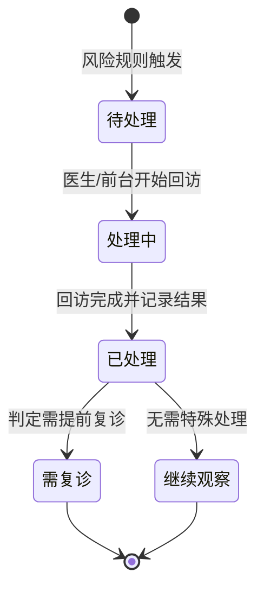
