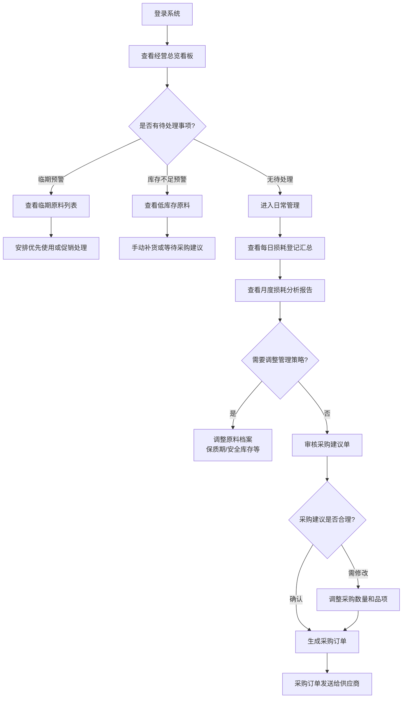
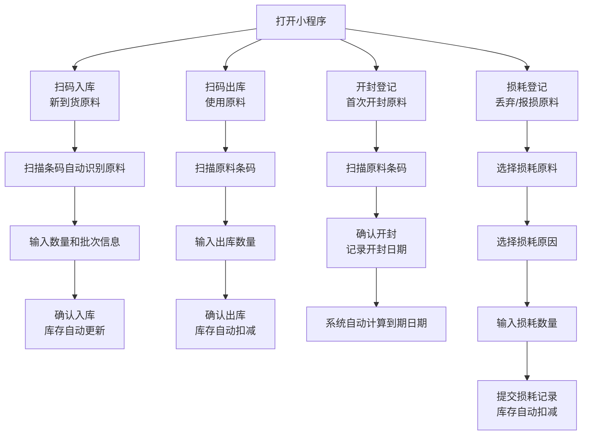
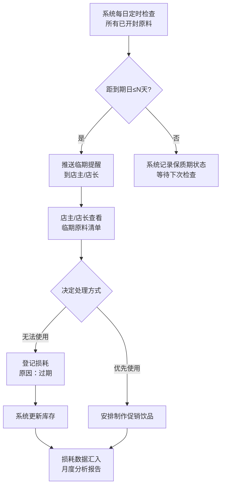
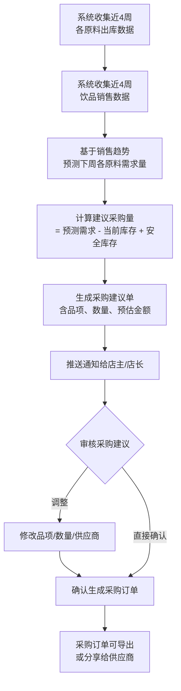
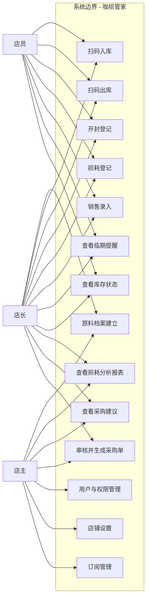
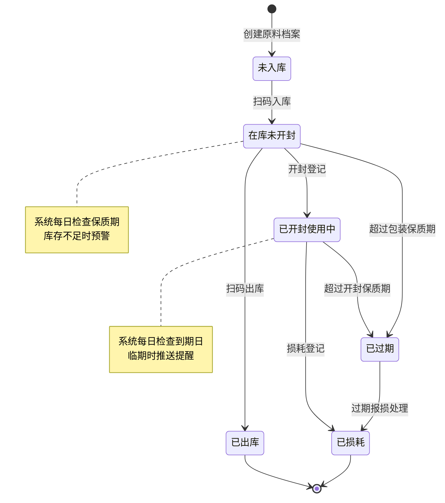
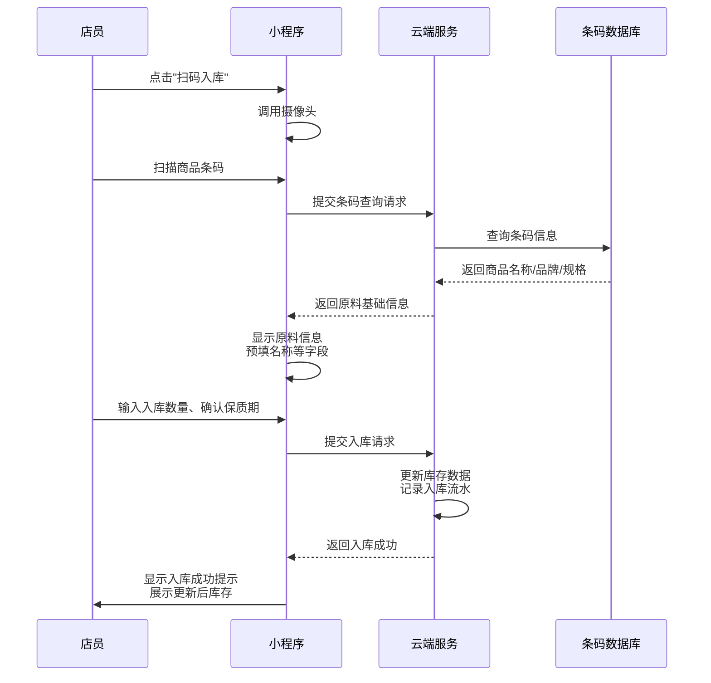

# 独立咖啡店原料损耗管理工具 — 用户需求说明书（URS）

---

# 1. 需求概述

## 1.1 需求介绍

独立咖啡店原料损耗管理工具（以下简称"咖损管家"）是一款面向中国独立咖啡店及小型连锁咖啡店的垂直行业管理工具。当前中国独立咖啡店数量超过12万家，店主在原料管理方面普遍面临以下痛点：原料过期浪费严重（平均每月损耗500-2000元）、库存管理依赖手工记账或记忆、采购量凭经验估算导致频繁断货或过量采购。

现有的库存管理工具（如库存大师等通用型工具）功能过于复杂，学习成本高，不适合小型咖啡店的使用场景。本产品聚焦"咖啡店原料损耗管理"这一垂直场景，以轻量、专注、低价为核心定位，帮助咖啡店店主实现原料的数字化管理，降低损耗成本。

### 1.1.1 所属领域

餐饮SaaS / 咖啡店垂直行业管理工具

## 1.2 需求目标

1. **降低原料损耗成本**：通过保质期追踪和临期提醒，帮助店主及时处理临期原料，将原料损耗率降低30%以上。
2. **简化库存操作流程**：通过扫码出入库替代手工记账，将单次出入库操作时间控制在10秒以内。
3. **量化损耗管理**：建立每日损耗记录机制，生成月度损耗率分析报告，让损耗可视化、可追溯。
4. **智能采购辅助**：基于销售数据预测采购需求，生成采购建议单，减少凭经验采购带来的断货或过量问题。
5. **轻量易用**：MVP版本7天内可上线，免费版支持20个SKU，满足独立咖啡店基本需求；Pro版（¥29/月）提供完整功能。

## 1.3 系统使用角色

| 角色 | 说明 | 主要使用场景 |
|------|------|-------------|
| 店主 | 咖啡店老板，拥有系统全部权限 | 查看经营数据、损耗分析、审批采购建议、管理店铺设置、管理订阅 |
| 店长 | 受店主委托管理日常运营（小型连锁中可管理多店） | 日常库存管理、损耗登记、生成采购单、查看本店报表 |
| 店员 | 执行日常出入库和损耗登记操作 | 扫码出入库、开封登记、损耗登记、查看临期提醒 |

## 1.4 业务流程图

### 1.4.1 店主/店长 — 日常管理主流程

### 1.4.2 店员 — 日常操作流程

### 1.4.3 临期提醒与损耗处理流程

### 1.4.4 采购预测与生成流程

# 2. 功能原型

| 原型名称 | 原型链接 | 对应端 | 备注 |
| --- | --- | --- | --- |
| 咖损管家-移动端 | 待产品文档阶段设计 | 小程序端 | 核心操作端：扫码出入库、开封登记、损耗登记、临期提醒查看、采购建议查看 |
| 咖损管家-管理端 | 待产品文档阶段设计 | WEB端 | 管理看板端：经营总览、损耗分析报表、采购管理、系统设置、多店管理（Pro版） |

# 3. 需求清单

## 3.1 移动端-小程序端

### 3.1.1 原料档案模块

| 模块 | 一级功能 | 二级功能 | 功能描述 | 备注 |
| --- | --- | --- | --- | --- |
| 原料档案 | 原料信息管理 | 扫码新建原料 | 扫描商品条码，自动填充原料名称、品牌、规格等基础信息，用户补充保质期和存储条件后保存 | 对接条码数据库自动识别 |
| 原料档案 | 原料信息管理 | 手动新建原料 | 手动填写原料名称、分类、单位、规格、供应商、保质期天数、开封后保质期天数、安全库存量等信息 | 分类预设：咖啡豆、牛奶、糖浆、茶叶、辅料、其他 |
| 原料档案 | 原料信息管理 | 编辑原料信息 | 修改已有原料的档案信息（名称、保质期、安全库存等） | 仅店主/店长可操作 |
| 原料档案 | 原料信息管理 | 原料分类管理 | 按分类（咖啡豆、牛奶、糖浆、茶叶、辅料等）筛选和查看原料列表 | 预置常用分类，支持自定义 |
| 原料档案 | 原料信息管理 | 原料搜索 | 通过原料名称或条码快速搜索定位原料 | 支持模糊搜索 |

### 3.1.2 库存管理模块

| 模块 | 一级功能 | 二级功能 | 功能描述 | 备注 |
| --- | --- | --- | --- | --- |
| 库存管理 | 入库操作 | 扫码入库 | 扫描商品条码自动识别原料，输入入库数量和批次号（可选），确认后库存自动增加 | 支持连续扫码批量入库 |
| 库存管理 | 入库操作 | 手动入库 | 从原料列表中选择原料，手动输入入库数量完成入库 | 用于条码损坏等无法扫码的场景 |
| 库存管理 | 出库操作 | 扫码出库 | 扫描原料条码识别品项，输入出库数量，确认后库存自动扣减 | 记录出库用途：制作饮品/其他 |
| 库存管理 | 出库操作 | 手动出库 | 从原料列表中选择原料，手动输入出库数量完成出库 | — |
| 库存管理 | 库存查看 | 实时库存查询 | 查看当前所有原料的库存数量、状态（正常/临期/过期/不足），支持按分类筛选 | 库存不足标红提示 |
| 库存管理 | 库存查看 | 库存预警 | 当某原料库存低于安全库存量时，在库存列表和首页看板显示预警提示 | 安全库存量由用户在原料档案中设定 |

### 3.1.3 保质期管理模块

| 模块 | 一级功能 | 二级功能 | 功能描述 | 备注 |
| --- | --- | --- | --- | --- |
| 保质期管理 | 开封管理 | 原料开封登记 | 扫描或选择原料，确认开封操作，系统记录开封日期并根据"开封后保质期天数"自动计算到期日期 | 同一原料可多次开封（不同批次） |
| 保质期管理 | 保质期追踪 | 保质期状态查看 | 查看每个已开封原料的开封日期、到期日期、剩余天数，按紧急程度排序显示 | 颜色标识：绿色(>7天)、黄色(3-7天)、红色(≤3天) |
| 保质期管理 | 保质期追踪 | 未开封保质期追踪 | 查看未开封原料的生产日期和保质期到期日，追踪存储中的过期风险 | 入库时记录生产日期和保质期 |
| 保质期管理 | 临期提醒 | 临期消息推送 | 当原料距到期日≤设定阈值（默认3天）时，向店主/店长推送微信服务通知 | 提醒阈值可在系统设置中调整 |
| 保质期管理 | 临期提醒 | 临期原料清单 | 在小程序首页展示当前所有临期原料清单，标注剩余天数和处理建议 | 按剩余天数升序排列 |

### 3.1.4 损耗管理模块

| 模块 | 一级功能 | 二级功能 | 功能描述 | 备注 |
| --- | --- | --- | --- | --- |
| 损耗管理 | 损耗登记 | 新增损耗记录 | 选择或扫描损耗原料，选择损耗原因（过期/变质/操作失误/其他），输入损耗数量，可附加备注，提交后库存自动扣减 | 必填项：原料、原因、数量 |
| 损耗管理 | 损耗登记 | 快捷损耗登记 | 对临期提醒中列出的原料一键发起损耗登记，自动带入原料信息和损耗原因"过期" | 减少操作步骤 |
| 损耗管理 | 损耗记录 | 损耗历史查看 | 按日期范围查看损耗记录列表，支持按原料品项、损耗原因筛选 | 支持按日/周/月切换视图 |
| 损耗管理 | 损耗统计 | 损耗率快速统计 | 在移动端展示当月损耗金额、损耗率、损耗笔数等关键指标 | 详细分析在Web端 |

### 3.1.5 销售记录模块

| 模块 | 一级功能 | 二级功能 | 功能描述 | 备注 |
| --- | --- | --- | --- | --- |
| 销售记录 | 销售录入 | 饮品销售登记 | 手动录入当日各饮品的销售杯数，支持快速+1操作和数字键盘输入 | 用于采购预测的数据基础 |
| 销售记录 | 销售录入 | 饮品原料配方关联 | 预设饮品与原料的用量对应关系（如：一杯拿铁=18g咖啡豆+200ml牛奶），系统自动换算原料消耗量 | 店主/店长可编辑配方 |
| 销售记录 | 销售查看 | 销售数据汇总 | 查看各饮品近期销售数据汇总（日/周/月维度） | 为采购预测提供数据支撑 |

### 3.1.6 消息通知模块

| 模块 | 一级功能 | 二级功能 | 功能描述 | 备注 |
| --- | --- | --- | --- | --- |
| 消息通知 | 通知接收 | 临期提醒通知 | 接收原料临期的微信服务通知，点击进入临期原料清单 | 基于微信订阅消息 |
| 消息通知 | 通知接收 | 库存不足通知 | 接收原料库存低于安全库存的通知 | — |
| 消息通知 | 通知接收 | 采购建议通知 | 每周固定时间（如周日晚）收到采购建议推送 | Pro版功能 |
| 消息通知 | 通知管理 | 通知设置 | 管理各类通知的开关和提醒时间 | — |

## 3.2 Web管理端

### 3.2.1 经营总览模块

| 模块 | 一级功能 | 二级功能 | 功能描述 | 备注 |
| --- | --- | --- | --- | --- |
| 经营总览 | 数据看板 | 核心指标看板 | 首页展示当日/本周/本月的关键指标：库存总量、损耗金额、损耗率、待处理临期数、库存预警数 | 数据实时刷新 |
| 经营总览 | 数据看板 | 待办事项提醒 | 在看板顶部集中展示待处理事项：临期原料数量、低库存预警数量、待审核采购单数量 | 点击可跳转至对应功能页 |

### 3.2.2 原料档案库模块

| 模块 | 一级功能 | 二级功能 | 功能描述 | 备注 |
| --- | --- | --- | --- | --- |
| 原料档案库 | 档案管理 | 原料列表管理 | 以表格形式展示所有原料信息，支持按分类、状态、关键词搜索和排序 | 支持批量导入原料档案（Excel） |
| 原料档案库 | 档案管理 | 批量导入原料 | 通过Excel模板批量导入原料档案信息 | 提供标准模板下载 |
| 原料档案库 | 档案管理 | 原料数据导出 | 导出原料档案为Excel文件 | — |

### 3.2.3 库存管理模块（Web端）

| 模块 | 一级功能 | 二级功能 | 功能描述 | 备注 |
| --- | --- | --- | --- | --- |
| 库存管理 | 库存看板 | 全量库存总览 | 以看板形式展示所有原料库存状态，通过颜色区分正常(绿)/低库存(黄)/临期(橙)/过期(红) | — |
| 库存管理 | 库存看板 | 库存变动明细 | 查看指定原料的出入库和损耗流水记录，支持按日期和操作类型筛选 | 每笔记录含操作人、时间、数量、类型 |
| 库存管理 | 出入库管理 | Web端出入库 | 在Web端手动录入出入库记录（适用于补录或批量操作场景） | 与小程序端数据实时同步 |

### 3.2.4 损耗分析模块

| 模块 | 一级功能 | 二级功能 | 功能描述 | 备注 |
| --- | --- | --- | --- | --- |
| 损耗分析 | 损耗概览 | 损耗趋势图 | 以折线图展示日/周/月损耗金额和损耗率的变化趋势 | 支持时间范围选择 |
| 损耗分析 | 损耗概览 | 损耗品项TOP排行 | 以柱状图展示损耗金额/数量最高的原料排行 | 快速识别损耗重点品项 |
| 损耗分析 | 损耗明细 | 损耗原因分析 | 以饼图展示各损耗原因（过期/变质/操作失误/其他）的占比分布 | — |
| 损耗分析 | 损耗明细 | 损耗记录明细表 | 以表格展示所有损耗记录，支持按日期、原料、原因、操作人多维度筛选 | 支持导出Excel |
| 损耗分析 | 损耗报告 | 月度损耗报告 | 自动生成月度损耗报告，包含：总损耗金额、损耗率、同比/环比、损耗TOP品项、损耗原因分布、改进建议 | Pro版功能；每月1日自动生成上月报告 |

### 3.2.5 采购管理模块

| 模块 | 一级功能 | 二级功能 | 功能描述 | 备注 |
| --- | --- | --- | --- | --- |
| 采购管理 | 销售报表 | 饮品销售报表 | 展示各饮品日/周/月销量排行、趋势图、原料消耗换算表 | 数据来源于移动端录入 |
| 采购管理 | 采购预测 | 智能采购预测 | 基于近4周销售数据和当前库存，按原料预测下周需求量，计算建议采购量（预测需求-当前库存+安全库存） | Pro版功能 |
| 采购管理 | 采购预测 | 季节性趋势参考 | 展示去年同期销售趋势作为采购预测的参考依据 | Pro版功能；需积累足够历史数据 |
| 采购管理 | 采购建议单 | 生成采购建议单 | 系统自动生成采购建议单，包含：原料名称、建议采购量、预估单价、预估总额、供应商信息 | Pro版功能 |
| 采购管理 | 采购建议单 | 编辑与审核 | 店主/店长可修改采购建议单中的品项、数量、供应商等信息后确认 | — |
| 采购管理 | 采购建议单 | 采购单导出与分享 | 将确认后的采购单导出为PDF/图片，或通过微信分享给供应商 | — |
| 采购管理 | 采购记录 | 历史采购记录 | 查看过往采购订单记录，支持按日期、供应商筛选 | 便于对账和追溯 |

### 3.2.6 系统设置模块

| 模块 | 一级功能 | 二级功能 | 功能描述 | 备注 |
| --- | --- | --- | --- | --- |
| 系统设置 | 用户管理 | 成员邀请与管理 | 店主通过手机号或微信邀请店员/店长加入，设置角色权限 | — |
| 系统设置 | 用户管理 | 角色权限配置 | 配置店主/店长/店员各角色的功能权限 | 预设默认权限，可自定义 |
| 系统设置 | 店铺管理 | 店铺信息设置 | 设置店铺名称、地址、联系方式、营业时间等基本信息 | — |
| 系统设置 | 店铺管理 | 多店管理 | 在Pro版中管理多家门店，切换查看各店数据 | Pro版功能 |
| 系统设置 | 参数设置 | 提醒阈值设置 | 配置临期提醒天数（默认3天）、库存预警规则等 | — |
| 系统设置 | 参数设置 | 饮品配方管理 | 管理饮品与原料的用量对应关系 | 用于销售换算原料消耗 |
| 系统设置 | 订阅管理 | 套餐与订阅 | 查看当前套餐（免费版/Pro版），管理订阅续费、升级、降级 | — |
| 系统设置 | 订阅管理 | 免费版限制管理 | 免费版SKU数量上限（20个）提醒和升级引导 | 接近上限时提醒 |

# 4. 非功能需求

## 4.1 使用界面需求

| 需求项 | 描述 |
|--------|------|
| 移动端界面风格 | 简洁清爽，以卡片式布局为主，适配手机竖屏操作，大按钮设计方便吧台湿手操作 |
| 管理端界面风格 | 专业简洁，数据看板风格，左侧导航+右侧内容区的经典后台布局 |
| 操作效率 | 高频操作（扫码出入库、损耗登记）步骤不超过3步，核心操作耗时<10秒 |
| 新手引导 | 首次使用时提供简要操作引导，帮助店主快速上手 |
| 视觉状态反馈 | 库存状态、保质期状态通过颜色编码直观区分（绿/黄/橙/红） |

## 4.2 软硬件环境需求

| 需求项 | 描述 |
|--------|------|
| 移动端运行环境 | 微信小程序（iOS 12+ / Android 7.0+），依托微信生态，无需下载安装 |
| Web端运行环境 | 主流浏览器：Chrome 90+、Safari 14+、Edge 90+、Firefox 90+ |
| 移动端硬件要求 | 需支持摄像头（用于扫码），建议支持自动对焦 |
| 网络环境 | 需联网使用，支持4G/WiFi，弱网环境下需支持基本操作（离线暂存，联网后同步） |

## 4.3 性能需求

| 需求项 | 指标 |
|--------|------|
| 扫码识别响应时间 | ≤ 1秒（从对焦到识别成功） |
| 页面加载时间 | 首屏加载 ≤ 2秒（4G网络环境下） |
| 出入库操作响应 | 提交后数据更新 ≤ 1秒 |
| 库存数据实时性 | 多端数据同步延迟 ≤ 3秒 |
| 并发用户支持 | 单店支持5人同时操作不卡顿 |
| 数据存储容量 | 单店支持1000个SKU、10万条出入库记录、5万条损耗记录 |

## 4.4 约束性需求

1. **轻量级定位**：本系统为轻量级垂直工具，不做通用库存管理系统，不覆盖餐饮全品类（仅限咖啡店原料场景）。
2. **MVP周期约束**：首版MVP开发周期不超过7天，需聚焦核心功能（原料档案 + 扫码出入库 + 临期提醒 + 损耗登记 + 采购建议）。
3. **免费版SKU限制**：免费版最多支持20个SKU，超出需升级Pro版。
4. **不实现的功能**：
   - 不对接POS收银系统（销售数据由用户手动录入）
   - 不提供财务对账和发票管理功能
   - 不做供应商在线交易平台
   - 不提供员工排班和考勤功能
5. **后台服务需求**：本系统需要云端后台服务支撑，包括用户认证、数据存储、定时任务（临期检查、采购预测）、消息推送等能力。

# 5. 接口需求

## 5.1 硬件接口需求

| 需求项 | 描述 |
|--------|------|
| 摄像头 | 调用手机摄像头进行商品条码扫描（EAN-13/Code 128等常见条码格式） |

## 5.2 软件接口需求

| 模块 | 接口名称 | 输入 | 输出 | 功能描述 |
| --- | --- | --- | --- | --- |
| 用户认证 | 微信登录接口 | 微信授权code | 用户openid、unionid、头像昵称 | 对接微信小程序登录能力，实现一键登录注册 |
| 消息通知 | 微信订阅消息接口 | 消息模板ID、接收者openid、模板数据 | 发送结果状态 | 发送临期提醒、库存预警、采购建议等通知 |
| 条码识别 | 商品条码查询接口 | 商品条码编号 | 商品名称、品牌、规格等基础信息 | 扫码后自动填充原料基础信息，降低手动录入成本 |
| 原料档案 | 批量导入导出接口 | Excel文件（导入）/ 原料数据集（导出） | 导入结果/Excel文件 | 支持原料档案的批量导入和导出 |
| 采购管理 | 文件生成与分享接口 | 采购单数据 | PDF/图片文件 | 生成采购建议单的文件导出和微信分享 |

## 5.4 通讯接口需求

| 需求项 | 描述 |
|--------|------|
| 网络协议 | HTTPS（所有数据传输加密） |
| 数据同步 | 移动端与Web端通过云端API实时同步数据 |
| 推送通道 | 微信订阅消息（服务端主动推送临期提醒等通知） |

# 6. 附录

## （用户与系统交互）用例图

## （系统）状态图 — 原料生命周期

## 核心业务流程时序图 — 扫码入库

