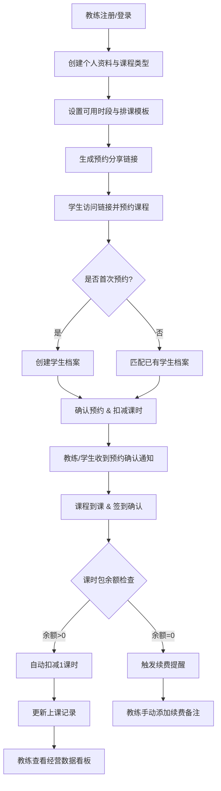
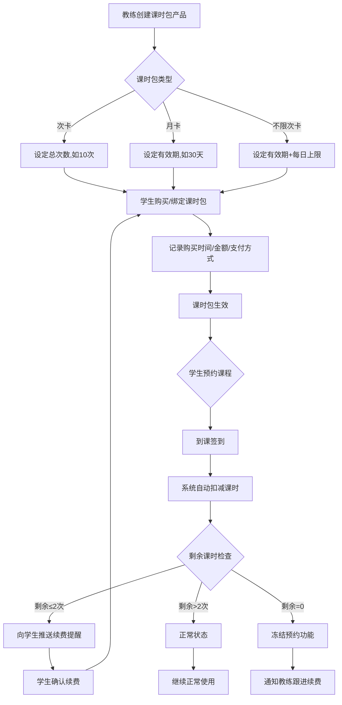
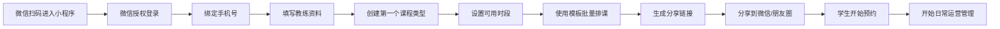
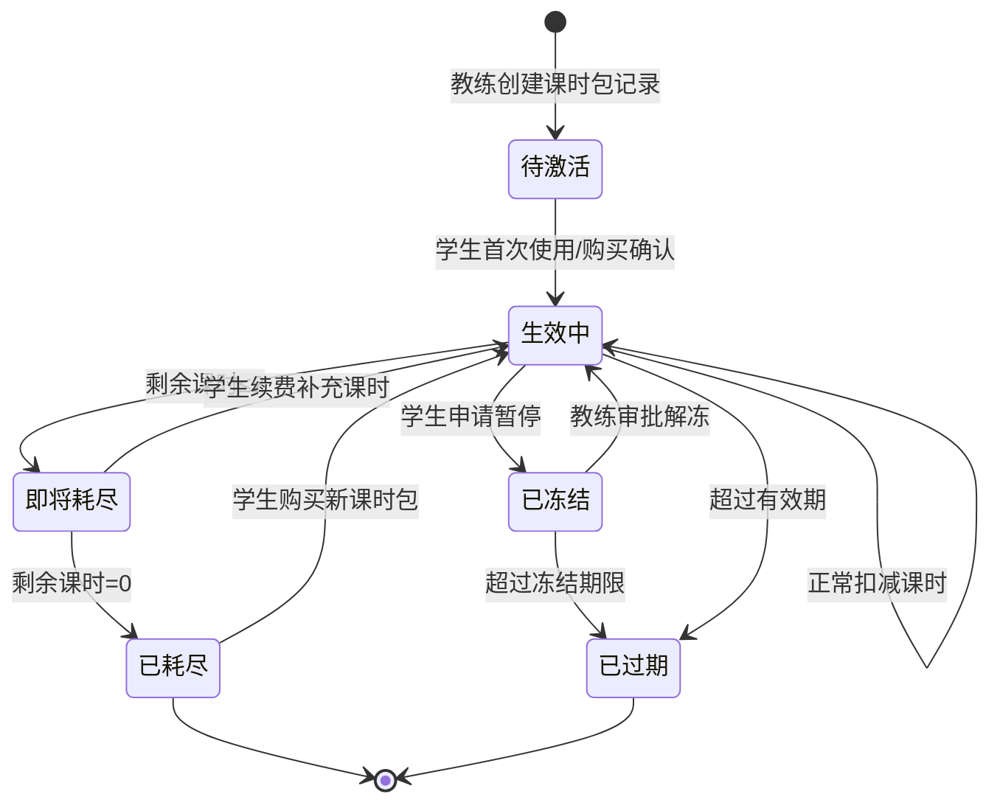
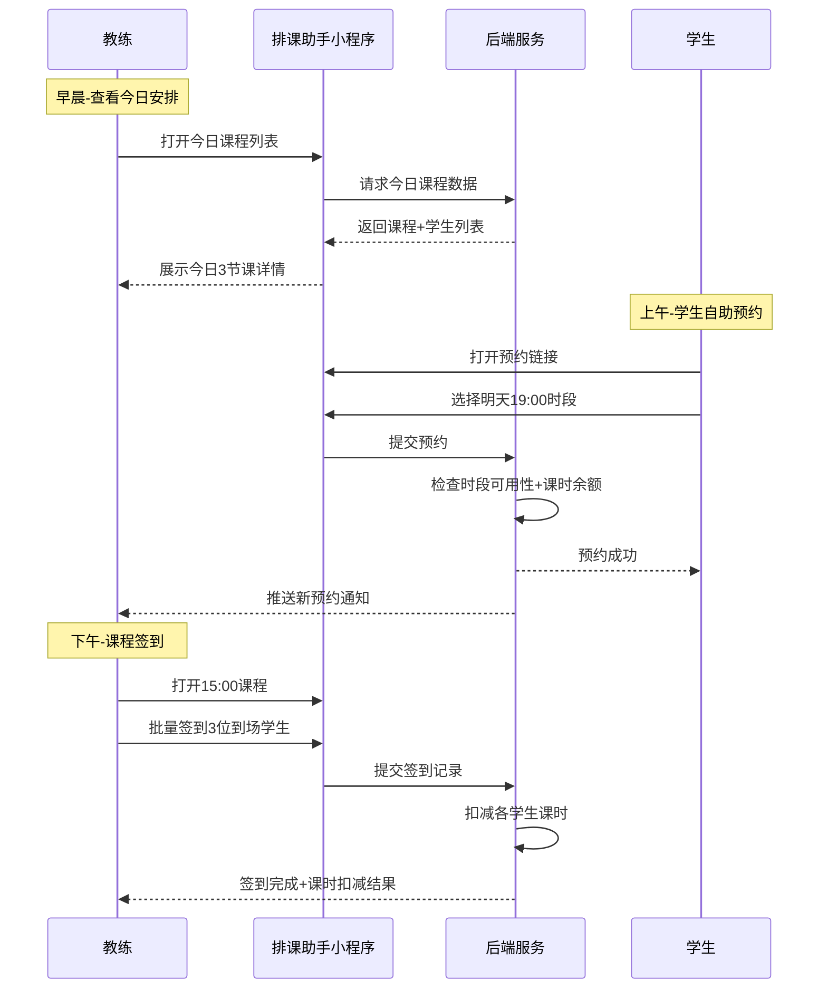

# 1. 需求概述

## 1.1 需求介绍

"瑜伽健身教练排课与学生管理助手"（以下简称"排课助手"）是一款面向独立瑜伽教练、私人健身教练及小型合伙工作室的轻量级业务管理工具。产品聚焦"排课—学生—课时"三大核心模块，帮助独立教练摆脱微信群+Excel的低效管理模式，以移动端优先的方式完成日常排课、学生管理、课时扣减与收款提醒等高频业务操作。

### 1.1.1 所属领域

垂直行业SaaS — 健身/瑜伽行业独立教练管理工具

## 1.2 需求目标

1. **降低管理成本**：将排课、学生信息管理、课时管理从微信/纸质迁移到统一的数字化平台，减少教练每天30分钟以上的重复沟通与手工记账时间。
2. **提升学生体验**：学生通过分享链接即可自助查看可用时段并预约课程，无需下载App或注册复杂账号。
3. **减少财务纠纷**：课时包自动扣减、余额实时可查、到期自动提醒，避免课时记录不透明导致的信任问题。
4. **轻量化与聚焦**：不做出入馆管理、器械管理、会员管理等健身房重功能，仅聚焦独立教练最核心的三个场景，确保10-14天可交付MVP。
5. **商业化可持续**：通过免费版（1教练+10学生）引流，Pro版（¥29/月）实现营收，目标转化率5%-10%。

## 1.3 系统使用角色

| 角色 | 说明 |
|------|------|
| 教练（Coach） | 系统的主要使用者和管理者。独立教练或工作室合伙人，负责创建课程、管理学生、设置课时包、查看经营数据。 |
| 学生（Student） | 教练的学员。通过教练分享的链接访问预约页面，查看可用时段、自助预约/取消课程、查看自己的课时余额和上课记录。 |
| 工作室管理员（Studio Admin） | Pro版角色，适用于2-3人合伙的小型工作室。可管理多位教练的排课、查看工作室整体数据、分配权限。 |

## 1.4 业务流程图

### 1.4.1 核心业务流程总览



### 1.4.2 学生自助预约流程

```mermaid
sequenceDiagram
    participant S as 学生
    participant Link as 预约分享链接(H5)
    participant Sys as 排课助手系统
    participant C as 教练

    S->>Link: 打开教练分享的预约链接
    Link->>Sys: 请求可用时段列表
    Sys-->>Link: 返回未来7天可用时段
    Link-->>S: 展示日历视图+时段列表
    S->>Link: 选择时段 & 填写姓名手机号
    Link->>Sys: 提交预约请求
    Sys->>Sys: 检查时段是否已满/冲突
    Sys->>Sys: 检查学生课时余额
    Sys-->>Link: 返回预约结果
    Link-->>S: 显示预约成功+课程信息
    Sys-->>C: 推送新预约通知(微信服务号/短信)
    S->>Link: 需要取消预约
    Link->>Sys: 提交取消请求
    Sys->>Sys: 检查取消时限(开课前2小时)
    Sys-->>Link: 返回取消结果
    Sys-->>C: 推送取消通知
```

### 1.4.3 课时包管理与扣减流程



# 2. 功能原型

| 原型名称 | 原型链接 | 对应端 | 备注 |
| --- | --- | --- | --- |
| 教练端-排课管理 | 待设计 | 小程序端 | 教练日常使用的核心界面，含排课日历、学生列表、课时管理 |
| 教练端-经营数据 | 待设计 | 小程序端 | 收入统计、课时消耗趋势、学生增长曲线 |
| 学生预约页 | 待设计 | 小程序端 | 学生通过分享链接访问的H5页面，含日历选择、时段预约 |
| 学生端-我的课程 | 待设计 | 小程序端 | 学生查看自己的上课记录、课时余额、预约历史 |
| 工作室管理端 | 待设计 | 小程序端 | Pro版功能，管理员管理多位教练和工作室数据 |

# 3. 需求清单

## 3.1 教练端-小程序端

| 模块 | 一级功能 | 二级功能 | 功能描述 | 备注 |
| --- | --- | --- | --- | --- |
| 账号与设置 | 注册/登录 | 微信一键登录 | 教练通过微信授权快速登录，无需输入账号密码 | P0 |
| 账号与设置 | 注册/登录 | 手机号绑定 | 首次登录后绑定手机号，用于接收预约通知短信 | P0 |
| 账号与设置 | 个人资料 | 教练信息编辑 | 设置头像、昵称、简介、教学领域（瑜伽/普拉提/健身等）、从业年限 | P0 |
| 账号与设置 | 个人资料 | 资质认证 | 上传教练资质证书（选填），认证后显示认证标识提升信任度 | P2 |
| 账号与设置 | 工作室管理 | 创建工作室 | Pro版功能，创建工作室并邀请其他教练加入 | P1 |
| 账号与设置 | 工作室管理 | 教练成员管理 | 添加/移除工作室教练成员，设置权限 | P1 |
| 课程管理 | 课程类型 | 创建课程类型 | 创建课程分类，如：1对1私教课、2-4人小班课、10人团课 | P0 |
| 课程管理 | 课程类型 | 设置课程参数 | 设置每类课程的时长（默认60分钟）、价格、最大人数、颜色标识 | P0 |
| 课程管理 | 课程类型 | 启用/停用课程 | 临时停用某类课程（如假期暂停团课），不影响已有预约 | P1 |
| 排课管理 | 排课日历 | 周视图排课 | 以周日历形式展示所有课程安排，支持左右滑动切换周 | P0 |
| 排课管理 | 排课日历 | 日视图排课 | 以单日时间轴形式展示当天课程详情，适合密集排课日 | P1 |
| 排课管理 | 快速排课 | 创建单次课程 | 选择日期、时间、课程类型、地点，生成一节课 | P0 |
| 排课管理 | 快速排课 | 模板排课 | 设置每周固定模板（如每周一三五19:00团课），一键批量生成未来4周课程 | P0 |
| 排课管理 | 快速排课 | 复制课程 | 复制已有课程到另一天/另一时段，减少重复操作 | P1 |
| 排课管理 | 课程调整 | 修改课程 | 修改课程时间、地点、最大人数，已预约学生收到变更通知 | P0 |
| 排课管理 | 课程调整 | 取消课程 | 取消某节课，已预约学生自动收到取消通知并释放课时 | P0 |
| 排课管理 | 课程调整 | 调课/换课 | 将课程从一天调整到另一天，自动通知受影响学生 | P1 |
| 排课管理 | 可用时段设置 | 设置工作时间 | 设定每周哪些天、哪些时段可以排课（如周一至周五 9:00-21:00） | P0 |
| 排课管理 | 可用时段设置 | 设置休息日 | 标记特定日期为休息日（如法定节假日），该日不可排课 | P0 |
| 排课管理 | 可用时段设置 | 临时封锁时段 | 临时封锁某个时段（如教练出差），已有预约需提前通知学生 | P1 |
| 预约管理 | 预约列表 | 查看今日课程 | 展示今天所有课程及每节课的已预约学生列表 | P0 |
| 预约管理 | 预约列表 | 查看预约详情 | 点击某节课查看预约学生名单、联系方式、备注信息 | P0 |
| 预约管理 | 预约操作 | 手动添加预约 | 教练替学生手动添加预约（适用于电话/微信预约的学生） | P0 |
| 预约管理 | 预约操作 | 确认/拒绝候补 | 课程满员时学生可加入候补，有空位时教练确认候补学生 | P1 |
| 预约管理 | 签到管理 | 到课签到 | 教练在课程开始时一键签到所有到场学生 | P0 |
| 预约管理 | 签到管理 | 未到课标记 | 标记未到课学生（缺席），根据规则决定是否扣课时 | P0 |
| 预约管理 | 签到管理 | 批量签到 | 一键签到当前课程所有已预约学生 | P1 |
| 学生管理 | 学生列表 | 全部学生 | 按添加时间/最近上课时间排序，显示学生姓名、头像、剩余课时 | P0 |
| 学生管理 | 学生列表 | 搜索学生 | 按姓名/手机号搜索学生 | P0 |
| 学生管理 | 学生列表 | 学生标签 | 给学生打标签（如VIP、体验课、需关注），方便分类管理 | P2 |
| 学生管理 | 学生档案 | 基本信息 | 姓名、手机号、性别、生日、来源渠道 | P0 |
| 学生管理 | 学生档案 | 身体信息 | 身高、体重、伤病史、过敏信息、运动基础（教练手动记录） | P0 |
| 学生管理 | 学生档案 | 上课记录 | 按时间倒序展示该学生所有上课记录：日期、课程类型、签到状态 | P0 |
| 学生管理 | 学生档案 | 备注功能 | 教练为学生添加文字备注（如"今天腰不舒服，避免前屈"） | P1 |
| 学生管理 | 学生档案 | 学生画像 | 综合展示学生上课频率、续课率、偏好课程类型等数据 | P2 |
| 课时管理 | 课时包产品 | 创建课时包 | 设置课时包名称、类型（次卡/月卡）、次数/天数、价格、有效期 | P0 |
| 课时管理 | 课时包产品 | 课时包模板 | 预设常用课时包模板（如10次卡、20次卡、月卡、季卡） | P1 |
| 课时管理 | 课时包产品 | 启用/停用课时包 | 停用后的课时包不再出现在学生购买列表中，已购买的不受影响 | P1 |
| 课时管理 | 学生课时 | 绑定课时包 | 教练为学生手动绑定已购买的课时包 | P0 |
| 课时管理 | 学生课时 | 查看课时余额 | 查看每位学生的课时包剩余次数/剩余天数 | P0 |
| 课时管理 | 学生课时 | 手动调整课时 | 教练手动增减学生课时（适用于赠送课时、课时纠错等场景） | P0 |
| 课时管理 | 学生课时 | 课时冻结 | 学生因出差/生病申请暂停课时，教练审批后冻结有效期 | P1 |
| 课时管理 | 收款管理 | 记录收款 | 记录每笔课时包收款：金额、支付方式（微信/支付宝/现金）、备注 | P0 |
| 课时管理 | 收款管理 | 待收款提醒 | 课时即将用完（≤2次）的学生列表，提醒教练跟进续费 | P0 |
| 课时管理 | 收款管理 | 收款统计 | 按月/周统计收款总额、新购课时包数量 | P1 |
| 消息通知 | 通知设置 | 通知渠道 | 选择通知方式：微信服务号推送、短信通知 | P0 |
| 消息通知 | 通知事件 | 新预约通知 | 有新学生预约时实时通知教练 | P0 |
| 消息通知 | 通知事件 | 取消预约通知 | 学生取消预约时通知教练 | P0 |
| 消息通知 | 通知事件 | 课时不足提醒 | 学生课时即将用完时提醒教练跟进 | P0 |
| 消息通知 | 通知事件 | 今日课程提醒 | 开课前1小时推送今日课程列表 | P1 |
| 数据看板 | 经营概览 | 核心指标 | 今日课程数、本月收入、活跃学生数、课时消耗量 | P1 |
| 数据看板 | 经营概览 | 趋势图表 | 近30天收入趋势、学生增长趋势、课程出勤率趋势 | P2 |
| 数据看板 | 数据导出 | 导出报表 | Pro版功能，导出学生名单、上课记录、收款记录为Excel | P1 |
| 分享与引流 | 预约链接 | 生成分享链接 | 生成教练专属预约页面链接，含教练头像、简介、可预约时段 | P0 |
| 分享与引流 | 预约链接 | 生成预约二维码 | 生成二维码海报，适合线下场景（工作室门口、名片） | P1 |
| 分享与引流 | 预约链接 | 分享到微信 | 一键分享到微信好友/朋友圈，附带小程序卡片 | P0 |

## 3.2 学生端-小程序端（H5预约页）

| 模块 | 一级功能 | 二级功能 | 功能描述 | 备注 |
| --- | --- | --- | --- | --- |
| 预约页 | 教练信息 | 教练主页展示 | 展示教练头像、姓名、简介、教学领域、评分 | P0 |
| 预约页 | 教练信息 | 课程类型说明 | 展示教练开设的课程类型、价格、时长说明 | P0 |
| 预约页 | 自助预约 | 日历选择日期 | 展示未来7-14天可预约日期，已满/休息日灰显 | P0 |
| 预约页 | 自助预约 | 时段列表 | 展示选定日期的可用时段，含课程类型、时间、剩余名额 | P0 |
| 预约页 | 自助预约 | 提交预约 | 填写姓名+手机号，选择时段，确认预约 | P0 |
| 预约页 | 自助预约 | 预约确认页 | 预约成功后展示课程时间、地点、注意事项 | P0 |
| 预约页 | 自助预约 | 取消预约 | 开课前2小时以上可免费取消，取消后释放名额和课时 | P0 |
| 预约页 | 自助预约 | 候补排队 | 课程满员时可加入候补，有空位自动通知 | P1 |
| 预约页 | 身份识别 | 手机号匹配 | 同一手机号自动匹配为已有学生，无需重复注册 | P0 |
| 预约页 | 身份识别 | 新学生自动建档 | 首次预约的新学生自动创建档案，教练后续补充详情 | P0 |
| 我的课程 | 课时余额 | 查看剩余课时 | 查看当前有效课时包的剩余次数和到期时间 | P0 |
| 我的课程 | 上课记录 | 历史记录 | 按时间倒序查看自己的上课记录 | P0 |
| 我的课程 | 预约记录 | 未来预约 | 查看已预约的 upcoming 课程，支持取消操作 | P0 |
| 我的课程 | 消息通知 | 预约提醒 | 开课前2小时收到上课提醒 | P1 |
| 我的课程 | 消息通知 | 课时不足提醒 | 课时≤2次时收到续费提醒 | P0 |

## 3.3 工作室管理端-小程序端（Pro版）

| 模块 | 一级功能 | 二级功能 | 功能描述 | 备注 |
| --- | --- | --- | --- | --- |
| 工作室管理 | 成员管理 | 邀请教练 | 生成邀请链接/二维码，教练扫码加入工作室 | P1 |
| 工作室管理 | 成员管理 | 角色权限 | 管理员可设置教练的可见范围和操作权限 | P1 |
| 工作室管理 | 排课总览 | 全工作室日历 | 查看所有教练的排课安排，按教练筛选 | P1 |
| 工作室管理 | 排课总览 | 冲突检测 | 检测同一时段是否有教室/教练资源冲突 | P1 |
| 工作室管理 | 数据统计 | 工作室收入 | 汇总所有教练的收入数据 | P1 |
| 工作室管理 | 数据统计 | 教练绩效 | 各教练的课程量、学生数、收入贡献对比 | P2 |
| 工作室管理 | 数据导出 | 导出工作室报表 | 导出工作室整体经营数据Excel | P1 |

# 4. 非功能需求

## 4.1 使用界面需求

| 需求项 | 描述 |
|--------|------|
| 移动端优先 | 教练端和学生端均以小程序为主要载体，界面设计针对手机竖屏优化 |
| 操作极简 | 核心操作（排课、签到、查看余额）不超过3步完成 |
| 视觉风格 | 清新、专业、健康感，配色以绿色/蓝色为主色调，留白充足 |
| 日历交互 | 排课日历支持手势滑动、长按快捷操作、颜色区分课程类型 |
| 空状态引导 | 无数据时显示引导文案和操作入口（如"还没有学生，分享链接开始招生吧"） |
| 大字体适配 | 关键数据（课时余额、收入金额）使用大号字体突出显示 |

## 4.2 软硬件环境需求

| 需求项 | 描述 |
|--------|------|
| 教练端 | 微信小程序，支持iOS 12+和Android 7.0+ |
| 学生端预约页 | 微信小程序内嵌H5页面，支持微信内置浏览器 |
| 网络环境 | 支持4G/WiFi，弱网环境下核心操作（签到、查看课表）可离线缓存后同步 |
| 后端服务 | 云端部署，支持弹性扩缩容 |

## 4.3 性能需求

| 需求项 | 指标 |
|--------|------|
| 页面加载时间 | 首屏加载≤2秒（4G网络） |
| 预约操作响应 | 提交预约到返回结果≤1秒 |
| 日历渲染 | 周视图切换≤500ms |
| 并发支持 | 支持500个教练同时在线操作 |
| 推送时效 | 预约/取消通知到达教练端≤30秒 |
| 数据可用性 | 服务可用性≥99.5% |

## 4.4 约束性需求

1. **免费版限制**：仅支持1个教练账号、最多10个学生、不含工作室管理和数据导出功能。
2. **Pro版功能门控**：工作室管理、数据导出、微信支付收款对接、学生端预约小程序独立入口等功能仅Pro版可用。
3. **不做功能**：不实现出入馆门禁管理、器械设备管理、健身房会员管理、课程视频直播、社交社区功能。
4. **支付约束**：MVP阶段不集成在线支付，课时包收款由教练线下收取后手动记录。Pro版后续对接微信支付。
5. **数据归属**：教练产生的数据（学生信息、上课记录等）归教练所有，工作室管理员可查看本工作室数据。
6. **隐私合规**：学生手机号等敏感信息需脱敏展示，符合《个人信息保护法》要求。
7. **本系统需要后台服务**：是。需要后端API服务、数据库、消息推送服务（微信模板消息/短信）支撑。

# 5. 接口需求

## 5.1 硬件接口需求

本项目不涉及硬件接口需求。

## 5.2 软件接口需求

| 模块 | 接口名称 | 输入 | 输出 | 功能描述 |
| --- | --- | --- | --- | --- |
| 账号 | 微信登录接口 | 微信授权code | openid、用户信息 | 对接微信登录，实现教练和学生的微信授权登录 |
| 消息推送 | 微信模板消息接口 | 事件数据（预约信息、课时变动） | 推送结果状态码 | 向学生和教练推送预约确认、课程提醒、课时不足等通知 |
| 消息推送 | 短信发送接口 | 手机号、短信内容模板 | 发送状态 | 向教练发送重要通知（新预约、学生取消）的短信备份通道 |
| 存储 | 文件上传接口 | 图片文件（头像、资质证书） | 文件URL | 教练头像、资质证书图片的上传和存储 |
| 分享 | 小程序码生成接口 | 教练ID、页面路径 | 小程序码图片 | 生成教练专属预约小程序码，用于线下推广 |
| 数据导出 | Excel导出接口 | 数据类型（学生/课程/收款）、时间范围 | Excel文件下载链接 | Pro版用户导出数据为Excel文件 |
| 支付（Pro版） | 微信支付接口 | 订单信息、金额 | 支付结果回调 | Pro版后续对接微信支付，实现课时包在线购买 |

## 5.4 通讯接口需求

| 需求项 | 描述 |
|--------|------|
| 通讯协议 | 所有接口使用HTTPS加密传输 |
| 实时通讯 | 教练端需支持WebSocket长连接，用于接收实时预约通知（Pro版） |
| 数据格式 | 接口数据格式统一使用JSON |

# 6. 附录

## 流程图

### 教练注册到开始使用的完整流程



### 课时包生命周期状态图



## 时序图

### 教练日常操作流程



## （用户与系统交互）用例图

```mermaid
graph TB
    subgraph 教练
        UC1[注册/登录]
        UC2[管理个人资料]
        UC3[创建/编辑课程类型]
        UC4[排课-单次/模板]
        UC5[管理预约]
        UC6[签到管理]
        UC7[管理学生档案]
        UC8[管理课时包]
        UC9[记录收款]
        UC10[查看数据看板]
        UC11[分享预约链接]
    end

    subgraph 学生
        UC12[查看可用时段]
        UC13[自助预约课程]
        UC14[取消预约]
        UC15[查看课时余额]
        UC16[查看上课记录]
    end

    subgraph 工作室管理员
        UC17[管理教练成员]
        UC18[查看工作室数据]
        UC19[导出报表]
    end

    subgraph 排课助手系统
        SYS1[排课引擎]
        SYS2[学生管理]
        SYS3[课时管理]
        SYS4[消息通知]
        SYS5[数据统计]
    end

    UC4 --> SYS1
    UC5 --> SYS1
    UC6 --> SYS1
    UC7 --> SYS2
    UC8 --> SYS3
    UC9 --> SYS3
    UC10 --> SYS5
    UC11 --> SYS4
    UC13 --> SYS1
    UC14 --> SYS1
    UC15 --> SYS3
    UC16 --> SYS2
    UC17 --> SYS2
    UC18 --> SYS5
    UC1 --> SYS4
    UC12 --> SYS1
```


