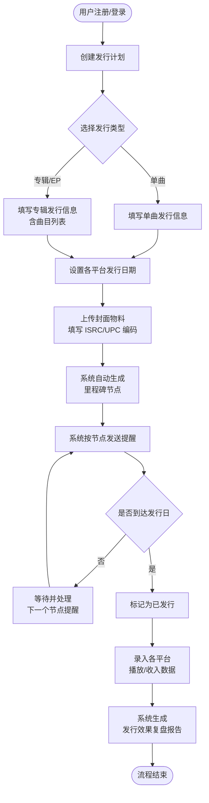
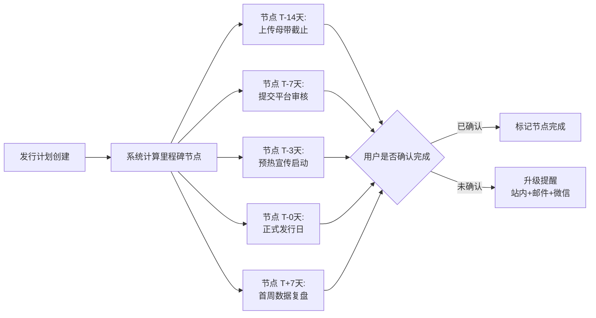
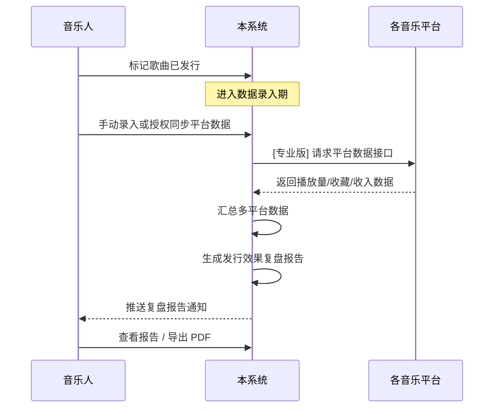
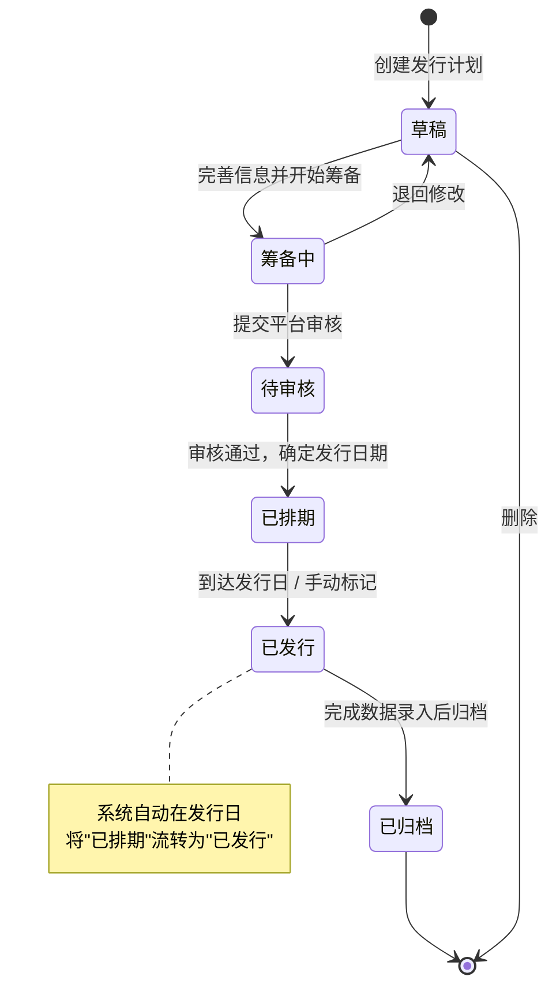
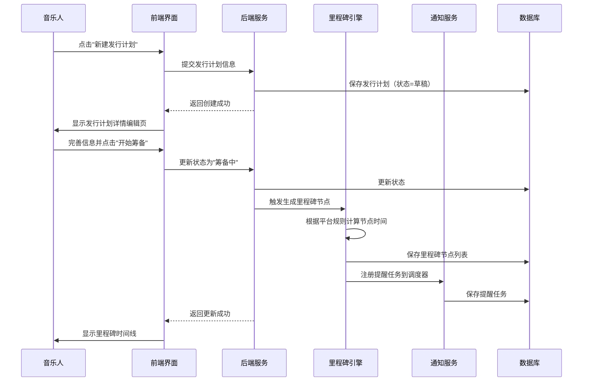
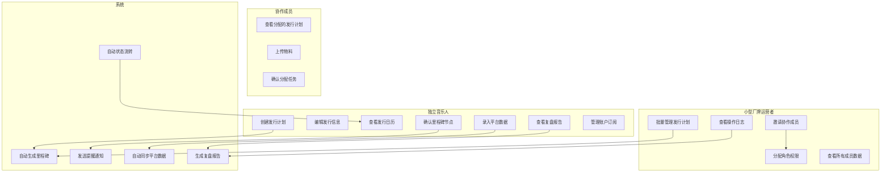
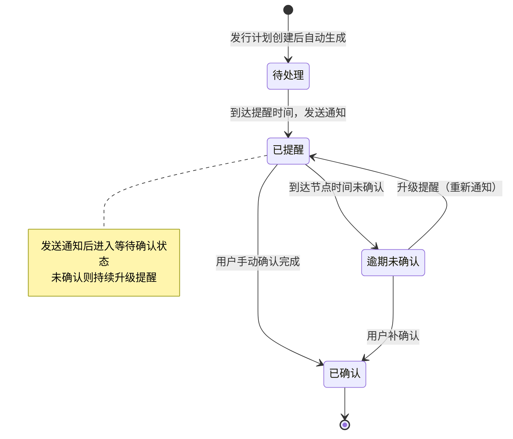

# 独立音乐人发行日历管理系统 — 用户需求说明书（URS）

> 文档版本：v1.0.0  
> 创建日期：2026-06-28  
> 产品名称：独立音乐人发行日历管理（ReleaseCal）  
> 文档状态：初稿，待审核

---

# 1. 需求概述

## 1.1 需求介绍

独立音乐人发行日历管理系统（以下简称"本系统"）是一款面向独立音乐人、乐队、音乐制作人及小型独立音乐厂牌的发行计划管理工具。

随着数字音乐发行的普及，独立音乐人需要将作品分发到网易云音乐、QQ音乐、Spotify、Apple Music 等多个平台，每个平台的发行节奏、审核周期、物料要求各不相同。本系统聚焦于"发行计划管理 + 多平台关键节点提醒 + 发行数据复盘"这一细分场景，帮助独立音乐人以专业化的方式统筹管理多平台发行全流程，避免因遗漏关键节点而导致发行延误或数据损失。

### 1.1.1 所属领域

数字音乐 / 独立音乐产业 / 创作者工具（SaaS）

## 1.2 需求目标

1. **发行计划数字化管理**：为每首歌曲/专辑建立独立的发行计划，集中记录各平台的发行日期、封面物料、ISRC 编码、 UPC 编码等关键信息，取代散落在 Excel、备忘录、聊天群中的碎片化记录。
2. **多平台发行日历可视化**：以日历/时间线视图直观展示所有发行计划的时间分布，一目了然地掌握未来数月、各平台的发行节奏。
3. **关键节点自动提醒**：基于各平台的发行规则（如提前 14 天上传母带、提前 7 天提交编辑审核、发行日当天发布宣传等），自动生成里程碑节点并通过站内通知、邮件、微信服务号等渠道提醒用户，确保不遗漏任何关键时间点。
4. **发行效果数据复盘**：在歌曲发行后，记录各平台的播放量、收藏量、下载量、收入等数据，生成发行效果复盘报告，帮助用户沉淀发行经验、优化后续发行策略。
5. **团队协作支持**：支持音乐人与经纪人、制作人、设计师等角色协作，通过权限控制实现物料交接、审核确认等协同流程。

## 1.3 系统使用角色

| 角色 | 说明 | 典型用户 |
|------|------|----------|
| 独立音乐人（个人版） | 自主管理个人作品发行的创作者 |  solo 音乐人、唱作人、DJ |
| 乐队/组合成员 | 乐队中负责发行事务的成员 | 乐队经纪人、乐队经理 |
| 小型厂牌运营者 | 管理厂牌旗下多位音乐人发行的运营人员 | 独立音乐厂牌 A&R、运营 |
| 协作成员 | 参与发行流程但不拥有发行计划的外部协作者 | 制作人、混音师、封面设计师、宣发人员 |
| 系统管理员 | 管理用户账户、订阅、系统配置 | 产品运营方 |

## 1.4 业务流程图

### 1.4.1 核心发行管理流程

### 1.4.2 提醒与通知流程

### 1.4.3 数据复盘流程

# 2. 功能原型

| 原型名称 | 原型链接 | 对应端 | 备注 |
| --- | --- | --- | --- |
| 发行日历管理主界面 | 见同目录 UI 原型文件 | WEB端 | 响应式设计，兼容桌面与平板 |
| 发行计划详情与编辑 | 见同目录 UI 原型文件 | WEB端 | 包含多平台信息录入表单 |
| 日历/时间线看板 | 见同目录 UI 原型文件 | WEB端 | 月视图/周视图/列表视图切换 |
| 发行效果复盘报告 | 见同目录 UI 原型文件 | WEB端 | 数据可视化图表 + 可导出 PDF |
| 团队协作与权限管理 | 见同目录 UI 原型文件 | WEB端 | 邀请成员、角色分配、操作日志 |

# 3. 需求清单

## 3.1 发行计划管理（WEB端）

| 模块 | 一级功能 | 二级功能 | 功能描述 | 备注 |
| --- | --- | --- | --- | --- |
| 发行计划 | 创建发行计划 | 新建单曲发行 | 填写歌曲名称、艺人名称、流派、语言、时长、作词/作曲/编曲信息，设置各平台发行日期 | 支持从模板快速创建 |
| 发行计划 | 创建发行计划 | 新建专辑/EP发行 | 在单曲信息基础上，增加专辑名称、曲目列表管理（排序、每首独立 ISRC）、专辑类型（专辑/EP/单曲集） | 曲目数量上限 50 首 |
| 发行计划 | 创建发行计划 | 使用发行模板 | 提供"标准单曲发行""标准专辑发行"等预设模板，一键填充默认节点和平台配置 | 专业版功能 |
| 发行计划 | 编辑发行信息 | 基本信息编辑 | 修改歌曲/专辑的基本信息，记录修改历史 | 已发行的计划仅允许修改非关键字段 |
| 发行计划 | 编辑发行信息 | 平台信息编辑 | 为每个目标平台（网易云、QQ音乐、Spotify、Apple Music、Amazon Music、YouTube Music、Bandcamp 等）设置独立的发行日期、ISRC 编码、UPC/EAN 编码、平台链接 | 平台列表可扩展 |
| 发行计划 | 编辑发行信息 | 封面物料管理 | 上传封面图片（支持 JPG/PNG，≥3000×3000px），支持多尺寸裁剪适配不同平台要求；管理其他物料（宣传照、歌词文件、音频文件） | 物料关联到具体发行计划 |
| 发行计划 | 管理发行状态 | 状态流转 | 发行计划支持以下状态：草稿 → 筹备中 → 待审核 → 已排期 → 已发行 → 已归档；支持手动推进和自动流转（到达发行日自动标记为已发行） | 状态变更触发通知 |
| 发行计划 | 管理发行状态 | 批量操作 | 支持批量修改状态、批量删除、批量导出 | 仅对草稿和筹备中状态生效 |
| 发行计划 | 删除与归档 | 删除发行计划 | 删除草稿状态的发行计划；已发行的计划不可删除，仅可归档 | 删除需二次确认 |
| 发行计划 | 删除与归档 | 归档发行计划 | 将已发行且完成数据录入的计划归档，不再在日历视图中显示，但保留在列表中可检索 | 归档后可恢复 |

## 3.2 发行日历看板（WEB端）

| 模块 | 一级功能 | 二级功能 | 功能描述 | 备注 |
| --- | --- | --- | --- | --- |
| 日历看板 | 视图切换 | 月视图 | 以月历形式展示每天有哪些歌曲/专辑发行，每个发行项显示封面缩略图、歌曲名、目标平台图标 | 默认视图 |
| 日历看板 | 视图切换 | 周视图 | 以周为单位展示发行计划，横轴为日期、纵轴为平台，清晰展示同一周各平台的发行分布 | |
| 日历看板 | 视图切换 | 列表视图 | 以时间排序的列表形式展示所有发行计划，支持按状态、平台、艺人筛选 | 适合管理大量发行 |
| 日历看板 | 筛选与搜索 | 条件筛选 | 按发行状态、目标平台、艺人/乐队、流派、时间范围进行组合筛选 | 支持保存常用筛选条件 |
| 日历看板 | 筛选与搜索 | 关键词搜索 | 按歌曲名、专辑名、艺人名、ISRC 编码进行模糊搜索 | 支持搜索已归档内容 |
| 日历看板 | 快速操作 | 日历内快捷创建 | 点击日历空白日期快速创建发行计划，预填日期 | |
| 日历看板 | 快速操作 | 拖拽调整日期 | 在日历视图中拖拽发行项到新日期，自动更新发行日期并重新计算里程碑节点 | 仅限草稿和筹备中状态 |
| 日历看板 | 数据概览 | 本月发行统计 | 在日历顶部展示本月发行数量、各平台分布、即将到期的关键节点数 | |

## 3.3 里程碑与提醒（WEB端）

| 模块 | 一级功能 | 二级功能 | 功能描述 | 备注 |
| --- | --- | --- | --- | --- |
| 里程碑管理 | 自动生成节点 | 标准节点生成 | 创建发行计划后，系统根据各平台的发行规则自动生成标准里程碑节点：T-14 上传母带截止、T-7 提交平台审核、T-3 预热宣传启动、T-0 正式发行、T+7 首周数据复盘 | 节点时间可由用户自定义调整 |
| 里程碑管理 | 自动生成节点 | 自定义节点 | 用户可在标准节点之外添加自定义里程碑（如"MV拍摄完成""媒体通稿发布"等） | |
| 里程碑管理 | 节点确认 | 手动确认完成 | 用户逐一确认每个里程碑已完成，未确认的节点在到达时触发升级提醒 | |
| 提醒通知 | 通知渠道 | 站内通知 | 在系统内展示待办提醒列表，未读提醒以红点标记 | 所有用户可用 |
| 提醒通知 | 通知渠道 | 邮件通知 | 在里程碑节点到达前发送提醒邮件 | 专业版功能 |
| 提醒通知 | 通知渠道 | 微信服务号通知 | 通过微信服务号模板消息推送提醒 | 专业版功能，需绑定微信 |
| 提醒通知 | 提醒策略 | 提前量设置 | 用户可设置每个节点的提醒提前量（如提前1天、提前3天、当天） | |
| 提醒通知 | 提醒策略 | 免打扰时段 | 设置免打扰时段（如23:00-08:00），该时段内的提醒顺延至时段结束后发送 | |
| 提醒通知 | 到期未处理 | 升级提醒 | 里程碑到期未确认时，系统自动升级提醒频率：到期当天每小时提醒一次，逾期后每天提醒一次 | |

## 3.4 发行数据与复盘（WEB端）

| 模块 | 一级功能 | 二级功能 | 功能描述 | 备注 |
| --- | --- | --- | --- | --- |
| 数据录入 | 手动录入 | 单平台数据录入 | 为每个平台录入发行后数据：播放量、收藏量、评论数、分享数、下载量、收入金额 | 支持按日/周/月粒度录入 |
| 数据录入 | 手动录入 | 批量数据导入 | 通过 Excel/CSV 模板批量导入历史数据 | 提供标准导入模板下载 |
| 数据录入 | 自动同步 | 平台数据同步 | 授权连接各音乐平台 API，自动拉取播放量、收入等数据 | 专业版功能；依赖平台开放 API |
| 数据录入 | 自动同步 | 同步状态监控 | 展示各平台数据同步的最后更新时间、同步状态（成功/失败/待授权） | |
| 数据复盘 | 查看报告 | 单曲复盘报告 | 查看单曲在各平台的累计数据、趋势图表（播放量/收入折线图）、平台对比分析 | |
| 数据复盘 | 查看报告 | 专辑复盘报告 | 查看专辑整体数据及各曲目在专辑中的贡献占比 | |
| 数据复盘 | 查看报告 | 阶段性报告 | 查看发行后 1周/1月/3月/6月/1年 的阶段数据汇总 | 系统在对应时间点自动生成 |
| 数据复盘 | 导出报告 | 导出 PDF | 将复盘报告导出为 PDF 文件，包含图表和数据表格 | 免费版带水印，专业版无水印 |
| 数据复盘 | 导出报告 | 导出 Excel | 将原始数据导出为 Excel，便于进一步分析 | |
| 数据复盘 | 对比分析 | 跨歌曲对比 | 选择多首歌曲进行数据横向对比（播放量、收入、增长率等维度） | |
| 数据复盘 | 对比分析 | 历史趋势对比 | 将当前发行数据与历史发行数据进行纵向对比，观察增长趋势 | |

## 3.5 团队协作（WEB端）

| 模块 | 一级功能 | 二级功能 | 功能描述 | 备注 |
| --- | --- | --- | --- | --- |
| 团队成员 | 邀请成员 | 邮箱邀请 | 通过邮箱邀请协作成员加入工作空间，被邀请人通过邮件链接注册/加入 | 专业版功能 |
| 团队成员 | 邀请成员 | 链接邀请 | 生成邀请链接，分享给协作成员直接加入 | 专业版功能 |
| 团队成员 | 角色管理 | 角色分配 | 为成员分配角色：管理员（全部权限）、编辑者（可创建/编辑发行计划）、查看者（只读） | |
| 团队成员 | 角色管理 | 自定义权限 | 针对具体发行计划设置精细化权限（如设计师仅可上传特定计划的封面物料） | |
| 团队成员 | 操作日志 | 查看操作记录 | 记录所有成员的操作日志（创建/编辑/删除/状态变更/物料上传等），支持按时间、成员、操作类型筛选 | 日志保留 90 天 |
| 工作空间 | 空间管理 | 多空间支持 | 专业版用户可创建多个工作空间（如按厂牌/项目分组），各空间数据独立 | 专业版功能 |
| 工作空间 | 空间管理 | 空间设置 | 设置工作空间名称、头像、默认提醒策略、默认平台配置 | |

## 3.6 用户账户与订阅（WEB端）

| 模块 | 一级功能 | 二级功能 | 功能描述 | 备注 |
| --- | --- | --- | --- | --- |
| 账户管理 | 注册登录 | 邮箱注册 | 通过邮箱+密码注册账户，发送验证邮件激活 | |
| 账户管理 | 注册登录 | 第三方登录 | 支持微信扫码登录、Apple ID 登录 | |
| 账户管理 | 个人资料 | 资料编辑 | 编辑用户名、头像、个人简介、关联社交账号 | |
| 账户管理 | 个人资料 | 账户安全 | 修改密码、绑定/解绑手机、两步验证 | |
| 订阅管理 | 查看套餐 | 套餐对比 | 展示免费版与专业版的功能对比表 | |
| 订阅管理 | 升级订阅 | 购买专业版 | 支持月付（¥29/月）和年付（¥269/年，约 ¥22.4/月） | 对接支付平台 |
| 订阅管理 | 升级订阅 | 续费与取消 | 查看订阅到期时间，支持续费或取消自动续费 | |
| 账户管理 | 使用量管理 | 配额查看 | 展示当前歌曲管理数量（免费版上限5首）和剩余配额 | 达到上限时提示升级 |

# 4. 非功能需求

## 4.1 使用界面需求

| 编号 | 需求描述 |
|------|----------|
| UI-01 | 界面风格应简洁、现代，符合音乐创作者的审美偏好；以深色/浅色双主题支持，默认跟随系统主题设置 |
| UI-02 | 日历看板为核心页面，应确保信息密度适中，避免视觉过载；大量发行计划时应支持平滑滚动和虚拟列表 |
| UI-03 | 表单填写（发行计划创建/编辑）应采用分步引导式交互，降低信息填写的认知负荷 |
| UI-04 | 所有操作应提供明确的状态反馈（加载、成功、失败），关键操作（删除、状态变更）需二次确认 |
| UI-05 | 响应式设计，优先适配桌面端（≥1280px），兼容平板端（≥768px）；手机端为只读查看模式（日历浏览、提醒查看），不支持完整编辑 |
| UI-06 | 支持键盘快捷键操作（如 N 新建发行计划、/ 聚焦搜索框、← → 切换日历视图） |
| UI-07 | 中文为默认语言，预留英文界面扩展能力 |

## 4.2 软硬件环境需求

| 编号 | 需求描述 |
|------|----------|
| ENV-01 | 本系统为 B/S 架构的 WEB 应用，用户通过浏览器访问，无需安装客户端 |
| ENV-02 | 支持主流浏览器：Chrome 90+、Firefox 90+、Safari 15+、Edge 90+ |
| ENV-03 | 系统部署于云端（推荐阿里云/腾讯云），采用容器化部署 |
| ENV-04 | 系统可用性目标 ≥ 99.5%（月度） |
| ENV-05 | 数据存储采用云数据库，支持自动备份（每日全量 + 实时增量） |

## 4.3 性能需求

| 编号 | 需求描述 |
|------|----------|
| PERF-01 | 页面首屏加载时间 ≤ 2 秒（在 10Mbps 网络条件下） |
| PERF-02 | 日历视图在 500 条发行计划数据量下，渲染和交互响应时间 ≤ 500ms |
| PERF-03 | 发行计划创建/编辑保存操作响应时间 ≤ 1 秒 |
| PERF-04 | 文件上传（封面图片，≤10MB）支持断点续传，上传进度实时反馈 |
| PERF-05 | 提醒通知应在里程碑节点到达时刻的 ±5 分钟内送达 |
| PERF-06 | 复盘报告生成时间 ≤ 5 秒（单首歌曲，10个平台数据量） |
| PERF-07 | 支持单个工作空间 1000 首发行计划、50 个协作成员的性能水平 |

## 4.4 约束性需求

1. 本系统**不应实现**音乐发行/分发功能，不做 DistroKid / TuneCore 类发行平台的替代品；仅聚焦于发行计划管理和数据复盘。
2. 本系统**不应实现**音乐播放功能，不提供在线试听。
3. 本系统**不应实现**社交功能（如动态发布、关注、评论、私信），不向社区方向发展。
4. 平台数据同步功能依赖各音乐平台的开放 API；当目标平台未提供公开 API 时，系统仅支持手动录入方式。
5. 免费版限制管理 5 首歌曲（含单曲和专辑中的曲目），专业版不限制。
6. 用户数据存储应遵守《个人信息保护法》相关规定，用户有权导出和删除个人数据。
7. 本系统**需要后台服务**支撑，包括用户认证、数据持久化、定时任务（提醒调度）、文件存储、邮件/微信消息推送等。
8. 付费订阅功能需对接合规的第三方支付平台（微信支付、支付宝）。

# 5. 接口需求

## 5.1 硬件接口需求

本系统为纯 WEB 应用，无硬件接口需求。

## 5.2 软件接口需求

| 模块 | 接口名称 | 输入 | 输出 | 功能描述 |
| --- | --- | --- | --- | --- |
| 用户账户 | 微信开放平台 OAuth 接口 | 用户授权码 | 用户 OpenID、昵称、头像 | 支持微信扫码登录 |
| 用户账户 | Apple Sign In 接口 | 用户授权凭证 | 用户唯一标识、邮箱 | 支持 Apple ID 登录 |
| 订阅管理 | 微信支付接口 | 订单信息、金额 | 支付结果通知 | 专业版订阅支付 |
| 订阅管理 | 支付宝支付接口 | 订单信息、金额 | 支付结果通知 | 专业版订阅支付 |
| 提醒通知 | 邮件发送服务（SMTP/API） | 收件人、模板、变量 | 发送结果状态 | 发送里程碑提醒邮件 |
| 提醒通知 | 微信服务号模板消息接口 | 用户 OpenID、模板数据 | 发送结果状态 | 推送微信服务号提醒 |
| 数据同步 | 网易云音乐人 API | 授权 Token、歌曲 ID | 播放量、收藏量、收入数据 | 自动同步网易云数据（需平台开放） |
| 数据同步 | QQ音乐开放平台 API | 授权 Token、歌曲 ID | 播放量、收藏量、收入数据 | 自动同步QQ音乐数据（需平台开放） |
| 数据同步 | Spotify for Artists API | 授权 Token、Track ID | 播放量、听众数、收入数据 | 自动同步 Spotify 数据 |
| 数据同步 | Apple Music for Artists API | 授权 Token、Track ID | 播放量、下载量、收入数据 | 自动同步 Apple Music 数据 |
| 文件存储 | 对象存储服务（OSS/COS） | 文件二进制数据 | 文件访问 URL | 存储封面图片、音频文件、物料文件 |
| 数据复盘 | PDF 生成服务 | 报告模板、数据 | PDF 文件流 | 生成可导出的 PDF 复盘报告 |

## 5.4 通讯接口需求

本系统为标准 WEB 应用，通过 HTTPS 协议与用户浏览器通讯，无特殊通讯接口需求。

# 6. 附录

## 流程图

### 发行计划状态流转图

## 时序图

### 发行计划创建与里程碑生成时序

## （用户与系统交互）用例图

## （系统）状态图

### 里程碑节点状态图

