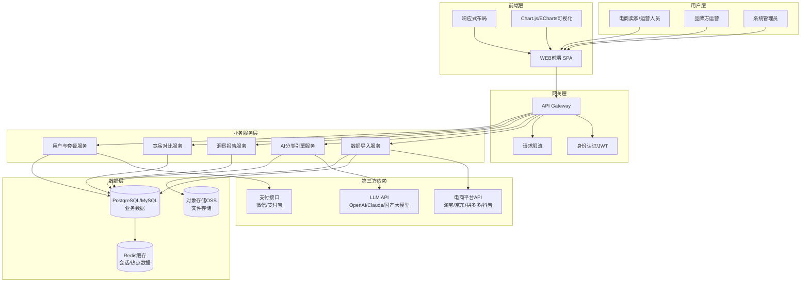
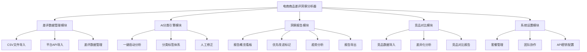
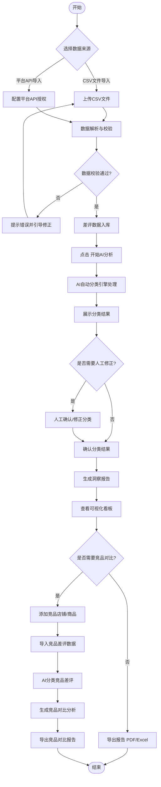
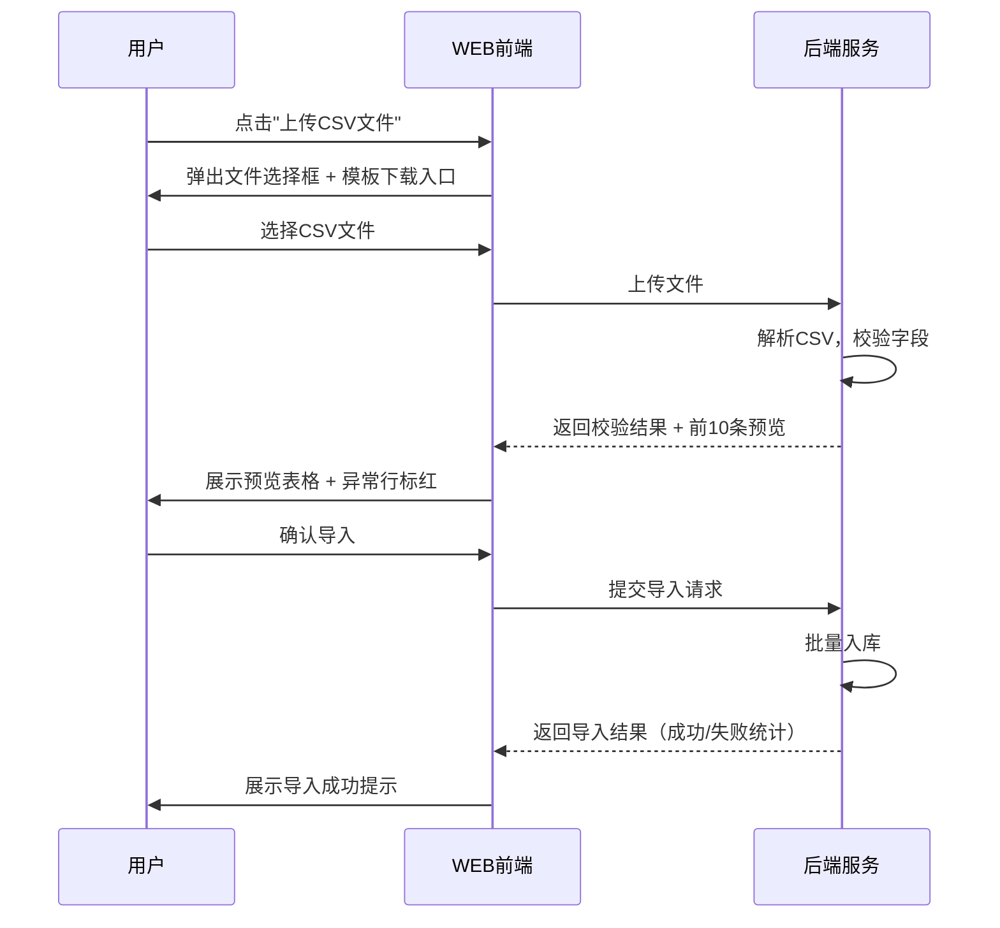
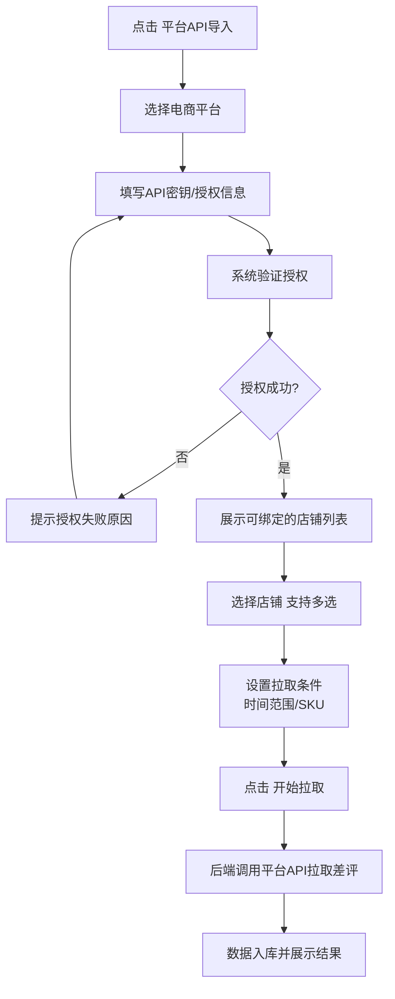
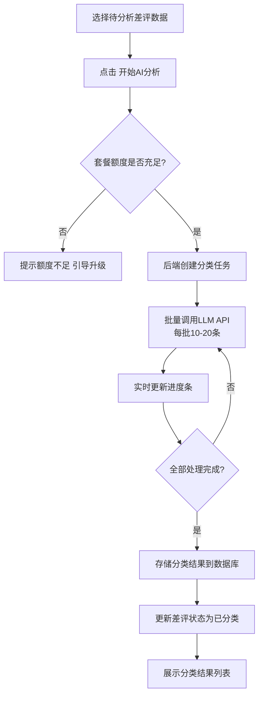
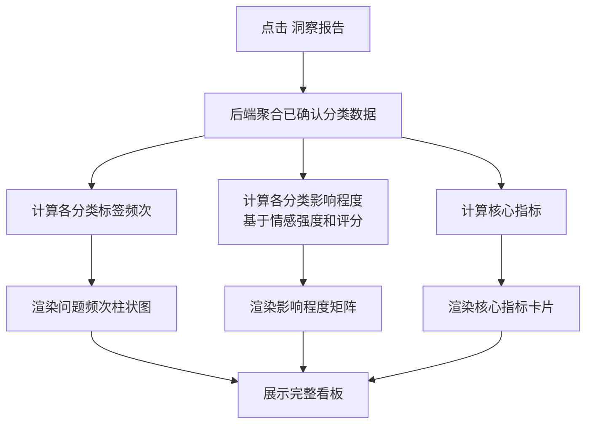
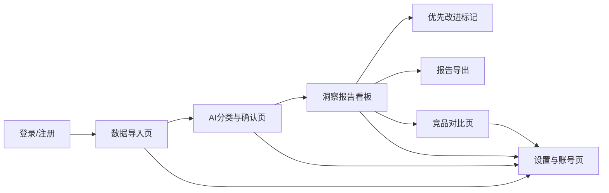
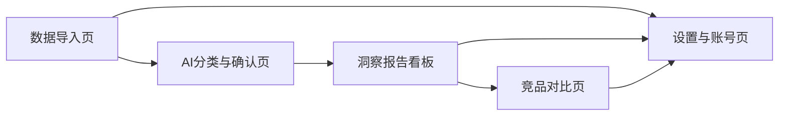

# 电商商品差评洞察分析器 - 产品需求规格说明书（PRD）

> 文档版本：V1.0  
> 创建日期：2026-06-28  
> 产品负责人：阶段一产品落地页文档总编辑  
> 文档编写：产品文档结对写作专家

---

| 版本号 | 变更日期 | 变更内容 | 变更人 | 审核人 |
| --- | --- | --- | --- | --- |
| V1.0 | 2026-06-28 | 初始版本创建 | 产品文档结对写作专家 | 阶段一产品落地页文档总编辑 |

---

# 1 概述

## 1.1 需求背景

随着电商行业竞争加剧，商品差评已成为影响店铺转化率和产品口碑的关键因素。电商卖家每天面对大量差评反馈，传统的手动逐条阅读、人工归类的方式效率极低——分析数百条差评往往需要数小时，且容易遗漏高频问题和关键痛点。

**业务痛点：**
1. **分析效率低**：运营人员手动阅读差评，数百条需耗时数小时，效率低下
2. **决策缺乏数据支撑**：哪些问题是高频的、哪些影响最大、应该先改什么——没有数据化的决策依据
3. **竞品洞察缺失**：难以快速获取竞品差评信息，无法识别差异化改进机会
4. **改进追踪困难**：发现问题后缺乏跟踪机制，改进落地效果难以验证

**业务价值：**
- 通过AI自动分类，将数小时的分析工作缩短至几分钟，大幅提升运营效率
- 基于数据驱动的优先级排序，让产品改进决策更加精准
- 竞品对比功能帮助卖家发现市场空白，找到差异化竞争方向

**预期达成目标：**
- MVP阶段：上线差评CSV导入+AI分类+洞察报告生成功能，支撑免费版每月500条差评分析
- 专业版上线：新增竞品对比、趋势分析、团队协作等增值功能，实现付费转化

## 1.2 名词解释

| **名词** | **说明** |
| --- | --- |
| 差评 | 电商平台上用户对商品的1-2星评价（含评价内容、评分、时间等） |
| LLM | 大语言模型（Large Language Model），如OpenAI GPT-4、Claude等，用于AI分类引擎 |
| CSV | 逗号分隔值文件（Comma-Separated Values），用于批量导入差评数据 |
| 分类标签 | 系统预设的差评原因分类体系：产品质量、物流配送、描述不符、客服态度、价格问题、包装破损、使用体验、其他 |
| 情感强度 | AI对差评负面程度的判断：强负面（3星以下且涉及严重问题）、中负面（一般不满）、弱负面（轻微抱怨） |
| 置信度 | AI分类结果的确定性指标，0-100%，低于70%的结果建议人工复核 |
| 优先改进项 | 综合频次和影响程度后系统标记的P0/P1/P2级改进建议 |
| SKU | 库存量单位（Stock Keeping Unit），电商中用于标识具体商品的编码 |
| API | 应用程序编程接口（Application Programming Interface），用于对接电商平台数据 |

## 1.3 产品介绍

电商商品差评洞察分析器是一款面向电商卖家和运营人员的AI驱动差评分析SaaS工具。产品聚焦"差评分类+产品改进洞察"这一高频场景，通过批量导入差评数据，利用LLM自动分类差评原因，生成可视化洞察报告，帮助卖家快速定位产品缺陷、标记优先改进项。

### 1.3.1 范围说明

| 项 | 内容 |
| --- | --- |
| 包含功能 | 差评CSV文件导入、电商平台API导入、AI自动分类引擎、分类结果人工修正、洞察报告看板、优先改进标记、竞品差评对比、报告导出（PDF/Excel）、套餐管理、API密钥配置 |
| 不包含功能 | 订单管理、客服聊天、商品管理、差评自动回复、工单流转、通用电商ERP功能、自研大模型训练 |

**目标用户：**
- **电商卖家（店主）**：淘宝/京东/拼多多/抖音电商平台的店铺经营者，关注产品质量和评分，定期（每周/每月）导入差评查看洞察报告
- **电商运营人员**：负责产品优化、客户管理的运营团队成员，日常监控差评趋势，针对差评激增进行归因分析
- **中小品牌方**：需要从用户反馈中挖掘产品改进方向的品牌运营人员，管理多个商品/店铺差评数据

**核心价值：**
1. **效率提升**：AI自动分类，将数小时人工分析缩短至5分钟
2. **决策精准**：数据驱动的优先级排序，明确"先改什么"
3. **竞争洞察**：竞品差评对比，发现差异化机会
4. **轻量专注**：MVP快速交付，聚焦高频场景，不做通用ERP

---

# 2 产品设计

## 2.1 系统架构图

## 2.2 业务模块图

## 2.3 主业务流程

## 2.4 功能图/列表

| 功能模块 | 功能名称 | 优先级 | 功能描述 |
| --- | --- | --- | --- |
| 差评数据管理 | CSV文件导入 | P0 | 支持CSV文件上传、模板下载、数据预览校验 |
| 差评数据管理 | 平台API导入 | P0 | 配置电商平台API授权、店铺绑定、差评数据拉取 |
| 差评数据管理 | 差评数据列表 | P1 | 已导入差评数据展示、筛选搜索、批量删除 |
| 差评数据管理 | 导入记录 | P1 | 历次导入记录查看，含时间/来源/条数/成功率 |
| AI分类引擎 | 一键启动分析 | P0 | 选择待分析数据后一键触发AI分类，展示进度 |
| AI分类引擎 | 分类标签体系 | P0 | 按预设8大类标签分类差评原因，支持多维度标签 |
| AI分类引擎 | 分类结果查看 | P0 | 展示每条差评的AI分类结果，含原文/标签/情感/置信度 |
| AI分类引擎 | 人工修正 | P0 | 单条修正、批量修正AI分类结果，记录修正日志 |
| 洞察报告 | 核心指标卡片 | P0 | 差评总数、分类数、Top3问题、平均情感强度 |
| 洞察报告 | 问题频次排行 | P0 | 柱状图+数据表展示各类问题频次排行 |
| 洞察报告 | 影响程度矩阵 | P1 | 频次-影响二维矩阵识别关键问题 |
| 洞察报告 | 优先改进标记 | P0 | P0/P1/P2三色标记+改进建议+改进追踪 |
| 洞察报告 | 趋势分析 | P1 | 按日/周/月展示差评趋势变化，支持环比同比 |
| 洞察报告 | 报告导出 | P0 | PDF报告导出、Excel数据导出 |
| 竞品对比 | 竞品数据管理 | P1 | 添加竞品店铺/商品，导入竞品差评数据 |
| 竞品对比 | 差异化分析 | P1 | 分类标签对比、优势劣势识别、市场空白发现 |
| 竞品对比 | 竞品对比报告 | P1 | 自身vs竞品对比报告，含可视化图表和改进建议 |
| 系统设置 | 套餐管理 | P0 | 当前套餐查看、升级、用量统计、额度预警 |
| 系统设置 | 团队协作 | P1 | 邀请成员、角色权限配置（专业版功能） |
| 系统设置 | API密钥配置 | P0 | LLM API密钥配置、电商平台API授权管理 |
| 系统设置 | 自定义标签 | P2 | 在默认标签基础上添加自定义分类标签 |

## 2.5 你的产品有哪些端

| 序号 | 端名称 | 端类型 | 目标用户 | 说明 |
| --- | --- | --- | --- | --- |
| 1 | 差评洞察分析器 WEB端 | WEB端 | 电商卖家/运营人员/品牌方 | 用户在电脑浏览器上使用全部功能：数据导入、AI分类、洞察报告、竞品对比、系统设置 |

---

# 3 产品功能

## 3.1 WEB端 - 差评数据管理功能

### 3.1.1 CSV文件导入
用户通过上传符合模板格式的CSV文件，批量导入差评数据。系统自动解析文件内容，校验数据格式，展示预览并引导用户确认导入。

| 项 | 内容 |
| --- | --- |
| 优先级 | P0 |
| 依赖需求 | 无 |
| 前置条件 | 用户已登录且套餐额度未耗尽 |

**功能要点：**
- 支持CSV文件上传，文件大小限制100MB以内
- 提供标准CSV导入模板下载（含必填字段说明和示例数据）
- 上传后展示数据预览（前10条），校验字段完整性
- 异常行标红并给出修正建议（如缺少必填字段、格式错误等）
- 导入成功后展示导入结果统计（成功条数/失败条数）

### 3.1.2 CSV文件导入—详细流程

**业务规则说明：**
1. CSV文件必须包含以下必填字段：商品名称/ID、评价内容、评价时间、评分（1-5星）
2. 可选字段：订单号、SKU、用户昵称、评价图片
3. 文件编码需为UTF-8，文件大小不超过100MB
4. 评分1-2星的记录视为差评，3星及以上记录忽略并提示
5. 重复数据（相同订单号+评价时间）自动跳过，不重复入库

### 3.1.3 CSV文件导入—主要原型

[CSV文件导入组件原型](assets/prototypes/csv-import-widget.html)

**验收标准：**
- [ ] 正常流程：上传合法CSV文件后，前10条数据正确预览，字段完整无标红
- [ ] 正常流程：点击"确认导入"后，提示导入成功并展示成功/失败条数统计
- [ ] 异常流程：上传非CSV格式文件，提示"仅支持CSV格式文件"
- [ ] 异常流程：CSV文件缺少必填字段，异常行标红并展示修正建议
- [ ] 异常流程：文件超过100MB，提示"文件大小不能超过100MB"
- [ ] 性能要求：100MB文件解析时间不超过30秒

### 3.1.4 平台API导入
用户配置电商平台API授权信息，绑定店铺后可从淘宝/京东/拼多多/抖音等平台直接拉取差评数据。

| 项 | 内容 |
| --- | --- |
| 优先级 | P0 |
| 依赖需求 | 无 |
| 前置条件 | 用户已登录，拥有对应平台的商家API权限 |

**功能要点：**
- 支持配置淘宝/京东/拼多多/抖音电商平台的API密钥和授权信息
- 授权后可选择绑定的店铺，支持多店铺同时导入
- 按时间范围、商品SKU等条件从平台拉取差评数据
- 支持手动触发和定时自动拉取（专业版功能）

### 3.1.5 平台API导入—详细流程

### 3.1.6 差评数据管理
展示已导入的差评数据列表，支持筛选搜索和批量操作。

| 项 | 内容 |
| --- | --- |
| 优先级 | P1 |
| 依赖需求 | CSV文件导入、平台API导入 |
| 前置条件 | 已有导入的差评数据 |

**功能要点：**
- 差评数据列表：展示商品名称、评价内容摘要、评分、评价时间、分类状态
- 筛选条件：按商品、时间范围、分类状态（待分析/已分类/已确认）筛选
- 搜索：支持按商品名称、评价内容关键词搜索
- 批量操作：批量删除（需二次确认）、批量选择进入AI分析
- 单条操作：查看详情、删除

---

## 3.2 WEB端 - AI分类引擎功能

### 3.2.1 一键启动分析
用户选择待分析的差评数据后，一键触发AI分类引擎，系统调用LLM API自动对差评进行分类。

| 项 | 内容 |
| --- | --- |
| 优先级 | P0 |
| 依赖需求 | 差评数据管理 |
| 前置条件 | 存在状态为"待分析"的差评数据 |

**功能要点：**
- 在数据管理页或分类页选择待分析差评，点击"开始AI分析"
- 展示分析进度条（已处理/总数）和预估剩余时间
- AI按8大预设标签分类：产品质量、物流配送、描述不符、客服态度、价格问题、包装破损、使用体验、其他
- 支持多维度标签（一条差评可同时标记多个标签）
- 标注情感强度：强负面/中负面/弱负面
- 输出每条分类的置信度分数

### 3.2.2 一键启动分析—详细流程

**业务规则说明：**
1. 每次AI分析消耗套餐额度（1条差评=1次分析额度）
2. LLM API调用失败时自动重试3次，仍失败则标记该条为"分析失败"
3. 置信度低于70%的分类结果自动标记为"建议人工复核"
4. 分析过程中用户可暂停任务，已完成的分类结果保留

### 3.2.3 一键启动分析—主要原型

[AI分析进度组件原型](assets/prototypes/ai-analysis-widget.html)

**验收标准：**
- [ ] 正常流程：选择待分析数据后点击"开始AI分析"，进度条实时更新
- [ ] 正常流程：分析完成后自动跳转到分类结果列表
- [ ] 异常流程：额度不足时提示并引导升级套餐
- [ ] 异常流程：LLM API调用异常时，失败条目标记为"分析失败"
- [ ] 性能要求：1000条差评分析在5分钟内完成

### 3.2.4 人工修正分类结果
用户可对AI分类结果进行人工确认或修正，修正数据用于后续模型优化。

| 项 | 内容 |
| --- | --- |
| 优先级 | P0 |
| 依赖需求 | AI分类执行 |
| 前置条件 | 存在状态为"已分类"的差评数据 |

**功能要点：**
- 分类结果列表：展示差评原文、AI分类标签、情感强度、置信度
- 按标签/情感强度/置信度区间筛选
- 单条修正：点击分类标签可下拉修改，修正后标记为"人工确认"
- 批量修正：勾选多条同类差评，统一修改分类标签
- 修正记录：记录所有修正操作，用于分类准确率统计

### 3.2.5 人工修正—主要原型

[分类结果修正组件原型](assets/prototypes/classification-review-widget.html)

**验收标准：**
- [ ] 正常流程：单条修正后，该条状态变更为"人工确认"，修正记录写入日志
- [ ] 正常流程：批量勾选后统一修改标签，所有选中条目标签更新
- [ ] 正常流程：按标签筛选后列表正确过滤展示

---

## 3.3 WEB端 - 洞察报告功能

### 3.3.1 报告概览看板
基于已确认的分类结果，生成洞察报告看板，以可视化方式展示差评分析结果。

| 项 | 内容 |
| --- | --- |
| 优先级 | P0 |
| 依赖需求 | AI分类引擎、人工修正 |
| 前置条件 | 存在状态为"已确认"的差评分类数据 |

**功能要点：**
- **核心指标卡片**：差评总数、分类类别数、Top3问题类别、平均情感强度
- **问题频次排行**：柱状图+数据表，按频次从高到低排列各分类标签
- **影响程度矩阵**：频次-影响二维矩阵（气泡图），帮助用户识别高频高影响的关键问题
- **时间筛选**：支持按近7天/近30天/近90天/自定义时间范围筛选报告数据

### 3.3.2 报告概览看板—详细流程

### 3.3.3 报告概览看板—主要原型

[洞察报告看板原型](assets/prototypes/insight-dashboard-widget.html)

**验收标准：**
- [ ] 正常流程：看板正确展示差评总数、分类数、Top3问题、平均情感强度
- [ ] 正常流程：问题频次排行柱状图按频次降序排列，数据与分类结果一致
- [ ] 正常流程：影响程度矩阵正确展示各分类在频次-影响二维空间的分布
- [ ] 正常流程：切换时间范围后数据实时更新

### 3.3.4 优先改进标记
综合频次和影响程度，自动生成改进优先级排序，帮助卖家明确"先改什么"。

| 项 | 内容 |
| --- | --- |
| 优先级 | P0 |
| 依赖需求 | 洞察报告看板 |
| 前置条件 | 洞察报告数据已生成 |

**功能要点：**
- **P0（红色-紧急改进）**：高频+高影响的问题，如"产品质量"占比>30%且平均情感为强负面
- **P1（黄色-建议改进）**：中频或中影响的问题
- **P2（绿色-持续关注）**：低频低影响的问题
- **改进建议生成**：针对P0级问题，基于差评原文提炼具体改进建议（如"建议加强包装防护"、"优化物流合作商"）
- **改进追踪**：支持将改进项标记为"已关注""处理中""已解决"

### 3.3.5 优先改进标记—主要原型

[优先改进标记组件原型](assets/prototypes/priority-improvement-widget.html)

**验收标准：**
- [ ] 正常流程：P0/P1/P2三色标记正确显示，颜色与优先级对应
- [ ] 正常流程：P0级问题附带AI生成的改进建议
- [ ] 正常流程：可切换改进项状态（已关注→处理中→已解决）

### 3.3.6 报告导出
将洞察报告导出为PDF或Excel文件，支持离线分享和内部汇报。

| 项 | 内容 |
| --- | --- |
| 优先级 | P0 |
| 依赖需求 | 洞察报告看板 |
| 前置条件 | 洞察报告数据已生成 |

**功能要点：**
- PDF导出：包含核心指标、图表、改进建议的完整报告，适合内部汇报
- Excel导出：分类结果明细+统计数据表，便于进一步分析
- 导出文件命名规则：`差评洞察报告_{商品名称}_{日期}.pdf/xlsx`

---

## 3.4 WEB端 - 竞品对比功能

### 3.4.1 竞品差评导入与管理
添加竞品店铺或商品信息，导入竞品差评数据进行对比分析。

| 项 | 内容 |
| --- | --- |
| 优先级 | P1（专业版功能） |
| 依赖需求 | 自家差评数据已导入并分类 |
| 前置条件 | 用户为专业版套餐 |

**功能要点：**
- 添加竞品店铺/商品：输入竞品店铺名称/链接或商品ID
- 竞品差评导入：通过平台API拉取竞品差评（需配置对应平台API授权）
- 竞品数据管理：查看已添加的竞品列表，支持删除、刷新数据

### 3.4.2 差异化分析
将自家产品与竞品的差评分类结果进行对比，识别优势项和劣势项。

| 项 | 内容 |
| --- | --- |
| 优先级 | P1（专业版功能） |
| 依赖需求 | 竞品差评导入 |
| 前置条件 | 自家和竞品差评数据均已导入并完成AI分类 |

**功能要点：**
- **分类标签对比**：雷达图/柱状图展示自家vs竞品各类问题占比差异
- **优势识别**：自家差评占比显著低于竞品的问题类别（绿色标记）
- **劣势识别**：自家差评占比显著高于竞品的问题类别（红色标记）
- **市场空白发现**：识别竞品有但自家未覆盖的问题类别

### 3.4.3 差异化分析—主要原型

[竞品对比分析组件原型](assets/prototypes/competitor-comparison-widget.html)

**验收标准：**
- [ ] 正常流程：雷达图正确展示自家vs竞品各类问题占比对比
- [ ] 正常流程：优势项绿色标记、劣势项红色标记，颜色准确
- [ ] 正常流程：市场空白区域有明确标注和说明

---

## 3.5 WEB端 - 系统设置功能

### 3.5.1 套餐与用量管理
查看当前套餐信息、升级套餐、监控月度用量。

| 项 | 内容 |
| --- | --- |
| 优先级 | P0 |
| 依赖需求 | 无 |
| 前置条件 | 用户已登录 |

**功能要点：**
- 展示当前套餐类型（免费版/专业版）、剩余分析额度、到期时间
- 免费版每月500条差评分析额度，超出后引导升级
- 专业版¥79/月：不限差评数量+竞品对比+趋势分析+团队协作
- 月度用量统计：已分析条数、剩余额度
- 用量预警：免费额度使用达80%时弹出升级提醒

### 3.5.2 套餐与用量管理—主要原型

[套餐管理组件原型](assets/prototypes/subscription-widget.html)

**验收标准：**
- [ ] 正常流程：正确展示当前套餐类型、剩余额度、到期时间
- [ ] 正常流程：免费额度使用达80%时弹出升级提醒
- [ ] 正常流程：点击"升级专业版"跳转支付页面

### 3.5.3 API密钥配置
管理LLM API密钥和电商平台API授权信息。

| 项 | 内容 |
| --- | --- |
| 优先级 | P0 |
| 依赖需求 | 无 |
| 前置条件 | 用户已登录 |

**功能要点：**
- LLM API配置：支持配置OpenAI/Claude/国产大模型的API密钥
- 平台API管理：管理已绑定的电商平台API授权，支持刷新Token、解绑操作
- 密钥安全：API密钥加密存储，页面展示时脱敏显示

### 3.5.4 团队协作（专业版）
邀请团队成员加入，分配不同角色和权限。

| 项 | 内容 |
| --- | --- |
| 优先级 | P1（专业版功能） |
| 依赖需求 | 套餐管理 |
| 前置条件 | 用户为专业版套餐且为管理员角色 |

**功能要点：**
- 邀请成员：通过邮箱/链接邀请团队成员
- 角色管理：管理员（全部权限）、运营（数据导入+报告查看）、只读（仅查看报告）
- 成员列表：展示团队成员信息，支持修改角色、移除成员

---

# 4 产品原型

## 4.1 页面跳转逻辑图

## 4.2 全站点原型设计

### 4.2.1 差评洞察分析器 WEB端

**页面清单：**

| 序号 | 页面名称 | 所属模块 | 页面描述 | 关键元素 |
| --- | --- | --- | --- | --- |
| 1 | 数据导入页 | 差评数据管理 | 支持CSV文件上传、平台API配置入口、数据预览、导入记录 | 上传拖拽区、模板下载按钮、平台选择卡片、数据预览表格、导入记录列表 |
| 2 | AI分类与确认页 | AI分类引擎 | 展示AI分类结果，支持人工修正、筛选、批量操作 | 分析进度条、分类结果列表、标签下拉选择、置信度标记、批量操作栏 |
| 3 | 洞察报告看板 | 洞察报告 | 可视化展示差评分析结果、优先级标记 | 核心指标卡片、频次柱状图、影响矩阵、优先改进列表、导出按钮 |
| 4 | 竞品对比页 | 竞品对比 | 竞品差评对比分析、差异化洞察 | 竞品添加卡片、雷达对比图、优势劣势列表、市场空白标注 |
| 5 | 设置与账号页 | 系统设置 | 套餐管理、API配置、团队设置 | 套餐信息卡片、用量进度条、API密钥表单、团队成员列表 |

**交互说明：**
- 页面跳转关系：

- 特殊交互：
  1. 全局顶部导航栏：Logo + 页面切换Tab（数据导入 / AI分类 / 洞察报告 / 竞品对比 / 设置）
  2. 数据导入页：支持拖拽上传CSV文件，上传后弹出预览面板
  3. AI分类与确认页：点击分类标签弹出下拉菜单可修改，批量勾选后顶部出现批量操作栏
  4. 洞察报告看板：图表支持hover展示详情tooltip，支持时间范围快速切换
  5. 竞品对比页：添加竞品后需等待数据拉取完成，期间展示加载状态
  6. 异常状态处理：空数据态（引导用户导入数据）、加载态（骨架屏）、错误态（错误提示+重试按钮）

**产品原型：**

[🖥️ 打开差评洞察分析器 WEB端全站点原型](assets/prototypes/web-prototype.html)

---

# 5 数据需求

## 5.1 数据使用规格

### 差评数据表

| **字段** | **是否必填** | **描述** | **数据类型** |
| --- | --- | --- | --- |
| id | 是 | 差评记录唯一标识 | UUID |
| product_name | 是 | 商品名称 | 字符串 |
| product_id | 否 | 商品ID/SKU | 字符串 |
| review_content | 是 | 差评内容原文 | 文本 |
| rating | 是 | 评分（1-5星） | 整数 |
| review_time | 是 | 评价时间 | 日期时间 |
| order_id | 否 | 订单号 | 字符串 |
| user_nickname | 否 | 评价用户昵称 | 字符串 |
| source | 是 | 数据来源（csv/taobao/jd/pdd/douyin） | 字符串 |
| import_batch_id | 是 | 导入批次ID | UUID |
| status | 是 | 状态（待分析/已分类/已确认/分析失败） | 字符串 |
| created_at | 是 | 创建时间 | 日期时间 |

### AI分类结果表

| **字段** | **是否必填** | **描述** | **数据类型** |
| --- | --- | --- | --- |
| id | 是 | 分类结果唯一标识 | UUID |
| review_id | 是 | 关联的差评ID | UUID |
| category_labels | 是 | 分类标签数组（可多个） | JSON数组 |
| sentiment | 是 | 情感强度（强负面/中负面/弱负面） | 字符串 |
| confidence | 是 | 置信度（0-100） | 浮点数 |
| is_human_confirmed | 是 | 是否人工确认 | 布尔 |
| human_modified | 否 | 人工修正前的原始标签 | JSON数组 |
| created_at | 是 | 分类时间 | 日期时间 |

## 5.2 统计数据

1. 统计各分类标签的差评数量和占比，按标签维度统计（P0）
2. 统计各分类标签的平均情感强度，按标签维度统计（P0）
3. 统计差评数量按日/周/月的变化趋势，按时间维度统计（P1）
4. 统计AI分类准确率（基于人工修正率），按时间维度统计（P1）
5. 统计月度分析用量，按用户维度统计（P0）

## 5.3 埋点需求

| 页面 | 事件 | 采集字段 | 说明 |
| --- | --- | --- | --- |
| 数据导入页 | csv_upload | file_size, row_count, import_result | 记录CSV上传行为和成功率 |
| 数据导入页 | api_import_click | platform | 记录平台API导入使用频次 |
| AI分类页 | start_analysis | review_count, source | 记录AI分析触发频次和规模 |
| AI分类页 | manual_correction | correction_count, total_count | 记录人工修正率，用于模型优化 |
| 洞察报告 | report_view | time_range, export_format | 记录报告查看和导出行为 |
| 洞察报告 | report_export | format, time_range | 记录导出格式偏好 |
| 竞品对比 | competitor_add | platform, competitor_type | 记录竞品添加行为 |
| 设置页 | plan_upgrade_click | current_plan | 记录升级点击，分析转化 |

---

# 6 非功能需求

## 6.1 性能需求

**6.1.1 延迟**

| 编号 | 项目 | 最大延迟 | 平均延迟 | 优先级 | 备注 |
| --- | --- | --- | --- | --- | --- |
| 0001 | 页面首屏加载 | <3秒 | <1.5秒 | 高 | 良好网络环境 |
| 0002 | CSV文件解析（100MB） | <30秒 | <15秒 | 高 |  |
| 0003 | AI分类分析（1000条） | <5分钟 | <3分钟 | 高 |  |
| 0004 | 洞察报告生成 | <10秒 | <5秒 | 中 | 基于已分类数据 |
| 0005 | 列表页数据加载 | <2秒 | <1秒 | 高 |  |

**6.1.2 吞吐量**

| 编号 | 项 | 吞吐量 | 备注 |
| --- | --- | --- | --- |
| 0001 | 同时进行的AI分析任务 | 50个 |  |
| 0002 | 并发文件上传 | 20个 |  |
| 0003 | API接口QPS | 500次/秒 |  |

**6.1.3 容量**

| 编号 | 项 | 容量 | 备注 |
| --- | --- | --- | --- |
| 0001 | 单用户差评数据存储量 | >=100,000条 |  |
| 0002 | 系统总注册用户数 | <=500,000 | MVP阶段 |
| 0003 | 日活跃用户数 | <=50,000 | MVP阶段 |

## 6.2 安全需求

| 编号 | 项（系统数据 / 处理过程） |
| --- | --- |
| 0001 | 系统必须对所有API请求进行身份认证（JWT Token），未认证请求一律拒绝 |
| 0002 | 用户差评数据必须严格隔离，不同用户之间不可互访 |
| 0003 | 所有数据传输必须使用HTTPS加密 |
| 0004 | API密钥必须加密存储（AES-256），页面展示时脱敏显示 |
| 0005 | CSV文件上传后进行病毒扫描，禁止执行文件上传 |
| 0006 | 用户密码存储使用bcrypt哈希，不可逆加密 |
| 0007 | 系统必须防止SQL注入、XSS、CSRF等常见Web攻击 |

## 6.3 可靠性

| 编号 | 项 | 值 |
| --- | --- | --- |
| 0001 | 系统正常运行时间 | >=99.9% |
| 0002 | 平均正常运行时间（MTTF） | >=365天 |
| 0003 | 平均故障恢复时间（MTTR） | <=30分钟 |

## 6.4 可连续性

| 编号 | 项 |
| --- | --- |
| Modi.1 | 系统需要7×24小时全天候运行 |
| Modi.2 | LLM API服务异常时，系统应降级为"分析暂停"状态，不影响其他功能使用 |
| Modi.3 | 电商平台API异常时，支持CSV导入作为备用数据导入方式 |

## 6.5 可恢复性

| 编号 | 项 |
| --- | --- |
| Modi.1 | 数据库每日全量备份，保留30天；每小时增量备份 |
| Modi.2 | 用户上传的CSV文件在导入成功后保留90天，支持重新解析 |
| Modi.3 | 重大故障需在1-3小时内恢复服务，24小时内恢复历史数据 |

## 6.6 兼容性

| 编号 | 要求 | 备注 |
| --- | --- | --- |
| 0001 | 兼容主流浏览器：Chrome >=90，Firefox >=88，Safari >=14，Edge >=90 |  |
| 0002 | 最小支持分辨率：1280×720 |  |
| 0003 | 推荐分辨率：1920×1080 |  |

## 6.7 易用性

| 编号 | 要求 | 备注 |
| --- | --- | --- |
| 0001 | 核心操作路径（导入→分析→查看报告）不超过3步 |  |
| 0002 | 首次使用提供引导流程，帮助用户完成数据导入和API配置 |  |
| 0003 | 操作失败时提供清晰的错误信息和解决建议，而非技术错误码 |  |
| 0004 | 耗时操作（导入、分析）需展示进度条和预估剩余时间 |  |

---

# 7 总结

## 7.1 上线计划

| 阶段 | 时间 | 内容 | 负责人 |
| --- | --- | --- | --- |
| 开发阶段 | 2026-07-01 ~ 2026-07-07 | 核心功能开发（数据导入+AI分类+报告生成） | 开发团队 |
| 测试阶段 | 2026-07-08 ~ 2026-07-10 | 功能测试、性能测试、安全测试 | QA团队 |
| 灰度阶段 | 2026-07-11 ~ 2026-07-14 | 灰度10%用户，验证稳定性 | 产品+运维 |
| 全量上线 | 2026-07-15 | 全量开放给所有注册用户 | 产品+运营 |

## 7.2 后续迭代规划

- V1.1（上线后2周）：深色模式支持、移动端H5适配、自定义分类标签
- V1.2（上线后1月）：差评趋势预测（基于历史数据）、AI改进建议增强、API Webhook通知
- V1.3（上线后2月）：多语言支持、开放API接口供第三方集成、插件市场

## 7.3 参考文档

- 需求文档（URS）：需求文档.md（本issue附件）
- PRD模板：utyun-prd-template.md
- 电商平台API文档：淘宝开放平台、京东宙斯、拼多多开放平台、抖音电商开放平台
