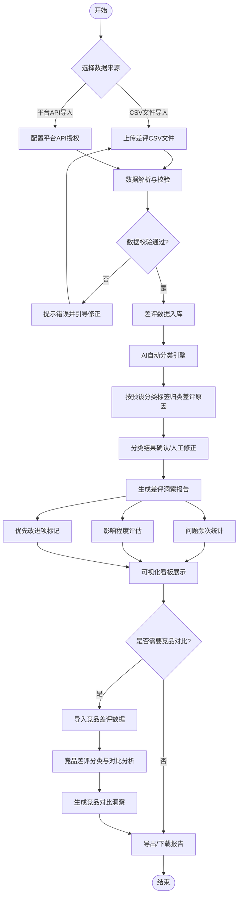
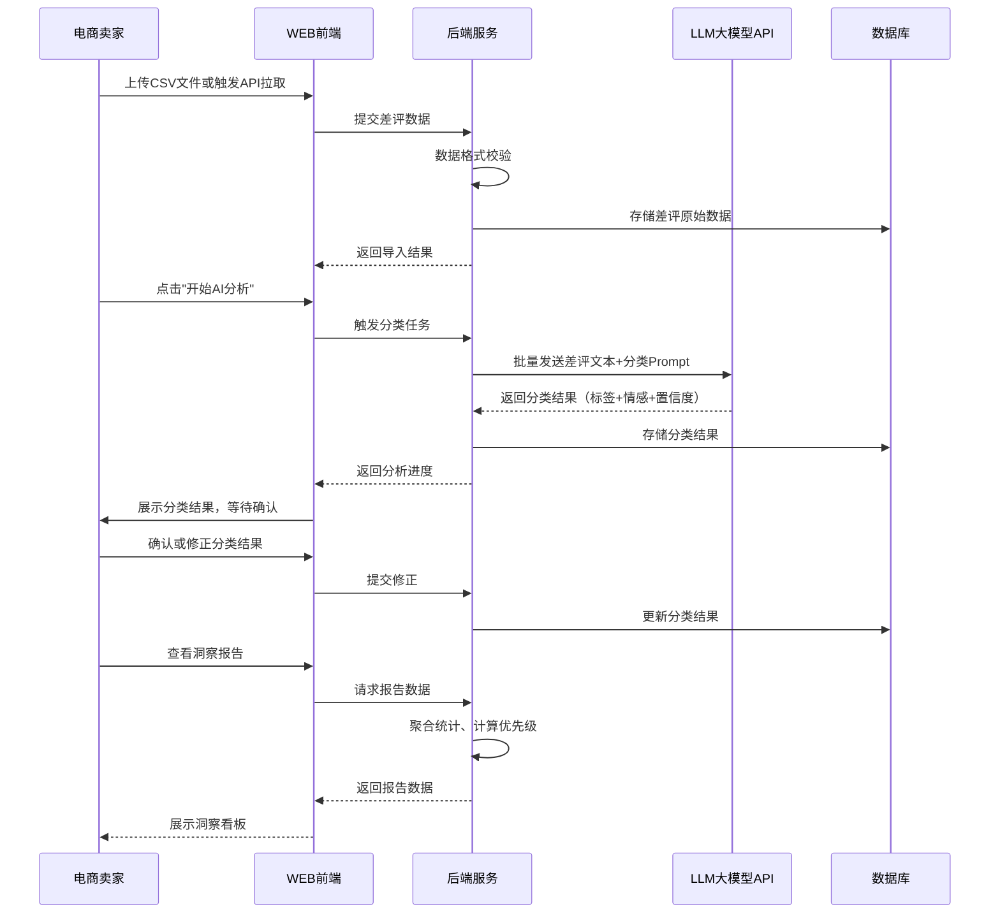
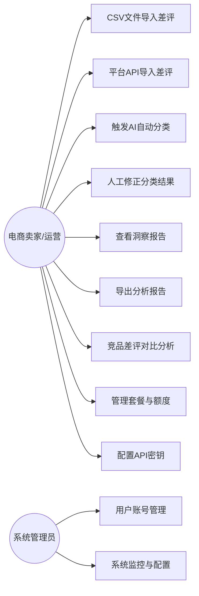
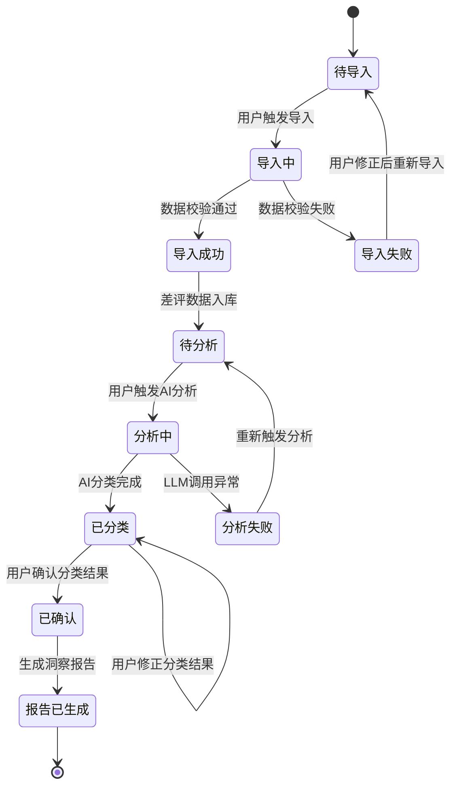

# 电商商品差评洞察分析器 - 用户需求说明书（URS）

# 1. 需求概述

## 1.1 需求介绍

电商商品差评洞察分析器是一款面向电商卖家和运营人员的AI驱动差评分析工具。该产品通过批量导入商品差评数据，利用大语言模型（LLM）自动对差评原因进行智能分类，并按问题频次和影响程度生成差评洞察报告，帮助电商卖家快速定位产品缺陷、标记优先改进项，从而提升产品优化效率和客户满意度。

### 1.1.1 所属领域

电子商务 / 电商运营工具 / AI数据分析应用

## 1.2 需求目标

1. **降低差评分析成本**：将电商卖家从手动逐条阅读、归类差评的重复劳动中解放出来，将原本需要数小时的差评分析工作缩短至几分钟完成。
2. **提升产品改进决策效率**：通过AI自动分类和优先级标记，让卖家快速识别"哪些问题出现最多""哪些影响最大""应该先改什么"，辅助做出数据驱动的产品改进决策。
3. **发现竞品差异化机会**：通过可选的竞品差评对比功能，帮助卖家发现竞品用户痛点与自身优势，找到差异化改进方向和市场空白点。
4. **轻量化、即开即用**：以MVP形态快速交付，聚焦"差评分类+产品改进洞察"这一高频场景，不做通用电商ERP或客服系统，保持工具简洁专注。

## 1.3 系统使用角色

| 角色 | 描述 | 典型使用场景 |
|------|------|-------------|
| 电商卖家（店主） | 淘宝/京东/拼多多/抖音电商平台的店铺经营者，关注产品质量和评分 | 定期（每周/每月）导入自家店铺差评，查看洞察报告，决定产品改进方向 |
| 电商运营人员 | 负责产品优化、客户管理的运营团队成员 | 日常监控差评趋势，针对突发差评激增进行归因分析，输出改进建议给产品团队 |
| 中小品牌方 | 需要从用户反馈中挖掘产品改进方向的品牌运营人员 | 同时管理多个商品/店铺的差评数据，进行跨商品对比，制定品牌级产品改进策略 |
| 系统管理员 | 负责系统配置、账号管理和订阅计费的管理角色 | 管理用户账号、套餐权限、API密钥配置、系统监控 |

## 1.4 业务流程图

流程说明：
1. 用户可通过CSV文件上传或电商平台API两种方式导入差评数据
2. 系统对导入数据进行格式校验，不合格数据引导用户修正
3. AI引擎自动对差评进行分类（质量、物流、描述不符、客服态度、价格等）
4. 用户可人工确认或修正AI分类结果，修正数据反哺模型
5. 系统基于分类结果生成洞察报告，包含频次统计、影响评估和优先级标记
6. 可选的竞品对比功能，支持导入竞品差评进行差异化分析
7. 最终报告支持在线查看、导出下载

# 2. 功能原型

| 原型名称 | 原型链接 | 对应端 | 备注 |
| --- | --- | --- | --- |
| 差评洞察分析器 - 数据导入页 | 同目录下UI原型文件 | WEB端 | 支持CSV上传和API配置入口 |
| 差评洞察分析器 - AI分类与确认页 | 同目录下UI原型文件 | WEB端 | 展示AI分类结果，支持人工修正 |
| 差评洞察分析器 - 洞察报告看板 | 同目录下UI原型文件 | WEB端 | 可视化展示分析结果、优先级标记 |
| 差评洞察分析器 - 竞品对比页 | 同目录下UI原型文件 | WEB端 | 可选功能，竞品差评对比分析 |
| 差评洞察分析器 - 设置与账号页 | 同目录下UI原型文件 | WEB端 | 套餐管理、API配置、团队设置 |

# 3. 需求清单

## 3.1 差评数据管理端 - WEB端

| 模块 | 一级功能 | 二级功能 | 功能描述 | 备注 |
| --- | --- | --- | --- | --- |
| 数据导入 | CSV文件导入 | 文件上传 | 支持用户上传符合模板格式的CSV差评文件，文件大小限制100MB以内 | 必选 |
| 数据导入 | CSV文件导入 | 模板下载 | 提供标准CSV导入模板下载，包含必填字段说明和示例数据 | 必选 |
| 数据导入 | CSV文件导入 | 数据预览与校验 | 上传后展示数据预览（前10条），校验字段完整性，标红异常行并给出修正建议 | 必选 |
| 数据导入 | 平台API导入 | API授权配置 | 支持用户配置淘宝/京东/拼多多/抖音电商平台的API密钥和授权信息 | 必选 |
| 数据导入 | 平台API导入 | 店铺绑定 | 授权后可选择绑定的店铺，支持多店铺同时导入 | 必选 |
| 数据导入 | 平台API导入 | 差评数据拉取 | 按时间范围、商品SKU等条件从平台拉取差评数据，支持手动触发和定时自动拉取 | 必选 |
| 数据导入 | 数据管理 | 差评数据列表 | 展示已导入的差评数据列表，支持按商品、时间、分类状态筛选和搜索 | 必选 |
| 数据导入 | 数据管理 | 差评数据删除 | 支持批量或单条删除差评数据，删除前需二次确认 | 必选 |
| 数据导入 | 数据管理 | 数据导入记录 | 展示历次数据导入记录，包含导入时间、数据来源、数据条数、成功/失败统计 | 必选 |

## 3.2 AI分类引擎端 - WEB端

| 模块 | 一级功能 | 二级功能 | 功能描述 | 备注 |
| --- | --- | --- | --- | --- |
| AI自动分类 | 差评分类执行 | 一键启动分析 | 用户选择待分析的差评数据后，一键触发AI分类引擎，展示分析进度 | 必选，P0 |
| AI自动分类 | 差评分类执行 | 分类标签体系 | AI按预设标签分类差评原因：产品质量、物流配送、描述不符、客服态度、价格问题、包装破损、使用体验、其他 | 必选，P0 |
| AI自动分类 | 差评分类执行 | 多维度标签 | 支持为每条差评标注多个维度标签（如同时标记"物流慢"和"包装破损"），并标注情感强度（强负面/中负面/弱负面） | 必选 |
| AI自动分类 | 分类结果查看 | 分类结果列表 | 展示每条差评的AI分类结果，包含原文、分类标签、情感强度、置信度 | 必选 |
| AI自动分类 | 分类结果查看 | 按分类筛选 | 支持按分类标签、情感强度、置信度区间筛选查看分类结果 | 必选 |
| AI自动分类 | 人工修正 | 单条修正 | 用户可对单条差评的分类结果进行修改，修正后标记为"人工确认" | 必选 |
| AI自动分类 | 人工修正 | 批量修正 | 支持批量选择同类差评，统一修改分类标签 | 必选 |
| AI自动分类 | 人工修正 | 修正记录 | 记录所有人工修正操作，用于后续模型优化和分类准确率统计 | 必选 |

## 3.3 洞察报告端 - WEB端

| 模块 | 一级功能 | 二级功能 | 功能描述 | 备注 |
| --- | --- | --- | --- | --- |
| 洞察报告生成 | 报告概览 | 核心指标卡片 | 展示差评总数、分类类别数、Top3问题类别、平均情感强度等核心指标 | 必选，P0 |
| 洞察报告生成 | 报告概览 | 问题频次排行 | 按出现频次从高到低排列各分类标签，以柱状图+数据表形式展示 | 必选，P0 |
| 洞察报告生成 | 报告概览 | 影响程度矩阵 | 以"频次-影响"二维矩阵展示各类问题，帮助用户识别高频高影响的关键问题 | 必选 |
| 洞察报告生成 | 优先改进标记 | 改进优先级排序 | 综合频次和影响程度，自动生成改进优先级排序（P0/P1/P2），以红/黄/绿三色标记 | 必选，P0 |
| 洞察报告生成 | 优先改进标记 | 改进建议生成 | 针对P0级问题，基于差评原文提炼具体改进建议（如"建议加强包装防护"） | 必选 |
| 洞察报告生成 | 优先改进标记 | 改进追踪 | 支持将优先改进项标记为"已关注""处理中""已解决"，便于跟踪改进进度 | 可选 |
| 洞察报告生成 | 趋势分析 | 差评趋势图 | 按日/周/月维度展示差评数量和各类问题占比的变化趋势 | 专业版功能 |
| 洞察报告生成 | 趋势分析 | 环比/同比对比 | 支持不同时间段的差评数据环比、同比对比分析 | 专业版功能 |
| 洞察报告生成 | 报告导出 | PDF报告导出 | 将完整洞察报告导出为PDF文件，包含图表和数据，适合内部汇报 | 必选 |
| 洞察报告生成 | 报告导出 | Excel数据导出 | 将分类结果和统计数据导出为Excel文件，便于进一步分析 | 必选 |

## 3.4 竞品对比端 - WEB端

| 模块 | 一级功能 | 二级功能 | 功能描述 | 备注 |
| --- | --- | --- | --- | --- |
| 竞品差评导入 | 竞品数据管理 | 竞品店铺/商品添加 | 支持用户添加竞品店铺或商品链接/ID，系统拉取对应差评数据 | 可选，专业版 |
| 竞品差评导入 | 竞品数据管理 | 竞品差评导入 | 通过API或手动方式导入竞品差评数据 | 可选，专业版 |
| 竞品对比分析 | 差异化分析 | 分类标签对比 | 将自家产品与竞品的差评分类结果进行对比，展示各类问题占比差异 | 可选，专业版 |
| 竞品对比分析 | 差异化分析 | 优势/劣势识别 | 自动识别自家产品相对竞品的优势项（差评占比更低）和劣势项（差评占比更高） | 可选，专业版 |
| 竞品对比分析 | 差异化分析 | 市场空白发现 | 识别竞品有但自家未覆盖的问题类别，或竞品表现好但自身待改进的领域 | 可选，专业版 |
| 竞品对比分析 | 对比报告 | 竞品对比报告生成 | 生成包含自身vs竞品的对比分析报告，含可视化图表和改进建议 | 可选，专业版 |

## 3.5 系统设置端 - WEB端

| 模块 | 一级功能 | 二级功能 | 功能描述 | 备注 |
| --- | --- | --- | --- | --- |
| 账号与套餐 | 套餐管理 | 套餐查看 | 展示当前套餐类型（免费版/专业版）、剩余分析额度、到期时间 | 必选 |
| 账号与套餐 | 套餐管理 | 套餐升级 | 支持从免费版升级到专业版，展示专业版功能和价格 | 必选 |
| 账号与套餐 | 用量统计 | 月度用量 | 展示本月已分析差评条数、剩余额度（免费版500条/月限制） | 必选 |
| 账号与套餐 | 用量统计 | 用量预警 | 当免费额度使用达到80%时，系统提醒用户升级套餐 | 必选 |
| 团队协作 | 成员管理 | 邀请成员 | 专业版用户可邀请团队成员加入，分配不同角色（管理员/运营/只读） | 专业版功能 |
| 团队协作 | 成员管理 | 角色权限 | 管理员可配置成员权限：数据导入、报告查看、设置修改等 | 专业版功能 |
| 系统配置 | API密钥管理 | LLM API配置 | 支持用户配置自有LLM API密钥（如OpenAI、Claude等），用于AI分类功能 | 必选 |
| 系统配置 | API密钥管理 | 平台API管理 | 管理已绑定的电商平台API授权，支持刷新、解绑操作 | 必选 |
| 系统配置 | 分类标签配置 | 自定义标签 | 支持用户在默认标签体系基础上添加自定义分类标签，适配特定品类需求 | 可选 |

# 4. 非功能需求

## 4.1 使用界面需求

| 需求项 | 需求描述 |
|--------|----------|
| 响应式设计 | WEB端需适配主流浏览器（Chrome、Firefox、Safari、Edge），最小支持1280×720分辨率 |
| 操作引导 | 首次使用时提供引导流程，帮助用户完成数据导入、API配置等关键操作 |
| 加载反馈 | 数据导入、AI分析等耗时操作需展示进度条和预估剩余时间 |
| 错误提示 | 操作失败时提供清晰的错误信息和解决建议，而非技术错误码 |
| 深色模式 | MVP阶段不要求，后续版本考虑 |

## 4.2 软硬件环境需求

| 需求项 | 需求描述 |
|--------|----------|
| 客户端 | 现代浏览器（Chrome 90+、Firefox 88+、Safari 14+、Edge 90+） |
| 服务端 | 云端部署（SaaS模式），支持主流云服务器（阿里云、腾讯云、AWS等） |
| 数据库 | 关系型数据库（PostgreSQL/MySQL）存储用户数据和差评数据 |
| AI引擎 | 对接大语言模型API（OpenAI GPT-4/Claude/国产大模型等）进行差评分类 |
| 对象存储 | 用于存储导入的CSV文件和导出的报告文件 |

## 4.3 性能需求

| 需求项 | 需求描述 |
|--------|----------|
| 单次分析性能 | 1000条差评的AI分类分析应在5分钟内完成 |
| 并发支持 | 支持至少50个用户同时进行差评分析任务 |
| 页面加载 | 首屏加载时间不超过3秒（良好网络环境） |
| 数据导入 | 单次CSV文件上传支持最大100MB，导入解析时间不超过30秒 |
| 报告生成 | 洞察报告生成时间不超过10秒（基于已完成的分类数据） |
| 数据存储 | 单用户支持存储至少10万条差评历史数据 |

## 4.4 约束性需求

1. 本系统不提供电商平台对接的全部功能，仅聚焦"差评数据导入→AI分类→洞察报告"这一核心链路，不做订单管理、客服聊天、商品管理等通用电商功能。
2. AI分类引擎不自研大模型，必须基于外部LLM API（如OpenAI、Claude等）实现，系统负责Prompt工程和结果解析。
3. 免费版每月限制分析500条差评，超出后需升级专业版（¥79/月），系统需实现准确的额度计量和限制。
4. 用户差评数据涉及商业敏感信息，系统必须保证数据隔离（不同用户数据不可互访）和传输加密（HTTPS）。
5. 系统不提供人工客服功能，不做差评回复、工单流转等客服管理功能。
6. 系统需要后台服务来支撑AI分类引擎、数据存储、报告生成等功能。

# 5. 接口需求

## 5.1 硬件接口需求

本项目为纯Web应用，无特殊硬件接口需求。

## 5.2 软件接口需求

| 模块 | 接口名称 | 输入 | 输出 | 功能描述 |
| --- | --- | --- | --- | --- |
| 数据导入 | 电商平台差评API | 店铺授权Token、时间范围、商品SKU | 差评数据列表（含评价内容、评分、时间、商品信息） | 从淘宝/京东/拼多多/抖音等平台拉取差评数据 |
| 数据导入 | CSV文件解析接口 | CSV文件流 | 结构化差评数据 | 解析用户上传的CSV文件，提取差评字段 |
| AI分类引擎 | LLM分类API | 差评原文、分类标签体系、Prompt模板 | 分类标签、情感强度、置信度 | 调用大语言模型API对差评进行智能分类 |
| 洞察报告 | 报告导出接口 | 分析结果数据、导出格式（PDF/Excel） | 导出文件流 | 将洞察报告数据转换为PDF或Excel文件 |
| 系统设置 | 用户认证接口 | 用户名/密码或第三方登录凭证 | 访问Token、用户信息 | 用户注册、登录、鉴权 |
| 系统设置 | 支付接口 | 套餐选择、支付信息 | 支付结果、套餐状态 | 处理专业版套餐订阅支付（如接入微信支付/支付宝） |

## 5.4 通讯接口需求

本项目为Web应用，使用标准HTTPS协议进行前后端通讯，无特殊通讯接口需求。

# 6. 附录

## 流程图

### 差评导入与分析主流程

## 用例图

## 状态图

