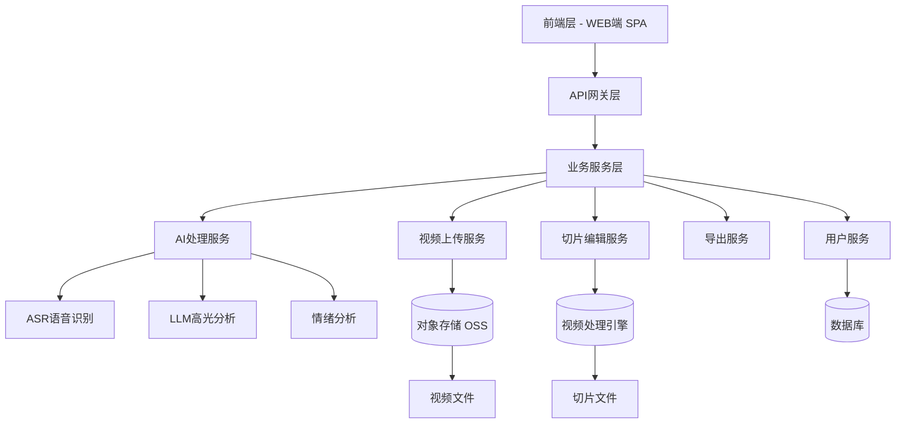
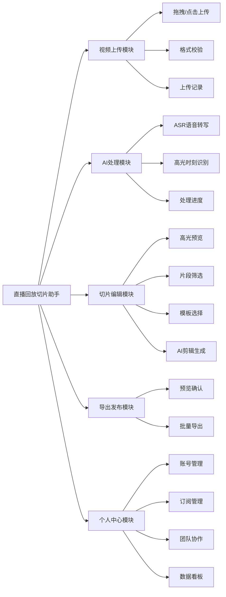
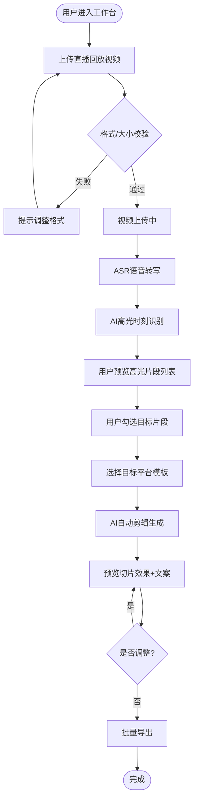
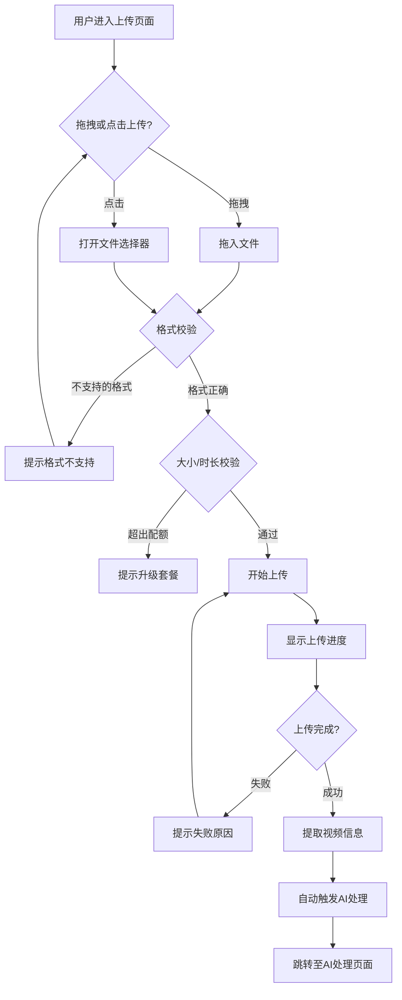
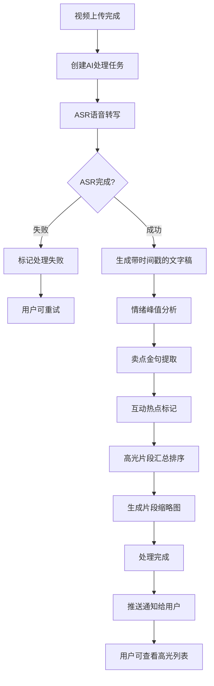
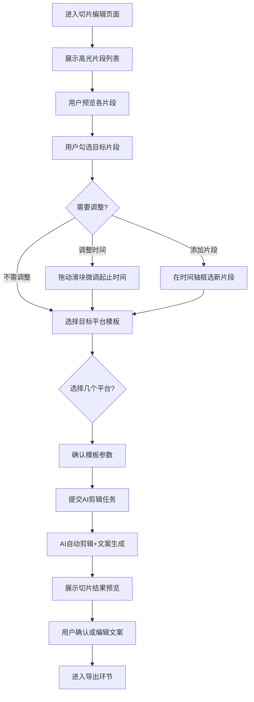
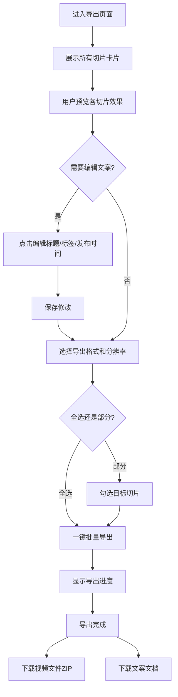
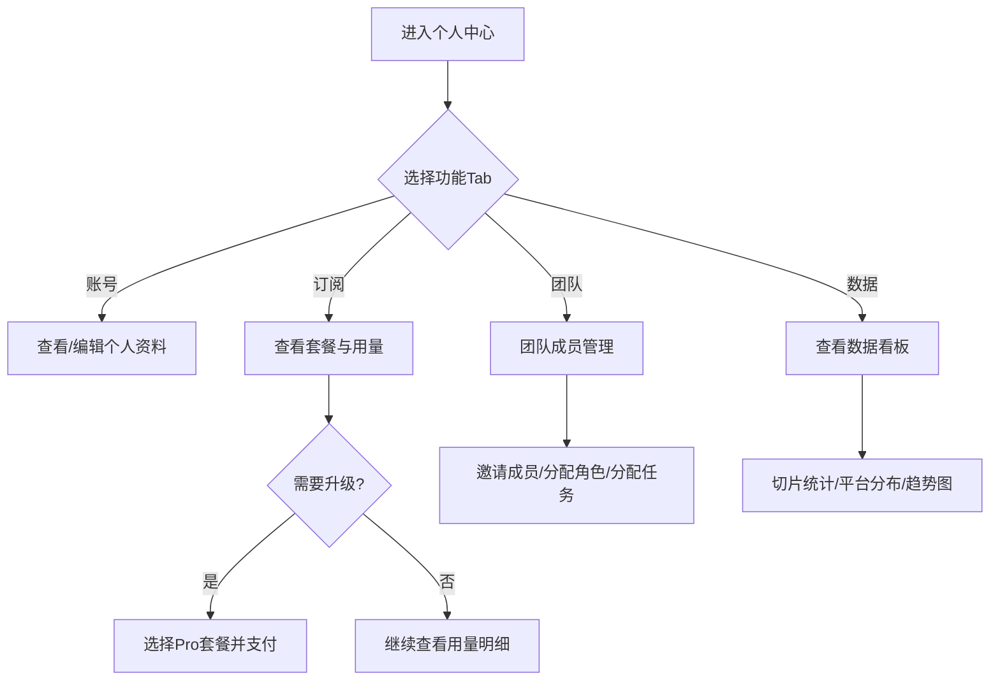
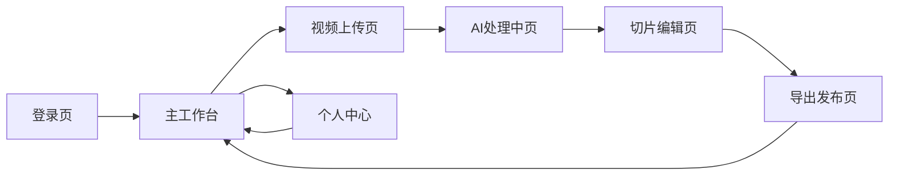
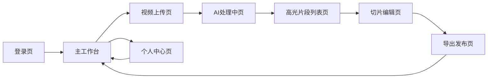

# 直播回放切片助手 — 产品需求文档（PRD）

| 版本号 | 变更日期 | 变更内容 | 变更人 | 审核人 |
| --- | --- | --- | --- | --- |
| V1.0 | 2026-06-29 | 初始版本创建 | 产品文档结对写作专家 | 阶段一产品落地页文档总编辑 |

---

# 1 概述

## 1.1 需求背景

直播电商行业高速增长，主播和运营团队每天产生大量直播回放内容。然而从"直播结束"到"多平台短视频分发"之间存在巨大的效率瓶颈：一段2小时的直播回放，传统人工剪辑需要3-4小时才能产出5-10条高质量切片短视频。对于拥有多个主播的MCN机构而言，这一人力成本更加难以承受。

与此同时，短视频平台（抖音、小红书、视频号等）各自有不同的视频规格、内容风格和推荐机制，进一步增加了多平台分发的复杂度。

**直播回放切片助手**旨在通过AI技术打通"直播回放→多平台短视频"的自动化流水线，将人工剪辑时间从3-4小时缩短至20分钟以内，帮助直播从业者快速将直播内容资产转化为多平台分发素材。

**核心业务价值：**
- 效率提升10倍以上：AI自动识别高光时刻+自动剪辑
- 一次上传、多平台适配：自动按抖音/小红书/视频号模板生成
- 降低专业门槛：无需视频剪辑技能即可完成高质量切片

## 1.2 名词解释

| **名词** | **说明** |
| --- | --- |
| 直播回放 | 直播结束后生成的完整视频录像文件 |
| 切片 | 从直播回放中提取的短片段，通常15-60秒，适合短视频平台发布 |
| 高光时刻 | 直播中最具价值的片段，包括情绪峰值、卖点金句、互动热点等 |
| ASR | Automatic Speech Recognition，自动语音识别，将视频中的语音转为文字 |
| LLM | Large Language Model，大语言模型，用于分析文本内容和生成文案 |
| 情绪峰值 | 主播在直播中情绪波动最大的时刻，通常表现为语速加快、音调升高 |
| 卖点金句 | 主播介绍产品时的精彩话术，包含核心卖点和促销信息 |
| 互动热点 | 弹幕/评论互动密集的时段，表示观众反响热烈 |
| 平台模板 | 各短视频平台对视频时长、比例、封面等的规范要求 |

## 1.3 产品介绍

**直播回放切片助手**是一款面向直播从业者的AI驱动内容创作SaaS工具。用户将直播回放长视频上传至平台后，系统通过AI自动识别高光时刻，并按照不同短视频平台的模板规范，自动剪辑生成多段短视频，同时附带标题、标签、发布时间建议，大幅缩短内容生产周期。

### 1.3.1 目标用户

| 用户角色 | 使用场景 | 核心价值 |
| --- | --- | --- |
| 直播主播/达人 | 下播后快速产出切片短视频，多平台分发引流 | 节省剪辑时间，专注内容创作 |
| 直播运营人员 | 批量处理旗下主播回放，管理切片发布计划 | 一人管理多主播，效率翻倍 |
| MCN机构管理员 | 团队协作管理，查看团队切片数据，协调发布排期 | 团队协同，数据可视化 |
| 知识付费讲师 | 将知识直播切片为短内容，多平台分发获客 | 知识内容二次变现 |

### 1.3.2 范围说明

| 项 | 内容 |
| --- | --- |
| 包含功能 | 视频上传与管理、AI语音转写、AI高光时刻识别、高光片段预览与筛选、平台模板选择、AI自动剪辑、标题/标签/发布建议生成、批量导出、个人中心（订阅管理/团队协作/数据看板） |
| 不包含功能 | 直播功能（仅处理已结束的回放）、视频发布到第三方平台（仅支持导出）、通用视频剪辑功能（非剪映/PR替代品）、视频拍摄功能 |

---

# 2 产品设计

## 2.1 系统架构图

## 2.2 业务模块图

## 2.3 主业务流程

## 2.4 功能图/列表

| 功能模块 | 功能名称 | 优先级 | 功能描述 |
| --- | --- | --- | --- |
| 视频上传 | 拖拽/点击上传 | P0 | 支持拖拽或点击方式上传直播回放视频，支持MP4/AVI/MOV/FLV格式 |
| 视频上传 | 上传进度显示 | P0 | 实时显示上传进度百分比和预计剩余时间 |
| 视频上传 | 格式与大小校验 | P0 | 上传前自动校验视频格式、文件大小、时长限制 |
| 视频上传 | 视频管理 | P1 | 查看历史上传记录，支持删除操作 |
| AI处理 | ASR语音转写 | P0 | 自动将视频语音转为带时间戳的文字稿 |
| AI处理 | 情绪峰值检测 | P0 | AI分析主播语音情绪变化，识别情绪高涨片段 |
| AI处理 | 卖点金句提取 | P0 | AI识别直播中的产品卖点描述、促销话术 |
| AI处理 | 互动热点标记 | P1 | 标记弹幕/评论互动密集的时段 |
| AI处理 | 处理进度展示 | P0 | 实时展示AI处理阶段和整体进度 |
| 切片编辑 | 高光片段预览 | P0 | 逐个播放预览AI识别的高光片段 |
| 切片编辑 | 片段筛选与调整 | P0 | 勾选/取消片段，微调起止时间，手动添加片段 |
| 切片编辑 | 平台模板选择 | P0 | 选择抖音/小红书/视频号模板，支持多平台批量选择 |
| 切片编辑 | AI自动剪辑 | P0 | 基于选定片段和模板自动裁剪视频、添加转场和字幕 |
| 切片编辑 | AI文案生成 | P0 | 生成标题、标签、发布时间建议 |
| 导出发布 | 预览确认 | P0 | 逐一预览切片视频效果，编辑标题标签 |
| 导出发布 | 批量导出 | P0 | 一键批量导出切片视频和文案文档 |
| 个人中心 | 账号管理 | P0 | 注册登录、个人信息管理 |
| 个人中心 | 订阅管理 | P1 | 查看/升级订阅套餐，查看用量统计 |
| 个人中心 | 团队协作 | P2 | 邀请团队成员，分配角色权限和任务 |
| 个人中心 | 数据看板 | P1 | 切片数量、导出次数、平台分布等统计 |

## 2.5 你的产品有哪些端

| 序号 | 端名称 | 端类型 | 目标用户 | 说明 |
| --- | --- | --- | --- | --- |
| 1 | 直播回放切片助手 WEB端 | WEB端 | 直播主播/达人、运营人员、MCN管理员、知识付费讲师 | 用户在PC浏览器中使用，完成视频上传、AI处理、切片编辑、导出发布全流程 |

---

# 3 产品功能

## 3.1 WEB端功能

### 3.1.1 视频上传

视频上传模块是用户进入系统后的核心入口。用户可以通过拖拽或点击方式将直播回放视频文件上传至平台，系统自动完成格式校验、文件存储和基本信息提取。

**功能描述**

| 项 | 内容 |
| --- | --- |
| 优先级 | P0 |
| 依赖需求 | 无 |
| 前置条件 | 用户已登录 |

**功能详情**

1. **拖拽上传**：用户可将本地视频文件拖拽至上传区域，系统自动识别并开始上传。上传区域有明显的视觉引导。
2. **点击上传**：点击上传按钮打开文件选择器，支持多文件选择。
3. **格式校验**：支持MP4/AVI/MOV/FLV格式，不支持的格式给出明确提示并拒绝上传。
4. **大小校验**：免费版限制每月累计60分钟回放时长，Pro版不限时长。超出限制时提示升级。
5. **上传进度**：实时显示上传进度条、百分比、上传速度和预计剩余时间。
6. **视频信息提取**：上传完成后自动提取视频时长、分辨率、文件大小、编码格式等信息。
7. **上传记录**：用户可查看历史上传列表，包含文件名、时长、上传时间、处理状态（处理中/已完成/失败）。
8. **视频删除**：支持删除已上传视频及其关联的切片结果。

### 3.1.2 视频上传—详细流程

**业务规则说明：**
1. 单个视频文件最大支持4GB，超过4GB提示用户压缩后上传。
2. 免费版每月累计上传时长60分钟，每月1日重置；Pro版不限时长。
3. 上传过程中用户可关闭页面，系统后台继续上传（断点续传）。
4. 同一时间最多支持3个视频并行上传。
5. 视频上传后默认进入合规审核（涉黄涉暴检测），审核不通过的视频标记为"审核未通过"并禁止处理。

### 3.1.3 视频上传—主要原型

[视频上传组件原型](assets/prototypes/video-upload-widget.html)

**验收标准说明：**
- [ ] 正常流程：拖拽MP4文件到上传区域，显示进度条并成功上传，上传完成后自动跳转AI处理页面
- [ ] 正常流程：点击上传按钮，选择多个文件，所有文件按序上传
- [ ] 异常流程：拖入不支持的格式（如.txt），弹出提示"不支持该文件格式，请上传MP4/AVI/MOV/FLV格式视频"
- [ ] 异常流程：免费版用户上传时长超过60分钟，弹出提示"本月免费额度已用完，升级Pro版享不限时长"
- [ ] 性能要求：上传速度不低于用户带宽的60%，支持断点续传

---

### 3.1.4 AI处理

AI处理模块是系统的核心引擎。视频上传完成后自动触发ASR语音转写和AI高光时刻识别，将长视频转化为结构化的高光片段列表。

**功能描述**

| 项 | 内容 |
| --- | --- |
| 优先级 | P0 |
| 依赖需求 | 视频上传完成 |
| 前置条件 | 视频上传成功且通过合规审核 |

**功能详情**

1. **ASR语音转写**：自动将视频中的语音内容转为带时间戳的完整文字稿，转写准确率≥95%。
2. **情绪峰值检测**：分析主播语音的音调、语速、音量变化，识别情绪高涨片段并标记情绪强度评分（0-100）。
3. **卖点金句提取**：基于LLM分析转写文本，识别产品卖点描述、促销话术、价格信息等高价值内容片段。
4. **互动热点标记**：根据视频中的弹幕/评论密度（如有弹幕数据），标记观众互动最密集的时段。
5. **高光片段汇总**：将以上三类高光整合为统一列表，每个片段包含：时间范围、高光类型（情绪/金句/互动）、AI置信度评分、关联文字稿内容。
6. **处理进度展示**：分阶段展示处理进度（ASR转写中→高光分析中→处理完成），显示整体百分比。
7. **处理完成通知**：处理完成后通过页面顶部通知横幅提醒用户。

### 3.1.5 AI处理—详细流程

**业务规则说明：**
1. 2小时视频的完整处理应在20分钟内完成。
2. 每个视频最多识别20个高光片段，按AI评分降序排列。
3. 高光片段最短15秒，最长不超过3分钟。
4. 处理失败时支持一键重试，已完成的步骤不重复执行。
5. 转写文字稿支持用户手动编辑修正，修正后AI高光分析自动重新执行。

### 3.1.6 AI处理—主要原型

[AI处理进度组件原型](assets/prototypes/ai-processing-widget.html)

**验收标准说明：**
- [ ] 正常流程：视频上传后自动进入AI处理，页面显示实时进度条和当前处理阶段
- [ ] 正常流程：处理完成后展示高光片段列表，每个片段显示时间范围、类型标签、评分、缩略图
- [ ] 正常流程：点击片段可跳转播放对应视频区域，同时高亮显示关联文字稿
- [ ] 异常流程：处理失败时显示失败原因和"重试"按钮

---

### 3.1.7 切片编辑

切片编辑模块是用户与AI产出交互的核心界面。用户可预览AI识别的高光片段、筛选目标片段、选择平台模板，并触发AI自动剪辑生成。

**功能描述**

| 项 | 内容 |
| --- | --- |
| 优先级 | P0 |
| 依赖需求 | AI处理完成 |
| 前置条件 | AI高光识别已完成 |

**功能详情**

1. **片段视频预览**：逐个播放AI识别的高光片段，支持原片定位播放和片段独立播放。
2. **片段信息展示**：每个片段卡片展示时间范围、高光类型标签、AI评分、关联文字稿摘要。
3. **片段勾选**：用户可勾选/取消勾选需要用于切片的片段，默认全选AI评分≥70的片段。
4. **时间范围微调**：用户可拖动片段起止时间滑块进行微调（精确到秒）。
5. **手动添加片段**：用户可在时间轴上手动框选区域添加AI未识别的切片片段。
6. **平台模板选择**：
   - 抖音模板：竖版9:16，15-60秒，快节奏剪辑
   - 小红书模板：图文笔记格式，提取关键帧+文案
   - 视频号模板：横版16:9或竖版9:16，30-120秒
7. **多平台批量选择**：可同时选择多个目标平台，系统为每个平台分别生成适配版本。
8. **模板参数预览**：展示所选模板的时长范围、画面比例、字幕样式等参数。
9. **AI自动剪辑**：基于选定片段和模板自动完成视频裁剪、转场添加、字幕叠加。
10. **AI文案生成**：为每个切片生成吸引人的标题（含emoji）、热门标签（含话题标签）、最佳发布时间建议。

### 3.1.8 切片编辑—详细流程

**业务规则说明：**
1. 每个视频最多生成30个切片（含多平台版本）。
2. 抖音模板切片时长15-60秒，小红书笔记提取3-6张关键帧，视频号切片30-120秒。
3. AI标题生成包含内容关键词+emoji，长度≤30字。
4. 标签生成数量：抖音5-8个（含话题标签），小红书8-12个（含话题标签），视频号3-5个。
5. 发布时间建议基于平台特性和内容类型，给出3个推荐时间段。
6. 用户编辑文案后，系统自动保存编辑版本（不再显示AI原始版本）。

### 3.1.9 切片编辑—主要原型

[切片编辑器原型](assets/prototypes/clip-editor-widget.html)

**验收标准说明：**
- [ ] 正常流程：展示高光片段列表，用户可勾选片段、选择平台模板、点击"生成切片"
- [ ] 正常流程：时间轴上可拖动滑块微调片段起止时间，支持手动框选添加新片段
- [ ] 正常流程：选择多平台后，系统为每个平台分别生成适配版本
- [ ] 异常流程：未选择任何片段时，"生成切片"按钮置灰不可点击

---

### 3.1.10 导出发布

导出发布模块是用户获取最终产出物的最后环节。用户可预览所有切片效果、编辑文案，然后一键批量导出视频文件和文案文档。

**功能描述**

| 项 | 内容 |
| --- | --- |
| 优先级 | P0 |
| 依赖需求 | AI剪辑完成 |
| 前置条件 | 切片生成已完成 |

**功能详情**

1. **切片结果预览**：卡片式展示所有生成的切片，每个卡片包含视频缩略图、标题、时长、目标平台标识。
2. **标题标签编辑**：用户可点击编辑AI生成的标题、标签、发布时间建议，支持实时预览修改效果。
3. **视频文件导出**：一键批量导出所有切片视频，支持选择格式（MP4/MOV）和分辨率（1080P/720P）。
4. **文案文档导出**：导出包含所有切片标题、标签、发布时间建议的文案文档，支持Excel和TXT格式。
5. **单独导出**：支持选择部分切片单独导出，不必全部导出。
6. **导出进度**：批量导出时显示导出进度和预计剩余时间。

### 3.1.11 导出发布—详细流程

**业务规则说明：**
1. 批量导出视频文件打包为ZIP，单个切片视频文件名格式：`{平台}_{序号}_{标题简写}.mp4`。
2. 文案文档Excel格式包含列：序号、平台、标题、标签、发布时间建议、视频文件名。
3. 免费版用户导出视频带水印（右下角"切片助手"标识），Pro版无水印。
4. 导出的视频和文案文件在服务端保留7天，过期自动清理。

### 3.1.12 导出发布—主要原型

[导出发布组件原型](assets/prototypes/export-widget.html)

**验收标准说明：**
- [ ] 正常流程：展示所有切片卡片，用户可勾选部分或全部，选择格式后点击"批量导出"
- [ ] 正常流程：导出完成后自动下载ZIP文件（视频）和Excel文件（文案）
- [ ] 异常流程：无切片可导出时显示空状态提示

---

### 3.1.13 个人中心

个人中心提供账号管理、订阅套餐管理、团队协作和数据看板功能。

**功能描述**

| 项 | 内容 |
| --- | --- |
| 优先级 | P1 |
| 依赖需求 | 无 |
| 前置条件 | 用户已登录 |

**功能详情**

**账号管理：**
1. 支持手机号/邮箱注册，微信扫码登录。
2. 可查看和修改个人资料（昵称、头像、联系方式）。
3. 支持修改密码和绑定/解绑微信。

**订阅管理：**
1. 展示当前订阅套餐（免费版/Pro版）和到期时间。
2. 展示本月已使用时长和剩余可用时长（免费版）。
3. 支持从免费版升级到Pro版（¥99/月），集成支付功能。
4. Pro版功能：不限回放时长、团队协作、多平台模板、数据分析、无水印导出。

**团队协作（Pro功能）：**
1. 邀请团队成员（通过链接/邮箱邀请）。
2. 分配角色：管理员（全部权限）、编辑者（上传/编辑/导出）、查看者（仅查看）。
3. 将视频处理任务分配给指定成员。

**数据看板：**
1. 切片总数、导出次数、本月处理视频数量。
2. 各平台切片分布饼图（抖音/小红书/视频号）。
3. 近30天处理趋势折线图。

### 3.1.14 个人中心—详细流程

**业务规则说明：**
1. 免费版每月1日00:00重置用量，Pro版不限制用量。
2. 团队成员上限：Pro版最多10人。
3. 数据看板数据每小时刷新一次。
4. 退订Pro版后，团队成员数据保留30天，超期自动解散团队。

### 3.1.15 个人中心—主要原型

[个人中心组件原型](assets/prototypes/user-center-widget.html)

**验收标准说明：**
- [ ] 正常流程：展示当前套餐信息、本月用量、团队成员列表、数据统计图表
- [ ] 正常流程：点击"升级Pro"弹出支付页面，支付成功后自动切换套餐
- [ ] 正常流程：邀请成员后，被邀请人收到通知并可加入团队

---

# 4 产品原型

## 4.1 页面跳转逻辑图

## 4.2 全站点原型设计

### 4.2.1 直播回放切片助手 WEB端

**页面清单：**

| 序号 | 页面名称 | 所属模块 | 页面描述 | 关键元素 |
| --- | --- | --- | --- | --- |
| 1 | 登录页 | 账号管理 | 用户登录入口 | 手机号/密码输入框、微信扫码登录按钮、注册链接 |
| 2 | 主工作台 | 全局 | 用户进入后的首页，展示最近视频和处理概览 | 上传入口、最近处理视频列表、快捷操作区、用量卡片 |
| 3 | 视频上传页 | 视频上传 | 上传直播回放视频 | 拖拽上传区域、文件选择按钮、格式说明、上传进度条 |
| 4 | AI处理中页 | AI处理 | 展示AI处理进度和结果 | 处理进度条、当前阶段标识、转写文字稿预览区 |
| 5 | 高光片段列表页 | 切片编辑 | 展示AI识别的高光片段 | 片段卡片列表、视频播放器、文字稿对照区、筛选工具栏 |
| 6 | 切片编辑页 | 切片编辑 | 片段选择、模板选择、剪辑预览 | 时间轴、片段勾选面板、平台模板选择器、预览窗口 |
| 7 | 导出发布页 | 导出发布 | 预览和导出切片结果 | 切片卡片网格、文案编辑面板、导出设置、批量下载按钮 |
| 8 | 个人中心页 | 个人中心 | 账号/订阅/团队/数据管理 | Tab导航、套餐信息卡片、团队列表、数据图表 |

**交互说明：**

- 页面跳转关系：

- 特殊交互：
  1. 视频上传支持拖拽区域高亮反馈，拖入文件时区域边框变为蓝色虚线
  2. AI处理页面进度条有平滑动画，阶段切换时有渐变色过渡
  3. 高光片段卡片hover时显示播放预览（缩略图自动播放）
  4. 时间轴支持鼠标拖拽缩放和片段框选
  5. 导出页面支持批量勾选，全选/反选快捷按钮
  6. 所有页面顶部有全局导航栏，左侧有侧边栏菜单

**产品原型：**

[🖥️ 打开WEB端全站点原型](assets/prototypes/web-prototype.html)

---

# 5 数据需求

## 5.1 数据使用规格

### 视频数据

| **字段** | **是否必填** | **描述** | **数据类型** |
| --- | --- | --- | --- |
| video_id | 是 | 视频唯一标识 | 字符串(UUID) |
| user_id | 是 | 上传者用户ID | 字符串(UUID) |
| filename | 是 | 原始文件名 | 字符串 |
| file_size | 是 | 文件大小（字节） | 数字 |
| duration | 是 | 视频时长（秒） | 数字 |
| resolution | 是 | 分辨率（如1920x1080） | 字符串 |
| format | 是 | 视频格式（MP4/AVI/MOV/FLV） | 字符串 |
| storage_url | 是 | 对象存储URL | 字符串 |
| status | 是 | 状态（uploading/processing/done/failed） | 字符串 |
| created_at | 是 | 上传时间 | 时间戳 |

### 高光片段数据

| **字段** | **是否必填** | **描述** | **数据类型** |
| --- | --- | --- | --- |
| clip_id | 是 | 片段唯一标识 | 字符串(UUID) |
| video_id | 是 | 所属视频ID | 字符串(UUID) |
| start_time | 是 | 片段起始时间（秒） | 数字 |
| end_time | 是 | 片段结束时间（秒） | 数字 |
| highlight_type | 是 | 高光类型（emotion/quote/interaction） | 字符串 |
| ai_score | 是 | AI置信度评分（0-100） | 数字 |
| transcript | 否 | 关联文字稿内容 | 字符串 |
| thumbnail_url | 否 | 缩略图URL | 字符串 |

### 切片产出数据

| **字段** | **是否必填** | **描述** | **数据类型** |
| --- | --- | --- | --- |
| slice_id | 是 | 切片唯一标识 | 字符串(UUID) |
| clip_id | 是 | 来源高光片段ID | 字符串(UUID) |
| platform | 是 | 目标平台（douyin/xiaohongshu/shipinhao） | 字符串 |
| title | 是 | 切片标题 | 字符串 |
| tags | 是 | 标签列表 | JSON数组 |
| publish_time_suggestion | 是 | 建议发布时间 | 字符串 |
| video_url | 是 | 切片视频存储URL | 字符串 |
| created_at | 是 | 生成时间 | 时间戳 |

## 5.2 统计数据

1. 用户本月累计上传视频数和总时长（P0）
2. 用户累计生成切片数，按平台分布统计（P0）
3. 用户累计导出次数和导出文件数（P1）
4. 团队成员处理任务统计（按成员维度）（P2）

## 5.3 埋点需求

| 页面 | 事件 | 采集字段 | 说明 |
| --- | --- | --- | --- |
| 视频上传页 | 上传视频 | user_id, video_id, file_size, duration, format | 记录每次上传行为 |
| AI处理中页 | 处理完成 | video_id, duration, process_time, highlight_count | 记录处理耗时和结果 |
| 切片编辑页 | 选择片段 | video_id, selected_count, platform_list | 记录用户选择偏好 |
| 切片编辑页 | 选择模板 | video_id, platform, template_id | 记录模板使用偏好 |
| 导出发布页 | 批量导出 | user_id, slice_count, platforms, format | 记录导出行为 |
| 个人中心页 | 升级套餐 | user_id, from_plan, to_plan, pay_amount | 记录付费转化 |

---

# 6 非功能需求

## 6.1 性能需求

**6.1.1 延迟**

| 编号 | 项目 | 最大延迟 | 平均延迟 | 优先级 | 备注 |
| --- | --- | --- | --- | --- | --- |
| 0001 | 页面加载 | <3秒 | <1.5秒 | 高 | 首次加载含资源下载 |
| 0002 | 页面交互响应 | <0.5秒 | <0.3秒 | 高 | 按钮点击、Tab切换等 |
| 0003 | 视频播放器起播 | <2秒 | <1秒 | 高 | 含首帧加载 |
| 0004 | AI高光识别（2小时视频） | <20分钟 | <15分钟 | 高 | 含ASR+分析全流程 |
| 0005 | 单个切片导出 | <30秒 | <15秒 | 中 | 1080P分辨率 |

**6.1.2 吞吐量**

| 编号 | 项 | 吞吐量 | 备注 |
| --- | --- | --- | --- |
| 0001 | 视频上传 | 同时100个用户并行上传 | 断点续传 |
| 0002 | AI处理队列 | 同时100个视频并行处理 | 队列调度 |
| 0003 | 切片导出 | 同时50个用户并行导出 | 视频编码资源池 |

**6.1.3 容量**

| 编号 | 项 | 容量 | 备注 |
| --- | --- | --- | --- |
| 0001 | 系统注册用户数 | ≤1,000,000 | |
| 0002 | 月活跃用户数 | ≤100,000 | |
| 0003 | 对象存储容量 | ≤100TB | 视频文件存储 |

## 6.2 安全需求

| 编号 | 项（系统数据 / 处理过程） |
| --- | --- |
| 0001 | 用户视频文件严格隔离，不可跨用户访问 |
| 0002 | 用户认证Token有效期24小时，过期需重新登录 |
| 0003 | 所有API接口需验证用户身份和权限 |
| 0004 | 视频内容需通过合规审核（涉黄涉暴检测），不合规视频不予处理 |
| 0005 | 用户支付信息通过第三方支付平台处理，系统不存储支付卡信息 |

## 6.3 可靠性

| 编号 | 项 | 值 |
| --- | --- | --- |
| 0001 | 服务可用性 | ≥99.9% |
| 0002 | 平均故障恢复时间 | ≤30分钟 |
| 0003 | 数据备份频率 | 每日全量备份 + 每小时增量备份 |

## 6.4 可连续性

| 编号 | 项 |
| --- | --- |
| 0001 | 系统需7×24小时运行 |
| 0002 | AI处理任务支持断点恢复，服务重启后自动继续未完成任务 |

## 6.5 可恢复性

| 编号 | 项 |
| --- | --- |
| 0001 | 用户上传中的视频支持断点续传，网络恢复后自动继续 |
| 0002 | AI处理失败时自动保存中间结果，重试时从失败点继续 |
| 0003 | 用户操作（文案编辑、片段选择）实时自动保存，意外关闭不丢失 |

## 6.6 兼容性

| 编号 | 要求 | 备注 |
| --- | --- | --- |
| 0001 | 兼容主流浏览器：Chrome ≥90，Firefox ≥88，Safari ≥14，Edge ≥90 | |
| 0002 | 适配分辨率：1280×720及以上，推荐1920×1080 | PC浏览器为主 |

## 6.7 易用性

| 编号 | 要求 | 备注 |
| --- | --- | --- |
| 0001 | 核心操作路径（上传→导出）不超过5步 | |
| 0002 | 首次使用提供新手引导（上传→处理→切片→导出全流程） | |
| 0003 | 支持亮色/暗色两种主题切换 | |
| 0004 | 所有耗时操作必须有进度反馈 | |

---

# 7 总结

## 7.1 上线计划

| 阶段 | 时间 | 内容 | 负责人 |
| --- | --- | --- | --- |
| 开发阶段 | 2026-07-01 ~ 2026-07-05 | 核心功能开发（视频上传+ASR+AI高光识别+模板+导出） | 开发团队 |
| 测试阶段 | 2026-07-06 ~ 2026-07-07 | 功能测试、性能测试、兼容性测试 | QA团队 |
| 灰度阶段 | 2026-07-08 ~ 2026-07-10 | 邀请10%种子用户试用，收集反馈 | 运营团队 |
| 全量上线 | 2026-07-11 | 全量开放注册 | 全体 |

## 7.2 后续迭代规划

- V1.1：增加B站、快手平台模板支持；增加AI封面自动生成功能
- V1.2：增加API接口开放，支持第三方工具集成；增加切片效果A/B测试功能
- V1.3：增加移动端APP，支持手机端上传和管理；增加AI自动发布到第三方平台功能

## 7.3 参考文档

- 直播回放切片助手 — 用户需求说明书（URS）
- 抖音创作者平台视频规范
- 小红书笔记发布规范
- 视频号创作规范
