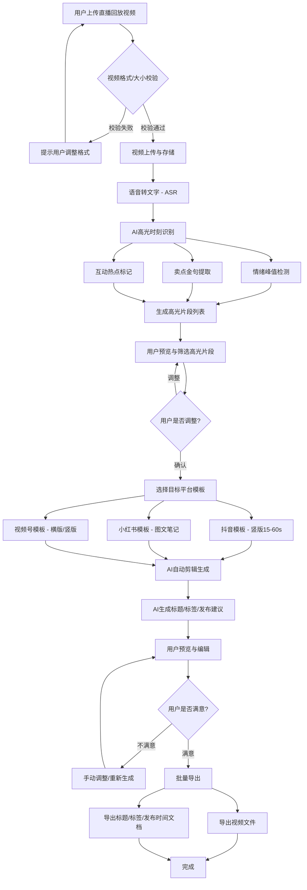
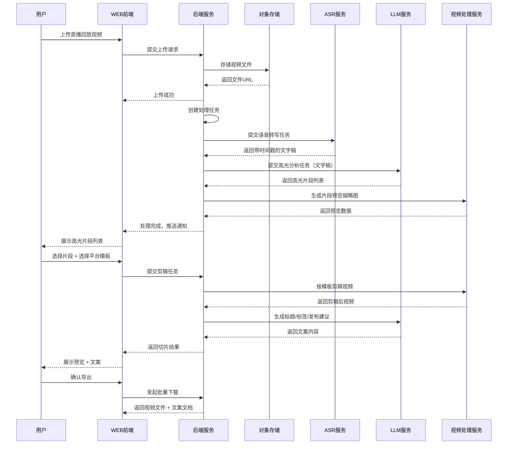
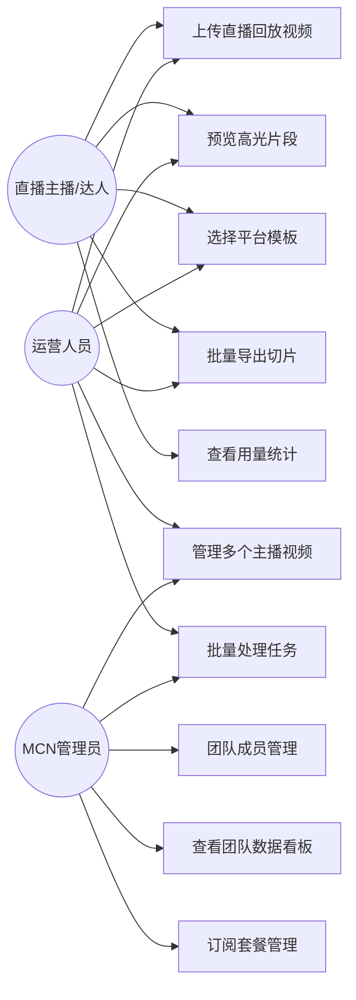
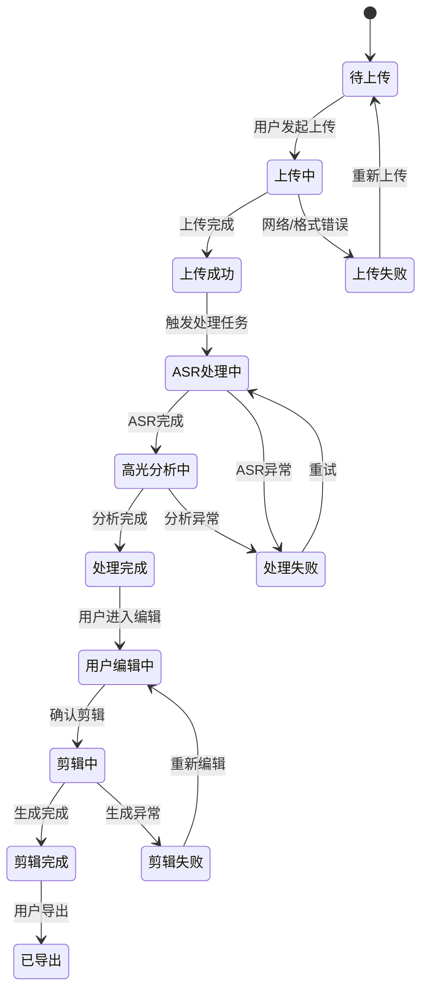

# 直播回放切片助手 — 用户需求说明书（URS）

# 1.需求概述

## 1.1 需求介绍

直播回放切片助手是一款面向直播主播、达人及运营团队的AI驱动内容创作工具。用户将直播回放长视频上传至平台后，系统通过AI自动识别高光时刻（情绪峰值、卖点金句、互动热点），并按照不同短视频平台（抖音、小红书、视频号等）的模板规范，自动剪辑生成多段短视频脚本或图文笔记，同时批量附带标题、标签、发布时间建议，大幅缩短从"直播结束"到"多平台分发"的内容生产周期。

### 1.1.1 所属领域

内容创作 / 直播电商 / AI视频处理

## 1.2 需求目标

1. **效率提升**：将传统2小时直播回放需要3-4小时人工剪辑的工作缩短至20分钟以内完成AI自动切片。
2. **多平台适配**：一次上传，自动按抖音、小红书、视频号等平台的模板规范生成适配内容。
3. **降低门槛**：无需专业视频剪辑技能，直播主播或运营人员即可快速完成切片分发。
4. **商业化落地**：提供免费版（60分钟回放/月）与Pro版（¥99/月，不限时长+团队协作+多平台模板+数据分析），支撑SaaS订阅商业模式。

## 1.3 系统使用角色

| 角色 | 说明 |
|------|------|
| 直播主播/达人 | 上传自己的直播回放，获取AI生成的切片短视频，用于二次分发引流 |
| 直播运营人员 | 批量处理旗下主播的回放视频，管理切片发布计划 |
| MCN机构管理员 | 管理多个主播账号，查看团队切片数据，协调内容发布排期 |
| 知识付费讲师 | 将知识类直播切片为短内容，用于多平台分发获客 |

## 1.4 业务流程图

# 2.功能原型

| 原型名称 | 原型链接 | 对应端 | 备注 |
| --- | --- | --- | --- |
| 直播回放切片助手 - 主工作台 | 待UI原型产出 | WEB端 | 视频上传、AI处理、切片管理主界面 |
| 直播回放切片助手 - 预览编辑器 | 待UI原型产出 | WEB端 | 高光片段预览、模板选择、批量导出 |
| 直播回放切片助手 - 个人中心 | 待UI原型产出 | WEB端 | 订阅管理、用量查看、团队协作 |

# 3.需求清单

## 3.1 直播回放切片助手 - WEB端

### 3.1.1 视频上传模块

| 模块 | 一级功能 | 二级功能 | 功能描述 | 备注 |
| --- | --- | --- | --- | --- |
| 视频上传 | 视频上传 | 拖拽上传 | 用户可通过拖拽方式将本地直播回放视频文件上传至平台 | 支持常见视频格式：MP4/AVI/MOV/FLV |
| 视频上传 | 视频上传 | 点击上传 | 用户可通过点击上传按钮选择本地视频文件进行上传 | 支持多文件选择 |
| 视频上传 | 视频上传 | 上传进度显示 | 上传过程中实时显示上传进度百分比和预计剩余时间 | |
| 视频上传 | 格式校验 | 格式支持校验 | 上传前自动校验视频格式是否在支持列表内 | 不支持的格式给出明确提示 |
| 视频上传 | 格式校验 | 文件大小校验 | 根据用户订阅等级校验文件大小/时长限制 | 免费版60分钟/月，Pro版不限 |
| 视频上传 | 视频信息 | 视频基本信息提取 | 上传完成后自动提取视频时长、分辨率、文件大小等基本信息 | |
| 视频上传 | 视频管理 | 上传记录查看 | 用户可查看历史上传视频列表，包含状态（处理中/已完成/失败） | |
| 视频上传 | 视频管理 | 视频删除 | 用户可删除已上传的视频文件及其关联的切片结果 | |

### 3.1.2 AI处理模块

| 模块 | 一级功能 | 二级功能 | 功能描述 | 备注 |
| --- | --- | --- | --- | --- |
| AI处理 | 语音转文字 | 自动ASR转写 | 视频上传完成后自动触发语音转文字处理，生成带时间戳的完整文字稿 | |
| AI处理 | 语音转文字 | 转写结果查看 | 用户可查看完整转写文字稿，支持按时间戳定位到视频对应位置 | |
| AI处理 | 高光识别 | 情绪峰值检测 | AI分析主播语音情绪变化，识别情绪高涨片段（如激动、兴奋、强调） | |
| AI处理 | 高光识别 | 卖点金句提取 | AI识别直播中的产品卖点描述、促销话术等高价值内容片段 | |
| AI处理 | 高光识别 | 互动热点标记 | AI标记弹幕/评论互动密集的时段，识别观众反响热烈的片段 | |
| AI处理 | 高光识别 | 高光片段列表 | 将识别结果汇总为高光片段列表，每个片段标注类型、时间范围、置信度 | |
| AI处理 | 处理状态 | 处理进度展示 | AI处理过程中实时展示当前处理阶段和整体进度 | |
| AI处理 | 处理状态 | 处理完成通知 | 处理完成后通过页面通知/站内消息告知用户 | |

### 3.1.3 切片编辑模块

| 模块 | 一级功能 | 二级功能 | 功能描述 | 备注 |
| --- | --- | --- | --- | --- |
| 切片编辑 | 高光预览 | 片段视频预览 | 用户可逐个播放预览AI识别出的高光片段 | |
| 切片编辑 | 高光预览 | 片段信息展示 | 每个片段展示时间范围、高光类型、AI评分、关联文字稿片段 | |
| 切片编辑 | 片段筛选 | 高光片段勾选 | 用户可勾选/取消勾选需要用于切片的高光片段 | |
| 切片编辑 | 片段筛选 | 手动调整时间范围 | 用户可微调每个高光片段的起止时间点 | |
| 切片编辑 | 片段筛选 | 手动添加片段 | 用户可在AI未识别的区域手动添加切片片段 | |
| 切片编辑 | 模板选择 | 平台模板选择 | 用户选择目标发布平台（抖音/小红书/视频号），系统自动适配平台规范 | |
| 切片编辑 | 模板选择 | 多平台批量选择 | 用户可同时选择多个目标平台，系统为每个平台分别生成适配版本 | |
| 切片编辑 | 模板选择 | 模板参数预览 | 展示所选模板的时长、比例、风格等参数供用户确认 | |
| 切片编辑 | AI生成 | 自动剪辑生成 | 基于选定片段和平台模板，AI自动完成视频裁剪、转场、字幕添加 | |
| 切片编辑 | AI生成 | 标题生成 | AI为每个切片视频生成吸引人的标题，结合内容关键信息 | |
| 切片编辑 | AI生成 | 标签生成 | AI生成适合目标平台的热门标签和话题标签 | |
| 切片编辑 | AI生成 | 发布时间建议 | AI根据平台特性和内容类型建议最佳发布时间 | |

### 3.1.4 导出与发布模块

| 模块 | 一级功能 | 二级功能 | 功能描述 | 备注 |
| --- | --- | --- | --- | --- |
| 导出发布 | 预览确认 | 切片结果预览 | 用户可逐一预览所有生成的切片视频效果 | |
| 导出发布 | 预览确认 | 标题标签编辑 | 用户可手动修改AI生成的标题、标签、发布建议 | |
| 导出发布 | 批量导出 | 视频文件导出 | 一键批量导出所有切片视频文件到本地 | |
| 导出发布 | 批量导出 | 文案文档导出 | 导出包含标题、标签、发布时间建议的文案文档（Excel/TXT） | |
| 导出发布 | 批量导出 | 导出格式选择 | 用户可选择视频导出格式（MP4/MOV）和分辨率 | |

### 3.1.5 个人中心模块

| 模块 | 一级功能 | 二级功能 | 功能描述 | 备注 |
| --- | --- | --- | --- | --- |
| 个人中心 | 账号管理 | 注册登录 | 支持手机号/邮箱注册，微信扫码登录 | |
| 个人中心 | 账号管理 | 个人信息管理 | 用户可查看和修改个人资料（昵称、头像、联系方式） | |
| 个人中心 | 订阅管理 | 套餐查看 | 展示当前订阅套餐及剩余用量（免费版/Pro版） | |
| 个人中心 | 订阅管理 | 套餐升级 | 用户可从免费版升级到Pro版 | |
| 个人中心 | 订阅管理 | 用量统计 | 展示本月已使用时长、剩余可用时长等用量信息 | |
| 个人中心 | 团队协作 | 团队成员管理 | Pro用户可邀请团队成员加入，分配角色权限 | |
| 个人中心 | 团队协作 | 任务分配 | 团队管理员可将视频处理任务分配给指定成员 | |
| 个人中心 | 数据看板 | 切片数据统计 | 展示切片数量、导出次数、各平台分布等统计数据 | |

# 4.非功能需求

## 4.1 使用界面需求

| 需求项 | 描述 |
|--------|------|
| 响应式布局 | WEB端支持1280px及以上分辨率显示器，主要适配PC浏览器 |
| 操作引导 | 首次使用提供新手引导，说明上传→处理→切片→导出的核心流程 |
| 状态反馈 | 上传、处理等耗时操作必须有明确的进度反馈和状态提示 |
| 暗色/亮色模式 | 支持亮色和暗色两种主题切换 |

## 4.2 软硬件环境需求

| 需求项 | 描述 |
|--------|------|
| 浏览器支持 | 支持Chrome 90+、Edge 90+、Firefox 88+、Safari 14+ |
| 服务端 | 云端部署，支持主流公有云（阿里云/腾讯云/华为云） |
| AI服务依赖 | 需要语音识别（ASR）服务、大语言模型（LLM）服务、视频处理服务 |
| 存储 | 需要对象存储服务存放用户上传的视频和生成的切片文件 |

## 4.3 性能需求

| 需求项 | 描述 |
|--------|------|
| 视频上传速度 | 支持断点续传，上传速度不低于用户带宽的60% |
| AI处理时效 | 2小时视频的完整处理（ASR+高光识别）应在20分钟内完成 |
| 页面响应时间 | 页面加载和交互响应时间不超过3秒 |
| 并发处理 | 支持至少100个视频同时进入AI处理队列 |
| 导出速度 | 单个切片视频导出耗时不超过30秒 |

## 4.4 约束性需求

1. 本系统不提供直播功能，仅处理已结束的直播回放视频。
2. 本系统不提供视频发布到第三方平台的功能，仅支持导出文件由用户自行上传发布。
3. 视频内容需通过基础合规审核（涉黄涉暴等），不合规视频不予处理。
4. 用户数据（视频文件、转写文字）需严格隔离，不可跨用户访问。
5. 系统需要后台服务支撑视频处理、AI识别、任务队列等核心功能。

# 5.接口需求

## 5.2 软件接口需求

| 模块 | 接口名称 | 输入 | 输出 | 功能描述 |
| --- | --- | --- | --- | --- |
| 视频上传 | 对象存储接口 | 视频文件二进制数据 | 文件存储URL、文件元信息 | 将用户上传的视频文件存储到对象存储服务 |
| AI处理 | 语音识别（ASR）接口 | 视频/音频文件 | 带时间戳的文字转写结果 | 将视频中的语音内容转为文字，保留时间戳信息 |
| AI处理 | 大语言模型（LLM）接口 | 转写文字稿 + 分析指令 | 高光片段列表、标题、标签、发布建议 | 基于转写内容分析高光时刻、生成标题标签等 |
| AI处理 | 情绪分析接口 | 音频流/转写文本 | 情绪评分时间线 | 分析主播语音/文字中的情绪变化，标记情绪峰值 |
| 切片编辑 | 视频处理接口 | 源视频 + 剪辑参数（起止时间、模板） | 剪辑后的视频文件 | 按指定时间范围裁剪视频，应用模板样式（比例、字幕等） |
| 导出发布 | 文件下载接口 | 文件存储路径 | 文件下载流 | 提供切片视频和文案文档的下载功能 |
| 个人中心 | 支付接口 | 套餐信息、支付金额 | 支付结果、订单信息 | 处理Pro版订阅支付 |
| 个人中心 | 用户认证接口 | 用户凭证（手机号/微信授权码） | 认证Token、用户信息 | 处理用户注册登录和身份认证 |

# 6.附录

## 时序图 - 核心处理流程

## 用例图

## 状态图 - 视频处理状态

