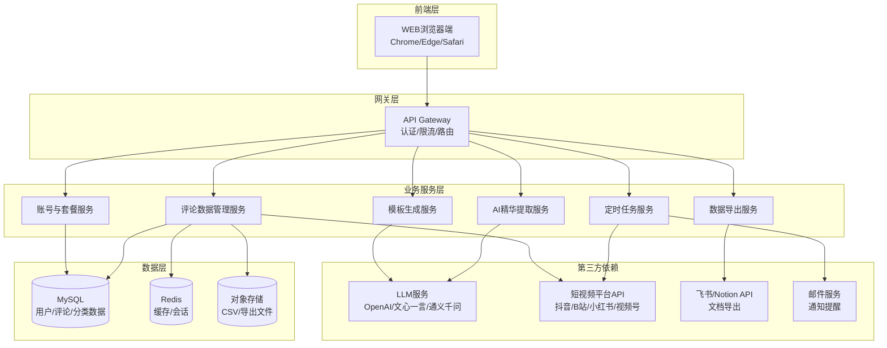
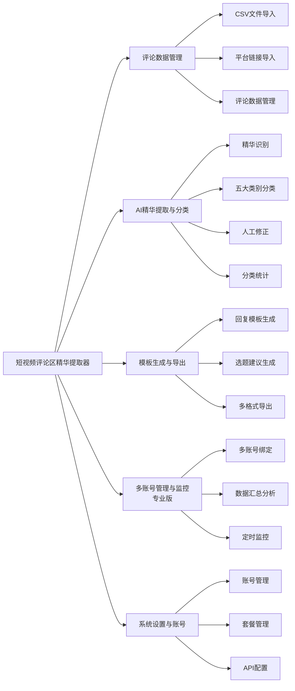
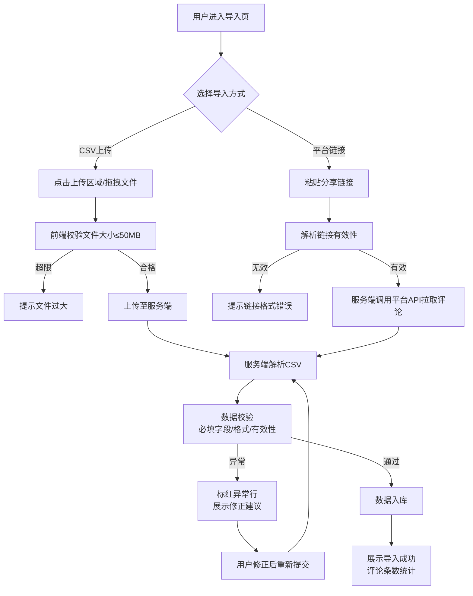
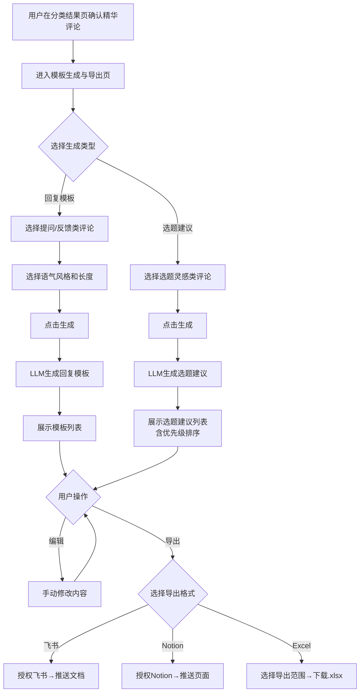
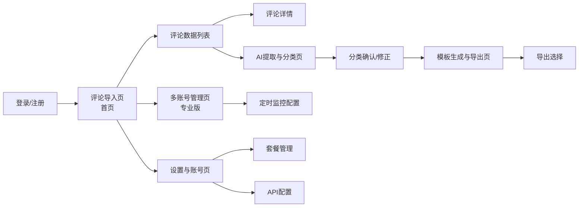
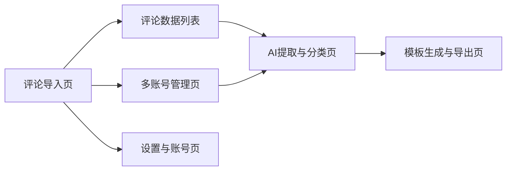

# 短视频评论区精华提取器 - 产品需求规格说明书（PRD）

| 版本号 | 变更日期 | 变更内容 | 变更人 | 审核人 |
| --- | --- | --- | --- | --- |
| V1.0 | 2026-06-29 | 初始版本创建 | 产品文档结对写作专家 | 阶段一产品落地页文档总编辑 |

---
# 1 概述

## 1.1 需求背景

随着短视频行业的快速发展，抖音、B站、小红书、视频号等平台上的创作者每天面对海量评论数据。评论区蕴含着丰富的用户洞察——提问、产品反馈、争议观点、潜在选题、用户故事等高价值内容散落在成千上万条普通评论中。然而，创作者和运营人员目前只能依赖人工逐条浏览筛选，耗费1-2小时才能完成初步梳理，且极易遗漏关键信息。

本需求源自内容创作领域的运营效率痛点：
- **业务痛点**：评论筛选耗时、高价值内容识别效率低、从洞察到内容的转化路径断裂
- **业务价值**：将评论区从"信息负担"转化为"内容资产"，释放创作者生产力
- **预期目标**：将评论筛选时间从1-2小时缩短至几分钟，系统化挖掘评论区价值，加速从洞察到内容的转化

## 1.2 名词解释

| **名词** | **说明** |
| --- | --- |
| LLM | Large Language Model，大语言模型，如OpenAI GPT、文心一言、通义千问等 |
| 精华评论 | AI识别出的高价值评论，包括提问、产品反馈、争议观点、潜在选题、用户故事等 |
| 内容选题灵感 | 可作为新视频/文章创作素材的评论，通常包含用户好奇的话题、延伸讨论等 |
| FAQ补充 | 用户提出的常见问题，可整理为FAQ内容补充到创作者的知识库或视频中 |
| 用户痛点 | 评论中反映的用户困扰、需求缺口，可用于产品改进或内容方向调整 |
| 正面口碑 | 用户对内容/产品/服务的积极评价，可用于品牌营销素材 |
| 负面预警 | 反映用户不满、潜在公关风险的评论内容，需及时处理 |
| CSV | Comma-Separated Values，逗号分隔值文件格式 |
| MCN | Multi-Channel Network，多频道网络，指管理多位达人的运营机构 |
| OAuth | Open Authorization，开放授权协议，用于第三方应用授权 |

## 1.3 产品介绍

短视频评论区精华提取器是一款面向短视频创作者、MCN运营人员和品牌方社媒运营的AI驱动评论分析工具。产品通过批量导入短视频平台评论数据，利用LLM自动提取高价值内容并分类为五大类别，最终一键生成回复模板和选题建议，帮助创作者将评论区转化为可复用的内容资产。

### 1.3.1 范围说明

| 项 | 内容 |
| --- | --- |
| 包含功能 | 评论数据导入（CSV/平台链接）、AI精华提取与分类（五大类别）、人工修正、回复模板生成、选题建议生成、多格式导出（飞书/Notion/Excel）、多账号管理（专业版）、定时监控（专业版）、账号与套餐管理 |
| 不包含功能 | 通用评论管理（删除/置顶等）、自动回复功能（仅生成模板）、视频内容分析、评论数据跨用户共享 |

目标用户包括三类核心角色：
1. **短视频创作者**：个人内容创作者，需持续从评论区获取选题灵感和用户反馈
2. **MCN运营人员**：管理5-20个达人账号的团队成员，需批量分析多账号评论
3. **品牌方社媒运营**：从用户评论中洞察产品反馈和市场口碑的运营人员

核心使用场景：发布视频后1-3天内，批量导入评论数据 → AI自动提取精华并分类 → 人工确认/修正 → 生成回复模板和选题建议 → 导出到飞书/Notion/Excel。

---

# 2 产品设计

## 2.1 系统架构图



## 2.2 业务模块图



## 2.3 主业务流程

```mermaid
flowchart TD
    Start([用户登录系统]) --> Step1[进入评论导入页]
    Step1 --> Step1a{选择导入方式}
    Step1a -->|CSV上传| Step1b[上传CSV文件]
    Step1a -->|平台链接| Step1c[粘贴视频分享链接]
    Step1b --> Step1d[数据解析与校验]
    Step1c --> Step1d
    Step1d --> Step1e{校验通过?}
    Step1e -->|否| Step1f[提示错误引导修正]
    Step1f --> Step1a
    Step1e -->|是| Step2[评论数据入库<br/>展示数据列表]
    Step2 --> Step3[点击"开始AI分析"]
    Step3 --> Step4[AI精华识别<br/>识别高价值评论]
    Step4 --> Step5[AI智能分类<br/>五大类别自动归类]
    Step5 --> Step6[展示分类结果<br/>含分类置信度]
    Step6 --> Step7{人工确认/修正}
    Step7 -->|修正| Step7a[调整分类标签]
    Step7a --> Step8
    Step7 -->|确认| Step8[一键生成回复模板<br/>与选题建议]
    Step8 --> Step9{选择导出格式}
    Step9 -->|飞书| Step9a[导出飞书文档]
    Step9 -->|Notion| Step9b[导出Notion页面]
    Step9 -->|Excel| Step9c[导出Excel表格]
    Step9a --> End([完成])
    Step9b --> End
    Step9c --> End
```

## 2.4 功能图/列表

| 功能模块 | 功能名称 | 优先级 | 功能描述 |
| --- | --- | --- | --- |
| 评论数据管理 | CSV文件导入 | P0 | 上传CSV评论文件，支持50MB以内，自动识别UTF-8/GBK编码 |
| 评论数据管理 | 模板下载 | P0 | 提供标准CSV导入模板，含必填字段说明和各平台字段对照 |
| 评论数据管理 | 数据预览与校验 | P0 | 上传后展示前20条预览，标红异常行并给出修正建议 |
| 评论数据管理 | 平台链接解析 | P0 | 粘贴短视频平台分享链接，自动解析拉取评论数据 |
| 评论数据管理 | 批量链接导入 | P1 | 支持一次粘贴多个链接批量拉取 |
| 评论数据管理 | 解析进度展示 | P1 | 展示链接解析进度，支持中断和重试 |
| 评论数据管理 | 评论数据列表 | P0 | 展示已导入评论，支持筛选搜索 |
| 评论数据管理 | 评论详情查看 | P1 | 查看单条评论完整信息及AI分类结果 |
| 评论数据管理 | 批量删除 | P1 | 批量/单条删除评论数据 |
| 评论数据管理 | 导入记录 | P1 | 查看历次导入记录 |
| AI精华提取 | 一键启动分析 | P0 | 触发AI精华提取引擎，展示分析进度 |
| AI精华提取 | 高价值评论筛选 | P0 | AI自动识别提问、反馈、争议、选题、故事五类高价值内容 |
| AI精华提取 | 精华评论标记 | P0 | 对精华评论进行星标/高亮标记 |
| AI智能分类 | 五大类别自动归类 | P0 | 将精华评论分类为选题灵感/FAQ/痛点/口碑/预警 |
| AI智能分类 | 分类置信度展示 | P2 | 展示AI分类置信度（高/中/低） |
| AI智能分类 | 分类结果确认 | P0 | 逐条确认或修正AI分类 |
| AI智能分类 | 批量修正 | P2 | 批量调整分类标签 |
| AI智能分类 | 分类分布看板 | P1 | 饼图/柱状图展示五大类别分布 |
| AI智能分类 | 按视频维度统计 | P2 | 按单个视频维度查看分类分布 |
| 模板生成 | 回复模板生成 | P0 | 针对提问/反馈类评论AI生成回复模板 |
| 模板生成 | 模板个性化调整 | P2 | 调整回复语气（正式/亲切/幽默）和长度 |
| 模板生成 | 回复模板列表 | P1 | 展示所有生成的模板，支持筛选 |
| 模板生成 | 模板编辑 | P1 | 手动编辑微调AI生成的模板 |
| 选题建议 | 选题建议生成 | P0 | 基于选题灵感类评论AI生成选题建议 |
| 选题建议 | 选题优先级排序 | P2 | 根据热度和相关性排序 |
| 选题建议 | 选题日历 | P1 | 专业版，日历形式展示选题规划 |
| 数据导出 | 飞书导出 | P0 | 导出为飞书文档，支持推送飞书空间 |
| 数据导出 | Notion导出 | P1 | 导出为Notion页面格式 |
| 数据导出 | Excel导出 | P0 | 导出为.xlsx文件，支持自定义字段 |
| 数据导出 | 导出范围选择 | P1 | 选择导出数据范围 |
| 多账号管理 | 多平台账号添加 | P1 | 添加多个平台账号（专业版） |
| 多账号管理 | 账号分组 | P2 | 按业务线/达人类型分组（专业版） |
| 多账号管理 | 跨账号数据汇总 | P1 | 多账号评论统一分析（专业版） |
| 多账号管理 | 按账号对比 | P2 | 对比不同账号评论区价值（专业版） |
| 定时监控 | 定时导入设置 | P1 | 配置定时拉取评论（专业版） |
| 定时监控 | 监控频率选择 | P1 | 每日/每周/自定义频率（专业版） |
| 定时监控 | 新精华提醒 | P2 | 发现新精华评论时通知（专业版） |
| 定时监控 | 负面预警提醒 | P1 | 负面评论异常增加时预警（专业版） |
| 定时监控 | 周期性报告 | P2 | 自动生成周/月分析报告（专业版） |
| 系统设置 | 邮箱注册登录 | P0 | 邮箱+密码注册登录 |
| 系统设置 | 第三方登录 | P2 | 微信/飞书快捷登录 |
| 系统设置 | 套餐管理 | P0 | 查看/升级套餐，额度控制 |
| 系统设置 | 使用量统计 | P1 | 月度使用量查看 |
| 系统设置 | API密钥管理 | P1 | 配置各平台API密钥 |
| 系统设置 | 分类标签自定义 | P2 | 添加自定义分类标签 |
| 系统设置 | 导出默认格式 | P2 | 设置默认导出格式 |

## 2.5 你的产品有哪些端

| 序号 | 端名称 | 端类型 | 目标用户 | 说明 |
| --- | --- | --- | --- | --- |
| 1 | 精华提取器WEB端 | WEB端 | 短视频创作者/MCN运营/品牌方社媒运营 | 用户在浏览器中使用全部功能，包含评论导入、AI分析、模板生成、导出、账号管理等 |

---

# 3 产品功能

## 3.1 精华提取器WEB端功能

### 3.1.1 评论数据导入

功能描述：用户通过CSV文件上传或平台分享链接两种方式导入短视频评论数据，系统自动解析并入库。

| 项 | 内容 |
| --- | --- |
| 优先级 | P0 |
| 依赖需求 | 无 |
| 前置条件 | 用户已登录系统 |

**CSV文件导入**：
- 支持上传符合模板格式的CSV文件，文件大小限制50MB
- 自动识别UTF-8和GBK编码
- 提供标准CSV导入模板下载，包含必填字段说明（评论内容、评论者昵称、评论时间、视频标题等）和各平台字段对照说明
- 上传后展示数据预览（前20条），校验字段完整性、评论内容有效性
- 标红异常行并给出修正建议（缺少必填字段、时间格式错误等）

**平台分享链接导入**：
- 用户粘贴短视频平台分享链接（支持抖音、B站、小红书、视频号）
- 系统自动解析并拉取该视频下的评论数据
- 支持一次性粘贴多个链接（每行一个）批量拉取
- 展示解析进度（已解析/总数），支持中断和重试

### 3.1.2 评论数据导入—详细流程



业务规则说明：
1. CSV文件最大50MB，超过限制提示"文件大小不能超过50MB"
2. 必填字段包括：评论内容、评论者昵称、评论时间；缺少必填字段标红并提示
3. 评论时间支持格式：YYYY-MM-DD HH:MM:SS、YYYY/MM/DD HH:MM:SS、时间戳
4. 平台链接解析超时时间30秒，超时提示"解析超时，请重试"
5. 单次导入评论条数上限10000条（免费版500条）
6. 重复导入同一视频评论时提示"该视频评论已导入，是否更新？"

### 3.1.3 评论数据导入—主要原型

[评论导入页原型](assets/prototypes/web/comment-import-widget.html)

验收标准：
- [ ] 正常流程：上传合规CSV文件后30秒内完成解析，展示数据预览，导入成功后跳转到评论列表
- [ ] 正常流程：粘贴有效平台链接后成功拉取评论数据，展示解析进度
- [ ] 异常流程：上传超限文件时提示"文件不能超过50MB"
- [ ] 异常流程：缺少必填字段时标红异常行并展示修正建议
- [ ] 异常流程：无效链接提示"链接格式不正确，请检查后重试"
- [ ] 性能要求：CSV解析（50MB以内）不超过30秒

### 3.1.4 评论数据管理

功能描述：展示已导入的评论数据列表，支持按视频标题、评论时间、数据来源、分类状态筛选和搜索；点击单条可查看完整详情；支持批量/单条删除；展示历次导入记录。

| 项 | 内容 |
| --- | --- |
| 优先级 | P0 |
| 依赖需求 | 评论数据导入 |
| 前置条件 | 已有导入的评论数据 |

功能规格：
1. 评论数据列表默认按导入时间倒序排列，每页展示20条
2. 支持搜索关键词（评论内容/评论者昵称模糊匹配）
3. 支持多条件筛选：视频标题、评论时间范围、数据来源（CSV/链接）、分类状态（未分析/已分析/已确认/已导出）
4. 点击行展开评论详情：完整评论内容、评论者信息（昵称/头像/主页链接）、所属视频、AI分类结果、分类置信度
5. 批量操作：选中后批量删除（二次确认弹窗）、批量修改分类
6. 导入记录页：展示导入时间、数据来源、评论条数、成功/失败统计，可从此处跳转到对应批次的评论列表

### 3.1.5 AI精华提取与分类

功能描述：用户选择待分析的评论数据集后，一键触发AI精华提取引擎。系统自动识别高价值评论并将其分类为五大类别，用户可人工确认或修正分类结果。

| 项 | 内容 |
| --- | --- |
| 优先级 | P0 |
| 依赖需求 | 评论数据导入 |
| 前置条件 | 已导入待分析的评论数据 |

**精华识别**：
- 一键启动分析，展示分析进度（已分析/总条数，进度条+百分比）
- AI自动识别五类高价值评论：提问类、产品反馈类、争议观点类、潜在选题类、用户故事类
- 对识别出的精华评论进行星标/高亮标记，与普通评论（表情、简短夸赞等低价值内容）区分

**五大类别分类**：
- 内容选题灵感：可作为新视频/文章素材的评论
- FAQ补充：用户提出的常见问题
- 用户痛点：反映用户困扰和需求缺口的评论
- 正面口碑：积极评价，可用于营销素材
- 负面预警：不满或潜在风险评论，需及时处理

**人工修正**：
- 逐条确认或修正AI分类结果
- 支持批量修正（选中多条后统一修改分类）
- 展示分类置信度（高≥80%/中50-80%/低<50%）

**分类统计**：
- 饼图展示五大类别的评论数量分布
- 柱状图展示各视频精华评论数量对比
- 支持按视频维度查看分类分布

### 3.1.6 AI精华提取与分类—详细流程

```mermaid
flowchart TD
    A[用户在评论列表选择待分析数据] --> B[点击"开始AI分析"]
    B --> C[前端检查额度<br/>免费版≤500条/月]
    C -->|超额| D[提示升级专业版]
    C -->|额度内| E[提交分析任务到后端]
    E --> F[后端分批发送评论到LLM<br/>每批50条]
    F --> G[LLM返回精华标记+分类结果]
    G --> H[更新分析进度<br/>前端实时展示]
    H --> I{全部分析完成?}
    I -->|否| F
    I -->|是| J[结构化存储结果]
    J --> K[展示分类结果看板<br/>含统计图表]
    K --> L{用户操作}
    L -->|逐条确认| M[标记为已确认]
    L -->|逐条修正| N[修改分类标签]
    L -->|批量修正| O[选中后统一修改]
    L -->|全部确认| P[标记为已确认状态]
    M & N & O & P --> Q[可进入模板生成]
```

业务规则说明：
1. 每次AI分析消耗的评论条数计入月度额度（免费版500条/月）
2. 分析过程中用户可中断，已分析结果保留
3. 同一批评论可重复分析（重新分类），但额度只扣一次
4. 分类置信度低于50%的评论标记为"低置信度"，建议人工复核
5. 分析结果保存后，评论状态从"待分析"变为"待确认"
6. 用户确认后状态变为"已确认"，可进入模板生成阶段

### 3.1.7 AI精华提取与分类—主要原型

[AI提取与分类页原型](assets/prototypes/web/ai-extraction-widget.html)

验收标准：
- [ ] 正常流程：点击"开始AI分析"后进度条实时更新，5分钟内完成1000条评论分析
- [ ] 正常流程：分类结果以列表+统计图表形式展示，五大类别颜色区分
- [ ] 正常流程：逐条修正分类后实时更新统计图表
- [ ] 正常流程：批量选中多条评论后统一修改分类成功
- [ ] 异常流程：免费版超额度时提示升级
- [ ] 异常流程：分析中断后已分析结果不丢失
- [ ] 性能要求：1000条评论AI分析在5分钟内完成

### 3.1.8 回复模板生成

功能描述：针对"提问类"和"产品反馈类"精华评论，AI自动生成回复模板，包含回复要点、语气建议和参考话术。用户可编辑微调模板。

| 项 | 内容 |
| --- | --- |
| 优先级 | P0 |
| 依赖需求 | AI精华提取与分类 |
| 前置条件 | 有已确认的提问类/反馈类精华评论 |

功能规格：
1. 一键生成：选择已确认的精华评论，点击"生成回复模板"
2. 模板内容包含：回复要点（3-5个要点）、语气建议（正式/亲切/幽默）、参考话术（200字以内）
3. 模板个性化：可调整语气风格（正式/亲切/幽默）和长度（简短50字/详细200字）
4. 模板列表：展示所有生成的模板，支持按评论类别、生成时间筛选
5. 模板编辑：支持手动编辑修改AI生成的内容，编辑后可保存或还原
6. 模板复制：一键复制模板内容到剪贴板

### 3.1.9 选题建议生成

功能描述：基于"内容选题灵感"类别的精华评论，AI自动生成选题建议，包含选题标题、切入角度、内容大纲建议。

| 项 | 内容 |
| --- | --- |
| 优先级 | P0 |
| 依赖需求 | AI精华提取与分类 |
| 前置条件 | 有已确认的选题灵感类精华评论 |

功能规格：
1. 一键生成：选择选题灵感类精华评论，点击"生成选题建议"
2. 每个选题建议包含：选题标题（吸引眼球）、切入角度（从哪个维度展开）、内容大纲（3-5个要点）、相关原始评论引用
3. 选题优先级排序：根据原始评论热度（点赞数、回复数）和相关性进行排序
4. 选题日历（专业版）：将选题建议以日历形式展示，可拖拽安排发布日期
5. 选题导出：支持将选题建议单独导出

### 3.1.10 模板生成与导出—详细流程



### 3.1.11 模板生成与导出—主要原型

[模板生成与导出页原型](assets/prototypes/web/template-export-widget.html)

验收标准：
- [ ] 正常流程：选择已确认评论后一键生成回复模板，30秒内返回结果
- [ ] 正常流程：选题建议按优先级排序展示，含标题/角度/大纲
- [ ] 正常流程：模板编辑后保存成功，支持还原到AI原始版本
- [ ] 正常流程：Excel导出30秒内完成下载
- [ ] 正常流程：飞书/Notion导出完成授权后成功推送
- [ ] 异常流程：未授权飞书/Notion时引导用户完成授权
- [ ] 异常流程：导出范围为空时提示"请先选择要导出的数据"

### 3.1.12 数据导出

功能描述：将精华评论分类结果、回复模板、选题建议一键导出为飞书文档、Notion页面或Excel表格。

| 项 | 内容 |
| --- | --- |
| 优先级 | P0 |
| 依赖需求 | 模板生成 |
| 前置条件 | 有已生成/已确认的数据 |

功能规格：
1. **飞书导出**：需先完成飞书OAuth授权，导出后可选择推送到指定飞书空间
2. **Notion导出**：需先完成Notion Integration授权，导出为Notion页面格式，保留分类标签和层级结构
3. **Excel导出**：生成.xlsx文件，支持自定义导出字段（评论内容/分类/置信度/回复模板/选题建议等）
4. **导出范围选择**：全部数据 / 按类别 / 按视频 / 按时间区间
5. 单次导出上限5000条，超过提示分批导出
6. 导出完成后展示导出结果摘要（条数、文件大小、下载链接）

### 3.1.13 多账号管理（专业版）

功能描述：支持添加多个短视频平台账号，将多个账号的评论数据汇总分析，支持账号分组和对比。

| 项 | 内容 |
| --- | --- |
| 优先级 | P1（专业版功能） |
| 依赖需求 | 评论数据导入 |
| 前置条件 | 已开通专业版套餐 |

功能规格：
1. 多平台账号添加：支持添加抖音、B站、小红书、视频号账号，每个账号独立管理
2. 账号分组：按业务线、达人类型等维度分组，支持自定义分组名称
3. 跨账号数据汇总：将多个账号的评论数据汇总分析，生成统一报告
4. 按账号对比：对比不同账号的精华评论比例、各类别占比
5. 免费版限制：仅支持1个账号，专业版支持最多50个账号

### 3.1.14 定时监控（专业版）

功能描述：配置定时任务自动拉取指定账号或视频的评论数据，发现新精华评论或负面预警时发送通知。

| 项 | 内容 |
| --- | --- |
| 优先级 | P1（专业版功能） |
| 依赖需求 | 多账号管理 |
| 前置条件 | 已开通专业版并绑定账号 |

功能规格：
1. 定时导入设置：配置监控频率（每日/每周/自定义时间间隔）
2. 监控范围：指定账号或指定视频的评论
3. 新精华评论提醒：发现新的高价值评论时，通过站内消息或邮件提醒
4. 负面预警提醒：负面预警类评论数量异常增加（较前7天均值增长200%以上）时立即通知
5. 周期性分析报告：自动生成周/月维度的评论区分析报告

### 3.1.15 多账号管理与监控—主要原型

[多账号管理页原型](assets/prototypes/web/account-management-widget.html)

验收标准：
- [ ] 正常流程：添加新平台账号成功，展示在账号列表中
- [ ] 正常流程：跨账号数据汇总展示正确的合并统计
- [ ] 正常流程：定时任务创建成功，按设定频率执行
- [ ] 异常流程：免费版用户点击专业版功能时提示升级
- [ ] 异常流程：账号授权过期时提示重新授权

### 3.1.16 账号与套餐管理

功能描述：用户注册登录、查看/升级套餐、查看使用量、配置API密钥和系统偏好设置。

| 项 | 内容 |
| --- | --- |
| 优先级 | P0 |
| 依赖需求 | 无 |
| 前置条件 | 无 |

功能规格：
1. **注册登录**：邮箱+密码注册登录；支持微信、飞书第三方登录
2. **套餐查看与升级**：展示当前套餐（免费版/专业版）、剩余评论分析额度、套餐到期时间
3. **免费版额度控制**：每月限制500条评论分析，达到上限提示升级
4. **使用量统计**：展示当月已分析评论数、剩余额度、历史使用趋势图
5. **API密钥管理**：配置各短视频平台的API密钥，支持测试连通性
6. **偏好设置**：自定义分类标签（在五大默认类别基础上添加）、设置默认导出格式

### 3.1.17 账号与设置—主要原型

[设置与账号页原型](assets/prototypes/web/settings-widget.html)

验收标准：
- [ ] 正常流程：邮箱注册登录成功，跳转主页
- [ ] 正常流程：套餐升级成功，额度立即更新
- [ ] 正常流程：API密钥配置后测试连通性成功
- [ ] 异常流程：免费版达到额度上限时，分析按钮置灰并提示升级
- [ ] 异常流程：API密钥无效时提示"密钥验证失败"

---

# 4 产品原型

## 4.1 页面跳转逻辑图



## 4.2 全站点原型设计

### 4.2.1 精华提取器WEB端

**页面清单：**

| 序号 | 页面名称 | 所属模块 | 页面描述 | 关键元素 |
| --- | --- | --- | --- | --- |
| 1 | 评论导入页 | 评论数据管理 | 首页/入口页，支持CSV上传和平台链接导入 | 拖拽上传区、CSV模板下载按钮、链接输入框、导入按钮、最近导入记录 |
| 2 | 评论数据列表页 | 评论数据管理 | 展示已导入评论，支持筛选搜索和批量操作 | 搜索栏、多条件筛选、评论列表表格、分页、批量操作按钮 |
| 3 | AI提取与分类页 | AI精华提取 | 展示AI分析结果，五大类别分类看板，支持人工修正 | 分析进度条、分类统计饼图、精华评论列表（含标签/置信度）、批量修正工具栏 |
| 4 | 模板生成与导出页 | 模板生成 | 展示生成的回复模板和选题建议，支持编辑和导出 | Tab切换（回复模板/选题建议）、模板卡片列表、编辑区、导出按钮组（飞书/Notion/Excel） |
| 5 | 多账号管理页 | 多账号管理 | 专业版功能，管理多个平台账号和定时监控 | 账号卡片列表、添加账号按钮、分组管理、监控任务列表、数据对比图表 |
| 6 | 设置与账号页 | 系统设置 | 个人信息、套餐管理、API配置、偏好设置 | 套餐信息卡、使用量进度条、API密钥表单、偏好设置开关 |

**交互说明：**

- 页面跳转关系：


- 特殊交互：
  1. 侧边栏导航常驻，当前页高亮，点击切换页面内容
  2. CSV上传支持拖拽上传，拖入时上传区高亮
  3. AI分析进度条实时更新（WebSocket推送进度）
  4. 分类标签支持点击切换（下拉选择五大类别）
  5. 模板卡片hover时展示编辑和复制按钮
  6. 导出按钮组hover展开三种格式选项
  7. 空数据态：各列表无数据时展示引导插画和操作提示
  8. 加载态：骨架屏占位，AI分析时展示进度动画
  9. 错误态：网络错误时展示重试按钮

**产品原型：**

[🖥️ 打开精华提取器WEB端全站点原型](assets/prototypes/web-full-prototype.html)

---

# 5 数据需求

## 5.1 数据使用规格

### 评论数据表 (comment)

| **字段** | **是否必填** | **描述** | **数据类型** |
| --- | --- | --- | --- |
| id | 是 | 评论唯一标识 | UUID |
| user_id | 是 | 所属用户ID | UUID |
| content | 是 | 评论内容文本 | 字符串(2000) |
| author_nickname | 是 | 评论者昵称 | 字符串(100) |
| author_avatar | 否 | 评论者头像URL | 字符串(500) |
| video_title | 是 | 所属视频标题 | 字符串(200) |
| video_url | 否 | 视频链接 | 字符串(500) |
| platform | 是 | 来源平台（douyin/bilibili/xiaohongshu/weishi） | 枚举 |
| comment_time | 是 | 评论发布时间 | DateTime |
| like_count | 否 | 点赞数 | 整数 |
| reply_count | 否 | 回复数 | 整数 |
| import_batch_id | 是 | 导入批次ID | UUID |
| is_essence | 否 | 是否为精华评论 | 布尔 |
| category | 否 | 分类类别 | 枚举 |
| confidence | 否 | AI分类置信度(0-1) | 浮点数 |
| analysis_status | 是 | 分析状态（pending/analyzed/confirmed/exported） | 枚举 |
| created_at | 是 | 创建时间 | DateTime |
| updated_at | 是 | 更新时间 | DateTime |

### 导入批次表 (import_batch)

| **字段** | **是否必填** | **描述** | **数据类型** |
| --- | --- | --- | --- |
| id | 是 | 批次唯一标识 | UUID |
| user_id | 是 | 所属用户ID | UUID |
| source_type | 是 | 导入来源（csv/link） | 枚举 |
| source_detail | 是 | 来源详情（文件名/链接URL） | 字符串(500) |
| total_count | 是 | 总评论条数 | 整数 |
| success_count | 是 | 成功导入条数 | 整数 |
| fail_count | 是 | 失败条数 | 整数 |
| status | 是 | 导入状态（processing/completed/failed） | 枚举 |
| created_at | 是 | 导入时间 | DateTime |

### 回复模板表 (reply_template)

| **字段** | **是否必填** | **描述** | **数据类型** |
| --- | --- | --- | --- |
| id | 是 | 模板唯一标识 | UUID |
| user_id | 是 | 所属用户ID | UUID |
| comment_id | 是 | 关联评论ID | UUID |
| template_content | 是 | 回复模板内容 | 文本 |
| tone | 否 | 语气风格（formal/friendly/humorous） | 枚举 |
| length | 否 | 长度（short/detailed） | 枚举 |
| is_edited | 是 | 是否经过手动编辑 | 布尔 |
| created_at | 是 | 生成时间 | DateTime |

### 选题建议表 (topic_suggestion)

| **字段** | **是否必填** | **描述** | **数据类型** |
| --- | --- | --- | --- |
| id | 是 | 选题唯一标识 | UUID |
| user_id | 是 | 所属用户ID | UUID |
| title | 是 | 选题标题 | 字符串(200) |
| angle | 是 | 切入角度 | 字符串(500) |
| outline | 是 | 内容大纲 | 文本 |
| priority_score | 否 | 优先级分数 | 浮点数 |
| related_comment_ids | 否 | 关联评论ID列表 | JSON数组 |
| scheduled_date | 否 | 计划发布日期（选题日历） | Date |
| created_at | 是 | 生成时间 | DateTime |

### 平台账号表 (platform_account)

| **字段** | **是否必填** | **描述** | **数据类型** |
| --- | --- | --- | --- |
| id | 是 | 账号唯一标识 | UUID |
| user_id | 是 | 所属用户ID | UUID |
| platform | 是 | 平台类型 | 枚举 |
| account_name | 是 | 账号昵称 | 字符串(100) |
| account_id | 是 | 平台账号ID | 字符串(100) |
| group_name | 否 | 分组名称 | 字符串(50) |
| api_key | 否 | 平台API密钥（加密存储） | 字符串(200) |
| auth_status | 是 | 授权状态（active/expired） | 枚举 |
| created_at | 是 | 创建时间 | DateTime |

## 5.2 统计数据

1. 统计每月评论分析使用量（已分析条数/总额度），按用户维度统计
2. 统计各分类类别的评论数量分布，按导入批次维度统计
3. 统计各视频精华评论数量，按视频维度统计
4. 统计各平台账号的评论数据量，按账号维度统计（专业版）
5. 统计回复模板和选题建议的生成数量，按用户维度统计

## 5.3 埋点需求

| 页面 | 事件 | 采集字段 | 说明 |
| --- | --- | --- | --- |
| 评论导入页 | csv_upload | file_size, comment_count, duration | CSV上传行为 |
| 评论导入页 | link_import | platform, link_count, success_count | 链接导入行为 |
| 评论列表页 | filter_use | filter_type, filter_value | 筛选功能使用 |
| AI分类页 | start_analysis | comment_count, source_type | 触发AI分析 |
| AI分类页 | category_edit | original_category, new_category, edit_type(single/batch) | 分类修正行为 |
| 模板页 | generate_template | comment_count, tone, length | 模板生成行为 |
| 模板页 | generate_topic | comment_count | 选题建议生成 |
| 模板页 | export | format(feiShu/notion/excel), data_count, scope | 导出行为 |
| 设置页 | plan_upgrade | from_plan, to_plan | 套餐升级行为 |
| 全局 | page_view | page_name, duration, user_plan_type | 页面访问 |

---

# 6 非功能需求

## 6.1 性能需求

**6.1.1 延迟**

| 编号 | 项目 | 最大延迟 | 平均延迟 | 优先级 | 备注 |
| --- | --- | --- | --- | --- | --- |
| 0001 | 列表页加载 | <3秒 | <1.5秒 | 高 | 含首屏数据加载 |
| 0002 | CSV文件解析（50MB以内） | <30秒 | <15秒 | 高 | 含数据校验 |
| 0003 | AI精华提取+分类（1000条） | <5分钟 | <3分钟 | 高 | 含LLM调用 |
| 0004 | 回复模板生成（10条） | <30秒 | <15秒 | 中 | 含LLM调用 |
| 0005 | 数据导出（5000条以内） | <30秒 | <15秒 | 中 | 含文件生成 |
| 0006 | 平台链接解析（单链接） | <30秒 | <10秒 | 中 | 含API调用 |

**6.1.2 吞吐量**

| 编号 | 项 | 吞吐量 | 备注 |
| --- | --- | --- | --- |
| 0001 | 用户登录认证 | 每分钟100次 | |
| 0002 | CSV文件上传 | 每分钟20个 | 单文件≤50MB |
| 0003 | LLM API调用 | 每分钟500次 | 需考虑限流 |

**6.1.3 容量**

| 编号 | 项 | 容量 | 备注 |
| --- | --- | --- | --- |
| 0001 | MVP阶段同时在线用户 | ≤50 | |
| 0002 | 单用户最大评论存储量 | ≤100,000条 | |
| 0003 | 单文件最大导入量 | ≤10,000条 | |

## 6.2 安全需求

| 编号 | 项（系统数据 / 处理过程） |
| --- | --- |
| 0001 | 用户评论数据仅对该用户可见，不跨用户共享 |
| 0002 | 用户数据加密存储（AES-256），传输使用HTTPS |
| 0003 | API密钥加密存储，前端展示时脱敏（仅显示末4位） |
| 0004 | 用户可主动删除全部历史数据（数据删除后30天内可恢复，超期永久删除） |
| 0005 | 登录失败5次后锁定账号30分钟 |
| 0006 | 敏感操作（删除数据、导出全部数据）需二次验证 |

## 6.3 可靠性

| 编号 | 项 | 值 |
| --- | --- | --- |
| 0001 | 系统可用性 | ≥99.5% |
| 0002 | 平均正常运行时间 | ≥180天 |
| 0003 | 平均故障恢复时间 | ≤30分钟 |
| 0004 | 数据备份频率 | 每日全量+每小时增量 |

## 6.4 可连续性

| 编号 | 项 |
| --- | --- |
| 0001 | 系统需要7×24小时全天候运行 |
| 0002 | LLM服务不可用时，其他功能（导入/管理/导出历史数据）可正常使用 |
| 0003 | 平台API不可用时，CSV导入功能可正常使用 |

## 6.5 可恢复性

| 编号 | 项 |
| --- | --- |
| 0001 | 数据库每日全量备份，保留30天；每小时增量备份 |
| 0002 | AI分析中断后，已分析结果保留，用户可继续或重新分析 |
| 0003 | 导出中断后，已生成的文件可重新下载 |
| 0004 | 重大故障在1-3小时内恢复服务，24-72小时内恢复历史数据 |

## 6.6 兼容性

| 编号 | 要求 | 备注 |
| --- | --- | --- |
| 0001 | 兼容主流浏览器：Chrome ≥90，Edge ≥90，Safari ≥14 | MVP阶段 |
| 0002 | 最低分辨率支持：1280×720 | |
| 0003 | 推荐分辨率：1920×1080 | |
| 0004 | 暂不支持移动端浏览器适配 | 后续版本考虑 |

## 6.7 易用性

| 编号 | 要求 | 备注 |
| --- | --- | --- |
| 0001 | 核心操作路径不超过4步（导入→分析→查看→导出） | |
| 0002 | 每步操作有清晰的进度提示和状态反馈 | |
| 0003 | 首次使用提供3-5步新手引导 | |
| 0004 | 普通用户无需培训即可使用核心功能 | |
| 0005 | 分类统计结果以图表形式展示 | 饼图+柱状图 |
| 0006 | 全界面简体中文 | |

---

# 7 总结

## 7.1 上线计划

| 阶段 | 时间 | 内容 | 负责人 |
| --- | --- | --- | --- |
| 开发阶段 | 2026-07-01 ~ 2026-07-05 | 核心功能开发（导入+AI分析+导出） | 开发团队 |
| 测试阶段 | 2026-07-06 ~ 2026-07-07 | 功能测试、性能测试 | QA |
| 灰度阶段 | 2026-07-08 ~ 2026-07-09 | 灰度10%用户（约50个创作者账号），验证稳定性 | 运营 |
| 全量上线 | 2026-07-10 | 全量开放免费版+专业版 | 全团队 |

## 7.2 后续迭代规划

- V1.1（上线后2周）：移动端H5适配、评论自动同步（平台API深度对接）
- V1.2（上线后1月）：评论趋势分析、竞品评论对比、团队协作功能
- V1.3（上线后2月）：AI评论情感分析增强、自动生成视频脚本、与主流剪辑工具集成
- V2.0（上线后3月）：多语言支持、开放API供第三方集成、插件市场

## 7.3 参考文档

- 《短视频评论区精华提取器 - 用户需求说明书（URS）》V1.0
- [优特云PRD文档模板](assets/templates/utyun-prd-template.md)
