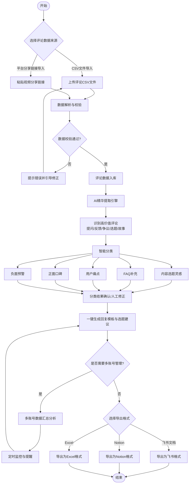
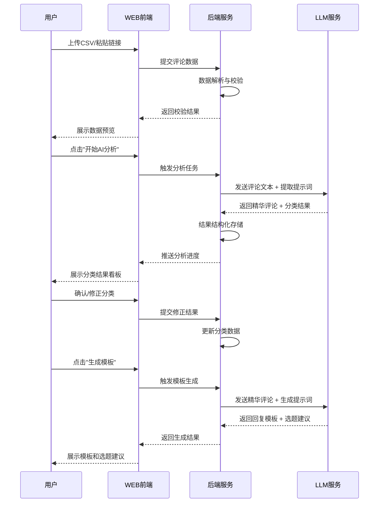
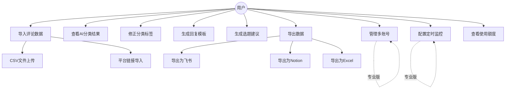
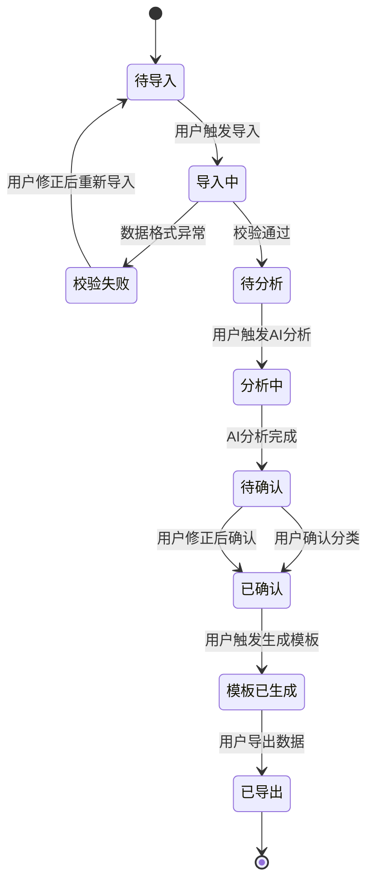

# 短视频评论区精华提取器 - 用户需求说明书（URS）

# 1. 需求概述

## 1.1 需求介绍

短视频评论区精华提取器是一款面向短视频创作者、MCN运营人员和品牌方社媒运营的AI驱动评论分析工具。该产品通过批量导入短视频平台（抖音、B站、小红书、视频号等）的评论数据，利用大语言模型（LLM）自动从海量评论中提取高价值内容（提问、产品反馈、争议观点、潜在选题、用户故事等），并将精华评论分类为内容选题灵感、FAQ补充、用户痛点、正面口碑、负面预警等类别，最终一键生成回复模板和选题建议，帮助内容创作者将评论区这一"内容金矿"转化为可复用的内容资产。

### 1.1.1 所属领域

内容创作 / 短视频运营工具 / AI评论分析应用

## 1.2 需求目标

1. **释放评论区运营生产力**：将创作者/MCN运营从海量评论中逐条手动筛选、分类的重复劳动中解放出来，将原本需要1-2小时的评论筛选工作缩短至几分钟完成。
2. **系统化挖掘评论区价值**：通过AI自动识别和分类高价值评论（提问、选题灵感、用户痛点、产品反馈等），让创作者不再错过评论区中的"金子"，将零散评论转化为结构化的内容资产。
3. **加速从洞察到内容的转化**：一键生成回复模板和选题建议，支持导出为飞书/Notion/Excel格式，让评论洞察直接对接创作者的日常内容生产工作流，减少"看到好评论但没有用起来"的浪费。
4. **轻量化、即开即用**：以MVP形态快速交付（约7天开发周期），聚焦"评论精华提取+分类+模板生成+导出"这一核心场景，不做通用评论管理或自动回复工具，保持工具简洁专注。

## 1.3 系统使用角色

| 角色 | 描述 | 典型使用场景 |
|------|------|-------------|
| 短视频创作者 | 抖音/B站/小红书/视频号的个人内容创作者，粉丝量从几千到百万不等，需要持续产出内容 | 发布视频后1-3天内，批量导入评论区数据，提取高价值评论作为下一期视频的选题灵感；从评论中的提问和反馈中发现FAQ补充点 |
| MCN运营人员 | 负责管理多位达人评论区运营的团队成员，通常同时管理5-20个账号 | 批量导入多个达人账号的评论数据，统一分析各账号评论区的高价值内容；为不同达人定制选题建议；定时监控各账号的评论区动态 |
| 品牌方社媒运营 | 品牌市场部或公关部的社交媒体运营人员，需要从用户评论中洞察产品反馈和市场口碑 | 导入品牌相关视频/推广视频的评论，提取用户对产品/服务的正面评价和负面吐槽；发现潜在公关危机（负面预警）；获取用户故事用于品牌营销素材 |
| 系统管理员 | 负责系统配置、账号管理和订阅计费的管理角色 | 管理用户账号、免费版/专业版套餐权限、API密钥配置、系统监控 |

## 1.4 业务流程图

流程说明：
1. 用户可通过CSV文件上传或平台分享链接两种方式导入评论数据
2. 系统对导入数据进行格式校验（字段完整性、数据有效性），不合格数据引导用户修正
3. AI精华提取引擎自动识别高价值评论（提问、产品反馈、争议观点、潜在选题、用户故事）
4. 将精华评论分类为五大类别：内容选题灵感、FAQ补充、用户痛点、正面口碑、负面预警
5. 用户可人工确认或修正AI分类结果
6. 一键生成回复模板和选题建议
7. 可选的多账号管理和定时监控功能（专业版）
8. 支持导出为飞书/Notion/Excel格式

# 2. 功能原型

| 原型名称 | 原型链接 | 对应端 | 备注 |
| --- | --- | --- | --- |
| 评论精华提取器 - 评论导入页 | 同目录下UI原型文件 | WEB端 | 支持CSV上传和平台分享链接导入 |
| 评论精华提取器 - AI提取与分类页 | 同目录下UI原型文件 | WEB端 | 展示AI提取和分类结果，支持人工修正 |
| 评论精华提取器 - 模板生成与导出页 | 同目录下UI原型文件 | WEB端 | 一键生成回复模板和选题建议，支持多格式导出 |
| 评论精华提取器 - 多账号管理页 | 同目录下UI原型文件 | WEB端 | 专业版功能，多账号数据汇总和定时监控 |
| 评论精华提取器 - 设置与账号页 | 同目录下UI原型文件 | WEB端 | 套餐管理、API配置、使用量查看 |

# 3. 需求清单

## 3.1 评论数据管理端 - WEB端

| 模块 | 一级功能 | 二级功能 | 功能描述 | 备注 |
| --- | --- | --- | --- | --- |
| 评论导入 | CSV文件导入 | 文件上传 | 支持用户上传符合模板格式的CSV评论文件，文件大小限制50MB以内，支持UTF-8和GBK编码自动识别 | 必选，P0 |
| 评论导入 | CSV文件导入 | 模板下载 | 提供标准CSV导入模板下载，包含必填字段说明（评论内容、评论者昵称、评论时间、视频标题等）和各平台（抖音/B站/小红书/视频号）的字段对照说明 | 必选，P0 |
| 评论导入 | CSV文件导入 | 数据预览与校验 | 上传后展示数据预览（前20条），校验字段完整性、评论内容有效性，标红异常行并给出修正建议（如缺少必填字段、时间格式错误等） | 必选，P0 |
| 评论导入 | 平台分享链接导入 | 链接解析 | 用户粘贴短视频平台的分享链接（支持抖音、B站、小红书、视频号），系统自动解析并拉取该视频下的评论数据 | 必选，P0 |
| 评论导入 | 平台分享链接导入 | 批量链接导入 | 支持一次性粘贴多个视频链接（每行一个），批量拉取评论数据 | 必选，P1 |
| 评论导入 | 平台分享链接导入 | 解析进度展示 | 展示链接解析进度（已解析/总数），支持中断和重试 | 必选，P1 |
| 评论管理 | 评论数据列表 | 数据浏览 | 展示已导入的评论数据列表，支持按视频标题、评论时间、数据来源、分类状态筛选和搜索 | 必选，P0 |
| 评论管理 | 评论数据列表 | 评论详情查看 | 点击单条评论可查看完整评论内容、评论者信息、所属视频、AI分类结果等详情 | 必选，P1 |
| 评论管理 | 评论数据列表 | 批量删除 | 支持批量或单条删除评论数据，删除前需二次确认 | 必选，P1 |
| 评论管理 | 导入记录 | 历史记录查看 | 展示历次数据导入记录，包含导入时间、数据来源（CSV/链接）、评论条数、成功/失败统计 | 必选，P1 |

## 3.2 AI精华提取与分类端 - WEB端

| 模块 | 一级功能 | 二级功能 | 功能描述 | 备注 |
| --- | --- | --- | --- | --- |
| AI精华提取 | 精华识别 | 一键启动分析 | 用户选择待分析的评论数据集后，一键触发AI精华提取引擎，展示分析进度（已分析/总条数） | 必选，P0 |
| AI精华提取 | 精华识别 | 高价值评论筛选 | AI自动从海量评论中识别高价值内容，包括：提问类（用户提出的问题）、产品反馈类（对产品/服务的评价）、争议观点类（引发讨论的观点）、潜在选题类（可作为新视频素材的内容）、用户故事类（个人经历分享） | 必选，P0 |
| AI精华提取 | 精华识别 | 精华评论标记 | 对识别出的高价值评论进行标记（如星标/高亮），与普通评论（表情、简短夸赞等低价值内容）区分展示 | 必选，P0 |
| AI智能分类 | 分类执行 | 五大类别自动归类 | 将提取的精华评论自动分类为：内容选题灵感、FAQ补充、用户痛点、正面口碑、负面预警五个类别 | 必选，P0 |
| AI智能分类 | 分类执行 | 分类置信度展示 | 对每条分类结果展示AI置信度（高/中/低），帮助用户判断分类可靠性 | 可选，P2 |
| AI智能分类 | 人工修正 | 分类结果确认 | 用户可逐条确认AI分类结果，对不准确的分类进行修正 | 必选，P0 |
| AI智能分类 | 人工修正 | 批量修正 | 支持批量调整分类（如选中10条评论后统一改为"用户痛点"类别） | 可选，P2 |
| AI智能分类 | 分类统计 | 分类分布看板 | 以饼图/柱状图展示五大类别的评论数量分布，帮助用户快速了解评论区整体情况 | 必选，P1 |
| AI智能分类 | 分类统计 | 按视频维度统计 | 支持按单个视频维度查看精华评论的分类分布，对比不同视频的评论区价值差异 | 可选，P2 |

## 3.3 模板生成与导出端 - WEB端

| 模块 | 一级功能 | 二级功能 | 功能描述 | 备注 |
| --- | --- | --- | --- | --- |
| 回复模板生成 | 模板生成 | 一键生成回复模板 | 针对"提问类"和"产品反馈类"精华评论，AI自动生成回复模板，包含回复要点、语气建议和参考话术 | 必选，P0 |
| 回复模板生成 | 模板生成 | 模板个性化调整 | 用户可根据自身风格调整回复模板的语气（正式/亲切/幽默）和长度（简短/详细） | 可选，P2 |
| 回复模板生成 | 模板预览 | 回复模板列表 | 展示所有生成的回复模板，支持按评论类别、生成时间筛选 | 必选，P1 |
| 回复模板生成 | 模板预览 | 模板编辑 | 支持对AI生成的回复模板进行手动编辑和微调 | 必选，P1 |
| 选题建议生成 | 选题建议 | 一键生成选题建议 | 基于"内容选题灵感"类别的精华评论，AI自动生成选题建议，包含选题标题、切入角度、内容大纲建议 | 必选，P0 |
| 选题建议生成 | 选题建议 | 选题优先级排序 | 根据评论热度（点赞数、回复数）和相关性，AI对选题建议进行优先级排序 | 可选，P2 |
| 选题建议生成 | 选题日历 | 选题日历视图 | （专业版功能）将选题建议以日历形式展示，帮助用户规划内容发布节奏 | 专业版，P1 |
| 数据导出 | 飞书导出 | 导出为飞书文档 | 将精华评论分类结果、回复模板、选题建议一键导出为飞书文档格式，支持直接推送到飞书空间 | 必选，P0 |
| 数据导出 | Notion导出 | 导出为Notion页面 | 将分析结果导出为Notion页面格式，保留分类标签和层级结构 | 必选，P1 |
| 数据导出 | Excel导出 | 导出为Excel表格 | 将精华评论数据（含分类结果）导出为.xlsx文件，支持自定义导出字段 | 必选，P0 |
| 数据导出 | 导出设置 | 导出范围选择 | 支持选择导出的数据范围（全部/按类别/按视频/按时间区间） | 必选，P1 |

## 3.4 多账号管理与监控端 - WEB端（专业版）

| 模块 | 一级功能 | 二级功能 | 功能描述 | 备注 |
| --- | --- | --- | --- | --- |
| 多账号管理 | 账号绑定 | 多平台账号添加 | 支持添加多个短视频平台账号（抖音、B站、小红书、视频号），每个账号独立管理 | 专业版，P1 |
| 多账号管理 | 账号绑定 | 账号分组 | 支持将账号按业务线、达人类型等维度进行分组管理 | 专业版，P2 |
| 多账号管理 | 数据汇总 | 跨账号数据汇总 | 将多个账号的评论数据汇总分析，生成统一的精华评论报告和分类统计 | 专业版，P1 |
| 多账号管理 | 数据汇总 | 按账号维度对比 | 支持对比不同账号的评论区价值分布（精华评论比例、各类别占比等） | 专业版，P2 |
| 定时监控 | 监控任务配置 | 定时导入设置 | 配置定时任务，按设定频率（每日/每周）自动拉取指定账号或视频的评论数据 | 专业版，P1 |
| 定时监控 | 监控任务配置 | 监控频率选择 | 支持选择监控频率：每日一次、每周一次、自定义时间间隔 | 专业版，P1 |
| 定时监控 | 提醒通知 | 新精华评论提醒 | 当定时监控发现新的高价值评论时，通过站内消息或邮件提醒用户 | 专业版，P2 |
| 定时监控 | 提醒通知 | 负面预警提醒 | 当检测到负面预警类评论数量异常增加时，立即发送预警通知 | 专业版，P1 |
| 定时监控 | 监控报告 | 周期性分析报告 | 自动生成周/月维度的评论区分析报告，包含精华评论趋势、分类变化等 | 专业版，P2 |

## 3.5 系统设置与账号端 - WEB端

| 模块 | 一级功能 | 二级功能 | 功能描述 | 备注 |
| --- | --- | --- | --- | --- |
| 账号管理 | 用户注册/登录 | 邮箱注册登录 | 支持通过邮箱+密码注册和登录 | 必选，P0 |
| 账号管理 | 用户注册/登录 | 第三方登录 | 支持微信、飞书等第三方账号快捷登录 | 可选，P2 |
| 账号管理 | 套餐管理 | 套餐查看与升级 | 展示当前套餐（免费版/专业版）、剩余评论分析额度、套餐到期时间，支持在线升级 | 必选，P0 |
| 账号管理 | 套餐管理 | 免费版额度控制 | 免费版每月限制分析500条评论，达到上限后提示升级 | 必选，P0 |
| 账号管理 | 使用量统计 | 月度使用量查看 | 展示当月已分析评论数、剩余额度、历史使用趋势 | 必选，P1 |
| 系统设置 | API配置 | 平台API密钥管理 | 用户可配置各短视频平台的API密钥（用于评论数据拉取），支持密钥测试连通性 | 必选，P1 |
| 系统设置 | 偏好设置 | 分类标签自定义 | 支持用户在五大默认类别基础上，添加自定义分类标签（如"竞品提及"、"合作机会"等） | 可选，P2 |
| 系统设置 | 偏好设置 | 导出默认格式 | 设置默认导出格式，避免每次导出时重复选择 | 可选，P2 |

# 4. 非功能需求

## 4.1 使用界面需求

| 需求项 | 需求描述 |
|--------|----------|
| 响应式设计 | 系统界面需适配主流桌面浏览器（Chrome、Edge、Safari），暂不要求移动端适配 |
| 操作简洁性 | 核心操作（导入评论→AI分析→查看结果→导出）路径不超过4步，每步有清晰的进度提示 |
| 数据可视化 | 分类统计结果需以图表形式展示（饼图、柱状图），降低用户理解成本 |
| 中文界面 | 系统全界面中文，支持简体中文 |
| 新手引导 | 首次使用需提供简洁的新手引导（3-5步），展示核心功能操作流程 |

## 4.2 软硬件环境需求

| 需求项 | 需求描述 |
|--------|----------|
| 运行环境 | B/S架构，用户端仅需现代浏览器（Chrome 90+、Edge 90+、Safari 14+），无需安装客户端 |
| 服务端环境 | 云端部署，需支撑Web应用服务、LLM API调用服务、文件存储服务 |
| 网络要求 | 用户端需联网使用，服务端需能访问各短视频平台API和LLM服务API |

## 4.3 性能需求

| 需求项 | 需求描述 |
|--------|----------|
| CSV导入性能 | 单次CSV文件上传（50MB以内）解析时间不超过30秒 |
| AI分析性能 | 1000条评论的AI精华提取+分类分析应在5分钟内完成 |
| 页面响应时间 | 列表页、详情页等常规页面加载时间不超过3秒 |
| 导出性能 | 单次浏览范围（不超过5000条）的数据导出应在30秒内完成 |
| 并发支持 | MVP阶段支持50个用户同时在线操作 |

## 4.4 约束性需求

1. **功能边界约束**：本系统不做通用评论管理（如评论删除、置顶等），不做自动回复功能（只生成回复模板供用户参考），不做视频内容分析。
2. **平台对接约束**：MVP阶段以CSV导入为主，平台分享链接解析为辅；完整平台API对接（自动拉取评论）作为后续迭代目标，不在MVP范围内。
3. **LLM依赖**：AI精华提取和分类功能依赖外部LLM服务（如OpenAI、文心一言、通义千问等），系统需设计为LLM无关的抽象接口，便于切换底层模型。
4. **数据安全**：用户导入的评论数据仅用于该用户自身的分析，不跨用户共享；用户数据加密存储，支持用户主动删除历史数据。
5. **后台服务需求**：是，需要后台服务支撑Web应用、LLM调用、文件存储和定时任务。

# 5. 接口需求

## 5.1 硬件接口需求

不涉及硬件接口需求。

## 5.2 软件接口需求

| 模块 | 接口名称 | 输入 | 输出 | 功能描述 |
| --- | --- | --- | --- | --- |
| 评论导入 | CSV文件解析接口 | CSV文件（二进制流） | 结构化评论数据（JSON） | 解析上传的CSV文件，提取评论字段（内容、评论者、时间、视频标题等），校验数据格式 |
| 评论导入 | 平台分享链接解析接口 | 短视频平台分享链接（URL字符串） | 视频元数据 + 评论数据列表 | 解析分享链接，获取视频信息和评论列表；MVP阶段可通过第三方数据服务或模拟解析实现 |
| AI精华提取 | LLM精华提取接口 | 评论文本列表 + 提取提示词 | 高价值评论列表 + 分类标签 | 调用LLM API对评论进行精华识别和分类，返回精华评论及其所属类别（选题灵感/FAQ/痛点/口碑/预警） |
| AI精华提取 | LLM回复模板生成接口 | 精华评论文本 + 回复场景提示词 | 回复模板文本 | 调用LLM API针对提问类/反馈类评论生成回复模板 |
| AI精华提取 | LLM选题建议生成接口 | 选题灵感类精华评论 + 选题提示词 | 选题建议列表（标题+角度+大纲） | 调用LLM API基于选题灵感类评论生成选题建议 |
| 数据导出 | 飞书文档导出接口 | 结构化分析结果（JSON） | 飞书文档URL或文件 | 将分析结果转换为飞书文档格式，支持推送到用户飞书空间 |
| 数据导出 | Notion页面导出接口 | 结构化分析结果（JSON） | Notion页面URL或文件 | 将分析结果转换为Notion页面格式 |
| 数据导出 | Excel文件生成接口 | 结构化分析结果（JSON） | .xlsx文件（二进制流） | 将分析结果生成Excel表格文件供用户下载 |
| 系统设置 | 飞书OAuth授权接口 | 飞书应用凭证 | 用户授权Token | 用于飞书文档导出的用户授权 |
| 系统设置 | Notion API授权接口 | Notion Integration Token | 授权确认 | 用于Notion页面导出的授权 |

## 5.4 通讯接口需求

不涉及特殊通讯接口需求。系统基于标准HTTP/HTTPS协议与外部LLM服务、飞书API、Notion API进行通讯。

# 6. 附录

## 流程图

### 评论精华提取核心流程

## 时序图

### 评论导入与AI分析时序

## （用户与系统交互）用例图

## （系统）状态图

### 评论数据分析状态流转

