| 版本号 | 变更日期 | 变更内容 | 变更人 | 审核人 |
| --- | --- | --- | --- | --- |
| V1.0 | 2026-06-28 | 初始版本创建 | 产品文档结对写作专家 | 阶段一产品落地页文档总编辑 |

---
# 1 概述

## 1.1 需求背景

社区团购作为本地生活服务的重要组成部分，近年来在全国各线城市快速发展。大量社区团购团长以个体经营者、家庭主妇为主，通过微信群接龙的方式组织小区生鲜团购、水果拼团等业务。然而，在实际运营过程中，团长在"到货后"的执行环节面临严峻挑战：

1. **对账效率低、出错率高**：团长需逐条核对微信群接龙订单与收款记录，人工对账耗时长且易出错，尤其是订单量超过50单时，对账工作可能需要1-2小时。
2. **分拣清单全靠手工**：到货后需按供应商或品类手动整理分拣清单，再逐份抄写商品标签，环节繁琐且易遗漏。
3. **提货通知发送不便**：团长需逐一@群成员通知提货，或手动群发但难以追踪谁已看到通知、谁已提货。
4. **催款困难**：未付款用户的催款需人工逐一统计和提醒，团长不好意思逐一催款，导致资金回笼慢。

目前市场上缺乏专门针对社区团购"到货后执行环节"的系统化工具。现有社区团购平台（如美团优选、多多买菜等）面向大型平台化运营，不适用于个体团长的小型团购场景。微信群接龙工具虽能收集订单，但缺乏对账、分拣、提货管理等后续执行功能。

本产品旨在填补这一市场空白，为个体团长提供一站式"订单对账+分拣清单+提货通知"效率工具，将原本数小时的手工工作缩短至几分钟内完成。

## 1.2 名词解释

| **名词** | **说明** |
| --- | --- |
| 团长 | 社区团购的组织者，负责在微信群发布商品信息、收集团员订单、到货后分拣商品、通知提货、对账收款。是系统的核心使用者。 |
| 团员 | 社区团购的参与消费者（买家），通过微信群接龙方式下单，到货后前往指定地点提货并付款。本系统中团员不直接操作，由团长代为录入和管理。 |
| 批次 | 团长组织的每一次团购活动为一个批次，包含从订单导入到结算统计的完整生命周期。 |
| 接龙截图 | 微信群中团员以接龙格式发送的订单信息截图，包含买家姓名、商品名称、数量等信息。 |
| OCR | Optical Character Recognition，光学字符识别，用于将接龙截图中的文字信息自动识别为可编辑文本。 |
| 对账 | 核对应收金额与已收金额的过程，识别未付款用户并生成催款提醒。 |
| 分拣清单 | 按供应商或品类维度汇总的商品清单，用于指导团长到货后的商品分拣工作。 |
| 商品标签 | 贴在分装好的商品袋上的标签，包含商品名称、数量、买家姓名等信息。 |
| 订阅消息 | 微信小程序提供的消息推送能力，团长可通过此功能向团员发送提货通知。 |
| BLE | Bluetooth Low Energy，蓝牙低功耗协议，用于小程序连接便携式热敏打印机。 |

## 1.3 产品介绍

### 1.3.1 范围说明

| 项 | 内容 |
| --- | --- |
| 包含功能 | 订单导入（Excel/接龙截图OCR/手动录入）、对账收款（看板/催款）、分拣清单（按供应商/品类生成+打印）、提货通知（一键发送+确认）、统计报表、账户管理（注册/订阅）、数据管理 |
| 不包含功能 | 商品上架、在线下单、在线支付、供应商端协同、多团长协作、完整社区团购系统 |

**社区团购对账发货助手**是一款面向社区团购团长的小型效率工具，聚焦社区团购场景中"到货后"的执行环节——订单对账、分拣清单生成、提货通知。产品以微信小程序为主要使用端，团长通过手机即可随时随地完成对账、分拣、提货管理等核心工作。管理后台WEB端作为辅助管理入口，供团长在电脑端进行数据查看和导出操作。

**目标用户**：社区团购团长、社区拼购组织者、小区生鲜团购/水果拼团的小型组织者、微信群接龙卖货的个体或家庭主妇。

**使用场景**：
1. 团长在微信群完成接龙收单后，将订单导入系统，自动对账并催款
2. 货物到达后，系统自动生成分拣清单和商品标签，团长打印后按清单分拣
3. 分拣完成后，团长一键发送提货通知，团员收到通知后到店提货
4. 提货完成后，团长查看本期统计报表，导出数据留档

**产品核心价值**：
- **省时**：将数小时的手工对账分拣缩短至几分钟
- **准确**：自动化计算消除人工对账出错
- **便捷**：手机端随时操作，蓝牙打印即打即贴
- **专业**：规范化的对账、分拣、提货流程，提升团长运营效率

---
# 2 产品设计

## 2.1 系统架构图

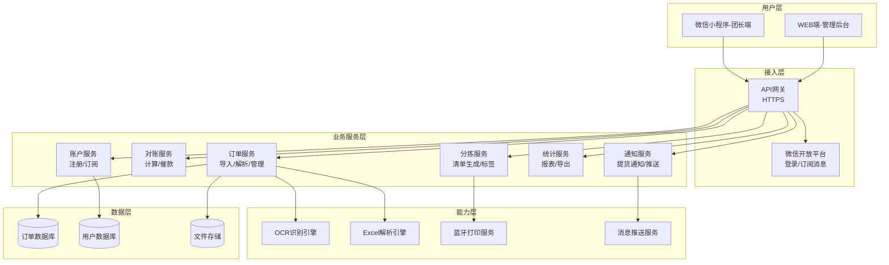

## 2.2 业务模块图

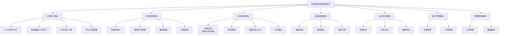

## 2.3 主业务流程

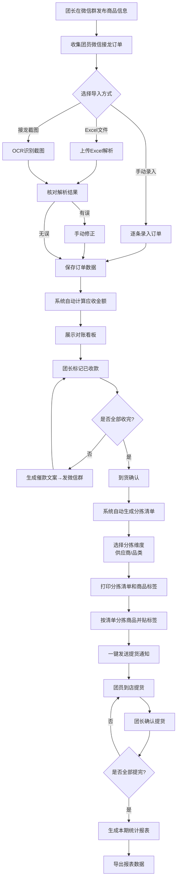

## 2.4 功能图/列表

| 功能模块 | 功能名称 | 优先级 | 所属端 | 功能描述 |
| --- | --- | --- | --- | --- |
| 订单导入 | Excel文件导入 | P0 | 小程序端 | 上传Excel文件，系统自动解析订单数据 |
| 订单导入 | 接龙截图OCR导入 | P0 | 小程序端 | 上传接龙截图，OCR自动识别订单信息 |
| 订单导入 | 手动录入订单 | P1 | 小程序端 | 手动逐条或批量录入订单 |
| 订单导入 | 导入记录管理 | P2 | 小程序端 | 查看历史导入记录 |
| 对账收款 | 对账看板 | P0 | 小程序端 | 展示应收/已收/未收金额及完成率 |
| 对账收款 | 收款状态管理 | P0 | 小程序端 | 标记/取消已收款状态 |
| 对账收款 | 催款提醒 | P0 | 小程序端 | 生成催款文案并一键复制 |
| 分拣清单 | 清单生成 | P0 | 小程序端 | 按供应商/品类自动生成分拣清单 |
| 分拣清单 | 清单管理 | P1 | 小程序端 | 查看和修改分拣清单 |
| 分拣清单 | 商品标签生成 | P0 | 小程序端 | 生成商品标签并选择模板 |
| 分拣清单 | 打印输出 | P0 | 小程序端 | 蓝牙打印分拣清单和商品标签 |
| 提货通知 | 一键发送通知 | P0 | 小程序端 | 向所有待提货团员发送提货通知 |
| 提货通知 | 通知内容编辑 | P1 | 小程序端 | 编辑提货通知内容 |
| 提货通知 | 提货确认 | P0 | 小程序端 | 手动/现场确认提货 |
| 提货通知 | 提货记录 | P1 | 小程序端 | 查看提货状态列表 |
| 统计报表 | 本期统计 | P1 | 小程序端 | 展示当前批次交易数据 |
| 统计报表 | 历史趋势 | P2 | 小程序端 | 查看历史批次数据趋势 |
| 统计报表 | 数据导出 | P1 | 小程序端 | 导出报表为Excel文件 |
| 账户管理 | 微信授权登录 | P0 | 小程序端/WEB端 | 通过微信授权完成注册登录 |
| 账户管理 | 手机号绑定 | P0 | 小程序端 | 登录后绑定手机号 |
| 账户管理 | 订阅管理 | P1 | WEB端 | 查看套餐和升级 |
| 数据管理 | 订单管理 | P1 | WEB端 | 查看和搜索所有订单 |
| 数据管理 | 数据导出 | P1 | WEB端 | 导出所有数据为Excel |

## 2.5 你的产品有哪些端

| 序号 | 端名称 | 端类型 | 目标用户 | 说明 |
| --- | --- | --- | --- | --- |
| 1 | 团长端小程序 | 小程序端 | 社区团购团长 | 团长在手机微信中使用，完成订单导入、对账、分拣、提货通知等核心操作。MVP版本核心交互端。 |
| 2 | 管理后台 | WEB端 | 社区团购团长 | 团长在电脑浏览器中辅助管理订单数据、查看统计报表、导出数据。作为小程序端的补充。 |

---
# 3 产品功能

## 3.1 团长端小程序功能

### 3.1.1 订单导入-Excel文件导入

功能描述：团长从小程序本地选择Excel订单文件（.xlsx/.xls格式）上传，系统自动解析文件中的订单数据（商品名称、数量、单价、买家姓名、手机号等），展示解析结果供团长核对，确认后正式保存订单记录。

_优先级与依赖说明：_
| 项 | 内容 |
| --- | --- |
| 优先级 | P0 |
| 依赖需求 | 无 |
| 前置条件 | 团长已登录，当前批次尚未关闭 |

### 3.1.2 订单导入-Excel文件导入—详细流程

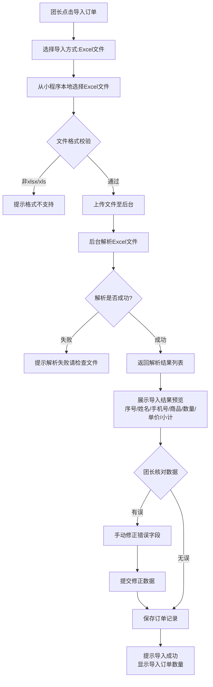

_业务规则说明：_
1. 支持.xlsx和.xls两种Excel格式，文件大小不超过10MB
2. 系统自动识别表头字段映射（姓名/手机号/商品名/数量/单价），无法识别的字段需团长手动映射
3. 解析结果中手机号需校验格式（11位数字），格式错误的标红提醒
4. 小计金额由系统自动计算（数量×单价），不允许手动修改
5. 单次导入订单数量上限：免费版50条/月，团长版不限

### 3.1.3 订单导入-接龙截图OCR导入

功能描述：团长上传微信群接龙截图，系统通过OCR自动识别截图中的订单文本信息，展示识别结果并对低置信度字段高亮标记，团长修正后确认导入。

_优先级与依赖说明：_
| 项 | 内容 |
| --- | --- |
| 优先级 | P0 |
| 依赖需求 | OCR文字识别接口 |
| 前置条件 | 团长已登录，当前批次尚未关闭 |

### 3.1.4 订单导入-接龙截图OCR导入—详细流程

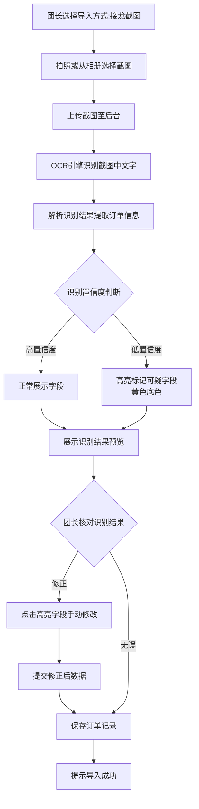

_业务规则说明：_
1. 支持JPG/PNG格式图片，单张不超过5MB
2. 一次可上传多张截图（最多9张），系统依次识别并合并结果
3. 低置信度字段（置信度<80%）以黄色底色高亮标记，提醒团长重点关注
4. OCR识别需在5秒内完成单张图片
5. 系统预置常见接龙格式模板（如"姓名+商品+数量"、"序号.姓名 商品×数量"等），自动匹配最佳模板

### 3.1.5 订单导入-手动录入订单

功能描述：团长手动输入单笔或多笔订单信息（买家姓名、手机号、商品名称、数量、单价），适用于少量补录场景。

_优先级与依赖说明：_
| 项 | 内容 |
| --- | --- |
| 优先级 | P1 |
| 依赖需求 | 无 |
| 前置条件 | 团长已登录，当前批次尚未关闭 |

### 3.1.6 订单导入-手动录入订单—详细流程

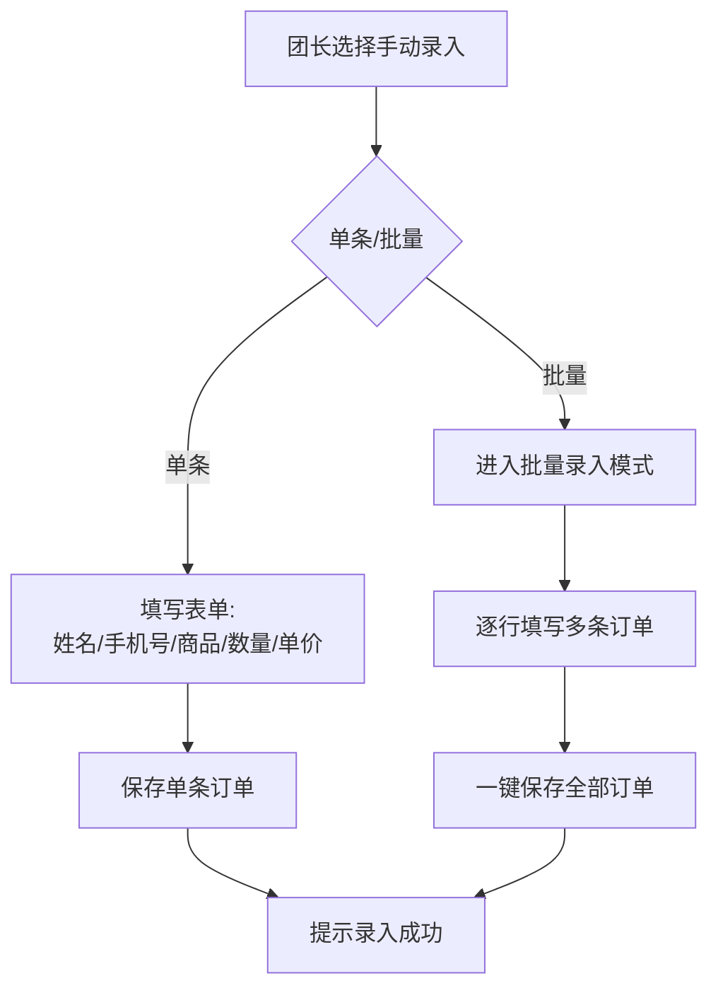

_业务规则说明：_
1. 手机号必填，需校验11位数字格式
2. 买家姓名必填，最大长度20字符
3. 商品名称必填，最大长度50字符
4. 数量必须为正整数，单价必须为正数（支持两位小数）
5. 批量录入最多一次添加50条

### 3.1.7 对账收款-对账看板

功能描述：以看板形式展示当前批次的对账核心数据：应收总额、已收金额、未收金额、收款完成率。是团长最常用的查看入口，以醒目颜色区分收款状态（绿色=已收，红色=未收）。

_优先级与依赖说明：_
| 项 | 内容 |
| --- | --- |
| 优先级 | P0 |
| 依赖需求 | 订单导入功能 |
| 前置条件 | 当前批次已导入至少一条订单 |

### 3.1.8 对账收款-对账看板—详细流程

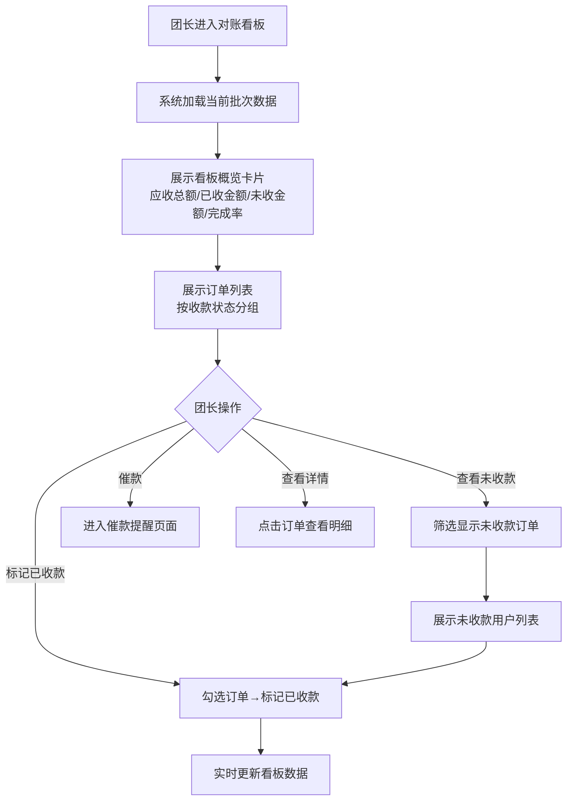

_业务规则说明：_
1. 看板数据实时更新，每次标记收款后自动刷新统计
2. 应收总额 = 所有订单小计金额之和
3. 已收金额 = 标记为"已收款"的订单小计之和
4. 未收金额 = 应收总额 - 已收金额
5. 收款完成率 = 已收金额 / 应收总额 × 100%
6. 已收款以绿色标识，未收款以红色标识
7. 对账统计响应时间不超过1秒

### 3.1.9 对账收款-催款提醒

功能描述：系统自动识别未付款用户，生成催款文案模板（按人汇总/按订单明细等多种格式），团长一键复制文案后粘贴到微信群发送。

_优先级与依赖说明：_
| 项 | 内容 |
| --- | --- |
| 优先级 | P0 |
| 依赖需求 | 对账看板 |
| 前置条件 | 存在未收款订单 |

### 3.1.10 对账收款-催款提醒—详细流程

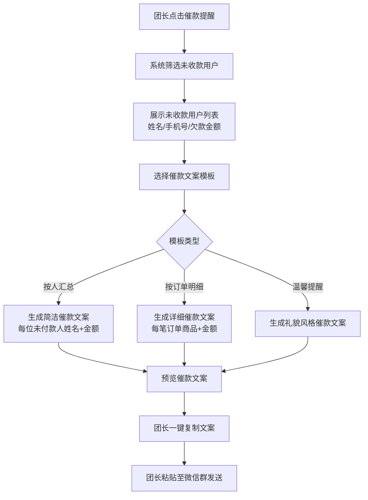

_业务规则说明：_
1. 提供至少3种催款文案模板：按人汇总、按订单明细、温馨提醒
2. 催款文案中买家手机号需脱敏显示（如138****1234）
3. 文案中自动包含批次信息和团购商品概要
4. 一键复制后提示"已复制，请粘贴到微信群发送"

### 3.1.11 分拣清单-清单生成

功能描述：系统根据订单数据按供应商或品类维度自动汇总，生成分拣清单。按供应商生成时每个供应商一份清单，列出该供应商需备的商品及数量；按品类生成时每个品类一份清单。

_优先级与依赖说明：_
| 项 | 内容 |
| --- | --- |
| 优先级 | P0 |
| 依赖需求 | 订单导入功能 |
| 前置条件 | 当前批次已导入订单 |

### 3.1.12 分拣清单-清单生成—详细流程

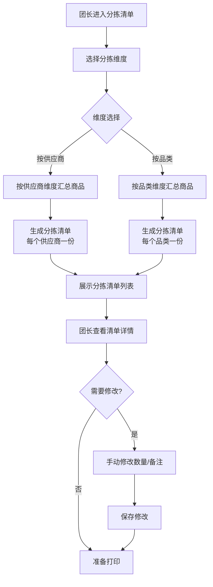

_业务规则说明：_
1. 供应商和品类信息从订单数据中提取，若订单未标注供应商/品类则归入"未分类"
2. 清单中每个商品条目包含：商品名称、汇总数量、涉及买家数
3. 清单生成时间不超过2秒
4. 团长可在分拣过程中修改清单数量（应对实际到货与预期不符）

### 3.1.13 分拣清单-商品标签生成

功能描述：系统按商品维度生成商品标签，标签内容包括商品名称、数量、买家姓名。提供多种标签尺寸/样式模板供选择，支持批量打印贴在分装好的商品袋上。

_优先级与依赖说明：_
| 项 | 内容 |
| --- | --- |
| 优先级 | P0 |
| 依赖需求 | 分拣清单生成 |
| 前置条件 | 已生成分拣清单 |

### 3.1.14 分拣清单-商品标签生成—详细流程

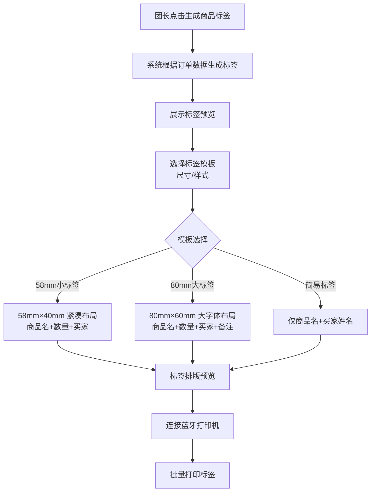

_业务规则说明：_
1. 每个买家+商品组合生成一个标签
2. 标签默认内容：商品名称、数量、买家姓名
3. 提供3种标签模板：58mm小标签、80mm大标签、简易标签
4. 标签字体大小需适合实际场景使用（商品名≥14pt，买家姓名≥12pt）
5. 批量打印时按商品分组排序，方便连续打印

### 3.1.15 提货通知-一键发送

功能描述：团长点击后，系统向当前批次所有待提货团员发送提货通知。通知内容包含商品名称、数量、提货时间、提货地点，团长可编辑修改。通过微信订阅消息推送。

_优先级与依赖说明：_
| 项 | 内容 |
| --- | --- |
| 优先级 | P0 |
| 依赖需求 | 订单导入、微信订阅消息接口 |
| 前置条件 | 当前批次存在待提货订单 |

### 3.1.16 提货通知-一键发送—详细流程

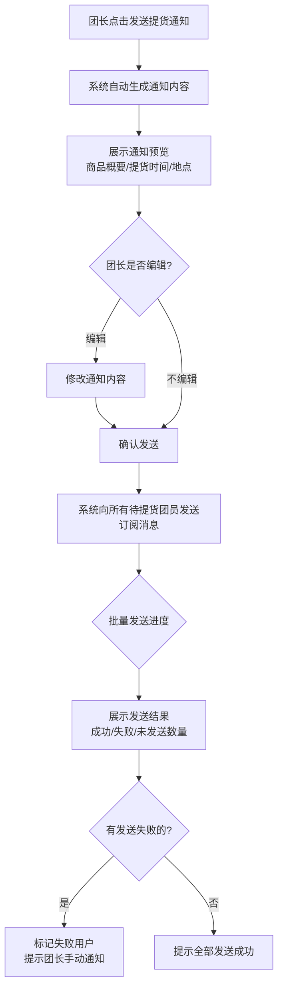

_业务规则说明：_
1. 通知通过微信订阅消息发送，团员需 previamente 授权订阅
2. 通知内容默认包含：团购批次名称、商品概要、提货时间（默认当天18:00-20:00）、提货地点（团长预设地址）
3. 批量发送100人以内完成时间不超过10秒
4. 发送失败的记录需展示失败原因（如用户未授权订阅消息）
5. 同一批次可重复发送通知（如第二次提醒）

### 3.1.17 提货通知-提货确认

功能描述：团员到达提货点后，团长手动将该团员的订单标记为"已提货"，或现场扫码确认提货。系统实时更新提货状态列表。

_优先级与依赖说明：_
| 项 | 内容 |
| --- | --- |
| 优先级 | P0 |
| 依赖需求 | 提货通知发送 |
| 前置条件 | 已发送提货通知 |

### 3.1.18 提货通知-提货确认—详细流程

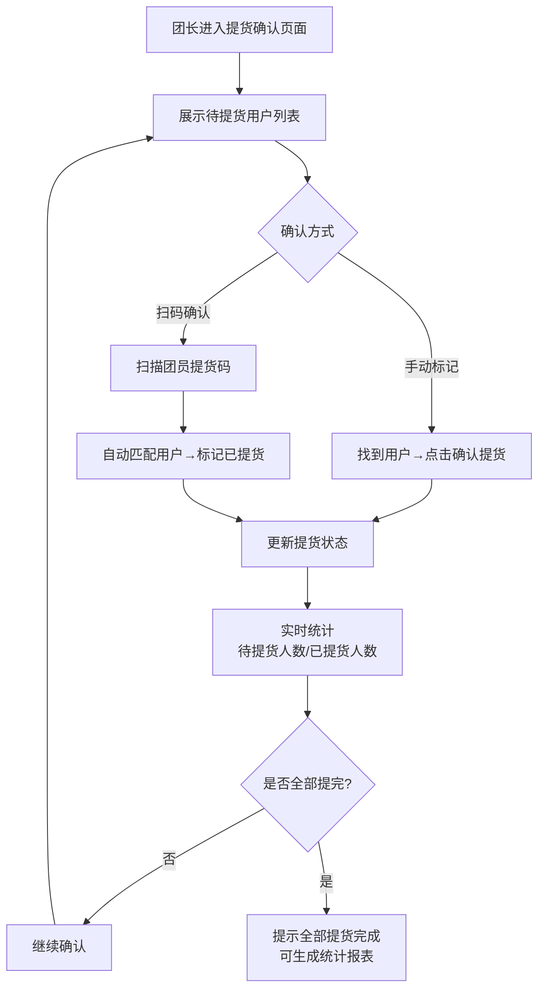

_业务规则说明：_
1. 手动标记：团长在列表中找到用户，点击"确认提货"按钮
2. 扫码确认：系统为每个订单生成唯一提货二维码，团长扫码自动确认
3. 已提货状态不可撤销（防止误操作，如需修改需联系后台）
4. 提货状态列表实时更新，每次确认后立即刷新统计数字
5. 支持按姓名/手机号搜索用户快速定位

### 3.1.19 统计报表-本期统计

功能描述：展示当前批次的交易数据统计：订单总量、应收总额、已收金额、未收金额、收款完成率、提货完成率。

_优先级与依赖说明：_
| 项 | 内容 |
| --- | --- |
| 优先级 | P1 |
| 依赖需求 | 对账收款、提货通知 |
| 前置条件 | 当前批次有订单数据 |

### 3.1.20 统计报表-本期统计—详细流程

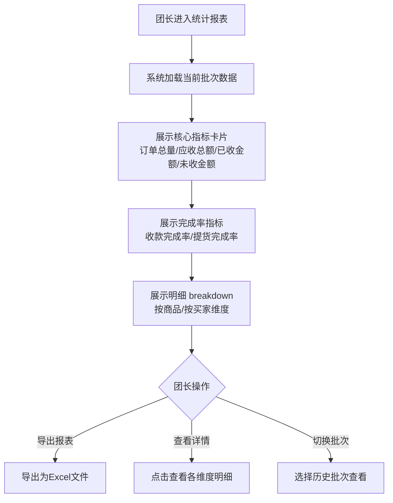

_业务规则说明：_
1. 收款完成率 = 已收金额 / 应收总额 × 100%
2. 提货完成率 = 已提货订单数 / 总订单数 × 100%
3. 统计维度支持按商品、按买家两种维度查看
4. 数据导出为.xlsx格式

### 3.1.21 账户管理-微信授权登录

功能描述：团长通过微信小程序授权完成注册和登录，首次登录后需绑定手机号。

_优先级与依赖说明：_
| 项 | 内容 |
| --- | --- |
| 优先级 | P0 |
| 依赖需求 | 微信小程序登录接口 |
| 前置条件 | 用户已安装微信 |

### 3.1.22 账户管理-微信授权登录—详细流程

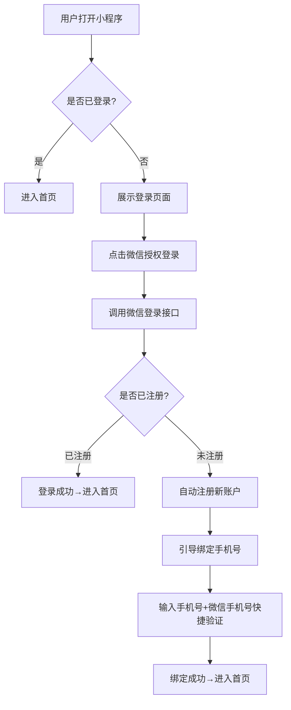

_业务规则说明：_
1. 微信授权仅获取用户openid，不获取其他隐私信息
2. 首次登录必须绑定手机号，手机号用于接收验证和通知
3. 手机号验证通过微信手机号快捷获取方式，无需短信验证码
4. 登录状态有效期30天，过期需重新授权

---
# 4 产品原型

## 4.1 页面跳转逻辑图

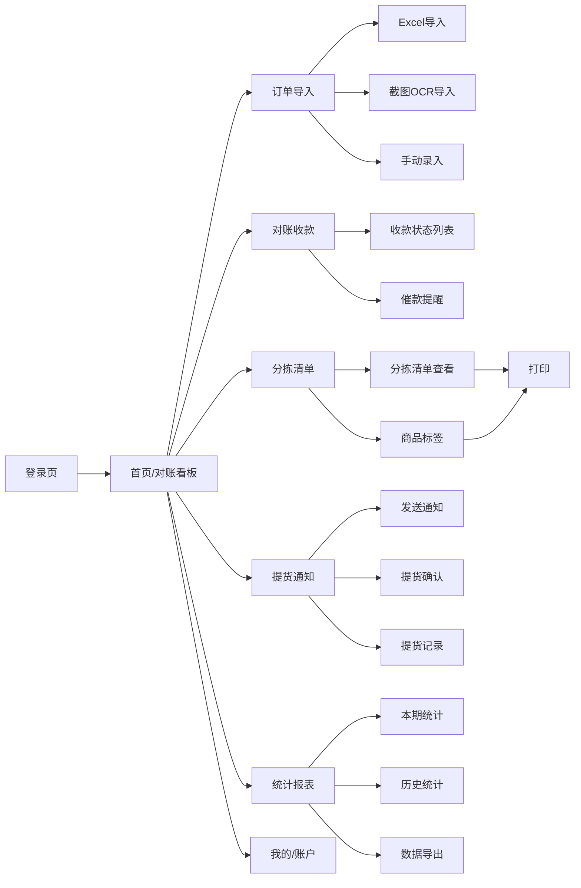

## 4.2 全站点原型设计

### 4.2.1 团长端小程序

**页面清单：**

| 序号 | 页面名称 | 所属模块 | 页面描述 | 关键元素 |
| --- | --- | --- | --- | --- |
| 1 | 登录页 | 账户管理 | 微信授权登录页面 | 微信登录按钮、品牌logo |
| 2 | 首页/对账看板 | 对账收款 | 核心数据概览，展示应收/已收/未收/完成率 | 数据卡片、快捷操作入口、收款状态概览 |
| 3 | 订单导入页 | 订单导入 | 选择导入方式的入口页面 | Excel导入按钮、截图OCR按钮、手动录入按钮 |
| 4 | Excel导入-预览页 | 订单导入 | Excel解析结果预览与确认 | 订单列表、字段编辑、确认导入按钮 |
| 5 | OCR导入-预览页 | 订单导入 | OCR识别结果预览与修正 | 截图预览、识别结果列表、高亮低置信字段、修正编辑 |
| 6 | 手动录入页 | 订单导入 | 手动录入订单表单 | 表单（姓名/手机号/商品/数量/单价）、保存按钮 |
| 7 | 收款状态列表 | 对账收款 | 订单收款状态列表，支持标记操作 | 订单列表、状态标签、批量操作、标记收款按钮 |
| 8 | 催款提醒页 | 对账收款 | 未收款用户列表与催款文案生成 | 未收款列表、文案模板选择、预览区、复制按钮 |
| 9 | 分拣清单页 | 分拣清单 | 选择分拣维度并查看清单 | 维度切换Tab、清单列表、修改入口 |
| 10 | 商品标签页 | 分拣清单 | 商品标签预览与模板选择 | 标签预览、模板选择、打印按钮 |
| 11 | 打印预览页 | 分拣清单 | 打印前的预览与蓝牙连接 | 打印预览、打印机连接、打印按钮 |
| 12 | 提货通知页 | 提货通知 | 发送提货通知与编辑 | 通知内容预览、编辑区、发送按钮、发送结果 |
| 13 | 提货确认页 | 提货通知 | 确认团员提货状态 | 待提货列表、扫码按钮、确认提货按钮、统计 |
| 14 | 统计报表页 | 统计报表 | 本期/历史数据统计 | 数据卡片、趋势图、维度切换、导出按钮 |
| 15 | 我的/账户页 | 账户管理 | 个人信息与设置 | 头像、昵称、手机号、套餐信息、退出登录 |

**交互说明：**
- 页面跳转关系：
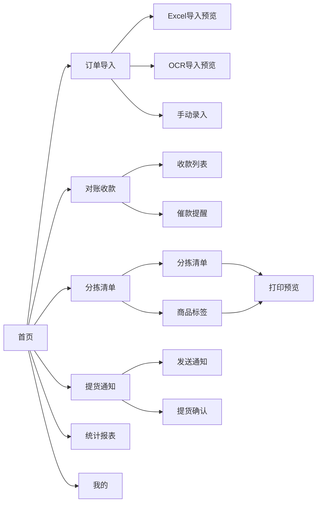
- 特殊交互：
  1. 首页下拉刷新，重新加载对账数据
  2. 列表页上拉加载更多
  3. OCR导入页支持图片缩放查看原图
  4. 分拣清单支持左右滑动切换供应商/品类
  5. 提货确认页支持扫码快速确认
  6. 催款文案支持长按复制

**产品原型：**

[📱 打开团长端小程序全站点原型](assets/prototypes/小程序端-prototype.html)

### 4.2.2 管理后台

**页面清单：**

| 序号 | 页面名称 | 所属模块 | 页面描述 | 关键元素 |
| --- | --- | --- | --- | --- |
| 1 | 登录页 | 账户管理 | 微信扫码登录页面 | 二维码扫码区、品牌logo |
| 2 | 工作台首页 | 数据管理 | 数据概览与快捷入口 | 统计卡片、快捷操作、最近批次列表 |
| 3 | 订单列表 | 数据管理 | 所有批次订单记录查看与搜索 | 筛选栏、订单表格、分页、导出按钮 |
| 4 | 订单详情 | 数据管理 | 单笔订单详细信息 | 订单信息、收款状态、提货状态 |
| 5 | 数据导出 | 数据管理 | 批量导出数据 | 导出范围选择、格式选择、导出按钮 |
| 6 | 账户设置 | 账户管理 | 个人信息与套餐管理 | 基本信息、套餐详情、升级按钮 |

**交互说明：**
- 页面跳转关系：
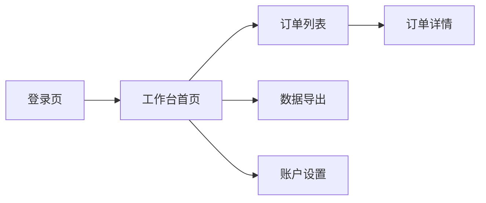
- 特殊交互：
  1. 左侧导航栏固定，右侧内容区滚动
  2. 订单表格支持按列排序
  3. 筛选条件支持组合搜索
  4. 数据导出支持进度条展示

**产品原型：**

[🖥️ 打开管理后台全站点原型](assets/prototypes/管理后台-prototype.html)

---
# 5 数据需求

## 5.1 数据使用规格

### 订单表（orders）

| **字段** | **是否必填** | **描述** | **数据类型** |
| --- | --- | --- | --- |
| id | 是 | 订单唯一标识 | UUID |
| batch_id | 是 | 所属批次ID | UUID |
| buyer_name | 是 | 买家姓名 | 字符串 |
| buyer_phone | 是 | 买家手机号 | 字符串（11位） |
| product_name | 是 | 商品名称 | 字符串 |
| quantity | 是 | 数量 | 整数 |
| unit_price | 是 | 单价 | 数字（两位小数） |
| subtotal | 是 | 小计金额（数量×单价） | 数字（两位小数） |
| supplier | 否 | 供应商名称 | 字符串 |
| category | 否 | 商品品类 | 字符串 |
| payment_status | 是 | 收款状态（unpaid/paid） | 字符串 |
| pickup_status | 是 | 提货状态（pending/picked） | 字符串 |
| import_method | 是 | 导入方式（excel/ocr/manual） | 字符串 |
| created_at | 是 | 创建时间 | 时间戳 |
| updated_at | 是 | 更新时间 | 时间戳 |

### 批次表（batches）

| **字段** | **是否必填** | **描述** | **数据类型** |
| --- | --- | --- | --- |
| id | 是 | 批次唯一标识 | UUID |
| leader_id | 是 | 团长ID | UUID |
| name | 是 | 批次名称 | 字符串 |
| total_amount | 是 | 应收总额 | 数字 |
| paid_amount | 是 | 已收金额 | 数字 |
| order_count | 是 | 订单总数 | 整数 |
| pickup_location | 否 | 提货地点 | 字符串 |
| pickup_time_start | 否 | 提货开始时间 | 时间戳 |
| pickup_time_end | 否 | 提货结束时间 | 时间戳 |
| status | 是 | 批次状态（active/closed） | 字符串 |
| created_at | 是 | 创建时间 | 时间戳 |

## 5.2 统计数据

1. 每个批次的订单总量、应收总额、已收金额、未收金额、收款完成率、提货完成率（P0）
2. 历史各批次交易数据趋势，按月/按周统计（P2）
3. 按商品维度的销量排名统计（P2）

---
# 6 非功能需求

## 6.1 性能需求

**6.1.1 延迟**

| 编号 | 项目 | 最大延迟 | 平均延迟 | 优先级 | 备注 |
| --- | --- | --- | --- | --- | --- |
| PERF-01 | Excel文件导入（100条以内） | <3秒 | <2秒 | 高 | 含文件上传和解析 |
| PERF-02 | 接龙截图OCR识别（单张） | <5秒 | <3秒 | 高 | 含图片上传和识别 |
| PERF-03 | 对账统计计算 | <1秒 | <0.5秒 | 高 | 应收/已收/未收计算 |
| PERF-04 | 提货通知批量发送（100人以内） | <10秒 | <5秒 | 高 | 含消息推送 |
| PERF-05 | 分拣清单和标签生成 | <2秒 | <1秒 | 中 | |
| PERF-06 | 报表数据导出（1000条以内） | <5秒 | <3秒 | 中 | |

**6.1.2 吞吐量**

| 编号 | 项 | 吞吐量 | 备注 |
| --- | --- | --- | --- |
| TP-01 | 同时在线团长 | 每分钟1000次API请求 | |
| TP-02 | OCR识别并发 | 每分钟50次 | |

**6.1.3 容量**

| 编号 | 项 | 容量 | 备注 |
| --- | --- | --- | --- |
| CAP-01 | 系统团长用户数 | <=100,000 | |
| CAP-02 | 单团长历史订单数 | <=50,000 | |
| CAP-03 | 单批次订单数 | <=500 | |

## 6.2 安全需求

| 编号 | 项（系统数据 / 处理过程） |
| --- | --- |
| SEC-01 | 用户订单数据需加密存储（AES-256） |
| SEC-02 | 买家手机号在界面展示时需脱敏（138****1234） |
| SEC-03 | API接口需Token认证，防止未授权访问 |
| SEC-04 | 小程序与后台通讯全程HTTPS加密 |
| SEC-05 | 用户敏感信息（手机号）数据库层面加密存储 |

## 6.3 可靠性

| 编号 | 项 | 值 |
| --- | --- | --- |
| REL-01 | 服务可用性 | >=99.9% |
| REL-02 | 平均正常运行时间 | >=365天 |
| REL-03 | 平均故障恢复时间 | <=30分钟 |

## 6.4 可连续性

| 编号 | 项 |
| --- | --- |
| CONT-01 | 系统需7×24小时全天候运行 |
| CONT-02 | 数据定时备份，支持故障恢复 |

## 6.5 可恢复性

| 编号 | 项 |
| --- | --- |
| REC-01 | 每日全量备份，保留30天 |
| REC-02 | 每小时增量备份 |
| REC-03 | 重大故障24小时内恢复服务 |

## 6.6 兼容性

| 编号 | 要求 | 备注 |
| --- | --- | --- |
| COMP-01 | 小程序端兼容iOS和Android主流机型 | 支持微信7.0及以上 |
| COMP-02 | 适配屏幕尺寸4.7英寸至6.7英寸 | |
| COMP-03 | WEB端兼容Chrome>=90、Safari>=14、Edge>=90 | |
| COMP-04 | 蓝牙打印兼容主流便携式热敏打印机（58mm/80mm） | |

## 6.7 易用性

| 编号 | 要求 | 备注 |
| --- | --- | --- |
| USE-01 | 核心操作（导入订单、发送提货通知）不超过3步 | |
| USE-02 | OCR识别结果提供清晰的人工校对界面 | 低置信字段高亮 |
| USE-03 | 对账看板以醒目颜色区分收款状态 | 绿色已收/红色未收 |
| USE-04 | 普通团长无需培训即可使用核心功能 | |

---
# 7 总结

## 7.1 上线计划

| 阶段 | 时间 | 内容 | 负责人 |
| --- | --- | --- | --- |
| 开发阶段 | 2026-07-01 ~ 2026-07-05 | MVP核心功能开发（订单导入+对账看板+提货通知） | 开发团队 |
| 测试阶段 | 2026-07-06 ~ 2026-07-07 | 功能测试、兼容性测试 | 测试团队 |
| 全量上线 | 2026-07-08 | 全量开放MVP版本 | 产品团队 |

## 7.2 后续迭代规划

- V1.1：增加供应商协同功能（团长版增值功能），供应商可查看备货清单
- V1.2：增加多团长协作功能，支持副团长协助管理
- V1.3：增加智能推荐功能，根据历史数据推荐催款时机和话术
- V1.4：增加商品图片识别功能，OCR支持识别商品图片

## 7.3 参考文档

- 需求文档（URS）：[需求文档.md](需求文档.md)
- 微信小程序开发文档：https://developers.weixin.qq.com/miniprogram/dev/framework/
- 微信订阅消息文档：https://developers.weixin.qq.com/miniprogram/dev/wxopen/subscribe-message.html
