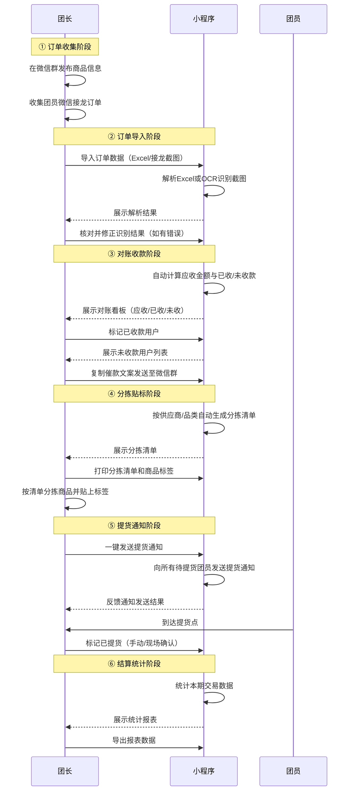
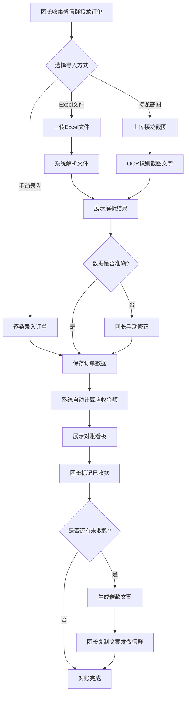
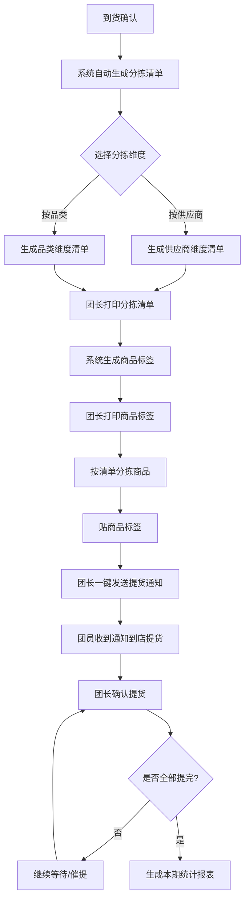
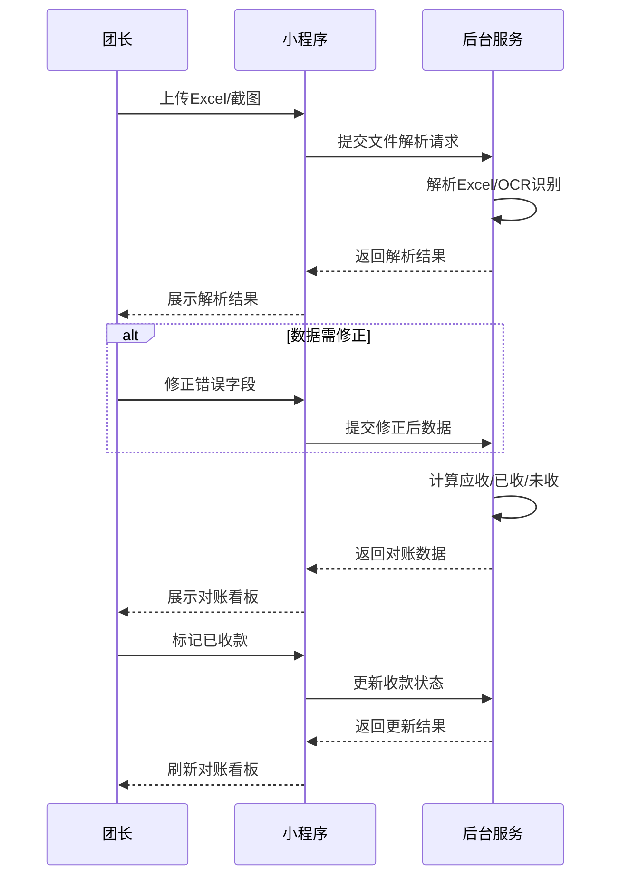
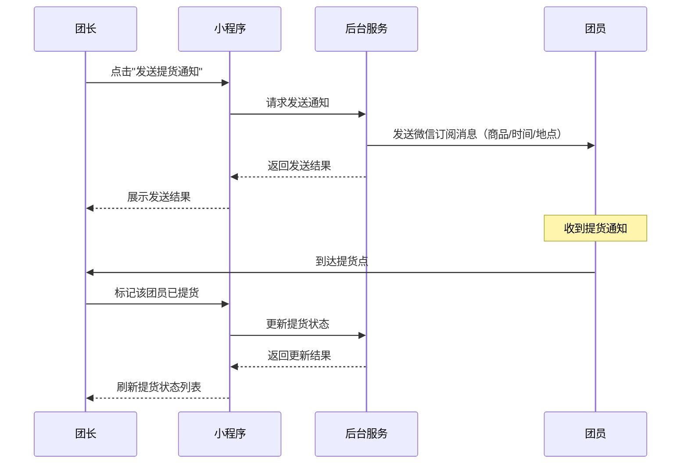
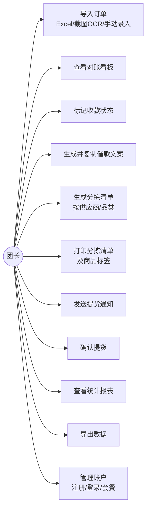
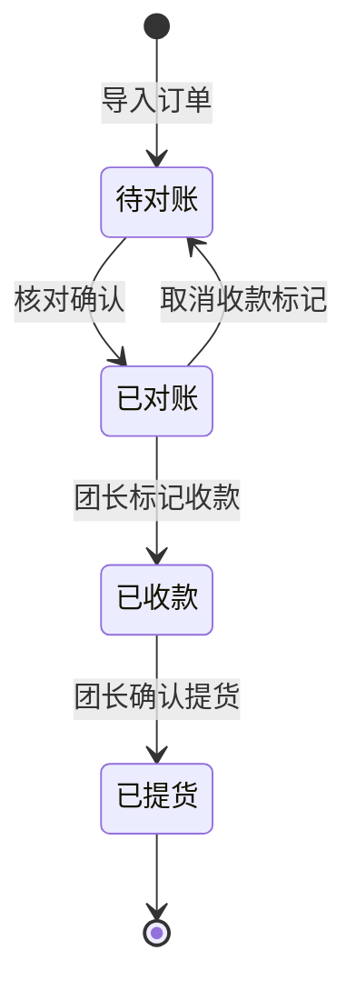

# 1. 需求概述

## 1.1 需求介绍

社区团购对账发货助手是一款面向社区团购团长的小型效率工具，聚焦社区团购场景中"到货后"的执行环节——订单对账、分拣清单生成、提货通知。当前社区团购团长多为个体经营者或家庭主妇，日常使用微信群接龙的方式组织团购，订单对账、分拣清单制作、提货通知发送均依赖人工操作，出错率高、效率低下。本产品旨在通过导入订单表（Excel/接龙截图OCR）自动完成对账、生成分拣清单和商品标签、一键发送提货通知，帮助团长将原本数小时的手工对账分拣工作缩短至几分钟内完成。

### 1.1.1 所属领域

社区团购 / 本地生活服务工具

## 1.2 需求目标

1. **降低对账出错率**：通过自动化导入和对账计算，将人工对账出错率降低至接近零。
2. **提升分拣效率**：系统按供应商/品类自动生成分拣清单和商品标签，减少手动整理时间。
3. **简化提货流程**：到货后一键通知团员提货，自动记录和跟踪提货状态。
4. **实现催款提醒**：自动识别未付款用户，生成催款提醒文案，帮助团长快速回收欠款。

本产品定位为"执行环节工具"，不做完整的社区团购系统（不含商品上架、下单、在线支付等），仅聚焦订单导入后的对账、分拣、提货三个核心环节。

## 1.3 系统使用角色

| 角色 | 说明 |
|------|------|
| 团长 | 社区团购的组织者，负责在微信群发布商品信息、收集团员接龙订单、到货后分拣商品、通知提货、对账收款。是系统的核心使用者。 |
| 团员（买家） | 社区团购的参与消费者，通过微信群接龙方式下单，到货后前往指定地点提货并付款。本系统中团员不直接操作，由团长代为录入和管理。 |

## 1.4 业务流程图

# 2. 功能原型

| 原型名称 | 原型链接 | 对应端 | 备注 |
| --- | --- | --- | --- |
| 社区团购对账发货助手-团长端 | 待产品文档与UI原型设计完成后补充 | 小程序端 | MVP版本核心交互端，面向团长 |
| 社区团购对账发货助手-管理后台 | 待产品文档与UI原型设计完成后补充 | WEB端 | 团长管理自身的订单、对账、统计数据 |

# 3. 需求清单

## 3.1 社区团购对账发货助手-小程序端

### 3.1.1 订单导入模块

| 模块 | 一级功能 | 二级功能 | 功能描述 | 备注 |
| --- | --- | --- | --- | --- |
| 订单导入 | Excel文件导入 | 选择文件导入 | 团长从小程序本地选择Excel订单文件上传，系统自动解析文件中的订单数据（商品名称、数量、单价、买家姓名、手机号等） | 支持.xlsx/.xls格式 |
| 订单导入 | Excel文件导入 | 导入结果预览 | 系统展示解析后的订单列表，包含字段：序号、买家姓名、手机号、商品名称、数量、单价、小计金额 | |
| 订单导入 | Excel文件导入 | 导入确认 | 团长核对预览数据无误后确认导入，系统正式保存订单记录 | |
| 订单导入 | 接龙截图OCR导入 | 截图上传识别 | 团长上传微信群接龙截图，系统通过OCR自动识别截图中的订单文本信息 | |
| 订单导入 | 接龙截图OCR导入 | 识别结果预览 | 系统展示OCR识别后的订单列表，并对识别置信度较低的字段高亮标记 | 低置信度字段需团长人工确认 |
| 订单导入 | 接龙截图OCR导入 | 识别结果修正 | 团长对OCR识别错误的字段进行手动修改和补全 | |
| 订单导入 | 接龙截图OCR导入 | 修正后确认导入 | 团长确认修正后的数据无误，系统保存订单记录 | |
| 订单导入 | 手动录入订单 | 单条录入 | 团长手动输入单笔订单信息：买家姓名、手机号、商品名称、数量、单价 | 适用于少量补录场景 |
| 订单导入 | 手动录入订单 | 批量录入 | 团长通过表单批量添加多条订单记录 | |
| 订单导入 | 导入记录管理 | 导入历史查看 | 查看历史导入记录，包含导入时间、导入方式、订单数量 | |

### 3.1.2 对账收款模块

| 模块 | 一级功能 | 二级功能 | 功能描述 | 备注 |
| --- | --- | --- | --- | --- |
| 对账收款 | 应收款统计 | 应收总额计算 | 系统自动统计当前批次所有订单的应收总金额 | |
| 对账收款 | 应收款统计 | 已收款统计 | 统计已标记为"已收款"的订单数量和金额 | |
| 对账收款 | 应收款统计 | 未收款统计 | 统计未标记收款的订单数量和金额 | |
| 对账收款 | 收款状态管理 | 标记已收款 | 团长逐条或批量将订单标记为"已收款" | |
| 对账收款 | 收款状态管理 | 取消已收款标记 | 团长可取消已收款标记（应对误操作） | |
| 对账收款 | 催款提醒 | 未收款用户列表 | 展示所有未收款买家的姓名、手机号、欠款金额列表 | |
| 对账收款 | 催款提醒 | 生成催款文案 | 系统自动生成催款文案模板，包含未付款买家姓名和金额明细 | |
| 对账收款 | 催款提醒 | 一键复制文案 | 团长可一键复制催款文案至剪贴板，方便粘贴到微信群发送 | |
| 对账收款 | 对账看板 | 数据概览展示 | 以看板形式展示：应收总额、已收金额、未收金额、收款完成率 | 核心页面，团长最常用的查看入口 |

### 3.1.3 分拣清单模块

| 模块 | 一级功能 | 二级功能 | 功能描述 | 备注 |
| --- | --- | --- | --- | --- |
| 分拣清单 | 清单生成 | 按供应商生成 | 系统根据订单数据按供应商维度自动汇总，生成分拣清单（每个供应商一份，列出该供应商需备的商品及数量） | |
| 分拣清单 | 清单生成 | 按品类生成 | 系统根据订单数据按商品品类维度自动汇总，生成分拣清单（每个品类一份） | |
| 分拣清单 | 清单管理 | 清单查看 | 团长查看已生成的分拣清单详情 | |
| 分拣清单 | 清单管理 | 清单修改 | 团长在分拣过程中可手动修改清单中的数量或备注 | 应对实际到货与预期不符的情况 |
| 分拣清单 | 打印输出 | 打印分拣清单 | 将分拣清单格式化输出，支持通过蓝牙连接便携式打印机打印 | |
| 分拣清单 | 商品标签生成 | 生成商品标签 | 系统按商品维度生成商品标签，标签内容包括：商品名称、数量、买家姓名 | |
| 分拣清单 | 商品标签生成 | 标签模板选择 | 提供多种标签尺寸/样式模板供团长选择 | |
| 分拣清单 | 打印输出 | 打印商品标签 | 批量打印商品标签，用于贴在分装好的商品袋上 | |

### 3.1.4 提货通知模块

| 模块 | 一级功能 | 二级功能 | 功能描述 | 备注 |
| --- | --- | --- | --- | --- |
| 提货通知 | 通知发送 | 一键发送提货通知 | 团长点击后，系统向当前批次所有待提货团员发送提货通知 | |
| 提货通知 | 通知发送 | 通知内容编辑 | 系统自动生成通知内容（商品名称、数量、提货时间、提货地点），团长可编辑修改 | |
| 提货通知 | 通知发送 | 发送状态查看 | 团长查看通知发送结果（成功/失败/未发送） | |
| 提货通知 | 提货确认 | 手动标记已提货 | 团长手动将指定团员的订单标记为"已提货" | |
| 提货通知 | 提货确认 | 现场提货确认 | 团员到提货点后，团长现场扫码或手动确认提货 | |
| 提货通知 | 提货记录 | 提货状态列表 | 查看所有买家的提货状态（待提货/已提货），统计待提货人数和已提货人数 | |

### 3.1.5 统计报表模块

| 模块 | 一级功能 | 二级功能 | 功能描述 | 备注 |
| --- | --- | --- | --- | --- |
| 统计报表 | 本期统计 | 交易数据统计 | 展示当前批次统计数据：订单总量、应收总额、已收金额、未收金额、收款完成率、提货完成率 | |
| 统计报表 | 历史统计 | 历史趋势查看 | 查看历史各批次交易数据趋势图（按月/按周） | 仅团长版可用 |
| 统计报表 | 数据导出 | 导出报表 | 将统计数据导出为Excel文件 | |

## 3.2 社区团购对账发货助手-管理后台（WEB端）

### 3.2.1 账户管理模块

| 模块 | 一级功能 | 二级功能 | 功能描述 | 备注 |
| --- | --- | --- | --- | --- |
| 账户管理 | 账户注册登录 | 微信授权登录 | 团长通过微信小程序授权完成注册和登录 | |
| 账户管理 | 账户注册登录 | 手机号绑定 | 登录后绑定手机号，用于接收验证和通知 | |
| 账户管理 | 订阅管理 | 查看当前套餐 | 查看当前使用的套餐版本（免费版/团长版）、剩余额度、到期时间 | |
| 账户管理 | 订阅管理 | 套餐升级 | 免费版团长可升级为团长版（¥29/月），解除单量限制 | |

### 3.2.2 数据管理模块

| 模块 | 一级功能 | 二级功能 | 功能描述 | 备注 |
| --- | --- | --- | --- | --- |
| 数据管理 | 订单管理 | 订单列表 | 查看当前团长下所有批次的订单记录 | WEB端辅助管理 |
| 数据管理 | 订单管理 | 订单搜索筛选 | 按批次、买家姓名、手机号、收款状态、提货状态搜索筛选 | |
| 数据管理 | 数据备份 | 数据导出 | 将所有订单数据、对账记录、提货记录导出为Excel | |

# 4. 非功能需求

## 4.1 使用界面需求

| 编号 | 需求描述 |
|------|----------|
| UI-01 | 小程序端操作流程应尽量简洁，核心操作（导入订单、发送提货通知）不超过3步完成 |
| UI-02 | OCR识别结果需提供清晰的人工校对界面，低置信度字段需高亮标记 |
| UI-03 | 对账看板需以醒目的颜色区分已收款（绿色）和未收款（红色）状态 |
| UI-04 | 催款文案模板应提供多种格式（如按人汇总、按订单明细），方便团长选择 |
| UI-05 | 提货通知内容格式应清晰简洁，包含关键信息：商品、数量、时间、地点 |
| UI-06 | 分拣清单和商品标签的打印输出需排版清晰，字体大小适合实际场景使用 |

## 4.2 软硬件环境需求

| 编号 | 需求描述 |
|------|----------|
| ENV-01 | 小程序端需兼容iOS和Android主流机型，支持微信7.0及以上版本 |
| ENV-02 | 小程序端需适配主流手机屏幕尺寸（4.7英寸至6.7英寸） |
| ENV-03 | 管理后台WEB端需兼容Chrome、Safari、Edge等主流浏览器 |
| ENV-04 | 蓝牙打印功能需兼容主流便携式热敏打印机（58mm/80mm） |

## 4.3 性能需求

| 编号 | 需求描述 |
|------|----------|
| PERF-01 | Excel文件导入（100条订单以内）解析完成时间不超过3秒 |
| PERF-02 | 接龙截图OCR识别单张图片完成时间不超过5秒 |
| PERF-03 | 对账统计（应收/已收/未收计算）实时响应，不超过1秒 |
| PERF-04 | 提货通知批量发送（100人以内）完成时间不超过10秒 |
| PERF-05 | 分拣清单和商品标签生成时间不超过2秒 |
| PERF-06 | 报表数据导出（1000条记录以内）完成时间不超过5秒 |

## 4.4 约束性需求

| 编号 | 需求描述 |
|------|----------|
| CON-01 | 系统不实现商品上架、在线下单功能——用户通过微信群接龙方式下单，系统仅负责导入后的对账执行环节 |
| CON-02 | 系统不集成在线支付功能——收款由团长线下完成（微信转账/现金），系统仅负责记录和追踪收款状态 |
| CON-03 | 系统暂不支持供应商端——供应商协同功能属于团长版增值功能，不在MVP范围内 |
| CON-04 | 系统暂不支持多团长协作——当前版本仅支持单团长独立使用 |
| CON-05 | 免费版限制：每月最多处理50笔订单；超出需升级团长版（¥29/月，不限单量） |
| CON-06 | 用户订单数据需加密存储，买家手机号等敏感信息需脱敏展示 |
| CON-07 | 系统需后台服务支撑，负责数据存储、OCR识别、消息推送等核心能力 |

# 5. 接口需求

## 5.1 硬件接口需求

| 编号 | 接口名称 | 说明 |
|------|----------|------|
| HW-01 | 蓝牙打印机接口 | 通过蓝牙连接便携式热敏打印机（58mm/80mm），用于打印分拣清单和商品标签 |

## 5.2 软件接口需求

| 模块 | 接口名称 | 输入 | 输出 | 功能描述 |
| --- | --- | --- | --- | --- |
| 账户管理 | 微信小程序登录接口 | 小程序授权code | 用户openid、session_key | 团长通过微信授权完成登录注册 |
| 订单导入 | OCR文字识别接口 | 接龙截图图片 | 识别后的文字内容 | 识别微信群接龙截图中的订单文本信息 |
| 提货通知 | 微信小程序订阅消息接口 | 团员openid、通知内容模板 | 发送结果（成功/失败） | 向已下单团员发送提货通知 |
| 统计报表 | 微信分享接口 | 分享内容（统计摘要/催款文案） | 分享结果 | 支持将对账结果或催款文案分享至微信群 |

## 5.4 通讯接口需求

| 编号 | 接口名称 | 说明 |
|------|----------|------|
| COM-01 | 蓝牙BLE通讯 | 小程序通过蓝牙低功耗（BLE）协议与便携式热敏打印机通讯，传输打印数据 |
| COM-02 | HTTPS通讯 | 小程序与后台服务之间通过HTTPS协议通讯，确保数据传输安全 |

# 6. 附录

## 流程图

### 订单导入与对账流程

### 分拣贴标与提货流程

## 时序图

### 订单导入与对账时序

### 提货通知与确认时序

## （用户与系统交互）用例图

## （系统）状态图

### 订单状态流转

