# 社区旧物置换记录簿 V1.0 - 产品需求规格说明书（PRD）

| 版本号 | 变更日期 | 变更内容 | 变更人 | 审核人 |
| --- | --- | --- | --- | --- |
| V1.0 | 2026-06-29 | 初始版本创建 | 产品文档结对写作专家 | 阶段一产品落地页文档总编辑 |

---
# 1 概述

## 1.1 需求背景

随着城市化进程加快，社区居民之间的旧物转让需求日益频繁——孩子在成长中淘汰的玩具与衣物、搬家时带不走的家居用品、重复购买的图书影音等。目前，这些需求主要通过微信群发布零散信息来解决，但存在三大痛点：

1. **信息淹没**：微信群消息量大，旧物转让信息很快被聊天淹没，潜在需求方难以发现
2. **缺乏归属留痕**：口头或非正式置换缺乏归属变更记录，物品归属纠纷时有发生
3. **环保贡献无法量化**：社区旧物循环的环保价值无法被统计和展示，居民参与积极性难以持续

社区旧物置换记录簿旨在为社区居民提供一个轻量、专属、可追溯的旧物置换工具，让社区内的旧物循环"有据可查、有迹可循"，区别于闲鱼等面向陌生人的重交易平台，聚焦**社区熟人场景**下的旧物信息发布→置换确认→归属留痕→环保量化闭环。

## 1.2 名词解释

| **名词** | **说明** |
| --- | --- |
| 社区 | 一个独立的小区或居民区，拥有独立的货架、公告板和置换记录，不同社区数据严格隔离 |
| 社区货架 | 本社区内所有已发布且在售的旧物信息集合，按品类分类展示 |
| 置换 | 社区居民之间以物换物、象征性价格或免费赠送方式进行的旧物流转行为 |
| 置换留痕 | 系统对每次置换的记录，包含物品信息、双方用户、置换时间等，作为归属变更凭据 |
| 归属变更链 | 某物品从首次发布至今的完整流转路径（谁→谁→谁），可追溯物品的归属历史 |
| 环保报告 | 系统自动生成的社区环保贡献数据报告，含累计置换次数、减少浪费估算、参与家庭数等 |
| 环保积分 | 居民通过参与置换获得的虚拟积分，用于激励持续参与 |
| 免费版 | 基础版本，单个社区上限50件在架物品，无需审核即可发布 |
| 社区版 | 付费升级版（¥19/月/社区），不限物品数量，启用审核、环保报告、活动公告、多管理员等功能 |
| 管理员 | 物业工作人员或经认证的社区志愿者，拥有物品审核、公告发布、社区管理等权限 |

## 1.3 产品介绍

### 1.3.1 范围说明

| 项 | 内容 |
| --- | --- |
| 包含功能 | 居民端：微信登录、社区绑定、旧物发布（拍照+信息填写）、社区货架浏览（品类分类+搜索）、物品详情查看、留言预约、置换请求发起与处理、双方确认置换、置换留痕记录、归属变更历史、社区公告板、个人/社区环保报告、站内消息通知、微信订阅消息推送；管理员端：管理员认证、物品审核、社区物品管理、置换记录查询、纠纷处理、公告发布与管理、环保报告查看与发布、社区设置、管理员团队管理 |
| 不包含功能 | 在线支付功能、物流追踪功能、面向陌生人的跨区域交易、C2C拍卖竞价、商品质量担保、售后退换货服务 |
| 目标用户 | 社区居民（小区业主/租户）、社区管理员（物业人员/志愿者） |
| 使用场景 | 社区内旧物转让信息发布、邻居间旧物浏览与置换、置换归属留痕、社区环保数据统计与展示 |
| 产品核心价值 | 轻量、无物流、社区级的旧物置换闭环——发布便捷、置换有据、归属可查、环保可量化 |

### 1.3.2 商业模式

| 版本 | 价格 | 功能范围 |
| --- | --- | --- |
| 免费版 | ¥0 | 单个社区上限50件在架物品；基础发布与浏览；免审核直接上架；基础置换留痕 |
| 社区版 | ¥19/月/社区 | 不限在架物品数量；启用管理员审核机制；完整置换留痕与归属变更链；环保报告自动生成与发布；社区置换活动公告；多管理员团队管理；社区自定义品类与规则 |

---
# 2 产品设计

## 2.1 系统架构图

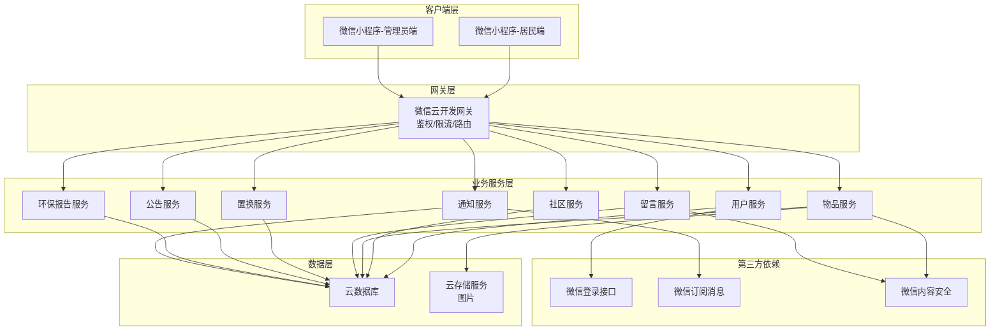

## 2.2 业务模块图

```mermaid
flowchart TD
    CORE[社区旧物置换记录簿] --> M1[用户与社区模块]
    CORE --> M2[旧物发布模块]
    CORE --> M3[货架浏览模块]
    CORE --> M4[置换流程模块]
    CORE --> M5[公告与报告模块]
    CORE --> M6[消息通知模块]
    CORE --> M7[管理后台模块]
    
    M1 --> M1A[微信登录]
    M1 --> M1B[社区绑定/切换]
    M1 --> M1C[个人资料]
    
    M2 --> M2A[拍照/相册上传]
    M2 --> M2B[物品信息填写]
    M2 --> M2C[置换方式选择]
    M2 --> M2D[物品管理]
    
    M3 --> M3A[品类分类导航]
    M3 --> M3B[物品列表/卡片]
    M3 --> M3C[关键词搜索]
    M3 --> M3D[物品详情]
    
    M4 --> M4A[置换请求发起]
    M4 --> M4B[请求处理]
    M4 --> M4C[双方确认]
    M4 --> M4D[置换留痕]
    
    M5 --> M5A[社区公告板]
    M5 --> M5B[个人环保贡献]
    M5 --> M5C[社区环保报告]
    
    M6 --> M6A[站内消息]
    M6 --> M6B[微信订阅消息]
    
    M7 --> M7A[物品审核]
    M7 --> M7B[置换管理]
    M7 --> M7C[公告管理]
    M7 --> M7D[环保报告]
    M7 --> M7E[社区设置]
```

## 2.3 主业务流程

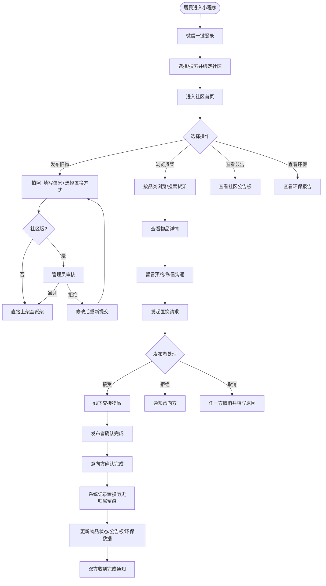

## 2.4 功能图/列表

### 2.4.1 社区居民端功能列表

| 功能模块 | 功能名称 | 优先级 | 功能描述 |
| --- | --- | --- | --- |
| 用户与社区 | 微信一键登录 | P0 | 通过微信授权一键登录，无需额外注册 |
| 用户与社区 | 社区绑定 | P0 | 选择或搜索所属社区，绑定后进入对应社区货架 |
| 用户与社区 | 切换社区 | P1 | 在已绑定的多个社区间切换 |
| 用户与社区 | 个人资料管理 | P0 | 管理头像、昵称、联系方式、楼栋信息 |
| 用户与社区 | 我的社区身份 | P1 | 展示所在社区、发布数、置换次数、环保积分 |
| 旧物发布 | 拍照/相册上传 | P0 | 拍摄或选择照片（最多6张），自动压缩 |
| 旧物发布 | 物品信息填写 | P0 | 填写名称、品类、新旧程度、价格、描述、期望置换条件 |
| 旧物发布 | 置换方式选择 | P0 | 以物换物 / 象征性价格 / 免费赠送 |
| 旧物发布 | 发布确认 | P0 | 预览发布内容，确认后上架 |
| 旧物发布 | 我的发布列表 | P0 | 查看自己发布的所有物品及状态 |
| 旧物发布 | 编辑物品信息 | P0 | 修改已发布物品（已预约不可编辑） |
| 旧物发布 | 上/下架物品 | P0 | 主动下架不再置换的物品 |
| 旧物发布 | 删除物品 | P1 | 删除未处于置换中的物品 |
| 货架浏览 | 品类分类导航 | P0 | 按7大品类分类浏览 |
| 货架浏览 | 物品列表展示 | P0 | 卡片式展示，默认按发布时间倒序 |
| 货架浏览 | 排序方式 | P1 | 按发布时间、新旧程度排序 |
| 货架浏览 | 关键词搜索 | P0 | 按名称、描述模糊搜索 |
| 货架浏览 | 品类筛选 | P1 | 搜索结果中按品类筛选 |
| 货架浏览 | 物品详情展示 | P0 | 照片轮播、完整描述、发布者信息 |
| 货架浏览 | 留言预约 | P0 | 在物品详情页留言表达置换意向 |
| 货架浏览 | 私信联系 | P1 | 内置消息一对一沟通 |
| 置换流程 | 发起置换请求 | P0 | 从详情页或留言区发起置换请求 |
| 置换流程 | 置换请求列表 | P0 | 查看收到的置换请求及状态 |
| 置换流程 | 接受/拒绝请求 | P0 | 发布者处理置换请求 |
| 置换流程 | 双方确认完成 | P0 | 双方确认置换完成，触发归属留痕 |
| 置换流程 | 取消置换 | P0 | 未完成前任一方可取消（需填原因） |
| 置换流程 | 置换记录详情 | P0 | 查看每次置换的完整记录 |
| 置换流程 | 归属变更历史 | P1 | 查看物品的历史归属链 |
| 公告与报告 | 最近置换动态 | P0 | 滚动展示最近的置换成功记录（脱敏） |
| 公告与报告 | 热门置换物品 | P1 | 按留言数/浏览量排序展示 |
| 公告与报告 | 个人环保贡献 | P0 | 查看个人累计置换数据与积分 |
| 公告与报告 | 社区环保报告 | P0 | 查看社区整体环保数据 |
| 公告与报告 | 环保成就/勋章 | P2 | 根据参与情况解锁成就 |
| 消息通知 | 置换状态通知 | P0 | 置换请求、接受/拒绝、完成等系统消息 |
| 消息通知 | 留言通知 | P0 | 物品收到新留言时通知 |
| 消息通知 | 公告通知 | P1 | 新公告/环保报告发布时通知 |
| 消息通知 | 微信订阅消息推送 | P1 | 通过微信推送重要通知 |

### 2.4.2 社区管理员端功能列表

| 功能模块 | 功能名称 | 优先级 | 功能描述 |
| --- | --- | --- | --- |
| 管理员权限 | 管理员认证 | P0 | 通过邀请码或线下审核获得管理员身份 |
| 管理员权限 | 权限切换 | P0 | 管理员/普通居民身份切换 |
| 物品审核管理 | 待审核列表 | P0 | 查看待审核物品列表（社区版启用） |
| 物品审核管理 | 审核通过/拒绝 | P0 | 审核物品，拒绝需填原因 |
| 物品审核管理 | 全社区物品管理 | P0 | 查看所有物品，支持下架违规物品 |
| 物品审核管理 | 违规处理 | P1 | 对违规发布下架并通知发布者 |
| 置换管理 | 全社区置换记录 | P0 | 查看所有置换记录，按时间/品类筛选 |
| 置换管理 | 纠纷处理 | P1 | 协助处理置换纠纷，查看归属留痕 |
| 公告板管理 | 发布社区公告 | P0 | 发布活动公告、规则说明、温馨提示 |
| 公告板管理 | 公告编辑/删除 | P0 | 编辑或删除已发布公告 |
| 公告板管理 | 公告置顶/排序 | P1 | 重要公告置顶展示 |
| 环保报告 | 社区环保数据总览 | P0 | 查看累计置换数据统计 |
| 环保报告 | 报告发布 | P0 | 将环保报告发布到公告板 |
| 环保报告 | 报告导出 | P2 | 导出为图片或PDF用于线下宣传 |
| 社区管理 | 社区基本信息 | P0 | 管理社区名称、地址、封面图、简介 |
| 社区管理 | 品类设置 | P1 | 自定义社区品类分类 |
| 社区管理 | 置换规则设置 | P1 | 设置社区置换规则 |
| 社区管理 | 邀请管理员 | P1 | 生成邀请码邀请新管理员（社区版） |
| 社区管理 | 管理员列表 | P1 | 查看所有管理员及权限 |

## 2.5 你的产品有哪些端

| 序号 | 端名称 | 端类型 | 目标用户 | 说明 |
| --- | --- | --- | --- | --- |
| 1 | 社区居民端 | 小程序端 | 社区居民（业主/租户） | 居民在微信中使用，发布旧物、浏览货架、发起置换、查看报告 |
| 2 | 社区管理员端 | 小程序端 | 社区管理员（物业/志愿者） | 与居民端合并为一个小程序，按管理员权限展示后台功能入口 |

---
# 3 产品功能

## 3.1 社区居民端功能

### 3.1.1 微信一键登录

功能描述

用户首次进入小程序时，通过微信授权一键完成登录。系统获取用户的微信 OpenID 作为唯一身份标识，自动创建用户账号，无需额外注册流程。首次登录后引导用户绑定所属社区。

| 项 | 内容 |
| --- | --- |
| 优先级 | P0 |
| 依赖需求 | 无 |
| 前置条件 | 用户已安装微信 7.0 及以上版本 |

#### 详细流程

```mermaid
sequenceDiagram
    participant U as 用户
    participant MP as 小程序
    participant WX as 微信服务
    participant SYS as 后端系统
    
    U->>MP: 打开小程序
    MP->>WX: 调用 wx.login() 获取 Code
    WX-->>MP: 返回 Code
    MP->>SYS: 发送 Code 至后端
    SYS->>WX: 调用 code2Session 接口
    WX-->>SYS: 返回 OpenID + UnionID
    SYS->>SYS: 查询用户是否已注册
    alt 新用户
        SYS->>SYS: 创建用户账号
        SYS-->>MP: 返回 Token + 引导绑定社区
    else 老用户
        SYS->>SYS: 更新登录时间
        SYS-->>MP: 返回 Token + 已绑定社区列表
    end
    MP->>MP: 进入首页/社区绑定引导页
```

#### 业务规则

1. 登录态有效期为 7 天，过期需重新授权
2. 用户拒绝授权时，可浏览货架但不可发布物品或发起置换
3. 同一微信号在不同设备登录，旧设备登录态自动失效
4. 首次登录后必须绑定至少一个社区才能使用完整功能

#### 验收标准

- [ ] 正常流程：用户点击"微信登录"后 2 秒内完成登录并进入首页
- [ ] 新用户首次登录自动跳转社区绑定引导页
- [ ] 异常流程：用户拒绝授权时展示"暂不登录"入口，仅可浏览公开货架
- [ ] 登录态过期后自动跳转登录页，不影响已浏览内容

### 3.1.2 社区绑定与切换

功能描述

用户登录后需绑定所属社区，才能进入对应社区的货架与公告板。支持按名称搜索或基于地理位置推荐附近社区。一个用户可绑定多个社区（如在多个小区有住所），可在已绑定社区间自由切换。

| 项 | 内容 |
| --- | --- |
| 优先级 | P0（绑定）/ P1（切换） |
| 依赖需求 | 微信一键登录 |
| 前置条件 | 用户已完成微信登录 |

#### 详细流程

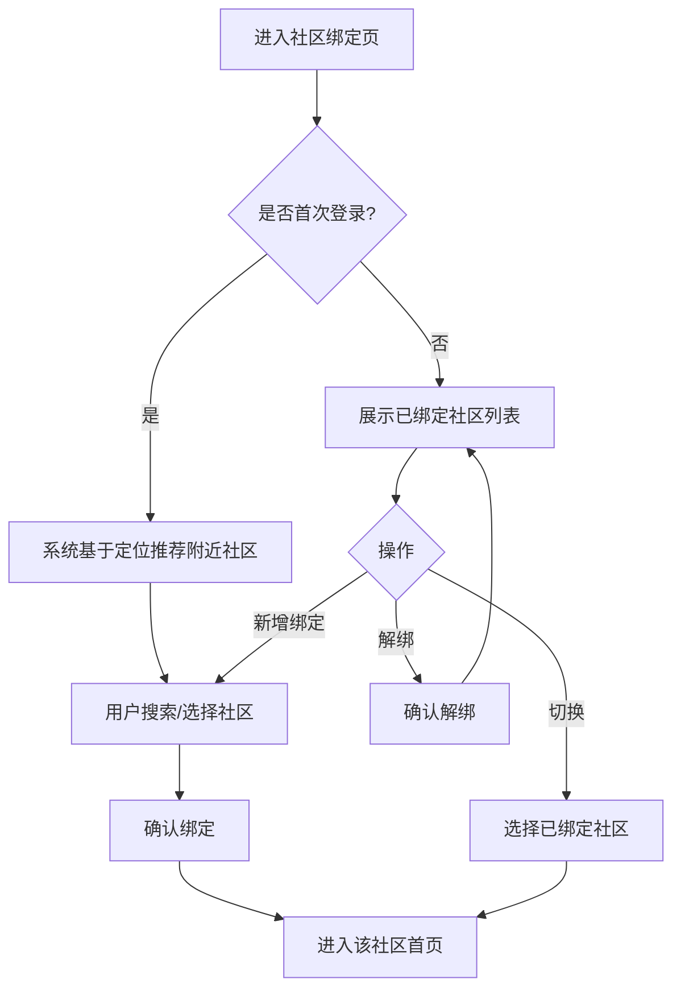

#### 业务规则

1. 首次登录必须绑定至少一个社区
2. 同一用户最多绑定 5 个社区
3. 切换社区后，货架、公告板、环保报告等数据同步切换
4. 社区货架数据严格隔离，居民只能看到已绑定社区的内容

#### 验收标准

- [ ] 正常流程：用户搜索社区名称后 1 秒内返回匹配结果
- [ ] 绑定成功后自动进入该社区首页
- [ ] 切换社区后货架数据刷新为对应社区内容
- [ ] 异常流程：搜索无结果时展示"未找到社区"提示

### 3.1.3 旧物发布

功能描述

居民可发布旧物信息至社区货架。发布流程包括：拍照或从相册选择照片（最多6张，自动压缩）→填写物品信息（名称、品类、新旧程度、原购入价格、描述、期望置换条件）→选择置换方式（以物换物/象征性价格/免费赠送）→预览确认后提交。免费版直接上架，社区版需管理员审核通过后上架。

| 项 | 内容 |
| --- | --- |
| 优先级 | P0 |
| 依赖需求 | 微信登录、社区绑定 |
| 前置条件 | 用户已登录并绑定社区 |

#### 详细流程

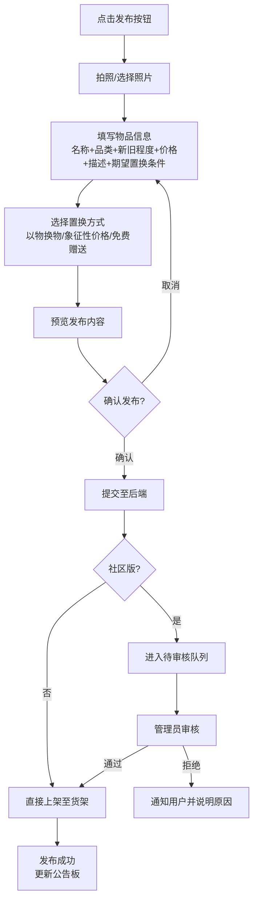

#### 业务规则

1. 照片最多6张，每张自动压缩至 500KB 以内
2. 品类从系统预设目录选择：家居日用、图书影音、母婴用品、数码家电、服饰鞋帽、运动户外、其他
3. 新旧程度分为：全新、几乎全新、轻微使用痕迹、明显使用痕迹
4. 原购入价格为选填项
5. 免费版用户累计在架物品达50件时，提示升级社区版
6. 发布内容需通过微信内容安全检测
7. 社区版发布后进入待审核状态，管理员审核通过后上架

#### 验收标准

- [ ] 正常流程：从拍照到发布成功全流程 ≤ 3 分钟
- [ ] 照片自动压缩，上传成功率 ≥ 99%
- [ ] 免费版发布后物品立即出现在社区货架
- [ ] 社区版发布后物品进入待审核，管理员通过后上架
- [ ] 异常流程：内容安全检测不通过时阻止发布并提示原因
- [ ] 免费版超出50件时提示升级

### 3.1.4 社区货架浏览

功能描述

社区居民可浏览本社区的旧物货架。货架按品类分类导航（7大品类），物品以卡片形式展示（照片、名称、期望置换条件、发布时间、发布者昵称），默认按发布时间倒序排列。支持关键词搜索和品类筛选。

| 项 | 内容 |
| --- | --- |
| 优先级 | P0 |
| 依赖需求 | 社区绑定 |
| 前置条件 | 用户已登录并绑定社区 |

#### 详细流程

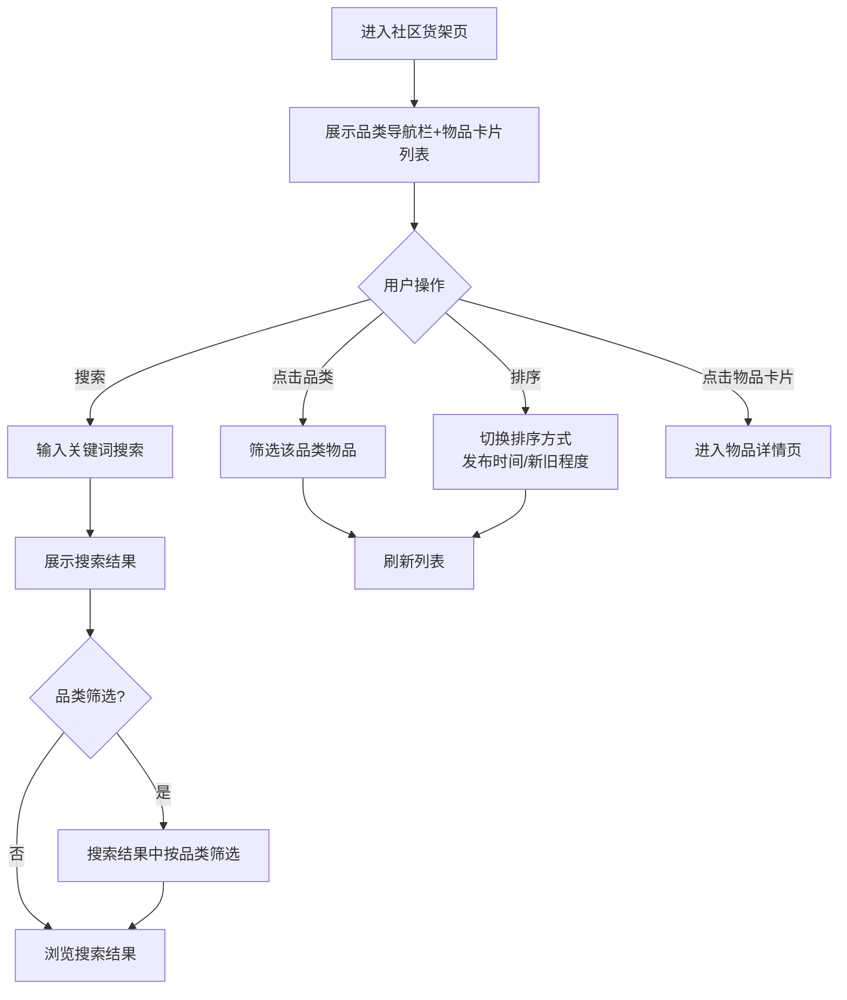

#### 业务规则

1. 品类导航栏包含"全部"选项 + 7大预设品类
2. 物品卡片展示：缩略图（第一张）、名称、期望置换条件/价格、发布时间（相对时间如"3小时前"）、发布者昵称
3. 默认按发布时间倒序，支持按新旧程度排序
4. 搜索结果中高亮匹配的关键词
5. 列表支持下拉刷新和上拉加载更多（每页20条）
6. 已预约物品在卡片上显示"已预约"标签，已置换物品不展示

#### 验收标准

- [ ] 正常流程：货架列表页 95% 加载时间 < 1.5 秒
- [ ] 搜索响应 < 1.0 秒
- [ ] 品类切换后列表即时刷新
- [ ] 空状态：社区无物品时展示友好空状态，引导用户发布
- [ ] 上拉加载更多流畅，无白屏

### 3.1.5 物品详情与留言

功能描述

居民点击物品卡片进入详情页，可查看完整信息（照片轮播、名称、品类、新旧程度、完整描述、期望置换条件、发布者昵称、发布时间）。可在详情页留言表达置换意向，也可通过系统内置消息功能与发布者一对一沟通（置换达成后才显示对方联系方式）。

| 项 | 内容 |
| --- | --- |
| 优先级 | P0（详情+留言）/ P1（私信） |
| 依赖需求 | 社区货架浏览 |
| 前置条件 | 用户已登录并绑定社区 |

#### 详细流程

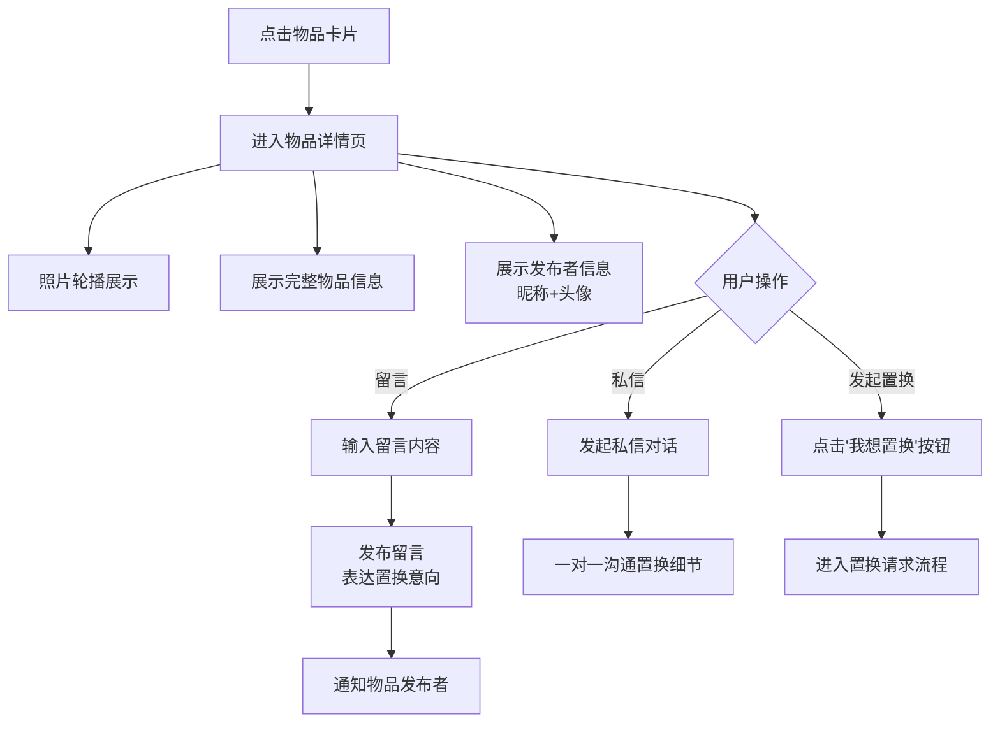

#### 业务规则

1. 照片轮播支持左右滑动，底部显示页码指示器
2. 留言仅物品发布者可见，其他用户不可见
3. 私信功能在置换请求被接受后才开放双方联系方式
4. 发布者不可在自己的物品下留言
5. 已下架/已置换物品展示对应状态标识，不可留言

#### 验收标准

- [ ] 正常流程：详情页加载时间 < 1 秒
- [ ] 照片轮播滑动流畅
- [ ] 留言成功发布后即时出现在留言列表
- [ ] 发布者收到留言通知
- [ ] 异常流程：物品已下架时展示状态标识并禁用留言

### 3.1.6 置换流程

功能描述

居民可通过物品详情页或留言区发起置换请求，指定置换方式。发布者收到请求后可接受或拒绝。接受后双方线下交接，交接完成后双方各自在系统中确认"已完成置换"，触发归属留痕记录。任一方在未完成前可取消置换（需填写取消原因）。

| 项 | 内容 |
| --- | --- |
| 优先级 | P0 |
| 依赖需求 | 物品详情与留言 |
| 前置条件 | 用户已登录，物品处于在售状态 |

#### 详细流程

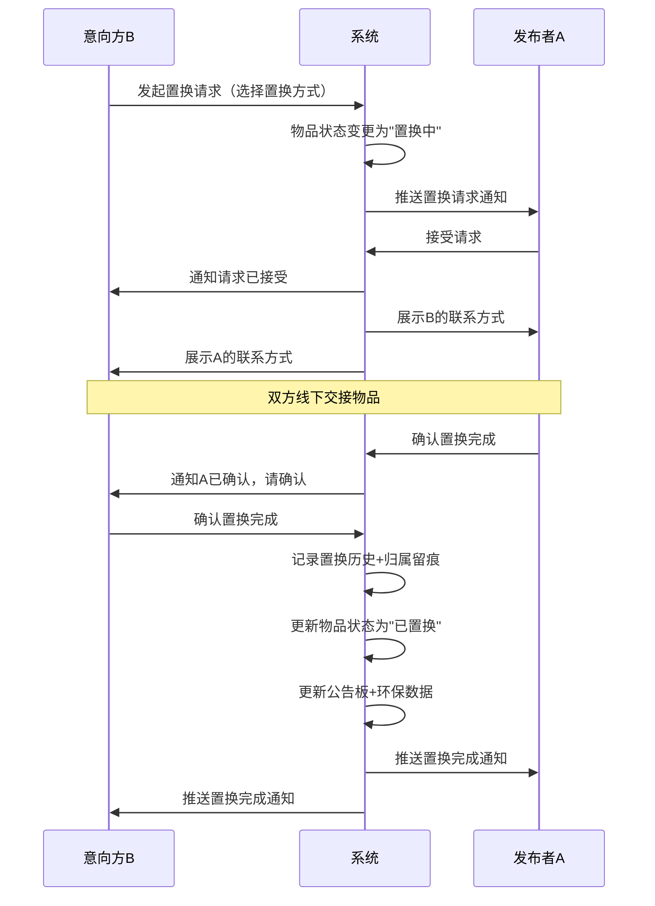

#### 业务规则

1. 同一物品同时只能有一个进行中的置换请求
2. 发布者接受请求后，物品状态变为"置换中"，货架上展示"置换中"标签
3. 双方确认采用"任一方先确认+另一方再确认"模式，任一方确认即标记，另一方收到通知
4. 取消置换时需填写取消原因（不少于10字）
5. 置换完成后，物品状态变为"已置换"，从货架移除
6. 归属留痕记录包含：物品ID、发布者、接收者、置换时间、置换方式
7. 置换请求有效期为 7 天，超期未确认自动取消

#### 验收标准

- [ ] 正常流程：发起置换请求后发布者 3 秒内收到通知
- [ ] 双方确认后系统即时记录归属留痕
- [ ] 取消置换后物品恢复为在售状态
- [ ] 异常流程：请求超期未处理自动取消并通知双方
- [ ] 异常流程：任一方取消时对方即时收到通知

### 3.1.7 置换记录与归属留痕

功能描述

居民可查看自己的置换历史记录，包含每次置换的完整信息（物品、双方昵称、置换时间、置换方式）。还可查看某物品的归属变更链，追溯物品的完整流转路径（谁→谁→谁），作为归属变更的凭据。

| 项 | 内容 |
| --- | --- |
| 优先级 | P0（置换记录）/ P1（归属变更链） |
| 依赖需求 | 置换流程 |
| 前置条件 | 用户有已完成的置换记录 |

#### 详细流程

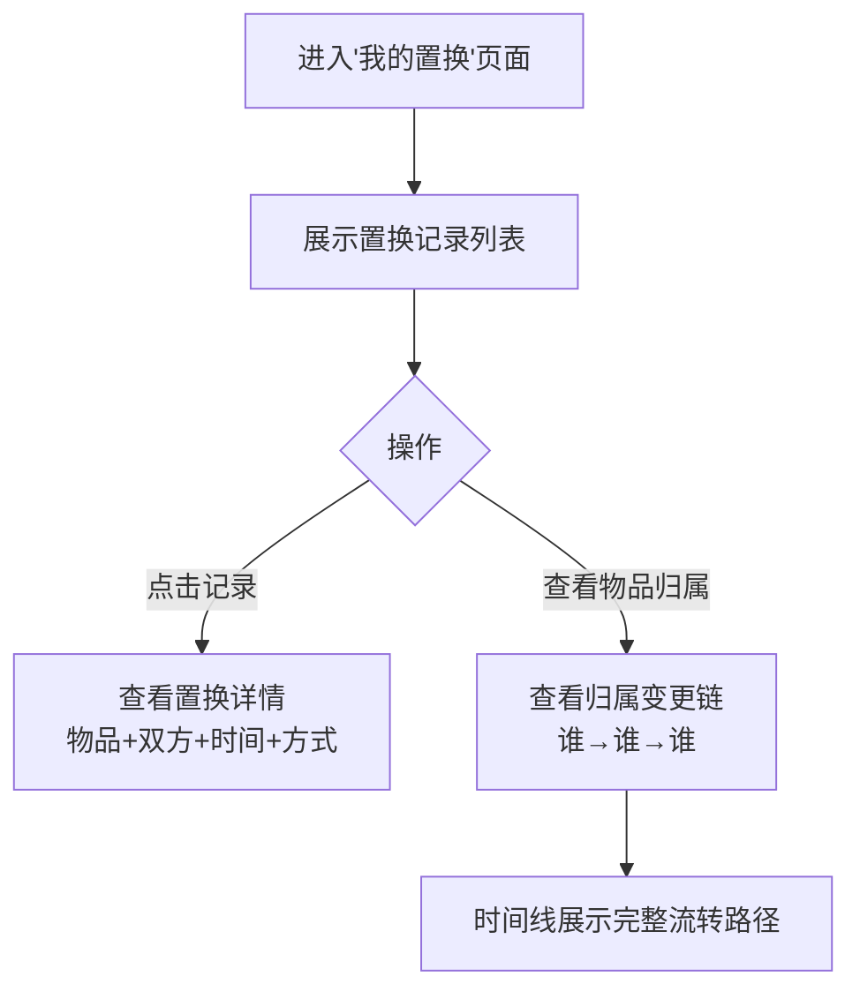

#### 业务规则

1. 置换记录按时间倒序排列
2. 归属变更链以时间线形式展示，每次变更含操作人昵称、变更时间、置换方式
3. 仅置换双方可查看该置换记录的详情
4. 归属变更链对当前物品持有者和管理员可见

#### 验收标准

- [ ] 正常流程：置换完成后记录即时出现在双方置换列表中
- [ ] 归属变更链完整展示物品从发布至今的流转路径
- [ ] 异常流程：无置换记录时展示空状态引导

### 3.1.8 社区公告板与环保报告

功能描述

社区公告板展示最近的置换动态（脱敏展示，如"张\*换了李\*的自行车"）和热门置换物品。环保报告包含个人环保贡献（累计置换次数、减少浪费重量估算、环保积分）和社区环保报告（累计置换次数、参与家庭数、减少浪费估算、活跃天数）。P2 级环保成就/勋章功能根据参与情况解锁。

| 项 | 内容 |
| --- | --- |
| 优先级 | P0（公告板+环保报告）/ P1（热门物品）/ P2（成就勋章） |
| 依赖需求 | 置换流程 |
| 前置条件 | 用户已登录并绑定社区 |

#### 详细流程

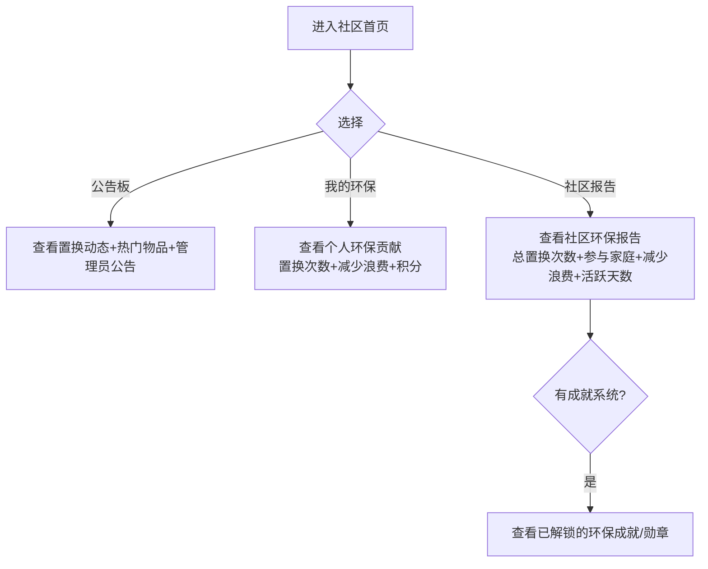

#### 业务规则

1. 公告板置换动态脱敏展示，仅展示姓氏首字+"\*"
2. 热门物品按留言数+浏览量综合排序，展示前10
3. 个人环保数据：每次置换估算减少浪费 2kg（可配置）
4. 社区环保报告由系统自动生成，管理员可发布到公告板
5. 环保成就包含："首次置换"、"5次置换"、"10次置换达人"、"环保先锋（20次）"等

#### 验收标准

- [ ] 正常流程：每次置换完成后公告板即时更新动态
- [ ] 个人环保数据在置换完成后即时更新
- [ ] 社区报告数据与实际置换数据一致
- [ ] 异常流程：无数据时展示友好空状态

### 3.1.9 消息通知

功能描述

系统通过站内消息和微信订阅消息两种方式通知用户。站内消息覆盖：置换状态通知（请求、接受、拒绝、完成、取消）、留言通知（收到新留言）、公告通知（新公告/环保报告发布）。微信订阅消息用于推送重要通知，需用户主动订阅。

| 项 | 内容 |
| --- | --- |
| 优先级 | P0（站内消息）/ P1（微信订阅消息） |
| 依赖需求 | 微信登录 |
| 前置条件 | 用户已登录 |

#### 业务规则

1. 站内消息按时间倒序排列，未读消息标红点
2. 消息中心分为"置换"、"留言"、"系统"三个 Tab
3. 微信订阅消息需用户在首次使用时引导订阅
4. 消息不可撤回，但可标记为已读

#### 验收标准

- [ ] 正常流程：置换状态变更后 3 秒内双方收到通知
- [ ] 未读消息在图标上展示红点
- [ ] 异常流程：用户未订阅微信消息时仅发送站内消息

## 3.2 社区管理员端功能

### 3.2.1 管理员认证与权限切换

功能描述

物业工作人员或志愿者通过管理员邀请码或线下审核后获得管理员身份。管理员可在管理后台功能与普通居民功能之间切换。

| 项 | 内容 |
| --- | --- |
| 优先级 | P0 |
| 依赖需求 | 微信登录 |
| 前置条件 | 用户已登录并绑定该社区 |

#### 业务规则

1. 首个管理员通过线下审核方式认证（联系平台客服）
2. 后续管理员通过已有管理员生成的邀请码认证（社区版功能）
3. 管理员身份切换不影响其居民功能的使用
4. 一个社区最多设置 5 名管理员（社区版）

#### 验收标准

- [ ] 正常流程：输入有效邀请码后即时获得管理员身份
- [ ] 权限切换后界面即时更新对应功能入口
- [ ] 异常流程：无效邀请码提示错误

### 3.2.2 物品审核管理

功能描述

社区版启用审核机制。管理员可查看待审核物品列表，对发布的物品进行审核通过或拒绝（拒绝需填写原因）。管理员还可查看全社区所有物品，对违规物品进行下架处理并通知发布者。

| 项 | 内容 |
| --- | --- |
| 优先级 | P0 |
| 依赖需求 | 管理员认证 |
| 前置条件 | 当前社区为社区版且用户具有管理员身份 |

#### 详细流程

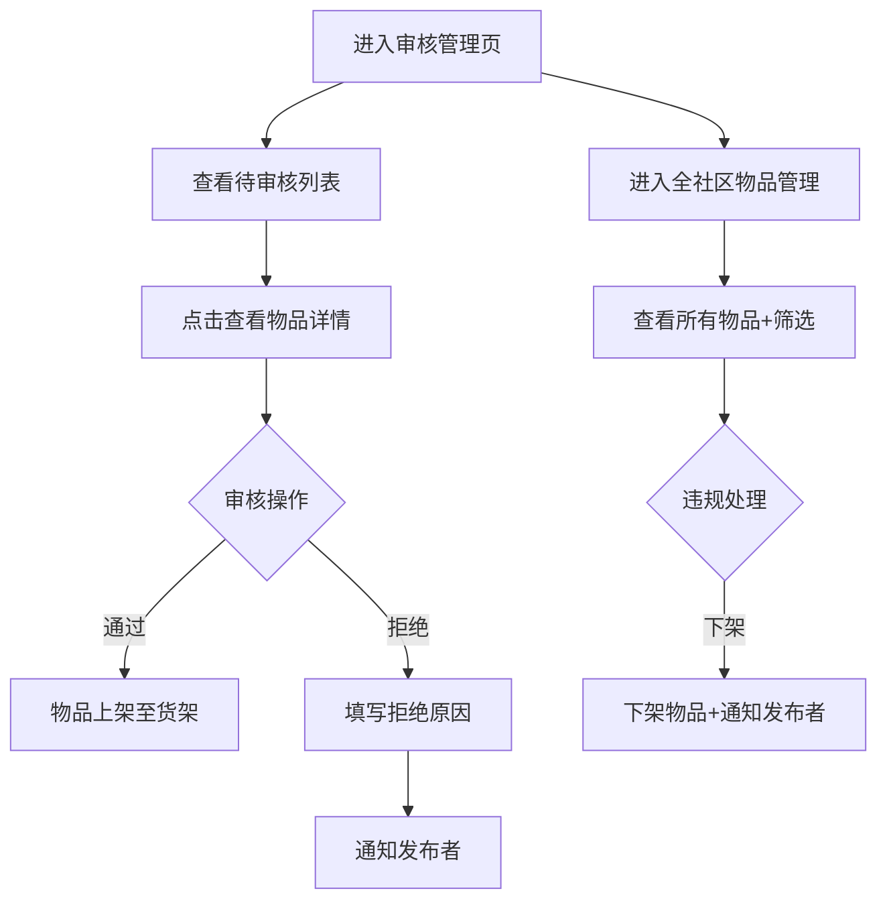

#### 业务规则

1. 待审核列表按提交时间倒序排列
2. 审核操作不可撤回
3. 拒绝原因不少于 10 字
4. 违规下架时系统自动通知发布者下架原因
5. 免费版此功能不可用（免审核直接上架）

#### 验收标准

- [ ] 正常流程：审核通过后物品即时上架
- [ ] 拒绝后发布者即时收到通知
- [ ] 违规下架后物品从货架移除

### 3.2.3 公告板管理

功能描述

管理员可发布社区公告（活动公告、规则说明、温馨提示等），编辑或删除已发布公告，重要公告可置顶展示。

| 项 | 内容 |
| --- | --- |
| 优先级 | P0（发布/编辑/删除）/ P1（置顶） |
| 依赖需求 | 管理员认证 |
| 前置条件 | 用户具有管理员身份 |

#### 业务规则

1. 公告支持富文本编辑（标题+正文+图片）
2. 置顶公告最多 3 条
3. 公告发布后居民端即时收到通知
4. 删除公告为软删除，后台保留记录

#### 验收标准

- [ ] 正常流程：公告发布后居民端即时可见
- [ ] 置顶公告在公告板顶部展示
- [ ] 删除后居民端不再展示

### 3.2.4 环保报告管理

功能描述

管理员可查看社区环保数据总览（总置换次数、参与家庭、减少浪费估算、活跃天数趋势），将系统自动生成的环保报告发布到公告板供居民查看。P2 级功能支持将报告导出为图片或 PDF 用于线下宣传。

| 项 | 内容 |
| --- | --- |
| 优先级 | P0（查看+发布）/ P2（导出） |
| 依赖需求 | 管理员认证、置换流程 |
| 前置条件 | 社区有置换记录 |

#### 验收标准

- [ ] 正常流程：环保数据与实际置换数据一致
- [ ] 报告发布后居民可在公告板查看
- [ ] 导出功能生成的图片/PDF 内容与在线报告一致

### 3.2.5 社区管理

功能描述

管理员可管理社区基本信息（名称、地址、封面图、简介），自定义品类分类（在系统预设基础上增减），设置置换规则（交接地点建议、置换礼仪等）。社区版支持邀请新管理员（生成邀请码）和查看管理员列表。

| 项 | 内容 |
| --- | --- |
| 优先级 | P0（基本信息）/ P1（品类+规则+管理员团队） |
| 依赖需求 | 管理员认证 |
| 前置条件 | 用户具有管理员身份 |

#### 业务规则

1. 品类自定义仅在系统预设基础上增减，不可完全自定义
2. 邀请码有效期 24 小时，一次性使用
3. 管理员列表展示各管理员的认证时间和操作统计
4. 社区信息修改后居民端即时生效

#### 验收标准

- [ ] 正常流程：修改社区信息后居民端即时更新
- [ ] 邀请码生成后可被目标用户正常使用
- [ ] 品类自定义后货架品类导航同步更新

---
# 4 产品原型

## 4.1 页面跳转逻辑图

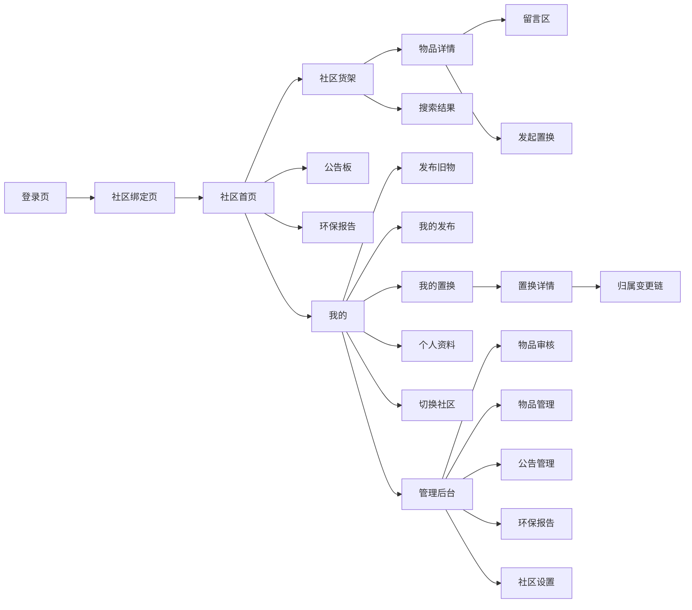

## 4.2 全站点原型设计

### 4.2.1 社区居民端（小程序端）

**页面清单：**

| 序号 | 页面名称 | 所属模块 | 页面描述 | 关键元素 |
| --- | --- | --- | --- | --- |
| 1 | 登录页 | 用户与社区 | 微信一键登录入口 | 品牌 Logo、登录按钮、服务协议 |
| 2 | 社区绑定页 | 用户与社区 | 搜索/选择社区进行绑定 | 搜索框、推荐社区列表、已绑定社区 |
| 3 | 社区首页 | 主导航 | 社区入口，含快捷入口+公告+动态 | 快捷入口、滚动公告、最近置换动态 |
| 4 | 社区货架页 | 货架浏览 | 品类导航+物品卡片列表 | 品类 Tab、搜索框、物品卡片、排序 |
| 5 | 物品详情页 | 货架浏览 | 物品完整信息+留言+置换入口 | 照片轮播、物品信息、留言列表、置换按钮 |
| 6 | 发布旧物页 | 旧物发布 | 拍照+填写信息+提交发布 | 照片上传区、表单、置换方式选择、预览 |
| 7 | 置换请求页 | 置换流程 | 置换请求列表+处理 | 请求卡片、接受/拒绝按钮 |
| 8 | 置换确认页 | 置换流程 | 确认置换完成+查看详情 | 物品信息、对方信息、确认按钮 |
| 9 | 我的置换页 | 置换流程 | 置换历史列表+归属链 | 置换记录列表、归属变更链 |
| 10 | 公告板页 | 公告与报告 | 社区公告+置换动态 | 公告列表、置换动态、热门物品 |
| 11 | 环保报告页 | 公告与报告 | 个人贡献+社区报告 | 个人数据卡片、社区数据图表 |
| 12 | 消息中心页 | 消息通知 | 站内消息列表 | 消息分类Tab、消息列表、未读标记 |
| 13 | 我的页面 | 用户与社区 | 个人信息+功能入口 | 头像昵称、社区身份、功能菜单 |

**交互说明：**
- 页面跳转关系：底部 Tab 栏导航（首页、货架、发布、消息、我的），各页面通过卡片点击、按钮等跳转
- 特殊交互：
  1. 物品卡片点击进入详情页，支持左右滑动返回
  2. 照片轮播支持左右滑动+点击放大查看
  3. 货架页下拉刷新+上拉加载更多
  4. 发布页照片上传支持长按拖动排序
  5. 置换确认弹窗采用底部弹出半屏样式

**产品原型：**

[📱 打开社区居民端全站点原型](assets/prototypes/resident-prototype.html)

### 4.2.2 社区管理员端（小程序端）

**页面清单：**

| 序号 | 页面名称 | 所属模块 | 页面描述 | 关键元素 |
| --- | --- | --- | --- | --- |
| 1 | 管理后台首页 | 管理员权限 | 管理入口汇总+待办统计 | 待审核数、待处理置换、功能入口卡片 |
| 2 | 物品审核页 | 物品审核 | 待审核物品列表+审核操作 | 物品卡片、通过/拒绝按钮、拒绝原因弹窗 |
| 3 | 物品管理页 | 物品审核 | 全社区物品列表+管理操作 | 物品列表、筛选、下架按钮 |
| 4 | 置换记录页 | 置换管理 | 全社区置换记录+纠纷处理 | 置换列表、筛选、归属链查看 |
| 5 | 公告管理页 | 公告管理 | 公告列表+发布/编辑/删除 | 公告列表、置顶标记、操作按钮 |
| 6 | 公告编辑页 | 公告管理 | 编辑公告内容 | 标题、正文编辑器、图片上传 |
| 7 | 环保报告页 | 环保报告 | 社区环保数据总览+发布 | 数据卡片、趋势图表、发布按钮 |
| 8 | 社区设置页 | 社区管理 | 社区信息+品类+规则+管理员 | 表单、品类列表、规则编辑 |
| 9 | 管理员邀请页 | 社区管理 | 生成邀请码+管理员列表 | 邀请码卡片、管理员列表 |

**交互说明：**
- 页面跳转关系：管理后台首页为入口，各功能模块通过卡片点击进入
- 特殊交互：
  1. 审核操作通过/拒绝后即时刷新列表
  2. 拒绝原因弹窗含输入框+确认/取消
  3. 数据图表支持时间范围切换

**产品原型：**

[📱 打开社区管理员端全站点原型](assets/prototypes/admin-prototype.html)

---
# 5 数据需求

## 5.1 数据使用规格

### 5.1.1 用户表（users）

| **字段** | **是否必填** | **描述** | **数据类型** |
| --- | --- | --- | --- |
| id | 是 | 用户唯一标识 | 字符串(UUID) |
| openid | 是 | 微信 OpenID | 字符串 |
| unionid | 否 | 微信 UnionID | 字符串 |
| nickname | 是 | 昵称 | 字符串 |
| avatar_url | 是 | 头像地址 | 字符串(URL) |
| phone | 否 | 手机号（置换双方可见） | 字符串 |
| wechat | 否 | 微信号（置换双方可见） | 字符串 |
| building | 否 | 楼栋/单元/门牌 | 字符串 |
| created_at | 是 | 注册时间 | 日期时间 |
| updated_at | 是 | 更新时间 | 日期时间 |

### 5.1.2 社区表（communities）

| **字段** | **是否必填** | **描述** | **数据类型** |
| --- | --- | --- | --- |
| id | 是 | 社区唯一标识 | 字符串(UUID) |
| name | 是 | 社区名称 | 字符串 |
| address | 是 | 社区地址 | 字符串 |
| cover_url | 否 | 封面图地址 | 字符串(URL) |
| description | 否 | 社区简介 | 字符串 |
| version_type | 是 | 版本类型（free/community） | 字符串枚举 |
| location | 是 | 经纬度坐标 | 对象{lat, lng} |
| categories | 是 | 品类列表（含自定义） | 数组 |
| rules | 否 | 置换规则说明 | 字符串 |
| created_at | 是 | 创建时间 | 日期时间 |

### 5.1.3 物品表（items）

| **字段** | **是否必填** | **描述** | **数据类型** |
| --- | --- | --- | --- |
| id | 是 | 物品唯一标识 | 字符串(UUID) |
| community_id | 是 | 所属社区 ID | 字符串 |
| publisher_id | 是 | 发布者 ID | 字符串 |
| name | 是 | 物品名称 | 字符串 |
| category | 是 | 品类 | 字符串枚举 |
| condition_level | 是 | 新旧程度 | 字符串枚举 |
| original_price | 否 | 原购入价格 | 数字 |
| description | 是 | 物品描述 | 字符串 |
| exchange_wish | 是 | 期望置换条件/价格 | 字符串 |
| exchange_type | 是 | 置换方式 | 字符串枚举(barter/price/free) |
| photos | 是 | 照片 URL 列表 | 数组 |
| status | 是 | 状态 | 字符串枚举(pending/onsale/reserved/exchanging/exchanged/offline/rejected) |
| message_count | 是 | 留言数 | 数字 |
| view_count | 是 | 浏览量 | 数字 |
| is_top | 否 | 是否置顶（管理员） | 布尔 |
| created_at | 是 | 发布时间 | 日期时间 |
| updated_at | 是 | 更新时间 | 日期时间 |

### 5.1.4 置换请求表（exchange_requests）

| **字段** | **是否必填** | **描述** | **数据类型** |
| --- | --- | --- | --- |
| id | 是 | 请求唯一标识 | 字符串(UUID) |
| item_id | 是 | 物品 ID | 字符串 |
| requester_id | 是 | 请求方 ID | 字符串 |
| publisher_id | 是 | 发布者 ID | 字符串 |
| exchange_type | 是 | 置换方式 | 字符串枚举 |
| message | 否 | 留言说明 | 字符串 |
| status | 是 | 状态 | 字符串枚举(pending/accepted/rejected/cancelled/completed) |
| publisher_confirmed | 是 | 发布者是否确认完成 | 布尔 |
| requester_confirmed | 是 | 请求方是否确认完成 | 布尔 |
| cancel_reason | 否 | 取消原因 | 字符串 |
| completed_at | 否 | 完成时间 | 日期时间 |
| created_at | 是 | 创建时间 | 日期时间 |

### 5.1.5 留言表（messages）

| **字段** | **是否必填** | **描述** | **数据类型** |
| --- | --- | --- | --- |
| id | 是 | 留言唯一标识 | 字符串(UUID) |
| item_id | 是 | 物品 ID | 字符串 |
| user_id | 是 | 留言者 ID | 字符串 |
| content | 是 | 留言内容 | 字符串 |
| created_at | 是 | 留言时间 | 日期时间 |

### 5.1.6 公告表（announcements）

| **字段** | **是否必填** | **描述** | **数据类型** |
| --- | --- | --- | --- |
| id | 是 | 公告唯一标识 | 字符串(UUID) |
| community_id | 是 | 所属社区 ID | 字符串 |
| publisher_id | 是 | 发布者（管理员）ID | 字符串 |
| title | 是 | 公告标题 | 字符串 |
| content | 是 | 公告内容（富文本） | 字符串 |
| is_top | 是 | 是否置顶 | 布尔 |
| created_at | 是 | 发布时间 | 日期时间 |
| updated_at | 是 | 更新时间 | 日期时间 |

### 5.1.7 归属变更记录表（ownership_history）

| **字段** | **是否必填** | **描述** | **数据类型** |
| --- | --- | --- | --- |
| id | 是 | 记录唯一标识 | 字符串(UUID) |
| item_id | 是 | 物品 ID | 字符串 |
| from_user_id | 是 | 原持有者 ID | 字符串 |
| to_user_id | 是 | 新持有者 ID | 字符串 |
| exchange_request_id | 是 | 关联置换请求 ID | 字符串 |
| exchange_type | 是 | 置换方式 | 字符串枚举 |
| changed_at | 是 | 变更时间 | 日期时间 |

## 5.2 统计数据

1. 个人环保贡献：累计置换次数、减少浪费估算（每次置换约 2kg）、环保积分（P0）
2. 社区环保报告：累计置换次数、参与家庭数、减少浪费估算、活跃天数、按月度趋势（P0）
3. 物品统计：在架物品数、已置换物品数、各品类分布（P1）
4. 管理员统计：审核通过/拒绝数、平均审核时长（P1）

## 5.3 埋点需求

| 页面 | 事件 | 采集字段 | 说明 |
| --- | --- | --- | --- |
| 登录页 | login_click | user_id, timestamp | 登录按钮点击 |
| 货架页 | item_view | item_id, user_id, timestamp | 物品详情页浏览 |
| 货架页 | search_action | keyword, result_count, user_id | 搜索行为 |
| 发布页 | publish_submit | item_id, user_id, exchange_type | 发布物品 |
| 详情页 | exchange_request | item_id, requester_id, exchange_type | 发起置换请求 |
| 置换流程 | exchange_confirm | exchange_id, user_id, confirm_role | 确认置换完成 |
| 公告板 | announcement_view | announcement_id, user_id | 查看公告 |
| 环保报告 | report_view | report_type, user_id, community_id | 查看环保报告 |

---
# 6 非功能需求

## 6.1 性能需求

**6.1.1 延迟**

| 编号 | 项目 | 最大延迟 | 平均延迟 | 优先级 | 备注 |
| --- | --- | --- | --- | --- | --- |
| 0001 | 95% 的货架列表页加载 | < 1.5 秒 | < 1.0 秒 | 高 | 含图片缩略图加载 |
| 0002 | 搜索操作响应 | < 1.0 秒 | < 0.5 秒 | 高 | |
| 0003 | 物品详情页加载 | < 1.0 秒 | < 0.5 秒 | 高 | 含原图加载 |
| 0004 | 置换状态同步 | < 3.0 秒 | < 1.5 秒 | 中 | 双方端上展示同步 |
| 0005 | 图片上传 | < 10 秒 | < 5 秒 | 中 | 单张 500KB 以内 |

**6.1.2 吞吐量**

| 编号 | 项 | 吞吐量 | 备注 |
| --- | --- | --- | --- |
| 0001 | 单社区用户并发浏览 | 50 人同时在线 | P1 |
| 0002 | 物品发布请求 | 每分钟 20 次（单社区） | |
| 0003 | 置换请求处理 | 每分钟 10 次（单社区） | |

**6.1.3 容量**

| 编号 | 项 | 容量 | 备注 |
| --- | --- | --- | --- |
| 0001 | 单社区支持居民数 | ≤ 500 户 | |
| 0002 | 单社区在架物品数 | ≤ 5000 件 | 免费版上限 50 件 |
| 0003 | 单社区置换记录数 | 不限 | 长期保留 |
| 0004 | 图片存储空间 | 按社区独立计量 | 云存储 |

## 6.2 安全需求

| 编号 | 项（系统数据 / 处理过程） |
| --- | --- |
| 0001 | 用户联系方式（手机号、微信号）仅置换双方可见，系统不对外公开 |
| 0002 | 不同社区的货架、公告、置换记录严格隔离，居民只能看到已绑定社区的内容 |
| 0003 | 发布物品信息需通过微信内容安全接口进行文本/图片检测，违规内容阻止发布 |
| 0004 | 管理员操作（审核、下架、删除）需记录操作日志，不可篡改 |
| 0005 | 所有 API 接口需进行身份认证和权限校验 |
| 0006 | 用户数据加密存储，传输采用 HTTPS |

## 6.3 可靠性

| 编号 | 项 | 值 |
| --- | --- | --- |
| 0001 | 系统可用性 | ≥ 99.9% |
| 0002 | 平均正常运行时间 | ≥ 365 天/年 |
| 0003 | 平均故障恢复时间 | ≤ 30 分钟 |
| 0004 | 数据备份频率 | 每日全量备份 + 每小时增量备份 |

## 6.4 可连续性

| 编号 | 项 |
| --- | --- |
| Conti.1 | 系统需 7×24 全天候运行 |
| Conti.2 | 云开发环境支持自动扩缩容，应对流量高峰 |
| Conti.3 | 关键服务（置换确认、归属留痕）需有降级方案 |

## 6.5 可恢复性

| 编号 | 项 |
| --- | --- |
| Modi.1 | 数据库每日全量备份（保留 30 天），每小时增量备份 |
| Modi.2 | 重大故障需在 1~3 小时内恢复服务可用性 |
| Modi.3 | 24~72 小时内恢复历史数据 |

## 6.6 兼容性

| 编号 | 要求 | 备注 |
| --- | --- | --- |
| 0001 | 微信小程序，支持 iOS 和 Android | P0 |
| 0002 | 微信版本 ≥ 7.0 | P0 |
| 0003 | 适配主流手机屏幕：320px - 428px 宽度 | P0 |
| 0004 | 图片采用缩略图+原图双尺寸 | P0 |

## 6.7 易用性

| 编号 | 要求 | 备注 |
| --- | --- | --- |
| 0001 | 核心操作路径（发布→浏览→置换→确认）不超过 5 步 | P0 |
| 0002 | 普通居民用户无需培训即可使用核心功能 | P0 |
| 0003 | 设计风格温暖亲切，以生态绿 #4CAF50 为主色调 | P0 |
| 0004 | 空状态、加载态、错误态均有友好提示 | P1 |
| 0005 | 可点击元素最小热区 88px × 88px | P0 |

---
# 7 总结

## 7.1 上线计划

| 阶段 | 时间 | 内容 | 负责人 |
| --- | --- | --- | --- |
| 开发阶段 | 第1-5天 | MVP核心功能开发（物品发布+货架浏览+置换确认+历史记录+公告板） | 开发团队 |
| 测试阶段 | 第6天 | 功能测试、兼容性测试、内容安全测试 | 测试团队 |
| 灰度阶段 | 第7天 | 选取 2-3 个社区灰度试用，收集反馈 | 运营团队 |
| 全量上线 | 第8天 | 全量开放 | 运营团队 |

## 7.2 后续迭代规划

- V1.1：增加环保成就/勋章系统（P2）、报告导出功能（P2）、热门物品推荐优化
- V1.2：引入社区积分商城，环保积分可兑换实物奖品
- V1.3：支持社区间联合置换活动，扩大置换范围
- V2.0：引入智能推荐算法，基于用户偏好推荐可能感兴趣的物品

## 7.3 参考文档

- 社区旧物置换记录簿 V1.0 - 用户需求规格说明书（URS）
- 微信小程序开发文档
- 微信云开发文档
- 微信内容安全接口文档
- 微信订阅消息接口文档
