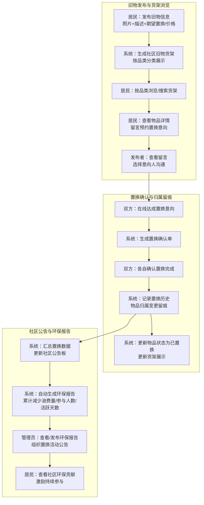
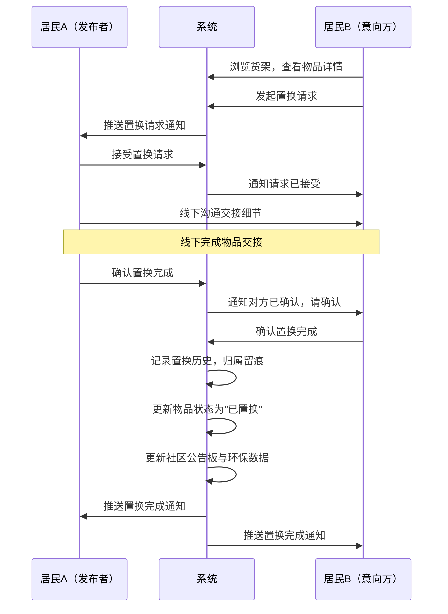
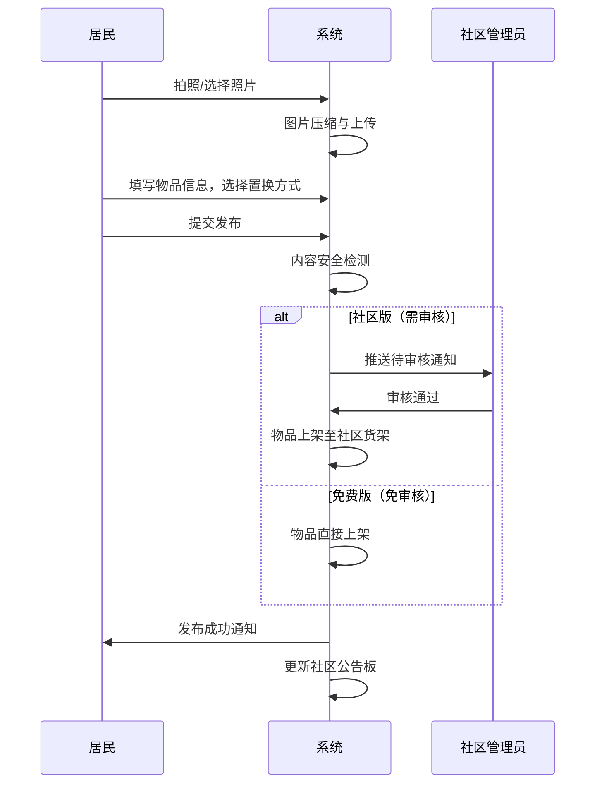
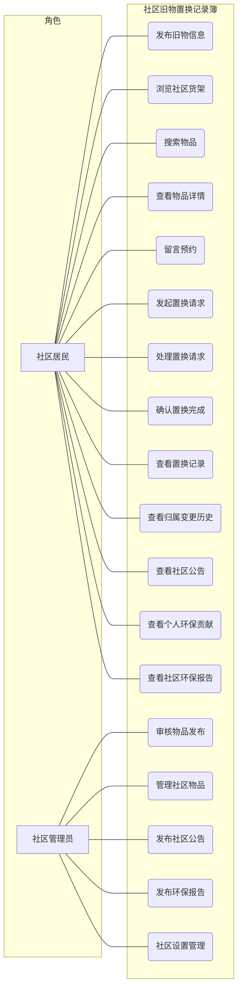
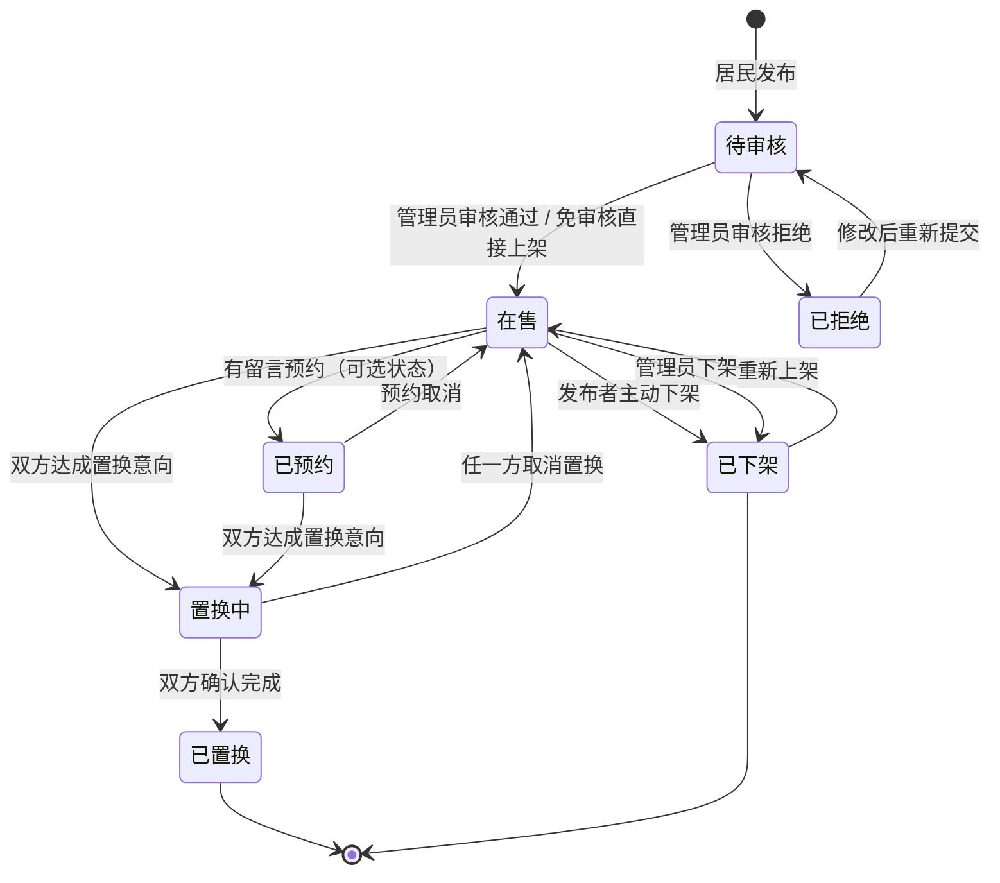
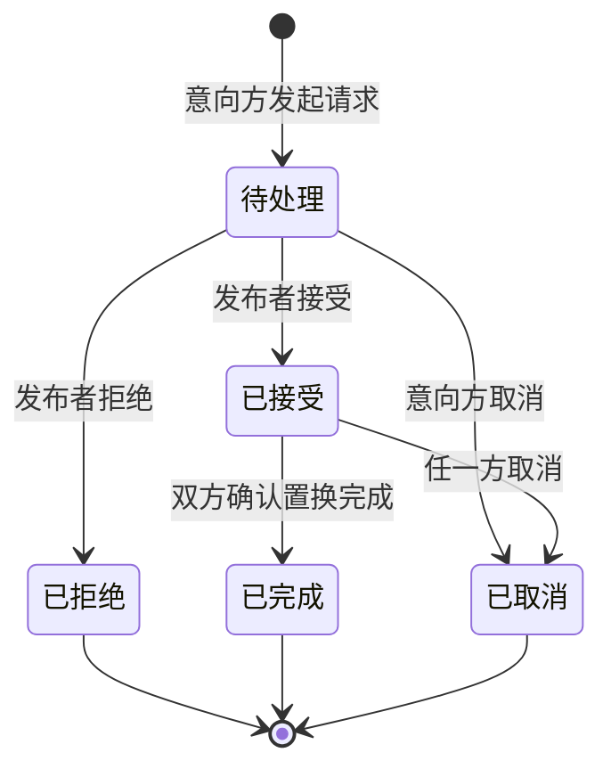

# 社区旧物置换记录簿V1.0 - 用户需求规格说明书

# 1.需求概述

## 1.1 需求介绍

社区旧物置换记录簿是一款面向城市社区的轻量级旧物置换工具，旨在解决社区群内旧物转让信息易被聊天淹没、置换缺乏归属留痕、环保贡献无法量化的问题。居民可通过小程序发布旧物信息、浏览社区货架、与邻居达成置换并留痕确认，系统自动生成置换记录与社区环保报告，让社区旧物循环有据可查、有迹可循。

### 1.1.1 所属领域

社区服务、绿色环保、二手物品循环

## 1.2 需求目标

- 为社区居民提供便捷的旧物信息发布与浏览渠道，替代微信群内零散、易淹没的旧物转让信息
- 为置换双方提供确认机制与归属留痕，避免物品归属变更引发的后续纠纷
- 为社区管理者提供置换公告板与环保贡献报告工具，助力社区文化建设与环保宣传
- 构建轻量、无物流、社区级的旧物置换闭环，区别于闲鱼等面向陌生人的重交易平台
- 通过环保数据量化（累计减少浪费重量/次数/参与人数），激励居民持续参与社区置换

## 1.3 系统使用角色

本系统主要服务于两类用户角色：

1. **社区居民**：小区业主或租户，发布旧物信息、浏览社区货架、与邻居达成置换并确认留痕，查看社区环保报告
2. **社区管理员**：物业工作人员或社区志愿者，审核/管理旧物信息、组织置换活动、查看与发布社区环保报告、管理社区公告板

## 1.4 业务流程图

# 2.功能原型

| 原型名称 | 原型链接 | 对应端 | 备注 |
| --- | --- | --- | --- |
| 社区居民端原型 | 待配套提供 | 小程序端 | MVP V1.0 |
| 社区管理员端原型 | 待配套提供 | 小程序端 | MVP V1.0，与居民端合并，按权限展示 |

# 3.需求清单

## 3.1 社区居民端-小程序端

| 序号 | 功能模块 | 一级功能 | 二级功能 | 功能描述 | 优先级 | 备注 |
| --- | --- | --- | --- | --- | --- | --- |
| 1 | 用户与社区 | 注册与登录 | 微信一键登录 | 用户通过微信授权一键登录，无需额外注册流程 | P0 | |
| 2 | | | 社区绑定 | 用户选择或搜索所属小区/社区，绑定后进入对应社区的货架与公告板 | P0 | 一个用户可绑定多个社区 |
| 3 | | | 切换社区 | 在已绑定的多个社区间切换，查看不同社区的货架与公告 | P1 | |
| 4 | | 个人信息 | 个人资料管理 | 管理头像、昵称、联系方式（手机号/微信号）、楼栋/单元门牌等 | P0 | 联系方式仅置换双方可见 |
| 5 | | | 我的社区身份 | 展示当前所在社区、已发布物品数、已参与置换次数、环保积分 | P1 | |
| 6 | 旧物发布 | 发布旧物 | 拍照/相册上传 | 支持拍摄实物照片或从相册选择（最多6张），自动压缩 | P0 | |
| 7 | | | 物品信息填写 | 填写物品名称、品类、新旧程度、原购入价格（可选）、物品描述、期望置换物品或期望价格 | P0 | 品类从系统预设目录选择 |
| 8 | | | 置换方式选择 | 选择置换方式：以物换物 / 象征性价格 / 免费赠送 | P0 | |
| 9 | | | 发布确认 | 预览发布内容，确认后上架至社区货架 | P0 | |
| 10 | | 物品管理 | 我的发布列表 | 查看自己发布的所有物品，含状态：在售、已预约、已置换、已下架 | P0 | |
| 11 | | | 编辑物品信息 | 修改已发布物品的描述、照片、期望置换条件（已预约物品不可编辑） | P0 | |
| 12 | | | 上/下架物品 | 主动下架不再置换的物品，下架后从货架移除 | P0 | |
| 13 | | | 删除物品 | 删除已发布且未处于置换中的物品 | P1 | |
| 14 | 货架浏览 | 社区货架 | 品类分类导航 | 按预设品类（家居日用、图书影音、母婴用品、数码家电、服饰鞋帽、运动户外、其他）分类浏览 | P0 | |
| 15 | | | 物品列表展示 | 卡片式展示物品照片、名称、期望置换条件、发布时间、发布者昵称 | P0 | 默认按发布时间倒序 |
| 16 | | | 排序方式 | 支持按发布时间、新旧程度排序 | P1 | |
| 17 | | 搜索 | 关键词搜索 | 按物品名称、描述关键词进行模糊搜索 | P0 | |
| 18 | | | 品类筛选 | 在搜索结果中进一步按品类筛选 | P1 | |
| 19 | | 物品详情 | 详情展示 | 展示物品照片（轮播）、完整描述、品类、新旧程度、期望置换条件、发布者信息、发布时间 | P0 | |
| 20 | | | 留言预约 | 在物品详情页留言表达置换意向，可附文字说明 | P0 | 留言对物品发布者可见 |
| 21 | | | 私信联系 | 通过系统内置消息功能与发布者一对一沟通置换细节 | P1 | 双方达成置换后才显示对方联系方式 |
| 22 | 置换流程 | 置换发起 | 发起置换请求 | 从物品详情页或留言区发起置换请求，指定置换方式 | P0 | |
| 23 | | | 置换请求列表 | 查看收到的所有置换请求，含状态：待处理、已接受、已拒绝、已取消 | P0 | |
| 24 | | 置换确认 | 接受/拒绝请求 | 发布者对收到的置换请求进行接受或拒绝操作 | P0 | |
| 25 | | | 双方确认完成 | 置换实际交接后，双方在系统中确认"已完成置换"，触发归属留痕 | P0 | 任一方确认即可标记，另一方收到通知 |
| 26 | | | 取消置换 | 在未完成前，任一方均可取消置换（需填写取消原因） | P0 | |
| 27 | | 置换留痕 | 置换记录详情 | 查看每次置换的完整记录：物品信息、双方昵称、置换时间、置换方式 | P0 | 作为归属变更凭据 |
| 28 | | | 归属变更历史 | 查看某物品的历史归属链（谁→谁→谁），追溯物品流转路径 | P1 | |
| 29 | 公告与报告 | 社区公告板 | 最近置换动态 | 滚动展示本社区最近的置换成功记录（脱敏：张*换了李*的自行车） | P0 | |
| 30 | | | 热门置换物品 | 展示当前社区最受关注的置换物品（按留言数/浏览量排序） | P1 | |
| 31 | | 环保报告 | 个人环保贡献 | 查看个人累计参与置换次数、减少浪费物品重量估算、获得环保积分 | P0 | |
| 32 | | | 社区环保报告 | 查看本社区整体环保数据：累计置换次数、参与家庭数、减少浪费估算、活跃天数 | P0 | 由系统自动生成，管理员可发布 |
| 33 | | | 环保成就/勋章 | 根据置换参与情况解锁环保成就（如"首次置换""10次置换达人"） | P2 | 激励持续参与 |
| 34 | 消息通知 | 站内消息 | 置换状态通知 | 收到置换请求、请求被接受/拒绝、置换完成等系统消息 | P0 | |
| 35 | | | 留言通知 | 发布的物品收到新留言时收到通知 | P0 | |
| 36 | | | 公告通知 | 社区发布新公告/环保报告时收到通知 | P1 | |
| 37 | | 微信消息 | 订阅消息推送 | 通过微信订阅消息推送置换状态变更、新留言等重要通知 | P1 | 需用户主动订阅 |

## 3.2 社区管理员端-小程序端

| 序号 | 功能模块 | 一级功能 | 二级功能 | 功能描述 | 优先级 | 备注 |
| --- | --- | --- | --- | --- | --- | --- |
| 1 | 管理员权限 | 身份认证 | 管理员认证 | 物业工作人员或志愿者通过管理员邀请码或线下审核后获得管理员身份 | P0 | |
| 2 | | | 权限切换 | 管理员身份下可进入管理后台功能，普通身份下为居民功能 | P0 | |
| 3 | 物品审核管理 | 物品审核 | 待审核列表 | 查看本社区待审核的旧物发布信息列表 | P0 | 免费版无需审核，社区版启用 |
| 4 | | | 审核通过/拒绝 | 对发布的物品信息进行审核，通过则上架货架，拒绝需填写原因 | P0 | |
| 5 | | 物品管理 | 全社区物品管理 | 查看本社区所有已发布物品，支持下架违规或过期物品 | P0 | |
| 6 | | | 违规处理 | 对违规发布（虚假信息、违禁物品等）进行下架并通知发布者 | P1 | |
| 7 | 置换管理 | 置换记录查询 | 全社区置换记录 | 查看本社区所有置换历史记录，支持按时间、品类筛选 | P0 | |
| 8 | | | 纠纷处理 | 协助处理置换纠纷，可查看完整归属留痕记录 | P1 | |
| 9 | 公告板管理 | 公告发布 | 发布社区公告 | 发布社区置换活动公告、置换规则说明、温馨提示等 | P0 | |
| 10 | | | 公告编辑/删除 | 编辑或删除已发布的公告 | P0 | |
| 11 | | | 公告置顶/排序 | 将重要公告置顶展示 | P1 | |
| 12 | 环保报告 | 报告查看 | 社区环保数据总览 | 查看本社区累计置换数据：总次数、参与家庭、减少浪费估算、活跃天数趋势 | P0 | |
| 13 | | | 报告发布 | 将系统自动生成的环保报告发布到社区公告板，供居民查看 | P0 | |
| 14 | | | 报告导出 | 将环保报告导出为图片或PDF，用于线下宣传 | P2 | |
| 15 | 社区管理 | 社区设置 | 社区基本信息 | 管理社区名称、地址、封面图、简介 | P0 | |
| 16 | | | 品类设置 | 自定义本社区的品类分类（在系统预设基础上增减） | P1 | |
| 17 | | | 置换规则设置 | 设置本社区的置换规则说明（如交接地点建议、置换礼仪等） | P1 | |
| 18 | | 管理员团队 | 邀请管理员 | 生成邀请码，邀请其他物业人员或志愿者加入管理员团队 | P1 | 社区版功能 |
| 19 | | | 管理员列表 | 查看本社区所有管理员及其权限 | P1 | |

# 4.非功能需求

## 4.1 使用界面需求

| 需求项 | 详细描述 | 备注 |
| --- | --- | --- |
| 设计风格 | 温暖、亲切、社区感，以绿色（环保）为主色调，传递循环利用理念 | P0 |
| 主色调 | 使用 #4CAF50（生态绿）作为主色，搭配暖黄色作为强调色 | P0 |
| 字体规范 | 大标题 34px，中标题 28px，正文 28px，描述 24px，标签 20px | P0 |
| 组件规范 | 主要按钮 88px 高度，次要按钮 72px 高度，卡片圆角 16px | P0 |
| 点击热区 | 可点击元素最小 88px × 88px | P0 |
| 响应式设计 | 适配主流手机屏幕尺寸（320px - 428px 宽度） | P0 |
| 空状态 | 货架为空、无置换记录等场景需设计友好空状态，引导用户发布 | P1 |
| 加载体验 | 使用骨架屏或加载动画，避免白屏 | P1 |

## 4.2 软硬件环境需求

| 需求项 | 详细描述 | 备注 |
| --- | --- | --- |
| 客户端环境 | 微信小程序，支持 iOS 和 Android | P0 |
| 微信版本 | 微信 7.0 及以上版本 | P0 |
| 后端环境 | 云开发环境（微信云开发或同类云函数+云数据库方案） | P0 |
| 图片存储 | 云存储服务，用于存放用户上传的物品照片 | P0 |

## 4.3 性能需求

| 需求项 | 详细描述 | 备注 |
| --- | --- | --- |
| 页面加载 | 95% 的货架列表页加载时间 < 1.5 秒 | P0 |
| 图片加载 | 物品图片采用缩略图+原图双尺寸，列表加载缩略图，详情加载原图 | P0 |
| 搜索响应 | 搜索操作响应 < 1.0 秒 | P0 |
| 系统容量 | 单个社区支持 500 户居民、5000 件物品在架 | P0 |
| 并发能力 | 支持单社区 50 人同时在线浏览与操作 | P1 |
| 数据同步 | 置换状态变更后，双方端上展示 < 3 秒内同步 | P1 |

## 4.4 约束性需求

| 需求项 | 详细描述 | 备注 |
| --- | --- | --- |
| 社区隔离 | 不同社区的货架、公告、置换记录严格隔离，居民只能看到已绑定社区的内容 | P0 |
| 隐私保护 | 用户联系方式仅置换双方可见，对外仅展示昵称；系统不公开用户手机号 | P0 |
| 内容合规 | 发布物品信息需符合微信小程序内容安全规范，接入文本/图片安全检测 | P0 |
| 无物流依赖 | 系统不集成物流追踪功能，物品交接由双方线下自行完成 | P0 |
| 无支付集成 | MVP 阶段不集成在线支付，置换为以物换物或线下自行结算 | P0 |
| 免费版限制 | 单个社区免费版上限 50 件在架物品，超出需升级社区版 | P0 |
| 后台服务 | 是，需要后台服务（云开发）来支撑相关功能 | P0 |

# 5.接口需求

## 5.1 硬件接口需求

本系统不涉及硬件接口需求。

## 5.2 软件接口需求

| 模块 | 接口名称 | 输入 | 输出 | 功能描述 |
| --- | --- | --- | --- | --- |
| 用户认证 | 微信登录 | 微信授权 Code | 用户 OpenID、UnionID、Token | 微信一键登录，获取用户身份 |
| | 用户信息更新 | 头像、昵称、联系方式 | 更新结果 | 更新用户个人资料 |
| 社区服务 | 社区列表 | 位置/关键词 | 社区列表 | 搜索可绑定的社区 |
| | 绑定社区 | 社区ID、用户ID | 绑定结果 | 用户绑定到指定社区 |
| | 社区信息 | 社区ID | 社区详情 | 获取社区名称、简介、设置 |
| 物品服务 | 发布物品 | 物品信息（照片、名称、品类、描述等） | 物品ID、上架状态 | 发布旧物信息到社区货架 |
| | 物品列表 | 社区ID、品类、排序、分页 | 物品列表 | 获取社区货架物品列表 |
| | 物品搜索 | 社区ID、关键词、品类 | 搜索结果 | 按关键词搜索物品 |
| | 物品详情 | 物品ID | 物品完整信息 | 获取物品详情及发布者信息 |
| | 编辑物品 | 物品ID、更新字段 | 更新结果 | 修改已发布物品信息 |
| | 上/下架物品 | 物品ID、操作类型 | 操作结果 | 控制物品在货架的展示状态 |
| 留言服务 | 添加留言 | 物品ID、用户ID、留言内容 | 留言ID | 在物品下发布置换意向留言 |
| | 留言列表 | 物品ID、分页 | 留言列表 | 获取物品下的所有留言 |
| 置换服务 | 发起置换请求 | 物品ID、请求方ID、置换方式 | 请求ID | 向物品发布者发起置换请求 |
| | 置换请求列表 | 用户ID、状态 | 请求列表 | 查看收到的置换请求 |
| | 处理置换请求 | 请求ID、操作（接受/拒绝） | 处理结果 | 发布者处理置换请求 |
| | 确认置换完成 | 请求ID、确认方 | 确认结果 | 双方确认置换完成，触发归属留痕 |
| | 取消置换 | 请求ID、取消原因 | 取消结果 | 任一方取消置换 |
| | 置换记录 | 用户ID/物品ID | 置换历史列表 | 查询置换历史记录 |
| | 归属变更链 | 物品ID | 归属历史列表 | 查询某物品的完整归属变更历史 |
| 公告服务 | 公告列表 | 社区ID、分页 | 公告列表 | 获取社区公告板内容 |
| | 发布/编辑/删除公告 | 社区ID、公告内容 | 操作结果 | 管理员管理社区公告 |
| 环保报告服务 | 个人环保数据 | 用户ID | 个人环保统计 | 获取个人累计置换数据 |
| | 社区环保报告 | 社区ID | 社区环保统计 | 获取社区整体环保数据 |
| | 生成/发布报告 | 社区ID | 报告ID | 系统自动生成并发布环保报告 |
| 通知服务 | 站内消息 | 用户ID、消息内容 | 发送结果 | 发送置换状态、留言等通知 |
| | 微信订阅消息 | 用户OpenID、模板数据 | 发送结果 | 通过微信推送重要通知 |
| 内容安全 | 文本检测 | 待检测文本 | 检测结果 | 检测发布内容是否违规 |
| | 图片检测 | 待检测图片 | 检测结果 | 检测上传图片是否违规 |

## 5.4 通讯接口需求

| 模块 | 接口名称 | 输入 | 输出 | 功能描述 |
| --- | --- | --- | --- | --- |
| 微信服务 | 微信订阅消息推送 | 用户 OpenID、模板 ID、数据 | 推送结果 | 向用户推送置换状态变更、新留言等通知 |
| | 微信内容安全接口 | 文本/图片内容 | 安全检测结果 | 调用微信官方内容安全接口进行合规检测 |

# 6. 附录

## 流程图

### 置换确认流程

## 时序图

### 旧物信息发布时序

## （用户与系统交互）用例图

## （系统）状态图

### 物品生命周期状态图

### 置换请求生命周期状态图

