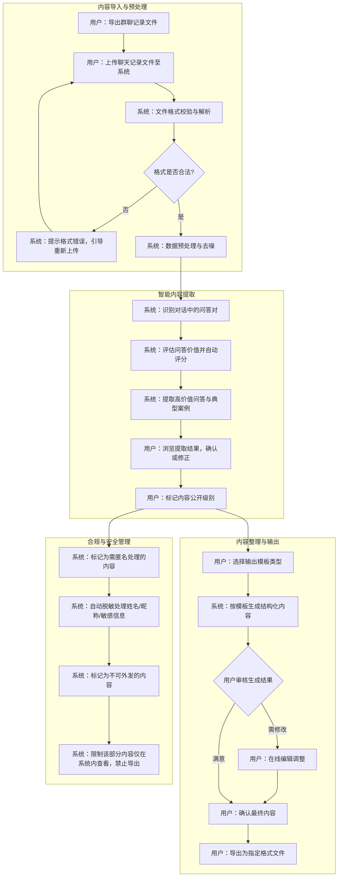
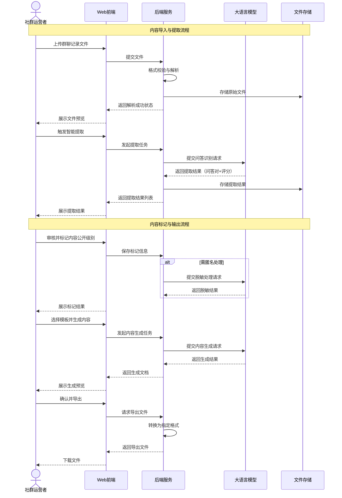
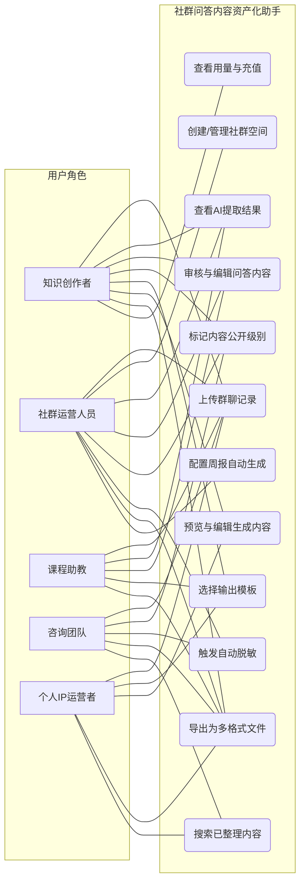
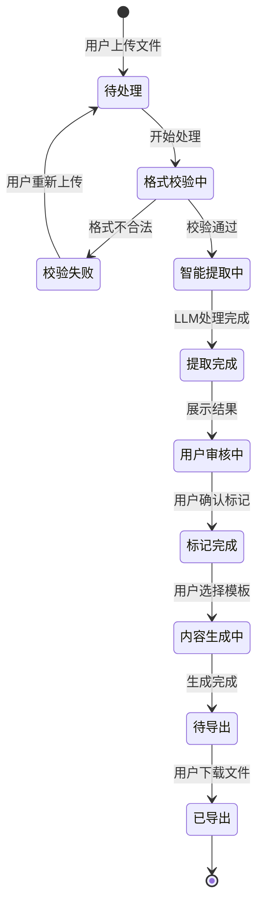
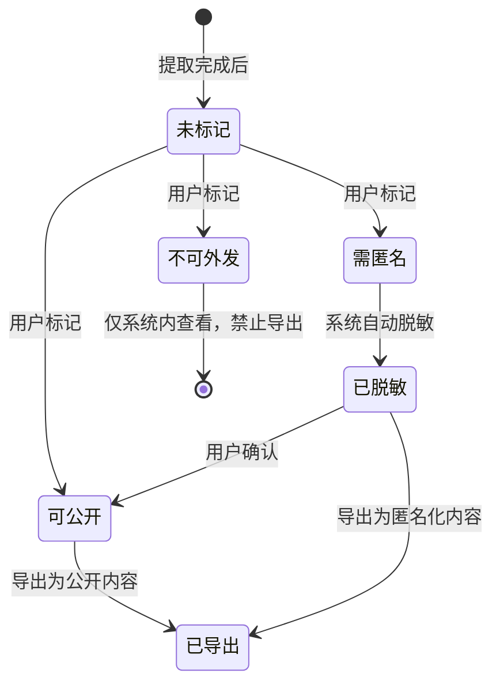

# 社群问答内容资产化助手 V1.0 - 用户需求规格说明书

# 1.需求概述

## 1.1 需求介绍

社群问答内容资产化助手是一款面向知识创作者与社群运营人员的轻量级内容整理工具。产品聚焦于将付费社群、训练营、会员群等场景中产生的大量群聊问答内容，通过自动化手段提取、整理、分类并输出为可复用的内容资产（如周报、FAQ、选题库、课程补充材料等），同时提供内容公开级别标记功能以降低二次发布的合规风险。

产品定位为"内容整理外挂"——不对接或替代飞书/企微等IM平台的社群管理能力，而是作为独立的内容后处理工具切入，帮助运营者将群内隐性知识转化为可检索、可发布、可变现的结构化内容资产。

### 1.1.1 所属领域

知识付费、社群运营、内容创作工具

## 1.2 需求目标

- 为社群运营者提供一键式群聊记录导入与智能整理能力，将原本需要数小时的人工筛选工作缩短至分钟级
- 为知识创作者提供从群聊问答到可发布内容（周报、FAQ、选题库、课程材料）的自动化生成流程，提升内容复用率
- 为所有内容输出提供公开/匿名/不可外发的分级标记机制，降低二次发布的隐私与合规风险
- 支持多社群来源的内容汇总管理，让运营者在一个平台上完成所有社群的内容资产化
- 提供按量付费与订阅制两种灵活的商业模式，降低用户试用门槛

## 1.3 系统使用角色

本平台主要服务于以下用户角色：
1. **知识创作者**：运营付费社群、训练营、会员群的个人或团队，需要将群内问答沉淀为可复用内容素材
2. **社群运营人员**：负责日常社群维护和内容整理，需要将群聊内容汇编为周报、月报等定期产出物
3. **课程助教**：协助讲师管理训练营或课程群，需要从学员问答中提取高频问题和优质解答
4. **小型咨询团队**：将客户咨询群中的典型问题整理为标准FAQ或知识文档，提升服务效率
5. **个人IP运营者**：从粉丝社群中挖掘选题灵感，将问答内容转化为公众号、短视频等公开内容

## 1.4 业务流程图

# 2.功能原型

| 原型名称 | 原型链接 | 对应端 | 备注 |
| --- | --- | --- | --- |
| 社群问答内容资产化助手Web管理端 | 待设计 | WEB端 | V1.0 MVP |
| 社群问答内容资产化助手移动端适配 | 待设计 | WEB端 | 响应式适配，后续版本考虑小程序 |

# 3.需求清单

## 3.1 内容导入管理-WEB端

| 序号 | 功能模块 | 一级功能 | 二级功能 | 功能描述 | 优先级 | 备注 |
| --- | --- | --- | --- | --- | --- | --- |
| 1 | 文件上传 | 群聊记录上传 | 文件选择与上传 | 支持用户选择本地文件上传群聊记录，支持单次上传一个文件 | P0 | MVP核心功能 |
| 2 | | | 多格式支持 | 支持主流IM工具导出的聊天记录格式，包括但不限于：txt纯文本、csv表格、JSON格式 | P0 | 优先支持微信、企微、飞书导出格式 |
| 3 | | | 批量上传 | 支持同时上传多个文件，系统自动按文件顺序合并处理 | P1 | 适用于跨时段的群聊记录 |
| 4 | | 文件校验 | 格式检测 | 自动检测上传文件的格式是否符合要求，不合法时给出明确错误提示 | P0 | |
| 5 | | | 文件预览 | 上传成功后展示文件内容预览（前20条消息），供用户确认是否为正确的聊天记录 | P1 | |
| 6 | 社群管理 | 社群列表 | 社群创建 | 用户可为不同的群聊创建独立的社群空间，每个社群独立管理内容 | P0 | |
| 7 | | | 社群信息维护 | 编辑社群名称、描述、来源平台（微信/企微/飞书/其他）等基本信息 | P0 | |
| 8 | | | 社群列表查看 | 展示所有社群的概览信息：名称、最近导入时间、内容条数、未整理条数 | P1 | |
| 9 | 导入记录 | 历史导入管理 | 导入记录查看 | 查看每次导入的时间、文件名、消息条数、处理状态 | P1 | |
| 10 | | | 导入记录删除 | 删除不再需要的导入批次及其关联的原始数据 | P1 | |

## 3.2 智能内容提取-WEB端

| 序号 | 功能模块 | 一级功能 | 二级功能 | 功能描述 | 优先级 | 备注 |
| --- | --- | --- | --- | --- | --- | --- |
| 11 | 问答识别 | 自动提取 | 问答对识别 | 系统自动从群聊记录中识别出"提问-回答"对话对，区分有效问答与无效闲聊 | P0 | 核心AI能力 |
| 12 | | | 案例识别 | 识别群聊中包含完整业务场景的案例内容（如问题描述+处理过程+解决方案） | P1 | |
| 13 | | | 话题聚类 | 将相似问题和回答自动归类到同一话题下，便于批量查看 | P1 | |
| 14 | 价值评估 | 智能评分 | 价值评分 | 对每条识别出的问答/案例进行价值评分（高/中/低），综合考虑问题代表性、回答质量、内容完整性等维度 | P0 | |
| 15 | | | 筛选与排序 | 支持按价值评分、时间范围、话题分类等条件筛选和排序提取结果 | P0 | |
| 16 | 人工审核 | 结果确认 | 逐条审核 | 用户可逐条查看系统提取的问答内容，标记为"保留"、"删除"或"需修改" | P0 | |
| 17 | | | 批量操作 | 支持批量保留、批量删除、批量修改公开级别等快捷操作 | P1 | |
| 18 | | 内容编辑 | 在线编辑 | 用户可对提取的问答内容进行文字编辑，修正识别错误或补充上下文 | P0 | |
| 19 | 公开标记 | 内容分级 | 公开级别标记 | 为每条内容设置公开级别：可公开、需匿名、不可外发，三档分级 | P0 | 核心合规功能 |
| 20 | | | 批量标记 | 支持按话题或价值等级批量设置公开级别 | P1 | |
| 21 | | 脱敏处理 | 自动脱敏 | 对标记为"需匿名"的内容，系统自动识别并替换其中的人名、昵称、手机号等敏感信息 | P0 | |
| 22 | | | 脱敏预览 | 展示脱敏处理前后的内容对比，供用户确认脱敏效果 | P1 | |

## 3.3 内容整理与输出-WEB端

| 序号 | 功能模块 | 一级功能 | 二级功能 | 功能描述 | 优先级 | 备注 |
| --- | --- | --- | --- | --- | --- | --- |
| 23 | 模板管理 | 输出模板 | 模板选择 | 提供预设输出模板：周报、FAQ文档、选题库、课程补充材料、知识卡片 | P0 | MVP核心功能 |
| 24 | | | 模板预览 | 选择模板后可预览该模板的输出样式和结构 | P1 | |
| 25 | | 自定义模板 | 模板编辑 | 支持用户自定义输出模板，调整内容板块顺序和标题样式 | P2 | 订阅版功能 |
| 26 | | | 品牌模板 | 支持配置品牌Logo、颜色、页眉页脚等，用于输出品牌化文档 | P2 | 订阅版功能 |
| 27 | 内容生成 | 智能生成 | 一键生成 | 用户选定要整理的问答内容并选择模板后，系统一键生成结构化输出文档 | P0 | |
| 28 | | | 生成预览 | 生成结果以富文本形式在线预览，支持查看各板块内容 | P0 | |
| 29 | | 在线编辑 | 内容调整 | 用户可在预览页面直接编辑生成的内容，调整文字、顺序和板块结构 | P0 | |
| 30 | | | 内容增删 | 可在生成结果中追加新内容或移除不需要的段落 | P1 | |
| 31 | 导出管理 | 文件导出 | 多格式导出 | 支持将整理好的内容导出为Markdown、Word(docx)、PDF格式 | P0 | |
| 32 | | | 导出历史记录 | 查看和重新下载历史导出文件 | P1 | |
| 33 | 周报自动化 | 定时任务 | 周报自动生成 | 订阅用户可配置每周自动生成社群周报，系统自动汇总本周新导入的问答内容 | P2 | 订阅版功能 |
| 34 | | | 自动推送 | 生成完成后自动发送邮件通知或系统消息提醒用户查看 | P2 | |

## 3.4 用户与账户管理-WEB端

| 序号 | 功能模块 | 一级功能 | 二级功能 | 功能描述 | 优先级 | 备注 |
| --- | --- | --- | --- | --- | --- | --- |
| 35 | 账户管理 | 注册与登录 | 手机号注册 | 用户通过手机号+验证码完成注册 | P0 | |
| 36 | | | 微信登录 | 支持微信扫码快捷登录 | P1 | |
| 37 | | | 登录状态管理 | 支持记住登录状态，过期后需重新登录 | P0 | |
| 38 | | 个人信息 | 个人资料维护 | 管理用户昵称、头像、联系方式等个人信息 | P1 | |
| 39 | 用量与计费 | 用量查看 | 用量统计 | 查看当月已使用/剩余的整理字数额度 | P0 | |
| 40 | | | 用量明细 | 按每次导入查看消耗的字数明细 | P1 | |
| 41 | | 套餐管理 | 套餐查看 | 查看当前套餐类型（按量/订阅）及可用功能列表 | P0 | |
| 42 | | | 套餐升级 | 支持从按量付费升级到订阅版，解锁更多功能 | P1 | |
| 43 | | 支付 | 按量充值 | 按万字为单位充值整理额度（¥9/万字） | P0 | |
| 44 | | | 订阅购买 | 购买月度订阅（¥59/月），支持自动续费 | P1 | |
| 45 | | | 支付记录 | 查看历史支付记录和发票信息 | P1 | |

## 3.5 内容检索与知识库-WEB端

| 序号 | 功能模块 | 一级功能 | 二级功能 | 功能描述 | 优先级 | 备注 |
| --- | --- | --- | --- | --- | --- | --- |
| 46 | 内容检索 | 全局搜索 | 关键词搜索 | 在所有已导入和整理的问答内容中进行关键词搜索 | P1 | |
| 47 | | | 高级筛选 | 按社群来源、时间范围、公开级别、话题分类等多维度筛选 | P1 | |
| 48 | | 结果展示 | 搜索结果列表 | 展示匹配的问答内容列表，高亮关键词，支持跳转到原文上下文 | P1 | |
| 49 | 知识库 | 知识沉淀 | 内容收藏 | 将高价值问答加入收藏夹，便于快速访问 | P2 | |
| 50 | | | 标签管理 | 为用户收藏和整理的问答内容添加自定义标签，构建个人知识体系 | P2 | |

# 4.非功能需求

## 4.1 使用界面需求

| 需求项 | 详细描述 | 备注 |
| --- | --- | --- |
| 设计风格 | 简洁、专业、高效，突出内容本身，减少视觉干扰，适合长时间使用 | P0 |
| 主色调 | 采用沉稳的蓝灰色系为主色，搭配绿色/橙色作为操作状态标识 | P0 |
| 内容排版 | 问答内容展示采用卡片式布局，对话双方以不同颜色区分，便于阅读 | P0 |
| 响应式设计 | Web端优先，适配1280px及以上分辨率屏幕 | P0 |
| 操作反馈 | 文件上传、内容生成等操作需展示进度条或加载状态 | P0 |
| 空状态引导 | 新用户首次进入时展示操作引导，说明如何导入群聊记录 | P1 |

## 4.2 软硬件环境需求

| 需求项 | 详细描述 | 备注 |
| --- | --- | --- |
| 客户端环境 | 现代浏览器（Chrome 90+、Firefox 90+、Edge 90+、Safari 15+） | P0 |
| 服务端环境 | 云端部署，支持主流云服务器（阿里云/腾讯云） | P0 |
| AI服务依赖 | 需要对接大语言模型API进行内容提取与生成（如OpenAI/文心一言/通义千问等） | P0 |

## 4.3 性能需求

| 需求项 | 详细描述 | 备注 |
| --- | --- | --- |
| 文件上传 | 单文件上传（≤50MB）完成时间不超过10秒（取决于网络带宽） | P0 |
| 内容解析 | 万字群聊记录的解析和问答提取时间不超过60秒 | P0 |
| 内容生成 | 基于模板生成输出文档的时间不超过30秒 | P0 |
| 页面加载 | 主要页面首屏加载时间不超过3秒 | P0 |
| 并发处理 | 支持至少50个用户同时进行内容提取任务 | P1 |

## 4.4 约束性需求

| 需求项 | 详细描述 | 备注 |
| --- | --- | --- |
| 数据处理边界 | 系统不直接对接IM平台API获取聊天记录，仅处理用户主动上传的导出文件 | P0 |
| 内容安全 | 用户上传的聊天记录内容不对外公开传播，仅在用户账户内可见和处理 | P0 |
| 隐私保护 | 系统不对用户上传的原始聊天内容做持久化存储以外的用途，不用于模型训练 | P0 |
| 脱敏免责 | 系统的自动脱敏功能为辅助工具，最终公开级别的判定和内容审核由用户自行负责 | P0 |
| 后台服务 | 是，需要云端后台服务来支撑AI内容处理、文件存储、用户账户管理等功能 | P0 |
| MVP范围 | 首版不包含社群管理、实时聊天、自动化数据采集等功能，仅处理离线导入的聊天记录文件 | P0 |

# 5.接口需求

## 5.1 硬件接口需求

本产品为纯Web应用，无特殊硬件接口需求。

## 5.2 软件接口需求

| 模块 | 接口名称 | 输入 | 输出 | 功能描述 |
| --- | --- | --- | --- | --- |
| 用户认证 | 注册/登录 | 手机号/验证码或微信授权码 | 用户Token、用户信息 | 用户注册、登录和身份认证 |
| 文件服务 | 文件上传 | 聊天记录文件 | 文件ID、上传状态 | 接收用户上传的群聊记录文件并存储 |
| | 文件下载 | 文件ID | 文件内容 | 下载已导出的整理结果文件 |
| 内容处理引擎 | 内容解析 | 原始聊天文件内容 | 结构化消息列表 | 将各类格式的聊天记录文件解析为标准消息结构 |
| | 问答提取 | 结构化消息列表 | 问答对列表（含价值评分） | 调用LLM从消息列表中识别和提取有价值的问答内容 |
| | 脱敏处理 | 待脱敏文本内容 | 脱敏后的文本 | 自动识别并替换文本中的姓名、手机号等敏感信息 |
| | 内容生成 | 问答内容+模板配置 | 结构化输出文档 | 按选定模板将问答内容整理为周报/FAQ/选题库等格式 |
| 支付服务 | 支付下单 | 套餐ID、支付金额 | 支付参数（支付链接/二维码） | 发起按量充值或订阅购买支付 |
| | 支付回调 | 支付结果通知 | 确认回执 | 处理支付完成回调，更新用户额度或订阅状态 |
| 通知服务 | 消息推送 | 通知内容、用户ID | 推送结果 | 向用户发送任务完成通知、周报生成提醒等消息 |
| | 邮件发送 | 收件人邮箱、邮件内容 | 发送结果 | 发送周报生成完成通知或导出文件 |

## 5.4 通讯接口需求

| 模块 | 接口名称 | 输入 | 输出 | 功能描述 |
| --- | --- | --- | --- | --- |
| AI模型通讯 | LLM API调用 | 处理任务参数、文本内容 | 处理结果文本 | 与大语言模型服务通讯，完成问答提取、价值评估、内容生成等AI任务 |
| 文件传输 | 文件上传/下载 | 文件二进制数据 | 传输状态 | 通过HTTPS协议完成文件的上传和下载传输 |
| 消息通知 | WebSocket推送 | 实时事件消息 | 确认回执 | 向前端推送任务处理进度等实时状态更新（可选） |

# 6. 附录

## 流程图

详见1.3章节业务流程图。

## 时序图

## （用户与系统交互）用例图

## （系统）状态图

### 内容处理任务状态图

### 内容公开级别状态图

