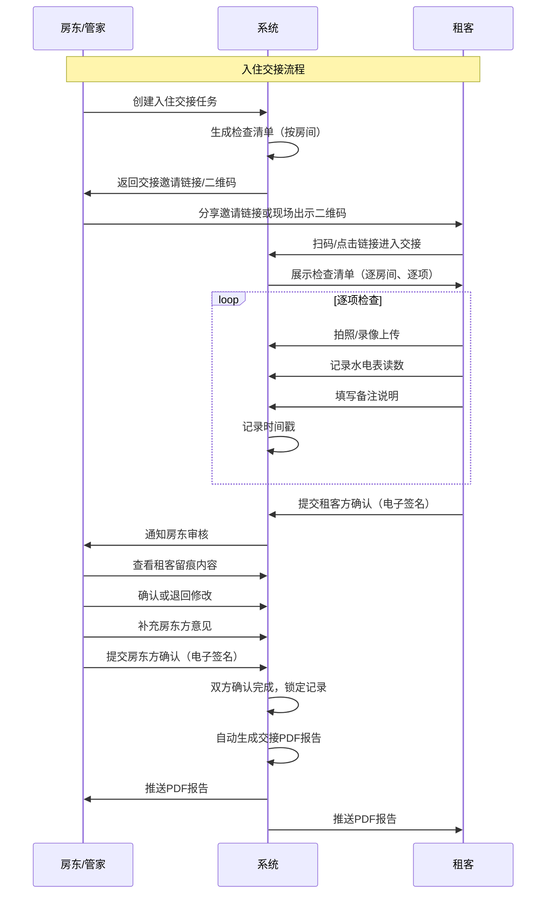
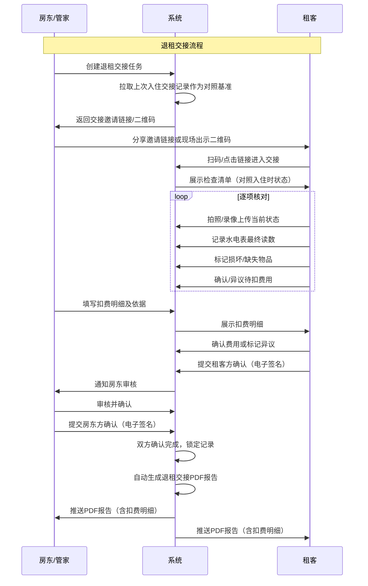
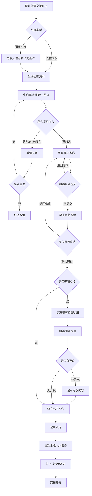
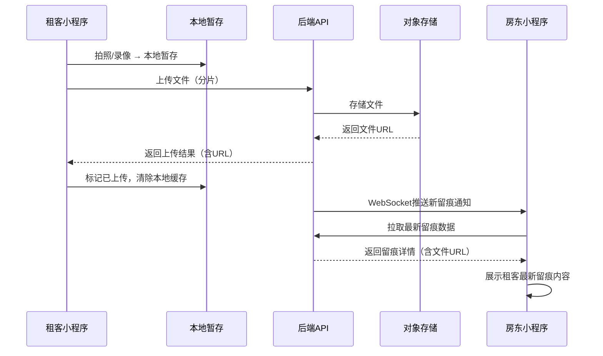
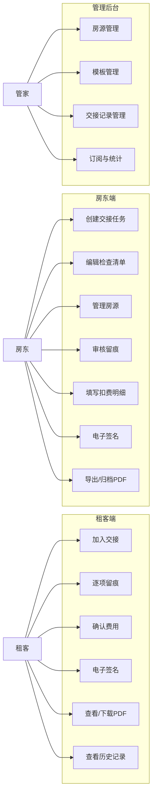
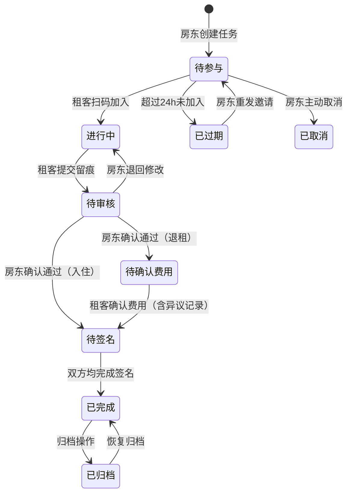

# 租房交接留痕确认器 — 用户需求说明书（URS）

> 文档版本：v1.0  
> 创建日期：2026-06-26  
> 适用产品：租房交接留痕确认器  
> 文档状态：初稿，待产品负责人审核

---

# 1. 需求概述

## 1.1 需求介绍

租房交接留痕确认器是一款面向合租房租客、个人房东和小型公寓管家的轻量级交接留痕工具。在租客入住或退租时，双方通过本工具按房间逐项检查房屋状态，以照片、视频、水电表读数和文字备注的形式完成全流程留痕，经双方在线电子确认后，自动生成带时间戳的交接PDF报告，作为后续协商或维权的可靠凭证。

产品定位为"交接那一刻的第三方见证人"，解决传统口头交接或纸质清单"说不清、扯不清"的痛点。

### 1.1.1 所属领域

生活服务 — 房地产租赁 / 长租公寓

## 1.2 需求目标

1. **留痕目标**：为入住/退租交接提供结构化、不可篡改的留痕记录，覆盖房屋状态、物品清单、水电读数和费用明细
2. **确认目标**：交接双方通过电子签名和时间戳完成在线确认，形成双方认可的交接凭证
3. **导出目标**：一键生成PDF交接报告，包含全部照片、读数和签名，可直接用于协商、投诉或法律维权
4. **易用目标**：租客无需注册即可参与交接（微信扫码即用），房东/管家可快速创建和管理多房源交接
5. **商业目标**：单次交接¥9满足低频个人用户，房东版¥49/月满足高频多房源管理需求

## 1.3 系统使用角色

| 角色 | 描述 | 使用终端 |
| --- | --- | --- |
| 租客（入住方） | 合租房租客或整租承租人，在入住/退租时参与交接检查并留痕确认 | 微信小程序 |
| 个人房东（出租方） | 拥有1-3套房源的个人房东，发起交接、管理房源和归档记录 | 微信小程序 + WEB管理后台 |
| 小型公寓管家 | 管理5-30套房源的职业管家，批量管理房源、使用模板和归档历史交接 | WEB管理后台（房东版） |
| 单次用户 | 未注册、仅使用一次交接服务的用户，通过手机号验证后创建单次交接 | 微信小程序 |

## 1.4 业务流程图

### 入住交接主流程

### 退租交接主流程

# 2. 功能原型

| 原型名称 | 原型链接 | 对应端 | 备注 |
| --- | --- | --- | --- |
| 检查清单生成页 | 见UI原型文件 | 小程序端（房东） | 房东按房间创建和编辑检查清单 |
| 留痕记录页 | 见UI原型文件 | 小程序端（租客） | 租客逐项拍照、录像、备注留痕 |
| 双方确认页 | 见UI原型文件 | 小程序端（双方） | 电子签名、费用确认、异议标记 |
| PDF导出与历史归档页 | 见UI原型文件 | 小程序端 + WEB端 | 报告预览、下载、历史归档管理 |

# 3. 需求清单

## 3.1 租客端 — 微信小程序

| 模块 | 一级功能 | 二级功能 | 功能描述 | 备注 |
| --- | --- | --- | --- | --- |
| 交接参与 | 加入交接 | 扫码加入 | 租客扫描房东出示的二维码，进入对应交接任务 | 无需注册，微信授权即可 |
| 交接参与 | 加入交接 | 链接加入 | 租客点击微信分享的链接，进入对应交接任务 | 支持微信内直接打开 |
| 交接参与 | 身份验证 | 手机号验证 | 首次参与时通过手机号验证码验证身份 | 单次用户仅需此步骤 |
| 交接参与 | 身份验证 | 微信授权登录 | 已有账户的租客通过微信授权快速登录 | 关联历史交接记录 |
| 交接参与 | 查看清单 | 检查清单浏览 | 按房间分组展示全部检查项，显示各项状态（待检查/已完成） | 支持折叠/展开房间分组 |
| 交接参与 | 查看清单 | 进度指示 | 显示当前交接的整体完成进度（已完成项/总项数） | 顶部进度条展示 |
| 交接参与 | 逐项留痕 | 照片拍摄与上传 | 对每个检查项拍摄或从相册选择照片上传，支持多张照片 | 单张不超过10MB，自动压缩 |
| 交接参与 | 逐项留痕 | 视频录制与上传 | 对每个检查项录制短视频上传，支持从相册选择 | 视频时长≤60秒，单文件≤100MB |
| 交接参与 | 逐项留痕 | 水电表读数记录 | 对水表、电表、燃气表等填写当前读数，支持拍照辅助 | 读数自动与上次记录对比，显示用量 |
| 交接参与 | 逐项留痕 | 文字备注 | 对每个检查项填写文字备注说明（如"墙面有轻微划痕"） | 支持语音转文字输入 |
| 交接参与 | 逐项留痕 | 状态标记 | 对检查项标记状态：完好、有损坏、缺失、需维修 | 损坏/缺失项需强制拍照留证 |
| 交接参与 | 逐项留痕 | 自动时间戳 | 每项操作自动记录精确时间戳，不可手动修改 | 用于PDF报告和争议举证 |
| 费用确认 | 费用查看 | 扣费明细查看 | 查看房东填写的各项扣费明细及扣费依据 | 退租交接场景 |
| 费用确认 | 费用查看 | 入住时基准对比 | 对比入住时留痕记录与退租时状态，直观展示变化 | 自动关联上次入住交接记录 |
| 费用确认 | 费用确认 | 确认费用 | 对扣费明细逐项确认或标记异议 | 异议项需填写异议原因 |
| 费用确认 | 费用确认 | 异议标记 | 对不认同的扣费项标记异议，填写异议原因并可补充照片 | 异议内容将体现在PDF报告中 |
| 双方确认 | 电子签名 | 租客方签名 | 在确认页手写电子签名，确认交接内容属实 | 签名写入PDF报告 |
| 双方确认 | 电子签名 | 确认提交 | 签名后提交确认，提交后不可修改留痕内容 | 提交前支持预览全部留痕 |
| 双方确认 | 结果获取 | PDF报告查看 | 双方确认后查看自动生成的交接PDF报告 | 支持在线预览 |
| 双方确认 | 结果获取 | PDF报告下载 | 下载交接PDF报告到本地 | 支持微信收藏或转发 |
| 双方确认 | 结果获取 | PDF报告分享 | 通过微信分享交接PDF报告给房东或其他人 | 支持分享给非微信联系人（复制链接） |
| 个人中心 | 历史记录 | 我的交接列表 | 查看自己参与过的全部交接记录（入住/退租） | 按时间倒序排列 |
| 个人中心 | 历史记录 | 交接详情查看 | 查看任意一条历史交接的完整留痕内容和PDF报告 | 支持重新下载PDF |
| 个人中心 | 账户设置 | 手机号绑定 | 绑定或更换绑定手机号 | |
| 个人中心 | 账户设置 | 退出登录 | 退出当前微信授权登录状态 | |

## 3.2 房东端 — 微信小程序

| 模块 | 一级功能 | 二级功能 | 功能描述 | 备注 |
| --- | --- | --- | --- | --- |
| 交接发起 | 创建交接 | 选择房源 | 从已添加的房源列表中选择本次交接的房源 | 首次需先添加房源 |
| 交接发起 | 创建交接 | 选择交接类型 | 选择入住交接或退租交接 | 退租时自动关联上次入住记录 |
| 交接发起 | 创建交接 | 选择检查模板 | 从已有模板中选择，或基于模板修改后使用 | 支持"上次交接"作为模板 |
| 交接发起 | 创建交接 | 生成邀请 | 生成交接邀请二维码和微信分享链接 | 二维码支持保存到相册 |
| 交接发起 | 邀请管理 | 邀请过期重发 | 过期未参与的邀请支持重新生成 | 旧链接自动失效 |
| 清单编辑 | 房间管理 | 添加房间 | 为本次交接添加房间（如主卧、次卧、客厅、厨房、卫生间） | 支持自定义房间名称 |
| 清单编辑 | 房间管理 | 房间排序 | 拖拽调整房间检查顺序 | |
| 清单编辑 | 检查项管理 | 添加检查项 | 在房间内添加具体检查项（如"墙面状态"、"空调运转"、"窗帘完好"） | 支持从模板快速添加 |
| 清单编辑 | 检查项管理 | 编辑检查项 | 修改检查项名称和检查要点描述 | |
| 清单编辑 | 检查项管理 | 删除检查项 | 删除不需要的检查项 | 已产生留痕的项不可删除 |
| 清单编辑 | 检查项管理 | 上传参考照片 | 为检查项上传参考照片，作为"标准状态"对照 | 退租时租客可对照参考 |
| 清单编辑 | 读数设置 | 预设表计初始读数 | 填写交接时水表、电表、燃气表的当前读数 | 作为后续用量计算基准 |
| 清单编辑 | 物品清单 | 物品登记 | 登记房间内的家具家电清单（名称、数量、状态） | 支持从模板批量添加 |
| 确认管理 | 留痕审核 | 查看租客留痕 | 查看租客提交的全部照片、视频、读数和备注 | 按房间分组展示 |
| 确认管理 | 留痕审核 | 对比入住基准 | 退租场景下，对比入住时留痕与退租时留痕 | 自动高亮差异项 |
| 确认管理 | 确认操作 | 确认通过 | 对租客留痕内容确认无误，进入签名环节 | |
| 确认管理 | 确认操作 | 退回修改 | 对存疑的留痕内容退回要求租客补充或修改 | 需填写退回原因 |
| 确认管理 | 费用填写 | 填写扣费明细 | 退租场景下，逐项填写扣费金额和扣费依据 | 关联损坏/缺失的检查项 |
| 确认管理 | 费用填写 | 费用预览 | 预览扣费汇总，确认总额后提交给租客确认 | |
| 确认管理 | 电子签名 | 房东方签名 | 在确认页手写电子签名，确认交接内容属实 | 签名写入PDF报告 |
| 确认管理 | 电子签名 | 确认提交 | 签名后提交确认，双方均确认后记录锁定 | |
| 记录管理 | 历史交接 | 交接记录列表 | 查看自己发起的全部交接记录 | 按状态筛选：进行中/已完成/已归档 |
| 记录管理 | 历史交接 | 交接详情查看 | 查看任意一条交接的完整信息（留痕、签名、PDF） | |
| 记录管理 | 历史交接 | PDF导出 | 导出交接PDF报告 | 支持批量导出（房东版） |
| 记录管理 | 历史交接 | 归档操作 | 将已完成的交接记录归档 | 归档后仅可查看，不可修改 |
| 记录管理 | 房源管理 | 添加房源 | 添加房源信息（地址、房间结构、面积） | 支持地图选点 |
| 记录管理 | 房源管理 | 编辑房源 | 修改房源信息 | |
| 记录管理 | 房源管理 | 删除房源 | 删除不再使用的房源 | 有关联交接记录的不可删除 |
| 单次付费 | 创建单次交接 | 手机号验证 | 未注册用户通过手机号验证创建单次交接 | 无需注册，即开即用 |
| 单次付费 | 创建单次交接 | 微信支付 | 通过微信支付完成¥9/次的单次交接费用 | 支付成功后立即可用 |
| 单次付费 | 创建单次交接 | 房源信息填写 | 手动填写本次交接的房源和房间信息 | 不保存为永久房源 |

## 3.3 管理后台 — WEB端（房东版）

| 模块 | 一级功能 | 二级功能 | 功能描述 | 备注 |
| --- | --- | --- | --- | --- |
| 房源管理 | 房源列表 | 房源总览 | 查看所有房源列表，显示房源地址、房间数、关联交接数 | 支持搜索和筛选 |
| 房源管理 | 房源列表 | 添加房源 | 添加新房源（地址、楼层、面积、房间结构） | 支持批量导入（Excel） |
| 房源管理 | 房源列表 | 编辑房源 | 修改房源详细信息 | |
| 房源管理 | 房源列表 | 删除房源 | 删除不使用的房源 | 有交接记录关联的不可删除 |
| 房源管理 | 房间配置 | 房间结构编辑 | 为房源配置房间结构（主卧、次卧、客厅、厨房等） | 支持拖拽排序 |
| 房源管理 | 房间配置 | 房间预设物品 | 为每个房间预设家具家电清单 | 支持从其他房间复制 |
| 模板管理 | 检查模板 | 创建模板 | 创建通用检查清单模板（适用于所有房源或指定房源） | 包含房间结构和检查项 |
| 模板管理 | 检查模板 | 编辑模板 | 修改已有模板的房间和检查项 | 已使用的模板修改后对新交接生效 |
| 模板管理 | 检查模板 | 删除模板 | 删除不再使用的模板 | |
| 模板管理 | 检查模板 | 模板列表 | 查看所有已创建的模板，显示创建时间、使用次数 | |
| 交接记录 | 记录列表 | 全部交接记录 | 查看所有房源的交接记录，支持按房源、状态、时间筛选 | 默认按时间倒序 |
| 交接记录 | 记录列表 | 记录详情 | 查看单条交接的完整信息：清单、留痕、签名、PDF | |
| 交接记录 | 记录列表 | 批量导出PDF | 批量选择多条交接记录，导出为多个PDF文件（ZIP压缩包） | |
| 交接记录 | 记录列表 | 归档管理 | 将完成的交接记录归档或从归档中恢复 | 归档记录仅可查看 |
| 交接记录 | 进行中的交接 | 实时状态查看 | 查看正在进行中的交接进度（租客是否已加入、完成进度） | |
| 交接记录 | 进行中的交接 | 催促提醒 | 向未完成的租客发送微信提醒通知 | 通过微信服务通知推送 |
| 账户管理 | 订阅管理 | 订阅状态查看 | 查看房东版订阅状态（到期日、续费状态） | ¥49/月 |
| 账户管理 | 订阅管理 | 续费操作 | 通过微信支付续费房东版订阅 | 支持自动续费 |
| 账户管理 | 订阅管理 | 升级/降级 | 从单次用户升级为房东版，或房东版到期后降级 | |
| 账户管理 | 使用统计 | 交接次数统计 | 查看本月已完成的交接次数和剩余可用次数 | |
| 账户管理 | 使用统计 | 房源使用统计 | 查看各房源的交接次数和时间分布 | 图表展示 |
| 账户管理 | 发票管理 | 申请发票 | 申请电子发票（个人或企业抬头） | |

# 4. 非功能需求

## 4.1 使用界面需求

| 需求项 | 描述 |
| --- | --- |
| 小程序端界面风格 | 简洁实用，大字体大按钮，适合现场手持操作。检查清单采用卡片式布局，一屏展示一个房间 |
| 操作反馈 | 每次操作（拍照上传、状态标记、签名提交）均需明确的成功/失败反馈 |
| 离线暂存 | 网络不稳定时支持本地暂存留痕数据，网络恢复后自动上传 |
| 进度可见 | 交接全程展示进度条和当前步骤，双方均可见对方进度 |
| PDF报告格式 | A4排版，包含房源信息、检查清单、留痕照片、读数记录、双方签名和时间戳 |

## 4.2 软硬件环境需求

| 需求项 | 描述 |
| --- | --- |
| 小程序端运行环境 | 微信客户端 7.0 及以上版本，iOS 12+ / Android 6.0+ |
| WEB端运行环境 | 主流浏览器：Chrome 80+、Safari 14+、Edge 80+、Firefox 75+ |
| 摄像头要求 | 小程序端需调用手机摄像头进行拍照和录像 |
| 存储要求 | 小程序端需临时存储空间用于照片/视频缓存（建议≥500MB可用空间） |
| 后端服务 | 需要云服务器支撑：对象存储（照片/视频）、数据库、PDF生成服务 |

## 4.3 性能需求

| 需求项 | 指标 |
| --- | --- |
| 照片上传响应 | 单张照片（压缩后）上传完成≤3秒（4G网络环境） |
| 视频上传响应 | 60秒视频上传完成≤30秒（4G网络环境） |
| PDF生成时间 | 包含50张照片的交接报告生成时间≤15秒 |
| 页面加载时间 | 首屏加载时间≤2秒（4G网络环境） |
| 并发支持 | 支持100组交接同时进行（初期规模） |
| 数据存储 | 单次交接留痕数据（照片+视频）存储上限500MB |

## 4.4 约束性需求

1. **不做在线支付转账**：系统仅提供交接留痕和费用记录，不直接处理租金或押金的转账支付
2. **不做法律仲裁**：系统仅提供留痕凭证，不提供纠纷仲裁或法律咨询功能
3. **不做社交功能**：不提供聊天、消息等社交功能，双方沟通通过微信线下进行
4. **电子签名不具备司法鉴定资质**：电子签名仅作为双方确认的辅助凭证，不具备法律效力认证（MVP阶段）
5. **需要后台服务支撑**：系统需要云端后台服务支撑用户数据、文件存储、PDF生成和支付功能

# 5. 接口需求

## 5.1 硬件接口需求

本阶段不涉及特殊硬件接口需求。小程序端通过手机自带摄像头和麦克风完成拍照、录像功能。

## 5.2 软件接口需求

| 模块 | 接口名称 | 输入 | 输出 | 功能描述 |
| --- | --- | --- | --- | --- |
| 用户认证 | 微信登录接口 | 微信授权Code | 用户OpenID、UnionID、头像昵称 | 用户通过微信授权完成登录 |
| 用户认证 | 手机号验证接口 | 手机号、验证码 | 验证结果 | 通过短信验证码验证手机号 |
| 文件存储 | 图片上传接口 | 图片文件（Base64/FormData） | 图片URL、存储ID | 上传照片到对象存储 |
| 文件存储 | 视频上传接口 | 视频文件 | 视频URL、存储ID | 上传视频到对象存储 |
| 文件存储 | 图片压缩接口 | 原始图片 | 压缩后图片 | 上传前自动压缩图片至合适大小 |
| 支付 | 微信支付接口 | 订单信息、金额 | 支付结果、交易号 | 完成单次交接或房东版订阅支付 |
| PDF生成 | PDF报告生成接口 | 交接数据（清单、照片URL、签名、时间戳） | PDF文件URL | 将交接数据排版生成A4格式PDF报告 |
| 通知 | 微信服务通知接口 | 通知模板、接收者OpenID、通知参数 | 发送结果 | 向租客或房东推送交接状态变更通知 |
| 短信 | 短信验证码接口 | 手机号、验证码内容 | 发送结果 | 发送手机验证码用于身份验证 |

## 5.4 通讯接口需求

| 需求项 | 描述 |
| --- | --- |
| 网络协议 | HTTPS（全链路加密） |
| 数据格式 | JSON（API通讯） |
| 实时通讯 | WebSocket（进行中的交接实时同步双方进度） |
| 文件传输 | HTTPS分片上传（支持大视频文件断点续传） |

# 6. 附录

## 流程图

### 交接任务生命周期

## 时序图

### 留痕数据上传与同步时序

## （用户与系统交互）用例图

## （系统）状态图

### 交接任务状态流转

