# 纹身与轻医美工作室预约与术后回访助手 - 产品需求文档（PRD）

> 文档版本：v1.0.0
> 创建日期：2026-06-29
> 产品名称：纹身与轻医美工作室预约与术后回访助手
> 所属项目：产品落地页-案例展览
> 关联需求文档：需求文档.md v1.0.0

---

# 1. 产品概述

## 1.1 产品定位

**纹身与轻医美工作室预约与术后回访助手**是一款面向小型纹身工作室（1-10人）、穿孔工作室及轻医美工作室（纹眉、美睫、皮肤管理等）的垂直行业 SaaS 工具，聚焦于"预约管理 + 作品档案 + 术后回访自动化"三大核心场景，帮助工作室以最低成本实现专业化的客户术后关怀，提升客户满意度和复购率。

**不做的事情**：
- 不做门店管理系统（不含收银、库存、员工考勤等）
- 不做在线支付（服务费用线下结算）
- 不做医疗诊断（术后回访不提供医疗诊断，仅做记录与提醒）
- 不做平台型产品（不替代美团/大众点评/新氧等平台）

**产品价值主张**：
> "让每一次术后关怀都不被遗漏，让每一位客户都感受到工作室的专业与温度。"

**核心差异化**：
- 与"预约SaaS"差异：深度绑定"术后回访"场景，不只是排班工具
- 与"门店管理SaaS"差异：聚焦"重作品、强售后"的垂直行业，不含收银/库存
- 与"通用CRM"差异：内嵌"作品档案"（色料/针型/参数），专为纹身、轻医美行业定制

## 1.2 目标用户

| 用户角色 | 典型画像 | 核心痛点 | 产品价值 |
|---------|---------|---------|---------|
| **独立操作师** | 1人纹身师/纹眉师，在家或共享工作室接单 | 预约靠微信聊天，术后回访全靠记忆，容易遗漏 | 预约不撞单，术后提醒自动发，省心 |
| **小型工作室主** | 3-10人工作室老板，需要管理多位操作师 | 客户资料分散在各操作师手中，回访质量参差不齐 | 统一客户档案，标准化回访流程 |
| **客户（C端）** | 接受纹身/穿孔/纹眉的消费者 | 担心术后出问题没人管， forget 护理事项 | 专业护理提醒，随时查看恢复状态 |

## 1.3 商业目标

| 指标 | 目标值 | 说明 |
|------|-------|------|
| MVP 上线时间 | 7 天 | 预约日历 + 作品档案 + 术后回访自动推送 + 反馈收集 |
| 首年注册工作室数 | 500+ | 聚焦一二线城市纹身/轻医美工作室 |
| 付费转化率 | ≥15% | 免费版试用后转工作室版 |
| 月均 ARPU | ¥69/工作室 | 工作室版订阅 |
| 回访完成率提升 | ≥60% | 相比手动微信提醒 |

## 1.4 产品架构

```
┌─────────────────────────────────────────────────────────────────┐
│                        客户端层                                   │
├─────────────────────────┬───────────────────────────────────────┤
│   操作师端（微信小程序）   │    客户端（H5 预约页面）               │
│   - 操作师/管理员使用     │    - 客户通过微信链接访问               │
│   - 手机随时随地管理      │    - 无需下载安装                       │
│   - 预约管理/作品档案     │    - 自助预约/查看护理/提交反馈         │
├─────────────────────────┼───────────────────────────────────────┤
│   工作室管理端（WEB）     │                                        │
│   - 工作室管理员使用      │                                        │
│   - 团队管理/品牌配置     │                                        │
│   - 回访统计/数据看板     │                                        │
└────────────┬────────────┴──────────────────┬────────────────────┘
             │                                │
             ▼                                ▼
┌─────────────────────────────────────────────────────────────────┐
│                       业务服务层                                  │
├─────────────┬───────────────┬───────────────┬───────────────────┤
│ 预约调度引擎 │ 作品档案服务   │ 回访计划引擎   │  消息通知服务      │
│ - 时段计算   │ - 照片存储    │ - 计划生成    │  - 微信订阅消息    │
│ - 冲突检测   │ - 色料记录    │ - 定时推送    │  - 模板消息        │
│ - 日历管理   │ - 参数管理    │ - 反馈收集    │  - 系统内通知      │
└─────────────┴───────────────┴───────────────┴───────────────────┘
             │                                │
             ▼                                ▼
┌─────────────────────────────────────────────────────────────────┐
│                       外部集成层                                  │
├──────────────────┬───────────────────┬──────────────────────────┤
│  微信开放平台 API │  云存储（COS/OSS） │  定时任务调度器           │
│ （登录/分享/推送）│ （图片存储/CDN）   │ （回访节点触发）          │
└──────────────────┴───────────────────┴──────────────────────────┘
```

## 1.5 核心业务流程

### 1.5.1 端到端业务闭环：预约 → 操作 → 回访

```
操作师配置项目与价格 → 设置工作时间 → 生成预约链接
                                          ↓
                              客户通过H5链接自助预约
                                          ↓
                            操作师确认/拒绝/改期预约
                                          ↓
                              客户到店 → 操作师执行服务
                                          ↓
                            操作完成 → 创建作品档案
                             （照片/色料/针型/参数）
                                          ↓
                            系统自动生成术后回访计划
                             （D+1 / D+3 / D+7 / D+30）
                                          ↓
                          ┌───────────────┼───────────────┐
                          ↓               ↓               ↓
                     D+1推送护理     D+3推送护理     D+7推送护理
                                          ↓
                                  客户提交恢复反馈+照片
                                          ↓
                              ┌───────────┴───────────┐
                              ↓                       ↓
                         恢复正常                 恢复异常
                              ↓                       ↓
                       D+30推送好评邀请       提醒操作师主动跟进
                              ↓                       ↓
                         客户留下好评         操作师记录处理结果
                              ↓                       ↓
                              └──────── 回访闭环 ──────┘
```

## 1.6 名词解释

| 名词 | 说明 |
| --- | --- |
| 操作师（Artist/Operator） | 纹身师、穿孔师、纹眉师、轻医美操作师等一线服务人员 |
| 作品档案 | 每次操作后生成的结构化记录，包含作品照片、使用色料、针型、操作参数等 |
| 回访计划 | 操作完成后系统自动生成的术后回访任务序列（D+1/D+3/D+7/D+30） |
| 护理提醒 | 在回访节点自动向客户推送的术后护理建议（微信订阅消息/模板消息） |
| H5预约链接 | 工作室专属的客户自助预约页面URL，可通过微信分享 |
| 品牌化护理卡 | 工作室版的定制术后护理页面，含工作室Logo、品牌色、联系方式 |
| 色料 | 纹身/纹眉使用的颜料，需记录品牌、色号、配比 |
| 针型 | 纹身/纹眉使用的针具规格 |

---

# 2. 产品设计

## 2.1 系统架构图

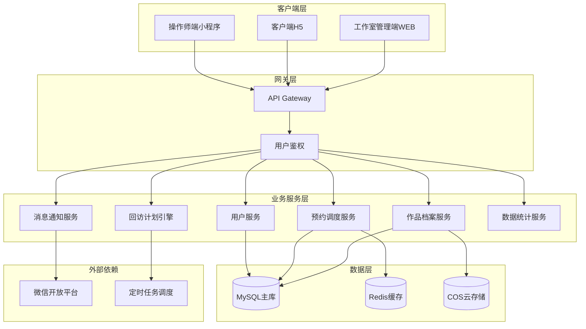

## 2.2 业务模块图

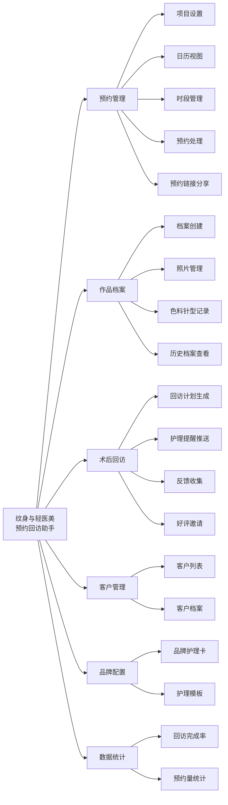

## 2.3 主业务流程

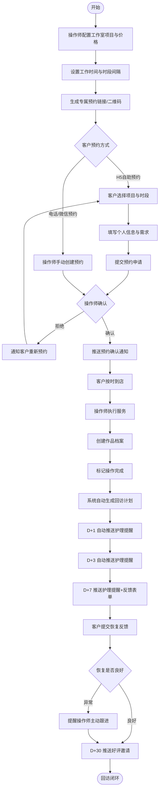

## 2.4 功能图/列表

### 2.4.1 操作师端（微信小程序）功能列表

| 功能模块 | 功能名称 | 优先级 | 功能描述 |
| --- | --- | --- | --- |
| 用户管理 | 微信授权登录 | P0 | 操作师通过微信授权快速登录 |
| 用户管理 | 个人资料维护 | P1 | 维护姓名、联系方式、擅长项目、作品展示 |
| 用户管理 | 加入/创建工作室 | P0 | 创建或加入工作室（邀请码） |
| 项目设置 | 项目类型配置 | P0 | 配置项目类型（纹身/补色/穿孔/纹眉等），设置时长和价格 |
| 预约管理 | 日历视图 | P0 | 日/周视图展示预约，时间块颜色区分项目类型 |
| 预约管理 | 今日预约概览 | P0 | 首页展示今日预约列表 |
| 预约管理 | 手动创建预约 | P0 | 为电话/微信预约客户手动创建 |
| 预约管理 | 处理客户预约 | P0 | 确认/拒绝/改期客户H5预约申请 |
| 预约管理 | 预约改期/取消 | P0 | 调整或取消已有预约 |
| 时段管理 | 工作日与工作时间设置 | P0 | 设置每周工作日、每日工作时间段 |
| 时段管理 | 时段间隔设置 | P1 | 设置最小预约间隔（如30分钟） |
| 客户管理 | 客户列表与搜索 | P0 | 查看所有客户，按姓名/手机号搜索 |
| 客户管理 | 客户基本信息 | P0 | 记录姓名、手机号、来源渠道等 |
| 作品档案 | 新建作品档案 | P0 | 每次操作后创建档案，关联客户、项目、日期 |
| 作品档案 | 作品照片上传 | P0 | 上传多张高清作品照片 |
| 作品档案 | 色料信息记录 | P0 | 记录色料品牌、色号、配比 |
| 作品档案 | 针型与参数记录 | P1 | 记录针型、深度、频率等参数 |
| 作品档案 | 操作备注 | P1 | 记录操作过程中的特殊情况 |
| 作品档案 | 客户作品历史 | P0 | 查看客户的所有作品档案 |
| 术后回访 | 自动生成回访计划 | P0 | 操作完成后自动生成D+1/D+3/D+7/D+30回访计划 |
| 术后回访 | 回访计划查看 | P0 | 查看所有进行中的回访计划 |
| 术后回访 | 护理内容配置 | P1 | 自定义各节点的护理提醒内容 |
| 术后回访 | 客户反馈查看 | P0 | 查看客户提交的恢复反馈和照片 |
| 术后回访 | 反馈异常标记 | P1 | 标记异常情况，触发主动跟进 |
| 预约分享 | 生成预约链接 | P0 | 生成H5专属预约链接 |
| 预约分享 | 预约二维码 | P1 | 生成二维码可打印张贴 |
| 预约分享 | 链接分享 | P0 | 通过微信分享给客户 |
| 消息通知 | 新预约/预约变更/客户反馈通知 | P0 | 接收各类业务通知 |

### 2.4.2 客户端（H5）功能列表

| 功能模块 | 功能名称 | 优先级 | 功能描述 |
| --- | --- | --- | --- |
| 用户访问 | 链接访问 | P0 | 通过H5链接直接进入预约页面 |
| 用户访问 | 微信授权登录 | P0 | 授权登录后关联预约记录和反馈 |
| 自助预约 | 工作室信息展示 | P0 | 展示工作室名称、地址、作品案例 |
| 自助预约 | 项目列表浏览 | P0 | 浏览项目类型、价格、预估时长 |
| 自助预约 | 日历选择日期 | P0 | 日历形式展示可预约日期 |
| 自助预约 | 时段选择 | P0 | 选择日期后展示可用时段 |
| 自助预约 | 信息填写 | P0 | 填写姓名、手机号、需求描述 |
| 自助预约 | 提交预约申请 | P0 | 确认后提交，等待操作师确认 |
| 自助预约 | 预约状态查看 | P0 | 查看预约状态：待确认/已确认/已取消 |
| 自助预约 | 预约取消/改期 | P1 | 在截止时间前取消或申请改期 |
| 术后护理 | 护理提醒接收 | P0 | 接收微信推送的术后护理提醒 |
| 术后护理 | 护理内容查看 | P0 | 在H5查看图文护理建议 |
| 术后护理 | 护理时间线 | P1 | 时间线形式展示已推送和待推送提醒 |
| 术后护理 | 恢复反馈表单 | P0 | 填写恢复情况评分、异常描述、文字反馈 |
| 术后护理 | 恢复照片上传 | P0 | 上传恢复阶段照片 |
| 术后护理 | 反馈历史查看 | P1 | 查看历史提交的所有反馈和照片 |
| 术后护理 | 好评引导 | P1 | 恢复良好时跳转至评价平台 |

### 2.4.3 工作室管理端（WEB）功能列表

| 功能模块 | 功能名称 | 优先级 | 功能描述 |
| --- | --- | --- | --- |
| 操作师管理 | 操作师列表 | P1 | 查看工作室下所有操作师 |
| 操作师管理 | 邀请操作师加入 | P1 | 生成邀请码或邀请链接 |
| 操作师管理 | 移除操作师 | P1 | 将操作师从工作室移除 |
| 品牌配置 | 品牌化护理卡配置 | P1 | 配置护理卡的Logo、品牌色、联系方式 |
| 品牌配置 | 护理模板管理 | P1 | 按项目类型配置不同的护理模板 |
| 数据统计 | 回访完成率统计 | P1 | 工作室整体/各操作师的回访完成率 |
| 数据统计 | 客户满意度统计 | P2 | 基于客户反馈的满意度趋势 |
| 数据统计 | 预约量统计 | P1 | 预约量趋势、项目占比、客户来源 |
| 版本套餐 | 当前版本查看 | P1 | 查看当前版本、到期时间、功能权限 |
| 版本套餐 | 版本升级 | P2 | 从免费版升级到工作室版 |

## 2.5 你的产品有哪些端

| 序号 | 端名称 | 端类型 | 目标用户 | 说明 |
| --- | --- | --- | --- | --- |
| 1 | 操作师端 | 小程序端 | 操作师/工作室主 | 微信小程序，日常预约管理、作品档案、回访跟进 |
| 2 | 客户端 | H5端（移动端） | C端客户 | 通过微信分享链接访问，自助预约、查看护理、提交反馈 |
| 3 | 工作室管理端 | WEB端 | 工作室管理员 | PC浏览器访问，团队管理、品牌配置、数据统计 |

---

# 3. 产品功能

## 3.1 操作师端（微信小程序）功能

### 3.1.1 微信授权登录

功能描述
操作师通过微信授权快速登录小程序，无需注册流程。首次登录时自动创建用户账号，引导加入或创建工作室。

优先级与依赖说明：
| 项 | 内容 |
| --- | --- |
| 优先级 | P0 |
| 依赖需求 | 无 |
| 前置条件 | 用户已安装微信 |

### 3.1.2 微信授权登录—详细流程

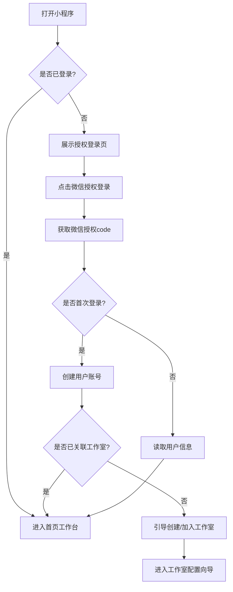

业务规则说明：
1. 微信授权失败时，提示用户检查微信版本或网络，允许重试
2. 首次登录必须完成工作室创建或加入（通过邀请码），否则无法使用核心功能
3. 用户信息（昵称、头像）从微信获取，可在个人资料中修改

### 3.1.3 微信授权登录—主要原型

[📱 登录授权页原型](assets/prototypes/artist-mp/login-widget.html)

验收标准说明：
- [ ] 正常流程：点击授权按钮后1秒内完成登录并跳转首页
- [ ] 异常流程：网络异常时显示"网络错误，请重试"提示
- [ ] 首次登录：引导创建/加入工作室的流程不超过3步

---

### 3.1.4 加入/创建工作室

功能描述
操作师可创建新工作室（成为管理员）或通过邀请码加入已有工作室。免费版支持1位操作师，工作室版支持不限操作师。

优先级与依赖说明：
| 项 | 内容 |
| --- | --- |
| 优先级 | P0 |
| 依赖需求 | 微信授权登录 |
| 前置条件 | 已完成微信授权登录 |

### 3.1.5 加入/创建工作室—详细流程

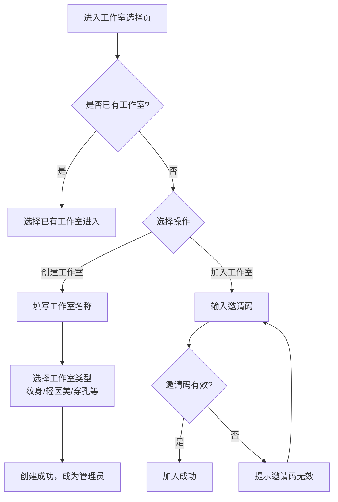

业务规则说明：
1. 每位操作师最多可加入3个工作室
2. 创建工作室时默认为免费版，可在管理端升级
3. 邀请码有效期30天，可被管理员重置

---

### 3.1.6 项目类型配置

功能描述
操作师配置工作室提供的项目类型（纹身/补色/穿孔/纹眉/美睫/皮肤管理等），每种项目可设置默认时长、价格区间、护理模板。

优先级与依赖说明：
| 项 | 内容 |
| --- | --- |
| 优先级 | P0 |
| 依赖需求 | 工作室已创建 |
| 前置条件 | 操作师已加入工作室 |

### 3.1.7 项目类型配置—详细流程

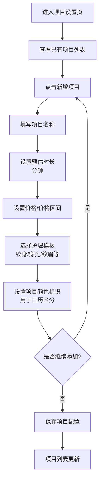

业务规则说明：
1. 系统预置常见项目模板（纹身/补色/穿孔/纹眉/美睫），可一键启用后修改
2. 每种项目必须设置时长（用于时段计算），价格可选填
3. 项目颜色标识用于日历视图区分，提供8种预设颜色
4. 最多可配置30种项目类型

### 3.1.8 项目类型配置—主要原型

[📱 项目配置页原型](assets/prototypes/artist-mp/project-config-widget.html)

验收标准说明：
- [ ] 正常流程：新增项目后在列表中立即可见
- [ ] 预置模板：一键启用预置项目模板，自动填充默认值
- [ ] 时长限制：项目时长范围15-480分钟

---

### 3.1.9 预约日历视图

功能描述
以日历形式展示预约安排，支持日视图和周视图切换。每个预约以时间块形式展示，显示客户姓名、项目类型、时间段，支持颜色区分项目类型。

优先级与依赖说明：
| 项 | 内容 |
| --- | --- |
| 优先级 | P0 |
| 依赖需求 | 项目类型配置、时段管理 |
| 前置条件 | 已配置项目和工作时间 |

### 3.1.10 预约日历视图—详细流程

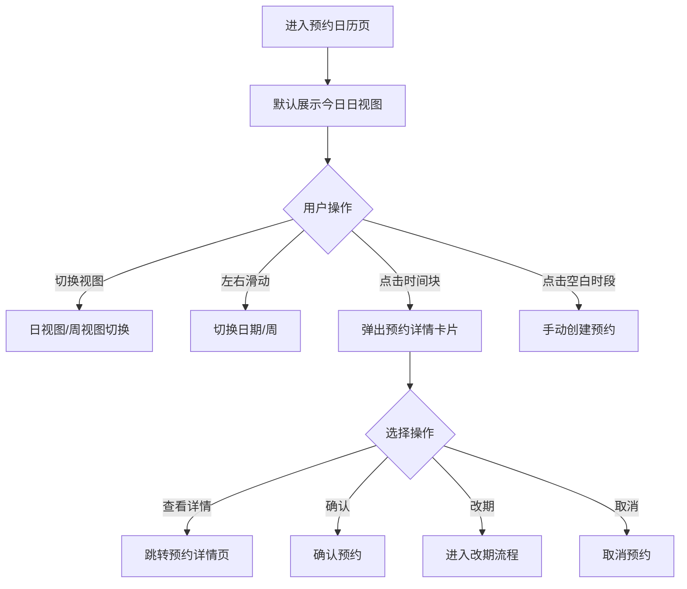

业务规则说明：
1. 日视图：展示当日0:00-24:00的预约时间块
2. 周视图：展示当周7天的预约概览，每日显示时间块摘要
3. 时间块颜色对应项目类型颜色标识
4. 时间块显示：客户姓名（脱敏）+ 项目名 + 时间段
5. 当前时间线：红色横线标记当前时间位置
6. 支持手势滑动切换日期/周

### 3.1.11 预约日历视图—主要原型

[📱 预约日历视图原型](assets/prototypes/artist-mp/calendar-widget.html)

验收标准说明：
- [ ] 正常流程：日历渲染时间≤1秒
- [ ] 日/周视图：切换流畅，数据一致
- [ ] 时间块：点击展开详情卡片，支持快速操作（确认/改期/取消）
- [ ] 当前时间线：准确显示当前时间位置

---

### 3.1.12 今日预约概览（首页）

功能描述
操作师端首页展示今日预约列表、待处理预约申请、进行中的回访任务等关键信息，快速了解当日工作安排。

优先级与依赖说明：
| 项 | 内容 |
| --- | --- |
| 优先级 | P0 |
| 依赖需求 | 预约管理模块 |
| 前置条件 | 已完成工作室配置 |

### 3.1.13 今日预约概览—详细流程

首页布局：
```
┌────────────────────────────────────┐
│  📅 今日预约（6）           [日历]  │
├────────────────────────────────────┤
│  🔔 待处理预约申请（2）             │
│  • 张女士 纹眉 14:00  [确认][拒绝] │
│  • 李先生 纹身 16:30  [确认][拒绝] │
├────────────────────────────────────┤
│  📋 今日预约列表                    │
│  ┌──────────────────────────────┐ │
│  │ 09:00-11:00  纹身  王女士    │ │
│  │ ✅ 已确认                    │ │
│  └──────────────────────────────┘ │
│  ┌──────────────────────────────┐ │
│  │ 14:00-15:00  补色  赵先生    │ │
│  │ ✅ 已确认                    │ │
│  └──────────────────────────────┘ │
├────────────────────────────────────┤
│  ⏰ 待回访客户（3）                 │
│  • 陈女士 纹身Day3 今天回访        │
│  • 刘女士 纹眉Day7 今天回访        │
└────────────────────────────────────┘
```

业务规则说明：
1. 首页最多展示5条待处理预约申请，超出点击"查看全部"
2. 今日预约按时间升序排列
3. 待回访客户展示今日需回访的随访任务
4. 下拉刷新获取最新数据

### 3.1.14 今日预约概览—主要原型

[📱 操作师首页工作台原型](assets/prototypes/artist-mp/home-widget.html)

验收标准说明：
- [ ] 正常流程：首页加载时间≤1秒
- [ ] 数据更新：下拉刷新后数据即时更新
- [ ] 快捷操作：待处理预约可直接在首页确认/拒绝

---

### 3.1.15 手动创建预约

功能描述
操作师为通过电话/微信预约的客户手动创建预约，填写客户信息、选择项目和时段。

优先级与依赖说明：
| 项 | 内容 |
| --- | --- |
| 优先级 | P0 |
| 依赖需求 | 项目类型配置、时段管理 |
| 前置条件 | 已配置项目和工作时间 |

### 3.1.16 手动创建预约—详细流程

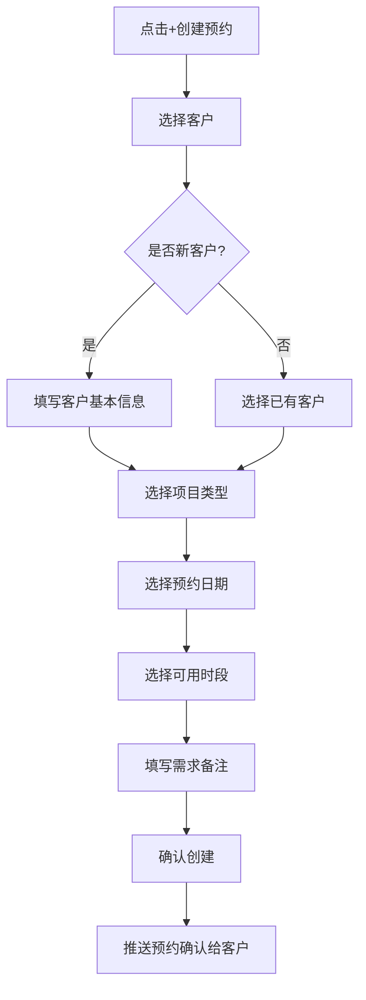

业务规则说明：
1. 客户手机号必填，用于推送预约确认
2. 时段选择时自动过滤已满时段
3. 若时段与已有预约冲突，提示冲突详情并阻止创建
4. 创建成功后自动推送确认通知给客户（若客户已关联微信）

### 3.1.17 手动创建预约—主要原型

[📱 手动创建预约原型](assets/prototypes/artist-mp/create-booking-widget.html)

验收标准说明：
- [ ] 正常流程：创建成功后日历视图立即可见新预约
- [ ] 冲突检测：时段冲突时阻止创建并提示
- [ ] 新客户：创建预约时自动新建客户档案

---

### 3.1.18 处理客户预约

功能描述
处理客户通过H5提交的预约申请，可确认、拒绝或提议改期。

优先级与依赖说明：
| 项 | 内容 |
| --- | --- |
| 优先级 | P0 |
| 依赖需求 | 客户H5预约功能 |
| 前置条件 | 客户已提交预约申请 |

### 3.1.19 处理客户预约—详细流程

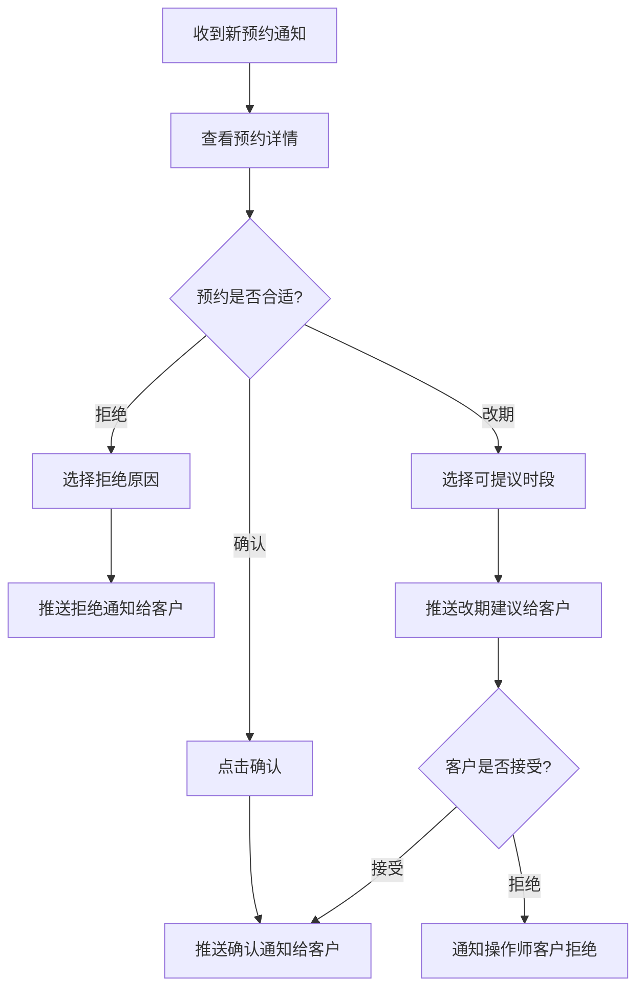

业务规则说明：
1. 客户提交预约后，操作师需在2小时内处理（超时自动提醒）
2. 拒绝时需选择原因：时段冲突/休息日/其他
3. 改期时需主动提供至少2个可选时段
4. 预约状态变更实时推送给客户

### 3.1.20 处理客户预约—主要原型

[📱 预约处理原型](assets/prototypes/artist-mp/handle-booking-widget.html)

验收标准说明：
- [ ] 正常流程：确认后客户即时收到通知
- [ ] 改期流程：至少提供2个可选时段
- [ ] 通知时效：状态变更后5秒内推送通知

---

### 3.1.21 客户作品档案创建

功能描述
每次操作完成后为客户创建作品档案，记录作品照片、使用色料品牌及色号、针型、操作参数（深度/频率等）、操作备注。

优先级与依赖说明：
| 项 | 内容 |
| --- | --- |
| 优先级 | P0 |
| 依赖需求 | 预约已完成、客户档案已建立 |
| 前置条件 | 操作已完成 |

### 3.1.22 客户作品档案创建—详细流程

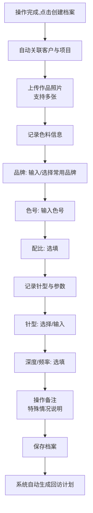

业务规则说明：
1. 作品照片至少上传1张，最多20张，单张最大20MB
2. 色料品牌和针型支持"常用列表"快速选择，减少重复输入
3. 操作完成标记后，系统自动生成D+1/D+3/D+7/D+30回访计划
4. 档案保存后支持追加补充（如术后照片）
5. 照片支持原图查看，自动压缩生成缩略图

### 3.1.23 客户作品档案创建—主要原型

[📱 作品档案创建原型](assets/prototypes/artist-mp/create-portfolio-widget.html)

验收标准说明：
- [ ] 正常流程：照片上传显示进度条，支持多张批量上传
- [ ] 色料常用列表：保存过的色料下次可快速选择
- [ ] 回访计划：档案保存后立即生成回访计划

---

### 3.1.24 术后回访计划查看

功能描述
查看所有进行中的回访计划列表，显示客户姓名、操作日期、当前回访进度、下次回访时间。

优先级与依赖说明：
| 项 | 内容 |
| --- | --- |
| 优先级 | P0 |
| 依赖需求 | 作品档案创建 |
| 前置条件 | 已有进行中的回访计划 |

### 3.1.25 术后回访计划查看—详细流程

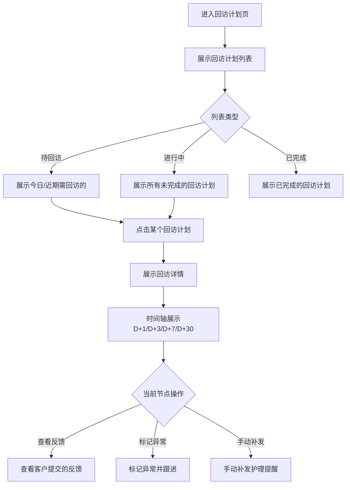

业务规则说明：
1. 回访计划按下次回访时间升序排列
2. 每个回访节点展示：计划推送时间、实际推送时间、客户反馈状态
3. 异常标记后，该计划置顶显示并标红
4. 回访完成率在顶部统计区域展示

### 3.1.26 术后回访计划查看—主要原型

[📱 回访计划列表原型](assets/prototypes/artist-mp/followup-plan-widget.html)

验收标准说明：
- [ ] 正常流程：回访计划列表加载时间≤1秒
- [ ] 时间轴：D+1/D+3/D+7/D+30各节点状态清晰可见
- [ ] 异常标记：标红置顶，操作师一目了然

---

### 3.1.27 客户反馈查看

功能描述
查看客户提交的恢复反馈和照片，按时间线展示。可标记异常（如感染、褪色严重等），触发主动跟进提醒。

优先级与依赖说明：
| 项 | 内容 |
| --- | --- |
| 优先级 | P0 |
| 依赖需求 | 客户提交反馈 |
| 前置条件 | 客户已提交反馈 |

### 3.1.28 客户反馈查看—详细流程

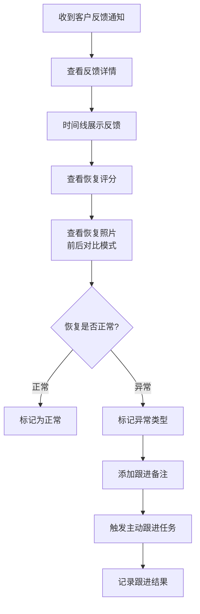

业务规则说明：
1. 恢复照片支持"操作完成照 vs 恢复照"对比模式
2. 异常类型包括：感染、褪色严重、过敏、增生、其他
3. 标记异常后，系统自动将该客户置顶到待跟进列表
4. 跟进结果记录后，异常状态可解除

### 3.1.29 客户反馈查看—主要原型

[📱 客户反馈查看原型](assets/prototypes/artist-mp/feedback-view-widget.html)

验收标准说明：
- [ ] 正常流程：反馈时间线按时间倒序展示
- [ ] 照片对比：支持左右滑动对比操作完成照和恢复照
- [ ] 异常标记：标记后客户置顶到待跟进列表

---

### 3.1.30 预约链接与分享

功能描述
生成工作室专属的H5预约链接和二维码，操作师可通过微信分享给客户或打印张贴在门店。

优先级与依赖说明：
| 项 | 内容 |
| --- | --- |
| 优先级 | P0 |
| 依赖需求 | 项目类型配置、时段管理 |
| 前置条件 | 工作室已配置项目和工作时间 |

### 3.1.31 预约链接与分享—主要原型

[📱 预约链接分享原型](assets/prototypes/artist-mp/share-link-widget.html)

验收标准说明：
- [ ] 正常流程：生成链接≤1秒
- [ ] 二维码：扫码后可直接进入H5预约页
- [ ] 微信分享：分享卡片展示工作室名称和Logo

---

## 3.2 客户端（H5）功能

### 3.2.1 工作室信息展示与项目浏览

功能描述
客户打开H5预约链接后，首先看到工作室名称、地址、营业时间、操作师简介、作品案例，以及项目列表（类型、价格区间、预估时长）。

优先级与依赖说明：
| 项 | 内容 |
| --- | --- |
| 优先级 | P0 |
| 依赖需求 | 工作室信息已配置 |
| 前置条件 | 客户已打开预约链接 |

### 3.2.2 工作室信息展示与项目浏览—详细流程

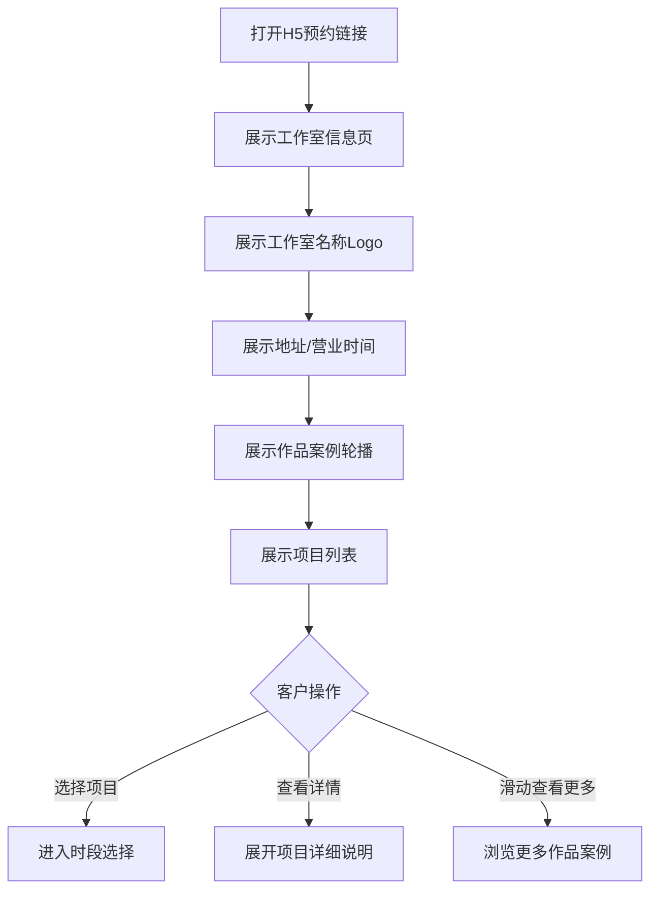

业务规则说明：
1. 工作室信息页需突出品牌元素（Logo、品牌色）
2. 作品案例最多展示12张，支持轮播
3. 项目列表按工作室配置的顺序展示
4. 每个项目卡片展示：项目名、价格、预估时长、"立即预约"按钮

### 3.2.3 工作室信息展示与项目浏览—主要原型

[📱 客户端H5工作室信息页原型](assets/prototypes/client-h5/studio-info-widget.html)

验收标准说明：
- [ ] 正常流程：页面加载时间≤2秒（4G网络）
- [ ] 作品案例：轮播流畅，支持手势滑动
- [ ] 项目卡片：点击"立即预约"直接进入时段选择

---

### 3.2.4 自助预约（时段选择与信息填写）

功能描述
客户选择项目后，进入日历选择日期、选择可用时段、填写个人信息和需求描述，最终提交预约申请。

优先级与依赖说明：
| 项 | 内容 |
| --- | --- |
| 优先级 | P0 |
| 依赖需求 | 项目类型配置、时段管理 |
| 前置条件 | 已选择项目类型 |

### 3.2.5 自助预约—详细流程

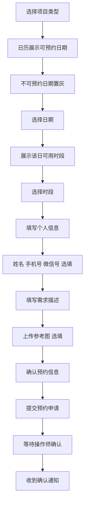

业务规则说明：
1. 手机号必填，用于接收预约确认通知
2. 时段根据项目时长自动计算，已预约时段置灰不可选
3. 需求描述最多500字，参考图最多3张
4. 提交后可在"我的预约"页查看状态
5. 预约提交后，操作师需在2小时内确认（超时自动提醒）

### 3.2.6 自助预约—主要原型

[📱 客户端自助预约原型](assets/prototypes/client-h5/booking-widget.html)

验收标准说明：
- [ ] 正常流程：提交预约后页面跳转到"预约成功"状态
- [ ] 时段计算：根据项目时长正确计算可用时段
- [ ] 冲突检测：已被预约的时段置灰不可选
- [ ] 表单验证：手机号格式错误时实时提示

---

### 3.2.7 术后护理提醒查看

功能描述
客户在H5页面查看详细的术后护理建议（图文形式，分节点展示），以及护理时间线（已推送和待推送的提醒）。

优先级与依赖说明：
| 项 | 内容 |
| --- | --- |
| 优先级 | P0 |
| 依赖需求 | 回访计划已生成 |
| 前置条件 | 客户已完成操作 |

### 3.2.8 术后护理提醒查看—主要原型

[📱 术后护理提醒页原型](assets/prototypes/client-h5/aftercare-widget.html)

验收标准说明：
- [ ] 正常流程：护理内容以图文卡片形式展示
- [ ] 时间线：清晰展示D+1/D+3/D+7/D+30各节点状态
- [ ] 护理内容：分项目类型展示不同护理建议

---

### 3.2.9 恢复反馈表单

功能描述
客户在术后D+7/D+30节点填写恢复反馈，包括恢复程度评分、是否有异常、文字描述、恢复照片上传。

优先级与依赖说明：
| 项 | 内容 |
| --- | --- |
| 优先级 | P0 |
| 依赖需求 | 回访计划到达D+7/D+30节点 |
| 前置条件 | 客户已收到反馈表单推送 |

### 3.2.10 恢复反馈表单—详细流程

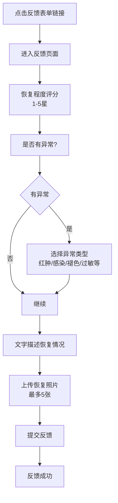

业务规则说明：
1. 恢复评分1-5星，1星表示恢复很差，5星表示恢复很好
2. 异常类型为多选：红肿、感染、褪色严重、过敏、增生、其他
3. 恢复照片最多5张，每张最大10MB
4. 提交后操作师即时收到通知
5. 同一回访节点可多次提交反馈（覆盖前一次）

### 3.2.11 恢复反馈表单—主要原型

[📱 恢复反馈表单原型](assets/prototypes/client-h5/feedback-form-widget.html)

验收标准说明：
- [ ] 正常流程：提交后操作师即时收到通知
- [ ] 照片上传：支持拍照和从相册选择
- [ ] 评分交互：星星评分直观易用
- [ ] 异常类型：选择异常后展开详细描述输入框

---

## 3.3 工作室管理端（WEB）功能

### 3.3.1 工作室管理后台首页（仪表盘）

功能描述
工作室管理员登录后看到的第一个页面，集中展示工作室运营关键指标：预约量趋势、回访完成率、客户满意度、操作师工作量。

优先级与依赖说明：
| 项 | 内容 |
| --- | --- |
| 优先级 | P1 |
| 依赖需求 | 各业务模块数据 |
| 前置条件 | 管理员已登录 |

### 3.3.2 工作室管理后台首页—详细流程

页面布局：
```
┌──────────────────────────────────────────────────────────────────┐
│  LOGO   纹身与轻医美回访助手    🔔 通知(3)   👤 管理员  ▾        │
├─────────┬────────────────────────────────────────────────────────┤
│         │                                                          │
│ 📊 工作台│  📅 2026年6月29日                                        │
│ 👥 团队  │                                                          │
│ 🎨 品牌  │  ┌────────┬────────┬────────┬────────┐                │
│ 📈 统计  │  │ 今日预约 │ 本周回访 │ 回访完成率│ 客户满意度│                │
│ ⚙️ 设置  │  │   12    │   28   │  85.6%  │  4.6/5  │                │
│ 💎 版本  │  └────────┴────────┴────────┴────────┘                │
│         │                                                          │
│         │  ┌────────────────────┐ ┌────────────────────┐        │
│         │  │ 📈 近30日预约趋势   │ │ 🎯 回访节点完成率  │        │
│         │  │ [折线图]           │ │ [柱状图]           │        │
│         │  │                    │ │ D+1:92% D+3:85%    │        │
│         │  │                    │ │ D+7:78% D+30:65%   │        │
│         │  └────────────────────┘ └────────────────────┘        │
│         │                                                          │
│         │  ┌──────────────────────────────────────────┐          │
│         │  │ 👥 操作师工作量排行                         │          │
│         │  │ 1. 李老师  预约45  回访完成率90%           │          │
│         │  │ 2. 王老师  预约38  回访完成率85%           │          │
│         │  └──────────────────────────────────────────┘          │
└─────────┴──────────────────────────────────────────────────────────┘
```

业务规则说明：
1. 仪表盘数据每小时更新一次
2. 回访完成率展示各节点（D+1/D+3/D+7/D+30）分别的完成率
3. 客户满意度基于客户反馈的恢复评分计算
4. 操作师排行按预约量降序排列

### 3.3.3 工作室管理后台首页—主要原型

[🖥️ 管理后台仪表盘原型](assets/prototypes/admin-web/dashboard-widget.html)

验收标准说明：
- [ ] 正常流程：仪表盘加载时间≤2秒
- [ ] 图表渲染：折线图/柱状图清晰可读
- [ ] 数据更新：点击刷新按钮更新数据

---

### 3.3.4 操作师团队管理

功能描述
管理员查看工作室下所有操作师列表，通过邀请码/邀请链接邀请新操作师加入，移除不再合作的操作师。

优先级与依赖说明：
| 项 | 内容 |
| --- | --- |
| 优先级 | P1 |
| 依赖需求 | 工作室已创建 |
| 前置条件 | 管理员已登录 |

### 3.3.5 操作师团队管理—详细流程

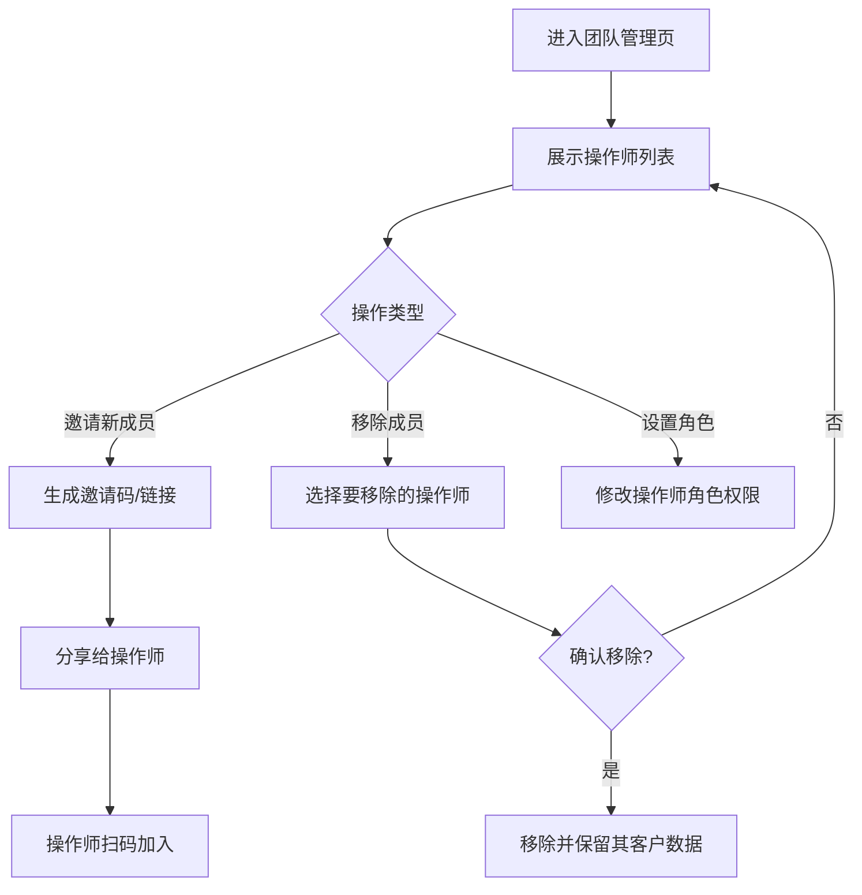

业务规则说明：
1. 免费版仅支持1位操作师（即管理员本人）
2. 工作室版不限操作师数量
3. 移除操作师时，其客户数据保留在工作室但不再关联该操作师
4. 邀请码有效期30天，可被管理员重置

### 3.3.6 操作师团队管理—主要原型

[🖥️ 操作师团队管理原型](assets/prototypes/admin-web/team-management-widget.html)

验收标准说明：
- [ ] 正常流程：操作师列表展示完整信息
- [ ] 邀请功能：生成邀请码≤1秒
- [ ] 移除操作：二次确认弹窗，防止误操作

---

### 3.3.7 品牌化术后护理卡配置

功能描述
工作室版功能：配置术后护理卡的展示样式，包括工作室Logo、品牌色、联系方式、自定义护理建议内容。

优先级与依赖说明：
| 项 | 内容 |
| --- | --- |
| 优先级 | P1（工作室版） |
| 依赖需求 | 工作室已升级为工作室版 |
| 前置条件 | 管理员已登录 |

### 3.3.8 品牌化术后护理卡配置—详细流程

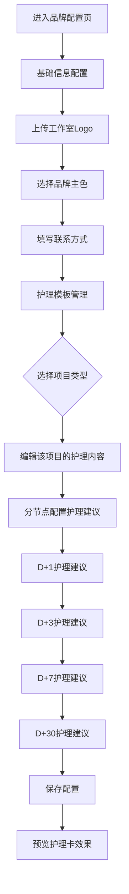

业务规则说明：
1. Logo支持PNG/JPG格式，建议尺寸200x200px
2. 品牌色提供8种预设色+自定义色值输入
3. 每个项目类型可配置独立的护理模板
4. 护理内容支持图文混排
5. 配置完成后，客户端H5护理页立即生效

### 3.3.9 品牌化术后护理卡配置—主要原型

[🖥️ 品牌护理卡配置原型](assets/prototypes/admin-web/brand-config-widget.html)

验收标准说明：
- [ ] 正常流程：配置保存后客户端即时生效
- [ ] 预览功能：实时预览护理卡效果
- [ ] 模板切换：不同项目类型的护理模板独立管理

---

### 3.3.10 回访完成率统计

功能描述
统计工作室整体的回访完成率、各操作师的回访完成率、各回访节点（D+1/D+3/D+7/D+30）的完成率。

优先级与依赖说明：
| 项 | 内容 |
| --- | --- |
| 优先级 | P1 |
| 依赖需求 | 回访计划执行数据 |
| 前置条件 | 已产生回访数据 |

### 3.3.11 回访完成率统计—详细流程

页面布局：
```
┌──────────────────────────────────────────────────────────────────┐
│ 📈 回访完成率统计                                                  │
├──────────────────────────────────────────────────────────────────┤
│  时间范围: [最近30天 ▾]   操作师: [全部 ▾]                         │
├──────────────────────────────────────────────────────────────────┤
│                                                                    │
│  ┌──────────────────────────────────────────────────────────┐   │
│  │ 🎯 各回访节点完成率                                         │   │
│  │                                                           │   │
│  │  D+1  ████████████████████░░░░  92%                      │   │
│  │  D+3  █████████████████░░░░░░░  85%                      │   │
│  │  D+7  ███████████████░░░░░░░░░  78%                      │   │
│  │  D+30 █████████████░░░░░░░░░░░  65%                      │   │
│  └──────────────────────────────────────────────────────────┘   │
│                                                                    │
│  ┌──────────────────────────────────────────────────────────┐   │
│  │ 👥 各操作师回访完成率                                       │   │
│  │  操作师      回访总数   D+1   D+3   D+7   D+30  总完成率   │   │
│  │  李老师       45      95%   88%   82%   70%    83.8%     │   │
│  │  王老师       38      90%   83%   75%   60%    77.0%     │   │
│  └──────────────────────────────────────────────────────────┘   │
│                                                                    │
└──────────────────────────────────────────────────────────────────┘
```

业务规则说明：
1. 回访完成率 = 实际推送数 / 应推送数 × 100%
2. 支持按时间范围筛选：今日/本周/本月/最近30天/自定义
3. 支持按操作师筛选
4. 数据每小时更新一次

### 3.3.12 回访完成率统计—主要原型

[🖥️ 回访完成率统计原型](assets/prototypes/admin-web/followup-stats-widget.html)

验收标准说明：
- [ ] 正常流程：统计数据加载时间≤2秒
- [ ] 图表展示：柱状图清晰展示各节点完成率
- [ ] 筛选功能：时间范围和操作师筛选即时生效

---

# 4. 产品原型

## 4.1 页面跳转逻辑图

### 操作师端（小程序）页面跳转
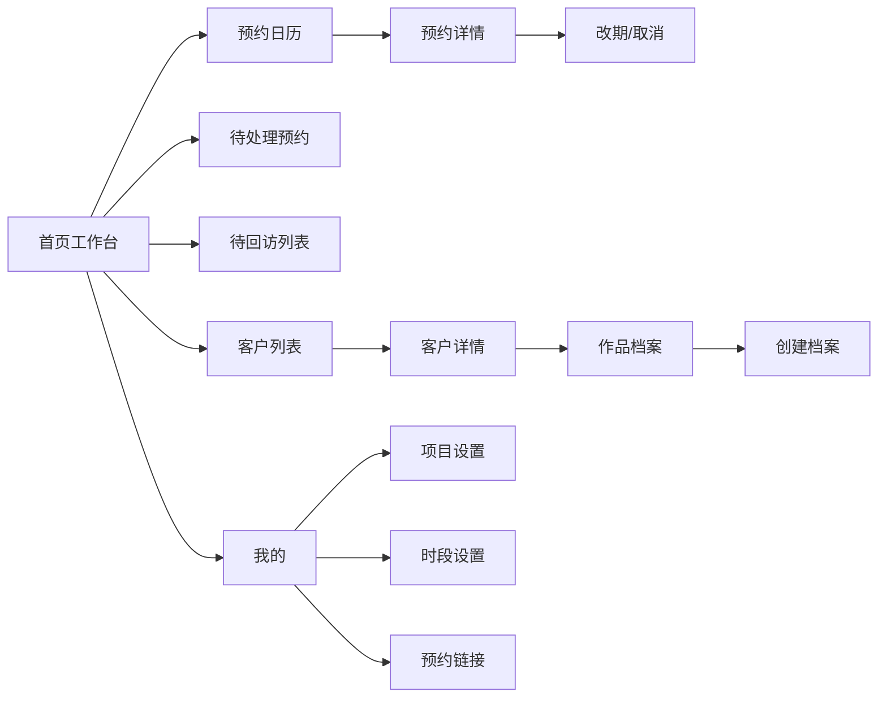

### 客户端（H5）页面跳转
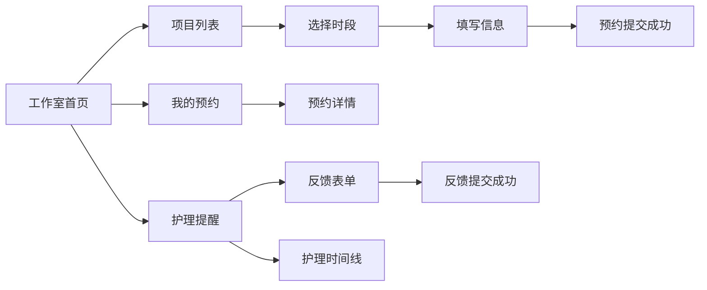

### 工作室管理端（WEB）页面跳转
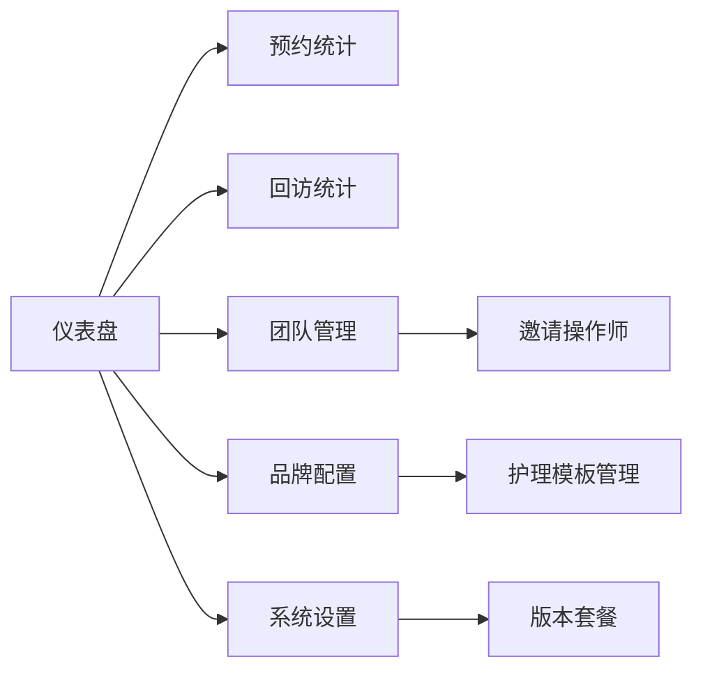

## 4.2 全站点原型设计

### 4.2.1 操作师端（小程序）

**页面清单：**

| 序号 | 页面名称 | 所属模块 | 页面描述 | 关键元素 |
| --- | --- | --- | --- | --- |
| 1 | 登录授权页 | 用户管理 | 微信授权登录入口 | 授权按钮、服务协议勾选 |
| 2 | 工作室选择页 | 用户管理 | 创建/加入工作室 | 创建按钮、邀请码输入框 |
| 3 | 首页工作台 | 预约管理 | 今日工作概览 | 今日预约列表、待处理预约、待回访客户 |
| 4 | 预约日历页 | 预约管理 | 日/周视图展示预约 | 日历、时间块、视图切换 |
| 5 | 预约详情页 | 预约管理 | 单个预约详细信息 | 客户信息、项目信息、操作按钮 |
| 6 | 创建预约页 | 预约管理 | 手动为客户创建预约 | 客户选择、项目选择、时段选择 |
| 7 | 项目设置页 | 项目设置 | 配置项目类型与价格 | 项目列表、新增按钮、价格输入 |
| 8 | 客户列表页 | 客户管理 | 查看所有客户 | 搜索框、客户列表 |
| 9 | 客户详情页 | 客户管理 | 单个客户完整信息 | 基本信息、作品历史、回访记录 |
| 10 | 作品档案创建页 | 作品档案 | 创建新的作品档案 | 照片上传、色料记录、针型参数 |
| 11 | 回访计划列表页 | 术后回访 | 查看所有回访计划 | 时间轴、回访节点状态 |
| 12 | 客户反馈详情页 | 术后回访 | 查看客户提交的反馈 | 反馈时间线、照片对比 |
| 13 | 预约链接页 | 预约分享 | 生成与分享预约链接 | 链接复制、二维码、微信分享 |
| 14 | 个人资料页 | 用户管理 | 编辑个人信息与工作室设置 | 头像、昵称、工作室信息 |

**交互说明：**
- 页面跳转关系：见上方跳转逻辑图
- 特殊交互：
  1. 日历视图支持手势左右滑动切换日期/周
  2. 时间块点击弹出详情卡片（半屏弹窗）
  3. 下拉刷新各列表页数据
  4. 照片上传支持拍照和从相册选择，显示上传进度
  5. 反馈照片支持"操作完成照 vs 恢复照"左右对比模式

**产品原型：**

[📱 打开操作师端小程序全站点原型](assets/prototypes/artist-mp-prototype.html)

### 4.2.2 客户端（H5）

**页面清单：**

| 序号 | 页面名称 | 所属模块 | 页面描述 | 关键元素 |
| --- | --- | --- | --- | --- |
| 1 | 工作室首页 | 自助预约 | 展示工作室信息与作品 | 工作室信息、作品轮播、项目列表 |
| 2 | 项目时段选择页 | 自助预约 | 选择日期和时段 | 日历、时段列表 |
| 3 | 预约信息填写页 | 自助预约 | 填写个人信息与需求 | 姓名、手机号、需求描述 |
| 4 | 预约成功页 | 自助预约 | 预约提交成功展示 | 预约信息、等待确认提示 |
| 5 | 我的预约页 | 自助预约 | 查看历史预约列表 | 预约列表、状态标签 |
| 6 | 预约详情页 | 自助预约 | 单个预约详情 | 预约信息、操作按钮 |
| 7 | 护理提醒首页 | 术后护理 | 术后护理建议展示 | 护理卡片、时间线 |
| 8 | 反馈表单页 | 术后护理 | 提交恢复反馈 | 评分、异常选择、照片上传 |
| 9 | 反馈历史页 | 术后护理 | 查看历史反馈 | 反馈时间线、照片 |
| 10 | 好评引导页 | 术后护理 | 邀请客户留好评 | 评价平台链接、感谢文案 |

**交互说明：**
- 页面跳转关系：见上方跳转逻辑图
- 特殊交互：
  1. 作品案例轮播支持手势滑动
  2. 日历选择时不可预约日期置灰
  3. 照片上传支持拍照和从相册选择
  4. 星星评分支持点击和滑动
  5. 护理时间线展示各节点状态（已推送/待推送/已反馈）

**产品原型：**

[📱 打开客户端H5全站点原型](assets/prototypes/client-h5-prototype.html)

### 4.2.3 工作室管理端（WEB）

**页面清单：**

| 序号 | 页面名称 | 所属模块 | 页面描述 | 关键元素 |
| --- | --- | --- | --- | --- |
| 1 | 仪表盘 | 工作台 | 运营数据总览 | 统计卡片、折线图、柱状图 |
| 2 | 操作师列表页 | 团队管理 | 查看与管理操作师 | 操作师列表、邀请按钮 |
| 3 | 邀请操作师页 | 团队管理 | 生成邀请码与链接 | 邀请码、二维码、复制按钮 |
| 4 | 品牌配置页 | 品牌配置 | 配置护理卡样式 | Logo上传、品牌色、联系方式 |
| 5 | 护理模板管理页 | 品牌配置 | 按项目管理护理内容 | 项目列表、模板编辑器 |
| 6 | 回访统计页 | 数据统计 | 回访完成率分析 | 柱状图、数据表格 |
| 7 | 预约统计页 | 数据统计 | 预约量与趋势分析 | 折线图、项目占比饼图 |
| 8 | 版本套餐页 | 版本套餐 | 查看与升级版本 | 当前版本信息、升级按钮 |
| 9 | 系统设置页 | 系统设置 | 工作室基础设置 | 工作室信息、通知设置 |

**交互说明：**
- 页面跳转关系：见上方跳转逻辑图
- 特殊交互：
  1. 侧边栏导航，支持折叠展开
  2. 数据图表支持hover展示详细数值
  3. 表格支持排序和筛选
  4. 表单编辑支持实时预览
  5. 时间范围选择器支持快捷选项和自定义

**产品原型：**

[🖥️ 打开工作室管理端WEB全站点原型](assets/prototypes/admin-web-prototype.html)

---

# 5. 数据需求

## 5.1 数据使用规格

### 5.1.1 客户数据

| 字段 | 是否必填 | 描述 | 数据类型 |
| --- | --- | --- | --- |
| client_id | 是 | 客户唯一标识 | UUID |
| name | 是 | 客户姓名 | 字符串 |
| phone | 是 | 手机号 | 字符串 |
| wechat_id | 否 | 微信号 | 字符串 |
| openid | 否 | 微信openid | 字符串 |
| gender | 否 | 性别 | 枚举 |
| birthday | 否 | 生日 | 日期 |
| source | 否 | 来源渠道 | 字符串 |
| tags | 否 | 客户标签 | 字符串数组 |
| studio_id | 是 | 所属工作室 | UUID |
| created_at | 是 | 创建时间 | 时间戳 |

### 5.1.2 预约数据

| 字段 | 是否必填 | 描述 | 数据类型 |
| --- | --- | --- | --- |
| booking_id | 是 | 预约唯一标识 | UUID |
| client_id | 是 | 关联客户 | UUID |
| artist_id | 是 | 关联操作师 | UUID |
| project_id | 是 | 关联项目类型 | UUID |
| booking_date | 是 | 预约日期 | 日期 |
| start_time | 是 | 开始时间 | 时间 |
| end_time | 是 | 结束时间 | 时间 |
| status | 是 | 预约状态 | 枚举（待确认/已确认/已拒绝/已改期/已取消/已完成） |
| customer_request | 否 | 客户需求描述 | 文本 |
| reference_images | 否 | 参考图片URL | 字符串数组 |
| cancel_reason | 否 | 取消原因 | 字符串 |
| created_at | 是 | 创建时间 | 时间戳 |
| updated_at | 是 | 更新时间 | 时间戳 |

### 5.1.3 作品档案数据

| 字段 | 是否必填 | 描述 | 数据类型 |
| --- | --- | --- | --- |
| portfolio_id | 是 | 档案唯一标识 | UUID |
| booking_id | 是 | 关联预约 | UUID |
| client_id | 是 | 关联客户 | UUID |
| artist_id | 是 | 关联操作师 | UUID |
| project_id | 是 | 关联项目类型 | UUID |
| operate_date | 是 | 操作日期 | 日期 |
| photos | 是 | 作品照片URL | 字符串数组 |
| ink_brand | 否 | 色料品牌 | 字符串 |
| ink_color | 否 | 色号 | 字符串 |
| ink_ratio | 否 | 配比 | 字符串 |
| needle_type | 否 | 针型 | 字符串 |
| depth | 否 | 操作深度 | 数字 |
| frequency | 否 | 操作频率 | 数字 |
| duration_minutes | 否 | 操作时长 | 数字 |
| notes | 否 | 操作备注 | 文本 |
| status | 是 | 档案状态 | 枚举（草稿/已完成） |
| created_at | 是 | 创建时间 | 时间戳 |

### 5.1.4 回访计划数据

| 字段 | 是否必填 | 描述 | 数据类型 |
| --- | --- | --- | --- |
| plan_id | 是 | 回访计划唯一标识 | UUID |
| portfolio_id | 是 | 关联作品档案 | UUID |
| client_id | 是 | 关联客户 | UUID |
| artist_id | 是 | 关联操作师 | UUID |
| status | 是 | 计划状态 | 枚举（进行中/已完成/已中止） |
| d1_sent_at | 否 | D+1推送时间 | 时间戳 |
| d3_sent_at | 否 | D+3推送时间 | 时间戳 |
| d7_sent_at | 否 | D+7推送时间 | 时间戳 |
| d30_sent_at | 否 | D+30推送时间 | 时间戳 |
| completed_at | 否 | 完成时间 | 时间戳 |
| created_at | 是 | 创建时间 | 时间戳 |

### 5.1.5 客户反馈数据

| 字段 | 是否必填 | 描述 | 数据类型 |
| --- | --- | --- | --- |
| feedback_id | 是 | 反馈唯一标识 | UUID |
| plan_id | 是 | 关联回访计划 | UUID |
| client_id | 是 | 关联客户 | UUID |
| node_type | 是 | 回访节点（D+1/D+3/D+7/D+30） | 字符串 |
| recovery_score | 是 | 恢复评分（1-5星） | 数字 |
| has_abnormal | 是 | 是否有异常 | 布尔 |
| abnormal_types | 否 | 异常类型列表 | 字符串数组 |
| description | 否 | 文字描述 | 文本 |
| photos | 否 | 恢复照片URL | 字符串数组 |
| artist_remark | 否 | 操作师备注 | 文本 |
| is_abnormal_marked | 否 | 是否被标记异常 | 布尔 |
| created_at | 是 | 创建时间 | 时间戳 |

## 5.2 统计数据

1. 统计各回访节点（D+1/D+3/D+7/D+30）的完成率，按工作室、按操作师维度（P1）
2. 统计预约量趋势，按日/周/月维度（P1）
3. 统计各项目类型的预约占比（P1）
4. 统计客户满意度趋势（基于反馈评分）（P2）
5. 统计爽约率（P2）

## 5.3 埋点需求

| 页面 | 事件 | 采集字段 | 说明 |
| --- | --- | --- | --- |
| 工作室首页 | page_view | studio_id, source | 统计首页访问量与来源 |
| 预约提交 | booking_submit | project_type, studio_id | 统计预约转化 |
| 反馈提交 | feedback_submit | node_type, recovery_score | 统计反馈率与恢复情况 |
| 护理页访问 | aftercare_view | plan_id, node_type | 统计护理内容查看率 |
| 好评点击 | review_click | platform, studio_id | 统计好评转化率 |

---

# 6. 非功能需求

## 6.1 使用界面

| 需求项 | 描述 |
| --- | --- |
| 操作师端界面风格 | 专业简洁、操作高效，适合手艺从业者使用；大按钮、高对比度，支持单手操作场景 |
| 客户端界面风格 | 温馨专业、突出信任感；预约页面展示工作室品牌元素和作品案例，护理页面以图文卡片形式展示 |
| 日历交互 | 日历视图需支持手势滑动切换日期/周，时间块支持点击查看详情和快速操作 |
| 照片展示 | 作品档案照片支持高清原图查看，客户端恢复照片支持前后对比模式 |
| 离线可用 | 操作师端在弱网环境下支持本地暂存作品档案，联网后自动同步 |

## 6.2 性能指标

| 编号 | 项目 | 最大延迟 | 平均延迟 | 优先级 | 备注 |
| --- | --- | --- | --- | --- | --- |
| 0001 | 预约页面加载 | <2秒 | <1秒 | 高 | 4G网络环境 |
| 0002 | 护理提醒页面加载 | <2秒 | <1秒 | 高 | 4G网络环境 |
| 0003 | 照片上传（20MB） | <10秒 | <5秒 | 中 | 显示上传进度 |
| 0004 | 日历视图切换 | <1秒 | <0.5秒 | 高 | 支持30天数据 |
| 0005 | 消息推送到达 | <5分钟 | <1分钟 | 高 | 设定时间点±5分钟 |
| 0006 | 数据同步（档案→客户端） | <30秒 | <10秒 | 中 | 作品档案保存后 |

| 编号 | 项 | 吞吐量 | 备注 |
| --- | --- | --- | --- |
| 0001 | 预约提交 | 每分钟100次 | MVP阶段 |
| 0002 | 照片上传 | 每分钟50次 | 并发上传 |

| 编号 | 项 | 容量 | 备注 |
| --- | --- | --- | --- |
| 0001 | MVP阶段并发用户 | ≤300 | 操作师+客户 |
| 0002 | 免费版客户数 | ≤50/工作室 | 免费版限制 |
| 0003 | 工作室版客户数 | 不限 | 付费版 |

## 6.3 安全与合规

| 编号 | 项 |
| --- | --- |
| 0001 | 客户手机号等敏感信息传输采用HTTPS加密 |
| 0002 | 客户照片存储加密，访问需鉴权 |
| 0003 | 操作师只能查看自己工作室的客户数据 |
| 0004 | 遵循微信开放平台开发规范 |
| 0005 | 不提供医疗诊断功能，客户异常反馈仅作记录与提醒 |

---

# 7. 技术架构

## 7.1 技术选型建议

| 层次 | 技术选型 | 说明 |
| --- | --- | --- |
| 操作师端 | 微信小程序原生 / uni-app | 快速开发，跨平台兼容 |
| 客户端 | H5（Vue 3 + Vant 4） | 移动端H5，微信内访问 |
| 工作室管理端 | Vue 3 + Element Plus | PC端管理后台 |
| 后端服务 | Node.js (Nest.js) / Go | 高并发、易维护 |
| 数据库 | MySQL 8.0 | 关系型数据存储 |
| 缓存 | Redis | 会话管理、热点数据 |
| 云存储 | 腾讯云COS / 阿里云OSS | 照片存储与CDN加速 |
| 定时任务 | node-cron / 阿里云函数计算 | 回访节点定时触发 |
| 消息推送 | 微信订阅消息API | 护理提醒推送 |

## 7.2 系统架构图

```
┌─────────────────────────────────────────────────────────────────┐
│                        客户端层                                   │
│  ┌──────────────┐  ┌──────────────┐  ┌──────────────┐          │
│  │ 操作师小程序   │  │ 客户端H5     │  │ 管理端WEB    │          │
│  └──────┬───────┘  └──────┬───────┘  └──────┬───────┘          │
└─────────┼──────────────────┼──────────────────┼─────────────────┘
          │                  │                  │
          └──────────────────┼──────────────────┘
                             ▼
┌─────────────────────────────────────────────────────────────────┐
│  API Gateway (Kong / 自研)                                       │
│  - 路由转发  - 限流  - 鉴权  - 日志                              │
└─────────────────────────┬───────────────────────────────────────┘
                          │
┌─────────────────────────┼───────────────────────────────────────┐
│                         ▼                                         │
│                    业务服务层                                       │
│  ┌──────────┐ ┌──────────┐ ┌──────────┐ ┌──────────┐           │
│  │用户服务   │ │预约服务   │ │档案服务   │ │回访引擎   │           │
│  └──────────┘ └──────────┘ └──────────┘ └──────────┘           │
│  ┌──────────┐ ┌──────────┐                                      │
│  │通知服务   │ │统计服务   │                                      │
│  └──────────┘ └──────────┘                                      │
└─────────────────────────┬───────────────────────────────────────┘
                          │
┌─────────────────────────┼───────────────────────────────────────┐
│                         ▼                                         │
│                      数据层                                        │
│  ┌──────────┐ ┌──────────┐ ┌──────────┐ ┌──────────┐           │
│  │  MySQL   │ │  Redis   │ │  COS     │ │ 定时调度  │           │
│  └──────────┘ └──────────┘ └──────────┘ └──────────┘           │
└─────────────────────────────────────────────────────────────────┘
```

---

# 8. 数据模型

## 8.1 核心数据实体

```
┌─────────────┐       ┌─────────────┐       ┌─────────────┐
│   Studio    │       │    User     │       │   Project   │
├─────────────┤       ├─────────────┤       ├─────────────┤
│ id (PK)     │       │ id (PK)     │       │ id (PK)     │
│ name        │       │ name        │       │ name        │
│ logo_url    │       │ phone       │       │ duration    │
│ brand_color │       │ openid      │       │ price_range │
│ address     │       │ avatar_url  │       │ color_tag   │
│ biz_hours   │       │ role        │       │ studio_id   │
│ invite_code │       │ studio_id   │       │ care_template│
│ plan_type   │       │ joined_at   │       └─────────────┘
│ plan_expire │       └─────────────┘
└─────────────┘
       │
       │ 1:N
       ▼
┌─────────────┐       ┌─────────────┐
│   Client    │       │  Booking    │
├─────────────┤       ├─────────────┤
│ id (PK)     │◄──────│ client_id   │
│ name        │       │ id (PK)     │
│ phone       │       │ artist_id   │
│ wechat_id   │       │ project_id  │
│ openid      │       │ booking_date│
│ studio_id   │       │ start_time  │
└─────────────┘       │ end_time    │
       │              │ status      │
       │ 1:N          │ customer_req│
       ▼              └─────────────┘
┌─────────────┐              │
│  Portfolio  │              │ 1:1
├─────────────┤              ▼
│ id (PK)     │       ┌─────────────┐
│ booking_id  │       │ FollowupPlan│
│ client_id   │       ├─────────────┤
│ artist_id   │       │ id (PK)     │
│ project_id  │       │ portfolio_id│
│ operate_date│       │ status      │
│ photos      │       │ d1_sent_at  │
│ ink_brand   │       │ d3_sent_at  │
│ ink_color   │       │ d7_sent_at  │
│ needle_type │       │ d30_sent_at │
│ notes       │       └─────────────┘
└─────────────┘              │
                             │ 1:N
                             ▼
                      ┌─────────────┐
                      │  Feedback   │
                      ├─────────────┤
                      │ id (PK)     │
                      │ plan_id     │
                      │ node_type   │
                      │ score       │
                      │ has_abnormal│
                      │ photos      │
                      └─────────────┘
```

## 8.2 核心数据关系

| 关系 | 类型 | 说明 |
| --- | --- | --- |
| Studio - User | 1:N | 一个工作室有多个操作师 |
| Studio - Client | 1:N | 一个工作室有多个客户 |
| Studio - Project | 1:N | 一个工作室有多个项目类型 |
| Client - Booking | 1:N | 一个客户有多个预约 |
| Booking - Portfolio | 1:1 | 一个预约完成后创建一个作品档案 |
| Portfolio - FollowupPlan | 1:1 | 一个作品档案对应一个回访计划 |
| FollowupPlan - Feedback | 1:N | 一个回访计划可收到多次反馈（D+7/D+30） |

---

# 9. 发布计划

## 9.1 MVP 阶段（第1周）

| 天数 | 开发内容 | 交付物 |
| --- | --- | --- |
| Day 1 | 用户登录、工作室创建/加入、基础数据模型 | 基础框架搭建完成 |
| Day 2 | 项目类型配置、时段管理 | 可配置项目和时段 |
| Day 3 | 预约日历视图、手动创建预约 | 预约核心功能可用 |
| Day 4 | 客户H5预约页、预约处理流程 | 客户可自助预约 |
| Day 5 | 作品档案创建、照片上传 | 作品档案功能可用 |
| Day 6 | 回访计划自动生成、护理提醒推送 | 术后回访核心链路 |
| Day 7 | 客户反馈表单、预约链接分享 | MVP版本上线 |

## 9.2 迭代阶段（第2-3周）

| 周次 | 功能迭代 |
| --- | --- |
| 第2周 | 护理内容自定义配置、客户标签、操作师手动补发提醒 |
| 第3周 | 预约二维码、反馈异常标记、主动跟进流程 |

## 9.3 商业化阶段（第4周+）

| 周次 | 功能迭代 |
| --- | --- |
| 第4周 | 工作室管理端WEB（团队管理、品牌护理卡配置） |
| 第5周 | 数据统计（回访完成率、预约量统计） |
| 第6周 | 版本升级与支付、好评邀请流程 |

---

# 10. 商业化设计

## 10.1 定价策略

| 版本 | 价格 | 功能权限 |
| --- | --- | --- |
| **免费版** | ¥0/月 | 1位操作师、50位客户、基础预约管理、基础作品档案、基础术后回访 |
| **工作室版** | ¥69/月 | 不限操作师和客户、品牌化术后护理卡、微信通知、回访统计、数据看板 |

## 10.2 增值服务

| 服务 | 价格 | 说明 |
| --- | --- | --- |
| 品牌护理卡定制 | ¥199/次 | 由平台设计师定制专属护理卡样式 |
| 数据导出 | ¥9/月 | 导出客户数据、回访数据为Excel |

## 10.3 商业化路径

1. **免费获客**：通过免费版吸引小型工作室和独立操作师
2. **功能升级**：当工作室需要多操作师协作或品牌化护理卡时，引导升级
3. **口碑裂变**：客户端H5页面展示工作室品牌，形成口碑传播
4. **垂直深耕**：针对纹身、轻医美不同细分行业，提供行业化护理模板

---

# 11. 风险与对策

| 风险 | 等级 | 对策 |
| --- | --- | --- |
| 微信订阅消息需用户主动订阅，到达率受限 | 高 | 引导用户订阅+模板消息备选通道 |
| 照片存储成本高 | 中 | 自动压缩+原图可选+CDN加速 |
| 小型工作室付费意愿低 | 中 | 免费版功能足够用+工作室版突出差异化价值 |
| 操作师IT能力有限 | 中 | 极简操作流程+新手引导+客服支持 |
| 医疗纠纷风险 | 高 | 明确"非医疗诊断"定位+异常反馈引导就医 |

---

# 附录 A：术语表

| 术语 | 说明 |
| --- | --- |
| D+1/D+3/D+7/D+30 | 操作完成后第1/3/7/30天 |
| MVP | Minimum Viable Product，最小可行产品 |
| H5 | 移动端HTML5页面 |
| 色料 | 纹身/纹眉使用的颜料 |
| 针型 | 纹身/纹眉使用的针具规格 |
| 护理卡 | 术后护理页面，展示护理建议 |
| 回访完成率 | 实际推送的回访数 / 应推送的回访数 |

---

# 附录 B：关联文档

| 文档 | 说明 |
| --- | --- |
| [需求文档](需求文档.md) | 本产品的用户需求文档 |
| [产品文档](产品文档.md) | 本PRD文档 |
| 操作师端小程序全站点原型 | assets/prototypes/artist-mp-prototype.html |
| 客户端H5全站点原型 | assets/prototypes/client-h5-prototype.html |
| 工作室管理端WEB全站点原型 | assets/prototypes/admin-web-prototype.html |
