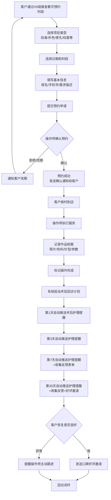
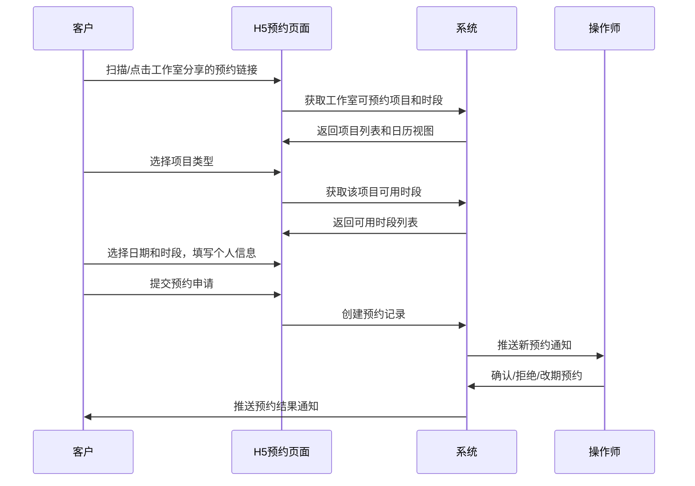
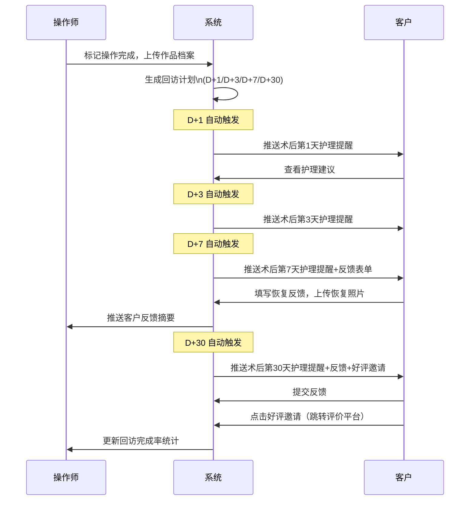
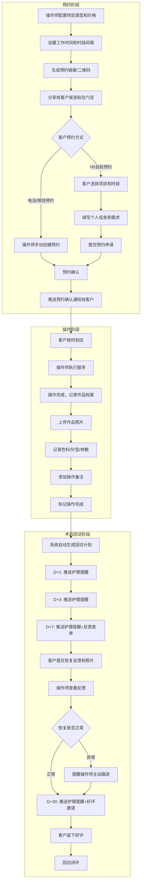
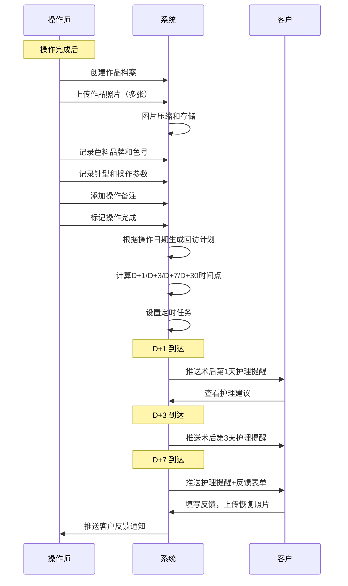
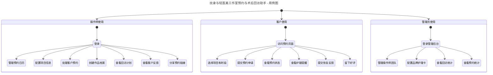
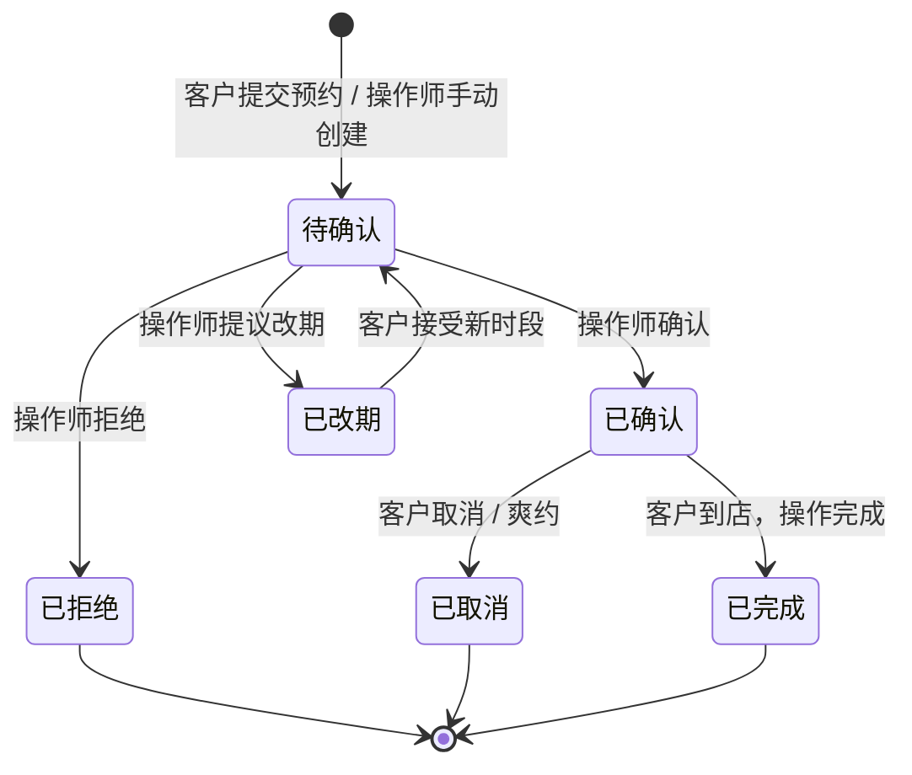
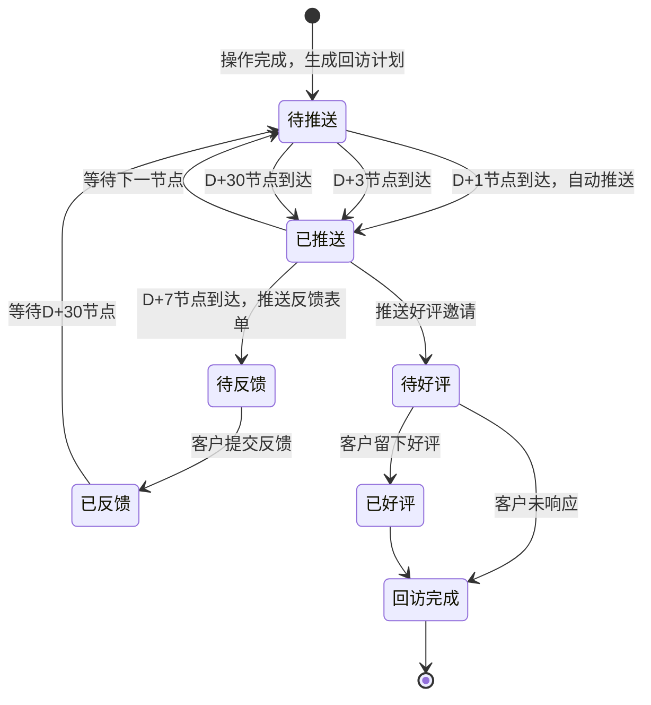
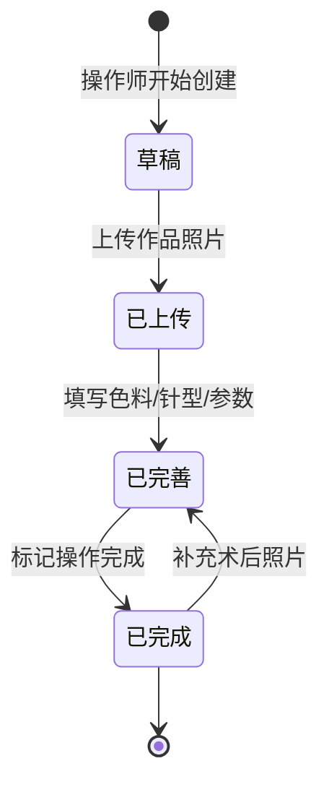

# 1.需求概述

## 1.1 需求介绍

纹身与轻医美工作室预约与术后回访助手是一款面向小型纹身工作室、穿孔工作室及轻医美工作室（纹眉、美睫、皮肤管理等）的轻量级预约管理与术后回访自动化工具。

纹身和轻医美行业具有"重作品、强售后"的特点，客户的术后恢复状况直接影响作品最终效果和工作室口碑。然而，当前绝大多数小型工作室（尤其是1-10人规模的独立工作室）的客户术后回访完全依赖微信手动提醒，存在以下痛点：

1. **术后回访容易遗漏**：操作师日常工作繁忙，容易忘记在关键恢复节点（第1天/第3天/第7天/第30天）主动联系客户，导致客户感觉不被重视，影响口碑。
2. **作品档案缺失**：客户后续补色或维护时，操作师需要查阅之前的操作记录（色料品牌、针型、操作参数等），但多数工作室没有结构化记录，依赖操作师个人记忆。
3. **预约管理混乱**：小型工作室通常使用微信聊天记录或纸质本子管理预约，容易出现撞单、漏单、客户爽约无记录等问题。
4. **口碑沉淀无抓手**：满意的客户是工作室最好的获客渠道，但缺乏在合适时机（术后恢复良好时）引导客户留下好评的机制。

本系统聚焦"预约管理 + 作品档案 + 术后回访自动化"三大核心价值，帮助小型工作室以最低成本实现专业化的客户术后关怀，提升客户满意度和复购率。

### 1.1.1 所属领域

垂直行业需求 — 纹身与轻医美服务行业（小型工作室/独立操作师场景）

## 1.2 需求目标

1. **预约管理数字化**：提供可视化预约日历，支持按项目类型（纹身/补色/穿孔/纹眉/美睫等）设置时长和价格，客户可通过H5链接自助预约，减少操作师的预约沟通成本。
2. **作品档案结构化**：为每位客户建立作品档案，记录作品照片、使用色料品牌及色号、针型、操作参数（深度/频率等）、操作时长等关键信息，便于后续补色或维护时查阅。
3. **术后回访自动化**：操作完成后，系统自动在关键恢复节点（第1天/第3天/第7天/第30天）向客户推送术后护理提醒，无需操作师手动记挂，降低回访遗漏率。
4. **客户反馈闭环**：通过反馈收集表单收集客户恢复情况和照片，生成回访完成率统计，并在客户恢复良好时自动发送口碑好评邀请，帮助工作室沉淀优质口碑。
5. **轻量易用**：面向非专业用户（小型工作室操作师多为手艺从业者，非IT背景），操作流程极简，7天MVP可上线核心链路。
6. **差异化定位**：不做完整的门店管理系统（不含收银、库存、员工考勤等），只聚焦"预约+作品档案+术后回访自动化"的核心闭环，避开美团/大众点评和新氧等平台竞争。

## 1.3 系统使用角色

| 角色 | 说明 |
| --- | --- |
| 操作师（Artist/Operator） | 纹身师、穿孔师、轻医美操作师等，负责预约管理、客户作品档案建立、术后回访跟进 |
| 工作室管理员（Studio Admin） | 工作室负责人，管理操作师团队、查看回访统计、配置品牌化术后护理卡（工作室版功能） |
| 客户（Client） | 接受纹身/穿孔/轻医美服务的消费者，通过H5链接自助预约、查看术后护理提醒、提交恢复反馈 |
| 系统管理员 | 平台运营方，负责用户管理、版本套餐管理、数据运维（MVP阶段可简化） |

## 1.4 业务流程图

### 1.4.1 核心业务流程：预约-操作-回访全链路

### 1.4.2 客户自助预约时序

### 1.4.3 术后回访自动推送时序

# 2.功能原型

| 原型名称 | 原型链接 | 对应端 | 备注 |
| --- | --- | --- | --- |
| 操作师端-小程序 | 待产品文档阶段设计 | 小程序端 | 操作师日常使用，预约管理、作品档案、回访跟进 |
| 工作室管理端-WEB | 待产品文档阶段设计 | WEB端 | 工作室管理员使用，团队管理、品牌配置、回访统计 |
| 客户端-H5 | 待产品文档阶段设计 | H5端 | 客户自助预约、查看护理提醒、提交恢复反馈 |

# 3.需求清单

## 3.1 操作师端-小程序端

| 模块 | 一级功能 | 二级功能 | 功能描述 | 备注 |
| --- | --- | --- | --- | --- |
| 用户管理 | 注册与登录 | 微信授权登录 | 操作师通过微信授权快速登录，无需注册流程 | MVP |
| 用户管理 | 个人资料 | 操作师信息维护 | 维护操作师基本信息：姓名、联系方式、擅长项目类型、个人简介、作品展示图 | MVP |
| 用户管理 | 工作室绑定 | 加入/创建工作室 | 操作师可创建新工作室或加入已有工作室（通过邀请码），免费版支持1位操作师 | MVP |
| 预约管理 | 项目设置 | 项目类型配置 | 配置工作室提供的项目类型：纹身/补色/穿孔/纹眉/美睫/皮肤管理等，每种项目可设置默认时长和价格区间 | MVP，核心功能 |
| 预约管理 | 项目设置 | 项目时长设置 | 为每种项目类型设置预估操作时长（如纹身2小时、补色30分钟、穿孔15分钟），用于日历时段计算 | MVP |
| 预约管理 | 项目设置 | 项目价格设置 | 为每种项目类型设置价格或价格区间（如纹身¥500起），展示给客户供参考 | MVP |
| 预约管理 | 日历视图 | 日/周视图切换 | 以日历形式展示预约安排，支持日视图和周视图切换，直观查看每日/每周的预约密度 | MVP，核心功能 |
| 预约管理 | 日历视图 | 预约时间块展示 | 每个预约以时间块形式展示在日历上，显示客户姓名、项目类型、时间段，支持颜色区分项目类型 | MVP |
| 预约管理 | 日历视图 | 今日预约概览 | 首页展示今日预约列表，包括时间、客户、项目类型、预约状态，快速了解今日工作安排 | MVP |
| 预约管理 | 预约处理 | 手动创建预约 | 操作师可手动为客户创建预约（适用于电话/微信预约的客户），填写客户信息、选择项目和时段 | MVP |
| 预约管理 | 预约处理 | 确认/拒绝客户预约 | 处理客户通过H5提交的预约申请，可确认、拒绝或提议改期 | MVP |
| 预约管理 | 预约处理 | 预约改期 | 对已有预约进行日期或时段调整，系统自动通知客户 | MVP |
| 预约管理 | 预约处理 | 预约取消 | 取消预约并释放时段，记录取消原因（客户取消/操作师取消/爽约） | MVP |
| 预约管理 | 时段管理 | 工作日设置 | 设置每周的工作日和非工作日，非工作日不对外开放预约 | MVP |
| 预约管理 | 时段管理 | 工作时间设置 | 设置每日的工作时间段（如10:00-20:00），系统据此生成可预约时段 | MVP |
| 预约管理 | 时段管理 | 时段间隔设置 | 设置预约时段的最小间隔（如每30分钟一个时段），避免预约过于密集 | MVP |
| 预约管理 | 时段管理 | 临时休息设置 | 设置特定日期的临时休息（如请假、外出），该日不对外开放预约 | 可延后 |
| 客户管理 | 客户档案 | 客户列表 | 查看所有客户列表，支持按姓名/手机号搜索，显示客户基本信息和最近一次服务时间 | MVP |
| 客户管理 | 客户档案 | 客户基本信息 | 记录客户姓名、手机号、性别、生日（可选）、来源渠道（可选） | MVP |
| 客户管理 | 客户档案 | 客户标签 | 为客户打标签（如VIP、过敏体质、偏好深色等），便于快速识别和个性化服务 | 可延后 |
| 作品档案 | 档案创建 | 新建作品档案 | 每次操作完成后为客户创建作品档案，关联客户、操作师、项目类型、操作日期 | MVP，核心功能 |
| 作品档案 | 档案创建 | 作品照片上传 | 上传作品完成后的高清照片（支持多张），作为作品记录和客户对比依据 | MVP，核心功能 |
| 作品档案 | 档案创建 | 色料信息记录 | 记录使用的色料品牌、色号、配比，便于后续补色时复用相同色料 | MVP，核心功能 |
| 作品档案 | 档案创建 | 针型与参数记录 | 记录使用的针型、操作深度、频率等参数，为后续补色或维护提供参考 | MVP |
| 作品档案 | 档案创建 | 操作备注 | 记录操作过程中的特殊情况说明（如客户皮肤状态、特殊处理手法等） | MVP |
| 作品档案 | 档案管理 | 客户作品历史 | 查看某位客户的所有作品档案，按时间倒序排列，方便了解客户的历史操作记录 | MVP |
| 作品档案 | 档案管理 | 作品档案编辑 | 对已有作品档案进行补充修改（如追加术后照片、补充遗漏信息） | MVP |
| 术后回访 | 回访计划 | 自动生成回访计划 | 操作完成后，系统自动为该客户生成术后回访计划（D+1/D+3/D+7/D+30四个节点） | MVP，核心功能 |
| 术后回访 | 回访计划 | 回访计划查看 | 查看所有进行中的回访计划列表，显示客户姓名、操作日期、当前回访进度、下次回访时间 | MVP |
| 术后回访 | 护理提醒 | 自动推送护理提醒 | 系统在回访节点自动向客户推送术后护理提醒（微信模板消息/订阅消息） | MVP，核心功能 |
| 术后回访 | 护理提醒 | 护理内容配置 | 操作师可自定义各回访节点的护理提醒内容（如D+1提醒保持清洁干燥、D+7提醒避免暴晒等） | MVP |
| 术后回访 | 护理提醒 | 手动补发提醒 | 操作师可手动向客户补发一条护理提醒（适用于自动推送失败或客户未收到的情况） | 可延后 |
| 术后回访 | 反馈收集 | 客户反馈查看 | 查看客户提交的恢复反馈和照片，按时间线展示 | MVP |
| 术后回访 | 反馈收集 | 反馈异常标记 | 操作师可标记客户反馈中的异常情况（如感染、褪色严重等），触发主动跟进提醒 | MVP |
| 术后回访 | 回访统计 | 回访完成率 | 统计各回访节点的完成率（如D+1完成率90%、D+30完成率60%），帮助评估客户关怀质量 | 工作室版功能 |
| 预约分享 | 预约链接 | 生成预约链接 | 生成工作室专属的H5预约链接，客户点击即可进入预约页面 | MVP，核心功能 |
| 预约分享 | 预约链接 | 预约二维码 | 生成预约二维码，操作师可打印张贴在门店或分享给客户 | MVP |
| 预约分享 | 预约链接 | 链接分享 | 通过微信将预约链接分享给客户或朋友圈 | MVP |
| 消息通知 | 通知接收 | 新预约通知 | 接收客户提交的预约申请通知 | MVP |
| 消息通知 | 通知接收 | 预约变更通知 | 接收客户取消或改期预约的通知 | MVP |
| 消息通知 | 通知接收 | 客户反馈通知 | 接收客户提交的术后恢复反馈通知 | MVP |

## 3.2 客户端-H5端

| 模块 | 一级功能 | 二级功能 | 功能描述 | 备注 |
| --- | --- | --- | --- | --- |
| 用户访问 | 身份验证 | 链接访问 | 客户通过操作师分享的H5链接直接进入预约页面，无需下载APP | MVP |
| 用户访问 | 身份验证 | 微信授权登录 | 客户通过微信授权登录后，预约记录和反馈提交可关联到个人账号 | MVP |
| 自助预约 | 项目浏览 | 工作室信息展示 | 展示工作室名称、地址、营业时间、操作师简介、作品示例 | MVP |
| 自助预约 | 项目浏览 | 项目列表浏览 | 浏览工作室提供的项目类型、价格区间、预估时长 | MVP |
| 自助预约 | 项目浏览 | 操作师选择 | 若工作室有多位操作师，客户可选择指定的操作师进行预约 | 工作室版功能 |
| 自助预约 | 时段选择 | 日历选择日期 | 以日历形式展示可预约日期，不可预约日期置灰 | MVP |
| 自助预约 | 时段选择 | 时段选择 | 选择日期后展示该日可用时段列表，已预约时段不可选 | MVP |
| 自助预约 | 时段选择 | 项目与时长匹配 | 根据选择的项目类型自动匹配预估时长，确保时段内可容纳 | MVP |
| 自助预约 | 信息填写 | 个人信息填写 | 填写姓名、手机号、微信号（可选） | MVP |
| 自助预约 | 信息填写 | 需求描述 | 填写本次服务的需求描述（如纹身图案说明、参考图上传、特殊要求等） | MVP |
| 自助预约 | 预约提交 | 提交预约申请 | 确认预约信息后提交，等待操作师确认 | MVP |
| 自助预约 | 预约提交 | 预约确认通知 | 操作师确认后收到微信通知，包含预约时间、地点、项目、注意事项 | MVP |
| 自助预约 | 预约管理 | 查看预约状态 | 查看自己的预约状态：待确认/已确认/已取消 | MVP |
| 自助预约 | 预约管理 | 取消预约 | 客户可在操作师设定的截止时间前取消预约 | MVP |
| 自助预约 | 预约管理 | 预约改期 | 客户可申请改期，需操作师确认 | MVP |
| 术后护理 | 护理提醒查看 | 护理提醒接收 | 接收系统推送的术后护理提醒（微信模板消息/订阅消息） | MVP，核心功能 |
| 术后护理 | 护理提醒查看 | 护理内容查看 | 在H5页面查看详细的术后护理建议（图文形式，分节点展示） | MVP |
| 术后护理 | 护理提醒查看 | 护理时间线 | 以时间线形式展示所有已推送和待推送的护理提醒 | MVP |
| 术后护理 | 反馈提交 | 恢复反馈表单 | 填写术后恢复情况：恢复程度评分、是否有异常（红肿/感染/褪色等）、文字描述 | MVP，核心功能 |
| 术后护理 | 反馈提交 | 恢复照片上传 | 上传术后恢复阶段的照片（如D+7恢复照片、D+30最终效果照片） | MVP，核心功能 |
| 术后护理 | 反馈提交 | 反馈历史记录 | 查看自己历史提交的所有反馈和照片 | MVP |
| 术后护理 | 好评邀请 | 好评引导 | 术后恢复良好时（D+30节点），收到好评邀请，可跳转至大众点评/小红书等平台留下评价 | MVP |

## 3.3 工作室管理端-WEB端

| 模块 | 一级功能 | 二级功能 | 功能描述 | 备注 |
| --- | --- | --- | --- | --- |
| 用户管理 | 操作师管理 | 操作师列表 | 查看工作室下所有操作师列表及基本信息 | 工作室版功能 |
| 用户管理 | 操作师管理 | 邀请操作师加入 | 生成邀请码或邀请链接，操作师扫码加入工作室 | 工作室版功能 |
| 用户管理 | 操作师管理 | 移除操作师 | 将操作师从工作室移除（移除后其客户数据保留但不再关联该工作室） | 工作室版功能 |
| 品牌配置 | 术后护理卡 | 品牌化护理卡配置 | 配置术后护理卡的展示样式：工作室Logo、品牌色、联系方式、自定义护理建议内容 | 工作室版功能 |
| 品牌配置 | 术后护理卡 | 护理模板管理 | 按项目类型配置不同的术后护理模板（纹身护理/穿孔护理/纹眉护理等），不同项目的护理建议不同 | 工作室版功能 |
| 数据统计 | 回访统计 | 回访完成率统计 | 统计工作室整体的回访完成率、各操作师的回访完成率、各回访节点的完成率 | 工作室版功能 |
| 数据统计 | 回访统计 | 客户满意度统计 | 基于客户反馈的恢复评分，统计客户满意度趋势 | 工作室版功能 |
| 数据统计 | 预约统计 | 预约量统计 | 统计工作室预约量趋势、各项目的预约占比、客户来源分布 | 工作室版功能 |
| 数据统计 | 预约统计 | 爽约率统计 | 统计预约爽约率，帮助工作室优化预约管理策略 | 可延后 |
| 版本套餐 | 套餐管理 | 当前版本查看 | 查看当前工作室使用的版本（免费版/工作室版）、到期时间、功能权限 | MVP |
| 版本套餐 | 套餐管理 | 版本升级 | 从免费版升级到工作室版，支持在线支付（¥69/月） | 可延后 |

# 4.非功能需求

## 4.1 使用界面需求

| 需求项 | 描述 |
| --- | --- |
| 操作师端界面风格 | 专业简洁、操作高效，适合手艺从业者使用；大按钮、高对比度，支持单手操作场景（操作师可能刚完成操作，手不方便精细操作） |
| 客户端界面风格 | 温馨专业、突出信任感；预约页面展示工作室品牌元素和作品案例，护理页面以图文卡片形式展示，减轻客户术后焦虑 |
| 日历交互 | 日历视图需支持手势滑动切换日期/周，时间块支持点击查看详情和快速操作（确认/取消） |
| 照片展示 | 作品档案照片支持高清原图查看，客户端恢复照片支持前后对比模式（操作完成照 vs 恢复后照片） |
| 离线可用 | 操作师端在弱网环境下（如工作室信号差）应支持本地暂存作品档案，联网后自动同步 |

## 4.2 软硬件环境需求

| 需求项 | 描述 |
| --- | --- |
| 操作师端 | 微信小程序（iOS/Android），无需安装APP |
| 客户端 | H5页面（通过微信分享链接直接访问），无需安装，无需下载小程序 |
| 工作室管理端 | 现代浏览器（Chrome/Firefox/Edge/Safari），WEB端访问 |
| 后端服务 | 云服务器部署，支持微信开放平台接口调用 |
| 存储 | 照片存储使用云存储（如腾讯云COS），需支持图片压缩和CDN加速，作品照片需保留原图质量 |

## 4.3 性能需求

| 需求项 | 描述 |
| --- | --- |
| 页面加载时间 | 预约页面和护理提醒页面加载时间不超过2秒（4G网络环境） |
| 照片上传 | 作品照片支持单张最大20MB上传（工作室对照片质量要求高），上传过程显示进度，支持压缩后上传 |
| 日历渲染 | 日历视图切换和加载时间不超过1秒，支持30天内预约数据一次性加载 |
| 并发用户 | MVP阶段支持300并发用户（操作师+客户） |
| 消息推送 | 术后护理提醒在设定时间点±5分钟内推送到达 |
| 数据同步 | 操作师端作品档案保存后，客户端应在30秒内可查看到相关护理提醒 |

## 4.4 约束性需求

1. **MVP周期约束**：首版MVP开发周期不超过7天，需严格控制功能范围，核心链路为：项目设置 → 预约日历管理 → 客户自助预约 → 作品档案建立 → 术后护理自动推送 → 反馈收集。
2. **不做门店管理**：本系统明确不做门店收银、库存管理、员工考勤等门店管理功能，与门店SaaS形成差异化。
3. **不做在线支付**：MVP阶段不支持在线支付，服务费用通过线下结算，系统仅做预约管理，不涉及交易。
4. **不做医疗诊断**：术后回访不提供医疗诊断功能，客户反馈中的异常情况仅做记录和操作师提醒，不替代专业医疗建议。
5. **微信平台约束**：依赖微信开放平台能力（登录、分享、消息推送），需遵循微信小程序/H5开发规范。术后护理提醒优先使用微信订阅消息（需用户主动订阅）。
6. **需要后台服务**：是，需要后端服务支撑用户管理、数据存取、文件存储、定时任务（术后回访自动推送）、消息推送等功能。

# 5.接口需求

## 5.1 硬件接口需求

本系统不涉及特殊硬件接口需求。

## 5.2 软件接口需求

| 模块 | 接口名称 | 输入 | 输出 | 功能描述 |
| --- | --- | --- | --- | --- |
| 用户管理 | 微信登录接口 | 微信授权code | openid、用户昵称、头像 | 通过微信开放平台实现用户授权登录（操作师端小程序+客户端H5） |
| 消息通知 | 微信订阅消息接口 | 消息模板ID、接收者openid、消息内容 | 发送结果状态 | 向客户推送预约确认、术后护理提醒、好评邀请等通知 |
| 消息通知 | 微信模板消息接口（备选） | 消息模板ID、接收者openid、消息内容 | 发送结果状态 | 订阅消息不足时的备选推送通道 |
| 文件存储 | 云存储上传接口 | 图片文件 | 文件访问URL | 作品照片、恢复照片的上传和存储 |
| 文件存储 | 图片压缩接口 | 原始图片 | 压缩后图片 | 上传前自动压缩图片（保留原图可选），节省存储和流量 |
| 分享功能 | 微信小程序分享接口 | 分享标题、图片、路径 | 分享卡片 | 操作师将预约链接/护理提醒分享给客户 |
| 分享功能 | 微信H5分享接口 | 分享标题、描述、图片、链接 | 分享内容 | 客户端H5页面的微信分享（如分享给好友查看预约） |
| 日历服务 | 时段计算接口 | 项目类型、时长、工作日设置 | 可用时段列表 | 根据项目时长和工作时间自动计算可预约时段 |

## 5.4 通讯接口需求

本系统主要通过微信生态（小程序/H5）与用户交互，无特殊硬件通讯需求。数据通讯采用HTTPS协议，保证数据传输安全。客户照片等敏感数据在传输和存储过程中应加密处理。

# 6. 附录

## 流程图

### 预约-操作-回访完整流程

## 时序图

### 作品档案创建与回访计划生成时序

## （用户与系统交互）用例图

## （系统）状态图

### 预约状态流转

### 术后回访状态流转

### 作品档案状态流转

