# 老年人数字遗产管家 - 产品需求文档 (PRD)

> **文档版本**：v1.0.0
> **产品名称**：老年人数字遗产管家
> **文档状态**：待审核
> **最后更新**：2026-06-29

---

## 变更历史

| 版本号 | 变更日期 | 变更内容 | 变更人 | 审核人 |
| --- | --- | --- | --- | --- |
| V1.0 | 2026-06-29 | 初始版本创建 | 产品文档结对写作专家 | - |

---

# 1 概述

## 1.1 需求背景

随着我国加速进入老龄化社会，50岁以上互联网用户已超过3亿。这些用户在日常生活中使用了大量网络服务——银行账户、社保医保、微信支付宝、电子邮箱等，积累了大量"数字资产"。然而，当老年人因疾病、意外或自然衰老失去行为能力甚至去世后，这些数字账户往往面临"无人打理"的困境：

1. **密码遗忘问题**：老年人记忆力衰退，多个平台的密码难以记住，频繁找回密码困难重重
2. **数字遗产断档**：老人去世后，数字账户中的资金、信息、社交关系等无法被家属合法获取
3. **账户安全风险**：长期不活跃的账户容易被盗用，家属却无法及时发现和处置
4. **现有工具不适老**：1Password、LastPass等密码管理器面向年轻技术用户，操作复杂，老年人无法使用
5. **传承机制缺失**：没有一个产品专门解决"老年人数字资产的有序传承"问题

本产品聚焦"老年人数字遗产管理+家庭传承"这一小众刚需场景，填补市场空白。

## 1.2 名词解释

| **名词** | **说明** |
| --- | --- |
| 数字遗产 | 用户在各网络平台上的账户、数据、资产等数字化存在的总和 |
| 主密码 | 用户设置的高强度密码，用于加密/解密所有存储的账户密码，系统不存储 |
| 活跃度检测 | 系统定期检查账户的最后登录时间，判断是否超过预设阈值 |
| 继承人 | 被用户指定在特定条件（失能/身故）下可访问其指定账户信息的人 |
| 紧急联系人 | 在紧急情况下可临时获取用户指定账户只读访问权的信任人士 |
| 家庭组 | 家庭版用户创建的多成员管理单元，支持代办、通知等功能 |
| 代办人 | 家庭组中被授权帮助长辈管理账户的成员（通常为子女） |
| AES-256 | 高级加密标准，256位密钥长度，用于密码加密存储 |
| MVP | 最小可行产品（Minimum Viable Product），首版聚焦核心功能 |

## 1.3 产品介绍

### 1.3.1 范围说明

| 项 | 内容 |
| --- | --- |
| 包含功能 | 账户集中管理、密码加密存储、活跃度检测、继承人授权、紧急联系人、家庭版多成员管理 |
| 不包含功能 | 通用密码管理器功能（如自动填充、浏览器插件）、数字资产自动转移、法律文书生成、投资理财功能 |

"老年人数字遗产管家"是一款面向50岁以上中老年用户及其家庭的数字遗产管理工具。产品核心定位：**不做通用密码管理器，专注于"老年人数字遗产管理+家庭传承"**。

**目标用户**：
- 50岁以上中老年互联网用户（核心用户）
- 替父母管理账户的成年子女（代办人）
- 需要规划数字遗产的家庭

**核心价值主张**：
- 对老年人：一个地方记住所有密码，子女能帮忙管，万一不在了家人能找到
- 对子女：帮父母管好账户密码，不用担心父母走后数字资产找不到
- 差异化：市面上的密码管理器是"技术工具"，我们是"家庭传承保障"

---

# 2 产品设计

## 2.1 系统架构图

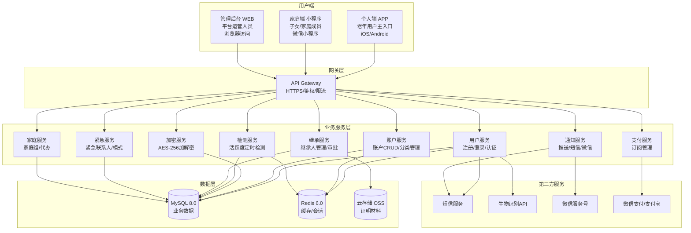

## 2.2 业务模块图

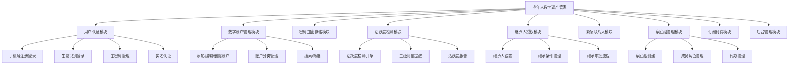

## 2.3 主业务流程

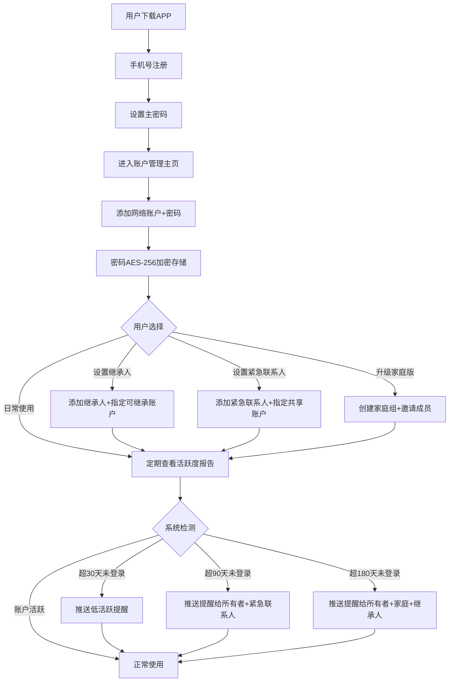

## 2.4 功能图/列表

### 个人端APP功能列表（MVP核心）

| 功能模块 | 功能名称 | 优先级 | 功能描述 |
| --- | --- | --- | --- |
| 用户认证 | 手机号注册登录 | P0 | 手机号+验证码注册，设置主密码 |
| 用户认证 | 生物识别登录 | P1 | 指纹/面容快速登录 |
| 用户认证 | 主密码管理 | P0 | 设置/修改主密码，不可恢复 |
| 账户管理 | 添加网络账户 | P0 | 选择账户类型，填写信息，加密存储密码 |
| 账户管理 | 账户列表与搜索 | P0 | 按分类展示账户，支持搜索筛选 |
| 账户管理 | 查看密码 | P0 | 身份验证后显示密码，30秒自动隐藏 |
| 账户管理 | 编辑/删除账户 | P0 | 修改账户信息，删除不再使用的账户 |
| 活跃度检测 | 自动检测 | P0 | 按30/90/180天三级阈值检测账户活跃度 |
| 活跃度检测 | 提醒通知 | P0 | 根据活跃度等级通知不同对象 |
| 活跃度检测 | 活跃度仪表盘 | P1 | 查看账户活跃度概览报告 |
| 继承人授权 | 添加继承人 | P0 | 设置继承人信息+可继承账户+继承条件 |
| 继承人授权 | 继承审批 | P0 | 审批主动授权/失能/身故继承申请 |
| 紧急联系人 | 添加紧急联系人 | P1 | 设置联系人信息+可共享账户+触发条件 |
| 紧急联系人 | 紧急模式 | P1 | 激活紧急模式，临时授权只读访问 |
| 适老化 | 大字体模式 | P0 | 四档字体调节（小/中/大/超大） |
| 适老化 | 高对比度主题 | P0 | 文字与背景高对比度 |
| 适老化 | 简化操作 | P0 | 核心操作3步完成 |

### 家庭端小程序功能列表

| 功能模块 | 功能名称 | 优先级 | 功能描述 |
| --- | --- | --- | --- |
| 家庭组 | 创建家庭组 | P0 | 升级家庭版，创建家庭组 |
| 家庭组 | 邀请成员 | P0 | 手机号/二维码邀请家庭成员 |
| 家庭组 | 成员角色管理 | P0 | 设置管理员/普通成员/代办人角色 |
| 代办管理 | 代添加账户 | P1 | 子女代父母添加网络账户 |
| 代办管理 | 代查看密码 | P1 | 子女代父母查看密码（需验证） |
| 通知 | 活跃度提醒 | P0 | 接收父母账户异常提醒 |
| 通知 | 继承/紧急通知 | P0 | 接收继承申请、紧急访问通知 |

### 管理后台功能列表

| 功能模块 | 功能名称 | 优先级 | 功能描述 |
| --- | --- | --- | --- |
| 用户管理 | 用户列表/详情 | P0 | 查看注册用户信息、操作日志 |
| 家庭组管理 | 家庭组列表 | P1 | 查看家庭组信息、订阅状态 |
| 继承审核 | 审核列表/操作 | P0 | 审核失能/身故继承申请 |
| 数据统计 | 用户/账户/活跃度统计 | P1 | 平台运营数据概览 |
| 系统设置 | 参数配置 | P1 | 阈值、通知模板、订阅价格配置 |

## 2.5 你的产品有哪些端

| 序号 | 端名称 | 端类型 | 目标用户 | 说明 |
| --- | --- | --- | --- | --- |
| 1 | 个人端 APP | APP端 | 50岁以上老年用户 | 主APP，适老化设计，iOS/Android |
| 2 | 家庭端 小程序 | 小程序端 | 家庭成员（子女等） | 微信小程序，管理家庭组、代办、接收通知 |
| 3 | 管理后台 | WEB端 | 平台运营人员 | 浏览器访问，用户管理、继承审核、数据统计 |

---

# 3 产品功能

## 3.1 个人端 APP 功能

### 3.1.1 用户注册与登录

**功能描述**

用户可以通过手机号+短信验证码注册并登录APP，首次登录需设置主密码。支持指纹/面容识别快速登录（适老化设计）。

| 项 | 内容 |
| --- | --- |
| 优先级 | P0 |
| 依赖需求 | 无 |
| 前置条件 | 用户已下载APP |

**详细流程**

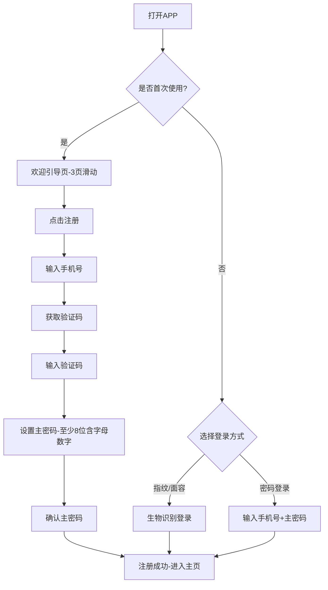

**业务规则说明**：
1. 手机号为中国大陆11位手机号，每个手机号仅可注册一个账号
2. 验证码6位数字，有效期5分钟，每日发送上限10次
3. 主密码至少8位，需包含字母和数字，系统不存储主密码明文
4. 主密码连续输错5次，锁定30分钟
5. 生物识别登录需先通过主密码验证一次后才可开启
6. 连续输错生物识别3次，自动切换为主密码登录

**验收标准**：
- [ ] 正常流程：新用户完成注册到进入主页<60秒
- [ ] 异常流程：验证码错误/过期给出清晰提示
- [ ] 性能要求：验证码发送<3秒到达，登录验证<1秒

### 3.1.2 数字账户管理

**功能描述**

用户可以在APP中集中添加、查看、编辑、删除各类网络账户（银行、社保、微信、邮箱等），密码使用AES-256加密存储。支持按分类浏览、搜索、打标签。

| 项 | 内容 |
| --- | --- |
| 优先级 | P0 |
| 依赖需求 | 用户注册与登录 |
| 前置条件 | 用户已登录且已设置主密码 |

**详细流程**

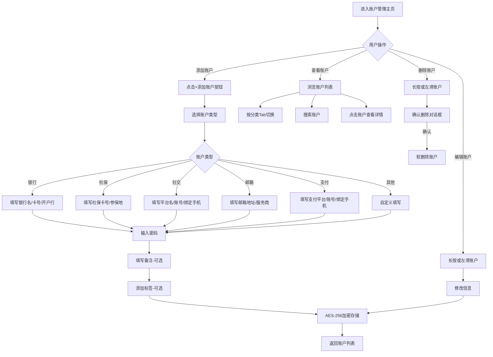

**业务规则说明**：
1. 预设账户分类：银行（六大行+股份制+城商行）、社保/医保、社交平台（微信/QQ/微博）、邮箱、支付（支付宝/微信支付）、其他
2. 每个账户必填：账户名称、账户类型；选填：账号、密码、备注、标签
3. 密码字段使用安全键盘输入，输入后立即AES-256加密
4. 账户列表支持按分类Tab切换（全部/银行/社保/社交/邮箱/支付/其他）
5. 搜索支持按账户名称、账号、备注模糊搜索
6. 删除为软删除，30天内可恢复
7. 账户上限：个人版100个，家庭版500个

**验收标准**：
- [ ] 正常流程：添加一个账户（含密码）操作步骤<=3步（选类型→填信息→保存）
- [ ] 正常流程：100个账户列表加载<1秒
- [ ] 异常流程：必填字段为空时给出红色提示
- [ ] 安全要求：密码字段输入和显示均经过加密，剪贴板15秒后自动清空

### 3.1.3 密码查看与安全管理

**功能描述**

用户查看已保存的账户密码前需通过身份验证（指纹/面容/主密码/短信验证码，可选），验证通过后密码显示30秒自动隐藏，支持一键复制（15秒后清空剪贴板）。

| 项 | 内容 |
| --- | --- |
| 优先级 | P0 |
| 依赖需求 | 数字账户管理 |
| 前置条件 | 账户已添加且包含密码 |

**详细流程**

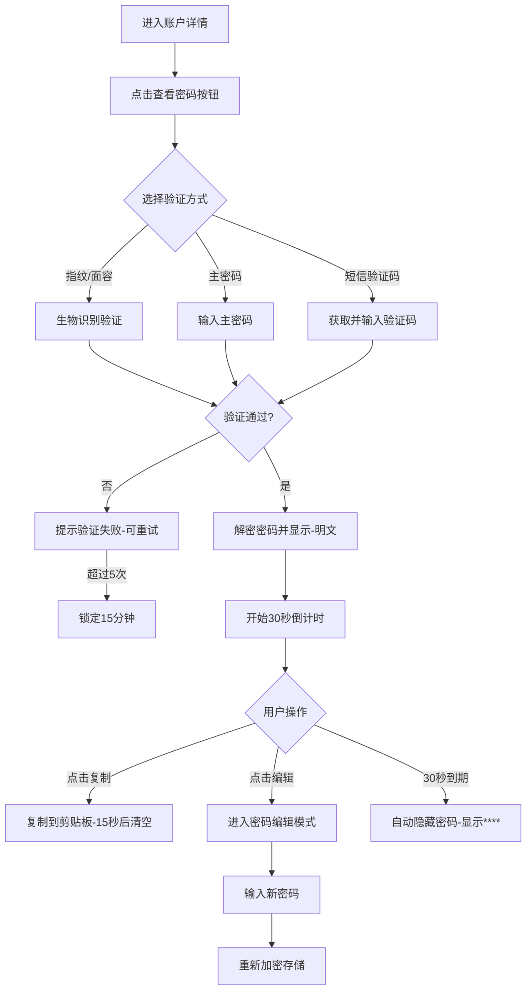

**业务规则说明**：
1. 验证方式可在"安全设置"中配置：默认开启生物识别，可选主密码和短信
2. 密码显示为明文时，使用大字体显示（适老化）
3. 复制成功后显示Toast提示"已复制，15秒后自动清空"
4. 密码解密时间<0.5秒
5. 查看密码的操作记录审计日志

**验收标准**：
- [ ] 正常流程：身份验证通过后密码显示<0.5秒
- [ ] 正常流程：30秒后密码自动隐藏为****
- [ ] 异常流程：验证失败5次后锁定15分钟
- [ ] 安全要求：剪贴板15秒后自动清空

### 3.1.4 活跃度检测与提醒

**功能描述**

系统按设定的检测周期（默认每周）自动检测所有账户的最后登录时间，超过阈值则标记为不同活跃等级并推送提醒。

| 项 | 内容 |
| --- | --- |
| 优先级 | P0 |
| 依赖需求 | 数字账户管理 |
| 前置条件 | 用户已添加至少一个账户 |

**详细流程**

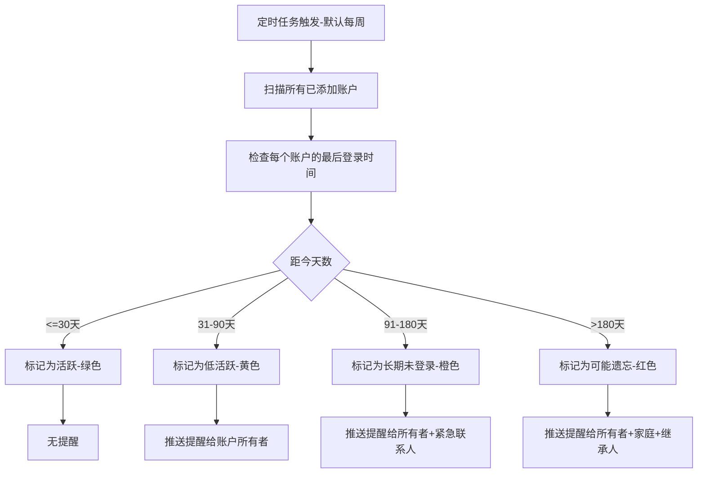

**活跃度状态**：
- 🟢 活跃（<=30天未登录）：正常，无提醒
- 🟡 低活跃（31-90天未登录）：推送提醒给账户所有者
- 🟠 长期未登录（91-180天未登录）：推送提醒给所有者+紧急联系人
- 🔴 可能遗忘（>180天未登录）：推送提醒给所有者+家庭成员+继承人

**业务规则说明**：
1. 最后登录时间由用户手动标记（点击"我已登录"按钮更新）
2. 检测周期可配置：每日/每周/每月，默认每周
3. 阈值可配置：默认30/90/180天，用户可自定义
4. 提醒方式：APP推送（默认）+ 短信 + 微信服务号，用户可配置
5. 用户可批量标记多个账户为"已登录"

**验收标准**：
- [ ] 正常流程：活跃度检测按时完成，结果准确
- [ ] 正常流程：提醒按等级推送给正确对象
- [ ] 性能要求：100个账户的检测完成<10秒

### 3.1.5 继承人授权设置

**功能描述**

用户可指定继承人，设置其可继承的账户范围和触发条件（主动授权/失能证明/身故证明）。继承人需通过身份验证后方可访问指定账户信息。

| 项 | 内容 |
| --- | --- |
| 优先级 | P0 |
| 依赖需求 | 数字账户管理、用户认证 |
| 前置条件 | 用户已添加至少一个账户 |

**详细流程**

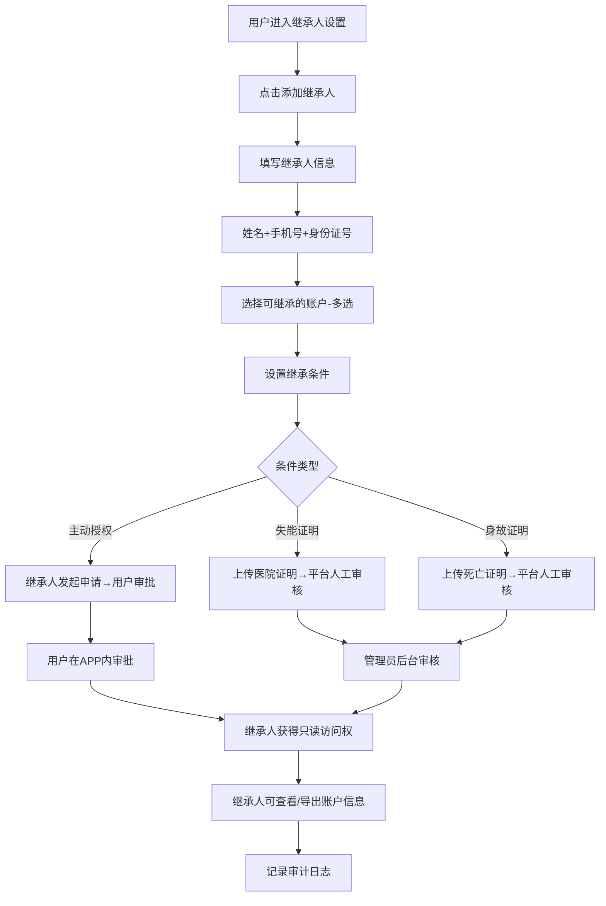

**业务规则说明**：
1. 每个用户最多设置5个继承人
2. 继承条件可多选：同一继承人可同时设置多种触发条件
3. 主动授权：继承人在APP发起申请，用户在APP内审批同意/拒绝
4. 失能/身故证明：继承人上传证明材料，平台管理员人工审核（48小时内完成）
5. 继承获得的权限为只读，不可修改账户信息
6. 所有继承操作记录审计日志
7. 用户可随时修改/删除继承人设置

**验收标准**：
- [ ] 正常流程：添加继承人到设置完成<60秒
- [ ] 正常流程：主动授权审批实时通知到用户
- [ ] 异常流程：证明材料不清晰时管理员可要求补充

### 3.1.6 紧急联系人管理

**功能描述**

用户可设置紧急联系人，指定紧急情况下该联系人可查看的账户范围。支持主动激活紧急模式、超时未响应自动触发、多方确认触发三种方式。

| 项 | 内容 |
| --- | --- |
| 优先级 | P1 |
| 依赖需求 | 数字账户管理、用户认证 |
| 前置条件 | 用户已添加至少一个账户 |

**详细流程**

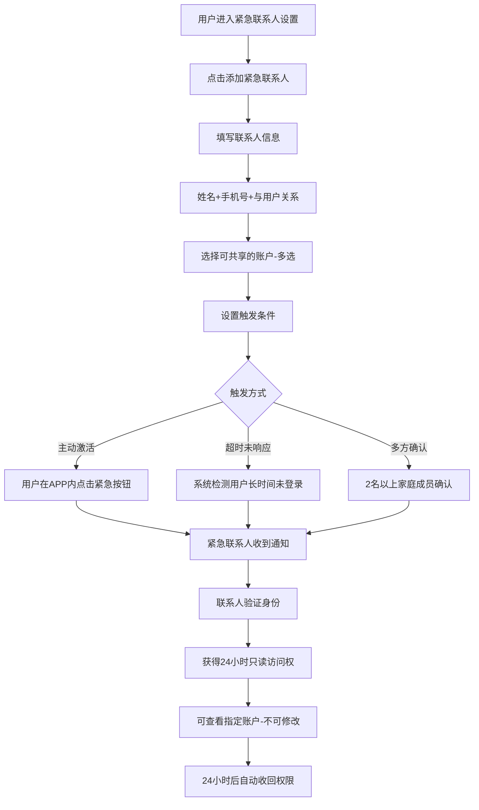

**业务规则说明**：
1. 每个用户最多设置3个紧急联系人
2. 紧急联系人仅有只读权限，不可修改任何账户信息
3. 紧急访问权限有效期24小时，到期自动收回
4. 紧急联系人访问时系统同时通知用户（如用户有能力）
5. 所有紧急访问操作记录审计日志

**验收标准**：
- [ ] 正常流程：紧急联系人验证身份后<5秒获得访问权
- [ ] 正常流程：24小时后权限自动收回
- [ ] 安全要求：紧急联系人只能查看不可修改

### 3.1.7 适老化界面设置

**功能描述**

提供大字体模式（四档调节）、高对比度主题、简化操作流程等适老化设计，降低老年用户的使用门槛。

| 项 | 内容 |
| --- | --- |
| 优先级 | P0 |
| 依赖需求 | 无 |
| 前置条件 | 无 |

**业务规则说明**：
1. 字体四档：小（14px）/中（16px，默认）/大（20px）/超大（24px）
2. 高对比度主题：文字与背景对比度符合WCAG 2.1 AA标准（>=4.5:1）
3. 核心操作（添加账户、查看密码）操作步骤不超过3步
4. 图标大尺寸（>=48dp），避免抽象符号
5. 首次使用提供图文引导教程
6. 错误提示使用通俗语言，避免技术术语
7. 避免复杂手势，主要使用点击和简单滑动

**验收标准**：
- [ ] 正常流程：字体切换后立即生效，无需重启
- [ ] 正常流程：高对比度模式下所有文字可读
- [ ] 易用性：65岁以上用户首次使用可在5分钟内完成添加第一个账户

---

## 3.2 家庭端小程序 功能

### 3.2.1 家庭组管理

**功能描述**

个人版用户可升级为家庭版（¥19/月），创建家庭组并邀请家庭成员加入。管理员可设置成员角色（管理员/普通成员/代办人）。

| 项 | 内容 |
| --- | --- |
| 优先级 | P0 |
| 依赖需求 | 用户注册与登录 |
| 前置条件 | 个人用户已注册 |

**详细流程**

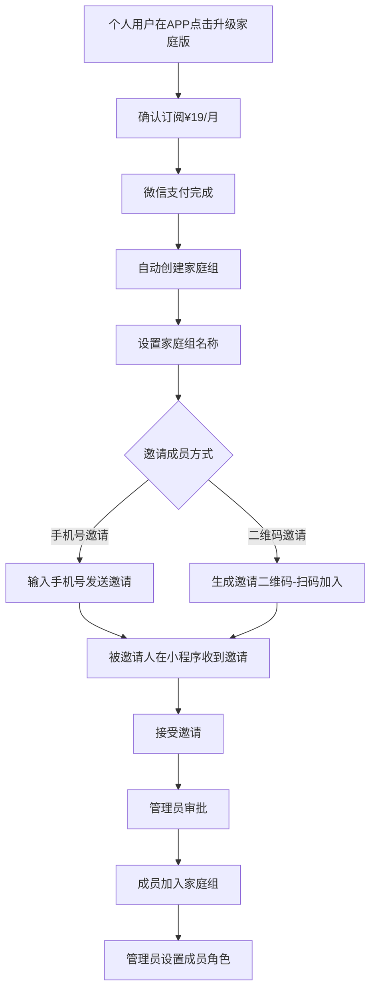

**业务规则说明**：
1. 家庭版¥19/月，支持最多6个家庭成员（含管理员）
2. 角色分为：管理员（创建者）、普通成员（管理自己的账户）、代办人（可管理指定成员的账户）
3. 邀请有效期7天，过期需重新邀请
4. 成员退出家庭组需管理员确认
5. 管理员可转让，需双方确认

**验收标准**：
- [ ] 正常流程：升级家庭版并创建家庭组<2分钟
- [ ] 正常流程：邀请成员接受后实时加入

### 3.2.2 代办管理

**功能描述**

父母授权子女作为代办人，子女可在小程序中代父母添加账户、修改信息、查看密码（需验证）。

| 项 | 内容 |
| --- | --- |
| 优先级 | P1 |
| 依赖需求 | 家庭组管理 |
| 前置条件 | 家庭组已创建，成员已设置代办人角色 |

**详细流程**

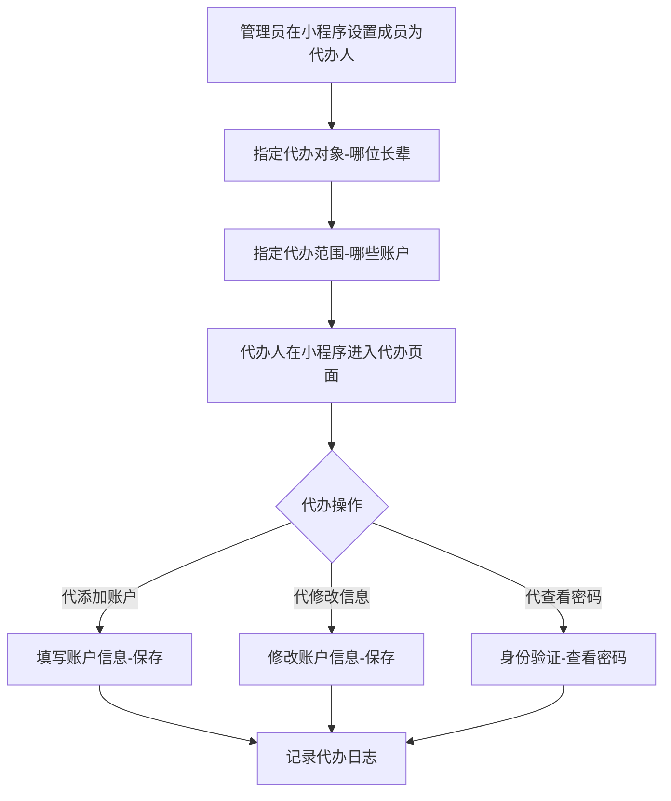

**业务规则说明**：
1. 代办操作需记录审计日志，操作人、时间、操作内容
2. 代查看密码需代办人通过身份验证
3. 代办范围由管理员（通常为父母自己）设定
4. 代办人不可修改继承人和紧急联系人设置

**验收标准**：
- [ ] 正常流程：代办人可正常代添加/修改账户
- [ ] 安全要求：所有代办操作记录审计日志

### 3.2.3 家庭通知

**功能描述**

家庭成员通过小程序接收各类通知：父母账户活跃度异常提醒、继承相关通知、紧急通知等。

| 项 | 内容 |
| --- | --- |
| 优先级 | P0 |
| 依赖需求 | 家庭组管理 |
| 前置条件 | 已加入家庭组 |

**业务规则说明**：
1. 通知类型：活跃度提醒（父母账户长期未登录）、继承通知（申请/审批结果）、紧急通知（紧急模式激活/访问请求）
2. 成员可配置接收哪些类型的通知
3. 可设置免打扰时段（默认22:00-7:00）
4. 通知通过微信服务号模板消息推送

**验收标准**：
- [ ] 正常流程：通知实时推送到微信
- [ ] 正常流程：免打扰时段内不推送

---

## 3.3 管理后台 功能

### 3.3.1 用户管理

**功能描述**

管理员可在后台查看所有注册用户信息、搜索用户、查看操作日志、禁用违规用户、协助重置密码。

| 项 | 内容 |
| --- | --- |
| 优先级 | P0 |
| 依赖需求 | 无 |
| 前置条件 | 管理员已登录后台 |

**业务规则说明**：
1. 用户列表支持按手机号、昵称、ID搜索
2. 用户详情包含：基本信息、账户概览、活跃度、会员状态
3. 禁用用户需填写原因，通知用户
4. 重置用户密码需严格审核流程（双人确认）

### 3.3.2 继承授权审核

**功能描述**

管理员在后台审核继承人提交的失能/身故继承申请，查看证明材料，做出通过/拒绝决定。

| 项 | 内容 |
| --- | --- |
| 优先级 | P0 |
| 依赖需求 | 无 |
| 前置条件 | 管理员已登录后台 |

**业务规则说明**：
1. 审核需在48小时内完成
2. 审核通过需双人确认
3. 拒绝需填写拒绝原因
4. 审核结果通过APP推送+短信通知相关方

### 3.3.3 数据统计

**功能描述**

后台提供平台运营数据统计：注册用户数、付费用户数、托管账户数、活跃度分布、继承统计等。

| 项 | 内容 |
| --- | --- |
| 优先级 | P1 |
| 依赖需求 | 无 |
| 前置条件 | 管理员已登录后台 |

---

# 4 产品原型

## 4.1 页面跳转逻辑图

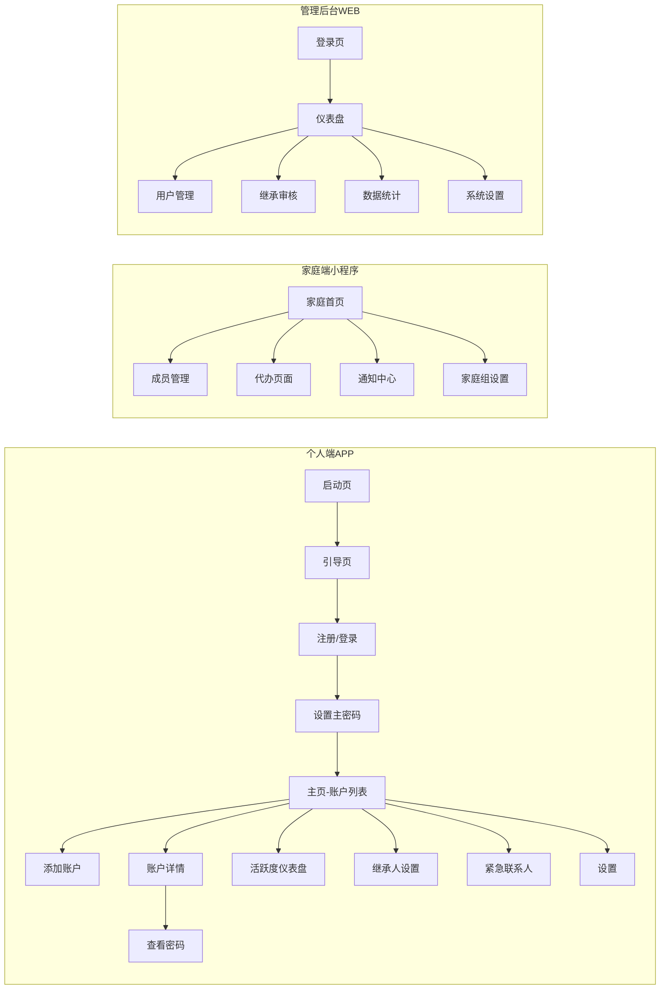

## 4.2 全站点原型设计

### 4.2.1 个人端 APP

**页面清单：**

| 序号 | 页面名称 | 所属模块 | 页面描述 | 关键元素 |
| --- | --- | --- | --- | --- |
| 1 | 启动/引导页 | 用户认证 | 产品功能介绍引导 | 滑动卡片、开始使用按钮 |
| 2 | 注册/登录页 | 用户认证 | 手机号注册、登录方式选择 | 手机号输入、验证码、生物识别按钮 |
| 3 | 设置主密码 | 用户认证 | 首次注册设置主密码 | 密码输入、强度指示器 |
| 4 | 主页-账户列表 | 账户管理 | 按分类展示所有账户 | 分类Tab、搜索框、账户卡片、+添加按钮 |
| 5 | 添加账户 | 账户管理 | 选择类型填写信息 | 类型选择器、表单、保存按钮 |
| 6 | 账户详情 | 账户管理 | 查看单个账户完整信息 | 账户信息卡片、查看密码按钮、编辑/删除 |
| 7 | 密码查看 | 账户管理 | 身份验证后显示密码 | 验证方式选择、密码大字体显示、复制按钮 |
| 8 | 活跃度仪表盘 | 活跃度检测 | 账户活跃度概览 | 统计卡片、活跃度分布图、账户列表 |
| 9 | 继承人设置 | 继承人授权 | 管理继承人列表 | 继承人卡片、添加按钮、权限设置 |
| 10 | 添加继承人 | 继承人授权 | 填写继承人信息和条件 | 信息表单、账户多选、条件选择 |
| 11 | 紧急联系人 | 紧急联系人 | 管理紧急联系人 | 联系人卡片、添加按钮、紧急按钮 |
| 12 | 设置页 | 系统设置 | 字体/对比度/安全/会员 | 设置项列表、切换开关 |

**交互说明：**

- 页面跳转关系：
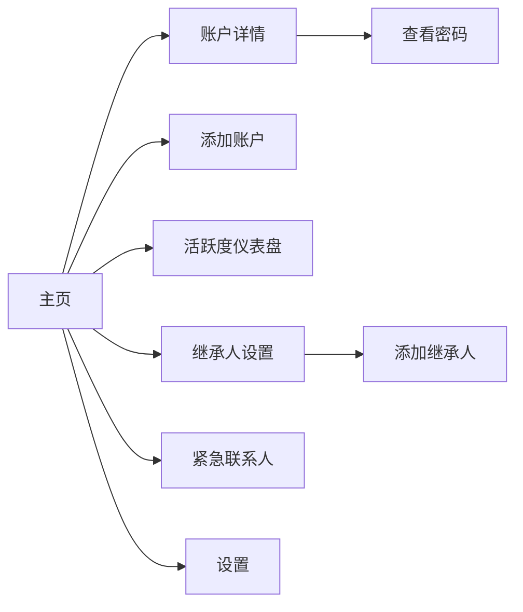

- 特殊交互：
  1. 底部导航栏固定5个Tab：首页、活跃度、继承人、紧急、设置
  2. 账户列表支持下拉刷新、上拉加载
  3. 添加账户使用大按钮（适老化），点击后弹出半屏表单
  4. 密码查看使用大字体居中显示，倒计时环形进度条
  5. 紧急联系人在首页顶部有快速激活按钮（红色醒目）

- 异常状态处理：
  1. 空数据态：无账户时显示引导图"点击+添加您的第一个账户"
  2. 加载态：使用骨架屏加载
  3. 错误态：网络错误显示重试按钮

**产品原型：**

[📱 打开个人端APP全站点原型](assets/prototypes/personal-app-prototype.html)

### 4.2.2 家庭端小程序

**页面清单：**

| 序号 | 页面名称 | 所属模块 | 页面描述 | 关键元素 |
| --- | --- | --- | --- | --- |
| 1 | 家庭首页 | 家庭组 | 家庭组概览 | 成员头像、账户概览、快捷操作 |
| 2 | 成员管理 | 家庭组 | 查看/管理成员 | 成员列表、角色标签、邀请按钮 |
| 3 | 邀请成员 | 家庭组 | 邀请新成员 | 手机号输入、二维码展示 |
| 4 | 代办页面 | 代办管理 | 代父母管理账户 | 选择代办对象、账户列表、操作按钮 |
| 5 | 通知中心 | 家庭通知 | 接收各类通知 | 通知列表、分类筛选 |
| 6 | 家庭设置 | 家庭组 | 家庭组配置 | 家庭信息、订阅管理、退出家庭组 |

**交互说明：**

- 页面跳转关系：
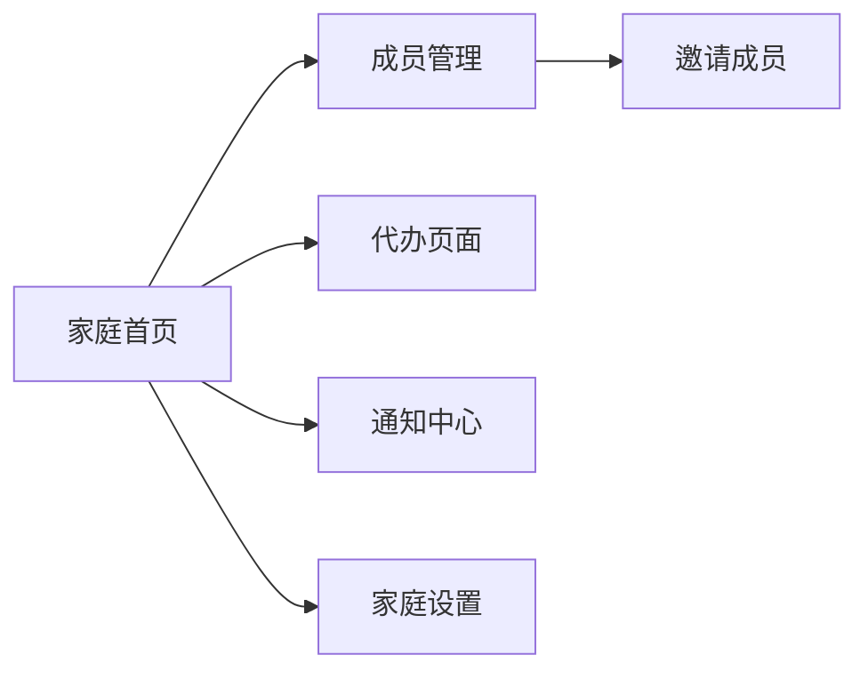

- 特殊交互：
  1. 小程序底部Tab：首页、代办、消息、我的
  2. 代办页面先选择代办对象（哪位长辈），再展示其账户列表
  3. 通知列表支持按类型筛选（活跃度/继承/紧急）

**产品原型：**

[📱 打开家庭端小程序全站点原型](assets/prototypes/family-mini-prototype.html)

### 4.2.3 管理后台

**页面清单：**

| 序号 | 页面名称 | 所属模块 | 页面描述 | 关键元素 |
| --- | --- | --- | --- | --- |
| 1 | 登录页 | 系统 | 管理员登录 | 账号密码输入、登录按钮 |
| 2 | 仪表盘 | 数据统计 | 平台运营概览 | 统计卡片、趋势图表 |
| 3 | 用户列表 | 用户管理 | 用户搜索与管理 | 搜索框、用户表格、操作列 |
| 4 | 用户详情 | 用户管理 | 用户详细信息 | 基本信息、账户列表、操作日志 |
| 5 | 继承审核 | 继承审核 | 审核继承申请 | 申请列表、证明材料查看、审核操作 |
| 6 | 数据统计 | 数据统计 | 详细统计数据 | 多种图表、时间筛选、导出 |
| 7 | 系统设置 | 系统设置 | 参数配置 | 表单配置、保存按钮 |

**交互说明：**

- 页面跳转关系：
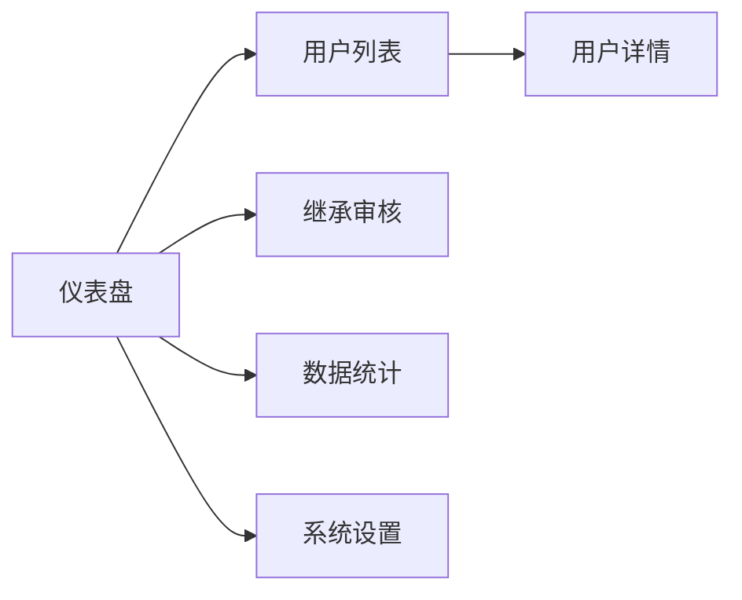

- 特殊交互：
  1. 左侧固定导航栏，右侧内容区
  2. 表格支持排序、筛选、分页
  3. 继承审核支持查看证明材料图片

**产品原型：**

[🖥️ 打开管理后台全站点原型](assets/prototypes/admin-web-prototype.html)

---

# 5 数据需求

## 5.1 数据使用规格

### 用户表 (users)

| **字段** | **是否必填** | **描述** | **数据类型** |
| --- | --- | --- | --- |
| id | 是 | 用户唯一ID | UUID |
| phone | 是 | 手机号（加密存储） | 字符串 |
| nickname | 否 | 昵称 | 字符串 |
| avatar_url | 否 | 头像URL | 字符串 |
| master_password_hash | 是 | 主密码哈希（不可逆） | 字符串 |
| real_name | 否 | 实名（加密存储） | 字符串 |
| id_card_hash | 否 | 身份证哈希 | 字符串 |
| membership_type | 是 | 会员类型：free/personal/family | 字符串 |
| membership_expire_at | 否 | 会员到期时间 | 时间戳 |
| created_at | 是 | 注册时间 | 时间戳 |
| status | 是 | 状态：active/disabled | 字符串 |

### 数字账户表 (digital_accounts)

| **字段** | **是否必填** | **描述** | **数据类型** |
| --- | --- | --- | --- |
| id | 是 | 账户唯一ID | UUID |
| user_id | 是 | 所属用户ID | UUID |
| account_type | 是 | 账户类型：bank/social/email/payment/social_security/other | 字符串 |
| account_name | 是 | 账户名称（如"工商银行"） | 字符串 |
| account_id_encrypted | 否 | 账号（AES-256加密） | 字符串 |
| password_encrypted | 否 | 密码（AES-256加密） | 字符串 |
| note | 否 | 备注信息 | 字符串 |
| tags | 否 | 标签数组 | JSON |
| last_login_at | 否 | 最后登录时间 | 时间戳 |
| activity_status | 是 | 活跃状态：active/low/inactive/forgotten | 字符串 |
| is_deleted | 是 | 是否已删除 | 布尔 |
| created_at | 是 | 创建时间 | 时间戳 |

### 继承人表 (heirs)

| **字段** | **是否必填** | **描述** | **数据类型** |
| --- | --- | --- | --- |
| id | 是 | 记录唯一ID | UUID |
| user_id | 是 | 设置人ID | UUID |
| heir_name | 是 | 继承人姓名 | 字符串 |
| heir_phone | 是 | 继承人手机号 | 字符串 |
| heir_id_card_hash | 否 | 继承人身份证哈希 | 字符串 |
| inheritable_account_ids | 是 | 可继承账户ID列表 | JSON |
| conditions | 是 | 继承条件：manual/disability/death | JSON数组 |
| status | 是 | 状态：pending/approved/rejected/active | 字符串 |
| created_at | 是 | 创建时间 | 时间戳 |

### 紧急联系人表 (emergency_contacts)

| **字段** | **是否必填** | **描述** | **数据类型** |
| --- | --- | --- | --- |
| id | 是 | 记录唯一ID | UUID |
| user_id | 是 | 设置人ID | UUID |
| contact_name | 是 | 联系人姓名 | 字符串 |
| contact_phone | 是 | 联系人手机号 | 字符串 |
| relationship | 是 | 与用户关系 | 字符串 |
| shareable_account_ids | 是 | 可共享账户ID列表 | JSON |
| trigger_conditions | 是 | 触发条件：manual/timeout/multi_confirm | JSON数组 |
| created_at | 是 | 创建时间 | 时间戳 |

### 家庭组表 (families)

| **字段** | **是否必填** | **描述** | **数据类型** |
| --- | --- | --- | --- |
| id | 是 | 家庭组唯一ID | UUID |
| name | 是 | 家庭组名称 | 字符串 |
| admin_user_id | 是 | 管理员用户ID | UUID |
| member_count | 是 | 成员数量 | 整数 |
| subscription_expire_at | 否 | 订阅到期时间 | 时间戳 |
| created_at | 是 | 创建时间 | 时间戳 |

## 5.2 统计数据

1. 统计注册用户总数、日新增、月活跃用户数，按日/周/月维度统计（P0）
2. 统计个人版/家庭版付费用户数、续费率、收入，按月维度统计（P0）
3. 统计平台托管账户总数、各类型分布、平均每个用户账户数（P1）
4. 统计账户活跃度分布（活跃/低活跃/长期未登录/可能遗忘占比），按周统计（P1）
5. 统计继承人设置数、继承申请数、审核通过/拒绝数（P1）

## 5.3 埋点需求

| 页面 | 事件 | 采集字段 | 说明 |
| --- | --- | --- | --- |
| 注册/登录 | register_success | user_id, register_method | 注册成功 |
| 注册/登录 | login_success | user_id, login_method | 登录成功 |
| 账户管理 | add_account | user_id, account_type | 添加账户 |
| 账户管理 | view_password | user_id, account_id, verify_method | 查看密码 |
| 账户管理 | delete_account | user_id, account_id | 删除账户 |
| 活跃度 | view_activity_report | user_id | 查看活跃度报告 |
| 活跃度 | mark_logged_in | user_id, account_ids | 标记已登录 |
| 继承人 | add_heir | user_id, condition_types | 添加继承人 |
| 继承人 | approve_inheritance | user_id, heir_id | 审批继承 |
| 紧急 | activate_emergency | user_id | 激活紧急模式 |
| 设置 | change_font_size | user_id, font_level | 修改字体大小 |
| 设置 | upgrade_family | user_id | 升级家庭版 |

---

# 6 非功能需求

## 6.1 性能需求

**6.1.1 延迟**

| 编号 | 项目 | 最大延迟 | 平均延迟 | 优先级 | 备注 |
| --- | --- | --- | --- | --- | --- |
| 0001 | 首页加载 | <2秒 | <1秒 | 高 | 4G网络环境 |
| 0002 | 密码解密显示 | <0.5秒 | <0.3秒 | 高 | 含身份验证 |
| 0003 | 账户列表加载（100条） | <1秒 | <0.5秒 | 高 | |
| 0004 | AES-256加密/解密 | <50ms | <20ms | 高 | 单次操作 |
| 0005 | API接口平均响应 | <500ms | <200ms | 中 | |
| 0006 | 活跃度检测（100账户） | <10秒 | <5秒 | 中 | 后台任务 |

**6.1.2 吞吐量**

| 编号 | 项 | 吞吐量 | 备注 |
| --- | --- | --- | --- |
| 0001 | 短信验证码发送 | 每分钟500次 | |
| 0002 | 用户登录认证 | 每分钟1000次 | |
| 0003 | 密码加解密 | 每分钟5000次 | |

**6.1.3 容量**

| 编号 | 项 | 容量 | 备注 |
| --- | --- | --- | --- |
| 0001 | 系统注册用户数 | <=1,000,000 | |
| 0002 | 并发在线用户 | <=10,000 | MVP阶段 |
| 0003 | 每用户托管账户数 | <=500 | 家庭版上限 |

## 6.2 安全需求

| 编号 | 项 |
| --- | --- |
| 0001 | 所有密码必须使用AES-256加密存储，密钥由用户主密码派生，系统不存储明文 |
| 0002 | 所有数据传输使用HTTPS加密（TLS 1.2+） |
| 0003 | 用户主密码不存储明文，仅存储bcrypt哈希 |
| 0004 | 查看密码前必须通过身份验证（生物识别/主密码/短信验证码） |
| 0005 | 紧急联系人仅有只读权限，不可修改账户信息 |
| 0006 | 失能/身故继承必须经过平台人工审核，不可自动授权 |
| 0007 | 所有敏感操作（查看密码、继承授权、紧急访问）必须记录审计日志 |
| 0008 | 不得将用户账户信息用于任何商业用途或第三方共享 |
| 0009 | 需符合《个人信息保护法》《数据安全法》相关要求 |
| 0010 | 主密码连续输错5次锁定30分钟，防止暴力破解 |

## 6.3 可靠性

| 编号 | 项 | 值 |
| --- | --- | --- |
| 0001 | 系统可用性 | >=99.5% |
| 0002 | 平均正常运行时间 | >=180天 |
| 0003 | 平均故障恢复时间 | <=30分钟 |

## 6.4 可连续性

| 编号 | 项 |
| --- | --- |
| 0001 | 系统需要7×24小时全天候运行 |
| 0002 | 加密服务、认证服务需部署多实例，支持故障自动切换 |

## 6.5 可恢复性

| 编号 | 项 |
| --- | --- |
| 0001 | 每日自动全量备份，备份保留30天 |
| 0002 | 每小时增量备份 |
| 0003 | 重大故障需在1-3小时恢复服务可用性 |
| 0004 | 24-72小时内恢复历史数据 |

## 6.6 兼容性

| 编号 | 要求 | 备注 |
| --- | --- | --- |
| 0001 | iOS 12.0及以上 | |
| 0002 | Android 7.0及以上 | |
| 0003 | 微信小程序基础库2.0+ | |
| 0004 | Chrome >=80, Firefox >=75, Safari >=13, Edge >=80 | 管理后台 |
| 0005 | 移动端适配主流分辨率：375×667, 390×844, 414×896 | |

## 6.7 易用性

| 编号 | 要求 | 备注 |
| --- | --- | --- |
| 0001 | 核心操作路径不超过3步 | 适老化要求 |
| 0002 | 普通老年用户无需培训即可使用核心功能 | |
| 0003 | 字体支持四档调节 | |
| 0004 | 错误提示使用通俗易懂语言 | 避免技术术语 |
| 0005 | 首次使用提供图文+语音引导 | |

---

# 7 总结

## 7.1 商业模式

### 订阅定价

| 版本 | 价格 | 功能范围 | 目标用户 |
| --- | --- | --- | --- |
| 免费体验版 | ¥0 | 最多管理10个账户，基础活跃度检测 | 体验用户 |
| 个人版 | ¥9/月（¥99/年） | 最多管理100个账户，完整功能，1个继承人 | 个人老年用户 |
| 家庭版 | ¥19/月（¥199/年） | 最多管理500个账户，6个家庭成员，5个继承人，代办功能 | 家庭用户 |

### 收入预测（上线后12个月）
- 目标注册用户：10,000人
- 预期付费转化率：5-8%
- 个人版占比60%，家庭版占比40%
- 预计月收入：¥5,000-¥10,000（初期）

## 7.2 上线计划

| 阶段 | 时间 | 内容 | 负责人 |
| --- | --- | --- | --- |
| 开发阶段 | 第1-10天 | MVP核心功能开发（账户管理+加密存储+活跃度+继承人） | 开发团队 |
| 测试阶段 | 第11-14天 | 功能测试、安全测试、适老化测试 | QA团队 |
| 灰度阶段 | 第15-21天 | 灰度100用户（社区招募），验证核心流程 | 产品+运营 |
| 全量上线 | 第22天 | 应用商店上架，开放注册 | 全团队 |

## 7.3 后续迭代规划

- **V1.1**（上线后1个月）：家庭端小程序上线、代办管理功能、紧急联系人功能完善
- **V1.2**（上线后2个月）：语音辅助输入、账户自动识别（OCR识别银行卡号）、活跃度智能分析
- **V1.3**（上线后3个月）：管理后台数据统计完善、微信支付自动续费、多语言支持（方言语音）
- **V2.0**（上线后6个月）：数字遗产规划工具（可选）、与公证处/律所合作对接、企业版（养老机构）

## 7.4 MVP功能边界明确

| 包含（MVP V1.0） | 不包含（后续版本） |
| --- | --- |
| 账户管理（添加/查看/编辑/删除） | 语音辅助输入 |
| 密码AES-256加密存储 | OCR自动识别银行卡 |
| 活跃度检测（三级阈值+提醒） | 数字遗产规划工具 |
| 继承人授权（三种条件） | 企业版/养老机构版 |
| 大字体+高对比度适老化界面 | 方言语音支持 |
| 个人版订阅付费 | 自动续费 |
| 基础管理后台（用户管理+继承审核） | 完整数据统计 |
| - | 家庭端小程序 |
| - | 紧急联系人 |
| - | 代办管理 |

## 7.5 参考文档

- [老年人数字遗产管家 - 用户需求说明书 (URS)](需求文档.md)
- [优特云PRD模板](../../.claude/skills/jxh-tools-prd-assistant/assets/templates/utyun-prd-template.md)
