# 老年人数字遗产管家 - 用户需求说明书 (URS)

> **文档版本**：v1.0.0
> **产品名称**：老年人数字遗产管家
> **文档状态**：待审核
> **最后更新**：2026-06-29

---

# 1. 需求概述

## 1.1 需求介绍

"老年人数字遗产管家"是一款面向中老年用户（50岁以上）及其家庭的小众刚需型数字资产管理工具。产品聚焦"老年人数字遗产管理+家庭传承"这一垂直场景，帮助用户集中管理各类网络账户（银行、社保、微信、邮箱等）和密码，并提供账户活跃度检测、继承人授权、紧急联系人共享等核心功能。

产品定位：**不做通用密码管理器**，而是专注于解决中老年人群"数字遗产无人打理"这一日益突出的社会问题，填补现有密码管理工具（如 1Password、LastPass）在遗产管理场景下的空白。

### 1.1.1 所属领域

- **主领域**：个人/家庭数字资产管理
- **关联领域**：养老服务科技（AgeTech）、家庭金融管理、数字遗产规划
- **目标行业**：C端消费者服务（银发经济细分市场）

## 1.2 需求目标

1. **集中化管理**：让中老年用户能够在一个安全、易用的平台上集中管理自己所有重要的网络账户和密码，避免"忘记密码、找不到账户"的困扰。
2. **家庭传承保障**：通过继承人授权机制，确保用户的数字遗产在必要时能够被指定的继承人合法、安全地访问，避免数字资产"断档"。
3. **活跃度守护**：通过定期检测账户活跃度，及时发现长期未登录的异常账户，提醒用户或家属核查，防范账户被盗或遗忘的风险。
4. **紧急联络通道**：在突发情况（如用户失去行为能力）下，紧急联系人可以通过预设的授权机制获取必要的账户信息，保障家庭应急需求。
5. **老年人友好体验**：提供大字体、高对比度、简化操作流程、语音辅助等适老化设计，降低中老年用户的使用门槛。
6. **MVP快速验证**：在约10天开发周期内完成核心功能（账户管理+密码加密存储+活跃度检测+继承人授权），快速推向市场验证需求。

## 1.3 系统使用角色

| 角色 | 描述 | 典型用户画像 |
|------|------|------------|
| **个人用户（老年用户）** | 50岁以上的中老年用户，需要管理自己的网络账户和密码 | 张大爷（65岁），退休后使用微信、银行APP、社保账户等，但经常忘记密码 |
| **家庭成员（代办人）** | 帮助父母/长辈管理数字资产的成年子女或亲属 | 李女士（38岁），替70岁的母亲管理多个银行账户和医保账户 |
| **继承人** | 被用户指定为数字遗产继承人的家庭成员或信任人士 | 张大爷的儿子，被授权在父亲去世后可访问指定的银行账户信息 |
| **紧急联系人** | 在紧急情况下可获取用户指定账户信息的信任人士 | 用户的邻居或好友，在用户突发疾病时可查看医保账户信息 |
| **系统管理员** | 负责后台运营管理的平台工作人员 | 平台运维人员，负责用户管理、数据监控等 |

## 1.4 业务流程图

### 1.4.1 用户注册与账户添加流程

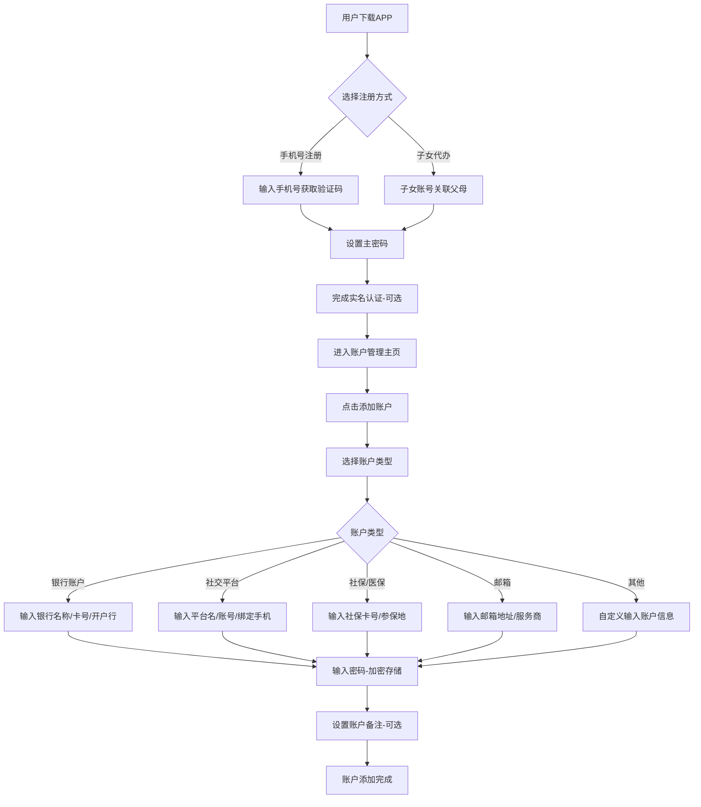

### 1.4.2 密码加密存储与查看流程

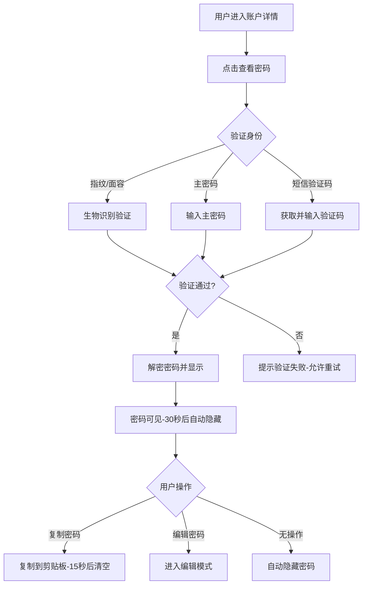

### 1.4.3 账户活跃度检测流程

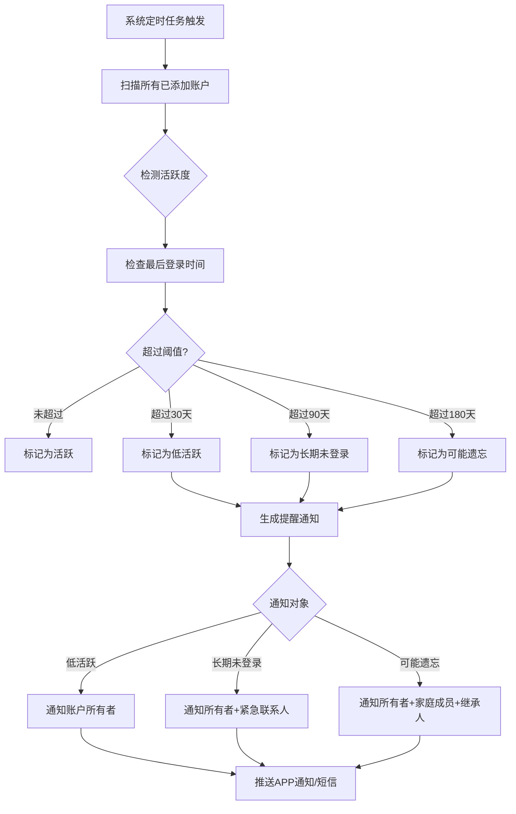

### 1.4.4 继承人授权与访问流程

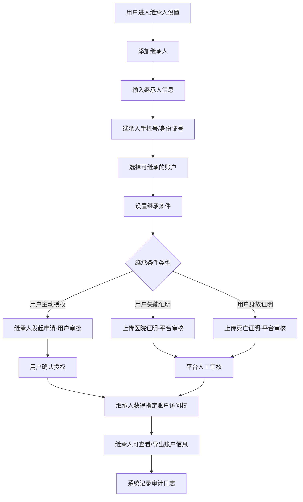

### 1.4.5 紧急联系人共享流程

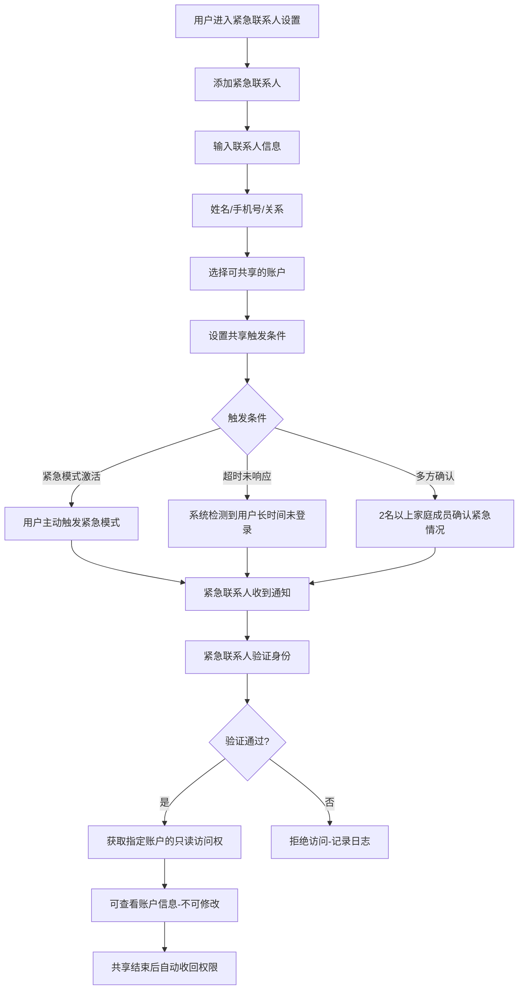

### 1.4.6 家庭版多成员管理流程

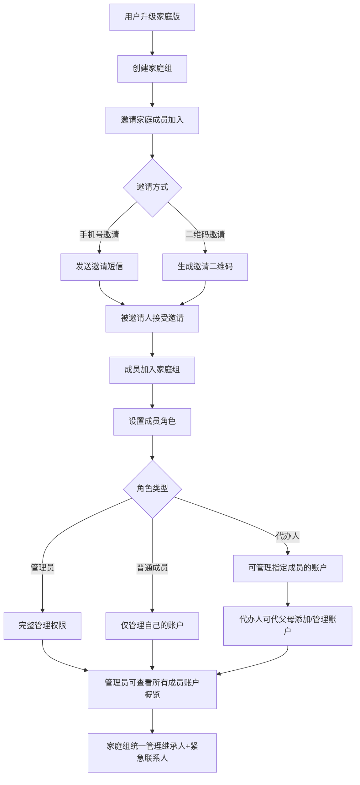

# 2. 功能原型

| 原型名称 | 原型链接 | 对应端 | 备注 |
| --- | --- | --- | --- |
| 老年人数字遗产管家-个人端APP | 待设计 | APP端 | 面向老年用户的主APP，适老化设计 |
| 老年人数字遗产管家-家庭端小程序 | 待设计 | 小程序端 | 家庭成员通过微信小程序管理家庭账户 |
| 老年人数字遗产管家-管理后台 | 待设计 | WEB端 | 平台运营管理后台 |

# 3. 需求清单

## 3.1 个人端-APP端

### 3.1.1 用户认证与账户管理模块

| 模块 | 一级功能 | 二级功能 | 功能描述 | 备注 |
|------|---------|---------|---------|------|
| 用户认证 | 注册登录 | 手机号注册 | 用户通过手机号+短信验证码完成注册 | 主登录方式 |
| 用户认证 | 注册登录 | 密码登录 | 用户使用手机号+主密码登录 | 备选登录方式 |
| 用户认证 | 注册登录 | 生物识别登录 | 支持指纹/面容识别快速登录 | 适老化设计 |
| 用户认证 | 主密码管理 | 设置主密码 | 用户设置高强度主密码用于加密 | 至少8位，含字母数字 |
| 用户认证 | 主密码管理 | 修改主密码 | 用户可修改主密码，需验证原密码 |  |
| 用户认证 | 主密码管理 | 主密码找回 | 通过手机号+身份证后6位找回主密码 | 需严格身份验证 |
| 用户认证 | 实名认证 | 身份认证 | 用户可选实名认证，提升继承授权可信度 | 非强制 |
| 账户管理 | 个人资料 | 查看基本信息 | 查看手机号、注册时间、会员状态 |  |
| 账户管理 | 个人资料 | 修改昵称/头像 | 支持修改个人昵称和头像 |  |
| 账户管理 | 安全设置 | 自动锁定时间 | 设置APP无操作后自动锁定时间 | 默认5分钟 |
| 账户管理 | 安全设置 | 登录日志查看 | 查看近期登录记录（时间、设备、IP） |  |

### 3.1.2 数字账户管理模块

| 模块 | 一级功能 | 二级功能 | 功能描述 | 备注 |
|------|---------|---------|---------|------|
| 账户管理 | 添加账户 | 选择账户类型 | 支持银行、社保、社交、邮箱、支付、其他等分类 |  |
| 账户管理 | 添加账户 | 填写账户信息 | 根据账户类型填写对应的账户信息字段 | 字段动态适配 |
| 账户管理 | 添加账户 | 密码加密存储 | 账户密码使用AES-256加密后存储 | 核心安全功能 |
| 账户管理 | 添加账户 | 账户备注 | 可为每个账户添加备注信息（如卡号后4位、开户行等） | 可选填 |
| 账户管理 | 添加账户 | 账户标签 | 可为账户打标签（如"常用"、"重要"、"已退休"等） | 便于分类查找 |
| 账户管理 | 查看账户 | 账户列表 | 按分类/标签/活跃度展示所有账户 | 支持多种视图 |
| 账户管理 | 查看账户 | 账户详情 | 查看单个账户的完整信息（密码需验证后显示） |  |
| 账户管理 | 查看账户 | 搜索账户 | 支持按账户名、账号、备注模糊搜索 |  |
| 账户管理 | 查看账户 | 筛选排序 | 按账户类型、最后登录时间、标签筛选排序 |  |
| 账户管理 | 查看密码 | 身份验证 | 查看密码前需通过指纹/主密码/短信验证码验证 | 三级验证可选 |
| 账户管理 | 查看密码 | 密码显示 | 验证通过后显示密码，30秒后自动隐藏 | 安全保护 |
| 账户管理 | 查看密码 | 复制密码 | 支持一键复制密码到剪贴板，15秒后自动清空 |  |
| 账户管理 | 编辑账户 | 修改账户信息 | 修改账户名、账号、备注等信息 |  |
| 账户管理 | 编辑账户 | 修改密码 | 更新账户密码，新密码自动加密存储 |  |
| 账户管理 | 编辑账户 | 删除账户 | 删除不再使用的账户，需二次确认 | 软删除 |
| 账户管理 | 账户分类 | 预设分类 | 系统预设银行、社保、微信、支付宝、邮箱等常见分类 |  |
| 账户管理 | 账户分类 | 自定义分类 | 用户可创建自定义账户分类 |  |
| 账户管理 | 账户分类 | 分类管理 | 编辑/删除自定义分类，调整分类排序 |  |

### 3.1.3 活跃度检测模块

| 模块 | 一级功能 | 二级功能 | 功能描述 | 备注 |
|------|---------|---------|---------|------|
| 活跃度检测 | 检测设置 | 启用检测 | 开启/关闭账户活跃度检测功能 | 默认开启 |
| 活跃度检测 | 检测设置 | 检测周期 | 设置检测频率（每日/每周/每月） | 默认每周一次 |
| 活跃度检测 | 检测设置 | 阈值设置 | 设置低活跃/长期未登录/可能遗忘的天数阈值 | 默认30/90/180天 |
| 活跃度检测 | 手动记录 | 标记已登录 | 用户手动标记某账户"已登录"，更新活跃度 |  |
| 活跃度检测 | 手动记录 | 批量标记 | 批量标记多个账户为"已登录" |  |
| 活跃度检测 | 提醒通知 | 低活跃提醒 | 账户超过30天未登录，推送提醒给账户所有者 |  |
| 活跃度检测 | 提醒通知 | 长期未登录提醒 | 超过90天未登录，推送提醒给所有者+紧急联系人 |  |
| 活跃度检测 | 提醒通知 | 可能遗忘提醒 | 超过180天未登录，推送提醒给所有者+家庭+继承人 | 升级通知 |
| 活跃度检测 | 提醒通知 | 提醒方式 | 支持APP推送、短信、微信服务号通知 | 可配置 |
| 活跃度检测 | 活跃度报告 | 查看报告 | 查看账户活跃度概览报告（活跃/低活跃/未登录统计） |  |
| 活跃度检测 | 活跃度报告 | 历史趋势 | 查看过去3/6/12个月的活跃度变化趋势 |  |

### 3.1.4 继承人授权模块

| 模块 | 一级功能 | 二级功能 | 功能描述 | 备注 |
|------|---------|---------|---------|------|
| 继承人授权 | 添加继承人 | 填写继承人信息 | 输入继承人姓名、手机号、身份证号 | 必填 |
| 继承人授权 | 添加继承人 | 选择可继承账户 | 指定该继承人可继承哪些账户 | 可多选 |
| 继承人授权 | 添加继承人 | 设置继承条件 | 设置继承触发的条件（主动授权/失能证明/身故证明） |  |
| 继承人授权 | 管理继承人 | 查看继承人列表 | 查看所有已设置的继承人及其权限 |  |
| 继承人授权 | 管理继承人 | 修改继承权限 | 修改继承人可访问的账户范围 |  |
| 继承人授权 | 管理继承人 | 删除继承人 | 删除已设置的继承人，需二次确认 |  |
| 继承人授权 | 继承审批 | 查看继承申请 | 查看继承人发起的继承申请 | 主动授权场景 |
| 继承人授权 | 继承审批 | 审批申请 | 同意/拒绝继承人的访问申请 |  |
| 继承人授权 | 继承记录 | 查看继承日志 | 查看继承授权的历史记录 | 审计需求 |

### 3.1.5 紧急联系人模块

| 模块 | 一级功能 | 二级功能 | 功能描述 | 备注 |
|------|---------|---------|---------|------|
| 紧急联系人 | 添加联系人 | 填写联系人信息 | 输入紧急联系人姓名、手机号、与用户关系 |  |
| 紧急联系人 | 添加联系人 | 选择可共享账户 | 指定紧急情况下该联系人可查看哪些账户 |  |
| 紧急联系人 | 添加联系人 | 设置触发条件 | 设置紧急模式激活/超时未响应/多方确认等触发条件 |  |
| 紧急联系人 | 管理联系人 | 查看联系人列表 | 查看所有已设置的紧急联系人 |  |
| 紧急联系人 | 管理联系人 | 修改共享权限 | 修改紧急联系人可查看的账户范围 |  |
| 紧急联系人 | 管理联系人 | 删除联系人 | 删除紧急联系人，需二次确认 |  |
| 紧急联系人 | 紧急模式 | 激活紧急模式 | 用户主动激活紧急模式，通知紧急联系人 |  |
| 紧急联系人 | 紧急模式 | 紧急访问请求 | 紧急联系人发起紧急访问请求 |  |
| 紧急联系人 | 紧急模式 | 身份验证 | 紧急联系人需通过身份验证才能访问 |  |
| 紧急联系人 | 紧急模式 | 临时授权 | 紧急情况下给予紧急联系人临时只读访问权 | 有效期24小时 |

# 3.2 家庭端-小程序端

### 3.2.1 家庭组管理模块

| 模块 | 一级功能 | 二级功能 | 功能描述 | 备注 |
|------|---------|---------|---------|------|
| 家庭组管理 | 创建家庭组 | 升级家庭版 | 个人用户升级为家庭版，创建家庭组 | ¥19/月 |
| 家庭组管理 | 创建家庭组 | 设置家庭信息 | 设置家庭组名称、家庭简介 |  |
| 家庭组管理 | 邀请成员 | 手机号邀请 | 通过手机号向家庭成员发送邀请 |  |
| 家庭组管理 | 邀请成员 | 二维码邀请 | 生成家庭组二维码，成员扫码加入 | 适老化设计 |
| 家庭组管理 | 邀请成员 | 邀请审批 | 被邀请人接受邀请后需管理员审批 |  |
| 家庭组管理 | 成员管理 | 查看成员列表 | 查看所有家庭成员及其角色 |  |
| 家庭组管理 | 成员管理 | 设置成员角色 | 设置管理员/普通成员/代办人角色 |  |
| 家庭组管理 | 成员管理 | 移除成员 | 将成员移出家庭组 |  |
| 家庭组管理 | 成员管理 | 转让管理员 | 将管理员权限转让给其他成员 |  |

### 3.2.2 代办管理模块

| 模块 | 一级功能 | 二级功能 | 功能描述 | 备注 |
|------|---------|---------|---------|------|
| 代办管理 | 代办授权 | 授权代办权限 | 父母授权子女代办管理指定账户 |  |
| 代办管理 | 代办授权 | 设置代办范围 | 指定子女可代办的账户范围 |  |
| 代办管理 | 代办操作 | 代添加账户 | 子女代父母添加新的网络账户 |  |
| 代办管理 | 代办操作 | 代修改信息 | 子女代父母修改账户信息 |  |
| 代办管理 | 代办操作 | 代查看密码 | 子女代父母查看账户密码（需验证） | 记录审计日志 |
| 代办管理 | 代办记录 | 查看代办日志 | 查看子女代为操作的历史记录 |  |

### 3.2.3 家庭通知模块

| 模块 | 一级功能 | 二级功能 | 功能描述 | 备注 |
|------|---------|---------|---------|------|
| 家庭通知 | 活跃度通知 | 接收家人账户提醒 | 接收父母账户长期未登录的提醒通知 |  |
| 家庭通知 | 活跃度通知 | 接收继承相关通知 | 接收继承申请、继承审批结果等通知 |  |
| 家庭通知 | 活跃度通知 | 接收紧急通知 | 接收紧急模式激活、紧急访问请求等通知 |  |
| 家庭通知 | 消息设置 | 通知偏好 | 设置接收哪些类型的通知 |  |
| 家庭通知 | 消息设置 | 免打扰时间 | 设置通知免打扰时段 |  |

# 3.3 管理后台-WEB端

### 3.3.1 用户管理模块

| 模块 | 一级功能 | 二级功能 | 功能描述 | 备注 |
|------|---------|---------|---------|------|
| 用户管理 | 用户列表 | 查看用户列表 | 查看所有注册用户信息 |  |
| 用户管理 | 用户列表 | 搜索用户 | 按手机号/昵称/ID搜索用户 |  |
| 用户管理 | 用户详情 | 查看用户详情 | 查看单个用户的详细信息、账户概览、活跃度 |  |
| 用户管理 | 用户详情 | 查看操作日志 | 查看用户的操作历史记录 |  |
| 用户管理 | 用户管理 | 禁用用户 | 禁用违规用户账号 |  |
| 用户管理 | 用户管理 | 重置用户密码 | 协助用户重置主密码（需严格审核） |  |

### 3.3.2 家庭组管理模块

| 模块 | 一级功能 | 二级功能 | 功能描述 | 备注 |
|------|---------|---------|---------|------|
| 家庭组管理 | 家庭组列表 | 查看家庭组列表 | 查看所有家庭组信息 |  |
| 家庭组管理 | 家庭组列表 | 搜索家庭组 | 按家庭名称/管理员搜索 |  |
| 家庭组管理 | 家庭组详情 | 查看成员构成 | 查看家庭组成员列表及角色 |  |
| 家庭组管理 | 家庭组详情 | 查看订阅状态 | 查看家庭版订阅状态、到期时间 |  |

### 3.3.3 继承授权审核模块

| 模块 | 一级功能 | 二级功能 | 功能描述 | 备注 |
|------|---------|---------|---------|------|
| 继承审核 | 审核列表 | 查看待审核申请 | 查看所有待审核的继承申请 |  |
| 继承审核 | 审核列表 | 查看历史审核 | 查看已处理的继承申请记录 |  |
| 继承审核 | 审核操作 | 审核通过 | 审核通过继承申请（失能/身故证明场景） | 人工审核 |
| 继承审核 | 审核操作 | 审核拒绝 | 拒绝继承申请，需填写拒绝原因 |  |
| 继承审核 | 审核操作 | 查看证明材料 | 查看用户上传的证明材料（医院证明/死亡证明） |  |

### 3.3.4 数据统计模块

| 模块 | 一级功能 | 二级功能 | 功能描述 | 备注 |
|------|---------|---------|---------|------|
| 数据统计 | 用户统计 | 注册用户数 | 统计注册用户总数、日新增、月新增 |  |
| 数据统计 | 用户统计 | 付费用户数 | 统计个人版/家庭版付费用户数 |  |
| 数据统计 | 账户统计 | 托管账户总数 | 统计平台托管的账户总数 |  |
| 数据统计 | 账户统计 | 账户类型分布 | 统计各类型账户的数量分布 |  |
| 数据统计 | 活跃度统计 | 活跃度概览 | 统计全平台账户活跃度分布 |  |
| 数据统计 | 活跃度统计 | 异常账户数 | 统计长期未登录的异常账户数 |  |
| 数据统计 | 继承统计 | 继承授权数 | 统计已设置的继承人数量 |  |
| 数据统计 | 继承统计 | 继承完成数 | 统计已完成的继承案例数 |  |

### 3.3.5 系统设置模块

| 模块 | 一级功能 | 二级功能 | 功能描述 | 备注 |
|------|---------|---------|---------|------|
| 系统设置 | 参数配置 | 活跃度阈值配置 | 配置活跃度检测的默认阈值 |  |
| 系统设置 | 参数配置 | 通知模板配置 | 配置各类通知的文案模板 |  |
| 系统设置 | 参数配置 | 订阅价格配置 | 配置个人版/家庭版订阅价格 |  |
| 系统设置 | 审核流程 | 审核规则配置 | 配置继承审核的规则和流程 |  |

# 4. 非功能需求

## 4.1 使用界面需求

| 需求项 | 需求描述 | 优先级 |
|--------|---------|--------|
| 适老化字体 | 支持大字体模式，字体大小可调节（小/中/大/超大四档） | P0 |
| 高对比度 | 支持高对比度主题，文字与背景对比度符合WCAG 2.1 AA标准 | P0 |
| 简化操作流程 | 核心功能（添加账户、查看密码）操作步骤不超过3步 | P0 |
| 语音辅助 | 支持语音输入账户信息，语音朗读账户列表 | P1 |
| 清晰图标 | 使用大尺寸、高识别度的图标，避免抽象符号 | P0 |
| 操作引导 | 首次使用提供图文+语音引导教程 | P1 |
| 错误提示 | 错误提示使用通俗易懂的语言，避免技术术语 | P0 |
| 手势简化 | 避免复杂手势操作，主要使用点击和滑动 | P0 |
| 响应式布局 | 适配不同屏幕尺寸的手机和平板 | P1 |

## 4.2 软硬件环境需求

| 环境类型 | 需求描述 | 优先级 |
|---------|---------|--------|
| iOS客户端 | 支持iOS 12.0及以上版本 | P0 |
| Android客户端 | 支持Android 7.0及以上版本 | P0 |
| 微信小程序 | 支持微信7.0及以上版本 | P0 |
| WEB后台 | 支持Chrome 80+、Firefox 75+、Safari 13+、Edge 80+ | P0 |
| 后端服务器 | Linux环境，支持Docker容器化部署 | P0 |
| 数据库 | MySQL 8.0+（业务数据），Redis 6.0+（缓存） | P0 |
| 云存储 | 阿里云OSS/腾讯云COS（用于存储证明材料等附件） | P1 |
| 短信服务 | 接入阿里云短信/腾讯云短信（用于验证码和通知） | P0 |

## 4.3 性能需求

| 需求项 | 需求指标 | 优先级 |
|--------|---------|--------|
| 页面加载时间 | 首页加载时间不超过2秒（4G网络） | P0 |
| 密码解密时间 | 密码解密显示时间不超过0.5秒 | P0 |
| 账户列表加载 | 100个账户列表加载时间不超过1秒 | P0 |
| 并发用户支持 | 支持1000并发用户在线 | P1 |
| 加密性能 | AES-256加密/解密操作延迟不超过50ms | P0 |
| 可用性 | 系统可用性达到99.5% | P1 |
| 数据备份 | 每日自动备份，备份保留30天 | P0 |
| 响应时间 | API接口平均响应时间不超过500ms | P1 |

## 4.4 约束性需求

| 约束项 | 约束描述 | 优先级 |
|--------|---------|--------|
| 数据安全 | 所有密码必须使用AES-256加密存储，不可明文存储 | P0 |
| 传输安全 | 所有数据传输必须使用HTTPS加密 | P0 |
| 隐私保护 | 不得将用户账户信息用于任何商业用途或第三方共享 | P0 |
| 合规要求 | 需符合《个人信息保护法》《数据安全法》相关要求 | P0 |
| 主密码不可恢复 | 系统不存储用户主密码，主密码丢失只能通过身份验证重置 | P0 |
| 继承审核 | 失能/身故继承必须经过人工审核，不可自动授权 | P0 |
| 紧急访问限制 | 紧急联系人仅有只读权限，不可修改账户信息 | P0 |
| 操作审计 | 所有敏感操作（查看密码、继承授权、紧急访问）必须记录审计日志 | P0 |
| MVP范围约束 | 首版仅实现账户管理+密码加密存储+活跃度检测+继承人授权核心功能 | P0 |
| 不做通用密码管理 | 产品定位聚焦数字遗产管理，不做通用密码管理器的功能扩展 | P0 |
| 后台服务需求 | 需要后端服务支撑用户认证、数据加密、定时检测、消息通知等功能 | P0 |

# 5. 接口需求

## 5.1 硬件接口需求

本产品为纯软件应用，不涉及硬件接口需求。

## 5.2 软件接口需求

| 模块 | 接口名称 | 输入 | 输出 | 功能描述 |
|------|---------|------|------|---------|
| 用户认证 | 短信验证码接口 | 手机号 | 验证码发送结果 | 调用第三方短信服务发送验证码 |
| 用户认证 | 生物识别接口 | 指纹/面容数据 | 验证结果 | 调用系统级生物识别API进行身份验证 |
| 数据加密 | AES-256加密接口 | 明文密码+密钥 | 加密后密文 | 对用户密码进行AES-256加密 |
| 数据加密 | AES-256解密接口 | 密文+密钥 | 明文密码 | 对用户密码进行解密 |
| 活跃度检测 | 定时任务接口 | 检测任务配置 | 检测结果 | 定时触发账户活跃度检测任务 |
| 消息通知 | APP推送接口 | 推送内容+目标用户 | 推送结果 | 调用推送服务发送APP通知 |
| 消息通知 | 短信通知接口 | 短信内容+手机号 | 发送结果 | 调用短信服务发送通知短信 |
| 消息通知 | 微信服务号接口 | 模板消息+用户openid | 发送结果 | 通过微信服务号发送模板消息 |
| 继承审核 | 文件上传接口 | 证明材料文件 | 文件存储URL | 上传继承证明材料到云存储 |
| 继承审核 | 文件预览接口 | 文件存储URL | 文件预览数据 | 预览已上传的证明材料 |
| 家庭组 | 微信小程序接口 | 小程序码数据 | 小程序码图片 | 生成家庭组邀请二维码 |
| 支付 | 支付接口 | 订单信息 | 支付结果 | 调用微信支付/支付宝完成订阅支付 |

## 5.4 通讯接口需求

| 通讯类型 | 需求描述 | 优先级 |
|---------|---------|--------|
| HTTPS | 所有客户端与服务端通信使用HTTPS加密 | P0 |
| WebSocket | 后台管理端使用WebSocket实现实时通知 | P2 |
| RESTful API | 客户端与后端通过RESTful API进行数据交互 | P0 |

# 6. 附录

## 流程图

### 6.1 用户完整使用流程

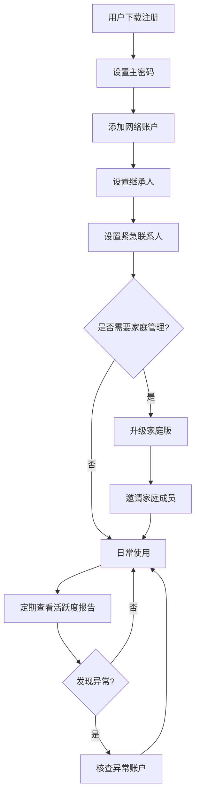

### 6.2 数据加密存储流程

## 时序图

### 6.3 继承人访问授权时序

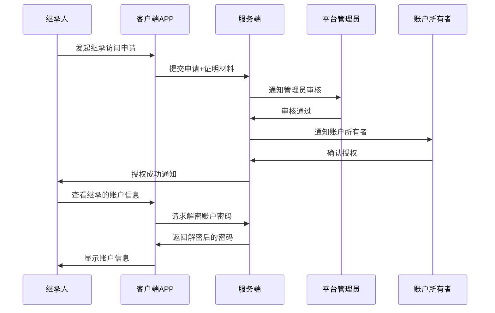

### 6.4 紧急联系人访问时序

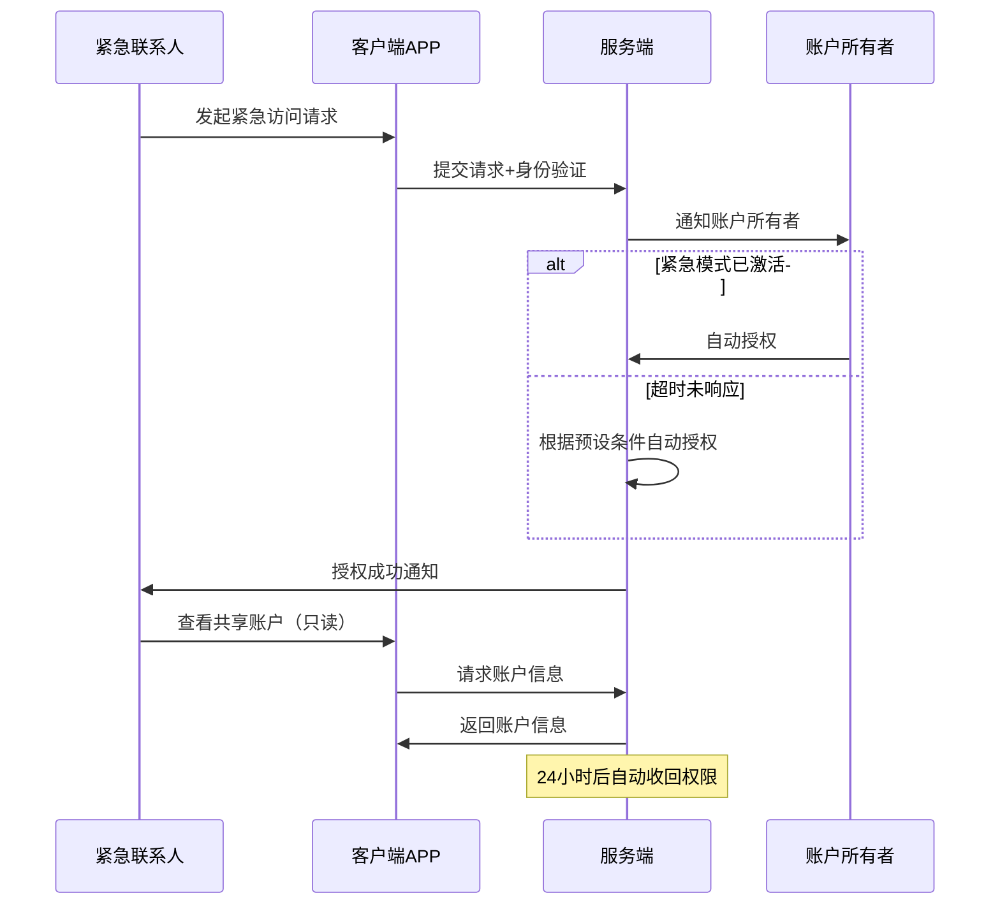

## （用户与系统交互）用例图

### 6.5 个人用户用例图

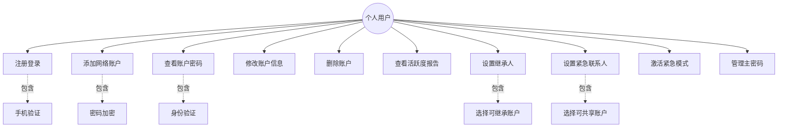

### 6.6 家庭成员用例图

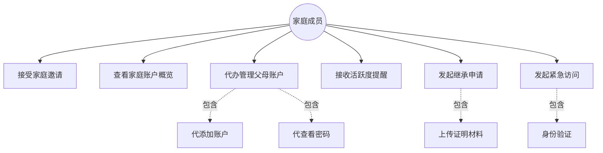

## （系统）状态图

### 6.7 账户活跃度状态图

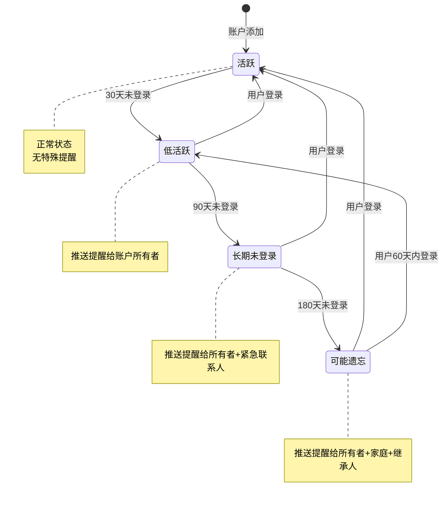

### 6.8 继承授权状态图

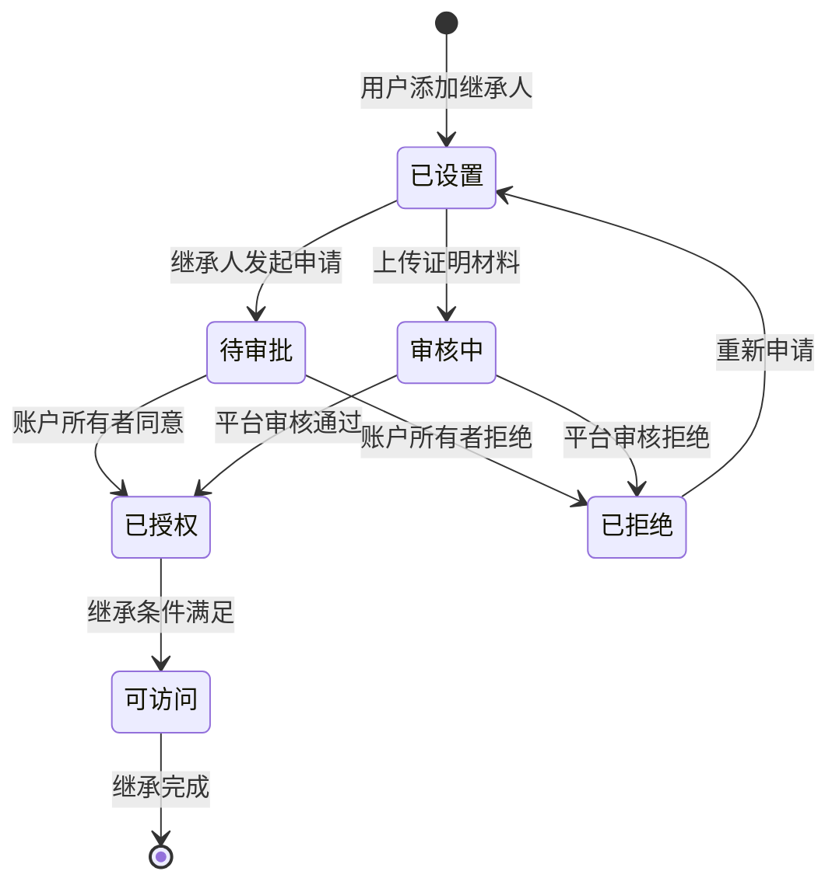
