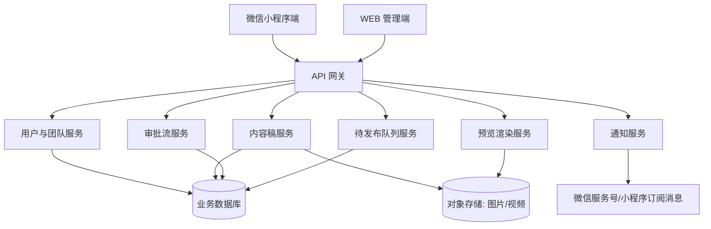
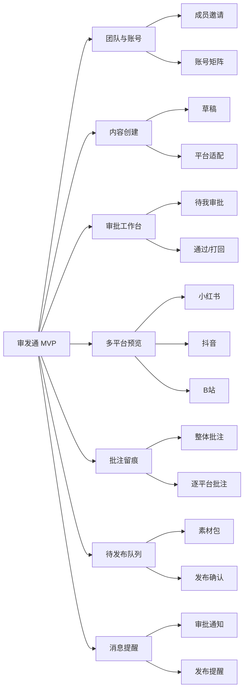
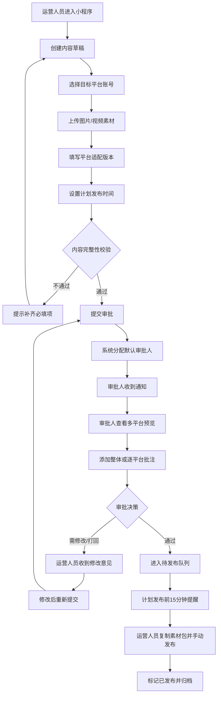
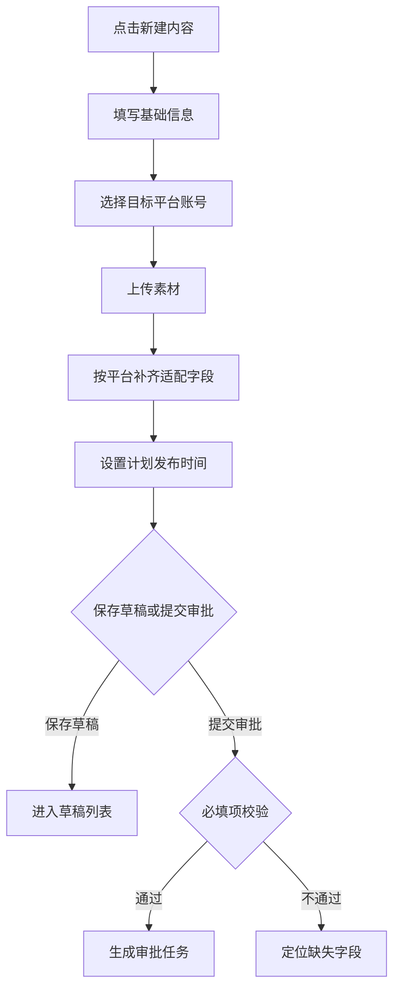
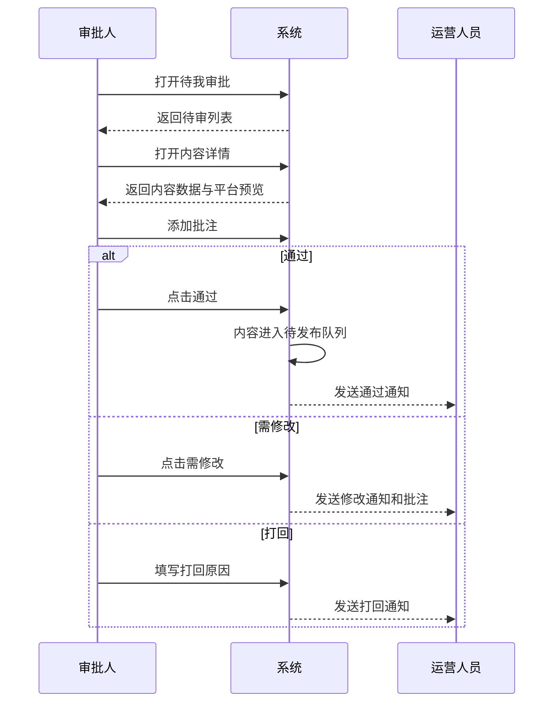
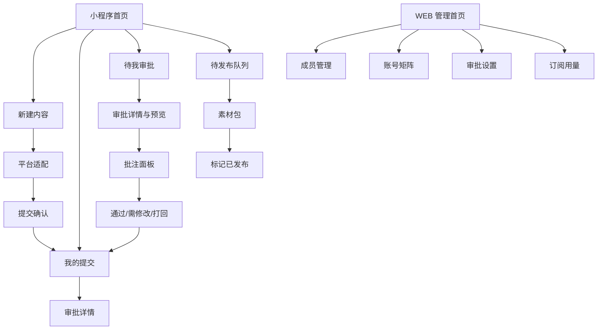
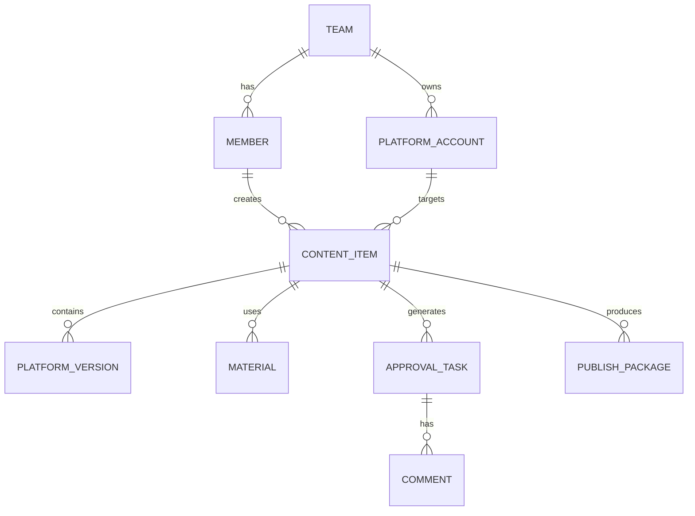

# 自媒体矩阵内容发布审批工作流 — 产品文档（PRD）

> **文档版本：** V1.0  
> **产品名称：** 审发通（暂定）  
> **文档日期：** 2026-06-29  
> **产品阶段：** MVP（7天）  
> **关联需求文档：** 自媒体矩阵内容发布审批工作流/需求文档.md  
> **编写角色：** 产品文档结对写作专家

---

## 变更历史

| 版本号 | 变更日期 | 变更内容 | 变更人 | 审核人 |
| --- | --- | --- | --- | --- |
| V1.0 | 2026-06-29 | 基于 URS 创建 PRD 与配套 UI 原型 | 产品文档结对写作专家 | 阶段一产品落地页文档总编辑 |

---

# 1 概述

## 1.1 需求背景

5-50 人规模的小型 MCN 机构、达人孵化团队、品牌方矩阵运营团队，以及教育、金融、医疗等强合规行业自媒体团队，日常需要在小红书、抖音、B 站等多个平台发布内容。当前多数团队仍依赖微信群、截图、Excel 或口头确认完成发布前审批，容易出现以下问题：

1. **审批记录不可追溯**：微信群中一句“可以发”难以绑定到具体内容版本，出现争议后无法说明“谁在何时批准了哪一版”。
2. **多平台预览效率低**：运营人员需要分别打开多个平台 App 或用截图模拟发布效果，审批人也需要在不同截图之间来回切换。
3. **误发风险高**：内容未经审核就被发布、审批意见未落实、修改版与审核版不一致，均会带来品牌和合规风险。
4. **发布交接不清晰**：审批通过后，运营人员仍需要手动整理文案、标签、封面、素材和计划发布时间，容易漏发或发错账号。

本产品聚焦“发布前审批流 + 多平台风格化预览 + 批注留痕 + 待发布队列 + 发布提醒”五大核心场景，在 7 天 MVP 周期内提供一套轻量、可追溯、移动端友好的内容审批协作工具。

## 1.2 名词解释

| 名词 | 说明 |
| --- | --- |
| 内容稿 | 运营人员准备发布的一组内容，包含主文案、图片/视频素材、目标平台账号、计划发布时间和各平台适配字段。 |
| 平台适配版本 | 同一内容稿针对不同平台填写的标题、正文、话题、标签、封面、分区等差异化信息。 |
| 审批任务 | 内容稿提交审批后生成的待处理任务，由默认审批人进行查看、批注、通过或打回。 |
| 批注留痕 | 审批人在内容维度或平台维度留下的修改意见、决策结果、操作人和时间记录。 |
| 待发布队列 | 审批通过后等待运营人员按计划时间手动发布的内容列表。 |
| 素材包 | 审批通过后系统按平台整理出的文案、标签、封面、图片/视频原文件和发布提示。 |
| 风格化示意预览 | 按平台核心信息结构和视觉特征进行近似展示，不承诺与平台 App 像素级 1:1 一致。 |
| 单级单人审批 | MVP 中每条内容仅流转给一名审批人，该审批人完成通过或打回决策。 |

## 1.3 产品介绍

### 1.3.1 产品定位

**审发通**是一款面向小型内容团队的轻量级自媒体内容发布前审批工具，帮助团队把“微信群截图审批”升级为“内容版本可预览、审批意见可留痕、发布素材可交接”的标准化流程。

**一句话定位：** 自媒体矩阵团队的发布前审批工作台——提交一次，多平台预览，审批留痕后再发布。

### 1.3.2 目标用户

| 用户类型 | 典型画像 | 核心诉求 |
| --- | --- | --- |
| 小型 MCN 机构 | 5-20 人团队，运营多个达人账号，每天有多条图文/视频内容需要主编审核 | 减少微信群沟通成本，避免未经审核误发 |
| 达人孵化团队 | 多个运营协作管理达人账号，老板或负责人需要统一把关 | 让审批人随时在手机上快速审内容 |
| 品牌方矩阵运营团队 | 企业号、小红书、抖音、B站账号由多人共同维护 | 明确账号、内容版本和审批责任 |
| 强合规行业自媒体团队 | 教育、金融、医疗等内容需先审后发 | 保留审批轨迹，降低合规追责风险 |

### 1.3.3 范围说明

| 项 | 内容 |
| --- | --- |
| 包含功能 | 微信登录/加入团队、内容草稿创建、目标账号选择、图片/视频素材上传、平台适配字段填写、单级单人审批、多平台风格化预览、整体/逐平台批注、通过/打回/需修改、审批轨迹、待发布队列、发布素材包、发布提醒、手动标记已发布、团队成员与账号基础管理、免费版额度展示。 |
| 不包含功能 | 内容自动发布、完整排期日历、AI 内容生成/改写、数据分析报表、复杂 OA 对接、多级串行审批、会签、条件路由、视频服务端转码、像素级 1:1 平台样式还原。 |
| MVP 平台范围 | 小红书、抖音、B 站三类核心预览。视频号、公众号作为后续扩展。 |
| 交付周期 | 7 天完成可演示 MVP。 |

### 1.3.4 领域专家确认结论

| 议题 | MVP 产品结论 | 后续迭代方向 |
| --- | --- | --- |
| 多平台预览保真度 | 采用“风格化示意 + 主要信息结构还原”，覆盖小红书、抖音、B 站，不承诺像素级 1:1。预览页展示“仅供参考，实际发布以平台显示为准”。 | 团队版可提供更接近真实平台的品牌化预览模板。 |
| 多级审批 | MVP 仅支持单级单人审批，即每条内容由一个默认审批人完成决策。 | 团队版支持多级串行、会签、或签和条件路由。 |
| 视频预览 | MVP 支持 H.264 MP4 原格式直接播放，并给出平台规格兼容性提示，不做服务端转码。 | 团队版接入云转码或按量转码服务。 |

---

# 2 产品设计

## 2.1 系统架构图

## 2.2 业务模块图

## 2.3 主业务流程

## 2.4 功能图/列表

| 功能模块 | 功能名称 | 优先级 | 功能描述 |
| --- | --- | --- | --- |
| 账号与团队 | 微信登录 | P0 | 运营人员、审批人、管理员通过微信授权登录。 |
| 账号与团队 | 邀请加入团队 | P0 | 管理员生成邀请链接，成员点击后加入团队并获得角色。 |
| 账号矩阵 | 添加平台账号 | P0 | 录入小红书、抖音、B站账号信息和负责人。 |
| 内容创建 | 创建内容草稿 | P0 | 填写主文案、上传图片/视频、保存草稿。 |
| 内容创建 | 多平台适配 | P0 | 针对小红书、抖音、B站填写差异化字段。 |
| 内容创建 | 计划发布时间 | P0 | 设置期望发布时间，用于待发布队列排序和提醒。 |
| 审批流 | 提交审批 | P0 | 校验内容完整性后流转给默认审批人。 |
| 审批工作台 | 待我审批 | P0 | 审批人查看待处理内容列表。 |
| 多平台预览 | 风格化预览 | P0 | 按小红书、抖音、B站样式近似展示核心信息。 |
| 批注留痕 | 整体/逐平台批注 | P0 | 审批人添加修改意见，系统记录操作人和时间。 |
| 审批决策 | 通过/打回/需修改 | P0 | 审批人完成决策，系统推动状态流转。 |
| 待发布队列 | 素材包查看 | P0 | 审批通过后按平台整理可复制文案、标签、封面和原素材。 |
| 待发布队列 | 手动标记已发布 | P0 | 运营人员发布后回到系统确认，归档审批记录。 |
| 消息通知 | 审批通知/结果通知 | P0 | 内容提交、审批结果变化时触发通知。 |
| 消息通知 | 发布提醒 | P1 | 计划发布时间前 15 分钟提醒运营人员。 |
| 团队订阅 | 免费额度展示 | P1 | 展示免费版账号数和审批次数使用情况。 |
| 团队版能力 | 多级审批/会签/转码 | P2 | 不进入 MVP，作为团队版迭代项。 |

## 2.5 你的产品有哪些端

| 序号 | 端名称 | 端类型 | 目标用户 | 说明 |
| --- | --- | --- | --- | --- |
| 1 | 运营/审批小程序端 | 小程序端 | 运营人员、审批人 | MVP 主端，完成内容创建、审批、预览、批注、待发布队列和发布确认。 |
| 2 | 团队管理 WEB 端 | WEB端 | 团队管理员、MCN 老板/主编 | 配置成员、账号矩阵、默认审批人、查看使用量和团队设置。 |

---

# 3 产品功能

## 3.1 运营/审批小程序端功能

### 3.1.1 登录与加入团队

**功能描述：** 用户通过微信授权登录小程序；首次进入时可创建团队或通过邀请链接加入已有团队。系统根据团队成员配置识别其角色为运营人员、审批人或管理员。

| 项 | 内容 |
| --- | --- |
| 优先级 | P0 |
| 依赖需求 | URS 3.1、3.2 中登录/加入团队需求 |
| 前置条件 | 用户已打开小程序；团队管理员已创建团队或发出邀请链接。 |

**业务规则：**
1. 同一微信 openid 在同一团队内只能绑定一个成员身份。
2. 用户可同时属于多个团队，进入小程序后可切换团队。
3. 加入团队后默认角色为运营人员，管理员可调整为审批人或管理员。
4. 手机号用于通知和身份确认，展示时默认脱敏。

**验收标准：**
- 用户可通过微信授权完成登录，失败时看到明确重试提示。
- 用户点击有效邀请链接后可加入团队，并在首页看到该团队名称。
- 管理员变更角色后，用户重新进入页面时看到对应功能入口。

### 3.1.2 内容创建与平台适配

**功能描述：** 运营人员创建内容稿，选择目标平台账号，上传图片或视频素材，填写主文案、计划发布时间，并针对小红书、抖音、B站填写平台适配字段。

| 项 | 内容 |
| --- | --- |
| 优先级 | P0 |
| 依赖需求 | URS 3.1 内容创建、审批提交需求 |
| 前置条件 | 运营人员已加入团队；团队已配置至少一个平台账号。 |

**页面字段：**

| 字段 | 类型 | 必填 | 说明 |
| --- | --- | --- | --- |
| 内容标题 | 文本 | 是 | 用于列表识别和 B 站/小红书标题。 |
| 主文案 | 多行文本 | 是 | 默认复用到各平台，可在平台适配中覆盖。 |
| 素材 | 图片/视频上传 | 是 | 图片最多 9 张；视频 MVP 仅支持 H.264 MP4 原格式播放。 |
| 目标平台账号 | 多选 | 是 | 可选择一个或多个平台账号。 |
| 计划发布时间 | 日期时间 | 是 | 用于审批通过后的待发布排序和提醒。 |
| 提交说明 | 文本 | 否 | 供审批人理解背景。 |
| 小红书适配 | 标题、正文、标签 | 按平台必填 | 结构化展示小红书预览所需信息。 |
| 抖音适配 | 描述、话题、封面 | 按平台必填 | 结构化展示抖音预览所需信息。 |
| B站适配 | 标题、简介、分区、标签 | 按平台必填 | 结构化展示 B 站预览所需信息。 |

**详细流程：**

**校验规则：**
1. 至少选择一个目标平台账号。
2. 图片或视频必须至少上传一种；图片单张不超过 10MB，视频不超过 100MB。
3. 视频文件不符合 H.264 MP4 时提示“当前文件可能无法直接预览，请更换为 MP4/H.264 格式”。
4. 计划发布时间不得早于当前时间。
5. 平台适配字段按所选平台动态显示。

**主要原型：**
- [内容创建与平台适配原型](UI原型-小程序端.html)

### 3.1.3 我的提交与审批进度

**功能描述：** 运营人员查看本人提交的内容，按草稿、待审批、需修改、已通过、待发布、已发布等状态筛选，并查看审批轨迹。

| 项 | 内容 |
| --- | --- |
| 优先级 | P0 |
| 依赖需求 | URS 3.1 审批进度、处理打回需求 |
| 前置条件 | 用户已有草稿或提交记录。 |

**列表显示：** 内容标题、目标平台、计划发布时间、当前状态、审批人、最近更新时间。

**状态规则：**

| 状态 | 进入条件 | 可执行操作 |
| --- | --- | --- |
| 草稿 | 用户保存但未提交 | 编辑、删除、提交审批 |
| 待审批 | 已提交但审批人未处理 | 查看详情、撤回（可选） |
| 审批中 | 审批人已打开任务 | 查看详情 |
| 需修改 | 审批人要求修改 | 查看批注、编辑、重新提交 |
| 已打回 | 审批人拒绝本次发布 | 查看原因、复制为新草稿 |
| 已通过 | 审批通过但未到发布队列刷新 | 查看详情 |
| 待发布 | 已通过，等待计划时间 | 查看素材包、调整提醒、标记已发布 |
| 已发布 | 运营人员确认发布 | 查看归档记录 |

**验收标准：**
- 用户可按状态筛选本人提交内容。
- 需修改内容能展示审批人的批注和对应平台。
- 重新提交后生成新的审批记录，但保留历史轨迹。

### 3.1.4 审批工作台

**功能描述：** 审批人在小程序内查看待我审批列表，进入详情后切换平台预览、添加批注，并做出通过、需修改或打回决策。

| 项 | 内容 |
| --- | --- |
| 优先级 | P0 |
| 依赖需求 | URS 3.2 审批工作台、批注与决策需求 |
| 前置条件 | 用户具有审批人角色；存在分配给该用户的审批任务。 |

**待审列表显示：**
- 提交人、内容标题、目标平台、计划发布时间；
- 素材类型（图文/视频）、提交时间；
- 状态标签：待处理、处理中、超时提醒。

**审批详情结构：**
1. 顶部：标题、提交人、计划发布时间、状态。
2. 中部：小红书/抖音/B站平台切换标签。
3. 预览区：展示所选平台的风格化预览。
4. 批注区：整体批注输入框、逐平台批注列表。
5. 底部固定操作：通过、需修改、打回。

**详细流程：**

**业务规则：**
1. 审批决策一旦提交不可直接撤回，如需修改需由管理员在后台进行异常处理。
2. “打回”必须填写原因；“需修改”至少填写一条批注。
3. “通过”后系统生成素材包并进入待发布队列。
4. MVP 不支持会签、多级审批；同一内容只绑定一名审批人。

**主要原型：**
- [审批工作台与多平台预览原型](UI原型-小程序端.html)

### 3.1.5 多平台风格化预览

**功能描述：** 系统根据内容数据生成小红书、抖音、B站三种风格化预览，供审批人快速判断内容结构、封面、文案、标签和视频兼容性。

| 项 | 内容 |
| --- | --- |
| 优先级 | P0 |
| 依赖需求 | URS 3.2 内容预览需求，领域专家确认结论 |
| 前置条件 | 内容稿已选择目标平台并填写对应适配字段。 |

**预览范围：**

| 平台 | MVP 展示元素 | 说明 |
| --- | --- | --- |
| 小红书 | 封面图、标题、正文摘要、标签、账号信息 | 采用图文卡片风格，强调 3:4 封面和标签。 |
| 抖音 | 9:16 视频/封面、描述、话题、账号昵称 | 模拟短视频沉浸式布局，但不还原平台按钮细节。 |
| B站 | 16:9 封面/视频、标题、简介、分区、标签 | 模拟视频稿件信息结构。 |

**视频处理规则：**
1. 支持浏览器可直接播放的 H.264 MP4 原文件。
2. 系统读取或由上传组件采集视频元信息，展示分辨率、时长、编码和大小。
3. 与平台推荐规格对比后给出“兼容 / 建议调整 / 不兼容”提示。
4. 不在服务端生成转码文件。

**免责声明：** 预览页固定展示“预览效果仅供审批参考，实际发布效果以各平台 App 展示为准”。

### 3.1.6 待发布队列与素材包

**功能描述：** 审批通过的内容进入待发布队列。运营人员按计划发布时间查看即将发布的内容，复制各平台文案和标签，下载或打开原素材，完成平台手动发布后标记已发布。

| 项 | 内容 |
| --- | --- |
| 优先级 | P0；发布提醒为 P1 |
| 依赖需求 | URS 3.1 待发布队列、消息通知需求 |
| 前置条件 | 内容已审批通过。 |

**素材包内容：**
- 平台账号名称；
- 发布文案、标题、标签、话题、分区；
- 封面图、图片列表、视频原文件；
- 平台规格提示；
- 计划发布时间；
- 审批通过记录。

**交互规则：**
1. 待发布列表默认按计划发布时间升序排列。
2. 计划发布前 15 分钟触发提醒，提醒时间可在团队设置中调整。
3. 点击“一键复制文案”复制当前平台的标题、正文、话题和标签。
4. 标记已发布时需选择实际发布平台，并可填写发布链接。
5. 未标记已发布的内容在计划发布时间后显示“待确认”状态。

**主要原型：**
- [待发布队列与素材包原型](UI原型-小程序端.html)

## 3.2 团队管理 WEB 端功能

### 3.2.1 团队成员管理

**功能描述：** 管理员在 WEB 端查看团队成员，邀请新成员，分配运营人员、审批人、管理员角色，并移除离职成员。

| 项 | 内容 |
| --- | --- |
| 优先级 | P0 |
| 依赖需求 | URS 3.3 团队管理需求 |
| 前置条件 | 管理员已登录 WEB 管理端。 |

**字段与规则：**

| 字段 | 说明 |
| --- | --- |
| 姓名/昵称 | 来自微信授权或管理员备注。 |
| 手机号 | 脱敏展示，完整信息仅管理员可见。 |
| 角色 | 运营人员、审批人、管理员，可多选。 |
| 状态 | 已加入、待加入、已停用。 |
| 最近活跃 | 用于判断成员是否仍在使用系统。 |

**验收标准：**
- 管理员可生成邀请链接并复制。
- 管理员可调整成员角色，权限在重新进入页面后生效。
- 移除成员后，该成员不能访问团队新数据，但历史审批记录保留其姓名和操作时间。

### 3.2.2 账号矩阵管理

**功能描述：** 管理员录入团队运营的平台账号，指定负责人和默认审批人，使运营人员提交内容时可以选择目标账号并自动生成审批任务。

| 项 | 内容 |
| --- | --- |
| 优先级 | P0 |
| 依赖需求 | URS 3.3 账号矩阵需求 |
| 前置条件 | 团队已创建；至少有一名审批人。 |

**账号字段：**

| 字段 | 类型 | 必填 | 说明 |
| --- | --- | --- | --- |
| 平台 | 枚举 | 是 | 小红书、抖音、B站。 |
| 账号名称 | 文本 | 是 | 用于运营选择和预览展示。 |
| 账号 ID | 文本 | 否 | 平台内账号标识。 |
| 负责人 | 成员选择 | 否 | 日常运营负责人。 |
| 默认审批人 | 成员选择 | 是 | MVP 中单级单人审批的唯一审批人。 |
| 状态 | 启用/停用 | 是 | 停用账号不能再提交新审批。 |

### 3.2.3 审批设置与订阅管理

**功能描述：** MVP 中审批设置聚焦默认审批人和免费额度展示。多级审批、会签、或签在界面中作为团队版能力展示，不开放配置入口或以“即将支持”标识展示。

| 项 | 内容 |
| --- | --- |
| 优先级 | P1 |
| 依赖需求 | URS 3.3 审批流配置、订阅管理需求 |
| 前置条件 | 管理员已进入 WEB 管理端。 |

**免费版限制：**
1. 最多 3 个平台账号。
2. 每月最多 10 条审批。
3. 仅支持单级单人审批。
4. 不支持多级审批、会签、短信备用通知、品牌化预览。

**团队版展示：**
- ¥49/月；
- 不限账号和审批数；
- 发布提醒增强；
- 多级审批、会签、或签；
- 品牌化预览；
- 团队协作和导出能力。

**主要原型：**
- [团队管理 WEB 端原型](UI原型-WEB管理端.html)

---

# 4 产品原型

## 4.1 页面跳转逻辑图

## 4.2 全站点原型设计

### 4.2.1 运营/审批小程序端

**页面清单：**

| 序号 | 页面名称 | 所属模块 | 页面描述 | 关键元素 |
| --- | --- | --- | --- | --- |
| 1 | 首页工作台 | 总览 | 按角色展示今日待办、待审批数量、待发布内容 | 统计卡、快捷入口、最近内容 |
| 2 | 新建内容 | 内容创建 | 创建内容草稿并上传素材 | 表单、素材上传、平台账号多选 |
| 3 | 平台适配 | 内容创建 | 针对小红书/抖音/B站填写差异化字段 | 平台标签、字段卡片、规格提示 |
| 4 | 我的提交 | 审批进度 | 查看本人内容状态和审批轨迹 | 状态筛选、内容列表、批注入口 |
| 5 | 审批详情 | 审批工作台 | 审批人查看详情、切换平台预览、添加批注 | 预览标签、批注框、底部操作栏 |
| 6 | 待发布队列 | 发布交接 | 查看审批通过内容和素材包 | 时间排序、复制按钮、发布确认 |
| 7 | 我的/团队切换 | 设置 | 查看身份、团队、通知偏好 | 角色标签、团队切换、通知设置 |

**交互说明：**
1. 底部 Tab 包含：首页、新建、提交、审批、待发布。
2. 新建内容中选择目标平台后，平台适配页只显示已选平台字段。
3. 审批详情中的平台标签可切换小红书、抖音、B站预览，切换不改变审批状态。
4. 点击“需修改”或“打回”时必须填写原因；点击“通过”后进入确认弹窗。
5. 待发布队列中点击“素材包”进入按平台整理的复制面板。
6. 所有主要按钮需有 loading 态，避免重复提交。

**产品原型：**
- [打开运营/审批小程序端全站点原型](UI原型-小程序端.html)

### 4.2.2 团队管理 WEB 端

**页面清单：**

| 序号 | 页面名称 | 所属模块 | 页面描述 | 关键元素 |
| --- | --- | --- | --- | --- |
| 1 | 管理首页 | 总览 | 展示团队审批概况、账号数量、额度使用 | 数据卡、待处理列表、升级提示 |
| 2 | 成员管理 | 团队管理 | 邀请、查看、编辑团队成员角色 | 表格、角色标签、邀请链接 |
| 3 | 账号矩阵 | 账号管理 | 管理小红书/抖音/B站账号和默认审批人 | 账号表、平台标签、审批人选择 |
| 4 | 审批设置 | 审批配置 | 配置单级默认审批，展示团队版能力 | 规则卡、功能门控、说明文案 |
| 5 | 订阅用量 | 商业化 | 展示免费版限制和团队版升级权益 | 用量进度、价格卡、升级 CTA |

**交互说明：**
1. WEB 端使用左侧导航切换模块，顶部显示当前团队和管理员信息。
2. 成员管理中点击“邀请成员”弹出邀请链接弹窗。
3. 账号矩阵中新增账号使用抽屉表单，必填平台、账号名称和默认审批人。
4. 审批设置中 MVP 仅允许设置单级审批；多级、会签、或签显示团队版锁定状态。
5. 订阅用量中超过免费额度时给出升级提示。

**产品原型：**
- [打开团队管理 WEB 端全站点原型](UI原型-WEB管理端.html)

---

# 5 数据需求

## 5.1 核心数据实体

## 5.2 数据使用规格

### 5.2.1 Team（团队）

| 字段 | 是否必填 | 描述 | 数据类型 |
| --- | --- | --- | --- |
| id | 是 | 团队唯一标识 | UUID |
| name | 是 | 团队名称 | 字符串 |
| plan | 是 | free/team | 枚举 |
| approval_quota_monthly | 是 | 当月审批额度 | 数字 |
| approval_used_monthly | 是 | 当月已用审批数 | 数字 |
| created_at | 是 | 创建时间 | 日期时间 |

### 5.2.2 Member（成员）

| 字段 | 是否必填 | 描述 | 数据类型 |
| --- | --- | --- | --- |
| id | 是 | 成员唯一标识 | UUID |
| team_id | 是 | 所属团队 | UUID |
| openid | 是 | 微信 openid | 字符串 |
| name | 是 | 姓名/昵称 | 字符串 |
| phone | 否 | 手机号，展示时脱敏 | 字符串 |
| roles | 是 | operator/approver/admin，可多选 | JSON |
| status | 是 | active/pending/disabled | 枚举 |

### 5.2.3 PlatformAccount（平台账号）

| 字段 | 是否必填 | 描述 | 数据类型 |
| --- | --- | --- | --- |
| id | 是 | 账号唯一标识 | UUID |
| team_id | 是 | 所属团队 | UUID |
| platform | 是 | xiaohongshu/douyin/bilibili | 枚举 |
| display_name | 是 | 账号展示名称 | 字符串 |
| account_no | 否 | 平台账号 ID | 字符串 |
| owner_member_id | 否 | 负责人 | UUID |
| default_approver_id | 是 | 默认审批人 | UUID |
| status | 是 | active/inactive | 枚举 |

### 5.2.4 ContentItem（内容稿）

| 字段 | 是否必填 | 描述 | 数据类型 |
| --- | --- | --- | --- |
| id | 是 | 内容稿唯一标识 | UUID |
| team_id | 是 | 所属团队 | UUID |
| creator_id | 是 | 创建人 | UUID |
| title | 是 | 内容标题 | 字符串 |
| base_copy | 是 | 主文案 | 文本 |
| scheduled_at | 是 | 计划发布时间 | 日期时间 |
| status | 是 | draft/pending/processing/need_change/rejected/approved/to_publish/published/archived | 枚举 |
| submit_note | 否 | 提交说明 | 文本 |
| created_at | 是 | 创建时间 | 日期时间 |
| updated_at | 是 | 更新时间 | 日期时间 |

### 5.2.5 PlatformVersion（平台适配版本）

| 字段 | 是否必填 | 描述 | 数据类型 |
| --- | --- | --- | --- |
| id | 是 | 适配版本唯一标识 | UUID |
| content_id | 是 | 内容稿 ID | UUID |
| platform | 是 | 平台类型 | 枚举 |
| platform_account_id | 是 | 目标账号 | UUID |
| title | 否 | 平台标题 | 字符串 |
| body | 是 | 平台正文/简介 | 文本 |
| tags | 否 | 标签/话题 | JSON |
| category | 否 | B站分区等字段 | 字符串 |
| cover_material_id | 否 | 封面素材 | UUID |

### 5.2.6 ApprovalTask（审批任务）

| 字段 | 是否必填 | 描述 | 数据类型 |
| --- | --- | --- | --- |
| id | 是 | 审批任务唯一标识 | UUID |
| content_id | 是 | 内容稿 ID | UUID |
| approver_id | 是 | 审批人 | UUID |
| status | 是 | pending/processing/approved/need_change/rejected | 枚举 |
| decision_reason | 否 | 打回或需修改原因 | 文本 |
| opened_at | 否 | 首次打开时间 | 日期时间 |
| decided_at | 否 | 决策时间 | 日期时间 |

### 5.2.7 Comment（批注）

| 字段 | 是否必填 | 描述 | 数据类型 |
| --- | --- | --- | --- |
| id | 是 | 批注唯一标识 | UUID |
| approval_task_id | 是 | 审批任务 ID | UUID |
| author_id | 是 | 批注人 | UUID |
| scope | 是 | overall/platform | 枚举 |
| platform | 否 | 逐平台批注对应平台 | 枚举 |
| content | 是 | 批注内容 | 文本 |
| created_at | 是 | 批注时间 | 日期时间 |

## 5.3 统计数据

| 指标 | 口径 | 用途 | 优先级 |
| --- | --- | --- | --- |
| 当月审批数 | 当前团队本月提交审批的内容数量 | 免费版额度控制、团队版转化 | P0 |
| 审批通过率 | 通过内容数 / 已决策内容数 | 帮助团队了解内容质量 | P1 |
| 平均审批时长 | 决策时间 - 提交时间 | 衡量审批效率 | P1 |
| 待发布逾期数 | 计划发布时间已过但未标记已发布的内容数 | 触发运营跟进 | P1 |

## 5.4 埋点需求

| 页面 | 事件 | 采集字段 | 说明 |
| --- | --- | --- | --- |
| 新建内容 | content_create_start | team_id、member_role | 统计创建入口使用情况 |
| 新建内容 | content_submit | team_id、platform_count、material_type | 统计提交审批行为 |
| 审批详情 | approval_preview_switch | platform、content_id | 了解平台预览使用频次 |
| 审批详情 | approval_decision | decision、has_comment | 分析通过/打回比例 |
| 待发布队列 | publish_package_copy | platform、content_id | 统计素材包复制行为 |
| 待发布队列 | publish_confirm | platform_count、has_publish_url | 统计手动发布确认 |
| 订阅用量 | upgrade_click | current_plan、quota_used | 评估商业转化入口 |

---

# 6 非功能需求

## 6.1 性能需求

| 编号 | 项目 | 最大延迟 | 平均延迟 | 优先级 | 备注 |
| --- | --- | --- | --- | --- | --- |
| PERF-001 | 小程序首屏加载 | ≤ 2 秒 | ≤ 1.2 秒 | 高 | 4G 网络环境 |
| PERF-002 | 内容保存草稿 | ≤ 1 秒 | ≤ 500ms | 高 | 不含大文件上传时间 |
| PERF-003 | 审批决策提交 | ≤ 1 秒 | ≤ 500ms | 高 | 通过/需修改/打回 |
| PERF-004 | 平台预览切换 | ≤ 500ms | ≤ 200ms | 高 | 已加载内容情况下 |
| PERF-005 | 图片上传 | 单张 ≤ 3 秒 | - | 中 | 单张不超过 10MB |
| PERF-006 | 视频起播 | ≤ 2 秒 | - | 中 | H.264 MP4 原文件 |
| PERF-007 | 通知到达 | ≤ 30 秒 | ≤ 10 秒 | 高 | 审批通知、发布提醒 |

## 6.2 安全需求

| 编号 | 项 | 要求 |
| --- | --- | --- |
| SEC-001 | 数据隔离 | 团队之间数据严格隔离，成员只能访问所属团队和角色授权范围内的数据。 |
| SEC-002 | 身份认证 | 微信登录态失效后必须重新授权，不允许匿名访问内容稿和素材。 |
| SEC-003 | 权限控制 | 运营人员只能管理本人创建的内容；审批人只能处理分配给自己的审批任务；管理员可管理团队配置。 |
| SEC-004 | 敏感信息 | 手机号脱敏展示，完整手机号仅管理员在必要场景可查看。 |
| SEC-005 | 文件访问 | 图片/视频素材使用带权限校验或短期签名的访问链接。 |
| SEC-006 | 操作留痕 | 提交、审批、打回、标记已发布等关键动作必须记录操作人和时间。 |
| SEC-007 | 传输安全 | 全站 HTTPS，接口请求携带有效登录凭证。 |

## 6.3 可靠性

| 编号 | 项 | 值 |
| --- | --- | --- |
| REL-001 | 服务可用性 | ≥ 99.5% |
| REL-002 | 数据备份 | 业务数据库每日全量备份，关键表支持按小时增量备份 |
| REL-003 | 文件存储 | 使用对象存储，避免本地磁盘单点丢失 |
| REL-004 | 通知失败重试 | 审批通知、发布提醒失败后至少重试 3 次 |

## 6.4 可连续性

| 编号 | 项 |
| --- | --- |
| CON-001 | 审批和待发布队列应支持 7×24 小时访问。 |
| CON-002 | 通知服务短暂不可用时，不影响用户手动进入系统查看待办。 |
| CON-003 | 文件上传失败时保留已填写表单内容，避免用户重复填写。 |

## 6.5 可恢复性

| 编号 | 项 |
| --- | --- |
| REC-001 | 内容稿保存失败时提示用户重试，并保留本地临时输入内容。 |
| REC-002 | 审批决策接口失败时不得改变前端状态，用户可重新提交。 |
| REC-003 | 若计划发布提醒失败，待发布队列仍显示“待发布/已逾期”状态供运营人员主动处理。 |
| REC-004 | 关键审批记录不允许物理删除，误操作通过状态修正或归档处理。 |

## 6.6 兼容性

| 编号 | 要求 | 备注 |
| --- | --- | --- |
| COMP-001 | 小程序端兼容 iOS 13+、Android 8.0+ 主流微信版本 | 重点适配 375、390、414px 宽度 |
| COMP-002 | WEB 管理端兼容 Chrome 90+、Safari 14+、Edge 90+ | 不支持 IE |
| COMP-003 | 视频预览支持 H.264 MP4 | 其他格式提示用户转换后上传 |
| COMP-004 | 图片素材支持 JPG、PNG、WebP | 单张不超过 10MB |

## 6.7 易用性

| 编号 | 要求 | 备注 |
| --- | --- | --- |
| UX-001 | 运营人员从新建内容到提交审批不超过 5 个主步骤 | 基础信息、平台账号、素材、适配、提交 |
| UX-002 | 审批人完成一条无问题内容审批不超过 3 步 | 打开任务、查看预览、点击通过 |
| UX-003 | 所有空状态提供下一步引导 | 如“还没有内容，去新建一条” |
| UX-004 | 审批状态使用稳定颜色 | 通过绿、打回红、需修改黄、待审批蓝 |
| UX-005 | 平台预览明确标识“仅供参考” | 避免用户误以为像素级还原 |

---

# 7 总结

## 7.1 上线计划

| 阶段 | 时间 | 内容 | 负责人 |
| --- | --- | --- | --- |
| 第 1 天 | 2026-06-29 | 产品范围确认、数据模型与页面流程确认 | 产品/研发 |
| 第 2-3 天 | 2026-06-30 至 2026-07-01 | 小程序端内容创建、审批工作台、预览页面开发 | 研发 |
| 第 4 天 | 2026-07-02 | WEB 管理端成员、账号、审批设置开发 | 研发 |
| 第 5 天 | 2026-07-03 | 待发布队列、素材包、通知提醒开发 | 研发 |
| 第 6 天 | 2026-07-04 | 联调、异常流程、权限与额度控制 | 产品/研发/测试 |
| 第 7 天 | 2026-07-05 | 验收演示、修复阻塞问题、准备上线说明 | 全体 |

## 7.2 MVP 验收标准

| 场景 | 验收标准 |
| --- | --- |
| 内容提交 | 运营人员可选择至少 1 个平台账号，上传素材，填写平台适配字段并提交审批。 |
| 审批流转 | 提交后默认审批人可在待我审批中看到任务，并完成通过、需修改、打回。 |
| 多平台预览 | 同一内容可切换查看小红书、抖音、B站风格化预览，并展示预览免责声明。 |
| 批注留痕 | 审批人的批注、决策、操作时间和操作人可在审批轨迹中查看。 |
| 待发布队列 | 通过后的内容进入待发布队列，可查看素材包并标记已发布。 |
| 发布提醒 | 计划发布时间前 15 分钟可触发提醒记录或模拟提醒。 |
| 免费版限制 | 超过 3 个账号或当月 10 条审批时，系统给出升级提示。 |

## 7.3 后续迭代规划

| 版本 | 规划功能 |
| --- | --- |
| V1.1 | 视频号、公众号预览；审批超时提醒；批注附件；发布链接归档。 |
| V1.2 | 团队版多级审批、会签、或签；审批记录导出；品牌化预览。 |
| V2.0 | 服务端视频转码；内容合规词库；跨平台排期日历；第三方 OA 对接。 |

## 7.4 风险与对策

| 风险 | 影响 | 对策 |
| --- | --- | --- |
| 用户误以为预览等同真实平台效果 | 发布后效果与预期不一致 | 在预览页固定展示免责声明，产品文案强调“风格化示意”。 |
| 小团队不愿迁移出微信群 | 使用率不足 | 保持流程极简，审批通知直达微信，支持复制素材包回到平台手动发布。 |
| 视频格式无法播放 | 审批人无法查看视频内容 | MVP 限定 H.264 MP4，并在上传时给出规格提示。 |
| 免费版额度过低影响体验 | 新用户流失 | 允许完整体验 10 条审批，超过后清晰展示团队版权益。 |
| 强合规行业需要多级审批 | MVP 覆盖不足 | 明确 MVP 可由综合审批人单点把关，多级/会签作为团队版卖点。 |

## 7.5 参考文档

- [需求文档](需求文档.md)
- [运营/审批小程序端 UI 原型](UI原型-小程序端.html)
- [团队管理 WEB 端 UI 原型](UI原型-WEB管理端.html)

---

> **文档结束**  
> 编写：产品文档结对写作专家  
> 日期：2026-06-29
