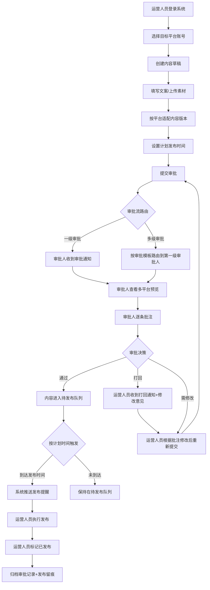
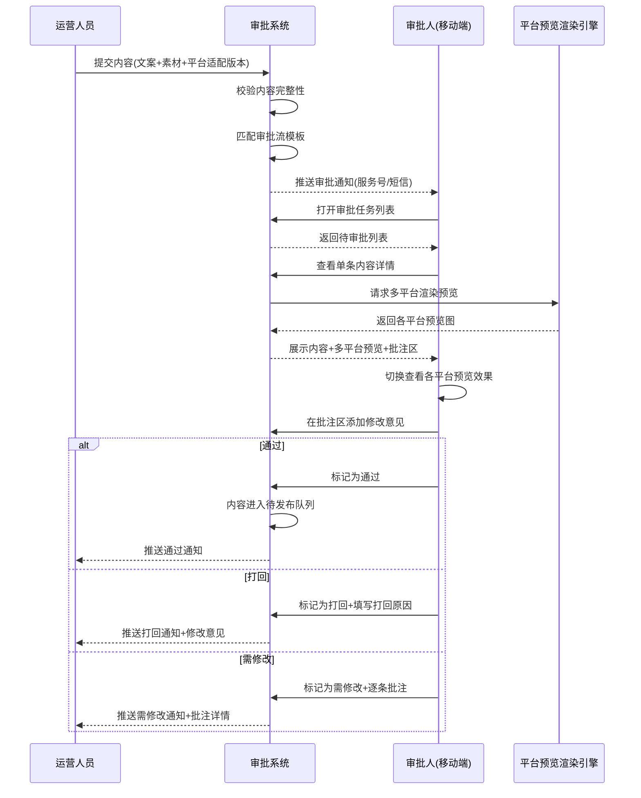
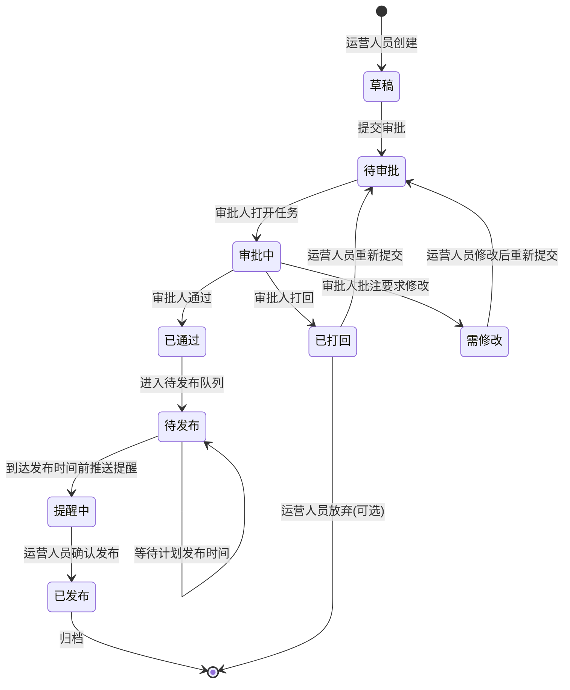
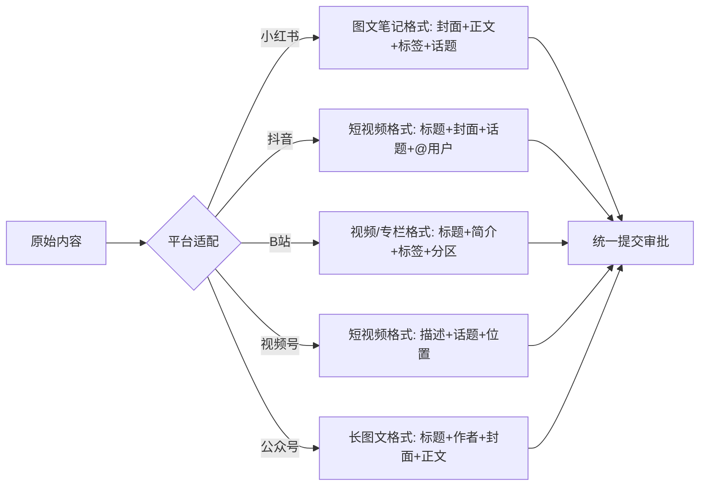
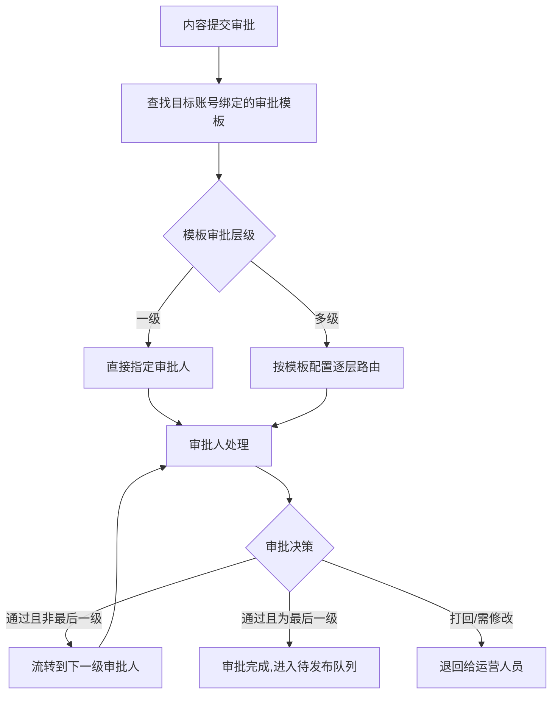
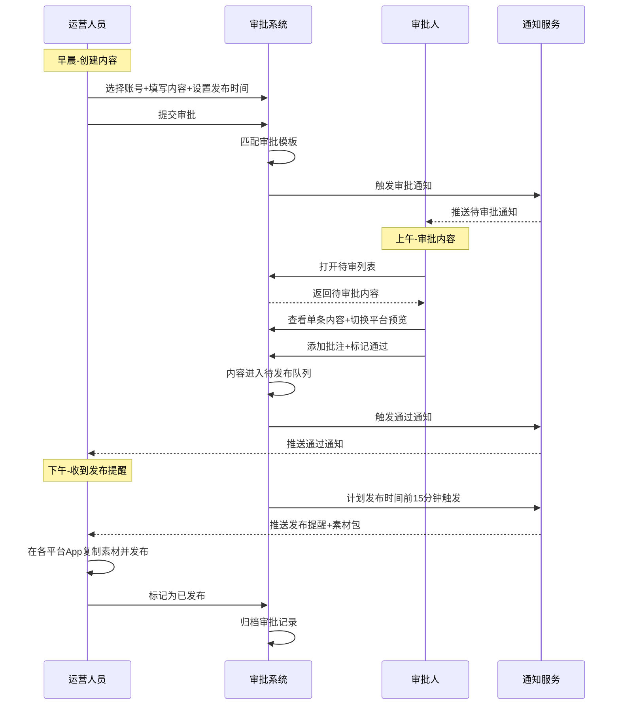
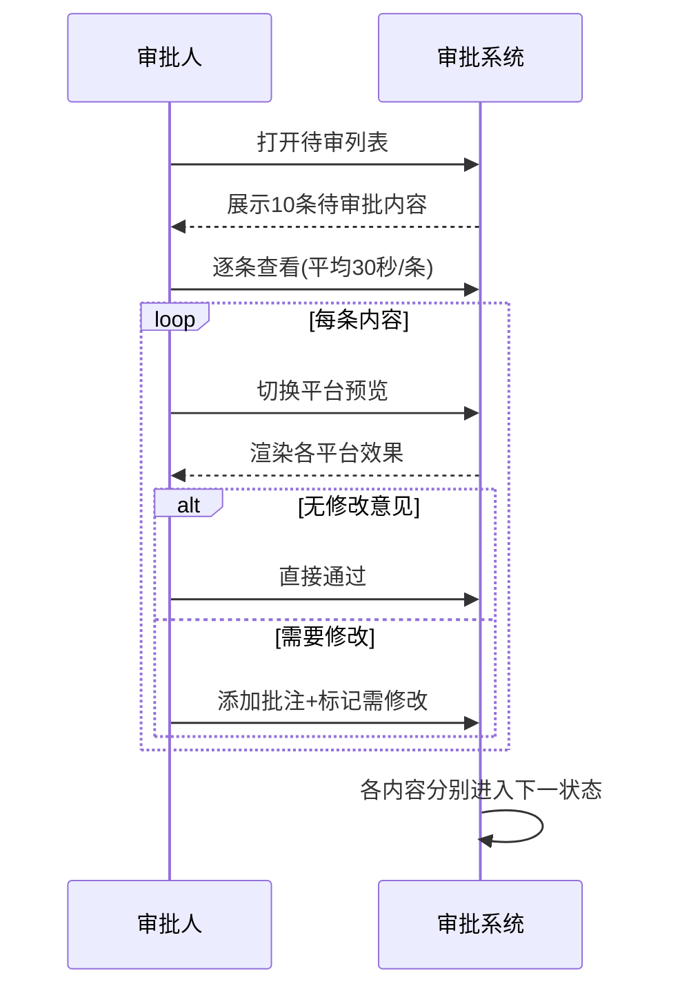
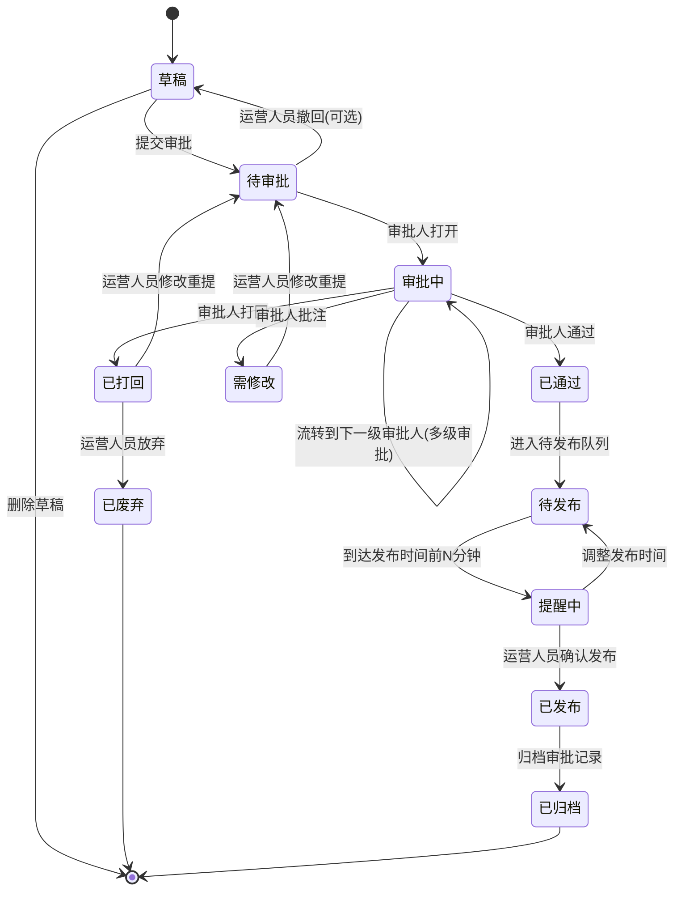
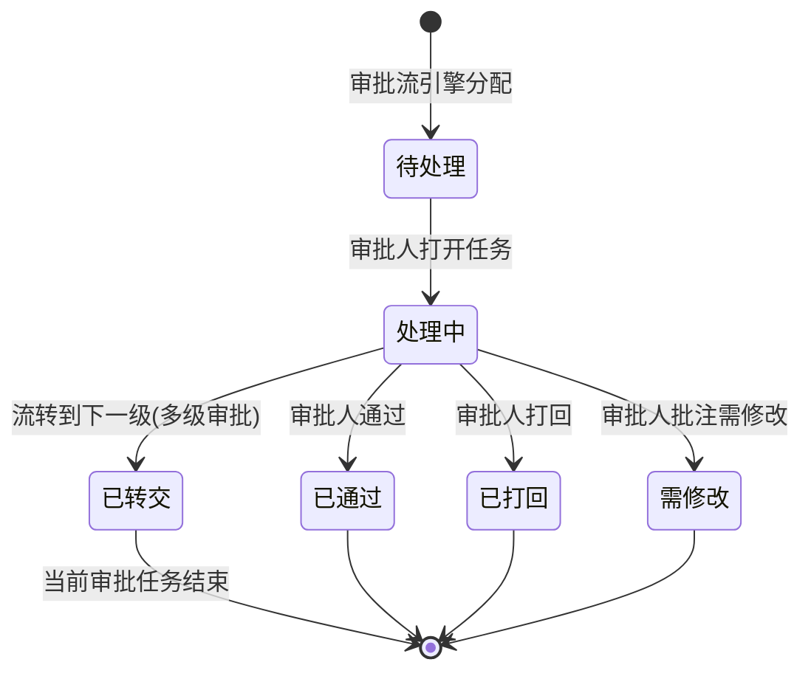

# 1. 需求概述

## 1.1 需求介绍

"自媒体矩阵内容发布审批工作流"（以下简称"本产品"）是一款面向小型 MCN 机构、达人孵化团队、品牌方矩阵运营团队以及强合规行业（教育/金融/医疗）自媒体团队的轻量级内容审批与发布协作工具。

当前，5–50 人规模的 MCN/品牌运营团队普遍存在以下痛点：内容发布前的审批高度依赖微信沟通（老板/主编在微信群里看截图、回"可以发"），审批记录无法追溯，出现"未经审核误发"或"发了哪一版说不清"的事故；多平台（小红书/抖音/B站/视频号/公众号）内容需要针对不同平台样式重新排版预览，运营人员重复切换 App 检查效果效率极低；强合规行业（教育/金融/医疗）对内容发布有"先审后发"的监管硬性要求，缺少留痕即面临合规风险。

本产品聚焦"发布前的审批流 + 多平台预览 + 批注留痕"这一狭窄但高频的切口，不做排期日历、不做内容自动发布（避免与已有排期工具和企业 OA 正面竞争），帮助团队将内容审批从微信群搬到专业化、可追溯的轻量化工作流中。

### 1.1.1 所属领域

效率工具 / MCN 与品牌方内容运营协作 SaaS

## 1.2 需求目标

1. **消灭"微信审批"**：将内容审批从微信群沟通迁移到专属工作流，所有审批动作（提交、批注、通过、打回）均留痕可追溯，解决"谁同意发的、发了哪一版"的追溯难题。
2. **提升预览效率**：运营人员提交一次内容，审批人可在同一界面切换查看小红书/抖音/B站/视频号/公众号等多平台渲染效果，无需逐 App 打开比对，单条内容预览时间从 5 分钟降至 30 秒。
3. **降低误发风险**：通过"审批通过才进入待发布队列"的强约束流程，杜绝未经审核的内容被发布到公开平台；强合规行业可开启"强制审批"模式，未经审批的内容禁止进入发布流程。
4. **轻量化快速交付**：MVP 在 7 天内交付，覆盖"内容提交 → 审批流 → 多平台预览 → 批注留痕 → 待发布队列"五大核心场景，不做排期日历、不做内容自动发布、不做数据分析报表。
5. **商业化可持续**：免费版（3 个账号、每月 10 条审批）引流，团队版（¥49/月，不限账号与审批数 + 多级审批 + 品牌化预览 + 发布提醒 + 团队协作）实现营收，目标转化率 5%–10%。

## 1.3 系统使用角色

| 角色 | 说明 | 典型用户画像 |
| --- | --- | --- |
| 运营人员（Operator） | 系统的主要内容生产者与发布者。负责在系统中创建内容草稿、选择目标平台与账号、提交审批，并在审批通过后按计划执行发布。 | MCN 机构的运营小张，每天管理 8 个小红书账号、5 个抖音账号，需要把写好的内容提交给主编审核后再发布。 |
| 审批人/主编（Approver） | 内容的审核决策者。负责在移动端预览各平台内容效果、逐条批注修改意见、做出"通过/打回"决策。可以是团队主编、老板、或合规负责人。 | MCN 主编老王，每天需要审核 20–30 条待发布内容，要求在手机上 30 秒内看完一条并做出决策。 |
| 团队管理员（Team Admin） | 团队的后台管理者。负责管理团队成员、配置账号矩阵、设置审批流模板（一级/多级审批）、管理团队版订阅。 | MCN 老板李总，需要为 15 人团队配置审批流、查看团队审批效率、管理 50+ 平台账号。 |

## 1.4 业务流程图

### 1.4.1 内容审批发布主流程

### 1.4.2 审批人移动端审批流程

### 1.4.3 审批状态流转

### 1.4.4 内容多平台适配流程

# 2. 功能原型

| 原型名称 | 原型链接 | 对应端 | 备注 |
| --- | --- | --- | --- |
| 运营人员-内容工作台 | 待设计 | 小程序端 | 运营人员日常使用的核心界面，含内容创建、审批进度查看、待发布队列 |
| 审批人-审批面板 | 待设计 | 小程序端 | 审批人移动端审批界面，含待审列表、多平台预览、批注面板、通过/打回操作 |
| 团队管理-账号矩阵与审批流配置 | 待设计 | WEB端 | 团队管理员后台，含成员管理、账号矩阵管理、审批流模板配置 |
| 平台预览-多平台渲染页 | 待设计 | 小程序端 | 审批人/运营人员查看各平台内容渲染效果的预览界面 |

# 3. 需求清单

## 3.1 运营人员端-小程序端

| 模块 | 一级功能 | 二级功能 | 功能描述 | 备注 |
| --- | --- | --- | --- | --- |
| 账号与身份 | 登录/加入团队 | 微信一键登录 | 运营人员通过微信授权快速登录，无需输入账号密码 | P0 |
| 账号与身份 | 登录/加入团队 | 通过邀请链接加入团队 | 运营人员点击团队管理员分享的邀请链接，一键加入团队 | P0 |
| 账号与身份 | 个人资料 | 个人信息查看 | 查看本人姓名、角色、所属团队、绑定手机号 | P0 |
| 内容创建 | 创建草稿 | 选择目标账号 | 从团队账号矩阵中勾选本次要发布的一个或多个平台账号 | P0 |
| 内容创建 | 创建草稿 | 填写文案与上传素材 | 输入主文案，上传图片/视频素材（支持多图、短视频） | P0 |
| 内容创建 | 创建草稿 | 按平台适配版本 | 针对每个目标平台填写差异化内容（如小红书标签/抖音话题/B站分区），系统提供字段引导 | P0 |
| 内容创建 | 创建草稿 | 设置计划发布时间 | 选择期望的发布日期与时间（精确到分钟） | P0 |
| 内容创建 | 创建草稿 | 保存草稿 | 未完成的内容保存为草稿，可随时继续编辑 | P0 |
| 内容创建 | 草稿管理 | 草稿列表 | 查看本人所有草稿，按更新时间排序 | P0 |
| 内容创建 | 草稿管理 | 编辑/删除草稿 | 对草稿继续编辑或直接删除 | P0 |
| 内容创建 | 内容模板 | 使用内容模板 | 从团队内容模板库中选择常用模板快速创建（如"小红书种草笔记模板"） | P2 |
| 审批提交 | 提交审批 | 选择审批流 | 根据目标账号所属审批流模板自动匹配，或手动选择 | P0 |
| 审批提交 | 提交审批 | 添加提交说明 | 填写本次提交的补充说明（可选），供审批人参考 | P1 |
| 审批提交 | 提交审批 | 确认提交 | 校验内容完整性后提交到审批流 | P0 |
| 审批进度 | 查看进度 | 我的提交列表 | 按状态（审批中/已通过/已打回/需修改/待发布/已发布）筛选查看本人提交的内容 | P0 |
| 审批进度 | 查看进度 | 查看审批详情 | 查看单条内容的审批轨迹：各级审批人、批注内容、通过/打回决策、时间戳 | P0 |
| 审批进度 | 处理打回 | 查看修改意见 | 查看审批人的逐条批注与修改意见 | P0 |
| 审批进度 | 处理打回 | 修改后重新提交 | 在原内容基础上修改后重新进入审批流 | P0 |
| 待发布队列 | 查看队列 | 待发布列表 | 查看已通过审批、等待发布的内容，按计划发布时间排序 | P0 |
| 待发布队列 | 发布提醒 | 接收发布提醒 | 计划发布时间前（默认15分钟）收到推送提醒 | P1 |
| 待发布队列 | 发布提醒 | 查看发布素材包 | 查看/复制各平台发布所需的文案、标签、话题等素材，方便复制到各平台 App 直接发布 | P1 |
| 待发布队列 | 发布确认 | 标记为已发布 | 运营人员在各平台 App 完成发布后，回到系统标记为"已发布" | P0 |
| 待发布队列 | 发布确认 | 调整发布时间 | 对已通过内容调整计划发布时间（需审批人重新确认，可选） | P2 |
| 消息通知 | 通知接收 | 审批结果通知 | 收到"通过/打回/需修改"的推送通知 | P0 |
| 消息通知 | 通知接收 | 发布提醒通知 | 计划发布时间前收到发布提醒 | P1 |

## 3.2 审批人端-小程序端

| 模块 | 一级功能 | 二级功能 | 功能描述 | 备注 |
| --- | --- | --- | --- | --- |
| 登录与权限 | 登录 | 微信登录 | 审批人通过微信授权登录，自动识别审批人角色 | P0 |
| 审批工作台 | 待审列表 | 待我审批 | 展示所有等待本人审批的内容，按提交时间倒序排列 | P0 |
| 审批工作台 | 待审列表 | 已审列表 | 展示本人已审批过的内容，含决策结果与时间 | P0 |
| 审批工作台 | 待审列表 | 筛选与搜索 | 按状态、提交人、平台、关键词筛选/搜索审批内容 | P1 |
| 审批工作台 | 待审列表 | 批量审批 | 勾选多条内容一次性通过（仅适用于无需批注的标准内容） | P2 |
| 内容预览 | 多平台预览 | 平台切换标签 | 在详情页顶部通过标签切换查看不同平台（小红书/抖音/B站/视频号/公众号）的渲染效果 | P0 |
| 内容预览 | 多平台预览 | 小红书样式渲染 | 按小红书图文笔记样式渲染：封面图、标题、正文、标签、话题 | P0 |
| 内容预览 | 多平台预览 | 抖音样式渲染 | 按抖音短视频样式渲染：封面、标题、描述、话题、@用户 | P0 |
| 内容预览 | 多平台预览 | B站样式渲染 | 按B站视频/专栏样式渲染：封面、标题、简介、标签、分区 | P1 |
| 内容预览 | 多平台预览 | 视频号样式渲染 | 按微信视频号样式渲染：描述、话题、位置 | P1 |
| 内容预览 | 多平台预览 | 公众号样式渲染 | 按微信公众号图文样式渲染：标题、作者、封面、正文 | P1 |
| 内容预览 | 素材查看 | 查看原图/原视频 | 点击查看原始高清素材（大图、完整视频） | P0 |
| 批注与决策 | 添加批注 | 整体批注 | 在批注区添加对整条内容的修改意见 | P0 |
| 批注与决策 | 添加批注 | 逐平台批注 | 针对某个平台的适配版本单独添加批注 | P1 |
| 批注与决策 | 审批决策 | 通过 | 标记内容为"通过"，内容进入待发布队列 | P0 |
| 批注与决策 | 审批决策 | 打回 | 标记内容为"打回"，需填写打回原因，运营人员收到通知 | P0 |
| 批注与决策 | 审批决策 | 需修改 | 标记内容为"需修改"，附加逐条批注，运营人员修改后重新提交 | P0 |
| 批注与决策 | 审批轨迹 | 查看历史批注 | 查看该条内容所有历史批注、决策、时间戳，支持多人协作追溯 | P0 |
| 多级审批 | 多级流转 | 转交下一级审批 | 一级审批通过后，按审批模板自动流转到下一级审批人 | P1 |
| 多级审批 | 多级流转 | 会签/或签 | 支持多人会签（需全部通过）或或签（任一通过即可）模式 | P2 |

## 3.3 团队管理端-WEB端

| 模块 | 一级功能 | 二级功能 | 功能描述 | 备注 |
| --- | --- | --- | --- | --- |
| 团队管理 | 成员管理 | 邀请成员 | 生成邀请链接/二维码，邀请运营人员/审批人加入团队 | P0 |
| 团队管理 | 成员管理 | 角色分配 | 为成员分配角色（运营人员/审批人/管理员） | P0 |
| 团队管理 | 成员管理 | 移除成员 | 将成员从团队中移除，保留其历史数据记录 | P0 |
| 团队管理 | 成员管理 | 成员列表 | 查看团队所有成员、角色、最近活跃时间 | P0 |
| 账号矩阵 | 账号管理 | 添加平台账号 | 录入团队运营的平台账号（平台类型、账号名、账号ID、负责人） | P0 |
| 账号矩阵 | 账号管理 | 账号分组 | 将账号按业务线/品牌/IP分组，便于管理 | P1 |
| 账号矩阵 | 账号管理 | 账号与审批流绑定 | 为账号/账号组绑定默认审批流模板，提交内容时自动匹配 | P1 |
| 审批流配置 | 审批模板 | 创建审批模板 | 创建审批流模板：审批层级数、每级审批人（指定人或指定角色） | P0 |
| 审批流配置 | 审批模板 | 编辑/启用/停用模板 | 修改模板配置，停用后不影响已有审批任务 | P0 |
| 审批流配置 | 审批模板 | 模板应用到账号 | 将审批模板绑定到一个或多个平台账号 | P0 |
| 审批流配置 | 审批规则 | 设置审批通过条件 | 设置一级审批/多级审批/会签/或签规则 | P1 |
| 内容模板库 | 模板管理 | 创建内容模板 | 创建团队通用内容模板（如"小红书种草笔记模板"含必填字段：标题、封面、正文、标签、话题） | P2 |
| 内容模板库 | 模板管理 | 启用/停用模板 | 控制模板对运营人员的可见性 | P2 |
| 订阅管理 | 团队订阅 | 查看订阅状态 | 查看当前订阅版本（免费版/团队版）、到期时间、使用量 | P0 |
| 订阅管理 | 团队订阅 | 升级/续费 | 引导升级到团队版（¥49/月），完成支付 | P1 |
| 订阅管理 | 使用量监控 | 查看审批使用量 | 免费版用户查看本月已使用审批数/总额度（10条/月） | P0 |

## 3.4 消息通知服务-后台服务

| 模块 | 一级功能 | 二级功能 | 功能描述 | 备注 |
| --- | --- | --- | --- | --- |
| 通知触发 | 审批通知 | 新审批任务通知 | 运营人员提交审批后，推送通知给对应审批人 | P0 |
| 通知触发 | 审批通知 | 审批结果通知 | 审批人做出决策后，推送通知给提交内容的运营人员 | P0 |
| 通知触发 | 审批通知 | 多级流转通知 | 多级审批流中，流转到下一级时通知下一级审批人 | P1 |
| 通知触发 | 发布提醒 | 计划发布提醒 | 计划发布时间前15分钟推送提醒给运营人员 | P1 |
| 通知渠道 | 渠道配置 | 微信服务号推送 | 通过微信服务号模板消息推送通知 | P0 |
| 通知渠道 | 渠道配置 | 短信备用通道 | 重要通知（审批/发布提醒）短信备份推送 | P2 |
| 通知渠道 | 渠道配置 | 通知偏好设置 | 用户可关闭特定类型的推送通知 | P2 |

# 4. 非功能需求

## 4.1 使用界面需求

| 需求项 | 描述 |
|--------|------|
| 移动端优先 | 运营人员端和审批人端均以微信小程序为主要载体，界面针对手机竖屏优化 |
| 审批体验极简 | 审批人核心操作（查看预览→批注→通过/打回）不超过3步完成 |
| 预览真实感 | 各平台预览渲染样式应尽可能贴近真实 App 内展示效果，包括字体、布局、颜色、交互元素 |
| 视觉风格 | 专业、简洁、高效感，配色以蓝/灰为主色调，重点状态（通过/打回/需修改）使用鲜明的绿/红/黄色标识 |
| 平台预览切换 | 使用顶部标签栏切换不同平台预览，切换响应时间小于 200ms |
| 批注交互 | 批注支持@成员、支持添加图片附件（圈出具体问题区域） | P2 |
| 空状态引导 | 无数据时显示引导文案和操作入口（如"还没有待审批内容，去提交一条吧"） |
| 大字体适配 | 关键状态（审批结果、待发布数量）使用大号字体突出显示 |

## 4.2 软硬件环境需求

| 需求项 | 描述 |
|--------|------|
| 运营/审批人端 | 微信小程序，支持 iOS 13+ 和 Android 8.0+ |
| 团队管理端 | WEB 端，支持 Chrome 90+、Safari 14+、Edge 90+ 等现代浏览器 |
| 网络环境 | 支持 4G/WiFi，弱网环境下核心操作（审批、查看预览）需可正常完成 |
| 后端服务 | 云端部署（建议腾讯云/阿里云），支持弹性扩缩容 |
| 文件存储 | 对象存储服务（OSS/COS），用于存储图片、视频素材 |

## 4.3 性能需求

| 需求项 | 指标 |
|--------|------|
| 页面加载时间 | 首屏加载 ≤ 2 秒（4G 网络） |
| 平台预览渲染 | 单平台预览渲染 ≤ 500ms |
| 审批操作响应 | 提交审批/通过/打回等操作响应 ≤ 1 秒 |
| 文件上传 | 单张图片（≤ 10MB）上传 ≤ 3 秒（4G 网络） |
| 视频预览 | 短视频（≤ 100MB）预览起播 ≤ 2 秒 |
| 并发支持 | 支持 200 个团队成员同时在线操作 |
| 推送时效 | 审批通知到达接收方 ≤ 30 秒 |
| 数据可用性 | 服务可用性 ≥ 99.5% |

## 4.4 约束性需求

1. **免费版限制**：仅支持 3 个平台账号、每月 10 条审批额度、一级审批、不含多级审批/品牌化预览/内容模板库/短信通知等功能。
2. **团队版功能门控**：多级审批、账号分组、内容模板库、审批数据统计、短信通知等功能仅团队版可用。
3. **不做功能（MVP 范围）**：
   - 不实现内容自动发布（只做"提醒+素材包+手动发布确认"，避免与平台 API 对接的合规风险）
   - 不实现排期日历（已有专业排期工具，本产品聚焦审批流）
   - 不实现数据分析报表（MVP 后迭代）
   - 不实现与第三方 OA 系统（钉钉/飞书/企业微信）的审批流对接（MVP 后按需迭代）
   - 不实现 AI 内容生成或改写功能
4. **支付约束**：MVP 阶段团队版订阅通过微信支付完成，不支持对公转账/发票等复杂支付场景。
5. **数据归属**：团队产生的数据（内容、审批记录、账号信息）归团队管理员所有，团队成员仅可访问自己权限范围内的数据。
6. **内容合规**：用户需承诺发布内容符合各平台规范及相关法律法规，系统不对内容本身的合规性负责（仅提供审批留痕能力）。
7. **隐私合规**：成员手机号等敏感信息需脱敏展示，符合《个人信息保护法》要求。
8. **平台预览免责声明**：多平台预览效果仅供参考，实际发布效果以各平台 App 内展示为准（因平台样式会迭代更新）。
9. **本系统需要后台服务**：是。需要后端 API 服务、数据库、对象存储、消息推送服务（微信模板消息/短信）、审批流引擎等支撑。

# 5. 接口需求

## 5.1 硬件接口需求

本项目不涉及硬件接口需求。

## 5.2 软件接口需求

| 模块 | 接口名称 | 输入 | 输出 | 功能描述 |
| --- | --- | --- | --- | --- |
| 账号 | 微信登录接口 | 微信授权 code | openid、用户信息 | 对接微信登录，实现运营人员、审批人的微信授权登录 |
| 消息推送 | 微信模板消息接口 | 事件数据（审批通知、发布提醒） | 推送结果状态码 | 向运营人员/审批人推送审批结果、发布提醒等通知 |
| 消息推送 | 短信发送接口 | 手机号、短信内容模板 | 发送状态 | 重要通知的短信备份通道（团队版） |
| 存储 | 文件上传接口 | 图片/视频文件 | 文件 URL | 内容素材的上传与存储 |
| 存储 | 视频转码接口 | 原始视频 | 转码后多分辨率视频 | 视频素材在各平台预览中的流畅播放 |
| 预览渲染 | 平台样式渲染引擎 | 内容数据（文案、素材、平台标签） | 渲染后的预览数据 | 按各平台（小红书/抖音/B站/视频号/公众号）样式渲染内容预览 |
| 支付 | 微信支付接口 | 订单信息、金额 | 支付结果回调 | 团队版订阅支付（¥49/月） |
| 导出 | 审批记录导出接口 | 时间范围、账号、状态 | Excel 文件下载链接 | 团队版用户导出审批记录用于合规留档 |

## 5.4 通讯接口需求

| 需求项 | 描述 |
|--------|------|
| 通讯协议 | 所有接口使用 HTTPS 加密传输 |
| 实时通讯 | 审批人端需支持 WebSocket 长连接，用于接收实时审批任务推送 |
| 数据格式 | 接口数据格式统一使用 JSON |
| 文件传输 | 大文件（视频）上传使用分片上传 + 断点续传 |

# 6. 附录

## 流程图

### 用户首次使用完整流程

### 审批流引擎路由流程

## 时序图

### 运营人员日常提交与跟进流程

### 审批人批量审批流程

## （用户与系统交互）用例图

```mermaid
graph TB
    subgraph 运营人员
        UC1[登录/加入团队]
        UC2[创建内容草稿]
        UC3[适配多平台版本]
        UC4[提交审批]
        UC5[查看审批进度]
        UC6[处理打回/修改重提]
        UC7[查看待发布队列]
        UC8[接收发布提醒]
        UC9[确认发布]
    end

    subgraph 审批人
        UC10[登录]
        UC11[查看待审列表]
        UC12[查看多平台预览]
        UC13[添加批注]
        UC14[审批决策:通过/打回/需修改]
        UC15[查看审批轨迹]
    end

    subgraph 团队管理员
        UC16[邀请团队成员]
        UC17[配置账号矩阵]
        UC18[创建审批流模板]
        UC19[管理团队订阅]
    end

    subgraph 审批系统
        SYS1[内容管理]
        SYS2[审批流引擎]
        SYS3[多平台预览渲染]
        SYS4[批注与留痕]
        SYS5[待发布队列]
        SYS6[消息通知]
        SYS7[团队与订阅管理]
    end

    UC2 --> SYS1
    UC3 --> SYS1
    UC4 --> SYS2
    UC5 --> SYS2
    UC6 --> SYS1
    UC7 --> SYS5
    UC8 --> SYS6
    UC9 --> SYS5
    UC11 --> SYS2
    UC12 --> SYS3
    UC13 --> SYS4
    UC14 --> SYS2
    UC15 --> SYS4
    UC16 --> SYS7
    UC17 --> SYS7
    UC18 --> SYS2
    UC19 --> SYS7
    UC1 --> SYS6
    UC10 --> SYS6
```

## （系统）状态图

### 内容审批生命周期状态图

### 审批任务状态图

