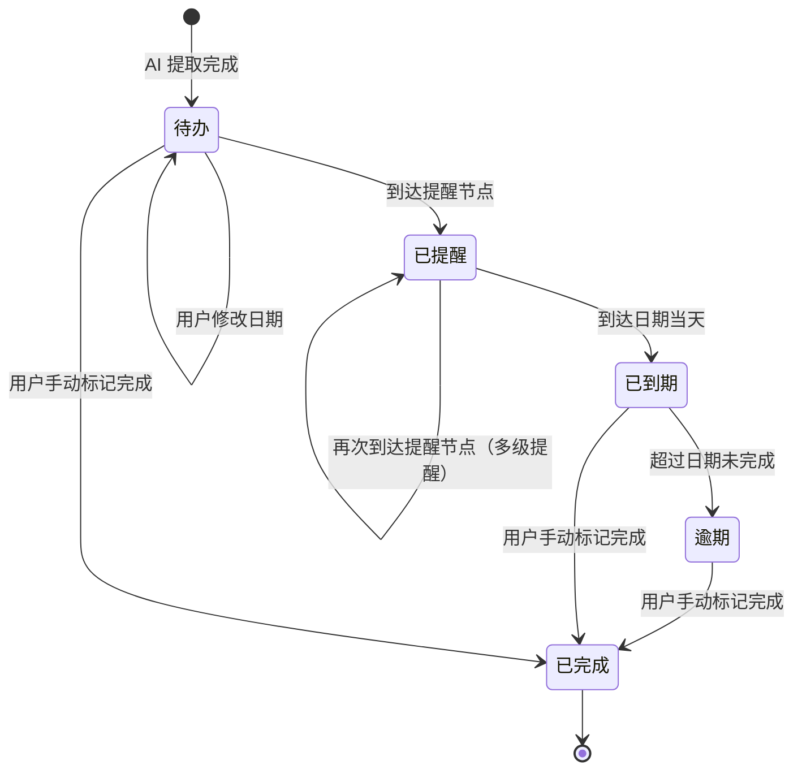

# 自由职业者合同关键日期提醒器 — 产品需求文档（PRD）

> 文档版本：v1.1
> 编写日期：2026-06-29
> 产品名称：自由职业者合同关键日期提醒器（Contract Date Reminder）
> 产品定位：面向自由职业者与小团队的轻量级合同关键日期管理 SaaS 工具
> 文档性质：产品需求文档（PRD）
> 上游文档：URS-自由职业者合同关键日期提醒器.md（v1.0）

---

# 1. 产品概述

## 1.1 产品定位

**自由职业者合同关键日期提醒器**（以下简称"本 product"或"提醒器"）是一款面向自由职业者、小型外包服务商及独立经纪人用户的轻量级 SaaS 工具。产品聚焦于"AI 提取合同关键日期 + 多级到期提醒"这一核心痛点，以"上传即识别、到期即提醒"为价值主张，帮助用户以最低成本管好每一份合同中的关键日期。

### 1.1.1 与 URS 的映射关系

| URS 章节 | PRD 对应章节 | 说明 |
|---|---|---|
| 1. 需求概述 | 1. 产品概述 | 继承需求目标、用户角色、业务流程 |
| 2. 功能原型 | 3. 页面结构与交互设计 | 8 个核心页面逐一展开 |
| 3. 需求清单 | 2. 功能规格 | 将 50+ 功能点转化为可执行功能规格 |
| 4. 非功能需求 | 7. 非功能规格 | 继承性能、兼容性、约束指标 |
| 5. 接口需求 | 6. 系统架构与接口 | 细化技术方案与第三方集成 |
| 6. 附录 | 附录 | 数据模型、状态图 |

## 1.2 核心价值主张

| 维度 | 描述 |
|---|---|
| 用户痛点 | 自由职业者因遗忘合同节点导致漏收款、违约、错过续约窗口 |
| 解决方案 | AI 自动提取关键日期 + 多级到期提醒 + 日历看板一览 |
| 差异化 | 不做完整 CLM，只聚焦"关键日期提取+提醒"这一高频场景 |
| 价值承诺 | 上传合同 → 30 秒内获得关键日期 → 永不错过任何节点 |

## 1.3 目标用户画像

### Persona 1：小林（独立 UI 设计师）
- 年龄：28 岁，自由职业 3 年
- 同时管理 8-12 份服务合同
- 曾因为忘记续约窗口丢失客户
- 需求：简单好用的合同日期提醒，不要复杂的合同管理

### Persona 2：张哥（独立经纪人）
- 年龄：35 岁，管理 5 位签约设计师
- 需要看团队所有人的合同到期情况
- 需求：团队视图、到期统计报告

### Persona 3：阿美（自由翻译）
- 年龄：25 岁，刚入行 1 年
- 合同数量不多（3-5 份），但经常忘记收款日
- 需求：免费版够用，付款节点提醒最重要

## 1.4 商业模式

| 方案 | 价格 | 核心权益 |
|---|---|---|
| 免费版 | ¥0 | 管理 5 份合同，基础提醒（1 次到期前提醒），站内信通知 |
| 专业版 | ¥19/月 | 不限合同数，多级提醒（3/7/30 天），邮件+微信推送，团队协作，到期统计报告，批量操作 |

---

# 2. 功能规格

## 2.1 功能模块总览

| 模块编号 | 模块名称 | 功能数量 | 版本要求 |
|---|---|---|---|
| M1 | 账户与订阅 | 7 | MVP |
| M2 | 合同上传与 AI 提取 | 8 | MVP |
| M3 | 合同管理 | 9 | MVP |
| M4 | 日历看板 | 6 | MVP |
| M5 | 提醒通知 | 8 | MVP |
| M6 | 团队协作 | 8 | 专业版 |

## 2.2 M1 - 账户与订阅模块

### F1.1 用户注册
- **触发**：用户访问注册页面
- **前置条件**：无
- **主流程**：
  1. 用户输入邮箱、密码（≥8位，含大小写+数字）、确认密码
  2. 系统校验邮箱格式、密码强度、两次输入一致性
  3. 系统发送验证邮件（含验证链接，24 小时有效）
  4. 用户点击链接完成验证，自动跳转登录页
- **异常流程**：
  - 邮箱已注册 → 提示"该邮箱已注册，请直接登录"
  - 验证链接过期 → 提示重新发送
- **业务规则**：同一邮箱只能注册一个账户

### F1.2 第三方登录（可选 MVP）
- **触发**：用户点击"微信登录"或"Google 登录"按钮
- **主流程**：
  1. 跳转至第三方 OAuth 授权页面
  2. 用户授权后，回调至本系统
  3. 系统获取用户身份信息，自动创建或关联账户
  4. 首次登录引导绑定邮箱（用于接收提醒）
- **接口依赖**：微信 OAuth、Google OAuth

### F1.3 用户登录
- **触发**：用户访问登录页面
- **主流程**：
  1. 用户输入邮箱+密码
  2. 系统校验凭据
  3. 登录成功 → 跳转合同管理主页
  4. 登录失败 → 提示"邮箱或密码错误"
- **安全规则**：
  - 连续 5 次密码错误 → 锁定账户 15 分钟
  - 密码加密存储（bcrypt）
  - 会话有效期 7 天

### F1.4 查看当前订阅方案
- **触发**：用户进入"订阅管理"页面
- **展示信息**：
  - 当前方案（免费版/专业版）
  - 专业版到期日（若为专业版）
  - 已使用合同数 / 合同上限
  - 下次扣款日（若为专业版）

### F1.5 升级专业版
- **触发**：用户点击"升级专业版"按钮
- **主流程**：
  1. 跳转至订阅与付费页
  2. 用户确认订阅（¥19/月）
  3. 完成支付（微信支付/支付宝/信用卡）
  4. 支付成功 → 立即升级为专业版，跳转回主页

### F1.6 降级/取消订阅
- **触发**：用户点击"取消订阅"
- **主流程**：
  1. 弹窗确认："取消后将在当前周期结束时降为免费版"
  2. 用户确认 → 标记为"周期结束后降级"
  3. 当前周期结束 → 自动降为免费版
  4. 若合同数 > 5，仅保留前 5 份（按上传时间倒序），其余隐藏但保留数据 90 天
- **业务规则**：降级不影响已发送的提醒记录

## 2.3 M2 - 合同上传与 AI 提取模块

### F2.1 选择上传文件
- **触发**：用户点击"上传合同"按钮
- **支持格式**：PDF、JPG、PNG
- **文件大小**：单文件 ≤ 20MB
- **交互方式**：
  - 文件选择器（支持多选，专业版）
  - 拖拽上传区域
- **免费版限制**：一次仅上传 1 份

### F2.2 批量上传
- **触发**：专业版用户选择多份文件
- **交互**：
  - 文件列表展示待上传文件
  - 每个文件显示上传进度条
  - 支持取消单个文件上传
  - 全部上传完成后自动进入 AI 提取队列

### F2.3 上传进度展示
- **展示内容**：
  - 文件名 + 文件大小
  - 上传进度条（百分比）
  - 状态标识：上传中 / 上传完成 / AI 解析中 / 解析完成 / 失败
- **实时推送**：通过 WebSocket 推送进度更新

### F2.4 AI 关键日期识别
- **触发**：文件上传完成后自动触发
- **处理流程**：
  1. 调用 OCR 服务提取文档文本（PDF 先提取文本层，无文本层则 OCR）
  2. 将文本发送至 LLM 大模型，提取关键日期
  3. LLM 返回结构化 JSON：
     ```json
     {
       "key_dates": [
         {
           "type": "付款节点",
           "date": "2026-07-15",
           "description": "第二期项目款",
           "amount": "¥15,000",
           "original_text": "甲方应于项目交付后15个工作日内支付第二期款项15000元",
           "confidence": 0.95
         }
       ]
     }
     ```
  4. 日期规范化：将自然语言日期转为标准格式（YYYY-MM-DD）
- **支持的关键日期类型**：
  | 类型 | 说明 | 图标颜色 |
  |---|---|---|
  | 付款节点 | 收款/付款日期 | 🟢 绿色 |
  | 交付截止 | 项目/阶段交付日期 | 🔵 蓝色 |
  | 续约窗口 | 合同续约起止日期 | 🟡 黄色 |
  | 保密期限 | 保密义务截止日期 | 🟣 紫色 |
  | 合同起始 | 合同生效日期 | ⚪ 灰色 |
  | 合同到期 | 合同终止日期 | 🔴 红色 |
  | 其他 | 其他关键日期 | ⚫ 深色 |
- **性能指标**：单份合同 AI 提取 ≤ 30 秒

### F2.5 识别结果展示
- **展示位置**：上传后自动跳转至"AI 提取结果确认页"
- **展示内容**：
  - 左侧：合同原文预览（高亮 AI 识别的原文段落）
  - 右侧：提取结果列表
    - 每个日期条目显示：类型标签、日期、描述、金额（如有）、原文引用
    - 置信度标识：高（≥0.8）/ 中（0.5-0.8）/ 低（<0.5）
  - 底部操作栏：确认保存 / 重新识别 / 取消

### F2.6 用户校对与修正
- **可执行操作**：
  - 修改日期：点击日期字段弹出日期选择器
  - 修改类型：下拉菜单切换日期类型
  - 修改描述：直接编辑描述文本
  - 删除条目：点击删除按钮移除误识别项
  - 新增条目：点击"添加关键日期"手动添加遗漏项
- **交互规则**：修改后立即生效（前端状态），保存时一并提交

### F2.7 确认并保存
- **触发**：用户点击"确认保存"按钮
- **主流程**：
  1. 前端提交修正后的关键日期数据
  2. 系统要求填写合同基本信息（若首次上传）：
     - 合同名称（必填，可从 AI 提取结果预填）
     - 合作方名称（选填）
     - 合同编号（选填）
  3. 保存合同记录 + 关键日期记录
  4. 自动根据用户默认提醒偏好创建提醒任务
  5. 跳转至合同详情页

## 2.4 M3 - 合同管理模块

### F3.1 合同列表
- **展示内容**（每行）：
  - 合同名称（可点击进入详情）
  - 合作方
  - 上传时间
  - 关键日期数量
  - 最近到期日期 + 倒计时天数
  - 状态标识：正常 / 即将到期（7天内）/ 已到期 / 已全部完成
- **默认排序**：按最近到期时间升序（最紧急的排最前）
- **空状态**：引导用户上传第一份合同

### F3.2 搜索与筛选
- **搜索**：按合同名称、合作方名称模糊搜索
- **筛选条件**：
  - 关键日期类型（多选）
  - 到期状态：全部 / 即将到期（7天内）/ 已到期 / 已全部完成
  - 上传时间范围
- **组合使用**：搜索框 + 筛选条件可同时生效

### F3.3 合同排序
- **可排序字段**：
  - 最近到期时间（默认）
  - 上传时间
  - 合作方名称
  - 合同名称
- **排序方向**：升序 / 降序切换

### F3.4 查看合同基本信息
- **展示字段**：
  - 合同名称
  - 合同编号
  - 合作方
  - 上传时间
  - 原始文件（可预览/下载）
  - 关键日期数量统计

### F3.5 查看关键日期列表
- **展示内容**（每条）：
  - 日期类型标签（带颜色）
  - 具体日期
  - 描述
  - 金额（如有）
  - 状态：待办 / 已提醒 / 已到期 / 逾期 / 已完成
  - 原文引用（折叠展示）
- **排序**：按日期升序

### F3.6 编辑关键日期
- **操作方式**：在合同详情页，点击关键日期条目的"编辑"按钮
- **可编辑字段**：日期、类型、描述、金额
- **保存规则**：修改后立即保存，并更新关联的提醒任务

### F3.7 标记节点完成
- **触发**：点击关键日期条目的"标记完成"按钮
- **主流程**：
  1. 状态变为"已完成"（绿色勾选标识）
  2. 取消该节点后续的提醒任务
  3. 记录完成时间
- **可恢复**：已完成节点可点击"恢复为待办"

### F3.8 删除单份合同
- **触发**：合同详情页 → "删除合同"按钮
- **确认**：弹窗二次确认"确定删除该合同及其所有关键日期记录？此操作不可恢复"
- **结果**：删除合同记录 + 所有关联关键日期 + 取消所有提醒任务

### F3.9 批量删除
- **触发**：合同列表页 → 勾选多份合同 → "批量删除"按钮
- **专业版功能**：免费版不可用
- **确认**：弹窗显示待删除数量，二次确认

## 2.5 M4 - 日历看板模块

### F4.1 月视图展示
- **展示形式**：标准月历（7列×5-6行）
- **日期格子内容**：
  - 日期数字
  - 当日关键日期条目（以彩色圆点标识，最多显示 3 个，超出显示 "+N"）
  - 圆点颜色对应日期类型
  - 今日高亮
  - 到期日标红
- **交互**：
  - 点击日期 → 右侧面板展示当日详情
  - 左右箭头 / 滑动切换月份
  - "今天"按钮快速回到当月

### F4.2 周视图切换
- **展示形式**：7 列 × 1 行（本周）
- **每列内容**：日期 + 当日关键日期列表（完整展示）
- **切换方式**：月视图/周视图切换按钮

### F4.3 日期节点点击
- **触发**：点击日历中某一日期
- **展示**：右侧滑出面板，显示当日所有关键日期：
  - 时间、类型标签、合同名称、描述、状态
  - 快捷操作：标记完成、查看详情

### F4.4 时间线视图
- **展示形式**：垂直时间线，从当前日期向后展示
- **每条记录**：
  - 日期（左侧）
  - 关键日期卡片（右侧）：类型标签 + 合同名称 + 描述 + 状态
  - 颜色标识：
    - 灰色：待办（>30天）
    - 黄色：即将到期（7-30天）
    - 橙色：临近到期（3-7天）
    - 红色：已到期 / 逾期
    - 绿色：已完成
- **交互**：
  - 滚动加载更多
  - 点击卡片跳转合同详情

### F4.5 节点状态标识
- **状态颜色方案**：
  | 状态 | 颜色 | 说明 |
  |---|---|---|
  | 待办 | 灰色 | 距到期 >30 天 |
  | 即将到期 | 黄色 | 距到期 7-30 天 |
  | 临近到期 | 橙色 | 距到期 3-7 天 |
  | 已到期 | 红色 | 到期当天 |
  | 逾期 | 深红色 | 超过到期日未完成 |
  | 已完成 | 绿色 | 用户已标记完成 |

### F4.6 快速操作
- **在日历/时间线上的快捷操作**：
  - 右键菜单 / 长按菜单：标记完成、查看详情、编辑日期
  - 已完成状态可直接点击恢复

## 2.6 M5 - 提醒通知模块

### F5.1 提前提醒天数设置
- **默认设置**（全局）：
  - 免费版：提前 7 天提醒（1 次）
  - 专业版：提前 30 天、7 天、3 天 + 到期当天（4 次）
- **合同级设置**：每个合同可单独设置提醒天数（覆盖全局设置）
- **设置方式**：提醒设置页 / 合同详情页

### F5.2 提醒方式选择
- **可选方式**：
  - 站内信（默认开启，免费/专业版均可）
  - 邮件提醒（专业版）
  - 微信服务号推送（专业版，需绑定微信）
- **设置方式**：提醒设置页 → 通知方式偏好

### F5.3 免打扰时段
- **设置**：用户可设定每日免打扰时段（默认 22:00-08:00）
- **规则**：免打扰时段内的提醒延迟至时段结束后发送
- **专业版功能**

### F5.4 自动触发提醒
- **调度机制**：
  - 每日 08:00 执行一次定时任务，扫描当日应触发的提醒
  - 触发后立即推送（免打扰时段除外）
- **推送内容模板**：
  ```
  【合同日期提醒】
  合同：{合同名称}
  节点类型：{类型}
  日期：{日期}（距今 {N} 天）
  详情：{描述}
  点击查看 → {链接}
  ```

### F5.5 到期当天提醒
- **触发**：关键日期到期当天 08:00
- **推送方式**：站内信 + 邮件 + 微信（按用户设置）
- **特殊标识**：消息中心以红色高亮展示

### F5.6 逾期提醒
- **触发**：关键日期过期未完成
- **频率**：每日一次（08:00），直到用户标记完成
- **标识**：消息中心以"逾期"标签展示

### F5.7 提醒列表（消息中心）
- **展示内容**：
  - 提醒标题（合同名称 + 节点类型）
  - 提醒时间
  - 已读/未读状态
  - 紧急程度标识（正常 / 紧急 / 逾期）
- **筛选**：全部 / 未读 / 紧急 / 逾期
- **操作**：标记已读、全部已读、点击跳转详情

### F5.8 提醒跳转
- **触发**：点击消息中心中的某条提醒
- **行为**：
  1. 标记为已读
  2. 跳转至对应合同的关键日期详情页
  3. 自动滚动到对应日期条目并高亮

## 2.7 M6 - 团队协作模块（专业版）

### F6.1 创建团队
- **触发**：专业版用户进入"团队管理"页 → "创建团队"
- **填写信息**：团队名称（必填）、团队描述（选填）
- **规则**：一个账户只能创建一个团队（可解散后重建）

### F6.2 邀请成员
- **邀请方式**：
  - 邮箱邀请：输入成员邮箱，发送邀请邮件
  - 邀请链接：生成邀请链接，分享给成员
- **规则**：团队最多 10 名成员（含管理员）

### F6.3 移除成员
- **触发**：管理员在成员列表中点击"移除"
- **确认**：弹窗确认
- **结果**：被移除成员失去团队视图访问权限，其共享的合同从团队视图移除

### F6.4 设置角色
- **角色类型**：
  - 管理员：可管理成员、查看所有共享合同、查看统计报告
  - 普通成员：可上传合同、共享合同到团队、查看团队日历
- **操作**：管理员可在成员列表中切换成员角色

### F6.5 共享合同给团队
- **触发**：合同详情页 → "共享到团队"按钮
- **规则**：
  - 共享后，团队管理员和其他成员可在团队日历中查看该合同的关键日期
  - 共享的是"关键日期视图"，不包括合同原始文件
  - 可随时取消共享

### F6.6 团队日历视图
- **展示内容**：团队所有成员共享的合同关键日期
- **区分方式**：不同成员用不同颜色标识
- **筛选**：按成员、日期类型筛选

### F6.7 团队到期统计报告
- **报告维度**：
  - 按成员：每人负责的合同数、即将到期数、已完成数
  - 按合同类型：付款节点、交付截止等各类型统计
  - 按时间维度：未来 30/60/90 天到期趋势
- **展示形式**：图表（柱状图+折线图）+ 数据表格

### F6.8 导出报告
- **支持格式**：PDF、Excel
- **触发**：统计报告页 → "导出"按钮
- **内容**：与页面展示一致的图表+数据

---

# 3. 页面结构与交互设计

## 3.1 页面总览

| 编号 | 页面名称 | URL | 核心功能 | 独立原型 | 版本要求 |
|---|---|---|---|---|---|
| P1 | 合同管理主页 | /dashboard | 日历看板 + 合同列表 + 快速入口 | [P1](./P1-合同管理主页.html) | MVP |
| P2 | 合同上传与 AI 提取确认页 | /contracts/upload | 文件上传 + AI 结果校对 | [P2](./P2-合同上传与AI提取确认页.html) | MVP |
| P3 | 合同详情与关键日期编辑页 | /contracts/:id | 查看/编辑合同信息+关键日期 | [P3](./P3-合同详情与关键日期编辑页.html) | MVP |
| P4 | 提醒设置页 | /settings/reminders | 设置提醒偏好 | [P4](./P4-提醒设置页.html) | MVP |
| P5 | 消息中心 | /notifications | 提醒通知列表 | [P5](./P5-消息中心.html) | MVP |
| P6 | 订阅与付费页 | /subscription | 方案对比 + 支付 | [P6](./P6-订阅与付费页.html) | MVP |
| P7 | 团队管理页 | /team | 成员管理 + 团队日历 | [P7](./P7-团队管理页.html) | 专业版 |
| P8 | 到期统计报告页 | /reports | 数据可视化 + 导出 | [P8](./P8-到期统计报告页.html) | 专业版 |

## 3.2 全局布局

**全站单页应用（SPA）原型**：[SPA-自由职业者合同关键日期提醒器.html](./SPA-自由职业者合同关键日期提醒器.html)


### 3.2.1 整体框架
```
┌─────────────────────────────────────────────────┐
│  TopBar：Logo + 搜索框 + 消息中心入口 + 用户头像  │
├──────────┬──────────────────────────────────────┤
│          │                                      │
│ SideBar  │         Main Content                 │
│          │                                      │
│ - 主页    │                                      │
│ - 合同    │                                      │
│ - 日历    │                                      │
│ - 消息    │                                      │
│ - 团队*   │                                      │
│ - 报告*   │                                      │
│ - 设置    │                                      │
│ - 订阅    │                                      │
│          │                                      │
└──────────┴──────────────────────────────────────┘
* 标记为专业版功能，免费版显示但带锁标识
```

### 3.2.2 响应式断点
| 断点 | 宽度 | 布局调整 |
|---|---|---|
| Desktop | ≥1280px | 完整侧边栏+主内容区 |
| Tablet | 768-1279px | 侧边栏收起为图标+主内容区 |
| Mobile | <768px | 侧边栏变为底部导航栏 |

## 3.3 P1 - 合同管理主页

**独立页面原型**：[P1-合同管理主页.html](./P1-合同管理主页.html)  
**全站 SPA 原型**：[SPA-自由职业者合同关键日期提醒器.html](./SPA-自由职业者合同关键日期提醒器.html#/dashboard)

### 页面结构
```
┌─ 页面头部 ─────────────────────────────────────────┐
│  欢迎语："你好，小林" + 今日概览统计                  │
│  [今日待办 N 项] [本周到期 N 项] [逾期 N 项]          │
│                          [+ 上传合同] [切换视图]      │
├─ 日历看板区域 ──────────────────────────────────────┤
│  ┌─ 月视图/周视图/时间线 切换 Tab ─┐               │
│  │                                 │               │
│  │    [日历看板组件]                │               │
│  │    （详见 F4.1-F4.6）            │               │
│  │                                 │               │
│  └─────────────────────────────────┘               │
├─ 合同列表区域 ──────────────────────────────────────┤
│  搜索框 + [筛选▼] [排序▼]                           │
│  ┌─────────────────────────────────────────────┐   │
│  │ 合同名称 | 合作方 | 关键日期数 | 最近到期 | 状态│   │
│  │ ...                                          │   │
│  └─────────────────────────────────────────────┘   │
└────────────────────────────────────────────────────┘
```

### 交互说明
- 进入页面 → 自动加载当月日历 + 合同列表
- 点击日历日期 → 右侧滑出面板显示当日详情
- 点击合同行 → 跳转合同详情页
- 点击"上传合同" → 跳转上传页
- 视图切换 → 月视图/周视图/时间线无缝切换
- 数据加载 → 骨架屏占位，加载完成淡入

## 3.4 P2 - 合同上传与 AI 提取确认页

**独立页面原型**：[P2-合同上传与AI提取确认页.html](./P2-合同上传与AI提取确认页.html)  
**全站 SPA 原型**：[SPA-自由职业者合同关键日期提醒器.html](./SPA-自由职业者合同关键日期提醒器.html#/upload)

### 页面结构
```
┌─ 步骤条 ──────────────────────────────────────────┐
│  ① 上传文件  →  ② AI 识别  →  ③ 校对确认  →  ④ 完成 │
├─ 上传区域 ────────────────────────────────────────┤
│  ┌─────────────────────────────────────────────┐  │
│  │                                             │  │
│  │    📎 拖拽文件到此处，或 点击选择文件          │  │
│  │    支持 PDF / JPG / PNG，单文件 ≤ 20MB       │  │
│  │                                             │  │
│  └─────────────────────────────────────────────┘  │
│  待上传列表：                                      │
│  ┌─────────────────────────────────────────────┐  │
│  │ 合同A.pdf  ██░░░░░░ 45%  上传中...  [取消]  │  │
│  └─────────────────────────────────────────────┘  │
├─ AI 识别结果区域（识别完成后展示）──────────────────┤
│  ┌─ 左侧：原文预览 ─┐ ┌─ 右侧：提取结果 ────────┐ │
│  │                   │ │ 🟢 付款节点             │ │
│  │  [合同原文PDF预览] │ │ 2026-07-15             │ │
│  │                   │ │ 第二期项目款 ¥15,000    │ │
│  │  高亮显示AI识别    │ │ "甲方应于..."  [编辑]   │ │
│  │  的原文段落        │ │                         │ │
│  │                   │ │ 🔵 交付截止             │ │
│  │                   │ │ 2026-08-01             │ │
│  │                   │ │ 项目终稿交付            │ │
│  │                   │ │ "乙方应在..."  [编辑]   │ │
│  │                   │ │                         │ │
│  │                   │ │ [+ 添加关键日期]        │ │
│  └───────────────────┘ └─────────────────────────┘ │
├─ 底部操作栏 ──────────────────────────────────────┤
│  合同名称：[____________]  合作方：[____________]   │
│           [重新识别]              [确认保存]        │
└──────────────────────────────────────────────────┘
```

### 交互说明
- 拖拽或点击上传 → 显示上传进度
- 上传完成 → 自动进入 AI 识别（步骤条自动前进）
- AI 识别中 → 显示加载动画 + "AI 正在分析合同，预计 30 秒..."
- 识别完成 → 展示左右分栏结果
- 点击原文高亮段落 → 右侧对应条目高亮
- 编辑条目 → 弹出编辑浮层
- 确认保存 → 填写合同名称/合作方 → 保存 → 跳转详情页

## 3.5 P3 - 合同详情与关键日期编辑页

**独立页面原型**：[P3-合同详情与关键日期编辑页.html](./P3-合同详情与关键日期编辑页.html)  
**全站 SPA 原型**：[SPA-自由职业者合同关键日期提醒器.html](./SPA-自由职业者合同关键日期提醒器.html#/detail)

### 页面结构
```
┌─ 面包屑 ──────────────────────────────────────────┐
│  主页 > 合同详情                                    │
├─ 合同基本信息区域 ──────────────────────────────────┤
│  📄 合同名称                          [编辑] [删除] │
│  合作方：XX 公司                                     │
│  合同编号：HT-2026-001                              │
│  上传时间：2026-06-20                               │
│  原始文件：[预览] [下载]                             │
├─ 关键日期列表区域 ──────────────────────────────────┤
│  关键日期（5 项）                    [+ 添加日期]    │
│  ┌─────────────────────────────────────────────┐   │
│  │ 🟢 付款节点    2026-07-15   第二期项目款     │   │
│  │    ¥15,000    状态：待办    距今 17 天       │   │
│  │    "甲方应于..."    [编辑] [标记完成]        │   │
│  ├─────────────────────────────────────────────┤   │
│  │ 🔵 交付截止    2026-08-01   项目终稿交付     │   │
│  │    状态：待办    距今 34 天                   │   │
│  │    "乙方应在..."    [编辑] [标记完成]        │   │
│  ├─────────────────────────────────────────────┤   │
│  │ 🔴 合同到期    2026-12-31   合同终止         │   │
│  │    状态：待办    距今 186 天                  │   │
│  │                 [编辑] [标记完成]            │   │
│  └─────────────────────────────────────────────┘   │
├─ 提醒设置区域 ─────────────────────────────────────┤
│  提醒偏好：提前 30天 / 7天 / 3天 / 到期当天          │
│  提醒方式：✅站内信  ✅邮件  ☐微信                   │
│                                    [自定义提醒设置]  │
└──────────────────────────────────────────────────┘
```

### 交互说明
- 点击"编辑"（合同信息） → 弹出编辑弹窗
- 点击"编辑"（关键日期条目） → 展开行内编辑模式
- 点击"标记完成" → 状态变为绿色✅，弹出确认 toast
- 点击"添加日期" → 展开新增表单
- 点击"删除合同" → 二次确认弹窗

## 3.6 P4 - 提醒设置页

**独立页面原型**：[P4-提醒设置页.html](./P4-提醒设置页.html)  
**全站 SPA 原型**：[SPA-自由职业者合同关键日期提醒器.html](./SPA-自由职业者合同关键日期提醒器.html#/reminders)

### 页面结构
```
┌─ 页面标题 ─────────────────────────────────────────┐
│  ⚙️ 提醒设置                                        │
├─ 全局提醒偏好 ──────────────────────────────────────┤
│                                                     │
│  默认提前提醒天数                                    │
│  ┌─────────────────────────────────────────────┐   │
│  │ ☑ 提前 30 天    ☑ 提前 7 天                  │   │
│  │ ☑ 提前 3 天     ☑ 到期当天                   │   │
│  │ （免费版仅可设置 1 项，专业版可多选）          │   │
│  └─────────────────────────────────────────────┘   │
│                                                     │
│  提醒方式                                            │
│  ┌─────────────────────────────────────────────┐   │
│  │ ☑ 站内信通知（免费）                          │   │
│  │ ☑ 邮件提醒（专业版）  邮箱：user@example.com  │   │
│  │ ☐ 微信推送（专业版）  [绑定微信]              │   │
│  └─────────────────────────────────────────────┘   │
│                                                     │
│  免打扰时段（专业版）                                │
│  ┌─────────────────────────────────────────────┐   │
│  │ 开启免打扰  ☑                                │   │
│  │ 时段：[22:00] ~ [08:00]                      │   │
│  └─────────────────────────────────────────────┘   │
│                                                     │
│  逾期提醒                                            │
│  ┌─────────────────────────────────────────────┐   │
│  │ 逾期后每日提醒  ☑                             │   │
│  └─────────────────────────────────────────────┘   │
│                                                     │
│                              [保存设置]              │
└────────────────────────────────────────────────────┘
```

### 交互说明
- 免费版用户点击专业版功能 → 弹出升级提示
- 修改设置 → 实时预览变化
- 点击"保存设置" → toast 提示"保存成功"
- 绑定微信 → 弹出微信二维码扫码

## 3.7 P5 - 消息中心

**独立页面原型**：[P5-消息中心.html](./P5-消息中心.html)  
**全站 SPA 原型**：[SPA-自由职业者合同关键日期提醒器.html](./SPA-自由职业者合同关键日期提醒器.html#/notifications)

### 页面结构
```
┌─ 页面标题 ──────────────────────────────────────────┐
│  🔔 消息中心                          [全部已读]     │
├─ 筛选标签 ──────────────────────────────────────────┤
│  [全部] [未读 3] [紧急 2] [逾期 1]                   │
├─ 消息列表 ──────────────────────────────────────────┤
│  ┌─────────────────────────────────────────────┐   │
│  │ 🔴 逾期  合同"XX设计服务"的付款节点已逾期 3 天 │   │
│  │      2026-06-25 08:00          [查看详情]    │   │
│  ├─────────────────────────────────────────────┤   │
│  │ 🟡 紧急  合同"YY开发项目"的交付截止还有 3 天  │   │
│  │      2026-06-25 08:00          [查看详情]    │   │
│  ├─────────────────────────────────────────────┤   │
│  │ 🔵 提醒  合同"ZZ翻译服务"的付款节点还有 7 天  │   │
│  │      2026-06-21 08:00          [查看详情]    │   │
│  ├─────────────────────────────────────────────┤   │
│  │ ⚪ 提醒  合同"XX设计服务"的续约窗口还有 30 天 │   │
│  │      2026-05-28 08:00          [查看详情]    │   │
│  └─────────────────────────────────────────────┘   │
│                                                     │
│  ← 上一页  1 / 3  下一页 →                          │
└────────────────────────────────────────────────────┘
```

### 交互说明
- 未读消息以粗体 + 左侧蓝点标识
- 点击消息行 → 标记已读 + 跳转对应合同详情
- 点击"全部已读" → 所有消息标记已读
- 筛选标签切换 → 列表动态过滤

## 3.8 P6 - 订阅与付费页

**独立页面原型**：[P6-订阅与付费页.html](./P6-订阅与付费页.html)  
**全站 SPA 原型**：[SPA-自由职业者合同关键日期提醒器.html](./SPA-自由职业者合同关键日期提醒器.html#/subscription)

### 页面结构
```
┌─ 页面标题 ──────────────────────────────────────────┐
│  选择适合你的方案                                     │
├─ 方案对比卡片 ──────────────────────────────────────┤
│  ┌──────────────┐    ┌──────────────────────┐       │
│  │   免费版      │    │   专业版 ⭐           │       │
│  │   ¥0         │    │   ¥19/月              │       │
│  │              │    │                       │       │
│  │ ✅ 5 份合同   │    │ ✅ 不限合同数          │       │
│  │ ✅ 基础提醒   │    │ ✅ 多级提醒(3/7/30天) │       │
│  │ ✅ 站内信     │    │ ✅ 邮件+微信推送       │       │
│  │ ☐ 团队协作   │    │ ✅ 团队协作            │       │
│  │ ☐ 统计报告   │    │ ✅ 到期统计报告        │       │
│  │ ☐ 批量操作   │    │ ✅ 批量操作            │       │
│  │              │    │                       │       │
│  │ [当前方案]    │    │ [立即升级]             │       │
│  └──────────────┘    └──────────────────────┘       │
├─ 功能详细对比表 ────────────────────────────────────┤
│  （完整功能对比表格）                                 │
├─ FAQ ──────────────────────────────────────────────┤
│  Q: 可以随时取消订阅吗？                             │
│  A: 可以，取消后当前周期结束自动降为免费版。           │
│  ...                                                │
└────────────────────────────────────────────────────┘
```

### 交互说明
- 点击"立即升级" → 弹出支付方式选择（微信/支付宝/信用卡）
- 支付完成 → 自动刷新页面，显示专业版权限
- 当前方案按钮置灰不可点击

## 3.9 P7 - 团队管理页（专业版）

**独立页面原型**：[P7-团队管理页.html](./P7-团队管理页.html)  
**全站 SPA 原型**：[SPA-自由职业者合同关键日期提醒器.html](./SPA-自由职业者合同关键日期提醒器.html#/team)

### 页面结构
```
┌─ 页面标题 ──────────────────────────────────────────┐
│  👥 团队管理                            [+ 邀请成员] │
├─ 团队信息 ──────────────────────────────────────────┤
│  团队名称：张哥的设计工作室                            │
│  成员数：3/10                                       │
├─ 成员列表 ──────────────────────────────────────────┤
│  ┌─────────────────────────────────────────────┐   │
│  │ 👤 张哥（管理员）  zhang@example.com  合同 12 │   │
│  │                                   [管理]     │   │
│  ├─────────────────────────────────────────────┤   │
│  │ 👤 小李（成员）    li@example.com    合同 5  │   │
│  │                              [移除] [→管理员]│   │
│  ├─────────────────────────────────────────────┤   │
│  │ 👤 小王（成员）    wang@example.com  合同 3  │   │
│  │                              [移除] [→管理员]│   │
│  └─────────────────────────────────────────────┘   │
├─ 团队日历 ──────────────────────────────────────────┤
│  [按成员筛选▼] [按类型筛选▼]                         │
│  ┌─ 月历视图（显示所有成员共享的关键日期）─────────┐  │
│  │ 不同成员用不同颜色圆点标识                       │  │
│  └─────────────────────────────────────────────┘  │
├─ 邀请方式 ──────────────────────────────────────────┤
│  邀请链接：[https://xxx/invite/abc123]  [复制链接]  │
│  或输入邮箱：[_______________]  [发送邀请]           │
└────────────────────────────────────────────────────┘
```

### 交互说明
- 点击"邀请成员" → 展开邀请区域
- 点击"移除" → 二次确认弹窗
- 点击角色切换 → 立即生效
- 点击日历中彩色圆点 → 显示该条目详情+所属成员

## 3.10 P8 - 到期统计报告页（专业版）

**独立页面原型**：[P8-到期统计报告页.html](./P8-到期统计报告页.html)  
**全站 SPA 原型**：[SPA-自由职业者合同关键日期提醒器.html](./SPA-自由职业者合同关键日期提醒器.html#/reports)

### 页面结构
```
┌─ 页面标题 ──────────────────────────────────────────┐
│  📊 到期统计报告                  时间范围：[未来30天▼] │
│                                       [导出PDF] [导出Excel] │
├─ 概览卡片 ──────────────────────────────────────────┤
│  ┌─────────┐ ┌─────────┐ ┌─────────┐ ┌─────────┐  │
│  │ 合同总数 │ │ 即将到期 │ │ 已到期   │ │ 已完成   │  │
│  │   23    │ │    8    │ │    2    │ │   15    │  │
│  └─────────┘ └─────────┘ └─────────┘ └─────────┘  │
├─ 到期趋势图 ────────────────────────────────────────┤
│  ┌─────────────────────────────────────────────┐   │
│  │  [折线图：未来30天每日到期数量趋势]            │   │
│  │                                             │   │
│  └─────────────────────────────────────────────┘   │
├─ 按类型分布 ────────────────────────────────────────┤
│  ┌─────────────────────────────────────────────┐   │
│  │  [饼图/柱状图：各类型关键日期占比]             │   │
│  │  付款节点: 35% | 交付截止: 28% | 续约: 15%   │   │
│  │  保密期限: 8% | 合同到期: 10% | 其他: 4%     │   │
│  └─────────────────────────────────────────────┘   │
├─ 按成员统计（团队视图）─────────────────────────────┤
│  ┌─────────────────────────────────────────────┐   │
│  │ 成员   | 合同数 | 即将到期 | 已到期 | 已完成 │   │
│  │ 张哥   |   12  |    4    |   1   |   8    │   │
│  │ 小李   |    5  |    2    |   1   |   4    │   │
│  │ 小王   |    3  |    2    |   0   |   3    │   │
│  └─────────────────────────────────────────────┘   │
└────────────────────────────────────────────────────┘
```

### 交互说明
- 时间范围切换 → 图表数据动态更新
- 鼠标悬停图表 → 显示详细数据 tooltip
- 点击"导出" → 下载对应格式文件
- 个人版用户不显示"按成员统计"区块

---

# 4. 数据模型

## 4.1 核心实体

### User（用户）
| 字段 | 类型 | 必填 | 说明 |
|---|---|---|---|
| id | UUID | ✅ | 主键 |
| email | VARCHAR(255) | ✅ | 邮箱，唯一 |
| password_hash | VARCHAR(255) | ✅ | 加密密码 |
| nickname | VARCHAR(50) | | 昵称 |
| avatar_url | VARCHAR(500) | | 头像 URL |
| subscription_type | ENUM | ✅ | free / pro |
| subscription_expire_at | TIMESTAMP | | 专业版到期时间 |
| wechat_openid | VARCHAR(100) | | 微信绑定 |
| timezone | VARCHAR(50) | | 时区，默认 Asia/Shanghai |
| created_at | TIMESTAMP | ✅ | 注册时间 |
| updated_at | TIMESTAMP | ✅ | 更新时间 |

### Contract（合同）
| 字段 | 类型 | 必填 | 说明 |
|---|---|---|---|
| id | UUID | ✅ | 主键 |
| user_id | UUID | ✅ | 所属用户 |
| team_id | UUID | | 所属团队（如共享） |
| name | VARCHAR(200) | ✅ | 合同名称 |
| partner_name | VARCHAR(200) | | 合作方名称 |
| contract_no | VARCHAR(100) | | 合同编号 |
| file_url | VARCHAR(500) | ✅ | 原始文件 OSS URL |
| file_type | VARCHAR(10) | ✅ | pdf / jpg / png |
| file_size | INT | ✅ | 文件大小（字节） |
| key_date_count | INT | | 关键日期数量（冗余计数） |
| nearest_date | DATE | | 最近到期日期（冗余） |
| status | ENUM | ✅ | active / archived / deleted |
| created_at | TIMESTAMP | ✅ | 上传时间 |
| updated_at | TIMESTAMP | ✅ | 更新时间 |

### KeyDate（关键日期）
| 字段 | 类型 | 必填 | 说明 |
|---|---|---|---|
| id | UUID | ✅ | 主键 |
| contract_id | UUID | ✅ | 所属合同 |
| type | ENUM | ✅ | payment / delivery / renewal / confidentiality / start / end / other |
| date | DATE | ✅ | 关键日期 |
| description | VARCHAR(500) | | 描述 |
| amount | DECIMAL(12,2) | | 金额 |
| currency | VARCHAR(3) | | 货币，默认 CNY |
| original_text | TEXT | | AI 识别的原文引用 |
| confidence | DECIMAL(3,2) | | AI 置信度 0-1 |
| status | ENUM | ✅ | pending / reminded / due / overdue / completed |
| completed_at | TIMESTAMP | | 标记完成时间 |
| created_at | TIMESTAMP | ✅ | 创建时间 |
| updated_at | TIMESTAMP | ✅ | 更新时间 |

### Reminder（提醒配置）
| 字段 | 类型 | 必填 | 说明 |
|---|---|---|---|
| id | UUID | ✅ | 主键 |
| user_id | UUID | ✅ | 所属用户 |
| contract_id | UUID | | 关联合同（空=全局设置） |
| advance_days | INT | ✅ | 提前天数 |
| channel | ENUM | ✅ | in_app / email / wechat |
| is_enabled | BOOLEAN | ✅ | 是否启用 |
| created_at | TIMESTAMP | ✅ | 创建时间 |

### Notification（通知记录）
| 字段 | 类型 | 必填 | 说明 |
|---|---|---|---|
| id | UUID | ✅ | 主键 |
| user_id | UUID | ✅ | 接收用户 |
| key_date_id | UUID | ✅ | 关联关键日期 |
| type | ENUM | ✅ | advance / due / overdue |
| title | VARCHAR(200) | ✅ | 通知标题 |
| content | TEXT | ✅ | 通知内容 |
| channel | ENUM | ✅ | in_app / email / wechat |
| is_read | BOOLEAN | ✅ | 是否已读 |
| sent_at | TIMESTAMP | ✅ | 发送时间 |
| read_at | TIMESTAMP | | 阅读时间 |

### Team（团队）
| 字段 | 类型 | 必填 | 说明 |
|---|---|---|---|
| id | UUID | ✅ | 主键 |
| name | VARCHAR(100) | ✅ | 团队名称 |
| description | VARCHAR(500) | | 团队描述 |
| owner_id | UUID | ✅ | 创建者 |
| invite_link | VARCHAR(200) | | 邀请链接 token |
| created_at | TIMESTAMP | ✅ | 创建时间 |

### TeamMember（团队成员）
| 字段 | 类型 | 必填 | 说明 |
|---|---|---|---|
| id | UUID | ✅ | 主键 |
| team_id | UUID | ✅ | 所属团队 |
| user_id | UUID | ✅ | 用户 ID |
| role | ENUM | ✅ | admin / member |
| joined_at | TIMESTAMP | ✅ | 加入时间 |

## 4.2 实体关系

```
User 1──N Contract
User 1──N Reminder
User 1──N Notification
Contract 1──N KeyDate
Contract N──1 Team（可选）
Team 1──N TeamMember
TeamMember N──1 User
```

---

# 5. 交互流程

## 5.1 核心用户旅程

### 旅程 1：首次上传合同
```
用户登录 → 主页（空状态引导）→ 点击"上传合同"
→ 选择文件 → 上传中（进度条）
→ AI 识别中（加载动画）→ 展示识别结果
→ 用户校对（修改/添加/删除）→ 确认保存
→ 填写合同名称 → 保存成功 → 跳转合同详情
→ 返回主页（合同列表已更新）
```

### 旅程 2：查看到期提醒
```
收到推送通知 → 点击通知链接
→ 打开消息中心（自动定位到该提醒）
→ 点击提醒条目 → 跳转合同详情
→ 查看关键日期详情 → 标记完成
→ 返回消息中心 → 提醒状态已更新
```

### 旅程 3：团队协作
```
管理员创建团队 → 邀请成员（邮箱/链接）
→ 成员接受邀请 → 加入团队
→ 成员上传合同 → 共享到团队
→ 管理员查看团队日历 → 查看统计报告
→ 导出报告分享给团队
```

## 5.2 页面跳转关系

```
登录/注册 → P1 主页
P1 主页 → P2 上传页（点击上传按钮）
P1 主页 → P3 合同详情（点击合同行）
P1 主页 → P5 消息中心（点击消息图标）
P2 上传页 → P3 合同详情（确认保存后）
P3 合同详情 → P4 提醒设置（点击自定义提醒）
P5 消息中心 → P3 合同详情（点击提醒条目）
P6 订阅页 → 支付完成 → P1 主页
P7 团队管理 → P3 合同详情（点击团队日历条目）
P8 统计报告 → 独立页面
```

---

# 6. 系统架构与接口

## 6.1 系统架构概览

```
┌─────────────┐     ┌─────────────┐     ┌─────────────┐
│   Web 前端   │────▶│  API 网关    │────▶│  业务服务    │
│  (Vue/React) │◀────│  (Nginx)    │◀────│  (Node.js)  │
└─────────────┘     └─────────────┘     └──────┬──────┘
                                               │
                    ┌──────────────────────────┤
                    │              │            │
              ┌─────▼─────┐ ┌─────▼─────┐ ┌───▼──────┐
              │ 文档解析服务│ │ AI 提取服务│ │ 提醒调度  │
              │  (OCR)     │ │  (LLM)    │ │  服务    │
              └─────┬──────┘ └─────┬──────┘ └───┬──────┘
                    │              │             │
              ┌─────▼──────┐ ┌────▼──────┐ ┌───▼──────┐
              │ 第三方 OCR  │ │ LLM API   │ │ 消息推送  │
              │ (阿里云/百度)│ │(OpenAI等) │ │(邮件/微信)│
              └────────────┘ └───────────┘ └──────────┘
                                               │
              ┌────────────────────────────────┤
              │              │                 │
        ┌─────▼─────┐ ┌─────▼─────┐   ┌──────▼──────┐
        │  数据库    │ │ 对象存储   │   │  支付服务    │
        │ (MySQL)   │ │ (OSS/COS) │   │(微信/支付宝) │
        └───────────┘ └───────────┘   └─────────────┘
```

## 6.2 核心 API 接口

### 6.2.1 合同相关
| 方法 | 路径 | 说明 |
|---|---|---|
| POST | /api/contracts/upload | 上传合同文件 |
| POST | /api/contracts/extract | 触发 AI 提取 |
| GET | /api/contracts | 获取合同列表 |
| GET | /api/contracts/:id | 获取合同详情 |
| PUT | /api/contracts/:id | 更新合同信息 |
| DELETE | /api/contracts/:id | 删除合同 |
| POST | /api/contracts/batch-delete | 批量删除 |

### 6.2.2 关键日期相关
| 方法 | 路径 | 说明 |
|---|---|---|
| GET | /api/contracts/:id/key-dates | 获取关键日期列表 |
| POST | /api/contracts/:id/key-dates | 新增关键日期 |
| PUT | /api/key-dates/:id | 更新关键日期 |
| DELETE | /api/key-dates/:id | 删除关键日期 |
| PATCH | /api/key-dates/:id/complete | 标记完成 |
| PATCH | /api/key-dates/:id/undo | 恢复待办 |

### 6.2.3 日历相关
| 方法 | 路径 | 说明 |
|---|---|---|
| GET | /api/calendar/month | 获取月视图数据 |
| GET | /api/calendar/week | 获取周视图数据 |
| GET | /api/calendar/timeline | 获取时间线数据 |

### 6.2.4 提醒相关
| 方法 | 路径 | 说明 |
|---|---|---|
| GET | /api/reminders/settings | 获取提醒设置 |
| PUT | /api/reminders/settings | 更新提醒设置 |
| GET | /api/notifications | 获取通知列表 |
| PATCH | /api/notifications/:id/read | 标记已读 |
| POST | /api/notifications/read-all | 全部已读 |

### 6.2.5 订阅相关
| 方法 | 路径 | 说明 |
|---|---|---|
| GET | /api/subscription | 获取订阅信息 |
| POST | /api/subscription/upgrade | 升级专业版 |
| POST | /api/subscription/cancel | 取消订阅 |
| POST | /api/payment/callback | 支付回调 |

### 6.2.6 团队相关
| 方法 | 路径 | 说明 |
|---|---|---|
| POST | /api/teams | 创建团队 |
| GET | /api/teams/:id | 获取团队信息 |
| POST | /api/teams/:id/members | 邀请成员 |
| DELETE | /api/teams/:id/members/:uid | 移除成员 |
| PATCH | /api/teams/:id/members/:uid/role | 设置角色 |
| POST | /api/contracts/:id/share | 共享合同到团队 |

### 6.2.7 报告相关
| 方法 | 路径 | 说明 |
|---|---|---|
| GET | /api/reports/overview | 获取概览数据 |
| GET | /api/reports/trend | 获取到期趋势 |
| GET | /api/reports/by-type | 获取类型分布 |
| GET | /api/reports/by-member | 获取成员统计 |
| POST | /api/reports/export | 导出报告 |

---

# 7. 非功能规格

## 7.1 性能规格

| 场景 | 指标 | 说明 |
|---|---|---|
| 合同上传 | ≤10s | 20MB 文件，常规网络 |
| AI 提取 | ≤30s | 单份合同全流程 |
| 日历加载 | ≤2s | 月视图/时间线首屏 |
| 提醒发送 | ≤5min | 触发后推送延迟 |
| 并发 | ≥5000 | 同时在线用户 |
| 页面渲染 | ≤1s | 前端首屏渲染 |

## 7.2 安全规格

| 维度 | 要求 |
|---|---|
| 数据传输 | 全链路 HTTPS |
| 密码存储 | bcrypt 加密，不可逆 |
| 会话管理 | JWT token，7天有效期 |
| 文件上传 | 文件类型白名单校验 + 大小限制 |
| API 鉴权 | 所有业务接口需 JWT 认证 |
| 数据隔离 | 用户只能访问自己的数据，团队数据按权限隔离 |
| 防攻击 | Rate Limiting、XSS/CSRF 防护、SQL 注入防护 |

## 7.3 兼容性规格

| 维度 | 要求 |
|---|---|
| 浏览器 | Chrome / Edge / Firefox / Safari 最新两个大版本 |
| 最小分辨率 | 1280px 宽度 |
| 响应式 | Desktop / Tablet / Mobile 三级适配 |
| 无障碍 | WCAG 2.1 AA，键盘可达 |

## 7.4 可用性规格

| 维度 | 要求 |
|---|---|
| SLA | 99.5%（月度） |
| 数据备份 | 每日自动备份，保留 30 天 |
| 故障恢复 | RTO ≤ 4 小时 |

---

# 8. 版本规划

## 8.1 MVP（v1.0）— 7-10 天

| 优先级 | 功能 | 说明 |
|---|---|---|
| P0 | 用户注册/登录（邮箱） | 核心入口 |
| P0 | 合同上传（单文件） | PDF/图片 |
| P0 | AI 关键日期提取 + 校对 | 核心价值 |
| P0 | 合同列表 + 详情 | 基础管理 |
| P0 | 日历看板（月视图） | 核心展示 |
| P0 | 基础提醒（1次） | 核心功能 |
| P0 | 消息中心 | 提醒查看 |
| P1 | 时间线视图 | 辅助展示 |
| P1 | 搜索筛选 | 辅助管理 |

## 8.2 v1.1 — MVP 后 2 周

| 功能 | 说明 |
|---|---|
| 第三方登录 | 微信/Google OAuth |
| 多级提醒 | 3/7/30天 |
| 邮件/微信推送 | 多渠道通知 |
| 批量上传/删除 | 效率提升 |
| 免打扰时段 | 用户体验 |

## 8.3 v2.0 — 专业版

| 功能 | 说明 |
|---|---|
| 团队协作 | 创建/邀请/管理 |
| 团队日历 | 共享视图 |
| 到期统计报告 | 数据可视化 |
| 导出报告 | PDF/Excel |
| 支付集成 | 专业版订阅 |

---

# 9. 风险与对策

| 风险 | 影响 | 对策 |
|---|---|---|
| AI 提取准确率不够高 | 用户体验差 | 强制人工校对环节 + 持续优化 Prompt |
| OCR 对扫描件识别率低 | 日期提取失败 | 提示用户上传清晰图片 + 支持手动输入 |
| 第三方 OCR/LLM 服务不稳定 | 功能不可用 | 接入 2-3 家备选，自动降级 |
| 用户不信任 AI 处理合同 | 不愿上传 | 明确隐私政策 + 数据加密 + 可随时删除 |
| 免费版转化率低 | 营收不达预期 | 精准控制免费版边界，突出专业版价值 |
| 提醒延迟或丢失 | 用户错过关键日期 | 多重调度冗余 + 提醒送达确认机制 |

---

# 10. 成功指标

| 指标 | 目标 | 说明 |
|---|---|---|
| AI 提取准确率 | ≥85%（无需修改） | 用户校对后最终准确率 ≥98% |
| 日活用户（DAU） | 上线 3 月 ≥500 | 核心用户群 |
| 免费版→专业版转化率 | ≥5% | 行业平均 2-5% |
| 用户留存率（30天） | ≥40% | 核心功能粘性 |
| 提醒准时率 | ≥99.9% | 核心功能可靠性 |
| NPS 评分 | ≥40 | 用户满意度 |

---

# 附录 A：关键日期节点状态流转



# 附录 B：API 响应格式示例

### 合同列表响应
```json
{
  "code": 0,
  "data": {
    "total": 12,
    "page": 1,
    "page_size": 20,
    "items": [
      {
        "id": "c001",
        "name": "XX 品牌设计服务合同",
        "partner_name": "XX 科技有限公司",
        "upload_time": "2026-06-20T10:30:00Z",
        "key_date_count": 5,
        "nearest_date": "2026-07-15",
        "nearest_countdown_days": 17,
        "status": "upcoming"
      }
    ]
  }
}
```

### AI 提取结果响应
```json
{
  "code": 0,
  "data": {
    "contract_id": "c002",
    "status": "completed",
    "key_dates": [
      {
        "id": "kd001",
        "type": "payment",
        "date": "2026-07-15",
        "description": "第二期项目款",
        "amount": 15000.00,
        "currency": "CNY",
        "original_text": "甲方应于项目交付后15个工作日内支付第二期款项15000元",
        "confidence": 0.95
      }
    ]
  }
}
```

### 日历月视图响应
```json
{
  "code": 0,
  "data": {
    "year": 2026,
    "month": 7,
    "days": [
      {
        "date": "2026-07-15",
        "key_dates": [
          {
            "id": "kd001",
            "contract_id": "c001",
            "contract_name": "XX 品牌设计服务合同",
            "type": "payment",
            "description": "第二期项目款",
            "status": "pending"
          }
        ]
      }
    ]
  }
}
```

---

> 文档结束
> 本文档基于 URS v1.0 编写，覆盖产品功能规格、页面结构与交互设计、数据模型、系统架构、非功能规格等完整产品需求。
> 配套 UI 原型（HTML 格式）共 8 个页面，分别对应 P1-P8。
