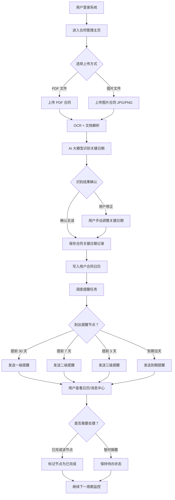
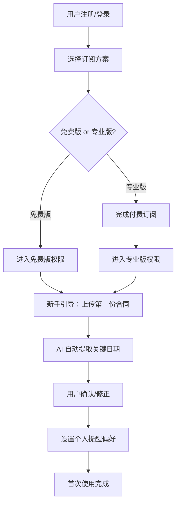
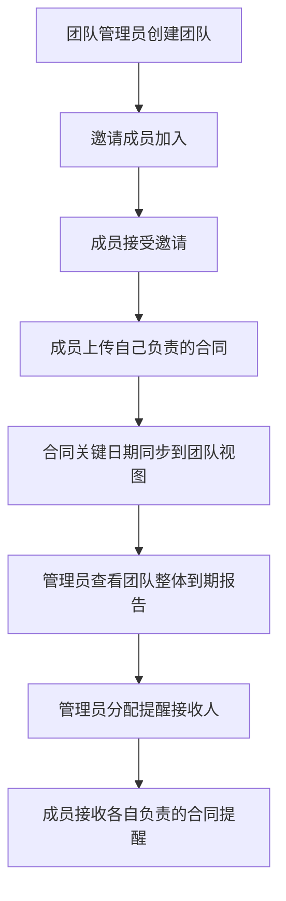
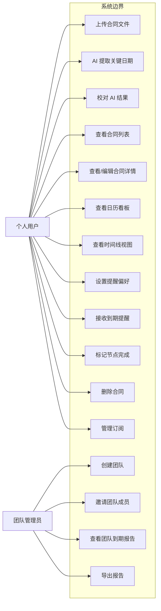
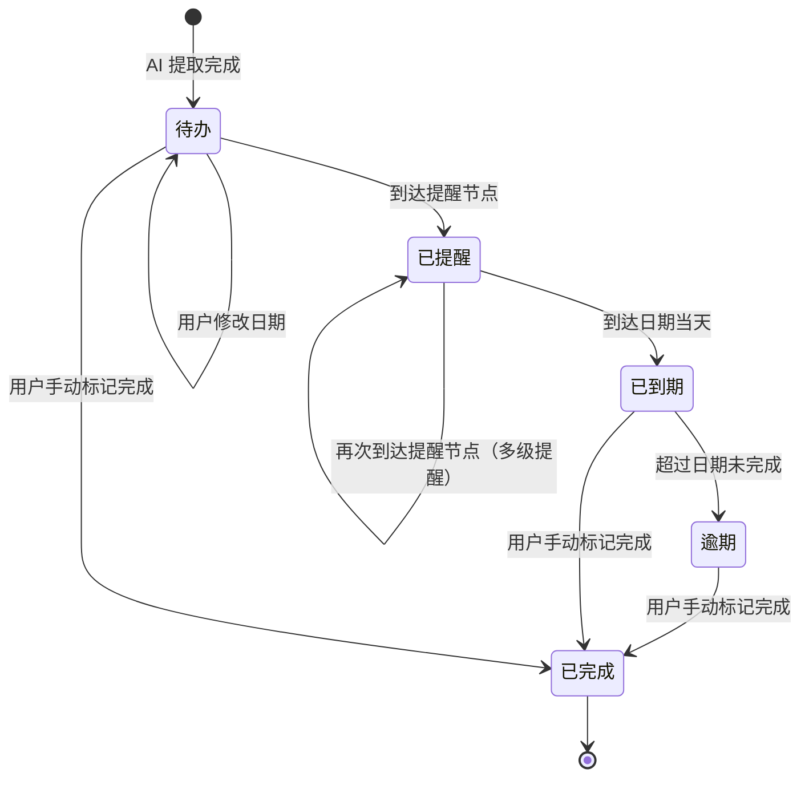

# 自由职业者合同关键日期提醒器 — 用户需求说明书（URS）

> 文档版本：v1.0
> 编写日期：2026-06-28
> 适用产品：自由职业者合同关键日期提醒器（效率工具 MVP）

---

# 1. 需求概述

## 1.1 需求介绍

**自由职业者合同关键日期提醒器**是一款面向自由职业者、小型外包服务商及独立经纪人用户的轻量级合同关键日期管理工具。产品聚焦于"合同关键日期提取 + 多级到期提醒"这一高频痛点场景，通过上传合同 PDF / 图片，由 AI 自动识别并提取关键日期（如付款节点、交付截止、续约窗口、保密期限等），按时间线展示所有合同的关键节点，并支持提前 3 / 7 / 30 天多级提醒，生成"本月待办合同日历"，帮助用户避免错过收款、交付或续约窗口。

产品定位为企业级合同生命周期管理（CLM）系统的"轻量替代"，不追求完整合同管理功能，只专注于让个人或小团队用户以最低成本管好"合同里的关键日期"。

### 1.1.1 所属领域

- **效率工具** / 生产力工具
- **自由职业者经济（Gig Economy）服务**
- **个人 / 小微合同管理**
- **轻量级 SaaS（订阅制）**

## 1.2 需求目标

1. **解决痛点**：自由职业者因遗忘合同节点导致漏收款、违约或错过续约窗口。
2. **核心价值**：通过 AI 自动提取 + 多级到期提醒，将用户从"手工抄写 / Excel 记录"中解放出来。
3. **MVP 范围**：7–10 天可交付（PDF/图片上传 + OCR + LLM 日期提取 + 日历看板 + 消息提醒）。
4. **商业化目标**：
   - 免费版：管理 5 份合同，基础提醒（仅 1 次提前提醒）。
   - 专业版（¥19/月）：不限合同数、多级提醒（3/7/30 天）、团队协作、到期统计报告。
5. **差异化定位**：避开企业级 CLM 系统，面向个人 / 小团队的轻量工具。

## 1.3 系统使用角色

| 角色 | 说明 | 典型画像 |
| --- | --- | --- |
| 自由职业者（个人版用户） | 独立承接项目，单人管理 1–20 份服务合同 | 独立设计师、程序员、写手、翻译、摄影师 |
| 独立经纪人 / 小团队负责人 | 代理或管理多位创作者的合同 | 独立经纪人、工作室负责人（3–5 人） |
| 小型外包服务商 | 同时承接多个客户的外包订单 | 小型设计 / 开发 / 营销外包团队 |
| 管理员（专业版团队内） | 团队账户中的管理角色，可管理成员、查看整体到期报告 | 团队 Leader |

## 1.4 业务流程图

### 1.4.1 核心业务流程（合同上传 → AI 提取 → 提醒触发）

### 1.4.2 用户首次使用流程

### 1.4.3 团队协作流程（专业版）

# 2. 功能原型

| 原型名称 | 原型链接 | 对应端 | 备注 |
| --- | --- | --- | --- |
| 合同管理主页（日历看板 + 合同列表） | 待 PRD 阶段输出 | WEB 端 | MVP 核心页面 |
| 合同上传与 AI 提取结果确认页 | 待 PRD 阶段输出 | WEB 端 | 含 PDF/图片上传 + AI 结果校对 |
| 合同详情与关键日期编辑页 | 待 PRD 阶段输出 | WEB 端 | 查看/修改合同关键日期 |
| 提醒设置页（多级提醒偏好） | 待 PRD 阶段输出 | WEB 端 | 用户自定义提醒节点 |
| 消息中心（提醒通知列表） | 待 PRD 阶段输出 | WEB 端 | 所有到期提醒汇总 |
| 订阅与付费页 | 待 PRD 阶段输出 | WEB 端 | 免费版/专业版切换 |
| 团队管理页（专业版） | 待 PRD 阶段输出 | WEB 端 | 邀请成员、查看报告 |
| 到期统计报告页（专业版） | 待 PRD 阶段输出 | WEB 端 | 历史/未来到期数据可视化 |

# 3. 需求清单

## 3.1 合同管理 WEB 端

### 3.1.1 账户与订阅模块

| 模块 | 一级功能 | 二级功能 | 功能描述 | 备注 |
| --- | --- | --- | --- | --- |
| 账户与订阅 | 用户注册 | 邮箱注册 | 用户通过邮箱 + 密码注册账号，发送验证邮件 |  |
| 账户与订阅 | 用户注册 | 第三方登录 | 支持微信 / Google OAuth 快捷登录 | 可选 MVP |
| 账户与订阅 | 用户登录 | 邮箱登录 | 通过邮箱 + 密码登录 |  |
| 账户与订阅 | 用户登录 | 第三方登录 | 通过微信 / Google 账号登录 |  |
| 账户与订阅 | 订阅管理 | 查看当前方案 | 显示当前为免费版/专业版，以及剩余合同额度 |  |
| 账户与订阅 | 订阅管理 | 升级专业版 | 跳转到支付页面，¥19/月订阅专业版 |  |
| 账户与订阅 | 订阅管理 | 降级/取消订阅 | 降级到免费版，保留已上传合同中前 5 份 |  |

### 3.1.2 合同上传与 AI 提取模块

| 模块 | 一级功能 | 二级功能 | 功能描述 | 备注 |
| --- | --- | --- | --- | --- |
| 合同上传与 AI 提取 | 合同上传 | 选择上传文件 | 支持选择 PDF / JPG / PNG 格式的合同文件 | 单文件 ≤ 20MB |
| 合同上传与 AI 提取 | 合同上传 | 批量上传 | 一次选择多份合同文件批量上传 | 专业版支持 |
| 合同上传与 AI 提取 | 合同上传 | 上传进度展示 | 显示每份文件的上传进度条 |  |
| 合同上传与 AI 提取 | AI 关键日期识别 | OCR 文档解析 | 对 PDF / 图片进行 OCR 文字提取 |  |
| 合同上传与 AI 提取 | AI 关键日期识别 | LLM 关键日期抽取 | 使用大模型从解析文本中识别关键日期（付款节点、交付截止、续约窗口、保密期限等） |  |
| 合同上传与 AI 提取 | AI 关键日期识别 | 识别结果展示 | 展示 AI 提取出的关键日期列表，每个日期附带类型标签和原文引用 |  |
| 合同上传与 AI 提取 | AI 关键日期识别 | 用户校对与修正 | 用户可修改 AI 识别错误的日期、删除误识别项、补全遗漏项 |  |
| 合同上传与 AI 提取 | AI 关键日期识别 | 确认并保存 | 用户确认后保存为合同关键日期记录 |  |

### 3.1.3 合同管理模块

| 模块 | 一级功能 | 二级功能 | 功能描述 | 备注 |
| --- | --- | --- | --- | --- |
| 合同管理 | 合同列表 | 查看全部合同 | 以列表形式展示用户所有上传的合同（名称、上传时间、关键日期数量、状态） |  |
| 合同管理 | 合同列表 | 搜索与筛选 | 按合同名称、合作方、关键日期类型、到期状态筛选 |  |
| 合同管理 | 合同列表 | 合同排序 | 按上传时间、最近到期时间、合作方排序 |  |
| 合同管理 | 合同详情 | 查看合同基本信息 | 显示合同名称、合作方、上传时间、原始文件 |  |
| 合同管理 | 合同详情 | 查看关键日期列表 | 显示该合同所有关键日期（类型、日期、提醒状态、是否已完成） |  |
| 合同管理 | 合同详情 | 编辑关键日期 | 用户可手动新增 / 修改 / 删除关键日期 |  |
| 合同管理 | 合同详情 | 标记节点完成 | 将某关键日期节点标记为"已完成" |  |
| 合同管理 | 合同删除 | 删除单份合同 | 删除一份合同及其所有关键日期记录 |  |
| 合同管理 | 合同删除 | 批量删除 | 多选批量删除合同 |  |

### 3.1.4 日历看板模块

| 模块 | 一级功能 | 二级功能 | 功能描述 | 备注 |
| --- | --- | --- | --- | --- |
| 日历看板 | 本月待办合同日历 | 月视图展示 | 以月历形式展示本月所有关键日期节点 | 核心功能 |
| 日历看板 | 本月待办合同日历 | 周视图切换 | 切换到周视图查看本周关键日期 |  |
| 日历看板 | 本月待办合同日历 | 日期节点点击 | 点击某日期查看当日所有关键日期详情 |  |
| 日历看板 | 时间线视图 | 按时间排序 | 以时间线形式按日期展示未来所有关键日期 |  |
| 日历看板 | 时间线视图 | 节点状态标识 | 用颜色标识节点状态（待办 / 即将到期 / 已到期 / 已完成） |  |
| 日历看板 | 快速操作 | 快速标记完成 | 在日历/时间线上直接标记节点完成 |  |

### 3.1.5 提醒通知模块

| 模块 | 一级功能 | 二级功能 | 功能描述 | 备注 |
| --- | --- | --- | --- | --- |
| 提醒通知 | 提醒偏好设置 | 提前提醒天数 | 用户可设置每个合同的关键日期提前提醒天数（3 / 7 / 30 天可选） | 专业版支持多级提醒 |
| 提醒通知 | 提醒偏好设置 | 提醒方式选择 | 选择提醒方式：站内信 / 邮件 / 微信服务号（可选） |  |
| 提醒通知 | 提醒偏好设置 | 免打扰时段 | 设置每日免打扰时段（如 22:00–08:00 不推送） |  |
| 提醒通知 | 提醒发送 | 自动触发提醒 | 到达设定的提醒节点时自动发送提醒 |  |
| 提醒通知 | 提醒发送 | 到期当天提醒 | 关键日期到期当天发送提醒 |  |
| 提醒通知 | 提醒发送 | 逾期提醒 | 关键日期过期未完成时，每日发送一次逾期提醒 |  |
| 提醒通知 | 消息中心 | 提醒列表 | 展示所有提醒通知（已读/未读、类型、时间） |  |
| 提醒通知 | 消息中心 | 提醒跳转 | 点击提醒跳转到对应合同的关键日期详情 |  |

### 3.1.6 团队协作模块（专业版）

| 模块 | 一级功能 | 二级功能 | 功能描述 | 备注 |
| --- | --- | --- | --- | --- |
| 团队协作 | 团队创建 | 创建团队 | 团队管理员创建团队，设置团队名称 | 专业版 |
| 团队协作 | 成员管理 | 邀请成员 | 通过邮箱或邀请链接邀请成员加入 |  |
| 团队协作 | 成员管理 | 移除成员 | 管理员移除团队成员 |  |
| 团队协作 | 成员管理 | 设置角色 | 设置成员为管理员 / 普通成员 |  |
| 团队协作 | 合同共享 | 共享合同给团队 | 成员可将某合同的关键日期共享到团队视图 |  |
| 团队协作 | 合同共享 | 团队日历视图 | 查看团队所有成员共享的合同关键日期日历 |  |
| 团队协作 | 到期统计报告 | 团队到期报告 | 按成员 / 合同类型 / 时间维度展示团队整体到期统计 | 专业版 |
| 团队协作 | 到期统计报告 | 导出报告 | 将统计报告导出为 PDF / Excel |  |

## 3.2 后台服务（支撑系统）

### 3.2.1 后台服务

| 模块 | 一级功能 | 二级功能 | 功能描述 | 备注 |
| --- | --- | --- | --- | --- |
| 后台服务 | 文档解析服务 | OCR 服务 | 对上传的 PDF / 图片进行文字识别 | 可对接第三方 OCR |
| 后台服务 | 文档解析服务 | PDF 解析服务 | 对 PDF 进行结构化解析（提取文本、表格等） |  |
| 后台服务 | AI 提取服务 | LLM 关键日期抽取 | 调用大模型从解析文本中抽取关键日期 |  |
| 后台服务 | AI 提取服务 | 日期规范化 | 将 LLM 抽取的自然语言日期规范化为统一日期格式 |  |
| 后台服务 | 提醒调度服务 | 定时任务调度 | 每日扫描所有合同关键日期，触发到期提醒任务 |  |
| 后台服务 | 提醒调度服务 | 消息推送 | 通过站内信 / 邮件 / 微信推送提醒消息 |  |
| 后台服务 | 订阅与计费服务 | 订阅状态管理 | 管理用户的订阅方案（免费/专业版） |  |
| 后台服务 | 订阅与计费服务 | 付费处理 | 对接支付渠道（微信支付 / 支付宝 / 信用卡） |  |
| 后台服务 | 文件存储服务 | 合同文件存储 | 存储用户上传的原始合同文件 | 对象存储 |

# 4. 非功能需求

## 4.1 使用界面需求

| 需求项 | 描述 |
| --- | --- |
| 响应式布局 | WEB 端需兼容 PC 浏览器（Chrome/Edge/Firefox/Safari 最新两个大版本），最小支持 1280px 宽度 |
| 简洁友好 | 界面以"日历看板 + 合同列表"为核心入口，突出关键日期信息，避免复杂菜单 |
| 中文优先 | 默认界面语言为中文，后续可扩展英文 |
| 无障碍 | 关键操作支持键盘可达、色彩对比度符合 WCAG 2.1 AA 标准 |

## 4.2 软硬件环境需求

| 环境 | 描述 |
| --- | --- |
| 用户端 | 现代浏览器（Chrome / Edge / Firefox / Safari 最新两个大版本） |
| 服务端 | 云端部署（建议阿里云 / 腾讯云），支持弹性伸缩 |
| 移动端 | MVP 阶段不开发原生 APP，但 WEB 端需在移动端浏览器中可用（响应式） |

## 4.3 性能需求

| 需求项 | 指标 |
| --- | --- |
| 合同上传 | 单份 20MB 以内文件上传耗时 ≤ 10 秒（常规网络） |
| AI 关键日期识别 | 单份合同 AI 提取 + 展示结果 ≤ 30 秒 |
| 日历加载 | 月视图 / 时间线视图首屏加载 ≤ 2 秒 |
| 提醒发送 | 到达提醒节点后 ≤ 5 分钟内推送消息 |
| 并发 | 支持至少 5000 注册用户同时在线 |

## 4.4 约束性需求

1. **MVP 范围约束**：不实现完整合同生命周期管理（CLM），仅聚焦"关键日期提取 + 到期提醒"。
2. **免费版合同数上限**：免费版用户最多管理 5 份合同；超出需升级专业版。
3. **专业版价格约束**：专业版定价 ¥19/月（MVP 阶段不引入年付折扣）。
4. **不做的事**：
   - 不提供电子签章功能
   - 不提供合同模板库（MVP 阶段）
   - 不提供合同版本对比功能
   - 不对接任何具体行业法规库
5. **AI 提取必须允许人工修正**：AI 识别结果必须由用户确认后保存，禁止直接入库。
6. **需要后台服务**：是。需要文档解析、AI 提取、提醒调度、订阅计费等后台服务支撑。

# 5. 接口需求

## 5.1 硬件接口需求

本产品为纯 WEB SaaS，不涉及硬件接口。

## 5.2 软件接口需求

| 模块 | 接口名称 | 输入 | 输出 | 功能描述 |
| --- | --- | --- | --- | --- |
| AI 提取 | OCR 接口（第三方） | 上传的 PDF / 图片文件 | 解析后的纯文本 / 结构化文本 | 对接百度 OCR / 阿里云 OCR / 腾讯 OCR 等第三方 OCR 服务，完成文档文字提取 |
| AI 提取 | LLM 大模型接口 | 解析后的文本 | 关键日期 JSON（类型 + 日期 + 原文引用） | 对接 OpenAI / Claude / 通义千问等大模型，完成关键日期抽取 |
| 提醒通知 | 邮件发送接口 | 提醒内容 + 收件人邮箱 | 发送结果状态 | 对接 SMTP 或第三方邮件服务（SendGrid / 阿里云邮件推送）发送提醒邮件 |
| 提醒通知 | 微信模板消息接口 | 提醒内容 + 用户 openid | 发送结果状态 | 对接微信服务号模板消息接口推送提醒 |
| 订阅计费 | 支付接口 | 订单信息 + 金额 | 支付结果回调 | 对接微信支付 / 支付宝 / Stripe（海外）完成专业版订阅支付 |
| 文件存储 | 对象存储接口 | 合同文件二进制流 | 文件访问 URL | 对接阿里云 OSS / 腾讯云 COS / AWS S3 存储上传的合同文件 |
| 账户 | OAuth 第三方登录接口 | 第三方授权 code | 用户身份 token | 对接微信 / Google OAuth 完成第三方登录 |

## 5.4 通讯接口需求

- **WEB 端 ↔ 服务端**：HTTPS（RESTful API + JSON），关键实时状态（上传进度、AI 提取进度）通过 WebSocket 推送
- **服务端 ↔ 第三方 OCR/LLM**：HTTPS（RESTful API）
- **服务端 ↔ 邮件/微信推送**：HTTPS（RESTful API）

# 6. 附录

## 6.1 用例图

## 6.2 状态图（合同关键日期节点状态）

