# 自由职业者多平台收款对账助手 - 产品需求文档（PRD）

> 文档版本：V1.0
> 创建日期：2026-06-28
> 文档状态：初稿
> 编写人：产品文档结对写作专家
> 审核人：阶段一产品落地页文档总编辑

---

**变更记录**

| 版本号 | 变更日期 | 变更内容 | 变更人 | 审核人 |
| --- | --- | --- | --- | --- |
| V1.0 | 2026-06-28 | 初始版本创建 | 产品文档结对写作专家 | 阶段一产品落地页文档总编辑 |

---

# 1 概述

## 1.1 需求背景

自由职业者群体（独立设计师、自由撰稿人、独立开发者、咨询师等）在多个平台同时收款已成为常态。微信、支付宝、Stripe、PayPal、银行转账……每个平台的账单格式不同、结算周期不同、手续费规则不同。每到月末，自由职业者需要逐平台导出 CSV 账单，再用 Excel 手动核对"应收了多少、实收了多少、差在哪里"——这个过程通常耗时 2-3 小时，且容易出错。

**核心痛点：**
- 跨平台账单格式碎片化，无法统一管理
- "应收-实收"差异识别全靠肉眼，效率低且易遗漏
- 多币种（CNY/USD/EUR）换算和跨境手续费让核对更加复杂
- 报税时需要从多个平台逐一整理数据，耗时耗力

**业务价值：**
- 将月度对账时间从 2-3 小时压缩至 15 分钟
- 自动识别差异类型（未到账/超额/手续费/汇率差），减少遗漏
- 一键生成报税所需的收入汇总表和开票清单

**预期目标：**
- MVP 阶段 7 天内完成核心功能上线
- 首月目标用户 500 人，付费转化率 ≥ 5%

## 1.2 名词解释

| 名词 | 说明 |
| --- | --- |
| 应收款 | 用户基于合同、订单或发票，应向客户收取的金额 |
| 实收款 | 用户在各收款平台实际到账的金额（已扣除手续费、佣金等） |
| 对账 | 将应收款与实收款逐笔匹配，识别差异的过程 |
| 差异 | 应收金额与实际到账金额之间的差额 |
| CSV | 逗号分隔值文件，各平台账单导出的通用格式 |
| 匹配引擎 | 根据金额、时间、备注等字段自动关联应收与实收记录的算法模块 |
| 匹配置信度 | 匹配结果的可信程度，分为高/中/低三档 |
| 对账看板 | 汇总展示对账结果的核心页面 |
| 预置模板 | 系统内置的微信/支付宝/Stripe/PayPal 四大渠道的标准 CSV 解析规则 |
| 自定义模板 | 用户为其他渠道创建的个性化 CSV 解析规则 |

## 1.3 产品介绍

对账助手是一款面向自由职业者的轻量级多平台收款对账 Web 工具。聚焦"应收-实收"差异比对这一细分场景，不做通用记账，帮助用户高效完成月度对账、差异追踪与报税准备。

### 1.3.1 范围说明

| 项 | 内容 |
| --- | --- |
| 包含功能 | 多渠道 CSV 导入（预置模板+自定义模板）、应收账单管理、自动匹配引擎、差异标记与分析、月度对账报告生成与导出、报税导出（专业版）、用户账户与订阅管理 |
| 不包含功能 | 通用记账功能、发票开具功能、银行 API 直连、团队协作功能、移动端原生 App（MVP 阶段仅 Web 端） |

**产品核心价值：**
- **轻量**：CSV 导入即用，无需逐笔手动录入流水
- **精准**：智能匹配应收与实收，差异一目了然
- **专业**：多币种、多平台、多项目维度全覆盖

---

# 2 产品设计

## 2.1 系统架构图

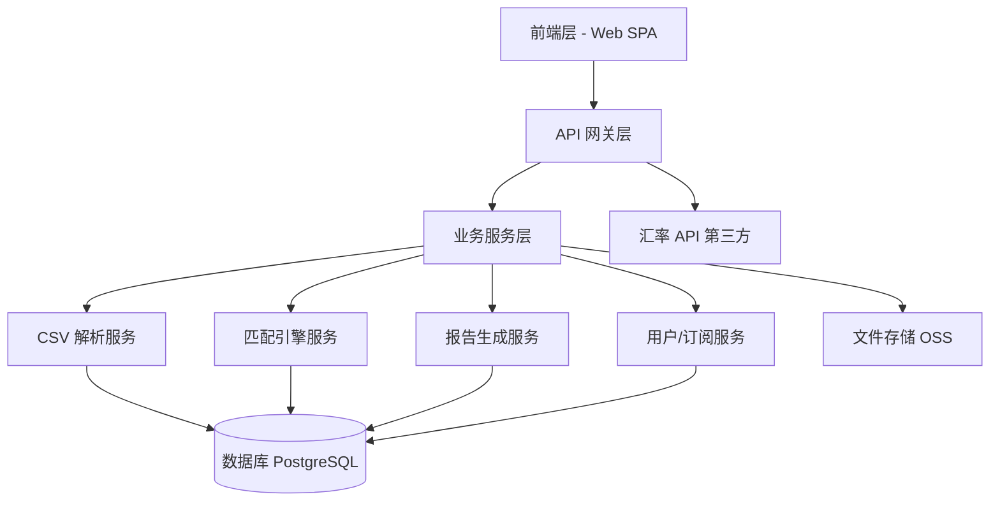

**架构说明：**
- **前端层**：Web SPA 单页应用，采用 Vue 3 + Element Plus 组件库，响应式布局
- **API 网关层**：统一鉴权、限流、日志
- **业务服务层**：四大核心服务——CSV 解析、匹配引擎、报告生成、用户订阅
- **数据存储**：PostgreSQL 关系型数据库 + OSS 文件存储
- **外部依赖**：第三方汇率 API（央行公开汇率接口）

## 2.2 业务模块图

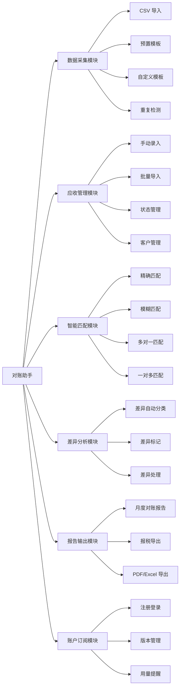

## 2.3 主业务流程

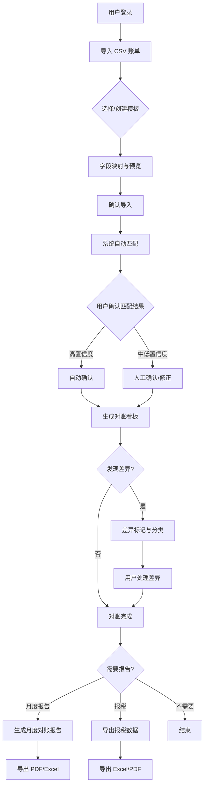

**业务规则说明：**
1. 每次导入新 CSV 数据后自动触发匹配引擎
2. 高置信度匹配（金额完全一致 + 时间在 ±3 天内）可配置为自动确认
3. 差异条目标记后进入"待处理"状态，用户可标记为"已解决""待跟进"或"忽略"
4. 报税导出功能仅专业版用户可用

## 2.4 功能图/列表

| 功能模块 | 功能名称 | 优先级 | 功能描述 | 版本限制 |
| --- | --- | --- | --- | --- |
| 多渠道 CSV 导入 | 预置模板导入 | P0 | 微信/支付宝/Stripe/PayPal 四大渠道标准模板一键解析 | 全版本 |
| 多渠道 CSV 导入 | 自定义模板 | P1 | 用户为其他渠道创建自定义 CSV 解析规则 | 全版本 |
| 多渠道 CSV 导入 | 字段映射预览 | P0 | 导入前展示字段映射预览，用户可调整 | 全版本 |
| 多渠道 CSV 导入 | 数据预览确认 | P0 | 导入前展示前 10 条解析预览 | 全版本 |
| 多渠道 CSV 导入 | 重复检测 | P0 | 基于交易 ID+金额+时间自动去重 | 全版本 |
| 多渠道 CSV 导入 | 批量导入 | P1 | 一次导入多个 CSV 文件 | 全版本 |
| 应收账单管理 | 手动录入 | P0 | 逐笔录入应收款信息 | 全版本 |
| 应收账单管理 | 批量导入 | P1 | 通过 CSV/Excel 批量导入应收款 | 全版本 |
| 应收账单管理 | 状态管理 | P0 | 待收款→部分到账→已到账→已逾期→已核销 | 全版本 |
| 应收账单管理 | 客户管理 | P1 | 维护客户信息与历史交易记录 | 全版本 |
| 应收账单管理 | 逾期提醒 | P1 | 超期未到账自动标记并提醒 | 全版本 |
| 自动匹配引擎 | 精确匹配 | P0 | 金额+时间（±3天）精确匹配 | 全版本 |
| 自动匹配引擎 | 模糊匹配 | P1 | 备注/客户名模糊匹配 | 仅专业版 |
| 自动匹配引擎 | 多对一/一对多匹配 | P1 | 多笔实收合并匹配/单笔实收拆分匹配 | 全版本 |
| 自动匹配引擎 | 匹配置信度 | P0 | 标注高/中/低置信度 | 全版本 |
| 自动匹配引擎 | 人工修正 | P0 | 用户可手动修正匹配结果 | 全版本 |
| 差异标记与分析 | 差异自动分类 | P0 | 6 类差异自动识别与颜色标记 | 全版本 |
| 差异标记与分析 | 差异详情查看 | P0 | 查看差异关联的应收/实收原始记录 | 全版本 |
| 差异标记与分析 | 差异处理 | P0 | 标记已解决/待跟进/忽略 | 全版本 |
| 差异标记与分析 | 差异统计 | P1 | 按类型/客户/项目/平台维度统计 | 全版本 |
| 月度对账报告 | 报告自动生成 | P0 | 每月 1 号自动生成上月报告 | 全版本 |
| 月度对账报告 | 多维度汇总 | P1 | 按客户/项目/平台/差异类型汇总 | 全版本 |
| 月度对账报告 | PDF/Excel 导出 | P0 | 报告导出为 PDF 或 Excel 格式 | 全版本 |
| 月度对账报告 | 自定义报告模板 | P2 | 添加 Logo、调整报告结构 | 仅专业版 |
| 报税导出 | 收入汇总表 | P1 | 按年度/季度汇总收入 | 仅专业版 |
| 报税导出 | 开票清单 | P1 | 已开票/未开票记录汇总 | 仅专业版 |
| 报税导出 | 多币种折算 | P1 | 多币种按年度平均汇率折算为人民币 | 仅专业版 |
| 用户账户与订阅 | 注册登录 | P0 | 手机号+验证码/微信快捷登录 | 全版本 |
| 用户账户与订阅 | 版本升级 | P0 | 免费版升级专业版 | 全版本 |
| 用户账户与订阅 | 用量提醒 | P1 | 免费版接近限额时提醒 | 全版本 |

## 2.5 你的产品有哪些端

| 序号 | 端名称 | 端类型 | 目标用户 | 说明 |
| --- | --- | --- | --- | --- |
| 1 | 对账助手 Web 端 | WEB端 | 自由职业者（设计师、撰稿人、开发者、咨询师等） | 用户在浏览器中使用核心对账功能，MVP 阶段唯一端 |

**说明**：MVP 阶段仅推出 Web 端，满足核心使用场景。微信小程序版本（Q-4 开放问题建议）纳入 V1.1 迭代规划，视用户反馈决定是否开发。

---

# 3 产品功能

## 3.1 对账助手 Web 端功能

### 3.1.1 多渠道 CSV 导入

**功能描述**
用户从微信收款、支付宝、Stripe、PayPal、银行等渠道导出 CSV 账单文件后，通过本功能导入系统。系统自动识别文件格式、解析数据，并完成字段映射。

| 项 | 内容 |
| --- | --- |
| 优先级 | P0 |
| 依赖需求 | 无 |
| 前置条件 | 用户已登录，且免费版用户当月流水额度未用完 |

#### 3.1.1.1 详细流程

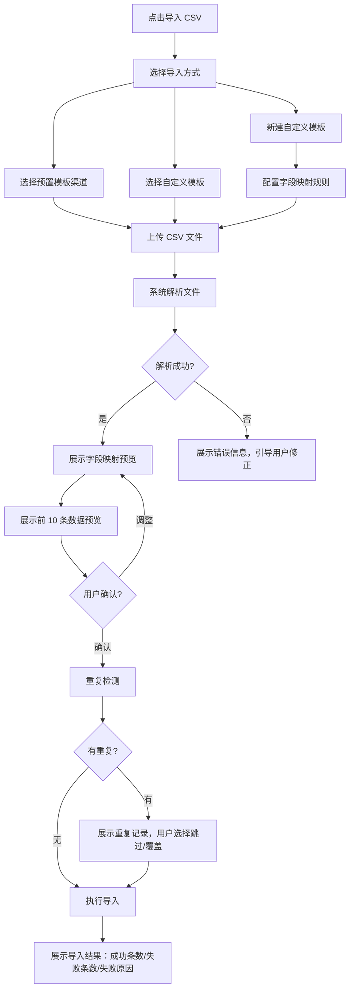

**业务规则说明：**
1. 预置模板支持：微信支付、支付宝、Stripe、PayPal 四大渠道
2. 自定义模板需用户指定"交易时间""交易金额""交易对象""交易备注"至少两个必填字段的映射
3. 重复检测规则：交易 ID + 金额 + 交易时间三项完全一致视为重复
4. 免费版用户每月最多导入 50 笔流水，达到上限后提示升级
5. 导入后自动触发匹配引擎

#### 3.1.1.2 主要原型

[CSV 导入流程原型](原型-CSV导入流程.html)

#### 3.1.1.3 验收标准

- [ ] 正常流程：微信/支付宝/Stripe/PayPal 四大渠道 CSV 导入成功率 ≥ 98%
- [ ] 正常流程：字段映射预览展示前 10 条数据，响应时间 ≤ 2 秒
- [ ] 正常流程：重复记录检测准确率 100%
- [ ] 异常流程：文件格式错误时给出明确的错误提示
- [ ] 版本限制：免费版用户达到 50 笔上限时正确提示并阻止导入

### 3.1.2 应收账单管理

**功能描述**
用户在系统中登记应收款项（基于合同、订单、发票等），作为对账的基准数据。支持手动录入和批量导入，按客户/项目/状态分类管理。

| 项 | 内容 |
| --- | --- |
| 优先级 | P0 |
| 依赖需求 | 无 |
| 前置条件 | 用户已登录 |

#### 3.1.2.1 详细流程

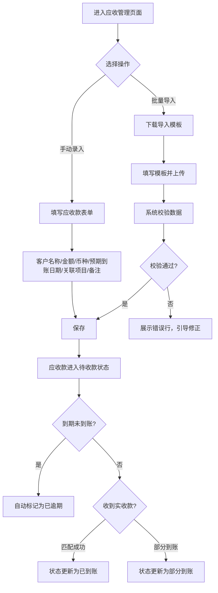

**业务规则说明：**
1. 应收款状态流转：待收款 → 部分到账 → 已到账 → 已逾期 → 已核销
2. 逾期判定：超过预期到账日期当天 23:59 仍未匹配到实收记录，自动标记为"已逾期"
3. 支持币种：CNY（默认）、USD、EUR
4. 客户名称为必填项，用于后续匹配引擎的模糊匹配

#### 3.1.2.2 主要原型

[应收账单管理原型](原型-应收管理.html)

#### 3.1.2.3 验收标准

- [ ] 正常流程：支持至少 3 种币种（CNY、USD、EUR）
- [ ] 正常流程：批量导入支持单次 1000 条以上
- [ ] 正常流程：逾期提醒在到期日当天自动触发
- [ ] 异常流程：批量导入格式错误时展示具体错误行号

### 3.1.3 自动匹配引擎

**功能描述**
系统自动将导入的实收记录与登记的应收款进行匹配，减少用户手工核对工作量。支持精确匹配、模糊匹配、多对一/一对多匹配，并为每条匹配结果标注置信度。

| 项 | 内容 |
| --- | --- |
| 优先级 | P0 |
| 依赖需求 | F-1（CSV 导入）、F-2（应收管理） |
| 前置条件 | 存在待匹配的应收款和实收记录 |

#### 3.1.3.1 详细流程

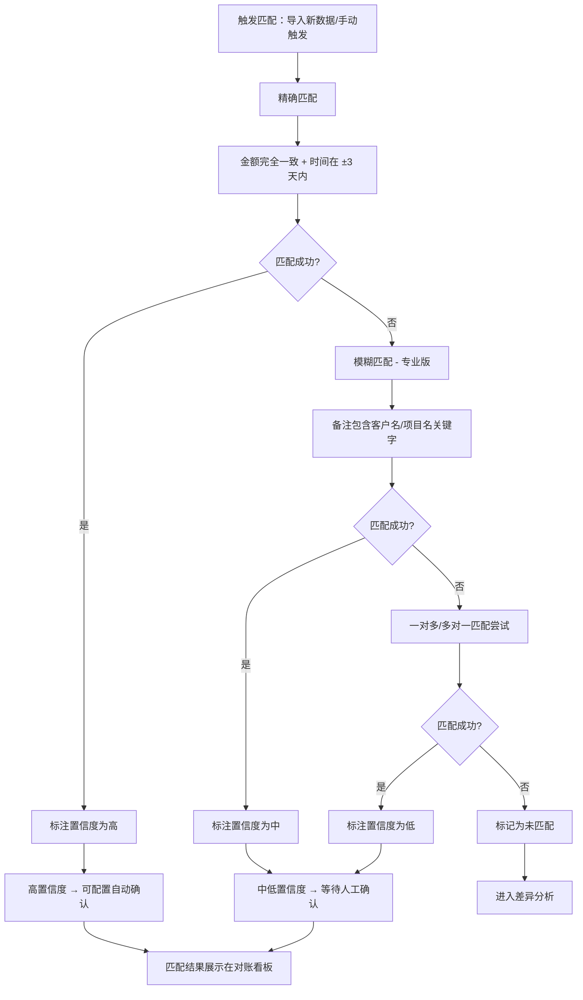

**业务规则说明：**
1. 匹配优先级：精确匹配 > 模糊匹配 > 多对一/一对多匹配
2. 精确匹配条件：金额完全一致 + 交易时间在预期到账日期前后 3 天内（可配置）
3. 模糊匹配仅专业版可用，基于备注/客户名称关键字匹配
4. 一笔实收记录默认只能匹配一笔应收记录（一对多场景除外）
5. 用户手动修正的匹配结果优先级最高，不再被自动匹配覆盖

#### 3.1.3.2 主要原型

[匹配引擎原型](原型-匹配引擎.html)

#### 3.1.3.3 验收标准

- [ ] 正常流程：精确匹配准确率 ≥ 95%
- [ ] 正常流程：模糊匹配准确率 ≥ 85%（专业版）
- [ ] 正常流程：1000 条数据匹配处理速度 ≤ 5 秒
- [ ] 异常流程：无法匹配的记录正确标记为"未匹配"
- [ ] 版本限制：免费版用户使用模糊匹配时正确提示升级

### 3.1.4 差异标记与分析

**功能描述**
系统自动识别并标记应收与实收之间的差异，按 6 种类型自动分类，以颜色区分，支持差异处理（已解决/待跟进/忽略）和追溯。

| 项 | 内容 |
| --- | --- |
| 优先级 | P0 |
| 依赖需求 | F-3（匹配引擎） |
| 前置条件 | 匹配引擎已运行，存在未匹配或差异记录 |

#### 3.1.4.1 详细流程

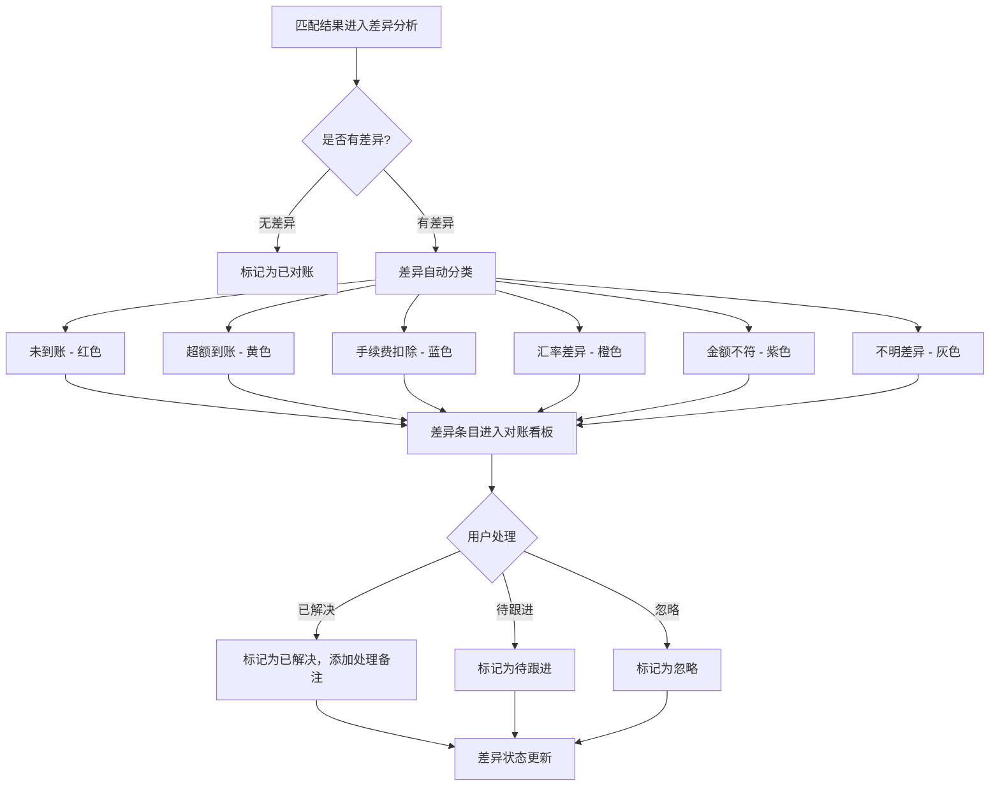

**业务规则说明：**
1. 6 种差异类型的自动判定规则：
   - 未到账：应收款超过预期到账日期且无对应实收
   - 超额到账：实收金额 > 应收金额
   - 手续费扣除：实收 < 应收，差异 ≤ 应收 × 平台标准手续费率
   - 汇率差异：多币种交易中，差异 ≤ 应收 × 1%
   - 金额不符：差异不属于上述任何类型
   - 不明差异：系统无法自动分类
2. 差异条目可追溯到原始应收记录和实收记录

#### 3.1.4.2 主要原型

[差异标记详情原型](原型-差异详情.html)

#### 3.1.4.3 验收标准

- [ ] 正常流程：差异自动分类准确率 ≥ 90%
- [ ] 正常流程：差异条目标记实时展示，无延迟
- [ ] 正常流程：支持按差异类型、客户、项目、平台筛选和排序
- [ ] 异常流程：无法自动分类的差异标记为"不明差异"

### 3.1.5 对账看板（Dashboard）

**功能描述**
对账看板是用户进入系统后的首页，汇总展示当月对账全貌：应收总额、实收总额、差异总额、各状态计数，以及匹配结果列表。

| 项 | 内容 |
| --- | --- |
| 优先级 | P0 |
| 依赖需求 | F-3（匹配引擎）、F-4（差异分析） |
| 前置条件 | 用户已导入 CSV 并存在应收记录 |

#### 3.1.5.1 详细流程

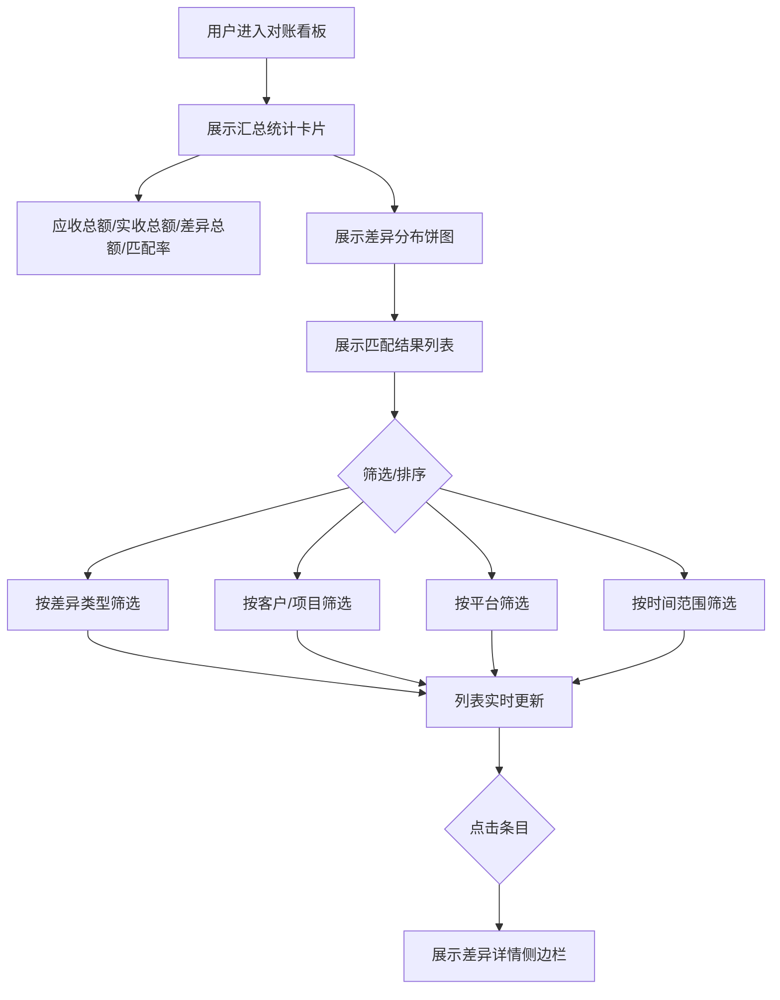

**业务规则说明：**
1. 看板默认展示当月数据，支持切换月份
2. 汇总卡片展示：应收总额、实收总额、差异总额、匹配率、未到账笔数
3. 列表默认按差异严重程度排序（未到账 > 金额不符 > 超额 > 手续费 > 汇率差）
4. 点击任意条目可展开详情侧边栏

#### 3.1.5.2 主要原型

[对账看板原型](原型-对账看板.html)

#### 3.1.5.3 验收标准

- [ ] 正常流程：看板数据实时更新（导入/匹配后自动刷新）
- [ ] 正常流程：筛选操作响应时间 ≤ 1 秒
- [ ] 异常流程：无数据时展示空状态引导（引导用户导入 CSV 或录入应收款）

### 3.1.6 月度对账报告

**功能描述**
系统按月生成对账报告，汇总本月应收、实收、差异情况。支持多维度查看和 PDF/Excel 格式导出。

| 项 | 内容 |
| --- | --- |
| 优先级 | P0 |
| 依赖需求 | F-4（差异分析） |
| 前置条件 | 当月存在对账数据 |

#### 3.1.6.1 详细流程

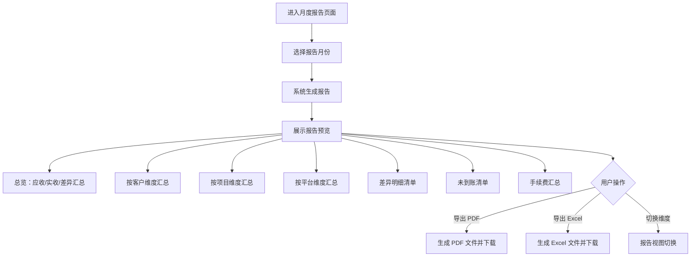

**业务规则说明：**
1. 每月 1 号自动生成上月对账报告（自动存档）
2. 用户也可手动生成任意月份报告
3. 免费版报告保留 3 个月，专业版永久保留
4. 专业版支持自定义报告模板（添加 Logo、调整结构）

#### 3.1.6.2 主要原型

[月度报告导出原型](原型-月度报告.html)

#### 3.1.6.3 验收标准

- [ ] 正常流程：报告生成时间 ≤ 10 秒（1000 条数据以内）
- [ ] 正常流程：PDF 导出排版正确，无乱码
- [ ] 正常流程：Excel 导出格式规范，可直接用 Excel 打开编辑
- [ ] 版本限制：免费版用户超过 3 个月的历史报告无法查看

### 3.1.7 报税导出

**功能描述**
为专业版用户提供报税所需的收入汇总数据和开票清单，支持多币种按年度平均汇率折算为人民币，导出格式符合税务申报要求。

| 项 | 内容 |
| --- | --- |
| 优先级 | P1 |
| 依赖需求 | F-1（CSV 导入）、F-2（应收管理）、F-5（月度报告） |
| 前置条件 | 用户为专业版订阅用户 |

#### 3.1.7.1 详细流程

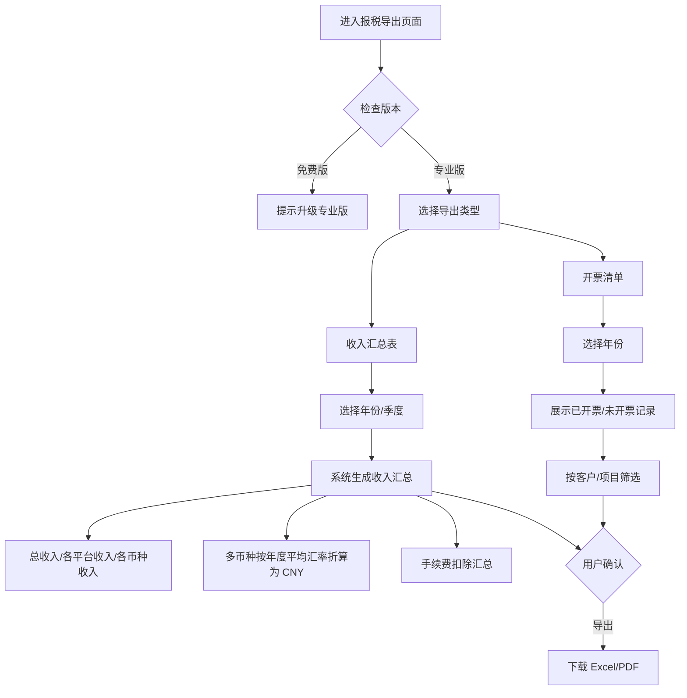

**业务规则说明：**
1. 报税导出仅专业版可用，免费版用户看到升级提示
2. 多币种折算使用年度平均汇率（来源：央行公开汇率数据）
3. 收入汇总表格式符合国家税务总局个人所得税申报格式
4. 开票清单包含：客户名称、金额、开票日期、发票号码、状态

#### 3.1.7.2 主要原型

[报税导出原型](原型-报税导出.html)

#### 3.1.7.3 验收标准

- [ ] 正常流程：导出的报税数据可直接用于个人所得税申报
- [ ] 正常流程：多币种折算准确率 ≥ 99%
- [ ] 版本限制：免费版用户无法使用报税导出功能
- [ ] 版本限制：免费版用户看到清晰的升级引导

### 3.1.8 用户账户与订阅

**功能描述**
用户注册登录、版本管理、订阅升级、用量提醒等账户相关功能。

| 项 | 内容 |
| --- | --- |
| 优先级 | P0 |
| 依赖需求 | 无 |
| 前置条件 | 无 |

#### 3.1.8.1 详细流程

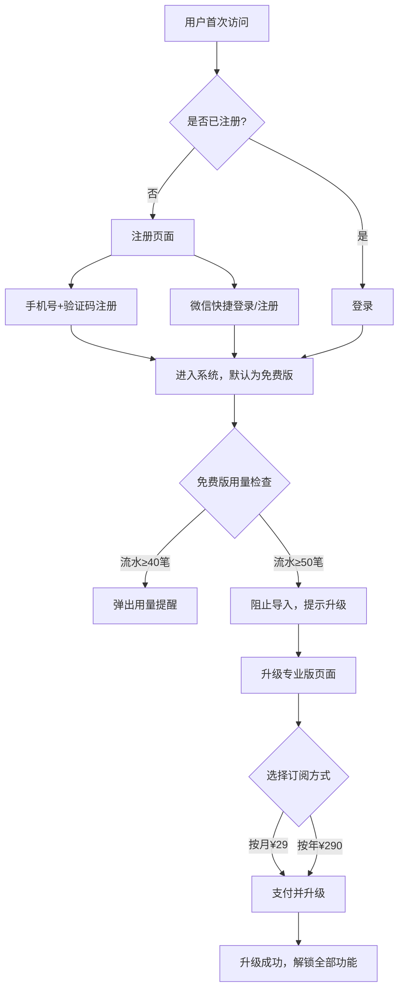

**业务规则说明：**
1. 免费版限制：每月 50 笔流水、2 个渠道、不支持多币种/报税导出、历史数据保留 3 个月
2. 专业版价格：¥29/月 或 ¥290/年（约 8.4 折）
3. 免费版升级专业版后，历史数据自动恢复可用，无需数据迁移
4. 用量提醒：流水达到 40 笔时弹出提醒，达到 50 笔时阻止导入并提示升级

#### 3.1.8.2 主要原型

[账户与订阅原型](原型-账户订阅.html)

#### 3.1.8.3 验收标准

- [ ] 正常流程：手机号+验证码注册登录正常工作
- [ ] 正常流程：微信快捷登录正常工作
- [ ] 正常流程：免费版达到 40 笔时弹出提醒
- [ ] 正常流程：免费版达到 50 笔时正确阻止导入
- [ ] 正常流程：升级专业版后即时解锁全部功能

---

# 4 产品原型

## 4.1 页面跳转逻辑图

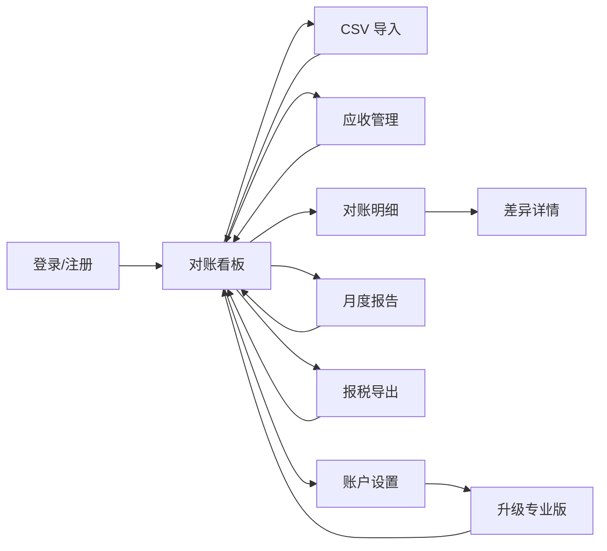

## 4.2 全站点原型设计

### 4.2.1 对账助手 Web 端

**页面清单：**

| 序号 | 页面名称 | 所属模块 | 页面描述 | 关键元素 |
| --- | --- | --- | --- | --- |
| 1 | 对账看板 | 核心 | 首页，汇总展示当月对账全貌 | 统计卡片、差异饼图、匹配列表、筛选器 |
| 2 | CSV 导入 | 数据采集 | 多渠道 CSV 文件导入流程 | 文件上传区、模板选择器、字段映射表、数据预览表、导入进度条 |
| 3 | 应收管理 | 应收管理 | 应收款项的增删改查与状态管理 | 应收列表、新增表单、状态标签、客户筛选、批量导入按钮 |
| 4 | 对账明细 | 匹配与差异 | 匹配结果与差异条目的详细列表 | 匹配列表、置信度标签、差异颜色标记、详情侧边栏、操作按钮 |
| 5 | 差异详情 | 匹配与差异 | 单条差异的详细追溯与处理 | 应收/实收对比、差异金额、差异类型、处理操作区 |
| 6 | 月度报告 | 报告输出 | 月度对账报告预览与导出 | 月份选择器、多维度 Tab、报告预览区、PDF/Excel 导出按钮 |
| 7 | 报税导出 | 报告输出 | 报税所需的收入汇总和开票清单 | 年份选择器、收入汇总表、开票清单 Tab、专业版标识、导出按钮 |
| 8 | 账户设置 | 账户 | 用户信息、订阅管理 | 用户信息卡、当前版本标识、升级按钮、用量进度条 |

**交互说明：**
- 页面跳转关系：如上方 Mermaid 流程图所示
- 特殊交互：
  1. CSV 导入支持拖拽上传文件
  2. 对账看板支持点击统计卡片快速筛选对应类型的差异条目
  3. 差异条目行内操作：已解决/待跟进/忽略，操作后行内状态即时更新
  4. 月度报告支持维度切换 Tab（按客户/按项目/按平台/按差异类型）
  5. 免费版功能受限时，对应按钮置灰并展示升级提示 Tooltip
  6. 空数据状态展示引导插画和操作入口

**产品原型：**

[🖥️ 打开对账助手 Web 端全站点原型](原型-全站点.html)

---

# 5 数据需求

## 5.1 数据使用规格

### 5.1.1 应收款记录

| 字段 | 是否必填 | 描述 | 数据类型 |
| --- | --- | --- | --- |
| id | 是 | 应收款唯一标识 | UUID |
| user_id | 是 | 所属用户 ID | UUID |
| customer_name | 是 | 客户名称 | 字符串 |
| amount | 是 | 应收金额 | 数值（精确到分） |
| currency | 是 | 币种，默认 CNY | 枚举（CNY/USD/EUR） |
| expected_date | 是 | 预期到账日期 | 日期 |
| project_name | 否 | 关联项目名称 | 字符串 |
| status | 是 | 状态 | 枚举（待收款/部分到账/已到账/已逾期/已核销） |
| remarks | 否 | 备注 | 字符串 |
| created_at | 是 | 创建时间 | 时间戳 |
| updated_at | 是 | 更新时间 | 时间戳 |

### 5.1.2 实收记录（CSV 导入）

| 字段 | 是否必填 | 描述 | 数据类型 |
| --- | --- | --- | --- |
| id | 是 | 实收记录唯一标识 | UUID |
| user_id | 是 | 所属用户 ID | UUID |
| channel | 是 | 收款渠道 | 枚举（微信/支付宝/Stripe/PayPal/自定义） |
| transaction_time | 是 | 交易时间 | 时间戳 |
| amount | 是 | 交易金额 | 数值 |
| currency | 否 | 币种，默认 CNY | 枚举 |
| counterparty | 否 | 交易对象 | 字符串 |
| remarks | 否 | 交易备注 | 字符串 |
| transaction_id | 否 | 平台交易流水号 | 字符串 |
| import_batch_id | 是 | 导入批次 ID | UUID |
| match_status | 是 | 匹配状态 | 枚举（未匹配/已匹配/已确认） |

### 5.1.3 匹配记录

| 字段 | 是否必填 | 描述 | 数据类型 |
| --- | --- | --- | --- |
| id | 是 | 匹配记录唯一标识 | UUID |
| receivable_id | 是 | 关联应收款 ID | UUID |
| actual_id | 是 | 关联实收记录 ID | UUID |
| confidence | 是 | 匹配置信度 | 枚举（高/中/低） |
| match_type | 是 | 匹配类型 | 枚举（精确/模糊/多对一/一对多） |
| is_confirmed | 是 | 是否已人工确认 | 布尔 |
| difference_amount | 否 | 差异金额 | 数值 |
| difference_type | 否 | 差异类型 | 枚举（无差异/未到账/超额/手续费/汇率差/金额不符/不明） |
| difference_status | 否 | 差异处理状态 | 枚举（待处理/已解决/待跟进/忽略） |

## 5.2 统计数据

1. 对账看板汇总统计：应收总额、实收总额、差异总额、匹配率、各差异类型计数
2. 按客户/项目/平台维度统计月度收入与差异
3. 按年度/季度统计各渠道收入占比

## 5.3 埋点需求

| 页面 | 事件 | 采集字段 | 说明 |
| --- | --- | --- | --- |
| CSV 导入 | csv_import | channel, file_count, record_count, success_count, fail_count | 追踪导入行为和成功率 |
| 对账看板 | dashboard_view | month, filter_type | 追踪用户查看看板的频率和偏好 |
| 差异详情 | diff_action | diff_type, action_type | 追踪差异处理行为 |
| 月度报告 | report_export | report_month, export_format | 追踪报告导出行为 |
| 报税导出 | tax_export | year, export_type, format | 追踪报税导出使用频率 |
| 升级页面 | upgrade_click | current_plan, target_plan | 追踪升级转化 |

---

# 6 非功能需求

## 6.1 性能需求

### 6.1.1 延迟

| 编号 | 项目 | 最大延迟 | 平均延迟 | 优先级 | 备注 |
| --- | --- | --- | --- | --- | --- |
| 0001 | CSV 导入预览（100条） | < 2 秒 | < 1 秒 | 高 | |
| 0002 | CSV 导入（1000条） | < 10 秒 | < 5 秒 | 高 | |
| 0003 | 匹配引擎（1000条） | < 5 秒 | < 3 秒 | 高 | |
| 0004 | 报告生成（1000条） | < 10 秒 | < 5 秒 | 中 | |
| 0005 | 页面响应（普通操作） | < 1 秒 | < 0.5 秒 | 高 | |
| 0006 | 页面响应（复杂查询） | < 3 秒 | < 1.5 秒 | 中 | |

### 6.1.2 吞吐量

| 编号 | 项 | 吞吐量 | 备注 |
| --- | --- | --- | --- |
| 0001 | MVP 阶段并发用户 | 100 并发 | |
| 0002 | CSV 导入请求 | 每分钟 50 次 | |

### 6.1.3 容量

| 编号 | 项 | 容量 | 备注 |
| --- | --- | --- | --- |
| 0001 | 系统用户数（MVP） | ≤ 10,000 | |
| 0002 | 单用户月均流水 | ≤ 5,000 笔 | 专业版上限 |

## 6.2 安全需求

| 编号 | 项 |
| --- | --- |
| 0001 | 全链路 HTTPS 加密传输 |
| 0002 | 敏感数据（银行账号、支付信息）AES-256 加密存储 |
| 0003 | 用户数据严格隔离，每个用户只能访问自己的数据 |
| 0004 | 登录支持短信验证码二次验证 |
| 0005 | 符合《个人信息保护法》要求，用户可申请删除全部数据 |
| 0006 | API 接口鉴权采用 JWT Token，有效期 2 小时，支持刷新 |

## 6.3 可靠性

| 编号 | 项 | 值 |
| --- | --- | --- |
| 0001 | 系统月度可用性 | ≥ 99.5% |
| 0002 | 平均正常运行时间（MTTF） | ≥ 180 天 |
| 0003 | 平均故障恢复时间（MTTR） | ≤ 4 小时 |

## 6.4 可连续性

| 编号 | 项 |
| --- | --- |
| 0001 | 系统 7×24 小时运行 |
| 0002 | 计划维护提前 24 小时通知用户 |

## 6.5 可恢复性

| 编号 | 项 |
| --- | --- |
| 0001 | 专业版用户数据每日自动备份 |
| 0002 | 备份保留 30 天 |
| 0003 | 重大故障 1-3 小时内恢复服务，24 小时内恢复数据 |

## 6.6 兼容性

| 编号 | 要求 | 备注 |
| --- | --- | --- |
| 0001 | Chrome ≥ 90 | 主要测试浏览器 |
| 0002 | Safari ≥ 14 | |
| 0003 | Edge ≥ 90 | |
| 0004 | Firefox ≥ 88 | |
| 0005 | 移动端响应式适配 iOS 14+ / Android 10+ | MVP 阶段响应式 Web |
| 0006 | 支持分辨率 1280×720 及以上 | |

## 6.7 易用性

| 编号 | 要求 | 备注 |
| --- | --- | --- |
| 0001 | 核心操作路径（导入→对账→导出）不超过 3 步 | |
| 0002 | 普通用户无需培训即可使用核心功能 | |
| 0003 | 错误提示包含具体原因和解决建议 | |
| 0004 | 首次使用提供引导教程（不超过 5 步） | |

---

# 7 总结

## 7.1 上线计划

| 阶段 | 时间 | 内容 | 负责人 |
| --- | --- | --- | --- |
| 开发阶段 | 第 1-5 天 | 核心功能开发：CSV 导入+匹配引擎+对账看板+PDF 导出 | 开发团队 |
| 测试阶段 | 第 6 天 | 功能测试、兼容性测试、数据准确性验证 | 测试团队 |
| 灰度阶段 | 第 7 天 | 灰度 50 名用户，验证核心流程和稳定性 | 产品团队 |
| 全量上线 | 第 7 天后 | 全量开放注册 | 运营团队 |

## 7.2 后续迭代规划

- **V1.1**：微信小程序版本（解决 Q-4）、银行 CSV 导入支持（解决 Q-1，优先支持四大行+招行）
- **V1.2**：AI 智能匹配优化（基于历史模式学习用户习惯）、团队协作功能
- **V1.3**：发票管理功能、多用户会计协作模式、开放 API 对接

## 7.3 开放问题决策建议

针对需求文档附录中的 4 个开放问题，产品层面的建议如下：

| 编号 | 问题 | 建议 | 理由 |
| --- | --- | --- | --- |
| Q-1 | 是否支持银行 CSV 导入 | V1.1 迭代支持，优先四大行+招行 | 银行 CSV 格式差异大，投入产出比低，MVP 后验证需求再投入 |
| Q-2 | 多币种汇率数据源 | 采用央行公开汇率 API | 免费、权威、更新频率稳定（每日更新），无需额外成本 |
| Q-3 | 免费版升级后历史数据处理 | 升级后自动恢复全部历史数据，无需迁移 | 数据存储在云端，升级仅变更权限位，不涉及数据搬迁 |
| Q-4 | 是否支持微信小程序 | V1.1 迭代开发 | 小程序便于用户随时查看对账状态，但 MVP 先聚焦 Web 端验证核心流程 |

## 7.4 参考文档

- 《自由职业者多平台收款对账助手 - 用户需求文档》v1.0
- 微信支付账单 CSV 格式说明
- 支付宝交易记录 CSV 格式说明
- Stripe 账单导出格式说明
- PayPal 交易记录 CSV 格式说明
- 国家税务总局个人所得税申报格式要求

---

**文档变更记录**

| 版本 | 日期 | 变更人 | 变更内容 |
|------|------|--------|----------|
| V1.0 | 2026-06-28 | 产品文档结对写作专家 | 初始版本 |
