# 自由职业者客户沟通归档助手 — 产品需求说明书（PRD）

> **文档版本**：v1.0
> **创建日期**：2026-06-29
> **所属产品**：自由职业者客户沟通归档助手
> **产品定位**：面向自由职业者及小型外包服务商的"客户沟通归档 + 关键信息提取 + 决策留痕"效率工具（非 CRM）

| 版本号 | 变更日期 | 变更内容 | 变更人 | 审核人 |
| --- | --- | --- | --- | --- |
| V1.0 | 2026-06-29 | 初始版本创建（基于《需求文档》v1.0） | 产品文档结对写作专家 | 阶段一产品落地页文档总编辑 |

---

# 1 概述

## 1.1 需求背景

### 需求来源
自由职业者（独立设计师、程序员、咨询师、摄影师等）及小型外包服务商普遍通过微信、邮件、外包平台与客户沟通，但**关键决策、需求变更、交付承诺、付款约定**等信息散落在多平台、海量消息之中，极易被淹没，导致事后扯皮、遗漏承诺、收款困难。

### 业务痛点
1. **消息泛滥**：同时服务 5-8 个客户，沟通渠道碎片化，关键信息被日常对话淹没。
2. **承诺遗漏**：客户在微信中口头约定的交付日期、付款节点，事后无据可查。
3. **项目扯皮**：客户"当时不是这么说的"，自由职业者缺乏结构化留痕工具。
4. **交接断层**：团队成员离职后，客户沟通历史随之消失，新人接手无据可依。

### 业务价值
- 帮助自由职业者**5 分钟内完成**一次沟通记录的导入归档
- **1 分钟内看到**某客户的关键决策/承诺/待办摘要
- 在项目复盘或客户争议时，**秒级定位**"谁在什么时候说了什么"

### 预期达成目标
- MVP 约 **7 天**上线
- 免费版 → 专业版转化率目标 **10%-15%**
- MVP 阶段支持 **100 并发用户**

## 1.2 名词解释

| 名词 | 说明 |
| --- | --- |
| 客户 | 自由职业者服务的对象（个人/企业），一个客户对应一个独立的沟通归档空间 |
| 沟通记录 | 从微信/邮件/外包平台导出的对话消息数据（CSV 或文本格式） |
| 关键信息 | 由 AI 从沟通记录中提取的结构化信息，包含：关键决策、需求变更、交付承诺、付款约定、风险提示 |
| 时间线 | 按时间顺序排列的关键信息条目列表，每条带时间戳、发言人、原文引用 |
| 客户看板 | 单个客户的沟通摘要总览页面，集中展示客户信息、时间线、待办、风险 |
| 待办事项 | 从沟通承诺中提取或用户手动添加的待完成事项（如"下周三交初稿"） |
| 风险提示 | AI 识别到的潜在风险信号（客户不满、频繁变更、逾期风险等） |
| 决策留痕 | 将关键决策以结构化方式记录并可回溯的产品能力 |
| 免费版 | 零付费套餐：最多 3 个活跃客户，历史记录保留 30 天 |
| 专业版 | 付费套餐（¥19/月）：不限客户/历史，含 AI 提取、客户看板、团队协作、PDF 导出 |

## 1.3 产品介绍

### 1.3.1 范围说明

| 项 | 内容 |
| --- | --- |
| 包含功能 | 客户管理、沟通记录导入（CSV/TXT/批量）、AI 关键信息提取、客户沟通摘要看板、团队协作（专业版）、账户订阅管理、PDF/文本导出、全文检索 |
| 不包含功能 | ❌ CRM 功能（销售漏斗、客户生命周期管理、自动化营销）；❌ 即时通讯功能（客户端内聊天/消息发送）；❌ 项目管理功能（任务分配、甘特图、工时统计）；❌ 原生移动 App（仅 Web 端 + 响应式） |

**目标用户**：
1. **个人自由职业者**：独立设计师、程序员、咨询师、摄影师、独立经纪人
2. **小型外包团队负责人**：2-5 人设计工作室负责人、外包团队 PM
3. **团队协作者**：团队中的其他成员，在共享空间中查看/补充沟通记录

**核心使用场景**：
- **场景 A：项目启动历史整理** — 小王（独立设计师）把过去两周的微信聊天记录 CSV 导入，AI 自动提取 3 个关键决策 + 2 个需求变更 + 1 个付款约定
- **场景 B：定期查看摘要** — 老张（独立程序员）每周一打开客户看板，查看各客户待办与风险
- **场景 C：争议回溯** — 客户声称"我早就说过要改方向"，小王搜索后找到 3 周前 AI 标记的需求变更记录（含原文引用）
- **场景 D：团队交接** — 李姐（工作室负责人）将离职成员负责的客户移交给新成员，新成员通过看板快速了解历史

---

# 2 产品设计

## 2.1 系统架构图

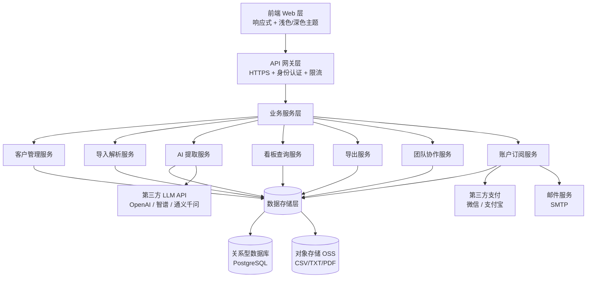

## 2.2 业务模块图

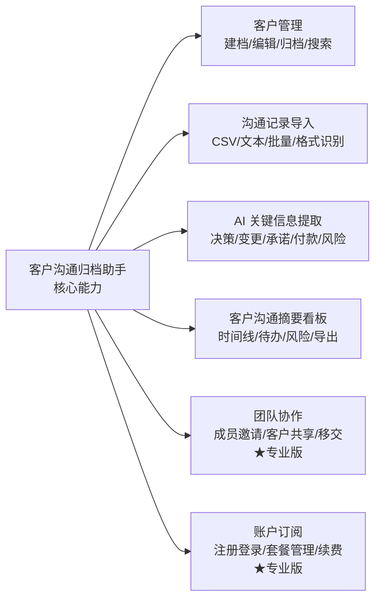

## 2.3 主业务流程

### 主流程：沟通记录导入 → AI 提取 → 看板呈现

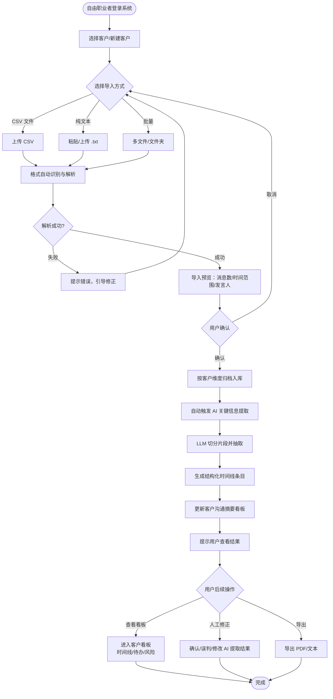

## 2.4 功能列表

| 功能模块 | 功能名称 | 优先级 | 套餐要求 | 功能说明 |
| --- | --- | --- | --- | --- |
| 客户管理 | 新建客户（手动） | P0 | 通用 | 填写客户名称、联系方式、项目类型等基本信息 |
| 客户管理 | 批量导入客户 | P2 | 通用 | 通过 CSV 批量导入客户列表 |
| 客户管理 | 编辑客户信息 | P0 | 通用 | 修改客户名称、备注、联系方式 |
| 客户管理 | 归档客户 | P0 | 通用 | 归档已完成合作的客户，不占用免费版名额 |
| 客户管理 | 删除客户 | P0 | 通用 | 永久删除客户及全部沟通记录（需二次确认） |
| 客户管理 | 客户列表展示 | P0 | 通用 | 展示活跃客户列表，含最近沟通时间、关键待办数 |
| 客户管理 | 搜索客户 | P0 | 通用 | 按客户名/联系方式模糊搜索 |
| 客户管理 | 筛选客户 | P1 | 通用 | 按项目类型、最近沟通时间筛选 |
| 导入模块 | CSV 单文件导入 | P0 | 通用 | 上传 CSV，自动解析并按时间线归档到指定客户 |
| 导入模块 | 纯文本导入 | P0 | 通用 | 粘贴/上传 .txt，按行/段落切分，自动识别发言人 |
| 导入模块 | 多文件批量导入 | P1 | 通用 | 一次上传多个文件，按文件名/内容匹配到对应客户 |
| 导入模块 | 文件夹导入 | P2 | 通用 | 上传文件夹，递归解析其中所有支持格式文件 |
| 导入模块 | 格式自动识别 | P0 | 通用 | 自动判断文件来源（微信/邮件/外包平台），选对应解析规则 |
| 导入模块 | 手动指定来源 | P1 | 通用 | 自动识别失败时，用户手动选择来源类型 |
| 导入模块 | 导入预览 | P0 | 通用 | 正式入库前展示解析预览（消息数、时间范围、发言人） |
| 导入模块 | 错误处理 | P0 | 通用 | 无法解析的行/消息标记错误，允许修正或跳过 |
| 导入模块 | 导入历史记录 | P1 | 通用 | 查看历史导入记录（时间、文件、客户、消息数） |
| 导入模块 | 重新导入 | P2 | 通用 | 对失败/部分成功的导入任务重新执行 |
| AI 提取 | 新导入自动触发 | P0 | 通用 | 每次导入后自动触发 AI 提取 |
| AI 提取 | 批量补提取 | P1 | ★专业版 | 对历史未提取记录一键补提取 |
| AI 提取 | 关键决策提取 | P0 | ★专业版 | 识别双方达成的关键决策 |
| AI 提取 | 需求变更提取 | P0 | ★专业版 | 识别客户需求变更点 |
| AI 提取 | 交付承诺提取 | P0 | ★专业版 | 识别双方交付承诺（交付日期/反馈时间） |
| AI 提取 | 付款约定提取 | P0 | ★专业版 | 识别付款相关约定（定金/尾款/验收付款） |
| AI 提取 | 风险提示提取 | P1 | ★专业版 | 识别潜在风险（客户不满、频繁变更、退款诉求） |
| AI 提取 | 时间线条目呈现 | P0 | 通用 | 每条提取结果带时间戳、发言人、原文引用 |
| AI 提取 | 人工确认/误判/修改 | P0 | 通用 | 用户对每条提取结果进行修正操作 |
| AI 提取 | 手动补充标注 | P1 | 通用 | 用户手动添加 AI 未识别的关键信息 |
| 客户看板 | 客户基础信息概览 | P0 | 通用 | 展示客户名、联系方式、项目类型、合作开始时间 |
| 客户看板 | 沟通统计 | P0 | 通用 | 展示总消息数、最近沟通时间、关键信息数量 |
| 客户看板 | 关键决策时间线 | P0 | ★专业版 | 按时间顺序展示决策/变更/承诺/付款条目 |
| 客户看板 | 时间线按类型筛选 | P1 | ★专业版 | 按决策/变更/承诺/付款/风险筛选 |
| 客户看板 | 跳转到原文 | P0 | ★专业版 | 点击时间线条目跳转到对应原始对话片段 |
| 客户看板 | 待办清单 | P1 | ★专业版 | 展示从沟通中提取/手动添加的待办事项 |
| 客户看板 | 待办状态标记 | P1 | ★专业版 | 标记待办为"待处理/已完成/已逾期" |
| 客户看板 | 风险清单 | P1 | ★专业版 | 展示 AI 识别的潜在风险 |
| 客户看板 | 导出 PDF | P0 | ★专业版 | 将客户看板导出为 PDF 文件 |
| 客户看板 | 导出文本 | P1 | 通用 | 将客户看板导出为纯文本 |
| 客户看板 | 全文检索 | P0 | 通用 | 在某客户沟通记录中全文检索 |
| 团队协作 | 邀请成员 | P1 | ★专业版 | 通过邮箱/链接邀请成员加入共享空间 |
| 团队协作 | 角色分配 | P1 | ★专业版 | 为成员分配管理者/协作者/只读角色 |
| 团队协作 | 客户共享 | P1 | ★专业版 | 将某客户沟通记录共享给指定成员 |
| 团队协作 | 客户移交 | P1 | ★专业版 | 将某客户完全移交给其他成员 |
| 团队协作 | 操作日志 | P2 | ★专业版 | 查看团队成员对客户记录的增删改日志 |
| 账户订阅 | 注册/登录 | P0 | 通用 | 邮箱+密码注册，邮箱验证码登录 |
| 账户订阅 | 第三方登录 | P2 | 通用 | 微信、GitHub 第三方登录（可选） |
| 账户订阅 | 查看当前套餐 | P0 | 通用 | 查看当前套餐及剩余权益 |
| 账户订阅 | 升级套餐 | P0 | 通用 | 免费版升级到专业版（¥19/月） |
| 账户订阅 | 续费/取消 | P0 | ★专业版 | 专业版续费或取消订阅 |
| 账户订阅 | 免费版限制提醒 | P0 | 通用 | 接近限制时提示升级 |

## 2.5 你的产品有哪些端

| 序号 | 端名称 | 端类型 | 目标用户 | 说明 |
| --- | --- | --- | --- | --- |
| 1 | 沟通归档助手 Web 端 | WEB端 | 个人自由职业者、小型外包团队负责人、团队协作者 | MVP 阶段唯一入口，响应式布局，支持主流桌面与移动端浏览器 |

> **MVP 说明**：本版本不开发原生 App、小程序或桌面客户端，仅以 Web 端作为唯一使用入口。通过响应式设计在移动端浏览器上提供可用体验。

---

# 3 产品功能（Web 端）

> 以下按端（Web 端）组织全部功能，每个功能包含：描述 → 详细流程 → 主要原型（widget 级） → 验收标准。

## 3.1 客户管理模块

### 3.1.1 客户列表展示

**功能描述**：展示当前用户所有活跃客户，按最近沟通时间倒序排列，首屏直接呈现客户名、最近沟通时间、关键待办数、风险提示数。

| 项 | 内容 |
| --- | --- |
| 优先级 | P0 |
| 依赖需求 | 账户订阅模块（注册登录后才能进入列表） |
| 前置条件 | 用户已登录，且至少创建了一个客户 |

**套餐边界**：
- **免费版**：列表中最多显示 3 个活跃客户；超出部分需升级后才能查看/新建。
- **专业版**：不限数量。

### 3.1.2 客户列表—详细流程

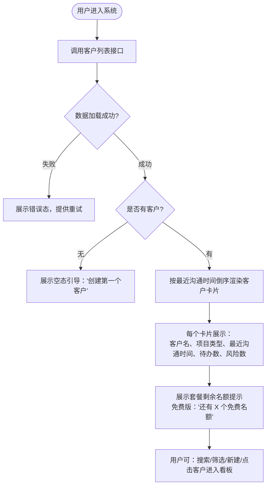

**业务规则**：
1. 客户列表仅展示"活跃"客户，已归档客户默认隐藏（可通过筛选切换显示）。
2. 免费版列表顶部固定一条提示："免费版最多 3 个客户，剩余 X 个名额"。
3. 每个客户卡片显示最近一条沟通记录的前 30 字预览。
4. 列表支持分页，每页 20 条；专业版支持无限滚动。

### 3.1.3 客户列表—主要原型

[📋 客户列表 Widget 原型](assets/prototypes/web/customer-list-widget.html)

### 3.1.4 客户列表—验收标准

- [ ] 正常流程：已登录用户进入系统，首屏展示客户列表，按最近沟通时间倒序，每条显示客户名、最近沟通时间、待办数
- [ ] 异常流程：无客户时展示空态引导；网络失败时展示错误态 + 重试按钮
- [ ] 套餐边界：免费版列表最多 3 条；专业版无上限
- [ ] 性能要求：列表加载时间 ≤ 1 秒（PERF-05）

### 3.1.5 新建客户

**功能描述**：用户手动填写客户名称（必填）、联系方式、项目类型、备注，创建一个客户档案。

| 项 | 内容 |
| --- | --- |
| 优先级 | P0 |
| 依赖需求 | 客户列表展示 |
| 前置条件 | 用户已登录；免费版客户数 < 3 |

**套餐边界**：
- **免费版**：达到 3 个活跃客户时，新建按钮灰置，点击提示升级。
- **专业版**：不限数量。

### 3.1.6 新建客户—详细流程

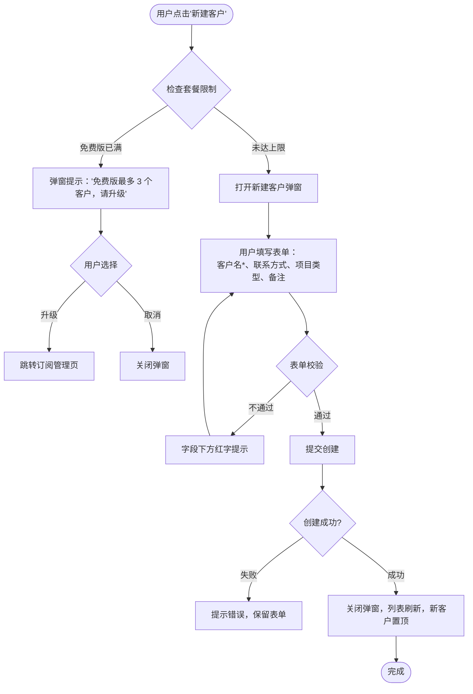

**业务规则**：
1. 客户名必填，长度 2-50 字符，不得与已有客户重名。
2. 项目类型为下拉选择：UI 设计、网站开发、App 开发、咨询、摄影、其他。
3. 新建成功后，自动进入该客户的详情页，引导用户导入第一条沟通记录。

### 3.1.7 新建客户—主要原型

[➕ 新建客户 Widget 原型](assets/prototypes/web/customer-create-widget.html)

### 3.1.8 新建客户—验收标准

- [ ] 正常流程：用户填写完整表单并提交，新客户出现在列表顶部
- [ ] 异常流程：客户名重复时给出明确错误提示；免费版达上限时引导升级
- [ ] 边界条件：客户名长度不足 2 字符、超过 50 字符时校验拦截
- [ ] 性能要求：创建响应时间 ≤ 500ms

### 3.1.9 编辑客户

**功能描述**：修改客户名称、联系方式、项目类型、备注等字段。

| 项 | 内容 |
| --- | --- |
| 优先级 | P0 |
| 依赖需求 | 客户列表展示 |
| 前置条件 | 客户已存在 |

### 3.1.10 编辑客户—详细流程

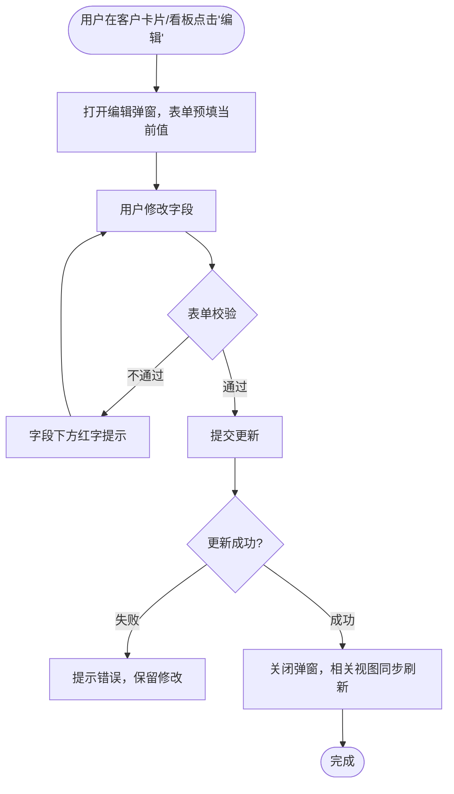

**业务规则**：
1. 编辑字段与新建一致（客户名、联系方式、项目类型、备注）。
2. 客户名修改后需全局去重校验。

### 3.1.11 归档与删除客户

**功能描述**：
- **归档**：将已完成合作的客户归档（不删除数据，仅隐藏），不占用免费版名额。
- **删除**：永久删除客户及其所有沟通记录，需二次确认。

| 项 | 内容 |
| --- | --- |
| 优先级 | P0 |
| 依赖需求 | 客户列表展示 |
| 前置条件 | 客户已存在 |

### 3.1.12 归档与删除—详细流程

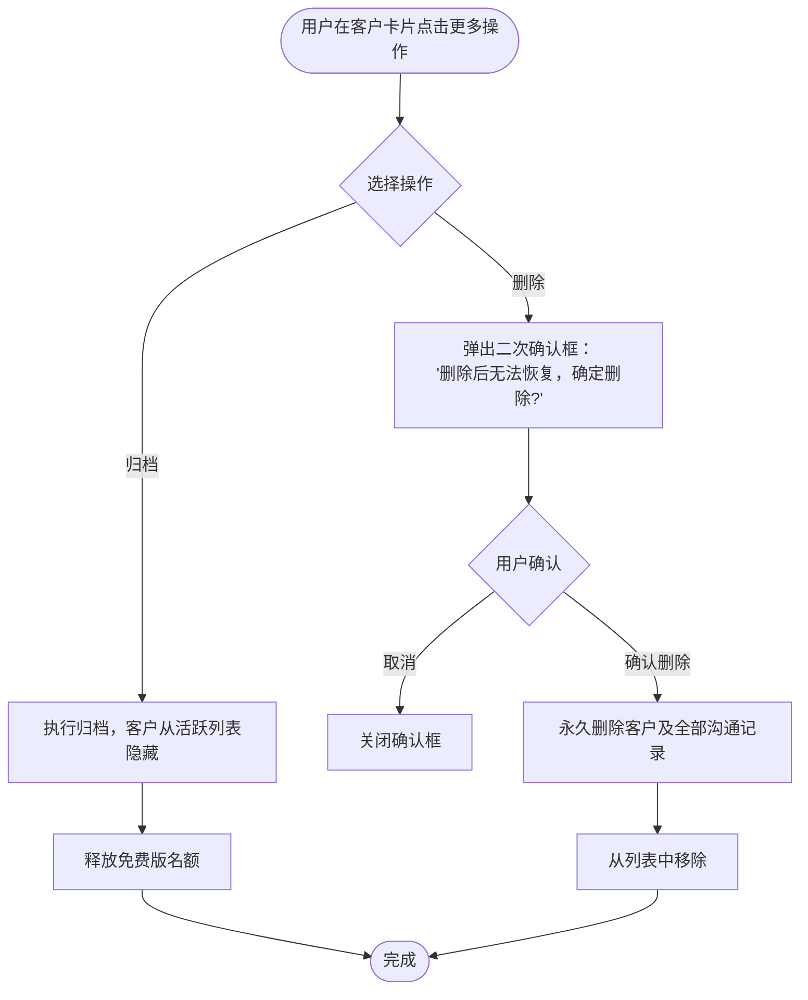

**业务规则**：
1. 归档客户可在"已归档客户"筛选项中找回并取消归档。
2. 删除操作不可逆，必须二次确认，确认框中显示客户名以强化确认意图。
3. 删除后，该客户相关的 AI 提取结果、待办、风险全部同步删除。

### 3.1.13 搜索与筛选客户

**功能描述**：
- **搜索**：按客户名/联系方式模糊搜索，实时过滤。
- **筛选**：按项目类型、最近沟通时间范围筛选。

| 项 | 内容 |
| --- | --- |
| 优先级 | 搜索 P0；筛选 P1 |
| 依赖需求 | 客户列表展示 |
| 前置条件 | 列表中已有客户 |

**业务规则**：
1. 搜索输入支持实时过滤（防抖 300ms），无需按回车。
2. 筛选条件可组合；清除筛选恢复完整列表。
3. 无匹配结果时展示空态："未找到匹配客户"。

## 3.2 沟通记录导入模块

### 3.2.1 CSV 单文件导入

**功能描述**：用户上传一个 CSV 文件（微信/邮件/外包平台导出格式），系统自动识别来源并按时间线归档到指定客户。

| 项 | 内容 |
| --- | --- |
| 优先级 | P0 |
| 依赖需求 | 客户列表展示 |
| 前置条件 | 至少存在一个客户 |

**支持的格式**：
- 微信聊天记录导出（UTF-8 CSV，字段：时间、发送者、内容）
- 邮件导出 CSV（字段：日期、发件人、主题、正文）
- 常见外包平台导出（猪八戒、Upwork 等，字段：时间、角色、消息）

### 3.2.2 CSV 导入—详细流程

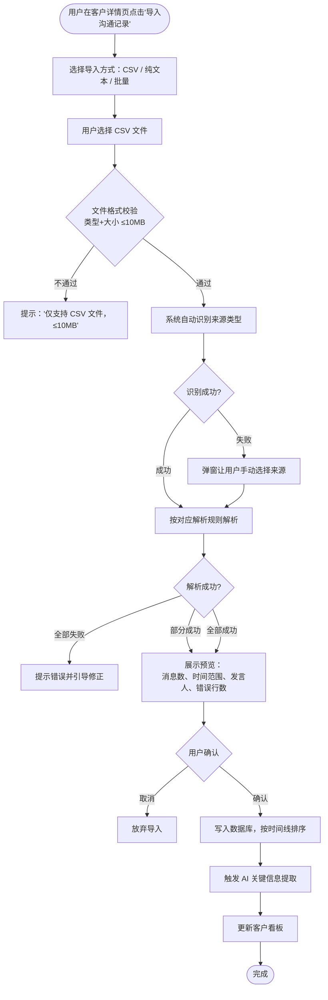

**业务规则**：
1. 单文件大小上限 10MB；单次上传超过限制时提示"文件过大，请分批上传"。
2. 系统支持自动识别微信、邮件、外包平台三种来源；识别失败时用户手动指定。
3. 预览阶段展示：消息总数、最早/最晚时间、识别到的发言人列表、错误行数。
4. 导入成功后自动触发 AI 提取（见 3.3 节）；AI 提取为异步任务，页面显示进度。
5. 同一文件重复导入时，系统按时间戳+发言人+内容去重，避免消息重复入库。

### 3.2.3 CSV 导入—主要原型

[📤 CSV 导入 Widget 原型](assets/prototypes/web/import-csv-widget.html)

### 3.2.4 CSV 导入—验收标准

- [ ] 正常流程（AC-01）：成功导入 1000 条消息的 CSV，消息按时间线正确归档到对应客户
- [ ] 部分成功：1000 行中有 5 行格式错误，预览中明确标出，用户选择跳过错误行后成功导入 995 行
- [ ] 异常流程：文件格式错误时提示明确；文件过大时提示分批上传
- [ ] 去重：重复上传同一 CSV，不产生重复消息
- [ ] 性能要求（PERF-02）：单文件 ≤10MB 解析导入 ≤ 10 秒

### 3.2.5 纯文本导入

**功能描述**：用户粘贴一段聊天文本或上传 .txt 文件，系统按行/段落切分消息，自动识别发言人。

| 项 | 内容 |
| --- | --- |
| 优先级 | P0 |
| 依赖需求 | 客户列表展示 |
| 前置条件 | 至少存在一个客户 |

**支持的文本格式**：
- 微信风格：`张三 2026-06-28 14:23\n你好，方案 B 怎么样？`
- 邮件风格：`From: zhangsan@example.com\nDate: 2026-06-28\nSubject: xxx\n正文...`
- 通用对话格式：自动按空行切分消息

### 3.2.6 纯文本导入—详细流程

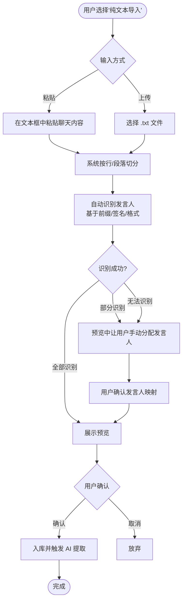

**业务规则**：
1. 粘贴文本上限 50KB；上传 .txt 文件上限 10MB。
2. 发言人识别采用正则+模式匹配：微信前缀、邮件 From、通用"名字+时间"模式。
3. 无法识别发言人时，统一标记为"未知发言人"，预览阶段让用户批量分配。

### 3.2.7 纯文本导入—主要原型

[📝 纯文本导入 Widget 原型](assets/prototypes/web/import-text-widget.html)

### 3.2.8 纯文本导入—验收标准

- [ ] 正常流程（AC-02）：粘贴微信风格聊天文本，系统正确切分消息并识别发言人
- [ ] 异常流程：文本格式无法识别时，引导用户手动分配发言人
- [ ] 边界条件：空文本提交时提示"请输入有效内容"

### 3.2.9 批量导入（多文件/文件夹）

**功能描述**：
- **多文件**：一次上传多个 CSV/TXT 文件，系统按文件名/内容自动匹配到对应客户。
- **文件夹**：上传一个文件夹，递归解析其中所有支持格式的文件。

| 项 | 内容 |
| --- | --- |
| 优先级 | 多文件 P1；文件夹 P2 |
| 依赖需求 | CSV 单文件导入、纯文本导入 |
| 前置条件 | 至少存在一个客户 |

**业务规则**：
1. 单次批量上传文件数 ≤ 20，总大小 ≤ 50MB。
2. 文件名匹配规则：优先按文件名中的客户名匹配；匹配失败则进入预览让用户分配。
3. 批量导入进度条展示：已完成/总数，每个文件的成功/失败状态。
4. 文件夹导入仅支持 Chromium 系浏览器（Chrome/Edge），其他浏览器降级为多文件上传。

### 3.2.10 批量导入—主要原型

[📂 批量导入 Widget 原型](assets/prototypes/web/import-batch-widget.html)

### 3.2.11 批量导入—验收标准

- [ ] 正常流程（AC-03）：一次导入 10 个文件，系统正确按客户归档，无消息丢失
- [ ] 性能要求（PERF-03）：10 个文件总计 ≤50MB 批量导入 ≤ 60 秒
- [ ] 异常流程：单个文件解析失败不影响其他文件继续导入

### 3.2.12 导入历史记录

**功能描述**：查看历史导入任务列表，显示导入时间、文件名、客户、消息数、成功/失败状态，支持对失败/部分成功的任务重新导入。

| 项 | 内容 |
| --- | --- |
| 优先级 | P1 |
| 依赖需求 | CSV 单文件导入、纯文本导入 |
| 前置条件 | 至少有过一次导入 |

**业务规则**：
1. 导入历史按时间倒序，保留最近 90 天记录。
2. 每个导入任务显示：时间、文件名、目标客户、消息数、状态（成功/部分成功/失败）。
3. 部分成功/失败的任务支持"重新导入"按钮，从上次中断处继续。

### 3.2.13 导入历史—主要原型

[📜 导入历史 Widget 原型](assets/prototypes/web/import-history-widget.html)

## 3.3 AI 关键信息提取模块

### 3.3.1 新导入自动触发

**功能描述**：每次导入沟通记录成功后，系统自动异步触发 AI 关键信息提取，抽取 5 类信息：关键决策、需求变更、交付承诺、付款约定、风险提示。

| 项 | 内容 |
| --- | --- |
| 优先级 | P0 |
| 依赖需求 | 沟通记录导入模块 |
| 前置条件 | 客户沟通记录已入库 |

**套餐边界**：
- **免费版**：AI 提取不可用，导入完成后提示"升级专业版使用 AI 提取"。
- **专业版**：自动提取全部 5 类信息。

### 3.3.2 AI 自动提取—详细流程

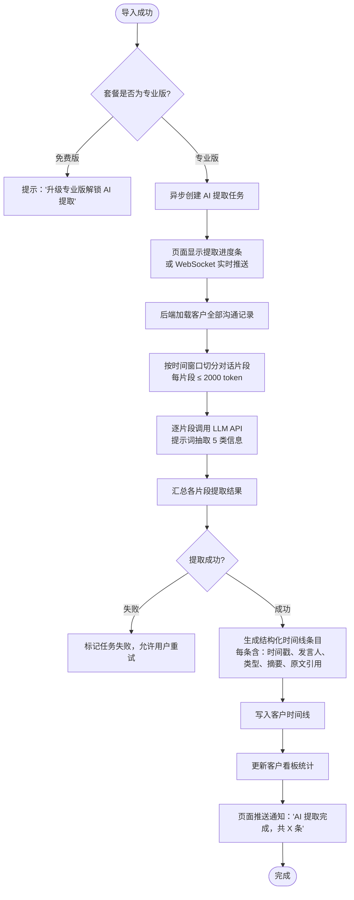

**业务规则**：
1. AI 提取为异步任务，页面显示进度（"正在提取 3/10 片段..."）。
2. 单次提取上限 1 万条消息；超出时自动分批，每批 ≤ 1 万条。
3. 同一片段重复提取时，覆盖旧结果，避免重复。
4. 提取过程中用户可继续操作其他页面，不影响其他功能使用。
5. LLM 调用失败时，自动重试 1 次；仍失败则标记该片段为"待补提取"，允许用户手动重试。

### 3.3.3 AI 提取—主要原型

[🤖 AI 提取进度 Widget 原型](assets/prototypes/web/ai-extract-widget.html)

### 3.3.4 AI 提取—验收标准

- [ ] 正常流程（AC-04/05/06）：导入含明确决策/变更/承诺的对话，AI 正确提取对应条目，准确率 ≥ 80%
- [ ] 异常流程：LLM 调用失败时自动重试；仍失败则提示用户手动重试
- [ ] 套餐边界：免费版导入后不触发 AI 提取，给出升级提示
- [ ] 性能要求（PERF-04）：1 万条消息内 AI 提取 ≤ 30 秒

### 3.3.5 批量补提取

**功能描述**：对历史导入但尚未提取（或提取失败）的沟通记录，提供"一键补提取"入口，批量触发 AI 提取。

| 项 | 内容 |
| --- | --- |
| 优先级 | P1（★专业版） |
| 依赖需求 | 新导入自动触发 |
| 前置条件 | 专业版订阅；存在未提取的历史记录 |

**业务规则**：
1. 仅在"导入历史"页提供入口，显示"还有 X 条记录未提取"。
2. 批量任务按客户分组，每个客户独立进度。
3. 免费版不可使用，入口灰置 + 升级提示。

### 3.3.6 人工确认 / 误判 / 修改

**功能描述**：用户可对每条 AI 提取结果进行三种操作：
- **确认**：标记为正确
- **误判**：标记为错误，从时间线中移除（用于后续模型优化）
- **修改**：编辑摘要内容，调整类型

| 项 | 内容 |
| --- | --- |
| 优先级 | P0 |
| 依赖需求 | AI 提取结果 |
| 前置条件 | AI 已返回提取结果 |

### 3.3.7 人工修正—详细流程

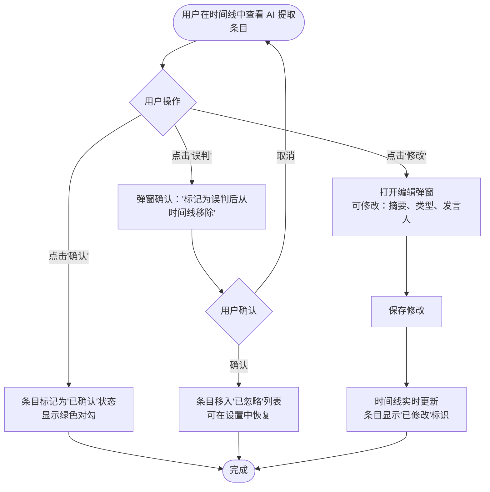

**业务规则**：
1. 修改操作保留原始摘要为"修改前"，便于后续回溯。
2. 误判的条目不永久删除，进入"已忽略"列表，支持恢复。
3. 所有修正操作实时同步到客户看板统计。

### 3.3.8 人工修正—主要原型

[✏️ 人工修正 Widget 原型](assets/prototypes/web/ai-correct-widget.html)

### 3.3.9 手动补充标注

**功能描述**：用户可手动添加 AI 未识别到的关键信息，作为时间线条目。

| 项 | 内容 |
| --- | --- |
| 优先级 | P1 |
| 依赖需求 | 客户看板 |
| 前置条件 | 客户已存在 |

**业务规则**：
1. 手动添加的条目在时间线中以"📌 手动标注"标签区分。
2. 必填字段：时间、类型（5 类选一）、摘要；可选：原文引用。

## 3.4 客户沟通摘要看板模块

### 3.4.1 客户看板概览

**功能描述**：为单个客户提供一站式沟通摘要总览，包含：
1. **客户基础信息**：客户名、联系方式、项目类型、合作开始时间
2. **沟通统计**：总消息数、最近沟通时间、关键信息总数、待办数、风险数
3. **快捷入口**：导入、导出、跳转到时间线/待办/风险子板块

| 项 | 内容 |
| --- | --- |
| 优先级 | P0 |
| 依赖需求 | 客户管理、AI 提取 |
| 前置条件 | 客户已存在 |

**套餐边界**：
- **免费版**：概览基础信息 + 沟通统计可用；时间线详细条目、待办、风险不可见（遮罩 + 升级提示）。
- **专业版**：全部可用。

### 3.4.2 客户看板—详细流程

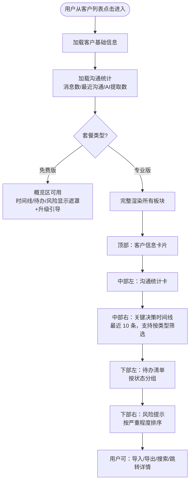

### 3.4.3 客户看板—主要原型

[📊 客户沟通摘要看板 Widget 原型](assets/prototypes/web/customer-dashboard-widget.html)

### 3.4.4 客户看板—验收标准

- [ ] 正常流程（AC-07）：看板正确展示客户信息、沟通统计、关键决策时间线、待办清单、风险提示
- [ ] 性能要求（PERF-05）：看板加载时间 ≤ 1 秒
- [ ] 套餐边界：免费版概览可用，详情板块遮罩 + 升级引导
- [ ] 异常流程：客户无任何沟通记录时展示空态引导

### 3.4.5 关键决策时间线

**功能描述**：按时间顺序展示所有 AI 提取的关键信息条目（决策/变更/承诺/付款/风险），每条含时间戳、发言人、类型标签、摘要、原文引用。

| 项 | 内容 |
| --- | --- |
| 优先级 | P0（★专业版） |
| 依赖需求 | AI 关键信息提取 |
| 前置条件 | 专业版订阅；客户已有 AI 提取结果 |

**业务规则**：
1. 时间线按时间倒序（最新的在最上面）。
2. 每条类型用不同颜色标签区分：决策=蓝、变更=橙、承诺=绿、付款=金、风险=红。
3. 支持按类型筛选（顶部 Tab 切换）。
4. 点击"跳转到原文" → 滚动到原始对话片段并高亮对应消息。

### 3.4.6 时间线—主要原型

[⏳ 关键决策时间线 Widget 原型](assets/prototypes/web/timeline-widget.html)

### 3.4.7 时间线—验收标准

- [ ] 正常流程（AC-08）：点击时间线条目，成功跳转到对应的原始对话片段并高亮
- [ ] 正常流程：按类型筛选后，仅显示对应类型条目
- [ ] 异常流程：无提取结果时展示空态："暂无关键信息，导入沟通记录后 AI 会自动提取"

### 3.4.8 待办清单

**功能描述**：展示从沟通中提取的待办事项（如"下周三交初稿"、"周五前反馈"）及用户手动添加的待办，支持状态标记（待处理/已完成/已逾期）。

| 项 | 内容 |
| --- | --- |
| 优先级 | P1（★专业版） |
| 依赖需求 | AI 提取、客户看板 |
| 前置条件 | 专业版订阅 |

**业务规则**：
1. 待办默认按"逾期 > 待处理 > 已完成"排序，同类按时间倒序。
2. 截止日期从 AI 提取的"交付承诺"中解析；解析失败则标记为"无截止日期"。
3. 用户可手动编辑待办内容、修改截止日期、标记状态。
4. 已逾期的待办在客户列表卡片上显示红色角标。

### 3.4.9 待办清单—主要原型

[✅ 待办清单 Widget 原型](assets/prototypes/web/todo-widget.html)

### 3.4.10 风险提示清单

**功能描述**：展示 AI 识别的潜在风险（客户不满、频繁变更、逾期风险、退款诉求），按严重程度排序。

| 项 | 内容 |
| --- | --- |
| 优先级 | P1（★专业版） |
| 依赖需求 | AI 提取、客户看板 |
| 前置条件 | 专业版订阅 |

**业务规则**：
1. 风险等级：高（红）、中（黄）、低（蓝），基于 AI 置信度与客户情绪分析。
2. 每条风险显示：等级、描述、原文引用、识别时间。
3. 高风险自动同步到客户列表卡片上的红色风险提示角标。
4. 用户可标记风险为"已处理"，从清单中归档。

### 3.4.11 风险提示—主要原型

[⚠️ 风险提示 Widget 原型](assets/prototypes/web/risk-widget.html)

### 3.4.12 导出看板（PDF / 文本）

**功能描述**：
- **PDF 导出**：将当前客户的沟通摘要看板（含时间线、待办、风险）渲染为 PDF 文件下载。
- **文本导出**：导出为纯文本格式。

| 项 | 内容 |
| --- | --- |
| 优先级 | PDF 导出 P0（★专业版）；文本导出 P1（通用） |
| 依赖需求 | 客户看板 |
| 前置条件 | PDF 导出需专业版；文本导出通用 |

**业务规则**：
1. PDF 排版包含：客户基础信息、沟通统计、时间线、待办、风险，带目录页。
2. 文本导出采用 Markdown 格式，方便二次编辑。
3. 免费版不可使用 PDF 导出，点击时提示升级。
4. 导出文件名格式：`{客户名}_沟通摘要_{YYYYMMDD}.pdf` 或 `.md`。

### 3.4.13 PDF 导出—主要原型

[📥 PDF 导出 Widget 原型](assets/prototypes/web/export-pdf-widget.html)

### 3.4.14 导出—验收标准

- [ ] 正常流程（AC-12）：PDF 导出后内容与在线看板一致，排版清晰
- [ ] 套餐边界：免费版 PDF 导出点击时引导升级；文本导出通用
- [ ] 性能要求：PDF 生成时间 ≤ 10 秒

### 3.4.15 全文检索

**功能描述**：在当前客户的沟通记录中全文检索关键词，高亮匹配内容，支持跳转到原文位置。

| 项 | 内容 |
| --- | --- |
| 优先级 | P0 |
| 依赖需求 | 沟通记录导入 |
| 前置条件 | 客户已有沟通记录 |

**业务规则**：
1. 检索范围：该客户全部消息内容 + 发言人。
2. 支持精确匹配与模糊匹配。
3. 结果按时间倒序，每条显示匹配上下文（前后各 30 字）。
4. 点击结果跳转到原文位置并高亮关键词。

### 3.4.16 全文检索—主要原型

[🔍 全文检索 Widget 原型](assets/prototypes/web/search-widget.html)

## 3.5 团队协作模块（★专业版）

### 3.5.1 成员邀请与角色分配

**功能描述**：通过邮箱或邀请链接邀请团队成员加入共享空间；为成员分配角色：
- **管理者**：全部权限
- **协作者**：可编辑客户/沟通记录
- **只读**：仅查看

| 项 | 内容 |
| --- | --- |
| 优先级 | P1（★专业版） |
| 依赖需求 | 账户订阅 |
| 前置条件 | 专业版订阅；当前用户为管理者 |

**业务规则**：
1. 免费版不可使用团队协作，入口仅显示"升级解锁团队协作"。
2. 专业版最多邀请 5 名成员（含管理者）。
3. 被邀请人需通过邮件中的链接完成注册/登录，自动加入团队空间。
4. 管理者可随时修改成员角色或移除成员。

### 3.5.2 成员邀请—主要原型

[👥 成员邀请 Widget 原型](assets/prototypes/web/team-invite-widget.html)

### 3.5.3 客户共享与移交

**功能描述**：
- **共享**：将某客户的沟通记录共享给指定成员（可设置只读/协作权限）。
- **移交**：将某客户完全移交给其他成员负责，原负责人失去该客户访问权。

| 项 | 内容 |
| --- | --- |
| 优先级 | P1（★专业版） |
| 依赖需求 | 成员邀请 |
| 前置条件 | 已建立团队；当前用户为管理者 |

**业务规则**：
1. 共享操作不影响客户所有权，仅授予访问权。
2. 移交需要二次确认；移交后原负责人的所有共享权限同步清除。
3. 操作日志同步记录（见 3.5.4）。

### 3.5.4 操作日志

**功能描述**：记录团队成员对客户记录的所有增删改操作，按时间倒序展示。

| 项 | 内容 |
| --- | --- |
| 优先级 | P2（★专业版） |
| 依赖需求 | 团队协作其他功能 |
| 前置条件 | 专业版订阅 |

**业务规则**：
1. 日志保留 180 天。
2. 每条日志：操作人、操作类型（创建/编辑/删除/导入/共享/移交）、目标客户、时间。
3. 仅管理者可查看操作日志。

## 3.6 账户与订阅模块

### 3.6.1 注册与登录

**功能描述**：
- **邮箱注册**：邮箱 + 密码 + 验证码。
- **邮箱登录**：邮箱 + 密码，或邮箱 + 验证码快捷登录。
- **第三方登录**（P2）：微信、GitHub OAuth。

| 项 | 内容 |
| --- | --- |
| 优先级 | 邮箱注册/登录 P0；第三方 P2 |
| 依赖需求 | 无 |
| 前置条件 | 无 |

**业务规则**：
1. 邮箱验证码有效期 5 分钟，60 秒内不可重发。
2. 密码强度要求：8 位以上，包含字母 + 数字。
3. 连续 5 次登录失败锁定账号 15 分钟。
4. 第三方登录首次需绑定邮箱（用于账号找回）。

### 3.6.2 注册登录—主要原型

[🔑 注册登录 Widget 原型](assets/prototypes/web/auth-widget.html)

### 3.6.3 订阅管理

**功能描述**：
- **查看当前套餐**：展示当前套餐类型、到期时间、剩余权益。
- **升级套餐**：免费版 → 专业版（¥19/月）。
- **续费/取消**：专业版续费或取消订阅。

| 项 | 内容 |
| --- | --- |
| 优先级 | P0 |
| 依赖需求 | 注册登录 |
| 前置条件 | 用户已登录 |

**套餐对比**：

| 功能 | 免费版 | 专业版（¥19/月） |
| --- | --- | --- |
| 活跃客户数 | ≤ 3 | 不限 |
| 历史记录保留 | 30 天 | 永久 |
| AI 关键信息提取 | ❌ | ✅ |
| 客户沟通摘要看板 | 仅概览 | 完整版 |
| 待办清单 / 风险提示 | ❌ | ✅ |
| 团队协作 | ❌ | ✅（≤5 人） |
| PDF 导出 | ❌ | ✅ |
| 文本导出 | ✅ | ✅ |

**业务规则**：
1. 升级即时生效，当前周期按剩余天数折算。
2. 取消订阅后，当前周期结束前仍可使用专业版功能；到期后自动降为免费版。
3. 降级时保留数据，但超出免费版限额的部分进入"只读"状态，不删除。
4. 支付方式：微信支付 / 支付宝（一期仅支持月度订阅）。

### 3.6.4 订阅管理—主要原型

[💳 订阅管理 Widget 原型](assets/prototypes/web/subscription-widget.html)

### 3.6.5 免费版限制提醒

**功能描述**：当用户接近或达到免费版限制时，通过页面提示 / 弹窗引导升级。

| 项 | 内容 |
| --- | --- |
| 优先级 | P0 |
| 依赖需求 | 各功能模块 |
| 前置条件 | 用户为免费版 |

**提醒触发点**：
1. 创建第 3 个客户时：弹窗"已用完全部免费名额，升级专业版解锁无限客户"。
2. 查看 30 天前的记录时：遮罩 + "免费版仅保留 30 天历史，升级查看完整记录"。
3. 点击 AI 提取 / PDF 导出 / 团队协作等专业版功能时：提示升级。
4. 客户列表顶部常驻提示："免费版 — 剩余 X 个名额 / 升级专业版"。

### 3.6.6 限制提醒—主要原型

[🚧 免费版升级引导 Widget 原型](assets/prototypes/web/upgrade-widget.html)

---

# 4 产品原型

## 4.1 页面跳转逻辑图

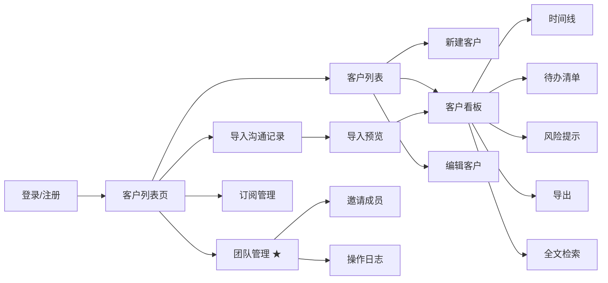

## 4.2 全站点原型设计

### 4.2.1 沟通归档助手 Web 端

**页面清单：**

| 序号 | 页面名称 | 所属模块 | 页面描述 | 关键元素 |
| --- | --- | --- | --- | --- |
| 1 | 登录/注册页 | 账户订阅 | 邮箱+密码登录/注册，验证码登录，第三方登录入口 | 表单、Tab 切换、验证码按钮 |
| 2 | 客户列表页 | 客户管理 | 主入口页，展示活跃客户列表，含搜索/筛选/新建 | 搜索框、筛选器、客户卡片、新建按钮、套餐提示 |
| 3 | 新建/编辑客户弹窗 | 客户管理 | 客户基本信息表单 | 表单（客户名*、联系方式、项目类型、备注） |
| 4 | 导入记录页 | 沟通记录导入 | 选择客户 → 选择导入方式 → 上传 → 预览 → 确认 | 导入方式 Tab、文件上传区、解析预览、确认按钮 |
| 5 | 导入历史页 | 沟通记录导入 | 历史导入任务列表 | 任务列表、状态标签、重试按钮 |
| 6 | 客户看板页 | 客户看板 | 单客户一站式沟通摘要 | 客户信息卡、统计、时间线、待办、风险 |
| 7 | 时间线详情页 | 客户看板 | 关键信息时间线完整视图 | 类型 Tab、时间线列表、原文跳转 |
| 8 | 待办清单页 | 客户看板 | 待办事项管理 | 待办列表、状态筛选、新增按钮 |
| 9 | 风险清单页 | 客户看板 | 风险一览 | 风险列表、等级标签、处理按钮 |
| 10 | 全文检索结果页 | 客户看板 | 沟通记录搜索结果 | 搜索框、结果列表、高亮 |
| 11 | 团队管理页 | 团队协作 | 成员列表、邀请、角色管理 | 成员列表、邀请按钮、角色下拉 |
| 12 | 订阅管理页 | 账户订阅 | 套餐对比、升级、续费、取消 | 套餐卡、对比表、支付按钮 |

**交互说明：**
- 页面跳转关系：参见上方 4.1 跳转逻辑图
- 特殊交互：
  1. **全局导航**：顶部导航栏（客户列表 / 导入历史 / 团队 / 订阅 / 用户头像下拉）
  2. **客户切换**：客户看板页左侧保留客户快速切换侧边栏
  3. **导入进度**：文件上传后顶部显示进度条，完成后 Toast 提示
  4. **AI 提取进度**：导入完成后弹出浮窗显示提取进度，可最小化
  5. **响应式适配**：移动端折叠导航为汉堡菜单，客户卡片改为单列
- 异常状态处理：
  1. **空数据态**：无客户 / 无导入 / 无时间线条目时展示引导
  2. **加载态**：骨架屏（Skeleton）占位
  3. **错误态**：红色错误条 + 重试按钮
  4. **免费版限制态**：遮罩 + 升级引导

**产品原型：**

[🖥️ 打开沟通归档助手 Web 端全站点原型](assets/prototypes/web-fullsite-prototype.html)

---

# 5 数据需求

## 5.1 数据使用规格

**客户表（Customer）**

| 字段 | 是否必填 | 描述 | 数据类型 |
| --- | --- | --- | --- |
| id | 是 | 客户唯一标识 | UUID |
| user_id | 是 | 所属用户 ID | UUID |
| name | 是 | 客户名称（2-50 字符） | 字符串 |
| contact | 否 | 联系方式（邮箱/电话/微信） | 字符串 |
| project_type | 否 | 项目类型（UI 设计/网站开发/App 开发/咨询/摄影/其他） | 字符串枚举 |
| note | 否 | 备注 | 文本 |
| status | 是 | 状态（active/archived/deleted） | 字符串枚举 |
| created_at | 是 | 创建时间 | 时间戳 |
| updated_at | 是 | 更新时间 | 时间戳 |

**沟通记录表（Message）**

| 字段 | 是否必填 | 描述 | 数据类型 |
| --- | --- | --- | --- |
| id | 是 | 消息唯一标识 | UUID |
| customer_id | 是 | 所属客户 ID | UUID |
| source | 是 | 来源（wechat/email/platform/manual） | 字符串枚举 |
| sender | 是 | 发言人 | 字符串 |
| content | 是 | 消息内容 | 文本 |
| timestamp | 是 | 消息时间 | 时间戳 |
| raw_line | 否 | 原始行内容（用于追溯） | 文本 |
| created_at | 是 | 入库时间 | 时间戳 |

**AI 提取条目表（KeyInfo）**

| 字段 | 是否必填 | 描述 | 数据类型 |
| --- | --- | --- | --- |
| id | 是 | 条目唯一标识 | UUID |
| customer_id | 是 | 所属客户 ID | UUID |
| type | 是 | 类型（decision/change/commitment/payment/risk） | 字符串枚举 |
| summary | 是 | 摘要 | 字符串 |
| original_quote | 否 | 原文引用 | 文本 |
| speaker | 否 | 发言人 | 字符串 |
| timestamp | 是 | 关键信息发生时间 | 时间戳 |
| status | 是 | 状态（confirmed/ignored/modified） | 字符串枚举 |
| original_summary | 否 | 修改前原始摘要 | 字符串 |
| confidence | 否 | AI 置信度 0-1 | 浮点数 |
| created_at | 是 | 提取时间 | 时间戳 |

**待办事项表（Todo）**

| 字段 | 是否必填 | 描述 | 数据类型 |
| --- | --- | --- | --- |
| id | 是 | 待办唯一标识 | UUID |
| customer_id | 是 | 所属客户 ID | UUID |
| content | 是 | 待办内容 | 字符串 |
| due_date | 否 | 截止日期 | 日期 |
| status | 是 | 状态（pending/done/overdue） | 字符串枚举 |
| source | 是 | 来源（ai_extracted/manual） | 字符串枚举 |
| created_at | 是 | 创建时间 | 时间戳 |

**订阅表（Subscription）**

| 字段 | 是否必填 | 描述 | 数据类型 |
| --- | --- | --- | --- |
| id | 是 | 订阅唯一标识 | UUID |
| user_id | 是 | 所属用户 ID | UUID |
| plan | 是 | 套餐（free/pro） | 字符串枚举 |
| started_at | 是 | 开始时间 | 时间戳 |
| expire_at | 否 | 到期时间（免费版为 null） | 时间戳 |
| status | 是 | 状态（active/cancelled/expired） | 字符串枚举 |

## 5.2 统计数据

1. 每个客户的沟通消息总数、AI 提取关键信息总数、待办数、风险数（按客户维度统计）。
2. 用户维度：总客户数、本月导入消息数、本月 AI 提取条目数（仅专业版）。

## 5.3 埋点需求

| 页面 | 事件 | 采集字段 | 说明 |
| --- | --- | --- | --- |
| 客户列表 | new_customer_click | user_id, timestamp | 点击新建客户 |
| 客户列表 | customer_click | user_id, customer_id | 点击客户进入看板 |
| 导入页 | import_start | user_id, import_type, file_count | 开始导入 |
| 导入页 | import_complete | user_id, import_id, message_count, duration | 导入完成 |
| AI 提取 | ai_extract_complete | user_id, customer_id, total_extracted, accuracy | AI 提取完成 |
| 看板 | dashboard_view | user_id, customer_id | 查看看板 |
| 看板 | export_click | user_id, customer_id, export_type | 点击导出 |
| 订阅 | upgrade_click | user_id, current_plan | 点击升级 |
| 订阅 | upgrade_complete | user_id, plan, payment_method | 升级成功 |

---

# 6 非功能需求

## 6.1 性能需求

### 6.1.1 延迟

| 编号 | 项目 | 最大延迟 | 平均延迟 | 优先级 | 备注 |
| --- | --- | --- | --- | --- | --- |
| PERF-01 | 首屏加载（4G） | < 2 秒 | < 1.5 秒 | 高 | 含登录后的客户列表首屏 |
| PERF-02 | 单文件导入（≤10MB） | < 10 秒 | < 6 秒 | 高 | 含解析+入库 |
| PERF-03 | 批量导入（10 文件 ≤50MB） | < 60 秒 | < 40 秒 | 高 | 含所有文件解析 |
| PERF-04 | AI 关键信息提取（≤1万消息） | < 30 秒 | < 20 秒 | 高 | 异步任务 |
| PERF-05 | 客户看板加载 | < 1 秒 | < 0.5 秒 | 高 | 含时间线首屏 |
| PERF-07 | 普通接口响应（P95） | < 500 ms | < 200 ms | 中 | - |

### 6.1.2 吞吐量

| 编号 | 项 | 吞吐量 | 备注 |
| --- | --- | --- | --- |
| TP-01 | 文件上传 | 每分钟 200 次 | MVP 阶段 |
| TP-02 | AI 提取任务 | 每分钟 50 个并发 | 受 LLM API 限流 |
| TP-03 | 看板查询 | 每分钟 500 次 | - |

### 6.1.3 容量

| 编号 | 项 | 容量 | 备注 |
| --- | --- | --- | --- |
| CAP-01 | 并发用户 | 100 并发 | MVP 阶段目标 |
| CAP-02 | 注册用户 | ≤ 10,000 用户 | MVP 阶段 |
| CAP-03 | 单用户消息数 | ≤ 500,000 条 | 专业版 |

## 6.2 安全需求

| 编号 | 项 |
| --- | --- |
| SEC-01 | 所有前后端通信走 HTTPS 加密通道 |
| SEC-02 | 用户密码使用 bcrypt 加盐哈希存储，禁止明文 |
| SEC-03 | 用户沟通记录加密存储（AES-256），未经授权不得用于模型训练或对外共享 |
| SEC-04 | 不同用户数据完全隔离（行级权限控制） |
| SEC-05 | 文件上传做病毒扫描 + 类型白名单校验 |
| SEC-06 | 登录连续 5 次失败锁定账号 15 分钟 |
| SEC-07 | LLM API 调用传输脱敏处理，不在提示词中包含用户敏感身份 |

## 6.3 可靠性

| 编号 | 项 | 值 |
| --- | --- | --- |
| REL-01 | Web 服务正常运行的可能性 | 99.5% |
| REL-02 | 平均正常运行时间 | 30 天 |
| REL-03 | 平均故障恢复时间（MTTR） | ≤ 2 小时 |

## 6.4 可连续性

| 编号 | 项 |
| --- | --- |
| CONT-01 | 系统需要 7×24 式的全天候运行 |
| CONT-02 | LLM API 故障时，AI 提取功能降级为"待补提取"状态，不影响其他功能 |

## 6.5 可恢复性

| 编号 | 项 |
| --- | --- |
| REC-01 | 数据库每日全量备份 + 每小时增量备份，保留 30 天 |
| REC-02 | 重大故障 1-3 小时恢复服务，24-72 小时恢复历史数据 |

## 6.6 兼容性

| 编号 | 要求 | 备注 |
| --- | --- | --- |
| COMP-01 | Chrome ≥ 90、Firefox ≥ 88、Safari ≥ 14、Edge ≥ 90 | 桌面浏览器 |
| COMP-02 | iOS Safari ≥ 14、Android Chrome ≥ 90 | 移动端浏览器 |
| COMP-03 | 响应式布局：375×667、390×844、414×896、1280×720、1920×1080 | 主流分辨率 |

## 6.7 易用性

| 编号 | 要求 | 备注 |
| --- | --- | --- |
| USE-01 | 核心操作路径 ≤ 3 步（UI-01） | 导入/查看看板/新建客户 |
| USE-02 | 普通用户无需培训即可使用（UI-01） | - |
| USE-03 | 支持浅色/深色两种主题（UI-06） | P2 |
| USE-04 | AI 提取结果用不同颜色标签区分 5 类信息（UI-04） | - |
| USE-05 | 导入流程提供清晰进度反馈与错误提示（UI-05） | - |

---

# 7 总结

## 7.1 上线计划

| 阶段 | 时间 | 内容 | 负责人 |
| --- | --- | --- | --- |
| MVP 开发 | 第 1-5 天 | 核心功能开发：导入/AI 提取/看板/账户订阅 | 研发团队 |
| 内测 | 第 6 天 | 邀请 10 名自由职业者内测，收集反馈 | 产品经理 |
| 灰度 | 第 7 天 | 灰度 20% 用户，验证稳定性与转化漏斗 | 运营 |
| 全量上线 | 第 8 天 | 全量开放，启动产品落地页宣传 | 运营 |

## 7.2 后续迭代规划

- **V1.1**：移动端原生 App（iOS/Android），支持语音导入
- **V1.2**：邮件 IMAP/SMTP 自动同步，免去手动导出
- **V1.3**：AI 智能摘要（按月/按项目生成客户沟通总结报告）
- **V1.4**：与客户 CRM 工具打通（如 HubSpot、飞书客户管理）导出
- **V2.0**：多语言支持（英文版面向海外自由职业者）

## 7.3 参考文档

- 《自由职业者客户沟通归档助手 — 用户需求说明书（URS）》v1.0
- [全站点 HTML 原型](assets/prototypes/web-fullsite-prototype.html)
