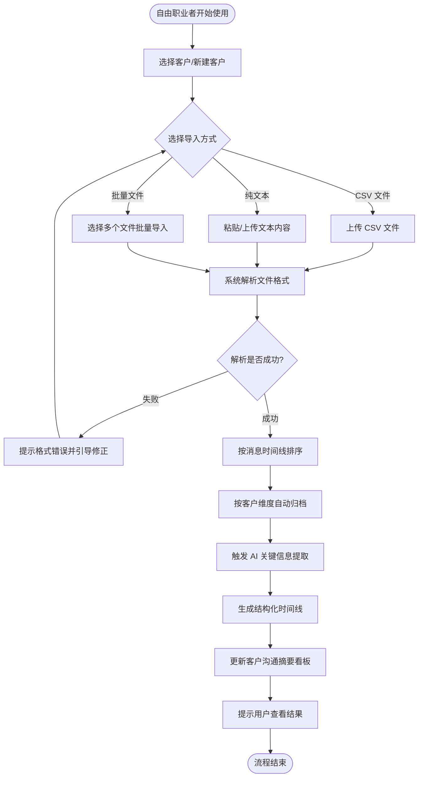
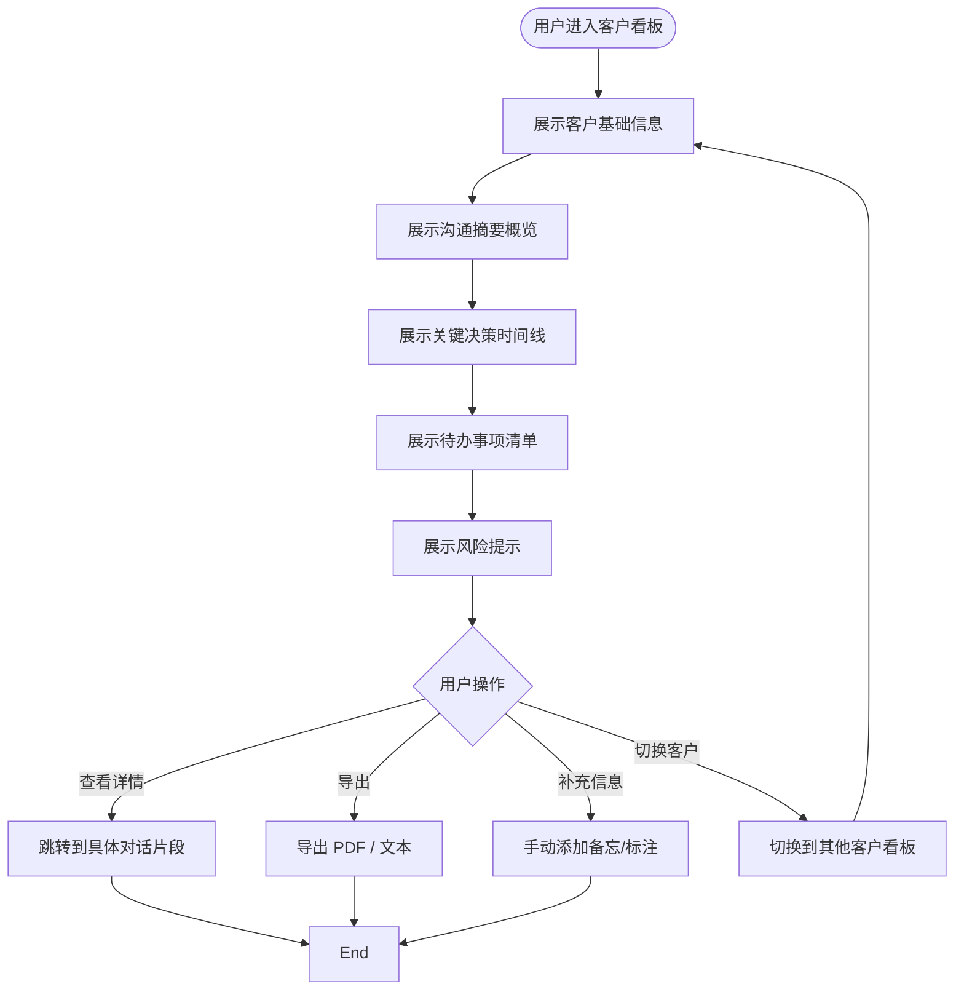

# 自由职业者客户沟通归档助手 — 用户需求说明书（URS）

> **文档版本**：v1.0  
> **创建日期**：2026-06-29  
> **所属产品**：自由职业者客户沟通归档助手  
> **产品定位**：面向自由职业者及小型外包服务商的"客户沟通归档 + 关键信息提取 + 决策留痕"效率工具（非 CRM）

---

# 1. 需求概述

## 1.1 需求介绍

**自由职业者客户沟通归档助手**是一款专为自由职业者（独立设计师、独立程序员、咨询师、摄影师、独立经纪人等）及小型外包服务商打造的轻量级效率工具。

本产品聚焦"**客户沟通记录归档 + 关键信息提取 + 决策留痕**"这一细分场景，**不做 CRM、不做客服系统、不做项目管理系统**。核心价值是帮助自由职业者把散落在微信、邮件、各类外包平台中的海量客户沟通消息，汇聚归档并按客户维度结构化整理；借助 AI 自动从对话中抽取出关键决策点、需求变更、交付承诺、付款约定等"容易扯皮的关键信息"，为每个客户生成"沟通摘要看板"，让自由职业者随时回溯"客户当时说了什么、我承诺过什么、什么时候该交付/收款"。

### 1.1.1 所属领域

- **一级领域**：效率工具 / 个人生产力工具
- **细分场景**：自由职业者客户沟通管理（非通用 CRM）
- **相关行业**：自由职业经济、创意服务行业、IT 外包服务、咨询服务

## 1.2 需求目标

### 1.2.1 业务目标

1. **解决"消息泛滥、承诺遗漏、项目扯皮"痛点**：自由职业者同时服务多个客户，沟通渠道分散（微信、邮件、猪八戒/Upwork 等平台），关键决策和承诺容易被淹没，导致事后扯皮或遗漏交付。
2. **提供"轻量、即用、不学习"的体验**：自由职业者不需要 CRM 这种重型系统，他们需要的是"把聊天记录倒进来就能用"的工具。
3. **形成"决策留痕"的个人工作资产**：每一次沟通的关键信息自动归档、可检索、可回溯。

### 1.2.2 产品目标

- **MVP 开发周期**：约 7 天
- **核心交付**：文本/CSV 导入 → LLM 关键信息提取 → 时间线看板 → 客户摘要
- **商业模式**：
  - **免费版**：管理 3 个客户，30 天历史记录
  - **专业版**：¥19/月，不限客户与历史 + AI 决策提取 + 客户看板 + 团队协作 + 导出 PDF

### 1.2.3 用户目标

- 在 5 分钟内完成一次客户沟通记录的导入与归档
- 在 1 分钟内看到某个客户的关键决策/承诺/待办摘要
- 在项目复盘或客户争议时，快速找到"谁在什么时候说了什么"

## 1.3 系统使用角色

| 角色 | 说明 | 典型用户 |
| --- | --- | --- |
| **个人自由职业者** | 单人使用，管理自己的客户沟通记录 | 独立设计师、独立程序员、咨询师、摄影师 |
| **小型外包团队负责人** | 管理 2-5 人小团队的客户沟通与协作 | 小型设计工作室负责人、外包团队 PM |
| **团队协作者** | 在团队共享空间中查看/补充客户沟通记录 | 团队中的其他成员 |

## 1.4 业务流程图

### 1.4.1 主流程：客户沟通记录导入与归档



### 1.4.2 核心流程：AI 关键信息提取

```mermaid
flowchart TD
    Start([触发 AI 提取]) --> A[加载客户全部沟通记录]
    A --> B[按时间窗口切分对话片段]
    B --> C[LLM 抽取关键信息]
    C --> D{识别信息类型}
    D -->|关键决策| E[标记为"决策"]
    D -->|需求变更| F[标记为"变更"]
    D -->|交付承诺| G[标记为"承诺"]
    D -->|付款约定| H[标记为"付款"]
    D -->|风险提示| I[标记为"风险"]
    E --> J[生成带时间戳的结构化条目]
    F --> J
    G --> J
    H --> J
    I --> J
    J --> K[写入客户时间线]
    K --> L[更新客户摘要看板]
    L --> End([提取完成])
```

### 1.4.3 用户查看客户沟通摘要看板



---

# 2. 功能原型

| 原型名称 | 原型链接 | 对应端 | 备注 |
| --- | --- | --- | --- |
| 客户沟通归档助手 Web 端 | 由 UI 原型文件提供 | WEB 端 | MVP 阶段仅提供 Web 端 |
| 客户沟通归档助手 移动端适配 | 由 UI 原型文件提供 | WEB 端（响应式） | MVP 阶段通过响应式支持移动端浏览器访问 |

> **说明**：MVP 阶段不开发原生 App，仅以 Web 端（含移动端响应式）作为唯一使用入口。

---

# 3. 需求清单

## 3.1 Web 端 — 客户管理模块

| 模块 | 一级功能 | 二级功能 | 功能描述 | 备注 |
| --- | --- | --- | --- | --- |
| 客户管理 | 新建客户 | 手动新建 | 用户填写客户名称、联系方式、项目类型等基本信息，创建一个客户档案 | 免费版上限 3 个客户 |
| 客户管理 | 新建客户 | 批量导入 | 用户通过 CSV 文件批量导入客户列表 |  |
| 客户管理 | 编辑客户 | 修改信息 | 修改客户名称、备注、联系方式等 |  |
| 客户管理 | 编辑客户 | 归档客户 | 将已完成合作的客户归档（不删除，仅隐藏） | 归档客户不占用免费版名额 |
| 客户管理 | 删除客户 | 删除 | 永久删除某个客户及其所有沟通记录（需二次确认） |  |
| 客户管理 | 客户列表 | 列表展示 | 展示所有活跃客户，含客户名、最近沟通时间、关键待办数 | 按最近沟通时间倒序 |
| 客户管理 | 客户列表 | 搜索客户 | 通过客户名/联系方式模糊搜索 |  |
| 客户管理 | 客户列表 | 筛选 | 按项目类型、最近沟通时间等筛选 |  |

## 3.2 Web 端 — 沟通记录导入模块

| 模块 | 一级功能 | 二级功能 | 功能描述 | 备注 |
| --- | --- | --- | --- | --- |
| 沟通记录导入 | 单文件导入 | CSV 导入 | 上传一个 CSV 文件（微信/邮件/平台导出格式），系统自动解析并按时间线归档到指定客户 | 支持微信导出格式、邮件 CSV、常见外包平台导出格式 |
| 沟通记录导入 | 单文件导入 | 纯文本导入 | 粘贴一段聊天文本或上传 .txt 文件，系统按行/段落切分消息 | 支持自动识别发言人 |
| 沟通记录导入 | 批量导入 | 多文件导入 | 一次上传多个文件，系统按文件名/内容自动匹配到对应客户 |  |
| 沟通记录导入 | 批量导入 | 文件夹导入 | 上传一个文件夹，递归解析其中所有支持格式的文件 |  |
| 沟通记录导入 | 格式识别 | 自动识别来源 | 系统自动判断文件是来自微信、邮件还是外包平台，并采用对应的解析规则 |  |
| 沟通记录导入 | 格式识别 | 手动指定来源 | 自动识别失败时，用户可手动选择来源类型 |  |
| 沟通记录导入 | 导入预览 | 预览解析结果 | 正式导入前，展示解析预览（消息数、时间范围、发言人），用户确认后再入库 |  |
| 沟通记录导入 | 导入预览 | 错误处理 | 对无法解析的行/消息，标记错误并允许用户修正或跳过 |  |
| 沟通记录导入 | 导入历史 | 导入记录 | 查看历史导入记录（时间、文件、客户、消息数） |  |
| 沟通记录导入 | 导入历史 | 重新导入 | 对失败/部分成功的导入任务重新执行 |  |

## 3.3 Web 端 — AI 关键信息提取模块

| 模块 | 一级功能 | 二级功能 | 功能描述 | 备注 |
| --- | --- | --- | --- | --- |
| AI 提取 | 自动提取 | 新导入自动触发 | 每次导入沟通记录后，自动触发 AI 提取关键信息 |  |
| AI 提取 | 自动提取 | 批量补提取 | 对历史未提取的记录，提供"一键补提取"功能 | 专业版功能 |
| AI 提取 | 提取类型 | 关键决策 | 识别客户/双方达成的关键决策（如"确定使用方案 B""定稿日期延至 X"） |  |
| AI 提取 | 提取类型 | 需求变更 | 识别客户需求变更点（如"Logo 改为圆形""预算增加到 2 万"） |  |
| AI 提取 | 提取类型 | 交付承诺 | 识别双方交付承诺（如"下周三交初稿""周五前反馈"） |  |
| AI 提取 | 提取类型 | 付款约定 | 识别付款相关约定（如"先付 50% 定金""验收后 7 天付款"） |  |
| AI 提取 | 提取类型 | 风险提示 | 识别潜在风险（如客户表达不满、要求退款、多次变更等） |  |
| AI 提取 | 提取结果 | 时间线条目 | 每条提取结果带时间戳、发言人、原文引用，按时间线排列 |  |
| AI 提取 | 提取结果 | 人工确认 | 用户可对每条提取结果进行"确认 / 误判 / 修改"操作 |  |
| AI 提取 | 提取结果 | 补充标注 | 用户可手动添加 AI 未识别到的关键信息 |  |

## 3.4 Web 端 — 客户沟通摘要看板

| 模块 | 一级功能 | 二级功能 | 功能描述 | 备注 |
| --- | --- | --- | --- | --- |
| 客户看板 | 概览 | 客户基础信息 | 展示客户名、联系方式、项目类型、合作开始时间 |  |
| 客户看板 | 概览 | 沟通统计 | 展示总消息数、最近沟通时间、AI 提取的关键信息数量 |  |
| 客户看板 | 时间线 | 关键决策时间线 | 按时间顺序展示所有关键决策/变更/承诺/付款条目 | 核心功能 |
| 客户看板 | 时间线 | 按类型筛选 | 按决策/变更/承诺/付款/风险等类型筛选时间线 |  |
| 客户看板 | 时间线 | 跳转到原文 | 点击时间线条目，跳转到对应的原始对话片段 |  |
| 客户看板 | 待办事项 | 待办清单 | 从沟通记录中提取/用户手动添加的待办事项（如"下周三交初稿"） |  |
| 客户看板 | 待办事项 | 待办状态 | 标记待办为"待处理/已完成/已逾期" |  |
| 客户看板 | 风险提示 | 风险清单 | 展示 AI 识别到的潜在风险（客户不满、需求频繁变更、逾期风险等） |  |
| 客户看板 | 导出 | 导出 PDF | 将客户沟通摘要看板导出为 PDF 文件 | 专业版功能 |
| 客户看板 | 导出 | 导出文本 | 将客户沟通摘要看板导出为纯文本 |  |
| 客户看板 | 全文检索 | 搜索沟通记录 | 在某客户的沟通记录中进行全文检索 |  |

## 3.5 Web 端 — 团队协作模块

| 模块 | 一级功能 | 二级功能 | 功能描述 | 备注 |
| --- | --- | --- | --- | --- |
| 团队协作 | 成员邀请 | 邀请成员 | 通过邮箱/链接邀请团队成员加入共享空间 | 专业版功能 |
| 团队协作 | 成员邀请 | 角色分配 | 为成员分配"管理者/协作者/只读"角色 |  |
| 团队协作 | 共享客户 | 客户共享 | 将某个客户的沟通记录共享给指定成员 |  |
| 团队协作 | 共享客户 | 客户移交 | 将某个客户完全移交给其他成员负责 |  |
| 团队协作 | 协作记录 | 操作日志 | 查看团队成员对客户记录的增删改操作日志 |  |

## 3.6 Web 端 — 账户与订阅模块

| 模块 | 一级功能 | 二级功能 | 功能描述 | 备注 |
| --- | --- | --- | --- | --- |
| 账户订阅 | 账户管理 | 注册/登录 | 通过邮箱 + 密码注册，支持邮箱验证码登录 |  |
| 账户订阅 | 账户管理 | 第三方登录 | 支持微信、GitHub 第三方登录 | 可选 |
| 账户订阅 | 订阅管理 | 查看套餐 | 查看当前套餐（免费版/专业版）及剩余权益 |  |
| 账户订阅 | 订阅管理 | 升级套餐 | 从免费版升级到专业版（¥19/月） |  |
| 账户订阅 | 订阅管理 | 续费/取消 | 专业版续费或取消订阅 |  |
| 账户订阅 | 使用量提示 | 免费版限制提醒 | 当接近免费版限制（3 客户/30 天）时提示升级 |  |

---

# 4. 非功能需求

## 4.1 使用界面需求

| 编号 | 需求描述 | 优先级 |
| --- | --- | --- |
| UI-01 | 主界面应简洁直观，自由职业者无需培训即可上手，核心操作不超过 3 次点击 | P0 |
| UI-02 | 客户列表页应在首屏展示核心信息（客户名、最近沟通时间、待办数） | P0 |
| UI-03 | 客户沟通摘要看板应支持响应式布局，在移动端浏览器上可正常使用 | P1 |
| UI-04 | AI 提取结果应以可视化时间线形式呈现，不同类型信息用不同颜色标签区分 | P0 |
| UI-05 | 导入流程应提供清晰的进度反馈和错误提示 | P0 |
| UI-06 | 支持浅色/深色两种主题 | P2 |

## 4.2 软硬件环境需求

| 编号 | 类别 | 需求描述 |
| --- | --- | --- |
| ENV-01 | 客户端 | 支持主流现代浏览器：Chrome 90+、Firefox 88+、Safari 14+、Edge 90+ |
| ENV-02 | 客户端 | 移动端浏览器：iOS Safari 14+、Android Chrome 90+ |
| ENV-03 | 服务端 | Web 服务部署于主流云服务商（阿里云/腾讯云） |
| ENV-04 | 服务端 | LLM 能力由第三方大模型 API 提供（如 OpenAI / 智谱 / 通义千问） |
| ENV-05 | 数据存储 | 用户数据存储于境内云服务器，符合数据本地化要求 |

## 4.3 性能需求

| 编号 | 指标 | 要求 |
| --- | --- | --- |
| PERF-01 | 页面加载 | 首屏加载时间 ≤ 2 秒（4G 网络环境） |
| PERF-02 | 单文件导入 | 单个 ≤ 10MB 文件解析并导入完成时间 ≤ 10 秒 |
| PERF-03 | 批量导入 | 10 个文件（总计 ≤ 50MB）批量导入完成时间 ≤ 60 秒 |
| PERF-04 | AI 提取 | 单次 AI 关键信息提取完成时间 ≤ 30 秒（1 万条消息内） |
| PERF-05 | 看板渲染 | 客户摘要看板加载时间 ≤ 1 秒 |
| PERF-06 | 并发用户 | MVP 阶段支持 100 并发用户 |
| PERF-07 | 响应时间 | 普通接口响应时间 ≤ 500ms（P95） |

## 4.4 约束性需求

| 编号 | 约束描述 |
| --- | --- |
| CON-01 | **不应实现 CRM 功能**：不提供客户生命周期管理、销售漏斗、自动化营销等 CRM 功能 |
| CON-02 | **不应实现即时通讯功能**：不提供客户端内聊天/消息发送功能，仅支持导入已有沟通记录 |
| CON-03 | **不应实现项目管理功能**：不提供任务分配、甘特图、工时统计等项目管理功能 |
| CON-04 | **AI 提取结果需支持人工修正**：所有 AI 提取的关键信息必须支持用户确认、误判标记、手动修改 |
| CON-05 | **免费版必须限制客户数量与历史记录时长**：免费版上限 3 个活跃客户，历史记录保留 30 天 |
| CON-06 | **数据安全**：用户沟通记录加密存储，未经授权不得用于模型训练或对外共享 |
| CON-07 | **必须提供后台服务**：需要后端服务支持文件解析、LLM 调用、数据存储、订阅管理等 |

---

# 5. 接口需求

## 5.1 硬件接口需求

本项目不涉及硬件接口。

## 5.2 软件接口需求

| 模块 | 接口名称 | 输入 | 输出 | 功能描述 |
| --- | --- | --- | --- | --- |
| 导入模块 | 文件上传接口 | 用户选择的文件（CSV/TXT） | 解析后的结构化消息列表 | 接收用户上传的沟通记录文件并解析 |
| 导入模块 | 文件格式识别接口 | 文件内容 | 文件来源类型（微信/邮件/平台/未知） | 自动识别文件来源以选择对应解析规则 |
| AI 提取模块 | LLM 调用接口 | 对话片段 + 提取提示词 | 结构化关键信息列表 | 调用第三方 LLM API 进行关键信息提取 |
| 客户看板 | 数据查询接口 | 客户 ID + 查询条件 | 沟通记录、时间线、待办、风险等数据 | 为客户看板提供数据查询支撑 |
| 导出模块 | PDF 生成接口 | 客户看板数据 | PDF 文件 | 将客户摘要看板渲染为 PDF 文件 |
| 账户模块 | 支付接口 | 订阅订单信息 | 支付结果 | 对接第三方支付（微信/支付宝）完成订阅付费 |
| 账户模块 | 邮件发送接口 | 邮件内容 + 收件人 | 发送结果 | 发送注册验证码、订阅通知等邮件 |
| 协作模块 | 成员邀请接口 | 邀请邮箱 + 角色 | 邀请链接 | 生成团队邀请链接并通过邮件发送 |

## 5.4 通讯接口需求

| 编号 | 通讯方式 | 说明 |
| --- | --- | --- |
| COM-01 | HTTPS | 所有前后端通信走 HTTPS 加密通道 |
| COM-02 | WebSocket（可选） | AI 提取进度实时推送（MVP 阶段可采用轮询替代） |

---

# 6. 附录

## 6.1 用户画像

### 画像 A：独立设计师小王

- **背景**：28 岁，独立 UI 设计师，同时服务 5-8 个客户
- **痛点**：客户通过微信发需求变更，事后不认账；忘记收款时间
- **期望**：把微信聊天记录导入后，能一眼看到"客户什么时候改过需求""什么时候该收款"
- **使用频率**：每周 2-3 次，每次 5-10 分钟

### 画像 B：独立程序员老张

- **背景**：35 岁，全栈开发者，接外包项目为生
- **痛点**：和客户的交付承诺散落在多个平台，曾经因为找不到约定记录被赖账
- **期望**：把所有平台的消息都汇总到一个地方，关键承诺自动标出来
- **使用频率**：每个项目开始时集中导入，之后每周查看 1-2 次

### 画像 C：小型外包团队负责人李姐

- **背景**：38 岁，管理一个 4 人设计工作室
- **痛点**：团队成员离职后客户沟通记录带走，新人接手无历史记录
- **期望**：团队共享客户沟通记录，新人可快速了解项目历史
- **使用频率**：每日使用，作为团队工作流的一部分

## 6.2 使用场景

### 场景 1：项目启动时的历史沟通整理

> 小王刚接了一个新客户，把过去两周的微信聊天记录 CSV 导出导入系统，AI 自动提取出 3 个关键决策、2 个需求变更、1 个付款约定，小王确认后归档到客户时间线。

### 场景 2：项目进行中定期查看摘要

> 老张每周一早上打开客户看板，查看各个客户本周的待办事项和风险提示，发现客户 A 上周表达了对进度的不满，于是优先处理 A 的需求。

### 场景 3：项目复盘或争议回溯

> 客户声称"我早就说过要改方向"，小王打开客户看板，搜索相关关键词，找到 3 周前 AI 标记的一条需求变更记录（含原文引用和时间戳），与客户沟通澄清。

### 场景 4：团队协作交接

> 李姐的团队中一名成员即将离职，她将离职成员负责的客户移交给另一位成员，新成员通过客户看板快速了解项目历史和关键决策。

## 6.3 验收标准

| 编号 | 验收项 | 验收条件 |
| --- | --- | --- |
| AC-01 | CSV 导入 | 成功导入一个包含 1000 条消息的 CSV 文件，消息按时间线正确归档到对应客户 |
| AC-02 | 纯文本导入 | 粘贴一段微信风格的聊天文本，系统正确切分消息并识别发言人 |
| AC-03 | 批量导入 | 一次导入 10 个文件，系统正确按客户归档，无消息丢失 |
| AC-04 | AI 决策提取 | 导入一段含明确决策对话的记录，AI 正确提取出"关键决策"条目，准确率 ≥ 80% |
| AC-05 | AI 变更提取 | 导入一段含需求变更对话的记录，AI 正确提取出"需求变更"条目，准确率 ≥ 80% |
| AC-06 | AI 承诺提取 | 导入一段含交付承诺对话的记录，AI 正确提取出"交付承诺"条目，准确率 ≥ 80% |
| AC-07 | 客户看板 | 客户看板正确展示：客户信息、沟通统计、关键决策时间线、待办清单、风险提示 |
| AC-08 | 时间线跳转 | 点击时间线条目，成功跳转到对应的原始对话片段 |
| AC-09 | 人工修正 | 用户可将 AI 提取结果标记为"误判"或修改内容，修改后看板实时更新 |
| AC-10 | 免费版限制 | 免费版创建第 4 个客户时被提示升级；超过 30 天的记录不可查看 |
| AC-11 | 专业版功能 | 升级到专业版后，可无限制使用 AI 提取、PDF 导出、团队协作功能 |
| AC-12 | PDF 导出 | 客户看板导出为 PDF 后，内容与在线看板一致，排版清晰 |
| AC-13 | 移动端适配 | 在手机浏览器上可正常访问和操作客户看板 |
| AC-14 | 性能 | 单文件导入 ≤ 10 秒，AI 提取 ≤ 30 秒，看板加载 ≤ 1 秒 |
| AC-15 | 数据安全 | 用户沟通记录加密存储，不同用户数据完全隔离 |

## 6.4 术语表

| 术语 | 定义 |
| --- | --- |
| 客户 | 自由职业者服务的对象（个人/企业），一个客户对应一个沟通归档空间 |
| 沟通记录 | 从微信/邮件/平台导出的对话消息数据 |
| 关键信息 | 从沟通记录中由 AI 提取的关键决策、需求变更、交付承诺、付款约定、风险提示 |
| 时间线 | 按时间顺序排列的关键信息列表 |
| 客户看板 | 单个客户的沟通摘要总览页面 |
| 待办事项 | 从沟通中承诺或手动添加的待完成事项 |
| 风险提示 | AI 识别到的潜在风险信号（客户不满、频繁变更等） |
| 决策留痕 | 将关键决策以结构化方式记录并可回溯 |
