# 自由职业者报价单生成器 - 产品需求文档（PRD）

| 版本号 | 变更日期 | 变更内容 | 变更人 | 审核人 |
| --- | --- | --- | --- | --- |
| V1.0 | 2026-06-28 | 初始版本创建 | 产品文档结对写作专家 | 阶段一产品落地页文档总编辑 |

---

# 1 概述

## 1.1 需求背景

自由职业者市场持续增长，独立设计师、程序员、摄影师、翻译、咨询师等群体在接单过程中面临报价难题：
- **定价困难**：缺乏标准化的报价参考，容易出现报价过低导致亏本或报价过高丢失客户
- **效率低下**：使用 Excel 手动计算报价，容易出错且耗时
- **专业度不足**：自制报价单格式不规范，影响客户信任度
- **数据缺失**：无法追踪历史报价的接受率、利润率等关键指标，难以优化定价策略

现有工具（如 CRM、项目管理工具）过于复杂且功能分散，缺乏专注于报价场景的垂直工具。本产品聚焦"报价单生成+报价数据分析"这一高频刚需，以轻量化工具切入市场。

## 1.2 名词解释

| 名词 | 说明 |
| --- | --- |
| 报价单 | 向客户提供的服务/产品价格清单，包含项目明细、金额、条款等 |
| 报价模板 | 预设的报价单格式，包含特定行业的默认条款、税率、货币等配置 |
| 利润率 | (总价 - 成本) / 总价 × 100%，用于衡量报价的盈利水平 |
| 客户接受率 | 已接受的报价单数量 / 已发送的报价单数量 × 100% |
| 免费版 | 每月可免费创建 3 份报价单的基础版本 |
| 专业版 | 订阅制高级版本（¥19/月 或 ¥190/年），提供无限报价单、客户管理、品牌定制、数据分析等功能 |
| 多币种 | 支持 CNY、USD、EUR、JPY、HKD 等多种货币显示报价金额 |
| 状态水印 | PDF 报价单上的状态标识（已接受、已拒绝、已过期），用于标识报价单当前状态 |

## 1.3 产品介绍

自由职业者报价单生成器是一款专注于报价场景的 SaaS 工具，帮助自由职业者快速创建专业报价单、自动计算总价与利润率、生成 PDF 并发送给客户，同时提供历史报价数据分析，辅助优化定价策略。

### 1.3.1 目标用户

- **独立自由职业者**：设计师、程序员、摄影师、翻译、咨询师等，经常需要给客户发报价的个人从业者
- **小型外包服务商**：3-10 人的小型团队，需要统一报价标准和品牌形象
- **独立经纪人**：需要管理多个客户报价的中间人

### 1.3.2 使用场景

1. **快速报价**：自由职业者收到客户咨询后，5 分钟内生成专业报价单并发送
2. **批量报价**：外包服务商同时为多个客户准备报价，需要高效管理
3. **报价分析**：月末回顾历史报价数据，分析接受率和利润率，调整定价策略
4. **品牌展示**：通过定制化报价单展现专业形象，提升客户信任

### 1.3.3 核心价值

- **5 分钟完成报价**：从选择模板到发送报价单，全程 5 分钟内完成
- **专业形象**：标准化模板、品牌 Logo 定制、多币种支持，呈现专业机构水准
- **数据驱动定价**：通过历史数据分析，优化报价策略，提升成交率和利润率
- **轻量化专注**：不做 CRM 和项目管理，只聚焦报价环节，简单易用

### 1.3.4 范围说明

| 项 | 内容 |
| --- | --- |
| 包含功能 | 报价单编辑（模板选择、明细录入、自动计算）、报价单输出（PDF 生成、链接分享、邮件发送）、数据分析（接受率、利润率、趋势图表）、客户管理、账户与订阅管理 |
| 不包含功能 | 通用 CRM 功能（客户跟进记录、销售漏斗）、项目管理功能（任务分配、进度跟踪、工时记录）、合同管理、发票管理 |

---

# 2 产品设计

## 2.1 系统架构图

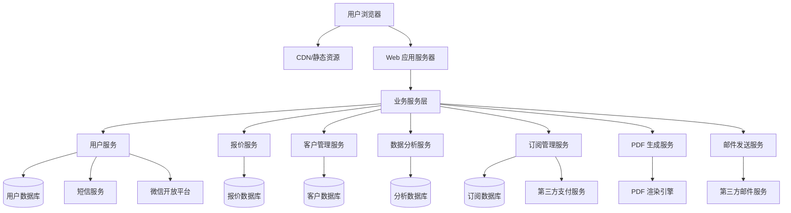

## 2.2 业务模块图

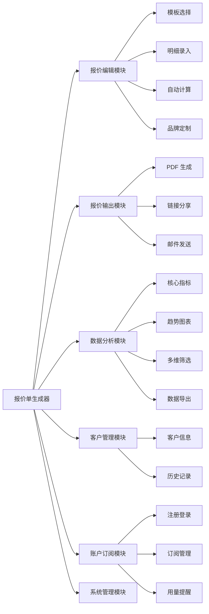

## 2.3 主业务流程

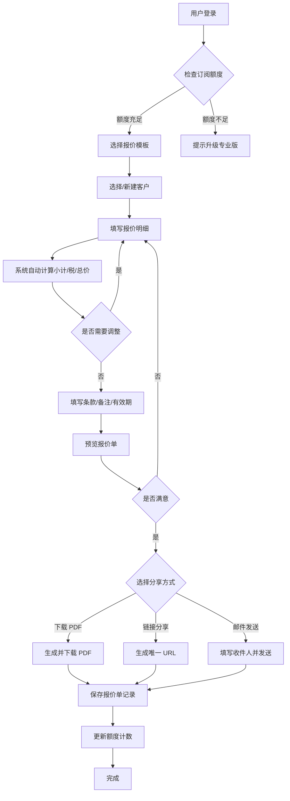

## 2.4 功能图/列表

| 功能模块 | 功能名称 | 优先级 | 功能描述 |
| --- | --- | --- | --- |
| 报价编辑 | 模板选择 | P0 | 按行业分类浏览并选择报价模板（设计/开发/摄影/咨询） |
| 报价编辑 | 报价明细录入 | P0 | 支持按行添加报价项，包括项目名称、描述、单位、数量、单价 |
| 报价编辑 | 材料费条目 | P0 | 支持添加材料费条目，按名称+数量+单价录入 |
| 报价编辑 | 小计自动汇总 | P0 | 实时计算每个条目金额并汇总所有条目小计 |
| 报价编辑 | 税费计算 | P0 | 支持配置税率，自动计算税额和含税总价 |
| 报价编辑 | 条款说明 | P0 | 编辑报价单附带的条款说明（付款方式、有效期等） |
| 报价编辑 | 保存草稿 | P0 | 随时保存报价单为草稿，下次继续编辑 |
| 报价编辑 | 利润率计算 | P1 | 录入预估成本，自动计算预估利润率 |
| 报价编辑 | 差旅费条目 | P1 | 支持添加差旅费条目（交通、住宿、餐饮补贴） |
| 报价编辑 | 折扣与优惠 | P1 | 支持对整单或单项设置折扣（百分比或固定金额） |
| 报价编辑 | 有效期设置 | P1 | 设置报价单的有效期限（默认 30 天） |
| 报价编辑 | 备注功能 | P1 | 添加内部备注（仅自己可见）或公开备注 |
| 报价编辑 | 品牌 Logo 上传 | P1 | 上传个人/公司 Logo，显示在报价单顶部（专业版） |
| 报价编辑 | 多币种支持 | P1 | 支持 CNY、USD、EUR、JPY、HKD 等主流货币（专业版） |
| 报价输出 | 一键导出 PDF | P0 | 将报价单渲染为标准 A4 排版的 PDF 文件并下载 |
| 报价输出 | 生成唯一链接 | P0 | 为每份报价单生成唯一 URL，客户可在浏览器查看 |
| 报价输出 | 邮件直发 | P1 | 填写收件人邮箱，系统将 PDF 作为附件发送 |
| 报价输出 | 客户在线反馈 | P1 | 客户通过链接查看时可点击接受/拒绝/咨询按钮 |
| 数据分析 | 报价接受率 | P0 | 展示已接受/已发送的比率，按月度/季度/年度统计（专业版） |
| 数据分析 | 平均利润率 | P0 | 展示历史报价的平均利润率（专业版） |
| 数据分析 | 报价总金额 | P0 | 展示累计报价金额、已成交金额、待成交金额（专业版） |
| 数据分析 | 月度趋势图 | P1 | 折线图展示每月报价数量、总金额、接受率变化（专业版） |
| 数据分析 | 项目类型分布 | P1 | 饼图展示不同项目类型的报价占比（专业版） |
| 数据分析 | 多维度筛选 | P1 | 按时间区间、客户、项目类型筛选数据（专业版） |
| 客户管理 | 新建客户 | P0 | 录入客户名称、联系方式、邮箱、公司名称等 |
| 客户管理 | 客户列表搜索 | P0 | 列表展示所有客户，支持模糊搜索 |
| 客户管理 | 客户历史报价 | P1 | 查看某客户的所有历史报价记录（专业版） |
| 账户管理 | 手机号注册 | P0 | 通过手机号+短信验证码注册账户 |
| 账户管理 | 微信快捷登录 | P1 | 支持微信扫码或手机号快捷登录 |
| 账户管理 | 订阅升级 | P0 | 支持升级到专业版（¥19/月 或 ¥190/年） |
| 账户管理 | 额度提醒 | P0 | 免费版使用 2 份时提醒，用完时提示升级 |
| 系统管理 | 模板增删改 | P0 | 管理员可新增、编辑、下架报价模板 |
| 系统管理 | 用户列表 | P0 | 查看所有注册用户及其订阅状态 |

## 2.5 你的产品有哪些端

| 序号 | 端名称 | 端类型 | 目标用户 | 说明 |
| --- | --- | --- | --- | --- |
| 1 | 用户端 WEB | WEB端 | 自由职业者、小团队负责人 | 主要使用端，在电脑浏览器上使用，包含报价编辑、客户管理、数据分析等完整功能 |
| 2 | 客户查看端 | WEB端 | 报价单接收客户 | 通过链接查看报价单详情，可进行接受/拒绝/咨询操作 |
| 3 | 管理后台 | WEB端 | 系统管理员 | 管理用户、模板、订阅等后台功能 |

---

# 3 产品功能

## 3.1 用户端 WEB 功能

### 3.1.1 用户注册与登录

功能描述：用户通过手机号+短信验证码注册账户，或使用微信快捷登录。新用户首次登录后引导完成 3 步入门流程（选模板 → 填明细 → 发送）。

| 项 | 内容 |
| --- | --- |
| 优先级 | P0 |
| 依赖需求 | 无 |
| 前置条件 | 用户需有手机号和能接收短信的设备 |

### 3.1.2 用户注册与登录—详细流程

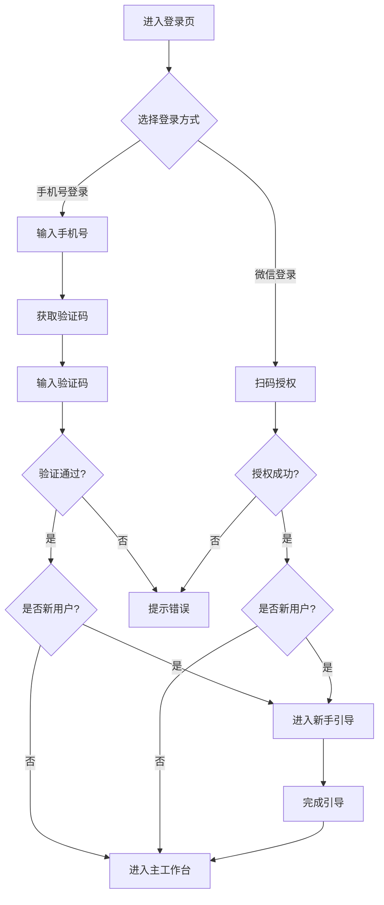

业务规则说明：
1. 验证码有效期 5 分钟，每日发送上限 10 次
2. 新用户首次登录自动创建账户，无需额外注册流程
3. 微信登录需绑定手机号（首次登录时要求输入手机号）
4. 登录状态保持 7 天，7 天后需重新登录

### 3.1.3 报价单编辑—主要原型

[报价单编辑器原型](assets/prototypes/web/quote-editor-widget.html)

验收标准说明：
- [ ] 正常流程：用户可选择模板、填写客户信息、添加报价条目，系统实时计算小计、税费、总价
- [ ] 异常流程：必填项未填写时显示红色提示，金额输入非法字符时自动过滤
- [ ] 性能要求：输入后实时计算延迟 ≤ 200ms，页面加载 ≤ 2 秒

### 3.1.4 模板选择

功能描述：系统预置设计、开发、摄影、咨询四大类模板，每类含 3-5 套风格模板。用户可按行业快速筛选，预览模板效果后应用，自动填充默认条款、货币单位、税率、有效期等配置。

| 项 | 内容 |
| --- | --- |
| 优先级 | P0 |
| 依赖需求 | 无 |
| 前置条件 | 用户已登录 |

### 3.1.5 模板选择—详细流程

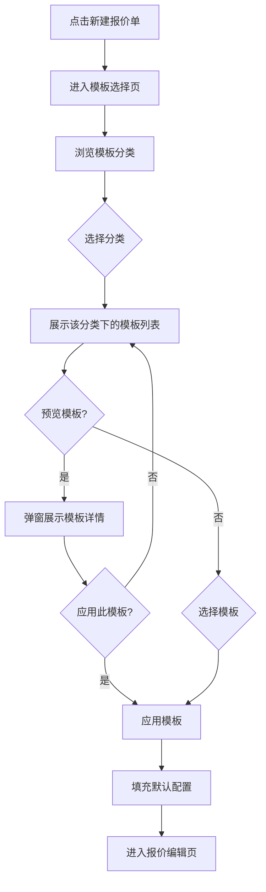

业务规则说明：
1. 每个分类下至少有 3 套模板供选择
2. 模板预览包含：排版效果、默认条款、适配场景说明
3. 应用模板后，用户仍可修改所有默认配置
4. 系统提供"空白模板"选项，适合有特定需求的用户

### 3.1.6 报价明细录入

功能描述：支持按行添加报价项，每行包含：项目名称、描述、单位（小时/天/件）、数量、单价。支持添加材料费条目（名称+数量+单价）和差旅费条目（项目+金额）。支持对整单或单项设置折扣。

| 项 | 内容 |
| --- | --- |
| 优先级 | P0 |
| 依赖需求 | 模板选择 |
| 前置条件 | 已选择模板并填写客户信息 |

### 3.1.7 报价明细录入—详细流程

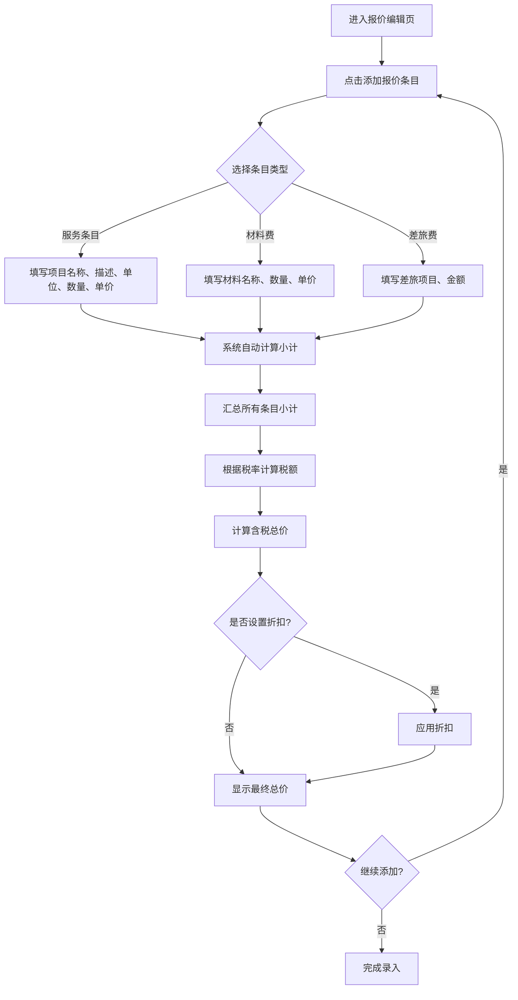

业务规则说明：
1. 服务条目小计 = 数量 × 单价
2. 材料费小计 = 数量 × 单价
3. 差旅费小计 = 金额（直接输入）
4. 整单折扣：总价 × (1 - 折扣比例) 或 总价 - 固定折扣金额
5. 单项折扣：条目小计 × (1 - 折扣比例)
6. 税额 = (小计总和 - 折扣) × 税率
7. 最终总价 = 小计总和 - 折扣 + 税额
8. 利润率 = (总价 - 成本) / 总价 × 100%（需用户录入预估成本）

### 3.1.8 PDF 生成与下载

功能描述：将报价单渲染为标准 A4 排版的 PDF 文件，包含：Logo、报价编号、日期、客户信息、明细表格、小计/税/总价、条款、页脚签名区。支持一键下载。

| 项 | 内容 |
| --- | --- |
| 优先级 | P0 |
| 依赖需求 | 报价明细录入完成 |
| 前置条件 | 报价单已保存 |

### 3.1.9 PDF 生成与下载—详细流程

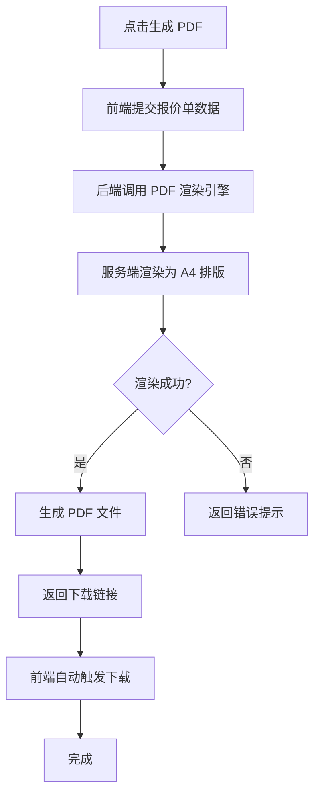

业务规则说明：
1. PDF 文件名格式：`报价单_客户名称_日期.pdf`
2. PDF 生成时间 ≤ 5 秒（10 页以内）
3. 不同浏览器、不同设备生成的 PDF 完全一致
4. 报价单状态为"已接受""已拒绝""已过期"时，PDF 自动添加对应状态水印
5. 草稿状态的报价单生成的 PDF 不带水印

### 3.1.10 链接分享

功能描述：为每份报价单生成唯一 URL，客户点击后可在浏览器中查看报价详情。支持设置密码保护、访问次数限制、有效期。客户可通过链接反馈接受/拒绝/咨询。

| 项 | 内容 |
| --- | --- |
| 优先级 | P0 |
| 依赖需求 | 报价单已保存 |
| 前置条件 | 报价单已保存 |

### 3.1.11 链接分享—详细流程

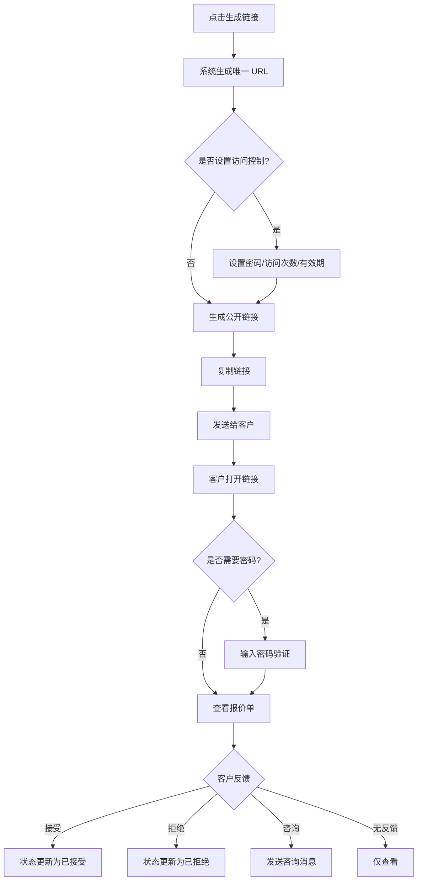

业务规则说明：
1. 链接 URL 格式：`https://domain.com/view/{unique_id}`
2. 密码保护为专业版功能，免费版链接为公开链接
3. 客户打开链接时，系统记录"已查看"状态
4. 反馈按钮仅在报价单有效期内显示
5. 超过有效期后，链接显示"报价单已过期"提示

### 3.1.12 邮件发送

功能描述：用户在系统内填写客户邮箱、主题、附言，系统将报价单 PDF 作为附件发送给客户。预置 3-5 套邮件模板（正式/友好/简洁风格）。支持发送状态追踪（送达、打开）。

| 项 | 内容 |
| --- | --- |
| 优先级 | P1 |
| 依赖需求 | 报价单已保存 |
| 前置条件 | 报价单已保存 |

### 3.1.13 邮件发送—详细流程

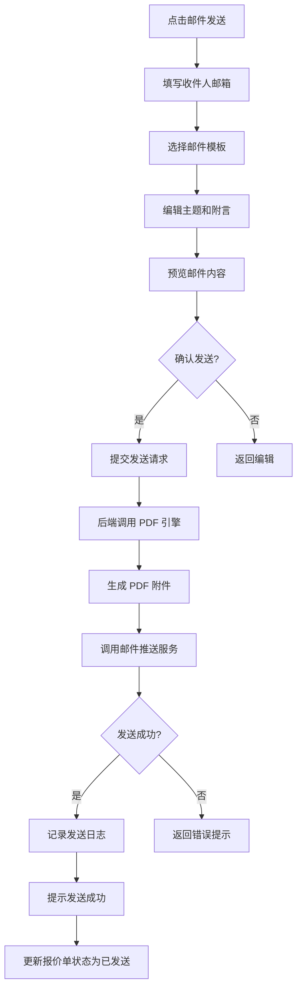

业务规则说明：
1. 邮件发送使用第三方邮件服务（阿里云邮件推送/SendGrid）
2. 邮件发送时间 ≤ 30 秒（含附件）
3. 支持多个收件人（最多 5 个）
4. 邮件模板包含：正式商务风格、友好亲切风格、简洁高效风格
5. 发送状态追踪为专业版功能

### 3.1.14 客户管理

功能描述：录入客户名称、联系方式、邮箱、公司名称、地址等基本信息。支持编辑客户信息、列表展示、模糊搜索。可查看客户的所有历史报价记录（专业版功能）。

| 项 | 内容 |
| --- | --- |
| 优先级 | P0 |
| 依赖需求 | 无 |
| 前置条件 | 用户已登录 |

### 3.1.15 客户管理—详细流程

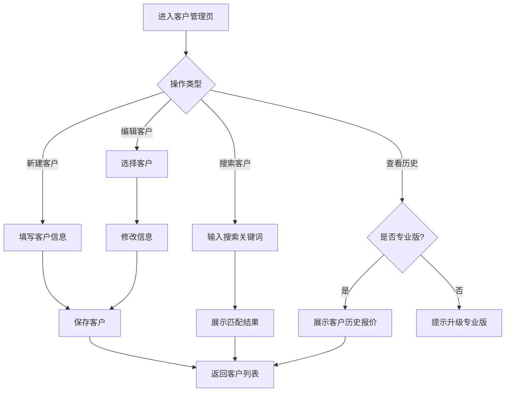

业务规则说明：
1. 客户信息必填项：客户名称、联系方式
2. 选填项：邮箱、公司名称、地址、备注
3. 支持按名称、公司、邮箱模糊搜索
4. 客户历史报价查看为专业版功能
5. 客户删除采用软删除，数据保留 30 天

### 3.1.16 数据看板

功能描述：展示核心指标（报价接受率、平均利润率、报价总金额）、趋势图表（月度报价趋势、项目类型分布）、支持多维度筛选（时间区间、客户、项目类型）。支持导出数据分析报告（PDF/Excel）。

| 项 | 内容 |
| --- | --- |
| 优先级 | P0（专业版） |
| 依赖需求 | 历史报价数据 |
| 前置条件 | 用户已登录，且为专业版用户 |

### 3.1.17 数据看板—详细流程

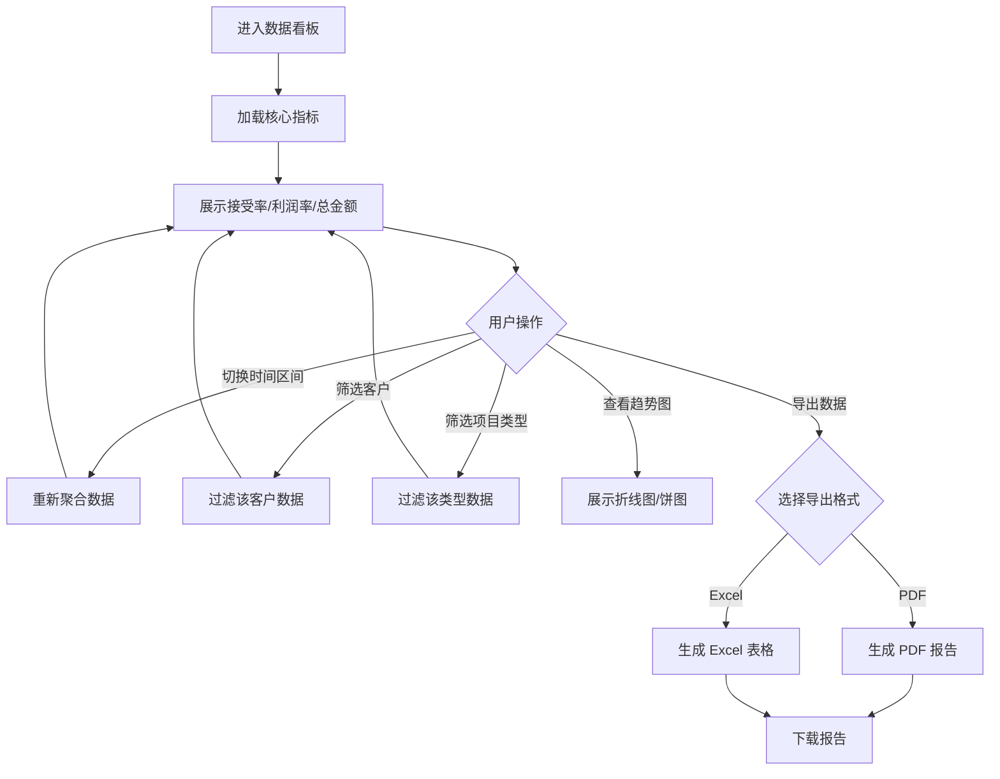

业务规则说明：
1. 数据看板为专业版功能，免费版用户查看时提示升级
2. 核心指标实时更新（接受率、利润率、总金额）
3. 月度趋势图展示近 12 个月的数据
4. 项目类型分布图展示设计/开发/摄影/咨询四类占比
5. 数据导出包含筛选后的所有数据

### 3.1.18 订阅管理

功能描述：展示当前订阅版本、到期日、剩余额度。支持升级到专业版（¥19/月 或 ¥190/年），支持微信支付、支付宝支付。免费版每月使用 2 份时提醒，用完时提示升级。每月 1 日 0 点自动重置免费版额度。

| 项 | 内容 |
| --- | --- |
| 优先级 | P0 |
| 依赖需求 | 无 |
| 前置条件 | 用户已登录 |

### 3.1.19 订阅管理—详细流程

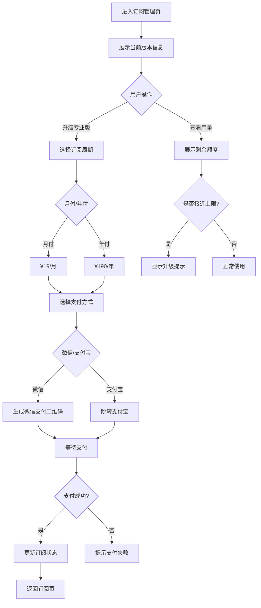

业务规则说明：
1. 免费版每月 3 份报价单额度
2. 使用 2 份时显示"仅剩 1 份额度"提醒
3. 用完 3 份后，新建报价单时提示升级
4. 每月 1 日 0 点自动重置额度
5. 专业版不限报价单数量
6. 按年订阅享受 83 折优惠（¥190/年 vs ¥228/年）
7. 支付成功后立即生效，无需等待

## 3.2 客户查看端 功能

### 3.2.1 在线查看报价单

功能描述：客户通过唯一链接查看报价单详情，包含报价编号、日期、服务方信息、客户信息、明细表格、总金额、条款说明。支持接受、拒绝、咨询三种反馈方式。

| 项 | 内容 |
| --- | --- |
| 优先级 | P0 |
| 依赖需求 | 报价单已分享 |
| 前置条件 | 拥有有效的报价单链接 |

### 3.2.2 在线查看报价单—详细流程

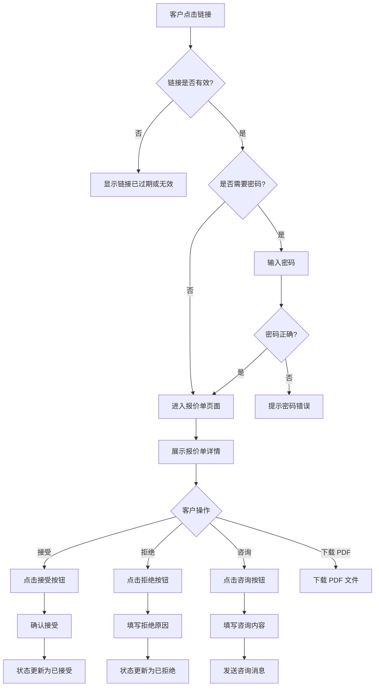

业务规则说明：
1. 链接有效期由报价单设置决定（默认 30 天）
2. 超过有效期后显示"报价单已过期"提示
3. 反馈按钮仅在报价单状态为"已发送"或"已查看"时显示
4. 客户接受后，服务方收到通知（邮件+站内消息）
5. 客户咨询内容自动同步到报价单详情页

### 3.2.3 在线查看报价单—主要原型

[客户查看端原型](assets/prototypes/client-view-widget.html)

验收标准说明：
- [ ] 正常流程：客户打开链接后可查看完整报价单信息，可点击接受/拒绝/咨询按钮
- [ ] 异常流程：链接无效或过期时显示友好提示，密码错误时提示重新输入
- [ ] 性能要求：页面加载 ≤ 2 秒，反馈操作响应 ≤ 1 秒

## 3.3 管理后台 功能

### 3.3.1 模板管理

功能描述：管理员可新增、编辑、下架报价模板。维护模板的所属行业分类（设计/开发/摄影/咨询/自定义）。查看各模板的使用次数排行。

| 项 | 内容 |
| --- | --- |
| 优先级 | P0 |
| 依赖需求 | 无 |
| 前置条件 | 管理员已登录 |

### 3.3.2 模板管理—详细流程

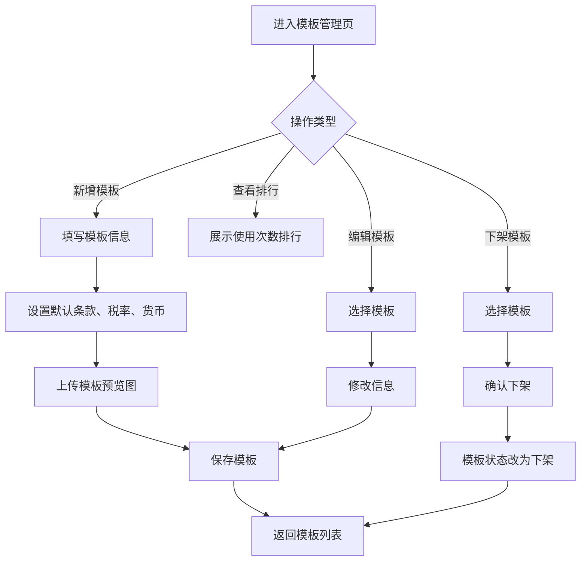

业务规则说明：
1. 每个分类下至少保留 3 套模板
2. 下架模板不影响已使用该模板创建的报价单
3. 模板信息包含：名称、分类、默认条款、默认税率、默认货币、预览图
4. 使用次数排行每日更新一次

### 3.3.3 用户管理

功能描述：查看所有注册用户及其订阅状态。查看单个用户的报价单数量、订阅信息、登录日志。支持手动调整用户订阅状态（特殊情况下）。

| 项 | 内容 |
| --- | --- |
| 优先级 | P0 |
| 依赖需求 | 无 |
| 前置条件 | 管理员已登录 |

### 3.3.4 用户管理—详细流程

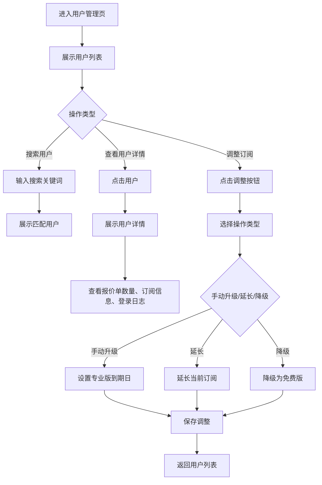

业务规则说明：
1. 用户列表默认按注册时间倒序排列
2. 支持按用户名、手机号、邮箱搜索
3. 手动调整订阅需记录操作日志
4. 用户详情页包含：基本信息、订阅状态、报价单统计、登录日志

### 3.3.5 运营数据看板

功能描述：展示平台级数据（总用户数、活跃用户数、订阅转化率、总收入）。展示模板使用排行，辅助模板运营决策。

| 项 | 内容 |
| --- | --- |
| 优先级 | P1 |
| 依赖需求 | 无 |
| 前置条件 | 管理员已登录 |

### 3.3.6 运营数据看板—详细流程

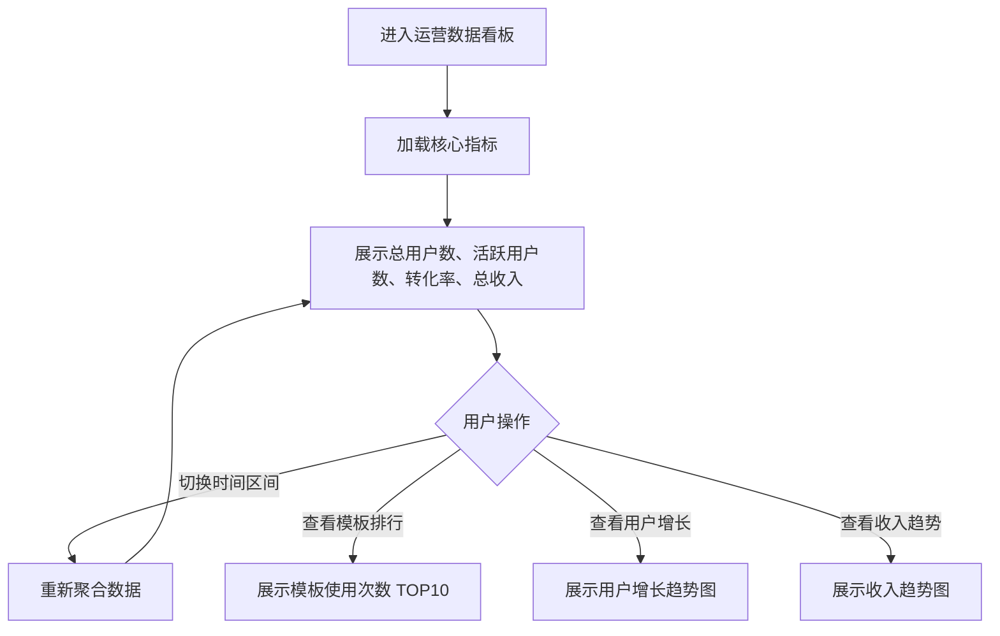

业务规则说明：
1. 核心指标每日更新一次
2. 活跃用户定义：近 7 天内登录过至少 1 次
3. 订阅转化率 = 专业版用户数 / 总用户数 × 100%
4. 模板使用排行展示 TOP10，每日更新

---

# 4 产品原型

## 4.1 页面跳转逻辑图

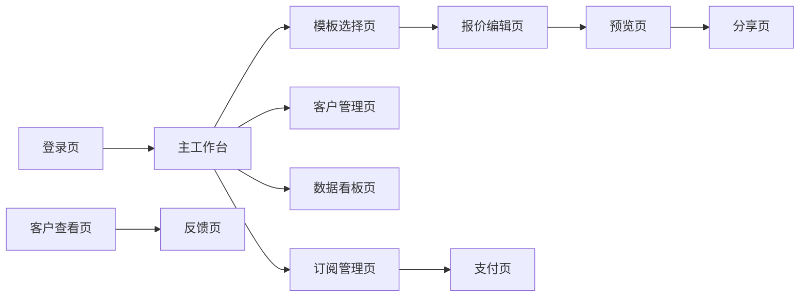

## 4.2 全站点原型设计

### 4.2.1 用户端 WEB

**页面清单：**

| 序号 | 页面名称 | 所属模块 | 页面描述 | 关键元素 |
| --- | --- | --- | --- | --- |
| 1 | 登录页 | 账户管理 | 用户登录入口 | 手机号输入框、验证码输入框、登录按钮、微信登录入口 |
| 2 | 主工作台 | 核心功能 | 报价单列表、快捷入口 | 报价单列表、新建报价单按钮、筛选条件、统计卡片 |
| 3 | 模板选择页 | 报价编辑 | 选择报价模板 | 分类标签、模板卡片、预览按钮、应用按钮 |
| 4 | 报价编辑页 | 报价编辑 | 填写报价明细 | 左侧表单（客户信息、报价条目）、右侧实时预览、保存/发送按钮 |
| 5 | 预览页 | 报价输出 | 预览报价单效果 | 报价单预览图、下载 PDF 按钮、复制链接按钮、邮件发送按钮 |
| 6 | 客户管理页 | 客户管理 | 管理客户信息 | 客户列表、搜索框、新建客户按钮、编辑/删除按钮 |
| 7 | 数据看板页 | 数据分析 | 查看报价数据 | 核心指标卡片、趋势图表、筛选条件、导出按钮 |
| 8 | 订阅管理页 | 账户管理 | 管理订阅状态 | 当前版本信息、升级按钮、用量统计、支付选项 |
| 9 | 支付页 | 账户管理 | 完成订阅支付 | 订阅周期选择、支付方式选择、支付二维码、订单信息 |

**交互说明：**

- 页面跳转关系：

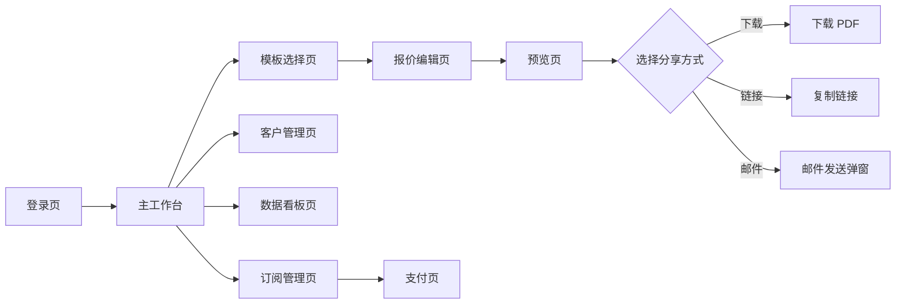

- 特殊交互：
  1. 报价编辑页采用"左侧表单+右侧实时预览"布局，左侧输入时右侧实时更新
  2. 模板选择页支持鼠标悬停预览模板效果
  3. 数据看板图表支持鼠标悬停查看详情
  4. 列表支持下拉刷新（移动端）和分页加载（PC端）
  5. 表单输入支持实时校验和错误提示
  6. 空数据态显示友好提示和引导操作
  7. 加载态显示加载动画
  8. 错误态显示错误信息和重试按钮

**产品原型：**

[🖥️ 打开用户端WEB全站点原型](assets/prototypes/web-prototype.html)

### 4.2.2 客户查看端

**页面清单：**

| 序号 | 页面名称 | 所属模块 | 页面描述 | 关键元素 |
| --- | --- | --- | --- | --- |
| 1 | 报价单查看页 | 报价查看 | 查看报价单详情 | 报价单信息展示、接受/拒绝/咨询按钮、下载 PDF 按钮 |
| 2 | 密码验证页 | 访问控制 | 输入访问密码 | 密码输入框、验证按钮 |
| 3 | 链接失效页 | 访问控制 | 链接过期或无效提示 | 错误提示、返回首页按钮 |
| 4 | 反馈成功页 | 客户反馈 | 反馈提交成功提示 | 成功提示、返回首页按钮 |

**交互说明：**

- 页面跳转关系：

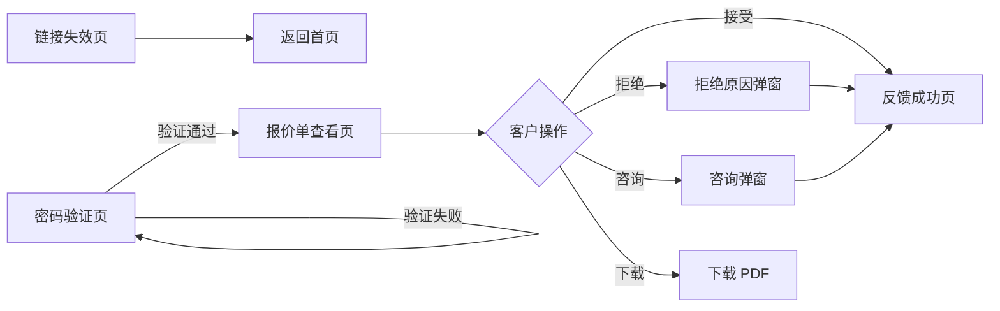

- 特殊交互：
  1. 报价单查看页采用响应式设计，适配 PC 和移动端
  2. 反馈按钮支持鼠标悬停效果
  3. 弹窗支持键盘 ESC 关闭
  4. 表单输入支持实时校验
  5. 提交成功后显示成功动画

**产品原型：**

[📱 打开客户查看端全站点原型](assets/prototypes/client-view-prototype.html)

### 4.2.3 管理后台

**页面清单：**

| 序号 | 页面名称 | 所属模块 | 页面描述 | 关键元素 |
| --- | --- | --- | --- | --- |
| 1 | 登录页 | 账户管理 | 管理员登录 | 用户名输入框、密码输入框、登录按钮 |
| 2 | 数据概览页 | 运营数据 | 平台核心数据 | 核心指标卡片、趋势图表、模板排行 |
| 3 | 用户管理页 | 用户管理 | 管理用户列表 | 用户列表、搜索框、用户详情弹窗、调整订阅按钮 |
| 4 | 模板管理页 | 模板管理 | 管理报价模板 | 模板列表、新增模板按钮、编辑/下架按钮 |
| 5 | 模板编辑页 | 模板管理 | 编辑模板信息 | 表单（名称、分类、默认条款、税率、货币）、预览图上传 |

**交互说明：**

- 页面跳转关系：

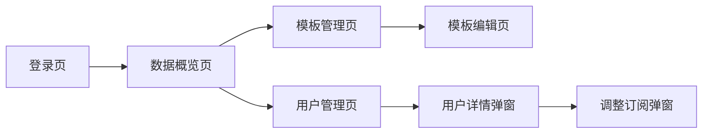

- 特殊交互：
  1. 左侧导航栏支持折叠/展开
  2. 表格支持排序和筛选
  3. 弹窗支持键盘 ESC 关闭
  4. 表单输入支持实时校验
  5. 操作成功后显示 Toast 提示

**产品原型：**

[🖥️ 打开管理后台全站点原型](assets/prototypes/admin-prototype.html)

---

# 5 数据需求

## 5.1 数据使用规格

### 5.1.1 用户表（users）

| 字段 | 是否必填 | 描述 | 数据类型 |
| --- | --- | --- | --- |
| id | 是 | 用户唯一标识 | UUID |
| phone | 是 | 手机号 | 字符串 |
| password_hash | 否 | 密码哈希（微信登录用户可为空） | 字符串 |
| wechat_openid | 否 | 微信 openid | 字符串 |
| name | 是 | 用户名 | 字符串 |
| avatar_url | 否 | 头像 URL | 字符串 |
| industry | 否 | 所在行业 | 字符串 |
| created_at | 是 | 注册时间 | 时间戳 |
| updated_at | 是 | 更新时间 | 时间戳 |

### 5.1.2 客户表（customers）

| 字段 | 是否必填 | 描述 | 数据类型 |
| --- | --- | --- | --- |
| id | 是 | 客户唯一标识 | UUID |
| user_id | 是 | 所属用户 ID | UUID |
| name | 是 | 客户名称 | 字符串 |
| contact | 是 | 联系方式 | 字符串 |
| email | 否 | 邮箱 | 字符串 |
| company | 否 | 公司名称 | 字符串 |
| address | 否 | 地址 | 字符串 |
| notes | 否 | 备注 | 文本 |
| created_at | 是 | 创建时间 | 时间戳 |
| updated_at | 是 | 更新时间 | 时间戳 |
| deleted_at | 否 | 删除时间（软删除） | 时间戳 |

### 5.1.3 报价单表（quotes）

| 字段 | 是否必填 | 描述 | 数据类型 |
| --- | --- | --- | --- |
| id | 是 | 报价单唯一标识 | UUID |
| user_id | 是 | 所属用户 ID | UUID |
| customer_id | 是 | 客户 ID | UUID |
| template_id | 是 | 使用的模板 ID | UUID |
| quote_number | 是 | 报价单编号 | 字符串 |
| status | 是 | 状态（draft/sent/viewed/accepted/rejected/expired/closed） | 字符串 |
| currency | 是 | 货币类型（CNY/USD/EUR/JPY/HKD） | 字符串 |
| subtotal | 是 | 小计金额 | 数字 |
| discount | 否 | 折扣金额 | 数字 |
| tax_rate | 是 | 税率（百分比） | 数字 |
| tax_amount | 是 | 税额 | 数字 |
| total_amount | 是 | 总金额 | 数字 |
| estimated_cost | 否 | 预估成本 | 数字 |
| profit_margin | 否 | 利润率（百分比） | 数字 |
| valid_days | 是 | 有效天数 | 整数 |
| expire_at | 是 | 过期时间 | 时间戳 |
| terms | 否 | 条款说明 | 文本 |
| internal_notes | 否 | 内部备注 | 文本 |
| public_notes | 否 | 公开备注 | 文本 |
| share_url | 否 | 分享链接 | 字符串 |
| share_password | 否 | 分享密码 | 字符串 |
| view_count | 是 | 查看次数 | 整数 |
| created_at | 是 | 创建时间 | 时间戳 |
| updated_at | 是 | 更新时间 | 时间戳 |

### 5.1.4 报价条目表（quote_items）

| 字段 | 是否必填 | 描述 | 数据类型 |
| --- | --- | --- | --- |
| id | 是 | 条目唯一标识 | UUID |
| quote_id | 是 | 所属报价单 ID | UUID |
| item_type | 是 | 条目类型（service/material/travel） | 字符串 |
| name | 是 | 项目名称 | 字符串 |
| description | 否 | 项目描述 | 文本 |
| unit | 否 | 单位（小时/天/件） | 字符串 |
| quantity | 否 | 数量 | 数字 |
| unit_price | 否 | 单价 | 数字 |
| amount | 是 | 金额 | 数字 |
| sort_order | 是 | 排序序号 | 整数 |

### 5.1.5 订阅表（subscriptions）

| 字段 | 是否必填 | 描述 | 数据类型 |
| --- | --- | --- | --- |
| id | 是 | 订阅唯一标识 | UUID |
| user_id | 是 | 用户 ID | UUID |
| plan_type | 是 | 订阅类型（free/pro_monthly/pro_yearly） | 字符串 |
| status | 是 | 订阅状态（active/expired/cancelled） | 字符串 |
| start_date | 是 | 开始日期 | 时间戳 |
| end_date | 是 | 结束日期 | 时间戳 |
| monthly_quota | 是 | 每月额度 | 整数 |
| used_quota | 是 | 已使用额度 | 整数 |
| created_at | 是 | 创建时间 | 时间戳 |
| updated_at | 是 | 更新时间 | 时间戳 |

## 5.2 统计数据

1. 统计报价单的累计数量、总金额、接受率、平均利润率，按用户、按月度维度统计（P0）
2. 统计不同项目类型（设计/开发/摄影/咨询）的报价占比，按用户维度统计（P1）
3. 统计客户的报价金额排行，识别核心客户（P2）
4. 统计模板的使用次数排行，辅助模板运营决策（P2）

## 5.3 埋点需求

| 页面 | 事件 | 采集字段 | 说明 |
| --- | --- | --- | --- |
| 登录页 | 登录成功 | user_id, login_type, timestamp | 统计登录方式分布 |
| 主工作台 | 新建报价单 | user_id, timestamp | 统计报价单创建频率 |
| 模板选择页 | 选择模板 | user_id, template_id, template_category, timestamp | 统计模板使用偏好 |
| 报价编辑页 | 保存报价单 | user_id, quote_id, timestamp | 统计报价单保存频率 |
| 预览页 | 下载 PDF | user_id, quote_id, timestamp | 统计 PDF 下载频率 |
| 预览页 | 复制链接 | user_id, quote_id, timestamp | 统计链接分享频率 |
| 预览页 | 发送邮件 | user_id, quote_id, timestamp | 统计邮件发送频率 |
| 客户查看页 | 查看报价单 | quote_id, client_ip, timestamp | 统计客户查看情况 |
| 客户查看页 | 接受报价 | quote_id, timestamp | 统计接受率 |
| 客户查看页 | 拒绝报价 | quote_id, reject_reason, timestamp | 统计拒绝率和拒绝原因 |
| 数据看板 | 导出数据 | user_id, export_type, timestamp | 统计数据导出频率 |
| 订阅管理页 | 升级订阅 | user_id, plan_type, payment_method, timestamp | 统计订阅转化率 |

---

# 6 非功能需求

## 6.1 性能需求

**6.1.1 延迟**

| 编号 | 项目 | 最大延迟 | 平均延迟 | 优先级 | 备注 |
| --- | --- | --- | --- | --- | --- |
| 0001 | 页面首屏加载 | <2 秒 | <1.5 秒 | 高 | 国内 CDN 加速 |
| 0002 | 报价单编辑响应 | <0.2 秒 | <0.1 秒 | 高 | 输入后实时计算 |
| 0003 | PDF 生成 | <5 秒 | <3 秒 | 中 | 10 页以内 |
| 0004 | 邮件发送 | <30 秒 | <15 秒 | 中 | 含附件 |
| 0005 | 数据看板加载 | <3 秒 | <2 秒 | 中 | 1000 条数据量级 |

**6.1.2 吞吐量**

| 编号 | 项 | 吞吐量 | 备注 |
| --- | --- | --- | --- |
| 0001 | 用户登录认证 | 每分钟 1000 次 | MVP 阶段 |
| 0002 | 报价单创建 | 每分钟 500 次 | MVP 阶段 |
| 0003 | PDF 生成 | 每分钟 100 次 | 服务端渲染 |

**6.1.3 容量**

| 编号 | 项 | 容量 | 备注 |
| --- | --- | --- | --- |
| 0001 | 系统用户数 | <=100,000 | MVP 阶段 |
| 0002 | 系统活动用户数 | <=10,000 | 日活跃用户 |
| 0003 | 并发用户数 | <=500 | MVP 阶段 |

## 6.2 安全需求

| 编号 | 项（系统数据 / 处理过程） |
| --- | --- |
| 0001 | 用户密码必须加密存储，使用 bcrypt 算法 |
| 0002 | 所有 API 接口必须验证用户身份，防止越权访问 |
| 0003 | 报价单分享链接必须验证有效期和访问权限 |
| 0004 | 敏感操作（删除、修改订阅）必须记录操作日志 |
| 0005 | 支付回调必须验证签名，防止伪造支付成功 |
| 0006 | 用户上传的文件必须验证类型和大小，防止恶意文件 |
| 0007 | 系统必须防止 SQL 注入、XSS、CSRF 等常见攻击 |
| 0008 | 用户数据必须隔离，用户 A 不能访问用户 B 的数据 |

## 6.3 可靠性

| 编号 | 项 | 值 |
| --- | --- | --- |
| 0001 | 系统可用性 | >=99.5%（月度） |
| 0002 | 平均正常运行时间 | 180 天 |
| 0003 | 平均故障恢复时间 | 30 分钟 |

## 6.4 可连续性

| 编号 | 项 |
| --- | --- |
| Conti.1 | 系统需要 7 × 24 式的全天候运行 |
| Conti.2 | 关键服务（用户认证、报价编辑）必须具备高可用部署 |
| Conti.3 | 第三方服务（邮件、支付）故障时，系统应能降级运行 |

## 6.5 可恢复性

| 编号 | 项 |
| --- | --- |
| Modi.1 | 系统可以进行数据备份，最近 30 日的业务数据、数据库数据全备份（30 份，每日一份，保留 2 个月） |
| Modi.2 | 每周周六进行数据完全备份一次（保留 2 个月） |
| Modi.3 | 每月末最后一日进行数据完全备份一次（保留 1 年） |
| Modi.4 | 每 1 小时业务数据、数据库数据增量备份一次 |
| Modi.5 | 重大故障需要在 1 ～ 3 小时恢复服务的可用性，并在 24 小时到 72 小时内恢复历史数据 |

## 6.6 兼容性

| 编号 | 要求 | 备注 |
| --- | --- | --- |
| 0001 | 兼容主流浏览器：Chrome >=90，Firefox >=88，Safari >=14，Edge >=90 |  |
| 0002 | 移动端适配主流分辨率：375×667，390×844，414×896 |  |
| 0003 | 最小支持屏幕分辨率：1280×720 |  |
| 0004 | 推荐屏幕分辨率：1920×1080 |  |

## 6.7 易用性

| 编号 | 要求 | 备注 |
| --- | --- | --- |
| 0001 | 核心操作路径不超过 3 步 | 从选择模板到发送报价单 |
| 0002 | 普通用户无需培训即可使用核心功能 | 5 分钟内完成报价单 |
| 0003 | 新用户首次进入提供 3 步引导 | 选模板 → 填明细 → 发送 |
| 0004 | 报价单编辑页采用"所见即所得"布局 | 左侧表单+右侧实时预览 |

---

# 7 总结

## 7.1 上线计划

| 阶段 | 时间 | 内容 | 负责人 |
| --- | --- | --- | --- |
| 开发阶段 | 2026-07-01 至 2026-07-07 | 完成 MVP 核心功能开发 | 开发团队 |
| 测试阶段 | 2026-07-08 至 2026-07-10 | 功能测试、性能测试、安全测试 | 测试团队 |
| 灰度阶段 | 2026-07-11 至 2026-07-14 | 灰度 10% 用户，验证稳定性 | 运营团队 |
| 全量上线 | 2026-07-15 | 全量开放给所有用户 | 运营团队 |

## 7.2 后续迭代规划

- V1.1（2026-08）：增加邮件模板、发送状态追踪、客户历史报价查看功能
- V1.2（2026-09）：增加版本历史、品牌配色、客户集中度分析功能
- V1.3（2026-10）：增加智能定价建议、数据导出报告功能
- V2.0（2026-12）：增加团队协作功能，支持多用户协同管理报价单

## 7.3 参考文档

- 用户需求说明书（URS）：`./自由职业者报价单生成器/需求文档_URS.md`
- UI 原型文件：`./自由职业者报价单生成器/assets/prototypes/`

---

**文档变更记录**

| 版本 | 日期 | 变更人 | 变更内容 |
|------|------|--------|----------|
| v1.0 | 2026-06-28 | 产品文档结对写作专家 | 初始版本 |
