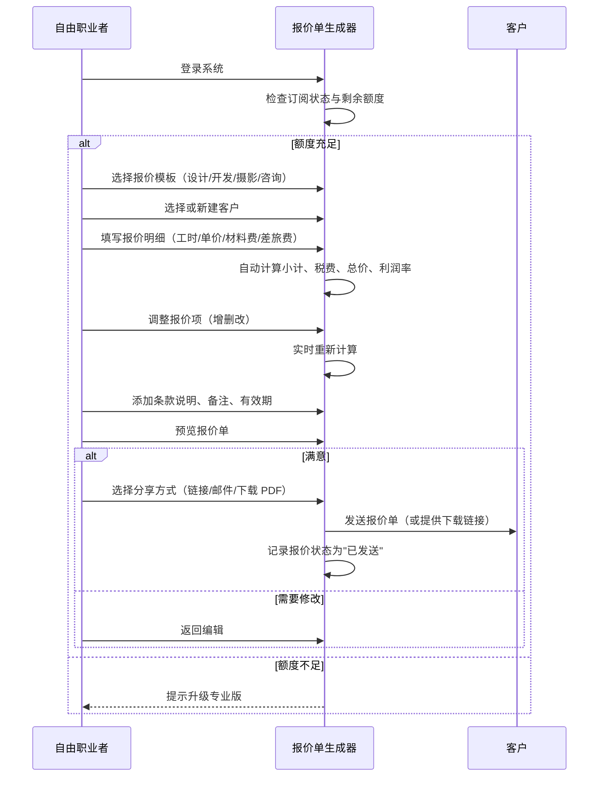
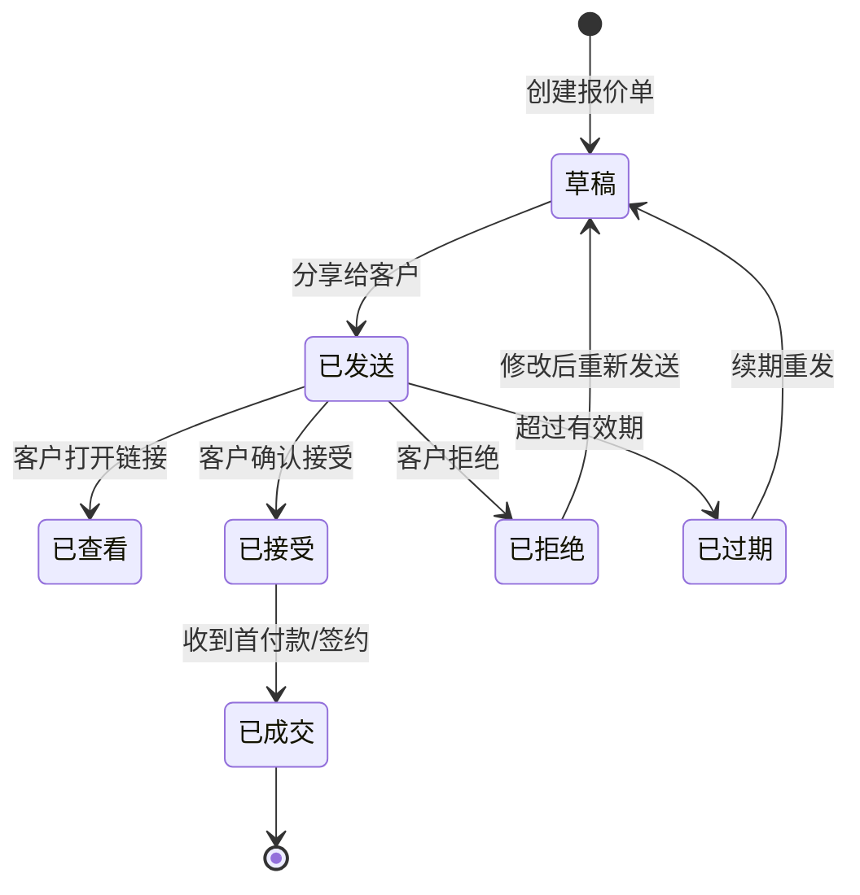
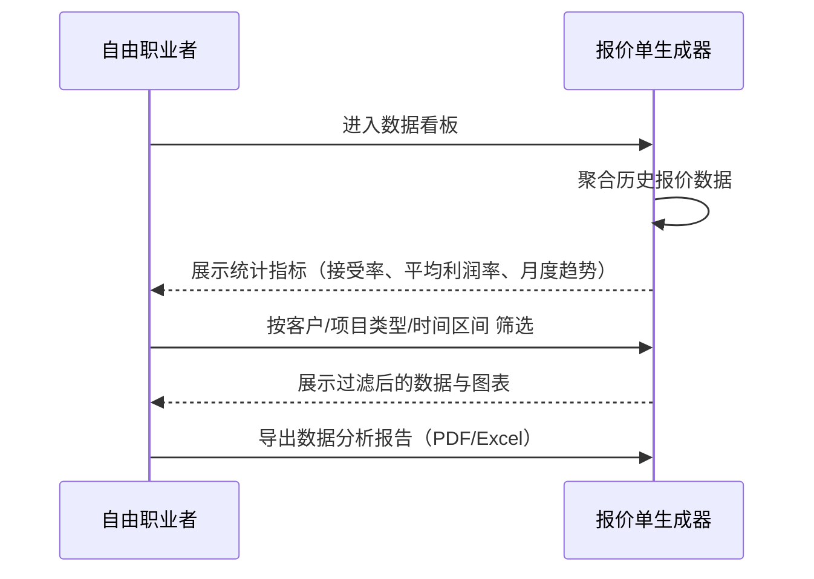
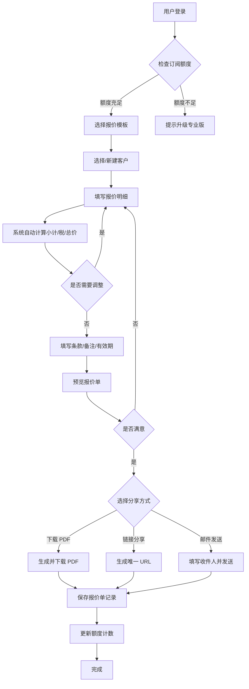
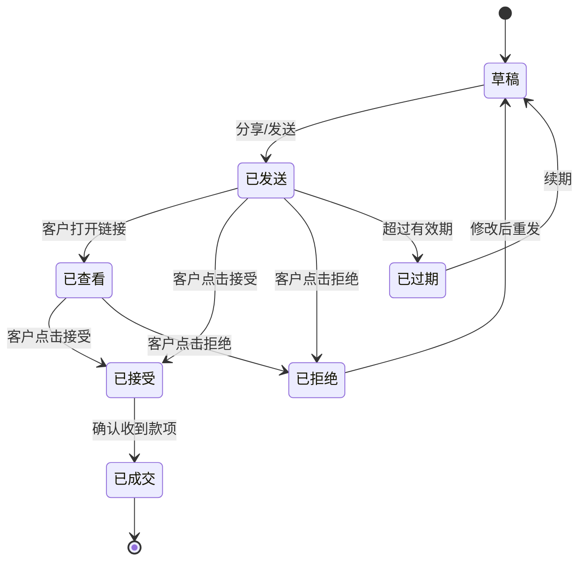
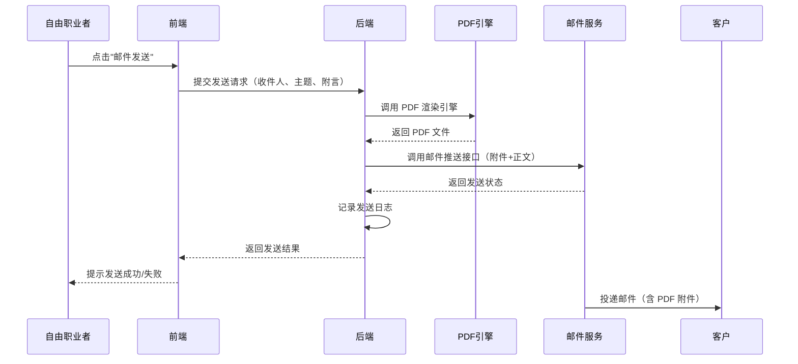
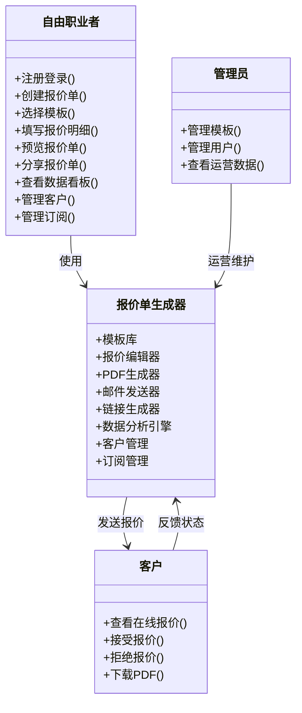
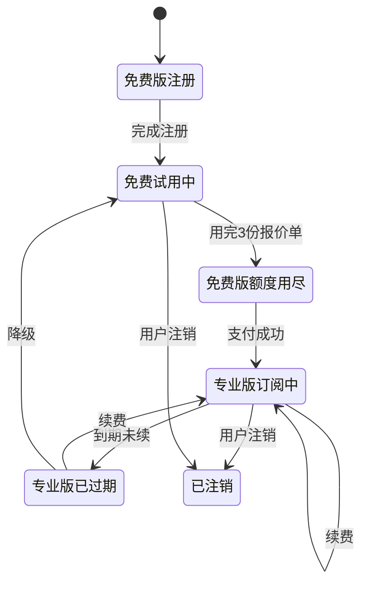

# 自由职业者报价单生成器 - 用户需求说明书（URS）

> 文档版本：v1.0.0
> 创建日期：2026-06-28
> 文档状态：初稿
> 适用产品：自由职业者报价单生成器（以下简称"报价单生成器"）

---

# 1. 需求概述

## 1.1 需求介绍

自由职业者报价单生成器是一款面向独立设计师、程序员、摄影师、翻译、咨询师等自由职业者及小型外包服务商的效率工具。产品聚焦"报价单生成+报价数据分析"这一高频刚需场景，帮助用户快速创建专业报价单、自动计算总价与利润率、生成 PDF 并发送给客户，同时提供历史报价数据分析（客户接受率、平均利润率等），辅助自由职业者优化定价策略。

产品采用 Web 应用形态，以"免费版（每月 3 份报价单）+ 专业版（¥19/月，不限报价单+客户管理+品牌定制+数据分析）"的 SaaS 订阅模式运营。

### 1.1.1 所属领域

效率工具 / 自由职业者服务工具 / 商务报价管理

## 1.2 需求目标

1. **降低报价制作门槛**：让没有任何财务/商务背景的自由职业者也能在 5 分钟内生成一份专业的报价单。
2. **提升报价专业度**：提供按行业分类的报价模板、品牌 Logo 定制、多币种支持、标准化条款说明，使报价单呈现出与专业机构相当的视觉效果。
3. **智能化定价辅助**：通过历史报价数据分析（客户接受率、平均利润率、行业基准对比），帮助用户反思并优化自己的报价策略，避免"报价过低亏本"或"报价过高丢单"。
4. **轻量化运营**：不做通用 CRM 或项目管理，只聚焦"报价"这一个环节，保证 7 天内完成 MVP 交付。

## 1.3 系统使用角色

| 角色 | 描述 | 主要职责 |
|------|------|----------|
| 自由职业者（个人版） | 独立设计师、程序员、摄影师、翻译、咨询师等 | 创建报价单、管理客户、查看报价数据、升级订阅 |
| 小团队负责人 | 小型外包服务商、独立经纪人，可能有多名协作成员 | 除个人版功能外，管理团队成员、查看团队报价数据 |
| 系统管理员 | 平台运营方 | 管理用户账户、订阅、模板库、系统配置 |

## 1.4 业务流程图

### 1.4.1 核心业务流程 - 创建并发送报价单

### 1.4.2 报价状态流转流程

### 1.4.3 数据分析流程

# 2. 功能原型

| 原型名称 | 原型链接 | 对应端 | 备注 |
| --- | --- | --- | --- |
| 报价单生成器 - 主工作台 | 详见同目录 HTML 原型文件 | WEB端 | 包含报价单创建、模板选择、客户管理、数据看板等核心页面 |
| 报价单生成器 - 移动端预览 | 详见同目录 HTML 原型文件 | WEB端 | 响应式适配，支持在移动端查看报价单和数据看板 |

# 3. 需求清单

## 3.1 报价单编辑模块（WEB端）

| 模块 | 一级功能 | 二级功能 | 功能描述 | 备注 |
| --- | --- | --- | --- | --- |
| 模板选择 | 选择报价模板 | 按行业分类浏览模板 | 系统预置设计、开发、摄影、咨询四大类模板，每类含 3-5 套风格模板，用户可按行业快速筛选 | P0 |
| 模板选择 | 选择报价模板 | 预览模板效果 | 用户选择模板前可预览模板的排版效果、包含的默认条款、适配场景 | P0 |
| 模板选择 | 选择报价模板 | 应用模板并继承默认项 | 选定模板后，自动填充该模板的默认条款、货币单位、税率、有效期等配置 | P1 |
| 客户管理 | 客户信息维护 | 新建客户 | 录入客户名称、联系方式、邮箱、公司名称、地址等基本信息 | P0 |
| 客户管理 | 客户信息维护 | 编辑客户信息 | 修改已有客户的联系信息 | P1 |
| 客户管理 | 客户信息维护 | 客户列表与搜索 | 以列表形式展示所有客户，支持按名称、公司、邮箱模糊搜索 | P0 |
| 客户管理 | 客户信息维护 | 客户历史报价查看 | 点击客户可查看该客户的所有历史报价记录 | P1（专业版） |
| 报价编辑 | 报价明细录入 | 添加报价条目 | 支持按行添加报价项，每行包含：项目名称、描述、单位（小时/天/件）、数量、单价 | P0 |
| 报价编辑 | 报价明细录入 | 材料费条目 | 支持添加材料费条目（如印刷品、器材租赁等），按"名称+数量+单价"录入 | P0 |
| 报价编辑 | 报价明细录入 | 差旅费条目 | 支持添加差旅费条目（交通、住宿、餐饮补贴），按"项目+金额"录入 | P1 |
| 报价编辑 | 报价明细录入 | 折扣与优惠 | 支持对整单或单项设置折扣（百分比或固定金额） | P1 |
| 报价编辑 | 自动计算 | 小计自动汇总 | 实时计算每个条目的金额（数量 × 单价），并汇总所有条目小计 | P0 |
| 报价编辑 | 自动计算 | 税费计算 | 支持配置税率（默认 0%），自动计算税额和含税总价 | P0 |
| 报价编辑 | 自动计算 | 利润率计算 | 用户可录入预估成本，系统自动计算预估利润率（= (总价-成本)/总价 × 100%） | P1 |
| 报价编辑 | 自动计算 | 多币种支持 | 支持 CNY、USD、EUR、JPY、HKD 等主流货币，按用户选择的货币显示总价 | P1（专业版） |
| 报价编辑 | 报价信息完善 | 填写条款说明 | 用户可编辑报价单附带的条款说明（付款方式、有效期、修改次数限制等） | P0 |
| 报价编辑 | 报价信息完善 | 设置有效期 | 设置报价单的有效期限（默认 30 天，可自定义） | P1 |
| 报价编辑 | 报价信息完善 | 添加备注 | 给报价单添加内部备注（仅自己可见）或给客户的公开备注 | P1 |
| 报价编辑 | 品牌定制 | 上传 Logo | 用户上传个人/公司 Logo，显示在报价单顶部（专业版功能） | P1（专业版） |
| 报价编辑 | 品牌定制 | 品牌配色 | 设置报价单的主色调（标题色、强调色），体现个人品牌风格（专业版功能） | P2（专业版） |
| 报价编辑 | 保存与版本 | 保存为草稿 | 报价单可随时保存为草稿，下次继续编辑 | P0 |
| 报价编辑 | 保存与版本 | 版本历史 | 每次修改保存时自动创建版本快照，用户可查看和回滚到历史版本 | P2 |

## 3.2 报价单输出与分享模块（WEB端）

| 模块 | 一级功能 | 二级功能 | 功能描述 | 备注 |
| --- | --- | --- | --- | --- |
| PDF 生成 | 生成专业 PDF | 一键导出 PDF | 将报价单渲染为标准 A4 排版的 PDF 文件，支持下载 | P0 |
| PDF 生成 | 生成专业 PDF | PDF 排版规范 | PDF 包含：Logo、报价编号、日期、客户信息、明细表格、小计/税/总价、条款、页脚签名区 | P0 |
| PDF 生成 | 生成专业 PDF | 水印与防伪 | PDF 包含"已接受""已拒绝""已过期"等状态水印（发送前不带水印） | P2 |
| 链接分享 | 在线查看链接 | 生成唯一链接 | 为每份报价单生成唯一 URL，客户点击后可在浏览器中查看报价详情 | P0 |
| 链接分享 | 在线查看链接 | 链接访问控制 | 链接可设置密码保护（专业版）、访问次数限制、有效期 | P2（专业版） |
| 链接分享 | 在线查看链接 | 客户在线反馈 | 客户通过链接查看报价单时，可点击"接受""拒绝""咨询"按钮，反馈自动同步到报价单状态 | P1 |
| 邮件发送 | 邮件直发 | 填写收件人并发送 | 用户在系统内填写客户邮箱、主题、附言，系统将报价单 PDF 作为附件发送 | P1 |
| 邮件发送 | 邮件直发 | 邮件模板 | 预置 3-5 套发送报价单的邮件模板（正式/友好/简洁风格），用户可快速套用 | P2 |
| 邮件发送 | 邮件直发 | 发送状态追踪 | 邮件是否送达、客户是否打开查看，状态实时反馈给用户 | P2（专业版） |

## 3.3 数据分析模块（WEB端）

| 模块 | 一级功能 | 二级功能 | 功能描述 | 备注 |
| --- | --- | --- | --- | --- |
| 数据看板 | 核心指标展示 | 报价接受率 | 展示"已接受/已发送"的比率，按月度/季度/年度统计 | P0（专业版） |
| 数据看板 | 核心指标展示 | 平均利润率 | 展示历史报价的平均利润率，并标注利润率最高/最低的报价单 | P0（专业版） |
| 数据看板 | 核心指标展示 | 报价总金额 | 展示累计报价金额、已成交金额、待成交金额 | P0（专业版） |
| 数据看板 | 趋势图表 | 月度报价趋势 | 折线图展示每月报价数量、总金额、接受率的变化趋势 | P1（专业版） |
| 数据看板 | 趋势图表 | 项目类型分布 | 饼图展示不同项目类型（设计/开发/摄影/咨询）的报价占比 | P1（专业版） |
| 数据看板 | 趋势图表 | 客户集中度分析 | 展示 Top 客户贡献的报价金额占比，识别核心客户 | P2（专业版） |
| 数据分析 | 多维度筛选 | 按时间区间筛选 | 支持按周/月/季度/年/自定义时间区间查看数据 | P1（专业版） |
| 数据分析 | 多维度筛选 | 按客户筛选 | 查看某个客户的所有历史报价数据 | P1（专业版） |
| 数据分析 | 多维度筛选 | 按项目类型筛选 | 查看某一类项目（如"UI 设计"）的历史报价表现 | P1（专业版） |
| 数据分析 | 数据导出 | 导出分析报告 | 将筛选后的数据导出为 PDF 分析报告或 Excel 数据表 | P2（专业版） |
| 数据分析 | 智能建议 | 定价建议 | 基于用户历史报价的接受率，提示"当前类型项目报价偏高/偏低，建议调整 ±X%" | P2 |

## 3.4 账户与订阅模块（WEB端）

| 模块 | 一级功能 | 二级功能 | 功能描述 | 备注 |
| --- | --- | --- | --- | --- |
| 账户管理 | 注册登录 | 手机号注册 | 用户通过手机号 + 短信验证码注册账户 | P0 |
| 账户管理 | 注册登录 | 微信快捷登录 | 支持微信扫码或手机号快捷登录 | P1 |
| 账户管理 | 注册登录 | 密码登录 | 支持手机号 + 密码的传统登录方式 | P1 |
| 账户管理 | 个人资料 | 编辑个人信息 | 修改姓名、头像、联系方式、所在行业等 | P1 |
| 账户管理 | 个人资料 | 修改密码 | 修改登录密码 | P1 |
| 订阅管理 | 版本查看 | 当前版本展示 | 显示当前订阅版本（免费版/专业版）、到期日、剩余额度 | P0 |
| 订阅管理 | 订阅升级 | 升级到专业版 | 支持按月/按年订阅专业版（¥19/月 或 ¥190/年） | P0 |
| 订阅管理 | 订阅升级 | 支付方式 | 支持微信支付、支付宝支付 | P1 |
| 订阅管理 | 订阅降级 | 降级到免费版 | 用户可主动降级，当前周期结束后生效 | P2 |
| 订阅管理 | 用量提醒 | 免费版额度提醒 | 每月使用 2 份报价单时提醒"仅剩 1 份额度"，用完时提示升级 | P0 |
| 订阅管理 | 用量提醒 | 月度用量重置 | 每月 1 日 0 点自动重置免费版的 3 份额度 | P0 |
| 账户管理 | 数据合规 | 数据导出 | 用户可导出自己所有的报价单数据（JSON/CSV） | P1 |
| 账户管理 | 数据合规 | 账户注销 | 用户可申请注销账户，30 天内彻底删除所有数据 | P1 |

## 3.5 系统管理模块（后台服务）

| 模块 | 一级功能 | 二级功能 | 功能描述 | 备注 |
| --- | --- | --- | --- | --- |
| 模板管理 | 模板维护 | 模板增删改 | 管理员可新增、编辑、下架报价模板 | P0 |
| 模板管理 | 模板维护 | 模板分类管理 | 维护模板的所属行业分类（设计/开发/摄影/咨询/自定义） | P1 |
| 用户管理 | 用户查看 | 用户列表 | 查看所有注册用户及其订阅状态 | P0 |
| 用户管理 | 用户查看 | 用户详情 | 查看单个用户的报价单数量、订阅信息、登录日志 | P1 |
| 运营数据 | 平台统计 | 平台级数据看板 | 展示平台总用户数、活跃用户数、订阅转化率、总收入等 | P1 |
| 运营数据 | 平台统计 | 模板使用排行 | 展示各模板的使用次数排行，辅助模板运营决策 | P2 |

# 4. 非功能需求

## 4.1 使用界面需求

| 编号 | 界面需求 | 描述 |
|------|----------|------|
| UI-1 | 简洁直观 | 报价单编辑页面采用"左侧表单+右侧实时预览"布局，所见即所得 |
| UI-2 | 快速上手 | 新用户首次进入时提供 3 步引导（选模板 → 填明细 → 发送） |
| UI-3 | 响应式适配 | 桌面端（主要）+ 平板端（查看/轻编辑）+ 移动端（仅查看报价单和数据看板） |
| UI-4 | 主题风格 | 提供浅色/深色两种主题，默认浅色 |
| UI-5 | 国际化预留 | 界面文案采用 i18n 方案，首版仅支持简体中文，预留多语言扩展能力 |

## 4.2 软硬件环境需求

| 维度 | 要求 |
|------|------|
| 浏览器 | Chrome 90+、Safari 14+、Edge 90+、Firefox 88+ |
| 移动端 | iOS 14+（Safari）、Android 10+（Chrome） |
| 屏幕分辨率 | 最小支持 1280×720，推荐 1920×1080 |
| 网络环境 | 需联网使用（云端 SaaS），PDF 生成与邮件发送依赖服务端 |
| 客户端安装 | 无需安装，浏览器直接访问 |

## 4.3 性能需求

| 指标 | 要求 |
|------|------|
| 页面首屏加载 | ≤ 2 秒（国内 CDN 加速） |
| 报价单编辑响应 | 输入后实时计算延迟 ≤ 200ms |
| PDF 生成 | ≤ 5 秒（10 页以内） |
| 邮件发送 | 提交后 ≤ 30 秒送达（含附件） |
| 数据看板加载 | ≤ 3 秒（1000 条历史报价数据量级） |
| 并发支持 | MVP 阶段支持 500 并发用户 |
| 系统可用性 | ≥ 99.5%（月度） |

## 4.4 约束性需求

1. **本系统不实现通用 CRM 功能**：不做客户跟进记录、销售漏斗、合同管理等重功能，仅保留报价相关的客户基础信息管理。
2. **本系统不实现项目管理功能**：不做任务分配、进度跟踪、工时记录等，只聚焦报价环节。
3. **PDF 生成必须以服务端渲染为主**：确保不同浏览器、不同设备看到的 PDF 完全一致，避免纯前端渲染的兼容性问题。
4. **邮件发送必须通过第三方邮件服务**（如阿里云邮件推送、SendGrid），不自建邮件服务器。
5. **支付接入必须通过持牌支付渠道**（微信支付、支付宝官方 SDK），不接入个人收款码。
6. **本系统需要后台服务**来支撑用户账户、订阅管理、PDF 生成、邮件发送、数据分析等功能。
7. **免费版每月限额 3 份报价单**：超出后必须引导升级，不得绕过限制。
8. **多币种汇率数据源**：采用第三方汇率 API（如 exchangerate-api.com），每日更新一次，不做实时汇率。

# 5. 接口需求

## 5.1 硬件接口需求

本产品为 Web 应用，无特殊硬件接口需求。

## 5.2 软件接口需求

| 模块 | 接口名称 | 输入 | 输出 | 功能描述 |
| --- | --- | --- | --- | --- |
| 账户管理 | 短信验证码接口 | 手机号 | 6 位验证码 | 调用阿里云/腾讯云短信服务，发送注册/登录验证码 |
| 账户管理 | 微信开放平台接口 | 微信授权码 | 用户 openid、头像、昵称 | 支持微信扫码登录与手机号快捷登录 |
| 订阅管理 | 微信支付接口 | 订单信息、金额 | 支付结果回调 | 处理专业版订阅支付 |
| 订阅管理 | 支付宝支付接口 | 订单信息、金额 | 支付结果回调 | 处理专业版订阅支付 |
| 报价编辑 | 汇率 API 接口 | 基础货币、目标货币 | 实时汇率 | 获取多币种换算汇率，每日更新 |
| 邮件发送 | 邮件推送服务接口 | 收件人、主题、正文、附件 | 发送状态（成功/失败） | 调用阿里云邮件推送 / SendGrid 发送报价单邮件 |
| PDF 生成 | PDF 渲染引擎 | 报价单 HTML/模板数据 | PDF 二进制文件 | 服务端渲染报价单为 A4 排版 PDF |
| 数据分析 | 数据聚合引擎 | 用户报价历史数据 | 统计指标、图表数据 | 后端聚合计算接受率、利润率、趋势数据 |

## 5.4 通讯接口需求

本产品为标准 Web 应用，所有前后端通讯基于 HTTPS 协议，无特殊通讯接口需求。

# 6. 附录

## 流程图

### 6.1 报价单创建全流程

### 6.2 报价单状态机

## 时序图

### 6.3 邮件发送报价单时序

## （用户与系统交互）用例图

## （系统）状态图

### 6.4 订阅状态图

---

**文档变更记录**

| 版本 | 日期 | 变更人 | 变更内容 |
|------|------|--------|----------|
| v1.0.0 | 2026-06-28 | 需求文档结对写作专家 | 初始版本 |
