# 自由职业者报价验收一体化流程 - 产品需求文档（PRD）

| 版本号 | 变更日期 | 变更内容 | 变更人 | 审核人 |
| --- | --- | --- | --- | --- |
| V1.0 | 2026-06-29 | 初始版本创建 | 产品文档结对写作专家 | 阶段一产品落地页文档总编辑 |

---

# 1 概述

## 1.1 需求背景

自由职业者（独立设计师、程序员、摄影师、翻译、咨询师等）在项目交付过程中普遍面临三大痛点：

- **报价靠微信**：报价单通过微信来回沟通，缺少标准化格式，客户口头确认后难以追溯，容易产生纠纷
- **验收靠口头**：交付物验收没有系统化流程，客户说"差不多了"却没留下书面凭证，尾款难收
- **催款靠勇气**：催款尴尬，自由职业者常常不好意思催，导致回款周期长、现金流紧张

现有工具（CRM、项目管理工具、电子签名工具）要么过于复杂，要么只解决单个环节，缺乏针对自由职业者"报价→确认→交付→验收→催款"全链路的轻量化解决方案。本产品聚焦这一高频刚需，以 MVP 5-7 天的节奏切入市场。

## 1.2 名词解释

| 名词 | 说明 |
| --- | --- |
| 报价单 | 自由职业者向客户提供的服务/产品价格清单，包含服务项明细、金额、付款条款、有效期 |
| 验收单 | 项目交付后由自由职业者发起，客户逐项确认交付物是否达标的凭证 |
| 电子签名 | 客户在 H5 页面手写的签名图像（含时间戳 + IP 记录），作为确认/验收的法律依据 |
| 项目看板 | 以看板视图展示所有项目状态，按"报价中→已确认→交付中→待验收→已完成"分组 |
| 催款提醒 | 系统根据付款条款自动发送的付款提醒（站内信 + 邮件） |
| 免费版 | 每月可管理 3 个项目、使用 3 套基础模板、客户"点击确认"的基础版本 |
| 专业版 | 订阅制高级版本（¥29/月），不限项目、电子签名、PDF 导出、数据分析 |
| 分享链接 | 每个报价单生成的唯一访问 URL，客户通过链接查看报价、确认、签名 |

## 1.3 产品介绍

自由职业者报价验收一体化流程是一款聚焦"报价→确认→交付→验收→催款"全链路的轻量 SaaS 工具。自由职业者创建报价单后生成分享链接，客户在线查看、确认并电子签名；项目交付后一键发起验收，客户逐项确认并签署验收单；系统根据账期自动催款，让每一笔交易都有据可查、有章可循。

### 1.3.1 目标用户

- **独立自由职业者**：设计师、程序员、摄影师、翻译、咨询师等，经常需要给客户发报价、做验收的个人从业者
- **小型外包服务商**：3-10 人的小型团队，需要标准化交付流程
- **独立经纪人**：需要管理多个客户项目交付的中间人

### 1.3.2 使用场景

1. **快速报价**：自由职业者收到客户咨询后，5 分钟内创建报价单并发送链接，客户在线确认签名
2. **交付验收**：项目完成后上传交付物、发起验收，客户逐项确认并签署验收单，杜绝交付扯皮
3. **自动催款**：系统根据账期自动提醒客户付款（到期前 3 天、到期当天、逾期后），减轻催款心理负担
4. **项目追踪**：通过项目看板实时了解每个项目的当前状态，不再漏跟进

### 1.3.3 核心价值

- **交付闭环**：报价→确认→交付→验收→催款五步串联，替代"微信+Excel+邮件"碎片化组合
- **交易留痕**：每次确认、验收、签名均带时间戳与 IP 记录，杜绝口头扯皮
- **自动催款**：系统代替自由职业者开口，减少催款尴尬
- **低成本可用**：免费版满足低频需求，专业版 ¥29/月提供完整能力

### 1.3.4 范围说明

| 项 | 内容 |
| --- | --- |
| 包含功能 | 报价单创建与管理、客户在线确认与签名、交付物上传与验收、电子签名（手写板）、自动/手动催款、项目状态看板、客户管理、模板管理、套餐管理、数据统计、管理后台 |
| 不包含功能 | 在线支付集成（付款以线下转账+手动确认为主）、通用 IM 聊天、复杂项目管理（甘特图、里程碑、任务分解）、第三方 CA 电子签名认证（MVP 阶段） |

---

# 2 产品设计

## 2.1 系统架构图

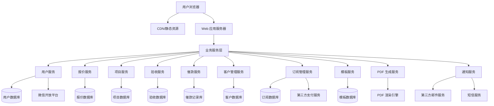

## 2.2 业务模块图

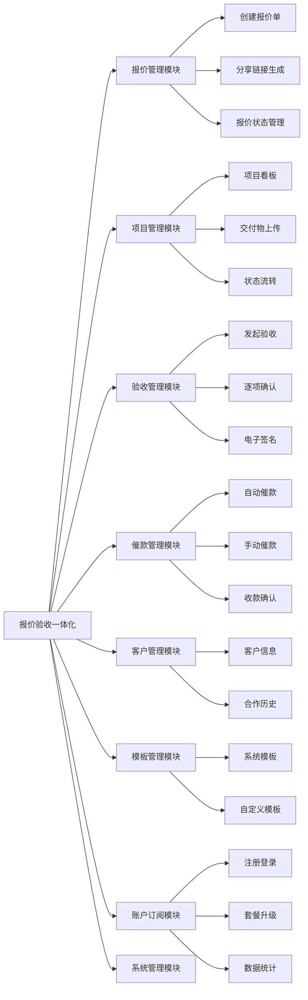

## 2.3 主业务流程

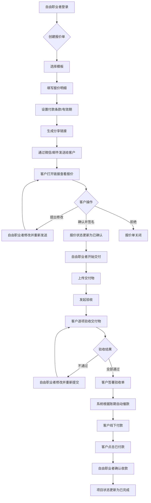

## 2.4 功能图/列表

| 功能模块 | 功能名称 | 优先级 | 功能描述 |
| --- | --- | --- | --- |
| 报价管理 | 创建报价单 | P0 | 选择模板、填写报价明细、设置付款条款与有效期 |
| 报价管理 | 分享链接生成 | P0 | 生成唯一访问链接，支持复制链接与二维码 |
| 报价管理 | 报价状态管理 | P0 | 实时显示报价单状态：待查看/已查看/已确认/已拒绝/已失效 |
| 报价管理 | 修改报价单 | P0 | 客户确认前可随时修改，修改后自动通知客户 |
| 报价管理 | 撤回/复制/删除 | P1 | 支持撤回已发送报价、基于历史报价快速创建、删除草稿 |
| 项目管理 | 项目看板 | P0 | 按状态分组展示所有项目：报价中→已确认→交付中→待验收→已完成 |
| 项目管理 | 状态流转 | P0 | 手动推进项目状态，部分状态由系统自动流转 |
| 项目管理 | 项目筛选/搜索 | P1 | 按状态、客户、时间、金额筛选，关键词搜索 |
| 项目管理 | 交付物上传 | P0 | 支持上传图片、文档、压缩包，可分多次上传 |
| 项目管理 | 发起验收 | P0 | 选择已上传交付物生成验收清单，推送给客户 |
| 项目管理 | 验收结果查看 | P0 | 查看客户逐项验收结果及反馈意见 |
| 催款管理 | 自动催款 | P0 | 根据付款条款自动发送催款提醒（到期前 3 天、到期当天、逾期后） |
| 催款管理 | 手动催款 | P1 | 自由职业者可一键手动发送催款提醒 |
| 催款管理 | 收款确认 | P0 | 客户线下付款后手动确认收款 |
| 催款管理 | 催款记录 | P1 | 查看每个项目的催款历史 |
| 客户管理 | 客户列表 | P0 | 展示客户基本信息、历史合作次数、累计金额 |
| 客户管理 | 添加客户 | P0 | 手动添加或报价确认后自动沉淀 |
| 客户管理 | 客户标签 | P2 | 给客户打标签（优质客户、需催款等） |
| 客户端 H5 | 查看报价 | P0 | 客户通过链接查看报价明细，无需注册 |
| 客户端 H5 | 提出修改 | P1 | 对报价单提出修改意见 |
| 客户端 H5 | 电子签名 | P0 | 手写签名确认报价（专业版），免费版使用点击确认 |
| 客户端 H5 | 逐项验收 | P0 | 对每个交付项标记通过/不通过，填写反馈 |
| 客户端 H5 | 签署验收单 | P0 | 全部通过后手写签名确认验收（专业版） |
| 客户端 H5 | 付款确认 | P0 | 客户线下转账后点击已付款通知自由职业者 |
| 模板管理 | 系统模板浏览 | P0 | 查看系统提供的基础模板（免费版 3 套，专业版 10+ 套） |
| 模板管理 | 自定义模板 | P1 | 创建/编辑/删除自定义模板（专业版） |
| 个人中心 | 注册/登录 | P0 | 手机号+验证码注册登录，微信扫码登录 |
| 个人中心 | 个人信息 | P0 | 修改头像、昵称、联系方式、个人简介 |
| 个人中心 | 套餐管理 | P0 | 查看当前套餐、升级专业版（¥29/月）、续费 |
| 个人中心 | 数据统计 | P0 | 项目统计、客户分析、导出报表（专业版） |
| 管理后台 | 用户管理 | P0 | 用户列表、详情、封禁/解封 |
| 管理后台 | 套餐管理 | P0 | 配置免费版与专业版权益、订单管理 |
| 管理后台 | 模板管理 | P0 | 系统模板增删改查 |
| 管理后台 | 数据统计 | P1 | 平台注册用户数、活跃用户数、付费转化率、GMV |
| 管理后台 | 系统设置 | P1 | 邮件 SMTP 配置、通知模板 |

## 2.5 你的产品有哪些端

| 序号 | 端名称 | 端类型 | 目标用户 | 说明 |
| --- | --- | --- | --- | --- |
| 1 | 自由职业者端 WEB | WEB端 | 自由职业者、小团队负责人 | 主要使用端，包含报价管理、项目看板、交付验收、客户管理、模板管理、个人中心 |
| 2 | 客户端 H5 | WEB端（H5 自适应） | 报价单/验收单接收客户 | 通过链接访问，无需注册，查看报价、在线确认、电子签名、逐项验收、付款确认 |
| 3 | 管理后台 | WEB端 | 系统管理员 | 用户管理、套餐管理、模板管理、数据统计、系统设置 |

---

# 3 产品功能

## 3.1 自由职业者端 WEB 功能

### 3.1.1 用户注册与登录

功能描述：用户通过手机号+短信验证码注册账户，或使用微信快捷登录。新用户首次登录后引导完成 3 步入门流程（选模板 → 填报价 → 分享链接）。

| 项 | 内容 |
| --- | --- |
| 优先级 | P0 |
| 依赖需求 | 无 |
| 前置条件 | 用户需有手机号和能接收短信的设备 |

### 3.1.2 用户注册与登录—详细流程

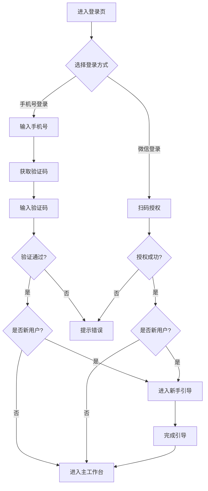

业务规则说明：
1. 验证码有效期 5 分钟，每日发送上限 10 次
2. 新用户首次登录自动创建账户，无需额外注册流程
3. 微信登录需绑定手机号（首次登录时要求输入手机号）
4. 登录状态保持 7 天

### 3.1.3 报价单创建与编辑

功能描述：选择模板后进入报价编辑页，填写客户信息、添加服务项明细（名称、描述、数量、单价）、设置付款条款（预付款比例、尾款期限、逾期利率）和有效期，系统自动计算小计和总价。

| 项 | 内容 |
| --- | --- |
| 优先级 | P0 |
| 依赖需求 | 模板选择 |
| 前置条件 | 用户已登录 |

### 3.1.4 报价单创建—详细流程

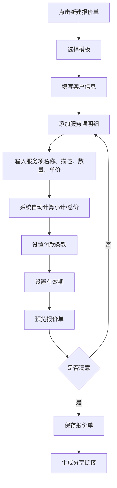

业务规则说明：
1. 服务项小计 = 数量 × 单价
2. 总价 = 所有服务项小计之和
3. 预付款比例默认为 50%，可自定义
4. 默认有效期 30 天
5. 报价单保存后状态为"草稿"，分享后变为"已发送"
6. 免费版单文件上传 ≤ 20MB，专业版 ≤ 200MB

### 3.1.5 分享链接生成

功能描述：为每个报价单生成唯一访问链接，支持复制链接、生成二维码。客户通过链接查看报价、确认、签名。

| 项 | 内容 |
| --- | --- |
| 优先级 | P0 |
| 依赖需求 | 报价单已保存 |
| 前置条件 | 报价单已保存 |

### 3.1.6 分享链接生成—详细流程

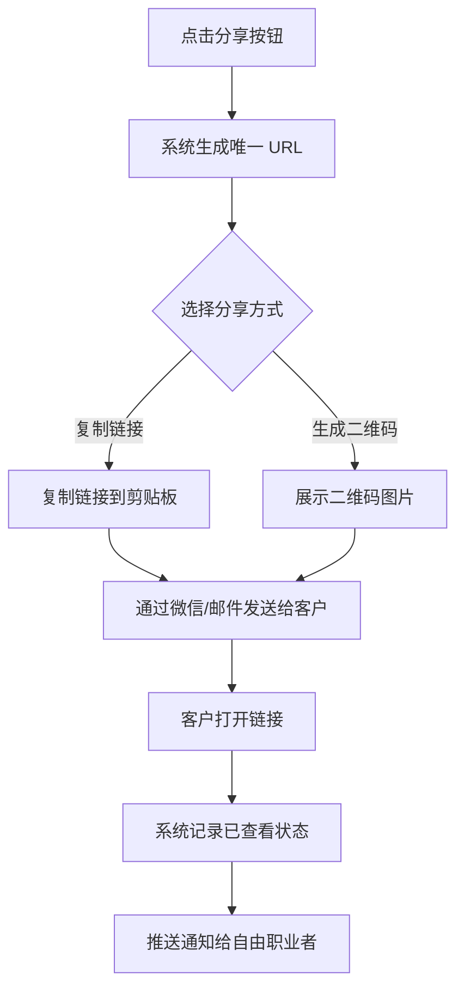

业务规则说明：
1. 链接 URL 格式：`https://domain.com/quote/{unique_token}`
2. 客户打开链接时系统自动记录"已查看"状态
3. 超过有效期后链接显示"报价单已失效"
4. 已确认的报价单链接不可再修改

### 3.1.7 项目看板

功能描述：以看板形式展示所有项目，按状态分组：报价中→已确认→交付中→待验收→已完成。支持手动推进状态、筛选、搜索。

| 项 | 内容 |
| --- | --- |
| 优先级 | P0 |
| 依赖需求 | 报价单已创建 |
| 前置条件 | 用户已登录 |

### 3.1.8 项目看板—详细流程

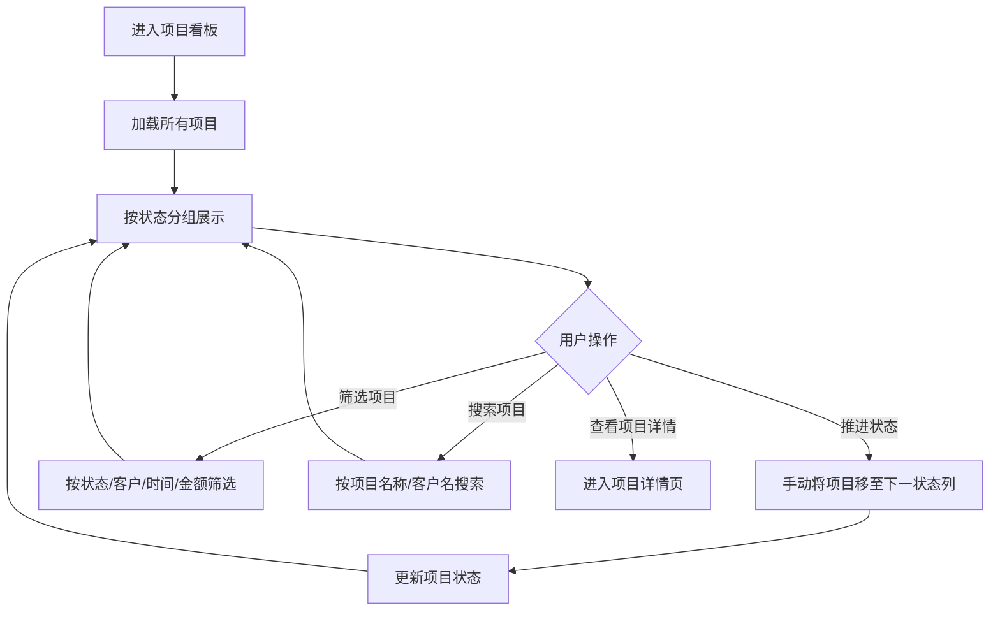

业务规则说明：
1. 项目状态自动流转场景：客户确认报价 → 自动变为"已确认"；验收通过 → 自动变为"待付款"；确认收款 → 自动变为"已完成"
2. 手动推进场景：自由职业者可手动将"已确认"推进到"交付中"
3. 看板卡片显示：项目名称、客户名称、金额、当前状态、停留天数
4. 专业版支持拖拽卡片在不同状态列之间移动

### 3.1.9 交付物上传与验收发起

功能描述：上传交付物（图片、文档、压缩包），选择需要验收的交付物生成验收清单，推送给客户。

| 项 | 内容 |
| --- | --- |
| 优先级 | P0 |
| 依赖需求 | 项目状态为"已确认"或"交付中" |
| 前置条件 | 项目已创建 |

### 3.1.10 交付物上传—详细流程

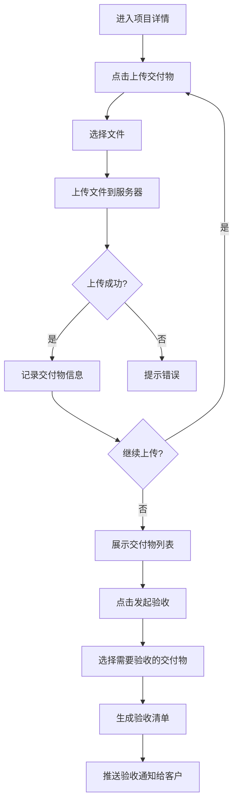

业务规则说明：
1. 支持的文件类型：图片（jpg/png/gif）、文档（pdf/doc/xlsx/ppt）、压缩包（zip/rar）
2. 免费版单文件 ≤ 20MB，专业版 ≤ 200MB
3. 支持分多次上传，每次上传后追加到交付物列表
4. 验收清单可包含验收说明、验收标准
5. 客户收到验收通知（站内信 + 邮件）

### 3.1.11 催款管理

功能描述：根据付款条款自动发送催款提醒（到期前 3 天、到期当天、逾期后），支持手动催款、收款确认、查看催款记录。

| 项 | 内容 |
| --- | --- |
| 优先级 | P0 |
| 依赖需求 | 项目状态为"待付款" |
| 前置条件 | 项目已验收通过 |

### 3.1.12 催款管理—详细流程

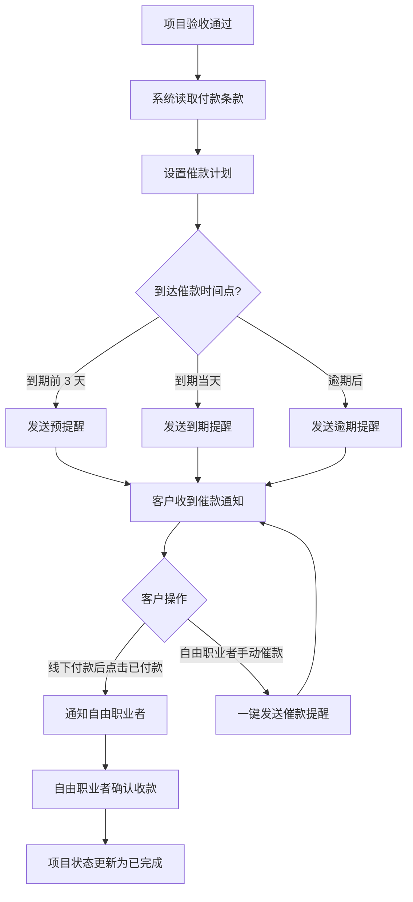

业务规则说明：
1. 催款方式：站内信 + 邮件（短信 MVP 阶段不实现）
2. 催款时间节点：到期前 3 天、到期当天、逾期后每隔 3 天
3. 逾期提醒文案更强烈，可自定义催款模板
4. 自由职业者可随时手动发送催款提醒
5. 客户点击"已付款"后，自由职业者收到通知并手动确认收款

### 3.1.13 客户管理

功能描述：展示客户列表（姓名、联系方式、历史合作次数、累计金额），支持添加客户、搜索、查看合作历史、打标签。

| 项 | 内容 |
| --- | --- |
| 优先级 | P0 |
| 依赖需求 | 无 |
| 前置条件 | 用户已登录 |

### 3.1.14 客户管理—详细流程

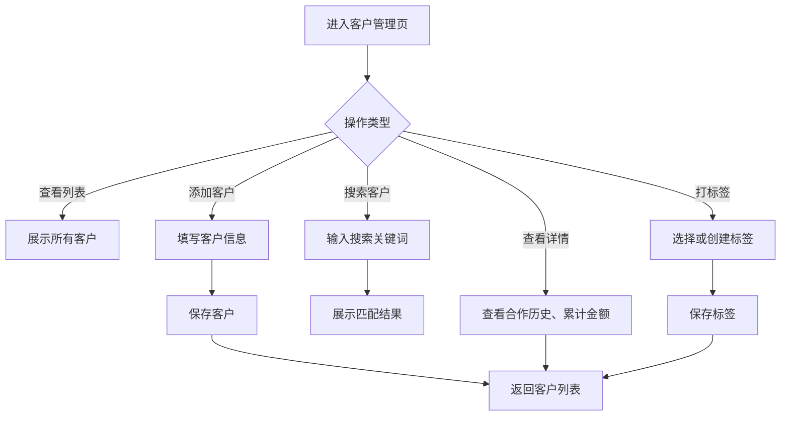

业务规则说明：
1. 报价单被确认后，客户信息自动沉淀到客户列表
2. 客户标签预设："优质客户""需催款""长期合作"等，支持自定义
3. 客户删除采用软删除，数据保留 30 天

### 3.1.15 模板管理

功能描述：查看系统提供的基础模板（免费版 3 套，专业版 10+ 套），专业版用户可创建、编辑、删除自定义模板。

| 项 | 内容 |
| --- | --- |
| 优先级 | P0 |
| 依赖需求 | 无 |
| 前置条件 | 用户已登录 |

### 3.1.16 模板管理—详细流程

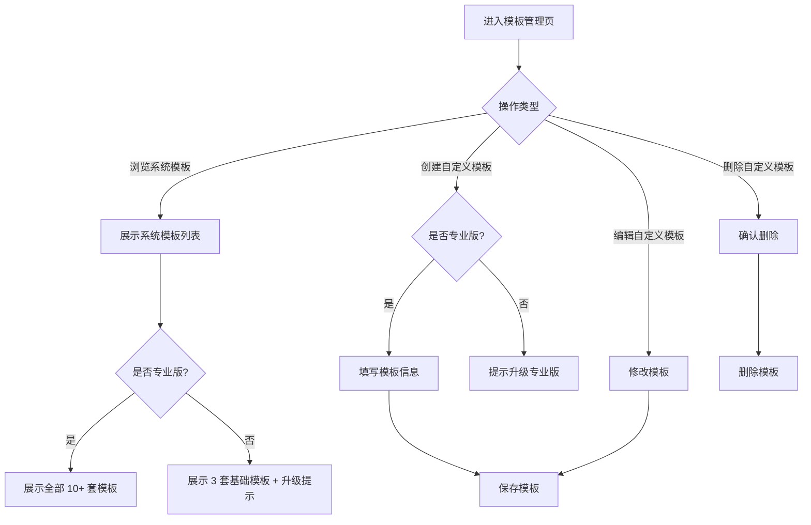

业务规则说明：
1. 系统模板按行业分类：设计类、开发类、咨询类、摄影类
2. 自定义模板为专业版功能
3. 模板包含：名称、默认条款、适用场景

### 3.1.17 套餐管理

功能描述：查看当前套餐类型、剩余项目数、到期时间。支持升级至专业版（¥29/月），展示权益对比。

| 项 | 内容 |
| --- | --- |
| 优先级 | P0 |
| 依赖需求 | 无 |
| 前置条件 | 用户已登录 |

### 3.1.18 套餐管理—详细流程

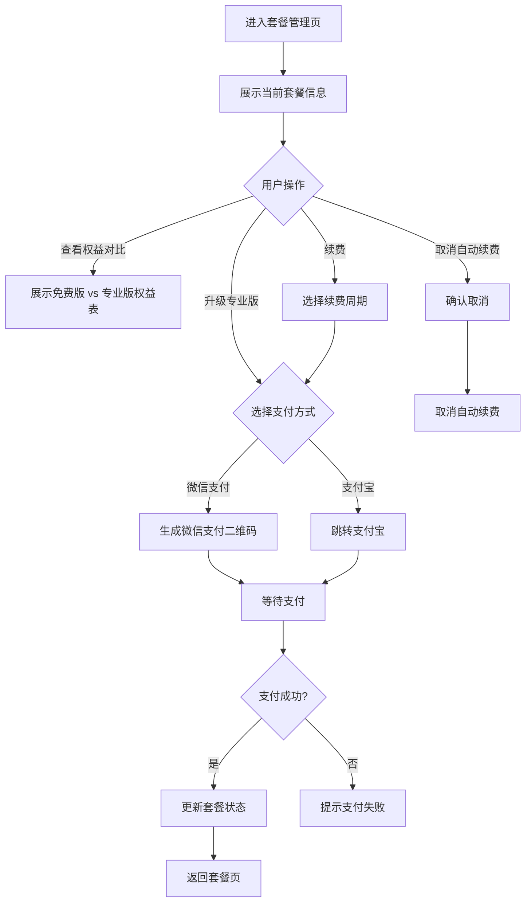

业务规则说明：
1. 免费版每月 3 个项目额度
2. 使用 2 个项目时显示"仅剩 1 个项目额度"提醒
3. 用完 3 个项目后，创建新项目时提示升级
4. 专业版不限项目数量
5. 专业版 ¥29/月，按年付 ¥290/年（享 84 折）
6. 每月 1 日 0 点自动重置免费版额度

### 3.1.19 数据统计

功能描述：统计本月/本季/本年收入、项目数、回款率。客户分析：复购率、平均客单价、验收周期。支持导出 PDF/Excel 报表。

| 项 | 内容 |
| --- | --- |
| 优先级 | P0（专业版） |
| 依赖需求 | 历史项目数据 |
| 前置条件 | 用户已登录，且为专业版用户 |

### 3.1.20 数据统计—详细流程

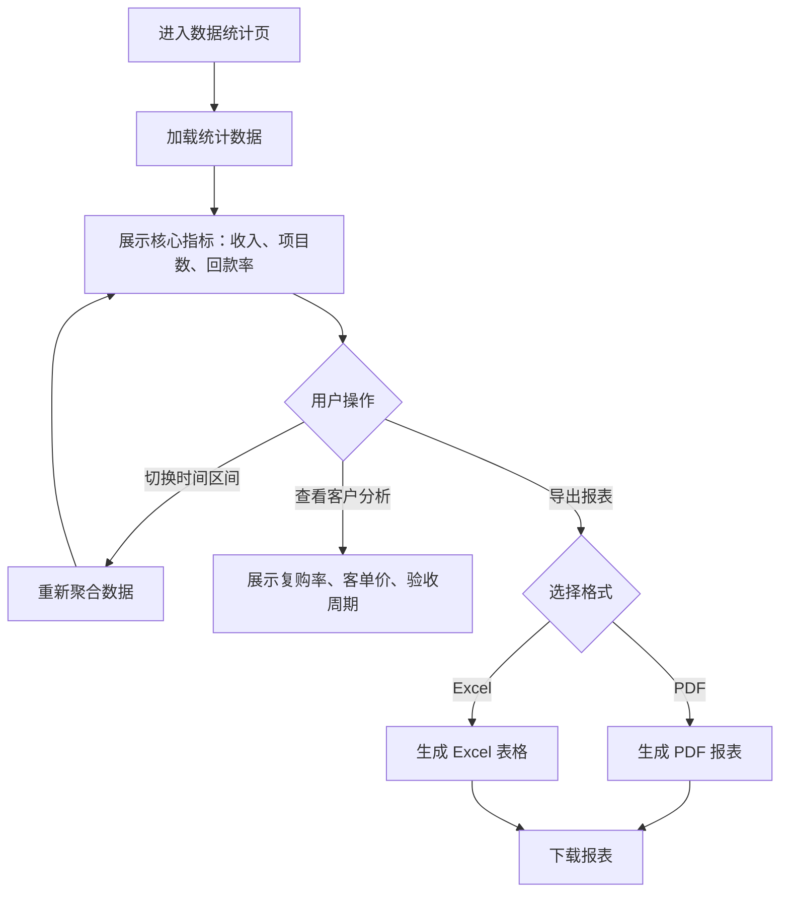

业务规则说明：
1. 数据统计为专业版功能，免费版用户查看时提示升级
2. 核心指标实时更新
3. 客户分析包含：复购率、平均客单价、平均验收周期
4. 数据导出包含筛选后的所有数据

## 3.2 客户端 H5 功能

### 3.2.1 查看报价单

功能描述：客户通过分享链接查看报价单详情，包含报价编号、服务方信息、服务项明细、总价、付款条款、有效期。支持提出修改意见。

| 项 | 内容 |
| --- | --- |
| 优先级 | P0 |
| 依赖需求 | 报价单已分享 |
| 前置条件 | 拥有有效的报价单链接 |

### 3.2.2 查看报价单—详细流程

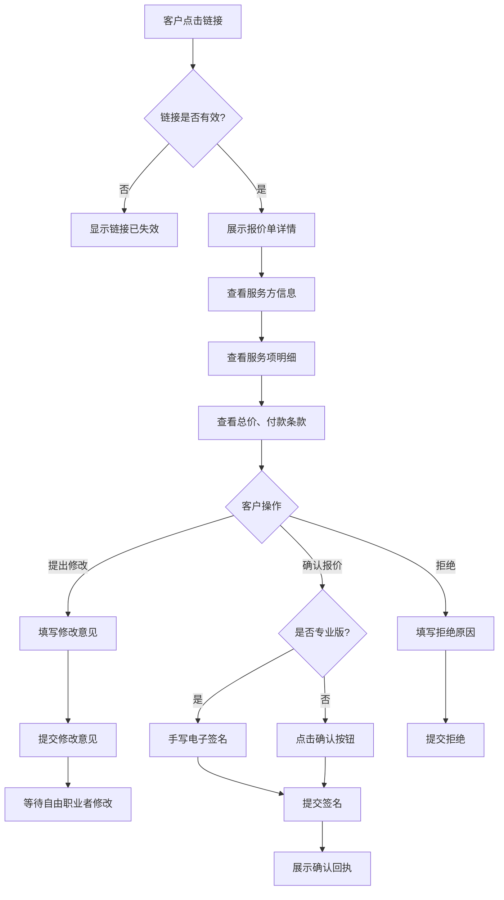

业务规则说明：
1. 链接有效期由报价单设置决定（默认 30 天）
2. 超过有效期显示"报价单已失效"
3. 专业版：客户手写电子签名（签名板 Canvas）
4. 免费版：客户点击"确认"按钮（无签名）
5. 签名数据包含：签名图像 + 时间戳 + 客户 IP
6. 客户打开链接时，系统记录"已查看"状态

### 3.2.3 查看报价单—主要原型

[客户查看端原型](assets/prototypes/client-view-prototype.html)

验收标准说明：
- [ ] 正常流程：客户打开链接后可查看完整报价单信息，可点击确认/拒绝按钮
- [ ] 异常流程：链接失效时显示友好提示
- [ ] 性能要求：页面加载 ≤ 2 秒

### 3.2.4 逐项验收

功能描述：客户查看自由职业者提交的所有交付物列表，逐项标记"通过"或"不通过"，对不通过项填写反馈原因。全部通过后签署验收单。

| 项 | 内容 |
| --- | --- |
| 优先级 | P0 |
| 依赖需求 | 验收已发起 |
| 前置条件 | 拥有有效的验收链接 |

### 3.2.5 逐项验收—详细流程

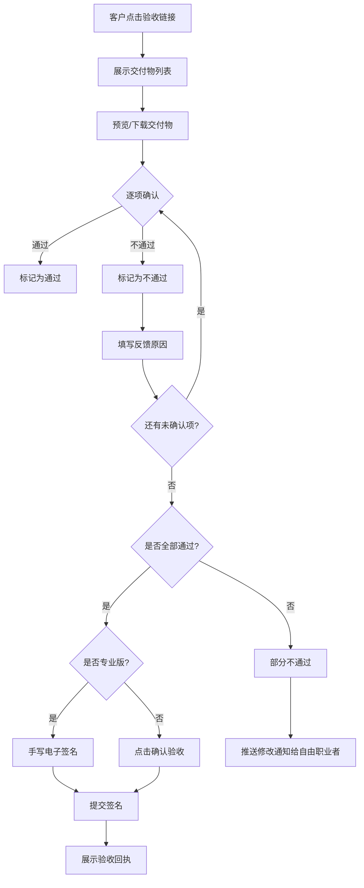

业务规则说明：
1. 交付物支持在线预览（图片直接展示，PDF/文档预览）
2. 支持打包下载全部交付物（ZIP）
3. 每项必须标记"通过"或"不通过"才能提交
4. 专业版：客户手写电子签名确认验收
5. 免费版：客户点击"确认验收"按钮
6. 验收通过后，项目状态自动变为"待付款"

### 3.2.6 付款确认

功能描述：客户查看待付款项目及金额、账期。线下转账后点击"已付款"通知自由职业者。

| 项 | 内容 |
| --- | --- |
| 优先级 | P0 |
| 依赖需求 | 项目状态为"待付款" |
| 前置条件 | 验收已通过 |

### 3.2.7 付款确认—详细流程

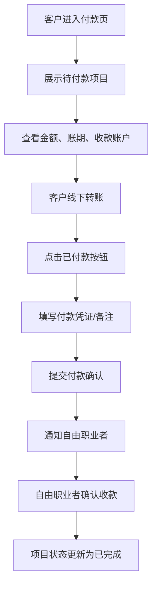

业务规则说明：
1. 不做在线支付集成，付款以线下转账为主
2. 客户可上传付款凭证（截图）
3. 提交后自由职业者收到通知
4. 自由职业者手动确认收款后项目关闭

## 3.3 管理后台功能

### 3.3.1 用户管理

功能描述：查看所有注册用户信息、套餐状态、注册时间。查看用户详情（项目统计、套餐历史）。支持封禁/解封违规用户。

| 项 | 内容 |
| --- | --- |
| 优先级 | P0 |
| 依赖需求 | 无 |
| 前置条件 | 管理员已登录 |

### 3.3.2 用户管理—详细流程

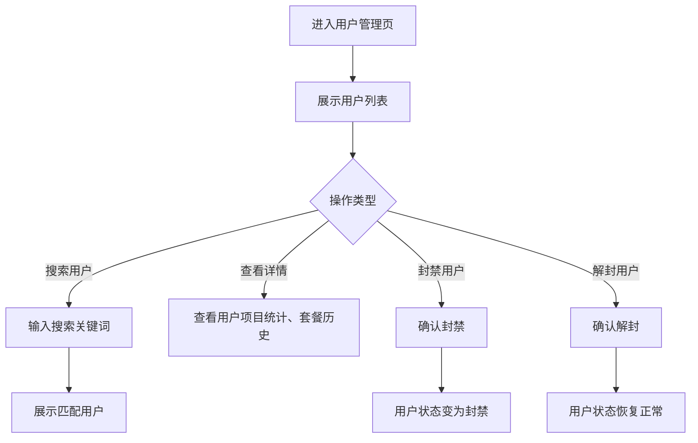

业务规则说明：
1. 用户列表默认按注册时间倒序
2. 封禁用户无法登录和使用系统
3. 封禁/解封操作记录操作日志

### 3.3.3 套餐管理

功能描述：配置免费版与专业版的权益项及价格。查看专业版订阅订单、续费记录。

| 项 | 内容 |
| --- | --- |
| 优先级 | P0 |
| 依赖需求 | 无 |
| 前置条件 | 管理员已登录 |

### 3.3.4 套餐管理—详细流程

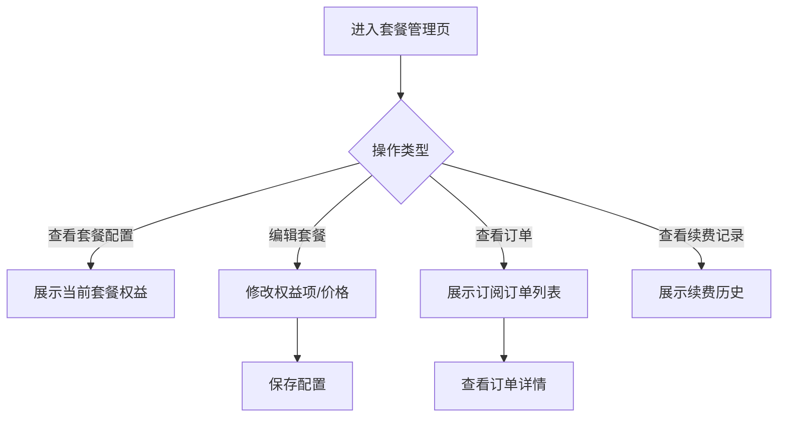

业务规则说明：
1. 套餐权益包含：项目数限制、模板数量、电子签名、PDF 导出、数据分析
2. 价格修改不影响已订阅用户
3. 订单列表包含：用户、套餐类型、金额、订阅时间、到期时间

### 3.3.5 模板管理

功能描述：增删改查系统提供的基础模板。维护模板分类（设计/开发/咨询/摄影）。查看模板使用次数排行。

| 项 | 内容 |
| --- | --- |
| 优先级 | P0 |
| 依赖需求 | 无 |
| 前置条件 | 管理员已登录 |

### 3.3.6 模板管理—详细流程

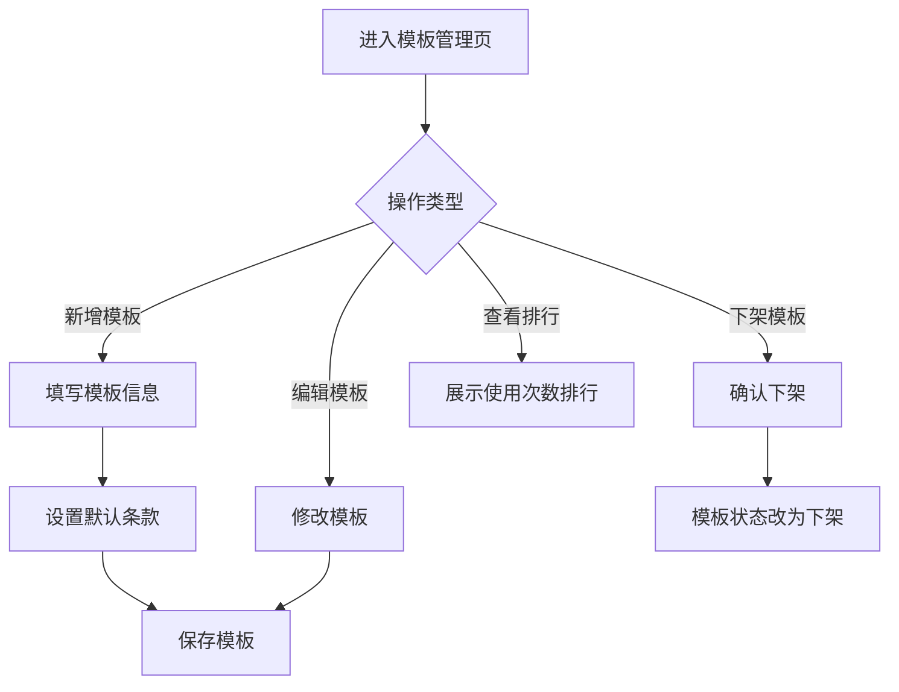

业务规则说明：
1. 每个分类至少保留 3 套模板
2. 下架模板不影响已使用该模板创建的报价单
3. 使用次数排行每日更新

### 3.3.7 数据统计

功能描述：展示平台级数据（注册用户数、活跃用户数、付费转化率、GMV）。

| 项 | 内容 |
| --- | --- |
| 优先级 | P1 |
| 依赖需求 | 无 |
| 前置条件 | 管理员已登录 |

### 3.3.8 数据统计—详细流程

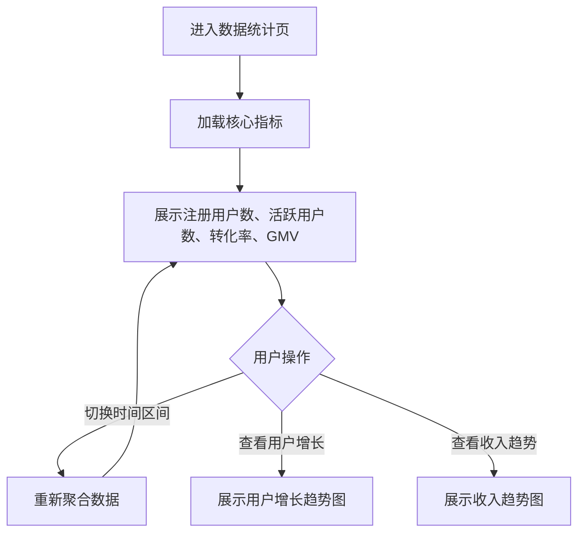

业务规则说明：
1. 活跃用户定义：近 7 天内登录过至少 1 次
2. 付费转化率 = 专业版用户数 / 总用户数 × 100%
3. GMV = 所有订阅订单金额总和

### 3.3.9 系统设置

功能描述：配置催款邮件、通知邮件的 SMTP 参数及模板。

| 项 | 内容 |
| --- | --- |
| 优先级 | P1 |
| 依赖需求 | 无 |
| 前置条件 | 管理员已登录 |

### 3.3.10 系统设置—详细流程

```mermaid
flowchart TD
    A[进入系统设置页] --> B{操作类型}
    B -->|配置邮件| C[填写 SMTP 参数]
    C --> D[测试邮件发送]
    D --> E{发送成功?}
    E -->|是| F[保存配置]
    E -->|否| G[提示错误]
    B -->|编辑通知模板| H[修改邮件模板内容]
    H --> I[保存模板]
```

业务规则说明：
1. SMTP 参数包含：服务器地址、端口、用户名、密码、发件人
2. 支持测试发送功能
3. 通知模板支持变量替换（客户名、项目名、金额等）

---

# 4 产品原型

## 4.1 页面跳转逻辑图

```mermaid
flowchart LR
    A[登录页] --> B[主工作台]
    B --> C[模板选择页]
    C --> D[报价编辑页]
    D --> E[报价预览/分享页]
    B --> F[项目看板页]
    F --> G[项目详情页]
    G --> H[交付物上传页]
    H --> I[验收发起页]
    B --> J[客户管理页]
    B --> K[模板管理页]
    B --> L[个人中心]
    L --> M[套餐管理页]
    M --> N[支付页]
    L --> O[数据统计页]
    P[客户端查看报价] --> Q[签名确认页]
    Q --> R[确认回执页]
    S[客户端验收] --> T[逐项验收页]
    T --> U[签署验收单]
    U --> V[验收回执页]
    W[客户端付款] --> X[付款确认页]
```

## 4.2 全站点原型设计

### 4.2.1 自由职业者端 WEB

**页面清单：**

| 序号 | 页面名称 | 所属模块 | 页面描述 | 关键元素 |
| --- | --- | --- | --- | --- |
| 1 | 登录页 | 账户管理 | 用户登录入口 | 手机号输入框、验证码输入框、登录按钮、微信登录入口 |
| 2 | 主工作台 | 核心功能 | 项目看板、快捷入口 | 项目看板（5 个状态列）、快捷操作卡片、统计摘要 |
| 3 | 报价单列表页 | 报价管理 | 查看所有报价单 | 报价单列表、状态筛选、新建报价单按钮 |
| 4 | 报价编辑页 | 报价管理 | 填写报价明细 | 左侧表单（客户信息、服务项明细）、右侧实时预览、保存/分享按钮 |
| 5 | 报价分享页 | 报价管理 | 分享报价单 | 链接复制、二维码、分享状态追踪 |
| 6 | 项目详情页 | 项目管理 | 查看项目详情 | 项目信息、交付物列表、验收状态、催款记录 |
| 7 | 交付物上传页 | 交付管理 | 上传交付物 | 文件上传区、交付物列表、发起验收按钮 |
| 8 | 客户管理页 | 客户管理 | 管理客户信息 | 客户列表、搜索框、新建客户按钮、标签筛选 |
| 9 | 模板管理页 | 模板管理 | 查看/管理模板 | 系统模板列表、自定义模板、升级提示 |
| 10 | 个人中心页 | 个人中心 | 账户信息 | 个人信息、套餐状态、快捷入口 |
| 11 | 套餐管理页 | 套餐管理 | 管理套餐 | 当前套餐信息、权益对比、升级按钮 |
| 12 | 数据统计页 | 数据统计 | 查看数据 | 核心指标卡片、趋势图表、导出按钮（专业版） |
| 13 | 支付页 | 套餐管理 | 完成订阅支付 | 支付方式选择、支付二维码、订单信息 |

**交互说明：**

- 页面跳转关系：

```mermaid
flowchart LR
    A[登录页] --> B[主工作台/项目看板]
    B --> C[报价单列表页]
    C --> D[报价编辑页]
    D --> E[报价分享页]
    B --> F[项目详情页]
    F --> G[交付物上传页]
    G --> H[验收发起]
    B --> I[客户管理页]
    B --> J[模板管理页]
    B --> K[个人中心页]
    K --> L[套餐管理页]
    L --> M[支付页]
    K --> N[数据统计页]
```

- 特殊交互：
  1. 项目看板支持卡片点击展开详情
  2. 报价编辑页采用"左侧表单+右侧实时预览"布局
  3. 专业版支持拖拽卡片在不同状态列之间移动
  4. 空数据态显示友好提示和引导操作
  5. 加载态显示加载动画
  6. 免费版功能受限时显示升级提示

**产品原型：**

[🖥️ 打开自由职业者端 WEB 全站点原型](assets/prototypes/web-prototype.html)

### 4.2.2 客户端 H5

**页面清单：**

| 序号 | 页面名称 | 所属模块 | 页面描述 | 关键元素 |
| --- | --- | --- | --- | --- |
| 1 | 报价查看页 | 报价确认 | 查看报价详情 | 服务方信息、服务项明细、总价、付款条款、确认/拒绝按钮 |
| 2 | 签名确认页 | 报价确认 | 手写签名（专业版） | 签名板 Canvas、提交按钮、清除重写 |
| 3 | 确认回执页 | 报价确认 | 确认成功提示 | 成功动画、回执信息、下载凭证 |
| 4 | 验收查看页 | 交付验收 | 查看交付物列表 | 交付物列表、预览/下载、逐项确认按钮 |
| 5 | 逐项验收页 | 交付验收 | 逐项确认 | 每项通过/不通过、反馈输入框、提交按钮 |
| 6 | 验收签名页 | 交付验收 | 签署验收单 | 签名板 Canvas、提交按钮（专业版） |
| 7 | 验收回执页 | 交付验收 | 验收通过提示 | 成功动画、验收凭证 |
| 8 | 付款确认页 | 付款 | 付款信息 | 待付款金额、账期、收款账户、已付款按钮 |

**交互说明：**

- 页面跳转关系：

```mermaid
flowchart LR
    A[报价查看页] --> B{客户操作}
    B -->|确认| C[签名确认页]
    C --> D[确认回执页]
    B -->|拒绝| E[拒绝原因弹窗]
    B -->|修改意见| F[修改意见弹窗]
    G[验收查看页] --> H[逐项验收页]
    H --> I{全部通过?}
    I -->|是| J[验收签名页]
    J --> K[验收回执页]
    I -->|否| L[推送修改通知]
    M[付款确认页] --> N[已付款确认]
```

- 特殊交互：
  1. 客户端采用 H5 自适应设计，适配移动端浏览器
  2. 签名板支持手指/鼠标/触控笔输入
  3. 操作路径不超过 3 步
  4. 竖屏为主，关键按钮大而易点击
  5. 无需注册，通过链接直接访问

**产品原型：**

[📱 打开客户端 H5 全站点原型](assets/prototypes/client-view-prototype.html)

### 4.2.3 管理后台

**页面清单：**

| 序号 | 页面名称 | 所属模块 | 页面描述 | 关键元素 |
| --- | --- | --- | --- | --- |
| 1 | 登录页 | 账户管理 | 管理员登录 | 用户名输入框、密码输入框、登录按钮 |
| 2 | 数据概览页 | 数据统计 | 平台核心数据 | 核心指标卡片、趋势图表、用户增长 |
| 3 | 用户管理页 | 用户管理 | 管理用户列表 | 用户列表、搜索框、详情弹窗、封禁/解封按钮 |
| 4 | 套餐管理页 | 套餐管理 | 管理套餐配置 | 套餐权益配置、订单列表 |
| 5 | 模板管理页 | 模板管理 | 管理报价模板 | 模板列表、新增/编辑/下架按钮 |
| 6 | 系统设置页 | 系统设置 | 配置系统参数 | SMTP 配置、通知模板 |

**交互说明：**

- 页面跳转关系：

```mermaid
flowchart LR
    A[登录页] --> B[数据概览页]
    B --> C[用户管理页]
    B --> D[套餐管理页]
    B --> E[模板管理页]
    B --> F[系统设置页]
    C --> G[用户详情弹窗]
    G --> H[封禁/解封确认]
    E --> I[模板编辑弹窗]
```

- 特殊交互：
  1. 左侧导航栏支持折叠/展开
  2. 表格支持排序和筛选
  3. 操作成功后显示 Toast 提示
  4. 危险操作（封禁、下架）需二次确认

**产品原型：**

[🖥️ 打开管理后台全站点原型](assets/prototypes/admin-prototype.html)

---

# 5 数据需求

## 5.1 数据使用规格

### 5.1.1 用户表（users）

| 字段 | 是否必填 | 描述 | 数据类型 |
| --- | --- | --- | --- |
| id | 是 | 用户唯一标识 | UUID |
| phone | 是 | 手机号 | 字符串 |
| password_hash | 否 | 密码哈希 | 字符串 |
| wechat_openid | 否 | 微信 openid | 字符串 |
| name | 是 | 用户名 | 字符串 |
| avatar_url | 否 | 头像 URL | 字符串 |
| bio | 否 | 个人简介 | 文本 |
| plan_type | 是 | 套餐类型（free/pro） | 字符串 |
| plan_expire_at | 否 | 套餐到期时间 | 时间戳 |
| created_at | 是 | 注册时间 | 时间戳 |
| updated_at | 是 | 更新时间 | 时间戳 |

### 5.1.2 客户表（customers）

| 字段 | 是否必填 | 描述 | 数据类型 |
| --- | --- | --- | --- |
| id | 是 | 客户唯一标识 | UUID |
| user_id | 是 | 所属用户 ID | UUID |
| name | 是 | 客户名称 | 字符串 |
| contact | 是 | 联系方式 | 字符串 |
| email | 否 | 邮箱 | 字符串 |
| company | 否 | 公司名称 | 字符串 |
| tags | 否 | 标签（JSON 数组） | JSON |
| cooperation_count | 是 | 合作次数 | 整数 |
| total_amount | 是 | 累计金额 | 数字 |
| created_at | 是 | 创建时间 | 时间戳 |
| updated_at | 是 | 更新时间 | 时间戳 |
| deleted_at | 否 | 删除时间（软删除） | 时间戳 |

### 5.1.3 报价单表（quotations）

| 字段 | 是否必填 | 描述 | 数据类型 |
| --- | --- | --- | --- |
| id | 是 | 报价单唯一标识 | UUID |
| user_id | 是 | 所属用户 ID | UUID |
| customer_id | 是 | 客户 ID | UUID |
| template_id | 否 | 使用的模板 ID | UUID |
| quote_number | 是 | 报价单编号 | 字符串 |
| status | 是 | 状态（draft/sent/viewed/confirmed/rejected/expired/withdrawn） | 字符串 |
| total_amount | 是 | 总金额 | 数字 |
| prepay_ratio | 否 | 预付款比例（百分比） | 数字 |
| balance_deadline | 否 | 尾款支付期限（天） | 整数 |
| late_fee_rate | 否 | 逾期利率（百分比/天） | 数字 |
| valid_days | 是 | 有效天数 | 整数 |
| expire_at | 是 | 过期时间 | 时间戳 |
| terms | 否 | 付款条款 | 文本 |
| share_url | 否 | 分享链接 | 字符串 |
| share_token | 否 | 访问令牌 | 字符串 |
| view_count | 是 | 查看次数 | 整数 |
| confirmed_at | 否 | 确认时间 | 时间戳 |
| signature_image | 否 | 客户签名图像 URL | 字符串 |
| signature_timestamp | 否 | 签名时间戳 | 时间戳 |
| signature_ip | 否 | 签名 IP | 字符串 |
| created_at | 是 | 创建时间 | 时间戳 |
| updated_at | 是 | 更新时间 | 时间戳 |

### 5.1.4 报价条目表（quotation_items）

| 字段 | 是否必填 | 描述 | 数据类型 |
| --- | --- | --- | --- |
| id | 是 | 条目唯一标识 | UUID |
| quotation_id | 是 | 所属报价单 ID | UUID |
| name | 是 | 服务项名称 | 字符串 |
| description | 否 | 服务项描述 | 文本 |
| quantity | 否 | 数量 | 数字 |
| unit_price | 否 | 单价 | 数字 |
| amount | 是 | 金额 | 数字 |
| sort_order | 是 | 排序序号 | 整数 |

### 5.1.5 项目表（projects）

| 字段 | 是否必填 | 描述 | 数据类型 |
| --- | --- | --- | --- |
| id | 是 | 项目唯一标识 | UUID |
| user_id | 是 | 所属用户 ID | UUID |
| customer_id | 是 | 客户 ID | UUID |
| quotation_id | 是 | 关联报价单 ID | UUID |
| name | 是 | 项目名称 | 字符串 |
| status | 是 | 状态（quoting/confirmed/delivering/pending_acceptance/pending_payment/completed） | 字符串 |
| total_amount | 是 | 项目总金额 | 数字 |
| paid_amount | 是 | 已付款金额 | 数字 |
| created_at | 是 | 创建时间 | 时间戳 |
| updated_at | 是 | 更新时间 | 时间戳 |
| completed_at | 否 | 完成时间 | 时间戳 |

### 5.1.6 交付物表（deliverables）

| 字段 | 是否必填 | 描述 | 数据类型 |
| --- | --- | --- | --- |
| id | 是 | 交付物唯一标识 | UUID |
| project_id | 是 | 所属项目 ID | UUID |
| name | 是 | 文件名 | 字符串 |
| file_url | 是 | 文件存储 URL | 字符串 |
| file_size | 是 | 文件大小（字节） | 整数 |
| file_type | 是 | 文件类型 | 字符串 |
| uploaded_at | 是 | 上传时间 | 时间戳 |

### 5.1.7 验收单表（acceptances）

| 字段 | 是否必填 | 描述 | 数据类型 |
| --- | --- | --- | --- |
| id | 是 | 验收单唯一标识 | UUID |
| project_id | 是 | 所属项目 ID | UUID |
| status | 是 | 状态（pending/in_progress/passed/rejected） | 字符串 |
| signature_image | 否 | 客户签名图像 URL | 字符串 |
| signature_timestamp | 否 | 签名时间戳 | 时间戳 |
| signature_ip | 否 | 签名 IP | 字符串 |
| created_at | 是 | 创建时间 | 时间戳 |
| completed_at | 否 | 完成时间 | 时间戳 |

### 5.1.8 验收项表（acceptance_items）

| 字段 | 是否必填 | 描述 | 数据类型 |
| --- | --- | --- | --- |
| id | 是 | 验收项唯一标识 | UUID |
| acceptance_id | 是 | 所属验收单 ID | UUID |
| deliverable_id | 是 | 关联交付物 ID | UUID |
| result | 是 | 验收结果（passed/rejected） | 字符串 |
| feedback | 否 | 反馈原因 | 文本 |
| checked_at | 否 | 确认时间 | 时间戳 |

### 5.1.9 催款记录表（payment_reminders）

| 字段 | 是否必填 | 描述 | 数据类型 |
| --- | --- | --- | --- |
| id | 是 | 记录唯一标识 | UUID |
| project_id | 是 | 所属项目 ID | UUID |
| reminder_type | 是 | 提醒类型（auto/manual） | 字符串 |
| reminder_time | 是 | 提醒时间（pre_due/on_due/overdue） | 字符串 |
| channel | 是 | 提醒渠道（email/in_app） | 字符串 |
| sent_at | 是 | 发送时间 | 时间戳 |

### 5.1.10 订阅表（subscriptions）

| 字段 | 是否必填 | 描述 | 数据类型 |
| --- | --- | --- | --- |
| id | 是 | 订阅唯一标识 | UUID |
| user_id | 是 | 用户 ID | UUID |
| plan_type | 是 | 订阅类型（free/pro_monthly/pro_yearly） | 字符串 |
| status | 是 | 订阅状态（active/expired/cancelled） | 字符串 |
| start_date | 是 | 开始日期 | 时间戳 |
| end_date | 是 | 结束日期 | 时间戳 |
| amount | 是 | 订阅金额 | 数字 |
| auto_renew | 是 | 是否自动续费 | 布尔 |
| created_at | 是 | 创建时间 | 时间戳 |
| updated_at | 是 | 更新时间 | 时间戳 |

## 5.2 统计数据

1. 统计项目的累计数量、总金额、回款率，按用户、按月度维度统计（P0）
2. 统计客户的复购率、平均客单价、平均验收周期，按用户维度统计（P0，专业版）
3. 统计报价单的接受率，按用户维度统计（P1）
4. 统计平台注册用户数、活跃用户数、付费转化率、GMV（P1）

## 5.3 埋点需求

| 页面 | 事件 | 采集字段 | 说明 |
| --- | --- | --- | --- |
| 登录页 | 登录成功 | user_id, login_type, timestamp | 统计登录方式分布 |
| 主工作台 | 新建报价单 | user_id, timestamp | 统计报价单创建频率 |
| 报价编辑页 | 保存报价单 | user_id, quote_id, timestamp | 统计报价单保存频率 |
| 报价分享页 | 复制链接 | user_id, quote_id, timestamp | 统计链接分享频率 |
| 报价查看页（H5） | 查看报价 | quote_id, client_ip, timestamp | 统计客户查看情况 |
| 报价查看页（H5） | 确认报价 | quote_id, signature_type, timestamp | 统计确认率 |
| 验收页（H5） | 提交验收 | acceptance_id, result, timestamp | 统计验收通过率 |
| 付款页（H5） | 确认付款 | project_id, timestamp | 统计付款确认情况 |
| 项目看板 | 推进状态 | user_id, project_id, from_status, to_status | 统计状态流转频率 |
| 套餐管理页 | 升级套餐 | user_id, plan_type, payment_method, timestamp | 统计订阅转化率 |
| 数据统计页 | 导出报表 | user_id, export_type, timestamp | 统计报表导出频率 |

---

# 6 非功能需求

## 6.1 性能需求

| 编号 | 需求描述 |
| --- | --- |
| PERF-01 | 报价单页面加载时间 ≤ 2 秒（首次访问） |
| PERF-02 | 分享链接打开时间 ≤ 1.5 秒 |
| PERF-03 | 支持同时 500 个在线用户（MVP 阶段） |
| PERF-04 | 文件上传支持断点续传（专业版大文件场景） |
| PERF-05 | 催款邮件发送延迟 ≤ 5 分钟 |
| PERF-06 | 签名板响应延迟 ≤ 50ms，笔画流畅 |

## 6.2 安全需求

| 编号 | 需求描述 |
| --- | --- |
| SEC-01 | 分享链接包含访问令牌，防止未授权访问 |
| SEC-02 | 签名数据（图像+时间戳+IP）加密存储 |
| SEC-03 | 用户密码使用 bcrypt 加密存储 |
| SEC-04 | 敏感操作（封禁、删除）记录审计日志 |
| SEC-05 | 支持 HTTPS 传输加密 |

## 6.3 兼容性需求

| 编号 | 需求描述 |
| --- | --- |
| COMP-01 | 自由职业者端：支持 Chrome、Edge、Safari 最新两个大版本 |
| COMP-02 | 客户端 H5：支持 iOS Safari 14+、Android Chrome 90+、微信内置浏览器 |
| COMP-03 | 签名板支持手指、鼠标、触控笔输入 |

## 6.4 可用性需求

| 编号 | 需求描述 |
| --- | --- |
| USAB-01 | 系统可用性 ≥ 99.5%（月度） |
| USAB-02 | 数据备份每日一次，保留 30 天 |
| USAB-03 | 客户操作路径不超过 3 步 |

---

# 7 附录

## 7.1 商业模式

### 套餐权益对比

| 权益项 | 免费版 | 专业版 ¥29/月 |
| --- | --- | --- |
| 每月项目数 | 3 个 | 不限 |
| 系统模板 | 3 套基础模板 | 10+ 套行业模板 |
| 自定义模板 | ❌ | ✅ |
| 客户确认方式 | 点击确认 | 电子签名（手写） |
| 验收单签名 | 点击确认 | 电子签名（手写） |
| PDF 导出 | ❌ | ✅ |
| 数据统计 | 基础统计 | 完整数据分析 |
| 数据导出 | ❌ | ✅ |
| 单文件大小上限 | 20MB | 200MB |
| 催款提醒 | ✅ | ✅ |
| 项目看板 | ✅ | ✅ |
| 客户管理 | ✅ | ✅ |

## 7.2 关键页面线框图说明

### 项目看板布局

```
┌─────────────────────────────────────────────────────────┐
│  状态列：报价中 │ 已确认  │ 交付中  │ 待验收 │ 已完成   │
├─────────────────────────────────────────────────────────┤
│  [卡片]       │ [卡片]  │ [卡片]  │ [卡片] │ [卡片]   │
│  项目名       │ 项目名  │ 项目名  │ 项目名 │ 项目名   │
│  客户名       │ 客户名  │ 客户名  │ 客户名 │ 客户名   │
│  ¥金额        │ ¥金额   │ ¥金额   │ ¥金额  │ ¥金额    │
│  停留X天      │ 停留X天 │ 停留X天 │ 停留X天│ 完成日期 │
│  [卡片]       │         │         │        │          │
│  ...          │         │         │        │          │
└─────────────────────────────────────────────────────────┘
```

### 客户端报价确认页布局（H5 竖屏）

```
┌─────────────────────┐
│  服务方信息          │
│  [头像] 张三        │
│  独立设计师          │
├─────────────────────┤
│  报价单 #Q20260629  │
│  有效期至 2026-07-29│
├─────────────────────┤
│  服务项明细          │
│  ─────────────────  │
│  1. UI 设计          │
│     10天 × ¥800     │
│     小计: ¥8,000    │
│  2. 切图输出         │
│     1项 × ¥2,000    │
│     小计: ¥2,000    │
│  ─────────────────  │
│  总价: ¥10,000      │
├─────────────────────┤
│  付款条款            │
│  预付 50%: ¥5,000   │
│  尾款 30 天内结清    │
├─────────────────────┤
│  [ 确认报价 ]        │
│  [ 提出修改 ]        │
│  [ 拒绝 ]            │
└─────────────────────┘
```

---
