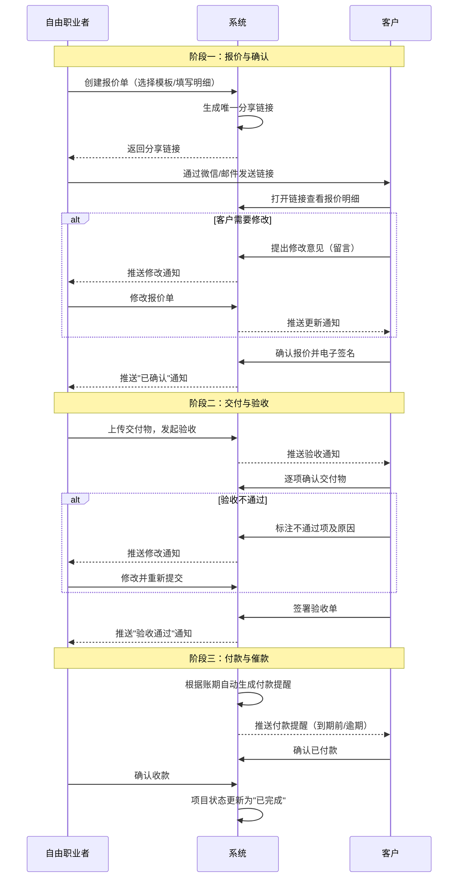
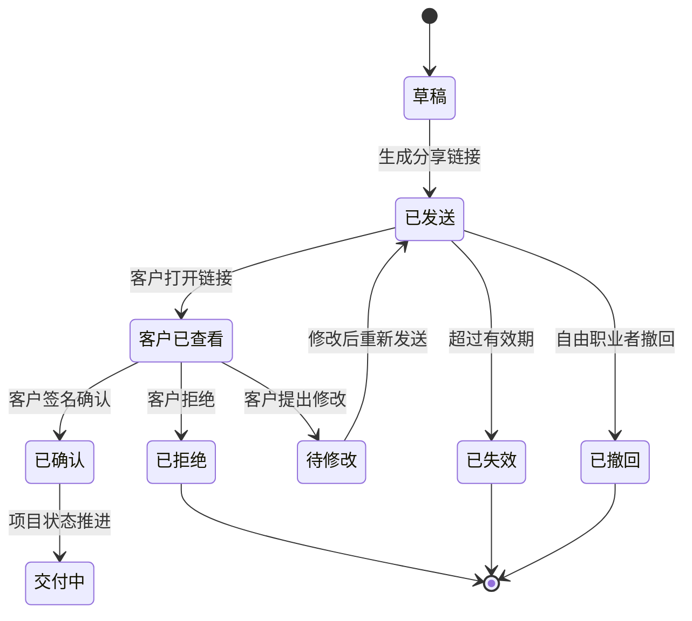
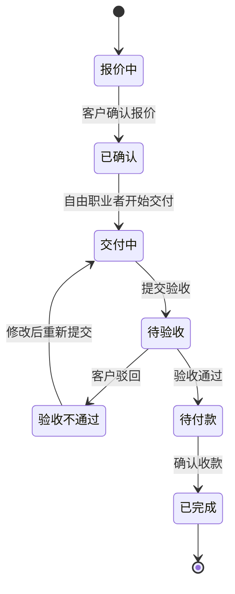
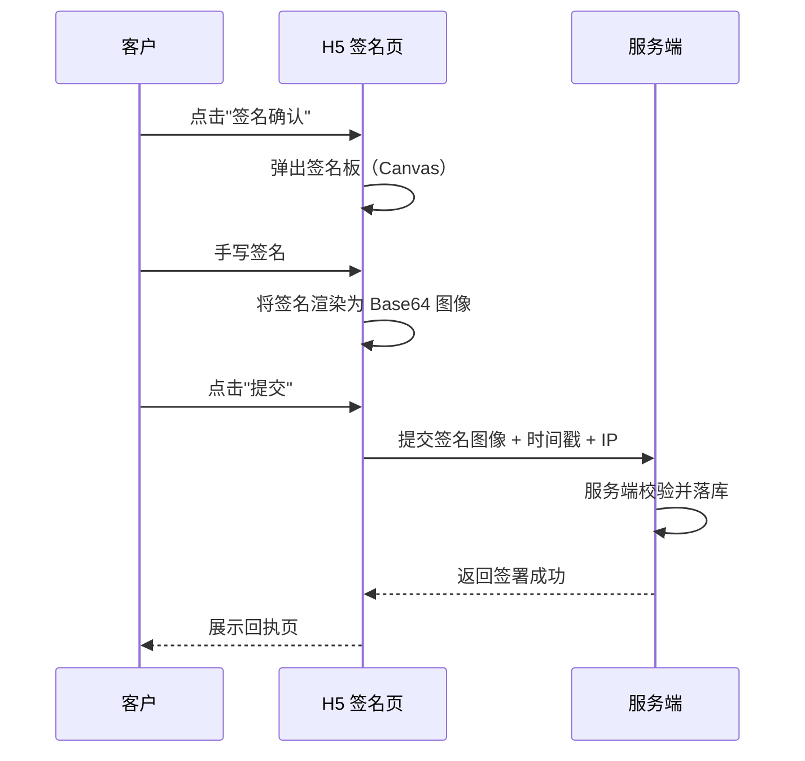
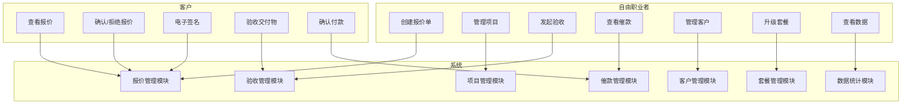
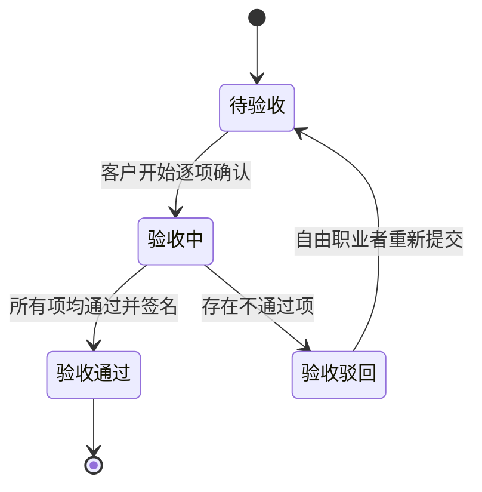

# 1.需求概述

## 1.1 需求介绍

"自由职业者报价验收一体化流程"是一款面向独立设计师、程序员、摄影师、翻译、咨询师等自由职业者及小型外包服务商的一站式交付管理工具。系统聚焦自由职业者在项目交付过程中的核心痛点——"报价靠微信、验收靠口头、催款靠勇气"，提供从报价单创建、客户在线确认、电子签名、交付验收到自动催款的完整闭环，让自由职业者的每一笔交易都有据可查、有章可循。

### 1.1.1 所属领域

效率工具 / 自由职业者服务交付管理 / SaaS

## 1.2 需求目标

1. **流程标准化**：将"报价→确认→交付→验收→催款"五个关键节点串联为标准化流程，替代碎片化的微信+Excel+邮件组合
2. **交付可追溯**：每一次报价、确认、验收、付款均有时间戳与电子签名记录，杜绝口头扯皮
3. **催款自动化**：系统根据账期自动提醒客户付款，减少自由职业者的"催款心理负担"
4. **低成本可用**：免费版即可满足低频用户需求，专业版以 ¥29/月 的亲民价格提供完整能力
5. **MVP 快速上线**：核心功能 5-7 天可完成开发并上线验证

## 1.3 系统使用角色

| 角色 | 说明 |
| --- | --- |
| 自由职业者（服务提供方） | 系统的主要使用者，负责创建报价单、发起验收、查看项目看板、管理客户 |
| 客户（需求方） | 通过分享链接查看报价、在线确认并签名、逐项验收交付物、查看付款状态 |
| 系统管理员 | 负责用户管理、套餐管理、模板管理、数据统计等后台运营工作 |

## 1.4 业务流程图

# 2.功能原型

| 原型名称 | 原型链接 | 对应端 | 备注 |
| --- | --- | --- | --- |
| 自由职业者工作台 | 待 PRD 阶段产出 | WEB端 | 报价单管理、项目看板、客户管理、数据分析 |
| 客户确认/验收页 | 待 PRD 阶段产出 | WEB端（H5 自适应） | 客户通过链接访问，无需注册即可查看报价、验收并签名 |
| 系统管理后台 | 待 PRD 阶段产出 | WEB端 | 用户管理、套餐管理、模板管理 |

# 3.需求清单

## 3.1 自由职业者端（WEB端）

### 3.1.1 报价管理模块

| 模块 | 一级功能 | 二级功能 | 功能描述 | 备注 |
| --- | --- | --- | --- | --- |
| 报价管理 | 创建报价单 | 选择模板 | 系统提供基础模板（设计类、开发类、咨询类等），用户可一键套用 | 免费版提供 3 套基础模板 |
| 报价管理 | 创建报价单 | 填写报价明细 | 支持添加多个服务项，每项包含：名称、描述、数量、单价、小计；自动计算总价 | |
| 报价管理 | 创建报价单 | 设置付款条款 | 可设置预付款比例、尾款支付期限、逾期利率等 | |
| 报价管理 | 创建报价单 | 设置有效期 | 报价单可设置有效截止日期，过期自动标记为"已失效" | |
| 报价管理 | 管理报价单 | 分享报价单 | 生成唯一访问链接，支持复制链接、生成二维码 | |
| 报价管理 | 管理报价单 | 查看报价状态 | 实时显示报价单状态：待查看/已查看/已确认/已拒绝/已失效 | |
| 报价管理 | 管理报价单 | 修改报价单 | 客户确认前可随时修改；修改后自动通知客户 | 已确认的报价单不可修改 |
| 报价管理 | 管理报价单 | 撤回报价单 | 支持撤回已发送但未确认的报价单 | |
| 报价管理 | 管理报价单 | 复制报价单 | 基于历史报价单快速创建新报价 | |
| 报价管理 | 管理报价单 | 删除报价单 | 支持删除草稿或已失效的报价单 | |

### 3.1.2 项目管理模块

| 模块 | 一级功能 | 二级功能 | 功能描述 | 备注 |
| --- | --- | --- | --- | --- |
| 项目管理 | 项目看板 | 状态概览 | 以看板形式展示所有项目，按状态分组：报价中→已确认→交付中→待验收→已完成 | 核心功能 |
| 项目管理 | 项目看板 | 状态流转 | 手动推进项目状态（如"已确认"→"交付中"）；部分状态由系统自动流转（如验收通过→已完成） | |
| 项目管理 | 项目看板 | 项目筛选 | 按状态、客户、创建时间、金额区间筛选项目 | |
| 项目管理 | 项目看板 | 项目搜索 | 按项目名称、客户名称关键词搜索 | |
| 项目管理 | 交付管理 | 上传交付物 | 支持上传文件（图片、文档、压缩包等）作为交付物，可分多次上传 | 免费版单文件≤20MB，专业版≤200MB |
| 项目管理 | 交付管理 | 发起验收 | 选择已上传的交付物，生成验收清单，推送给客户 | |
| 项目管理 | 交付管理 | 查看验收结果 | 查看客户逐项验收结果及反馈意见 | |
| 项目管理 | 交付管理 | 重新提交 | 针对客户标注不通过的项，修改后重新提交验收 | |
| 项目管理 | 催款管理 | 自动催款 | 根据付款条款，系统在到期前 3 天、到期当天、逾期后自动发送催款提醒 | 催款方式：站内信 + 邮件 |
| 项目管理 | 催款管理 | 手动催款 | 自由职业者可一键手动发送催款提醒 | |
| 项目管理 | 催款管理 | 收款确认 | 客户线下付款后，自由职业者手动确认收款 | |
| 项目管理 | 催款管理 | 催款记录 | 查看每个项目的催款历史（时间、方式、客户响应） | |

### 3.1.3 客户管理模块

| 模块 | 一级功能 | 二级功能 | 功能描述 | 备注 |
| --- | --- | --- | --- | --- |
| 客户管理 | 客户列表 | 客户信息 | 展示客户基本信息：姓名、联系方式、历史合作次数、累计金额 | |
| 客户管理 | 客户列表 | 添加客户 | 手动添加客户信息；报价单被确认后自动沉淀为客户 | |
| 客户管理 | 客户列表 | 客户搜索 | 按姓名、联系方式搜索客户 | |
| 客户管理 | 客户详情 | 合作历史 | 查看与该客户的所有历史项目及金额 | |
| 客户管理 | 客户详情 | 客户标签 | 支持给客户打标签（如"优质客户""需催款"等） | |

### 3.1.4 模板管理模块

| 模块 | 一级功能 | 二级功能 | 功能描述 | 备注 |
| --- | --- | --- | --- | --- |
| 模板管理 | 系统模板 | 浏览模板 | 查看系统提供的基础模板列表 | 免费版 3 套，专业版 10+ 套 |
| 模板管理 | 自定义模板 | 创建模板 | 基于常用报价结构保存为自定义模板 | 专业版功能 |
| 模板管理 | 自定义模板 | 编辑模板 | 修改已保存的自定义模板 | 专业版功能 |
| 模板管理 | 自定义模板 | 删除模板 | 删除不再使用的自定义模板 | 专业版功能 |

### 3.1.5 个人中心模块

| 模块 | 一级功能 | 二级功能 | 功能描述 | 备注 |
| --- | --- | --- | --- | --- |
| 个人中心 | 账户管理 | 注册/登录 | 支持手机号+验证码注册登录；支持微信扫码登录 | |
| 个人中心 | 账户管理 | 个人信息 | 修改头像、昵称、联系方式、个人简介（用于报价单页脚展示） | |
| 个人中心 | 账户管理 | 修改密码 | 支持修改登录密码 | |
| 个人中心 | 套餐管理 | 当前套餐 | 查看当前套餐类型、剩余项目数、到期时间 | |
| 个人中心 | 套餐管理 | 升级套餐 | 支持升级至专业版（¥29/月），展示权益对比 | |
| 个人中心 | 套餐管理 | 续费/续费 | 专业版到期续费或取消自动续费 | |
| 个人中心 | 数据统计 | 项目统计 | 统计本月/本季/本年收入、项目数、回款率 | 专业版功能 |
| 个人中心 | 数据统计 | 客户分析 | 统计客户复购率、平均客单价、验收周期 | 专业版功能 |
| 个人中心 | 数据统计 | 导出报表 | 将统计数据导出为 PDF 或 Excel | 专业版功能 |

## 3.2 客户端（WEB端-H5 自适应）

### 3.2.1 报价确认模块

| 模块 | 一级功能 | 二级功能 | 功能描述 | 备注 |
| --- | --- | --- | --- | --- |
| 报价确认 | 查看报价 | 报价明细 | 查看报价单全部内容：服务项明细、总价、付款条款、有效期 | 无需注册，通过链接访问 |
| 报价确认 | 查看报价 | 自由职业者信息 | 查看服务提供者的基本信息（头像、昵称、简介） | |
| 报价确认 | 互动反馈 | 提出修改 | 对报价单提出修改意见（文字留言） | |
| 报价确认 | 互动反馈 | 查看修改 | 查看自由职业者修改后的最新报价 | |
| 报价确认 | 确认签名 | 电子签名 | 在签名板上手写签名，确认报价 | 专业版功能；免费版使用"点击确认"替代 |
| 报价确认 | 确认签名 | 确认提交 | 提交确认结果（确认/拒绝） | |
| 报价确认 | 确认签名 | 确认回执 | 确认后展示回执页面，可下载确认凭证 | |

### 3.2.2 交付验收模块

| 模块 | 一级功能 | 二级功能 | 功能描述 | 备注 |
| --- | --- | --- | --- | --- |
| 交付验收 | 查看交付物 | 交付清单 | 查看自由职业者提交的所有交付物列表 | |
| 交付验收 | 查看交付物 | 预览/下载 | 在线预览图片或文档；支持下载全部交付物（打包为 ZIP） | |
| 交付验收 | 逐项验收 | 单项确认 | 对每个交付项标记"通过"或"不通过" | |
| 交付验收 | 逐项验收 | 填写反馈 | 对"不通过"项填写具体原因及要求 | |
| 交付验收 | 签署验收单 | 电子签名 | 全部项目通过后，手写签名确认验收 | 专业版功能 |
| 交付验收 | 签署验收单 | 提交验收 | 提交验收结果 | |
| 交付验收 | 签署验收单 | 验收回执 | 展示验收通过回执，可下载验收凭证 | |

### 3.2.3 付款模块

| 模块 | 一级功能 | 二级功能 | 功能描述 | 备注 |
| --- | --- | --- | --- | --- |
| 付款 | 付款提醒 | 查看待付款 | 查看待付款项目及金额、账期 | |
| 付款 | 付款提醒 | 确认已付款 | 客户线下转账后，点击"已付款"通知自由职业者 | 不做在线支付集成，线下转账为主 |

## 3.3 管理后台（WEB端）

| 模块 | 一级功能 | 二级功能 | 功能描述 | 备注 |
| --- | --- | --- | --- | --- |
| 管理后台 | 用户管理 | 用户列表 | 查看所有注册用户信息、套餐状态、注册时间 | |
| 管理后台 | 用户管理 | 用户详情 | 查看用户详细资料、项目统计、套餐历史 | |
| 管理后台 | 用户管理 | 用户封禁 | 对违规用户进行封禁/解封操作 | |
| 管理后台 | 套餐管理 | 套餐配置 | 配置免费版与专业版的权益项及价格 | |
| 管理后台 | 套餐管理 | 订单管理 | 查看专业版订阅订单、续费记录 | |
| 管理后台 | 模板管理 | 系统模板管理 | 增删改查系统提供的基础模板 | |
| 管理后台 | 数据统计 | 平台数据 | 统计平台注册用户数、活跃用户数、付费转化率、GMV | |
| 管理后台 | 系统设置 | 邮件配置 | 配置催款邮件、通知邮件的 SMTP 参数及模板 | |
| 管理后台 | 系统设置 | 短信配置 | 配置短信通知的通道参数及模板 | MVP 阶段可不实现 |

# 4.非功能需求

## 4.1 使用界面需求

| 编号 | 需求描述 |
| --- | --- |
| UI-01 | 自由职业者端采用简洁的 SaaS 风格，主色调建议蓝+白，突出专业感 |
| UI-02 | 客户端（H5）需适配移动端浏览器，以竖屏为主，操作路径不超过 3 步 |
| UI-03 | 电子签名板需支持手指/鼠标/触控笔输入，笔画流畅，签名可清除重写 |
| UI-04 | 项目看板支持拖拽卡片在不同状态列之间移动（可选，专业版） |
| UI-05 | 所有涉及金额的地方需保留两位小数，并显示货币符号 ¥ |

## 4.2 软硬件环境需求

| 编号 | 需求描述 |
| --- | --- |
| ENV-01 | 自由职业者端：支持 Chrome、Edge、Safari 最新两个大版本 |
| ENV-02 | 客户端：支持主流移动端浏览器（iOS Safari 14+、Android Chrome 90+）及微信内置浏览器 |
| ENV-03 | 服务端：支持 Linux（CentOS 7+ / Ubuntu 20.04+）部署 |
| ENV-04 | 数据库：MySQL 8.0+ 或 PostgreSQL 13+ |
| ENV-05 | 文件存储：支持对象存储（如阿里云 OSS、腾讯云 COS） |

## 4.3 性能需求

| 编号 | 需求描述 |
| --- | --- |
| PERF-01 | 报价单页面加载时间 ≤ 2 秒（首次访问） |
| PERF-02 | 分享链接打开时间 ≤ 1.5 秒 |
| PERF-03 | 支持同时 500 个在线用户（MVP 阶段） |
| PERF-04 | 文件上传支持断点续传（专业版大文件场景） |
| PERF-05 | 催款邮件发送延迟 ≤ 5 分钟 |

## 4.4 约束性需求

1. **不实现**在线支付功能，付款环节以线下转账+手动确认为主（避免支付牌照与分账合规成本）
2. **不实现**通用 IM 聊天功能，沟通仅通过报价单/验收单留言完成
3. **不实现**复杂的项目管理（甘特图、里程碑、任务分解等），仅保留状态看板
4. **电子签名**在 MVP 阶段以手写图像+时间戳+IP 记录为合法依据，不对接第三方 CA 签名（专业版可预留接口）
5. 系统**需要后台服务**支撑报价链接生成、消息推送、催款定时任务等功能

# 5.接口需求

## 5.2 软件接口需求

| 模块 | 接口名称 | 输入 | 输出 | 功能描述 |
| --- | --- | --- | --- | --- |
| 报价管理 | 报价链接接口 | 报价单 ID | 唯一分享链接（含访问令牌） | 生成客户访问链接，链接包含令牌用于鉴权 |
| 报价管理 | 报价状态推送接口 | 报价单状态变更事件 | 推送通知（站内信/邮件） | 报价被查看、确认、拒绝时通知自由职业者 |
| 交付验收 | 验收通知接口 | 验收发起事件 | 推送通知（站内信/邮件/短信） | 验收发起后通知客户 |
| 交付验收 | 验收结果接口 | 客户逐项验收结果 | 验收报告 | 汇总客户验收结果，生成验收报告 |
| 催款管理 | 催款定时任务接口 | 付款条款、当前时间 | 催款通知 | 每日扫描到期/逾期项目，自动发送催款提醒 |
| 个人中心 | 邮件发送接口 | 收件人、模板、变量 | 发送结果 | 调用 SMTP 服务发送通知邮件 |
| 个人中心 | 微信登录接口 | 微信授权码 | 用户 OpenID、头像、昵称 | 对接微信开放平台实现扫码登录 |
| 管理后台 | 支付回调接口 | 支付平台回调数据 | 处理结果 | 接收专业版订阅支付回调（对接微信支付/支付宝） |

# 6. 附录

## 流程图

### 报价单生命周期

### 项目状态流转

## 时序图

### 电子签名的签署时序

## （用户与系统交互）用例图

## （系统）状态图

### 验收单状态

