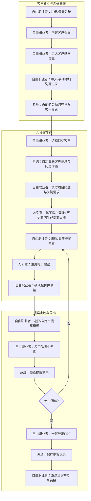
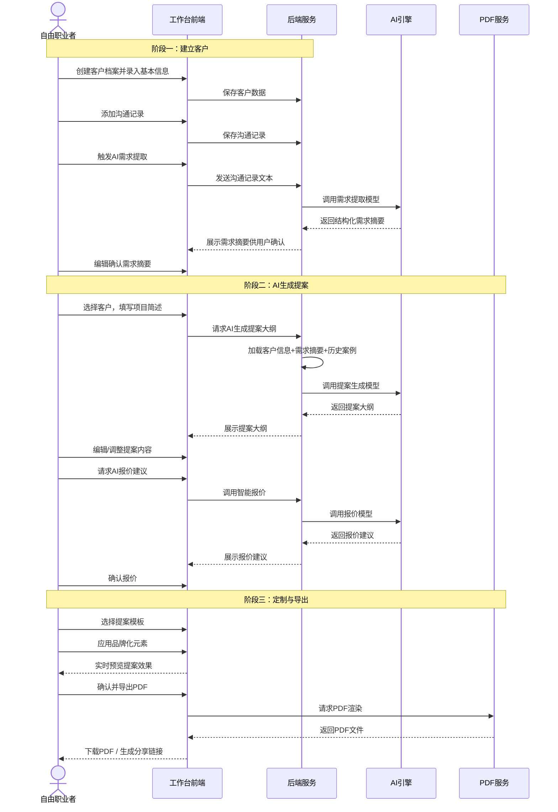
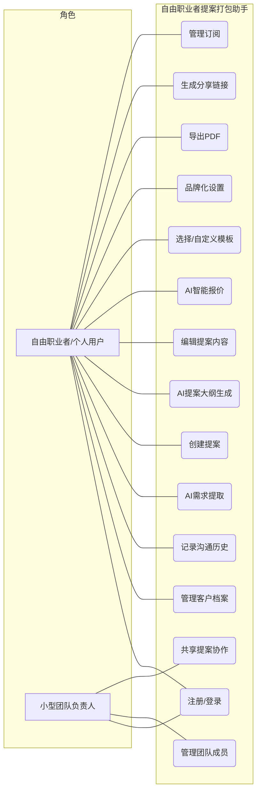
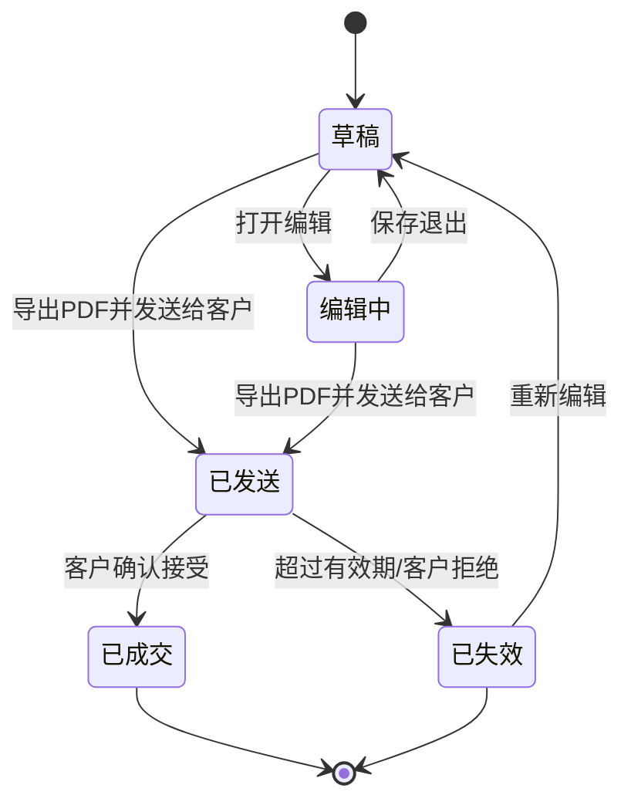
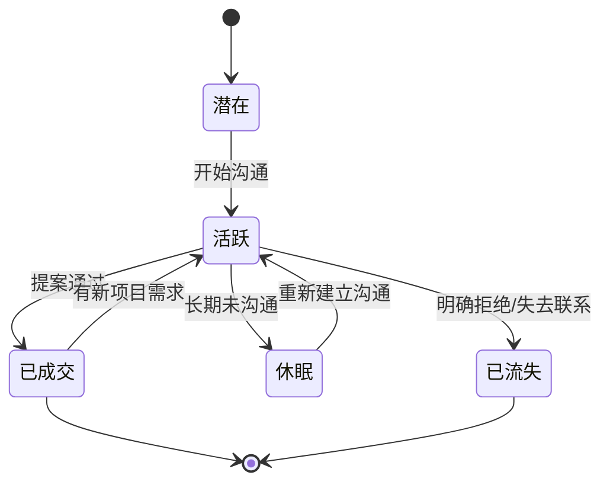

# 自由职业者提案打包助手V1.0 - 用户需求规格说明书

# 1.需求概述

## 1.1 需求介绍

自由职业者提案打包助手是一款面向独立设计师、程序员、摄影师、小型外包服务商等自由职业者的AI辅助提案生成效率工具。产品聚焦"自由职业者快速生成定制化提案"这一核心场景，通过整合客户管理、历史沟通汇总、AI提案大纲生成、智能报价建议、PDF专业导出等功能，帮助自由职业者将提案准备时间从1-2小时缩短至10-15分钟，显著提升接单效率和提案专业度。

产品采用SaaS订阅模式，提供免费版（3份提案/月）和Pro版（¥29/月，不限提案数量+高级模板+团队协作+客户品牌化）两个版本层级。

### 1.1.1 所属领域

效率工具、SaaS服务、自由职业者服务、AI辅助办公

## 1.2 需求目标

- 为自由职业者提供客户信息管理+历史沟通记录的集中化管理能力，告别散落在微信、邮件中的碎片化信息
- 通过AI辅助，基于客户需求和历史案例自动生成定制化提案大纲，降低提案撰写的门槛和时间成本
- 提供智能报价建议功能，结合行业基准和历史项目数据，帮助自由职业者合理定价、提升报价竞争力
- 支持一键生成专业级PDF提案文档，并提供模板自定义和品牌化能力，让个人品牌在每一次提案中得到一致呈现
- 以轻量级、低价格的差异化定位切入自由职业者市场，避开PandaDoc/HelloSign等高价企业工具
- 支持团队协作与客户品牌化，满足从个人到小型团队的业务成长需求

## 1.3 系统使用角色

本系统主要服务两类用户角色：

1. **自由职业者（个人用户）**：独立设计师、程序员、摄影师、独立经纪人等，需要频繁向客户提交项目提案的个人从业者，是产品核心用户
2. **小型团队负责人**：拥有2-10人团队的小型外包服务商或工作室负责人，需管理团队成员的提案活动，并希望在提案中展示团队品牌

## 1.4 业务流程图

# 2.功能原型

| 原型名称 | 原型链接 | 对应端 | 备注 |
| --- | --- | --- | --- |
| 自由职业者提案打包助手Web原型 |  | WEB端 | V1.0 MVP |

# 3.需求清单

## 3.1 自由职业者工作台-WEB端

| 序号 | 功能模块 | 一级功能 | 二级功能 | 功能描述 | 优先级 | 备注 |
| --- | --- | --- | --- | --- | --- | --- |
| 1 | 账号与订阅 | 注册/登录 | 邮箱注册 | 通过邮箱+密码完成账号注册，支持邮箱验证码激活 | P0 | MVP |
| 2 | | | 第三方登录 | 支持微信/GitHub等第三方账号快捷登录 | P1 | |
| 3 | | | 登录状态管理 | 记住登录状态、忘记密码、修改密码 | P0 | MVP |
| 4 | | 订阅管理 | 套餐查看 | 查看当前订阅套餐（免费版/Pro版），显示剩余提案数、到期时间 | P0 | MVP |
| 5 | | | 套餐升级/续费 | 在线升级至Pro版或续费，集成支付方式 | P0 | MVP |
| 6 | | | 用量提醒 | 免费版接近月度限额（3份）时提醒用户升级 | P1 | |
| 7 | | 个人信息管理 | 个人资料编辑 | 管理头像、昵称、个人简介、联系方式、个人网站等 | P0 | MVP |
| 8 | 客户管理 | 客户列表 | 客户档案列表 | 以卡片/列表形式展示所有客户，支持搜索、按状态筛选（活跃/休眠/全部） | P0 | MVP |
| 9 | | | 快速新建客户 | 在客户列表页一键创建新客户，填写最基本信息即可 | P0 | MVP |
| 10 | | 客户档案 | 基本信息管理 | 管理客户名称、公司、联系方式、邮箱、行业、来源渠道等 | P0 | MVP |
| 11 | | | 客户标签 | 为客户添加自定义标签（如"设计师""长期客户""高价值"），便于分类检索 | P1 | |
| 12 | | | 客户状态管理 | 标记客户状态：活跃沟通中、已成交、潜在、已流失 | P0 | MVP |
| 13 | | 沟通记录 | 沟通记录添加 | 手动添加沟通记录，支持记录沟通时间、方式（微信/电话/邮件/面谈）、内容摘要、关联的项目需求 | P0 | MVP |
| 14 | | | 沟通记录时间线 | 按时间线形式展示与某客户的全部沟通历史，便于回顾上下文 | P0 | MVP |
| 15 | | | 沟通附件上传 | 上传与沟通相关的附件（需求文档、参考图片、合同草稿等） | P1 | |
| 16 | | 需求汇总 | AI需求提取 | 系统AI自动分析沟通记录，提取并归纳客户的核心需求、偏好、预算范围等关键信息 | P0 | MVP核心 |
| 17 | | | 需求摘要编辑 | 用户可编辑/修正AI提取的需求摘要，确保准确性 | P0 | MVP |
| 18 | | | 历史项目关联 | 查看与该客户的历史合作项目和交付记录 | P1 | |
| 19 | 提案管理 | 提案列表 | 我的提案 | 以卡片/列表形式展示所有已创建的提案，支持按状态筛选（草稿/已发送/已成交/已失效） | P0 | MVP |
| 20 | | | 提案搜索 | 按客户名称、项目名称、关键词搜索提案 | P0 | MVP |
| 21 | | 创建提案 | 选择客户 | 从客户列表中选择目标客户，系统自动加载客户信息与需求汇总 | P0 | MVP |
| 22 | | | 填写项目简述 | 用户输入本次项目的简述、目标、交付时间等关键信息 | P0 | MVP |
| 23 | | AI提案生成 | AI大纲生成 | AI基于客户画像、历史沟通记录、项目简述和同类历史案例，自动生成定制化提案大纲（含项目背景、解决方案、工作范围、时间计划、报价等章节） | P0 | MVP核心 |
| 24 | | | AI内容润色 | 对已编辑的提案段落进行AI润色，提升专业度和表达力 | P1 | |
| 25 | | | 提案内容编辑 | 富文本编辑器，支持标题、段落、列表、表格、图片等内容的自由编辑 | P0 | MVP |
| 26 | | | 大纲手动调整 | 用户可拖拽调整提案章节顺序，增删章节 | P0 | MVP |
| 27 | | 报价建议 | AI智能报价 | AI基于项目需求复杂度、行业基准数据、历史同类项目报价，生成报价建议（含分项报价和总价区间） | P0 | MVP核心 |
| 28 | | | 报价明细编辑 | 用户可修改AI建议的报价明细，调整单项价格、增删报价条目 | P0 | MVP |
| 29 | | | 报价历史参考 | 展示与该客户或同类项目的历史报价记录，辅助定价决策 | P1 | |
| 30 | | 模板选择 | 内置模板库 | 提供多套预设提案模板（设计类、开发类、摄影类、通用咨询类等），用户可按需选用 | P0 | MVP |
| 31 | | | 模板自定义 | 用户可基于内置模板修改布局、章节结构、配色，保存为自定义模板 | P0 | MVP |
| 32 | | | 模板管理 | 管理我的模板库，支持编辑、复制、删除自定义模板 | P0 | MVP |
| 33 | | 品牌化 | 品牌元素设置 | 设置个人/团队品牌元素：Logo上传、品牌色值、标准字体、联系方式页脚 | P0 | MVP |
| 34 | | | 品牌化预览 | 在提案编辑器中实时预览品牌化效果 | P0 | MVP |
| 35 | | 提案预览 | 全屏预览 | 在生成PDF前，全屏预览提案最终效果 | P0 | MVP |
| 36 | | | 设备适配预览 | 分别预览提案在电脑端和移动端的显示效果 | P2 | |
| 37 | | 提案导出 | 一键导出PDF | 将编辑完成的提案导出为专业级PDF文件，保留排版和品牌元素 | P0 | MVP核心 |
| 38 | | | PDF质量选项 | 提供标准质量和高质量两种PDF导出选项 | P1 | |
| 39 | | | 提案分享链接 | 生成在线分享链接，客户可在线浏览提案（带密码保护和有效期设置） | P1 | |
| 40 | | 提案统计 | 本月提案用量 | 展示本月已创建/已发送提案数量，免费版显示剩余额度 | P0 | MVP |
| 41 | | | 提案转化率 | 简单统计提案发送数与成交数的比率 | P2 | |
| 42 | 团队协作（Pro） | 团队成员管理 | 邀请成员 | Pro版用户可邀请团队成员加入，分配角色（管理员/成员） | P1 | Pro功能 |
| 43 | | | 成员权限管理 | 设置成员可访问的客户和提案范围 | P1 | Pro功能 |
| 44 | | | 团队提案共享 | 团队成员可查看和协作编辑共享提案 | P1 | Pro功能 |

# 4.非功能需求

## 4.1 使用界面需求

| 需求项 | 详细描述 | 备注 |
| --- | --- | --- |
| 设计风格 | 简洁专业、轻量现代，突出效率工具属性，避免过度装饰 | P0 |
| 主色调 | 以深蓝/深灰为主色调，搭配亮色作为强调色，传递专业可信感 | P0 |
| 响应式设计 | 优先适配桌面端（1280px及以上），兼顾平板端浏览 | P0 |
| 编辑器体验 | 提案编辑器支持实时预览，操作流畅无明显卡顿 | P0 |
| 空状态引导 | 新客户/无提案/无模板等空状态页面提供明确的操作引导 | P1 |
| 操作反馈 | 保存、导出、AI生成等操作提供即时状态反馈（成功/失败/进度） | P0 |

## 4.2 软硬件环境需求

| 需求项 | 详细描述 | 备注 |
| --- | --- | --- |
| 客户端环境 | 现代浏览器（Chrome 90+、Firefox 90+、Safari 15+、Edge 90+） | P0 |
| 服务端环境 | 云端SaaS部署，用户无需本地安装 | P0 |
| AI服务 | 对接大语言模型API用于提案生成和需求提取 | P0 |
| PDF生成 | 服务端PDF渲染引擎或客户端PDF生成库 | P0 |

## 4.3 性能需求

| 需求项 | 详细描述 | 备注 |
| --- | --- | --- |
| 页面加载 | 主要页面首屏加载 < 2.0秒 | P0 |
| AI提案生成 | 提案大纲生成响应时间 < 15秒 | P0 |
| AI需求提取 | 沟通记录需求提取响应时间 < 10秒 | P0 |
| PDF导出 | 单份提案PDF导出时间 < 10秒 | P0 |
| 编辑器响应 | 编辑器输入/操作响应延迟 < 100ms | P0 |
| 并发支持 | 支持500+用户同时在线使用 | P1 |

## 4.4 约束性需求

| 需求项 | 详细描述 | 备注 |
| --- | --- | --- |
| 数据安全 | 用户数据和客户信息加密存储，传输采用HTTPS | P0 |
| 隐私保护 | 不同用户之间的客户数据严格隔离，不可交叉访问 | P0 |
| AI生成标识 | AI生成的提案内容应有适当标识，提醒用户审核后再发送 | P0 |
| 免费版限制 | 免费版每月限3份提案，不开放团队协作和客户品牌化功能 | P0 |
| 后台服务 | 是，需要后台服务来支撑AI生成、PDF导出、用户管理等功能 | P0 |
| 不做企业级功能 | MVP阶段不实现电子签名、合同管理、CRM深度集成等企业级功能，避免与PandaDoc等高价工具同质化 | P0 |

# 5.接口需求

## 5.2 软件接口需求

| 模块 | 接口名称 | 输入 | 输出 | 功能描述 |
| --- | --- | --- | --- | --- |
| 用户认证 | 用户注册 | 邮箱、密码 | 注册结果 | 完成用户账号注册 |
| | 用户登录 | 邮箱/第三方凭证 | Token、用户信息 | 用户身份验证与会话建立 |
| | 第三方登录 | OAuth授权码 | Token、用户信息 | 通过微信/GitHub等第三方快捷登录 |
| 客户服务 | 客户CRUD | 客户数据 | 操作结果 | 创建、查询、更新、删除客户档案 |
| | 客户列表查询 | 筛选条件、分页 | 客户列表 | 按条件查询客户列表 |
| 沟通记录服务 | 沟通记录CRUD | 记录数据 | 操作结果 | 创建、查询、更新、删除沟通记录 |
| | 沟通时间线查询 | 客户ID、时间范围 | 沟通记录列表 | 按时间线获取与某客户的全部沟通历史 |
| 需求汇总服务 | AI需求提取 | 沟通记录文本 | 结构化需求摘要 | AI分析沟通记录，提取客户需求要点 |
| | 需求摘要更新 | 需求摘要数据 | 更新结果 | 用户编辑/修正AI提取的需求摘要 |
| 提案服务 | 提案CRUD | 提案数据 | 操作结果 | 创建、查询、更新、删除提案 |
| | 提案列表查询 | 筛选条件、分页 | 提案列表 | 按条件查询提案列表 |
| AI提案生成 | 大纲生成 | 客户信息、需求摘要、项目简述 | 提案大纲JSON | AI基于输入信息生成定制化提案大纲 |
| | 内容润色 | 待润色文本 | 润色后文本 | 对提案段落进行AI专业润色 |
| 报价服务 | 智能报价 | 项目信息、需求复杂度 | 报价建议 | AI生成报价建议（分项+总价区间） |
| | 报价历史查询 | 客户ID/项目类型 | 历史报价列表 | 查询历史同类项目报价 |
| 模板服务 | 模板列表 | 分类、用户ID | 模板列表 | 获取可用模板（内置+自定义） |
| | 模板CRUD | 模板数据 | 操作结果 | 创建、更新、删除自定义模板 |
| 品牌化服务 | 品牌元素管理 | 品牌数据（Logo/色值/字体） | 操作结果 | 管理用户的品牌化元素配置 |
| PDF导出服务 | PDF生成 | 提案内容、模板样式、品牌元素 | PDF文件 | 将提案渲染导出为PDF文件 |
| 分享服务 | 生成分享链接 | 提案ID、密码、有效期 | 分享URL | 生成带密码保护的在线提案链接 |
| 支付服务 | 订阅支付 | 套餐信息 | 支付参数 | Pro版套餐在线支付 |
| | 支付回调 | 支付结果 | 确认信息 | 处理支付结果，更新订阅状态 |
| 团队协作（Pro） | 成员管理 | 邀请邮箱、角色 | 操作结果 | 邀请/移除团队成员、分配角色 |
| | 提案共享 | 提案ID、成员列表 | 操作结果 | 设置提案的团队共享权限 |

# 6. 附录

## 流程图

详见1.3章节业务流程图

## 时序图

## （用户与系统交互）用例图

## （系统）状态图

### 提案生命周期状态图

### 客户生命周期状态图

