| 版本号 | 变更日期 | 变更内容 | 变更人 | 审核人 |
| --- | --- | --- | --- | --- |
| V1.0 | 2026-06-29 | 初始版本创建 | 产品文档结对写作专家 | 阶段一产品落地页文档总编辑 |

---

# 1 概述

## 1.1 需求背景

自由职业者群体（独立设计师、程序员、咨询师、写手等）在项目执行过程中普遍缺乏系统化的复盘机制，导致以下业务痛点：

1. **报价不准确**：凭感觉定价，项目结束后才发现某些项目根本不赚钱
2. **重复踩坑**：项目结束后缺乏总结，相同问题反复出现
3. **无法量化价值**：不清楚自己的真实时薪和利润率，无法持续提价
4. **经验无法沉淀**：项目经验散落在个人记忆中，无法结构化复用
5. **客户选择不当**：缺乏数据支撑，无法识别高价值客户

**业务价值**：
- 帮助自由职业者建立数据驱动的报价决策体系
- 通过经验库实现知识复用，避免重复犯错
- 提升项目盈利能力，实现可持续的职业发展

**预期达成目标**：
- MVP阶段（7天）：完成核心复盘表单、成本计算、简单看板、经验条目管理功能
- 用户目标：帮助自由职业者将项目利润率提升20%以上，报价准确度提升30%以上

## 1.2 名词解释

| **名词** | **说明** |
| --- | --- |
| 项目复盘 | 项目结束后，对项目的工时、成本、质量、经验教训进行系统性回顾和记录的过程 |
| 预估工时 | 项目启动前，用户基于经验和客户需求预估的项目所需工作时间 |
| 实际工时 | 项目执行过程中，用户实际投入的工作时间 |
| 利润率 | （项目收入 - 项目成本）/ 项目收入 × 100% |
| 时薪 | 项目净收入 / 实际工时，反映用户的时间价值 |
| 经验条目 | 从项目复盘中提炼的可复用知识，包括问题描述、解决方案、适用场景等 |
| 经验库 | 按客户类型、项目类型、行业等维度组织的可检索经验条目集合 |
| 客户价值 | 综合考量项目收入、利润率、客户满意度、复购率等维度的客户质量评估 |
| 值得复盘 | 系统自动标记的特殊项目状态，触发条件：利润率<0%、工时偏差率>30%、客户满意度≤2星 |

## 1.3 产品介绍

**复盘经验库**是一款面向自由职业者的轻量级效率工具，聚焦于"项目结束后的复盘与经验沉淀"，帮助用户系统性回顾每个已完成项目的工时、成本、客户满意度和经验教训，自动生成盈利能力分析报告，并构建可检索的经验库，为未来报价和接单提供数据化决策依据。

### 1.3.1 范围说明

| 项 | 内容 |
| --- | --- |
| 包含功能 | 项目复盘管理、盈利分析报告、经验库管理、简单看板、用户账户与订阅 |
| 不包含功能 | 项目过程管理（任务分配、进度跟踪）、团队协作实时沟通、财务发票管理、合同管理 |

**目标用户**：
- 独立设计师（28-35岁，承接品牌设计、UI设计、插画等外包项目）
- 自由程序员（30-40岁，承接网站开发、小程序开发、系统集成等技术项目）
- 独立咨询师（35-50岁，提供管理咨询、IT咨询、财务咨询等专业服务）
- 自由撰稿人/内容创作者（25-40岁，为媒体、品牌、公众号提供内容创作服务）
- 小型外包团队负责人（3-5人团队，承接设计、开发、运营等综合性外包项目）

**核心使用场景**：
1. 项目结束后的快速复盘（5-10分钟完成结构化复盘）
2. 报价前的经验检索（按客户类型/项目类型/行业筛选类似项目参考）
3. 客户价值评估（年度盘点客户，调整服务策略）
4. 团队经验共享（团队复盘机制，新人快速上手）

**产品核心价值**：
- **数据驱动决策**：基于工时、成本、满意度等量化数据生成分析报告
- **经验复用**：将复盘经验结构化沉淀，支持未来检索和参考
- **聚焦复盘**：不介入项目执行过程，只在项目结束后介入，轻量无负担
- **自由职业者专属**：针对单人/小团队的工作模式设计，非通用项目管理工具

---

# 2 产品设计

## 2.1 系统架构图

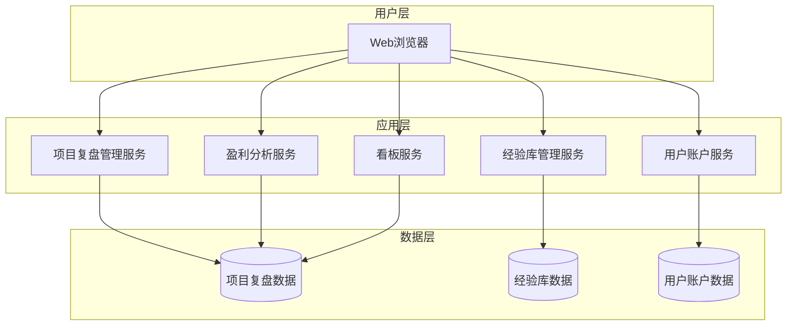

## 2.2 业务模块图

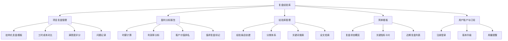

## 2.3 主业务流程

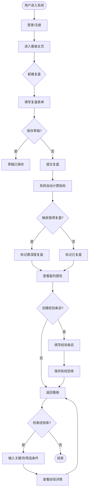

**业务规则说明**：
1. 项目状态标记为"已完成"后，系统自动提醒用户进行复盘
2. 超过7天未复盘的项目，系统发送提醒通知
3. 系统根据以下规则自动建议"需深度复盘"：
   - 利润率 < 0%（亏损项目）
   - 工时偏差率 > 30%（严重超支）
   - 客户满意度 ≤ 2 星（不满意）
   - 出现3个以上"高影响"问题

## 2.4 功能图/列表

| 功能模块 | 功能名称 | 优先级 | 功能描述 |
| --- | --- | --- | --- |
| 项目复盘管理 | 项目基本信息登记 | P0 | 创建复盘记录时填写：项目名称、客户名称、客户类型、项目类型、所属行业、项目起止时间、合同金额 |
| 项目复盘管理 | 工时对比填写 | P0 | 分别填写预估工时和实际工时，系统自动计算工时偏差率 |
| 项目复盘管理 | 成本对比填写 | P0 | 分别填写预算和实际成本（时间成本、直接成本、间接成本） |
| 项目复盘管理 | 客户满意度评分 | P1 | 用户主观评分（1-5星），可附加客户反馈备注 |
| 项目复盘管理 | 问题与解决方案记录 | P0 | 记录项目中遇到的主要问题（1-10个），每个问题包括：问题描述、影响程度、解决方案、是否可复用 |
| 项目复盘管理 | 复盘模板 | P1 | 系统预置基础复盘模板，专业版支持自定义模板 |
| 项目复盘管理 | 复盘状态管理 | P0 | 复盘状态流转：待复盘 → 已复盘 → 需深度复盘 |
| 项目复盘管理 | 复盘草稿保存 | P0 | 支持分多次填写，自动保存草稿 |
| 项目复盘管理 | 历史复盘查看 | P1 | 支持查看所有历史复盘记录，按时间、客户、项目类型筛选 |
| 盈利分析报告 | 时薪计算 | P0 | 自动计算实际时薪 = (合同金额 - 实际成本) / 实际工时 |
| 盈利分析报告 | 利润率计算 | P0 | 自动计算利润率 = (合同金额 - 实际成本) / 合同金额 × 100% |
| 盈利分析报告 | 客户价值排名 | P1 | 综合考量累计收入、平均利润率、客户满意度、复购次数 |
| 盈利分析报告 | 项目类型盈利对比 | P2 | 按项目类型统计平均时薪、利润率 |
| 盈利分析报告 | 值得复盘标记 | P0 | 系统自动标记利润率<0%、工时偏差率>30%、客户满意度≤2星的项目 |
| 盈利分析报告 | 趋势分析 | P2 | 展示用户时薪、利润率随时间的变化趋势（专业版） |
| 盈利分析报告 | 报告生成 | P0 | 自动生成单个项目的复盘报告 |
| 盈利分析报告 | 报告导出 | P2 | 支持将复盘报告导出为PDF和Excel（专业版） |
| 经验库管理 | 经验条目创建 | P0 | 从复盘记录一键生成经验条目草稿，也可手动创建 |
| 经验库管理 | 经验条目结构 | P0 | 每个经验条目包括：标题、问题描述、解决方案、适用场景、标签、关联项目复盘 |
| 经验库管理 | 分类体系 | P0 | 支持按客户类型、项目类型、行业三级分类 |
| 经验库管理 | 标签系统 | P1 | 用户可为经验条目添加自定义标签（专业版） |
| 经验库管理 | 关键词搜索 | P0 | 免费版支持基于标题、标签的关键词搜索 |
| 经验库管理 | 全文检索 | P2 | 支持对经验条目的全部内容进行全文检索（专业版） |
| 经验库管理 | 经验条目关联 | P1 | 经验条目可关联到一个或多个项目复盘记录 |
| 经验库管理 | 经验条目编辑与删除 | P0 | 支持对已有经验条目进行编辑和删除 |
| 经验库管理 | 经验条目导出 | P2 | 支持将经验库导出为PDF或Markdown格式（专业版） |
| 简单看板 | 复盘状态概览 | P0 | 展示：待复盘项目数、已复盘项目数、需深度复盘项目数 |
| 简单看板 | 关键指标卡片 | P0 | 展示：本月复盘项目数、平均时薪、平均利润率、客户满意度均值 |
| 简单看板 | 近期复盘列表 | P0 | 展示最近10个复盘记录 |
| 简单看板 | 快速入口 | P0 | 提供"新建复盘""查看经验库""生成报告"的快速入口 |
| 简单看板 | 筛选与排序 | P1 | 支持按客户、项目类型、时间范围筛选，按利润率、时薪、时间排序 |
| 用户账户与订阅 | 注册登录 | P0 | 支持手机号+验证码注册登录，支持微信快捷登录 |
| 用户账户与订阅 | 版本升级 | P1 | 免费版用户可在应用内升级到专业版 |
| 用户账户与订阅 | 用量提醒 | P0 | 免费版用户记录项目达到8个时提醒，达到10个时提示升级 |
| 用户账户与订阅 | 数据备份 | P2 | 专业版用户数据自动云端备份（专业版） |
| 用户账户与订阅 | 数据删除 | P1 | 用户可随时申请删除账户及所有数据 |
| 用户账户与订阅 | 团队协作 | P2 | 支持邀请团队成员（最多5人），共享项目复盘和经验库数据（专业版） |

## 2.5 你的产品有哪些端

| 序号 | 端名称 | 端类型 | 目标用户 | 说明 |
| --- | --- | --- | --- | --- |
| 1 | 用户端Web | WEB端 | 自由职业者（设计师、程序员、咨询师、写手等） | 用户在浏览器中使用，进行项目复盘、查看报告、管理经验库 |

**说明**：
- 本产品为纯Web应用，用户通过浏览器访问
- 响应式设计，适配桌面和移动端浏览器
- MVP阶段暂不开发原生APP，后续根据用户需求考虑

---

# 3 产品功能

## 3.1 用户端Web功能

### 3.1.1 项目基本信息登记

**功能描述**

用户在创建新的项目复盘记录时，首先需要填写项目的基本信息，包括项目名称、客户名称、客户类型、项目类型、所属行业、项目起止时间、合同金额等。这些信息构成了项目复盘的基础数据框架。

**优先级与依赖说明**：

| 项 | 内容 |
| --- | --- |
| 优先级 | P0 |
| 依赖需求 | 无 |
| 前置条件 | 用户已登录系统 |

### 3.1.2 项目基本信息登记—详细流程

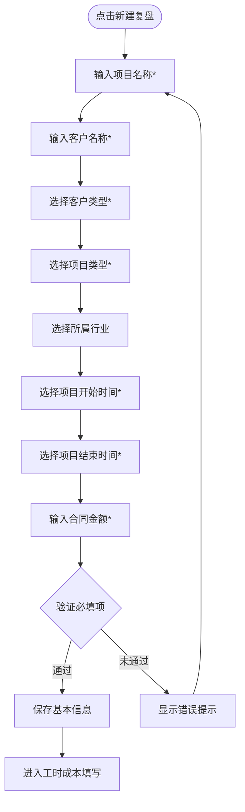

**业务规则说明**：
1. 项目名称：必填，最大长度50字符
2. 客户名称：必填，最大长度50字符
3. 客户类型：必填，选项包括"企业/个人/政府/其他"
4. 项目类型：必填，选项包括"设计/开发/咨询/写作/运营/其他"
5. 所属行业：选填，选项包括"互联网/教育/金融/制造/医疗/其他"
6. 项目开始时间：必填，不能晚于项目结束时间
7. 项目结束时间：必填，不能早于项目开始时间
8. 合同金额：必填，正数，最大9999999.99元

### 3.1.3 项目基本信息登记—主要原型

[项目基本信息表单原型](assets/prototypes/web/project-basic-info-widget.html)

**验收标准说明**：
- [ ] 正常流程：用户填写所有必填项后可成功保存并进入下一步
- [ ] 异常流程：必填项未填写时显示红色提示，无法提交
- [ ] 性能要求：表单保存响应时间≤1秒

### 3.1.4 工时对比填写

**功能描述**

用户分别填写项目的预估工时和实际工时（单位：小时），系统自动计算工时偏差率 = (实际工时 - 预估工时) / 预估工时 × 100%，帮助用户量化项目时间管理的准确度。

**优先级与依赖说明**：

| 项 | 内容 |
| --- | --- |
| 优先级 | P0 |
| 依赖需求 | 项目基本信息登记 |
| 前置条件 | 项目基本信息已保存 |

### 3.1.5 工时对比填写—详细流程

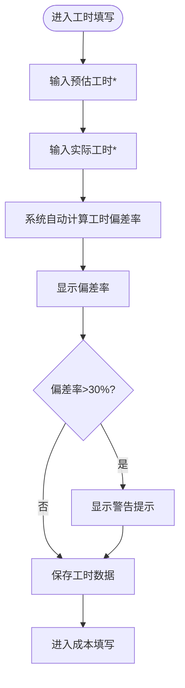

**业务规则说明**：
1. 预估工时：必填，正数，最大9999小时
2. 实际工时：必填，正数，最大9999小时
3. 工时偏差率自动计算，保留2位小数
4. 工时偏差率>30%时显示黄色警告提示"工时严重超支"
5. 支持修改已保存的工时数据

### 3.1.6 工时对比填写—主要原型

[工时对比填写原型](assets/prototypes/web/work-hours-widget.html)

**验收标准说明**：
- [ ] 正常流程：填写预估工时和实际工时后，系统实时显示工时偏差率
- [ ] 异常流程：偏差率>30%时显示警告提示
- [ ] 性能要求：偏差率计算实时响应

### 3.1.7 成本对比填写

**功能描述**

用户分别填写项目的预算和实际成本。实际成本包括三部分：时间成本（实际工时 × 期望时薪）、直接成本（素材购买、差旅等）、间接成本（沟通成本、修改返工等）。系统自动计算成本偏差率和利润率。

**优先级与依赖说明**：

| 项 | 内容 |
| --- | --- |
| 优先级 | P0 |
| 依赖需求 | 工时对比填写 |
| 前置条件 | 工时数据已保存 |

### 3.1.8 成本对比填写—详细流程

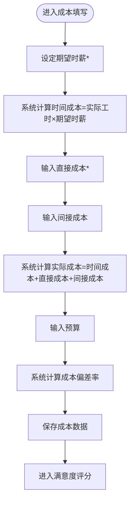

**业务规则说明**：
1. 期望时薪：必填，正数，用于计算时间成本
2. 直接成本：必填，≥0，包括素材购买、差旅等
3. 间接成本：选填，≥0，包括沟通成本、返工成本等
4. 实际成本 = 时间成本 + 直接成本 + 间接成本
5. 预算：选填，用于计算成本偏差率
6. 成本偏差率 = (实际成本 - 预算) / 预算 × 100%（仅在填写预算时计算）

### 3.1.9 成本对比填写—主要原型

[成本对比填写原型](assets/prototypes/web/cost-widget.html)

**验收标准说明**：
- [ ] 正常流程：填写各项成本后，系统实时显示实际成本和成本偏差率
- [ ] 异常流程：成本为负数时显示错误提示
- [ ] 性能要求：成本计算实时响应

### 3.1.10 客户满意度评分

**功能描述**

用户对项目的客户满意度进行主观评分（1-5星），可附加客户反馈备注。如有客户直接反馈，可上传截图或文字记录。

**优先级与依赖说明**：

| 项 | 内容 |
| --- | --- |
| 优先级 | P1 |
| 依赖需求 | 成本对比填写 |
| 前置条件 | 成本数据已保存 |

### 3.1.11 客户满意度评分—详细流程

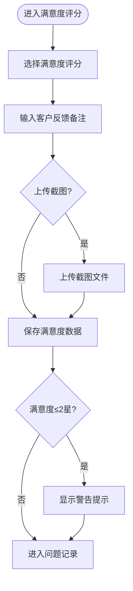

**业务规则说明**：
1. 满意度评分：选填，1-5星
2. 客户反馈备注：选填，最大长度500字符
3. 截图上传：选填，支持JPG/PNG格式，单个文件≤5MB
4. 满意度≤2星时显示黄色警告提示"客户不满意"

### 3.1.12 客户满意度评分—主要原型

[客户满意度评分原型](assets/prototypes/web/satisfaction-widget.html)

**验收标准说明**：
- [ ] 正常流程：用户选择星级评分并填写反馈备注后保存成功
- [ ] 异常流程：满意度≤2星时显示警告提示
- [ ] 性能要求：截图上传响应时间≤3秒

### 3.1.13 问题与解决方案记录

**功能描述**

用户记录项目中遇到的主要问题（至少1个，最多10个），每个问题包括：问题描述、影响程度（高/中/低）、解决方案、是否可复用。

**优先级与依赖说明**：

| 项 | 内容 |
| --- | --- |
| 优先级 | P0 |
| 依赖需求 | 客户满意度评分 |
| 前置条件 | 满意度数据已保存 |

### 3.1.14 问题与解决方案记录—详细流程

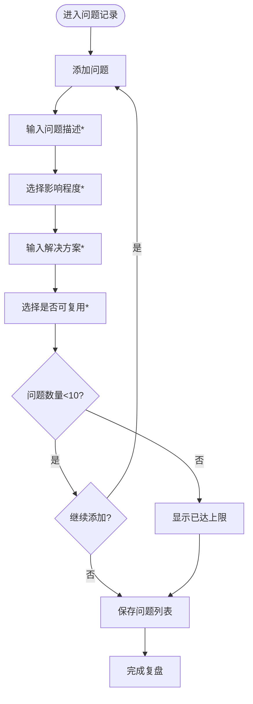

**业务规则说明**：
1. 问题数量：至少1个，最多10个
2. 问题描述：必填，最大长度200字符
3. 影响程度：必填，选项包括"高/中/低"
4. 解决方案：必填，最大长度500字符
5. 是否可复用：必填，选项包括"是/否"
6. 出现3个以上"高影响"问题时，系统自动标记为"需深度复盘"

### 3.1.15 问题与解决方案记录—主要原型

[问题与解决方案记录原型](assets/prototypes/web/problems-widget.html)

**验收标准说明**：
- [ ] 正常流程：用户添加1-10个问题，填写完整信息后保存成功
- [ ] 异常流程：问题数量<1时显示错误提示，无法提交
- [ ] 性能要求：问题列表保存响应时间≤1秒

### 3.1.16 盈利分析报告查看

**功能描述**

系统基于用户填写的复盘数据，自动生成项目盈利能力分析报告，包括时薪计算、利润率分析、客户价值排名、"值得复盘"标记等，帮助用户量化项目的真实收益。

**优先级与依赖说明**：

| 项 | 内容 |
| --- | --- |
| 优先级 | P0 |
| 依赖需求 | 项目复盘管理所有功能 |
| 前置条件 | 项目复盘已提交 |

### 3.1.17 盈利分析报告查看—详细流程

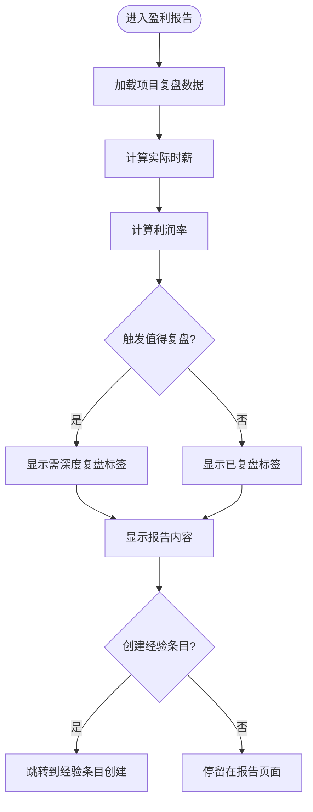

**业务规则说明**：
1. 实际时薪 = (合同金额 - 实际成本) / 实际工时
2. 时薪达成率 = 实际时薪 / 期望时薪 × 100%
3. 利润率 = (合同金额 - 实际成本) / 合同金额 × 100%
4. "值得复盘"触发条件：利润率<0% 或 工时偏差率>30% 或 客户满意度≤2星
5. 报告生成时间≤3秒

### 3.1.18 盈利分析报告查看—主要原型

[盈利分析报告原型](assets/prototypes/web/profit-report-widget.html)

**验收标准说明**：
- [ ] 正常流程：用户进入报告页面后，系统在3秒内显示完整的盈利分析报告
- [ ] 异常流程：数据缺失时显示"数据不完整"提示
- [ ] 性能要求：报告生成时间≤3秒

### 3.1.19 经验条目创建

**功能描述**

用户可以从复盘记录一键生成经验条目草稿，也可以手动创建独立经验条目。每个经验条目包括标题、问题描述、解决方案、适用场景、标签、关联项目复盘等。

**优先级与依赖说明**：

| 项 | 内容 |
| --- | --- |
| 优先级 | P0 |
| 依赖需求 | 项目复盘管理 |
| 前置条件 | 用户已登录 |

### 3.1.20 经验条目创建—详细流程

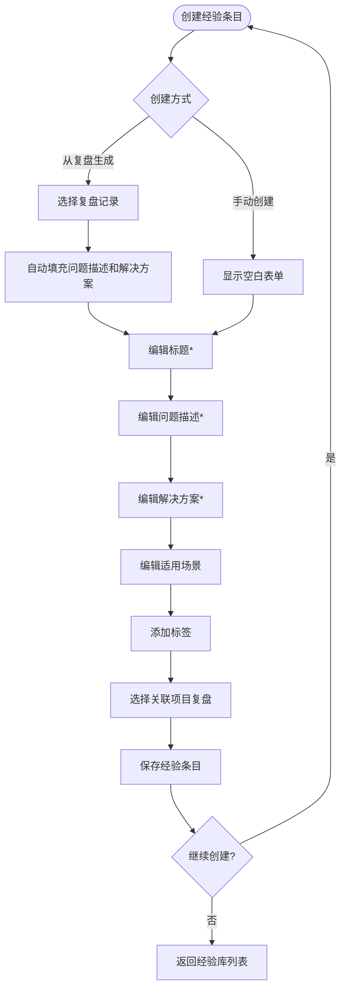

**业务规则说明**：
1. 标题：必填，最大长度100字符
2. 问题描述：必填，最大长度1000字符
3. 解决方案：必填，最大长度1000字符
4. 适用场景：选填，最大长度500字符
5. 标签：选填，最多10个标签，每个标签最大长度20字符
6. 关联项目复盘：选填，可关联1个或多个复盘记录
7. 从复盘记录生成时，自动填充问题描述和解决方案

### 3.1.21 经验条目创建—主要原型

[经验条目创建原型](assets/prototypes/web/experience-create-widget.html)

**验收标准说明**：
- [ ] 正常流程：用户填写完整信息后保存成功，经验条目出现在经验库列表中
- [ ] 异常流程：必填项未填写时显示红色提示
- [ ] 性能要求：保存响应时间≤1秒

### 3.1.22 经验库列表与检索

**功能描述**

用户可以在经验库中查看所有经验条目，支持按客户类型、项目类型、行业三级分类筛选，支持关键词搜索（免费版基于标题、标签搜索，专业版支持全文检索）。

**优先级与依赖说明**：

| 项 | 内容 |
| --- | --- |
| 优先级 | P0 |
| 依赖需求 | 经验条目创建 |
| 前置条件 | 用户已登录 |

### 3.1.23 经验库列表与检索—详细流程

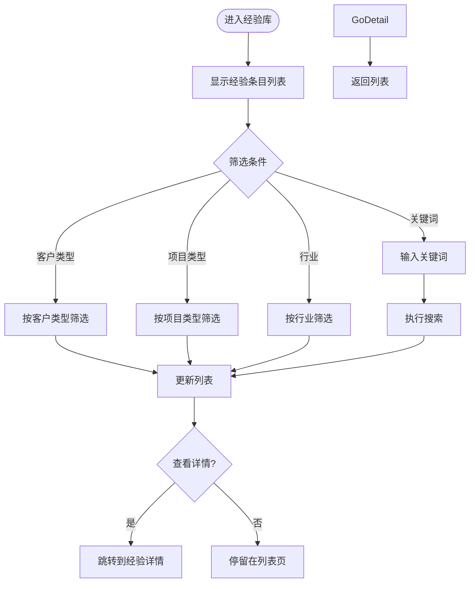

**业务规则说明**：
1. 列表默认按创建时间倒序排列
2. 分类筛选支持多选
3. 关键词搜索响应时间≤1秒（免费版），≤2秒（专业版全文检索）
4. 列表支持分页，每页20条
5. 免费版用户最多查看最近6个月的经验条目

### 3.1.24 经验库列表与检索—主要原型

[经验库列表与检索原型](assets/prototypes/web/experience-list-widget.html)

**验收标准说明**：
- [ ] 正常流程：用户输入关键词或选择筛选条件后，列表实时更新
- [ ] 异常流程：无搜索结果时显示"暂无数据"空状态
- [ ] 性能要求：搜索响应时间≤1秒（免费版），≤2秒（专业版）

### 3.1.25 简单看板

**功能描述**

提供一个简洁的看板界面，让用户快速了解项目复盘的整体状态和关键指标，包括复盘状态概览、关键指标卡片、近期复盘列表、快速入口等。

**优先级与依赖说明**：

| 项 | 内容 |
| --- | --- |
| 优先级 | P0 |
| 依赖需求 | 项目复盘管理、盈利分析报告 |
| 前置条件 | 用户已登录 |

### 3.1.26 简单看板—详细流程

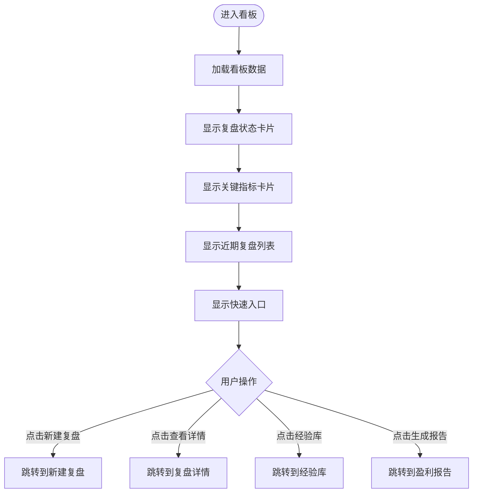

**业务规则说明**：
1. 复盘状态卡片显示：待复盘项目数、已复盘项目数、需深度复盘项目数
2. 关键指标卡片显示：本月复盘项目数、平均时薪、平均利润率、客户满意度均值
3. 近期复盘列表显示最近10个复盘记录
4. 看板加载时间≤2秒
5. 关键指标实时更新（新增复盘记录后自动刷新）

### 3.1.27 简单看板—主要原型

[简单看板原型](assets/prototypes/web/dashboard-widget.html)

**验收标准说明**：
- [ ] 正常流程：用户进入看板后，2秒内显示完整的看板数据
- [ ] 异常流程：无数据时显示"暂无数据"空状态和引导提示
- [ ] 性能要求：看板加载时间≤2秒

### 3.1.28 用户注册登录

**功能描述**

支持手机号+验证码注册登录，支持微信快捷登录。

**优先级与依赖说明**：

| 项 | 内容 |
| --- | --- |
| 优先级 | P0 |
| 依赖需求 | 无 |
| 前置条件 | 无 |

### 3.1.29 用户注册登录—详细流程

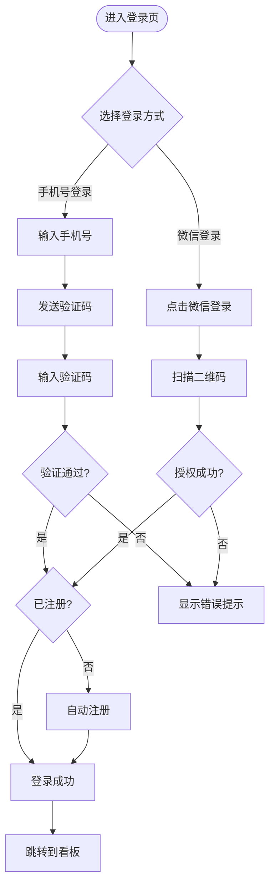

**业务规则说明**：
1. 手机号格式验证：11位数字，1开头
2. 验证码：6位数字，有效期5分钟，每日发送上限10次
3. 微信登录：需用户授权获取 openid
4. 首次登录自动注册，创建用户账户
5. 登录成功后跳转到看板主页

### 3.1.30 用户注册登录—主要原型

[用户注册登录原型](assets/prototypes/web/login-widget.html)

**验收标准说明**：
- [ ] 正常流程：用户输入正确的手机号和验证码后可成功登录
- [ ] 异常流程：验证码错误时显示错误提示，登录失败
- [ ] 性能要求：验证码发送响应时间≤3秒，登录响应时间≤2秒

---

# 4 产品原型

## 4.1 页面跳转逻辑图

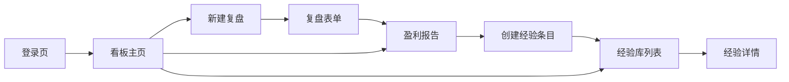

## 4.2 全站点原型设计

### 4.2.1 用户端Web

**页面清单**：

| 序号 | 页面名称 | 所属模块 | 页面描述 | 关键元素 |
| --- | --- | --- | --- | --- |
| 1 | 登录页 | 用户账户 | 手机号+验证码登录，微信快捷登录 | 手机号输入框、验证码输入框、发送验证码按钮、微信登录按钮 |
| 2 | 看板主页 | 简单看板 | 展示复盘状态、关键指标、近期复盘列表 | 状态卡片、指标卡片、复盘列表、快速入口按钮 |
| 3 | 新建复盘页 | 项目复盘 | 填写项目基本信息 | 项目名称、客户名称、客户类型、项目类型、所属行业、项目时间、合同金额 |
| 4 | 复盘表单页 | 项目复盘 | 填写工时、成本、满意度、问题记录 | 工时输入、成本输入、满意度评分、问题列表 |
| 5 | 盈利报告页 | 盈利分析 | 展示项目盈利能力分析报告 | 时薪卡片、利润率卡片、成本分解图、值得复盘标签 |
| 6 | 经验库列表页 | 经验库 | 展示经验条目列表，支持筛选搜索 | 筛选器、搜索框、经验列表、分页 |
| 7 | 经验详情/编辑页 | 经验库 | 查看或编辑经验条目详情 | 标题、问题描述、解决方案、适用场景、标签、关联项目 |

**交互说明**：

- 页面跳转关系：

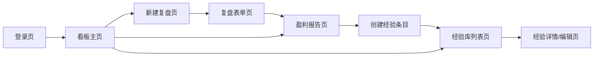

- 特殊交互：
  1. 复盘表单页支持分步填写，每步可保存草稿，自动保存间隔≤30秒
  2. 盈利报告页的指标卡片支持点击展开查看详细数据
  3. 经验库列表页支持实时搜索，输入关键词后≤1秒显示搜索结果
  4. 所有列表页支持空状态显示（无数据时显示引导提示）
  5. 表单提交时进行前端校验，必填项未填写时显示红色提示

**产品原型**：

[🖥️ 打开用户端Web全站点原型](assets/prototypes/web-prototype.html)

---

# 5 数据需求

## 5.1 数据使用规格

### 5.1.1 项目复盘数据

| **字段** | **是否必填** | **描述** | **数据类型** |
| --- | --- | --- | --- |
| project_name | 是 | 项目名称 | 字符串，最大50字符 |
| client_name | 是 | 客户名称 | 字符串，最大50字符 |
| client_type | 是 | 客户类型 | 枚举：企业/个人/政府/其他 |
| project_type | 是 | 项目类型 | 枚举：设计/开发/咨询/写作/运营/其他 |
| industry | 否 | 所属行业 | 枚举：互联网/教育/金融/制造/医疗/其他 |
| start_date | 是 | 项目开始时间 | 日期：YYYY-MM-DD |
| end_date | 是 | 项目结束时间 | 日期：YYYY-MM-DD |
| contract_amount | 是 | 合同金额 | 数字，正数，最大9999999.99 |
| estimated_hours | 是 | 预估工时 | 数字，正数，最大9999 |
| actual_hours | 是 | 实际工时 | 数字，正数，最大9999 |
| expected_hourly_rate | 是 | 期望时薪 | 数字，正数 |
| direct_cost | 是 | 直接成本 | 数字，≥0 |
| indirect_cost | 否 | 间接成本 | 数字，≥0 |
| budget | 否 | 预算 | 数字，≥0 |
| satisfaction_rating | 否 | 客户满意度 | 整数，1-5 |
| customer_feedback | 否 | 客户反馈备注 | 字符串，最大500字符 |
| feedback_screenshot | 否 | 客户反馈截图 | 文件，JPG/PNG，≤5MB |
| status | 是 | 复盘状态 | 枚举：待复盘/已复盘/需深度复盘 |
| created_at | 自动 | 创建时间 | 时间戳 |
| updated_at | 自动 | 更新时间 | 时间戳 |

### 5.1.2 问题记录数据

| **字段** | **是否必填** | **描述** | **数据类型** |
| --- | --- | --- | --- |
| project_id | 是 | 关联项目ID | UUID |
| problem_description | 是 | 问题描述 | 字符串，最大200字符 |
| impact_level | 是 | 影响程度 | 枚举：高/中/低 |
| solution | 是 | 解决方案 | 字符串，最大500字符 |
| is_reusable | 是 | 是否可复用 | 布尔值 |
| created_at | 自动 | 创建时间 | 时间戳 |

### 5.1.3 经验条目数据

| **字段** | **是否必填** | **描述** | **数据类型** |
| --- | --- | --- | --- |
| title | 是 | 标题 | 字符串，最大100字符 |
| problem_description | 是 | 问题描述 | 字符串，最大1000字符 |
| solution | 是 | 解决方案 | 字符串，最大1000字符 |
| applicable_scenario | 否 | 适用场景 | 字符串，最大500字符 |
| tags | 否 | 标签 | 数组，最多10个，每个最大20字符 |
| related_projects | 否 | 关联项目复盘ID | UUID数组 |
| created_at | 自动 | 创建时间 | 时间戳 |
| updated_at | 自动 | 更新时间 | 时间戳 |

### 5.1.4 用户数据

| **字段** | **是否必填** | **描述** | **数据类型** |
| --- | --- | --- | --- |
| phone | 是 | 手机号 | 字符串，11位数字 |
| wechat_openid | 否 | 微信OpenID | 字符串 |
| subscription_type | 是 | 订阅类型 | 枚举：免费版/专业版 |
| subscription_expire_date | 否 | 订阅到期日期 | 日期：YYYY-MM-DD |
| project_count | 自动 | 已记录项目数 | 整数 |
| created_at | 自动 | 创建时间 | 时间戳 |

## 5.2 统计数据

1. 统计用户的累积复盘项目数、平均时薪、平均利润率，按月的维度进行统计（P0）
2. 统计用户的客户价值排名（Top 10），按累计收入、平均利润率、客户满意度综合评分排序（P1）
3. 统计各项目类型的平均时薪和利润率，按项目类型分组统计（P2）

## 5.3 埋点需求

| 页面 | 事件 | 采集字段 | 说明 |
| --- | --- | --- | --- |
| 登录页 | 登录成功 | user_id, login_method, timestamp | 统计登录方式和频率 |
| 看板主页 | 访问看板 | user_id, timestamp | 统计看板访问频率 |
| 新建复盘页 | 开始创建复盘 | user_id, timestamp | 统计复盘创建频率 |
| 复盘表单页 | 保存草稿 | user_id, step, timestamp | 统计草稿保存频率 |
| 复盘表单页 | 提交复盘 | user_id, project_type, profit_rate, timestamp | 统计复盘提交情况 |
| 盈利报告页 | 查看报告 | user_id, project_id, timestamp | 统计报告查看频率 |
| 经验库列表页 | 搜索经验 | user_id, keyword, timestamp | 统计搜索关键词 |
| 经验详情/编辑页 | 创建经验 | user_id, source_type, timestamp | 统计经验创建来源 |

---

# 6 非功能需求

## 6.1 性能需求

### 6.1.1 延迟

| 编号 | 项目 | 最大延迟 | 平均延迟 | 优先级 | 备注 |
| --- | --- | --- | --- | --- | --- |
| 0001 | 看板页面加载 | <2秒 | <1秒 | 高 |  |
| 0002 | 复盘表单保存 | <1秒 | <0.5秒 | 高 | 自动保存间隔≤30秒 |
| 0003 | 盈利报告生成 | <3秒 | <2秒 | 中 |  |
| 0004 | 经验库关键词搜索 | <1秒 | <0.5秒 | 高 | 免费版 |
| 0005 | 经验库全文检索 | <2秒 | <1秒 | 中 | 专业版 |
| 0006 | 验证码发送 | <3秒 | <1秒 | 中 |  |

### 6.1.2 吞吐量

| 编号 | 项 | 吞吐量 | 备注 |
| --- | --- | --- | --- |
| 0001 | 用户发送验证码 | 每分钟100次 |  |
| 0002 | 用户登录认证 | 每分钟1000次 |  |
| 0003 | 复盘表单提交 | 每分钟500次 |  |
| 0004 | 经验库搜索 | 每分钟2000次 |  |

### 6.1.3 容量

| 编号 | 项 | 容量 | 备注 |
| --- | --- | --- | --- |
| 0001 | 系统用户数 | <=100,000 | MVP阶段 |
| 0002 | 系统活动用户数 | >=10,000 且 <=50,000 |  |
| 0003 | 单个用户项目数 | <=10（免费版）/ 不限（专业版） |  |
| 0004 | 单个项目问题数 | <=10 |  |
| 0005 | 单个经验条目标签数 | <=10 |  |

## 6.2 安全需求

| 编号 | 项（系统数据 / 处理过程） |
| --- | --- |
| 0001 | 在成功执行身份认证之前，系统必须拒绝用户执行任意操作 |
| 0002 | 系统必须防止任何非授权用户访问系统存储的用户账号、项目复盘数据、经验库数据 |
| 0003 | 系统必须保证用户数据的严格隔离，用户A无法访问用户B的数据 |
| 0004 | 全链路HTTPS加密传输 |
| 0005 | 敏感数据（客户信息、财务数据）加密存储 |
| 0006 | 符合《个人信息保护法》要求 |

## 6.3 可靠性

| 编号 | 项 | 值 |
| --- | --- | --- |
| 0001 | 系统正常运行的可能性 | 99.5% |
| 0002 | 系统平均正常运行时间 | 180天 |
| 0003 | 系统平均故障恢复时间 | 4小时 |

## 6.4 可连续性

| 编号 | 项 |
| --- | --- |
| Conti.1 | 系统需要 7 × 24 式的全天候运行 |
| Conti.2 | 专业版用户数据每日自动备份 |

## 6.5 可恢复性

| 编号 | 项 |
| --- | --- |
| Recov.1 | 系统可以进行数据备份，专业版用户每日自动备份 |
| Recov.2 | 重大故障需要在4小时内恢复服务的可用性，并在24小时内恢复历史数据 |

## 6.6 兼容性

| 编号 | 要求 | 备注 |
| --- | --- | --- |
| 0001 | 兼容主流浏览器：Chrome >=90，Firefox >=88，Safari >=14，Edge >=90 |  |
| 0002 | 移动端适配主流分辨率：375×667，390×844，414×896 | 响应式设计 |
| 0003 | 支持 1280×720 及以上分辨率 |  |

## 6.7 易用性

| 编号 | 要求 | 备注 |
| --- | --- | --- |
| 0001 | 核心操作路径不超过3步 |  |
| 0002 | 普通用户无需培训即可使用核心功能 |  |
| 0003 | 复盘表单填写流程≤10分钟完成 |  |
| 0004 | 经验条目创建流程≤3步完成 |  |

---

# 7 总结

## 7.1 上线计划

| 阶段 | 时间 | 内容 | 负责人 |
| --- | --- | --- | --- |
| 开发阶段 | 2026-07-01 至 2026-07-07 | MVP核心功能开发（复盘表单、成本计算、简单看板、经验条目管理） | 开发团队 |
| 测试阶段 | 2026-07-08 至 2026-07-10 | 功能测试、性能测试、安全测试 | 测试团队 |
| 灰度阶段 | 2026-07-11 至 2026-07-15 | 灰度10%用户，验证稳定性 | 产品团队 |
| 全量上线 | 2026-07-16 | 全量开放给所有用户 | 产品团队 |

## 7.2 后续迭代规划

- V1.1：增加自定义复盘模板、行业专用模板（专业版）
- V1.2：增加趋势分析、客户价值排名高级分析（专业版）
- V1.3：增加全文检索、标签系统（专业版）
- V1.4：增加数据导出（PDF/Excel）、云端备份（专业版）
- V1.5：增加团队协作功能，支持邀请团队成员（最多5人，专业版）
- V2.0：开发移动端APP，提供更好的移动端体验

## 7.3 参考文档

- 自由职业者项目复盘与经验库 - 用户需求文档 v1.0
- 项目管理知识体系（PMBOK）中的项目复盘方法论
- 敏捷开发中的 retrospective（回顾会议）实践
- 自由职业者报价与定价策略相关资料
- 知识管理领域的经验沉淀方法论
