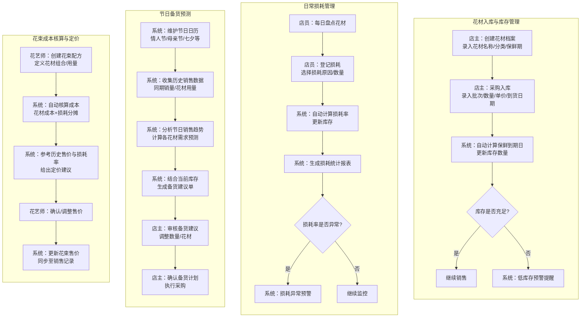
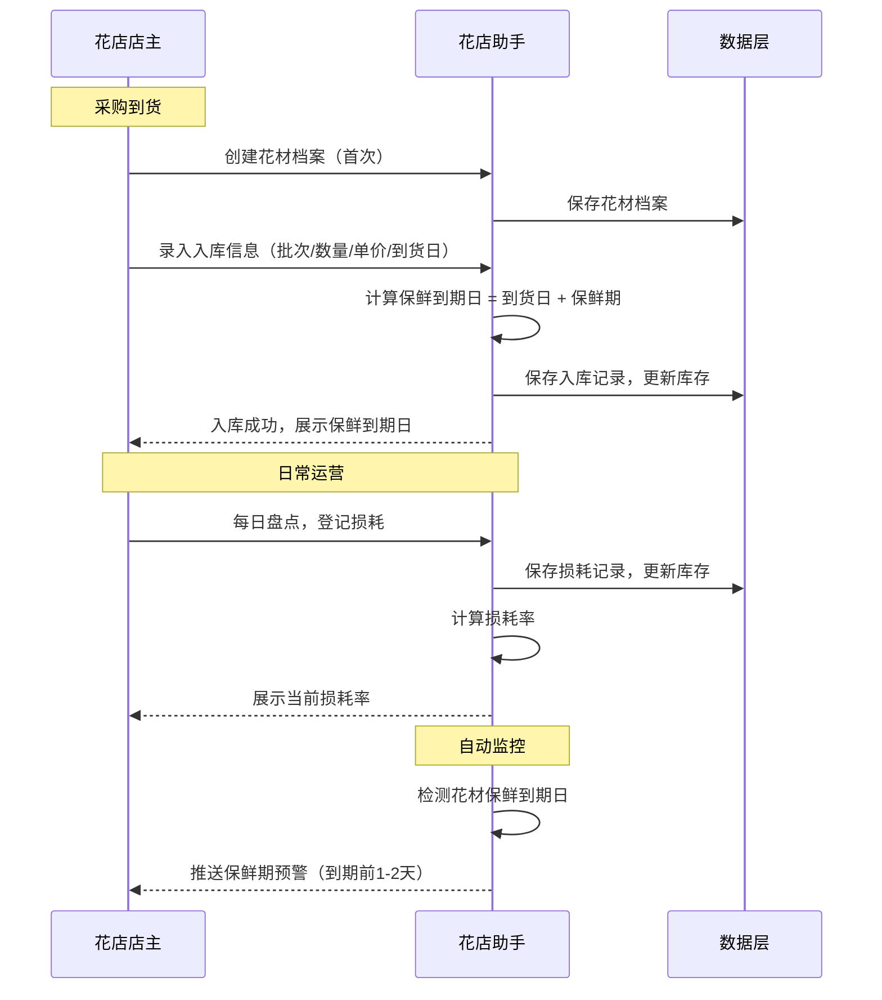
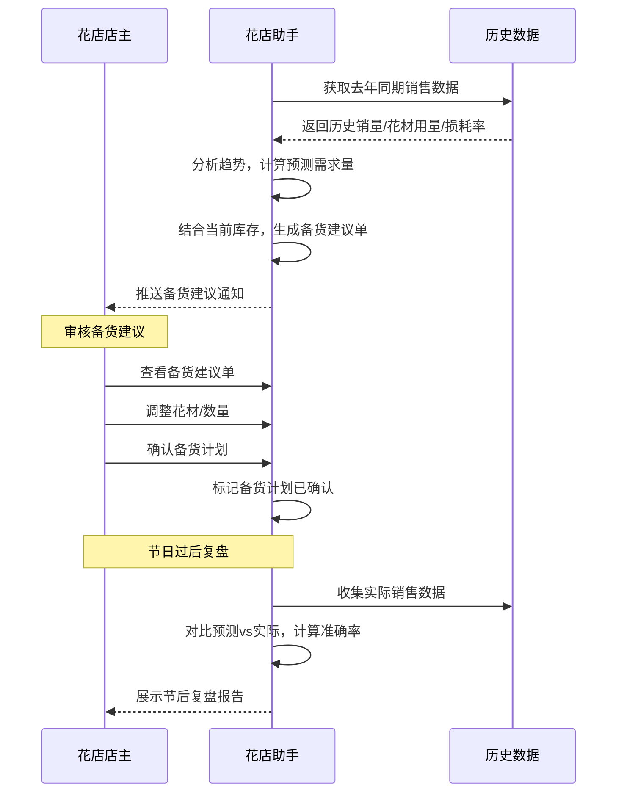
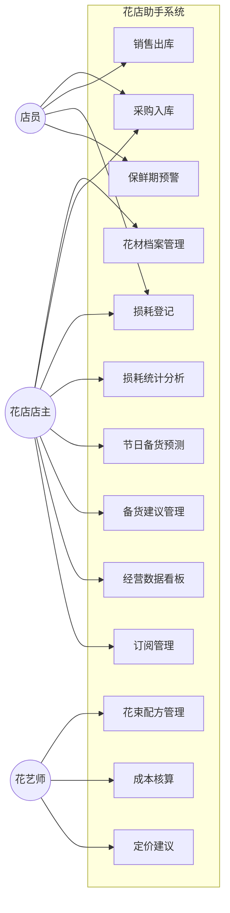
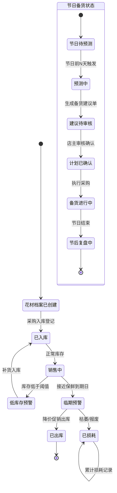

# 花店鲜花损耗与节日备货助手V1.0 - 用户需求规格说明书

# 1.需求概述

## 1.1 需求介绍

花店鲜花损耗与节日备货助手是一款面向小型独立花店（1-5人规模）的垂直行业工具型应用，聚焦鲜花损耗管理、节日备货预测与花束成本核算三大核心场景。鲜花行业损耗率普遍在20%-40%，节日备货量不准导致滞销或缺货是小花店最大的经营痛点，而现有通用库存管理工具无法覆盖鲜花保鲜期短、节日周期性强、花束组合复杂等行业特有属性。本产品以"花店鲜花损耗管理+节日备货预测+花束成本核算"为核心切入点，帮助花店店主实现从凭经验备货到数据驱动决策的转变。

### 1.1.1 所属领域

鲜花零售、花店经营管理、垂直行业SaaS

## 1.2 需求目标

- 帮助花店店主实时掌握每批花材的库存与损耗状况，降低花材损耗率
- 基于历史销售数据和节日日历，提供科学的节日备货预测建议，减少滞销与缺货
- 支持按花材用量自动核算花束成本，结合损耗率给出合理定价建议
- 为花店经营者提供损耗分析、销售趋势等数据看板，辅助经营决策
- 提供免费版（30种花材）和花店版（¥29/月）的分级商业模式，降低使用门槛

## 1.3 系统使用角色

本系统主要服务于三类用户角色：
1. **花店店主/经营者**：1-5人独立花店或社区花店的老板，负责日常采购、备货决策和经营分析，是系统的核心使用者
2. **花艺师**：花店中的花艺制作人员，使用花束成本核算功能进行花材用量管理和花束定价
3. **店员/助手**：花店中负责日常花材出入库操作、损耗登记的一线工作人员

## 1.4 业务流程图

# 2.功能原型

| 原型名称 | 原型链接 | 对应端 | 备注 |
| --- | --- | --- | --- |
| 花店助手-移动端小程序原型 | 待设计 | 小程序端 | MVP版本，花材管理/损耗登记/备货预测主要操作端 |
| 花店助手-PC管理后台原型 | 待设计 | WEB端 | 数据分析/报表/花束配方管理等复杂操作端 |

# 3.需求清单

## 3.1 花店助手-小程序端

| 序号 | 功能模块 | 一级功能 | 二级功能 | 功能描述 | 优先级 | 备注 |
| --- | --- | --- | --- | --- | --- | --- |
| 1 | 花材管理 | 花材档案 | 花材分类管理 | 支持创建花材分类（玫瑰/百合/康乃馨/配花/配草等），预设常见鲜花分类模板 | P0 | |
| 2 | | | 花材信息录入 | 录入花材基本信息：名称、分类、单位（支/扎/捆）、默认保鲜期（天）、参考进价 | P0 | |
| 3 | | | 花材档案列表 | 按分类/名称展示花材档案列表，支持搜索和筛选 | P0 | 免费版限30种 |
| 4 | 出入库管理 | 采购入库 | 入库登记 | 选择花材，录入批次号、数量、单价、到货日期，系统自动计算保鲜到期日 | P0 | |
| 5 | | | 批量入库 | 支持一次采购多种花材时批量录入入库信息 | P1 | |
| 6 | | | 入库记录查询 | 查看历史入库记录，按花材/日期/批次筛选 | P0 | |
| 7 | | 销售出库 | 出库登记 | 选择花材，录入出库数量和用途（销售/损耗/赠送/自用） | P0 | |
| 8 | | | 快速出库 | 常用花材快速出库，减少重复录入 | P1 | |
| 9 | 损耗管理 | 损耗登记 | 损耗录入 | 登记每日损耗：选择花材、批次、损耗数量、损耗原因（枯萎/折断/病变/其他） | P0 | |
| 10 | | | 损耗拍照 | 支持对损耗花材拍照记录，上传照片作为损耗凭证 | P2 | |
| 11 | | 损耗统计 | 损耗率概览 | 展示当前各花材的损耗率（损耗量/入库量），按时间周期（日/周/月）切换 | P0 | 花店版功能 |
| 12 | | | 损耗趋势图 | 以折线图展示损耗率随时间的变化趋势 | P1 | 花店版功能 |
| 13 | | | 损耗原因分析 | 饼图展示损耗原因分布，帮助定位损耗主要来源 | P1 | 花店版功能 |
| 14 | | 损耗预警 | 保鲜期预警 | 花材接近保鲜到期日（如剩余1-2天）时，自动推送预警提醒 | P0 | |
| 15 | | | 高损耗预警 | 某花材损耗率超过设定阈值（默认30%）时，推送预警提醒 | P1 | 花店版功能 |
| 16 | 节日备货 | 节日日历 | 节日列表 | 展示全年主要鲜花节日（情人节/母亲节/520/七夕/教师节/圣诞节等），标注距节日天数 | P0 | |
| 17 | | | 节日自定义 | 支持店主添加本地化节日或自定义促销节日 | P2 | |
| 18 | | 备货预测 | 历史数据分析 | 系统自动分析去年同期各花材的销量、损耗率数据 | P0 | 花店版功能 |
| 19 | | | 需求预测 | 基于历史数据和增长趋势，预测目标节日各花材的需求量 | P0 | 花店版功能 |
| 20 | | | 备货建议单 | 结合预测需求量和当前库存，生成各花材的备货建议数量清单 | P0 | 花店版功能 |
| 21 | | | 备货建议调整 | 店主可手动调整备货建议单中的花材和数量 | P1 | |
| 22 | | 备货执行 | 备货进度跟踪 | 查看备货计划的执行情况（已采购/待采购/已入库） | P1 | |
| 23 | | 节后复盘 | 备货准确性分析 | 节日过后对比预测量与实际销量，计算备货准确率，优化下次预测 | P2 | 花店版功能 |
| 24 | 花束管理 | 花束配方 | 配方创建 | 创建花束配方：输入配方名称，添加花材及用量（主花/配花/配叶/包装资材） | P0 | 花店版功能 |
| 25 | | | 配方模板 | 预设常见花束类型模板（红玫瑰花束/混搭花束/永生花盒等），支持快速修改 | P1 | 花店版功能 |
| 26 | | | 配方编辑 | 修改已有花束配方的花材组合和用量 | P0 | 花店版功能 |
| 27 | | 成本核算 | 自动成本计算 | 根据配方中各花材用量和最近采购均价，自动计算每束花的成本 | P0 | 花店版功能 |
| 28 | | | 损耗分摊 | 将花材损耗成本按比例分摊到花束成本中 | P1 | 花店版功能 |
| 29 | | | 定价建议 | 参考成本、历史售价、损耗率和目标利润率，给出建议零售价 | P0 | 花店版功能 |
| 30 | | | 手工调价 | 店主可在建议价基础上手动调整最终售价 | P0 | |
| 31 | 我的 | 个人中心 | 注册/登录 | 支持手机号注册登录、微信一键登录 | P0 | |
| 32 | | | 店铺信息管理 | 录入/编辑店铺名称、地址、联系方式等基本信息 | P1 | |
| 33 | | | 套餐与订阅 | 查看当前版本（免费版/花店版），管理订阅续费 | P0 | |
| 34 | | 数据看板 | 经营概览 | 今日/本周/本月的入库量、出库量、损耗量、销售额汇总 | P1 | 花店版功能 |
| 35 | | | 快捷操作入口 | 常用功能快捷入口：快速入库、损耗登记、备货查看 | P1 | |

## 3.2 花店助手-PC管理后台

| 序号 | 功能模块 | 一级功能 | 二级功能 | 功能描述 | 优先级 | 备注 |
| --- | --- | --- | --- | --- | --- | --- |
| 1 | 数据中心 | 经营报表 | 损耗分析报表 | 按花材/时段/原因维度分析损耗数据，支持导出Excel | P0 | 花店版功能 |
| 2 | | | 销售分析报表 | 按花材/花束/时段维度分析销售数据，支持导出Excel | P1 | 花店版功能 |
| 3 | | | 节日复盘报表 | 对比历年节日的备货量、实际销量、损耗量、备货准确率 | P1 | 花店版功能 |
| 4 | 花材管理 | 花材档案 | 花材批量管理 | 批量导入/导出花材档案，支持Excel模板 | P1 | |
| 5 | | | 供应商管理 | 维护花材供应商信息（名称、联系方式、常供花材、价格） | P2 | |
| 6 | 花束管理 | 配方管理 | 配方库管理 | 集中管理所有花束配方，支持搜索/筛选/批量操作 | P0 | 花店版功能 |
| 7 | | | 成本批量核算 | 花材进价变动时，自动批量重算所有关联花束的成本和建议售价 | P1 | 花店版功能 |
| 8 | 节日备货 | 备货管理 | 多年历史对比 | 对比近2-3年同期的销售数据，辅助节日备货决策 | P2 | 花店版功能 |
| 9 | | | 备货计划管理 | 创建/编辑/导出节日备货计划 | P1 | 花店版功能 |
| 10 | 系统设置 | 基础配置 | 保鲜期规则 | 配置各花材的默认保鲜期天数，用于自动计算到期日 | P0 | |
| 11 | | | 预警阈值设置 | 配置损耗率预警阈值、保鲜期预警提前天数 | P1 | |
| 12 | | | 节日日历配置 | 管理节日日历，添加/编辑节日日期和名称 | P0 | |
| 13 | | 多店管理 | 门店切换 | 支持花店版用户管理多个门店数据，独立或汇总查看 | P2 | 花店版功能 |

# 4.非功能需求

## 4.1 使用界面需求

| 需求项 | 详细描述 | 备注 |
| --- | --- | --- |
| 设计风格 | 清新、自然、简洁的花店风格，以绿色/粉色为主色调，传达鲜花行业氛围 | P0 |
| 移动端优先 | 小程序端为花店一线人员的主要操作端，交互设计需考虑手持操作、单手操作的便利性 | P0 |
| 操作效率 | 出入库和损耗登记需支持快速录入，减少点击步骤，常用操作不超过3步完成 | P0 |
| 数据可视化 | 损耗率、备货预测等数据以图表形式直观展示，降低数据理解门槛 | P1 |
| 空状态引导 | 首次使用时提供引导流程，帮助用户快速建立花材档案 | P1 |
| 离线可用 | 小程序端支持基础出入库操作的离线使用，联网后自动同步 | P2 |

## 4.2 软硬件环境需求

| 需求项 | 详细描述 | 备注 |
| --- | --- | --- |
| 客户端环境 | 微信小程序（iOS/Android），PC端Web浏览器（Chrome/Edge/Safari） | P0 |
| 后端环境 | 云端部署，支持弹性扩容（节日高峰期并发量激增） | P0 |
| 微信版本 | 微信7.0及以上版本 | P0 |

## 4.3 性能需求

| 需求项 | 详细描述 | 备注 |
| --- | --- | --- |
| 页面加载 | 主要页面加载时间 < 1.5秒 | P0 |
| 数据录入响应 | 入库/出库/损耗登记操作响应 < 0.5秒 | P0 |
| 预测计算 | 节日备货预测计算 < 3秒 | P0 |
| 报表生成 | 数据分析报表生成 < 5秒 | P1 |
| 系统容量 | 支持10万花店用户，节日高峰期（情人节前一周）支持5倍日常并发 | P0 |
| 数据同步 | 多端数据同步延迟 < 2秒 | P1 |

## 4.4 约束性需求

| 需求项 | 详细描述 | 备注 |
| --- | --- | --- |
| 免费版限制 | 免费版最多管理30种花材档案，不含损耗分析报表、节日备货预测、成本核算功能 | P0 |
| 花店版定价 | ¥29/月或¥288/年，不限花材数量，解锁全部高级功能 | P0 |
| 数据安全 | 用户数据加密存储，不同店铺数据严格隔离 | P0 |
| 后台服务 | 是，需要后台服务支撑数据存储、预测算法、支付等功能 | P0 |
| 不做通用库存 | 本系统不做通用库存管理，只聚焦鲜花损耗+节日备货+花束成本三个场景 | P0 |
| 不替代ERP | 不对接企业级ERP/财务系统，定位小花店轻量工具 | P0 |

# 5.接口需求

## 5.1 硬件接口需求

本产品不涉及硬件接口需求。

## 5.2 软件接口需求

| 模块 | 接口名称 | 输入 | 输出 | 功能描述 |
| --- | --- | --- | --- | --- |
| 用户认证 | 手机号登录 | 手机号、验证码 | 登录Token、用户信息 | 手机号+验证码登录 |
| | 微信登录 | 微信Code | 登录Token、用户信息 | 微信小程序一键登录 |
| 花材服务 | 花材档案CRUD | 花材数据 | 操作结果 | 花材档案的创建/查询/更新/删除 |
| | 花材分类管理 | 分类数据 | 操作结果 | 花材分类的创建/查询/更新/删除 |
| 出入库服务 | 入库登记 | 花材ID、批次、数量、单价、到货日期 | 入库记录ID | 记录花材采购入库 |
| | 出库登记 | 花材ID、数量、用途 | 出库记录ID | 记录花材出库（销售/损耗/赠送） |
| | 库存查询 | 花材ID/分类 | 库存列表 | 查询当前库存数量和状态 |
| 损耗服务 | 损耗登记 | 花材ID、批次、数量、原因 | 损耗记录ID | 登记花材损耗信息 |
| | 损耗统计 | 时间范围、花材ID | 损耗率、趋势数据 | 计算并返回损耗统计数据 |
| 节日备货服务 | 节日日历查询 | 年份 | 节日列表 | 获取全年节日日历 |
| | 备货预测 | 节日ID、历史数据 | 各花材预测需求量 | 基于历史数据预测节日花材需求 |
| | 备货建议单 | 预测结果、当前库存 | 备货清单 | 生成扣除库存后的备货建议 |
| 花束服务 | 配方管理 | 配方数据 | 操作结果 | 花束配方的创建/查询/更新/删除 |
| | 成本核算 | 配方ID、花材价格 | 成本明细、总成本 | 自动计算花束成本 |
| | 定价建议 | 成本、损耗率、利润率 | 建议售价 | 基于成本和利润率给出定价建议 |
| 支付服务 | 订阅支付 | 套餐类型 | 支付参数 | 花店版订阅微信支付 |
| | 支付回调 | 支付结果 | 确认信息 | 处理订阅支付结果 |
| 消息推送 | 微信订阅消息 | 消息模板、接收者OpenID | 推送结果 | 推送保鲜期预警、损耗预警、备货提醒 |

## 5.4 通讯接口需求

| 模块 | 接口名称 | 输入 | 输出 | 功能描述 |
| --- | --- | --- | --- | --- |
| 消息推送 | 微信订阅消息推送 | 消息内容、用户OpenID | 推送结果 | 向花店店主推送预警通知和备货提醒 |
| 数据同步 | 多端数据同步 | 操作数据、时间戳 | 同步结果 | 小程序端与PC后台之间的数据实时同步 |

# 6. 附录

## 流程图

### 花材入库到损耗登记流程

### 节日备货预测流程

## 时序图

详见附录流程图章节中的时序图描述。

## （用户与系统交互）用例图

## （系统）状态图

