| 版本号 | 变更日期 | 变更内容 | 变更人 | 审核人 |
| --- | --- | --- | --- | --- |
| V1.0 | 2026-06-26 | 初始版本创建 | 产品文档结对写作专家 | 阶段一产品落地页文档总编辑 |

---
# 1 概述

## 1.1 需求背景

随着中国老龄化进程加速，家庭药箱管理已成为一个普遍而刚性的痛点。据调查，超过60%的家庭存在药品过期未发现、漏服忘服、药品库存混乱等问题。对于需要长期用药的慢病患者（高血压、糖尿病等）和负责照护的子女而言，"记不住吃什么药、不知道药还有没有、不清楚药是否过期"是日常生活中反复出现的困扰。

现有市场上的药品管理工具大多面向医院或药房场景，功能复杂、学习成本高，缺乏针对家庭场景的轻量化工具。微信小程序作为国民级应用，覆盖率高、使用门槛低，是承载家庭药品管理功能的理想载体。

本产品旨在打造一款**小众但刚需**的家庭药品管理工具，核心价值主张为：**不做医疗诊断，只做家庭药品库存管理和服药提醒**。通过扫码/拍照快速录入、智能服药提醒、库存告警与补药清单、家庭照护协同四大核心能力，帮助家庭用户实现药品管理的数字化和规范化。

**预期达成目标：**
1. MVP阶段5-7天完成开发上线
2. 免费版支持1名成员+20种药品，降低用户尝试门槛
3. 家庭版（¥12/月）解锁多成员协同和云同步，实现商业变现
4. 核心操作路径（录入药品、确认服药）不超过3步，适合老年人使用

## 1.2 名词解释

| **名词** | **说明** |
| --- | --- |
| 用药成员 | 需要长期服药的家庭成员，是服药提醒的直接接收者 |
| 照护者 | 负责远程照护的家庭成员（如子女），可查看患者服药情况并接收漏服通知 |
| 家庭管理员 | 创建家庭账号、邀请成员加入的高级角色，通常由家庭中负责统筹的子女担任 |
| OCR | Optical Character Recognition，光学字符识别，用于从药品包装照片中提取文字信息 |
| 服药提醒窗口 | 从提醒时间开始，到判定为漏服的时间范围（默认30分钟，可配置） |
| 临期阈值 | 用户自定义的天数，当药品有效期距当前日期小于等于该值时触发临期提醒（默认30天） |
| 最低库存线 | 用户可按药品设置的剩余数量下限，当实际数量低于该值时触发库存不足提醒 |
| 补药清单 | 系统自动汇总的需补充药品列表，包含已触发临期或库存不足提醒的药品 |
| 订阅消息 | 微信小程序的消息推送机制，用于发送服药提醒和告警通知 |
| 漏服 | 在设定的服药提醒窗口内，用药成员未确认服药的状态 |
| 补服 | 漏服后，由照护者手动标记为"已补服"的操作 |

## 1.3 产品介绍

### 1.3.1 范围说明

| 项 | 内容 |
| --- | --- |
| 包含功能 | 药品录入（扫码/拍照OCR/手动）、药品列表与详情管理、服药提醒设置与通知、服药确认与漏服检测、服药记录与统计、库存告警（临期/不足/紧急）、补药清单生成与管理、家庭账号创建与成员管理、数据共享与同步、订阅管理（免费版/家庭版）、数据导出、提醒偏好设置 |
| 不包含功能 | 医疗诊断功能、用药建议或处方功能、在线问诊、药品购买（电商功能）、医院/药房系统对接、药品不良反应报告 |

本产品面向以下目标用户：
- **需要长期用药的老人家庭及其子女**：父母需要每天服用多种慢病药物，子女希望远程了解父母服药情况
- **多成员家庭中负责照护的人**：需要协调多位家人的用药管理
- **慢病患者（高血压、糖尿病等）**：需要规律服药并追踪服药记录，以便就医时提供给医生参考

产品核心价值：
1. **降低录入门槛**：扫码/拍照即可识别药品信息，老年人无需手动输入
2. **服药不遗漏**：定时提醒+漏服通知+家属确认，形成完整的服药闭环
3. **药品不浪费**：实时监控有效期和库存，临期预警避免药品过期
4. **家庭共照护**：子女可远程查看父母服药情况，实现跨地域的家庭关怀

---
# 2 产品设计

## 2.1 系统架构图

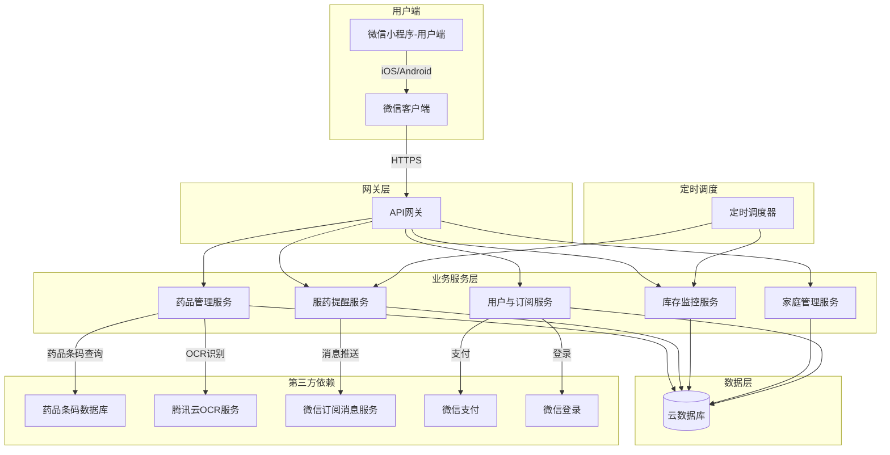
```mermaid
graph TD
    subgraph 用户端
        A[微信小程序-用户端] --> |iOS/Android| B[微信客户端]
    end

    subgraph 网关层
        B --> |HTTPS| C[API网关]
    end

    subgraph 业务服务层
        C --> D[药品管理服务]
        C --> E[服药提醒服务]
        C --> F[库存监控服务]
        C --> G[家庭管理服务]
        C --> H[用户与订阅服务]
    end

    subgraph 数据层
        D --> I[(云数据库)]
        E --> I
        F --> I
        G --> I
        H --> I
    end

    subgraph 第三方依赖
        D --> |药品条码查询| J[药品条码数据库]
        D --> |OCR识别| K[腾讯云OCR服务]
        E --> |消息推送| L[微信订阅消息服务]
        H --> |支付| M[微信支付]
        H --> |登录| N[微信登录]
    end

    subgraph 定时调度
        O[定时调度器] --> E
        O --> F
    end
```

## 2.2 业务模块图

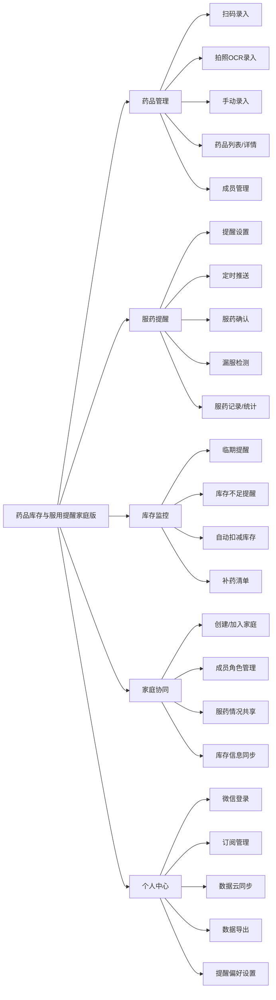
```mermaid
flowchart LR
    A[药品库存与服用提醒家庭版] --> B[药品管理]
    A --> C[服药提醒]
    A --> D[库存监控]
    A --> E[家庭协同]
    A --> F[个人中心]

    B --> B1[扫码录入]
    B --> B2[拍照OCR录入]
    B --> B3[手动录入]
    B --> B4[药品列表/详情]
    B --> B5[成员管理]

    C --> C1[提醒设置]
    C --> C2[定时推送]
    C --> C3[服药确认]
    C --> C4[漏服检测]
    C --> C5[服药记录/统计]

    D --> D1[临期提醒]
    D --> D2[库存不足提醒]
    D --> D3[自动扣减库存]
    D --> D4[补药清单]

    E --> E1[创建/加入家庭]
    E --> E2[成员角色管理]
    E --> E3[服药情况共享]
    E --> E4[库存信息同步]

    F --> F1[微信登录]
    F --> F2[订阅管理]
    F --> F3[数据云同步]
    F --> F4[数据导出]
    F --> F5[提醒偏好设置]
```

## 2.3 主业务流程

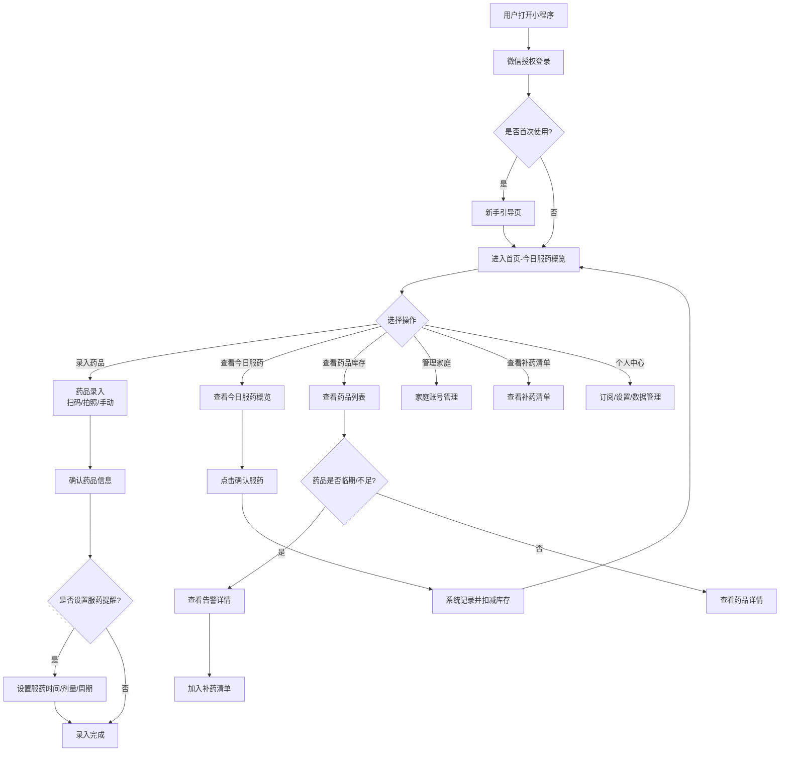
```mermaid
flowchart TD
    A[用户打开小程序] --> B[微信授权登录]
    B --> C{是否首次使用?}
    C -->|是| D[新手引导页]
    C -->|否| E[进入首页-今日服药概览]
    D --> E

    E --> F{选择操作}
    F -->|录入药品| G[药品录入<br/>扫码/拍照/手动]
    F -->|查看今日服药| H[查看今日服药概览]
    F -->|查看药品库存| I[查看药品列表]
    F -->|管理家庭| J[家庭账号管理]
    F -->|查看补药清单| K[查看补药清单]
    F -->|个人中心| L[订阅/设置/数据管理]

    G --> M[确认药品信息]
    M --> N{是否设置服药提醒?}
    N -->|是| O[设置服药时间/剂量/周期]
    N -->|否| P[录入完成]
    O --> P

    H --> Q[点击确认服药]
    Q --> R[系统记录并扣减库存]
    R --> E

    I --> S{药品是否临期/不足?}
    S -->|是| T[查看告警详情]
    T --> U[加入补药清单]
    S -->|否| V[查看药品详情]
```

## 2.4 功能图/列表

| 功能模块 | 功能名称 | 优先级 | 功能描述 |
| --- | --- | --- | --- |
| 药品管理 | 扫码录入 | P0 | 扫描药品条形码，自动匹配药品库信息并填充 |
| 药品管理 | 拍照OCR录入 | P0 | 拍摄药品包装/说明书，OCR识别关键信息 |
| 药品管理 | 手动录入 | P0 | 手动输入完整药品信息，作为兜底方式 |
| 药品管理 | 药品信息编辑 | P0 | 修改已录入药品的有效期、数量、服用说明等 |
| 药品管理 | 药品列表总览 | P0 | 以卡片形式展示成员名下所有药品及状态 |
| 药品管理 | 药品详情查看 | P1 | 查看药品详细信息、服药记录、库存变化 |
| 药品管理 | 药品搜索 | P1 | 按药品名称搜索已录入药品 |
| 药品管理 | 删除药品 | P1 | 删除不再需要的药品记录 |
| 药品管理 | 添加用药成员 | P0 | 为家庭成员建立用药档案 |
| 药品管理 | 切换成员视图 | P0 | 切换查看不同成员的药品和记录 |
| 服药提醒 | 创建服药提醒 | P0 | 为指定成员的药品设置服药时间、剂量、周期 |
| 服药提醒 | 编辑服药提醒 | P1 | 修改已有提醒配置 |
| 服药提醒 | 删除/暂停提醒 | P1 | 删除或暂停某个服药提醒 |
| 服药提醒 | 定时推送提醒 | P0 | 通过微信订阅消息发送服药提醒 |
| 服药提醒 | 服药确认 | P0 | 用户在小程序内点击"已服药"确认 |
| 服药提醒 | 漏服检测与提醒 | P0 | 超时未确认标记为漏服，通知照护者 |
| 服药提醒 | 今日服药概览 | P0 | 展示今日所有药品服药状态 |
| 服药提醒 | 历史服药记录 | P1 | 日历视图查看历史服药完成情况 |
| 服药提醒 | 漏服记录查看 | P1 | 展示所有漏服记录 |
| 服药提醒 | 服药统计 | P2 | 统计服药依从性和完成率 |
| 库存监控 | 临期提醒 | P0 | 有效期≤阈值时推送临期提醒 |
| 库存监控 | 库存不足提醒 | P0 | 剩余数量≤最低库存线时推送提醒 |
| 库存监控 | 紧急临期提醒 | P0 | 有效期≤7天时发送紧急提醒 |
| 库存监控 | 手动更新库存 | P1 | 手动调整剩余数量 |
| 库存监控 | 服药自动扣减 | P0 | 确认服药后自动扣减库存 |
| 库存监控 | 生成补药清单 | P1 | 自动汇总需补充的药品 |
| 库存监控 | 查看补药清单 | P1 | 查看待补充药品清单 |
| 库存监控 | 导出/分享清单 | P2 | 以图片或文字形式导出清单 |
| 库存监控 | 标记已补药 | P1 | 标记已完成补药并录入新批次 |
| 家庭协同 | 创建家庭 | P1 | 创建家庭账号，生成邀请码 |
| 家庭协同 | 加入家庭 | P1 | 通过邀请码或链接加入家庭 |
| 家庭协同 | 成员管理 | P1 | 查看成员列表，设置角色，移除成员 |
| 家庭协同 | 服药情况共享 | P1 | 照护者实时查看成员服药状态 |
| 家庭协同 | 库存信息同步 | P1 | 家庭成员共享药品库存视图 |
| 家庭协同 | 提醒通知共享 | P1 | 照护者接收漏服通知和库存告警 |
| 个人中心 | 微信登录 | P0 | 微信授权快捷登录 |
| 个人中心 | 个人信息管理 | P2 | 查看和修改基本信息 |
| 个人中心 | 消息订阅授权 | P0 | 引导用户授权订阅消息权限 |
| 个人中心 | 订阅套餐查看 | P1 | 查看当前订阅状态和到期时间 |
| 个人中心 | 升级家庭版 | P1 | 从免费版升级到家庭版（¥12/月） |
| 个人中心 | 数据云同步 | P1 | 家庭版用户数据云端同步 |
| 个人中心 | 数据导出 | P2 | 导出服药记录为Excel/PDF |
| 个人中心 | 提醒偏好设置 | P1 | 设置提醒提前时间、漏服窗口、免打扰时段 |
| 个人中心 | 临期阈值设置 | P2 | 自定义临期提醒天数阈值 |

## 2.5 你的产品有哪些端

| 序号 | 端名称 | 端类型 | 目标用户 | 说明 |
| --- | --- | --- | --- | --- |
| 1 | 用户端小程序 | 小程序端 | 用药成员（患者）、照护者（家属）、家庭管理员 | 微信小程序，MVP阶段唯一载体。用药成员在手机上查看提醒、确认服药、录入药品；照护者查看家人服药情况、接收漏服通知；家庭管理员管理家庭成员和订阅 |

---
# 3 产品功能

## 3.1 用户端小程序功能

### 3.1.1 药品扫码录入

功能描述：用户通过扫描药品包装上的条形码，系统自动匹配药品库信息（药品名称、规格、厂家），匹配成功后自动填充，用户仅需补充有效期、数量和服用说明。

优先级与依赖说明：

| 项 | 内容 |
| --- | --- |
| 优先级 | P0 |
| 依赖需求 | URS-3.1.1 扫码录入 |
| 前置条件 | 用户已登录小程序，已授权摄像头权限，已选择用药成员 |

### 3.1.2 药品扫码录入—详细流程

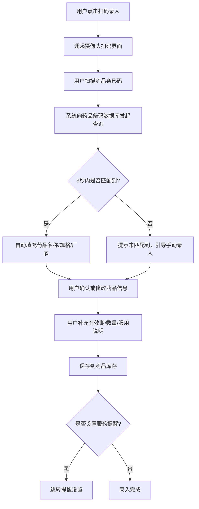
```mermaid
flowchart TD
    A[用户点击扫码录入] --> B[调起摄像头扫码界面]
    B --> C[用户扫描药品条形码]
    C --> D[系统向药品条码数据库发起查询]
    D --> E{3秒内是否匹配到?}
    E -->|是| F[自动填充药品名称/规格/厂家]
    E -->|否| G[提示未匹配到，引导手动录入]
    F --> H[用户确认或修改药品信息]
    G --> H
    H --> I[用户补充有效期/数量/服用说明]
    I --> J[保存到药品库存]
    J --> K{是否设置服药提醒?}
    K -->|是| L[跳转提醒设置]
    K -->|否| M[录入完成]
```

业务规则说明：
1. 扫码响应时间不超过3秒，超时自动切换为手动录入模式
2. 条码匹配结果仅供参考，用户始终可修改所有字段
3. 同一药品（相同条码或相同名称+规格）不可重复录入，提示已存在并引导编辑
4. 有效期必须晚于当前日期，否则提示"药品已过期，是否仍要录入？"

### 3.1.3 药品扫码录入—主要原型

[药品扫码录入原型](assets/prototypes/drug-scan-input-widget.html)

验收标准说明：
- [ ] 正常流程：扫描已知条码后3秒内自动填充药品信息，用户可修改并保存
- [ ] 正常流程：扫描未知条码后提示手动录入，手动填写后可正常保存
- [ ] 异常流程：网络超时3秒后自动切换手动录入模式
- [ ] 异常流程：药品已存在时弹出提示并提供编辑入口
- [ ] 性能要求：扫码到展示结果不超过3秒

### 3.1.4 药品拍照OCR录入

功能描述：用户拍摄药品包装或说明书照片，系统通过OCR识别药品名称、有效期、规格等关键信息，展示识别结果供用户确认或修改。

优先级与依赖说明：

| 项 | 内容 |
| --- | --- |
| 优先级 | P0 |
| 依赖需求 | URS-3.1.1 拍照OCR录入 |
| 前置条件 | 用户已登录小程序，已授权摄像头权限，已选择用药成员 |

### 3.1.5 药品拍照OCR录入—详细流程

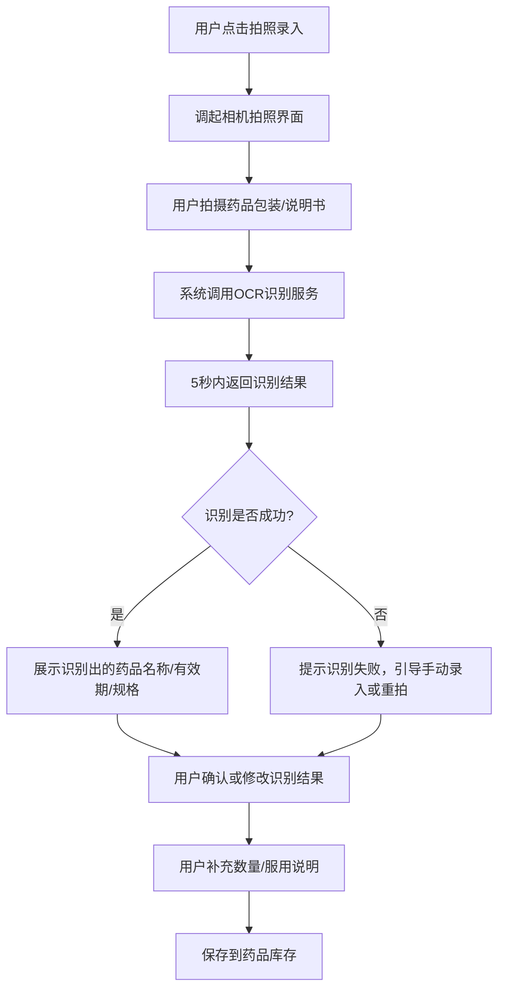
```mermaid
flowchart TD
    A[用户点击拍照录入] --> B[调起相机拍照界面]
    B --> C[用户拍摄药品包装/说明书]
    C --> D[系统调用OCR识别服务]
    D --> E[5秒内返回识别结果]
    E --> F{识别是否成功?}
    F -->|是| G[展示识别出的药品名称/有效期/规格]
    F -->|否| H[提示识别失败，引导手动录入或重拍]
    G --> I[用户确认或修改识别结果]
    H --> I
    I --> J[用户补充数量/服用说明]
    J --> K[保存到药品库存]
```

业务规则说明：
1. OCR识别结果必须展示给用户确认，不允许直接写入正式库存
2. 识别响应时间不超过5秒
3. 用户可逐项修改识别结果中的每个字段
4. 支持重新拍照替换当前识别结果

### 3.1.6 药品拍照OCR录入—主要原型

[药品拍照OCR录入原型](assets/prototypes/drug-ocr-input-widget.html)

验收标准说明：
- [ ] 正常流程：拍照后5秒内展示识别结果，用户可逐项修改并保存
- [ ] 异常流程：识别失败时提供重拍和手动录入两个入口
- [ ] 性能要求：拍照到展示识别结果不超过5秒

### 3.1.7 手动录入药品

功能描述：用户手动输入药品名称、规格、有效期、剩余数量、用法用量、服用说明等完整信息。作为扫码和OCR识别失败时的兜底录入方式。

优先级与依赖说明：

| 项 | 内容 |
| --- | --- |
| 优先级 | P0 |
| 依赖需求 | URS-3.1.1 手动录入 |
| 前置条件 | 用户已登录小程序，已选择用药成员 |

### 3.1.8 手动录入药品—详细流程

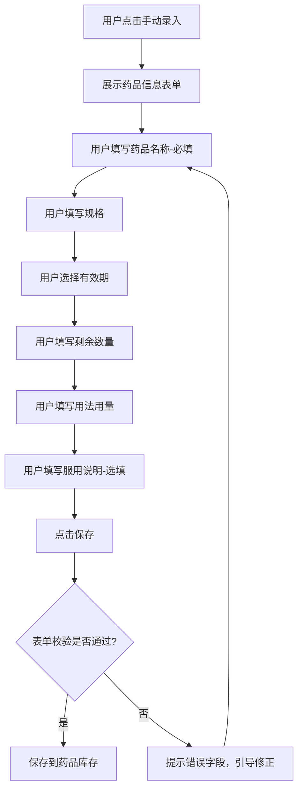
```mermaid
flowchart TD
    A[用户点击手动录入] --> B[展示药品信息表单]
    B --> C[用户填写药品名称-必填]
    C --> D[用户填写规格]
    D --> E[用户选择有效期]
    E --> F[用户填写剩余数量]
    F --> G[用户填写用法用量]
    G --> H[用户填写服用说明-选填]
    H --> I[点击保存]
    I --> J{表单校验是否通过?}
    J -->|是| K[保存到药品库存]
    J -->|否| L[提示错误字段，引导修正]
    L --> C
```

业务规则说明：
1. 药品名称为必填项，不可为空
2. 有效期必须选择未来日期，选择过去日期时提示确认
3. 剩余数量默认为1，最小为0
4. 用法用量包含：每次剂量（如"1片""5ml"）、每日次数、服药时间建议

### 3.1.9 手动录入药品—主要原型

[手动录入药品原型](assets/prototypes/drug-manual-input-widget.html)

验收标准说明：
- [ ] 正常流程：填写必填项后可正常保存，选填项为空不影响保存
- [ ] 异常流程：药品名称为空时保存按钮置灰或提示必填
- [ ] 异常流程：有效期选择过去日期时弹出确认对话框

### 3.1.10 药品列表总览

功能描述：以卡片形式展示当前用药成员名下的所有药品，显示药品名称、剩余数量、有效期状态（正常/临期/过期），支持按成员筛选。

优先级与依赖说明：

| 项 | 内容 |
| --- | --- |
| 优先级 | P0 |
| 依赖需求 | URS-3.1.1 药品总览 |
| 前置条件 | 用户已登录，至少录入一种药品 |

### 3.1.11 药品列表总览—详细流程

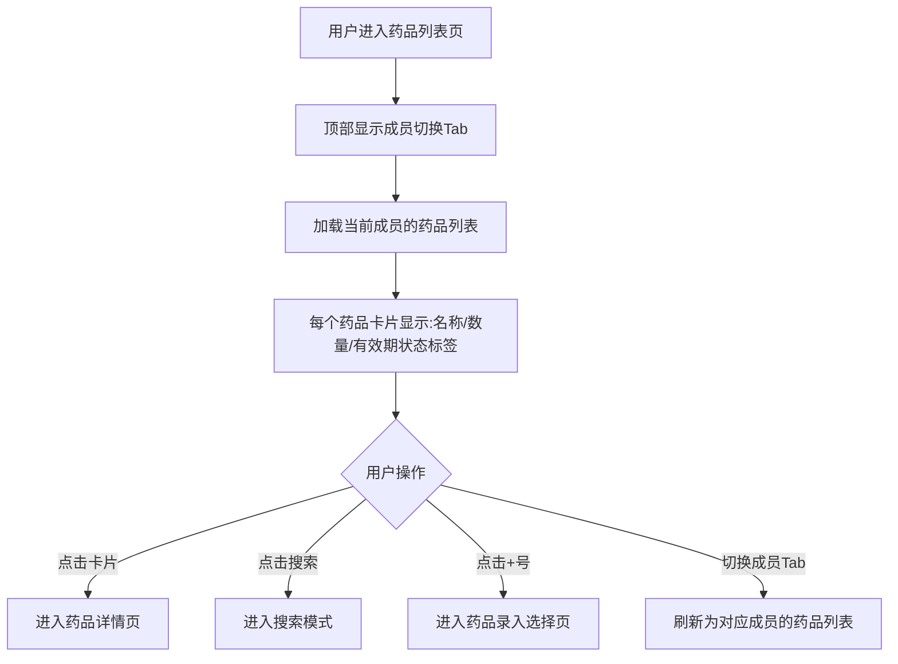
```mermaid
flowchart TD
    A[用户进入药品列表页] --> B[顶部显示成员切换Tab]
    B --> C[加载当前成员的药品列表]
    C --> D[每个药品卡片显示:名称/数量/有效期状态标签]
    D --> E{用户操作}
    E -->|点击卡片| F[进入药品详情页]
    E -->|点击搜索| G[进入搜索模式]
    E -->|点击+号| H[进入药品录入选择页]
    E -->|切换成员Tab| I[刷新为对应成员的药品列表]
```

业务规则说明：
1. 药品卡片按有效期紧迫程度排序：过期→紧急临期（≤7天）→临期（≤30天）→正常
2. 有效期状态标签颜色：过期=红色，紧急临期=橙色，临期=黄色，正常=绿色
3. 列表为空时展示空状态引导："还没有药品，点击+号开始录入"
4. 支持上拉加载更多（每页20条）

### 3.1.12 药品列表总览—主要原型

[药品列表总览原型](assets/prototypes/drug-list-widget.html)

验收标准说明：
- [ ] 正常流程：药品卡片正确显示名称、数量、有效期状态标签
- [ ] 正常流程：点击卡片进入详情页，切换成员Tab刷新列表
- [ ] 异常流程：列表为空时展示空状态引导
- [ ] 性能要求：首屏加载不超过2秒

### 3.1.13 药品详情查看

功能描述：点击某个药品可查看详情，包括药品基本信息、服用说明、服药记录、库存变化趋势。

优先级与依赖说明：

| 项 | 内容 |
| --- | --- |
| 优先级 | P1 |
| 依赖需求 | URS-3.1.1 药品详情查看 |
| 前置条件 | 药品已录入 |

### 3.1.14 药品详情查看—详细流程

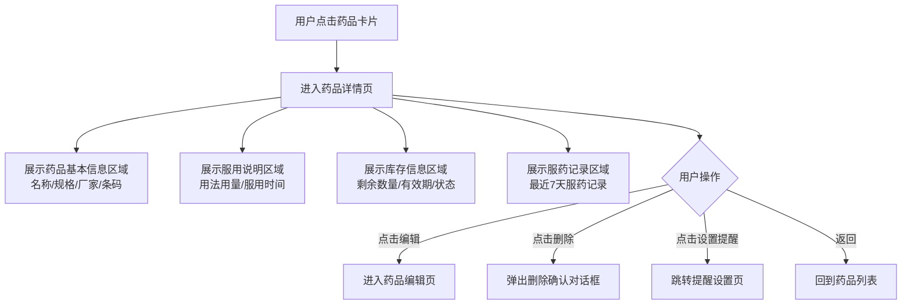
```mermaid
flowchart TD
    A[用户点击药品卡片] --> B[进入药品详情页]
    B --> C[展示药品基本信息区域<br/>名称/规格/厂家/条码]
    B --> D[展示服用说明区域<br/>用法用量/服用时间]
    B --> E[展示库存信息区域<br/>剩余数量/有效期/状态]
    B --> F[展示服药记录区域<br/>最近7天服药记录]
    B --> G{用户操作}
    G -->|点击编辑| H[进入药品编辑页]
    G -->|点击删除| I[弹出删除确认对话框]
    G -->|点击设置提醒| J[跳转提醒设置页]
    G -->|返回| K[回到药品列表]
```

业务规则说明：
1. 服药记录默认展示最近7天，可切换为30天或全部
2. 库存变化趋势以简单折线图展示近30天数量变化
3. 删除药品前需二次确认，确认后同步清除相关服药记录和提醒
4. 编辑页允许修改除条码外的所有字段

### 3.1.15 药品详情查看—主要原型

[药品详情查看原型](assets/prototypes/drug-detail-widget.html)

验收标准说明：
- [ ] 正常流程：详情页完整展示药品信息、服用说明、库存状态、近期服药记录
- [ ] 正常流程：编辑和删除操作正常工作
- [ ] 异常流程：删除时弹出确认对话框，取消后不执行删除

### 3.1.16 创建服药提醒

功能描述：为指定用药成员的某种药品设置服药提醒，包括服药时间（支持每天多次）、每次剂量、服药周期（长期/指定日期范围）、提醒方式。

优先级与依赖说明：

| 项 | 内容 |
| --- | --- |
| 优先级 | P0 |
| 依赖需求 | URS-3.1.2 创建服药提醒 |
| 前置条件 | 药品已录入，用户已授权订阅消息权限 |

### 3.1.17 创建服药提醒—详细流程

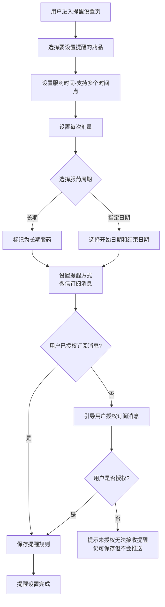
```mermaid
flowchart TD
    A[用户进入提醒设置页] --> B[选择要设置提醒的药品]
    B --> C[设置服药时间-支持多个时间点]
    C --> D[设置每次剂量]
    D --> E{选择服药周期}
    E -->|长期| F[标记为长期服药]
    E -->|指定日期| G[选择开始日期和结束日期]
    F --> H[设置提醒方式<br/>微信订阅消息]
    G --> H
    H --> I{用户已授权订阅消息?}
    I -->|是| J[保存提醒规则]
    I -->|否| K[引导用户授权订阅消息]
    K --> L{用户是否授权?}
    L -->|是| J
    L -->|否| M[提示未授权无法接收提醒<br/>仍可保存但不会推送]
    J --> N[提醒设置完成]
```

业务规则说明：
1. 每个药品可设置多个时间点（如早8:00、午12:00、晚18:00）
2. 服药周期可选择"长期"或"指定日期范围"
3. 未授权订阅消息的用户仍可保存提醒，但无法接收推送通知
4. 提醒创建后，系统定时调度器按规则触发提醒事件

### 3.1.18 创建服药提醒—主要原型

[创建服药提醒原型](assets/prototypes/reminder-create-widget.html)

验收标准说明：
- [ ] 正常流程：选择药品后可设置多个时间点、剂量、周期，保存成功
- [ ] 正常流程：已授权用户保存后提醒立即生效
- [ ] 异常流程：未授权用户保存时引导授权

### 3.1.19 服药确认

功能描述：用药成员收到服药提醒后，可在小程序内点击"已服药"进行确认，系统记录确认时间并自动扣减库存。

优先级与依赖说明：

| 项 | 内容 |
| --- | --- |
| 优先级 | P0 |
| 依赖需求 | URS-3.1.2 服药确认 |
| 前置条件 | 服药提醒已创建且时间已到 |

### 3.1.20 服药确认—详细流程

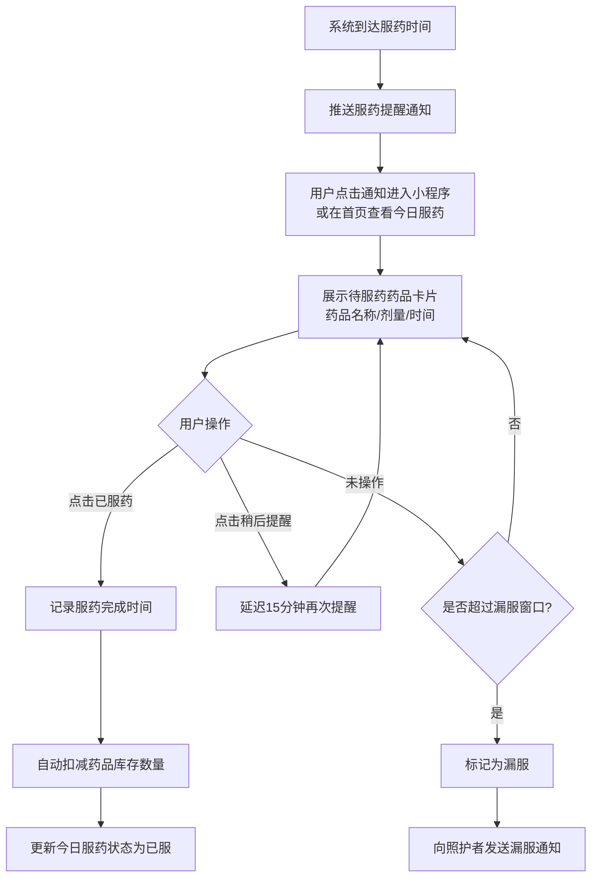
```mermaid
flowchart TD
    A[系统到达服药时间] --> B[推送服药提醒通知]
    B --> C[用户点击通知进入小程序<br/>或在首页查看今日服药]
    C --> D[展示待服药药品卡片<br/>药品名称/剂量/时间]
    D --> E{用户操作}
    E -->|点击已服药| F[记录服药完成时间]
    E -->|点击稍后提醒| G[延迟15分钟再次提醒]
    E -->|未操作| H{是否超过漏服窗口?}
    F --> I[自动扣减药品库存数量]
    I --> J[更新今日服药状态为已服]
    G --> D
    H -->|否| D
    H -->|是| K[标记为漏服]
    K --> L[向照护者发送漏服通知]
```

业务规则说明：
1. 确认服药后，该药品剩余数量自动减去过本次剂量
2. 若剩余数量不足（如不够一次剂量），提示"库存不足，请及时补药"
3. 漏服窗口默认30分钟，可在设置中自定义（15/30/60分钟）
4. "稍后提醒"最多延迟3次，之后不再延迟

### 3.1.21 服药确认—主要原型

[服药确认原型](assets/prototypes/medicine-confirm-widget.html)

验收标准说明：
- [ ] 正常流程：点击"已服药"后状态更新为已服，库存自动扣减
- [ ] 正常流程：点击"稍后提醒"后15分钟再次提醒
- [ ] 异常流程：库存不足时弹出提示
- [ ] 异常流程：超过漏服窗口后自动标记漏服并通知照护者

### 3.1.22 今日服药概览

功能描述：展示今日所有药品的服药状态（已服/未服/漏服），以时间线或卡片形式呈现。

优先级与依赖说明：

| 项 | 内容 |
| --- | --- |
| 优先级 | P0 |
| 依赖需求 | URS-3.1.2 今日服药概览 |
| 前置条件 | 用户已登录，至少有一个服药提醒 |

### 3.1.23 今日服药概览—详细流程

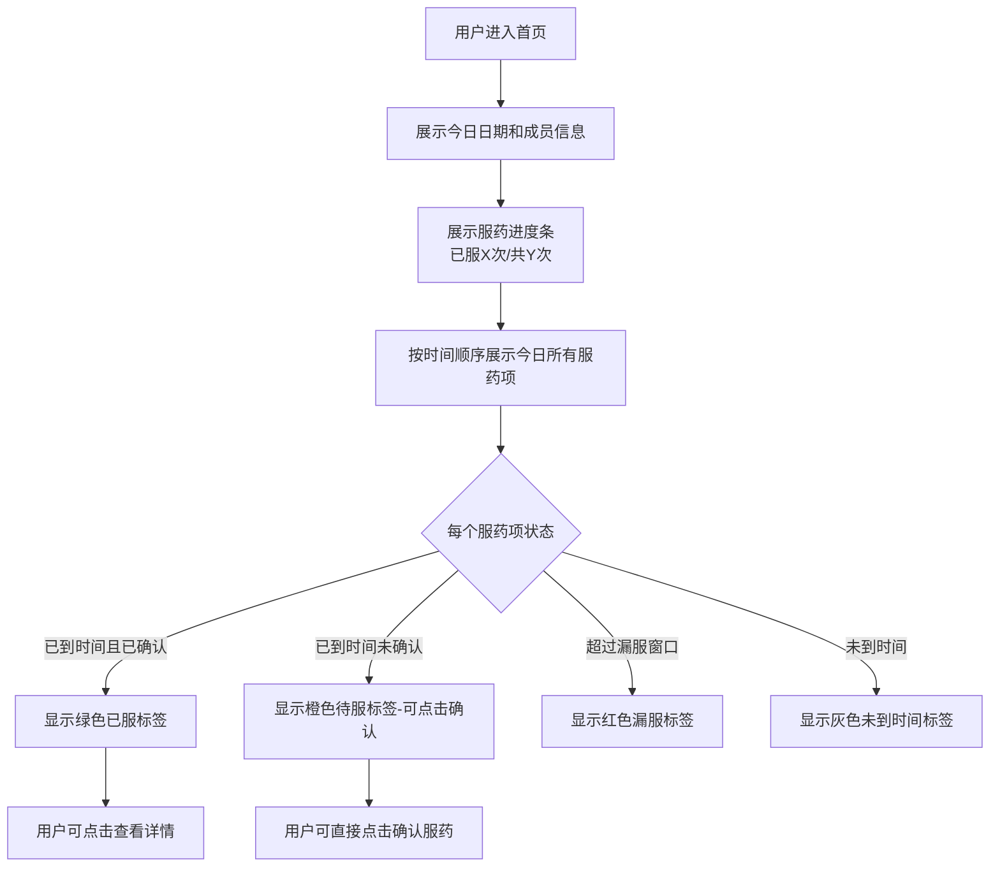
```mermaid
flowchart TD
    A[用户进入首页] --> B[展示今日日期和成员信息]
    B --> C[展示服药进度条<br/>已服X次/共Y次]
    C --> D[按时间顺序展示今日所有服药项]
    D --> E{每个服药项状态}
    E -->|已到时间且已确认| F[显示绿色已服标签]
    E -->|已到时间未确认| G[显示橙色待服标签-可点击确认]
    E -->|超过漏服窗口| H[显示红色漏服标签]
    E -->|未到时间| I[显示灰色未到时间标签]
    F --> J[用户可点击查看详情]
    G --> K[用户可直接点击确认服药]
```

业务规则说明：
1. 首页默认展示当前选中成员的今日服药概览
2. 服药项按时间从早到晚排列
3. 进度条显示完成比例，如"3/5已完成"
4. 全部完成时显示"今日服药已全部完成 ✓"

### 3.1.24 今日服药概览—主要原型

[今日服药概览原型](assets/prototypes/today-overview-widget.html)

验收标准说明：
- [ ] 正常流程：正确展示今日所有服药项及其状态
- [ ] 正常流程：可从未服药项直接点击确认服药
- [ ] 正常流程：进度条正确显示完成比例

### 3.1.25 库存告警（临期/不足/紧急）

功能描述：当药品有效期距当前日期≤设定阈值时推送临期提醒，当剩余数量≤最低库存线时推送库存不足提醒，有效期≤7天时发送紧急临期提醒。

优先级与依赖说明：

| 项 | 内容 |
| --- | --- |
| 优先级 | P0 |
| 依赖需求 | URS-3.1.3 临期提醒/库存不足提醒/紧急临期提醒 |
| 前置条件 | 药品已录入且设置了有效期和最低库存线 |

### 3.1.26 库存告警—详细流程

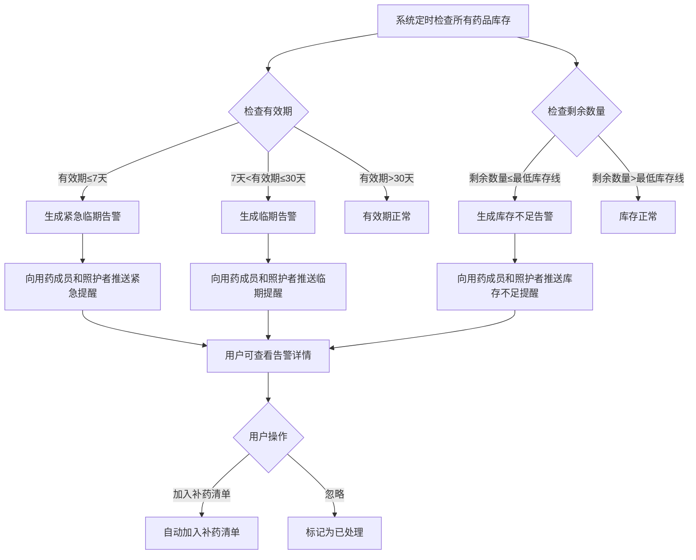
```mermaid
flowchart TD
    A[系统定时检查所有药品库存] --> B{检查有效期}
    B -->|有效期≤7天| C[生成紧急临期告警]
    B -->|7天<有效期≤30天| D[生成临期告警]
    B -->|有效期>30天| E[有效期正常]
    A --> F{检查剩余数量}
    F -->|剩余数量≤最低库存线| G[生成库存不足告警]
    F -->|剩余数量>最低库存线| H[库存正常]
    C --> I[向用药成员和照护者推送紧急提醒]
    D --> J[向用药成员和照护者推送临期提醒]
    G --> K[向用药成员和照护者推送库存不足提醒]
    I --> L[用户可查看告警详情]
    J --> L
    K --> L
    L --> M{用户操作}
    M -->|加入补药清单| N[自动加入补药清单]
    M -->|忽略| O[标记为已处理]
```

业务规则说明：
1. 临期阈值默认30天，用户可自定义（7/14/30/60/90天）
2. 最低库存线默认按药品设置，初始值为3
3. 紧急临期提醒（≤7天）每天推送一次直到处理或过期
4. 同一药品同一天不重复推送相同类型的告警

### 3.1.27 库存告警—主要原型

[库存告警原型](assets/prototypes/stock-alert-widget.html)

验收标准说明：
- [ ] 正常流程：临期/不足/紧急三种告警正确触发并展示
- [ ] 正常流程：用户可将告警药品加入补药清单
- [ ] 异常流程：同一天不重复推送相同类型告警

### 3.1.28 补药清单

功能描述：系统自动将已触发库存不足或临期提醒的药品汇总生成补药清单，用户可查看、导出/分享、标记已补药。

优先级与依赖说明：

| 项 | 内容 |
| --- | --- |
| 优先级 | P1 |
| 依赖需求 | URS-3.1.3 补药清单 |
| 前置条件 | 至少有一个药品触发了库存告警 |

### 3.1.29 补药清单—详细流程

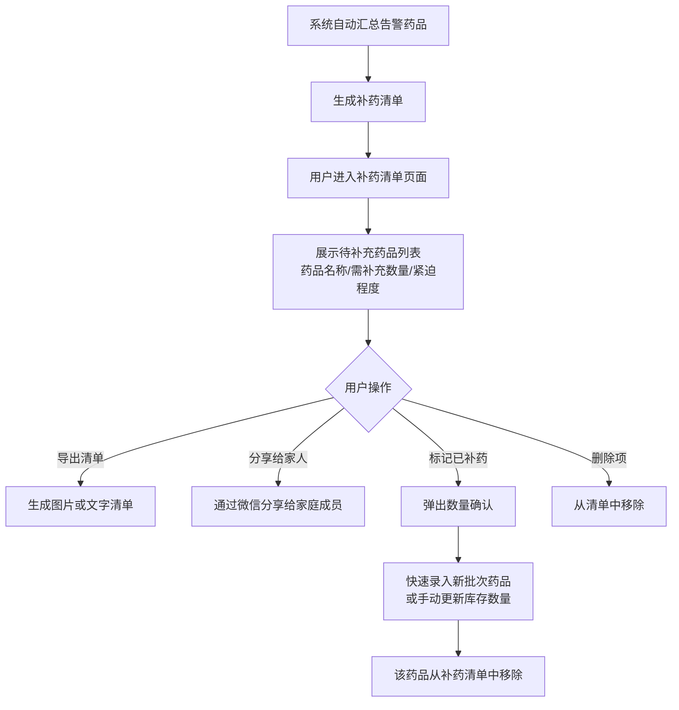
```mermaid
flowchart TD
    A[系统自动汇总告警药品] --> B[生成补药清单]
    B --> C[用户进入补药清单页面]
    C --> D[展示待补充药品列表<br/>药品名称/需补充数量/紧迫程度]
    D --> E{用户操作}
    E -->|导出清单| F[生成图片或文字清单]
    E -->|分享给家人| G[通过微信分享给家庭成员]
    E -->|标记已补药| H[弹出数量确认]
    E -->|删除项| I[从清单中移除]
    H --> J[快速录入新批次药品<br/>或手动更新库存数量]
    J --> K[该药品从补药清单中移除]
```

业务规则说明：
1. 清单按紧迫程度排序：紧急临期>临期>库存不足
2. 标记已补药时需输入实际补充数量
3. 导出支持生成图片（方便线下购药时查看）
4. 分享给家人时发送微信小程序卡片

### 3.1.30 补药清单—主要原型

[补药清单原型](assets/prototypes/resupply-list-widget.html)

验收标准说明：
- [ ] 正常流程：清单正确展示告警药品及紧迫程度
- [ ] 正常流程：可导出为图片或分享给家人
- [ ] 正常流程：标记已补药后药品从清单移除

### 3.1.31 创建家庭与成员管理

功能描述：用户可创建家庭账号，生成邀请码或邀请链接；照护者通过邀请码加入家庭；管理员可查看成员列表、设置角色、移除成员。

优先级与依赖说明：

| 项 | 内容 |
| --- | --- |
| 优先级 | P1 |
| 依赖需求 | URS-3.1.4 创建家庭/加入家庭/成员管理 |
| 前置条件 | 用户已登录（创建家庭）；已有家庭账号（加入家庭） |
| 版本限制 | 家庭协同功能为家庭版（¥12/月）专属功能 |

### 3.1.32 创建家庭与成员管理—详细流程

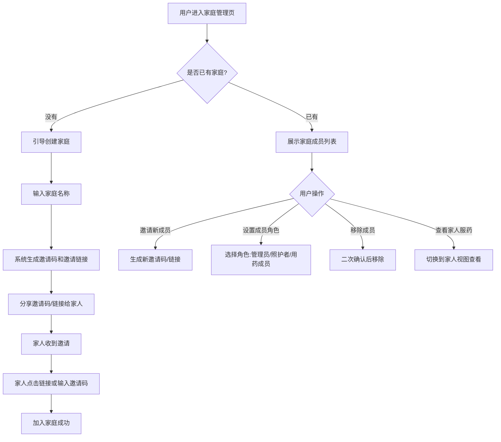
```mermaid
flowchart TD
    A[用户进入家庭管理页] --> B{是否已有家庭?}
    B -->|没有| C[引导创建家庭]
    B -->|已有| D[展示家庭成员列表]
    C --> E[输入家庭名称]
    E --> F[系统生成邀请码和邀请链接]
    F --> G[分享邀请码/链接给家人]

    D --> H{用户操作}
    H -->|邀请新成员| I[生成新邀请码/链接]
    H -->|设置成员角色| J[选择角色:管理员/照护者/用药成员]
    H -->|移除成员| K[二次确认后移除]
    H -->|查看家人服药| L[切换到家人视图查看]

    G --> M[家人收到邀请]
    M --> N[家人点击链接或输入邀请码]
    N --> O[加入家庭成功]
```

业务规则说明：
1. 每个用户最多创建1个家庭
2. 免费版不支持家庭功能，需升级到家庭版
3. 家庭版最多支持10名家庭成员
4. 一个用户可属于多个家庭（如夫妻双方各自家庭）
5. 移除成员后，该成员无法再查看家庭数据

### 3.1.33 创建家庭与成员管理—主要原型

[家庭管理原型](assets/prototypes/family-manage-widget.html)

验收标准说明：
- [ ] 正常流程：创建家庭后生成邀请码，分享后可被家人使用
- [ ] 正常流程：管理员可设置成员角色和移除成员
- [ ] 异常流程：免费版用户点击创建家庭时提示需升级

### 3.1.34 服药记录与日历

功能描述：按日历视图查看历史每天的服药完成情况，支持按药品、按成员筛选；单独展示漏服记录；统计服药依从性。

优先级与依赖说明：

| 项 | 内容 |
| --- | --- |
| 优先级 | P1 |
| 依赖需求 | URS-3.1.2 历史服药记录/漏服记录/服药统计 |
| 前置条件 | 有至少一条服药记录 |

### 3.1.35 服药记录与日历—详细流程

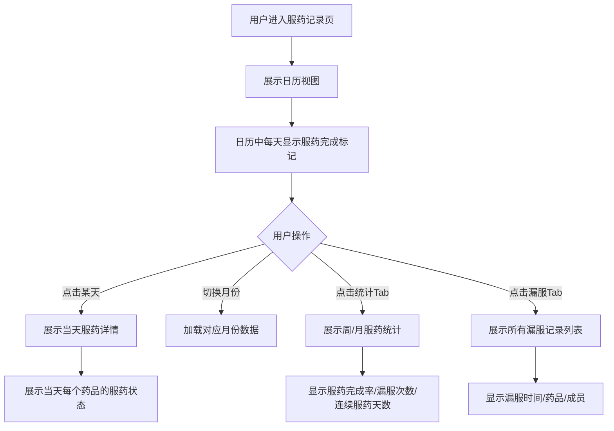
```mermaid
flowchart TD
    A[用户进入服药记录页] --> B[展示日历视图]
    B --> C[日历中每天显示服药完成标记]
    C --> D{用户操作}
    D -->|点击某天| E[展示当天服药详情]
    D -->|切换月份| F[加载对应月份数据]
    D -->|点击统计Tab| G[展示周/月服药统计]
    D -->|点击漏服Tab| H[展示所有漏服记录列表]

    G --> I[显示服药完成率/漏服次数/连续服药天数]
    H --> J[显示漏服时间/药品/成员]
    E --> K[展示当天每个药品的服药状态]
```

业务规则说明：
1. 日历中用颜色标记：绿色=全部完成，黄色=部分完成，红色=有漏服，灰色=无提醒
2. 统计数据支持按周和按月切换
3. 漏服记录支持按药品和按成员筛选
4. 服药记录支持导出为Excel或PDF（家庭版功能）

### 3.1.36 服药记录与日历—主要原型

[服药记录与日历原型](assets/prototypes/medicine-record-widget.html)

验收标准说明：
- [ ] 正常流程：日历正确显示每天的服药完成状态
- [ ] 正常流程：点击某天可查看当天详情，统计页展示正确数据
- [ ] 正常流程：漏服记录列表正确展示所有漏服项

### 3.1.37 订阅管理与升级

功能描述：查看当前订阅状态（免费版/家庭版），到期时间，支持从免费版升级到家庭版（¥12/月），通过微信支付完成付款。

优先级与依赖说明：

| 项 | 内容 |
| --- | --- |
| 优先级 | P1 |
| 依赖需求 | URS-3.1.5 订阅套餐查看/升级家庭版 |
| 前置条件 | 用户已登录 |

### 3.1.38 订阅管理与升级—详细流程

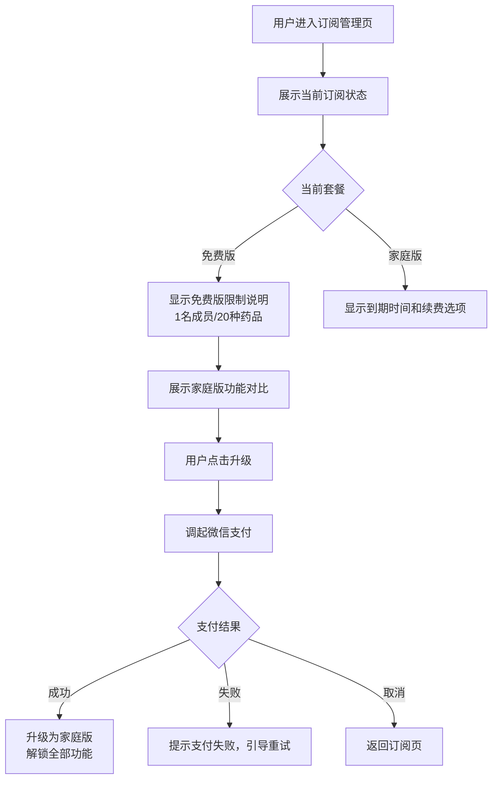
```mermaid
flowchart TD
    A[用户进入订阅管理页] --> B[展示当前订阅状态]
    B --> C{当前套餐}
    C -->|免费版| D[显示免费版限制说明<br/>1名成员/20种药品]
    C -->|家庭版| E[显示到期时间和续费选项]
    D --> F[展示家庭版功能对比]
    F --> G[用户点击升级]
    G --> H[调起微信支付]
    H --> I{支付结果}
    I -->|成功| J[升级为家庭版<br/>解锁全部功能]
    I -->|失败| K[提示支付失败，引导重试]
    I -->|取消| L[返回订阅页]
```

业务规则说明：
1. 免费版限制：1名用药成员、20种药品、无家庭协同、无云同步
2. 家庭版价格：¥12/月，支持微信支付
3. 升级后立即生效，到期前7天提醒续费
4. 到期未续费自动降级为免费版，数据保留但家庭功能不可用

### 3.1.39 订阅管理与升级—主要原型

[订阅管理原型](assets/prototypes/subscription-widget.html)

验收标准说明：
- [ ] 正常流程：免费版用户可查看套餐对比并升级
- [ ] 正常流程：微信支付成功后立即解锁家庭版功能
- [ ] 异常流程：支付失败时提示并可重试

### 3.1.40 提醒偏好与个人设置

功能描述：用户可设置提醒提前时间、漏服判定窗口时长、免打扰时段、临期阈值等个性化参数。

优先级与依赖说明：

| 项 | 内容 |
| --- | --- |
| 优先级 | P1 |
| 依赖需求 | URS-3.1.5 提醒偏好设置/临期阈值设置 |
| 前置条件 | 用户已登录 |

### 3.1.41 提醒偏好与个人设置—详细流程

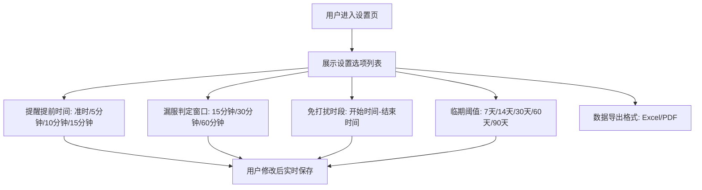
```mermaid
flowchart TD
    A[用户进入设置页] --> B[展示设置选项列表]
    B --> C[提醒提前时间: 准时/5分钟/10分钟/15分钟]
    B --> D[漏服判定窗口: 15分钟/30分钟/60分钟]
    B --> E[免打扰时段: 开始时间-结束时间]
    B --> F[临期阈值: 7天/14天/30天/60天/90天]
    B --> G[数据导出格式: Excel/PDF]
    C --> H[用户修改后实时保存]
    D --> H
    E --> H
    F --> H
```

业务规则说明：
1. 提醒提前时间：提醒在服药时间前N分钟推送
2. 免打扰时段内的提醒推迟到时段结束后推送
3. 临期阈值修改后，立即按新阈值重新评估所有药品
4. 设置项修改后实时生效，无需额外保存按钮

### 3.1.42 提醒偏好与个人设置—主要原型

[提醒偏好设置原型](assets/prototypes/settings-widget.html)

验收标准说明：
- [ ] 正常流程：各设置项可选择并实时保存
- [ ] 正常流程：修改临期阈值后重新评估药品状态

---
# 4 产品原型

## 4.1 页面跳转逻辑图

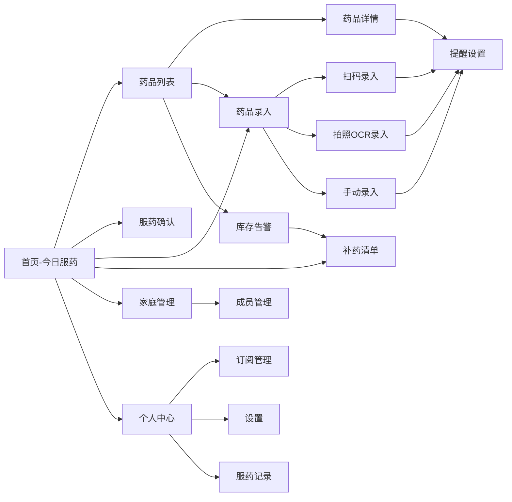
```mermaid
flowchart LR
    A[首页-今日服药] --> B[药品列表]
    A --> C[服药确认]
    A --> D[药品录入]

    B --> E[药品详情]
    B --> D

    D --> F[扫码录入]
    D --> G[拍照OCR录入]
    D --> H[手动录入]

    F --> I[提醒设置]
    G --> I
    H --> I
    E --> I

    A --> J[补药清单]
    B --> K[库存告警]
    K --> J

    A --> L[家庭管理]
    L --> M[成员管理]

    A --> N[个人中心]
    N --> O[订阅管理]
    N --> P[设置]
    N --> Q[服药记录]
```

## 4.2 全站点原型设计

### 4.2.1 用户端小程序

**页面清单：**

| 序号 | 页面名称 | 所属模块 | 页面描述 | 关键元素 |
| --- | --- | --- | --- | --- |
| 1 | 首页-今日服药概览 | 服药提醒 | 展示今日服药进度和各项服药状态 | 成员切换Tab、服药进度条、服药项卡片列表（已服/待服/漏服/未到时间）、底部导航栏 |
| 2 | 药品列表页 | 药品管理 | 以卡片形式展示当前成员所有药品 | 成员Tab、搜索框、药品卡片（名称/数量/状态标签）、+号录入按钮 |
| 3 | 药品录入选择页 | 药品管理 | 选择录入方式 | 三个大按钮：扫码录入、拍照录入、手动录入 |
| 4 | 扫码录入页 | 药品管理 | 扫描药品条形码并展示匹配结果 | 扫码取景框、匹配结果表单（名称/规格/厂家/有效期/数量） |
| 5 | 拍照OCR录入页 | 药品管理 | 拍照识别药品信息 | 相机取景框、识别结果表单（可逐项修改） |
| 6 | 手动录入页 | 药品管理 | 手动填写药品信息表单 | 表单：药品名称/规格/有效期/数量/用法用量/服用说明 |
| 7 | 药品详情页 | 药品管理 | 展示药品完整信息和服药记录 | 基本信息区、服用说明区、库存状态区、近期服药记录、编辑/删除/设置提醒按钮 |
| 8 | 提醒设置页 | 服药提醒 | 为药品设置服药提醒 | 药品选择、时间选择器（多个）、剂量输入、周期选择、保存按钮 |
| 9 | 服药记录页 | 服药提醒 | 日历视图展示历史服药记录 | 日历组件（颜色标记）、当天详情、统计Tab、漏服Tab |
| 10 | 库存告警页 | 库存监控 | 展示所有库存告警信息 | 告警分类Tab（临期/不足/紧急）、告警卡片列表、加入补药清单按钮 |
| 11 | 补药清单页 | 库存监控 | 展示待补充药品清单 | 清单列表（药品名/数量/紧迫度）、导出按钮、分享按钮、标记已补药 |
| 12 | 家庭管理页 | 家庭协同 | 管理家庭成员和共享数据 | 家庭信息卡片、成员列表（头像/角色）、邀请按钮、邀请码展示 |
| 13 | 个人中心页 | 个人中心 | 个人信息和设置入口 | 用户头像/昵称、订阅状态卡片、功能入口列表（记录/设置/导出/关于） |
| 14 | 订阅管理页 | 个人中心 | 查看和升级订阅套餐 | 当前套餐信息、免费版vs家庭版对比表、升级按钮 |
| 15 | 设置页 | 个人中心 | 个性化偏好设置 | 设置项列表（提醒提前时间/漏服窗口/免打扰时段/临期阈值） |

**交互说明：**

- 页面跳转关系：

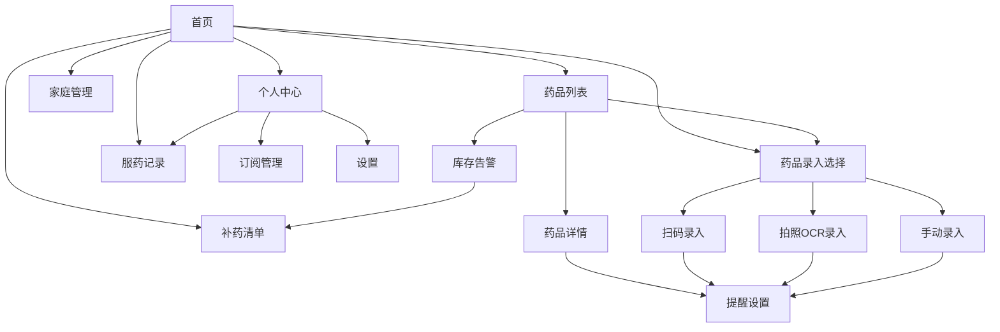
```mermaid
flowchart TD
    A[首页] --> B[药品列表]
    A --> C[药品录入选择]
    A --> D[补药清单]
    A --> E[家庭管理]
    A --> F[个人中心]

    B --> G[药品详情]
    B --> C
    G --> H[提醒设置]
    C --> I[扫码录入]
    C --> J[拍照OCR录入]
    C --> K[手动录入]
    I --> H
    J --> H
    K --> H

    A --> L[服药记录]
    F --> L
    F --> M[订阅管理]
    F --> N[设置]

    B --> O[库存告警]
    O --> D
```

- 特殊交互：
  1. 底部导航栏固定4个Tab：首页（服药概览）、药品、补药清单、我的
  2. 首页服药项卡片支持左滑快捷操作（确认服药/跳过）
  3. 药品录入页三种方式以大按钮形式呈现，适老化设计
  4. 所有确认操作（删除、补药等）使用底部弹出式确认对话框
  5. 表单页面字体不小于18px，输入框高度不小于48px
  6. 状态标签使用颜色+文字双重标识（不仅依赖颜色区分）
  7. 加载状态使用骨架屏，空状态使用插画+文字引导
  8. 页面切换使用左右滑动过渡动画

**产品原型：**

[📱 打开用户端小程序全站点原型](assets/prototypes/miniprogram-prototype.html)

---
# 5 数据需求

## 5.1 数据使用规格

### 药品信息表

| **字段** | **是否必填** | **描述** | **数据类型** |
| --- | --- | --- | --- |
| id | 是 | 药品唯一标识 | UUID |
| member_id | 是 | 所属用药成员ID | UUID |
| family_id | 是 | 所属家庭ID | UUID |
| name | 是 | 药品名称 | 字符串 |
| specification | 否 | 药品规格（如"0.25g×24片"） | 字符串 |
| manufacturer | 否 | 生产厂家 | 字符串 |
| barcode | 否 | 药品条形码 | 字符串 |
| expiry_date | 是 | 有效期截止日期 | 日期 |
| remaining_quantity | 是 | 剩余数量 | 数字 |
| unit | 是 | 单位（片/粒/ml/袋等） | 字符串 |
| min_stock | 否 | 最低库存线，默认3 | 数字 |
| dosage | 否 | 每次剂量（如"1片""5ml"） | 字符串 |
| usage_instructions | 否 | 服用说明 | 字符串 |
| created_at | 是 | 创建时间 | 时间戳 |
| updated_at | 是 | 更新时间 | 时间戳 |

### 服药提醒规则表

| **字段** | **是否必填** | **描述** | **数据类型** |
| --- | --- | --- | --- |
| id | 是 | 提醒规则唯一标识 | UUID |
| drug_id | 是 | 关联药品ID | UUID |
| member_id | 是 | 关联用药成员ID | UUID |
| times | 是 | 服药时间点列表（如["08:00","12:00","18:00"]） | 字符串数组 |
| dosage | 是 | 每次剂量 | 字符串 |
| cycle_type | 是 | 周期类型：long_term/date_range | 字符串 |
| start_date | 是 | 开始日期 | 日期 |
| end_date | 否 | 结束日期（长期时为null） | 日期 |
| status | 是 | 状态：active/paused/cancelled | 字符串 |
| created_at | 是 | 创建时间 | 时间戳 |

### 服药记录表

| **字段** | **是否必填** | **描述** | **数据类型** |
| --- | --- | --- | --- |
| id | 是 | 记录唯一标识 | UUID |
| reminder_id | 是 | 关联提醒规则ID | UUID |
| drug_id | 是 | 关联药品ID | UUID |
| member_id | 是 | 关联用药成员ID | UUID |
| scheduled_time | 是 | 计划服药时间 | 时间戳 |
| status | 是 | 状态：pending/taken/missed/made_up | 字符串 |
| confirmed_at | 否 | 确认服药时间 | 时间戳 |
| confirmed_by | 否 | 确认人（本人/照护者ID） | UUID |
| created_at | 是 | 创建时间 | 时间戳 |

### 家庭成员表

| **字段** | **是否必填** | **描述** | **数据类型** |
| --- | --- | --- | --- |
| id | 是 | 成员唯一标识 | UUID |
| family_id | 是 | 所属家庭ID | UUID |
| user_id | 是 | 关联用户ID | UUID |
| name | 是 | 成员姓名 | 字符串 |
| avatar | 否 | 头像URL | 字符串 |
| relationship | 否 | 与创建者的关系 | 字符串 |
| role | 是 | 角色：admin/caregiver/patient | 字符串 |
| is_medication_member | 是 | 是否为用药成员 | 布尔 |
| joined_at | 是 | 加入时间 | 时间戳 |

### 补药清单表

| **字段** | **是否必填** | **描述** | **数据类型** |
| --- | --- | --- | --- |
| id | 是 | 清单项唯一标识 | UUID |
| drug_id | 是 | 关联药品ID | UUID |
| family_id | 是 | 所属家庭ID | UUID |
| alert_type | 是 | 告警类型：near_expiry/low_stock/urgent_expiry | 字符串 |
| suggested_quantity | 否 | 建议补充数量 | 数字 |
| status | 是 | 状态：pending/completed/ignored | 字符串 |
| completed_at | 否 | 完成时间 | 时间戳 |
| created_at | 是 | 创建时间 | 时间戳 |

## 5.2 统计数据

1. 统计每日/周/月的服药完成率（已服次数/应服次数×100%），按成员维度统计（P1）
2. 统计连续服药天数（打卡连续天数），鼓励用药依从性（P2）
3. 统计漏服次数和漏服率，按药品和按成员维度统计（P1）
4. 统计药品库存告警次数，按告警类型统计（P2）

## 5.3 埋点需求

| 页面 | 事件 | 采集字段 | 说明 |
| --- | --- | --- | --- |
| 首页 | page_view | user_id, member_id, timestamp | 首页访问 |
| 首页 | confirm_medicine | drug_id, member_id, confirm_time | 服药确认 |
| 药品列表 | page_view | user_id, member_id, drug_count | 药品列表访问 |
| 药品录入 | select_method | method(scan/ocr/manual), user_id | 选择录入方式 |
| 药品录入 | submit_success | method, drug_id, duration_ms | 录入成功 |
| 药品录入 | submit_fail | method, error_code | 录入失败 |
| 提醒设置 | create_reminder | drug_id, times_count, cycle_type | 创建提醒 |
| 库存告警 | view_alert | alert_type, drug_id | 查看告警 |
| 补药清单 | add_to_list | drug_id, alert_type | 加入补药清单 |
| 补药清单 | mark_completed | drug_id, list_id | 标记已补药 |
| 家庭管理 | create_family | family_id | 创建家庭 |
| 家庭管理 | invite_member | family_id, invite_method | 邀请成员 |
| 订阅管理 | upgrade_click | current_plan | 点击升级 |
| 订阅管理 | pay_success | plan_type, amount | 支付成功 |
| 订阅管理 | pay_fail | plan_type, error_code | 支付失败 |

---
# 6 非功能需求

## 6.1 性能需求

**6.1.1 延迟**

| 编号 | 项目 | 最大延迟 | 平均延迟 | 优先级 | 备注 |
| --- | --- | --- | --- | --- | --- |
| 0001 | 首屏页面加载 | <2秒 | <1秒 | 高 | 常用网络环境下 |
| 0002 | 扫码匹配药品信息 | <3秒 | <1.5秒 | 高 | 含网络请求 |
| 0003 | OCR识别返回结果 | <5秒 | <3秒 | 高 | 含图片上传和识别 |
| 0004 | 服药确认响应 | <0.5秒 | <0.3秒 | 高 | 本地操作 |
| 0005 | 服药提醒推送延迟 | <1分钟 | <30秒 | 高 | 从触发到用户收到 |
| 0006 | 药品列表加载 | <1秒 | <0.5秒 | 中 | 20条/页 |

**6.1.2 吞吐量**

| 编号 | 项 | 吞吐量 | 备注 |
| --- | --- | --- | --- |
| 0001 | 服药提醒推送 | 每分钟1000次 | 高峰期（如早8点） |
| 0002 | 药品条码查询 | 每分钟500次 | |
| 0003 | OCR识别请求 | 每分钟200次 | |

**6.1.3 容量**

| 编号 | 项 | 容量 | 备注 |
| --- | --- | --- | --- |
| 0001 | 单用户药品数 | ≥200种 | |
| 0002 | 服药记录保留时长 | ≥365天 | |
| 0003 | 初期并发用户数 | ≥1000 | |
| 0004 | 家庭成员数上限 | ≤10人/家庭 | 家庭版 |

## 6.2 安全需求

| 编号 | 项（系统数据/处理过程） |
| --- | --- |
| 0001 | 用户健康数据（药品信息、服药记录）必须加密存储，传输过程使用HTTPS |
| 0002 | 用户只能访问自己或所属家庭的数据，不可越权访问其他家庭数据 |
| 0003 | 微信登录凭证（openid/session_key）安全存储，不暴露给前端 |
| 0004 | 家庭邀请码有效期为24小时，过期需重新生成 |
| 0005 | 支付相关操作需二次验证，防止重复支付 |
| 0006 | 遵守《个人信息保护法》，用户数据删除后不可恢复 |

## 6.3 可靠性

| 编号 | 项 | 值 |
| --- | --- | --- |
| 0001 | 服务可用性 | ≥99.9% |
| 0002 | 平均正常运行时间 | ≥365天 |
| 0003 | 平均故障恢复时间 | ≤30分钟 |
| 0004 | 数据备份频率 | 每日全量+每小时增量 |

## 6.4 可连续性

| 编号 | 项 |
| --- | --- |
| Modi.1 | 系统需要7×24小时全天候运行，服药提醒不可中断 |
| Modi.2 | 提醒调度服务需具备故障转移能力，单节点故障不影响提醒推送 |
| Modi.3 | 离线时用户可查看本地缓存的药品列表和今日提醒 |

## 6.5 可恢复性

| 编号 | 项 |
| --- | --- |
| Modi.1 | 数据库每日全量备份，保留30天；每小时增量备份 |
| Modi.2 | 重大故障在1~3小时内恢复服务，24~72小时内恢复历史数据 |
| Modi.3 | 家庭版用户数据云端同步，换设备后可恢复全部数据 |

## 6.6 兼容性

| 编号 | 要求 | 备注 |
| --- | --- | --- |
| 0001 | 支持iOS 10+和Android 6.0+ | 微信小程序基础库 |
| 0002 | 支持微信7.0及以上版本 | |
| 0003 | 适配主流手机分辨率：375×667, 390×844, 414×896, 360×780 | |
| 0004 | 适配横屏和竖屏模式（以竖屏为主） | |

## 6.7 易用性

| 编号 | 要求 | 备注 |
| --- | --- | --- |
| 0001 | 核心操作路径不超过3步（录入药品、确认服药） | 适老化要求 |
| 0002 | 正文字号不小于16px，关键信息（药品名称、服药时间）不小于18px | 适老化要求 |
| 0003 | 色彩对比度满足WCAG 2.1 AA级（4.5:1以上） | 低视力用户 |
| 0004 | 所有操作提供明确的成功/失败反馈提示 | |
| 0005 | 首次使用提供新手引导，空数据状态有清晰引导 | |
| 0006 | 普通用户（含老年人）无需培训即可使用核心功能 | |
| 0007 | 按钮点击区域不小于44×44px | 适老化要求 |

---
# 7 总结

## 7.1 上线计划

| 阶段 | 时间 | 内容 | 负责人 |
| --- | --- | --- | --- |
| 开发阶段 | 2026-06-27 ~ 2026-07-01 | 核心功能开发（药品录入、服药提醒、库存监控） | 开发团队 |
| 联调阶段 | 2026-07-02 ~ 2026-07-03 | 前后端联调、第三方接口对接 | 开发团队 |
| 测试阶段 | 2026-07-03 ~ 2026-07-04 | 功能测试、性能测试、适老化可用性测试 | 测试团队 |
| 灰度阶段 | 2026-07-05 | 灰度10%用户，验证稳定性和服药提醒可靠性 | 运营团队 |
| 全量上线 | 2026-07-06 | 全量开放，MVP版本上线 | 全体 |

## 7.2 后续迭代规划

- V1.1：增加服药统计报表，支持导出服药记录为PDF/Excel
- V1.2：增加药品相互作用提示（基于药品数据库），用药安全升级
- V1.3：增加语音录入药品功能，进一步降低老年人使用门槛
- V1.4：增加智能药箱硬件对接（蓝牙药箱），实现自动清点库存
- V1.5：增加社区功能，家庭成员间可分享用药经验和健康贴士

## 7.3 参考文档

- 药品库存与服用提醒家庭版_URS需求文档.md
- 微信小程序订阅消息开发文档
- 微信支付接入指南
- 腾讯云OCR API文档
- 国家药品条码数据库接口规范
