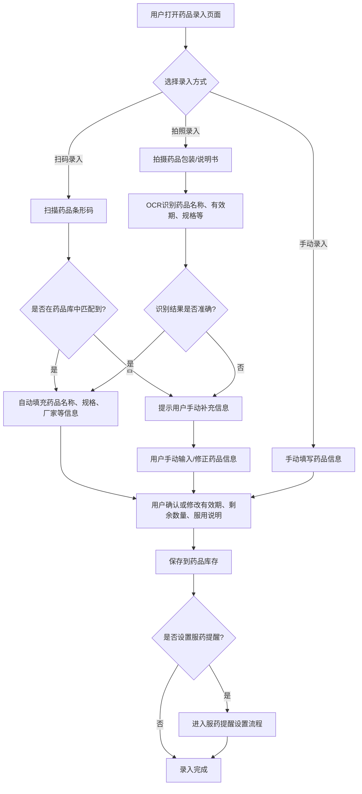
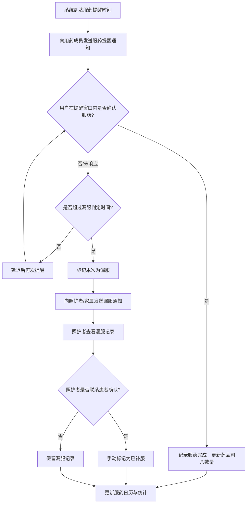
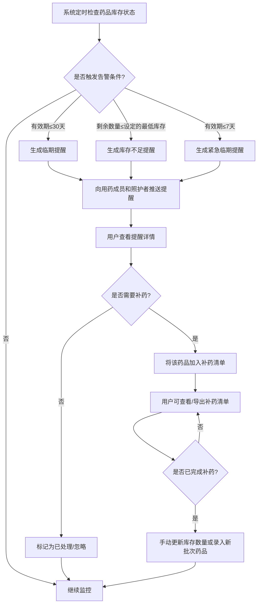
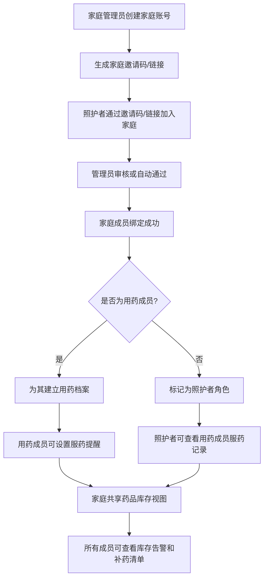
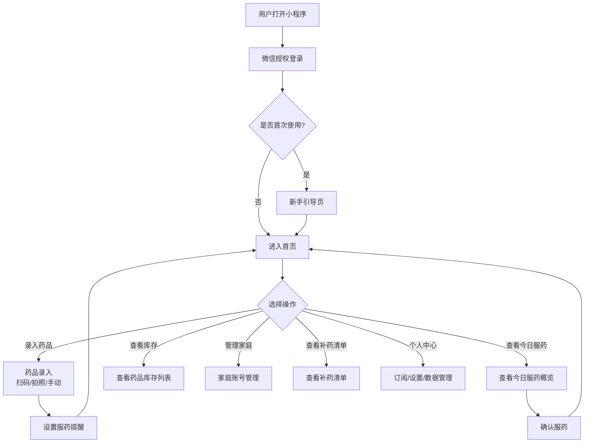
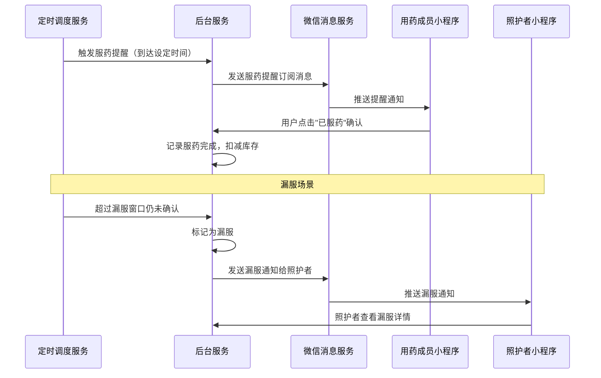
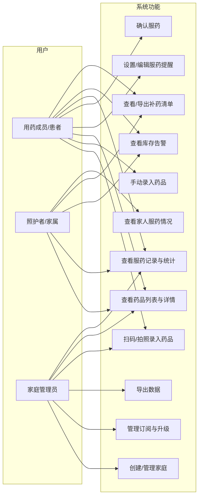
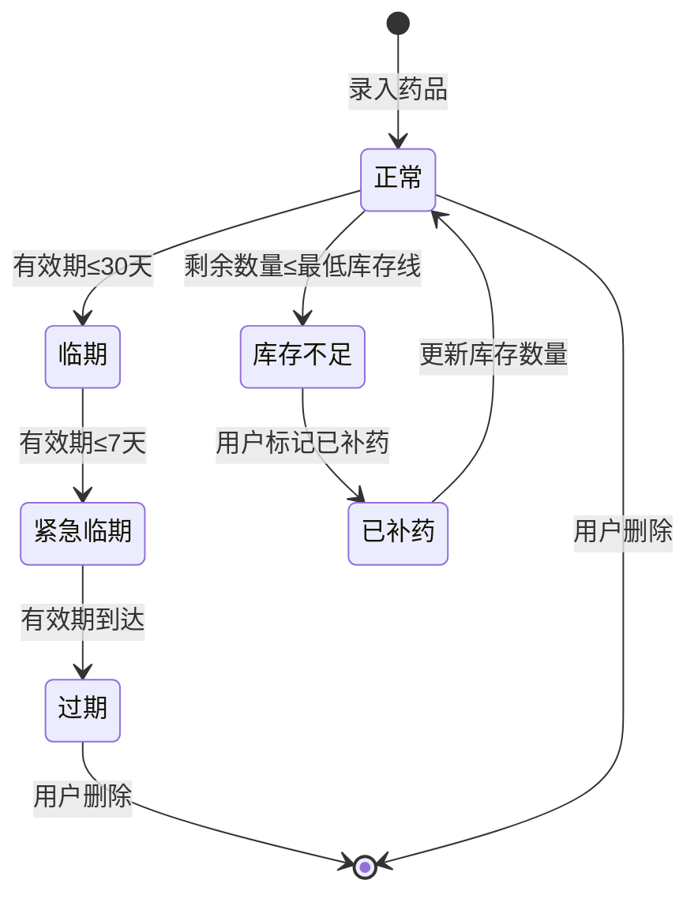
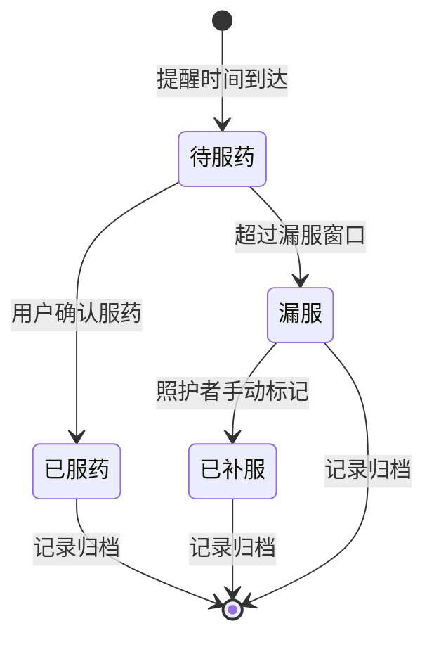

# 1.需求概述

## 1.1 需求介绍

药品库存与服用提醒家庭版是一款面向家庭场景的药品管理工具，帮助需要长期用药的老人家庭、慢病患者及家庭照护者实现家庭药品的数字化管理。产品通过扫码/拍照识别快速录入药品信息，提供按家庭成员设置服药提醒、家属确认与漏服提醒等核心能力，并在药品临期或库存不足时自动生成补药清单，从而解决家庭药箱管理混乱、漏服忘服、药品过期浪费等痛点。

### 1.1.1 所属领域

家庭健康管理 / 家庭药箱管理 / 用药提醒工具

## 1.2 需求目标

1. **降低药品录入门槛**：通过扫码（药品条形码）和拍照OCR识别两种方式，让家庭成员（尤其是老年人）能够快速完成药品信息录入，减少手动输入的负担。
2. **建立服药提醒闭环**：为患者按疗程设置定时服药提醒，支持家属远程确认服药状态，对漏服行为进行追踪和二次提醒，保障用药依从性。
3. **防止药品过期浪费**：实时追踪每种药品的有效期和剩余数量，在药品临期或库存不足时主动提醒用户，并生成补药清单，避免断药或药品过期。
4. **支持家庭多成员协同**：允许一个家庭账号管理多位成员的用药信息，子女或照护者可远程查看父母服药情况，实现家庭照护协同。
5. **提供灵活的商业分级**：免费版满足单人基础需求（1名成员、20种药品），家庭版（¥12/月）解锁多成员、家属共享、云同步等高级功能，覆盖更多家庭场景。

## 1.3 系统使用角色

| 角色 | 描述 | 典型用户 |
|------|------|----------|
| 用药成员（患者） | 需要长期服药的家庭成员，日常使用小程序查看服药提醒、确认服药、录入药品 | 患有高血压/糖尿病的老人 |
| 照护者（家属） | 负责远程照护的家庭成员，查看患者服药情况、接收漏服通知、协助管理药品 | 患者的子女、配偶 |
| 家庭管理员 | 创建家庭账号、邀请成员加入、管理家庭订阅的高级角色 | 家庭中负责统筹的子女 |

## 1.4 业务流程图

### 1.4.1 药品录入流程

### 1.4.2 服药提醒流程

### 1.4.3 药品库存监控与补药流程

### 1.4.4 家庭成员管理流程

# 2.功能原型

| 原型名称 | 原型链接 | 对应端 | 备注 |
| --- | --- | --- | --- |
| 药品库存与服用提醒家庭版 | 待产品文档结对写作专家产出 | 小程序端 | MVP阶段以微信小程序为主要载体 |

# 3.需求清单

## 3.1 用户端-小程序端

### 3.1.1 药品管理模块

| 模块 | 一级功能 | 二级功能 | 功能描述 | 备注 |
| --- | --- | --- | --- | --- |
| 药品管理 | 药品录入 | 扫码录入 | 用户通过扫描药品包装上的条形码，系统自动匹配药品库信息（药品名称、规格、厂家），匹配成功后自动填充，用户仅需补充有效期、数量和服用说明 | 需对接药品条码数据库 |
| 药品管理 | 药品录入 | 拍照OCR录入 | 用户拍摄药品包装或说明书照片，系统通过OCR识别药品名称、有效期、规格等关键信息，展示识别结果供用户确认或修改 | 需接入OCR识别服务 |
| 药品管理 | 药品录入 | 手动录入 | 用户手动输入药品名称、规格、有效期、剩余数量、用法用量、服用说明等完整信息 | 作为兜底录入方式 |
| 药品管理 | 药品录入 | 药品信息编辑 | 用户可随时修改已录入药品的信息，包括有效期、数量、服用说明等 | |
| 药品管理 | 药品列表 | 药品总览 | 以列表/卡片形式展示当前家庭成员名下的所有药品，显示药品名称、剩余数量、有效期状态（正常/临期/过期） | 支持按成员筛选 |
| 药品管理 | 药品列表 | 药品详情查看 | 点击某个药品可查看详情，包括药品基本信息、服用说明、服药记录、库存变化趋势 | |
| 药品管理 | 药品列表 | 药品搜索 | 支持按药品名称搜索已录入的药品 | |
| 药品管理 | 药品删除 | 删除药品 | 用户可删除不再需要的药品记录，删除前需二次确认 | 删除后相关服药记录和提醒同步清除 |
| 药品管理 | 用药成员管理 | 添加用药成员 | 家庭管理员可为家庭成员建立用药档案，录入成员姓名、与自己的关系、头像等基本信息 | 免费版限1名成员 |
| 药品管理 | 用药成员管理 | 切换成员视图 | 在药品列表、提醒设置等页面支持切换查看不同成员的药品和服药记录 | |

### 3.1.2 服药提醒模块

| 模块 | 一级功能 | 二级功能 | 功能描述 | 备注 |
| --- | --- | --- | --- | --- |
| 服药提醒 | 提醒设置 | 创建服药提醒 | 为指定用药成员的某种药品设置服药提醒，包括：服药时间（支持每天多次）、每次剂量、服药周期（长期/指定日期范围）、提醒方式 | |
| 服药提醒 | 提醒设置 | 编辑服药提醒 | 修改已有的服药提醒配置，包括时间、剂量、周期等 | |
| 服药提醒 | 提醒设置 | 删除/暂停提醒 | 删除或暂停某个服药提醒（如药品已停服时可暂停而非删除） | |
| 服药提醒 | 提醒通知 | 定时推送提醒 | 到达设定的服药时间时，通过微信小程序订阅消息向用药成员发送服药提醒 | 需用户提前授权订阅消息 |
| 服药提醒 | 提醒通知 | 服药确认 | 用药成员收到提醒后，可在小程序内点击"已服药"进行确认，系统记录确认时间 | |
| 服药提醒 | 提醒通知 | 漏服检测与提醒 | 若在设定的时间窗口内（如30分钟）未确认服药，系统标记为漏服，并向绑定的照护者发送漏服通知 | 时间窗口可配置 |
| 服药提醒 | 服药记录 | 今日服药概览 | 展示今日所有药品的服药状态（已服/未服/漏服），以时间线或卡片形式呈现 | |
| 服药提醒 | 服药记录 | 历史服药记录 | 按日历视图查看历史每天的服药完成情况，支持按药品、按成员筛选 | |
| 服药提醒 | 服药记录 | 漏服记录查看 | 单独展示所有漏服记录，照护者可查看漏服时间、药品、成员信息 | |
| 服药提醒 | 服药记录 | 服药统计 | 统计一段时间内（周/月）的服药依从性，展示服药完成率、漏服次数等指标 | |

### 3.1.3 库存监控与补药模块

| 模块 | 一级功能 | 二级功能 | 功能描述 | 备注 |
| --- | --- | --- | --- | --- |
| 库存监控 | 库存告警 | 临期提醒 | 当药品有效期距离当前日期≤设定阈值（默认30天）时，向用药成员和照护者推送临期提醒 | 阈值可自定义 |
| 库存监控 | 库存告警 | 库存不足提醒 | 当药品剩余数量≤用户设定的最低库存线时，推送库存不足提醒 | 最低库存线可按药品设置 |
| 库存监控 | 库存告警 | 紧急临期提醒 | 当药品有效期≤7天时，发送紧急提醒，提示立即处理 | |
| 库存监控 | 库存更新 | 手动更新库存 | 用户可在服药确认时自动扣减库存，也可手动调整剩余数量（如实际清点后修正） | |
| 库存监控 | 库存更新 | 服药自动扣减 | 每次确认服药后，系统自动将该药品剩余数量减去过本次剂量 | |
| 库存监控 | 补药清单 | 生成补药清单 | 系统自动将已触发库存不足提醒或临期提醒的药品汇总生成补药清单 | |
| 库存监控 | 补药清单 | 查看补药清单 | 用户可查看当前待补充的药品清单，包括药品名称、需补充数量、紧迫程度 | |
| 库存监控 | 补药清单 | 导出/分享清单 | 支持将补药清单以图片或文字形式导出或分享给家庭成员，方便线下购药参考 | |
| 库存监控 | 补药清单 | 标记已补药 | 用户完成购药后，可标记补药清单中的项目为"已补充"，并快速录入新批次药品 | |

### 3.1.4 家庭协同模块

| 模块 | 一级功能 | 二级功能 | 功能描述 | 备注 |
| --- | --- | --- | --- | --- |
| 家庭协同 | 家庭账号 | 创建家庭 | 用户可创建一个家庭账号，设置家庭名称，生成邀请码或邀请链接 | |
| 家庭协同 | 家庭账号 | 加入家庭 | 照护者通过输入邀请码或点击邀请链接加入家庭，绑定到对应的家庭账号 | |
| 家庭协同 | 家庭账号 | 成员管理 | 家庭管理员可查看家庭成员列表，设置成员角色（管理员/照护者/用药成员），移除成员 | |
| 家庭协同 | 数据共享 | 服药情况共享 | 照护者可实时查看所绑定用药成员的今日服药状态、历史服药记录和漏服通知 | |
| 家庭协同 | 数据共享 | 库存信息同步 | 家庭成员之间共享药品库存视图，任何成员录入或更新的药品信息对所有成员可见 | 家庭版功能 |
| 家庭协同 | 数据共享 | 提醒通知共享 | 照护者可接收用药成员的漏服通知、临期提醒、库存不足提醒 | |

### 3.1.5 个人中心模块

| 模块 | 一级功能 | 二级功能 | 功能描述 | 备注 |
| --- | --- | --- | --- | --- |
| 个人中心 | 账号管理 | 微信登录 | 用户通过微信授权快捷登录小程序 | |
| 个人中心 | 账号管理 | 个人信息管理 | 用户可查看和修改个人基本信息（昵称、头像、手机号等） | |
| 个人中心 | 订阅管理 | 消息订阅授权 | 引导用户授权微信小程序订阅消息权限，确保服药提醒等通知能正常送达 | |
| 个人中心 | 订阅管理 | 订阅套餐查看 | 查看当前订阅状态（免费版/家庭版），到期时间，支持升级或续费 | |
| 个人中心 | 订阅管理 | 升级家庭版 | 用户可从免费版升级到家庭版（¥12/月），解锁多成员、云同步等功能 | |
| 个人中心 | 数据管理 | 数据云同步 | 家庭版用户可将药品数据、服药记录等同步到云端，换设备不丢失 | 家庭版功能 |
| 个人中心 | 数据管理 | 数据导出 | 支持导出服药记录为Excel或PDF格式，方便就医时提供给医生参考 | |
| 个人中心 | 设置 | 提醒偏好设置 | 用户可设置提醒偏好，如提醒提前时间、漏服判定窗口时长、免打扰时段等 | |
| 个人中心 | 设置 | 临期阈值设置 | 用户可自定义临期提醒的天数阈值（默认30天） | |

# 4.非功能需求

## 4.1 使用界面需求

| 需求项 | 描述 |
|--------|------|
| 字体大小 | 考虑到目标用户包含老年人，正文字号不小于16px，关键信息（如服药时间、药品名称）支持放大查看 |
| 色彩对比度 | 界面配色需满足WCAG 2.1 AA级对比度要求，确保低视力用户可清晰辨识 |
| 操作简洁性 | 核心操作路径（录入药品、确认服药）不超过3步点击，减少老年人使用障碍 |
| 状态反馈 | 所有操作（保存、删除、确认）需有明确的成功/失败反馈提示 |
| 空状态引导 | 首次使用或无数据时，提供清晰的新手引导和操作入口提示 |

## 4.2 软硬件环境需求

| 需求项 | 描述 |
|--------|------|
| 运行平台 | 微信小程序（iOS 10+ / Android 6.0+） |
| 微信版本 | 支持微信 7.0 及以上版本 |
| 网络要求 | 需联网使用（扫码匹配药品库、OCR识别、数据同步均需网络），离线时仅可查看本地缓存的药品列表和今日提醒 |
| 摄像头权限 | 需申请摄像头权限用于扫码和拍照OCR |
| 通知权限 | 需申请微信订阅消息权限用于服药提醒推送 |

## 4.3 性能需求

| 需求项 | 描述 |
|--------|------|
| 页面加载时间 | 首屏加载时间≤2秒（常用网络环境） |
| 扫码识别响应 | 扫码后药品信息匹配结果返回时间≤3秒 |
| OCR识别响应 | 拍照OCR识别结果返回时间≤5秒 |
| 提醒推送延迟 | 服药提醒推送延迟不超过1分钟 |
| 数据存储容量 | 单用户支持存储≥200种药品、≥365天服药记录 |
| 并发支持 | 后台服务支持≥1000并发用户（初期规模） |

## 4.4 约束性需求

1. 本系统**不提供任何医疗诊断、用药建议或处方功能**，仅作为家庭药品库存管理和服药提醒工具。
2. 药品条码匹配结果仅供参考，用户始终拥有最终确认和修改药品信息的权限。
3. OCR识别结果需展示给用户确认，不允许直接将未确认的识别结果写入正式库存。
4. 服药提醒通过微信订阅消息实现，**不自行实现推送通道**，受限于微信订阅消息的次数和频率规则。
5. 免费版严格限制为1名用药成员和20种药品上限，超出需升级家庭版。
6. 家庭版定价为¥12/月，支持微信支付。
7. 系统需要后台服务支撑药品条码查询、OCR识别、提醒调度、数据同步等功能。
8. 用户健康数据（服药记录、药品信息）需加密存储，遵守个人信息保护法相关要求。

# 5.接口需求

## 5.1 硬件接口需求

| 需求项 | 描述 |
|--------|------|
| 摄像头 | 通过微信小程序camera组件调用，用于药品条形码扫描和药品包装/说明书拍照 |

## 5.2 软件接口需求

| 模块 | 接口名称 | 输入 | 输出 | 功能描述 |
| --- | --- | --- | --- | --- |
| 药品管理 | 药品条码查询接口 | 药品条形码编号 | 药品名称、规格、厂家、分类等基本信息 | 对接第三方药品条码数据库，根据条码查询药品基础信息 |
| 药品管理 | OCR识别接口 | 药品包装/说明书照片图片 | 识别出的药品名称、有效期、规格等文字信息 | 对接OCR识别服务（如腾讯云OCR），识别药品包装上的文字信息 |
| 服药提醒 | 微信订阅消息发送接口 | 提醒内容模板ID、接收者openid、模板参数 | 发送结果状态 | 调用微信subscribeMessage.send接口发送服药提醒、漏服通知等 |
| 服药提醒 | 提醒调度服务接口 | 提醒规则配置（时间、周期、成员） | 提醒触发事件 | 后台定时调度服务，按设定的提醒规则触发提醒事件 |
| 家庭协同 | 微信支付接口 | 订单信息、金额 | 支付结果回调 | 对接微信支付，处理家庭版订阅付款 |
| 家庭协同 | 微信登录接口 | 微信授权code | 用户openid、session_key | 调用微信login接口获取用户身份标识 |
| 数据管理 | 云数据同步接口 | 本地变更数据（药品、记录） | 服务端最新数据 | 家庭版用户数据云端同步，支持多设备数据一致性 |

## 5.4 通讯接口需求

| 需求项 | 描述 |
|--------|------|
| 网络协议 | HTTPS（所有与后台服务的通讯均通过HTTPS加密传输） |
| 数据格式 | JSON（前后端数据交互格式） |

# 6. 附录

## 流程图

### 用户整体使用流程

## 时序图

### 服药提醒完整时序

## （用户与系统交互）用例图

## （系统）状态图

### 药品库存状态

### 服药记录状态

