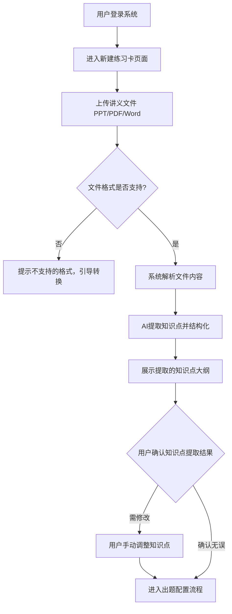
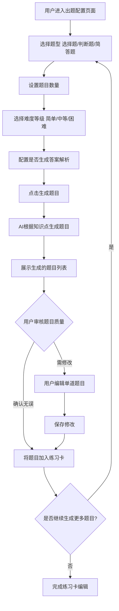
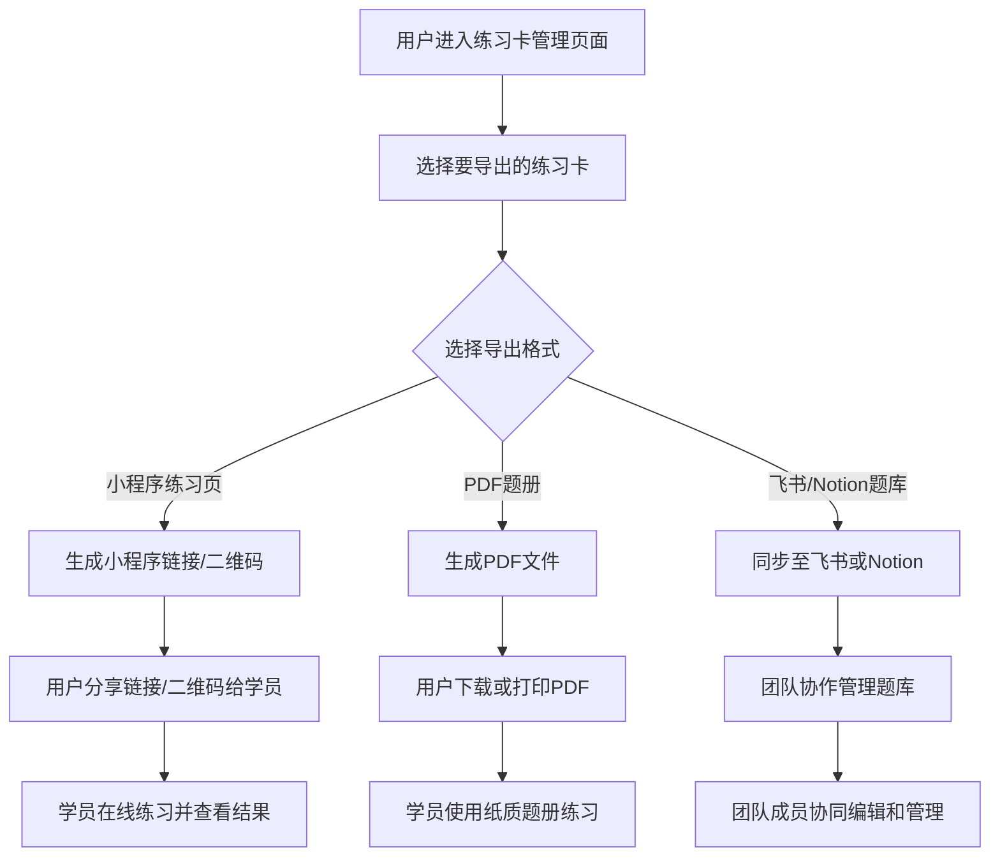
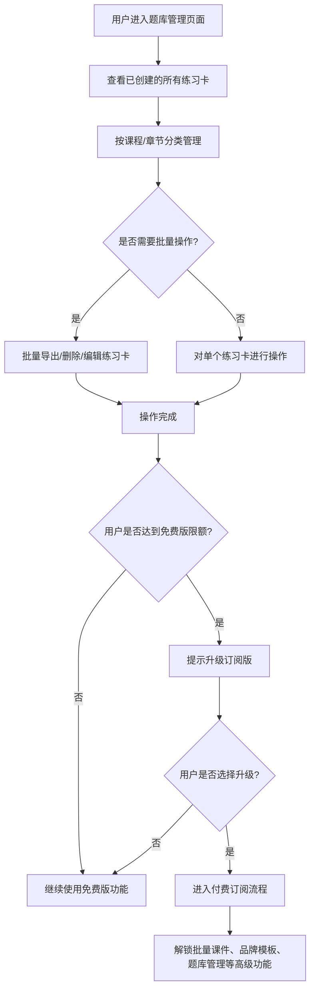
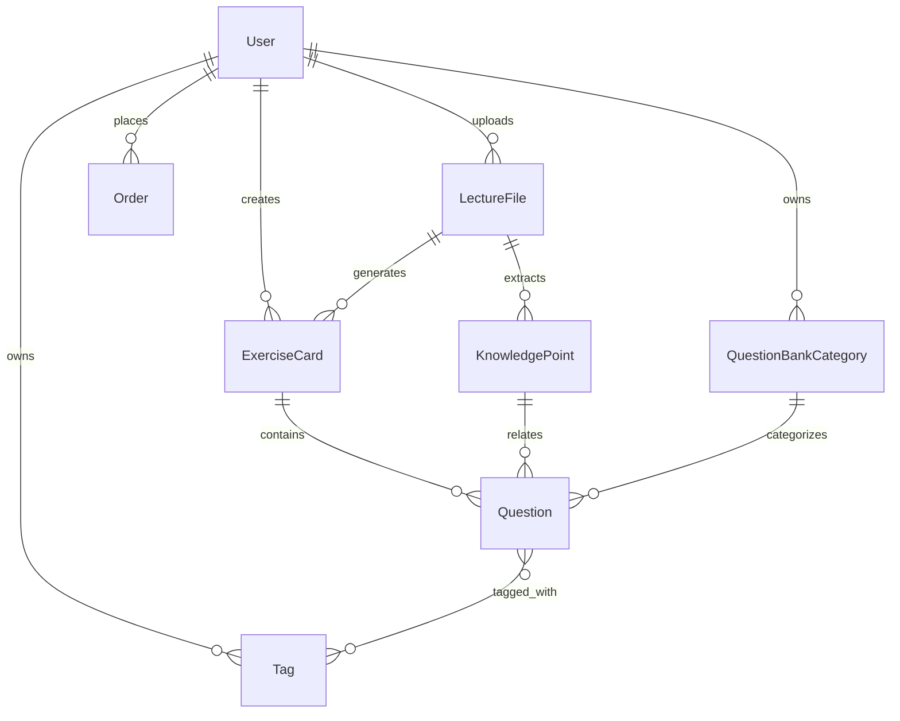

# 1. 需求概述

## 1.1 需求介绍

课程讲义转练习卡是一款面向教育内容创作者的智能化知识复用工具，帮助线上课程老师、知识付费讲师、教培机构教研人员及大学助教/培训师，将已有的课程讲义（PPT/PDF/Word等格式）快速转化为结构化的练习题和复习卡片。产品通过AI自动提取讲义中的知识点，并生成选择题、判断题、简答题等多种题型，支持按章节组织练习卡片，可导出为小程序练习页、PDF题册或飞书/Notion题库，从而解决讲师手动出题耗时、课件内容无法高效复用为复习材料等痛点。

### 1.1.1 所属领域

教育科技 / 知识付费工具 / 内容复用与练习生成

## 1.2 需求目标

1. **降低出题门槛**：通过上传讲义文件，AI自动提取知识点并生成练习题，将原本需要数小时的手动出题过程缩短至几分钟，大幅降低讲师的出题负担。
2. **实现课件内容复用**：将静态的课程讲义转化为可交互的练习卡片和题册，让课件内容能够在课后复习、考前练习等场景中持续发挥价值。
3. **支持灵活的题型与难度配置**：提供选择题、判断题、简答题等多种题型，支持按难度等级调整，满足不同课程和学员层次的需求。
4. **多渠道导出与分发**：支持导出为小程序练习页（便于学员在线练习）、PDF题册（便于打印分发）、飞书/Notion题库（便于团队协作管理），覆盖不同使用场景。
5. **提供灵活的商业模式**：按量付费（¥9/份课件）满足低频使用需求，订阅版（¥49/月）支持批量课件、品牌模板、题库管理等高级功能，覆盖个人讲师到教培机构的多样化需求。

## 1.3 系统使用角色

| 角色 | 描述 | 典型用户 |
|------|------|----------|
| 个人讲师 | 独立开展线上课程或知识付费的讲师，需要将课件转化为练习题供学员复习 | 知识付费平台讲师、自媒体教育博主 |
| 教培教研人员 | 教培机构中负责课程研发和教材编写的人员，需要批量生成配套练习 | 教培机构教研组成员、课程设计师 |
| 大学助教/培训师 | 协助教授准备课程材料的企业培训师或高校助教，需要将课件转为复习材料 | 高校课程助教、企业内训讲师 |

## 1.4 业务流程图

### 1.4.1 讲义上传与知识点提取流程



### 1.4.2 练习题生成流程



### 1.4.3 练习卡导出与分发流程



### 1.4.4 题库管理与订阅升级流程



## 1.5 功能清单

### 1.5.1 核心功能（MVP范围）

| 功能模块 | 功能名称 | 优先级 | 描述 |
|----------|----------|--------|------|
| 文件上传 | 讲义文件上传 | P0 | 支持上传PPT、PDF、Word格式的讲义文件 |
| 文件上传 | 文件格式校验 | P0 | 校验文件格式是否支持，文件大小限制（如50MB以内） |
| 知识点提取 | AI知识点提取 | P0 | 自动从讲义中提取关键知识点并结构化展示 |
| 知识点提取 | 知识点大纲展示 | P0 | 以大纲形式展示提取的知识点，支持用户确认和修改 |
| 题目生成 | 选择题生成 | P0 | 根据知识点生成单选题和多选题 |
| 题目生成 | 判断题生成 | P0 | 根据知识点生成判断对错类题目 |
| 题目生成 | 简答题生成 | P0 | 根据知识点生成需要文字作答的简答题 |
| 题目生成 | 难度等级配置 | P1 | 支持简单/中等/困难三个难度等级 |
| 题目生成 | 题目数量配置 | P1 | 支持设置每种题型生成的数量 |
| 题目生成 | 答案解析生成 | P0 | 为每道题生成详细的答案解析 |
| 题目审核 | 题目预览与编辑 | P0 | 支持预览生成的题目，并支持手动编辑修改 |
| 练习卡管理 | 练习卡创建 | P0 | 基于知识点和题目创建练习卡 |
| 练习卡管理 | 按章节组织 | P1 | 支持按课程章节组织多个练习卡 |
| 导出分发 | 小程序练习页导出 | P0 | 生成可在微信小程序中练习的页面链接 |
| 导出分发 | PDF题册导出 | P0 | 生成可下载打印的PDF格式题册 |
| 导出分发 | 飞书/Notion同步 | P1 | 将题库同步至飞书文档或Notion数据库 |

### 1.5.2 高级功能（订阅版）

| 功能模块 | 功能名称 | 优先级 | 描述 |
|----------|----------|--------|------|
| 批量处理 | 批量课件生成 | P2 | 支持一次性上传多个讲义文件批量生成练习卡 |
| 品牌定制 | 品牌模板 | P2 | 支持自定义练习卡的logo、配色、页眉页脚等品牌元素 |
| 题库管理 | 题库管理 | P2 | 提供完整的题库管理功能，支持分类、标签、搜索 |
| 数据分析 | 学员练习数据分析 | P2 | 统计学员答题情况，分析知识点掌握程度 |

## 1.6 非功能需求

### 1.6.1 性能需求

1. 文件上传响应时间：单文件（50MB以内）上传完成时间不超过10秒（视网络状况）
2. 知识点提取时间：单份讲义（50页以内）知识点提取完成时间不超过60秒
3. 题目生成时间：单份讲义生成30道题目完成时间不超过90秒
4. 导出响应时间：PDF导出完成时间不超过30秒，小程序链接生成不超过10秒

### 1.6.2 可用性需求

1. 系统可用性达到99.5%，确保用户在工作时间可正常使用
2. 支持主流浏览器访问（Chrome、Safari、Edge、Firefox）
3. 小程序端适配iOS和Android主流机型

### 1.6.3 安全需求

1. 用户上传的讲义文件需加密存储，保护知识产权
2. 生成的题目和练习卡数据需定期备份
3. 用户账号信息需加密存储，密码采用不可逆加密算法

### 1.6.4 兼容性需求

1. 支持PPT（.pptx）、PDF（.pdf）、Word（.docx）格式文件解析
2. 导出的PDF需兼容主流打印机和阅读器
3. 小程序需兼容微信小程序基础库2.20.0及以上版本

# 2. 用户场景与用例

## 2.1 场景一：知识付费讲师快速生成配套练习

### 2.1.1 场景描述

张老师是一位知识付费平台上的讲师，专门讲授项目管理课程。她已经有了一套完整的PPT课件（共12节课），但一直缺少配套的练习题。过去她需要花费大量时间手动出题，现在她使用"课程讲义转练习卡"工具，可以在几分钟内为每节课生成配套的练习题。

### 2.1.2 用户操作步骤

1. 张老师登录系统，进入"新建练习卡"页面
2. 上传第一节课的PPT课件
3. 系统自动解析PPT内容，展示提取的知识点大纲
4. 张老师确认知识点提取结果，选择需要出题的章节
5. 配置题目类型：选择题10道、判断题5道、简答题3道，难度设为"中等"
6. 点击"生成题目"，系统AI自动生成题目
7. 张老师预览生成的题目，修改了几道不满意的选择题
8. 确认无误后，保存为"项目管理第1课-练习卡"
9. 选择导出为"小程序练习页"，生成分享链接
10. 张老师将链接发给学员，学员可以在小程序中在线练习

### 2.1.3 预期结果

- 张老师在10分钟内完成了一套配套练习题的生成
- 学员可以通过小程序随时随地进行练习
- 张老师的出题效率提升了10倍以上

## 2.2 场景二：教培机构批量生成题库

### 2.2.1 场景描述

某教培机构的教研组有5位老师，每人负责不同科目的课件编写。机构需要为所有课件配套标准化的题库，用于学员课后练习和考前模拟。使用订阅版后，教研组可以批量上传课件，统一管理题库。

### 2.2.2 用户操作步骤

1. 教研组管理员使用订阅版账号登录
2. 进入"批量上传"功能，一次性上传20份课件（涵盖5个科目）
3. 系统批量处理，为每份课件生成知识点大纲和题目
4. 教研组分工审核：每位老师负责审核自己科目的题目
5. 审核通过后，将题目按科目分类归档到题库
6. 使用"品牌模板"功能，为所有练习卡添加机构logo和配色
7. 将题库同步至飞书文档，供全机构老师共享使用
8. 学员通过机构小程序入口进入练习页面

### 2.2.3 预期结果

- 教研组在1天内完成了原本需要2周的题库建设工作
- 题库标准统一，品牌元素一致
- 全机构老师可以协同使用和更新题库

## 2.3 场景三：大学助教制作复习材料

### 2.3.1 场景描述

小李是一名大学助教，协助教授讲授"宏观经济学"课程。教授提供了详细的讲义PDF，小李需要将其转化为复习题供学生期末考试前练习。

### 2.3.2 用户操作步骤

1. 小李使用免费账号登录系统
2. 上传教授提供的讲义PDF（共80页）
3. 系统提取知识点后，小李按章节选择需要出题的内容
4. 选择生成"选择题+简答题"组合，难度设为"困难"
5. 系统生成题目后，小李根据教学重点调整了几道简答题的提问角度
6. 导出为PDF题册，添加封面和目录
7. 将PDF发布到课程群，供学生下载打印

### 2.3.3 预期结果

- 小李在30分钟内完成了一套高质量复习题的制作
- 学生可以通过PDF题册进行纸质练习
- 教授对复习题的质量表示满意

## 2.4 场景四：企业培训师制作课后测评

### 2.4.1 场景描述

王经理是企业内训讲师，需要在新员工培训后进行在线测评。他将培训PPT转化为练习卡后，通过小程序链接发给学员完成测评。

### 2.4.2 用户操作步骤

1. 王经理上传培训PPT课件
2. 系统提取知识点并生成题目
3. 王经理配置题目类型为"选择题+判断题"，难度设为"简单"
4. 导出为"小程序练习页"
5. 在培训结束后，将小程序链接发到企业微信群
6. 学员点击链接完成在线测评
7. 王经理查看学员的答题情况和正确率统计

### 2.4.3 预期结果

- 培训测评实现了无纸化和自动化
- 王经理可以快速了解学员对培训内容的掌握程度
- 学员可以即时查看答题结果和解析

# 3. 功能详细设计

## 3.1 讲义文件上传

### 3.1.1 功能说明

用户可以通过上传入口上传课程讲义文件，系统支持PPT（.pptx）、PDF（.pdf）、Word（.docx）三种格式。

### 3.1.2 页面元素

| 元素 | 类型 | 描述 |
|------|------|------|
| 上传区域 | 拖拽/点击上传 | 支持拖拽文件到上传区域，或点击选择文件 |
| 格式提示 | 文本 | "支持PPT、PDF、Word格式，单文件不超过50MB" |
| 上传进度条 | 进度条 | 显示文件上传进度 |
| 上传成功提示 | 提示框 | 显示"上传成功，正在解析..." |
| 上传失败提示 | 错误提示 | 显示失败原因（格式不支持、文件过大等） |

### 3.1.3 交互流程

1. 用户点击上传区域或拖拽文件到上传区域
2. 系统校验文件格式和大小
3. 校验通过后，显示上传进度条
4. 上传完成后，自动进入文件解析流程
5. 若格式不支持或文件过大，显示错误提示，引导用户调整

### 3.1.4 业务规则

- 支持的文件格式：.pptx、.pdf、.docx
- 单文件大小限制：50MB
- 免费版每月最多上传10份文件
- 订阅版无文件数量限制

## 3.2 AI知识点提取

### 3.2.1 功能说明

系统通过AI自动解析上传的讲义文件，提取其中的关键知识点，并以结构化大纲的形式展示给用户确认和修改。

### 3.2.2 页面元素

| 元素 | 类型 | 描述 |
|------|------|------|
| 解析进度提示 | 加载动画 | "正在解析讲义内容，请稍候..." |
| 知识点大纲 | 树形结构 | 按章节/小节展示提取的知识点 |
| 章节标题 | 可折叠节点 | 显示课程章节名称 |
| 知识点条目 | 叶子节点 | 显示每个知识点的标题和摘要 |
| 编辑按钮 | 图标按钮 | 点击可编辑知识点内容 |
| 删除按钮 | 图标按钮 | 点击可删除不需要的知识点 |
| 添加按钮 | 按钮 | 用户可手动添加知识点 |
| 确认按钮 | 主按钮 | "确认知识点，进入出题配置" |

### 3.2.3 交互流程

1. 文件上传完成后，系统自动开始解析
2. 显示解析进度动画（通常30-60秒）
3. 解析完成后，展示知识点大纲
4. 用户可以：
   - 展开/折叠章节查看知识点
   - 点击编辑按钮修改知识点内容
   - 点击删除按钮移除不需要的知识点
   - 点击添加按钮补充遗漏的知识点
5. 用户确认无误后，点击"确认知识点"进入下一步

### 3.2.4 业务规则

- 知识点提取基于讲义中的文字内容，图片内容暂不支持
- 每个讲义最多提取100个知识点
- 知识点按章节自动分组，若无明确章节则按内容顺序分组
- 用户修改知识点后，系统会记录修改痕迹（用于后续优化AI提取质量）

## 3.3 题目生成配置

### 3.3.1 功能说明

用户确认知识点后，可以配置要生成的题目类型、数量、难度等参数，系统根据配置生成相应的练习题。

### 3.3.2 页面元素

| 元素 | 类型 | 描述 |
|------|------|------|
| 题型选择 | 复选框 | 选择题、判断题、简答题（可多选） |
| 选择题数量 | 数字输入 | 默认10道，范围1-50 |
| 判断题数量 | 数字输入 | 默认5道，范围1-30 |
| 简答题数量 | 数字输入 | 默认3道，范围1-20 |
| 难度等级 | 单选 | 简单/中等/困难 |
| 答案解析 | 开关 | 是否生成答案解析（默认开启） |
| 出题范围 | 复选框 | 选择要出题的知识点章节（默认全部） |
| 生成按钮 | 主按钮 | "生成题目" |

### 3.3.3 交互流程

1. 用户选择需要生成的题型（可多选）
2. 设置每种题型的数量
3. 选择难度等级
4. 选择是否生成答案解析
5. 选择出题范围（全部章节或指定章节）
6. 点击"生成题目"按钮
7. 系统显示生成进度（通常60-90秒）
8. 生成完成后，跳转到题目预览页面

### 3.3.4 业务规则

- 每种题型最少1道，最多根据题型限制
- 难度等级影响题目的复杂度和深度：
  - 简单：基础概念记忆和理解
  - 中等：知识应用和分析
  - 困难：综合评价和创造性思考
- 答案解析包含解题思路、相关知识点引用、易错点提示
- 每次生成消耗1次配额（按量付费）

## 3.4 题目预览与编辑

### 3.4.1 功能说明

生成的题目以列表形式展示，用户可以逐题预览、编辑、删除，也可以重新生成不满意的题目。

### 3.4.2 页面元素

| 元素 | 类型 | 描述 |
|------|------|------|
| 题目列表 | 卡片列表 | 每道题以卡片形式展示 |
| 题目序号 | 文本 | 显示题号 |
| 题目类型标签 | 标签 | 选择题/判断题/简答题 |
| 难度标签 | 标签 | 简单/中等/困难 |
| 题目内容 | 文本 | 显示题目正文 |
| 选项（选择题） | 列表 | 显示A/B/C/D选项 |
| 正确答案 | 文本 | 显示正确答案 |
| 答案解析 | 可折叠文本 | 显示详细解析 |
| 编辑按钮 | 图标按钮 | 进入题目编辑模式 |
| 删除按钮 | 图标按钮 | 删除该题目 |
| 重新生成按钮 | 图标按钮 | 基于相同知识点重新生成该题 |
| 批量操作栏 | 工具栏 | 全选、批量删除、批量导出 |
| 保存练习卡按钮 | 主按钮 | "保存为练习卡" |

### 3.4.3 交互流程

1. 系统展示生成的所有题目，按题型和章节分组
2. 用户可以：
   - 点击卡片展开查看完整题目和解析
   - 点击编辑按钮修改题目内容、选项、答案
   - 点击删除按钮移除不满意的题目
   - 点击重新生成按钮让AI重新生成该题
3. 编辑完成后，点击"保存为练习卡"
4. 输入练习卡名称和描述
5. 保存成功，跳转到练习卡管理页面

### 3.4.4 业务规则

- 编辑题目时，可修改题目内容、选项、正确答案、答案解析
- 重新生成题目时，系统会基于原知识点重新生成，但不保证完全不同于原题
- 删除题目后不可恢复，需用户二次确认
- 保存练习卡时，至少需要保留1道题目

## 3.5 练习卡管理

### 3.5.1 功能说明

用户可以在管理页面查看所有已创建的练习卡，支持按课程/章节分类、搜索、编辑、删除、导出等操作。

### 3.5.2 页面元素

| 元素 | 类型 | 描述 |
|------|------|------|
| 练习卡列表 | 卡片列表 | 展示所有练习卡 |
| 练习卡名称 | 文本 | 练习卡标题 |
| 课程/章节信息 | 文本 | 所属课程和章节 |
| 题目数量 | 文本 | 包含的题目数量 |
| 创建时间 | 文本 | 创建日期 |
| 导出按钮 | 下拉按钮 | 选择导出格式 |
| 编辑按钮 | 图标按钮 | 进入练习卡编辑模式 |
| 删除按钮 | 图标按钮 | 删除练习卡 |
| 分类筛选 | 下拉选择 | 按课程/章节筛选 |
| 搜索框 | 输入框 | 按名称搜索练习卡 |
| 新建练习卡按钮 | 主按钮 | 创建新的练习卡 |

### 3.5.3 交互流程

1. 用户进入练习卡管理页面，查看所有练习卡
2. 可以：
   - 使用分类筛选或搜索框快速定位练习卡
   - 点击练习卡进入详情/编辑页面
   - 点击导出按钮选择导出格式
   - 点击删除按钮移除练习卡（需二次确认）
3. 点击"新建练习卡"进入创建流程

### 3.5.4 业务规则

- 免费版最多保存20个练习卡
- 订阅版无练习卡数量限制
- 删除练习卡后不可恢复，需用户二次确认
- 练习卡支持按课程和章节两级分类管理

## 3.6 导出与分发

### 3.6.1 功能说明

练习卡支持多种格式导出，包括小程序练习页、PDF题册、飞书/Notion题库同步，满足不同场景的分发需求。

### 3.6.2 页面元素

| 元素 | 类型 | 描述 |
|------|------|------|
| 导出格式选择 | 弹窗/面板 | 选择导出格式 |
| 小程序练习页选项 | 单选 | 生成在线练习链接 |
| PDF题册选项 | 单选 | 生成可下载的PDF文件 |
| 飞书同步选项 | 单选 | 同步至飞书文档 |
| Notion同步选项 | 单选 | 同步至Notion数据库 |
| 导出设置 | 配置项 | 如PDF是否含答案、是否含解析等 |
| 导出按钮 | 主按钮 | 确认导出 |
| 导出进度 | 进度条 | 显示导出进度 |
| 导出结果 | 提示/下载 | 链接、二维码或下载文件 |

### 3.6.3 各导出格式详细说明

#### 3.6.3.1 小程序练习页

- 生成唯一的小程序页面链接和二维码
- 学员点击链接或扫描二维码即可进入练习页面
- 练习页面支持答题、提交、查看结果和解析
- 链接有效期：永久（除非用户手动删除练习卡）

#### 3.6.3.2 PDF题册

- 生成A4排版的PDF文件，适合打印
- 包含：封面、目录、题目、答案与解析（可选）
- 用户可配置：是否包含答案页、是否包含解析、是否添加页眉页脚
- 文件大小：通常1-5MB（视题目数量而定）

#### 3.6.3.3 飞书/Notion同步

- 需要用户授权绑定飞书或Notion账号
- 将题目按结构化格式同步至指定文档/数据库
- 支持增量同步（新增/修改的题目同步更新）
- 同步后的内容可在飞书/Notion中协同编辑

### 3.6.4 交互流程

1. 用户点击练习卡的"导出"按钮
2. 选择导出格式
3. 配置导出设置（如PDF是否含答案）
4. 点击"确认导出"
5. 系统显示导出进度
6. 导出完成后：
   - 小程序链接：显示链接和二维码，支持复制/分享
   - PDF文件：自动下载或提供下载链接
   - 飞书/Notion：提示同步成功，提供查看链接

### 3.6.5 业务规则

- 小程序练习页导出：免费版和订阅版均可使用
- PDF题册导出：免费版和订阅版均可使用
- 飞书/Notion同步：仅订阅版可用
- 每次导出PDF会生成新的文件，不会覆盖历史导出
- 小程序链接被删除后，学员无法再访问该练习页

## 3.7 题库管理（订阅版）

### 3.7.1 功能说明

订阅版用户可以使用完整的题库管理功能，支持按科目/章节分类、标签管理、批量操作等。

### 3.7.2 页面元素

| 元素 | 类型 | 描述 |
|------|------|------|
| 题库分类树 | 左侧导航 | 按科目/章节展示题库结构 |
| 题目列表 | 主内容区 | 展示当前分类下的题目 |
| 标签筛选 | 标签云 | 按标签筛选题目 |
| 批量操作栏 | 工具栏 | 批量移动、打标签、删除、导出 |
| 题目搜索 | 搜索框 | 全文搜索题目内容 |
| 新建分类按钮 | 按钮 | 创建新的科目/章节分类 |
| 导入题目按钮 | 按钮 | 从外部导入题目到题库 |

### 3.7.3 交互流程

1. 用户进入题库管理页面
2. 通过左侧分类树定位到目标分类
3. 查看该分类下的所有题目
4. 可以：
   - 使用标签筛选缩小范围
   - 使用搜索框快速查找
   - 批量选择题目进行操作
   - 拖拽题目调整分类
5. 支持从外部导入题目（如Excel/CSV格式）

### 3.7.4 业务规则

- 题库管理为订阅版专属功能
- 支持无限层级的分类结构
- 每道题目可以打多个标签
- 导入题目支持Excel/CSV格式，需按模板格式填写

## 3.8 用户账号与付费

### 3.8.1 功能说明

用户通过手机号注册登录，可以选择按量付费或订阅版，系统根据付费等级提供不同的功能权限。

### 3.8.2 页面元素

| 元素 | 类型 | 描述 |
|------|------|------|
| 登录/注册页 | 表单 | 手机号+验证码登录/注册 |
| 个人信息页 | 表单 | 昵称、头像、手机号等 |
| 付费套餐页 | 卡片 | 展示免费版和订阅版功能对比 |
| 按量付费入口 | 按钮 | 充值购买生成次数 |
| 订阅版入口 | 按钮 | 开通/续费订阅 |
| 订单记录页 | 列表 | 查看历史付费记录 |
| 配额使用提示 | 进度条 | 显示当前配额使用情况 |

### 3.8.3 付费模式

| 付费模式 | 价格 | 功能范围 |
|----------|------|----------|
| 按量付费 | ¥9/份课件 | 单份讲义生成练习卡，含基础导出功能 |
| 订阅版-月付 | ¥49/月 | 无限量课件、批量处理、品牌模板、题库管理、飞书/Notion同步 |
| 订阅版-年付 | ¥468/年 | 月付功能，年付享8折优惠 |

### 3.8.4 业务规则

- 新用户注册赠送3次免费生成配额
- 按量付费购买的配额无使用期限
- 订阅到期后，已创建的练习卡可继续使用，但无法新建
- 订阅到期后，高级功能（批量、品牌模板、题库管理）暂停使用
- 付费用户支持开具电子发票

# 4. 数据模型

## 4.1 核心实体

### 4.1.1 用户（User）

| 字段 | 类型 | 描述 |
|------|------|------|
| id | UUID | 用户唯一标识 |
| phone | string | 手机号（登录账号） |
| nickname | string | 昵称 |
| avatar | string | 头像URL |
| user_type | enum | 用户类型：free/paid_monthly/paid_yearly |
| quota_remaining | int | 剩余生成配额 |
| subscription_expire_at | datetime | 订阅到期时间（仅付费用户） |
| created_at | datetime | 注册时间 |
| updated_at | datetime | 更新时间 |

### 4.1.2 讲义文件（LectureFile）

| 字段 | 类型 | 描述 |
|------|------|------|
| id | UUID | 文件唯一标识 |
| user_id | UUID | 所属用户 |
| file_name | string | 文件名 |
| file_type | enum | 文件类型：ppt/pdf/word |
| file_size | int | 文件大小（字节） |
| file_url | string | 文件存储URL |
| parse_status | enum | 解析状态：pending/parsing/completed/failed |
| created_at | datetime | 上传时间 |

### 4.1.3 知识点（KnowledgePoint）

| 字段 | 类型 | 描述 |
|------|------|------|
| id | UUID | 知识点唯一标识 |
| lecture_file_id | UUID | 所属讲义文件 |
| chapter | string | 所属章节 |
| title | string | 知识点标题 |
| summary | text | 知识点摘要 |
| content | text | 知识点详细内容 |
| sort_order | int | 排序序号 |
| created_at | datetime | 创建时间 |
| updated_at | datetime | 更新时间 |

### 4.1.4 练习卡（ExerciseCard）

| 字段 | 类型 | 描述 |
|------|------|------|
| id | UUID | 练习卡唯一标识 |
| user_id | UUID | 所属用户 |
| lecture_file_id | UUID | 来源讲义文件 |
| title | string | 练习卡名称 |
| description | text | 练习卡描述 |
| course_name | string | 所属课程名称 |
| chapter_name | string | 所属章节名称 |
| question_count | int | 题目数量 |
| mini_program_url | string | 小程序练习页链接 |
| created_at | datetime | 创建时间 |
| updated_at | datetime | 更新时间 |

### 4.1.5 题目（Question）

| 字段 | 类型 | 描述 |
|------|------|------|
| id | UUID | 题目唯一标识 |
| exercise_card_id | UUID | 所属练习卡 |
| knowledge_point_id | UUID | 关联知识点 |
| question_type | enum | 题型：choice/true_false/short_answer |
| difficulty | enum | 难度：easy/medium/hard |
| content | text | 题目内容 |
| options | json | 选项（选择题专用） |
| answer | text | 正确答案 |
| explanation | text | 答案解析 |
| sort_order | int | 排序序号 |
| created_at | datetime | 创建时间 |
| updated_at | datetime | 更新时间 |

### 4.1.6 题库分类（QuestionBankCategory）

| 字段 | 类型 | 描述 |
|------|------|------|
| id | UUID | 分类唯一标识 |
| user_id | UUID | 所属用户 |
| parent_id | UUID | 父分类ID（支持多级分类） |
| name | string | 分类名称 |
| sort_order | int | 排序序号 |
| created_at | datetime | 创建时间 |

### 4.1.7 标签（Tag）

| 字段 | 类型 | 描述 |
|------|------|------|
| id | UUID | 标签唯一标识 |
| user_id | UUID | 所属用户 |
| name | string | 标签名称 |
| color | string | 标签颜色 |
| created_at | datetime | 创建时间 |

### 4.1.8 订单（Order）

| 字段 | 类型 | 描述 |
|------|------|------|
| id | UUID | 订单唯一标识 |
| user_id | UUID | 所属用户 |
| order_type | enum | 订单类型：quota/subscription_monthly/subscription_yearly |
| amount | decimal | 订单金额 |
| payment_status | enum | 支付状态：pending/paid/failed/refunded |
| payment_method | string | 支付方式 |
| paid_at | datetime | 支付时间 |
| created_at | datetime | 创建时间 |

## 4.2 实体关系



# 5. 接口设计

## 5.1 文件上传接口

### 5.1.1 上传讲义文件

**请求**

```
POST /api/v1/lecture-files/upload
Content-Type: multipart/form-data

file: <file>
```

**响应**

```json
{
  "code": 0,
  "data": {
    "id": "uuid",
    "file_name": "项目管理课件.pptx",
    "file_type": "ppt",
    "file_size": 10240000,
    "parse_status": "pending"
  }
}
```

### 5.1.2 查询文件解析状态

**请求**

```
GET /api/v1/lecture-files/{file_id}/status
```

**响应**

```json
{
  "code": 0,
  "data": {
    "id": "uuid",
    "parse_status": "completed",
    "knowledge_point_count": 25
  }
}
```

## 5.2 知识点接口

### 5.2.1 获取知识点列表

**请求**

```
GET /api/v1/lecture-files/{file_id}/knowledge-points
```

**响应**

```json
{
  "code": 0,
  "data": [
    {
      "id": "uuid",
      "chapter": "第一章 项目管理概述",
      "title": "项目的定义与特征",
      "summary": "项目是为创造独特的产品、服务或成果而进行的临时性工作...",
      "sort_order": 1
    }
  ]
}
```

### 5.2.2 更新知识点

**请求**

```
PUT /api/v1/knowledge-points/{point_id}
Content-Type: application/json

{
  "title": "更新后的标题",
  "summary": "更新后的摘要",
  "content": "更新后的详细内容"
}
```

**响应**

```json
{
  "code": 0,
  "data": {
    "id": "uuid",
    "title": "更新后的标题",
    "summary": "更新后的摘要",
    "content": "更新后的详细内容"
  }
}
```

### 5.2.3 删除知识点

**请求**

```
DELETE /api/v1/knowledge-points/{point_id}
```

**响应**

```json
{
  "code": 0,
  "message": "删除成功"
}
```

## 5.3 题目生成接口

### 5.3.1 生成题目

**请求**

```
POST /api/v1/questions/generate
Content-Type: application/json

{
  "lecture_file_id": "uuid",
  "config": {
    "question_types": ["choice", "true_false", "short_answer"],
    "choice_count": 10,
    "true_false_count": 5,
    "short_answer_count": 3,
    "difficulty": "medium",
    "generate_explanation": true,
    "knowledge_point_ids": ["uuid1", "uuid2"]
  }
}
```

**响应**

```json
{
  "code": 0,
  "data": {
    "task_id": "uuid",
    "status": "generating"
  }
}
```

### 5.3.2 查询生成结果

**请求**

```
GET /api/v1/questions/generate/{task_id}
```

**响应**

```json
{
  "code": 0,
  "data": {
    "task_id": "uuid",
    "status": "completed",
    "questions": [
      {
        "id": "uuid",
        "question_type": "choice",
        "difficulty": "medium",
        "content": "以下哪项不属于项目管理的五大过程组？",
        "options": [
          {"label": "A", "content": "启动"},
          {"label": "B", "content": "规划"},
          {"label": "C", "content": "执行"},
          {"label": "D", "content": "运营"}
        ],
        "answer": "D",
        "explanation": "项目管理的五大过程组包括：启动、规划、执行、监控、收尾。运营不属于项目管理过程组。",
        "knowledge_point_id": "uuid"
      }
    ]
  }
}
```

## 5.4 练习卡接口

### 5.4.1 创建练习卡

**请求**

```
POST /api/v1/exercise-cards
Content-Type: application/json

{
  "title": "项目管理第1课-练习卡",
  "description": "项目管理概述章节的配套练习",
  "course_name": "项目管理",
  "chapter_name": "第一章 项目管理概述",
  "question_ids": ["uuid1", "uuid2", "uuid3"]
}
```

**响应**

```json
{
  "code": 0,
  "data": {
    "id": "uuid",
    "title": "项目管理第1课-练习卡",
    "question_count": 3,
    "created_at": "2026-06-26T10:00:00Z"
  }
}
```

### 5.4.2 获取练习卡列表

**请求**

```
GET /api/v1/exercise-cards?page=1&page_size=20&course_name=项目管理
```

**响应**

```json
{
  "code": 0,
  "data": {
    "total": 15,
    "items": [
      {
        "id": "uuid",
        "title": "项目管理第1课-练习卡",
        "course_name": "项目管理",
        "chapter_name": "第一章 项目管理概述",
        "question_count": 18,
        "created_at": "2026-06-26T10:00:00Z"
      }
    ]
  }
}
```

### 5.4.3 导出练习卡

**请求**

```
POST /api/v1/exercise-cards/{card_id}/export
Content-Type: application/json

{
  "format": "pdf",
  "include_answer": true,
  "include_explanation": true
}
```

**响应**

```json
{
  "code": 0,
  "data": {
    "export_task_id": "uuid",
    "format": "pdf"
  }
}
```

### 5.4.4 查询导出结果

**请求**

```
GET /api/v1/exports/{export_task_id}
```

**响应**

```json
{
  "code": 0,
  "data": {
    "export_task_id": "uuid",
    "status": "completed",
    "download_url": "https://xxx.com/exports/xxx.pdf",
    "expire_at": "2026-06-27T10:00:00Z"
  }
}
```

## 5.5 用户与付费接口

### 5.5.1 用户登录

**请求**

```
POST /api/v1/auth/login
Content-Type: application/json

{
  "phone": "13800138000",
  "code": "123456"
}
```

**响应**

```json
{
  "code": 0,
  "data": {
    "token": "jwt_token",
    "user": {
      "id": "uuid",
      "phone": "13800138000",
      "nickname": "张老师",
      "user_type": "free",
      "quota_remaining": 3
    }
  }
}
```

### 5.5.2 创建订单

**请求**

```
POST /api/v1/orders
Content-Type: application/json

{
  "order_type": "quota",
  "quantity": 10
}
```

**响应**

```json
{
  "code": 0,
  "data": {
    "order_id": "uuid",
    "amount": 90.00,
    "payment_params": {
      "prepay_id": "wx_prepay_id"
    }
  }
}
```

# 6. 技术实现要点

## 6.1 文件解析

### 6.1.1 PPT解析

- 使用python-pptx库解析.pptx文件
- 提取每页幻灯片的文本内容
- 按幻灯片顺序保留内容结构
- 忽略图片、动画等非文本内容

### 6.1.2 PDF解析

- 使用PyPDF2或pdfplumber库解析PDF文件
- 提取文本内容，保留段落结构
- 处理分页，合并跨页段落
- 对于扫描版PDF，需使用OCR识别（MVP阶段暂不支持）

### 6.1.3 Word解析

- 使用python-docx库解析.docx文件
- 提取文档中的文本内容
- 保留标题层级和段落结构

## 6.2 AI知识点提取与题目生成

### 6.2.1 技术方案

- 使用大语言模型（如Claude、GPT-4）进行知识点提取和题目生成
- 采用Prompt Engineering方式，针对不同题型设计专用Prompt模板
- 知识点提取：将讲义文本输入LLM，要求提取关键概念、定义、原理等
- 题目生成：基于知识点和题型要求，生成符合难度等级的题目

### 6.2.2 Prompt设计要点

- 知识点提取Prompt：要求输出结构化的知识点列表（JSON格式），包含章节、标题、摘要
- 选择题Prompt：要求生成题目、4个选项、正确答案、解析，避免歧义和错误
- 判断题Prompt：要求生成陈述句，明确对错，解析说明判断依据
- 简答题Prompt：要求生成开放式问题，提供参考答案和评分要点

### 6.2.3 质量保证

- 对LLM生成的题目进行格式校验（如选择题必须有4个选项）
- 对答案进行一致性检查（如选择题答案必须在选项中）
- 提供用户审核环节，允许人工修正AI生成的题目

## 6.3 导出实现

### 6.3.1 PDF导出

- 使用WeasyPrint或ReportLab库生成PDF
- 设计PDF模板，包含封面、目录、题目、答案页
- 支持A4排版，适合打印
- 处理中文字体渲染

### 6.3.2 小程序练习页

- 开发微信小程序，提供在线答题功能
- 后端生成唯一的小程序页面路径和参数
- 学员扫码或点击链接进入对应练习页面
- 支持答题、提交、查看结果和解析

### 6.3.3 飞书/Notion同步

- 集成飞书开放平台API，支持文档创建和内容写入
- 集成Notion API，支持数据库条目创建
- 使用OAuth2.0进行账号授权绑定
- 实现增量同步机制

## 6.4 存储方案

### 6.4.1 文件存储

- 用户上传的讲义文件存储在对象存储（如阿里云OSS、腾讯云COS）
- 设置文件访问权限，仅用户本人可访问
- 定期清理过期导出文件

### 6.4.2 数据库

- 使用关系型数据库（如MySQL、PostgreSQL）存储结构化数据
- 主要表：用户、讲义文件、知识点、练习卡、题目、分类、标签、订单
- 设计合理的索引，优化查询性能

### 6.4.3 缓存

- 使用Redis缓存用户会话信息和热点数据
- 缓存文件解析状态和生成任务状态
- 设置合理的缓存过期时间

# 7. 商业模式与运营策略

## 7.1 收入模式

### 7.1.1 按量付费

- 价格：¥9/份课件生成
- 适用场景：低频使用的个人讲师、偶尔需要出题的用户
- 购买方式：充值购买生成次数，无使用期限

### 7.1.2 订阅版

- 月付：¥49/月
- 年付：¥468/年（8折优惠）
- 适用场景：高频使用的讲师、教培机构教研组
- 功能范围：无限量课件、批量处理、品牌模板、题库管理、飞书/Notion同步

## 7.2 成本结构

### 7.2.1 主要成本

- AI调用成本：LLM API调用费用（按Token计费）
- 存储成本：对象存储和数据库存储费用
- 带宽成本：文件上传下载产生的流量费用
- 开发维护成本：研发人员工资

### 7.2.2 成本优化

- 优化Prompt设计，减少不必要的Token消耗
- 使用缓存减少重复的AI调用
- 采用压缩算法减少文件存储体积
- 使用CDN加速降低带宽成本

## 7.3 市场推广策略

### 7.3.1 目标用户获取

- 在知识付费平台（如得到、知乎课堂）投放广告
- 与教培机构合作，提供机构版解决方案
- 在教师社群（如微信群、QQ群）进行口碑传播
- 提供免费试用（注册赠送3次免费生成配额）

### 7.3.2 用户留存

- 定期推送新功能和使用技巧
- 提供优质的客户服务，快速响应用户反馈
- 建立用户社区，收集用户建议和需求
- 设计积分和奖励机制，鼓励用户持续使用

## 7.4 竞争优势

### 7.4.1 差异化定位

- 聚焦"讲义→练习卡/题册"这一细分场景，不做完整的在线教育平台
- 强调"快速、智能、高质量"的出题体验
- 提供多渠道导出，覆盖线上线下不同场景

### 7.4.2 竞争壁垒

- AI驱动的知识点提取和题目生成技术
- 积累的用户数据和题目库（用于优化AI模型）
- 与飞书、Notion等工具的深度集成
- 品牌模板和题库管理带来的用户粘性

# 8. 风险与应对措施

## 8.1 技术风险

### 8.1.1 AI生成质量不稳定

**风险描述**：LLM生成的题目可能存在错误、歧义或质量不稳定的情况。

**应对措施**：
- 设计严格的Prompt模板，约束AI输出格式和内容质量
- 提供人工审核环节，允许用户修改和删除不满意的题目
- 建立用户反馈机制，收集低质量题目用于优化模型
- 对高频知识点建立题目库，减少重复生成

### 8.1.2 文件解析失败

**风险描述**：部分讲义文件格式复杂或质量较差，导致解析失败。

**应对措施**：
- 支持主流格式（PPT、PDF、Word），暂不支持复杂格式（如加密文件、扫描版PDF）
- 提供清晰的文件格式要求和上传指引
- 解析失败时给出明确的错误提示和解决建议
- 建立文件解析日志，持续优化解析能力

### 8.1.3 系统性能瓶颈

**风险描述**：大量用户同时使用时，AI生成和文件解析可能出现性能瓶颈。

**应对措施**：
- 使用异步任务队列处理耗时的AI生成和文件解析任务
- 设计合理的限流策略，防止系统过载
- 使用缓存减少重复计算
- 根据用户量增长，及时扩容服务器资源

## 8.2 商业风险

### 8.2.1 用户付费意愿低

**风险描述**：用户可能习惯免费工具，对付费转化存在阻力。

**应对措施**：
- 提供免费试用（注册赠送3次配额），让用户充分体验产品价值
- 设计合理的免费额度，平衡用户体验和付费转化
- 强调产品的效率提升价值（"几分钟完成原本需要数小时的工作"）
- 提供灵活的付费模式（按量付费+订阅版），满足不同用户需求

### 8.2.2 市场竞争加剧

**风险描述**：类似产品可能出现，市场竞争加剧。

**应对措施**：
- 持续优化AI生成质量，建立技术壁垒
- 深耕细分场景，建立品牌认知
- 快速迭代产品功能，保持竞争优势
- 建立用户社区，增强用户粘性

### 8.2.3 版权与知识产权风险

**风险描述**：用户上传的讲义内容可能涉及版权争议。

**应对措施**：
- 在用户协议中明确知识产权归属和责任
- 对用户上传的内容进行加密存储，保护用户隐私
- 建立侵权投诉处理机制，及时响应版权纠纷
- 不对用户上传的内容进行二次分发或使用

## 8.3 运营风险

### 8.3.1 用户增长缓慢

**风险描述**：产品上线后用户增长未达预期。

**应对措施**：
- 制定详细的市场推广计划，多渠道触达目标用户
- 与意见领袖（KOL）合作，进行产品推荐
- 设计邀请奖励机制，鼓励用户口碑传播
- 根据用户反馈快速迭代产品，提升用户体验

### 8.3.2 客户服务质量

**风险描述**：用户增长后，客户服务质量可能下降。

**应对措施**：
- 建立完善的帮助文档和FAQ，减少用户咨询
- 提供在线客服和工单系统，及时响应用户问题
- 建立用户反馈闭环，将用户建议转化为产品改进
- 定期培训客服人员，提升服务质量

# 9. MVP开发计划

## 9.1 MVP范围

MVP阶段聚焦核心功能，验证产品价值和商业模式：

### 9.1.1 核心功能（MVP必做）

1. 讲义文件上传（PPT、PDF、Word）
2. AI知识点提取与展示
3. 题目生成（选择题、判断题、简答题）
4. 题目预览与编辑
5. 练习卡创建与管理
6. 小程序练习页导出
7. PDF题册导出
8. 用户注册登录
9. 按量付费功能

### 9.1.2 高级功能（MVP后迭代）

1. 批量课件处理
2. 品牌模板
3. 题库管理
4. 飞书/Notion同步
5. 订阅版功能

## 9.2 开发周期

MVP开发周期约5-7天，具体安排如下：

| 阶段 | 工作内容 | 工期 |
|------|----------|------|
| Day 1 | 项目初始化、技术选型、数据库设计 | 1天 |
| Day 2 | 文件上传与解析功能开发 | 1天 |
| Day 3 | AI知识点提取功能开发 | 1天 |
| Day 4 | 题目生成功能开发 | 1天 |
| Day 5 | 练习卡管理与导出功能开发 | 1天 |
| Day 6 | 用户系统与付费功能开发 | 1天 |
| Day 7 | 前端页面开发、联调测试、Bug修复 | 1天 |

## 9.3 技术栈选型

### 9.3.1 后端技术栈

- 语言：Python 3.10+
- 框架：FastAPI（高性能异步框架）
- 数据库：PostgreSQL（关系型数据库）
- 缓存：Redis（缓存和任务队列）
- 任务队列：Celery（异步任务处理）
- 文件存储：阿里云OSS / 腾讯云COS（对象存储）

### 9.3.2 前端技术栈

- Web端：Vue 3 + Element Plus（管理后台）
- 小程序端：微信原生小程序（学员练习页面）

### 9.3.3 AI能力

- LLM：Claude API / OpenAI API（知识点提取和题目生成）
- 文件解析：python-pptx（PPT）、PyPDF2（PDF）、python-docx（Word）

### 9.3.4 部署方案

- 云服务器：阿里云ECS / 腾讯云CVM
- 容器化：Docker + Docker Compose
- 反向代理：Nginx
- CI/CD：GitHub Actions

## 9.4 验收标准

### 9.4.1 功能验收

- 用户可以成功上传PPT/PDF/Word文件
- 系统可以正确提取讲义中的知识点
- 用户可以生成选择题、判断题、简答题
- 用户可以预览、编辑和保存题目
- 用户可以导出小程序练习页和PDF题册
- 用户可以注册登录并完成付费

### 9.4.2 性能验收

- 文件上传响应时间不超过10秒
- 知识点提取时间不超过60秒
- 题目生成时间不超过90秒
- 系统可用性达到99.5%

### 9.4.3 质量验收

- 核心功能无严重Bug
- 生成的题目质量满足基本要求（无明显错误）
- 用户界面友好，操作流程清晰

# 10. 附录

## 10.1 术语表

| 术语 | 解释 |
|------|------|
| 讲义 | 讲师用于授课的课件材料，包括PPT、PDF、Word等格式 |
| 知识点 | 讲义中包含的关键概念、定义、原理等学习内容 |
| 练习卡 | 基于知识点生成的练习题集合，可用于学员练习和复习 |
| 题型 | 题目的类型，包括选择题、判断题、简答题等 |
| 难度等级 | 题目的难易程度，分为简单、中等、困难三个等级 |
| 题库 | 用户创建的所有题目和练习卡的结构化集合 |
| 品牌模板 | 订阅版功能，允许用户自定义练习卡的品牌元素（logo、配色等） |

## 10.2 参考资料

- 微信小程